# 1

# 人工智能时代营销的演变及准备您的工具箱

在信息时代，数据科学和人工智能（AI）/机器学习（ML）技术的出现从根本上改变了营销格局。这种变革重塑了营销人员使用的工具和方法，重新定义了品牌与客户互动的方式。它导致了营销策略从目标广告转向更加个性化的客户体验，以及使用更多数据驱动、高效和有影响力的营销实践。本书旨在为您提供在导航和利用这一变革所需的知识和技能。我们将为您提供一套全面的工具箱，使您能够掌握数据驱动的营销策略，增强客户参与度，并在不断发展的数字领域中保持竞争力。

在本章中，我们开始探索人工智能时代营销的演变，探讨正在塑造营销未来核心数据科学和 AI/ML 技术。我们将回顾营销技术的历史，数字营销的兴起，以及 AI/ML 在革命性变革领域中的关键作用。

本章还将指导您设置 Python 环境，使您能够在营销项目中实施 AI/ML，并介绍本书中将使用的必要工具和库。然后，我们将通过一个端到端示例演示开发 ML 模型时的一些基本最佳实践。这些基础知识将使您了解如何在这个复杂而令人兴奋的 AI/ML 驱动营销领域中导航，为您的营销策略创新和增长开辟新的机会。

在本章中，我们将特别涵盖以下主题：

+   人工智能/机器学习（AI/ML）在营销领域的演变

+   营销中的核心数据科学技术

+   为 AI/ML 项目设置 Python 环境

本章为后续的高级讨论奠定了基础，确保您具备充分参与后续章节中将要探讨的 AI/ML 方法所需的知识和工具。

# 人工智能/机器学习在营销领域的演变

在过去几十年中，营销领域经历了根本性的变革，这一变革受到了人工智能（AI）和机器学习（ML）技术的出现和整合的显著影响。这一领域的演变重新定义了所使用的工具和策略，并重塑了品牌与受众连接的方式。从传统营销方法向数据驱动和人工智能增强方法的转变标志着营销领域的一次重大转变，带来了更加个性化、高效和吸引人的营销实践。

**从大众媒体到人工智能和机器学习**

人工智能和机器学习已经将营销格局从基于大众媒体的策略转变为个性化和数据驱动的策略，增强了品牌与受众的连接方式。

下面的时间线展示了营销的关键里程碑，从传统方法到数字时代，最终到人工智能/机器学习技术的整合：

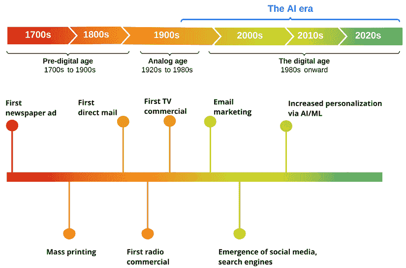

图 1.1：营销简史

让我们在以下章节中看看这些时期的特征。

## 人工智能之前的营销时代

要欣赏人工智能和机器学习对营销的影响，回顾人工智能之前的时代是很重要的。当时，营销策略主要是由广泛的人口统计洞察力决定的，个性化程度不高，对大众媒体的依赖性很大。营销人员被迫撒大网以捕捉潜在客户，客户互动的主要渠道是印刷、电视和广播广告。

传统营销还包括直接邮寄和优惠券等技术。这可以从克莱德·霍普金斯在 20 世纪初提出的科学广告原则中看出，这些原则与今天的定向数字广告有类似的作用。然而，尽管在一定程度上有效，但这些策略缺乏现代消费者所期望的精确性和个性化。为了说明数字时代之前的营销格局，让我们看看以下传统营销材料的例子，包括传单和广告牌，突出了对物理媒体的依赖性，用于广告：


图 1.2：传统营销材料示例，如传单、广告牌和印刷广告

## 数字营销的出现

在 1990 年代，数字革命带来了第一次重大转变，引入了工具和平台，使营销人员能够更直接地定位受众，更准确地衡量他们活动的效果。电子邮件营销、社交媒体和搜索引擎的出现，基于客户偏好、行为和反馈的数据，为客户互动开辟了新的途径。


图 1.3：数字营销通过社交媒体、搜索引擎和电子邮件营销的定向活动革命性地改变了广告

然而，到了 2000 年初，数据的庞大数量和复杂性很快就超过了人类分析和有效利用这些数据的能力。这种复杂性源于来自各种数字渠道的大量数据生成，包括不同的格式、数据创建的高速度以及实时处理的需求。这一数据景观凸显了旧有数字技术的局限性，如基本的电子邮件营销和静态网页广告，这些技术无法轻易处理以获得可操作的见解。这为人工智能和机器学习在营销中的整合奠定了基础。

**数字营销的影响**

数字时代带来了目标广告和可衡量的活动，这得益于搜索引擎、社交媒体和电子邮件营销等新兴工具的出现，这些工具为人工智能和机器学习在营销中的应用铺平了道路。

## 人工智能/机器学习在营销中的整合

人工智能时代可以追溯到 20 世纪中叶，当时人工智能首次成为热门词汇，但实际的技术应用开始得较晚。在营销领域，自 2010 年代初以来，人工智能和机器学习技术已被用于利用大数据进行洞察和个性化。这些技术的出现标志着营销领域的转型时代，并实现了前所未有的精确性和效率。

营销人员现在可以超越基本的人口统计目标，创建高度个性化的体验，并以惊人的准确性预测客户需求和行为。在我们讨论这个最关键的时期时，我们将探讨这些技术如何正在改变营销的各个方面，从客户细分到实时分析和个性化内容创作。

以下是将人工智能/机器学习整合到营销中的关键方面：

+   **预测分析和客户洞察**：本书的第二部分，我们将探讨人工智能和机器学习如何通过预测分析赋予营销人员能力，根据历史数据预测未来客户行为。这种预测能力使得主动营销策略成为可能，从预测客户需求和偏好到识别潜在的流失风险。此外，我们还将讨论如聚类等解释技术，这些技术有助于理解客户细分和行为，而无需必然预测未来结果。聚类可以揭示客户数据中的自然分组。这些聚类有助于识别不同的市场细分，并指导更精准的营销策略。营销人员可以利用这些洞察实现以下目标：

    +   **做出明智的决策**：预测分析有助于识别哪些营销策略可能成功。例如，零售商可以预测哪些产品在假日季节可能受欢迎，从而优化库存和营销活动。

    +   **优化营销努力**：预测分析可以帮助营销人员更有效地分配资源。例如，公司可以使用这些洞察来确定推出促销活动或接触目标受众的最有效渠道，从而最大化投资回报率。

    +   **培养更牢固的客户关系**：营销人员可以通过预测客户需求和偏好来创建更个性化的体验。例如，流媒体服务可以根据用户的过去观看习惯推荐节目和电影，这增加了用户满意度和忠诚度。

+   **大规模个性化**：人工智能/机器学习对营销最显著的贡献之一是能够在规模上个性化营销努力。在本书的**第三部分**中，我们介绍了如何以惊人的精确度细分受众，我们可以利用这一点来定制信息、优惠和内容，以匹配每位客户的兴趣和需求。这种程度的个性化导致更有效的营销策略，增强了客户体验，并提高了参与度和转化率。

    例如，一个在线书店可以根据用户的过去购买和浏览历史向不同用户推荐不同的书籍。一个经常购买悬疑小说的客户可能会收到该类别的最新发行书籍的个性化推荐，而另一个更喜欢自助书籍的客户可能会看到最新自助书籍的精选列表。

    **个性化为什么重要？**

    在规模上实现个性化是人工智能/机器学习在营销中的一个重大成就，它允许根据个人客户偏好定制信息、优惠和内容，从而推动参与度和转化率。

+   **通用人工智能在内容创作和分析中的作用**：展望未来，本书的**第四部分**探讨了通用人工智能（**GenAI**）在营销中的作用以及它如何可能进一步革命化内容创作、客户参与和分析。通用人工智能模型能够生成文本、图像甚至视频内容，为动态和个性化的营销材料提供新的可能性。例如，一个在线零售商使用通用人工智能为水瓶创建数字广告，针对不同的用户画像。对于注重环保、希望过可持续生活的消费者，可以展示一个在自然风光中设置的相关产品放置的图像，如图中左侧所示。相反，对于城市爱好者，右侧的图像将同一产品放置在一个繁忙的城市场景中。


图 1.4：通用人工智能针对不同的用户画像定制广告，为注重环保的消费者使用自然风光，为城市爱好者使用城市景观

此外，由人工智能和机器学习驱动的先进分析继续优化客户细分、活动优化和投资回报率测量，确保营销策略既有效又高效。

**通用人工智能的重要性**

通用人工智能模型处于营销下一场演变的尖端，能够创建个性化的文本、图像和视频内容，并提供更深入的客户洞察的高级分析。

随着我们站在这个新时代的门槛上，人工智能和机器学习在营销策略中的整合不再是奢侈品，而是品牌为了保持竞争力并与受众产生共鸣的必需品。我们通过人工智能/机器学习在营销演变中的旅程不仅突显了一场技术革命，而且标志着品牌与客户连接方式的根本转变，提供了更加个性化、吸引人和有意义的互动。

# 营销中的核心数据科学技术

将数据科学技术应用于动态的营销领域对于理解复杂的客户数据、优化营销策略和提升客户体验至关重要。本书全面探讨了塑造现代营销努力的核心数据科学方法，其中**第二章**专注于通过**关键绩效指标**（**KPIs**）解码营销绩效。这将为您理解这些技术如何驱动洞察力提供一个坚实的基础。

当对客户数据和预测分析如何结合有深入理解时，结果可以是一个高度有效的客户策略。以下图表说明了涉及的一般端到端流程，从数据收集开始，以定向营销活动结束：

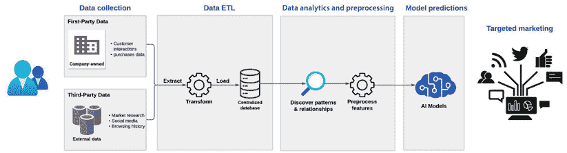

图 1.5：数据驱动营销的一般流程，从数据收集到使用数据科学技术进行定向活动

在以下小节中，我们将更深入地探讨特定的数据科学技术，如预测分析、客户细分和 A/B 测试，以及洞察力和实际示例，以说明它们在现代营销中的应用。

## 预测分析

预测分析是数据科学在营销中的基石。在**第三章**中，我们讨论了如何利用统计模型和机器学习算法根据历史数据预测未来客户行为。这一应用范围从预测最有可能进行购买的客户到识别有流失风险的客户。通过利用预测分析，营销人员可以就资源分配、如何设计他们的活动以及何时与客户互动做出明智的决策。利用季节性和趋势的能力，这是**第四章**的重点，在定制营销策略以利用可预测的消费行为和市场动态的波动中也发挥着重要作用。

**预测分析预测客户行为**

预测模型通过分析历史数据并识别可以反映未来行为的模式来提高预测的准确性。

不同预测模型及其在营销中的应用示例包括：

+   **电子邮件打开可能性**：预测客户打开营销邮件的概率，以优化活动参与度。例如，预测客户更有可能在工作日打开发送的电子邮件。

+   **购买/转化可能性**：预测哪些客户更有可能购买，有助于提高转化率的有针对性的营销。例如，识别对类似产品表示过兴趣的客户。

+   **客户流失预测**：识别有流失风险的客户，使营销人员能够实施有针对性的保留策略以最小化流失。例如，检测在一定时期内未与该服务互动的用户。

+   **网站登录频率建模**：分析登录模式，以告知参与策略并定制再参与活动。例如，认识到每天登录的用户更有可能参与新功能。

+   **联系频率建模**：确定最佳接触频率，以保持参与度而不使客户感到疲惫。例如，发现每周更新可以保持客户参与度而不引起疲劳。

## 理解客户数据

理解客户数据对于任何数据驱动的营销策略至关重要。这包括以下不同类型的信息：

+   **人口统计细节**：了解年龄、性别、位置和其他人口统计因素有助于营销人员针对特定受众定制他们的信息。例如，根据季节性向寒冷地区的客户推广冬季服装。

+   **购买历史**：分析过去的购买行为使营销人员能够推荐类似或互补的产品，增加未来销售的可能性。例如，向最近购买智能手机的客户建议配件。

+   **在线行为模式**：跟踪网站导航和交互数据有助于营销人员优化网站布局和内容，以提升用户体验和参与度。例如，识别购买过程中的常见退出点，并简化结账程序以降低购物车放弃率。

+   **社交媒体互动**：监控社交媒体活动和情绪使营销人员能够实时与客户互动，解决他们的需求或担忧。例如，利用社交媒体平台上的客户反馈来改进产品和服务的营销活动，以及基于热门讨论创建与受众产生共鸣的活动。

对于营销人员来说，挑战不仅在于收集这些数据，还在于分析和解释它们以获得可操作的见解。我们将在第五章中进一步讨论这一点，其中我们将探讨情感分析如何增强客户洞察，提供对客户情绪和意见的更好理解，从而为有针对性的营销活动提供信息。稍后，第七章将介绍个性化产品推荐，展示分析和解释客户数据以获得可操作见解的重要性。

**从数据到洞察**

数据挖掘和分析可以将原始且可能令人不知所措的数据转化为宝贵的客户洞察金矿。

## A/B 测试和实验

A/B 测试是营销人员工具箱中的基本数据科学技术。它涉及比较营销资产的两个版本，如网页、电子邮件或广告，以确定在给定的指标上哪个版本表现更好，例如点击率或转化率。一个版本（A）作为控制组，而另一个版本（B）是 A 的变体，包含旨在提高性能的更改。如*第六章*所述，A/B 测试基于统计假设检验，提供了一种基于实际客户行为而非直觉的数据驱动方法来优化营销材料和策略。以下流程图简要描述了从 A/B 测试创建到最终选择更有效版本的步骤：

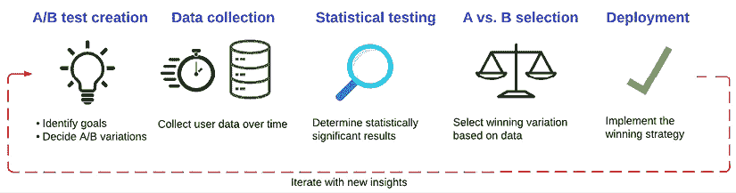

图 1.6：A/B 测试过程总结

## 细分和定位

数据科学在营销中的基本应用之一是**细分**。这个过程涉及根据共享的特征或行为将广泛的客户群划分为更小的子群体。例如，聚类分析等技术使营销人员能够识别其受众中的不同细分市场，从而实现更精准和个性化的营销努力。通过了解每个细分市场的具体需求和偏好，营销人员可以调整他们的信息、优惠和内容，使其与目标受众产生更深的共鸣。在*第八章*中进一步探讨了细分的方法和益处，其中我们强调数据科学如何帮助营销人员识别其受众中的不同细分市场。

**针对定制内容的细分**

细分对于确保预期的信息传达给理想的目标群体至关重要。

## 客户终身价值建模

**客户终身价值**（**CLV**）提供了关于客户在其与品牌的关系中预期产生多少收入的见解。CLV 建模是最大化营销努力盈利性的关键方面，我们将在*第二章*中讨论。数据科学技术允许营销人员为单个客户或细分市场建模和计算 CLV，提供在优先考虑营销努力、优化客户获取成本和培养与高价值客户长期关系方面极具价值的见解。

**CLV 在长期中的价值**

CLV 建模从长期视角看待客户关系，有助于在客户获取和保留方面取得更好的结果。

## 集成 AI 以增强洞察力

AI 与数据科学技术的集成标志着营销分析的重大飞跃。第九章至第十一章重点介绍使用零样本学习创建引人入胜的内容，使用少量样本学习增强品牌存在感，以及使用检索增强生成进行微定位，展示了 AI 算法如何在大规模数据集中分析复杂数据集以识别模式和获得新的见解。第十二章进一步探讨了 AI/ML 在营销中的未来格局，突出了即将到来的趋势以及新的 AI 创新塑造营销策略的潜力。

在实施这些强大的 AI/ML 能力的同时，我们还必须了解伦理考虑和治理框架，以确保我们遵循负责任的营销实践，这将是第十三章的重点。

**关键 GenAI 概念**

以下 GenAI 概念将在本书的第四部分中详细讨论：

+   **零样本学习**：在没有先前训练示例的情况下预测新类别

+   **少量样本学习和迁移学习**：使用少量训练示例进行预测

+   **检索增强生成**（**RAG**）：结合数据检索和响应生成以获得更准确的输出

# 为 AI/ML 项目设置 Python 环境

对于相对较新的 AI/ML 世界的营销人员来说，设置一个健壮的 Python 环境是解锁数据科学在营销策略中潜力的第一步技术步骤。Python 以其简洁和强大的库而闻名，是当今技术公司中大多数 AI/ML 项目的基石。本节将指导您设置针对营销项目优化的 Python 环境，确保您拥有必要的工具和库。Python 的魅力在于其庞大的库生态系统，这些库专为数据分析、机器学习、**自然语言处理**（**NLP**）等设计。对于 AI/ML 项目，由于 Anaconda 发行版在管理包和环境方面的简便性，强烈推荐使用它。让我们看看如何开始。

## 安装 Anaconda 发行版

访问 Anaconda 网站[`www.anaconda.com/download`](https://www.anaconda.com/download)，下载 Python 3 的安装程序。一旦下载了 Anaconda 发行版，您可以按照安装说明进行操作，创建一个新的环境。这可以通过打开一个终端窗口并输入以下命令来完成：

```py
conda create --name ai_marketing python=3.8
conda activate ai_marketing 
```

运行这些命令后，您应该有一个名为`ai_marketing`的新 Python 环境，其中安装并激活了 Python 3.8。此环境将帮助您有效地管理 AI/ML 项目的依赖项，将它们与系统上的其他项目隔离开来。

## 安装 AI/ML 所需的 Python 库

在你的环境设置完成后，下一步是安装将推动你的 AI/ML 营销项目的关键 Python 库。以下是一些 AI/ML 项目的基本 Python 库，按其一般功能分组。你可以使用 Anaconda 通过以下终端命令安装这些库：

+   NumPy 和 pandas 用于数据处理：

    ```py
    conda install numpy pandas 
    ```

+   Matplotlib 和 Seaborn 用于数据可视化：

    ```py
    conda install matplotlib seaborn 
    ```

+   scikit-learn 用于机器学习：

    ```py
    conda install scikit-learn 
    ```

+   TensorFlow 和 Keras 用于深度学习：

    ```py
    conda install tensorflow keras 
    ```

+   NLTK 和 spaCy 用于 NLP：

    ```py
    conda install nltk spacy 
    ```

+   Hugging Face 的 Transformers 用于高级 NLP 和生成式 AI：

    ```py
    pip install transformers 
    ```

## 将你的环境与 JupyterLab 集成

JupyterLab 提供了一个理想的交互式编码环境，非常适合数据探索、可视化和逐步展示 AI/ML 分析。这可以通过以下终端命令安装：

```py
conda install jupyterlab 
```

要启动 JupyterLab，在那里你可以创建和管理你的笔记本，请在终端中键入以下内容：

```py
jupyter lab 
```

你现在应该在新启动的浏览器窗口中看到类似于以下屏幕的界面：

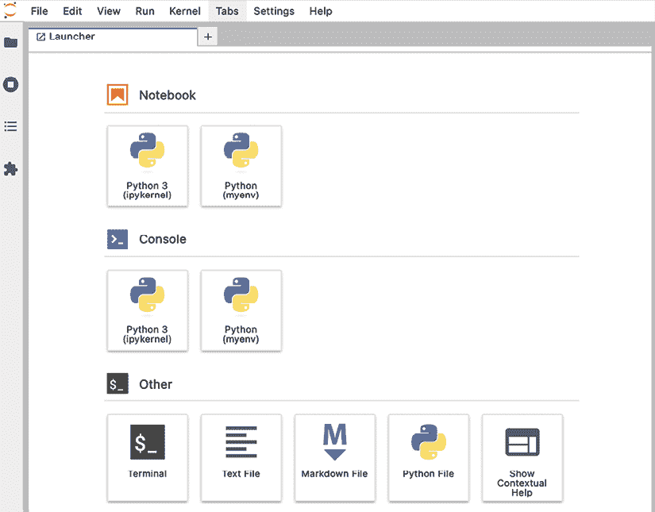

图 1.7：启动后的 JupyterLab UI 图像

## 验证你的设置

为了确保一切设置正确，请在 Jupyter 笔记本中运行一个简单的 Python 脚本来验证关键库的安装。点击 *图 1.7* 下方的 *笔记本* 标题下的图标，并键入以下代码行：

```py
import numpy as np
import pandas as pd
import matplotlib.pyplot as plt
import sklearn
import tensorflow as tf
import transformers
print("Environment setup successful!") 
```

按 *Shift* + *Enter* 将执行单元格中的代码：

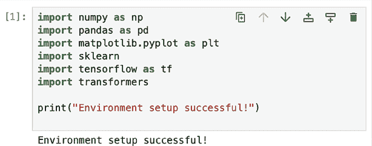

图 1.8：环境设置成功消息

## 在 Jupyter 笔记本中导航

+   使用你的 Jupyter 笔记本，你现在可以按步骤编写、运行和记录你的 Python 代码。你可以在 jupyter.org 网站上找到广泛的文档和教程。以下是一些基本知识，帮助你开始：

+   **创建新单元格**：你可以通过点击工具栏顶部的 **+** 按钮来向你的笔记本添加新单元格。这将直接在你当前选择下方插入一个新单元格。

+   **运行单元格**：要执行单元格中的代码，请选择单元格，然后按 *Shift* + *Enter* 或点击工具栏中的 *运行* 按钮。这将运行代码并在单元格下方显示任何输出。

你也可以使用 *Ctrl* + *Enter* 来运行单元格而不移动到下一个单元格。

+   **更改单元格类型**：Jupyter Notebook 支持不同类型的单元格，包括用于 Python 代码的代码单元格和用于文本的 Markdown 单元格。

你可以使用工具栏中的下拉菜单更改单元格类型。选择 *代码* 用于 Python 代码或 *Markdown* 用于叙述文本、方程式或 HTML。

+   **使用 Markdown 进行文档编写**：Markdown 单元允许你添加格式化文本、项目符号、编号列表、超链接、图片等，使你的笔记本更易于阅读和信息丰富。基本的 Markdown 语法包括：

    +   `#` 用于标题（例如，`# 标题 1`，`## 标题 2`）

    +   `–` 或 `*` 用于项目符号列表

    +   `1.`, `2.` 等，用于编号列表

    +   `` `code` `` 用于内联代码

    +   `链接文本` 用于超链接

    +   `替代文本` 用于图片

+   **保存和共享笔记本**：通过点击工具栏中的**保存**图标或使用 *Ctrl* + *S*（或在 Mac 上使用 *Cmd* + *S*）来定期保存您的笔记本。

您可以通过从**文件** -> **下载为**菜单下载各种格式（包括`.ipynb`、`HTML`、`PDF`等）来共享您的笔记本。

+   **提高效率的快捷键**：Jupyter 支持几个键盘快捷键用于常见操作。按 *Esc* 进入命令模式，在那里您可以：

    +   使用 *A* 在当前单元格上方插入一个新单元格。

    +   使用 *B* 在下面插入一个新单元格。

    +   使用 *M* 将当前单元格切换到 Markdown 单元格。

    +   使用 *Y* 将其切换回代码单元格。

    +   使用 *D*，*D*（按 *D* 两次）来删除当前单元格。

# 训练您的第一个机器学习模型

随着我们开始在营销中应用 AI/ML，了解任何数据科学项目中涉及的基本步骤至关重要。Iris 数据集是一个经典的分类示例，由于其简单性和信息性特征，在机器学习中得到了广泛的应用。这将通过以下步骤为您提供一个动手实践，介绍在 Jupyter Notebook 环境中执行 AI/ML 数据分析的端到端过程：

+   第 1 步：导入必要的库

+   第 2 步：加载数据

+   第 3 步：探索性数据分析（EDA）

+   第 4 步：数据预处理

+   第 5 步：模型训练

+   第 6 步：评估模型

## 第 1 步：导入必要的库

在进入步骤之前，让我们首先使用以下代码导入所有必需的库：

```py
import pandas as pd
import seaborn as sns
import matplotlib.pyplot as plt
from sklearn.datasets import load_iris
from sklearn.model_selection import train_test_split
from sklearn.preprocessing import StandardScaler
from sklearn.tree import DecisionTreeClassifier, plot_tree
from sklearn.metrics import precision_score, recall_score, f1_score 
```

## 第 2 步：加载数据

Iris 数据集包含 150 条鸢尾花记录，包括它们的萼片和花瓣的测量以及花的种类。Scikit-learn 提供了轻松访问此数据集并将其加载到 pandas DataFrame 的方法：

```py
iris = load_iris()
iris_df = pd.DataFrame(data=iris.data, columns=iris.feature_names)
iris_df['species'] = iris.target_names[iris.target]
iris_df.head() 
```

一旦将代码输入到您的 Jupyter 笔记本并运行，它应该如下所示：

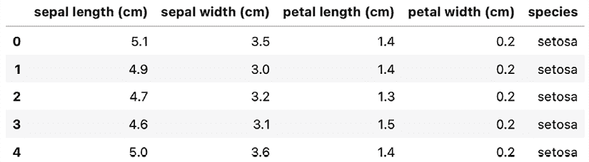

图 1.9：Iris 数据集前 5 行的视图

## 第 3 步：探索性数据分析

在加载数据集后，是时候深入挖掘潜在的数据特征了：

1.  我们可以通过以下命令首先了解我们数据的结构：

    ```py
    print(iris_df.info()) 
    ```

这将给出以下输出：

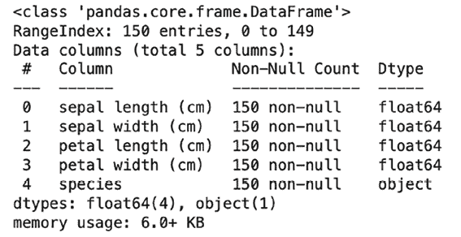

图 1.10：Iris 数据集的数据结构视图

上述结果使我们深入了解数据结构，包括列名和数据类型、非空计数（缺失值可能会显著影响机器学习模型的表现），以及内存使用（在管理计算资源时很有用，尤其是在处理大型数据集时）。

1.  接下来，我们可以可视化特征的分布，以了解我们处理的数据的性质。直方图是通过将数据分成区间或“桶”并显示每个桶中数据点的数量来总结数值数据分布的图形表示：

    ```py
    iris_df.hist(figsize=(12, 8), bins=20)
    plt.subtitle('Feature Distribution')
    plt.show() 
    ```

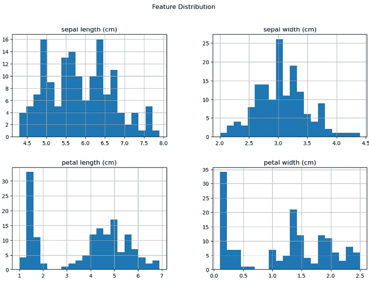

图 1.11：Iris 数据集中特征分布的直方图

红色鸢尾花数据集的特征直方图为我们提供了关于其特征特性的宝贵见解，包括它们的分布形状（它们是钟形还是偏斜的），异常值和异常情况（这些可以显著影响模型性能），以及特征可分性（如果一个特征始终落入一个与其他物种重叠不多的物种分类中，它可能对该物种是一个好的预测因子）。

1.  最后，我们可以利用散点图来可视化特征之间的成对关系，并使用配对图来深入了解每个特征如何与其他物种中的其他特征相互作用。我们可以通过以下方式生成特征对的散点图：

    ```py
    sns.scatterplot(x='sepal length (cm)', y='sepal width (cm)', hue='species', data=iris_df)
    plt.title('Sepal Length vs. Sepal Width')
    plt.show()
    sns.scatterplot(x='petal length (cm)', y='petal width (cm)', hue='species', data=iris_df)
    plt.title('Petal Length vs. Petal Width')
    plt.show() 
    ```

这给我们以下输出：

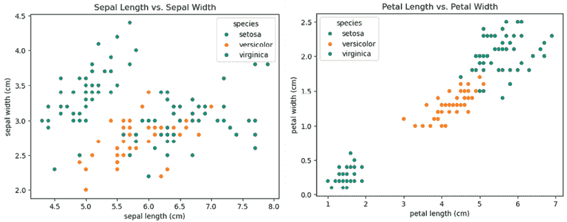

图 1.12：红色鸢尾花数据集中不同物种特征之间的成对关系散点图

如上图散点图所示，花瓣长度和花瓣宽度可能表现出明显的物种聚类，表明它们是物种分类的强预测因子。

配对图通过显示数据集中每对特征的散点图提供了更全面的视角。此外，对角线上的直方图提供了每个特征的分布，按物种分段：

```py
sns.pairplot(iris_df, hue='species')
plt.show() 
```

这会产生以下输出：

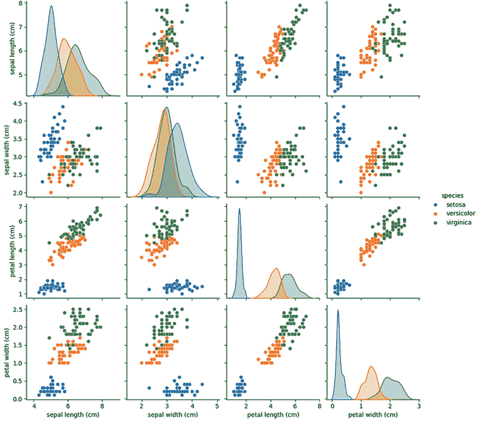

图 1.13：红色鸢尾花数据集的配对图，显示每对特征的散点图和对角线上的直方图

上述配对图使我们能够快速识别哪些特征具有线性关系或多个维度上物种之间的清晰分离。例如，花瓣长度和花瓣宽度的组合显示出物种之间的明显分离，表明这些特征特别适用于分类任务。对角线上的直方图有助于理解每个物种内每个特征的分布，提供了如何利用这些分布进行预测建模的见解。例如，如果一个特征在物种内显示出紧密、定义良好的分布，这表明该特征是该物种的可靠预测因子。相反，在物种内分布较宽的特征可能作为预测因子不太可靠。

**可视化 EDA 的重要性**

可视化 EDA 是建模过程中的一个强大第一步。通过识别模式、集群和异常值，我们可以就特征选择、预处理和选择机器学习模型做出明智的决定。

## 第 4 步：为机器学习准备数据

下一个关键步骤是为机器学习准备我们的数据。这个过程通常涉及为模型选择特征，将数据分为训练集和测试集，有时还需要将特征转换为更适合你计划使用的算法。

在像这里给出的监督学习任务中，我们区分特征（自变量）和目标（因变量）。在`Iris`数据集中：

+   *特征*包括测量值：花瓣长度、花瓣宽度、花萼长度和花萼宽度。

+   *目标*是鸢尾花植物的物种。

对于我们的示例，我们将遵循以下步骤：

1.  我们使用所有四个测量值作为特征来预测鸢尾花植物的物种，这使得这是一个多类分类问题：

    ```py
    X = iris_df[['sepal length (cm)', 'sepal width (cm)', 'petal length (cm)', 'petal width (cm)']]
    y = iris_df['species'] 
    ```

1.  为了评估机器学习模型的表现，我们将数据集分为训练集和测试集。训练集用于训练模型，测试集用于评估其在未见数据上的性能。常见的拆分比例是 80%用于训练，20%用于测试。我们可以使用 scikit-learn 的`train_test_split`函数轻松拆分数据：

    ```py
    X_train, X_test, y_train, y_test = train_test_split(X, y, test_size=0.2, random_state=42) 
    ```

**数据拆分的重要性**

将数据分为训练集和测试集是机器学习中的一个基本实践。这有助于准确评估模型的性能，并确保模型能够很好地泛化到新的、未见过的数据。通过在不同的数据集上进行训练和测试，我们降低了过拟合的风险，即模型在训练数据上表现良好，但在新数据上表现不佳。

1.  一些机器学习算法对数据的规模很敏感。例如，计算数据点之间距离的算法（如 K 最近邻算法）可能会受到不同尺度的特征的影响。可以通过以下代码应用特征缩放：

    ```py
    scaler = StandardScaler()
    X_train_scaled = scaler.fit_transform(X_train)
    X_test_scaled = scaler.transform(X_test)
    X_train_scaled_df = pd.DataFrame(X_train_scaled, columns=X_train.columns)
    X_train_scaled_df.head() 
    ```

这将给出以下输出：

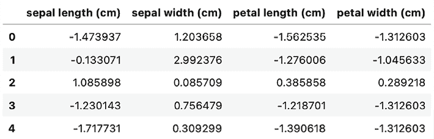

图 1.14：鸢尾花数据集前 5 行的缩放特征

现在，每个特征值都围绕 0 中心，具有单位方差。这一步对于某些对数据规模敏感的机器学习算法至关重要，并确保每个特征按比例对最终模型做出贡献。

## 第 5 步：训练模型

在加载数据、探索和准备数据后，我们现在可以继续到机器学习项目中最激动人心的部分之一：训练模型。对于这个示例，我们将使用决策树分类器，这是一种多才多艺的机器学习算法，适用于分类任务，易于理解和解释，因为它模仿人类的决策过程。决策树将帮助我们根据我们之前准备的特征预测鸢尾花植物的物种。

决策树通过从根节点到某个叶节点的路径对实例进行分类，该叶节点提供了实例的分类。树中的每个节点代表正在分类的实例中的一个特征，每个分支代表节点可以假设的值。我们可以使用 scikit-learn 训练我们的决策树分类器：

```py
dt_classifier = DecisionTreeClassifier(random_state=42)
dt_classifier.fit(X_train, y_train) 
```

模型训练完成后，我们可以使用它进行预测。我们将使用测试集中的特征来预测鸢尾花植物的物种：

```py
y_pred = dt_classifier.predict(X_test)
print("First few predictions:", y_pred[:5]) 
```

以下是其输出：

```py
First few predictions: ['versicolor' 'setosa' 'virginica' 'versicolor' 'versicolor'] 
```

**为什么使用决策树？**

决策树是分类任务中的一种流行选择，因为它们不需要太多的数据准备，易于解释和可视化，并且可以处理数值数据和分类数据。对于 ML 初学者来说，决策树提供了一种清晰直观的方式来理解模型训练和预测的基本原理。

可视化决策树可以提供模型如何做出决策的见解：

```py
plt.figure(figsize=(20,10))
plot_tree(dt_classifier, filled=True, feature_names=iris.feature_names, class_names=iris.target_names.tolist()) 
```

这给我们以下输出：

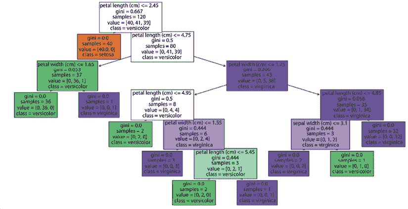

图 1.15：基于 Iris 数据集构建的决策树分类器的可视化

上述可视化显示了树在特征上的分割，这些分割的标准，以及最终预测的叶节点，这些预测基于落入该叶节点的训练样本中的多数类。对于 ML 新手来说，看到这个过程可以阐明看似简单的算法如何有效地分类实例。可视化你的模型还可以突出模型可能过度拟合的区域，通过创建过于复杂的决策路径。

## 第 6 步：评估模型

最后一步是使用模型在测试集上的预测并评估其性能。这一步至关重要，因为它帮助我们了解我们的模型在未见数据上的泛化能力。

使用训练好的决策树分类器，我们现在可以计算精确率、召回率和 F1 分数。让我们看看它们究竟是什么：

+   精确率衡量正预测的准确性。它是真正例预测与总正预测（包括真正例和假正例）的比率。高精确率表明模型在正预测方面是可靠的。

+   召回率（或灵敏度）衡量模型捕捉所有实际正例的能力。它是真正例预测与总实际正例（包括真正例和假阴性）的比率。高召回率意味着模型擅长捕捉正例，而不会遗漏很多。

+   F1 分数是精确率和召回率的调和平均数，提供了一个单一指标来评估它们之间的平衡。F1 分数在 1（完美的精确率和召回率）时达到最佳值，在 0 时达到最差值。

我们将使用 scikit-learn 中的内置函数来计算这些指标。然后，这些预测可以与实际物种进行比较，以评估我们模型的某些性能指标：

```py
precision = precision_score(y_test, y_pred, average='macro')
recall = recall_score(y_test, y_pred, average='macro')
f1 = f1_score(y_test, y_pred, average='macro')
print(f"Precision: {precision:.2f}")
print(f"Recall: {recall:.2f}")
print(f"F1-Score: {f1:.2f}") 
```

这给我们以下输出：

```py
Precision: 1.00
Recall: 1.00
F1-Score: 1.00 
```

在精确度、召回率和 F1 分数上达到 1.0 的分数是卓越的，表明模型在测试集上表现出完美的性能；然而，在现实场景中，尤其是在复杂和嘈杂的数据中，这样的完美分数是罕见的，应该谨慎对待，因为它们可能并不总是反映模型泛化到未见数据的能力。Iris 数据集相对较小且结构良好，类之间有明确的区别。因此，这种简单性使得与真实世界数据集相比，更容易实现高性能指标，因为真实世界数据集的训练和评估通常更复杂。正如我们将在未来的章节中讨论的，进一步的输出诊断，如混淆矩阵，也可以用来深入了解模型的优势和劣势。

**理解模型性能**

模型准确率是评估机器学习模型有效性的一个重要指标。接近 1.0 的准确率表明有很高的正确预测水平。然而，考虑其他指标，如精确度、召回率和混淆矩阵，进行更全面的评估也很重要，尤其是在类别不平衡的数据集中。

恭喜！通过完成这些步骤——训练模型、进行预测和评估其性能——你已经掌握了机器学习项目的基本工作流程。在这里你练习的技能和概念可以直接应用于后续章节中你将要执行的创建有效、数据驱动型营销活动的练习。

# 摘要

在本章中，我们通过设置一个针对人工智能/机器学习项目定制的 Python 环境开始了我们的基础之旅，重点关注营销领域。我们还提供了一段时间内的营销概述，并给你介绍了一些关于该领域目前状况的背景信息。以 Iris 数据集作为一个实际例子，我们带你了解了加载数据、执行 EDA、准备数据用于机器学习以及最后训练和可视化模型的基本步骤。我们还为理解这些步骤如何转化为营销分析奠定了基础。这个练习展示了 Python 的通用性和其丰富的库生态系统，突出了它们在数据处理、机器学习、自然语言处理和数据可视化中的作用。

虽然这个例子与营销没有直接关系，但它教授了你在现实世界中可能面临的营销挑战（如客户细分、预测分析和活动优化）中直接可用的基本技能。熟悉这些流程为你应对更复杂和专业的营销数据分析提供了坚实的基础。数据科学工作的迭代和探索性，提供了灵活的技术来测试假设、可视化数据和分享见解。这就是它对有效分析如此有用的原因。随着我们继续前进，本章中介绍的工具、技术和原则将成为我们探索更高级 AI/ML 应用的基石。进入 AI/ML 驱动的营销之旅充满了利用数据获得战略优势、增强客户参与和推动业务增长的机会。在设置好 Python 环境和完成初步 ML 项目后，你现在可以深入探索 AI 和 ML 在营销中的变革潜力。

在*第二章*中，我们将讨论使用 KPI 解码营销绩效的核心概念，为您提供有效衡量和优化营销策略的基本工具。

# 加入我们书籍的 Discord 空间

加入我们的 Discord 社区，与志同道合的人见面，并在以下地点与超过 5000 名成员一起学习：

[`packt.link/genai`](https://packt.link/genai)


