# 第二章：使用 KPI 解码营销表现

每个数据驱动或 AI/ML 驱动的营销策略都以一系列优化和增强目标开始，这些目标与关键性能指标相关联。这些关键性能指标或措施通常被称为**关键绩效指标（KPI**），它们有助于你跟踪营销活动的表现并定义营销努力的成功标准。在本章中，我们将定义并探讨一些在数字和数据驱动营销中常用的 KPI，包括**转化率**、**获取成本**（CPA）、**客户终身价值**（CLV）和**投资回报率**（ROI）。

在本章中，我们将讨论一组常用的营销 KPI，它们能告诉你关于你的营销活动的哪些信息，以及如何利用它们进一步改进和优化你的营销策略和业务成果。我们将以一个保险产品营销数据集为例，说明如何使用 Python 及其数据分析与可视化库，如`pandas, numpy, matplotlib`和`plotly`，来分析、可视化和从营销 KPI 中获取洞察。

在本章中，我们将特别涵盖以下主题：

+   理解营销 KPI

+   使用 Python 计算和可视化 KPI

+   使用 KPI 跟踪营销表现

**源代码和数据**：[`github.com/PacktPublishing/Machine-Learning-and-Generative-AI-for-Marketing/tree/main/ch.2`](https://github.com/PacktPublishing/Machine-Learning-and-Generative-AI-for-Marketing/tree/main/ch.2)

**数据来源**：[`www.kaggle.com/datasets/pankajjsh06/ibm-watson-marketing-customer-value-data`](https://www.kaggle.com/datasets/pankajjsh06/ibm-watson-marketing-customer-value-data)

# 理解营销 KPI

作为营销人员或营销数据科学家，KPI 是衡量任何营销努力成功与失败的关键。在开展任何营销活动之前，正确使用和定义 KPI 对于有效衡量营销成功与失败至关重要。然而，KPI 的不当使用可能导致收集到错误信息，并常常浪费大量财务和人力资源，这对业务产生直接的负面影响。

例如，如果你的营销目标是提高目标群体（即，阿尔法世代）的品牌知名度，但你没有正确地分解营销内容印象的来源（即，文本与图片与视频，或 YouTube 与 Instagram 与 TikTok，或网红推荐与付费广告），那么它可能讲述的故事与实际情况完全不同。在本节中，我们将回顾一些常用的 KPI，并在接下来的章节中继续讨论其实施和实际应用案例。

**什么是 KPI？**

KPI 是关键绩效指标，用于衡量和量化实现特定目标或目标的进展。KPI 帮助组织识别优势和劣势，并在商业的各个方面，如营销、财务、销售和运营，做出基于数据的决策。

在营销漏斗的每个阶段，都有与之相关的 KPI。以下图表展示了一个典型营销漏斗的总结以及每个阶段常用的某些 KPI。

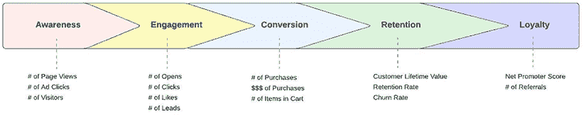

图 2.1：典型营销漏斗的不同阶段

现在，让我们更详细地看看这些阶段中的每一个。

## **意识阶段**

在**意识**阶段，目标是让客户了解您的组织和企业产品。因此，品牌建设和曝光是最终的市场营销目标。在这个阶段衡量营销活动成功的一些典型 KPI 包括**页面浏览量**、**广告点击量**、**访问者数量**和**SEO 排名**。关键在于优化营销支出以实现最大的品牌印象和曝光。

## **参与阶段**

在**参与**阶段，目标是开始与潜在客户互动并建立关系。您可能希望潜在客户通过打开电子邮件、阅读通讯、点击链接和注册活动来与您的组织和企业产品互动。在这个阶段衡量营销活动成功的一些关键指标或 KPI 包括**打开次数**、**点击次数**、**点赞次数**和**合格潜在客户数量**。

特别是，跟踪潜在客户的数量以及潜在客户的质量与未来的潜在收入直接相关。这里要记住的关键指标或度量是**每次点击成本**（CPL），其计算公式为：

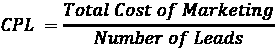

在这个阶段，跟踪 CPL（每次点击成本）的起伏对于成功的营销活动至关重要，因为 CPL 的上升表明您的营销策略效率正在下降。

## **转化阶段**

**转化**阶段是我们收获所有辛勤工作的地方。对于不同类型的客户，转化的定义可能不同。对于电子商务企业，转化可能意味着潜在客户进行商品购买。对于媒体企业，转化可能意味着潜在客户注册或支付订阅费以获取通讯。无论如何，这是潜在客户成为客户的时候。在这个阶段要关注的某些关键指标包括**购买次数**、**购买金额**、**订阅次数**或**购物车中的商品数量**。

在这个阶段，跟踪转化率对于衡量营销活动的成功和失败至关重要。转化率很简单：


跟踪转化率的起伏变化非常重要，因为下降的转化率可能表明在这一阶段的营销策略效率低下、产品功能不足或市场兴趣转移。除了跟踪这一关键绩效指标（KPI）之外，深入了解转化率起伏背后的驱动因素更为重要。我们将在下一节进一步探讨一些可以采取的方法来深入了解转化率，并在下一章中更详细地讨论，揭示转化率起伏背后的驱动因素和因素。

## 保留阶段

在*保留*阶段，你专注于将客户转变为回头客，为客户提供持续的价值，并使他们坚持使用你的服务或产品。保留客户并将他们转变为一致的回头客与产生稳定的收入流直接相关。一些关键指标包括**客户保留率**（CRR）、**客户流失率**（CCR）、**客户终身价值**（CLV）和**获取成本**（CPA）。

CRR 和 CCR 可以使用以下方程计算：

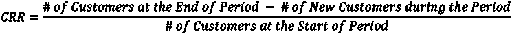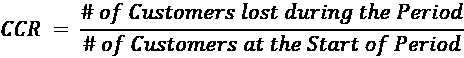

上升的 CRR 表明客户认为你的服务和产品具有持续使用价值；另一方面，CCR 的增加则表明相反的情况。客户流失可能有多种原因，深入数据以了解潜在原因是构建这一阶段成功营销策略的关键。我们将在下一节讨论如何从不同角度审视数据，以全面理解某些客户行为，并在下一章中讨论更深入的分析技术，包括使用机器学习。

在*保留*阶段，理解 CLV 和 CPA 对可持续业务至关重要。即使 CLV 很高，每个客户都能带来显著收入，但如果 CPA 超过 CLV，那么这将是一个净负面的业务。尽管计算 CLV 并不简单，但 CPA 和 CLV 的公式如下：

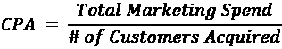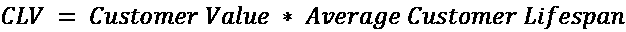

正如你可能注意到的，CLV 公式中的*客户价值*可能取决于许多因素，例如业务类型和价值定义。我们将在第八章从人工智能/机器学习的角度深入探讨 CLV 的估算，但本节的关键要点是 CPA 抵消 CLV，对这两个 KPI 的适当测量和优化是*保留*阶段成功营销策略的关键路径。

## 忠诚阶段

这个阶段是您的客户成为您服务或产品的倡导者，并通过推荐、口碑或评论带来更多新线索和客户。向这些忠诚客户表示感谢，帮助他们传播您的服务产品信息，并继续与您的忠诚客户建立强大的人际关系和联系。

所讨论的所有关键指标对于这个阶段都是相关且重要的，需要持续监控。例如，页面访问次数和页面浏览次数，这些是*意识*阶段的 KPI 之一，仍然适用于这个阶段，这样您可以持续监控和评估忠诚客户群体的兴趣水平。点击次数和点赞数，这些是*参与*阶段的 KPI，例如，在*忠诚度*阶段仍然相关，这样您可以跟踪这一客户群体的持续参与。购买数量和金额，以及保留率和流失率，这些是*转化*和*保留*阶段的 KPI 之一，仍然需要监控，因为这些忠诚客户是给企业带来最稳定收入流的人。

除了上述 KPI 之外，**净推荐值**（**NPS**）、*推荐数量*和*评论数量*也可以是*忠诚度*阶段需要监控的其他重要 KPI。

为了获得 NPS，需要进行调查以收集客户反馈，并根据调查结果，按照以下公式计算 NPS：

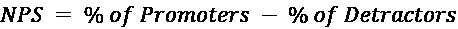

例如，如果 60%的调查受访者是推荐者，10%的受访者是贬低者，那么你的 NPS 将是 50。NPS 的范围从-100 到 100，分数越高，客户对您服务和产品的满意度就越高。定期进行此类满意度调查并监控 NPS 是明智的，因为不解决 NPS 下降问题可能会导致客户流失率增加和转化率降低。

我们已经涵盖了客户旅程和营销漏斗的关键阶段，以及如何为每个阶段制定 KPI 来跟踪营销漏斗的健康状况，以及如何衡量每个阶段的营销策略的成功与失败。你不仅需要持续监控 KPI，还需要深入数据以识别漏斗中哪些部分存在弱点，以及不同客户群体对不同的营销策略有何不同的行为。在下一节中，我们将以保险营销数据集为例，使用 Python 讨论如何将这些知识应用到实践中，并开始生成可重复使用和可追踪的 KPI，并从这些 KPI 中得出可操作的项目。

# 使用 Python 从数据中计算和可视化 KPI

在我们已经讨论的各种营销 KPI 的基础上，让我们深入探讨一些这些 KPI 在现实世界中的潜在应用案例，如何计算和可视化它们，以及如何解释它们以进行进一步的数据驱动决策。我们将使用一个保险产品营销数据集作为示例。

从财务角度来看，营销的成功在于以更少的支出带来更多的收入。跟踪和衡量这一点最直接的方法是查看转化率、客户终身价值（CLV）和客户获取成本（CPA）。转化率告诉我们转化为付费客户的潜在客户的百分比，CLV 告诉我们每个获取的客户的估计收入，CPA 告诉我们获取一个付费客户所需的成本。通过结合这三个 KPI，我们可以理解投资回报率（ROI）和对净收入的贡献。

使用上述示例数据集，让我们讨论如何使用 Python 来衡量这些关键绩效指标（KPIs），帮助生成更深入的见解，并最终影响更高效和更好的营销策略的决策过程。

## 转化率

我们将在这些数据中查看的第一个 KPI 是*转化率*。记得从上一节中，转化率是转化为购买产品的潜在客户的百分比。在这个数据的上下文中，转化为的是在`Response`列中响应*是*的潜在客户。

### 整体转化率

为了计算整体转化率，我们使用`pandas`库：

1.  假设数据文件名为`data.csv`，你可以使用以下代码导入并读取数据到`DataFrame`中：

    ```py
    import pandas as pd
    df = pd.read_csv("./data.csv") 
    ```

1.  接下来，我们需要将`Response`列中的文本响应转换为二进制值 0 或 1，这样我们就可以轻松地计算转化率。执行此操作的代码如下：

    ```py
    df["conversion"] = df["Response"].apply(lambda x: 1 if x == "Yes" else 0) 
    ```

1.  为了使用这些数据计算整体转化率，你只需将新创建的`conversion`列中的值取平均值，如下面的代码所示：

    ```py
    df["conversion"].mean() 
    ```

1.  一种可视化和轻松理解整体转化率的方法是使用饼图，这是展示数据中不同段落的组成或分解的绝佳方式。生成此类饼图的代码如下：

    ```py
    ax = df.groupby("conversion")["Customer"].count().reset_index().plot.pie(
        figsize=(5, 5),
        y="Customer",
        autopct='%1.1f%%',
        legend=False,
        labels=["No Conversion", "Conversion"],
        explode=[0.05, 0.05]
    )
    ax.set_ylabel(None) 
    ```

在这里，我们首先按列分组，按段计数客户数量。这导致了已转化客户与未转化客户的数量。

1.  然后，我们为这两个群体绘制饼图。结果如下所示：

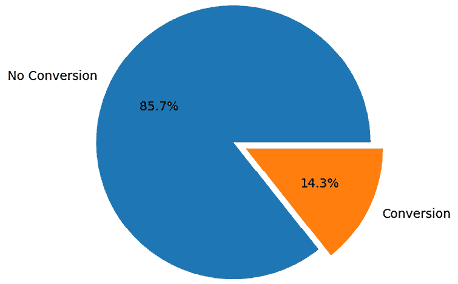

图 2.2：转化率与未转化的饼图

如明显可见，大多数潜在客户没有转化。只有 14.3%的合格潜在客户转化为保单续费或对续费优惠做出了*是*的响应。这在营销中通常是这种情况。通常，转化率非常低，甚至在数字营销中低个位数的转化率并不异常。

该图表本身很有洞察力，因为它有助于业务利益相关者了解目标潜在客户中有多少比例成功转化，但这还不够。为了全面了解数据对我们转化率的说明，我们需要从多个角度来审视。

### 人口统计学和转化率

深入挖掘以生成更多关于转化率的洞察的一种方法是查看客户的人口统计学特征及其可能对转化率的影响。例如，在我们的数据中，有一个名为`收入`的列。我们可以根据不同的收入水平来分解转化率，以了解数据可能告诉我们关于收入和转化率之间关系的故事。

在我们的示例数据中，报告的收入范围从 0 美元到 100,000 美元。为了便于理解和更好的可视化，我们将将其分为 10 个收入级别，并检查收入和转化率之间的关系，如下面的代码所示：

```py
df["income_category"] = df["Income"].apply(
    lambda x: 0 if x == 0 else x//10000
)
income_conversion = df.groupby("income_category")["conversion"].mean() * 100
ax = (
    income_conversion
).plot.bar(
    figsize=(5, 5),
    rot=45,
)
ax.set_xticklabels(["$0" if x == 0 else f"${x}0-{x+1}0k" for x in income_conversion.index])
ax.set_ylabel("Conversion Rate (%)")
ax.set_xlabel("Reported Income")
ax.set_title("Conversion Rate across Reported Income") 
```

此代码的输出如下：

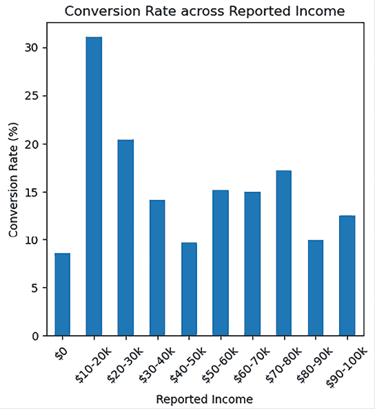

图 2.3：不同收入段的转化率柱状图

如从此柱状图可见，收入在 10k 至 20k 之间的人群具有最高的转化率。另一个值得注意的有趣点是，此图表显示双峰分布，一个在 10-20k，另一个在 70-80k。最后，报告收入为 0 的客户似乎显示出最低的转化率。

尝试使用其他人口统计学变量，如性别、教育和婚姻状况来分解转化率！

### 销售渠道和转化率

客户如何被接触也可能是影响转化率的一个关键因素。我们可以根据`销售渠道`来分解转化率，如下面的代码所示，以了解销售渠道和转化率之间的关系：

```py
ax = (
    df.groupby("Sales Channel")["conversion"].mean() * 100
).plot.bar(
    figsize=(5, 5),
    rot=45
)
ax.set_ylabel("Conversion Rate (%)")
ax.set_title("Conversion Rate per Sales Channel") 
```

生成的柱状图如下：

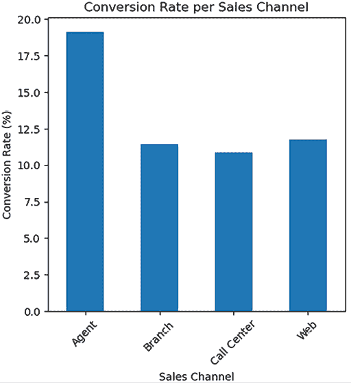

图 2.4：不同销售渠道的转化率柱状图

如此图表所示，当客户通过`代理商`接触时，转化的可能性最高。其他三个渠道，即`分支`、`呼叫中心`和`网络`，在转化率方面具有相似的可能性。这可能与代理商与客户之间的个人联系以及个人互动如何影响客户转化倾向有关。

并非令人惊讶的是，不同销售渠道的转化率构成如下：

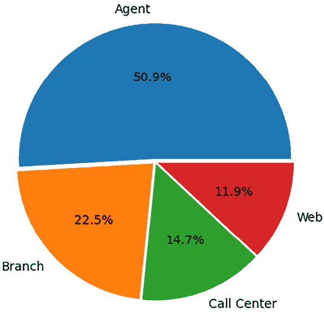

图 2.5：不同销售渠道的转化率饼图

生成此饼图的代码如下：

```py
sales_channel_count = df.groupby("Sales Channel")["conversion"].sum()
ax = sales_channel_count.reset_index().plot.pie(
    figsize=(5, 5),
    y="conversion",
    autopct='%1.1f%%',
    legend=False,
    labels=sales_channel_count.index,
    explode=[0.02]*df["Sales Channel"].nunique()
)
ax.set_ylabel(None) 
```

此饼图表明，在转化中，略高于 50%是通过`代理商`互动实现的，其次是`分支`，然后是`呼叫中心`和`网络`对转化贡献的影响相似。

总结来说，从不同角度看待转化率告诉我们关于它们的不同故事。它告诉我们，低收入（$10-20k）和高收入（$70-80k）人群的转化率很强，而中等收入（$40-50k）和$0 报告收入人群的转化率较弱。它还提供了关于哪些营销渠道在本次续订营销活动中效果最好的洞察，显示在四个渠道中，代理商联系效果最好。基于这些 KPI 分析，我们更好地了解了哪些方面需要改进，哪些方面已知效果良好。

尝试更深入地研究转化率，不仅与其他变量，如续订优惠类型和车辆类别，还与多个变量，如销售渠道和州或教育以及政策和车辆尺寸一起研究。

将隐藏的洞察力带到表面！

## CLV

如前所述，CLV 是计算 ROI 的关键指标之一，因为它告诉我们每位客户带来的潜在收入。在本节中，我们将利用数据集中给出的预计算 CLV。然而，我们将在第八章中深入讨论如何为每位客户构建和预测 CLV。为了专注于 KPI 并从 KPI 中得出可操作的项目和洞察力，我们将在本章中使用给定的 CLV。

### 总体 CLV

使用`pandas`库，有多种方式来理解 CLV 的分布。一种方式是使用 DataFrame 的`describe`函数，如下所示：

```py
df["Customer Lifetime Value"].describe() 
```

此代码将显示以下输出中的分布：

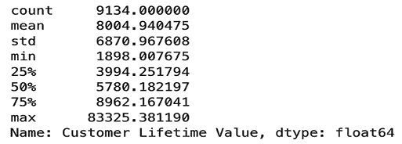

图 2.6：CLV 的分布

如您所见，`describe`函数为我们提供了关于`客户终身价值`列的高级分布信息，其中平均 CLV 为$8,004.94，中位数为$5,780.18。另一种查看分布的方式是使用箱线图，通过 DataFrame 的`plot.box`函数实现，如下所示代码：

```py
df["Customer Lifetime Value"].plot.box() 
```

这给我们以下输出：

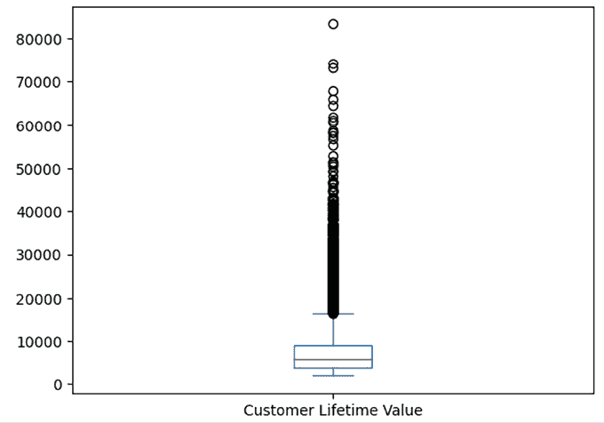

图 2.7：CLV 的箱线图

如上图中的箱线图所示，存在一个非常长的尾部或一组异常值。这与`describe`函数的输出相吻合，其中平均值远高于中位数，这表明存在长尾。这种数据偏斜性也如以下直方图所示可见：

```py
ax=df["Customer Lifetime Value"].hist(bins=25)
plt.show() 
```

然后，我们看到以下输出：

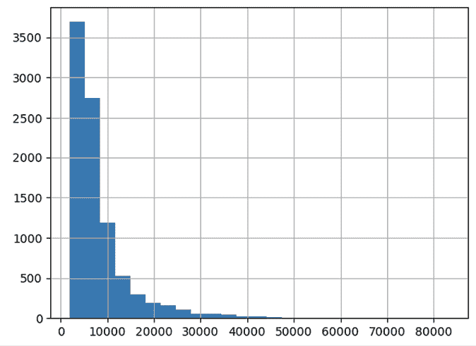

图 2.8：CLV 的直方图

如直方图所示，右侧有一个长尾，这与之前箱线图和描述性统计输出中显示的异常值相对应。

从市场营销和商业角度来看，这意味着大多数客户的终身价值将低于$10,000，并且将有一小部分高知名度客户的终身价值超过$10,000。由于这些群体对不同营销策略的反应和反应会有很大差异，因此考虑针对不同客户群体个性化营销信息和方法将是明智的。我们将在第七章中深入探讨个性化营销；然而，理解本节中显示的 CLV 和其他 KPI 显示了需要针对不同营销信息进行定位的不同潜在群体是至关重要的。

### 地理定位和 CLV

在分析客户终身价值时，我们不仅应该关注 CLV 的整体分布，还应该从多个角度进行观察。一个角度可以是地理定位以及地理定位如何影响 CLV。在示例保险营销数据集中，有一个名为`State`的列。我们可以使用以下代码分别查看不同州的 CLV：

```py
ax = df.groupby("State")["Customer Lifetime Value"].mean().plot.bar(
    figsize=(5, 5),
    rot=45
)
ax.bar_label(ax.containers[0], fmt='$%.1f')
ax.set_ylabel("Customer Lifetime Value ($)")
ax.set_title("CLV per State") 
```

生成的条形图看起来如下：

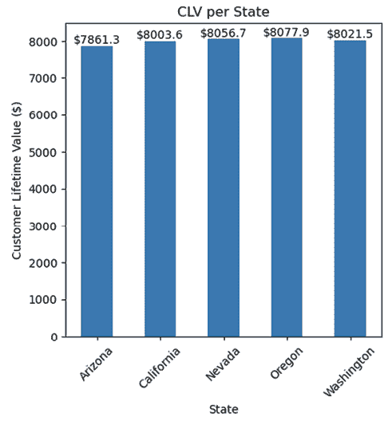

图 2.9：不同州 CLV 的条形图

我们已经使用`groupby`函数根据`State`列对数据进行分组，并计算了`客户终身价值`的平均值。通过使用`plot.bar`函数，我们可以可视化不同州的 CLV。尽管不同州的平均 CLV 相似，但`俄勒冈州`的平均 CLV 最高，而`亚利桑那州`的平均 CLV 最低。

由于同一州内的地区也可能存在差异，我们可以通过以下代码进一步细化分析，按地区类型进行更深入的分组：

```py
ax = df.groupby([
    "State", "Location Code"
])[
    "Customer Lifetime Value"
].mean().unstack().plot.bar(
    figsize=(5, 5),
    rot=45
)
ax.set_ylabel("Customer Lifetime Value ($)")
ax.set_title("CLV per State") 
```

这给我们以下输出：

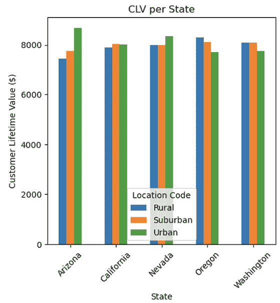

图 2.10：不同州和位置的 CLV 条形图

与之前的图表相比，我们现在不仅按`State`分组，还按`Location Code`分组。这为我们提供了关于不同类型的地区如何进一步影响 CLV 的额外见解。之前，我们已经看到与其他州相比，*亚利桑那州*的整体 CLV 最低；然而，正如这个条形图所示，亚利桑那州的城区 CLV 最高，CLV 的下降主要是由亚利桑那州内的`Rural`和`Suburban`地区驱动的。一般来说，城区的 CLV 高于农村和郊区，除了*俄勒冈州*和*华盛顿州*。俄勒冈州和华盛顿州内的农村地区 CLV 高于城区。从这项练习中可以注意到，从不同角度分析 KPI 可以揭示不同的见解。

### 产品和 CLV

客户购买的产品的不同通常会导致 CLV 的差异。我们可以通过查看`Policy`列来检查我们的数据集中这种关系，该列是客户已购买的保险产品：

```py
ax = df.groupby("Policy")["Customer Lifetime Value"].mean().plot.bar(
    figsize=(5, 5),
    rot=45
)
ax.bar_label(ax.containers[0], fmt='$%.1f', fontsize=6)
ax.set_ylabel("Customer Lifetime Value ($)")
ax.set_title("CLV per Product") 
```

这给我们以下条形图：

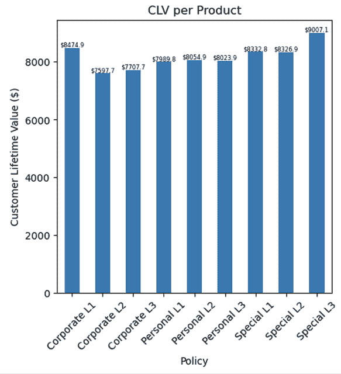

图 2.11：不同产品 CLV 的条形图

通过按`Policy`分组并平均 CLV，我们得到了之前图表中显示的分布。值得注意的是，拥有`Special` `L3`政策或产品的客户具有最高的 CLV，而拥有`Corporate L2`的客户具有最低的 CLV。由于客户购买的产品类型本质上与客户的需求和欲望相关，因此在针对不同的客户群体时应该考虑这一点。使用预测机器学习建模进行个性化营销策略可以是一个更有效地针对不同客户群体的好方法。

## CPA

如前所述，CPA 是衡量营销效果的一个重要指标。获取新客户所花费的成本因业务而异。一些常见的新客户获取营销成本包括通过不同渠道的广告，如电子邮件、邮件、电视、社交媒体、促销商品、电话营销和客户服务电话，以及其他工具，如网站推广、聊天机器人和客户关系管理系统。

正如我们在分析转换率时所见，在我们的保险营销数据集示例中，使用了四个渠道来推广保险续保优惠：`Agent`、`Branch`*、* `Call Center`和`Web`。不幸的是，这个例子中的数据没有每个销售渠道的成本；因此，我们将做一些假设。

让我们假设每个`Agent`销售的成本约为*$200*，每个`Branch`销售的成本约为*$85*，每个`Call Center`销售的成本约为*$30*，每个`Web`销售的成本约为*$2*。在现实世界中，您需要跟踪您使用的每个营销渠道的营销支出。例如，您需要知道每个销售代理通话的每分钟成本，每个在线广告点击的成本，以及每封电子邮件或直接邮件的成本。基于这个假设，我们将为每个客户分配*估计获取成本*，如下所示：

```py
import numpy as np
cost_distr = {
    "Agent": {"avg": 200, "std": 40},
    "Branch": {"avg": 85, "std": 17},
    "Call Center": {"avg": 30, "std": 6},
    "Web": {"avg": 2, "std": 0.5}
}
df["est_acquisition_cost"] = df["Sales Channel"].apply(
    lambda x: np.random.normal(cost_distr[x]["avg"], cost_distr[x]["std"], 1)[0]
) 
```

如您从这段代码中可以看到，我们创建了一个`cost_distr`字典，其中包含了我们对每个营销渠道成本的假设。然后，我们使用`numpy`库的`random.normal`函数从我们的假设中为每条记录生成随机数，并将它们插入到一个列中，即`est_acquisition_cost`，这个列将在接下来的小节中使用：

```py
df["est_acquisition_cost"].describe() 
```

这是从假设分布创建合成数据的一种方法。生成的分布应该看起来像以下这样：

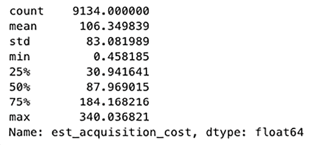

图 2.12：生成的估计获取成本的分布

由于这些数字是从正态分布中随机生成的，所以每次运行此代码时，具体的数字都会有所不同。然而，整体分布将类似于以下输出。

### 总体 CPA

正如我们在上一节中讨论的那样，CPA 是计算为总营销成本除以总转换数，这可以在 Python 中完成，如下面的代码所示：

```py
campaign_cost = df["est_acquisition_cost"].sum() / df["conversion"].sum() 
```

我们只需对 `est_acquisition_cost` 列的所有值求和，这将给出总的营销支出，然后除以转化数量，这是通过在 `conversion` 列的所有值上求和来完成的：

```py
print(f"${campaign_cost:.1f}") 
```

```py
$739.8 
```

`campaign_cost` 的值应该类似于 `$739.8`。

在撰写本文时，`campaign_cost` 的值是 `$739.8`；然而，鉴于我们在使用假设创建合成数据时随机性的本质，这个值每次运行时可能会有所不同，但应该在大致范围内。

### 销售渠道和 CPA

由于不同的销售和营销渠道有不同的成本，CPA 会因渠道而异。我们也可以从我们的数据中观察到这一点。为了计算每个渠道的 CPA，我们只需计算每个渠道的总营销成本，然后除以每个渠道的转化数量，如下面的代码示例所示：

```py
channel_cpa = (
df.groupby("Sales Channel")["est_acquisition_cost"].sum()
/
df.groupby("Sales Channel")["conversion"].sum()
) 
```

在此代码中，我们首先将 `Sales Channel` 列应用 `groupby` 函数，并对 `est_acquisition_cost` 列求和。然后，我们再次将 `Sales Channel` 列应用 `groupby` 函数，但这次是对 `conversion` 列求和。当我们把前一个 `pandas Series` 除以后一个 `pandas Series` 时，它将每个 `Sales Channel` 列的 `est_acquisition_cost` 的总和除以 `conversion` 的总和：

```py
ax = (
    channel_cpa
).plot.bar(
    figsize=(5, 5),
    rot=45
)
ax.bar_label(ax.containers[0], fmt='$%.1f')
ax.set_ylabel("Cost per Acquisition ($)")
ax.set_title("CPA per Sales Channel") 
```

新创建的变量 `channel_cpa` 的条形图看起来如下：

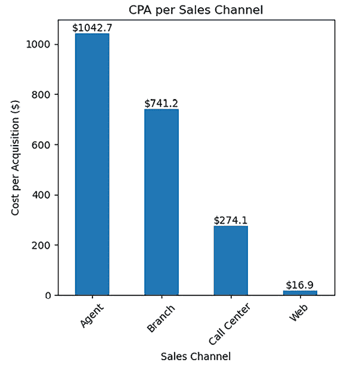

图 2.13：不同销售渠道的 CPA 条形图

如预期的那样，CPA 在 `Agent` 渠道最高，在 `Web` 渠道最低。尽管从 `Agent` 渠道的转化率最高，正如我们在上一节讨论不同销售渠道的转化率时所见，但 **CPA** 仍然是最高的。这是一个很好的例子，说明了管理营销支出的成本与拥有高转化率一样重要。

### 促销活动和 CPA

与 CPA 因销售渠道而异类似，CPA 也可能因营销促销的类型而异。我们也可以从我们的数据集中观察到这一点。为了计算每个促销活动的 CPA，你可以使用以下代码：

```py
promo_cpa = (
df.groupby("Renew Offer Type")["est_acquisition_cost"].sum()
/
df.groupby("Renew Offer Type")["conversion"].sum()
) 
```

在这里，我们按 `Renew Offer Type` 列分组，并对 `est_acquisition_cost` 和 `conversion` 列求和，然后将前者除以后者。得到的条形图如下所示：

```py
ax = (
    promo_cpa
).plot.bar(
    figsize=(5, 5),
    rot=45
)
ax.bar_label(ax.containers[0], fmt='$%.1f')
ax.set_ylabel("Cost per Acquisition ($)")
ax.set_title("CPA per Promotion") 
```

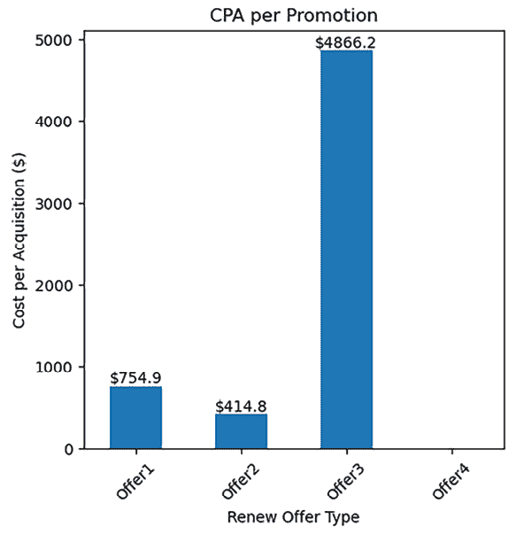

图 2.14：不同促销活动的 CPA 条形图

从这张图表中可以突出两件事。一是 `Offer3` 的 CPA 是最高的，另一个是 `Offer4` 的 CPA 没有显示。`Offer4` 的 CPA 没有显示在这张图表中的原因是没有任何转化。

这可以在你深入研究每个促销活动的转化率时找到，如下所示：

```py
df.groupby("Renew Offer Type")["conversion"].mean() 
```

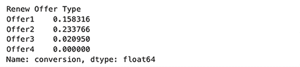

图 2.15：不同续订优惠类型的转化率

虽然这解释了为什么`Offer4`的 CPA 没有在之前的柱状图中显示，因为没有转化，但这仍然不能完全解释为什么`Offer3`的 CPA 如此之高，因为仍然有一些转化。更有趣的是，从以下代码生成的图表显示，`Offer3`的总营销支出在四个促销活动中是第二低的：

```py
ax = df.groupby("Renew Offer Type")["est_acquisition_cost"].sum().plot.bar(
    figsize=(5,5),
    rot=45
)
ax.bar_label(ax.containers[0], fmt='$%.1f')
ax.set_ylabel("Total Cost ($)")
ax.set_title("Total Cost per Promotion") 
```

这里是柱状图：

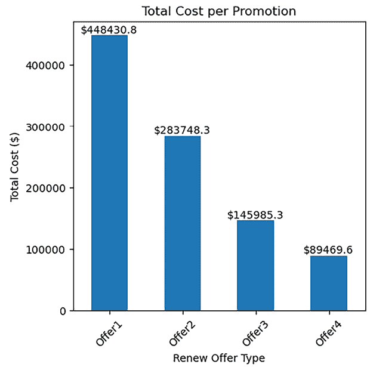

图 2.16：不同促销活动的总成本柱状图

这是一个很好的例子，说明了低转化率如何抵消低营销支出，反之亦然。`Offer1`有最高的营销支出，比`Offer3`高出近 3 倍，因此`Offer1`的高转化率抵消了营销成本，这导致了比`Offer3`低得多的 CPA。另一方面，`Offer3`有第二低的营销支出，但 CPA 最高，因为`Offer3`的低转化率抵消了低营销支出。这表明有必要从各个方面分析 KPI，并理解某些 KPI 起伏的关键因素。

## ROI

我们已经走了很长的路，最终能够计算我们营销活动的 ROI。到目前为止，我们已经分析了的转化率、CLV 和 CPA 将被结合起来得到 ROI，并决定营销资金是否被合理使用。

## 总体 ROI

简而言之，**ROI** 是总收入或利润除以总支出。在我们的例子中，一种方法是计算已转化的客户的“客户终身价值”总和，然后除以“预计获取成本”列的总和，如下面的代码所示：

```py
campaign_cost = df["est_acquisition_cost"].sum()
converted_clv = (df["Customer Lifetime Value"] * df["conversion"]).sum()
print(f"Total CLV: ${converted_clv:,.02f}")
print(f"Total Cost: ${campaign_cost:,.02f}")
print(f"Overall ROI: {(converted_clv-campaign_cost)/campaign_cost:.01f}x") 
```

输出如下：

```py
Total CLV: $10,274,171.74
Total Cost: $972,130.58
Overall ROI: 9.6x 
```

如此输出所示，从已转化的客户中增加的总 CLV 约为 1030 万美元，在我们例子中的总营销支出约为 96.8 万美元。这给我们带来了 9.6 倍的 ROI 或 960%，这表明这次营销活动的价值增加超过了 9.6 倍的开支。如果这是一个具有如此表现的现实世界营销活动，这将是一个杰出的营销活动。通常，5:1 的 ROI 是一个坚实的成果，任何更高的都被认为是很好的。2:1 或以下的 ROI 被认为是令人失望的。

另一种可视化这个 KPI 的有效方法是直观地展示价值流入与流出。展示这种信息的一种方法是使用瀑布图，如下所示：

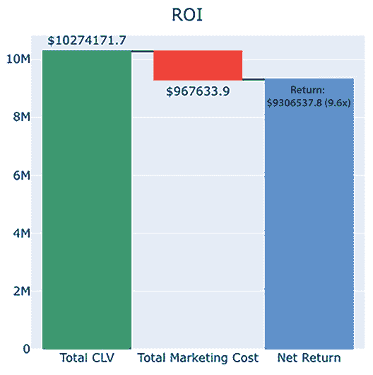

图 2.17：净回报瀑布图

正如你所想象的那样，你可以通过影响价值增加和减少的因素进行分解。例如，你可以通过每个销售渠道可视化价值增加，并展示其如何汇总到总 CLV 增加，以及通过每个销售渠道可视化价值减少，并展示其如何汇总到总营销成本。水图是可视化价值增加和减少以及在一个视图中展示净回报的绝佳方式。以下代码可以使用`plotly`库来可视化水图：

```py
import plotly.graph_objects as go
fig = go.Figure(
    go.Waterfall(
        name = "Waterfall",
        orientation = "v",
        measure = ["relative", "relative", "total"],
        x = ["Total CLV", "Total Marketing Cost", "Net Return"],
        textposition = "outside",
        text = [
            f"${converted_clv:.01f}",
            f"${campaign_cost:.01f}",
            f"Return: ${converted_clv-campaign_cost:.1f} ({(converted_clv-campaign_cost)/campaign_cost:.01f}x)"
        ],
        y = [converted_clv, -campaign_cost, 0],
        connector = {"line":{"color":"rgb(63, 63, 63)"}},
    )
)
fig.update_layout(
    height=500,
    width=500,
    title = "ROI",
    title_x = 0.5,
    showlegend = True
)
fig.show() 
```

如此代码所示，你可以在`plotly`库中使用`Waterfall`对象来创建水图。这里的关键参数包括：

+   `measure`：这是一个值类型的数组。使用`relative`来显示相对值，例如增加和减少，使用`total`来计算总和值。

+   `x`：这是一个 x 坐标的数组，其中包含每个增加和减少的标签。

+   `y`：这是一个 y 坐标的数组，其中包含增加和减少的值。

水图可以是一种直观且高效展示价值流入和流出的方式。尝试将其分解以进一步展示对价值增加和减少有贡献的因素！

### 每个销售渠道的 ROI

如前一小节简要提到的，分析哪些因素以何种方式对 ROI 有贡献，这对于帮助理解哪些营销策略或渠道最有效以及哪些无效非常重要。我们将首先关注的 ROI 角度是*销售渠道*。我们首先要做的是计算净回报并计算每个销售渠道的 ROI，如下所示：

```py
df["return"] = (
df["Customer Lifetime Value"] * df["conversion"]
) - df["est_acquisition_cost"]
channel_roi = (
df.groupby("Sales Channel")["return"].sum()
/
df.groupby("Sales Channel")["est_acquisition_cost"].sum()
) 
```

此代码创建了一个新变量，名为`return`，它是 CLV 减去获取成本，对于未转化的客户，它只是一个负获取成本，因为没有价值增加。然后，通过按`Sales Channel`列分组并除以`return`的总和与`est_acquisition_cost`的总和来计算每个渠道的 ROI。为了可视化每个销售渠道的 ROI，可以使用以下代码：

```py
ax = (
    channel_roi
).plot.bar(
    figsize=(5, 5),
    rot=45
)
ax.bar_label(ax.containers[0], fmt='%.1fx')
ax.set_ylabel("Return on Investment (multiple)")
ax.set_title("ROI per Sales Channel") 
```

生成的图表如下所示：

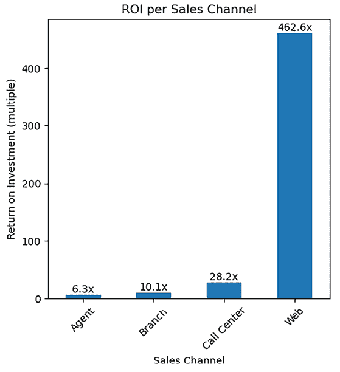

图 2.18：不同销售渠道的 ROI 柱状图

此柱状图表明，`Web`渠道的 ROI 最高，其次是`呼叫中心`渠道，而`代理商`渠道最低。正如你所想象的那样，ROI 与 CPA 呈负相关，与 CLV 呈正相关。

`Web`渠道的低 CPA 可能是导致极高 ROI 的最高贡献因素，因为该销售渠道的转化率与其他渠道相似。另一方面，`代理商`渠道的高 CPA 可能是相对低 ROI 的最关键因素，因为其转化率在四个渠道中是最高的。正如你所见，ROI 及其分解是深入了解如何最佳管理营销成本和产生回报的洞察力 KPI。

### 每个促销的 ROI

最后一个我们将考虑的因素，以理解不同角度的 ROI 动态，是促销类型。我们将查看`Renew Offer Type`如何影响 ROI，如下面的代码所示：

```py
promo_roi = (
    df.groupby("Renew Offer Type")["return"].sum()
    /
    df.groupby("Renew Offer Type")["est_acquisition_cost"].sum()
) 
```

如代码所示，我们按`Renew Offer Type`列分组，并将`return`的总和除以`est_acquisition_cost`的总和。这可以通过以下代码用柱状图可视化：

```py
ax = (
    promo_roi
).plot.bar(
    figsize=(5, 5),
    rot=45,
    color=(promo_roi > 0).map({True: 'cornflowerblue', False: 'salmon'})
)
ax.bar_label(ax.containers[0], fmt='%.1fx')
ax.set_ylabel("Return on Investment (multiple)")
ax.set_title("ROI per Promotion") 
```

我们得到了如下柱状图：

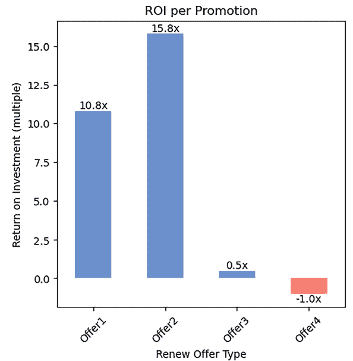

图 2.19：不同优惠的 ROI 柱状图

此柱状图显示`Offer2`具有最高的 ROI，其次是`Offer1`，而`Offer4`最低。正如之前发现的，`Offer4`没有转化；因此，所有的营销支出都损失了，导致-100%的回报或-1x ROI。

如前所述，从 CPA 的讨论中可以预期，`Offer3`在`Offer4`之后具有最低的 ROI。这可能是由于`Offer3`的高 CPA，这负面影响了 ROI。另一方面，`Offer2`的 CPA 最低，这有助于它在促销优惠中拥有最高的 ROI。

## KPI 之间的相关性

如我们所见，有多个因素影响着 ROI，这反过来又需要从不同的角度进行分析。我们已经检查了从*Engagement*阶段到*Conversion*阶段的基本 KPI 及其解释，直到本节。

不仅可以通过一组定义的因素来检查 KPI，我们还可以利用更数据驱动和统计的方法来揭示各种指标之间的关系。一种方法可能是分析 KPI 之间的相关性，以及 KPI 与其他因素之间的相关性。*热力图*是一种巧妙的方式来可视化这些关系，并提供对数据中隐藏关系的更直观理解。这种分析技术揭示了不同的 KPI 如何相互关联，以及单个因素如何与 KPI 相关联，为优化营销活动提供战略见解。以下代码可以用于使用我们的示例数据构建热力图：

```py
import seaborn as sns
import matplotlib.pyplot as plt
correlation_matrix = df[[
    'Income', 'Monthly Premium Auto',
    'Months Since Last Claim', 'Months Since Policy Inception',
    'Number of Open Complaints', 'Number of Policies', 'Total Claim Amount',
    'conversion', 'Customer Lifetime Value', 'est_acquisition_cost', 'return'
]].corr()
plt.figure(figsize=(10, 8))
sns.heatmap(correlation_matrix, annot=True, fmt=".2f", cmap='coolwarm', cbar=True)
plt.title('Correlation Matrix Heatmap of Marketing KPIs')
plt.show() 
```

此代码生成了以下热力图：

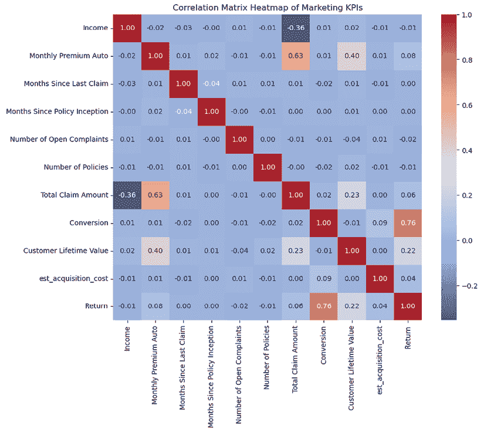

图 2.20：变量之间关系的热力图

值得注意的是，*Monthly Premium Auto*与*Total Claim Amount*之间的相关性突出，系数为**0.632**，表明存在强烈的正相关关系。这表明随着汽车保险月保费的增加，索赔总额也会增加。这样的见解对于希望平衡保费率与索赔成本以最大化利润的保险公司来说是无价的。

此外，*收入*和*总索赔金额*显示出显著的负相关系数**-0.355**，突显出高收入客户往往有较低的总索赔金额。这可能意味着高收入细分市场可能代表较低的风险特征，这可能会指导针对性的营销策略或保费调整。

在分析和构建 KPI 时要富有创意，并专注于构建一个好的数据故事！

# 使用 KPI 跟踪营销表现

计算和构建 KPI 是解码营销表现的关键方面之一，但跟踪 KPI 的进展和变化同样重要的是掌握营销表现的重要方面。有无数种方法可以可视化 KPI，以及无数种跟踪和与关键利益相关者共享 KPI 的方法。在本节中，我们将分享一些常见的可视化方法和持续 KPI 跟踪的方法。

## 选择合适的 KPI 可视化

当展示 KPI 数据时，选择合适的可视化方式在有效传达洞察力方面起着至关重要的作用。以下是一些有助于选择最合适的可视化类型的指南：

+   **柱状图**：非常适合比较不同类别之间的数量，例如不同地区或产品的销售表现。

+   **饼图**：用于说明整体的组成或比例，如市场份额分布。

+   **散点图**：用于探索两个变量之间的关系，例如广告支出与销售收入。

+   **折线图**：适合展示随时间变化的趋势，例如网站流量增长或销售趋势。

+   **面积图**：通常用于比较一个或多个系列随时间的变化，或数值，例如不同渠道的网站流量。

+   **热图**：适用于展示大型数据集中相关或模式，例如各种营销关键绩效指标（KPI）之间的关系。

+   **漏斗图**：非常适合可视化过程中的各个阶段，尤其是在营销或销售漏斗中的转化率方面特别有用。

+   **瀑布图**：常用于展示总和为总值的增加和减少，例如现金流。

## 持续的 KPI 跟踪

现在我们已经尝试了在给定数据集的情况下如何在 Python 中计算 KPI，你可能想知道接下来是什么。你也可能会质疑你是否每次想要报告 KPI 指标时都必须运行你的 Python 脚本。通常采用并推荐用于持续 KPI 跟踪的方法是利用可访问的仪表板。

**什么是仪表板？**

仪表板是一种展示数据多种视觉形式的方式，以便利益相关者可以轻松地共享和消化信息。它包括需要监控的关键绩效指标和其他业务指标。仪表板的范围不仅限于跟踪营销 KPI，还可以用于各种业务线，如财务、运营、技术、客户服务等。

在商业环境中，仪表盘通常与数据仓库相连，以便可视化的数据直接从数据仓库中摄取。这使得仪表盘能够进行实时或接近实时的更新。如果数据仓库中的数据被更新，仪表盘上的视觉元素也会自动更新。通常，数据是复杂的、混乱的或不容易消化的，因此会构建数据摄取管道来将数据转换成更易于消化的结构。跟踪营销 KPI 的典型数据流向仪表盘的流程如下：


图 2.21：数据流向仪表盘的典型流程

数据 ETL 管道开发的详细讨论超出了本书的范围，但这是一个从各种来源*提取*原始数据，将其*转换*成易于使用的格式，并*加载*到数据存储中的过程。提取、转换和加载这三个关键步骤组成了 ETL 的缩写。营销数据的 ETL 管道的成果是易于消化的数据，用于营销 KPI 的计算，然后这些数据在营销仪表盘上被总结和可视化。在行业中，一些常用的仪表盘软件产品包括 Tableau、Power BI 和 Looker。

优秀的 KPI 指标和仪表盘应该能够激发有意义的行动项并协助决策！考虑构建以目标为导向的 KPI 指标和仪表盘，使其针对每个营销目标和计划具体化。

# 摘要

在本章中，我们为构建数据和 AI/ML 驱动的营销模型和策略奠定了坚实的基础。我们讨论了常用的营销 KPI 指标，这些指标不仅帮助业务衡量营销绩效，而且基于通过多层次分析发现的优缺点激发改进的行动项。以一个保险产品营销数据集为例，我们看到了如何使用 Python 来衡量和分析这些 KPI，以便在未来的营销工作中进行进一步的改进和优化。

我们还讨论了如何使用各种仪表盘工具，如 Tableau、Power BI 和 Looker，进行可重复使用的实时 KPI 跟踪。正如每个人所强调的，AI/ML 始于数据以及深入的探索性分析，以决定用哪些数据来训练 AI/ML 模型以及优化什么。本章涵盖的项目和 KPI 将在未来设计和开发先进的营销 AI/ML 模型时派上用场。

在下一章中，我们将学习如何利用数据科学和机器学习算法来揭示营销成功和失败背后的驱动因素。更具体地说，我们将讨论如何使用回归分析和模型来剖析影响营销参与度的因素，如何使用基于树的模型来识别转化背后的驱动因素，以及如何通过因果推断来理解客户流失背后的推理。

# 加入我们书籍的 Discord 空间

加入我们的 Discord 社区，与志同道合的人相聚，并与其他 5000 多名成员一起学习：

[`packt.link/genai`](https://packt.link/genai)


