# 3

# 揭示营销成功的动态

**关键绩效指标**（**KPIs**）擅长捕捉营销活动的当前状态或结果。然而，它们缺乏展示驱动这些结果的能力以及不同因素可能如何影响营销活动的最终结果。我们在上一章简要介绍了如何通过相关性分析进一步分析各种变量和 KPI 之间的关系。在本章中，我们将深入探讨如何利用**数据科学**（**DS**）和**机器学习**（**ML**）技术和工具来揭示营销成功的动态。

本章涉及客户旅程的三个关键阶段：参与、转化和流失。这三种客户行为是优化营销目标的关键组成部分，营销人员经常质疑哪些因素实际上影响了某些结果，例如为什么人们的参与度更多或更少，为什么人们最终转化更多或更少，以及为什么人们流失或没有流失。除了我们在上一章中进行的相关性分析之外，揭示影响营销结果的因素的三个最常见方法包括（1）回归分析，（2）决策树解释和（3）因果推断。在本章中，我们将讨论如何在 Python 中执行这些 ML 技术，以更好地深入理解营销成功和失败背后的驱动因素。

本章将涵盖以下主题：

+   为什么人们会进行回归分析

+   为什么人们会使用决策树解释进行转化

+   为什么人们会使用因果推断进行流失分析

# 为什么人们会进行回归分析

通常，提高参与度是营销的第一步。潜在客户需要首先与公司或产品互动，然后才能转化为付费客户，最终成为重复或忠诚的客户。会有许多因素影响潜在客户如何参与或点击您的营销活动。具有某些社会经济背景的客户可能比其他人更容易被您的服务或产品所吸引。来自某些地区的人可能比其他人更频繁地参与您的营销活动。一些之前接触过您销售的人可能对您的服务或产品有更积极的胃口，从而比其他人有更高的参与度。

理解潜在客户如何与不同组件互动是实现更高参与率和个人化营销的关键。**回归分析**，一个在各个领域广为人知且广泛使用的技巧，通常被认为是机器学习中的基本概念，是一种直观且有效的方法，我们可以用它来理解可能影响目标客户参与度高低的各种组件之间的相互作用。最常用的两种回归分析类型是**线性回归**和**逻辑回归**。

线性回归假设目标变量与其他因素之间存在线性关系。线性关系定义为：


其中 *Y* 是目标变量，即观察到的结果，每个  是可能影响结果的因素，每个  是每个因素对目标变量影响的系数和程度，*a* 是截距。当目标变量是连续变量时，如客户终身价值、销售额和客户任期，线性回归被使用。

另一方面，当目标变量是二元变量时，如`通过` vs. `未通过`，`真` vs. `假`，和 1 vs. 0，使用逻辑回归。当线性回归估计结果值时，逻辑回归估计成功的概率，关系定义为：


其中 log 表示自然对数，*P*(*y* = 1) 是结果为 1 的概率

由于逻辑回归估计结果的概率，它在理解各种因素对二元结果的影响时是一个非常有用的工具，例如客户是否会回应电子邮件营销或是否会点击电子邮件消息。在本节中，我们将使用一个汽车保险营销数据集来讨论如何使用逻辑回归揭示客户参与背后的驱动因素。

**源代码和数据**：

[`github.com/PacktPublishing/Machine-Learning-and-Generative-AI-for-Marketing/blob/main/ch.3/Why%20People%20Engage.ipynb`](https://github.com/PacktPublishing/Machine-Learning-and-Generative-AI-for-Marketing/blob/main/ch.3/Why%20People%20Engage.ipynb)

数据来源：[`www.kaggle.com/datasets/pankajjsh06/ibm-watson-marketing-customer-value-data`](https://www.kaggle.com/datasets/pankajjsh06/ibm-watson-marketing-customer-value-data)

## 目标变量

我们需要做的第一件事是定义我们想要分析的目标或结果。由于我们感兴趣的是了解各种因素如何影响客户参与度，我们将把`响应`变量作为我们的目标变量，它告诉我们客户是否对营销电话做出了回应。以下代码可以用来用`0`编码目标变量，表示客户没有回应，用`1`表示客户做出了回应：

```py
import pandas as pd
df = pd.read_csv("./engage-data.csv")
df["Engaged"] = df["Response"].apply(lambda x: 1 if x == "Yes" else 0) 
```

此代码首先使用 `pandas` 库的 `read_csv` 函数将数据加载到变量 `df` 中，并从 `Response` 列中创建一个新变量 `Engaged`，将 `Yes` 编码为 `1`，将 `No` 编码为 `0`。

## 连续变量

影响结果或目标变量的因素变体主要有两种类型：

+   **连续变量**：这些是具有实数值的变量，可以包括分数或小数，例如货币金额、销售数量和页面浏览量。

+   **分类变量**：这些是有明确选项或类别值的一组离散变量，例如教育水平、性别和客户账户类型。

我们将首先查看我们汽车保险营销数据集中的一些连续变量与目标变量 `Engaged` 之间的关系：

```py
df.describe() 
```


图 3.1：数据集中连续变量的分布

如此截图所示，当我们运行 `df.describe()` 函数时，它显示了连续变量的总体统计信息。在我们的汽车保险示例数据集中，有八个连续变量：`Customer_Lifetime_Value`、`Income`、`Monthly_Premium_Auto`、`Months_Since_Last_Claim`、`Months_Since_Policy_Inception`、`Number_of_Open_Complaints`、`Number_of_Policies` 和 `Total_Claim_Amount`。

为了分析这些变量与结果变量 `Engaged` 之间的关系，我们将使用 `statsmodels` 包中的 `Logit`。拟合逻辑回归模型的代码如下：

```py
import statsmodels.api as sm
continuous_vars = [
    x for x in df.dtypes[(df.dtypes == float) | (df.dtypes == int)].index if x != "Engaged"
]
logit = sm.Logit(
    df['Engaged'],
    df[continuous_vars]
).fit() 
```

在这里，我们首先导入所需的模块 `statsmodels.api`，并定义连续变量 `continuous_vars`。然后，我们可以使用 `statsmodels` 包中的 `Logit` 对象来训练一个逻辑回归模型。我们可以使用以下代码查看训练好的逻辑回归模型：

```py
logit.summary() 
```

这段代码的输出如下所示：

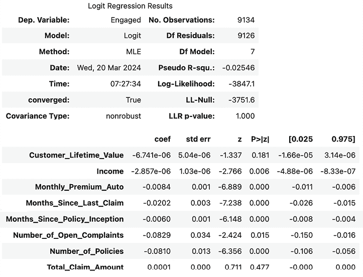

图 3.2：逻辑回归结果摘要

让我们分析这个逻辑回归输出。需要关注的两件最重要的事情是，*coef* 和 *P*>|*z*|。在底部表格的最左侧列，`coef`，代表每个变量的系数。例如，变量 `Monthly_Premium_Auto` 的系数是 `-0.0084`，而变量 `Total_Claim_Amount` 的系数是 `0.0001`。这意味着支付更高月保费的客户不太可能对营销活动做出反应，这与高价值客户通常更难获取并鼓励参与的经验法则相符。另一方面，索赔金额较高的客户更有可能参与，因为他们可能是利用保险政策最多的人。

*P*>|*z*|列表示每个变量对结果的影响的统计显著性。通常认为小于`0.05`的值对结果有显著的统计影响，因为小于`0.05`的 p 值表明有强有力的证据反对无影响的原假设，即这个变量对目标变量没有影响。然而，大于`0.05`的值并不一定意味着它对结果没有任何显著性。你也可能注意到`Customer_Lifetime_Value`和`Income`的系数非常小。

这并不表明它们对结果的影响低。正如你可能猜到的，这两个变量具有货币价值，这两个变量的尺度在千位，这导致了小的系数值，但它们对结果有显著的影响。

## 分类变量

我们已经看到连续变量如何以积极或消极的方式与结果`Engaged`相互作用。那么，关于分类或离散变量呢？在我们的汽车保险示例数据集中，我们有一些分类变量；然而，我们将使用`Education`和`Gender`变量作为例子来讨论在进行回归分析时如何处理分类变量。

### 因式分解

我们可以采取的第一种方法是利用`pandas`库中的`factorize`功能。以`Education`为例，你可以运行以下代码将文本离散变量编码为数值变量：

```py
 labels, levels = df['Education'].factorize() 
```

这个因式分解的结果看起来如下：

```py
labels, levels = df['Education'].factorize()
labels 
```

```py
array([0, 0, 0, ..., 0, 1, 1]) 
```

```py
levels 
```

```py
Index(['Bachelor', 'College', 'Master', 'High School or Below', 'Doctor'], dtype='object') 
factorize function for the Education variable and get the two variables, labels and levels. The newly created labels variable contains numerical values for each record and the levels variable contains information about what each numerical value of the labels variable means. In this example, Bachelor is encoded as 0, College as 1, Master as 2, High School or Below as 3, and Doctor as 4.
```

### 分类

我们可以采取的第二种方法是将分类变量编码为使用`pandas`库中的`Categorical`函数。以下代码展示了如何使用`Categorical`函数的示例：

```py
categories = pd.Categorical(
    df['Education'], 
    categories=['High School or Below', 'Bachelor', 'College', 'Master', 'Doctor'],
categories.categories 
```

```py
Index(['High School or Below', 'Bachelor', 'College', 'Master', 'Doctor'], dtype='object') 
```

```py
categories.codes 
```

```py
array([1, 1, 1, ..., 1, 2, 2], dtype=int8) 
```

`Categorical`函数中的`categories`参数允许你定义类别的顺序。在这里，我们将`Education`类别定义为从`High School or Below`到`Doctor`的顺序。你可以通过调用`categories`属性来访问类别，通过调用`codes`属性来获取每个记录的编码。例如，在我们的案例中，`High School or Below`被编码为`0`，`Bachelor`为`1`，`Doctor`为`4`。

### 虚拟变量

另一种可以采取的方法是将分类变量编码为创建虚拟变量。虚拟变量是每个类别的单热编码变量。

例如，在我们的例子中，可以为`Education`变量创建以下虚拟变量：

```py
pd.get_dummies(df['Education']).head(10) 
```

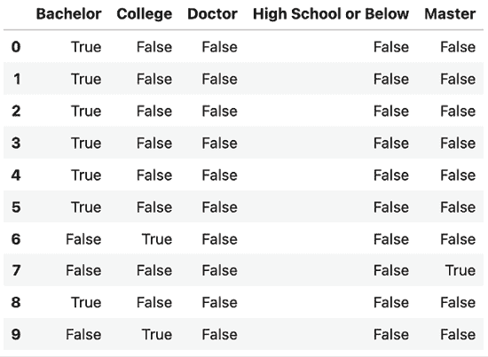

图 3.3：为教育变量创建的虚拟变量

如您从这个例子中看到的，使用了`pandas`库的`get_dummies`函数来为`Education`变量创建虚拟变量。这创建了五个新变量：`Bachelor`、`College`、`Doctor`、`High School or Below`和`Master`。这些新创建的每个变量都是`0/1`（或`False/True`）编码，如果给定记录属于给定类别，则编码为`1`或`True`。

**如何选择用于分类变量编码的方法**

**独热编码**/**虚拟变量**：当变量没有自然顺序时，可以使用这些方法。两种方法都会为每个类别创建二进制变量。请注意，为所有类别创建独热编码和虚拟变量可能会导致数据维度很大，使数据稀疏。因此，您可能希望为独热编码/虚拟变量子选择重要的类别。

**因子化**：当您有没有固有顺序的名义分类变量时，可以使用此方法作为另一种快速高效的方法。

**分类**：当分类变量有自然顺序时，例如教育水平，最好使用指定顺序的`Categorical()`。这确保了编码尊重类别的层次结构，从而在顺序重要的分析中导致准确的模型预测和评估，如 AUC-ROC。

### 回归分析

既然我们已经探讨了可以采取的不同方法来编码分类变量，我们可以运行回归分析来了解一些分类变量如何影响结果。使用上一节中创建的新分类变量`GenderFactorized`和`EducationFactorized`，我们可以使用以下代码拟合逻辑回归模型，以建模`Gender`和`Education`水平对营销参与度水平的影响和影响：

```py
logit = sm.Logit(
    df['Engaged'],
    df[[
        'GenderFactorized',
        'EducationFactorized'
    ]]
).fit() 
```

运行`logit.summary()`将导致以下拟合逻辑回归模型的总结：

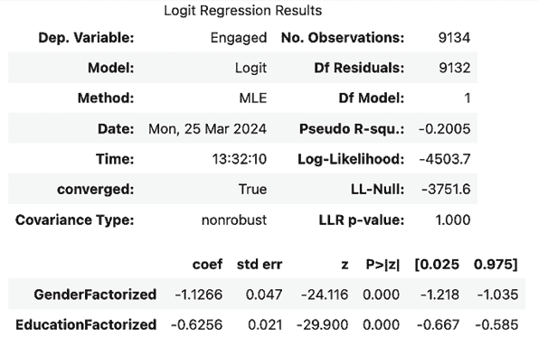

图 3.4：逻辑回归结果总结

如您从这个逻辑回归模型输出中看到的，两个变量`GenderFactorized`和`EducationFactorized`对结果`Engaged`都有负系数或影响。由于`Gender`编码为女性为`0`，男性为`1`，这表明男性比女性不太可能做出回应。

同样，教育水平从 0 编码到 4，拥有负系数表明教育水平越高，客户做出回应的可能性就越小。

除了上一节中回归分析中看到的连续变量的结果外，这些都是很好的见解，显示了各种因素与参与度结果之间的方向关系。

## 交互变量

回归模型擅长识别和估计变量与目标变量之间的线性关系。然而，变量之间可能存在一些关系。例如，收入可能与教育水平高度相关。在回归分析中解决变量内部这种内在关系的一种方法是在以下公式中引入乘法项：


这样，回归模型考虑了具有内在关系的变量之间的交互。Python 中`statsmodels`库中的相同`Logit`可以用于运行包含交互项的回归分析。以下代码将拟合一个包含交互项的逻辑回归模型：

```py
logit = sm.Logit.from_formula(
  data=df,
  formula="Engaged ~ Income + EducationFactorized + Income:EducationFactorized"
).fit()
logit.summary() 
```

如代码所示，我们正在拟合一个包含两个变量`Income`（收入）和`Education`（教育）以及一个交互项`Income x Education`的逻辑回归模型。以下是对拟合逻辑回归模型的总结：


图 3.5：逻辑回归结果总结

观察前两个成分，`Income`（收入）和`EducationFactorized`（教育因素化），这个输出表明`Income`（收入）和`Education`（教育）对参与可能性有积极影响。然而，交互项`Income:EducationFactorized`抵消了`Income`和`Education`的个体积极影响，因为它有一个负系数。在我们的市场营销案例中，这意味着当你比较同一收入水平的客户时，教育水平越高，他们的参与率就越低。同样，这也表明对于具有相同教育水平的客户，他们的收入越高，他们的参与率就越低。正如您从这个例子中可以看到的，通过引入交互项，我们可以更深入地分析变量之间的关系，并获得在单独分析时可能无法揭示的见解。

正如我们在本节中看到的，回归分析是揭示营销努力成功与失败背后驱动因素动态的强大工具。在我们的例子中，我们看到了各种变量如何对客户参与率产生积极和消极的影响。正如所示，回归分析擅长识别各种因素与结果之间的线性关系，并可用于理解因素之间的相互作用。

然而，通常认为回归模型缺乏对变量之间关系的理解。这部分限制是因为我们必须为所有可能的变量间关系引入交互项。正如我们在之前创建`Income`和`Education`交互项时所看到的，我们将不得不构建类似的交互项来处理其他可能的变量间交互。此外，如果您想引入或考虑两个以上变量之间的交互，事情开始变得复杂。

与线性回归分析不同，决策树在处理变量之间的复杂交互方面具有优势。我们将在下一节中检查决策树的使用，该节捕捉了各种因素之间的交互以及这些交互最终如何影响最终结果。

# 为什么人们会通过决策树解释进行转化

一旦潜在客户开始参与您的营销活动，就是开始将他们转化为付费客户的时候了。与各种背景可能影响参与倾向一样，有许多因素影响谁比其他人更频繁地转化。当然，社会经济因素在影响转化率方面始终扮演着至关重要的角色。年龄、地区和性别也可能是不同转化结果的重要因素。月份或季节也可能根据您提供的服务或产品导致转化率的变化。

不仅单个因素，而且各种因素的组合也可能对谁可能转化有重大影响。一个有工作和拥有房产的人比一个拥有房产但已退休的人更有可能为了再融资贷款而转化。一个 25 岁的学生比一个 25 岁的企业家更不可能寻找信用卡。我们简要讨论了如何通过引入交互或乘法因素，回归分析可以帮助识别相互作用的因素如何影响客户行为。另一种揭示为什么某些人比其他人更容易转化的隐藏洞察力的绝佳方法是使用**决策树**及其理解各种因素之间相互作用和关系的能力。

决策树，正如其名所示，通过生长树来从数据中学习。从一个根节点开始，树通过将数据分割成子类别来分支，最终达到叶节点，从叶节点可以了解哪些因素以何种方式受到影响，以到达相应的叶节点。一个决策树的示例可能如下所示：

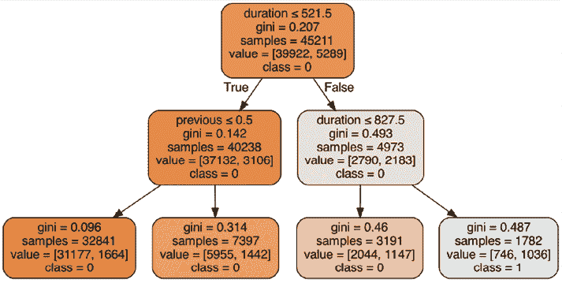

图 3.6：决策树的示例

我们将详细讨论如何使用示例数据集来解释决策树结果，因此我们将进一步解释和讨论留到以后。让我们首先谈谈决策树是如何从每个节点分支出来的。

常用的两种方法用于分割数据或分支到子节点：

+   **Gini 不纯度**：Gini 不纯度衡量一个划分的纯度。Gini 不纯度度量的公式如下：


在这个公式中，*c* 代表类别标签， 代表具有类别标签 *i* 的记录被选中的概率。当树中每个节点的所有记录都是纯的，即所有记录都属于单一目标类别时，Gini 不纯度度量达到 `0`。

+   **熵和信息增益**：熵衡量通过测试的准则分割数据所获得的信息量。熵的公式如下：


至于*基尼系数*，*c*代表类别标签，而代表具有类别标签*i*的记录被选中的概率。将导致熵度量最大变化的分割将用于分支到子节点，因为它表明这将带来最高的信息增益。

关于决策树的基本知识，我们将深入探讨如何应用它来了解是什么因素推动了成功的营销活动，以实现更高的转化率。

**源代码和数据**：

[`github.com/PacktPublishing/Machine-Learning-and-Generative-AI-for-Marketing/blob/main/ch.3/Why%20People%20Convert.ipynb`](https://github.com/PacktPublishing/Machine-Learning-and-Generative-AI-for-Marketing/blob/main/ch.3/Why%20People%20Convert.ipynb )

**数据来源**：

[`archive.ics.uci.edu/dataset/222/bank+marketing`](https://archive.ics.uci.edu/dataset/222/bank+marketing)

## 目标变量

我们将使用一个银行营销数据集来完成这个练习，其中营销活动是将客户转化为订阅定期存款。首先，让我们将数据加载到 DataFrame 中，并编码我们的目标变量。请看以下代码：

```py
df = pd.read_csv("./convert-data.csv", sep=";")
df["conversion"] = df["y"].apply(lambda x: 1 if x == "yes" else 0) 
```

在这里，我们将数据加载到变量`df`中，并将`y`列编码为`1`表示“是”，`0`表示“否”。当你运行`df["conversion"].mean()`时，你应该看到大约 12%的客户已经转化并订阅了定期存款。

## 连续变量与分类变量

对于我们的分析，我们将使用以下变量，它们具有连续值：`age`、`balance`、`duration`、`campaign`和`previous`。你可以使用以下代码来查看这些变量的分布：

```py
continuous_vars = [
    "age", "balance", "duration", "campaign", "previous"
]
df[continuous_vars].describe() 
```

分布如下所示：

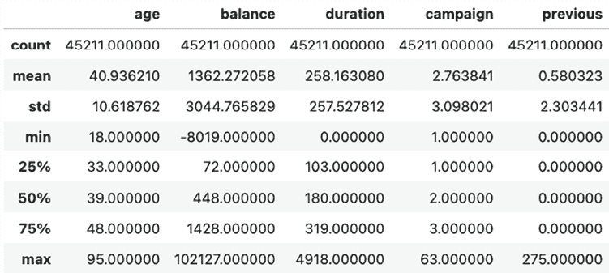

图 3.7：连续变量的分布

与之前的练习类似，这个数据集中也有一些分类变量。我们将首先将第一个离散文本变量`month`转换为数值。如果你查看`month`变量的值，你会注意到这些值是 3 个字母的月份缩写。由于月份有固有的顺序，我们将使用以下代码将这些值转换为相应的数值：

```py
months = ['jan', 'feb', 'mar', 'apr', 'may', 'jun', 'jul', 'aug', 'sep', 'oct', 'nov', 'dec']
df['month'] = df['month'].apply(
    lambda x: months.index(x)+1
) 
```

现在，变量`month`将具有从`1`到`12`的值，分别对应于从`January`到`December`的月份。

变量`job`是另一个分类变量。与`month`变量不同，`job`变量在其内部没有固有的顺序。因此，我们将为每个`job`类别创建虚拟变量，这些变量将对应于相应的职业类别进行独热编码。请看以下代码：

```py
jobs_encoded_df = pd.get_dummies(df['job']
jobs_encoded_df.columns = ['job_%s' % x for x in jobs_encoded_df.columns] 
```

此代码的输出将如下所示：

```py
jobs_encoded_df.head() 
```


图 3.8：编码后的虚拟变量

与之前的练习类似，我们使用了 `get_dummies` 函数为数据集中的每个工作类别创建虚拟变量。您可以使用以下代码将这些新创建的虚拟变量添加回 DataFrame：

```py
df = pd.concat([df, jobs_encoded_df], axis=1) 
```

使用此代码运行后，DataFrame `df` 将会添加新创建的 `job` 列的虚拟变量。

最后，我们还将使用以下代码将 `marital` 和 `housing` 变量进行编码：

```py
marital_encoded_df = pd.get_dummies(df['marital'])
marital_encoded_df.columns = ['marital_%s' % x for x in marital_encoded_df.columns]
df = pd.concat([df, marital_encoded_df], axis=1)
df['housing'] = df['housing'].apply(lambda x: 1 if x == 'yes' else 0) 
```

如此代码所示，我们为婚姻类别中的每一个创建了虚拟变量，这些类别包括 `divorced`、`married` 和 `single`。然后，我们将这些新创建的虚拟变量连接回 DataFrame `df`。我们还已将 `housing` 列的文本值转换为 `1` 表示 *yes*，`0` 表示 *no*。

由于分类变量编码在之前的练习中已经进行了深入探讨，所以我们在这个练习中快速地跳过了这一步。请花时间仔细研究这一步，并尝试在之前的练习中讨论的不同方法！

## 决策树分析

我们收集了我们感兴趣的变量，包括 `age`、`balance`、`duration`、`campaign`、`previous`、`housing`、`month`、`job` 和 `marital status`。我们将开始研究这些因素是如何影响这次营销活动的转换率结果的。首先，我们将定义我们的特征和目标或响应变量，如下面的代码所示：

```py
features = (
    continuous_vars
    + ["housing", "month"]
    + list(jobs_encoded_df.columns)
    + list(marital_encoded_df.columns)
)
response_var = 'conversion' 
```

如此代码所示，我们使用 `conversion` 列作为我们的结果或目标变量，以及我们之前创建的连续变量和编码后的分类变量。生成的特征列表应如下所示：

```py
features 
```


图 3.9：特征列表

在定义了特征集和目标变量后，我们就准备好构建决策树了。首先看看以下代码：

```py
from sklearn import tree
dt_model = tree.DecisionTreeClassifier(
    max_depth=3
)
dt_model.fit(df[features], df[response_var]) 
```

我们在 `sklearn` 或 `scikit-learn` 库中使用 `tree` 模块，并使用 `DecisionTreeClassifier` 类来训练决策树模型。您会注意到我们定义了一个参数，`max_depth`。此参数控制树的生长程度。树生长得越深，树学习数据的准确性就越高；然而，它很可能会过拟合到数据集，并且不具有泛化性，这意味着它在未观察到的数据上的表现会更差。最好限制树的生长，并在树学习数据的准确性和知识泛化得有多好之间取得平衡。在这个练习中，我们将 `max_depth` 设置为 `3`。最后，您可以使用 `fit` 函数让树从数据中学习。

尝试通过将数据集分为训练集和测试集，并选择最小化训练集和测试集之间差异的深度，来找到一个决策树应该生长多深的黄金点。

使用决策树从数据中获取的知识最直观的方法是可视化它从每个节点分支出来以及变量之间的交互如何导致叶节点。为此，我们将使用 `graphviz` 包，您可以使用以下命令进行安装：

```py
conda install python-graphviz 
```

您可以使用以下代码来绘制训练好的决策树：

```py
import graphviz
dot_data = tree.export_graphviz(
    dt_model,
    out_file=None,
    feature_names=features, 
    class_names=['0', '1'], 
    filled=True,
    rounded=True, 
    special_characters=True
)
graph = graphviz.Source(dot_data, format="png")
graph.render("conversion-dt-depth-3") 
```

如代码所示，我们正在向函数提供训练好的模型 `dt_model` 和用于训练模型的特征 `features`。然后，您可以使用图形的 `render` 函数将图形输出到图像文件。此代码将生成一个名为 `conversion-dt-depth-3.png` 的图像文件，其外观如下：

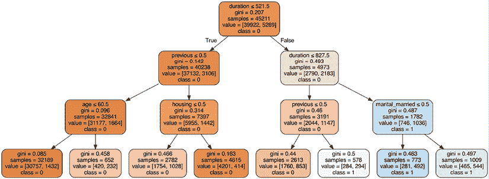

图 3.10：决策树图

如您从决策树图中所见，树的深度为 3，这是我们训练决策树时定义的。让我们更仔细地看看这个图。

根节点是根据变量 `duration` 进行分割的。正如箭头所示，如果持续时间小于或等于 `521.5`，则移动到左侧子节点；否则，移动到右侧子节点。如果我们沿着持续时间大于 `827.5` 且 `marital_married` 大于 `0.5` 的路径遍历到最右侧的叶节点，那么这个叶节点中的大多数客户已经转化。换句话说，那些接触持续时间超过 `827.5` 秒并且已婚的客户转化率更高。

另一方面，如果我们遍历到最左侧的叶节点，则表明那些接触持续时间小于或等于 `521.5` 秒（根节点）、0 次先前联系（深度 1 的左侧子节点）并且年龄小于或等于 `60.5`（深度 2 的最左侧子节点）的客户不太可能转化，与其他客户相比。

您可以使用其他参数来构建决策树。尝试微调您的树，看看不同的参数如何影响决策树的形成，以及您如何从同一数据集中得出各种其他见解！

如您从本例中可以看到，通过遍历树及其分支和节点，我们可以看到不同营销因素对转化客户行为的影响。与我们在上一节中进行的回归分析相比，这个决策树有更好地理解不同因素之间更复杂相互作用和相互关系的优势，以及它们如何影响结果变量。需要注意的是，回归分析和决策树分析的结果都显示了因素与结果之间的相关性，而不是某些结果的原因关系。检验某些结果的原因并不是一件容易的任务；然而，在下一节中，我们将讨论如何从数据中估计特征与结果之间的因果关系。

# 为什么人们会因因果推断而流失

高流失率在市场营销中尤其成问题，因为它抵消了之前营销活动产生的所有良好营销收入。深入了解人们为什么会流失以及需要优化哪些因素以降低客户流失率至关重要。正如我们在前面的章节中看到的，回归分析和决策树分析在识别潜在因素与结果之间的线性关系以及各种因素与结果变量之间的相互关系方面非常出色。然而，正如之前提到的，这些识别出的关系或相关性并不一定意味着因果关系。

识别某些结果的原因（例如，客户流失的原因）通常是一项困难且复杂的任务。这就是因果分析发挥作用的地方。如果回归分析用于识别变量之间的关系，决策树分析用于识别变量之间的*相互作用*，那么因果分析用于识别某些结果的*原因*和*效果*。

这通常是通过各种带有对照组和治疗组或实验组的实验来完成的。正如其名所示，对照组是未接受任何治疗的组。在医学实验环境中，这个对照组是将会接受安慰剂的组。另一方面，治疗组是实际接受治疗的组。同样，在医学实验环境中，这个治疗组是接受实际医疗治疗的组，例如正在开发的新药片。

在营销活动运行之前设置实验的必要性这一范式限制了事后的分析。然而，有了数据，我们仍然可以运行因果分析来估计不同因素对结果的影响。我们将使用 Python 包`dowhy`来基于营销活动数据运行因果分析。我们将使用银行客户流失数据作为例子来讨论如何进行因果分析，以揭示某些变量对营销结果的原因和影响。

**源代码和数据**：

[`github.com/PacktPublishing/Machine-Learning-and-Generative-AI-for-Marketing/blob/main/ch.3/Why%20People%20Churn.ipynb`](https://github.com/PacktPublishing/Machine-Learning-and-Generative-AI-for-Marketing/blob/main/ch.3/Why%20People%20Churn.ipynb)

**数据来源**：

[`www.kaggle.com/datasets/shrutimechlearn/churn-modelling`](https://www.kaggle.com/datasets/shrutimechlearn/churn-modelling)

安装`dowhy`包：

```py
pip install dowhy 
```

（注意：你可能需要安装`dowhy`包的额外组件。请参阅官方文档[`pypi.org/project/dowhy/`](https://pypi.org/project/dowhy/)。）

## 因果效应估计

估计某些变量对结果产生因果效应的第一步是定义问题并做出一些假设。让我们以银行客户流失数据集为例。首先，当你将数据加载到 DataFrame 中时，你会看到以下变量：

```py
df.info() 
```


图 3.11：DataFrame 快照

在这里，`Exited`（退出）列是我们感兴趣分析其因果的指标。正如你可能注意到的，还有其他几个列可能对分析客户流失的因果效应很有趣。有些人可能想看看高或低的信用评分是否会影响客户流失。其他人可能想看看长期或短期的工作期限是否会影响客户流失。你也可能好奇拥有多个产品是否会影响客户流失。

在本章的练习中，我们将定义我们的问题或我们感兴趣的因果效应如下：

> “拥有多个产品会影响客户流失吗？”

在这个问题定义的基础上，我们可以建立一些假设，这些假设最终可能导致客户流失：

+   拥有多个产品可能会影响客户流失率，因为拥有多个产品的人可能觉得切换到不同银行更困难或更繁琐。

+   `CreditScore`（信用评分）可能影响客户是否可以拥有多个产品，因为信用评分被用来决定一个人是否有资格拥有某些银行产品，例如信用卡或定期贷款。

+   `Age`（年龄）也可能影响客户是否拥有多个产品，因为年龄越大，可能需要更多的银行产品。

+   同样，`Tenure`（客户服务期限）、`Balance`（账户余额）和`Salary`（薪水）都可能影响客户是否拥有多个产品。这些因素也可能影响客户流失。

基于这些假设和问题陈述，让我们分析`MultipleProduct`变量对客户流失的因果效应，使用 do-calculus 记号，可以表示为：


这反过来意味着由于变量`MultipleProduct`的变化，客户流失可能性预期的变化。正如我们的假设一样，可能有一组其他变量会影响结果，我们可能对估计这些协变量对结果的影响感兴趣。在我们的例子中，这些协变量是`Tenure`、`Balance`和`Salary`，这些协变量对客户流失的估计因果效应可以表示为：


### 因果模型

基于预定义的问题陈述和我们的假设，让我们开始构建一个因果模型。

首先，我们需要构建一个我们将用作处理的变量。看看下面的代码：

```py
df["MultipleProduct"] = df["NumOfProducts"].apply(lambda x: 1 if x > 1 else 0) 
```

在我们的数据集中，有一个名为`NumOfProducts`的列。我们只是将其编码为 0 和 1，其中拥有多个产品的客户将被编码为 1，其余的为 0。

现在，我们将使用`dowhy`包中的`CausalModel`类来定义基于我们假设的因果模型，如下面的代码所示：

```py
from dowhy import CausalModel
model = CausalModel(
    data=df,
    treatment="MultipleProduct",
    outcome="Exited",
    common_causes=["Balance", "EstimatedSalary", "Tenure"],
    instruments=["Age", "CreditScore"]
) 
```

如您从这段代码中看到的，我们定义了新创建的变量`MultipleProduct`作为我们感兴趣学习的因果效应的干预，即对结果变量`Exited`的因果效应。我们将`Balance`、`EstimatedSalary`和`Tenure`定义为可能对客户流失以及客户是否可能有多个产品有因果效应的共同原因。最后，我们将`Age`和`CreditScore`定义为工具变量，因为它们可能影响客户拥有多个产品的能力。

您可以使用以下代码可视化这个因果模型：

```py
model.view_model() 
```

结果的因果图如下所示：


图 3.12：因果图的可视化

注意，每次运行此代码时，实际输出可能不同。

在这里，工具变量`CreditScore`和`Age`影响处理变量`MultipleProduct`，而`MultipleProduct`影响结果变量`Exited`，以及协变量或共同原因`Balance`、`EstimatedSalary`和`Tenure`也影响处理变量以及结果变量。

然后，我们可以让模型识别因果效应，如下面的代码所示：

```py
estimands = model.identify_effect()
print(estimands) 
```

此代码将在我们的假设下显示以下因果效应的表达式：


图 3.13：因果效应的代码表达式

这应该看起来很熟悉，因为这与我们之前讨论的因果效应公式相同。

### 估计

在定义了因果模型之后，我们现在可以估计处理变量`MultipleProduct`的影响。`estimate_effect`函数使得这些影响的估计变得简单，如下面的代码所示：

```py
estimate = model.estimate_effect(
    estimands,
    method_name = "backdoor.propensity_score_weighting"
)
print(estimate) 
```

这应该产生以下结果：

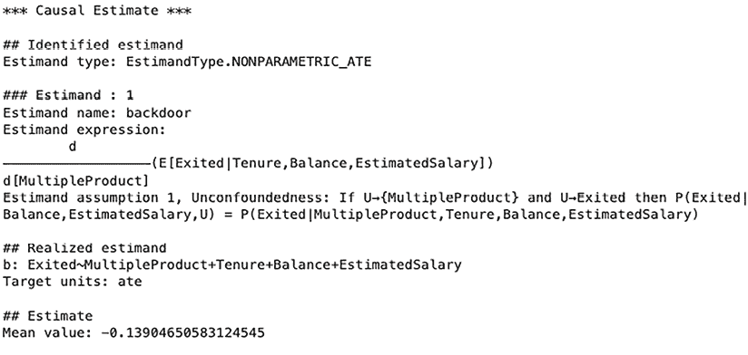

图 3.14：因果估计结果

根据这个结果，我们估计治疗变量`MultipleProduct`对结果`Exited`的平均效应为-0.1390。这意味着拥有多个产品会导致客户流失概率降低约 14%。这证实了我们的假设，即拥有多个产品将增加对银行的粘性并降低客户流失的可能性。

您可以使用多种方法进行估计。以下是一些例子：

+   线性回归

+   距离匹配

+   倾向得分分层

+   倾向得分匹配

+   倾向得分加权

我们在示例中使用了倾向得分加权，但我们建议尝试不同的估计方法，并分析它们如何影响因果效应估计。

### 反驳

一旦我们估计了治疗对结果的影响，就需要对其进行验证。这个假设验证步骤被称为**反驳**。我们将通过几种方法对假设进行稳健性检查。

第一种方法是引入一个随机共同原因或协变量变量。您可以按以下方式运行此检查：

```py
refute_results = model.refute_estimate(
    estimands,
    estimate,
    "random_common_cause"
)
print(refute_results) 
```

输出看起来如下：

```py
Refute: Add a random common cause
Estimated effect:-0.13904650583124545
New effect:-0.13904650583124542 
```

我们在因果模型`model`中使用`refute_estimate`函数，参数为“`random_common_cause`”。这种反驳方法引入了一个新的、随机生成的变量来测试因果估计是否显著变化，有助于评估模型对遗漏变量偏差的稳健性。如您从输出中看到，引入随机共同原因后的原始估计效应和新效应相同，估计的因果效应值约为-0.1390。这证实了我们的假设是正确的。

反驳我们假设的第二种方法是随机子采样数据并在该随机子集上进行测试。您可以按以下方式运行此检查：

```py
refute_results = model.refute_estimate(
    estimands,
    estimate,
    "data_subset_refuter"
)
print(refute_results) 
```

输出看起来如下：

```py
Refute: Use a subset of data
Estimated effect:-0.13904650583124545
New effect:-0.13842175180225635 
```

与前一个案例类似，我们使用了相同的`refute_estimate`函数，但这次使用了“`data_subset_refuter`”参数。输出表明，原始估计效应和新估计效应（使用数据的一个随机子集）非常接近。这证实了我们对`MultipleProduct`变量和`Exited`结果变量之间因果关系的假设是正确的，并且是跨数据集的可推广结果。

与多种估计方法选项类似，您有多种方式可以运行反驳。在本章中，我们尝试了随机共同原因添加和随机子集替换。然而，还有其他多种方式可以验证您的假设。以下是一些例子：

+   **用安慰剂替换治疗**：将治疗变量替换为一个已知不会对结果产生因果效应的变量。

+   **用虚拟结果替换**：不是替换治疗变量，而是用与治疗无关的结果变量替换。

+   **使用自举随机样本进行反驳**：从数据中生成多个自举样本，并估计每个样本上的因果效应。

我们还建议尝试不同的反驳方法！官方文档中的示例可能是一组有用的资源，您可以通过以下链接找到：[`www.pywhy.org/dowhy/v0.11.1/example_notebooks/nb_index.html`](https://www.pywhy.org/dowhy/v0.11.1/example_notebooks/nb_index.html)。

## 图形因果模型

虽然之前的因果效应估计是为了分析和识别处理变量的影响，但**图形因果模型**能够进行根本原因分析，以及分析各种因素的因果效应和联系。当你想要理解潜在变量的因果效应以及它们最终如何导致某些结果时，这将是一个非常有用的工具。

在与之前相同的假设下，我们将学习如何使用`dowhy`图形因果模型来更好地理解变量之间的因果联系。

### 因果影响

使用图形因果模型的一个关键区别是我们需要构建一个有向图，其中我们定义一个起始节点到下一个节点。让我们通过运行以下代码进一步讨论这个问题：

```py
import networkx as nx
causal_graph = nx.DiGraph([
    ('CreditScore', 'MultipleProduct'),
    ('Age', 'MultipleProduct'),
    ('MultipleProduct', 'Exited'),
    ('Balance', 'MultipleProduct'),
    ('EstimatedSalary', 'MultipleProduct'),
    ('Tenure', 'MultipleProduct'),
    ('Balance', 'Exited'),
    ('EstimatedSalary', 'Exited'),
    ('Tenure', 'Exited'),
]) 
```

要安装`networkx`包：

```py
pip install networkx 
```

如您所见，我们正在使用`networkx`包的`DiGraph`类来创建一个有向图。您可以使用以下代码可视化这个有向图：

```py
 nx.draw_networkx(causal_graph, arrows=True) 
```

输出将如下所示：

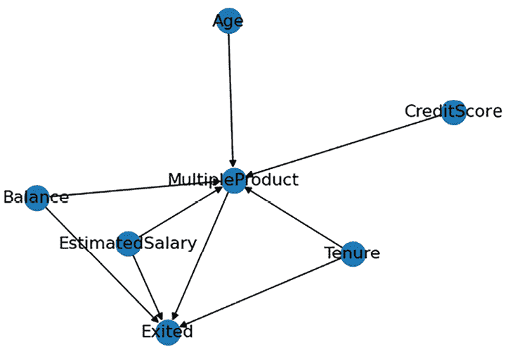

图 3.15：有向图

如您可能注意到的，这是一个与我们之前章节中看到的类似的图，其中存在从`Age`和`CreditScore`到`MultipleProduct`的有向边。同样，也存在从`Balance`、`EstimatedSalary`和`Tenure`到`MultipleProduct`和`Exited`的有向边。最后，存在一个从`MultipleProduct`到`Exited`的有向边。总之，这是我们对不同变量可能相互产生因果效应的假设的视觉表示。

使用这个有向图，我们现在可以拟合一个图形因果模型，如下面的代码所示：

```py
from dowhy import gcm
scm = gcm.StructuralCausalModel(causal_graph)
gcm.auto.assign_causal_mechanisms(scm, df)
gcm.fit(scm, df) 
```

在这里，我们使用`dowhy`包中的`gcm`模块，并在`gcm`模块中使用`StructuralCausalModel`类定义因果模型。然后，我们使用`assign_causal_mechanisms`函数将我们的数据集分配给图中的每个节点，最后，使用`fit`函数和结构因果模型以及数据集作为`fit`函数的输入来拟合图形因果模型。

现在我们已经学习了各种变量对结果的影响的因果效应，我们可以使用`arrow_strength`函数对这些学习到的关系进行量化，如下面的代码所示：

```py
arrow_strengths = gcm.arrow_strength(scm, target_node='Exited') 
```

您可以使用以下代码进行可视化：

```py
total = sum(arrow_strengths.values())
arrow_strengths_perc = {key: val/total*100 for key, val in arrow_strengths.items()}
gcm.util.plot(
    causal_graph,
    causal_strengths=arrow_strengths_perc,
    figure_size=[8, 5]
) 
```

从这段代码中，你可能注意到，在前两行代码中，我们将箭头强度归一化为总量的百分比。生成的图表应类似于以下：

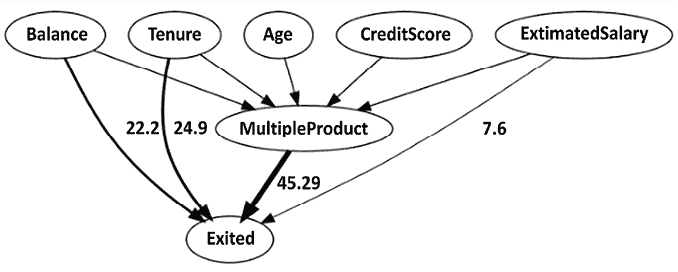

图 3.16：带有箭头强度的图表

如此图表所示，`MultipleProduct`与`Exited`之间存在最强的因果关联，贡献率约为 45%，而`Tenure`作为第二个对客户流失影响最大的变量，贡献率约为 25%。这个具有对结果估计因果影响的定向图，为理解不同变量对结果的量化因果效应提供了极大的洞察力。

虽然箭头强度显示了直接链接到结果的影响，但它们并没有显示工具变量`Age`和`CreditScore`与结果变量`Exited`之间的间接关系。我们可以采取的一种计算和可视化所有因果因素对结果变量影响的方法是量化内在因果贡献，这些贡献将结果变量的方差归因于定向图中的所有上游节点。

我们可以使用`intrinsic_causal_influence`函数来量化内在因果贡献，如下面的代码所示：

```py
influence = gcm.intrinsic_causal_influence(
    scm,
    target_node='Exited',
    num_samples_randomization=100
) 
```

在这里，我们使用 100 个随机样本进行评估，如你从`num_samples_randomization`参数输入中看到的。在我们可视化量化的内在因果影响之前，我们将尺度归一化，使它们加起来达到 100%，然后使用以下代码以条形图的形式可视化它们：

```py
total = sum([val for key, val in influence.items() if key != "Exited"])
influence_perc = {key: val/total*100 for key, val in influence.items() if key != "Exited"}
xlabels = sorted(influence_perc.keys())
yvals = [influence_perc[x] for x in xlabels]
plt.bar(xlabels, yvals)
plt.xticks(rotation=45)
plt.grid()
plt.ylabel("Variance attribution in %")
plt.show() 
```

这段代码的输出应生成一个类似于以下条形图的图表：


图 3.17：每个因素的方差分配条形图

如预期，变量`MultipleProduct`在所有变量中对结果变量的方差贡献最大。`Balance`作为第二个贡献最大的变量。变量`Age`和`CreditScore`似乎对结果变量`Exited`的方差贡献很小。

**什么是 Shapley 值？**

你可能注意到，在运行因果推理代码时会出现“Shapley 值”。简单来说，Shapley 值是单个变量对目标变量影响程度的估计。如果你想了解更多，我们建议你查看关于如何计算特征相关性的包文档：[`www.pywhy.org/dowhy/main/user_guide/causal_tasks/root_causing_and_explaining/feature_relevance.html`](https://www.pywhy.org/dowhy/main/user_guide/causal_tasks/root_causing_and_explaining/feature_relevance.html)。

### 异常归因

到目前为止，我们已经看到了分析个体变量对结果变量整体因果效应的方法。然而，在有些情况下，我们可能想要深入了解哪些变量可能以何种方式做出了贡献。例如，在我们的数据集中，有人可能好奇某个客户的`Balance`金额是如何导致他们流失的，或者那个人的银行`Tenure`是如何影响他们的流失的。为了找出不同变量对个体客户流失的因果贡献，我们可以使用`attribute_anomalies`函数，如下所示：

```py
attributions = gcm.attribute_anomalies(
    scm,
    target_node='Exited',
    anomaly_samples=df.loc[df["Exited"] == 1].iloc[0:1]
) 
```

在我们的例子中，我们选择了第一个流失的客户作为例子，如您从`anomaly_samples`参数的输入中看到的。我们可以使用以下代码在结果上可视化个体归因：

```py
total = sum([abs(val[0]) for key, val in attributions.items() if key != "Exited"])
attributions_perc = {
    key: val[0]/total*100 for key, val in attributions.items() if key != "Exited"
}
xlabels = sorted(attributions_perc.keys())
yvals = [attributions_perc[x] for x in xlabels]
plt.bar(xlabels, yvals)
plt.xticks(rotation=45)
plt.grid()
plt.ylabel("Anomaly Attribution (%)")
plt.show() 
```

如此代码所示，我们正在对归因进行归一化，以便它们加起来达到 100%，然后使用条形图可视化个体归因。

生成的条形图将看起来如下：

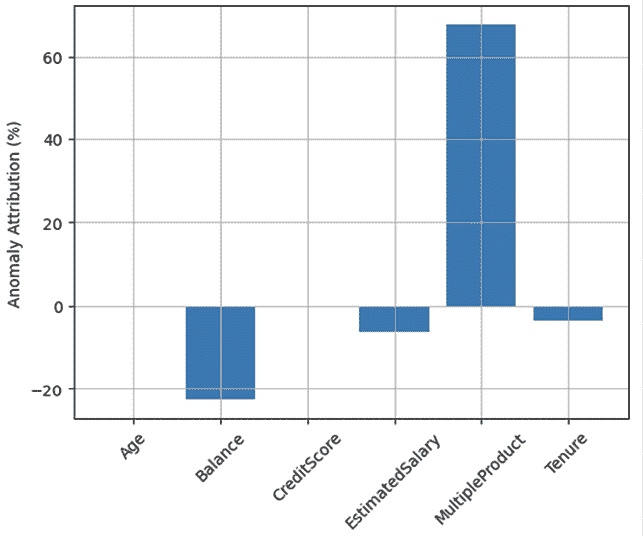

图 3.18：每个因素的异常归因条形图

在我们深入解释这个条形图之前，让我们首先看看我们选择的用于量化个体因果贡献的样本。看看以下代码，以便更仔细地查看一个个体样本：

```py
 df.loc[df["Exited"] == 1].iloc[0][list(attributions_perc.keys())] 
```

这段代码的输出将如下所示：

图 3.19：选择的样本

如果我们将归因结果与这位客户的个人信息结合起来，我们可以分析出哪些因素是最具影响力的，最终导致了这位客户的流失。从这位客户的记录中我们可以看到，这个人只与银行有一个产品，这是导致这位客户流失的最主要因素。另一方面，`Balance`（余额）、`EstimatedSalary`（估计薪资）和`Tenure`（任期）实际上降低了客户流失的可能性，因为它们有负分。让我们再看另一个样本，如下所示：

```py
 df.loc[df["Exited"] == 1].iloc[1][list(attributions_perc.keys())] 
```

这将产生如下输出：


图 3.20：选择的样本

这位客户的因果贡献条形图看起来如下：

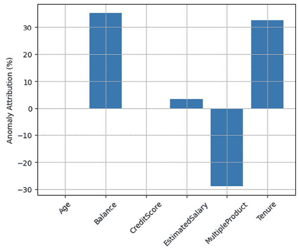

图 3.21：客户因果贡献条形图

如您从第二个例子中看到的，与第一个例子相比，这位客户的余额更高，任期更长，并且与银行有超过一个产品。对于这位客户来说，更高的余额、更长的任期和更高的估计薪资对客户流失有积极影响，而这位客户拥有多个产品的事实降低了客户流失的可能性。

从这些例子中我们可以看到，因果分析和因果效应估计可以深入了解人们为何会从您的产品中流失。当与其他方法和 AI/ML 模型结合使用时，这种因果分析将带来可操作的见解，您可以在未来的营销活动中加以应用。

# 摘要

在本章中，我们深入了解了影响某些客户行为的因素。我们探讨了如何通过**回归分析**帮助我们理解各种因素与客户行为结果之间的方向性关系。以我们的车险营销数据集为例，我们看到了如何使用 Python 中的`statsmodels`包进行回归分析，揭示参与率营销活动背后的成功。我们还讨论了**决策树**如何帮助我们识别导致特定结果复杂交互。以银行营销数据集为例，并使用 Python 中的`scikit-learn`包，我们成功构建了一个揭示各种因素之间导致客户转换的潜在交互的决策树。最后，使用银行客户流失数据集和 Python 中的`dowhy`包，我们看到了**因果分析**如何对事件的根本原因和结果的方向性贡献带来深刻的洞察。

在下一章中，我们将探讨时间序列数据。在营销中，存在某些以特定方式重复出现的时序模式。我们将讨论如何将时间序列数据分解为总体趋势、季节性和随机噪声成分，以及如何利用通过时间序列分解识别出的趋势和季节性来开展营销活动，以及如何进行时间序列预测，这可以帮助你为未来可能发生的事件进行更好的规划和准备。

# 加入我们书籍的 Discord 空间

加入我们的 Discord 社区，与志同道合的人交流，并与其他 5000 多名成员一起学习，请访问：

[`packt.link/genai`](https://packt.link/genai)


