# 4

# 利用季节性和趋势进行战略规划

除非是一次性营销活动，例如开设临时商店或偶尔的产品促销活动，否则时间成分总会对营销结果产生影响。例如，销售雨伞的公司在雨季自然会看到显著的销售增长。不仅业务会受到季节性影响，而且业务中也可能存在一般趋势。例如，销售固定电话的业务随着人们越来越多地使用移动电话，其销售额将逐渐下降。

本章深入讨论了时间对营销活动的影响以及如何利用这些影响来制定最有效的营销策略。我们将介绍时间序列分析的基础，例如识别整体趋势和异常的一些常见方法，以及可视化时间序列数据。然后，我们将探讨如何将时间序列数据分解为趋势和季节性，这将告诉我们基于这些因素某些事件分解的贡献，以及这种分解如何帮助构建更有效的营销策略。我们将通过学习如何构建时间序列预测模型，以及理解这些预测如何被用于适当的营销活动来结束本章。我们将使用产品销售数据集作为例子，并讨论如何在 Python 中进行时间序列分析和建模。

更具体地说，我们将涵盖以下主题：

+   时间序列分析基础

+   时间序列数据中的趋势和季节性分解

+   时间序列预测模型

# 时间序列分析基础

理解企业中的自然趋势对于营销人员、运营人员、销售人员以及大多数其他业务部门来说至关重要。如果没有很好地掌握业务及其产品是如何演变，以及客户是如何围绕你提供的服务和产品做出反应和行为的，很容易落后，导致收入增长不理想，甚至业务增长放缓至停止。

很容易发现企业是如何围绕商业周期的时间成分构建其产品策略的。在时尚行业，服装企业通常从冬季晚期到春季早期开始推广春夏季服装，而秋冬服装则从夏季早期到秋季早期进行宣传，因为客户倾向于在季节真正到来之前购物作为准备。然后，春夏季服装通常在夏季进行促销，通常从 7 月中旬开始，因为这些服装在季节真正到来时的需求较低。这说明了企业如何根据自然形成的客户需求优化不同季节的商业周期，以及他们如何最大化销售同时最小化过剩库存。

**时间序列分析**在尝试理解企业中的这些自然时间成分时非常有用。简而言之，时间序列分析是一种分析随时间变化的一系列数据点及其如何影响数据值变化的方法。在本章中，我们将使用一个历史销售数据集作为例子来讨论如何进行时间序列分析和建模。

**源代码和数据**:

[`github.com/PacktPublishing/Machine-Learning-and-Generative-AI-for-Marketing/tree/main/ch.4`](https://github.com/PacktPublishing/Machine-Learning-and-Generative-AI-for-Marketing/tree/main/ch.4 )

**数据来源**: [`community.tableau.com/s/question/0D54T00000CWeX8SAL/sample-superstore-sales-excelxls`](https://community.tableau.com/s/question/0D54T00000CWeX8SAL/sample-superstore-sales-excelxls)

## 基本时间序列趋势

让我们使用示例数据集查看整体月度产品销售额。我们首先需要将此数据加载到 DataFrame 中，并按月汇总数据。请看以下代码（注意，这里使用的 CSV 文件包含在本书的 GitHub 仓库中）：

```py
df = pd.read_csv("./data.csv", encoding="latin")
df["OrderDate"] = pd.to_datetime(df["OrderDate"])
ts_df = df[[
    "OrderID", "OrderDate", "Quantity", "Sales", "Category"
]].copy().set_index("OrderDate")
df.columns = [x.replace(" ", "") for x in df.columns] 
```

在这里，我们将数据加载到`pandas` DataFrame 中。与之前章节不同的是，编码参数。这个数据集包含非 UTF 字符，所以我们使用`latin`编码来加载数据。然后，我们将`OrderDate`列中的值转换为日期时间类型，并将关键列复制到一个新的`DataFrame`，`ts_df`。最后，为了便于使用，我们通过将所有空格替换为空字符串来删除列名中的空格。

将数据重新采样并按月频率汇总的一种方法如下：

```py
monthly_unique_orders = ts_df["OrderID"].resample("MS").nunique()
monthly_unique_order_changes = (
    monthly_unique_orders - monthly_unique_orders.shift()
)/monthly_unique_orders.shift()*100 
```

我们在`pandas`中使用`resample`函数，并带有`MS`参数，这将把数据重新采样到月度时间框架，然后使用`nunique`函数计算唯一的`OrderID`值的数量，这将给我们提供每月独立订单计数数据。然后我们通过从当前月的值中减去上个月的值并除以上个月的值来计算月度百分比变化。`shift`函数将数据移动一个周期，从而给出上个月的值。

我们可以将同样的方法应用于计算每月订单数量和销售额，如下所示：

```py
monthly_quantities = ts_df["Quantity"].resample("MS").sum()
monthly_quantities_changes = (
    monthly_quantities - monthly_quantities.shift()
)/monthly_quantities.shift()*100
monthly_sales = ts_df["Sales"].resample("MS").sum()
monthly_sales_changes = (
    monthly_sales - monthly_sales.shift()
)/monthly_sales.shift()*100 
```

可视化时间序列数据最简单的方法是使用折线图。请看以下代码：

```py
fig, axes = plt.subplots(
nrows=3, ncols=1, figsize=(10, 10), sharex=True
)
monthly_unique_orders.plot(
    ax=axes[0], grid=True
)
monthly_unique_order_changes.plot(
    ax=axes[0], secondary_y=True, color="silver", linestyle="dashed"
)
axes[0].set_title("Monthly Unique Orders")
axes[0].set_ylabel("# Unique Orders")
axes[0].right_ax.set_ylabel("Month over Month Change (%)")
monthly_quantities.plot(
    ax=axes[1], grid=True
)
monthly_quantities_changes.plot(
    ax=axes[1], secondary_y=True, color="silver", linestyle="dashed"
)
axes[1].set_title("Monthly Order Quantities")
axes[1].set_ylabel("Order Quantity")
axes[1].right_ax.set_ylabel("Month over Month Change (%)")
monthly_sales.plot(
    ax=axes[2], grid=True
)
monthly_sales_changes.plot(
    ax=axes[2], secondary_y=True, color="silver", linestyle="dashed"
)
axes[2].set_title("Monthly Sales")
axes[2].set_ylabel("Sales")
axes[2].right_ax.set_ylabel("Month over Month Change (%)")
plt.show() 
```

在这段代码中，我们创建了三个折线图。第一个是每月独立订单数，第二个是每月订单数量，最后一个是每月销售额。此代码生成了以下图表：

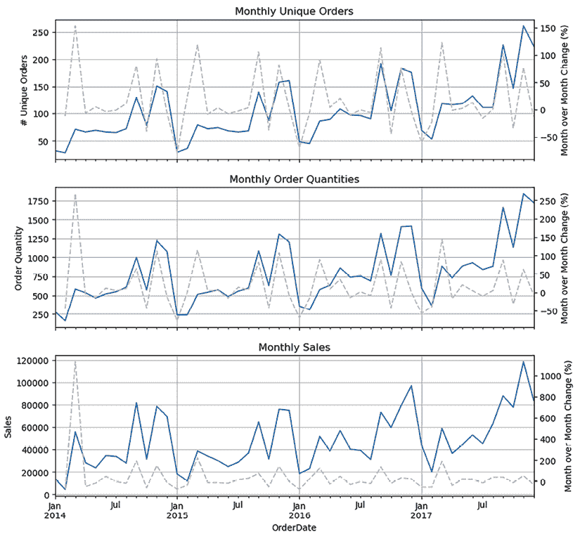

图 4.1：月度时间序列数据的可视化

让我们更深入地研究这些图表。如您所注意到的，所有三个图表都显示出明显的重复模式。它们在三月、九月和十一月到十二月期间达到峰值。这可以通过查看实线（表示整体月度值）和虚线（表示月度值的变化）来确认。这表明该业务具有周期性，相应月份的销售量较大。营销人员应通过在高峰季节前稍作营销来捕捉最大的销售潜力。此外，营销人员可以在显示较弱销售量的月份提供折扣，以管理库存并促进淡季销售。

如您所见，可视化时间序列数据本身就能提供关于业务周期以及如何为高峰和低谷季节做准备的深刻见解。您可能还会注意到，这些图表整体呈上升趋势，这意味着值通常每年都在上升。当我们查看时间序列图表中的移动平均值时，这种整体趋势更容易识别。

您不仅可以按月频率采样时间序列数据，还可以按日、周或年频率采样。您可以根据许多选项进行重采样，所以尝试不同的重采样频率，看看您能观察到哪些其他趋势！

**参考**：https://pandas.pydata.org/pandas-docs/stable/user_guide/timeseries.html#resampling

## 移动平均值

**移动平均值**，即特定时间段的平均值，擅长平滑尖峰或噪声的时间序列数据，并显示整体趋势。它们是回答诸如“我们的产品销售是整体上升还是下降趋势？”等问题的重要工具。在我们的示例数据中，我们可以执行以下操作来计算移动平均值：

```py
m6_ma_sales = monthly_sales.rolling(6).mean()
m12_ma_sales = monthly_sales.rolling(12).mean() 
```

如您从这段代码中看到的那样，您可以在`pandas`中使用`rolling`函数并应用`mean`函数来获取月度销售的移动平均值。`rolling`函数的输入定义了您想要平均值的周期数。在这里，我们计算了月度销售的 6 周期移动平均值和 12 周期移动平均值。

您可以使用以下代码来可视化移动平均值：

```py
ax = monthly_sales["2015-01-01":].plot(figsize=(10,5))
m6_ma_sales["2015-01-01":].plot(ax=ax, grid=True)
m12_ma_sales["2015-01-01":].plot(ax=ax, grid=True)
ax.set_ylabel("Sales Amount")
ax.set_xlabel("Order Date")
ax.set_title("Monthly Sales Amount")
plt.legend(["Monthly Sales", "6mo Moving Average", "12mo Moving Average"])
plt.show() 
```

生成的图表将如下所示：

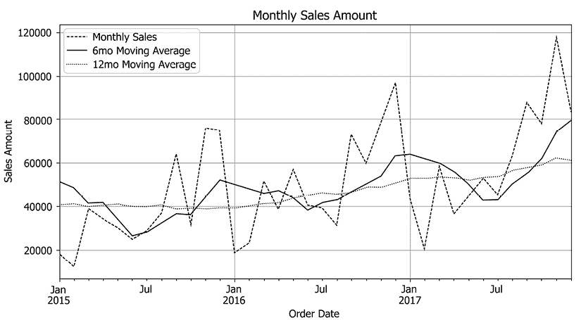

图 4.2：包含 6 个月和 12 个月移动平均值的月度销售

如预期的那样，12 个月移动平均值图表比 6 个月移动平均值图表更平滑。然而，6 个月移动平均值图表比 12 个月移动平均值图表更敏感或更接近于捕捉月度销售图表中的趋势，同时仍然平滑了月度销售图表中的尖峰。如您所注意到的，移动平均值图表显示了月度销售数据的一般上升趋势，这在仅查看月度图表时可能更难注意到。

移动平均还可以帮助您了解某些月份的峰值是否在正常范围内或是不正常。看看以下代码：

```py
m6_ma_sales_std = monthly_sales.rolling(6).std()
ax = monthly_sales["2015-01-01":].plot(figsize=(10,5))
m6_ma_sales["2015-01-01":].plot(ax=ax, grid=True)
(m6_ma_sales["2015-01-01":] + m6_ma_sales_std["2015-01-01":]).plot(
    ax=ax, grid=True, linestyle="dashed", color="silver", linewidth=1
)
(m6_ma_sales["2015-01-01":] - m6_ma_sales_std["2015-01-01":]).plot(
    ax=ax, grid=True, linestyle="dashed", color="silver", linewidth=1
)
ax.set_ylabel("Sales Amount")
ax.set_xlabel("Order Date")
ax.set_title("Monthly Sales Amount")
dates = m6_ma_sales["2015-01-01":].index
plt.fill_between(
    dates,
    m6_ma_sales["2015-01-01":] + m6_ma_sales_std["2015-01-01":],
    m6_ma_sales["2015-01-01":] - m6_ma_sales_std["2015-01-01":],
    facecolor="grey",
    alpha=0.2,
)
plt.legend(["Monthly Sales", "6mo Moving Average (MA)", "6mo MA Upper", "6mo MA Lower"])
plt.show() 
```

此代码通过使用`std`函数计算 6 个月期间的移动标准差（与移动平均相同，但测量过去一定时间内的标准差）并使用带有上下边界的带状图可视化数据，其中上边界是 6 个月移动平均线上一个标准差，下边界是 6 个月移动平均线下一个标准差。图表将如下所示：

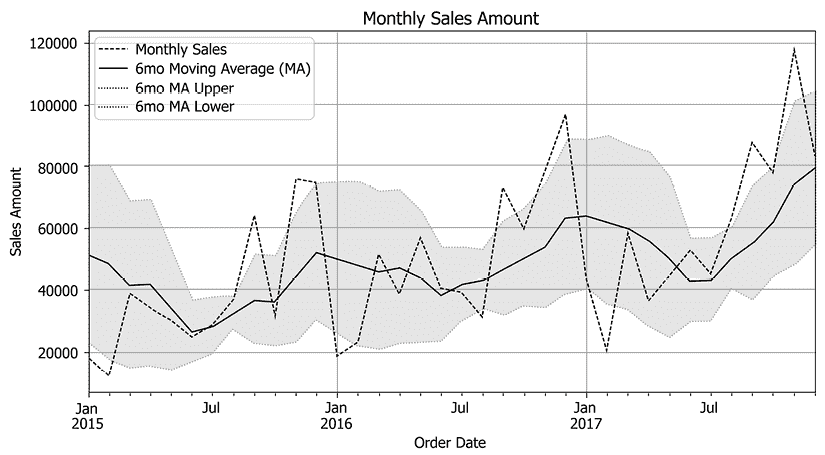

图 4.3：带有 6 个月移动平均和 1-std 边界的月销售

此图表显示了月销售量与移动平均线和一个标准差边界相比的情况。根据您的偏好，您可能希望将一个标准差内的值视为正常，或将两个标准差内的值视为正常。使用此示例，如果我们假设一个标准差内的值为正常值，我们可以看到二月、九月、十一月和十二月是不正常的月份，超出了定义的边界，其中二月份的销售量显著低于预期，而九月、十一月和十二月销售量显著高于预期。

理解企业的整体趋势与理解企业内的季节性或周期同样重要。根据一般趋势，您可以更好地了解是否比去年有更高的或更低的销售和营销潜力。如果整体趋势是上升趋势，您应该预计某个月的需求可能比去年同月的需求更高。此外，对超出或低于正常范围的销售有良好的掌握，例如在黑色星期五或圣诞节期间，可以帮助构建有效的营销策略来克服短缺和营销潜力的过剩。移动平均和移动标准差是识别整体趋势和正常预期范围的便捷工具。

## 自相关

另一个有用的基本时间序列分析是**自相关**。自相关表示与自身滞后版本的关联。以下将通过一个例子来讨论。看看以下代码：

```py
from statsmodels.graphics.tsaplots import plot_acf, plot_pacf
plot_acf(
    monthly_sales, lags=25
)
plt.show() 
```

在这里，我们使用`statsmodels`包，您可以使用`pip install statsmodels`命令安装它。`plot_acf`函数将为您绘制给定序列的自相关图。在这里，我们绘制了过去 25 期月销售的自相关图。图表应该如下所示：

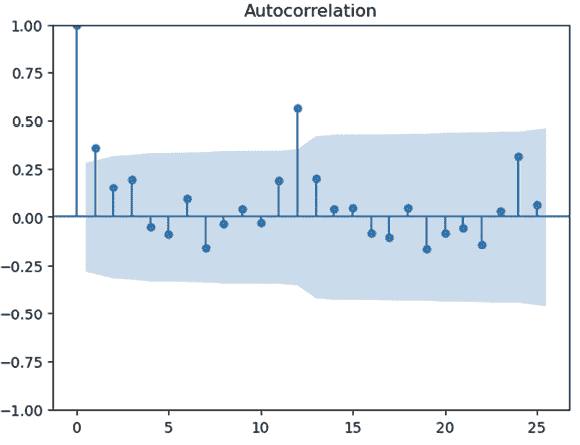

图 4.4：月销售数据的自相关图

让我们更仔细地分析这张图表。x 轴代表滞后阶段数，y 轴是关联程度。这张图表显示了当前时间点与一个周期前、两个周期前，以及直到 25 个周期前的关联。在这里，在月度销售数据中，我们有三滞后阶段的相对较强的正相关，与第四和第五个周期有轻微的负相关。这表明如果过去 3 个月有销售增加，那么本月销售很可能会增加，反之亦然。这也意味着观察 4-5 个月前的销售增加很可能会导致本月销售减少。正如这个例子所示，自相关是观察不同时间段如何影响当前时间段结果的一种方法。在本章的“时间序列预测模型”部分，我们将尝试**自回归积分移动平均**（**ARIMA**）模型，其中它的自回归部分使用这些滞后变量进行时间序列预测建模。

**偏自相关**，与自相关相比，忽略了中间滞后阶段的影响。与自相关不同，偏自相关测量的是每个滞后阶段的直接影响和关联。可以使用`plot_pacf`函数来绘制偏自相关，如下面的代码所示：

```py
plot_pacf(
    monthly_sales, lags=15
)
plt.show() 
```

在这里，我们绘制了直到周期 15 的偏自相关图。图表应该如下所示：

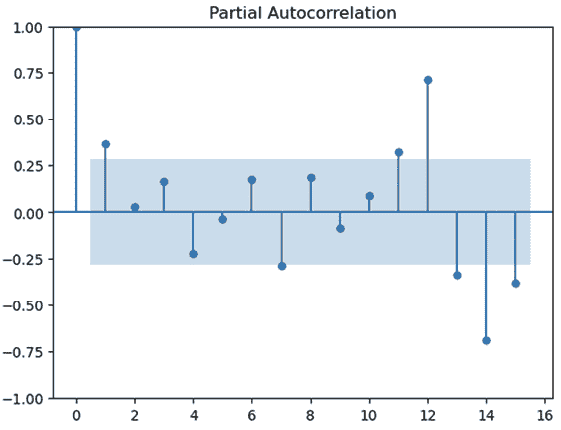

图 4.5：月度销售数据的偏自相关图

如您所见，与之前的自回归图相比，每个滞后阶段的关联程度不同。这是因为偏自回归测量的是每个滞后阶段的直接关联，而自回归包括中间滞后阶段的影响。在这个例子中，我们可以看到在滞后 1 处存在显著的积极偏自相关，在滞后 4 处存在消极偏自相关。这表明上个月的销售增加或减少很可能会分别导致本月销售的增加和减少，而四个月前的销售增加很可能会导致本月销售的减少，排除中间月份销售结果的影响。直观地说，这些可能是自然商业周期的影响，如果你的商业周期是季度性的，那么你很可能会在滞后 3-4 处看到负自相关，而对于半年周期，你很可能会在滞后 6-7 处看到负自相关。

## 产品趋势

我们之前讨论的所有分析和可视化都可以应用于更细粒度的水平。我们只看了整体月度销售时间序列数据。然而，我们可以按不同的产品来剖析，发现每个产品可能具有不同的整体趋势和需求周期性。我们还可以观察不同州或地理区域如何显示出与整体销售趋势可能不同的趋势和商业周期。

为了说明目的，我们将按不同产品类别来剖析趋势。请看以下代码：

```py
furniture_monthly_sales = ts_df.loc[
    ts_df["Category"] == "Furniture"
]["Sales"].resample("MS").sum()
office_monthly_sales = ts_df.loc[
    ts_df["Category"] == "Office Supplies"
]["Sales"].resample("MS").sum()
tech_monthly_sales = ts_df.loc[
    ts_df["Category"] == "Technology"
]["Sales"].resample("MS").sum()
fig, axes = plt.subplots(nrows=3, ncols=1, figsize=(10, 10), sharex=True)
furniture_monthly_sales.plot(ax=axes[0], grid=True)
axes[0].set_title("Monthly Furniture Sales")
office_monthly_sales.plot(ax=axes[1], grid=True)
axes[1].set_title("Monthly Office Supplies Sales")
tech_monthly_sales.plot(ax=axes[2], grid=True)
axes[2].set_title("Monthly Technology Sales")
plt.show() 
```

首先，我们为每个产品类别创建时间序列记录。主要来说，我们创建了三个月度销售时间序列，即“家具”、“办公用品”和“技术”，然后并排展示这些图表。生成的图表如下：

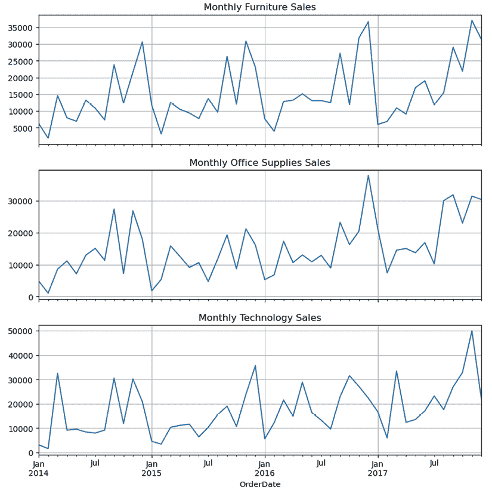

图 4.6：家具、办公用品和技术产品月度销售数据的可视化

这三个产品线之间的整体趋势相似，销售在九月和十一/十二月达到峰值。然而，三月销售峰值在技术销售中最为突出，家具销售从 2017 年 1 月开始快速增长。此外，办公用品销售似乎比其他两个产品线更频繁地达到峰值；它们似乎每季度达到一次峰值，这可能是由于季度办公用品补货的结果。正如这些结果所示，不同的产品线往往在时间上表现出略有不同的行为。

尝试深入了解细分以及时间序列数据如何因不同的细分而异。尝试剖析不同的变量，如地区、城市和子类别！

# 趋势和季节性分解

我们已经看到，从时间序列数据中显示了自然趋势和周期。通过可视化图表和利用移动平均线，我们能够识别出整体趋势和季节性。然而，还有更多统计方法可以将时间序列数据分解为趋势和季节性成分。主要来说，有两种主要的时间序列分解方法：

+   **加法分解**：正如其名所示，**加法分解**的时间序列分解方法将数据分解为趋势、季节性和误差（这是不能由整体趋势和季节性解释的成分），这样当它们相加时，可以重建原始时间序列数据：

*Y*[t] = *Trend*[t] + *Seasonality*[t] + *Error*[t]

+   **乘法分解**：另一方面，**乘法分解**的时间序列分解方法将数据分解为趋势、季节性和误差（这是不能由整体趋势和季节性解释的成分），当它们相乘时，可以重建原始时间序列数据。方程如下：

*Y*[t] = *Trend*[t] * *Seasonality*[t] * *Error*[t]

现在我们更详细地看看这些方法。

## 加法时间序列分解

便利的是，`statsmodels`包提供了一个易于进行趋势和季节性分解的函数。作为一个例子，我们将分解月度`家具`销售数据，看看它有什么趋势和季节性。请看以下代码：

```py
import statsmodels.api as sm
decomposition = sm.tsa.seasonal_decompose(
    furniture_monthly_sales, model='additive'
)
fig = decomposition.plot()
plt.show() 
```

如此代码所示，我们正在使用`seasonal_decompose`函数对月度`家具`销售数据进行时间序列分解，该数据存储在名为`furniture_monthly_sales`的变量中。另一个需要注意的事项是`seasonal_decompose`函数的`model`参数，通过它可以决定是否使用加法或乘法方法。

可以通过`seasonal_decompose`函数输出的`plot`函数轻松可视化此时间序列分解。图表应类似于以下内容：

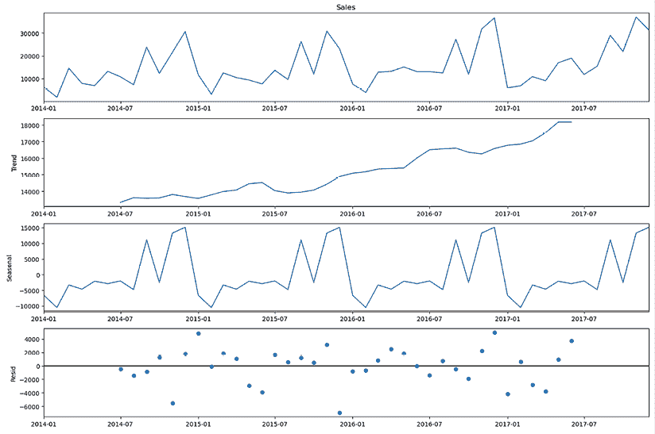

图 4.7：月度家具销售数据的时间序列分解图

顶部图表显示了原始时间序列数据，在我们的案例中是月度`家具`数据。顶部第二张图表显示了分解的趋势。正如预期的那样，存在一个明显的上升趋势，销售额逐年增长。第三张图表是分解的季节性图表。在这里，它显示了 9 月、11 月和 12 月销售量的明显峰值，以及 2 月销售量的下降。最后，底部图表显示了分解后的残差或误差项。根据前一小节中讨论的方程，这三张底部图表对应于原始时间序列数据的每个分解成分。

当适当分解时，误差项应该是平稳的，这意味着残差中不应有依赖于时间的明显模式。在我们的例子中，残差在时间上没有明显的模式，因此分解序列似乎是合理的。我们可以通过基于趋势和季节性分解重构时间序列数据以及原始序列与重构序列之间的差距来检验分解序列捕捉原始序列的效果。请看以下代码：

```py
reconstructed_wo_resid = decomposition.trend + decomposition.seasonal
corr = np.corrcoef(
    list(furniture_monthly_sales[dates]),
    list(reconstructed_wo_resid[dates])
)[0,1]
dist = np.sqrt(
    np.square(
        furniture_monthly_sales[dates] - reconstructed_wo_resid[dates]
    ).sum()
)
rmse = np.sqrt(
    np.square(
        furniture_monthly_sales[dates] - reconstructed_wo_resid[dates]
    ).mean()
) 
```

第一行显示了如何使用分解的趋势和季节性来重构时间序列数据。由于在本例中我们使用了加法方法进行时间序列分解，我们只需简单地将趋势和季节性成分相加即可得到重构序列。

我们使用三个指标来衡量原始序列与重构序列之间的相似性或差异性：

+   **相关性**：使用`numpy`包的`corrcoef`函数，此指标衡量原始序列与重构序列之间的相似性。

+   **欧几里得距离**：这是平方误差和的平方根。此指标衡量原始序列与重构序列之间有多大差距。

+   **均方根误差**（**RMSE**）：这是平方误差均值的平方根。此指标衡量原始序列和重建序列之间的误差程度。

可以使用以下代码：

```py
print(f"Correlation: {corr:.02f}\nEuclidean Distance: {dist:.02f}\nRMSE: {rmse:.02f}") 
```

结果应如下所示：

```py
Correlation: 0.95
Euclidean Distance: 15995.62
RMSE: 2665.94 
```

你也可以使用以下代码直观地比较重建序列与原始序列：

```py
dates = reconstructed_wo_resid.dropna().index
ax = furniture_monthly_sales[dates].plot(figsize=(10,5))
reconstructed_wo_resid[dates].plot(ax=ax, grid=True)
decomposition.trend[dates].plot(ax=ax, grid=True)
ax.set_ylabel("Sales Amount")
ax.set_xlabel("Order Date")
ax.set_title("Monthly Furniture Sales Amount")
plt.legend(["Monthly Furniture Sales", "Reconstructed (Additive)", "Trend Decomposed"])
plt.show() 
```

图表应如下所示：

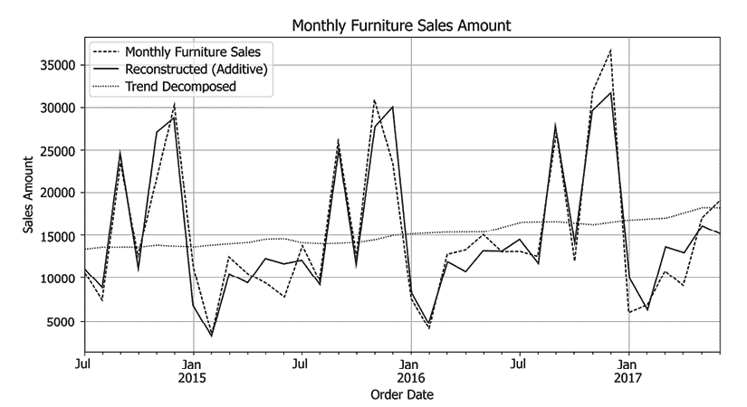

图 4.8：家具月销售数据及其分解趋势和重建序列

如您从这张图表中可以看到，并且正如之前指标所预期的那样，重建序列并没有捕捉到原始序列的 100%。然而，它们紧密地移动在一起，并且重建序列与原始序列具有高度相似性。

## 乘法时间序列分解

我们将比较加法方法的成果与乘法方法的成果，以查看哪一个更接近原始时间序列。正如你可能已经猜到的，你可以将`seasonal_decompose`函数的`model`参数替换为`multiplicative`，如下所示：

```py
decomposition = sm.tsa.seasonal_decompose(
    furniture_monthly_sales, model='multiplicative'
)
fig = decomposition.plot()
plt.show() 
```

生成的图表应如下所示：

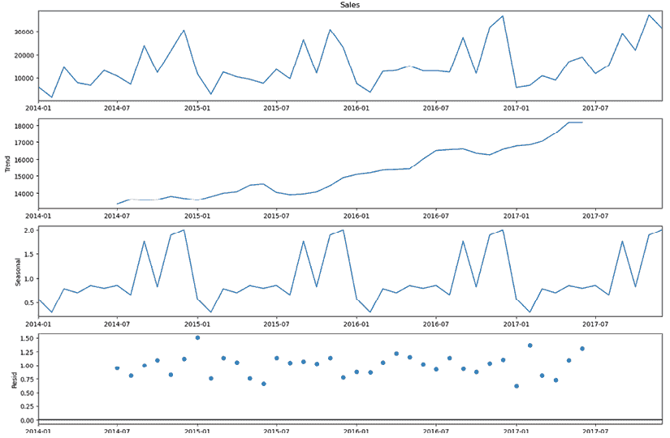

图 4.9：使用乘法方法对家具月销售数据进行的时间序列分解图

这应该与加法方法的图表非常相似。然而，有两个关键的不同之处值得注意：

+   *季节图*的 y 轴，即从底部数的第二个图表，范围从**0**到大约**2.0**，而加法图的季节性成分的 y 轴范围从大约-10,000 到 35,000。

+   同样，*残差图*的 y 轴，即最底部的图表，范围从**0**到大约**1.5**。

如您所猜到的，这是因为我们在本例中使用了乘法方法，而不是加法方法。为了从分解的趋势和季节性成分中重建原始序列，我们需要将这两个成分相乘，如下所示：

```py
reconstructed_wo_resid = decomposition.trend * decomposition.seasonal 
```

与之前类似，我们可以使用以下代码，通过我们之前使用的三个指标（相关系数、欧几里得距离和 RMSE）来衡量从乘法方法重建的序列与原始序列之间的相似度：

```py
corr = np.corrcoef(
    list(furniture_monthly_sales[dates]),
    list(reconstructed_wo_resid[dates])
)[0,1]
dist = np.sqrt(
    np.square(
        furniture_monthly_sales[dates] - reconstructed_wo_resid[dates]
    ).sum()
)
rmse = np.sqrt(
    np.square(
        furniture_monthly_sales[dates] - reconstructed_wo_resid[dates]
    ).mean()
) 
```

可以使用以下代码查看相似度指标：

```py
print(f"Correlation: {corr:.02f}\nEuclidean Distance: {dist:.02f}\nRMSE: {rmse:.02f}") 
```

这给我们以下结果：

```py
Correlation: 0.95
Euclidean Distance: 15307.16
RMSE: 2551.19 
```

如果你将这些结果与使用加法方法的前期结果进行比较，你会注意到，使用乘法方法时，欧几里得距离和 RMSE 要低得多，而相关度指标相似。乘法方法的欧几里得距离比加法方法低约**700**，乘法方法的 RMSE 比加法方法低约**100**。这表明，在这种情况下，乘法分解方法可能比加法方法更好地捕捉原始时间序列数据。

同样，我们可以使用以下代码可视化检查乘法方法的重建结果：

```py
dates = reconstructed_wo_resid.dropna().index
ax = furniture_monthly_sales[dates].plot(figsize=(10,5))
reconstructed_wo_resid[dates].plot(ax=ax, grid=True)
decomposition.trend[dates].plot(ax=ax, grid=True)
ax.set_ylabel("Sales Amount")
ax.set_xlabel("Order Date")
ax.set_title("Monthly Furniture Sales Amount")
plt.legend(["Monthly Furniture Sales", "Reconstructed (Additive)", "Trend Decomposed"])
plt.show() 
```

生成的图表应如下所示：

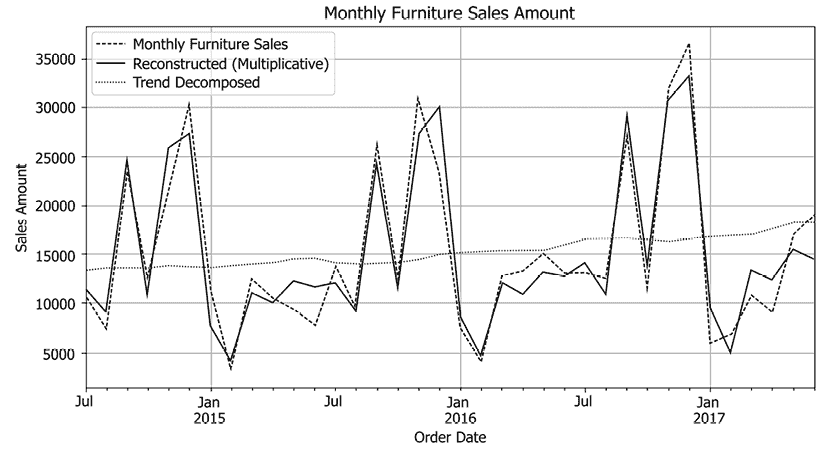

图 4.10：使用乘法方法分解趋势和重建系列后的月度家具销售图

在本节中，我们看到了如何使用`statsmodels`包统计地分解时间序列数据。如前所述，深入了解一般趋势以及季节性趋势对于制定产品和目标营销策略至关重要，因为营销策略与这些趋势的匹配以及提前于预期趋势采取行动的时间决定了营销活动的成功与失败。你不想在趋势中太晚，但也不想在趋势中太早。这种时间序列分解技术应该是一个便于策略规划和时间营销活动的实用工具。

# 时间序列预测模型

整体趋势和季节性为高效的及时营销活动提供了宝贵的见解。我们讨论了时间序列分解如何帮助营销人员及时推出促销活动，以便在需求预期上升时捕捉最大的销售和营销潜力，以及在需求预期下降时通过季节性销售促销或专注于具有不同峰值和谷值周期的产品来最小化下降和过剩库存。

我们可以进一步利用**机器学习**（**ML**）和**人工智能**（**AI**）来构建时间序列预测模型。这些 AI/ML 模型的未来预测不仅对营销至关重要，而且对销售、运营、财务、供应链、采购等多个业务单元也起着关键作用。通过利用时间序列预测，营销人员可以以多种方式优化他们的营销目标：

+   如果营销目标是推广一个**新产品**，那么时间序列预测模型输出可以告知营销人员何时开始推广最为合适，这基于对类似产品类别预期需求上升或下降的预测。

+   如果营销目标是促进**季节性销售**的增长，那么可以构建时序模型来预测可能导致最高销售额的季节性促销类型。

+   如果营销目标是清理**过剩库存**，那么可以预测不同地区或人口统计数据的不同需求的时序模型可以帮助营销人员针对特定地区或人口统计数据进行最大效率的过剩库存减少。

有许多时间序列预测算法可以用来构建预测模型。从传统的统计时间序列模型到更现代的基于深度学习的时间序列模型，有各种算法可以用来预测时间序列数据。在本节中，我们将实验两种最常用的时序模型：ARIMA 和 Prophet。

## ARIMA

**ARIMA**模型是一种统计模型，通常用于根据历史值预测未来的时间序列数据。ARIMA 是我们讨论过的回归分析的一种形式，它在**第三章**中有所提及，但 ARIMA 模型由以下三个关键组成部分构成：

+   **自回归**：ARIMA 模型中的**AR**部分

与我们讨论的自相关类似，自回归是对其滞后变量的回归，其中每个滞后变量都是预测模型的一个特征。

+   **差分**：ARIMA 模型中的**I**部分

这是指值与其前一个值之间的差异，以实现平稳性，正如之前讨论的，这意味着误差不依赖于时间成分。

+   **移动平均**：ARIMA 模型中的**MA**部分

如前所述，移动平均是在滚动窗口上的平均，ARIMA 模型对这些移动平均进行回归。

ARIMA 模型中的这三个组成部分——**自回归**（**AR**）、**差分**（**I**）和**移动平均**（**MA**）——各自有自己的参数。通常，这些参数用*p*、*d*和*q*表示，定义如下：

+   *p*：模型中 AR 部分的滞后期数

+   *d*：I 部分的差分次数

+   *q*：MA 部分的移动平均滚动窗口

### 训练 ARIMA 模型

Python 中的`statsmodels`包有一个模块，使我们能够轻松构建 ARIMA 模型。请看以下代码：

```py
from statsmodels.tsa.arima.model import ARIMA
model = ARIMA(furniture_monthly_sales[:"2017-06-01"], order=(12,1,3))
model_fit = model.fit() 
ARIMA class to build an ARIMA model in Python. For the inputs for the model, we are giving the monthly furniture sales time-series data, which is the variable furniture_monthly_sales in our case, and the parameters that we have discussed previously. As an example, we are using 12 for the *p* or AR component, 1 for the *d* or I component, and 3 for the *q* or MA component. 
```

我们建议您在用 ARIMA 实际构建预测模型时尝试各种组合，以找到最优的参数集。在这里，我们正在训练我们的 ARIMA 模型，直到 2017 年 6 月，并将测试 2017 年 7 月至 12 月的预测。

使用以下命令，我们可以查看训练好的模型结果：

```py
print(model_fit.summary()) 
```

模型总结如下：

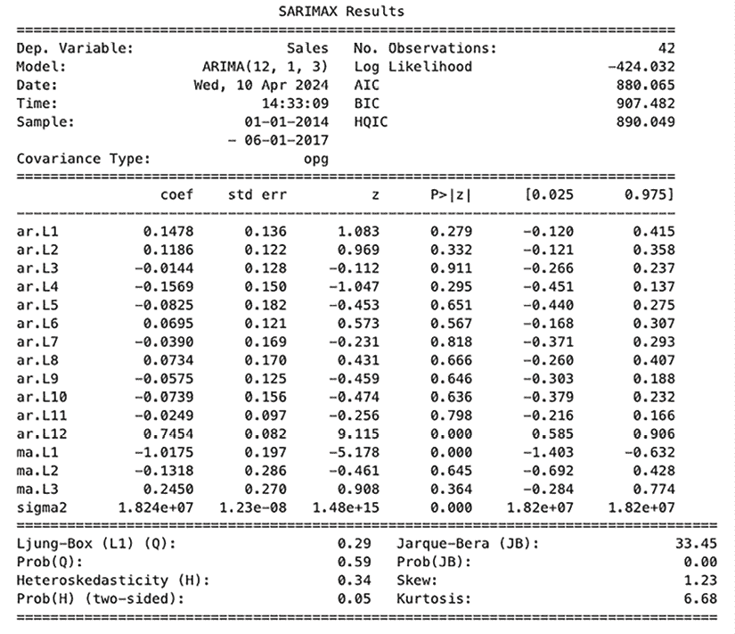

图 4.11：ARIMA 模型拟合的总结

在此模型总结输出中需要注意的一些关键事项如下：

+   **ar**：这些是 ARIMA 模型中的 AR 成分。由于我们为 AR 成分给出了 12，因此有 12 个滞后变量是这个模型回归的，每个`coef`显示了每个滞后变量与目标变量的系数。

+   **ma**：这些是 ARIMA 模型中的 MA 成分。在我们的例子中，我们为 MA 成分给出了 3，因此有三个变量是模型回归的，每个`coef`显示了每个 MA 变量与目标变量的系数。

+   **AIC/BIC**：我们不会过多地详细介绍这些指标，但**赤池信息量准则**（**AIC**）和**贝叶斯信息准则**（**BIC**）是可以用来评估模型拟合度并比较不同模型的指标。值越低，模型的拟合度越好，且没有过度拟合。

要找到一组最优的参数，您将不得不运行多个具有不同`(p, q, d)`参数集的模拟。或者，您也可以使用像`pmdarima`这样的包来自动发现 ARIMA 模型的最优参数。

参考：[`alkaline-ml.com/pmdarima/modules/generated/pmdarima.arima.auto_arima.html`](https://alkaline-ml.com/pmdarima/modules/generated/pmdarima.arima.auto_arima.html)

### ARIMA 模型诊断

`statsmodels`包提供了一个方便的方式来诊断训练好的 ARIMA 模型。`ARIMA`模型的`plot_diagnostics`函数可以用来可视化关键诊断图，如下面的代码所示：

```py
model_fit.plot_diagnostics(figsize=(12, 6))
plt.show() 
```

图表应如下所示：

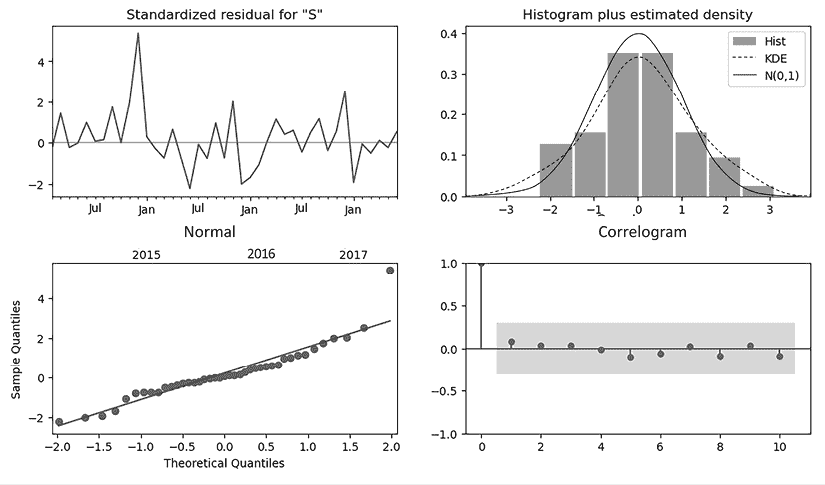

图 4.12：ARIMA 模型诊断图

如此图表所示，此诊断图中包含四个组件。让我们深入探讨每个组件：

+   **标准化残差随时间变化（左上角图表）**：此图表显示了随时间变化的残差或误差。对于一个完美的模型，我们期望它是完全随机的，没有任何明显的模式。然而，在我们的案例中，仍然有一些微小的季节性模式是可观察到的。

+   **直方图和标准化残差的估计密度（右上角图表）**：此图表显示了标准化残差的分布。对于一个完美的模型，我们期望它显示一个均值为 0、标准差为 1 的高斯或正态曲线。我们的模型非常接近理论上的正态曲线，这表明残差几乎呈正态分布。

+   **正态 Q-Q 图（左下角图表）**：此图表显示了理论分位数分布与拟合模型的实际分位数分布。它表明，当点紧密地与直线对齐时，残差是正态的。在我们的案例中，它并不完美，但与直线有些接近，这表明残差几乎呈正态分布。

+   **自相关图（右下角图表）**：此图表显示了滞后期间残差项的自相关。相关值越小，残差越随机。我们的示例显示了最小的相关性，这表明残差彼此之间没有相关性。

总结来说，这些诊断图告诉我们，在我们的情况下，残差通常是正态分布的。

### 使用 ARIMA 模型进行预测

现在，终于到了使用我们训练好的 ARIMA 模型进行预测的时候了。首先看看以下代码：

```py
pred = model_fit.get_forecast(steps=6)
pred_ci = pred.conf_int() 
```

`statsmodels`包的`ARIMA`模型提供了一个名为`get_forecast`的函数。`steps`参数用于定义您希望预测的未来步骤数。它还提供了一个名为`conf_int`的函数，它给出了预测的置信带。

我们可以用以下代码轻松地绘制预测结果：

```py
ax = furniture_monthly_sales["2015-01-01":].plot(figsize=(15,5))
pred.predicted_mean.plot(
    ax=ax, grid=True
)
ax.fill_between(
    pred_ci.index,
    pred_ci.iloc[:, 0],
    pred_ci.iloc[:, 1],
    color='cornflowerblue',
    alpha=.3
)
ax.set_xlabel('Date')
ax.set_ylabel('Furniture Sales')
plt.legend(["Observed", "Forecasted"])
plt.show() 
```

当您运行此代码时，您应该得到一个类似于以下图表的图表：

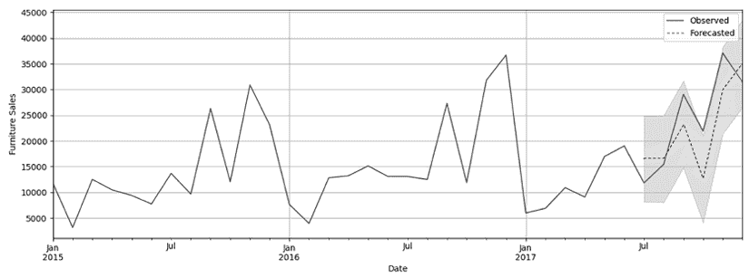

图 4.13：ARIMA 模型预测图

此图表显示了之前的月度家具销售数据以及预测和置信带或区间。如您所记得，我们使用截至 2017 年 6 月的数据训练了模型，并对 2017 年 7 月至 12 月的六个步骤进行了预测，即从 7 月到 12 月。

如您从这些预测中可以看到，ARIMA 模型的预测结果与实际观察到的数据方向上很好地吻合。此外，实际值落在置信带内，这表明基于置信区间的预测使用是可靠的。衡量时间序列预测准确率常用的指标之一是 RMSE，以下代码展示了如何使用：

```py
rmse = np.sqrt(
    np.square(furniture_monthly_sales["2017-07-01":] - pred.predicted_mean).mean()
)
rmse 
```

```py
5913.227463714012 
```

这给出了结果`5913.227463714012`。

在这里，我们对未来 6 个月的预测的 RMSE 大约是 5913。我们将在接下来的章节中与其他时间序列预测模型的值进行比较。

除了 RMSE 之外，还有许多其他指标可以用来衡量时间序列模型的表现。一些其他常用的指标包括**平均绝对误差**（**MAE**）、**平均绝对百分比误差**（**MAPE**）和**平均绝对缩放误差**（**MASE**）。尝试一些其他的回归指标，看看它们之间有何不同！

## Prophet 时间序列建模

**Prophet**是 Meta（前身为 Facebook）的一个开源包，用于时间序列预测。与刚刚讨论的 ARIMA 模型类似，Prophet 模型也考虑了趋势和季节性，但具有更多的灵活性，并且可以调整更多参数来微调时间序列模型，还包括假日效应。因此，Prophet 模型主要包含以下三个部分：

+   **增长（或趋势）**：Prophet 模型整体的增长或趋势。对于时间序列数据中的增长因子，您可以做出以下三个假设：

    +   **线性**：这是 Prophet 的默认假设，当整体趋势预期为线性时使用。

    +   **对数**：当您的时序数据趋势中存在上限或下限时，应使用此选项。

    +   **平稳**：这是指您假设随着时间的推移没有增长。

+   **季节性**：默认情况下，这设置为*auto*，但根据您在时间序列数据中的观察，您可以将其设置为模型每日、每周或年度季节性。

+   **节假日**：Prophet 的一个关键区别在于其对节假日的理解。由于节假日对时间序列结果有重大影响，因此能够使用 Prophet 对时间序列数据中的节假日效应进行建模是有益的。

在本节中，我们将使用 Prophet 对月度家具销售进行建模实验。

关于您可以使用 Prophet 微调的参数的更详细信息，我们建议您访问他们的官方网站([`facebook.github.io/prophet/docs/quick_start.html`](https://facebook.github.io/prophet/docs/quick_start.html))或他们的 GitHub 页面([`github.com/facebook/prophet/blob/main/python/prophet/forecaster.py`](https://github.com/facebook/prophet/blob/main/python/prophet/forecaster.py))。

### 训练 Prophet 模型

为了训练一个 Prophet 模型，请确保您已经安装了该包。您可以使用以下命令来安装包：

```py
pip install prophet 
```

训练 Prophet 模型的第一个步骤是准备它期望的数据。请看以下代码：

```py
from prophet import Prophet
monthly_furniture_sales_df = pd.DataFrame(
    furniture_monthly_sales[:"2016-12-01"]
).reset_index()
monthly_furniture_sales_df.columns = ["ds", "y"] 
```

如您从这段代码中可以看到，我们使用截至 2016 年 12 月的月度家具数据作为我们的训练集。对于 Prophet 模型对训练集的要求是列`ds`和`y`，其中`ds`用于给定记录的日期和时间，而`y`用于时间序列值。

使用此训练集，我们可以轻松地使用以下代码训练一个 Prophet 模型：

```py
model = Prophet()
model.fit(monthly_furniture_sales_df) 
```

在这里，我们使用`Prophet`类和默认参数初始化模型，这实际上指示模型假设线性增长趋势和没有节假日效应的季节性。然后，我们使用`fit`函数和之前准备好的训练集 DataFrame 来训练模型。

### 使用 Prophet 模型进行预测

现在我们已经训练了一个 Prophet 模型，是时候进行一些预测了。为了使 Prophet 模型能够进行预测，我们需要做的一件事是生成一系列它应该预测的日期。Prophet 提供了一个方便的函数来完成这项工作，如下所示：

```py
dates = model.make_future_dataframe(periods=24, freq='MS') 
```

在这里，我们使用`make_future_dataframe`函数。`periods`参数定义了我们希望预测多少未来的日期或周期，而`freq`参数定义了每个未来日期或周期的频率，我们将它定义为每月，以`'MS'`作为参数的输入。

新创建的变量现在应包含从 2014 年 1 月到 2018 年 12 月的日期。如您所记得，我们已将截至 2016 年 12 月为止的月度序列用作我们的训练集，因此从 2017 年 1 月到 2018 年 12 月基本上是我们想要进行预测的样本外预测。

您可以使用以下代码生成训练模型的预测：

```py
forecast = model.predict(dates) 
```

`predict`函数生成一个 DataFrame，名为`forecast`，其中包含每个时期的预测数据，例如预测值、上下限、模型趋势等。`forecast` DataFrame 中与我们最相关的几个关键字段如下：

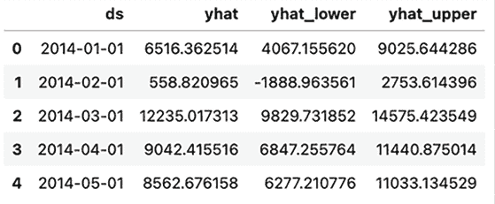

图 14.14：Prophet 模型预测结果

`yhat`列是给定时期的预测值，`yhat_lower`和`yhat_upper`是预测置信区间的下限和上限。

我们可以使用以下代码轻松地可视化这些预测和预测置信区间：

```py
fig = model.plot(forecast, uncertainty=True)
ax = fig.axes[0]
outsample_dates = furniture_monthly_sales["2017-01-01":].index
ax.plot(
    outsample_dates,
    furniture_monthly_sales.loc[outsample_dates],
    "k.",
    marker="x",
    color="red"
)
plt.legend([
    "actual (in-sample)", "predicted", "pred band", "actual (out-sample)"
])
plt.show() 
```

让我们仔细看看这段代码。Prophet 模型对象有一个`plot`函数，它生成一个包含预测值的折线图、预测区间为面积图、实际值为散点图的图表。然后，我们添加样本外数据点作为带有标记`x`的散点图。此图表应如下所示：

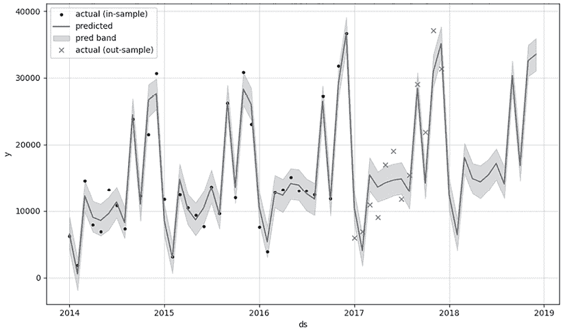

图 4.15：Prophet 模型预测图

与我们使用 ARIMA 模型所做的一样，我们也可以使用以下代码查看 Prophet 模型预测的 RMSE：

```py
rmse = np.sqrt(
    np.square(
        forecast.loc[
            forecast["ds"].isin(outsample_dates)
        ]["yhat"].to_numpy() - furniture_monthly_sales.loc[outsample_dates].to_numpy()
    ).mean()
)
print(f"Out-Sample RMSE: {rmse:.02f}") 
```

结果如下：

```py
Out-Sample RMSE: 4295.65 
```

与 ARIMA 模型的 RMSE 大约为 5913 相比，RMSE 约为 4295 的 Prophet 模型似乎有更接近实际的预测。

最后，Prophet 还建模趋势和季节性分解，并提供了一种简单的方式来可视化它们，如下面的代码所示：

```py
model.plot_components(forecast) 
```

生成的图表应如下所示：

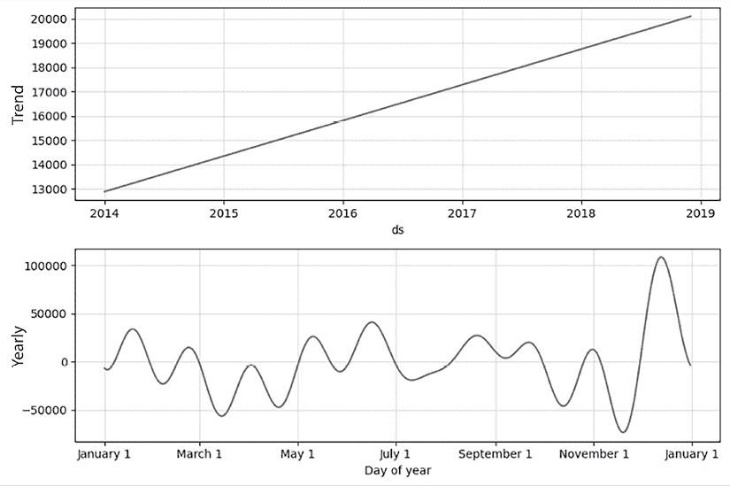

图 4.16：Prophet 模型时间序列分解图

与我们之前将时间序列数据分解为趋势和季节性时所见到的类似，Prophet 模型也识别出整体上升趋势、12 月份的峰值和 1 月份的下降。到目前为止，我们已经看到，Prophet 提供了方便且可靠的工具来建模时间序列数据。

基于这些知识，我们将在下一节探讨使用深度学习方法建模时间序列数据的另一种方式。

## 其他时间序列模型

在本章中，我们讨论了使用 ARIMA 和 Prophet 进行时间序列建模。然而，还有各种其他算法和模型可以用来建模时间序列数据。时间序列建模主要有以下三种方法：

1.  **统计模型**：用于建模时间序列数据的统计方法已经存在了几十年。ARIMA 模型是最常用的统计模型之一，于 20 世纪 70 年代开发，至今仍在使用。以下是一些常用的其他统计模型：

    +   **指数平滑法**：这是最古老的时间序列预测方法之一，它对最近的观测值给予更大的权重，用于平均时间序列数据点。

    +   **广义自回归条件异方差（GARCH）**：在金融领域常用的模型，用于建模误差项的方差，这些误差项依赖于时间，如随时间增加或减少波动性或方差。

    +   **季节性 ARIMA（SARIMA）**：ARIMA 模型的扩展，在 ARIMA 组件之上加入了季节性成分。

1.  **机器学习（ML）模型**：尽管不如其他统计模型和深度学习模型常用，ML 模型仍被用于时间序列预测和快速检查时间序列的可预测性。ML 模型相对于统计模型的优势在于，在构建预测模型时可以使用各种特征，而用于时间序列预测的统计模型通常具有单变量性质。以下是一些常用的 ML 模型：

    1.  **线性回归**：在机器学习中是最基本的回归模型之一，可以用来模拟具有各种特征的时间序列数据。特征工程是使线性回归模型强大的关键。

    1.  **基于树的模型**：XGBoost 通过顺序构建决策树来学习数据，这些决策树从先前树的错误中学习，或者随机森林，通过构建一个决策树集合来学习数据，每个决策树学习数据的一部分，可以用于时间序列预测。能够模拟各种特征之间的交互和关系，为建模具有复杂特征相互关系的时序数据提供了优势。

    1.  **支持向量机（SVM）**：当数据集有噪声或数据集的维度很大时，SVM 无法执行，因为它通过找到最大化不同类别之间分离的超平面来学习数据，在高维空间中构建这样一个有效的超平面是困难的，但 SVM 仍被用于时间序列预测。

1.  **深度学习（DL）模型**：随着计算资源的可用性和可访问性的提高，DL 驱动的时序建模已经取得了许多进展。与其他任务，如图像识别和**自然语言处理（NLP**），类似，DL 模型越来越多地被用于制作准确的时间序列预测：

    1.  **循环神经网络（RNN）模型**：RNN 是一种设计用于处理序列数据的神经网络。由于 RNN 模型“记住”之前的输入以进行未来的预测，因此它们在处理如语音和时间序列数据等序列数据时表现良好。DeepAR、ESRNN 和 AR-Net 是一些基于 RNN 的时间序列预测模型。

    1.  **多层感知器（MLP）模型**：MLP 是一种具有多个神经元层的神经网络，其中每个层都学习数据并提取特征。基于 MLP 的模型，如 N-BEATS、NHiTs 和 TSMixer，通常具有深度堆叠的全连接层。这一组模型在实践中的应用已被证明效果良好。

    1.  **基于 Transformer 的模型**：随着基于 Transformer 的模型在自然语言处理领域的成功，这些模型使用多头注意力机制，能够捕捉输入中的不同关系和依赖，因此基于 Transformer 的时间序列模型和架构也在积极开发中。**时间融合 Transformer（TFT**）是一个基于 Transformer 的时间序列预测模型的例子，它适用于多步和多元时间序列预测。

        **如何构建用于时间序列数据的深度学习模型**

        有许多 Python 包可以帮助你构建时间序列模型。Darts、Kats、PyCaret 和 PyTorch Forecasting 是一些常用的 Python 包，它们提供了易于使用的深度学习模型实现，用于时间序列预测。如果你想查看本章 N-BEATS 模型应用的示例，请访问以下 GitHub 仓库：

        [`github.com/yoonhwang/Machine-Learning-and-Generative-AI-for-Marketing/blob/main/ch.4/TimeSeriesAnalysis.ipynb`](https://github.com/yoonhwang/Machine-Learning-and-Generative-AI-for-Marketing/blob/main/ch.4/TimeSeriesAnalysis.ipynb)

# 摘要

在本章中，我们讨论了时间序列分析的重要性及其在市场营销中的应用。从分析数据随时间进展的基本方法，以及从这些分析中可以收集到的故事和洞察，到高级时间序列预测模型的发展，我们触及了时间序列分析中的广泛主题。我们看到了移动平均数、自相关及其可视化在理解随时间发生的事件的全貌中扮演的关键角色。我们还介绍了如何将时间序列数据分解为趋势和季节性，从而揭示商业和不同产品线中周期性的隐藏洞察。最后，我们尝试了两种常用的统计方法来建模时间序列数据，以及如何对未来进行预测，以便用于更高效和及时的市场营销活动。尽管本章没有深入讨论，但我们分享了一些其他正在使用和开发的 AI/ML 模型。请确保查看本章的 GitHub 仓库，以了解构建用于时间序列预测的深度学习模型的示例。我们将在本书的第四章中更深入地探讨深度学习和生成式 AI。

在下一章中，我们将探讨语言建模以及您如何从它中获得益处，用于您接下来的市场营销活动。我们将讨论如何使用和应用一些自然语言处理技术，以情感分析为例，以及它如何使营销人员能够衡量公众对品牌或产品的看法，并监控和优化营销信息，以更好地与客户偏好保持一致。

# 加入我们书籍的 Discord 空间

加入我们的 Discord 社区，与志同道合的人相聚，并和超过 5000 名成员一起学习，详情请见：

[`packt.link/genai`](https://packt.link/genai)


