# 6

# 利用预测分析和 A/B 测试提升客户参与度

我们可以通过多种方式从数据驱动和 AI/ML 驱动的营销技术中受益。例如，您可以根据我们已在*第二章*和*第三章*中讨论的先前营销活动的成功和失败背后的关键驱动因素来优化您的营销策略。您还可以根据您业务中的趋势和季节性，或者根据您产品和业务周围的客户情绪来优化您的营销策略，正如我们在*第四章*和*第五章*中所讨论的那样。目标产品推荐(*第七章*)和利用生成式 AI 优化营销内容(*第九章*和*第十章*)是应用 AI/ML 在营销中的其他一些关键好处。

在所提及的主题中，我们将在本章中尝试预测分析，以及如何在您的下一次营销活动中利用这些预测模型。通过智能预测客户的预期行为，您可以针对可能对您有利的客户群体进行定位。这样，您就不必对整个潜在客户群进行大规模营销，而可以更好地定制您的营销信息，并且由于您只针对成功率更高的群体，因此还可以节省营销成本。我们还将讨论如何进行 A/B 测试来决定您下一次营销活动的最佳预测模型。

在本章中，我们将涵盖以下主题：

+   使用基于树的算法预测客户转化

+   使用深度学习算法预测客户转化

+   进行 A/B 测试以选择最佳模型

# 使用基于树的算法预测客户转化

预测分析或建模可以在客户生命周期的各个阶段应用。如果您还记得*第二章*，我们可以将客户生命周期分解为以下五个主要阶段：**意识**、**参与**、**转化**、**保留**和**忠诚度**，如下面的图所示：

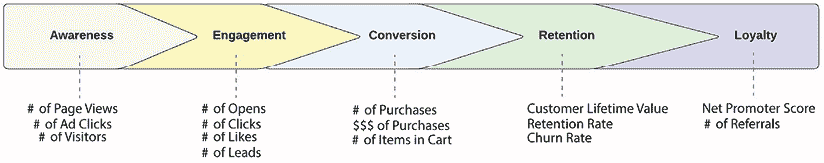

图 6.1：第二章中的客户生命周期图

预测建模的应用范围很广，取决于你的营销目标。例如，如果你有一个新品牌或产品发布，并希望通过社交媒体上的广告提高新产品知名度，你可以构建预测模型来帮助你识别可能点击广告的目标客户。另一方面，如果你想提高产品购买转化率，你可以构建预测模型来识别在接下来的 X 天内更有可能进行购买的客户，并针对他们进行营销。这会导致更有效的营销，因为你可以避免客户因频繁接触不相关的内容而感到疲劳，这种情况通常发生在你没有针对正确的客户子群体进行大规模营销时。此外，你可以通过只向特定的客户子群体发送营销材料来降低营销成本。这将帮助你将剩余的营销预算重新用于其他营销活动。

不仅你可以利用预测分析来提高品牌知名度、参与度和转化率，预测分析还可以用来提高客户保留率。通常，会建立客户流失可能性模型来识别哪些客户有离开你生意的风险。通过这些客户流失预测，你可以构建针对这一高流失风险群体的定制化营销策略和营销内容，以将他们重新变为活跃客户。折扣、免费订阅试用或免费计划升级通常作为保留策略的一部分提供给这一高流失风险群体。

## 基于树的机器学习算法

可以使用多种 AI/ML 算法进行预测建模，例如线性回归、逻辑回归和决策树模型，这些我们在前面的章节中已经讨论过，以及正在日益普及的深度学习模型。在本章中，我们将使用基于树的模型构建预测模型，例如随机森林和梯度提升树，以及神经网络模型，它们是深度学习模型的核心。任何基于树的机器学习模型下面都有一个决策树。正如我们在*第三章*中讨论的，决策树就像一个流程图，它根据获得的信息分成子节点。每个节点代表一个分割的问题或标准，每个分支或边代表在节点提出的问题的结果。以下图表展示了决策树可能构建的高级概述：

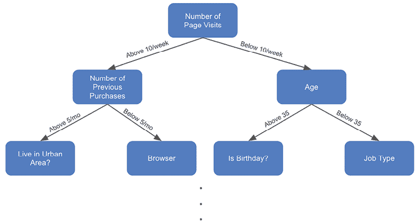

图 6.2：决策树的示意图

在众多的基于树的机器学习模型中，**梯度提升决策树**（GBDT）和随机森林是最常用的两种模型，经常用于预测建模。GBDT 和随机森林模型都是由多个决策树构建的。然而，主要区别在于这些决策树是如何构建的。

简而言之，随机森林模型是一个包含许多决策树的模型，其中每个决策树都是使用数据集的随机子样本和特征子集构建的。这样，随机森林中的每个决策树都会以略微不同的方式学习数据中的信息或关系，并具有不同的关注区域。

最终预测是这些单个决策树的所有结果或预测的平均值。以下是一个随机森林的示意图：

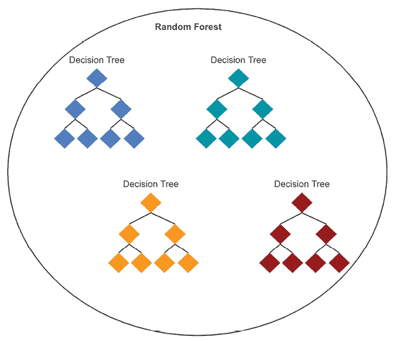

图 6.3：随机森林的示意图

与此同时，GBDT 模型也由许多决策树组成，但每个决策树是顺序构建的，每个后续的决策树都是基于前一个决策树所犯的错误进行训练的。GBDT 模型的最终预测是所有单个决策树预测的加权平均值。以下是一个 GBDT 模型的示意图：

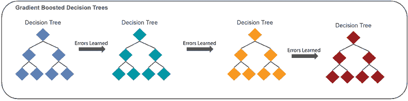

图 6.4：GBDT 的示意图

## 构建随机森林模型

在本章中，我们将使用在线购买数据集作为示例来构建一个预测模型，以预测客户是否会进行转换。首先，我们将讨论如何使用`scikit-learn`包在 Python 中构建随机森林模型。

**源代码和数据**：[`github.com/PacktPublishing/Machine-Learning-and-Generative-AI-for-Marketing/tree/main/ch.6`](https://github.com/PacktPublishing/Machine-Learning-and-Generative-AI-for-Marketing/tree/main/ch.6)

**数据来源**：[`archive.ics.uci.edu/dataset/468/online+shoppers+purchasing+intention+dataset`](https://archive.ics.uci.edu/dataset/468/online+shoppers+purchasing+intention+dataset)

### 目标变量和特征变量

我们首先需要定义目标和特征变量，其中目标变量是我们想要预测的因素，特征变量是模型将学习以进行预测或决策的因素。为此，你可以遵循以下步骤：

1.  让我们先加载数据到一个 DataFrame 中，并检查我们可以用于我们的随机森林模型的特征：

    ```py
    import pandas as pd
    df = pd.read_csv("./data.csv")
    df.info() 
    ```

当你运行此代码时，你应该看到以下输出，这是关于此数据的信息：

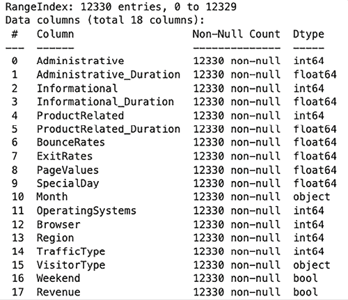

图 6.5：示例数据集摘要

1.  在前面的输出中，首先要注意的是列，`Revenue`，这是目标变量，它告诉我们客户是否进行了购买或转换，其类型为`布尔型`。另一列，`Weekend`，也具有`布尔型`数据类型。我们将使用以下代码将它们编码为`0`表示 False 和`1`表示 True：

    ```py
    df["Revenue"] = df["Revenue"].astype(int)
    df["Weekend"] = df["Weekend"].astype(int) 
    ```

1.  然后，有两列的数据类型为 `object`，分别是 `Month` 和 `VisitorType`。如果你仔细观察，`Month` 列的月份值是字符串，我们将将其转换为相应的月份数字。`VisitorType` 列有三个唯一值，`New_Visitor`、`Returning_Visitor` 和 `Other`。我们将分别将其编码为 `0`、`1` 和 `2`，如下所示：

    ```py
    from time import strptime
    df["MonthNum"] = df["Month"].apply(lambda x: strptime(x[:3],'%b').tm_mon)
    df["VisitorTypeNum"] = df["VisitorType"].apply(
            lambda x: 0 if x == "New_Visitor" else 1 if x == "Returning_Visitor" else 2
    ) 
    ```

如此代码所示，我们正在使用 `time` 模块的 `strptime` 函数将三个字母的月份字符串值编码为相应的月份数字。然后，我们使用 `pandas` DataFrame 的 `apply` 函数将 `VisitorType` 列的每个值编码为相应的整数值。

1.  现在我们已经将所有列值转换为数值，我们将定义目标和特征变量，如下所示：

    ```py
    TARGET = "Revenue"
    FEATURES = [
        'Administrative',
        'Administrative_Duration',
        'BounceRates',
        'Browser',
        'ExitRates',
        'Informational',
        'Informational_Duration',
        'MonthNum',
        'OperatingSystems',
        'PageValues',
        'ProductRelated',
        'ProductRelated_Duration',
        'Region',
        'SpecialDay',
        'TrafficType',
        'VisitorTypeNum',
        'Weekend'
    ]
    X = df[FEATURES]
    Y = df[TARGET] 
    ```

如此代码所示，我们已定义目标变量 `TARGET` 使用 `Revenue` 列，其余列作为特征变量 `FEATURES`。然后，我们创建了一个 DataFrame `X`，它是特征集，以及 `Y`，它是目标序列。

1.  最后，我们将使用以下代码将这些目标和特征集拆分为训练集和测试集：

    ```py
    from sklearn.model_selection import train_test_split
    train_x, test_x, train_y, test_y= train_test_split(
        X, Y, test_size=0.2
    ) 
    ```

我们正在使用 `sklearn.model_selection` 模块中的 `train_test_split` 函数。从 `test_size` 参数可以看出，我们正在使用数据集的 80%进行训练，其余 20%用于测试。

使用这些训练集和测试集，我们现在可以准备训练一个随机森林模型。

### 训练随机森林模型

Python 的 `scikit-learn` 包提供了一个方便的方式来创建随机森林模型。看看以下代码：

```py
from sklearn.ensemble import RandomForestClassifier
rf_model = RandomForestClassifier(
    n_estimators=250, max_depth=5, class_weight="balanced", n_jobs=-1
)
rf_model.fit(train_x, train_y) 
```

让我们更仔细地看看这段代码。我们正在使用 `sklearn.ensemble` 模块中的 `RandomForestClassifier` 类，并使用 `n_estimators`、`max_depth`、`class_weight` 和 `n_jobs` 参数初始化一个随机森林模型：

+   `n_estimators` 参数定义了要构建多少个单独的决策树。

+   `max_depth` 参数定义了每个决策树可以生长多深。与其他参数，如 `min_samples_split`、`min_samples_leaf` 和 `max_features` 一起，`max_depth` 通过限制决策树的生长来帮助防止过拟合问题。

+   `class_weight` 参数定义了每个类的权重。当数据集不平衡时，此参数非常有用。在我们的示例数据集中，只有大约 15%属于正类，这意味着只有 15%的目标变量，收入，其值为 1，或者只有 15%的客户已经转化。你可以为每个类提供自定义权重，作为一个字典，或者使用 `"balanced"` 选项来自动调整与实际类频率成反比的权重。

+   最后，`n_jobs` 参数定义了要并行运行多少个作业。如果您还记得我们关于随机森林和 GBDTs 的讨论，随机森林是一系列决策树，因此可以并行构建单个树，而不依赖于其他树。通过将 `-1` 作为此参数的输入，您指示它使用所有可用资源来训练此随机森林模型。

使用这些参数，我们现在可以使用 `fit` 函数和训练集来训练这个随机森林模型。

**过拟合与欠拟合？**

过拟合是指模型拟合到训练集过于紧密，在训练数据上表现良好，但在模型之前未见过的数据上表现较差。另一方面，欠拟合是指模型过度泛化或没有足够地调整到训练集，以至于没有学习到特征变量和目标变量之间的关系。通常需要多次迭代超参数调整，以找到最小过拟合的最佳点。

### 预测和评估随机森林模型

`RandomForestClassifier` 对象提供了从训练好的随机森林模型进行预测的便捷函数。请看以下代码：

```py
rf_pred = rf_model.predict(test_x)
rf_pred_proba = rf_model.predict_proba(test_x)[:,1] 
```

如其名所示，`predict` 函数对给定的输入进行预测。在我们的例子中，结果将是测试集中每个记录的 0 和 1 的列表，因为我们正在预测客户是否已经转换。

`predict_proba` 函数也对给定的输入进行预测，但不同之处在于它给出介于 `0` 和 `1` 之间的预测概率。它为每个记录和每个类别返回预测概率，因此，在我们的例子中，它为每个记录返回两个值，其中第一个元素是预测为类别 `0` 的概率，第二个元素是预测为类别 `1` 的概率。由于我们只对类别 1 的预测概率感兴趣，我们使用 `[:,1]` 来切片，这样我们就有了一个转换预测概率的列表。

现在我们有了预测的转换概率，我们需要评估我们的预测有多好。

评估预测模型的准确性和有效性的方法有很多，但我们将主要关注整体准确率、精确率、召回率、**曲线下面积**（**AUC**）- **接收者操作特征**（**ROC**）曲线和混淆矩阵。我们将通过示例深入探讨这些指标。

正如其名所示，**准确率**是所有预测中正确预测或**真正例**（**TP**）的百分比。**精确率**是预测正例中正确预测的百分比，或者是预测为正例中包括**假正例**（**FP**）的真正例的百分比。**召回率**是模型识别出的正例的百分比，或者是实际正例中包括真正例和**假负例**的真正例的百分比。准确率、精确率和召回率的公式如下：

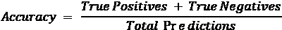

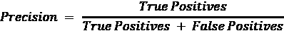

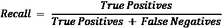

在 Python 中，scikit-learn 包提供了一个方便的工具来计算这些指标，如下面的代码所示：

```py
from sklearn import metrics
accuracy = (test_y == rf_pred).mean()
precision = metrics.precision_score(test_y, rf_pred)
recall = metrics.recall_score(test_y, rf_pred) 
```

在我们的例子中，当运行这些代码时，这些关键指标的结果如下：

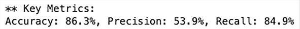

图 6.6：随机森林模型性能指标摘要

这些结果表明，我们训练的随机森林模型具有相当的整体准确率和召回率，但在精确率方面似乎表现不佳。这表明，在这个模型预测为正例或可能转换的客户中，只有大约 54%实际上已经转换。然而，如果你还记得，实际的总体转换率是 15%；换句话说，如果你随机猜测谁会转换，你可能只有 15%的时间是正确的。

因此，由于这个模型有 54%的时间预测了转换客户，这证明了它在选择更有可能转换的客户方面比随机猜测要有效得多。此外，高召回率表明，实际上已经转换的客户中有大约 85%是那些被这个模型预测为高度可能转换的客户。

从实际的市场营销角度来看，如果你只针对这个模型预测可能转换的客户进行营销，你仍然会捕获到大多数这些转换。此外，如果你针对你的整个客户群进行营销，85%（100%减去 15%，这是整体转换率）的营销支出将会浪费。但是，如果你只针对这些高度可能的客户进行营销，只有大约 46%（100%减去 54%，这是该模型的精确度）的营销支出将会浪费。

我们将要关注的另一个关键评估指标是**AUC-ROC 曲线**。简单来说，**ROC 曲线**显示了在牺牲**假正率**（**FPR**）的情况下，每个牺牲所获得的**真正率**（**TPR**）的权衡。**AUC**，正如其名所示，是 ROC 曲线下的面积，告诉我们模型在区分正例和负例方面的表现如何。AUC 的范围从`0`到`1`，数值越高，模型越好。在 AUC 为`0.5`时，表明模型的表现与随机猜测相同。

下面的代码可以用来绘制 ROC 曲线：

```py
dp = metrics.RocCurveDisplay.from_predictions(
    test_y,
    rf_pred_proba,
    name="Conversion",
    color="darkorange",
)
_ = dp.ax_.set(
    xlabel="False Positive Rate",
    ylabel="True Positive Rate",
    title="ROC Curve",
)
plt.grid()
plt.show() 
```

在这里，我们再次使用`metrics`模块来绘制 ROC 曲线。计算准确率、精确率和召回率与计算 AUC-ROC 曲线之间的主要区别在于我们如何使用预测概率`rf_pred_proba`而不是预测标签`pred`。这是因为 ROC 曲线检查在不同概率水平下 TPR 和 FPR 如何变化。通过使用预测概率，我们可以计算随着决策阈值的改变，TPR 和 FPR 如何变化。生成的图表如下所示：

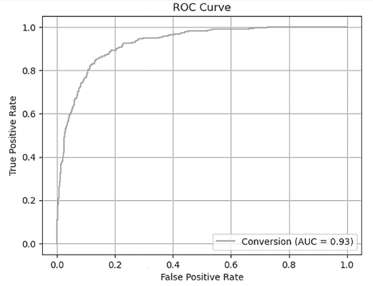

图 6.7：随机森林模型预测的 AUC-ROC 曲线

如您从这张图表中可以看到，您可以轻松评估每个 FPR 的牺牲如何影响 TPR。例如，在这张图表中，在 20% FPR 的情况下，我们已经实现了大约 90%的 TPR，这表明该模型在区分正例和负例方面表现良好。这里的 AUC 为`0.93`，这也表明模型在识别正例和负例方面表现良好。

最后，我们将查看**混淆矩阵**。正如其名所示，混淆矩阵是查看模型在何处以及如何最容易被混淆的好方法。以下是一个示例，可以帮助理解。请看以下代码：

```py
import seaborn as sns
cf_matrix = metrics.confusion_matrix(test_y, rf_pred)
ax = plt.subplot()
sns.heatmap(
    cf_matrix,
    annot=True,
    annot_kws={"size": 10},
    fmt="g",
    ax=ax
)
ax.set_xlabel("Predicted")
ax.set_ylabel("Actual")
ax.set_title(f"Confusion Matrix")
plt.show() 
```

与之前类似，我们使用`metrics`模块构建混淆矩阵。`confusion_matrix`函数接受实际值和预测值，并构建混淆矩阵。然后，我们使用`seaborn` Python 包中的`heatmap`函数绘制热图。生成的图表如下所示：

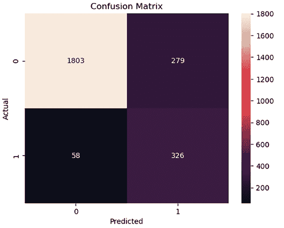

图 6.8：随机森林模型预测的混淆矩阵

如您从这张图中可以看到，y 轴表示实际类别，x 轴表示预测类别。例如，左上方的框是实际类别为 0 或无转换，预测类别也是`0`的地方。右上方的框是实际类别为 0，但模型预测它们属于类别`1`或转换的地方。

如您所见，混淆矩阵显示了模型最困惑的地方。一个预测结果准确率高的模型将在对角线框中有大量数字或百分比，而在其他框中有小数字。

我们已经尝试使用随机森林模型预测客户转换的可能性。在这里，我们观察并讨论了如何使用这个随机森林预测模型帮助定位客户群的一部分，同时不会失去太多已转换的客户，以及这如何导致更具成本效益的营销策略。

## 梯度提升决策树（GBDT）建模

我们将使用相同的 dataset 和 train/test sets 来构建 GBDT 模型，并将其性能与我们刚刚构建的随机森林模型进行比较。XGBoost 是 Python 中用于训练 GBDT 模型最常用的库。您可以在终端或 Jupyter Notebook 中使用以下命令安装此包：

```py
pip install xgboost 
```

### 训练 GBDT 模型

XGBoost 包遵循与`scikit-learn`包相同的模式。请看以下代码：

```py
from xgboost import XGBClassifier
xgb_model = XGBClassifier(
    n_estimators=100,
    max_depth=5,
    scale_pos_weight=1/train_y.mean(),
)
xgb_model.fit(train_x, train_y) 
```

如此代码所示，我们使用`n_estimators`、`max_depth`和`scale_pos_weight`参数初始化了一个`XGBClassifier`：

+   与随机森林模型的情况类似，`n_estimators`参数定义了要构建多少个单个决策树。你可能已经注意到，我们为这个参数使用了一个非常低的数字。如果你还记得，GBDT 模型是顺序构建的，其中每个后续的决策树都会学习前一个决策树犯的错误。这通常会导致更少的单个树表现出与随机森林模型相当或更好的性能。

此外，由于 GBDT 模型是顺序构建的，与可以并行构建单个决策树的随机森林模型相比，大量决策树会导致训练时间更长。

+   另一个参数`max_depth`与随机森林模型的情况相同。此参数限制了每个决策树可以生长的深度。

+   最后，`scale_pos_weight`参数定义了正负类权重的平衡。你可能还记得，我们有一个不平衡的数据集，其中正类仅占数据的约 15%。通过使用`1/train_y.mean()`对正类给予成反比的权重，我们指示模型调整不平衡数据集。这强制 GBDT 模型对正类的不正确预测进行更多惩罚，从而使模型对正类更加敏感。

当 GBDT 模型中包含大量单个决策树时，通常会存在潜在的过拟合问题，处理这些问题的方法有很多。除了`max_depth`参数之外，XGBoost 包还提供了其他各种参数，例如`max_leaves`、`colsample_bytree`、`subsample`和`gamma`，这些参数可以帮助减少过拟合。

我们建议您查看文档，并尝试各种参数，看看它们如何帮助您防止过拟合。

这里是文档：[`xgboost.readthedocs.io/en/latest/python/python_api.html#xgboost.XGBClassifier`](https://xgboost.readthedocs.io/en/latest/python/python_api.html#xgboost.XGBClassifier)。

### 预测和评估 GBDT 模型

与随机森林模型的`RandomForestClassifier`类似，`XGBClassifier`对象也提供了相同的语法来预测训练好的 GBDT 模型。请看以下代码：

```py
xgb_pred = xgb_model.predict(test_x)
xgb_pred_proba = xgb_model.predict_proba(test_x)[:,1] 
```

如此代码所示，你可以使用`predict`函数预测测试集中每个记录的正负标签，并使用`predict_proba`函数预测测试集中每个个体记录的每个类别的概率。与之前一样，我们通过使用`[:,1]`切片输出以获取正类预测概率（即转换的预测概率），来获取测试集中每个记录的预测概率。

为了比较这个 GBDT 模型与随机森林模型的性能，我们将使用相同的评估指标和方法。你可能还记得，我们可以使用以下代码来获取准确率、精确率和召回率的关键指标：

```py
accuracy = (test_y == xgb_pred).mean()
precision = metrics.precision_score(test_y, xgb_pred)
recall = metrics.recall_score(test_y, xgb_pred) 
```

由于构建这些树时存在一些随机性，每次训练 GBDT 模型时都可能会有一些方差和差异，但在此写作时，结果如下所示：

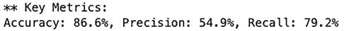

图 6.9：GBDT 模型性能指标总结

这些关键指标看起来与随机森林模型非常相似。这个 GBDT 模型的整体准确率和精确率略高于随机森林模型。然而，召回率略低于随机森林模型。

同样，可以使用以下代码绘制 AUC-ROC 曲线：

```py
dp = metrics.RocCurveDisplay.from_predictions(
    test_y,
    xgb_pred_proba,
    name="Conversion",
    color="darkorange",
)
_ = dp.ax_.set(
    xlabel="False Positive Rate",
    ylabel="True Positive Rate",
    title="ROC Curve",
)
plt.grid()
plt.show() 
```

生成的 AUC-ROC 曲线如下所示：

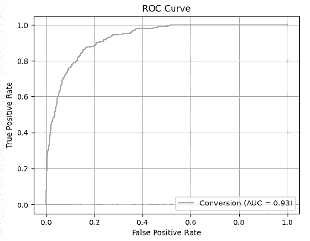

图 6.10：GBDT 模型预测的 AUC-ROC 曲线

当你将此与随机森林模型进行比较时，结果几乎相同。AUC 约为`0.93`，在 FPR 为`0.2`时，GBDT 模型的 TPR 也约为`0.9`，这与之前构建的随机森林模型的情况相同。

最后，让我们通过以下代码查看混淆矩阵：

```py
import seaborn as sns
cf_matrix = metrics.confusion_matrix(test_y, xgb_pred)
ax = plt.subplot()
sns.heatmap(
    cf_matrix,
    annot=True,
    annot_kws={"size": 10},
    fmt="g",
    ax=ax
)
ax.set_xlabel("Predicted")
ax.set_ylabel("Actual")
ax.set_title(f"Confusion Matrix")
plt.show() 
```

生成的混淆矩阵如下所示：

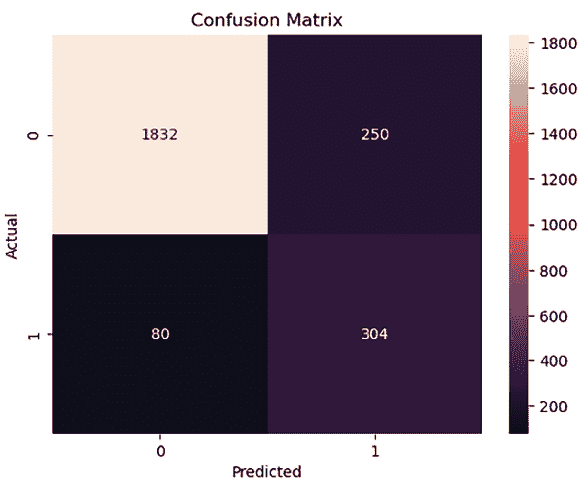

图 6.11：GBDT 模型预测的混淆矩阵

当你将此与随机森林模型的混淆矩阵进行比较时，你会注意到 GBDT 模型的 TPs 较低，但 GBDT 模型的假阴性也较低。这是预期的，因为我们已经看到 GBDT 模型的精确率较高，但与随机森林模型相比，召回率较低。

总体而言，随机森林和 GBDT 模型的性能非常相似，从这些例子中难以区分。根据你如何微调你的模型，你可能会得到一个更好的随机森林或 GBDT 模型。

有许多方法和参数可以微调基于树的模型。我们建议你尝试不同的参数集，看看它们如何影响模型性能！

# 使用深度学习算法预测客户转化

深度学习已成为热门话题，其流行度和使用率都在上升，因为深度学习模型已被证明在数据变量之间存在复杂关系时表现良好，并且可以从数据中自主学习和提取特征，尽管基于树的模型也非常频繁地被使用，并且在预测建模方面非常强大。我们在*第五章*中提到了深度学习，当时我们使用了预训练的语言模型进行情感分析和分类。在本节中，我们将在此基础上构建知识，并实验开发深度学习模型用于预测建模，特别是用于预测哪些客户可能转化的预测。

深度学习基本上是一种**人工神经网络**（**ANN**）模型，具有许多隐藏和复杂的神经元层，或者说，是一种深度 ANN。ANN 是一种受动物和人类大脑中生物神经网络启发的模型。ANN 通过类似动物和人类大脑的相互连接的神经元层来学习数据。以下图表显示了 ANN 的高级结构：

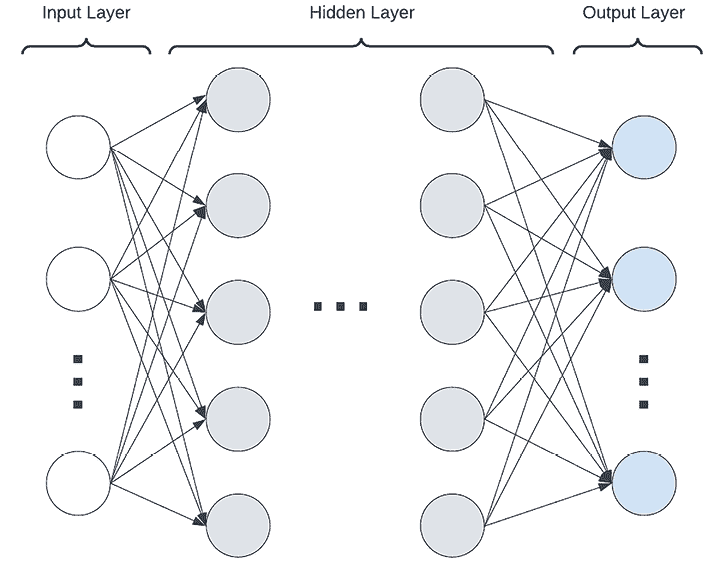

图 6.12：示例 ANN 架构

如此图表所示，任何深度学习或 ANN 模型都有三个层次：输入层、隐藏层和输出层。ANN 模型如何学习或构建隐藏层权重的详细解释超出了本书的范围，但就高层次而言，它们通过前向传播和反向传播的迭代进行：

+   前向传播是将数据从输入层通过网络传递到输出层，并应用激活函数的过程，无论每个神经元是否被激活，并返回每个节点的输出。

+   反向传播是从输出层到输入层的移动过程，通过分析前一次迭代的损失或误差来调整网络的权重。

通过这些前向和反向传播的迭代，神经网络学习每个神经元的权重，以最小化预测误差。

应该尝试不同的隐藏层数量和每层的神经元数量，以找到最适合每个预测模型案例的最佳神经网络架构。在本节中，我们将实验比较宽神经网络架构与深度神经网络架构的性能。

**何时使用宽神经网络与深度神经网络？**

宽神经网络指的是具有较少层但每层有更多神经元的 ANN 模型，而深度神经网络指的是具有许多隐藏层的 ANN 模型。除了比较模型性能以确定哪种架构更适合您的案例之外，还有一些关键因素您可能需要考虑或限制采取哪种方法：

+   **训练时间和计算资源**：随着层数的增加，训练需要更多的时间，因为每一层的反向传播都是计算密集型的，这也导致了更高的计算成本。宽神经网络可能在缩短训练时间和降低计算成本方面具有优势。

+   **模型可解释性**：与深度神经网络相比，较浅的架构可能提供更好的可解释性。如果可解释性是一个要求，浅层架构可能更适合。

+   **泛化能力**：深度神经网络模型通常能够通过更多的层捕获更抽象的模式，并且与宽神经网络相比，能够学习更高阶的特征。这可能导致深度架构模型在新的和未见过的数据上具有更好的性能。

## 深度学习模型的训练集和测试集

为了神经网络模型的最佳性能，您需要在训练模型之前对数据进行归一化。我们将使用之前用于树模型的相同训练集和测试集，但对其进行归一化。看看以下代码：

```py
mean = train_x.mean()
std = train_x.std()
normed_train_x = (train_x - mean)/std
normed_test_x = (test_x - mean)/std 
```

如此代码所示，我们首先从训练集中获取均值和标准差，并通过减去均值并除以标准差来归一化训练集和测试集。标准化后，`normed_train_x` DataFrame 的所有列的均值应为`0`，标准差为`1`。

## 宽神经网络建模

我们将首先使用 Python 中的`keras`包构建**宽神经网络**模型。

要在您的机器上安装`keras`，请在您的终端中运行以下命令：

```py
pip install keras 
```

### 训练宽神经网络模型

使用归一化的训练集和测试集，让我们开始构建神经网络模型。看看以下代码，了解如何初始化神经网络模型：

```py
import keras
model = keras.Sequential(
    [
        keras.Input(shape=normed_train_x.shape[1:]),
        keras.layers.Dense(2048, activation="relu"),
        keras.layers.Dropout(0.2),
        keras.layers.Dense(1, activation="sigmoid"),
    ]
) 
```

如您从以下代码中可以看到，我们使用`Sequential`类创建了一系列层。我们以`Input`类定义的输入层开始，其中我们定义了形状或输入神经元的数量，以匹配训练集的列数或特征数。然后，我们有一个包含 2,048 个神经元的宽隐藏层。我们添加了一个`Dropout`层，它定义了要丢弃的神经元百分比，这有助于减少过拟合问题。我们指示神经网络模型在隐藏层和输出层之间丢弃 20%的神经元。最后，我们有一个输出层的`Dense`层，它有一个输出神经元，将输出正例的预测概率或转换的可能性。

您可能已经注意到我们用于隐藏层和输出层的两个激活函数。**ReLU**（修正线性单元）激活函数是最常用的激活函数之一，它只激活正值并关闭所有负值。ReLU 激活函数的方程如下：

*ReLU*(*x*) = *max*(*0*, *x*)

ReLU 激活函数的行为如下：

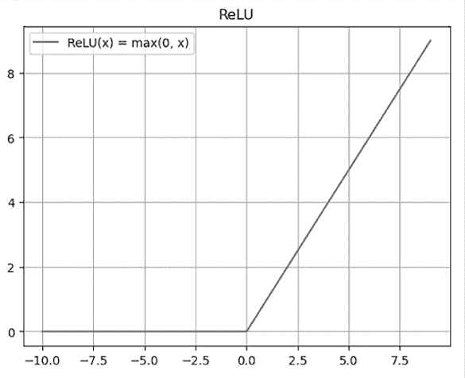

图 6.13：ReLU 激活函数

另一方面，**sigmoid**函数将值转换为`0`到`1`的范围。这使得 sigmoid 函数成为预测概率输出的首选。sigmoid 函数的方程如下：

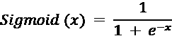

sigmoid 函数的行为如下：

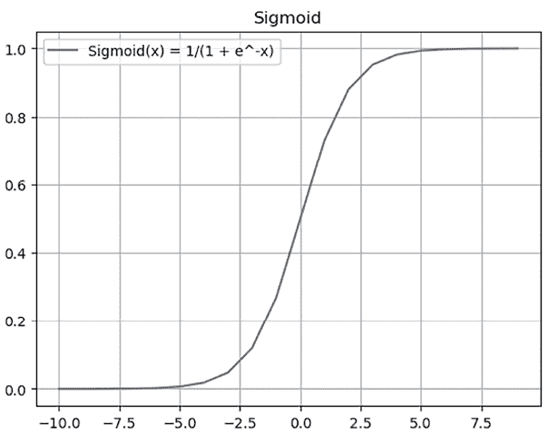

图 6.14：sigmoid 激活函数

除了 ReLU 和 sigmoid 之外，还有许多其他激活函数，如 tanh、leaky ReLU 和 softmax。我们建议您做一些研究，并实验不同激活函数的工作方式和它们对神经网络模型性能的影响！

在我们能够训练神经网络模型之前，还有一些步骤需要完成：

1.  首先，我们需要定义我们将通过模型训练迭代跟踪的关键指标，并编译模型。请看以下代码：

    ```py
    model_metrics = [
        keras.metrics.Accuracy(name="accuracy"),
        keras.metrics.Precision(name="precision"),
        keras.metrics.Recall(name="recall"),
    ]
    model.compile(
        optimizer=keras.optimizers.Adam(0.001),
        loss="binary_crossentropy",
        metrics=model_metrics
    ) 
    ```

正如我们之前与树形模型讨论的那样，我们将跟踪准确度、精确度和召回率。我们将使用 Adam 优化器进行此练习。简单来说，优化器是用于根据损失函数（在这种情况下是`binary_crossentropy`，它衡量预测值和实际二进制结果之间的差异）更新网络权重的算法。由于我们的预测输出或目标变量是一个表示转换与否的二进制变量，`binary_crossentropy`将适合作为损失函数。对于多类预测，其中目标变量不是二进制变量并且有超过两个可能的结果，`categorical_crossentropy`将是一个更好的损失函数。

1.  接下来，我们将在训练模型时运行的所有迭代或 epoch 中保存最佳模型。请看以下代码：

    ```py
    best_model_path = "./checkpoint.wide-model.keras"
    model_checkpoint_callback = keras.callbacks.ModelCheckpoint(
        filepath=best_model_path,
        monitor="val_precision",
        mode="max",
        save_best_only=True
    ) 
    ```

在这里，我们使用精确度作为指标来监控并基于该指标值将最佳模型存储到本地驱动器。最佳模型将被存储在`best_model_path`变量中定义的方式。

1.  最后，现在是时候使用以下代码训练这个**宽神经网络**模型了：

    ```py
    class_weight = {0: 1, 1: 1/train_y.mean()}
    history = model.fit(
        normed_train_x.to_numpy(),
        train_y.to_numpy(),
        batch_size=64,
        epochs=30,
        verbose=2,
        callbacks=[
            model_checkpoint_callback,
        ],
        validation_data=(normed_test_x.to_numpy(), test_y.to_numpy()),
        class_weight=class_weight,
    ) 
    ```

与我们之前给树形模型的类权重类似，我们也将定义与类组成成反比的类权重。正如您从代码中可以看到的，我们指示模型以 64 个批次的规模运行 30 次迭代或 epoch。我们将之前创建的用于存储最佳模型的回调与自定义类权重注册。当您运行此代码时，它将运行 30 个 epoch 并报告我们之前定义的准确度、精确度和召回率指标。此代码的输出应类似于以下内容：

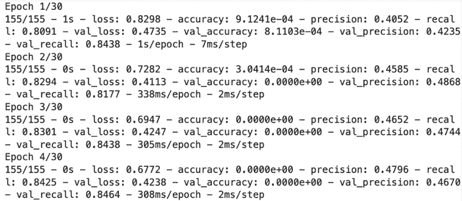

图 6.15：神经网络模型的样本输出

### 预测和评估宽神经网络模型

为了从我们刚刚训练的模型中进行预测，我们首先需要加载最佳模型。您可以使用以下代码来加载最佳模型：

```py
wide_best_model = keras.models.load_model(best_model_path) 
```

使用此模型进行预测与`scikit-learn`包的语法相似。请看以下代码：

```py
wide_pred_proba = wide_best_model.predict(normed_test_x).flatten()
wide_preds = [1 if x > 0.5 else 0 for x in wide_pred_proba] 
```

如您从这段代码中可能注意到的，您可以使用`keras`模型的`predict`函数来获取每个记录的预测概率。我们使用`flatten`函数将预测概率输出从二维数组转换为一个预测概率列表。然后，为了说明目的，我们将预测概率高于`0.5`的任何记录视为有很高的转换可能性，并假设它们是阳性案例。概率阈值是您可以为转换与否的最终预测进行微调的另一个因素。

我们将使用之前用于基于树的模型的关键指标、AUC-ROC 曲线和混淆矩阵的相同代码。结果如下所示：


图 6.16：宽神经网络模型的评估结果总结

如果您将这些结果与基于树的模型进行比较，您会注意到宽神经网络模型的表现略逊于基于树的模型。精确度和召回率略有下降，与基于树的模型相比，AUC 也有所下降。我们将在更深入地讨论 A/B 测试时，更深入地探讨这些模型的实际用途以及如何选择最适合营销活动的最佳模型。

## 深度神经网络建模

在本节中，我们将讨论如何构建深度神经网络模型，并将结果与我们在上一节中构建的宽神经网络模型进行比较。这两个神经网络模型之间的唯一区别在于我们如何构建或设计它们。

### 训练深度神经网络模型

请看以下代码：

```py
model = keras.Sequential(
    [
        keras.Input(shape=normed_train_x.shape[1:]),
        keras.layers.Dense(128, activation="relu"),
        keras.layers.Dense(128, activation="relu"),
        keras.layers.Dropout(0.2),
        keras.layers.Dense(128, activation="relu"),
        keras.layers.Dropout(0.2),
        keras.layers.Dense(1, activation="sigmoid"),
    ]
) 
```

与之前一样，我们使用`keras.Sequential`来构建模型，但这次在第一个`Input`层和最终的`Dense`输出层之间有更多的层：

+   我们有四个隐藏层，每个层包含 128 个神经元，并使用 ReLU 激活函数。

+   在最后一个隐藏层和输出层之间，以及最后一个隐藏层和倒数第二个隐藏层之间，也有两个`Dropout`层。

与之前的宽神经网络模型相比，每个层中的神经元数量更少，但层数更多。正如您从这个示例中可以看到的，模型架构取决于构建模型的人，并且应该基于性能。我们建议尝试不同的模型架构，并分析它如何改变模型性能。

使用之前用于宽神经网络模型的相同 Keras 模型训练代码，你也可以训练这个深度神经网络模型。确保你有保存最佳模型的回调函数，这样我们就可以用它来评估模型的表现。

### 预测和评估深度神经网络模型

如前所述，你可以使用以下代码根据从训练深度神经网络模型中找到的最佳模型进行预测：

```py
deep_best_model = keras.models.load_model(best_model_path)
deep_pred_proba = deep_best_model.predict(normed_test_x).flatten() 
```

使用预测概率，你可以运行相同的评估指标和图表。由于模型中的随机性，每次训练模型时结果可能会有所不同。在这次运行时，结果如下所示：

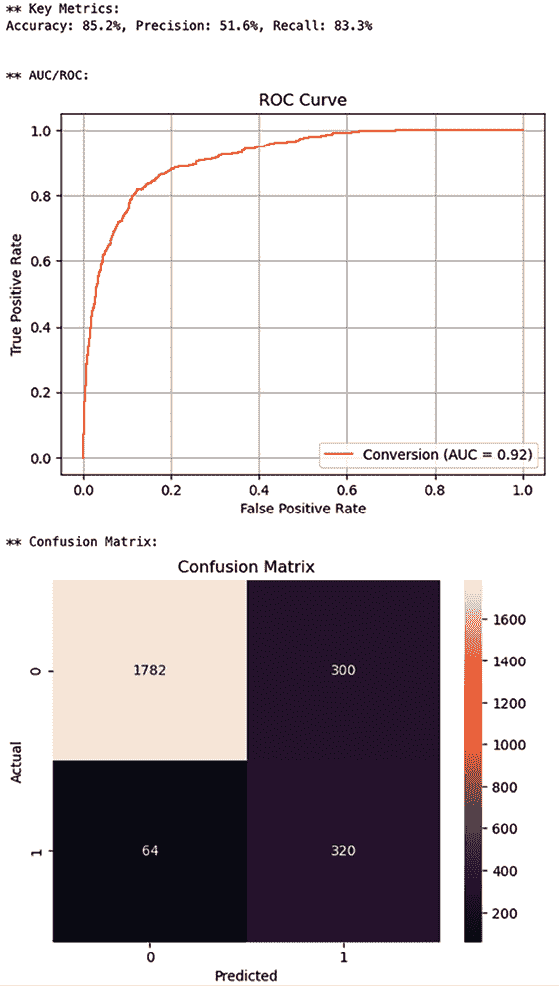

图 6.17：深度神经网络模型评估结果总结

与我们之前构建的宽神经网络模型相比，深度神经网络模型的表现略差。AUC 值大致相同，但精确率和召回率低于宽神经网络模型。这些评估指标和图表有助于检查模型在表面价值和训练时间时的表现。对于模型之间更实际的评估，你可能想要考虑运行 A/B 测试来选择你营销活动的最终模型。

# 进行 A/B 测试以选择最佳模型

**A/B 测试**，简单来说，就是比较两个版本的功能或模型，以确定哪一个更好。它在各个行业的决策过程中发挥着关键作用。网页开发者可能会使用 A/B 测试来测试两个版本的软件哪个表现更好。营销人员可能会使用 A/B 测试来测试哪种营销信息版本可能更有效地吸引潜在客户。同样，A/B 测试可以用来比较两个不同模型在性能和有效性方面的差异。在本章的例子中，我们可以使用 A/B 测试来选择我们基于训练和测试集构建的模型中哪一个在实际的真实世界环境中可能表现最佳。

A/B 测试通常在一个预定义的时期内进行，或者直到收集到预定义数量的样本。这是为了确保你有足够的样本来基于它们做出决策。例如，你可能想要进行为期两周的 A/B 测试，并在两周结束时收集测试期间的结果进行分析。或者，你可能想要为 A 和 B 两种场景设定 2,000 个样本的目标，而不设定特定的时期。

你可能还想将周期和样本数量都设置为目标，哪个先到就哪个。例如，你将样本目标设置为 2,000 个样本和两周的时间框；如果你在两周内收集到 2,000 个样本，你可能想早点结束测试，因为你已经收集了足够多的样本来分析结果。A/B 测试的周期和样本大小应根据业务需求或限制以及测试结果的置信度来确定。

检查 A/B 测试的结果通常使用统计假设检验。**两样本 t 检验**经常用于确定 A/B 测试中 A 和 B 案例观察到的差异是否具有统计学意义。t 检验中有两个重要的统计量——**t 值**和**p 值**：

+   **t 值**衡量两个均值之间的差异程度，相对于两个总体的方差。**t 值**越大，两组之间的差异就越明显。

获取两个样本**t 检验**的**t 值**的方程如下：

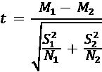

*M*[1]和*M*[2]是平均值，*S*[1]和*S*[2]是标准差，*N*[1]和*N*[2]是第一组和第二组的样本数量。正如你可能从这个方程中推断出的，大的负**t 值**将表明第二组的平均值显著大于第一组的平均值，而大的正**t 值**将表明第一组的平均值显著大于第二组的平均值。这也被称为双尾**t 检验**。

+   另一方面，**p 值**衡量结果偶然发生的概率。因此，**p 值**越小，两组之间的差异就越具有统计学意义，差异不是偶然的。

## 模拟 A/B 测试

我们将模拟 A/B 测试，就像我们正在用我们的模型实时运行这个实验一样。为了说明目的，我们将对之前构建的 XGBoost 或 GBDT 模型和宽神经网络模型进行 A/B 测试。我们将为每种情况运行 1,000 个样本，并分析结果，以查看哪个模型可能更适合我们的营销活动，以最大化客户转化率。

首先，我们将随机将流量分配到 A 组（GBDT 模型）和 B 组（宽神经网络模型）。请看以下代码：

```py
group_a_indexes = sorted(list(np.random.choice(2000, 1000, replace=False)))
group_b_indexes = [x for x in range(2000) if x not in group_a_indexes] 
```

在这里，我们使用`numpy`包的`random.choice`函数从 2,000 个项目中随机选择 1,000 个项目。我们将这些项目分配到 A 组，其余的分配到 B 组。然后，我们像以下代码那样模拟 A/B 测试：

```py
group_a_actuals = test_y.iloc[group_a_indexes].to_numpy()
group_b_actuals = test_y.iloc[group_b_indexes].to_numpy()
group_a_preds = []
group_b_preds = []
for customer in range(2000):
    if customer in group_a_indexes:
        # route to XGBoost
        conversion = test_y.iloc[customer]
        pred_prob = xgb_model.predict_proba(
            np.array([test_x.iloc[customer].to_numpy(),])
        )[0][1]
        pred = 1 if pred_prob > 0.5 else 0
        group_a_preds.append(pred)
    elif customer in group_b_indexes:
        # route to Wide Net
        conversion = test_y.iloc[customer]
        pred_prob = wide_best_model.predict(
            np.array([normed_test_x.iloc[customer].to_numpy(),]), verbose=0
        )[0][0]
        pred = 1 if pred_prob > 0.5 else 0
        group_b_preds.append(pred) 
```

如此代码所示，对于前 2,000 名客户，我们将一半分配到 A 组，其余的分配到 B 组。A 组客户使用 XGBoost 或 GBDT 模型预测其转换的可能性。B 组客户使用宽神经网络模型预测其转换的可能性。

然后，我们将检查这些预测的实际结果。在实际测试设置中，这些结果可能在预测做出后的几天或几周后出现，因为客户需要时间来决定是否购买。我们将评估那些被预测会转换的客户以及被预测不会转换但已经转换的客户（即被遗漏的机会）。请看以下代码：

```py
def get_cumulative_metrics(actuals, preds):
    cum_conversions = []
    missed_opportunities = []

    customer_counter = 0
    cum_conversion_count = 0
    missed_opp_count = 0
    for actual, pred in zip(actuals, preds):
        customer_counter += 1
        if pred == 1:
            if actual == 1:
                cum_conversion_count += 1
        else:
            if actual == 1:
                missed_opp_count += 1
        cum_conversions.append(cum_conversion_count/customer_counter)
        missed_opportunities.append(missed_opp_count/customer_counter)
    return cum_conversions, missed_opportunities 
```

如你所见，我们正在计算那些被预测会转换的客户以及那些被预测不会转换但已经转换的客户的总转换累积数。这些本质上是被遗漏的机会，因为我们没有向这些客户发送我们的营销信息，但他们本可以完成转换。我们将使用以下代码对这些每个组的这些结果进行汇总：

```py
a_cum_conv_rates, a_missed_opp_rates = get_cumulative_metrics(
    group_a_actuals, group_a_preds
)
b_cum_conv_rates, b_missed_opp_rates = get_cumulative_metrics(
    group_b_actuals, group_b_preds
)
ab_results_df = pd.DataFrame({
    "group_a_cum_conversion_rate": a_cum_conv_rates,
    "group_a_cum_missed_opportunity_rate": a_missed_opp_rates,
    "group_b_cum_conversion_rate": b_cum_conv_rates,
    "group_b_cum_missed_opportunity_rate": b_missed_opp_rates,
}) 
```

现在，让我们用以下代码查看随时间推移的累积转换率：

```py
ax = (
    ab_results_df[[
        "group_a_cum_conversion_rate", "group_b_cum_conversion_rate"
    ]]*100
).plot(
    style=['-', '--'],
    figsize=(8, 5),
    grid=True
)
ax.set_ylabel("Conversion Rate (%)")
ax.set_xlabel("Customer Count")
ax.set_title(
    "Cumulative Conversion Rates over Time (A: XGBoost, B: Wide Net)"
)
plt.show() 
```

这将生成如下图表：

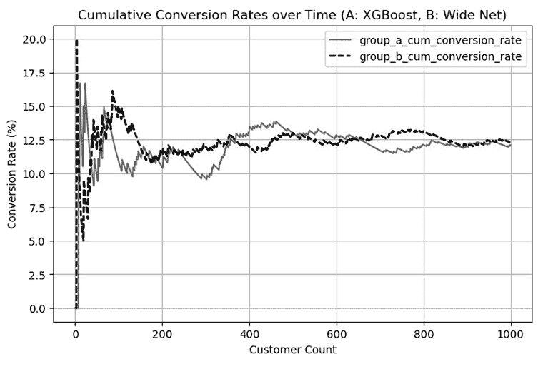

图 6.18：A 组和 B 组随时间推移的累积转换率

如此图表所示，接受宽神经网络模型预测的 B 组，与接受 XGBoost 模型预测的 A 组相比，整体转换率更高。让我们也看看每个组在遗漏机会方面的表现，以下代码：

```py
ax = (
    ab_results_df[[
        "group_a_cum_missed_opportunity_rate",
        "group_b_cum_missed_opportunity_rate"
    ]]*100
).plot(
    style=['-','--'],
    figsize=(8, 5),
    grid=True
)
ax.set_ylabel("Missed Opportunity Rate (%)")
ax.set_xlabel("Customer Count")
ax.set_title(
    "Cumulative Missed Opportunity Rates over Time (A: XGBoost, B: Wide Net)"
)
plt.show() 
```

当你运行这段代码时，你应该得到一张看起来类似于以下图表的图：

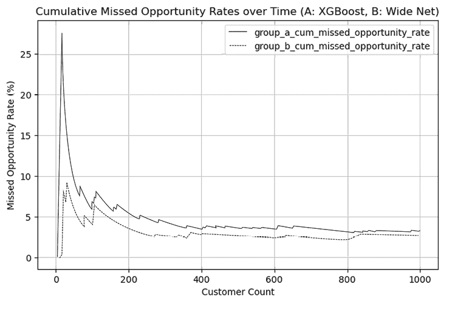

图 6.19：A 组和 B 组随时间推移的累积遗漏机会率

此图表表明，使用 XGBoost 模型预测的 A 组遗漏机会率高于使用宽神经网络模型预测的 B 组。

这些视觉图表是检查不同组或模型表现的好方法。然而，为了验证这些差异是否具有统计学意义，我们不得不运行 t 检验。

## 双尾 T 检验

Python 中的`scipy`包提供了一个方便的工具来计算双尾 t 检验的 t 值和 p 值。

要在你的机器上安装`scipy`，请在你的终端中运行以下命令：

```py
pip install scipy 
```

一旦你安装了`scipy`包，你可以运行以下命令来检查 A 组和 B 组在转换率和遗漏机会率之间的差异的统计学意义：

```py
from scipy.stats import ttest_ind
t, p = ttest_ind(a_cum_conv_rates, b_cum_conv_rates)
print(
    f"Conversion Rate Difference Significance -- t: {t:.3f} & p: {p:.3f}"
)
t, p = ttest_ind(a_missed_opp_rates, b_missed_opp_rates)
print(
    f"Missed Opportunity Rate Difference Significance -- t: {t:.3f} & p: {p:.3f}"
) 
```

如你所见，从这段代码中，`scipy.stats`模块中的`ttest_ind`函数让你可以轻松地得到两组之间的双尾 t 检验的 t 值和 p 值。这段代码的输出应类似于以下内容：

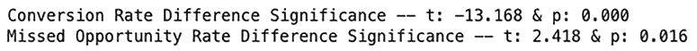

图 6.20：双尾 t 检验结果

让我们更仔细地看看这个输出。首先，转换率 t 检验的 t 值和 p 值分别是`-13.168`和`0`。这表明两组之间的转换率差异在统计学上是显著的。t 检验的负值表明 A 组的平均值小于 B 组。

由于从 p 值我们得出差异是显著的，这转化为结果，即 A 组的转换率显著低于 B 组。换句话说，宽神经网络模型在捕捉高转换可能性客户方面比 XGBoost 模型表现显著更好。

其次，错过机会率 t 检验的 t 值和 p 值分别是`2.418`和`0.016`。这表明 A 组的平均值显著大于 B 组。这意味着 A 组的错过机会显著多于 B 组。换句话说，XGBoost 模型比宽神经网络模型错过的机会更多。

如你所见，从 A/B 测试模拟结果来看，A/B 测试为现实世界设置中哪个模型表现更好提供了强大的见解。每个构建数据科学或 AI/ML 模型的人都应该养成一种习惯，不仅基于训练集和测试集评估模型，而且通过 A/B 测试评估模型，以便他们可以了解所构建的模型在现实世界设置中的实际性和适用性。通过短期的小样本 A/B 测试，你可以选择用于即将到来的营销活动的最佳模型。

# 摘要

在本章中，我们讨论了使用在线购买数据集构建预测模型的大量内容。我们探讨了两种不同的基于树的模型，即随机森林和 GBDT，以及如何构建预测模型来预测谁可能进行转换。使用相同的例子，我们还讨论了如何构建神经网络模型，这些模型是深度学习模型的基础。在构建神经网络模型时，你有很大的灵活性，例如宽网络、深网络或宽深网络。我们在构建神经网络模型时简要提到了激活函数和优化器，但我们建议你深入研究它们如何影响神经网络模型的表现。最后，我们讨论了 A/B 测试是什么，如何进行 A/B 测试，以及如何解释 A/B 测试结果。我们使用我们构建的模型模拟了 A/B 测试，以选择捕捉最多客户转换的最佳模型。

在接下来的章节中，我们将进一步探讨使用 AI/ML 进行精准营销。更具体地说，我们将讨论如何以各种方式构建个性化的产品推荐，以及这如何导致微目标营销策略。

# 加入我们书籍的 Discord 空间

加入我们的 Discord 社区，与志同道合的人交流，并在以下地点与超过 5000 名成员一起学习：

[`packt.link/genai`](https://packt.link/genai)


