# 8

# 使用机器学习进行客户细分

随着关于客户特征和行为数据的日益丰富，用更深入的见解来接近客户变得更加容易。从分析我们在*第三章*中讨论的客户参与背后的驱动因素，到理解个人客户可能喜欢哪些具体产品，这是我们*第七章*中提到的，这些方法的假设是基于存在某些行为方式相似的客户群体这一事实。

由于定向营销方法已被证明比大众营销更有效，因此**客户细分**一直是该领域经常讨论的话题。此外，随着无 cookie 世界的到来，第一方数据预计将发挥更加关键的作用。因此，基于客户细分（如地理细分、人口统计细分或兴趣主题细分）的策略，这些细分在浏览器 cookie 不可用的情况下仍然可用，对于成功至关重要。

在本章中，我们将涵盖以下主题：

+   一次性客户与回头客

+   使用 K-means 聚类和购买行为进行客户细分

+   使用**大型语言模型**（**LLMs**）和产品兴趣进行客户细分

# 一次性客户与回头客

根据提供了一些非常清晰的指标的*BIA 顾问服务*，回头客平均比新客户多花费 67%。此外，*BIA 顾问服务*进行的一项调查表明，超过一半的调查企业收入来自回头客，而不是新客户。这表明保留现有客户与扩大客户基础同样重要。然而，企业往往为了获取新客户而牺牲客户服务。

**BIA 顾问服务报告**

[`www.bia.com/small-business-owners-shift-investment-from-customer-acquisition-to-customer-engagement-new-report-by-manta-and-biakelsey/`](https://www.bia.com/small-business-owners-shift-investment-from-customer-acquisition-to-customer-engagement-new-report-by-manta-and-biakelsey/)

## 保留客户的需求

保留客户对业务来说如此重要的几个好处表明了原因：

+   **投资减少**：第一个显而易见的原因是新客户成本更高。如果您还记得*第二章*中典型的客户生命周期，您需要投入资本和营销资源来提高潜在新客户的品牌知名度，与潜在客户建立业务联系，然后最终将他们转化为付费客户。

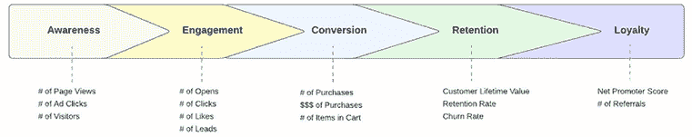

图 8.1：客户生命周期

对于现有客户，您可以跳过这些步骤，专注于通过提供优质的客户服务和介绍他们感兴趣的产品，将他们作为回头客保留下来。获取新客户通常比保留现有客户成本高出数倍。

+   **更高的可靠性**: 重复客户为你的业务带来了更可靠和可重复的收入。如前所述，重复客户通常贡献了超过一半的业务收入，并且比新客户花费更多。随着你提供现有客户喜欢的产品或服务，以及你提供更好的客户服务，你的客户可能会对你的品牌忠诚，并继续购买产品。

例如，如果你在销售宠物产品，比如宠物食品或宠物玩具，并且他们喜欢你的产品，他们下个月可能会回来购买更多，甚至订阅以每月获得宠物食品的配送。这导致了一个可靠且可重复的收入流，这将加强你业务的现金流，你可以用这些资金投资更多到你的产品上，这将带来更多的收入。这开始了你业务的积极循环。

+   **建立品牌忠诚度**: 对你的业务忠诚的重复客户会带来更多的新客户。如你可能在 *第二章* 中回忆的那样，忠诚的客户充当你的品牌大使和营销代理，他们传播关于你业务的信息并吸引新客户。无需花费更多的营销费用，这些忠诚的客户就会推广你的业务并吸引新客户。

拥有一个强大的重复客户基础还有许多其他微妙的好处，但这些都是拥有重复客户最明显的三个好处，并展示了它们如何显著帮助业务。

## 分析保留客户的影响

让我们看看一个实际例子，看看这些重复客户与新客户相比对业务产生的影响：

**源代码和数据**: [`github.com/PacktPublishing/Machine-Learning-and-Generative-AI-for-Marketing/tree/main/ch.8`](https://github.com/PacktPublishing/Machine-Learning-and-Generative-AI-for-Marketing/tree/main/ch.8)

**数据来源**: [`archive.ics.uci.edu/dataset/352/online+retail`](https://archive.ics.uci.edu/dataset/352/online+retail)

和往常一样，我们将首先将数据导入到一个 `pandas` DataFrame 中。看看下面的代码：

```py
import pandas as pd
df = pd.read_csv("./data.csv")
df = df.dropna()
df = df.loc[
    df["Quantity"] > 0
] 
```

这里，我们将数据加载到一个 `pandas` DataFrame，`df` 中。因为我们只对比较新客户和重复客户感兴趣，我们将使用 `dropna` 函数删除包含 `NaN` 值的行，并通过 `df["Quantity"] > 0` 过滤只取至少购买了一件或更多商品的客户。

1.  然后，我们将创建以下额外的变量：

    +   **销售额**: 通过简单地将客户购买的数量乘以单个商品的价格，我们可以得到每个订单的总销售额。在下面的代码中，我们创建了一个名为 `Sales` 的新列，它包含每个订单的总销售额：

        ```py
        df["Sales"] = df["Quantity"] * df["UnitPrice"]. 
        ```

    +   **月份变量**：为了确定一个客户是否是新客户，我们需要考虑数据的时间范围。如果一个客户之前没有购买任何商品，那么这个客户将被视为新客户。另一方面，如果一个客户之前购买过商品，那么我们将这个客户视为回头客。在这个练习中，我们将查看月度数据，这需要我们创建一个变量来表示发票是在哪个月创建的。在下面的代码中，我们将`InvoiceDate`列转换为`datetime`类型，并将`InvoiceDate`转换为每个月。例如，日期`2011-02-23`将被转换为`2011-02-01`：

        ```py
        df["InvoiceDate"] = pd.to_datetime(df["InvoiceDate"])
        df["month"] = df["InvoiceDate"].dt.strftime("%Y-%m-01") 
        ```

1.  现在我们有了这两个变量，我们可以开始分析销售是否来自新客户或回头客。看看下面的代码：

    ```py
    monthly_data = []
    for each_month in sorted(df["month"].unique()):
        up_to_last_month_df = df.loc[
            df["month"] < each_month
        ]
        this_month_df = df.loc[
            df["month"] == each_month
        ]
        curr_customers = set(this_month_df["CustomerID"].unique())
        prev_customers = set(up_to_last_month_df["CustomerID"].unique())

        repeat_customers = curr_customers.intersection(prev_customers)
        new_customers = curr_customers - prev_customers

        curr_sales = this_month_df["Sales"].sum()

        sales_from_new_customers = this_month_df.loc[
            this_month_df["CustomerID"].isin(new_customers)
        ]["Sales"].sum()
        sales_from_repeat_customers = this_month_df.loc[
            this_month_df["CustomerID"].isin(repeat_customers)
        ]["Sales"].sum()

        avg_sales_from_new_customers = this_month_df.loc[
            this_month_df["CustomerID"].isin(new_customers)
        ]["Sales"].mean()
        avg_sales_from_repeat_customers = this_month_df.loc[
            this_month_df["CustomerID"].isin(repeat_customers)
        ]["Sales"].mean()

        monthly_data.append({
            "month": each_month,

            "num_customers": len(curr_customers),
            "repeat_customers": len(repeat_customers),
            "new_customers": len(new_customers),

            "curr_sales": curr_sales,
            "sales_from_new_customers": sales_from_new_customers,
            "sales_from_repeat_customers": sales_from_repeat_customers,
            "avg_sales_from_new_customers": avg_sales_from_new_customers,
            "avg_sales_from_repeat_customers": avg_sales_from_repeat_customers,
        }) 
    ```

让我们更仔细地看看这段代码。我们首先遍历`month`变量中的每个月。对于每次迭代，我们找到给定月份的唯一客户，并将它们存储为一个集合，命名为`curr_customers`。我们同样为过去客户做同样的操作，通过获取到给定月份的唯一客户，并将它们存储为一个集合，命名为`prev_customers`。基于这两个变量，我们可以通过一些集合操作来识别新客户和回头客：

1.  首先，我们找到`curr_customers`和`prev_customers`的交集，这代表回头客，因为我们已经在销售数据中看到了这些客户。

1.  接下来，我们从`curr_customers`集合中减去`prev_customers`集合，这给出了新客户，因为这些是我们之前没有见过的客户。通过这些操作，我们已经成功识别了新客户和回头客。

基于这些`prev_customers`和`curr_customers`集合，我们可以找到新客户和回头客带来的收入。使用`isin`函数，我们选择与`new_customers`集合中的 ID 匹配的`CustomerIDs`，通过将这些客户的全部销售额相加来计算新客户的总销售额，并通过取这些客户的全部销售额的平均值来计算新客户的平均销售额。同样，使用`isin`函数，我们选择与`repeat_customers`集合中的 ID 匹配的`CustomerIDs`，通过将这些客户的全部销售额相加来计算回头客的总销售额。我们通过取这些客户的全部销售额的平均值来计算回头客的平均销售额。我们将这些数据保存到一个变量中，名为`monthly_data`。

1.  我们进行最后一组计算，如下所示，并将准备好查看新客户和回头客之间的差异：

    ```py
    monthly_data_df = pd.DataFrame(monthly_data).set_index("month").iloc[1:-1]
    monthly_data_df["repeat_customer_percentage"] = monthly_data_df["repeat_customers"]/monthly_data_df["num_customers"]
    monthly_data_df["repeat_sales_percentage"] = monthly_data_df["sales_from_repeat_customers"]/monthly_data_df["curr_sales"] 
    ```

这段代码只是将数据转换成`pandas` DataFrame，并计算有多少比例的客户是回头客，以及有多少比例的销售来自回头客。

现在我们已经完成了，让我们使用以下代码查看每月客户数量以及新客户和回头客之间的细分：

```py
ax = monthly_data_df[[
    "new_customers", "repeat_customers"
]].plot(kind="bar", grid=True, figsize=(15,5))
(monthly_data_df["repeat_customer_percentage"]*100).plot(
    ax=ax, secondary_y=True, color="salmon", style="-o"
)
ax.right_ax.legend()
ax.right_ax.set_ylim([0, 100.0])
ax.right_ax.set_ylabel("repeat customer percentage (%)")
ax.set_ylabel("number of customers")
ax.set_title("number of new vs. repeat customers over time")
plt.show() 
```

这应该生成以下图表：

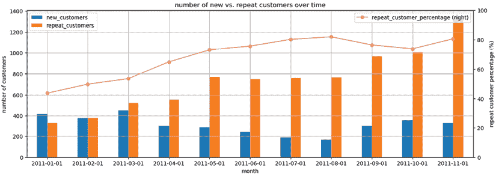

图 8.2：新客户与回头客的数量对比

每个时间段的左侧条形表示每个月的新客户数量，右侧条形表示回头客的数量。正如你所看到的，回头客的构成随着时间的推移而增长，新客户的流入量也存在某种周期性。我们在年初和年底看到更多的新客户，而在六月至八月夏季期间有所下降。

线形图显示了每个月客户中回头客所占的百分比，正如这个图表所暗示的，它从 2011 年 1 月的大约 40%增长到 2011 年 11 月的大约 80%。

这表明这是一个非常健康的业务。它显示了来自已经从这个业务中进行过购买的客户持续的需求和购买。回头客的数量持续增长，这表明这个业务提供的产品和服务持续吸引那些曾经与这个业务互动过的客户。对于一个缺乏吸引人的产品以及/或者良好客户服务的业务，回头客的数量通常会减少。不过，这里需要注意的是，新客户的流入率相对稳定，并没有增长。当然，这比随着时间的推移新客户数量减少要好，但这表明有增长潜力来吸引更多的新客户。鉴于有一个健康的回头客和重复购买客户群，营销人员可以更多地关注这个业务的新客户获取。

同样，让我们看看新客户和回头客的销售金额。看看以下代码：

```py
ax = (monthly_data_df[[
    "sales_from_new_customers", "sales_from_repeat_customers"
]]/1000).plot(kind="bar", grid=True, figsize=(15,5))
(monthly_data_df["repeat_sales_percentage"]*100).plot(
    ax=ax, secondary_y=True, color="salmon", style="-o"
)
ax.set_ylabel("sales (in thousands)")
ax.set_title("sales from new vs. repeat customers over time")
ax.right_ax.legend()
ax.right_ax.set_ylim([0, 100.0])
ax.right_ax.set_ylabel("repeat customer percentage (%)")
plt.show() 
```

这段代码生成以下图表：

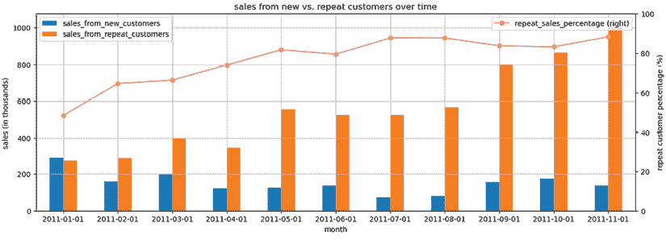

图 8.3：新客户与回头客的销售对比

与之前类似，左侧的条形表示新客户的销售额，右侧的条形表示回头客的销售额。正如之前在许多客户比较中看到的那样，回头客的销售额超过了新客户的销售额。这表明回头客有很强的持续重复收入。回头客的销售额百分比在 2011 年 11 月达到了 80%以上。这在我们之前讨论过回头客通常占企业收入一半以上时是预料之中的。之前讨论并报告的另一个观点是由*BIA Advisory Services*提出的，即回头客通常比新客户多花费 67%。

现在让我们通过比较新客户和回头客的平均月销售额来查看我们的数据对这个业务说了什么。看看以下代码：

```py
monthly_data_df["repeat_to_new_avg_sales_ratio"] = (
    monthly_data_df["avg_sales_from_repeat_customers"]
    /
    monthly_data_df["avg_sales_from_new_customers"]
)
ax = monthly_data_df[[
    "avg_sales_from_new_customers", "avg_sales_from_repeat_customers"
]].plot(kind="bar", grid=True, figsize=(15,5), rot=0)
ax.set_ylabel("average sales")
ax.set_title("sales from new vs. repeat customers over time")
monthly_data_df["repeat_to_new_avg_sales_ratio"].plot(
    ax=ax, secondary_y=True, color="salmon", style="-o"
)
ax.right_ax.set_ylim([0, 2.0])
ax.right_ax.set_ylabel("repeat to new customer avg sales ratio")
plt.show() 
```

这段代码应该生成以下图表：

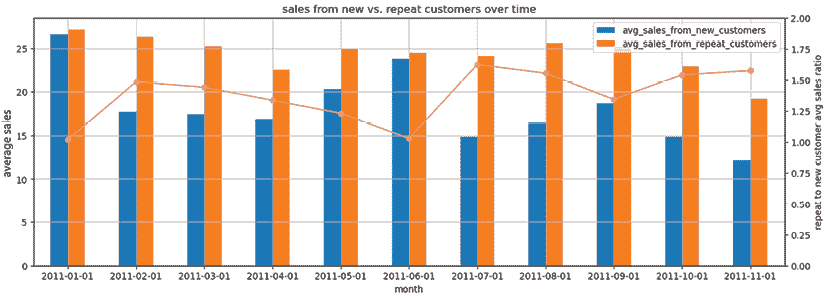图 8.4：新客户与回头客的平均销售额

类似地，左侧的柱状图是新客户的平均销售额，右侧的柱状图是回头客的平均销售额，每个月都有。折线图显示了新客户平均销售额与回头客平均销售额之间的比率。例如，如果比率是`1.5`，这意味着回头客在那个月平均花费是新客户的`1.5`倍。根据这个示例数据集，我们看到，在所有报告的月份中，回头客的平均花费都高于平均客户。在 2011 年 11 月，比率是`1:1.58`，这意味着回头客平均比新客户多花费了大约 60%。这与*BIA 顾问服务*的报告相符，该报告指出回头客平均比新客户花费更多。

在这个练习中，我们将客户基础划分为两个简单的部分：新客户与回头客。正如你可能已经注意到的，这是一项简单的分析练习，但它能产生对业务动态和健康状况的深刻见解，同时也告诉营销人员应该关注哪一群客户。

如果有一个强大的回头客基础，并且有持续的收入，但新客户基础显示出稳定或下降的趋势，这表明营销人员应该更加关注新客户的获取。

另一方面，如果回头客的数量下降，这可能表明产品和服务可能对顾客没有吸引力，或者客户服务未能达到顾客的期望。在这种情况下，营销人员应该专注于改进产品营销策略、客户满意度策略或其他营销策略，以吸引顾客进行重复购买。

# 基于购买行为的客户细分

根据新客户与回头客对客户进行细分是进行的基本且关键的分析之一。然而，很多时候，我们希望根据多个因素对客户进行细分，这些因素可以是人口统计因素，如年龄、地理位置和职业，或者是购买历史，如他们在过去一年中花费了多少钱，他们购买了哪些商品，以及他们请求了多少次退货。你还可以根据客户的网络活动进行细分，例如过去 X 天内登录的次数，他们在你的网页上停留的时间，以及他们查看的页面。

根据这些因素对客户进行细分仍然存在挑战，因为你可以以无数种方式和值来细分客户。例如，如果你根据年龄细分客户，可能会出现一些问题，比如“我应该创建多少个桶？”或者“我应该选择什么年龄截止阈值？”类似地，如果你想根据过去销售量细分客户，你仍然需要选择用于细分客户基础和希望创建多少个细分的阈值。

此外，当你将多个因素结合这些细分时，细分数量会呈指数增长。例如，如果你基于销售量有 2 个细分，并将其与其他基于购买数量的 2 个细分相结合，你将最终得到 4 个细分。如果你对两个因素都有 3 个细分，那么总共将得到 9 个细分。总之，在执行客户细分时，主要有三个关键问题需要回答：

1.  应该使用哪些因素进行客户细分？

1.  应该创建多少个细分？

1.  应该使用什么阈值来细分到细分？

我们将使用之前使用过的在线零售数据集作为示例，并讨论如何使用 K-means 聚类算法和轮廓分数来回答这些关键问题，以衡量聚类的有效性。

## K-means 聚类

K-means 聚类是用于聚类和分割的最常用的机器学习算法之一。它是一种将数据划分为*k*个聚类的算法。简而言之，该算法迭代地找到质心并将数据点分组到最近的质心，直到数据点比其邻近的质心更接近其质心。正如你可以想象的那样，我们案例中的数据点将是感兴趣的因子，例如销售额、数量和退款，而在 K-means 聚类中的“*k*”是我们希望创建多少个聚类或客户细分。

为了根据总销售额、订单数量和退款创建客户细分，我们需要做一些准备工作。看看以下代码：

```py
# Net Sales & Quantity
customer_net_df = df.groupby('CustomerID')[["Sales", "Quantity"]].sum()
customer_net_df.columns = ['NetSales', 'NetQuantity']
# Total Refunds
customer_refund_df = df.loc[
    df["Quantity"] < 0
].groupby("CustomerID")[["Sales", "Quantity"]].sum().abs()
customer_refund_df.columns = ['TotalRefund', 'TotalRefundQuantity']
customer_df = customer_net_df.merge(
    customer_refund_df, left_index=True, right_index=True, how="left"
).fillna(0) 
```

在这里，我们首先获取每个客户的净销售额和数量。这将减去任何退款和退货项，因为有一些记录的销售额和数量值为负。接下来，我们获取关于退款的信息。我们假设任何负数数量都是退款。因此，我们通过求和所有负数量值的销售额来获取总退款金额，通过求和所有负数量值的订单数量来获取总退款数量。最后，我们通过索引（即客户 ID）合并这两个 DataFrame。生成的 DataFrame 应该看起来像以下这样：

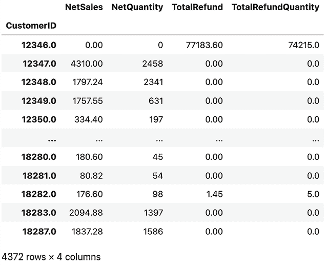

图 8.5：生成的净销售额、净数量、退款金额和退款数量

这里要注意的一点是数据高度偏斜。看看以下代码，这是我们用来生成直方图的代码：

```py
customer_df.hist(bins=50, figsize=(15,10))
plt.show() 
```

这给我们以下图表：

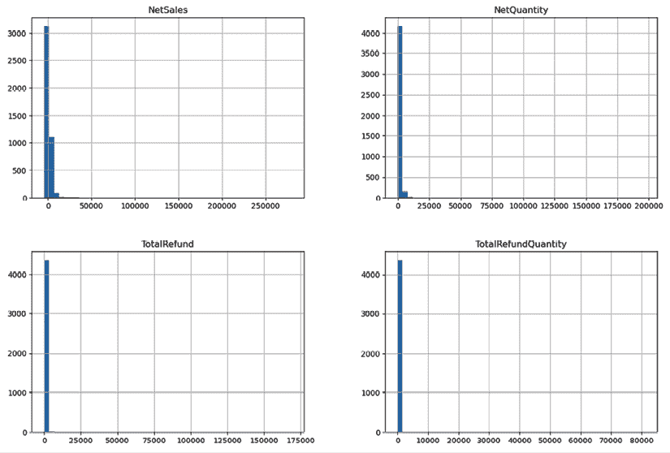

图 8.6：数据分布

如从这些直方图中所见，数据高度右偏斜。这种情况经常发生，尤其是在数据具有货币或数量值时。数据的偏斜会导致不均衡的聚类，数据分割不理想。克服这种偏斜的一个简单方法是对数据进行对数变换，以下代码为证：

```py
log_customer_df = np.log(customer_df - customer_df.min() + 1) 
```

我们可以使用以下代码生成对数变换数据的直方图：

```py
log_customer_df.hist(bins=50, figsize=(15,10))
plt.show() 
```

以下是由此生成的直方图：

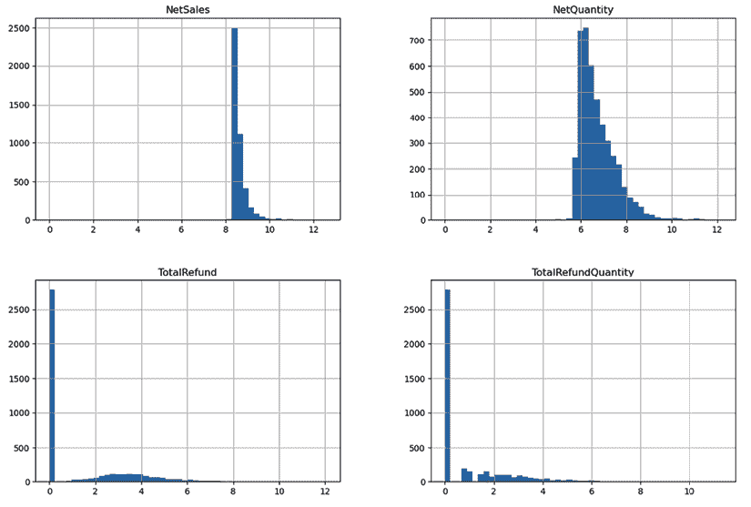

图 8.7：对数变换后的数据分布

如预期的那样，对数变换后的数据更集中在平均值周围，更接近钟形曲线。我们将检查带有和对数变换的聚类，并看看它如何影响聚类结果。

### 无对数变换

在 Python 中训练 K-means 聚类算法很简单。看看以下代码，我们在`scikit-learn`包中导入`KMeans`模块来构建 K-means 聚类算法：

```py
from sklearn.cluster import KMeans
COLS = ['NetSales', 'NetQuantity', 'TotalRefundQuantity']
kmeans = KMeans(
    n_clusters=4, n_init="auto"
).fit(
    customer_df[COLS]
) 
```

在这个例子中，我们根据三个列，`NetSales`、`NetQuantity`和`TotalRefundQuantity`构建客户细分。然后，我们使用参数`n_clusters`构建四个聚类。训练好的`KMeans`模型的`labels_`属性为每一行或客户分配了标签（0 到 3），而`cluster_centers_`属性显示了每个聚类的中心。

**K-means 聚类中的随机性**

由于 K-means 聚类是一种迭代方法，用于从原始随机选择的中心更新中心，因此 K-means 聚类中存在随机性，导致每次运行时结果略有不同。如果您希望每次都得到相同的结果，您应该设置`random_state`变量。

本章中的示例没有使用`random_state`变量，所以您的结果可能看起来与您看到的图表略有不同。

现在，让我们可视化聚类，这样我们就可以直观地检查 K-means 聚类算法如何使用我们感兴趣的三个因素（`NetSales`、`NetQuantity`和`TotalRefundQuantity`）将客户群分割开来：

```py
import matplotlib.colors as mcolors
def plot_clusters(c_df, col1, col2):    colors = list(mcolors.TABLEAU_COLORS.values())
    clusters = sorted(c_df["cluster"].unique())
    for c in clusters:
        plt.scatter(
            c_df.loc[c_df['cluster'] == c][col1],
            c_df.loc[c_df['cluster'] == c][col2],
            c=colors[c]
        )
    plt.title(f'{col1} vs. {col2} Clusters')
    plt.xlabel(col1)
    plt.ylabel(col2)
    plt.legend(clusters)
    plt.show()
cluster_df = customer_df[COLS].copy()
cluster_df["cluster"] = kmeans.labels_
plot_clusters(cluster_df, "NetSales", "NetQuantity")
plot_clusters(cluster_df, "NetSales", "TotalRefundQuantity")
plot_clusters(cluster_df, "NetQuantity", "TotalRefundQuantity") 
```

在这里，我们首先定义一个函数，`plot_clusters`，用于绘制每个聚类的 2D 图，它接受 DataFrame 作为输入，其中包含用于 x 轴和 y 轴的两个列。然后，我们创建三个图表：一个用于根据`NetSales`和`NetQuantity`可视化聚类，另一个用于`NetSales`和`TotalRefundQuantity`，第三个用于`NetQuantity`和`TotalRefundQuantity`。这三个生成的图表应该看起来像以下这样：

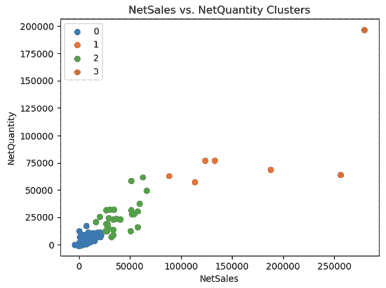

图 8.8：基于 NetSales 与 NetQuantity 的聚类

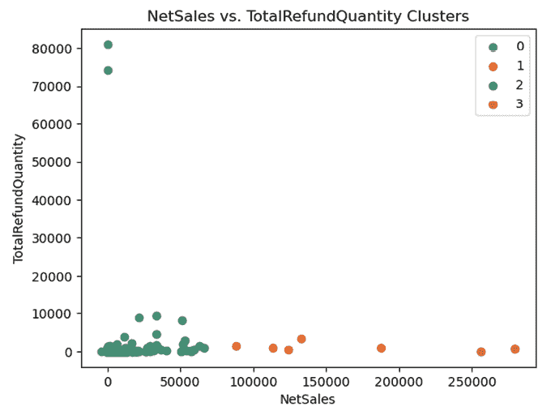

图 8.9：基于 NetSales 与 TotalRefundQuantity 的聚类

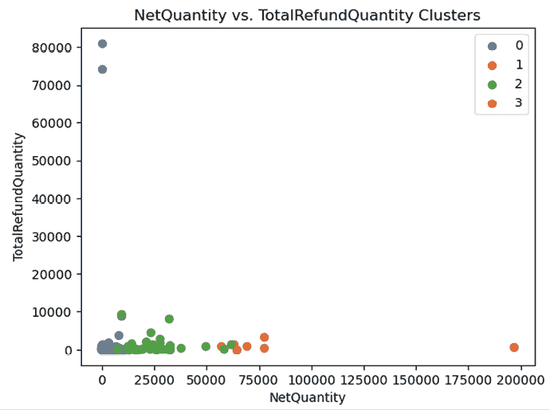

图 8.10：基于 NetQuantity 与 TotalRefundQuantity 的聚类

在*图 8.8*、*8.9*和*8.10*中，我们可以很容易地看到聚类是如何基于成对形成的。例如，聚类`0`似乎代表的是那些净销售额、净数量和退款都较低的客户，而聚类`1`似乎代表的是那些净销售额、净数量和退款处于中低水平的客户。然而，在这个例子中有两点值得关注：

+   一些聚类具有广泛的点范围。以聚类`0`为例，如果查看*图 8.10*，其退款数量范围从`0`到`80,000`，这使得描述聚类`0`实际上代表什么以及它与其他聚类有何不同变得困难。

+   这里还有一个需要注意的事项，那就是大多数数据点都在聚类`0`中，而其他聚类中的数据点非常少。聚类`3`似乎只包含两个数据点。这些聚类大小的巨大不平衡使得从这些聚类中得出的概括不太可靠，因为基于少量数据点的见解并不可靠。

您可以使用以下代码查看每个聚类中的数据点数量：

```py
cluster_df.groupby('cluster')['NetSales'].count() 
```

下面是每个聚类的详细信息：

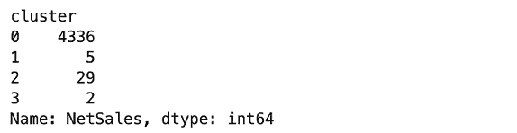

图 8.11：每个聚类中的数据点数量

数据偏斜经常导致这些问题，因为它使得 K-means 聚类算法难以找到或有效地聚类数据点。这就是为什么当数据存在偏斜时，我们需要在应用聚类算法之前对数据进行归一化的原因。

### 使用对数变换

让我们看看对数变换如何可能帮助使用 K-means 聚类进行客户细分。看一下以下代码：

```py
COLS = ['NetSales', 'NetQuantity', 'TotalRefundQuantity']
kmeans = KMeans(
    n_clusters=4, n_init="auto"
).fit(
    log_customer_df[COLS]
)
cluster_df = log_customer_df[COLS].copy()
cluster_df["cluster"] = kmeans.labels_ 
```

在这里，我们使用之前定义的变量`log_customer_df`，它是使用`np.log`函数进行对数变换的数据。然后我们拟合了一个包含四个聚类的 K-means 聚类模型。现在我们可以看到聚类的大小如下：

```py
cluster_df.groupby('cluster')['NetSales'].count() 
```

这给我们以下输出：

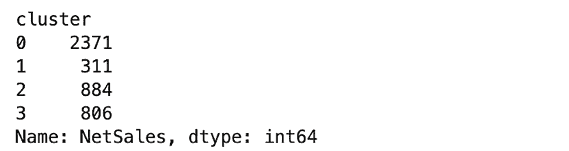

图 8.12：对数变换后每个聚类中的数据点数量

与本章早期我们拟合聚类模型时没有进行对数变换相比，聚类现在更加均衡，每个聚类都有显著数量的客户。这将使我们能够更好地了解客户是如何基于我们感兴趣的三个因素（净销售额、净数量和总退款）进行细分的。让我们用以下代码可视化聚类：

```py
plot_clusters(cluster_df, "NetSales", "NetQuantity")
plot_clusters(cluster_df, "NetSales", "TotalRefundQuantity")
plot_clusters(cluster_df, "NetQuantity", "TotalRefundQuantity") 
```

这段代码应该创建三个类似于以下图表：

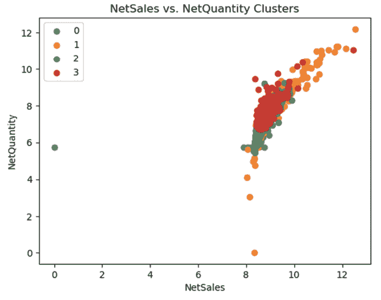

图 8.13：转换后的 NetSales 与 NetQuantity 的聚类

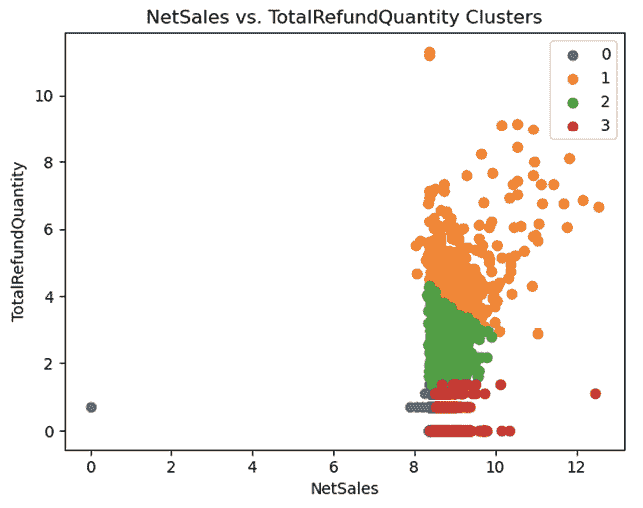

图 8.14：NetSales 与转换后的 TotalRefundQuantity 的聚类

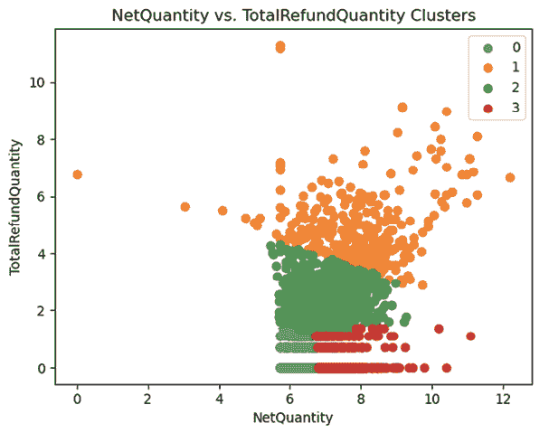

图 8.15：转换后的 NetQuantity 与 TotalRefundQuantity 的聚类

让我们深入探讨这些集群的可视化。如果您查看 *图 8.13*，基于净销售额和净数量，集群之间没有明显的分离。集群 `3` 似乎更集中在平均值附近，而集群 `1` 则更倾向于更高的净销售额和更高的净数量，集群 `0` 和 `2` 则更倾向于更低的净销售额和更低的净数量。尽管有这些细微的差异，所有集群似乎都聚集在净销售额和净数量的平均值周围。

在 *图 8.14* 和 *图 8.15* 中，集群之间的区别更为明显。集群 `1` 似乎是一个具有高总退款的客户群体，其截止阈值在对数尺度上约为 `4`。您可以通过撤销我们之前应用的转换或使用以下代码来转换这个对数转换的值：

```py
np.exp(X) + customer_df.min()[COLUMN] - 1 
```

代码中的 `X` 是对数尺度上的值，而 `COLUMN` 是感兴趣的因子。让我们更仔细地看看这些集群：

+   **集群 0**：这个集群似乎是一个具有低总退款和低净数量的集群。`TotalRefundQuantity` 在对数尺度上的阈值约为 `2` 和 `6.7` 对于 `NetQuantity`。这些数字相当于总退款中的 `6.4` 和净数量中的 `811.4`，使用前面的公式。这表明这个集群中的客户总退款少于 `6.4`，净数量少于 `811.4`。

+   **集群 1**：这个集群似乎是一组退款频率最高的客户。集群 `1` 的截止阈值在对数尺度上 `TotalRefundQuantity` 中约为 `4`，使用上面的代码，这相当于 `54 (np.exp(4) + customer_df.min()["TotalRefundQuantity"] - 1)`。因此，集群 `1` 是总退款超过 `54` 的客户群体。

+   **集群 2**：这个集群似乎是一个具有中等总退款且对数尺度上 `TotalRefundQuantity` 的阈值约为 `2` 的客户群体，这相当于实际总退款中的 `6`。因此，集群 `2` 是总退款在 `6` 到 `54` 之间的客户群体。

+   **集群 3**：集群 `3` 中的客户似乎具有低总退款但高净数量的特点。这个客户群体可能是业务的甜点，因为它表明他们经常从该业务购买，但退款数量并不像其他不同客户群体中的客户那么多。鉴于他们在对数尺度上总退款的下限约为 `2` 和 `6.7` 对于净数量，这个客户群体在总退款中少于 `6`，而在净数量中多于 `811`。

正如你在这次练习中看到的，K-means 聚类算法有助于以机器学习的方式对客户进行分段，而无需你自己手动为每个客户分段定义阈值。这种程序化方法帮助你更动态、更数据驱动地定义客户分段。这样，你可以更好地理解不同的客户分段是如何组合的，以及分离因素是什么，这些因素随后可以用来为你的未来营销工作制定策略和优先级。

## 轮廓系数

我们已经看到了如何使用 K-means 聚类算法构建客户分段。构建聚类的一个关键论点是聚类的数量。然而，你可能想知道在构建这样的聚类之前，你如何决定或如何知道正确的聚类数量。在实际环境中，你可能想要构建具有不同数量的聚类的多个聚类，并决定哪一个效果最好。这就是**轮廓系数**发挥作用的地方。简单来说，轮廓系数是一个度量，它量化了给定数据点与其聚类中其他点的匹配程度以及它与其他聚类的可区分性。轮廓系数的公式如下：

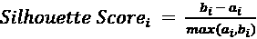

在这里，*a*[i] 是第 *i* 个数据点到同一聚类中所有其他点的平均距离，而 *b*[i] 是第 *i* 个数据点到其他聚类中所有点的最小平均距离。

为了获得聚类算法的轮廓系数，你需要计算每个数据点的所有单个轮廓系数的平均值。轮廓系数的范围在 `-1` 和 `1` 之间。分数越接近 `1`，数据点聚在一起的程度就越好，它们与相邻聚类的区别就越明显。

轮廓系数在 Python 中很容易计算。Python 的 `scikit-learn` 包中有一个名为 `silhouette_score` 的函数，它可以计算聚类的平均轮廓系数：

```py
from sklearn.metrics import silhouette_score
silhouette_score(
    log_customer_df[COLS],
    kmeans.labels_
) 
```

由于更高的轮廓系数值表明聚类更好，我们可以利用这一点来决定理想的聚类数量。看看以下代码，我们在 `4` 到 `8` 之间尝试不同的聚类大小：

```py
COLS = ['NetSales', 'NetQuantity', 'TotalRefundQuantity']
f, axes = plt.subplots(2, 3, sharey=False, figsize=(12, 7))
for i, n_cluster in enumerate([4,5,6,7,8]):
    kmeans = KMeans(n_clusters=n_cluster, n_init="auto").fit(
        log_customer_df[COLS]
    )
    silhouette_avg = silhouette_score(
        log_customer_df[COLS],
        kmeans.labels_
    )

    print('Silhouette Score for %i Clusters: %0.4f' % (n_cluster, silhouette_avg))

    each_cluster_size = [
        (kmeans.labels_ == i).sum()/len(kmeans.labels_) for i in range(n_cluster)
    ]
    ax = axes[i//3][i%3]
    pd.DataFrame(each_cluster_size).plot(ax=ax, kind="barh", color="orange")
    for p in ax.patches:
        ax.annotate(f'{p.get_width()*100:.01f}%', (p.get_width(), p.get_y()+0.2))
    ax.axvline(x=(1/n_cluster), color="red", linestyle="--")
    ax.set_xlabel("Cluster Size", size=8)
    ax.set_title(f"Cluster #{n_cluster} - Silhouette: {silhouette_avg:.02f}")
    ax.title.set_size(8)
f.subplots_adjust(hspace=0.3)
plt.show() 
```

对于每个聚类，我们计算轮廓系数并检查每个聚类中有多少百分比的数据点。理想情况下，最佳的聚类是轮廓系数最高且每个聚类中数据点均匀分布的聚类。以下代码应该生成以下输出：

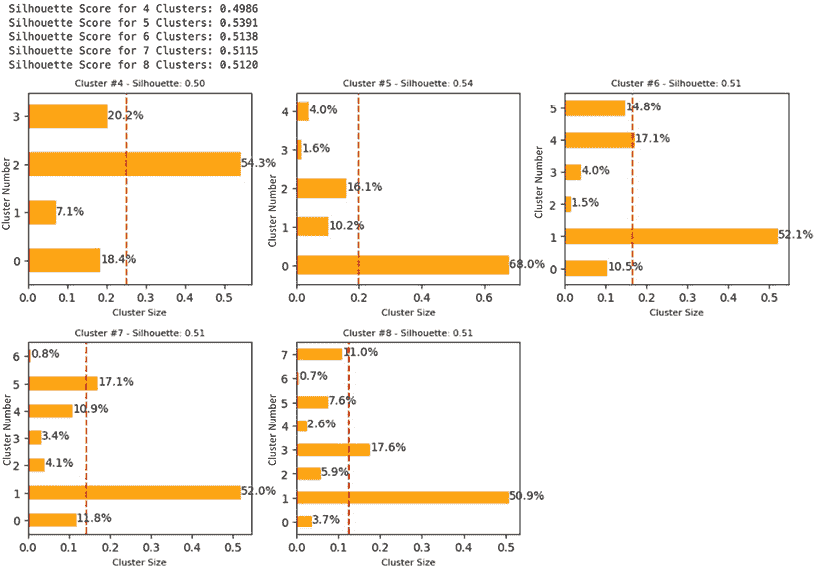

图 8.16：聚类大小实验结果

此图表显示了当你确定最佳聚类大小时应考虑的几个重要决策因素：

+   **轮廓得分**：首先，我们可以看到每个簇大小的轮廓得分，其中大小为`4`的簇得分为`0.4986`，大小为`5`的簇得分为`0.5391`，依此类推。在这里，大小为`5`的簇的轮廓得分似乎是最高的，为`0.5391`。

+   **簇大小和组成**：我们还应该评估每个簇中的数据点是否分布得相对均匀，因为簇之间的大规模不平衡可能不足以生成最佳的洞察。*图 8.16*中的水平条形图显示了每个簇大小的簇组成。虚线垂直线显示了如果组成完全均匀分布，条形应该在哪里。从这些图表中可以看出，高轮廓得分的簇并不一定意味着最佳的簇。例如，簇`5`具有最高的整体轮廓得分，但存在很大的不平衡，其中第`0`个簇有接近 70%的数据点，其余部分共享一小部分数据。这不是一个理想的簇，因为数据过于集中在单个簇中。

在这个例子中，大小为`4`的簇可能是最佳选择，因为与其它簇相比，数据点在簇之间分布得更均匀，尽管轮廓得分不是最高的。

# 基于产品兴趣的客户细分

我们在上一节中讨论了如何根据他们的购买历史构建客户细分，以及这如何帮助营销人员确定优先考虑和为下一次营销活动制定策略的细分。我们不仅可以根据购买历史或更具体地说，根据数值对客户进行细分，还可以根据他们的产品兴趣找到客户细分。

客户购买的商品中隐藏着关于每个客户感兴趣的商品类型以及他们可能购买更多的商品的见解。根据客户过去购买的产品进行客户细分有多种方法，例如简单地根据他们购买的产品类别进行分组。然而，在这个练习中，我们将扩展到*第五章*中提到的嵌入向量这一主题。

如果您还没有安装，您可能需要使用`pip`安装 Hugging Face 的`transformers`：

```py
pip install transformers 
```

如前文在*第五章*中所述，现代 LLM 如**BERT**和**GPT**引入了上下文嵌入，将单词和句子转换成表示上下文意义的数值或向量。我们将使用 Hugging Face 的预训练 LLM `all-MiniLM-L6-v2`对示例数据集中每个客户的过去产品购买进行编码，并使用这些嵌入向量构建客户细分。请看以下代码：

```py
import os
os.environ["TOKENIZERS_PARALLELISM"] = "false"
from sentence_transformers import SentenceTransformer, util
customer_item_df = pd.DataFrame(
    df.groupby("CustomerID")["Description"].apply(
        lambda x: ", ".join(list(set(x)))
    )
)
embedding_model = SentenceTransformer(
    "sentence-transformers/all-MiniLM-L6-v2"
)
encoded = embedding_model.encode(
    list(customer_item_df["Description"]),
    show_progress_bar=True
)
with open('tmp.npy', 'wb') as f:
    np.save(f, encoded) 
```

在这里，我们首先获取客户购买的所有产品描述，然后为每个客户创建一个以逗号分隔的列表，该列表存储在变量`customer_item_df`中。然后，我们加载预训练的 LLM，`sentence-transformers/all-MiniLM-L6-v2`，并使用预训练 LLM 的`encode`函数将每个客户的商品描述列表编码成数值向量。这将导致每个客户有一个 384 值的向量。然后我们将这个数组保存到`tmp.npy`中，以供将来使用。

在高维空间中，随着维度的增加，数据点之间的距离变得不那么有意义，因为更大的维度使得数据过于稀疏。由于 K-means 聚类算法使用距离度量来聚簇数据点，这成为一个问题。为了克服这个问题，我们需要应用一些降维技术。在这个练习中，我们将简单地应用**主成分分析**（**PCA**）来降低嵌入向量的维度，同时保留数据中的大部分方差：

1.  请看以下代码：

    ```py
    from sklearn.decomposition import PCA
    with open('tmp.npy', 'rb') as f:
        encoded = np.load(f)
    pca = PCA(n_components=5)
    transforemd_encoded = pca.fit_transform(encoded) 
    ```

在这里，我们导入`scikit-learn`包中的`PCA`模块。我们从临时位置`tmp.npy`导入之前构建的嵌入向量，并使用`fit_transform`函数对向量进行拟合和转换。我们将其定义为返回 5 个成分，正如您可以从`n_components`参数中看到的那样。结果向量`transforemd_encoded`应该有 5 个向量，每个客户一个。

**其他降维方法**

除了 PCA 之外，还有许多降维技术。在我们的练习中，我们使用 PCA 是因为它的简单性，但 T-SNE 和 UMAP 是处理高维数据时经常使用的另外两种技术。务必查看它们，看看它们是否可能更适合这个练习！

**T-SNE**: [`scikit-learn.org/stable/modules/generated/sklearn.manifold.TSNE.html`](https://scikit-learn.org/stable/modules/generated/sklearn.manifold.TSNE.html)

**UMAP**: [`umap-learn.readthedocs.io/en/latest/`](https://umap-learn.readthedocs.io/en/latest/)

1.  现在是时候根据这些嵌入向量构建客户细分或聚类了，这些嵌入向量对每个客户购买的产品有上下文理解。请看以下代码：

    ```py
    from sklearn.cluster import KMeans
    from sklearn.metrics import silhouette_samples, silhouette_score
    for n_cluster in [4,5,6,7,8]:
        kmeans = KMeans(n_clusters=n_cluster, n_init="auto").fit(
            transforemd_encoded
        )

        silhouette_avg = silhouette_score(
            transforemd_encoded,
            kmeans.labels_
        )

        print('Silhouette Score for %i Clusters: %0.4f' % (n_cluster, silhouette_avg)) 
    ```

这段代码看起来应该很熟悉，因为这与我们之前使用 K-means 聚类算法根据购买历史构建聚簇时几乎完全相同的代码。这里的主要区别是，我们不是使用销售指标，而是使用嵌入向量作为`KMeans`的输入来构建聚类。这段代码的输出应该看起来像以下这样：

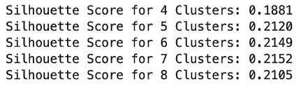

图 8.17：不同聚类大小的轮廓得分

实际值可能会有所不同，因为拟合 K-means 聚类算法时存在一些随机性，但趋势应该是相似的。

1.  基于此，我们打算基于嵌入向量构建 7 个集群，如下面的代码所示：

    ```py
    n_cluster = 7
    kmeans = KMeans(n_clusters=n_cluster, n_init="auto").fit(
        transforemd_encoded
    )
    customer_item_df["cluster"] = kmeans.labels_
    from collections import Counter
    n_items = 5
    common_items = []
    for i in range(n_cluster):
        most_common_items = Counter(list(df.set_index("CustomerID").loc[
                customer_item_df.loc[
                customer_item_df["cluster"] == i
            ].index
        ]["Description"])).most_common(n_items)

        common_items.append({
            f"item_{j}": most_common_items[j][0] for j in range(n_items)
        })
    common_items_df = pd.DataFrame(common_items) 
    ```

在此代码中，我们构建了 7 个集群。然后，对于每个集群，我们使用 Python 中的`collections`库获取每个集群中客户购买的最常见的 5 个商品。然后，我们将每个集群中最常购买的 5 个商品存储在一个名为`common_items_df`的 DataFrame 中。这个 DataFrame 应该能让我们了解哪些类型的商品最吸引每个客户细分市场。

让我们更仔细地看看这个 DataFrame：

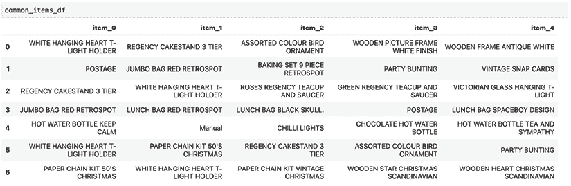

图 8.18：每个集群前 5 个常见商品

这给我们带来了以下见解：

+   第一集群或索引为 0 的集群的客户似乎对一些装饰品最感兴趣，例如饰品和木框。

+   第二集群或索引为 1 的集群的客户似乎对与派对相关的商品感兴趣，例如烘焙套装、派对彩旗和卡片。

+   第三集群或索引为 2 的集群的客户似乎对茶或茶道很感兴趣，因为他们购买了茶杯和茶托。

+   第四集群的客户似乎喜欢购买包。

+   第五集群的客户似乎喜欢水壶等等。

如您所见，这些客户集群显示了他们最感兴趣的商品，以及如何根据他们的产品兴趣将不同的客户分组在一起。这些信息将在您构建下一轮营销策略和活动时非常有用。您可能不想向那些对购买水壶感兴趣的人推广茶具，反之亦然。这种不匹配的目标定位将导致浪费的营销活动，参与和转化的成功率低。您希望根据不同客户细分市场的产品兴趣，为每个细分市场构建更精准的营销活动，并针对他们最感兴趣的品类进行推广。

这样做，你更有可能进行成功的营销活动，在吸引客户参与和转化方面取得更多成功。

# 摘要

在本章中，我们讨论了不同分割客户群的方法。我们首先探讨了新客户与回头客对收入的影响，以及新客户和回头客数量的月度进展如何告诉我们下一次营销活动应关注哪个细分市场或客户群体。然后，我们讨论了如何使用 K-means 聚类算法编程构建和识别不同的客户细分市场。通过销售金额、订单数量和退款，我们实验了如何使用这些因素构建不同的客户细分市场。在不进行实际操作的情况下，我们提到了轮廓分数作为寻找最佳聚类数量的标准，以及在对高度偏斜的数据集进行处理时，对数变换可能是有益的。最后，我们使用单词和句子嵌入向量将产品描述转换为具有上下文理解的数值向量，并基于他们的产品兴趣进一步构建客户细分市场。

在接下来的章节中，我们将进一步探索 LLMs。从使用预训练的零样本模型创建引人入胜的内容，到更高级的少样本和 RAG 方法，我们将在下一章更多地涉及 LLMs 和生成式 AI。

# 加入我们书籍的 Discord 空间

加入我们的 Discord 社区，与志同道合的人交流，并和超过 5000 名成员一起学习：

[`packt.link/genai`](https://packt.link/genai)


