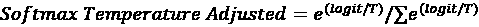

# 9

# 使用零样本学习创建引人入胜的内容

在**第五章**中介绍了大型语言模型的潜力之后，我们将在本章深入探讨相关主题，将我们的分析从其在数据增强和情感分析中的作用扩展到其在不同领域的更广泛影响。本章介绍了**零样本学习**（**ZSL**），这是一种机器学习方法，模型可以在没有为这些类别接收任何特定训练示例的情况下，正确地对新、未见过的类别进行预测。它讨论了 ZSL 的潜力及其在生成式人工智能领域创建营销文案中的应用。讨论突出了 ZSL 作为一种高效工具，可以补充传统的营销内容创作流程，如何革命性地改变营销文案的生成。

我们将深入讨论生成式人工智能的核心原则，并探讨这些技术的能力和局限性，这将为我们随后对预训练模型重要性的探索奠定基础。我们将以 ZSL 的实际操作演练结束本章，通过动手示例展示这种方法的优势以及我们如何利用它来生成营销内容。这将使你具备理解和利用这项技术，将你的营销策略提升到新高度的能力。

到本章结束时，你将熟练掌握：

+   生成式人工智能的基础及其在市场营销中的多方面应用

+   ZSL 的原则及其在提高传统内容创作流程效率中的价值

+   在应用 ZSL 创建营销文案时的实际策略和考虑因素

# 生成式人工智能的基础

**生成式人工智能**（**GenAI**）是指能够生成新内容的人工智能子集，无论是文本、图像、视频，甚至是反映现实世界示例的合成数据。与旨在根据输入解释、分类或预测数据的传统 AI 模型不同，GenAI 更进一步，通过理解和学习现有数据模式来产生新的、以前未见过的输出。它通过理解并从现有数据模式中学习，以产生与输入数据保持逻辑连续性的新颖输出。

我们在**第一章**中介绍了 GenAI，并在**第五章**中进一步探讨了它及其在情感分析中的应用。在开始我们关于预训练模型和 ZSL 的讨论之前，我们将探讨 GenAI 的基本技术考虑因素，它是什么（以及不是什么），以及为什么它对生成营销内容有如此大的影响。虽然本章的动手示例将涉及文本生成，但也将讨论支撑 GenAI 在其他应用（如图像和视频）中能力的重要概念。

## 概率方法

GenAI 的核心是对数据分布的概率建模方法。这涉及到学习数据集的潜在概率分布，以从同一分布中生成新的样本。这种方法的一个基石是贝叶斯推理，这是一个随着更多证据或信息的出现而更新假设概率的原则。例如，考虑一个简单的方程，它是贝叶斯推理数学基础的基石，即贝叶斯定理：


其中：

+   *P*(*A*∣*B*) 是在证据 *B* 下假设 *A* 的后验概率

+   *P*(*B*∣*A*) 是在假设 *A* 为真的情况下观察证据 *B* 的可能性

+   *P*(*A*) 是假设 *A* 的先验概率，或者在我们看到证据之前我们认为 *A* 为真的可能性

+   *P*(*B*) 是在所有可能假设下观察证据 *B* 的概率

    **贝叶斯定理 – 概率推理的支柱**

    贝叶斯定理不仅是 GenAI 的基石，也是统计学、计算机科学、哲学和医学等多个学科的基本原则。在其核心，贝叶斯定理允许我们在新证据的背景下完善我们的假设，为从经验中学习这一概念提供了一种严谨的数学方法。

当将贝叶斯推理的原则扩展并融入如**循环神经网络**（**RNNs**）、**长短期记忆网络**（**LSTMs**）或转换器等深度学习模型到序列生成中时，我们进入了条件概率的领域。这个序列生成过程可以通过预测每个元素基于其前驱元素的概念来观察，这一概念不仅对视频和音频至关重要，也对时间序列建模和其他形式的序列数据生成应用，包括文本，至关重要。

训练 GenAI 模型需要大量的数据，在文本的情况下，这些数据必须被分解成更小的单元，称为标记。这些标记通常由子词单元或短语组成，这使得模型在理解和生成自然语言方面更加高效。文本标记化过程至关重要，因为它允许模型学习不同序列的单词或子词的概率分布。

当我们对文本进行标记化时，我们将其分解成模型可以处理的可管理部分。然后，每个标记在训练期间被用作模型的输入。模型学习预测序列中下一个标记的概率，给定之前的标记。这种概率方法正是贝叶斯原理发挥作用的地方。通过随着新数据的引入不断更新标记的概率分布，模型在生成连贯且上下文相关的输出方面变得更加出色。

例如，在文本生成中，一个模型可能会根据前面的单词预测句子中的下一个单词。这个预测过程涉及计算条件概率：


其中 *x*[t] 代表时间 *t* 的标记，*P*(*x*[t]∣*x*[1]，*x*[2]，…，*x*[t-1]) 表示在给定所有先前标记的序列的情况下生成 *x*[t] 的概率。

在视频和音频生成的案例中，利用基于贝叶斯原理的深度学习模型有助于理解和预测时间进程。在时间 *t* 的每一帧或音频样本 *x*[t] 是基于所有先前帧或样本的序列（*x*[1]，*x*[2]，…，*x*[t-1]）预测的。从数学上讲，这种关系由前面的方程式捕捉：

其中 *x*[t] 代表时间 *t* 的帧或音频样本， 表示在给定所有先前样本的序列的情况下生成 *x*[t] 的概率。

**源代码和数据**：

[`github.com/PacktPublishing/Machine-Learning-and-Generative-AI-for-Marketing/tree/main/ch.9`](https://github.com/PacktPublishing/Machine-Learning-and-Generative-AI-for-Marketing/tree/main/ch.9)

## 基础模型

在生成式 AI 中，有几个重要的基础模型，每个模型都对图像、文本和序列生成中的应用做出了独特的贡献。本节将涵盖一些最重要和最广泛使用的案例，例如：

+   **生成对抗网络**（**GANs**）

+   **变分自编码器**（**VAEs**）

+   **长短期记忆网络**（**LSTMs**）

+   基于 Transformer 的模型，如**生成预训练 Transformer**（**GPT**）

尽管每个这些模型的全面实现示例和理论超出了本章的范围，但我们将讨论每种模型类型的核心概念，并提供其架构的简化、说明性示例，以便理解这些模型在营销应用中的重要性。在*第十二章*中，我们将扩展我们的讨论，提及最近获得更多关注并有望推进生成式 AI 领域的模型进展。

**使用 Google Colab 笔记本探索机器学习模型**

训练自己的最先进机器学习模型可能成本高昂。然而，使用 Google Colab 笔记本，您可以在自己的机器上无需任何设置的情况下训练和调整模型。以下是一些入门链接：

+   用于高质量图像生成的**GANs**：[`colab.research.google.com/drive/1uwPlY-4P_6fJ59SFRtgZLebVGgwGrUQu`](https://colab.research.google.com/drive/1uwPlY-4P_6fJ59SFRtgZLebVGgwGrUQu)

+   **VAEs** 用于图像重建：[`colab.research.google.com/github/smartgeometry-ucl/dl4g/blob/master/variational_autoencoder.ipynb`](https://colab.research.google.com/github/smartgeometry-ucl/dl4g/blob/master/variational_autoencoder.ipynb)

+   **GPTs**用于语言处理：[`colab.research.google.com/drive/1JMLa53HDuA-i7ZBmqV7ZnA3c_fvtXnx-?usp=sharing`](https://colab.research.google.com/drive/1JMLa53HDuA-i7ZBmqV7ZnA3c_fvtXnx-?usp=sharing)

+   **LSTMs**用于时间序列预测：[`colab.research.google.com/github/d2l-ai/d2l-pytorch-colab/blob/master/chapter_recurrent-modern/lstm.ipynb`](https://colab.research.google.com/github/d2l-ai/d2l-pytorch-colab/blob/master/chapter_recurrent-modern/lstm.ipynb)

### 生成对抗网络

GAN 已在广泛的应用领域找到应用，从图像生成和风格迁移到数据增强等。它们在需要真实图像生成至关重要的应用中特别有影响力，NVIDIA 和 Adobe 已在其照片编辑软件中使用 GAN 生成和修改图像。它们的应用包括以下内容：

+   **内容创作**：GAN 可以生成高质量、逼真的图像、艺术作品和视频，从而实现新的创意内容生产形式

+   **图像到图像的翻译**：像照片增强、从草图生成逼真渲染和领域适应（如日夜转换和夏季到冬季转换）等应用利用 GAN 将图像从一个领域转换到另一个领域，同时保留上下文细节。

在其核心，GAN 由两个通过竞争过程同时训练的神经网络组成：

+   生成器（*G*）旨在生成与真实数据无法区分的数据

+   判别器（*D*）旨在准确地将数据分类为真实或生成

这可以通过以下图示来说明：


图 9.1：GAN 工作流程

GAN 的目标函数封装了生成器和判别器之间的训练动态，创造了一个动态环境，其中两个模型都会根据对方的性能而提高。这类似于一个双玩家游戏，每个玩家的成功都基于智胜对手。在 GAN 的情况下，当生成器产生真实数据的完美复制品时，游戏达到平衡，这使得判别器无法区分真实和伪造，理想情况下，判别器正确猜测的概率为`0.5`。

为了使 GAN 在诸如高分辨率图像生成等任务上高度有效，生成器和判别器的架构都必须精心设计。这可能涉及采用有效的架构来处理空间层次数据，例如**卷积神经网络（CNNs）**。

**什么是卷积神经网络（CNNs）**？

CNNs 是处理空间数据（如图像）的机器学习基石。它们使用卷积滤波器识别模式，在需要理解空间层次的任务中表现出色。这使得 CNNs 在许多 GAN 应用（如图像生成和识别）中变得不可或缺。

在基于图像的 GAN 应用中，生成器使用技术将潜在表示扩展到详细图像，而判别器则应用方法降低输入图像的维度以高效地评估其真实性。潜在维度，作为生成新数据实例的种子，是一个紧凑的高维空间，以压缩格式封装潜在的数据变化。

以下代码展示了使用 Python 构建简化 GAN 图像核心结构的流程，其中关键步骤在此描述：

1.  导入构建生成器和判别器所需的库：

    ```py
    from tensorflow.keras.models import Sequential
    from tensorflow.keras.layers import Dense 
    ```

1.  定义生成器模型，它接受一个潜在空间向量并通过一系列密集层生成一个 28x28 的图像：

    ```py
    def build_generator(latent_dim):
        model = Sequential([
            Dense(128, activation='relu', input_dim=latent_dim),  # maps from latent space
            Dense(256, activation='relu'),  # expands representation
            Dense(784, activation='tanh')  # produces 28x28 image
        ])
        return model 
    ```

1.  定义判别器模型，它接受一个图像并通过一系列密集层将其分类为真实或生成：

    ```py
    def build_discriminator(input_shape):
        model = Sequential([
            Dense(256, activation='relu', input_shape=(input_shape,)),  # processes input image
            Dense(128, activation='relu'),  # reduces dimensionality
            Dense(1, activation='sigmoid')  # classifies input as real or generated
        ])
        return model
    Define the latent dimension and initialize the models:
    latent_dim = 100  # size of input noise vector
    generator = build_generator(latent_dim)
    discriminator = build_discriminator(784)  # for 28x28 images 
    ```

为了解决常见的挑战，如输出多样性有限和确保生成数据在保持与真实数据分布紧密相似的同时具有多样性，需要进一步的技术考虑。这些考虑包括激活函数（用于非线性变换的`relu`）的选择、确保层间输入分布一致的技术，以及如训练期间随机省略单元以防止过拟合的策略。

更多关于这方面的细节，您可以参考关于 GANs 的最新论文：[`www.researchgate.net/publication/380573076_Understanding_GANs_fundamentals_variants_training_challenges_applications_and_open_problems`](https://www.researchgate.net/publication/380573076_Understanding_GANs_fundamentals_variants_training_challenges_applications_and_open_problems)。

### 变分自编码器

与 GANs 相比，VAEs（变分自编码器）在生成建模方面提出了不同的方法。VAEs 提供了一种概率学习数据潜在表示的方法，并包含两个主要组件：

+   编码器将输入数据压缩到潜在空间表示

+   解码器从该潜在空间重建数据

与传统的自动编码器不同，VAEs 引入了一种概率转折，即它们不是将输入编码为单个点，而是将其编码为潜在空间上的分布。

**VAEs 的多用途应用**

VAEs 在理解和建模复杂数据分布方面发挥着重要作用。VAEs 表现优异的关键领域之一是数据插补，其中它们可以预测缺失信息或预测时间序列数据的未来趋势。

VAE（变分自编码器）的损失函数结合了重建损失与学习到的潜在变量分布与先验分布之间的**Kullback-Leibler**（KL）散度。重建损失衡量生成的输出与原始输入匹配的程度，确保模型能够创建准确的数据复制品，而 KL 散度在训练期间充当正则化形式，确保模型学习到高效且有意义的数据表示。这种正则化通过鼓励模型生成不仅准确而且对新、未见数据具有良好泛化能力的输出，防止模型过拟合。通过结合这两个组件，VAE 学习生成高质量、多样化的输出，并鼓励模型学习数据的有效编码。

以下是一个使用 Keras 构建 VAE 的简化示例：

1.  我们将使用一个 28x28 的扁平图像输入作为另一个示例，我们首先在`sampling()`函数中从潜在分布中采样：

    ```py
    from tensorflow.keras.layers import Input, Lambda
    from tensorflow.keras import Model, backend as K
    def sampling(args):
        z_mean, z_log_var = args
        batch = K.shape(z_mean)[0]
        dim = K.int_shape(z_mean)[1]
        epsilon = K.random_normal(shape=(batch, dim))
        return z_mean + K.exp(0.5 * z_log_var) * epsilon 
    ```

1.  我们随后使用编码器将输入映射到潜在空间：

    ```py
    inputs = Input(shape=(784,)) # Encoder
    h = Dense(256, activation='relu')(inputs)
    z_mean = Dense(2)(h)
    z_log_var = Dense(2)(h)
    z = Lambda(sampling, output_shape=(2,))([z_mean, z_log_var]) 
    ```

1.  我们随后使用解码器从潜在空间重建图像：

    ```py
    decoder_h = Dense(256, activation='relu') # Decoder
    decoder_mean = Dense(784, activation='sigmoid')
    h_decoded = decoder_h(z)
    x_decoded_mean = decoder_mean(h_decoded)
    vae = Model(inputs, x_decoded_mean) 
    ```

对于 VAE 的有效应用，选择合适的编码器和解码器架构至关重要，通常涉及密集连接层进行基本任务，或更复杂的结构，如 CNN（卷积神经网络）进行图像数据。潜在空间的空间维度也非常关键——它必须足够大以捕捉相关的数据变化，但不能太大以至于导致过拟合或无意义的重建。当设计正确时，VAE 提供了一种原则性的生成建模方法，在准确数据重建的需求与从学习到的数据分布生成新、多样化样本的灵活性之间取得平衡。

### 长短期记忆网络

LSTM 是一种专门设计的 RNN（循环神经网络），用于学习序列数据中的长期依赖关系。RNN 是一类包含循环的神经网络，允许信息通过将信息从一个网络步骤传递到下一个步骤来持续存在。这种循环机制使 RNN 适合处理时间序列或文本等数据序列。然而，标准 RNN 由于梯度消失和梯度爆炸等问题，在学习长期依赖关系时往往遇到困难。这是因为，在反向传播过程中，梯度可能变得非常小（消失）或非常大（爆炸），这使得有效地更新网络权重变得困难。LSTM 通过一个更复杂的内部结构来解决这些挑战，使其能够有效地记住信息更长时间。

LSTM（长短期记忆网络）的显著特征是它们能够更有效地记住信息，这得益于它们的细胞状态以及三种类型的门：输入门、输出门和遗忘门。这些组件共同工作，调节信息的流动，使网络能够在长时间内记住重要信息，并忘记无关数据。

**LSTM 的关键组件**

LSTM 的核心是其细胞状态和具有以下功能的门：

+   **输入门**：决定在细胞状态中存储多少新信息

+   **遗忘门**：从细胞状态中丢弃哪些信息

+   **输出门**：细胞状态输出到下一层

以下代码设置了一个简单的 LSTM 网络，用于时间序列预测，可用于根据前一天的不同特征预测第二天销售额。在这个架构中，我们允许`sequence_length`捕获 10 天的数据，然后通过`num_feature`捕获 5 个特征，这些特征可能包括如网站流量或之前的销售额等数据点。具有 50 个单位的 LSTM 层学习识别序列数据中的模式，而`Dense`层输出预测。最后，该模型使用 Adam 优化器和均方误差(`mse`)损失函数编译，这些是回归任务的常见选择：

```py
from tensorflow.keras.layers import LSTM
sequence_length = 10
num_features = 5
model = Sequential([
    LSTM(50, activation='relu', input_shape=(sequence_length, num_features)),
    Dense(1)
])
model.compile(optimizer='adam', loss='mse') 
```

为了演示训练过程，我们可以生成模拟销售预测数据的合成时间序列数据。合成数据包括一个基本正弦波和添加的噪声，模拟具有随机波动的每日模式：

```py
import numpy as np
import matplotlib.pyplot as plt
def generate_synthetic_data(num_samples, sequence_length, num_features):
    X = []
    y = []
    for i in range(num_samples):
        base = np.array([np.sin(x) for x in range(sequence_length)]) + np.random.normal(0, 0.1, sequence_length)
        features = np.tile(base, (num_features, 1)).T + np.random.normal(0, 0.1, (sequence_length, num_features))
        target = np.sum(base) + np.random.normal(0, 0.1)
        X.append(features)
        y.append(target)
    return np.array(X), np.array(y)
X_train, y_train = generate_synthetic_data(100, sequence_length, num_features)
model.fit(X_train, y_train, epochs=10, verbose=1) 
```

训练后，我们可以通过比较预测的销售额值与实际值来在测试数据上评估模型：

```py
X_test, y_test = generate_synthetic_data(10, sequence_length, num_features)
y_pred = model.predict(X_test)
plt.plot(y_test, label='Actual')
plt.plot(y_pred, label='Predicted')
plt.xlabel('Days')
plt.ylabel('Sales Prediction')
plt.title('Actual vs Predicted Sales Over Time')
plt.legend()
plt.show() 
```

代码生成了以下图表，展示了如何通过训练一个简单的 LSTM 模型，如果给定适当的输入特征，可以快速提供有用的预测，例如销售额：


图 9.2：LSTM 销售预测模型的输出

### **Transformer**

基于 Transformer 的模型，如 GPT 系列，通过引入一个在捕捉数据中的上下文和关系方面表现卓越的模型架构，彻底改变了自然语言处理。Transformer 模型的核心创新是注意力机制，它使模型能够根据输入数据的不同部分以不同的方式权衡其重要性。这种机制允许 GPT 和类似模型理解上下文并生成连贯且上下文相关的文本。

GPT 模型利用 Transformer 架构进行生成任务，在大量文本数据上进行训练以理解语言模式、语法和上下文。这种预训练使 GPT 模型能够根据输入提示生成高度连贯且上下文相关的文本。虽然从头开始构建 GPT 是一个艰巨的任务，但在概念层面上，GPT 架构中存在一些关键组件：

+   **嵌入层**：将标记索引转换为固定大小的密集向量

+   **多头注意力**：允许模型同时关注输入序列的不同部分，捕捉各种上下文关系

+   **层归一化和残差连接**：有助于稳定和优化训练过程，确保梯度在整个网络中顺畅流动

以下代码展示了如何使用 Keras 和上述组件创建一个简化的类似 GPT 的架构：

```py
from tensorflow.keras.layers import Embedding, LayerNormalization, MultiHeadAttention
def simplified_gpt_model(vocab_size=10000, embed_dim=256, max_length=40, num_heads=4, ff_dim=512)
    inputs = Input(shape=(max_length,))  # input layer for sequences of tokens
    embedding_layer = Embedding(input_dim=vocab_size, output_dim=embed_dim)(inputs) # convert token indices to vectors
    # self-Attention layer with multiple heads
    attn_output = MultiHeadAttention(num_heads=num_heads, key_dim=embed_dim)(embedding_layer, embedding_layer)
    # normalization and residual connection for the attention output
    attn_output = LayerNormalization(epsilon=1e-6)(attn_output + embedding_layer)
    # feed Forward network to processes attention output
    ff_network = Dense(ff_dim, activation="relu")(attn_output)
    ff_network_output = Dense(embed_dim)(ff_network)
    # second normalization and residual connection
    sequence_output = LayerNormalization(epsilon=1e-6)(ff_network_output + attn_output)
    # output layer to predict the next token in the sequence
    outputs = Dense(vocab_size, activation="softmax")(sequence_output)
    model = Model(inputs=inputs, outputs=outputs)
    return model
gpt_model = simplified_gpt_model()
gpt_model.compile(optimizer='adam', loss='sparse_categorical_crossentropy') 
```

**GPT 中自注意力的力量**

自注意力是 GPT 模型背后的关键创新，它允许网络权衡句子中不同单词的重要性，增强其对上下文和单词之间关系的理解。

要了解更多信息，请参阅 Illia Polosukhin 等人撰写的论文《Attention Is All You Need》（[`arxiv.org/pdf/1706.03762`](https://arxiv.org/pdf/1706.03762)）。

## 当 GenAI 是合适的选择时

虽然 GenAI 为内容创作和数字营销带来了新的可能性，但了解其局限性同样重要。GenAI 在需要创新、创造力和动态扩展个性化内容的环境下表现出色。更普遍地说，以下情况下，GenAI 可以成为您营销活动的绝佳选择：

+   **创意活动的头脑风暴**：生成独特且引人入胜的内容，无论是文本、图像还是视频，以促进创意营销活动的头脑风暴，使其在拥挤的数字领域中脱颖而出。例如，我们将在本章和第十章中使用 GenAI 生成新产品发布文案。

+   **动态内容个性化**：使营销人员能够大规模定制内容，同时仍然关注个别用户的偏好和行为，以提高参与度和转化率。例如，我们将在第十一章中展示如何将 GenAI 与**检索增强生成**（**RAG**）相结合，根据个人的浏览历史和购买行为创建个性化的推荐和电子邮件内容。

+   **内容生产效率**：自动化内容生成过程，显著减少生产营销材料所需的时间和资源。

然而，GenAI 并非万能的解决方案，尤其是在需要准确性和深度上下文理解的营销场景中。例如，在高度监管的行业或围绕社会问题的敏感活动中，任何失误都可能对品牌声誉造成重大影响，因此必须谨慎行事。虽然 GenAI 可以帮助这些情况下的头脑风暴，但如果未经仔细监控就部署 GenAI 内容，其不可预测性可能会带来重大风险。关于这一主题的进一步讨论将在第十三章中呈现，以及在第十章和第十一章中介绍提高其上下文理解策略。

**GenAI 在高度监管的行业中的应用**

当在医疗保健、金融服务、保险和法律服务等行业应用 GenAI 时，遵守严格的监管标准至关重要。这些应用的营销内容需要额外的审查，因为它们不仅需要准确和透明，还需要符合行业特定的合规措施。

# 预训练模型和 ZSL 的介绍

建立在前面章节所讨论的 GenAI 基础之上，我们现在将介绍一些与预训练模型和**零样本学习**（**ZSL**）相关的核心概念。这些概念解释了模型如何利用大量现有数据，在不进行额外训练的情况下，为尚未遇到的情况生成真实、新的输出。重点关注文本数据，我们将讨论上下文嵌入和语义邻近性是如何作为两个关键概念来促进这一能力的。有了这些知识，你将能够理解并应用这些概念在本章以及后续章节中。

## 上下文嵌入

上下文嵌入，得益于之前讨论过的 LSTM 和 GPT 模型的进步，对于**大型语言模型**（**LLM**s）如何理解和生成语言至关重要。正如在*第五章*中讨论的那样，嵌入是数据的密集向量表示，在多维空间中捕捉关键特征。早期的模型如 Word2Vec 和 GloVe 生成静态嵌入，其中相同的单词总是有相同的向量。相比之下，先进的模型如 BERT 和 GPT 创建上下文嵌入，其中单词表示根据其在上下文中的使用而变化。有效的 NLP 嵌入保留了原始数据的语义关系，这意味着在向量空间中相似的向量彼此更接近。这种适应性是 ZSL 等应用的基础，这些应用依赖于模型将学习到的知识应用于新任务的能力，而无需特定的训练数据。

在本章早期对 GenAI 的概率性质的探索中，我们注意到文本生成与视频或音频中的序列预测类似，即每份数据的相关性取决于其前驱。作为一个类比，考虑一下谷歌的自动补全功能如何根据已输入单词的上下文来调整建议。这个相同的概念是模型如 BERT 的变革性潜力之所在，它通过上下文嵌入分析前后的文本上下文，以增强语言理解和预测准确性。

GPT 模型更进一步，采用自回归框架。术语“自回归”意味着模型基于其自身的先前输出进行预测，这意味着它根据模型的所有先前输出作为上下文来预测后续的单词。例如，当为营销博客开发内容日历时，GPT 模型可以分析过去的文章和热门话题，以建议与品牌声音和受众兴趣相符的新帖子。这与本章前面讨论的基于转换器的模型不同，后者可以同时查看前后的单词。然而，这种自回归模型可以提供更细致的文本生成，使它们能够创建具有更高一致性的叙事，这可能比双向模型更无缝地实现。

**上下文嵌入的重要性**

LSTM 或 GPT 模型的上下文嵌入可以通过评估文本的整体更多内容来实现细微的理解。

例如，在填写“暴风雨的海面平静下来，因为 ___ 驶进了港口”的空白处时，一个利用先前和后续上下文的模型可以更准确地推断出“船”，而一个只有先前上下文的更简单模型可能会错误地预测“天”这个词。

## 语义邻近度

从我们对上下文嵌入及其在语言模型中关键作用的讨论中过渡，我们现在将探讨**语义邻近度**。上下文嵌入不仅通过考虑文本的动态上下文来增强对文本的理解；它们还作为评估文本中单词或短语之间语义关系的基本工具。当我们考察语义邻近度的概念时，这种细微的理解至关重要，它涉及量化两个语言项目在意义上的密切程度或距离。

例如，考虑短语“限时优惠”和“独家交易”。这两个短语具有紧密的语义邻近度，因为它们都与针对潜在客户的定向促销相关。相反，“限时优惠”和“客户反馈”这两个短语会有更大的语义距离。

通过余弦相似度等方法，可以有效地评估语义邻近度，这些方法测量的是在多维空间中代表这些项目的向量的角度。这个基于向量空间几何的度量，提供了一种清晰、数学的方式来捕捉和比较嵌入编码的意义。数学上，余弦相似度如下所示：


其中 *A* 和 *B* 是向量（一个词、短语、文档等的语义嵌入），*A*⋅*B* 表示它们的点积，而 ∥*A*∥ 和 ∥*B*∥ 表示它们的模长。余弦相似度的值范围从 -1 到 1。值为 1 表示向量在方向上完全相同，表示最大相似度。值为 0 表示向量正交，表示没有相似度。

虽然，在实践中，许多复杂的文本嵌入是高维的，可以从几百维到几千维不等，但我们可以通过两个向量在二维空间中更直观地说明余弦相似度的概念。在下面的代码中，我们通过向量 *A* 和 *B* 说明了余弦相似度的计算，以及与它们余弦相似度相关的角度：

```py
A, B = np.array([2, 2]), np.array([3, 0])
cos_sim = np.dot(A, B) / (np.linalg.norm(A) * np.linalg.norm(B))
angle = np.arccos(cos_sim)
plt.figure(figsize=(6,6))
for vector, color, label in zip([A, B], ['red', 'green'], ['Vector A', 'Vector B']):
    plt.quiver(0, 0, vector[0], vector[1], angles='xy', scale_units='xy', scale=1, color=color, label=label)
plt.plot(0.5 * np.cos(np.linspace(0, angle, 100)), 0.5 * np.sin(np.linspace(0, angle, 100)), color='blue', label=f'Cosine Similarity = {cos_sim:.2f}')
plt.axis([-1, 4, -1, 4])
plt.axhline(0, color='black', linewidth=0.5)
plt.axvline(0, color='black', linewidth=0.5)
plt.grid(color='gray', linestyle='--', linewidth=0.5)
plt.title('Cosine Similarity between Vectors')
plt.legend()
plt.show() 
```


图 9.3：两个向量 A 和 B 之间余弦相似度的可视化，显示了它们在二维空间中的角度关系

在余弦相似度的数学基础上继续，我们可以将这个相同的概念应用于探索不同上下文中单词的多义性。考虑在两个不同句子中使用的单词“light”：

*他打开* **灯** *来阅读*。

*这种* **轻质** *织物非常适合夏天*。

这些句子展示了“光”这个词的不同语义实例，通过使用 BERT 等上下文嵌入模型，我们可以使用余弦相似度来量化这些情况下“光”的语义差异。

例如，在以下代码中，我们：

1.  导入库并加载预训练的 BERT 模型和分词器。

1.  将句子分词，将它们转换为 BERT 模型期望的格式。

1.  将分词句子通过 BERT 模型传递以获得嵌入。

1.  通过在每个分词句子中找到“光”这个词的索引并从模型输出中提取其对应的嵌入来提取“光”的嵌入。

1.  计算余弦相似度并打印结果。

要做到这一点，请使用以下代码：

```py
import tensorflow as tf
from transformers import BertTokenizer, TFBertModel
tokenizer = BertTokenizer.from_pretrained('bert-base-uncased')
model = TFBertModel.from_pretrained('bert-base-uncased')
sentence_1 = "He turned on the light to read."
sentence_2 = "The light fabric was perfect for summer."
tokens_1 = tokenizer(sentence_1, return_tensors="tf")
tokens_2 = tokenizer(sentence_2, return_tensors="tf")
outputs_1 = model(tokens_1)
outputs_2 = model(tokens_2)
light_index_1 = tokens_1['input_ids'][0].numpy().tolist().index(tokenizer.convert_tokens_to_ids('light'))
light_index_2 = tokens_2['input_ids'][0].numpy().tolist().index(tokenizer.convert_tokens_to_ids('light'))
embedding_1 = outputs_1.last_hidden_state[0, light_index_1]
embedding_2 = outputs_2.last_hidden_state[0, light_index_2]
cosine_similarity = tf.keras.losses.cosine_similarity(embedding_1, embedding_2, axis=0)
cosine_similarity = -cosine_similarity.numpy()
print("Cosine similarity between 'light' embeddings in the two sentences:", cosine_similarity) 
```

```py
Cosine similarity between 'light' embeddings in the two sentences: 0.47577658 
```

余弦相似度值范围从-1 到 1。如前所述，1 表示向量完全相同，而 0 表示正交向量，没有相似性。在这种情况下，余弦相似度为 0.48 表明两个句子中“光”的嵌入相似但并不相同。

## 预训练模型

预训练模型是之前在大型数据集上训练过的机器学习算法，用于执行通用任务，如理解自然语言或识别图像中的对象。预训练模型的作用根本在于它们使用训练时使用的嵌入。对于文本，这些嵌入不仅使模型能够动态地掌握上下文，而且也是将这些模型适应特定任务（如第五章中讨论的情感分析）的基础，而无需或仅需少量额外的训练。这种适应性对于 ZSL 等应用至关重要。

预训练模型的出现通过提供可以微调或直接用于推理的基础模型，使最先进的 AI 访问民主化。这些模型不仅降低了 AI 驱动解决方案的部署成本和时间，还降低了计算资源和能源消耗，使 AI 更加易于访问且环保。在营销领域，预训练模型提供了显著的优势。它们使营销人员能够快速部署先进的 AI 解决方案，用于个性化内容创建、客户情绪分析和定向广告等任务。

以前只有大型或高度专业化的科技公司才能获得的复杂人工智能模型，现在以极低成本成为小型企业和甚至个人消费者的可能。以 GPT-3 为例，2020 年发布时从头开始训练这样一个模型估计需要数百万美元，这个数字包括了计算成本和人力专业知识。如今，用户可以通过公司的 API 使用这个（或更先进的）模型进行推理，生成文本，费用仅为数百字内容的几分钱。

预训练模型的关键组件包括：

+   **权重**：它们代表从训练数据集中学习到的参数，并编码了迁移学习所需的广泛知识和模式

+   **架构**：模型的详细结构，说明输入如何通过各个层处理以生成输出

+   **预处理步骤**：如分词和归一化等程序，以确保数据与模型训练的兼容性

让我们详细看看这些组件。

### 模型权重

模型权重是神经网络的核心，包括预训练模型。权重是通过大量训练得到的优化参数，以最小化损失，作为模型学习知识的存储库。例如，在 GPT 等语言模型中，这些权重捕捉了语言的复杂性，如语法和上下文，使得生成的文本不仅连贯，而且上下文丰富。预训练模型在 ZSL 等任务中的有效性源于这些权重，它们使您能够从模型训练数据中泛化到新的、未见过的数据，并具有显著的准确性。

为了更好地理解模型权重从何而来，考虑以下**人工神经网络**（**ANN**）的例子，如图所示：


图 9.4：第六章中的示例 ANN 架构

这由三个主要层组成：输入层、隐藏层和输出层。在训练过程中，神经网络会经历正向传播和反向传播。正向传播涉及将数据通过网络生成输出，而反向传播则根据预测误差调整权重。通过这些迭代，网络学习每个神经元的最佳权重，最小化预测误差并提高模型性能。

### 模型架构

预训练模型的架构与其权重密切相关。它界定了数据在模型层之间处理和转换的结构，并指导模型适应执行新任务。例如，更深层的语言模型架构可能更适合复杂推理任务，而具有特别配置的注意力机制的模型可以在推理过程中提供更精细的控制。对于图像识别，这些模型产生的中间表示，如预训练 CNN 在各个层提取的特征，也可以作为分类任务的宝贵起点。

在理解机器学习模型的架构时，绘制其架构及其参数有助于可视化其关键方面。在此，我们使用 Keras 的`plot_model()`来展示这一点，作为由两个 LSTM 层组成的简单 LSTM 模型的演示：

```py
!conda install pydot
!conda install graphviz
from tensorflow.keras.utils import plot_model
model = Sequential([
    LSTM(64, return_sequences=True, input_shape=(10, 128)),
    LSTM(64),
    Dense(10, activation='softmax')
])
model.compile(optimizer='adam', loss='categorical_crossentropy', metrics=['accuracy'])
plot_model(model, show_shapes=True, show_layer_names=True) 
```


图 9.5：基于简单 LSTM 的神经网络架构

这张可视化图清晰地描绘了模型的结构，显示了从输入经过两个具有 64 个单元（或神经元）的 LSTM 层，到配置有 10 个 softmax 单元的最终密集输出层的演变。根据图中的标签，结构可以进一步分解如下：

+   **输入层（lstm_input）**：接受形状为 `(10, 128)` 的数据，处理 10 个时间步长的序列，每个时间步长有 128 个特征。

+   **第一层 LSTM（lstm）**：包含 64 个单元，返回序列，处理输入并将相同长度的序列传递给下一层 LSTM。

+   **第二层 LSTM（lstm_1）**：也有 64 个单元，但不返回序列，将第一层 LSTM 的输出压缩成一个单一向量。

+   **密集输出层（密集）**：最后一层是一个包含 10 个单元的密集层，并使用 softmax 激活函数，输出 10 个类别（分类或标签）的概率分布。

### 预处理步骤

预处理步骤对于确保数据与预训练模型的训练过程兼容至关重要。以下是一些例子：

+   NLP **分词**将文本分解成 LLM 模型期望的单词或子词。

+   对于图像，**归一化**可以调整图像像素值到一个共同尺度，以促进模型从数据中学习和生成预测的能力。

这些预处理步骤对于有效地利用预训练模型至关重要，确保输入数据与模型训练时所用的数据形式相匹配。

## 零样本学习

在我们探索了预训练模型及其基本组件之后，现在我们将关注它们在零样本学习（ZSL）中的应用。正如我们稍后将要讨论的，ZSL 背后的基本原理允许营销人员动态生成相关内容，甚至几乎实时地针对个别消费者进行营销活动。在我们进入这些例子之前，本节将提供一些关于 ZSL 的背景信息以及它是如何使模型能够应用所学知识并推断在训练期间未明确涵盖的任务或类别的信息的。这种能力扩展了预训练模型的应用范围，使它们能够泛化到未见过的数据和场景。

### 学习和预测的机制

ZSL 的核心操作是通过在高维嵌入空间中使用输入和输出的变换和映射，使用两个主要功能：

+   一个**嵌入函数** *f*：，它将输入（如图像或文本）转换为嵌入空间内的特征向量。

+   一个**语义属性函数** *g*：，它将类别标签与嵌入空间中的语义属性关联起来。这些属性用普遍的、可区分的特征来描述类别，存在于属性空间 *A* 中。

作为简化的例子，考虑将 ZSL 应用于区分动物的情况。嵌入函数*f*：将动物的视觉图像转换为嵌入空间中的高维特征向量——例如，处理麻雀和鹰的图像以显示不同的特征向量，代表它们的视觉特征。同时，语义属性函数*g*：根据语义属性将类标签，如*麻雀*和*鹰*，映射到相同的嵌入空间中的向量。麻雀的属性可能包括`[′small_size′, ′brown_color′, ′has_wings′]`，而鹰可能被描述为`[′large_size′, ′sharp_beak′, ′has_wings′]`。然后对这些属性进行量化，其中`small_size`可能编码为尺寸尺度上的`0.2`，而`large_size`为`0.8`。


图 9.6：从输入图像或类标签到嵌入空间的示例映射

如*图 9.6*所示，通过将图像和类属性放置在相同的嵌入空间中，模型可以将图像的特征向量与最近的类属性向量相匹配。即使模型在训练过程中从未见过麻雀或鹰的图像，这种匹配也可以通过识别它们属性与已知类之间的重叠来实现。为了找到最佳的类匹配，算法负责优化兼容性函数，该函数量化了输入特征向量与类属性向量之间的匹配程度。ZSL 预测随后涉及选择对未见实例兼容性最大的类。

### 输出参数

有许多关键参数可以指定以影响 ZSL 模型的输出。这些参数通过调整模型在采样过程中的行为来定制输出。在 GPT 等模型用于文本生成的情况下，最常用的三个参数包括：

+   温度

+   Top P（核采样）

+   频率惩罚

通过影响模型从兼容性函数生成的概率分布中采样的方式，每个参数都允许调整模型输出的创造力、连贯性和多样性。以下各节提供了关于每个这些参数背后理论的进一步细节。

#### 温度

温度参数在确定预测分布的随机性或置信水平方面起着至关重要的作用。从数学上讲，调整温度会以以下方式修改用于计算下一个单词概率的`softmax`函数：



其中 *T* 是温度，logit 代表模型的原生输出。较低的温度使分布更尖锐，使模型的预测更确定性和更少变化，而较高的温度则使分布更平坦，鼓励预测的多样性，但可能会引入较少的连贯性，因为模型更有可能采样不太可能的单词。

为了说明这个概念，让我们考虑一个预测文本生成场景，即句子“`The cat sat on the ___.`”中的下一个词。为了简化，假设我们的模型考虑了五种可能的完成方式：“`mat`”，“`tree`”，“`ball`”，“`bed`”，和“`tabl`e”，其初始 logit 反映了它们的概率（在这种情况下为了简化，手动分配）。我们可以使用以下代码来生成一个可视化，展示如何改变温度参数 *T* 影响 softmax 函数，改变这些潜在下一个词的概率分布：

```py
logits = np.array([2, 1, 0.1, 5, 3])
labels = ['mat' , 'tree', 'ball', 'bed', 'table']
def softmax_temperature_adjusted(logits, temperature):
    exp_logits = np.exp(logits / temperature)
    return exp_logits / np.sum(exp_logits)
temperatures = [0.5, 1, 2, 4]
plt.figure(figsize=(12, 8))
for T in temperatures:
    probabilities = softmax_temperature_adjusted(logits, T)
    plt.plot(labels, probabilities, marker='o', label=f'Temperature = {T}')
plt.title('Effect of Temperature on Prediction Distribution')
plt.ylabel('Probability')
plt.xlabel('Words')
plt.legend()
plt.grid(True)
plt.show() 
```

这给我们以下输出：


图 9.7：温度参数对句子“The cat sat on the ___”中潜在下一个词的 softmax 概率分布的影响可视化

如图中所示，在较低的温度下，分布更尖锐，将概率质量集中在更少、更可能的输出上，如“`bed`”。随着温度的升高，分布变得更平坦，给更广泛的、可能不太可能的单词输出更高的概率，如`table`或`mat`。

#### Top P

Top P，或称为**核采样**，提供了一种动态的方式来聚焦生成过程，使其集中在最可能的输出集上。模型不是考虑整个词汇表，而是将其选择限制在累积概率超过阈值 P 的最小单词集。

这种方法可以被视为根据模型置信度动态调整考虑范围，其公式如下：


其中 *N* 是考虑的单词数量，*P*(*w*[i]) 是第 *i* 个单词的概率。这项技术有助于在多样性和相关性之间保持平衡，确保生成的文本既合理又不受最可能预测的过度约束。

#### 频率惩罚

**频率惩罚**解决了模型倾向于重复相同单词或短语的问题，增强了输出的多样性。它根据生成文本中每个单词的先前出现次数修改每个单词的概率：


其中 *P*(*w*[i]) 是单词 *w*[i] 的原始概率，*Occurrence* (*w*[i]) 是 *w*[i] 在文本中出现的次数。这种调整通过惩罚模型已经使用的单词来鼓励探索新的词汇和想法，从而促进更丰富和更多样化的输出。

# 市场文案的零样本学习（ZSL）

现在，我们将通过一个电子商务品牌推出新的环保厨房用品和时尚产品线的例子来讨论 ZSL 的实际应用。传统上，创作吸引人的产品描述和促销内容可能需要熟悉品牌语气和可持续设计复杂性的作家进行大量研究和创意工作。然而，有了 ZSL，品牌可以将产品线的简洁描述输入到一个预训练模型中，强调“可持续”和“环保运动装”等关键词，立即生成适合品牌且适用于数字平台的适当内容输出。通过自动化内容生成的初始阶段，品牌现在可以更多地关注战略、参与度和分析其营销活动的有效性等高价值工作。

通常，为了有效地将 ZSL 整合到您的营销策略中，请考虑以下迭代过程作为模板：

1.  定义你的内容目标以及你想要传达的关键信息。

1.  创建简洁的提示，包含这些目标和信息，并融入相关关键词和主题。

1.  尝试不同的参数（`温度`、`Top P`和`频率惩罚`）来调整生成内容的风格和多样性。

1.  生成多个内容变体，以探索不同的角度和想法。

1.  审查和精炼输出，选择与您品牌语气和目标一致的最佳选项。

1.  根据受众反馈和性能指标，将生成的内容作为进一步定制和优化的起点。

在以下子节中，我们将重点关注先前工作流程的第 1-4 步，第 5 和 6 步将在后续章节的示例中介绍。

## 在 Python 中准备 ZSL

为了演示 ZSL 的 Python 设置过程，本节将介绍使用免费开源模型以及需要付费 API 实现的更高级模型的基本步骤。我们将使用 Hugging Face Transformers 库中的模型演示前者，并使用 OpenAI 的 API 服务演示后者的设置。

**紧跟 Hugging Face 更新**

Hugging Face 的 Transformers 库经常更新，使得之前仅通过付费 API 服务才能获得的先进模型现在可以免费使用。有关最新 Hugging Face 模型的详细信息，请参阅他们的文档：`https://huggingface.co/models`。

使用 Hugging Face 上可用的 gpt2 模型进行 ZSL 任务的基本设置如下：

```py
from transformers import pipeline
generator = pipeline('text-generation', model='gpt2')
prompt = "Write a compelling product description for eco-friendly kitchenware emphasizing sustainability:"
completion = generator(prompt, max_length=100, num_return_sequences=1, temperature=0.7)
print("Generated text using HuggingFace's GPT model:", completion[0]['generated_text']) 
```

运行此提示将产生如下输出：

```py
"Your kitchen will save you time and energy. It will save you money. It will make you feel good. It will help you get the most out of your kitchen and minimize waste. It will help you get good results. You'll save money and your home will be healthier." 
```

我们可以将这与其他具有相同参数但使用 OpenAI 的 GPT-4 更先进文本生成能力的模型的输出进行对比。执行此模型目前需要创建一个 OpenAI 账户，然后生成一个可以替换到以下代码中的 API 密钥：

```py
from openai import OpenAI
client = OpenAI(api_key = 'XXX') #insert your api key here
completion = client.chat.completions.create(
    model="gpt-4",
    messages=[{"role": "user",  "content": "Write a compelling product description for eco-friendly kitchenware emphasizing sustainability:"}],
    max_tokens=100, n=1, temperature=0.7)
print(completion.choices[0].message) 
```

这会导致以下类型的响应：

```py
"Introducing our premium range of eco-friendly kitchenware, designed for the conscious home cook. Every item in this collection is expertly created from sustainable materials, ensuring minimal impact on our environment. From bamboo cutting boards to recycled stainless-steel knives, each piece combines functionality with eco-friendly design. Our eco-friendly kitchenware is not only durable and high-performing, but also promotes a healthier lifestyle and a greener planet." 
```

从这两个响应中可以看出，像 GPT-4 这样的高级模型显著提高了生成内容的关联性和质量。这是因为，与 GPT-2 相比，GPT-4 在深度学习架构、更大的训练数据集和更复杂的微调技术方面取得了重大进步。因此，我们将使用 GPT-4 获得的结果在本章的剩余部分进行使用。

然而，有效利用 ZSL 的关键不仅在于模型的能力，还在于有效地选择塑造输出的输入信息。这里最关键的部分包括创建一个有效的提示，以及设置其他参数，如温度和 Top P，如本章前面所讨论的。

**谨慎使用 LLM 的输出**

在没有人工审查的情况下直接依赖任何 LLM 的输出作为关键活动内容可能存在风险！始终考虑将 GenAI 模型的初始输出视为创意起点，然后根据需要迭代和改进它们，以确保与您的品牌声音和目标保持一致。

## 创建一个有效的提示

创建一个有效的提示是利用 ZSL 进行营销文案的关键步骤。在 ZSL 中，提示实际上成为了一个模型的操作手册，告诉它需要生成什么类型的内容，以及其风格、语气和实质。

以下是一些关于如何制定提示以从模型中获得最佳营销文案内容的指南：

+   **清晰**：确保您的提示具体说明您想要的内容，无论是产品描述、标题还是行动号召。

+   **情境**：提供足够的背景信息以引导模型。对于环保产品，提及关键卖点，如可持续性或生物降解性。

+   **创意**：虽然清晰度至关重要，但留出创意空间可以产生令人惊讶和创新的成果。像“想象...”或“创造一个故事，其中...”这样的短语可能特别有效。

+   **简洁**：冗长的提示会分散焦点。在包含必要细节的同时追求简洁，确保模型保持主题。

在以下章节中，我们将通过示例展示提示质量的影响，包括不同类型的营销文案。虽然好的提示可以引发详细、相关和吸引人的内容，但差的提示可能导致模糊和缺乏灵感的结果。为了生成这些响应，我们将定义以下函数：

```py
def generate_response(prompt, model="gpt-4", max_tokens=100, temperature=0.7, n=1):
    response = client.chat.completions.create(
        model=model,
        messages=[{"role": "user", "content": prompt}],
        max_tokens=max_tokens,
        n=n,
        temperature=temperature)
return response.choices[0].message.content 
```

在接下来的示例中，这个功能将与不同的提示类型一起使用。

### 示例 1：产品描述

在本例中，我们将为我们的电子商务品牌生成产品描述，该品牌即将推出环保厨房用品的新系列。

以下是一个差的提示的例子：

```py
poor_product_description = "Talk about bamboo cutlery."
generate_response(poor_product_description) 
```

这会产生：

```py
Bamboo cutlery is a type of eating utensil made from bamboo, a fast-growing renewable resource. This form of cutlery includes items such as forks, knives, spoons, and chopsticks. They are an eco-friendly alternative to plastic disposable cutlery due to their reusable nature and biodegradable properties. Bamboo cutlery is lightweight and durable, making it a popular choice for camping, picnics, and travel. 
```

现在，让我们看看以下良好提示的例子：

```py
good_product_description = "Write a captivating description for a bamboo cutlery set designed for eco-conscious consumers, emphasizing its sustainability and style."
generate_response(good_product_description) 
```

此提示将产生以下输出：

```py
Discover the perfect harmony of sophistication and sustainability with our Bamboo Cutlery Set. Designed for the eco-conscious consumer, this set is not only a statement of your commitment to the environment but also a reflection of your exquisite taste. Each piece is crafted from 100% organic bamboo, a renewable resource that grows significantly faster than traditional hardwoods. This set boasts a sleek, minimalist design that perfectly complements any table setting, from casual picnic to elegant dinner parties. 
```

从营销角度来看，这个例子说明了在为产品描述使用 ZSL 时创建详细且针对特定受众的提示，以及这如何导致生成的响应更加具体。然而，值得注意的是，年长的消费者可能更重视直接、事实性的信息，因此，从参与度的角度来看，他们可能更喜欢更通用的提示的响应。在个人消费者层面调整 GenAI 的输出同样至关重要，这也是第十一章讨论的主题。

### 示例 2：博客标题

在我们的下一个例子中，我们将专注于另一种类型的营销文案，通过为我们的电子商务品牌生成博客标题。

我们首先将生成一个差的提示：

```py
poor_blog_title = "Write a title about kitchenware benefits."
generate_response(poor_blog_title) 
```

这会产生以下输出：

```py
Exploring the Numerous Benefits of High-Quality Kitchenware 
```

这里是一个良好提示的例子：

```py
good_blog_title = "Create an intriguing title for a blog post highlighting the top five benefits of biodegradable kitchenware for sustainable living."
generate_response(good_blog_title) 
```

这给我们带来了更吸引人的结果：

```py
Unlocking Sustainable Living: Top 5 Benefits of Biodegradable Kitchenware 
```

比较这些用于博客标题的提示，可以说明具体性和受众定位对内容有效性的影响，其中强调可生物降解厨房用品的具体提示会产生与可持续性更一致的内容。相比之下，模糊的提示会导致一个通用的标题，在众多类似内容中无法脱颖而出。为了进一步调整 LLM 生成的语言，我们还可以使用**少量样本学习**（**FSL**），这是下一章的主题。如果使用得当，FSL 可以在语言上实现相同的具体性，但以一种与品牌独特声音一致的方式，以便区分 LLM 的输出与其他 LLM 可能产生的输出，即使给出相同的提示。

**使用 AI 导航主题内容**

在生成博客文章时，了解您模型的训练数据的新鲜度至关重要。如果没有当前数据或网络搜索功能，您可能会基于过时的趋势创建内容，这些趋势缺乏相关输出的必要背景。

### 示例 3：社交媒体配文

在本例中，我们将为关于我们电子商务品牌的帖子生成 Instagram 配文。

让我们先看看一个差的提示：

```py
poor_social_media_caption = "Make an Instagram post for kitchenware."
generate_response(poor_social_media_caption) 
```

这会产生以下结果：

```py
'Spice up your kitchen game with our premium-quality kitchenware! 🍳🥄 From non-stick pans to sharp, durable knives, we have everything you need. Cook like a pro and serve in style! Get yours today at our store. 🍽️👩🍳👨🍳 
```

接下来，我们将查看一个良好提示的例子：

```py
good_social_media_caption = "Create an engaging and witty Instagram caption for our latest eco-friendly kitchenware line, focusing on reducing plastic waste."
generate_response(good_social_media_caption) 
```

这会产生：

```py
Kiss plastic goodbye👋and say hello to our chic, eco-friendly kitchenware!🍃Because every meal should be a feast for the eyes and gentle on the earth. #SustainableGourmet" 
```

这两个 Instagram 配文提示之间的差异说明了具体提示如何生成一个配文，不仅以其机智的语言吸引人，而且直接吸引环保意识强的消费者，这可能会增加点赞、分享和评论——所有都是社交平台上的关键指标。相比之下，模糊的提示导致了一个通用的、广泛的配文，虽然信息丰富，但缺乏专注的吸引力，可能无法吸引寻找环保产品的某些潜在客户。

## 参数调整的影响

虽然创建一个有效的提示是基础，但调整模型的参数同样重要，以确保生成的内容与期望的营销风格相一致。在本节中，我们将探讨如何通过调整温度和 Top P 等参数来影响语言模型的输出。从厨房用品过渡到，我们将通过为环保和可持续时尚线的发布生成营销口号来展示这一点。

我们将通过定义以下 Python 函数来完成这项工作，输出每个参数调整后口号的三种变体：

```py
def generate_slogan(prompt, temperature=1.0, top_p=1.0):
    response = client.chat.completions.create(
        model="gpt-4",
        messages=[{"role": "user", "content": prompt}],
        max_tokens=15,
        temperature=temperature,
        top_p=top_p,        n=3)
    return (response.choices[0].message.content, response.choices[1].message.content, response.choices[2].message.content) 
```

让我们使用基础情况，将`temperature`和`Top P`都设置为`1.0`的值：

```py
generate_slogan(prompt) 
```

这会产生：

```py
('"Dress with Purpose: Eco-Elegance Never Goes Out of Style."',
 '"Style with Substance, Fashion with Consciousness!"',
 '"Dressing the world, Preserving the planet."') 
```

现在，让我们调整每个参数并查看我们得到的输出：

+   **Temperature**：提高温度会使响应更加多样化和富有创意，但可能不那么连贯：

    ```py
    generate_slogan(prompt, temperature=1.8) 
    ```

这会产生：

```py
('"Drape Yourself in Earth Love: Stylishly Sustainable Fashion Favorites"',
 '"Wear the change, leave no trace."',
 '"Leave no carbon footprints, only stylish one - Wear Eco in Style"') 
```

相反，降低温度会导致更可预测和一致性的输出：

```py
generate_slogan(prompt, temperature=0.3) 
```

这次，提示产生了以下输出：

```py
('"Style with Sustainability: Dress Green, Live Clean!"',
 '"Style with Sustainability: Fashion for a Better Tomorrow"',
 '"Style with Sustainability: Fashion for a Future"') 
```

+   **Top P**：将`top_p`从其最大值 1.0 降低，会使生成的口号的多样性减少，因为模型变得更加保守，它倾向于只选择最可能的输出：

    ```py
    generate_slogan(prompt, top_p=0.4) 
    ```

这会产生：

```py
('"Style with Sustainability: Fashion for a Better Future"',
 '"Style with Sustainability: Fashion for a Greener Tomorrow"',
 '"Style with Sustainability: Fashion for a Greener Tomorrow"') 
```

通过这些示例，我们可以观察到参数调整对生成内容性质的重大影响。这证明了参数调整在创建既相关又吸引人、又符合品牌风格和信息的营销口号中的重要性。

# 摘要

在这一章中，我们探讨了 GenAI 和 ZSL 在营销内容创作中的变革潜力。我们介绍了基础 GenAI 概念，并讨论了这些模型生成文本、图像等机制，特别关注文本生成。分析上下文嵌入和语义邻近性突出了预训练模型如 GPT 和 BERT 在理解和生成语言时带来的细微差别，这些模型具有显著的可适应性和准确性。

我们讨论的核心是将 ZSL 应用于创建营销文案，这允许品牌在没有大量训练数据的情况下生成引人入胜的内容。我们概述了一个战略过程，通过强调创建清晰、情境化和创造性的提示的重要性，将 ZSL 整合到营销策略中。这种逐步的方法——定义内容目标、实验参数和优化输出——使营销人员能够有效地利用 LLMs 的力量。我们还学习了如何调整温度和 Top P 等参数可以帮助微调生成内容的创造力、连贯性和多样性。这些实用见解将帮助您优化营销文案，使其与品牌信息和活动目标保持一致。

展望未来，下一章将深入探讨更高级的领域，即少样本学习和迁移学习。在 ZSL 的基础上，我们将探讨这些技术如何进一步优化 GenAI 模型以实现目标信息传播。这包括通过最小示例（FSL）调整模型以适应新环境，以及通过品牌或客户特定信息（迁移学习）更新模型，确保生成内容的一致性和相关性。

# 加入我们书籍的 Discord 空间

加入我们的 Discord 社区，与志同道合的人相聚，并与其他 5000 多名成员一起学习，详情如下：

[`packt.link/genai`](https://packt.link/genai)


