# 10

# 通过少样本学习和迁移学习增强品牌影响力

本章探讨了**少样本学习**（**FSL**）的能力及其通过定制营销策略增强品牌影响力的价值。在上一章中介绍了**零样本学习**（**ZSL**）的见解之后，我们现在关注 FSL 如何通过利用少量示例，使 AI 模型能够快速有效地适应新任务。这种方法在市场营销中尤其有价值，因为能够迅速调整内容以适应不断变化的消费者偏好和市场趋势至关重要。

首先，我们将介绍 FSL 在元学习背景下的基本概念，作为促进从小数据集快速学习的技术。然后，我们将通过实际示例探索 FSL 与迁移学习之间的协同作用；虽然 FSL 在快速适应新任务时效果显著，但迁移学习通过利用针对特定任务微调的预训练模型来补充这一点，从而减少了大量模型重新训练的需求。

本章强调了将 FSL 与相关策略相结合如何优化营销工作，使其更具响应性和效率。本章将为您提供以下理解：

+   理解 FSL 的核心概念及其与迁移学习的相似之处和不同之处

+   认识到在有限数据下快速适应新营销条件的 FSL 的实际好处

+   将 FSL 和迁移学习技术应用于现实世界的营销场景，以增强品牌信息和消费者参与度

# 探索 FSL 导航

在市场营销领域，能够快速调整内容策略以满足品牌不断变化的需求是非常宝贵的。FSL 因其能够有效地从有限的数据中学习和执行任务而脱颖而出。虽然 ZSL 旨在推理时无需任何新类别的具体示例，而是依赖于从先前学习任务中得出的对任务的通用、抽象理解，但 FSL 使用少量示例来适应新任务。这种适应通常依赖于对学习到的模式更直接的应用，并且可以通过数据微调，这使得在有示例数据的情况下特别有效。这种效率使得营销人员能够快速测试新的策略，例如为不同的客户细分市场个性化电子邮件活动或快速调整社交媒体内容以反映新兴趋势，而无需花费大量时间收集和训练大量数据集。例如，一位营销经理可能会使用 FSL 来生成符合公司品牌重塑计划的定制营销文案，正如我们将在*将 FSL 应用于提高品牌一致性部分*中讨论的那样，即使这种重塑内容的示例有限。

随着我们进一步探索 FSL 在增强品牌存在感方面的效用，构建对上一章中引入的概念**生成式 AI（GenAI**）的概念理解至关重要。FSL 基于这样一个观点，即智能系统可以通过仅使用少量训练示例来学习新的概念或任务，大量借鉴先前知识和应用复杂的元学习算法。这次讨论将扩展你对这一概念的基础知识，弥合高级概念与实际应用之间的差距，这些实际应用对于理解本章后面给出的实际例子非常有用。

在其核心，FSL 通常通过**元学习**得到促进，这是一种使模型能够通过使用先前各种任务的学习来快速适应新任务的方法。然而，元学习只是众多可能方法中的一种，其他方法，如基于度量的学习，其中模型被训练去比较新实例与少数标记示例，使用学习到的度量或距离函数，也可以被使用。鉴于其作为 FSL 方法的广泛适用性和有效性，让我们在下一节进一步探讨元学习。

## 通过元学习理解 FSL

FSL（元学习）通常涉及元学习，或称为“学习如何学习”，其中模型被设计成能够根据从大量先前任务中学习到的知识快速适应新任务。

这在营销领域尤为重要，因为消费者的行为和偏好可能是动态的，需要能够快速调整而无需大量重新训练的模型。FSL 中的元学习框架在多种任务上训练模型，使它们能够发展出一种通用的理解或内部表示，可以高效地将新任务映射到最小额外的输入。元学习的一些关键组成部分包括：

+   **任务多样性**：元学习算法在训练阶段接触到广泛的学习任务。这种接触帮助模型学习到更稳健的特征，这些特征不是过于特定于某一任务，但足够通用，可以适用于一系列未来的任务。这类似于一个营销团队在不同的活动类型（如电子邮件或社交媒体）中工作，并学会识别无论具体产品或受众如何都能预测成功的核心元素。

+   **快速适应**：元学习的主要目标是实现对新任务的快速学习。这是通过模型能够使用最少量的训练数据对自己的条件进行微调来实现的。例如，如果一个在元学习框架中训练的模型面临一个新的产品发布，它可以快速调整其参数，根据其对类似产品的先前知识来优化产品的营销内容。

+   **优化技术**：元学习涉及特殊的训练方案，如周期性训练，其中模型经历模拟的训练周期。每个周期涉及从一小组数据中学习，然后在新的一组来自同一任务的数据上进行测试。这训练模型能够很好地从小的数据样本中泛化。

现在，让我们在以下示例中看看这些基本原理的实际应用。

## 在营销中实现模型无关元学习

让我们考虑一个使用简单的**模型无关元学习**（**MAML**）适应的元学习模型示例，以及它如何应用于优化营销策略。MAML 通过优化模型参数，使得少量梯度更新就能在新任务上实现快速学习。

**了解更多关于 MAML**

MAML 是由 Finn 等人于 2017 年在论文《模型无关元学习用于快速适应深度网络》中引入的广为人知的元学习算法。要深入了解该主题，包括交互式示例，请查看资源：https://interactive-maml.github.io/.

在这个简化的实现中，我们将模拟单个营销任务作为训练输入，作为在完整 MAML 部署中考虑的多个任务的代理。然后，我们将对任务训练一个简单的神经网络模型，然后使用我们的元训练结果来提高模型在不同任务上的适应性。以下图表提供了元学习框架的机制说明，以及将其应用于多个营销任务作为示例的可能外观：

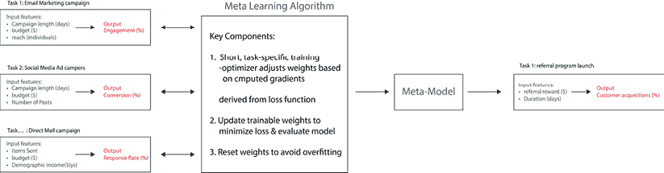

图 10.1：在营销活动背景下可能的 MAML 框架的关键组件

**源代码和数据**：

[`github.com/PacktPublishing/Machine-Learning-and-Generative-AI-for-Marketing/tree/main/ch.10`](https://github.com/PacktPublishing/Machine-Learning-and-Generative-AI-for-Marketing/tree/main/ch.10)

模型无关技术旨在广泛适用于各种模型架构和任务。为了更好地理解 MAML 方法的机制，我们将将其应用分解为几个函数，这些函数是完整实现中可能涉及的简化：

1.  首先，我们有一个函数`generate_task`，它创建具有自己系数集的模拟营销任务，这些系数代表活动数据，在这种情况下，它被表示为带噪声的二次关系。每个任务随机生成的系数决定了输入数据（如电子邮件活动长度、预算或覆盖范围）如何影响结果（如参与度或转化率）。然后`task`函数根据输入和系数计算活动的成功指标。请注意，我们提供了种子值，以便您的输出应与这里显示的一致，但您的结果可能仍然会因并行处理或 GPU 使用中的随机性而有所不同：

    ```py
    import numpy as np
    import matplotlib.pyplot as plt
    from tensorflow.keras.models import Sequential
    from tensorflow.keras.layers import Dense
    from tensorflow.keras.optimizers import Adam
    import tensorflow as tf
    np.random.seed(123)
    tf.random.set_seed(123)
    def generate_task():
        coefficients = np.random.randn(3) 
        def task(x):
            return coefficients[0] * x**2 + coefficients[1] * x + coefficients[2] + np.random.randn(*x.shape) * 0.1
        return task, coefficients 
    ```

1.  接下来，我们有一个函数`train_model_on_task`，它通过在任务上执行短时间段的训练并使用`Adam`优化器更新模型权重来在之前函数生成的任务之一上训练模型。然后使用 TensorFlow 的`GradientTape`进行自动微分，计算用于最小化损失的梯度，该损失衡量模型的预测与活动实际结果之间的匹配程度：

    ```py
    def train_model_on_task(model, task, steps=50, learning_rate=0.01):
        optimizer = Adam(learning_rate)
        for _ in range(steps):
            x = np.random.uniform(-3, 3, (50, 1))
            y = task(x)
            with tf.GradientTape() as tape:
                predictions = model(x, training=True)
                loss = tf.reduce_mean((predictions - y) ** 2)
            gradients = tape.gradient(loss, model.trainable_variables)
            optimizer.apply_gradients(zip(gradients, model.trainable_variables)) 
    ```

1.  然后我们有`meta_train_model`函数，这是元学习的核心。这个函数通过优化模型在最小接触后快速适应新任务的能力来处理元训练过程。在实践中，模型首先在一个任务上接受训练，然后在新数据上对该任务进行评估。

从这次评估计算出的损失指导调整模型的初始参数，以便仅通过几次更新就能在新任务上带来显著的改进。请注意，在完整实现中，我们可能会使用`reset_weights`参数，以便在每个任务之后将模型的权重重置到任务特定训练之前的状态，并使用`meta_optimizer`根据任务性能更新模型的初始参数。这确保了模型不会过度拟合到特定任务，并保持其在任务之间的泛化能力：

```py
def meta_train_model(base_model, meta_steps=50,                      meta_learning_rate=0.1):
    for _ in range(meta_steps):
        task, _ = generate_task()
        train_model_on_task(base_model, task, learning_rate=0.1) 
```

1.  为了说明这个简化的示例在实际中的应用，我们可以首先初始化一个非常简单的神经网络，包含两层，以应用我们的元训练函数。在这里，首先是一个包含 10 个神经元的密集层，具有 sigmoid 激活，然后是一个最终只有一个神经元的密集层，用于捕捉模型基于输入特征的营销活动成功预测：

    ```py
    model = Sequential([
        Dense(
            10,
            activation='sigmoid',
            kernel_initializer='random_normal',
            input_shape=(1,)
        ),
        Dense(1)])
    model.summary() 
    ```

这给我们以下总结：

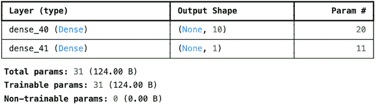

图 10.2：简单的神经网络模型架构

1.  现在让我们使用你的二次函数生成一个复杂任务的代理，并在训练之前绘制模型在这个任务上的性能：

    ```py
    def plot_predictions(model, task, title):
        x = np.linspace(-3, 3, 100).reshape(-1, 1)
        y_true = task(x)
        y_pred = model.predict(x)
        plt.figure(figsize=(10, 5))
        plt.scatter(x, y_true, color='blue', label='True Values')
        plt.scatter(x, y_pred, color='red', label='Predictions')
        plt.title(title)
        plt.xlabel("Input Feature")
        plt.ylabel("Output Value")
        plt.legend()
        plt.show()
    complex_task, _ = generate_task()
    plot_predictions(model, complex_task, "Model Performance Before Meta-training on Task") 
    ```

下面的图表显示了在经过元训练之前模型的性能。正如我们所见，模型最初无法准确预测真实值，这表明需要进一步的训练和优化：

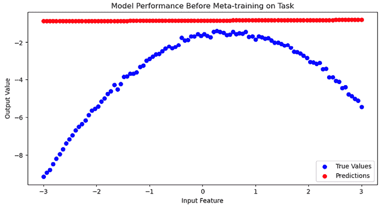

图 10.3：在任务上进行元训练前的模型性能

1.  现在我们可以使用我们的算法进行元训练，然后再次绘制模型在相同任务上的性能：

    ```py
    meta_train_model(model)
    plot_predictions(model, complex_task, "After Meta-training on Task") 
    ```

这产生了以下图表：

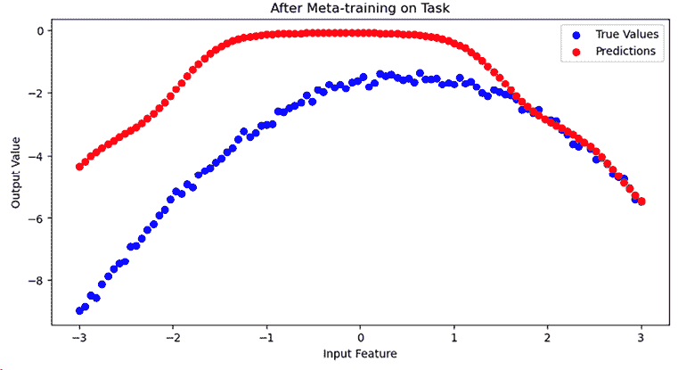

图 10.4：在任务上进行元训练后的模型性能

如*图 10.3*和*10.4*所示，模型最初无法掌握数据中的任何二次关系。然而，在元训练之后，预测得到了改善。虽然这是一个只包括简单任务的简化实现，但这个实现框架为 MAML 作为准备模型进行 FSL 的工具的机制提供了一个基准。

## 克服 FSL 中的挑战

FSL 旨在充分利用最少的数据，但这可能伴随着固有的挑战，如过拟合和泛化能力差。**过拟合**发生在模型在非常小的数据集上训练时，学习到了噪声和不相关的细节，以至于它对新数据的性能产生了负面影响。为了减轻这一点，可以使用如 L2 正则化和 dropout 等正则化技术来简化神经网络模型的复杂度，帮助防止模型学习过于复杂的模式，这些模式泛化能力不佳。

**防止过拟合的正则化技术**

神经网络中两种常见的正则化技术是：

+   L2 正则化（权重衰减）在损失函数中添加了一个基于模型权重平方大小的惩罚。这阻止了权重过大，导致更简单且泛化能力更好的模型。

在这里了解更多，包括如何比较学习曲线以评估正则化的影响：[`developers.google.com/machine-learning/crash-course/regularization-for-simplicity/l2-regularization`](https://developers.google.com/machine-learning/crash-course/overfitting/regularization)。

+   Dropout 随机地在训练过程中停用（“丢弃”）神经元，以防止模型过度依赖特定的路径。

在 Srivastava 等人撰写的开创性论文《Dropout: a simple way to prevent neural networks from overfitting》中了解更多。

例如，在构建适合回归任务的神经网络模型时，我们可以添加这些类型的正则化。作为一个例子，该模型设计了一个适度的复杂架构，并包含具有两种类型正则化的多层：

```py
from tensorflow.keras.layers import Dropout
from tensorflow.keras.regularizers import l2
def build_regularized_model(input_shape):
    model = Sequential([
        Dense(64, activation='relu', input_shape=input_shape,
              kernel_regularizer=l2(0.001)),
        Dropout(0.3), 
        Dense(32, activation='relu', kernel_regularizer=l2(0.001)), 
        Dropout(0.3), 
        Dense(16, activation='relu', kernel_regularizer=l2(0.001)),
        Dropout(0.3),
        Dense(1, activation='linear') 
    ])
    model.compile(optimizer=Adam(learning_rate=0.001),
                  loss='mean_squared_error')
    return model
input_shape = (10,)
model = build_regularized_model(input_shape)
model.summary() 
```

这导致了以下总结：

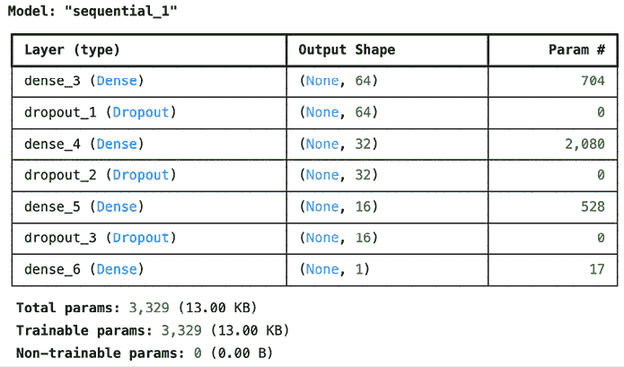

图 10.5：模型架构摘要

该模型在其密集层中嵌入 L2 正则化，以控制权重大小并鼓励更简单的模型。在每个密集层之后也应用了 0.3 的 dropout，通过在训练期间停用随机神经元输出，减少了过拟合。这种正则化模式应用于隐藏层，以促进模型泛化能力。以下图展示了 dropout 在训练期间如何随机停用神经元：

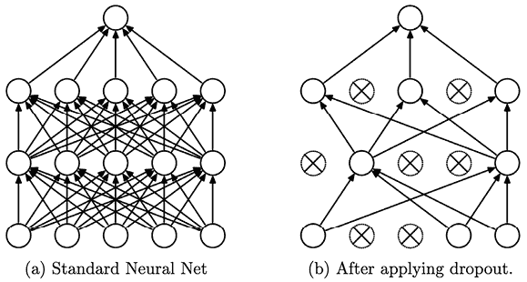

图 10.6：Dropout 神经网络模型。左：一个带有两个隐藏层的标准神经网络。右：对左侧网络应用 dropout 后产生的稀疏网络示例。交叉的单元已被丢弃。（来源：https://jmlr.org/papers/volume15/srivastava14a/srivastava14a.pdf）

如前所述，**泛化**是另一个关键挑战。在图像处理领域，数据增强技术，如图像旋转、裁剪或颜色调整，通常被用来人为地增强数据集的大小和变异性，帮助模型学习更通用的特征，这些特征在新任务上表现更好。在 NLP 应用中，可以采用如第五章中所述的数据增强技术，以及其他如同义词替换等技术，以增加鲁棒性并帮助在不同上下文中更好地泛化。

在 FSL（功能磁共振成像）中，一个显著的挑战也是如何在有限的训练数据下实现稳健的性能。根据学习模式的复杂性，模型可能需要更大的数据集来良好地泛化，因此如果没有这样的数据集，它们将难以学习有用的模式，导致在新任务上的表现不佳。迁移学习可以作为一种强大的、补充的策略来应对这一挑战。通过从在大规模和多样化的数据集上预训练的模型开始，你可以利用学习到的特征，并在你特定的 FSL 任务上微调模型。这种方法可以在最小数据量的情况下快速适应新任务，同时保留广泛的知识库，通过提供需要仅做轻微调整而不是从头开始学习的丰富初始特征集来补充 FSL。这种强大的方法也有其局限性和挑战，然而，这些是我们将在下一节讨论的主题。

**优化 FSL 技术**

提高 FSL 模型有效性的关键策略：

+   **防止过拟合**：实施正则化技术，帮助模型专注于更简单、更一般的模式，而不是记住训练数据中的特定噪声。

+   **增强泛化**：使用数据增强来扩展训练数据集。对于文本，像释义或注入同义词这样的方法有助于模型学习语言变体。

+   **利用迁移学习**：利用在大规模数据集上预训练的模型，然后针对你特定的 FSL 任务进行微调。

# 导航迁移学习

迁移学习可以通过在新任务上仅进行少量调整来更有效地使用预训练模型来增强营销专业人士对 AI 的利用。虽然 FSL 使用新任务的一组示例进行快速适应，但迁移学习侧重于重新利用现有模型，而无需从新领域获取额外的示例。

这种方法利用了模型从前一任务中从大规模数据中获取的知识，将其应用于完全不同的领域的营销努力，而无需从头开始重新训练模型。换句话说，FSL 通过使用非常有限的数据示例来提高模型的适应性，而迁移学习在历史任务和当前任务之间关系强烈但为新任务训练基础模型所需的大规模标记数据集难以获得或成本高昂的环境中表现卓越。

迁移学习相较于 FSL 的另一个优势可能来自成本角度。例如，当使用付费 API 服务最先进的 GenAI 模型时，定价可能与生成响应所使用的输入大小相关。在 NLP 应用中，这通常由令牌计数来衡量。通过迁移学习进行微调时，基础模型只需调整一次。这意味着在微调阶段支付的令牌计数不会随着模型每次使用而重复，与 FSL 不同，FSL 可能需要每次都输入相同的相关示例。

使用迁移学习，模型微调的初始成本可以通过每次推理的较低成本来抵消，因为不需要向模型输入额外的示例。因此，当微调后的推理次数超过某个阈值时，迁移学习变得具有成本效益，从长远来看比 FSL 更便宜。

例如，以下是一个分解，说明了 FSL 和迁移学习之间潜在成本差异：

+   **FSL API 费用**：

    +   **基础成本**：提示中使用的令牌的成本（每个令牌的成本 × 提示中的令牌数）

    +   **每个示例的额外成本**：每个令牌的成本 × 每个示例的令牌数

+   **迁移学习 API 费用**：

    +   **初始微调成本**：使用更大示例数据集调整预训练模型的一次性成本

    +   **每次推理的成本**：使用微调模型进行每次推理的成本

**何时使用迁移学习而非 FSL**

与 FSL 相比，在以下情况下迁移学习可能更有优势：

+   **使用频率高**：模型使用得越频繁，初始微调成本就越快摊销。

+   **稳定的任务需求**：新任务必须足够相似，以便微调后的模型无需进一步调整就能表现良好。

+   **复杂模式适应**：虽然需要更多的数据，但它可以适应更深的模型层来学习更复杂的模式。

## 迁移学习的工作原理

在高层次上，迁移学习和其微调过程建立在类似于 ZSL 和 FSL 等技术建立的基础之上。ZSL 和 FSL 都旨在将现有知识应用于新任务。然而，它们在适应方法上主要存在差异。ZSL 基于学习到的抽象概念对*未见任务*进行假设，而不需要任何具体示例，而 FSL 使用*少量示例*来引导适应。迁移学习通过利用可以针对新任务进行特定微调的广泛训练的模型基础，扩展了这些概念，在 ZSL 的广泛泛化能力和 FSL 的快速适应特性之间提供了实用的平衡。当存在一个健壮的预训练模型，并且有来自高度相关领域的示例，但缺乏与新任务具体相关的示例时，迁移学习通常是首选的方法。

在更技术层面上，迁移学习中的微调涉及对已经在大型、多样化的数据集上经过良好训练的模型参数进行微妙但重要的调整。这种微调使学习到的特征适应于新、相关任务的具体情况，通常涉及调整模型的更深、更具判别性的层。这些修改使模型能够在保持其泛化能力的同时，优化在新领域特定任务上的性能。这与 FSL 不同，FSL 的微调旨在通过最小调整（通常仅限于模型的最终层或通过提示工程，其中无法调整可训练参数）使用非常少的示例快速适应模型。

下图说明了 ZSL、FSL 和迁移学习之间的差异：

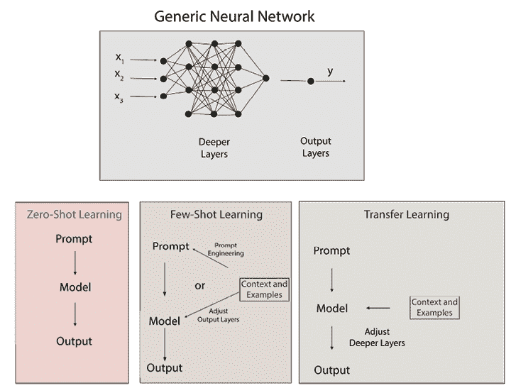

图 10.7：典型的 ZSL、FSL 和迁移学习实现及其机制之间的关键差异

## 使用 Keras 的迁移学习

在本节中，为了在自然语言处理领域之外提供多样性，我们将展示一个框架，说明如何将迁移学习应用于图像分类任务。本例将展示如何将预训练的图像识别模型适应于您选择的新的与营销相关的新挑战，例如识别所需的产品特征。

迁移学习过程的第一步是寻找一个在大型和多样化的数据集上经过广泛训练的预训练模型。在这里，我们将使用 VGG16 模型，该模型以其在图像识别中的稳健性能而闻名。VGG16 是一个卷积神经网络，通过在 ImageNet 数据集上使用超过一百万张图像进行训练，以将它们分类为一千个图像类别，如 Simonyan 和 Zisserman 在他们 2014 年的论文《非常深的卷积网络用于大规模图像识别》中详细描述的那样。

首先，我们将使用`model.summary`来总结这个模型的完整架构，以便更好地理解其层和组件：

```py
from keras.applications.vgg16 import VGG16
base_model = VGG16()
base_model.summary() 
```

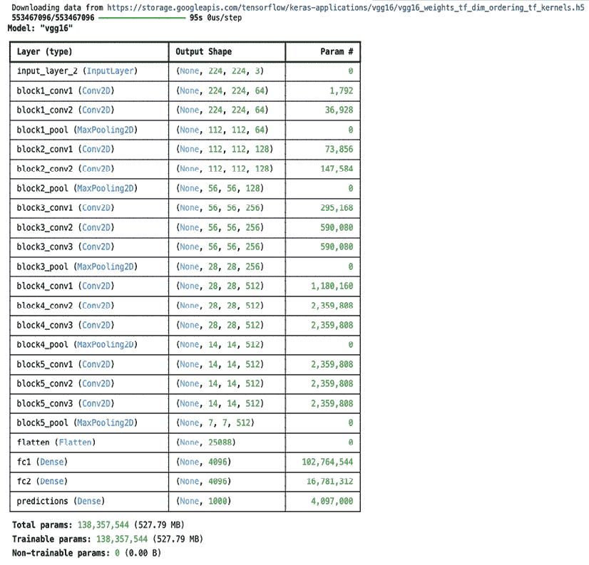

图 10.8：模型架构摘要

如此所示，VGG16 架构是一个由多个层组成的深度神经网络，这些层被设计用来处理和将图像转换成越来越抽象的形式，这对于分类任务是有用的。以下是基于前面摘要的简单分解：

+   **输入层**：该层接受尺寸为 224 x 224 像素的图像，这是许多图像处理任务的标准化尺寸。每个图像有三个颜色通道（红色、绿色和蓝色），这解释了*图 10.8*中给出的形状中的`3`。在开始时每个层中给出的`None`实际上是一个批量大小的占位符，允许处理任意数量的图像。

+   **卷积层（Conv2D）**：这些层在网络中执行核心工作。VGG16 有多个卷积层堆叠在一起，每个层都有一定数量的过滤器，用于在图像的不同粒度级别检测不同的特征。例如，第一层卷积可能检测边缘，而深层层可能识别更复杂的模式，如纹理或特定对象。从 64 到 512 的过滤器数量增加反映了随着图像通过网络移动，检测到的图像特征复杂性的增加。

+   **最大池化层（MaxPooling2D）**：这些层与卷积层交错排列，用于减少输入到下一个卷积层的空间维度（宽度和高度）。例如，一个跟随 224 x 224 卷积层输出的池化层将其减少到 112 x 112，从而减少了所需的计算量，并有助于检测输入图像中小位移和旋转的不变主要特征。

+   **全连接层（Dense）**：在网络接近末端，卷积层的展平输出被送入这些密集连接层。这些层用于结合先前卷积层中的所有特征，最终将图像分类为 1,000 个类别之一。

+   **输出层（预测）**：最后一层输出图像属于 ImageNet 数据集中训练的 1,000 个类别的概率。具有最高概率的类别被作为模型的预测。

下面的可视化是从杨等人发表在医学研究文章中的摘要（[`www.nature.com/articles/s41598-021-99015-3`](https://www.nature.com/articles/s41598-021-99015-3)）中提取的：

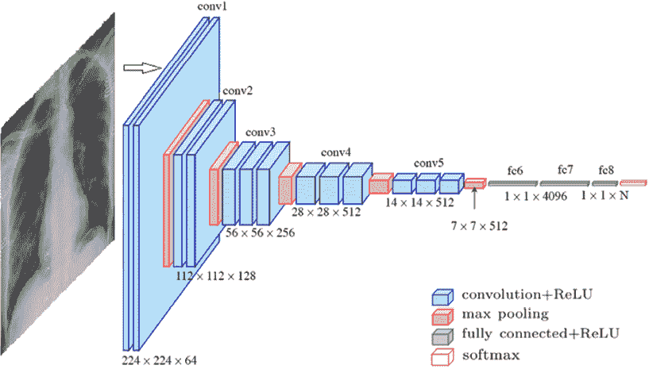

图 10.9：VGG16 深度神经网络架构的可视化

现在我们将适应这个模型进行迁移学习：

1.  我们将再次将模型加载到内存中，但这次使用`include_top=False`选项，以便在最后一个卷积层之后截断模型。这将移动负责分类的顶层到预定义的类别中，并允许模型作为特征提取器，这意味着它输出一个复杂的特征图，代表输入图像的关键特征，但不输出特定的类别预测：

    ```py
    base_model = VGG16(weights='imagenet', include_top=False, input_shape=(224, 224, 3)) 
    ```

1.  我们可以在此基础上，通过添加自己的分类层来适应我们的新任务——产品分类，这些分类层将在特征提取器之上进行训练：

    ```py
    from tensorflow.keras import layers, models
    model = models.Sequential()
    model.add(base_model)
    model.add(layers.Flatten()) 
    model.add(layers.Dense(256, activation='relu')) 
    model.add(layers.Dense(1, activation='sigmoid')) 
    ```

1.  最后，可以使用新的、特定于任务的数据进行迁移学习来微调模型。这涉及到将预训练的基础模型层设置为不可训练的，从而冻结预训练层的权重，这通常建议避免训练的初始阶段忘记基础模型的大部分初始特征提取权重：

    ```py
    base_model.trainable = False
    model.compile(optimizer='adam', loss='binary_crossentropy', metrics=['accuracy']) 
    ```

    **自我引导练习：根据您的数据微调 VGG16**

    要使用 VGG16 模型进行迁移学习并分类产品特征图像，请按照以下步骤操作：

    +   **收集图像**：收集您公司旨在分类的产品特征图像。来源可以包括在线目录、社交媒体或直接捕捉的实物库存。

    +   **准备数据**：将图像调整大小为 224 x 224 像素，以匹配 VGG16 的输入大小，并将像素值归一化到范围 `[0, 1]`。

    +   **训练模型**：使用编译好的模型，并拟合您的图像（`new_data`）及其二进制标签 `[0, 1]`，例如使用：

        ```py
         model.fit(new_data, labels, epochs=5, batch_size=32) 
        ```

    +   **评估和微调**：根据性能，考虑调整学习率或逐渐解冻基础 VGG16 模型中的层。

## 使用 API 服务进行迁移学习

通过 API 服务进行迁移学习为希望利用前沿 AI 而无需处理本地实现复杂性的市场营销专业人士提供了一个实用的解决方案。使用可用的 API 服务进行迁移学习的实际好处包括以下几方面：

+   **访问高级模型**：API 可访问模型的持续更新和优化确保了使用比公开可用的技术更先进的前沿技术。

+   **计算效率**：将计算需求卸载到基于云的服务中，消除了对可能对个人或小型企业不可及的复杂硬件的需求。

+   **简化参数管理**：这指的是自动处理学习率、梯度调整以及其他可能影响模型性能的复杂训练参数。

为了有效地应用迁移学习，微调数据集必须反映您品牌独特的特征。这可能包括客户反馈或经过审查的营销文案和产品描述。如果无法获得专有数据集，可以使用公开可访问的数据，例如关于类似产品或服务的评论或社交媒体帖子。关键是将这些数据编译成一个单独的文件，通常以 CSV 格式，并放置在 API 可访问的位置。然后，每个条目都需要根据其预期的标签或输出进行清晰标注。

以下是一个 CSV 格式的示例输入，它使模型更深入地理解在我们特定品牌背景下可持续性的含义，为下一节中将要讨论的动手示例奠定了基础：

```py
text,label
"Our new line of kitchenware not only uses recycled materials but also ensures fair labor practices are upheld.",positive
"While our products are designed to be eco-friendly, we are also committed to improving our supply chain to support local communities.",positive
"Our brand continues to strive for environmental sustainability, though we have not yet addressed labor conditions in our factories.",negative
"We ensure that all our materials are ethically sourced and provide support to the local economies where we operate.",positive
"Despite using recycled materials, our company has been criticized for poor working conditions in our overseas manufacturing plants.",negative 
```

现在，我们可以使用 OpenAI 的 API 和 GPT-4 模型启动模型微调，用您的实际密钥替换`openai.api_key`，并用数据集的位置路径替换`path/to/your/dataset.csv`。在执行此代码之前，请记得查阅最新的 OpenAI API 文档（[`beta.openai.com/docs/`](https://beta.openai.com/docs/)），以了解 API 使用方面的任何更新或更改：

```py
import openai
openai.api_key = 'XXX' #your API key here
response = openai.File.create(
    file=open("path/to/your/dataset.csv", "rb"),
    purpose='fine-tune')
file_id = response['id']
fine_tune_response = openai.FineTune.create(training_file=file_id,
    model="gpt-4",
    n_epochs=5) 
```

## 克服迁移学习中的挑战

虽然迁移学习可以是一种强大的方法，用于微调预训练模型以在新任务上表现更好，但它并非没有其挑战和局限性。以下是在应用迁移学习时需要考虑的几个关键挑战：

+   **模型漂移**：在迁移学习的背景下，模型漂移指的是随着用于微调的数据变得不再代表当前环境或趋势，模型准确性的逐渐下降。

例如，想象一下使用 2019 年营销数据预训练的模型来预测 2024 年的消费者偏好。最初，该模型在通过迁移学习使用更近期的 2020 年数据进行微调后可能表现良好。然而，由于像 TikTok 等新社交媒体平台越来越受欢迎或经济条件发生重大变化等原因，消费者行为发生变化，该模型可能开始推荐过时的信息策略。

为了解决模型漂移问题，需要使用目标域的最新数据持续更新模型，并密切监控其性能。这可以通过允许模型随着新数据的到来而动态调整的持续学习技术来实现。本节中的信息框提供了有关持续学习的进一步资源。

+   **领域不匹配**：在迁移学习中，当源领域（模型最初训练的地方）和目标领域（模型进行微调的地方）存在显著差异时，就会发生领域不匹配。在迁移学习中，这意味着预训练模型的知识可能无法很好地推广到新领域，从而导致性能不佳。

例如，考虑一个在电子商务平台的英语语言客户评论上预训练的模型，然后微调以分析针对本地市场的日语评论。即使在微调之后，该模型可能也难以捕捉文化细微差别和语言差异，导致情感分析错误。这可能是因为预训练模型依赖于从英语数据中学习的模式，当应用于表达和文化参考不同的日语评论时，其效果较差。

为了解决这个问题，一个更合适的方法是使用精心挑选的日本客户评论数据集来微调模型，这个数据集专门捕捉了当地市场的特定语言和文化细微差别。

**保持模型漂移的前沿**

为了保持迁移学习模型的准确性，尤其是在消费者行为演变的情况下，持续学习是关键。

持续学习通常在 MLOps 实践中得到实施。了解更多关于 MLOps 原则和最佳实践的信息，请访问[`cloud.google.com/architecture/mlops-continuous-delivery-and-automation-pipelines-in-machine-learning`](https://cloud.google.com/architecture/ai-ml)。

在介绍了 FSL 和迁移学习如何将预训练模型适应以更好地解决新的营销任务的基本原理和技术之后，我们现在将通过一个实际营销示例来展示 FSL 的重要性。

# 应用 FSL 提高品牌一致性

在我们之前对 ZSL 的探索中，*第九章*，我们展示了如何使用像 GPT-4 这样的预训练模型为推出环保产品的电子商务品牌生成营销文案。这种 ZSL 方法虽然强大，但主要依赖于模型从泛化预训练中推断上下文和内容的能力，这通过强调诸如*sustainable*和*eco-friendly*等术语的提示来实现。

如本节中的示例所示，虽然 ZSL 为生成与品牌相关的内内容提供了坚实的基础，但它往往缺乏捕捉品牌精神更深层次、更细微方面的精确度。这对于那些身份与特定实践或原则紧密相连的品牌尤其如此，这些实践或原则在**大型语言模型**（**LLM**）的泛化训练中可能没有得到很好的体现。

**营销活动中有效 FSL 的步骤**

1.  **提示优化和执行**：从一个基本的提示开始，比如用于 ZSL 的提示，但现在添加一些期望的输出或上下文示例，这些示例反映了品牌的独特之处。

1.  **输出分析**：评估内容以确保其保持必要的品牌一致性。注意与这些期望的偏差，因为它们提供了需要进一步示例的领域见解。

1.  **迭代优化**：根据初始输出的反馈和性能，迭代地优化示例和提示，直到达到你期望的营销 KPIs（见*第二章*）。

在第九章中“零样本学习用于营销文案”的部分，我们继续我们的场景，回顾我们之前介绍的关注可持续性的电子商务品牌。现在，为了应对不断变化的市场趋势和公司指令，以其环保厨房用品而闻名的公司正在进行品牌重塑，以适应日益增长的消费者对社会责任的需求。最新的洞察显示，消费者越来越有兴趣支持那些不仅提供可持续产品，而且表现出对公平劳动实践和积极社区贡献的实质性承诺的品牌。这种转变在富裕的年轻消费者中尤为明显，他们重视道德生产，并愿意为真正改变工人和社区生活的产品支付溢价。此外，这个群体希望他们的产品不仅要有环保包装，而且要被认为是“零浪费”。

让我们通过增强输出内容并通过提示工程来展示 GPT-4 如何有效地捕捉我们新定义的可持续性营销目标。这包括对之前提到的可持续性的微妙澄清：

+   对公平劳动实践承诺

+   零浪费包装

+   活跃的社区参与

我们将通过一个旨在提升电子邮件营销活动的案例研究来展示这一点。这涉及到迭代地改进提示，与第二章中讨论的关键性能指标紧密相关，以确保与我们的重新定位营销目标保持一致。

## 使用 ZSL 和 FSL 进行基准测试

在将 FSL 整合到我们的电子邮件营销活动之前，评估 ZSL 在捕捉 FSL 新品牌战略方面的有效性是很重要的。在这里，我们将比较使用 ZSL 生成的基线响应，该响应没有与我们的重新定位的可持续性焦点相符合的具体例子。我们将定义一个函数来执行 API 补全，然后展示 ZSL 在没有我们更新后的营销目标细微背景的情况下如何表现：

```py
from openai import OpenAI
client = OpenAI(api_key = 'XXX' ) #your API key here
base_prompt = "Write a product description for an eco-friendly kitchenware product focusing on brand ethics."
def generate_chat_completion(client, prompt, max_tokens=150, n=1, temperature=0.7, advanced_usage=False):
    if not advanced_usage:
        messages = [{"role": "user", "content": prompt}]
    else:
        messages = prompt
    completion = client.chat.completions.create(
        model="gpt-4",
        messages=messages,
        max_tokens=max_tokens,
        n=n,
        temperature=temperature)
    return completion.choices[0].message.content
zsl_response = generate_chat_completion(client, base_prompt)
print(zsl_response) 
```

这给我们以下响应：

```py
Product Name: EcoPure Bamboo Kitchen Utensil Set
Enrich your cooking experience with our EcoPure Bamboo Kitchen Utensil Set. This set, which includes a spatula, slotted spoon, mixing spoon, and fork, is not just an ordinary kitchen tool set but a reflection of our commitment to sustainable living and ethical product creation.
Each piece in this set is made from 100% organic bamboo, a renewable and biodegradable resource, offering an environmentally friendly alternative to plastic. 
```

如您所见，虽然响应是清晰的，但它过于笼统，缺乏满足我们重新品牌化倡议特定目标所需的具体性和背景。

为了看到 FSL 可以提供的价值，这里，我们回顾了之前完全相同的基线提示，但还通过 FSL 包括了针对我们更新后的营销目标的具体上下文：

```py
fsl_prompts = [
    {"role": "system", "content": "Describe a product using sustainable materials that supports fair labor practices."},
    {"role": "user", "content": "Our latest kitchenware range not only uses biodegradable materials but is also produced in factories ensuring fair wages and safe working conditions."},
    {"role": "system", "content": "Write about a kitchenware product that exemplifies zero waste in packaging."},
    {"role": "user", "content": "Each item in our new line of cookware comes in completely recyclable packaging, designed to leave no environmental footprint."},
    {"role": "system", "content": "Explain how a purchase supports community engagement projects."},
    {"role": "user", "content": "With every purchase, a portion of the proceeds goes towards community gardens, supporting urban greening projects."},
    {"role": "system", "content": base_prompt}]
fsl_response = generate_chat_completion(client, fsl_prompts, max_tokens=150, temperature=0.7, advanced_usage=True)
print(fsl_response) 
```

这产生了以下输出：

```py
Introducing our new line of eco-friendly kitchenware, designed with the **utmost respect for our planet and its inhabitants**. Each piece in this range is crafted from sustainable, biodegradable materials, making it a guilt-free addition to your kitchen.
**We believe in the power of ethical production and fair labor****factories that ensure fair wages, safe working conditions, and equal opportunities for all workers**, which is why all our products are sourced from .
But our commitment doesn't stop there. **For every purchase, we contribute towards community development projects**, particularly urban greening initiatives, to make our cities more livable. 
```

在前面的文本中，与我们的特定目标——环境可持续性、公平劳动实践和社区参与——有机相关的 LLM 生成内容被突出显示以增强清晰度。这种与 ZSL 的比较强调了 FSL 通过利用初始上下文示例产生更符合我们重新品牌化战略细微差别的内容的能力。

## 制定电子邮件营销活动

现在，让我们探讨 FSL 在增强电子邮件营销活动的个性化和相关性方面的应用，显著提高客户参与度和转化率。以下是如何有效利用 FSL 优化电子邮件活动的简要指南：

1.  **初始电子邮件创建**：使用 FSL 生成初始批次的电子邮件，特别关注您的核心营销目标——在本例中，是可持续性和道德实践。

1.  **收集初始指标和反馈**：分析客户的初始反应，了解哪些内容方面最能引起共鸣。这种分析对于识别成功元素和可能需要额外优化的领域至关重要。

1.  **迭代优化**：根据从客户那里收到的参与指标和反馈，优化电子邮件的内容。

1.  **持续反馈整合**：持续整合新的见解，使电子邮件营销活动动态地与不断变化的客户偏好和市场趋势保持一致。

现在我们来审视这些步骤包含的内容。

### 第一步：初始电子邮件创建

在电子邮件营销活动中采用 FSL 的第一步是明确界定活动的目标。对于我们这个环保型电子商务品牌来说，目标可能是推出一系列与品牌重塑目标相符的环保厨房用品。让我们假设这个场景的目标如下：

```py
Introducing a new line of sustainable kitchenware that embodies the brand's commitment to zero waste, ethical manufacturing practices, and community engagement. 
```

活动目标明确后，下一步是创建提示，指导 AI 生成适合电子邮件信息的适当内容。

**构建营销活动的初始电子邮件结构**

以下的一般结构有助于创建一个有效的初始信息，用于您的电子邮件营销活动，从而提高与受众的参与度和转化率：

+   **介绍**：热情地问候客户并介绍新产品系列。

+   **正文**：提供关于产品核心方面的详细信息——在本例中，是可持续性和道德制造方面。

+   **行动号召**：包含一个行动号召，鼓励收件人采取具体步骤，例如进行购买或访问网站。

+   **结束语**：以热情的结束语结束，强调品牌对产品核心方面的承诺。

我们将为模型定义一个起始提示，该提示将用于生成初始批次的电子邮件。类似于早期产品描述的例子，`fsl_prompts`的每个元素都旨在逐步构建围绕品牌对可持续性、道德实践和社区参与的承诺的叙事，如下所示：

+   第一组提示确保内容适当地强调了厨房用品的环保和零浪费特性。

+   第二组提示针对的是讨论生产过程中涉及的道德劳动实践时的预期背景。

+   最后两个提示将产品与社区参与努力联系起来，将购买与对社会负责任的消费者重要的倡议联系起来

为了确保生成的内容与我们的活动目标一致，我们将调整我们的基本提示以更具体地针对电子邮件活动，并将`max_tokens`增加到反映更长的内容：

```py
base_prompt = "Compose a short email to introduce our latest line of eco-friendly kitchenware. The email should be engaging, informative, and conclude with a strong call to action."
fsl_prompts = [
    {"role": "system", "content": "Make sure to highlight the eco-friendly and zero waste aspects of the kitchenware."},
    {"role": "user", "content": "Our kitchenware is designed with the planet in mind, featuring products made entirely from recycled materials and ensuring zero waste in our packaging."},
    {"role": "system", "content": "Include information about the fair labor practices in the manufacturing process."},
    {"role": "user", "content": "We are committed to ethical production practices. All our products are manufactured under fair labor conditions, ensuring all workers are paid fairly and work in safe environments."},
    {"role": "system", "content": "Mention how purchasing these products supports community engagement projects."},
    {"role": "user", "content": "Every purchase supports community initiatives, including urban greening projects and community gardens that help local environments thrive."},
    {"role": "system", "content": base_prompt}]
fsl_completion = client.chat.completions.create(
    model="gpt-4",
    messages=fsl_prompts,
    max_tokens=300,
    n=1,
    temperature=0.7
)
print(fsl_completion.choices[0].message.content) 
```

这产生了以下电子邮件内容：

```py
Subject: Discover Our New Eco-Friendly Kitchenware - Upgrade Your Kitchen, Save the Planet!
Hello,
We are thrilled to announce the arrival of our latest line of eco-friendly kitchenware, designed with both style and sustainability in mind.
Our new collection is a testament to our commitment to protecting our planet. Each piece is crafted from 100% recycled materials, ensuring that your cooking experience is as kind to the Earth as it is to your culinary creations.
But we don't stop at just the products. We've committed to zero waste in our packaging, meaning when you unbox your new kitchenware, you can do so guilt-free.
We believe in ethical production and are proud to say that all our products are made under fair labor conditions. Every worker involved in creating our kitchenware is paid fairly and operates in a safe and healthy environment.
Moreover, when you purchase from us, you're also giving back to the community. A portion of each sale goes towards local community initiatives, including urban greening projects and community gardens. This means that with every purchase, you're helping local environments to flourish.
We invite you to explore our new line of eco-friendly kitchenware and make your kitchen a beacon of sustainability. Let's cook up a storm, with a side of environmental consciousness!
Click here [insert hyperlink] to begin your sustainable cooking journey with us.
Best,
[Your Name] 
```

### 第 2 步：收集和分析初始指标和响应

在部署了新创建内容的电子邮件活动之后，评估其效果至关重要，使用关键绩效指标（KPIs）进行评估。为此评估，我们假设我们已经有了启动后前七天的代表性数据，这将使我们能够检查打开率、点击率、转化率和取消订阅率的指标。这种分析有助于我们通过可视化这些 KPIs 随时间的变化来识别改进的领域。

```py
import pandas as pd
df_initial = pd.read_csv('initial_launch_data.csv')
def plot_campaign_kpis(df, title='Email Campaign KPIs'):
    plt.figure(figsize=(10, 8))
    plt.plot(df['Date'], df['Open Rate (%)'], label='Open Rate (%)', marker='o')
    plt.plot(df['Date'], df['Click-Through Rate (%)'], label='Click-Through Rate (%)', marker='o')
    plt.plot(df['Date'], df['Conversion Rate (%)'], label='Conversion Rate (%)', marker='o')
    plt.plot(df['Date'], df['Unsubscribe Rate (%)'], label='Unsubscribe Rate (%)', marker='o')
    plt.xlabel('Date')
    plt.ylabel('Percentage')
    plt.title(title)
    plt.legend()
    plt.grid(True)
    plt.show()
plot_campaign_kpis(df_initial, 'Email Campaign KPIs First Week after Launch') 
```

在以下图表中，我们可以观察到活动启动后第一周内打开率、点击率、转化率和取消订阅率的变化趋势。这使我们能够快速识别模式，这对于诊断活动内容或交付的问题可能至关重要：

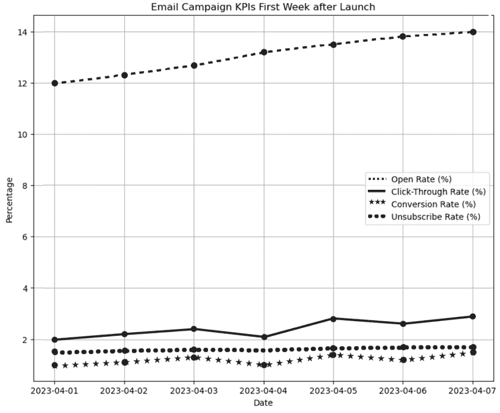

图 10.10：启动后第一周的电子邮件活动 KPIs

**基准测试您的电子邮件活动表现**

评估营销活动指标的表现可能很棘手，尤其是在没有行业基准作为参考的情况下。为了快速评估您的 KPIs 是否达标，首先将它们与既定的基准进行比较。

这里是最近电子邮件营销基准的比较：[`www.webfx.com/blog/marketing/email-marketing-benchmarks/`](https://www.webfx.com/blog/marketing/email-marketing-benchmarks/)。

我们还可以计算并审查这些指标的平均表现：

```py
print(f"Average Open Rate: {df_initial['Open Rate (%)'].mean():.2f}%")
print(f"Average Click-Through Rate: {df_initial['Click-Through Rate (%)'].mean():.2f}%")
print(f"Average Conversion Rate: {df_initial['Conversion Rate (%)'].mean():.2f}%")
print(f"Average Unsubscribe Rate: {df_initial['Unsubscribe Rate (%)'].mean():.2f}%") 
```

这会产生以下结果：

```py
Average Open Rate: 13.07%
Average Click-Through Rate: 2.43%
Average Conversion Rate: 1.21%
Average Unsubscribe Rate: 1.61% 
```

根据这些 KPIs，以下是一些观察和可能的解释，我们可能在下一轮电子邮件活动中考虑解决：

+   **低打开率**：这可能表明电子邮件的主题行不够吸引人。

+   **点击率**：一些收件人查看电子邮件，但点击率低于预期，可能是由于内容或优惠不够吸引人。

+   **低转化率**：这表明需要更强的行动号召或提高着陆页的有效性。

+   **取消订阅率上升**：这可能表明内容频率或相关性存在问题。

除了这些 KPI 之外，假设我们还收集了直接回复此电子邮件并表达他们的疑问和担忧的电子邮件收件人的反馈。我们还可以通过采用第五章中讨论的情感分析技术来收集信息，这样我们就可以确定阅读我们电子邮件的客户的产品评论和社交媒体帖子中的核心主题和情感。以下是我们将假设收到的积极反馈概述：

+   对**可持续实践**的赞赏：“我喜欢你们的厨房用品是用回收材料制成的。”

+   对**道德制造**的认可：“看到品牌承诺公平工资和安全的劳动条件，让人感到放心。”

+   对**产品系列**的热情：“不锈钢炊具看起来非常棒！”

以下是对负面反馈的要点：

+   对更多**产品多样性**的渴望：“我希望你们为产品系列提供更多颜色选择。”

+   对**产品保养**的疑问：“我担心如何保养这些产品以确保它们更耐用。”

+   对**价格点**的担忧：“产品很好，但与不环保的替代品相比，它们有点贵。”

虽然积极的评论验证了我们的活动核心信息，但批评和问题为我们未来的电子邮件信息提供了可操作的见解。利用这些反馈，在下一节中，我们将专注于如何利用负面批评来优化我们的电子邮件营销策略并提高我们的 KPI。

### 第 3 步：迭代优化

在审查了前几部分的初始指标和客户反馈后，很明显，尽管一些方面与活动很好地产生了共鸣，但还有一些关键领域需要改进。下一步是根据初始指标优化我们的 FSL 提示，解决客户反馈中的具体批评，更好地满足客户期望，并提高活动的整体效果。以下是提示的新要素，每个要素后面都有注释，突出其对我们任务的价值：

```py
fsl_prompts = [
    {"role": "system", "content": "Compose a short email to introduce our latest line of eco-friendly kitchenware. Highlight our zero waste and ethical manufacturing processes in terms of the labor force, and emphasize the practical benefits these practices offer to the consumer. The email should be engaging, informative, and conclude with a strong call to action. Importantly, the subject line should be as engaging as possible."},
    {"role": "user", "content": "Discover our new line of eco-friendly kitchenware! Designed with sustainability at heart, each piece not only supports zero waste but is ethically made, ensuring fair labor practices and substantial benefits to the environment."}, 
```

这个提示为电子邮件设定了基调，捕捉了我们之前 FSL 尝试的关键要素，同时也强调了在直接回应初始 KPI 指标中观察到的低打开率时，一个吸引人的主题行的重要性。

```py
 {"role": "system", "content": "Mention the product variety and colors."},
    {"role": "user", "content": "Now available in a range of vibrant colors, our kitchenware allows you to personalize your kitchen while maintaining a commitment to sustainability."}, 
```

这个回应迎合了希望有更多样化的反馈。它强调了可用的颜色范围，旨在吸引那些希望个性化购买的客户。

```py
 {"role": "system", "content": "Provide care instructions."},
    {"role": "user", "content": "Caring for your eco-friendly kitchenware is easy. Here are some simple tips to ensure your items last longer, enhancing their sustainability."}, 
```

针对客户对维护的担忧，这个提示向客户保证产品不仅可持续，而且易于保养，通过确保产品的耐用性来增强其吸引力。

```py
 {"role": "system", "content": "Address concerns about pricing."},
    {"role": "user", "content": "Invest in quality and sustainability. While initially more expensive, our kitchenware offers long-term savings and a positive impact on the planet."}] 
```

这个提示直接解决了反馈中提到的价格敏感性问题。它将成本重新定义为对质量和可持续性的投资，主张长期价值和环境影响。

```py
fsl_response = generate_chat_completion(client, fsl_prompts, max_tokens=500, temperature=0.7, advanced_usage=True)
print(fsl_response) 
```

执行 API 召回后，我们得到以下结果：

```py
Subject: Revolutionize Your Kitchen With Our New Eco-Friendly Line!
Dear [Customer],
We're thrilled to introduce our latest line of eco-friendly kitchenware! Designed with both style and sustainability in mind, our new collection showcases a commitment to zero waste and ethical manufacturing processes.
Our kitchenware is crafted using environmentally friendly materials and methods, minimizing waste and harm to our planet. Plus, we're proud to assure you that all products are produced under fair labor conditions, promoting a more equitable and sustainable global workforce.
Available in a variety of shapes, sizes, and vibrant colors, our kitchenware allows you to personalize your kitchen while maintaining a steadfast commitment to sustainability. From our durable cutlery to our stylish serving bowls, each item in our collection is a testament to our dedication to quality and environmental responsibility.
Caring for your new eco-friendly kitchenware is a breeze - just a gentle handwash with mild soap and they're good as new. And remember, every eco-friendly choice you make contributes to a healthier, more sustainable planet.
While our items may seem initially more expensive, consider them an investment. They are designed to endure, offering long-term savings and a positive impact on the environment. Plus, you'll gain a sense of satisfaction knowing you're using items that are kind to our Earth and its workers.
Ready to make the switch to a more sustainable kitchen? Visit our website today to explore our new collection. Together, we can make a difference in our homes and our world. 
```

在 4 月 7 日部署这些更新后的电子邮件后，假设我们收集了接下来的七天 KPI 数据，并观察到以下更新趋势：

```py
df_improved = pd.read_csv('improved_data.csv')
plot_campaign_kpis(df_improved, 'Improved Email Campaign KPIs After FSL Refinements') 
```

这给我们以下图表，其中我们观察到在 FSL 优化后 KPI 的显著变化：

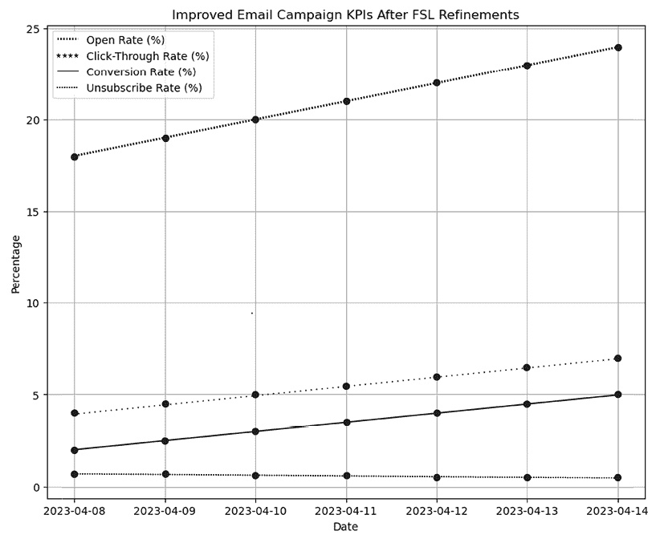

图 10.11：在针对客户反馈进行更改和改进后，电子邮件营销活动的 KPI

基于此，我们有以下平均 KPI：

```py
print(f"Average Open Rate: {df_improved['Open Rate (%)'].mean():.2f}%")
print(f"Average Click-Through Rate: {df_improved['Click-Through Rate (%)'].mean():.2f}%")
print(f"Average Conversion Rate: {df_improved['Conversion Rate (%)'].mean():.2f}%")
print(f"Average Unsubscribe Rate: {df_improved['Unsubscribe Rate (%)'].mean():.2f}%") 
```

```py
Average Open Rate: 21.00%
Average Click-Through Rate: 5.50%
Average Conversion Rate: 3.50%
Average Unsubscribe Rate: 0.59% 
```

通过将这些指标与之前的指标进行比较，我们发现所有领域都取得了显著的改进。虽然没有使用如 A/B 测试（第六章）或因果推断（第三章）等技术来确定这些改进的确切原因，但人们仍然可以推测这些改进的 KPI 可能背后的原因：

+   **打开率**显著提高，这可能反映了更具吸引力的主题行，包括“革命你的厨房…”

+   **点击率**有所上升，这可能归因于包括所需功能（如产品多样性和详细的护理说明）在内的内容，这些内容增加了客户参与度

+   **转化率**提高，表明电子邮件内容不仅更具吸引力，而且更有效地说服客户产品的价值和相关性，尤其是在解决价格问题之后

+   **取消订阅率**下降，反映了更高的内容满意度

### 第 4 步：持续反馈整合

利用 FSL 进行电子邮件营销活动的最后一步是建立一个强大的系统，用于持续反馈整合。这种方法确保活动保持动态，并能对客户不断变化的需求和偏好以及更广泛的市场趋势做出响应。通过整合持续反馈，活动不仅保持相关性，而且随着时间的推移加强了客户参与度和品牌忠诚度。

有效的反馈整合需要允许客户轻松分享他们的想法和经验的机制。这包括直接在电子邮件中嵌入快速调查链接，启用直接电子邮件回复，并通过与活动相关的社交媒体互动与客户互动。这些渠道促进了信息从客户流向营销人员，提供了有价值的见解，这些见解可用于持续改进和优化活动。

**示例反馈收集策略**

以下是一些收集直接客户反馈的额外方法：

+   **实时聊天反馈**：在您的网站上实施实时聊天，以允许实时互动和即时反馈。

+   **互动内容**：在您的电子邮件或数字平台上使用测验和投票，使反馈收集更具吸引力。

+   **反馈二维码**：产品或广告上的二维码可以链接到反馈表单，以便客户可以轻松地在他们的设备上做出回应。

为了有效地分析和利用持续的反馈，设置一个实时反馈仪表板可以带来巨大的好处。这个仪表板可以作为监控和分析反馈以及标准营销关键绩效指标的中心枢纽，提供对活动表现的全面视图。为了构建这样的仪表板，考虑使用像 Tableau、Microsoft Power BI 或 Google Data Studio 这样的软件解决方案，它们提供了创建交互式和实时数据可视化的强大工具和直观界面。

以下是你创建自己的反馈仪表板的步骤：

1.  **选择仪表板工具**：选择最适合你的技术能力和预算的平台。Tableau、Microsoft Power BI 和 Google Data Studio 因其强大的功能和可扩展性而成为流行的选择。

1.  **集成数据源**：将仪表板工具连接到收集你的营销关键绩效指标和反馈的数据源。这可能包括电子邮件活动管理工具、社交媒体分析和客户反馈系统。

1.  **设计仪表板**：创建清晰显示你需要跟踪的关键指标的视觉呈现。根据活动表现的趋势、峰值和低谷定制仪表板。

1.  **安排定期审查**：设定定期的时间间隔，例如每两周或每月，来审查仪表板洞察。利用这些会议来评估最近变化的有效性，并根据数据洞察规划进一步的策略调整。

    **防止你的电子邮件进入垃圾邮件文件夹**

    为了最大限度地提高你电子邮件活动的影响力，防止你的信息进入垃圾邮件文件夹至关重要。以下实现这一目标的三项关键策略：

    +   **设置电子邮件认证**：实施 SPF、DKIM 和 DMARC 等标准来验证你的电子邮件。这有助于与电子邮件提供商建立信任，以降低你的电子邮件被标记为垃圾邮件的风险。

    +   **维护名单卫生**：定期清理电子邮件名单，移除不活跃的订阅者，并确保所有收件人都已选择接收你的电子邮件。这不仅提高了参与度，还有助于保护你的发送者声誉。

    +   **优化电子邮件内容**：其他优化策略包括使用 FSL 个性化你的电子邮件、限制链接数量以及保持图像与文本比例的平衡。

# 摘要

本章探讨了 FSL 的潜力及其对改进 AI 驱动营销策略、增强品牌影响力的承诺。基于通过 ZSL 引入的原则，我们探讨了 FSL 如何利用有限的数据集，使 AI 模型能够快速适应新任务。这在营销领域尤为重要，因为快速适应不断变化的消费者偏好和市场趋势可以对品牌的关联性和参与度产生重大影响。

虽然 FSL 侧重于使用最小示例快速适应，但迁移学习通过应用针对特定任务微调的预训练模型来补充这一点，从而最小化大量重新训练的需求。本章强调了结合这些方法来优化您的营销努力的实用策略。通过如 MAML 方法等途径，我们展示了您如何使用元学习框架进行营销。

随着我们继续前进，下一章将介绍**检索增强生成**（**RAG**）的概念。我们将探讨如何通过将生成模型与高级信息检索技术相结合，RAG 可以动态生成反映最新可用数据的内容。这种方法不仅增加了生成内容的关联性，还提高了消费者定位的精确性，使您的营销工作显著更加有效。即将进行的讨论将涵盖知识检索系统的技术设置以及 RAG 在营销中的实际应用，我们希望通过这些内容为您提供编写与您当前和潜在客户产生共鸣的精准营销内容的强大工具。

# 加入我们书籍的 Discord 空间

加入我们的 Discord 社区，与志同道合的人交流，并在以下地点与超过 5000 名成员一起学习：

[`packt.link/genai`](https://packt.link/genai)


