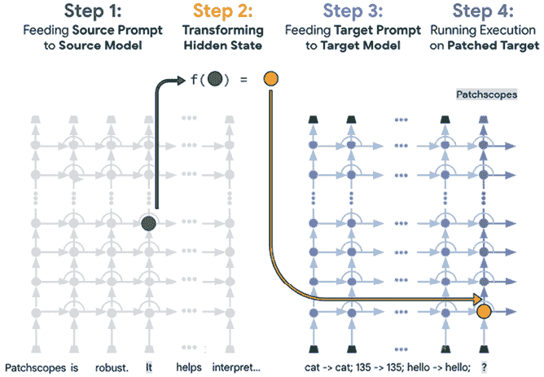
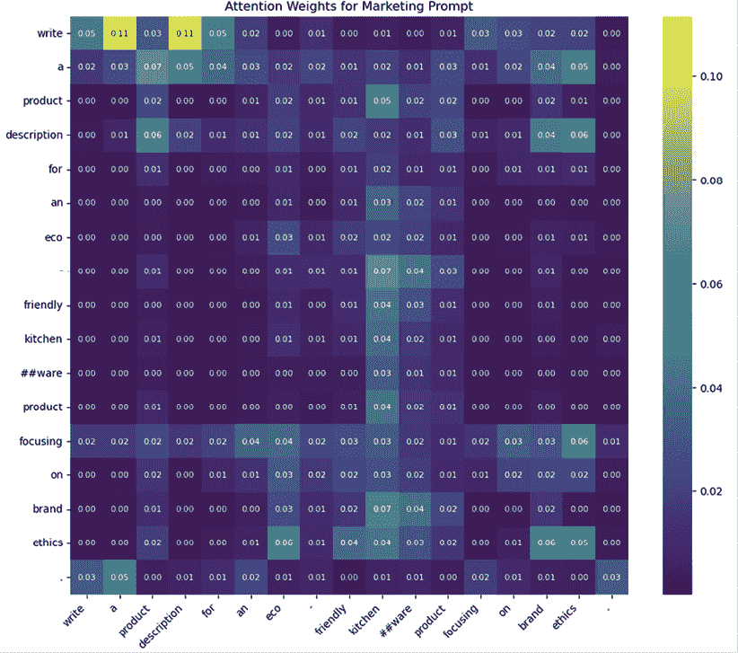
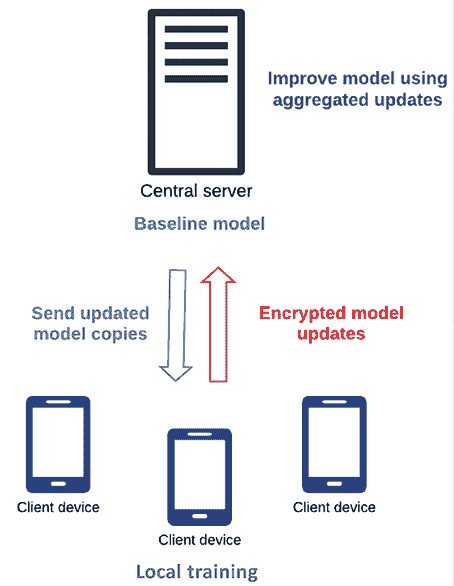
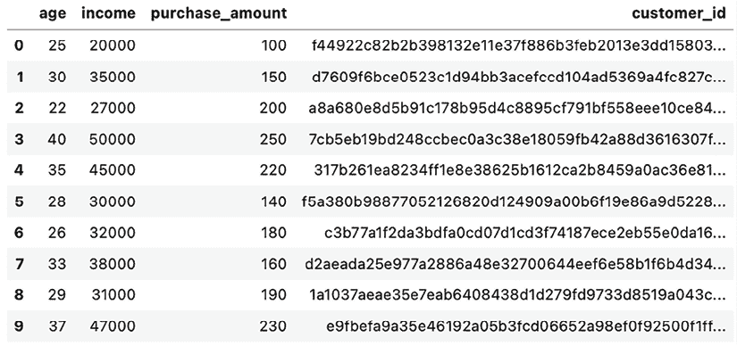
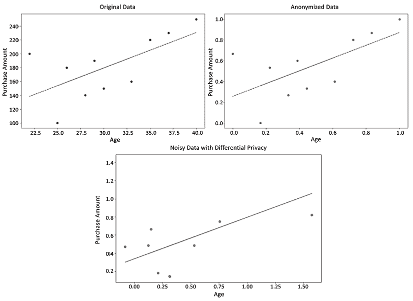
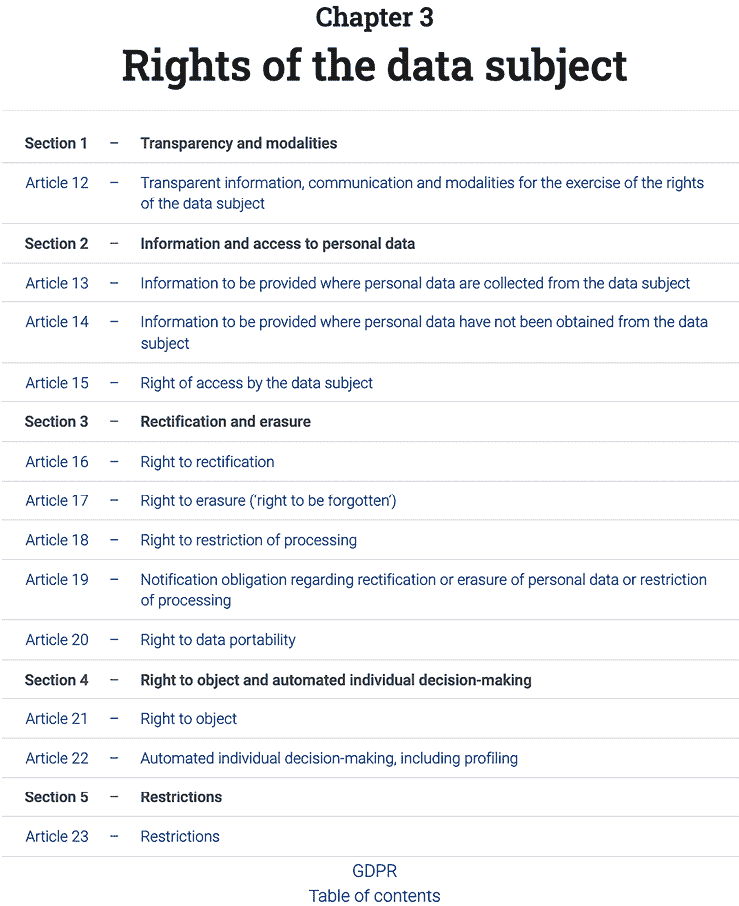
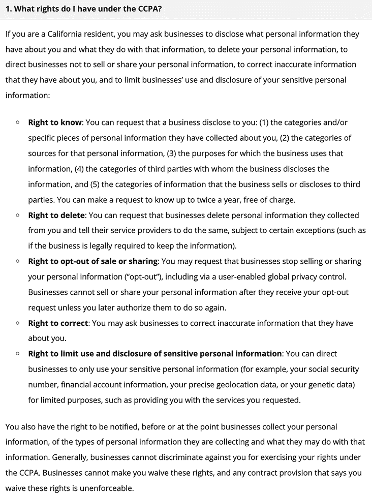

# 13

# AI 赋能营销中的伦理与治理

人工智能和机器学习在营销中的广泛应用引发了各种道德问题，包括数据隐私、算法偏见以及透明度的需求，这些问题都可能直接影响到消费者的信任和品牌完整性。在本章的最后，我们讨论了与之前章节中引入的 AI 技术相关的道德考量和管理挑战的至关重要的话题。

本章还将探讨主要的监管框架，如**通用数据保护条例**（**GDPR**）和**加州消费者隐私法案**（**CCPA**），它们在解决这些道德问题中发挥着关键作用。这些法规有助于塑造营销中 AI 技术的部署和数据管理政策。了解这些道德和监管方面对于在营销策略中负责任和有效地利用 AI 至关重要。本章涵盖了营销人员如何通过建议的 ML 最佳实践、治理结构和合规性考虑来应对这些挑战。

到本章结束时，您将获得：

+   对营销中负责任 AI 部署的道德理解

+   了解监管框架在营销中治理 AI 和数据使用

+   促进负责任 AI 使用的模型透明度、治理政策和合规性策略

# 营销中 AI/ML 的道德考量

在营销领域机器学习不断发展的格局中，道德考量对于维护消费者信任和遵守负责任的企业实践至关重要。随着人工智能在客户互动、个性化定位方面的日益重要，营销人员必须意识到他们数据驱动策略的道德影响。透明度、偏见和公平性等问题需要仔细考虑，以确保 AI/ML 应用既有效又符合道德标准。

为了解决这些问题，本节将讨论使您的 ML 预测尽可能可解释的策略，减轻偏见，并将您的生成式 AI 输出建立在真相之上。敏感消费者数据的处理也是需要仔细考虑的另一个话题。未能适当处理消费者数据不仅可能产生法律后果，还可能对品牌的声誉和消费者信任造成毁灭性的公关影响。

## 模型透明度和可解释性

在营销领域，AI 部署的**透明度**至关重要。消费者常常对他们的数据如何被使用以及 AI 系统如何做出影响他们与品牌互动的决定持怀疑态度。透明度要求明确沟通 AI 模型是如何训练的、如何运作的以及数据是如何处理的，重点关注理解 AI 模型的决策过程。

一个突出透明度重要性的例子是 2018 年涉及亚马逊 AI 招聘工具的事件。这个旨在帮助自动化招聘流程的工具被发现对女性存在偏见。它被发现更倾向于男性候选人而不是女性，因为它是在过去十年中提交的简历上训练的，而这些简历主要来自男性。亚马逊在发现偏差后不得不废弃这个工具，导致声誉受损。

为了实现透明度，营销人员应优先考虑**可解释性**——这是用简单术语阐述其 AI 模型如何做出特定决策的能力。透明度通过模型可解释性工具得到促进，我们将在下一节中讨论。以下是解释性对于营销中使用的 AI 模型为何如此重要的几个原因：

+   **消费者信任**：解释 AI 决策可以建立消费者信任，尤其是在模型推荐影响敏感事项，如个性化广告时。

+   **合规性**：某些数据隐私法规，如 GDPR，要求组织可能需要解释自动化决策。

+   **偏差检测**：可解释性有助于识别 LLM（大型语言模型）中的潜在偏差，确保对不同群体公平对待。

    **大型语言模型（LLMs）中可解释性的挑战**

    由于 LLMs 和其他大型 AI 模型的复杂架构和大量参数，可解释性可能具有挑战性。随着这些模型变得更加准确，它们的决策可能变得更加复杂和难以解释。这强调了模型可解释性技术的重要性。

接下来，我们将讨论一些有助于在现代 AI 模型中实现更高透明度的模型可解释性工具。

## 模型可解释性工具

如逻辑回归或决策树等 ML 模型具有高度可解释的参数，这些参数为其预测提供了直接的解释性。例如，在*第三章*中展示的决策树，我们可以可视化导致模型做出决策的逻辑分支。然而，在复杂、现代的 AI 模型中追求透明度带来了更大的挑战，尤其是在深度学习和 LLM 中。这些模型通过复杂、多层网络运行，这些网络不易于解释。然而，已经出现了一些工具和技术来应对这种复杂性。

其中一个工具是 OpenAI 为 GPT-4 引入的概念提取框架。这个框架通过提取模型用于预测的关键概念来提高透明度。它通过分析模型内部的表示和激活来识别影响其决策的模式和概念。通过隔离这些关键概念，该工具可以提供对模型如何解释和处理数据的更清晰理解。

由 Google Research 开发的 Patchscopes 框架是另一个有价值的工具，它提供了一种全面和统一的检查 LLM 中隐藏表示的方法。Patchscopes 允许更广泛地探索 LLM 的内部动态。它通过可视化和分析模型中的隐藏状态和注意力模式来实现。它允许用户跟踪信息在网络中的流动，识别在不同层和头部的 Transformer 架构中哪些输入文本部分被关注，从而提供对模型如何处理和生成语言的详细理解。有关隐藏状态和注意力模式的进一步讨论，请参阅第九章。

**LLM 可解释性工具**

**Patchscopes**：有关 Patchscopes 及其应用范围的更多详细信息，请访问 Google Research 博客（[`research.google/blog/patchscopes-a-unifying-framework-for-inspecting-hidden-representations-of-language-models/`](https://research.google/blog/patchscopes-a-unifying-framework-for-inspecting-hidden-representations-of-language-models/)）上的 Patchscopes 部分。您还可以探索 `pathscopes` Python 包以了解其实施情况。

**概念提取**：有关更多详细信息，请参阅 OpenAI 的帖子（[`openai.com/index/extracting-concepts-from-gpt-4/`](https://openai.com/index/extracting-concepts-from-gpt-4/)），包括链接到研究论文、代码和示例特征可视化。

例如，可以使用 Patchscopes 来调查不同的语言模式如何在模型中表示，以及这些模式如何影响模型的预测。这对于理解营销信息中哪些部分被 AI 模型优先考虑特别有用，使营销人员能够生成更有效的个性化推荐信息，避免潜在的偏见。

下图显示了 Patchscopes 解码源提示中 `It` 的表示中编码的内容（左侧），通过使用预定义的目标提示（右侧）：



图 13.1：Patchscopes 工作流程（来源：[`research.google/blog/patchscopes-a-unifying-framework-for-inspecting-hidden-representations-of-language-models/`](https://research.google/blog/patchscopes-a-unifying-framework-for-inspecting-hidden-representations-of-language-models/)）

作为例子，让我们看看我们如何可视化 LLM 决策过程的一个基本组成部分：注意力。为了说明这一点，我们将考虑从我们在第十章中为我们的环保厨房用品电子商务品牌引入的早期提示中可以了解到的单词重要性。如果您还记得，我们首次使用零样本学习（ZSL）为我们公司的重新品牌化可持续营销活动引入的提示是：

`为一种环保厨房用品撰写产品描述，重点关注品牌道德。`

我们将使用 BERT LLM 作为此示例，而不是 GPT-4，以便我们能够分析注意力头。选择 BERT 作为此示例的原因是，GPT-4 API 目前不向用户公开其内部注意力权重，而这种方法需要完全访问这些状态以进行分析和可视化。我们可以首先使用以下代码提取模型注意力值：

```py
import numpy as np
import tensorflow as tf
from transformers import TFAutoModel, AutoTokenizer
model_name = "bert-base-uncased"
tokenizer = AutoTokenizer.from_pretrained(model_name)
model = TFAutoModel.from_pretrained(model_name, output_attentions=True)
text = "Write a product description for an eco-friendly kitchenware product focusing on brand ethics."
inputs = tokenizer(text, return_tensors='tf')
outputs = model(inputs)
attention = outputs[-1][-1].numpy() 
```

代码最后一行的 `attention` 权重数组表示模型如何在输入文本的不同标记之间分配其关注点。每个值表示模型在变压器架构的各个层和头部中给予特定标记的重要性。高值表明模型在处理文本和生成输出时认为这些单词更为重要。

我们可以使用热力图来可视化这些注意力权重，以获得对模型如何处理我们的文本提示的更直观的理解。简单来说，代码将执行以下三个主要步骤：

1.  **处理注意力权重**以移除对于图表不需要的额外维度。

1.  **将标记**从它们的数字 ID 转换回实际单词，排除用于模型内部处理但不代表实际单词的特殊标记，例如用于指示句子边界的分隔符。

1.  **创建热力图**来可视化注意力权重，并查看模型对文本提示中的每个单词的关注程度。

这里是完整的代码：

```py
import matplotlib.pyplot as plt
import seaborn as sns
attention = attention.squeeze(axis=0)
tokens = tokenizer.convert_ids_to_tokens(inputs["input_ids"].numpy()[0])
tokens = tokens[1:-1] 
attention = attention[:, 1:-1, 1:-1]
fig, ax = plt.subplots(figsize=(12, 10))
sns.heatmap(attention[0], annot=True, ax=ax, cmap="viridis", xticklabels=tokens, yticklabels=tokens, fmt='.2f', annot_kws={"size": 8})
ax.set_title('Attention Weights for Marketing Prompt')
plt.xticks(rotation=45, ha='right', fontsize=10)
plt.yticks(fontsize=10)
plt.show() 
```

这给我们以下图表：



图 13.2：营销提示“为环保厨房用品产品撰写产品描述，重点关注品牌道德”的注意力权重

从这个可视化中，我们可以看到模型如何在各种标记之间分配其注意力。以下是在解释此视觉中的注意力值时需要考虑的一些关键点：

+   **对角线模式**：沿着对角线的注意力通常表明模型正在关注单个单词及其直接上下文。这可以显示模型如何考虑单词本身及其在序列中的邻近单词。

+   **交叉注意力**：非对角线模式揭示了模型如何连接句子中的不同单词。例如，在前面的热力图中，单词 `ethics`（y 轴）与 `eco`（x 轴）等术语之间的联系显示出更高的注意力权重，这表明模型理解这些术语在描述产品中的相关性。

+   **单个权重**：检查单个权重，我们发现诸如 eco、kitchen 和 ethics 等单词具有更高的注意力值，这表明模型在生成相关产品描述时优先考虑这些术语。

模型随后使用这些注意力权重来确定在提示上下文中哪些单词最重要以及它们如何相互关联，从而使其能够确定最有意义的文本输出。从营销人员的角度来看，这些权重可以用来确保模型强调了您营销信息的关键价值——如果没有，您可以使用这个工具迭代，直到找到合适的提示。

## 偏差缓解

缓解偏差和确保公平性是市场营销中道德和准确人工智能的核心，因为它们直接影响营销活动的可信度和有效性。未经检查的偏差可能导致某些人口群体的不公平待遇，损害消费者信任，并可能导致法律和声誉上的后果。正如第八章所讨论的，偏差也可能导致不良的细分，这对营销活动的有效性可能造成极大的损害。与透明度和可解释性不同，它们关注的是理解和传达模型如何做出决策，而偏差缓解和公平性则是确保这些决策不会不成比例地伤害或偏袒特定群体。

在以下章节中，我们将讨论解决人工智能中各种偏差方面的策略，并附带市场案例来说明它们的重要性。

**缓解人工智能营销模型偏差的策略**

+   **训练数据偏差**：审计和多样化训练数据以确保适当的代表性。

+   **训练过程中的算法公平性**：使用如对抗性去偏等方法来最小化基于受保护数据的预测。

+   **多样化的评估数据**：测试模型在各个不同的群体中，以识别和解决差异。

+   **地面 LLMs**：使用外部来源来验证和细化生成式人工智能输出的事实准确性。

+   **思维链推理**：将生成式人工智能的决策分解为逻辑步骤，以促进公平性。

### 解决训练数据偏差

训练数据可能反映了社会偏差，这些偏差可能会嵌入到人工智能模型的预测中。这在营销中尤其成问题，因为带有偏差的推荐或广告可能会疏远消费者群体的一部分。为了解决训练数据偏差，对数据进行彻底审计，以确保适当的代表性是非常有价值的。过去章节中讨论的技术，如对代表性不足的群体进行过采样或对现有的训练样本进行排列，也可以通过使训练数据更加平衡来帮助减少这种偏差。

例如，考虑一个主要基于城市、富裕消费者数据的营销模型。正确细分客户基础至关重要，并且由于训练数据中缺乏代表性，该模型在针对农村或低收入群体时可能会表现不佳。通过纳入来自各种社会经济背景的数据，模型可以更好地理解和预测基于人口统计的更广泛受众的行为。

### 算法公平性技术

通过在模型训练或微调期间使用更专业的技术来确保 AI 模型的算法公平性。这些技术包括均衡机会，确保不同群体具有相似的错误率，以及差异影响消除器，它通过预处理数据来减少偏差并创造更公平的结果。此外，优化中的公平约束将公平指标直接集成到训练过程中，使模型的优化能够考虑公平标准。

例如，对抗性去偏通过训练一个模型来最小化预测错误，同时减少另一个分类器预测受保护属性的能力。这种实现的实施涉及创建一个尝试从主模型的输出或内部表示中预测受保护属性（如种族）的对抗性模型。在训练过程中，主模型不仅因预测错误而受到惩罚，还因对抗性模型在预测受保护属性方面的成功而受到惩罚。这样，主模型就学会了做出与受保护属性相关性较低的预测，从而促进公平性。

在营销应用中，预测消费者对金融产品兴趣的模型不应过度偏向某一种族群体，除非它是专门设计来作为明确目标解决现有金融服务差异。未能考虑这一点可能导致模型基于种族进行预测，而使用与金融产品兴趣直接相关的因素，如收入、信用评分或地理位置，将更加道德。

### 模型评估数据中的多样性

使用包含不同人口群体的数据进行模型评估，确保预测结果不会不公平地偏向特定群体。这涉及到在模型验证过程中纳入人口属性，以识别和解决任何差异。TensorFlow 的公平指标和 IBM 的 AI 公平 360 等工具和框架可以帮助通过提供突出模型预测中偏差的指标和可视化来评估模型公平性。

**模型评估的工具和框架**

**TensorFlow 的公平指标**：允许计算公平性指标，允许跨子组进行比较，并突出差异。了解更多信息请访问[`www.tensorflow.org/tfx/guide/fairness_indicators`](https://www.tensorflow.org/tfx/guide/fairness_indicators)。

**IBM 的 AI 公平 360**：提供了一套开源工具包，包括算法和指标，用于检测和减轻偏差。了解更多信息请访问[`aif360.res.ibm.com/`](https://aif360.res.ibm.com/)。

以用于推荐职位广告的模型为例。这样的模型应该被评估以确保它在不同的群体中表现良好，例如性别和种族。如果模型倾向于向白人男性用户推荐高薪职位，可以通过调整来平衡推荐，确保合格的女性用户和不同种族的用户都能获得同等相关和高质量的职业建议。

### LLM 的基础信息

由于训练数据中的偏差，LLM 可能会生成有偏见或事实错误的信息。基础信息涉及使用外部数据库或知识源来验证和细化模型输出，以确保更多的真实性。通过使用权威来源来基础化 LLM，品牌可以确保为营销活动生成的内容是准确且偏见较小的。此外，基础信息有助于减轻幻觉——或者模型生成不基于现实的信息的情况。

你可能还记得，在*第十一章*中，我们讨论了使用**检索增强生成**（**RAG**）的微目标定位。基础信息对于有效的微目标定位同样有用，因为它允许大型语言模型（LLM）从之前的客户互动中提取可靠信息，以生成准确和个性化的营销信息。例如，指导模型访问经过验证的产品数据库可以确保描述和规格更加准确，防止模型在内容创作过程中虚构特性或好处。虽然降低模型中的 LLM 温度参数（如*第九章*中探讨的那样）可以减少幻觉，但这并不能保证幻觉会被完全消除。

### 思维链推理

最后，我们还有思维链推理，这是在*第十二章*中介绍*ReAct*时提出的。思维链推理将复杂任务分解为更简单、顺序化的步骤，使 AI 能够遵循逻辑过程以得出解决方案。思维链推理可以用于营销，通过明确考虑每个决策步骤的公平性，促进更准确和公平的决策。

考虑一个用于个性化产品推荐的营销模型，这是一个在**第七章**中探讨过的话题。如果没有思维链推理，该模型可能会基于与种族或社区相关的偏见数据模式，不成比例地向少数申请人推荐金融产品，如次级信用卡，从而导致歧视性做法。通过实施思维链推理，我们可以提示模型系统地评估相关因素，如个人信用历史、交易模式和特定的金融需求，以便生成其决策。将这种逻辑分解存储在模型的记忆中，现在它可以遵循一个更公平的过程，根据个人的金融行为来做出推荐。

## 平衡隐私与个性化

对消费者数据进行日益依赖以驱动机器学习营销模型可能会引发重大的隐私问题。虽然消费者渴望个性化的体验，但他们同样重视自己的隐私，这使得营销人员在这两个优先事项之间找到一个微妙的平衡变得至关重要。**道德人工智能**的部署需要保护敏感的个人数据，同时提供个性化的推荐和有针对性的营销活动。实现这种平衡不仅对于遵守法律标准至关重要，而且对于维护消费者信任和品牌声誉也是必不可少的。以下是一些策略，可以帮助您的营销活动在满足客户隐私需求的同时，达到所需的精确度和个性化。

### 联邦学习

**联邦学习**是一种可以通过数据处理的去中心化显著提高隐私的技术。不是将原始客户数据发送到中央服务器进行分析，而是联邦学习在消费者设备上本地处理数据，并且只向中央系统传输加密的模型更新。然后中央服务器将这些更新聚合起来，以改进共享的全球模型，而不直接访问参与者的敏感数据。这最小化了数据泄露风险，并确保数据保持隐私——允许组织基于敏感的金融或医疗保健数据提供个性化服务，同时保持个人信息的安全。

在实践中，联邦学习的工作原理如下：

1.  一个基线模型存储在中央服务器上，然后该模型的副本被共享给客户端设备。

1.  当用户与模型互动时，在个人设备上生成的本地数据被用来本地训练和改进模型。

1.  定期地，本地训练的模型参数被发送回中央服务器，在那里它们被聚合以增强整体模型。

1.  更新的中央模型随后被重新分配到用户设备，这些设备继续根据新的本地数据进行改进。

这个迭代过程确保了持续改进的同时维护数据隐私。工作流程在以下图中展示：



图 13.3：联邦学习工作流程

联邦学习最普遍的应用之一可以在智能手机中找到，增强面部识别、单词预测和语音识别等功能。在营销环境中，联邦学习可以用于个性化医疗记录管理，同时遵守 HIPAA 规定。例如，医疗服务提供者可以使用联邦学习在设备上本地分析患者数据，改进诊断模型，而无需将敏感健康信息传输到中央服务器。

### 差分隐私和匿名化

**差分隐私**涉及向数据添加噪声，以掩盖原始数据的识别特征，同时不丢失从数据特征中可以学习到的有意义趋势或信号。在实践中，差分隐私在分析之前应用于保护收集到的数据隐私。**匿名化**是一个互补的概念，它涉及将**个人身份信息**（PII）转换为无法追溯到个人的格式。

例如，如果公司想了解特定地区客户的购买行为，可以采取以下步骤：

1.  **数据收集**: 从目标区域的客户收集购买数据。

1.  **数据匿名化**: 应用匿名化技术，如匿名化，用唯一但不可识别的键替换标识符。

1.  **噪声添加**: 应用差分隐私技术向数据添加噪声，确保个人购买行为或人口统计数据被掩盖。

1.  **汇总分析**: 对匿名化数据进行分析，以识别可以告知广告定位策略的趋势和模式。

1.  **广告定位**: 使用分析中获得的知识来优化广告定位，确保广告与受众相关，同时不泄露个人数据。

我们接下来将讨论您如何实现此过程的 *步骤 2*（数据匿名化）和 *步骤 3*（噪声添加）。对于剩余的步骤，您可以参考前几章的内容，其中涵盖了这些步骤的基本原理：

+   **步骤 1**: *第五章* 中的 *数据收集*

+   **步骤 4**: *第八章* 中的 *通过分段进行汇总分析*

+   **步骤 5**: *第 7、10 和 11 章* 中的 *通过个性化推荐进行广告定位*

#### 数据匿名化

数据匿名化涉及将个人身份信息（PII）转换为无法追溯到个人的格式。一种有效的方法是匿名化，其中标识符被替换为唯一但不可识别的键。以下是一个示例，说明如何通过将客户购买和人口统计记录中的姓名字段替换为唯一的但不可识别的 `customer_id` 来实现这一点：

```py
import pandas as pd
import hashlib
customer_data = pd.DataFrame({
    'first_name': ['Alice', 'Bob', 'Charlie', 'David', 'Eve', 'Frank', 'Grace', 'Hannah', 'Ivy', 'Jack'],
    'last_name': ['Smith', 'Jones', 'Brown', 'Johnson', 'Davis', 'Wilson', 'Moore', 'Taylor', 'Anderson', 'Thomas'],
    'age': [25, 30, 22, 40, 35, 28, 26, 33, 29, 37],
    'income': [20000, 35000, 27000, 50000, 45000, 30000, 32000, 38000, 31000, 47000],
    'purchase_amount': [100, 150, 200, 250, 220, 140, 180, 160, 190, 230]
})
def pseudonymize_id(first_name, last_name):
    return hashlib.sha256((first_name + last_name).encode()).hexdigest()
customer_data['customer_id'] = customer_data.apply(lambda row: pseudonymize_id(row['first_name'], row['last_name']), axis=1)
anonymized_data = customer_data.drop(columns=['first_name', 'last_name'])
display(anonymized_data) 
```

这会产生以下输出：



图 13.4：匿名化后的客户购买数据

在此代码中，我们使用`hashlib.sha256`函数对`first_name`和`last_name`的组合进行哈希处理。**SHA-256**是一种加密哈希函数，它产生一个独特且固定大小的哈希值。在生成`customer_id`之后，我们删除了`first_name`和`last_name`的原始 PII 列，以防止重新识别。

#### 噪声添加

在匿名化数据后，我们应用差分隐私技术添加噪声并模糊个体购买行为，以进一步保护消费者隐私。我们将通过以下步骤执行此操作：

1.  使用`MinMaxScaler`对数值特征（年龄、收入和购买金额）进行缩放，以确保噪声添加在不同数据尺度上是成比例的。

1.  将控制隐私和数据效用之间权衡的参数``设置为例如`5.0`的值。较小的``值，例如`1.0`，提供更高的隐私性，但会引入更多的噪声并降低数据效用。

1.  使用拉普拉斯机制（`np.random.laplace`）添加从拉普拉斯分布中抽取的噪声，噪声量由敏感度（数据的范围）除以 epsilon 决定。

1.  最后，将数据逆变换回其原始尺度，这对于在原始上下文中解释结果非常重要。

    **使用拉普拉斯机制添加噪声**

    为了保护隐私，我们使用拉普拉斯机制添加从拉普拉斯分布中抽取的噪声。拉普拉斯分布是一种连续概率分布，在差分隐私中广泛用于向数据添加噪声，以确保个体数据点不能轻易被识别。

    在[`numpy.org/doc/stable/reference/random/generated/numpy.random.laplace.html`](https://numpy.org/doc/stable/reference/random/generated/numpy.random.laplace.html)了解更多信息。

可以使用以下代码执行前面的步骤并将结果可视化：

```py
from sklearn.preprocessing import MinMaxScaler
scaler = MinMaxScaler()
anonymized_data[['age', 'income', 'purchase_amount']] = scaler.fit_transform(anonymized_data[['age', 'income', 'purchase_amount']])
epsilon = 5.0 
def add_noise(data, epsilon):
    sensitivity = np.max(data) - np.min(data)
    noise = np.random.laplace(0, sensitivity / epsilon, data.shape)
    return data + noise
noisy_data = anonymized_data.copy()
noisy_data[['age', 'income', 'purchase_amount']] = add_noise(anonymized_data[['age', 'income', 'purchase_amount']].values, epsilon)
noisy_data[['age', 'income', 'purchase_amount']] = scaler.inverse_transform(noisy_data[['age', 'income', 'purchase_amount']])
print("Noisy Data: \n", noisy_data)
average_purchase = noisy_data['purchase_amount'].mean() 
```

我们可以使用以下绘图函数查看这些数据变换的结果，比较原始、匿名化和噪声数据，以突出差分隐私如何模糊个体数据点，同时仍然保持一般数据趋势：

```py
def plot_data_with_trend_lines(original_data, anonymized_data, noisy_data):
    fig, ax = plt.subplots(1, 3, figsize=(18, 6))
    ax[0].scatter(original_data['age'], original_data['purchase_amount'], color='blue')
    z = np.polyfit(original_data['age'], original_data['purchase_amount'], 1)
    p = np.poly1d(z)
    ax[0].plot(original_data['age'], p(original_data['age']), "r--")
    ax[0].set_title('Original Data')
    ax[0].set_xlabel('Age')
    ax[0].set_ylabel('Purchase Amount')
    ax[1].scatter(anonymized_data['age'], anonymized_data['purchase_amount'], color='green')
    z = np.polyfit(anonymized_data['age'], anonymized_data['purchase_amount'], 1)
    p = np.poly1d(z)
    ax[1].plot(anonymized_data['age'], p(anonymized_data['age']), "r--")
    ax[1].set_title('Anonymized Data')
    ax[1].set_xlabel('Age')
    ax[1].set_ylabel('Purchase Amount')
    ax[2].scatter(noisy_data['age'], noisy_data['purchase_amount'], color='red')
    z = np.polyfit(noisy_data['age'], noisy_data['purchase_amount'], 1)
    p = np.poly1d(z)
    ax[2].plot(noisy_data['age'], p(noisy_data['age']), "r--")
    ax[2].set_title('Noisy Data with Differential Privacy')
    ax[2].set_xlabel('Age')
    ax[2].set_ylabel('Purchase Amount')
    plt.tight_layout()
    plt.show()
plot_data_with_trend_lines(customer_data, anonymized_data, noisy_data) 
```

然后，我们得到以下图表：



图 13.5：差分隐私对客户购买数据影响的说明

如第三幅图所示，应用差分隐私后，数据点存在显著扭曲，但尽管有噪声，整体趋势仍然可以辨认。

需要注意的是，隐私和效用之间存在权衡。一般来说，随着隐私的增加，数据效用会降低。然而，这种差分隐私技术有效地掩盖了个体数据点，同时增强了隐私性，并且仍然保留了整体趋势。这种平衡对于营销应用至关重要，在这些应用中，在保护消费者个人数据的同时保持有意义的见解是必不可少的。

# 管理和合规性

在维护监管合规的同时遵守适当的治理实践至关重要。在本节中，我们将探讨与这些主题相关的许多方面，包括知识产权保护和构建道德治理框架的关键组成部分。

然后，我们将探讨一些关于数据使用和处理的关键监管合规考虑因素，突出关键框架如 GDPR 和 CCPA，以及简要提及其他全球法规和行业特定指南。

## 知识产权保护

人工智能模型依赖于大量数据，这些数据通常包括专有内容甚至受版权保护的内容。确保保护你组织和其他组织的知识产权和版权权利对于避免在人工智能模型开发和部署中的法律问题至关重要。在以下子节中，我们将讨论数据和模型许可及归属、内部数据所有权和安全、数据管理和收集实践的关键方面。这些主题共同解决了在人工智能应用中使用数据的道德来源、管理和保护的需求，以保持符合知识产权法律。

## 数据和模型许可及归属

当从第三方获取数据用于人工智能和机器学习应用时，建立明确的许可协议以概述允许的使用至关重要。这对于可能包含受版权保护材料（如图像、视频和文本）的训练数据集尤为重要。不遵循这些指南可能导致诉讼，例如，当股票照片提供商 Getty Images 在 2023 年起诉 Stability AI，指控其使用超过 1200 万张其受版权保护的图像来训练其图像生成系统时。据 Getty 表示，一些图像高度相似，甚至一些输出还包括了其 Getty Images 水印的修改版本。公开可用数据的道德来源在解决这个问题中也起着重要作用。然而，尽管公开数据集具有成本效益且易于获取，但它们可能仍然包含受版权保护或敏感材料。例如，从 GitHub 或公共数据库等公开平台获取的数据集可能包括受版权保护的代码片段或敏感个人信息。必须进行尽职调查，以验证公开数据集是否符合知识产权法律及其开放许可条款，例如仅限于研究应用的使用。

### 内部数据所有权和安全

组织通常可以访问专有消费者数据，如购买历史或行为洞察，这对于制定有效的营销策略非常重要。然而，最近的数据泄露事件突出了保护这些信息的重要性。为确保这些数据免受滥用或未经授权的访问，必须在组织内部明确界定所有权和访问权。例如，一个突出数据安全重要性的近期例子是 2023 年 T-Mobile 的数据泄露事件。

这起事件涉及两个独立的安全漏洞：员工数据的泄露，包括电子邮件地址和部分社会保险号码，以及一个系统错误，暴露了客户支付数据。这样的违规行为突显了实施严格的权限和高级安全措施（如加密和多因素认证）以保护敏感信息的必要性。例如，营销团队可能使用加密来确保客户数据在传输和静止状态下都得到保护，即使数据被拦截或未经授权访问，也保持不可读。

### 数据管理和收集实践

作为一般规则，营销人员应采用数据最小化实践，只收集实现特定营销目标所需的数据。这通常涉及利用抽样技术收集整个数据集的代表性子集。通过分析这个较小但具有统计意义的样本，营销人员可以获取准确的见解，而无需从整个群体中收集数据。这减少了大规模数据泄露的风险，并促进了符合隐私法规（如本章后面将要讨论的 GDPR 和 CCPA）的合规性。

通过将数据收集限制在明确定义的目的上，组织还可以减少其面临潜在数据滥用的风险。任何收集的数据都应仅用于声明的目的，如果以后确定了额外的用途，则应从消费者那里获得明确的同意。例如，如果营销团队最初收集数据用于定向电子邮件活动，那么如果他们以后希望将此数据用于不同的、无关的营销活动，他们应寻求进一步的同意。消费者应清楚地了解收集了哪些数据，如何使用这些数据，以及他们关于数据控制的权利。实现这一目标的一种方式是通过隐私政策，这些政策清楚地传达了收集的数据、使用方式以及分享信息以实现个性化营销的好处。隐私政策应易于使用和理解，提供清晰的同意和退出机制。例如，公司的隐私政策可能解释说，从网站互动中收集的数据将用于个性化产品推荐，但用户可以选择退出，如果他们不希望以这种方式使用他们的数据。

## 道德治理框架

建立一个道德治理框架对于在营销中使用人工智能的组织来说可能非常有价值。这个框架包括创建内部结构和政策，以指导人工智能技术的负责任使用。为了有效，这个框架必须清楚地传达给所有与人工智能技术合作的员工，并在组织的每个层面得到接受，包括公司的资深领导团队。

通过组建内部 AI 伦理委员会、制定全面的 AI 政策和指南，以及在员工中培养持续培训和意识，组织可以主动应对伦理困境，并在成为问题之前在其 AI 应用中促进透明度和公平性。

### 内部 AI 伦理委员会

组建由多元成员组成的内部 AI 伦理委员会，使组织能够从多个角度评估 AI 营销策略。这些委员会可能包括伦理学家、律师、工程师和商业策略师。例如，伦理学家可以提供对复杂道德问题的见解，而工程师可以阐明技术细节。商业策略师帮助评估运营风险。

然而，这些委员会在保证透明度和公平性方面的有效性并不保证，并且对于这些委员会来说，拥有明确的授权和影响决策的权力至关重要，以确保它们真正能够影响伦理风险。虽然小型公司可能缺乏建立正式委员会的资源，但它们在 AI 实践中优先考虑伦理考量仍然至关重要，可能通过指定一名或一小队负责人来监督这些问题。

### AI 政策发展和报告

制定清晰的 AI 政策和指南为负责任的全公司营销实践提供了一个基础框架。这些指南应涵盖数据使用、算法公平性、模型审计以及针对特定消费者群体的伦理影响。

例如，一个使用 AI 模型进行个性化广告营销的营销团队应该记录用于训练的数据集、应用于数据的任何预处理技术以及用于构建模型的算法。这份文档还应概述已知的局限性、偏见和潜在风险，例如模型倾向于偏袒某些人口统计群体。

从营销人员的角度来看，一旦确定了这些局限性和偏见，它们可以通过调整营销策略来解决。这可能涉及重新评估目标受众以促进更多样化的代表性，创造更具包容性的信息，这些信息能够与更广泛的受众产生共鸣，并持续监控活动表现以识别和纠正任何新兴的偏见。定期的合规审计和透明的报告对于跟踪遵守法规和确定改进领域至关重要。例如，审计可能审查消费者数据的存储和访问方式，确保实施了加密和访问控制措施。

### 持续培训和意识

对营销团队进行 AI 伦理、数据治理和新兴法规的教育，确保所有利益相关者了解他们的责任。持续的培训计划使团队能够识别道德困境并做出明智的决定，促进合规和道德行为的氛围。定期更新的培训课程还可以使员工了解最新的法规变化和最佳实践，确保道德考量融入日常营销活动中。

## 法规合规

遵守国际、国家和行业特定的法规对于确保数据隐私和道德标准得到维护、培养消费者信任以及避免法律后果至关重要。在本节中，我们将探讨关键的法规框架，例如 GDPR 和 CCPA，以及一些全球法规和行业特定指南，以更好地理解影响 AI 赋能营销的法规环境。

### 一般数据保护条例（GDPR）

GDPR 是一项全面的数据隐私法，主要影响欧盟公民，对个人数据的收集、存储和处理实施严格的规则。以下是其一些关键特性：

+   营销人员必须确保数据收集的透明度，提供关于正在收集哪些数据以及为何收集的清晰和简洁信息。

+   消费者必须被赋予对其数据的明确控制权，包括访问、更正和删除其信息的能力。

+   GDPR 要求实施安全的数据处理实践，以保护个人数据免受泄露和未经授权的访问。这包括实施适当的技术和组织措施，如加密和定期的安全审计。

+   GDPR 还规范了自动化决策过程。如果 AI 系统做出的决策对个人有重大影响，例如通过画像或个性化营销，必须制定人类干预的条款，并提供关于这些决策是如何做出的有意义的解释。

    **熟悉 GDPR 以用于营销**

    如需有关 GDPR 指南及其对营销实践影响的更详细信息，请访问官方 GDPR 网站（[`gdpr-info.eu/`](https://gdpr-info.eu/))。

对于营销专业人士来说，GDPR 第三章第 12 至 23 条特别有趣，这些条款描述了数据主体的权利。以下是从 GDPR 网站上的截图，突出了本章涵盖的关键主题：



图 13.6：GDPR 第三章（https://gdpr-info.eu/chapter-3/）涵盖数据主体的权利

如果受 GDPR 管辖，您的公司必须了解这些法规的法律影响，并以一种允许完全遵守的方式开展活动。

### 加利福尼亚消费者隐私法案（CCPA）

在讨论 GDPR 之后，了解 CCPA 至关重要，它为加州的数据隐私提供了一个强大的框架。虽然 CCPA 仅针对加州，鉴于美国缺乏全面的联邦命令，加州经常充当潮流引领者。加州是第一个实施全面数据隐私立法的州，自那时起，十几个其他州也实施了全面数据隐私法。以下是一些关键的 CCPA 要求：

+   CCPA 赋予加州居民对其个人数据的特定权利，包括了解关于他们的个人数据正在被收集的内容、其用途以及披露给谁的权利。它还对企业收集和处理此类数据施加义务，并且它们必须提供明确且易于获取的隐私通知，详细说明这些方面。

+   消费者有权访问其个人数据，请求其删除，并选择退出其个人信息的销售。例如，一家营销公司必须在其网站上包含一个易于访问的“不要出售我的个人信息”链接，允许消费者退出数据销售。

+   除了这些权利外，CCPA 要求企业实施合理的安保措施，以保护消费者数据免受泄露和未经授权的访问。公司必须确保其数据处理实践符合这些要求，以避免巨额罚款和法律诉讼。

+   CCPA 还规定，企业必须在特定时间段内对经验证的消费者请求做出回应，确保个人能够有效行使他们的权利。

    **遵守 CCPA**

    有关 CCPA 合规性及其对营销实践的影响的详细信息，请访问官方 CCPA 网站（[`oag.ca.gov/privacy/ccpa`](https://oag.ca.gov/privacy/ccpa)）。

以下截图提供了加州消费者在 CCPA 下授予的权利的详细概述：



图 13.7：加州消费者在 CCPA 下的隐私权概览（https://oag.ca.gov/privacy/ccpa#sectiona）

### 全球法规和标准

随着全球对数据隐私的关注日益增长，各国都制定了各自的法规来保护个人数据。在国际上运营的营销人员必须了解这些区域差异，并实施符合各种法规的全球数据策略。以下是一些主要国家和它们各自的数据法规：

+   **加拿大**：个人信息保护与电子文件法案规范了私营部门组织在商业活动中收集、使用和披露个人信息的做法。更多详情，请访问加拿大隐私专员办公室网站 ([`www.priv.gc.ca/en/privacy-topics/privacy-laws-in-canada/the-personal-information-protection-and-electronic-documents-act-pipeda/`](https://www.priv.gc.ca/en/privacy-topics/privacy-laws-in-canada/the-personal-information-protection-and-electronic-documents-act-pipeda/))。

+   **巴西**：通用个人数据保护法建立了类似于 GDPR 的全面数据保护规则，重点关注透明度、消费者权利和安全措施。更多详情可以在国家数据保护局网站上找到 ([`www.gov.br/anpd/en`](https://www.gov.br/anpd/en))。

+   **日本**：个人信息保护法规范了日本个人数据的处理，强调保护个人权利和数据控制者的责任。更多信息，请查看**个人信息保护委员会**（PPC）网站 ([`www.ppc.go.jp/en/`](https://www.ppc.go.jp/en/))。

+   **南非**：个人信息保护法规定了合法处理个人信息的条件，以保护个人免受伤害并确保其隐私。更多详情可以在信息监管机构网站上找到 ([`www.justice.gov.za/inforeg`](https://www.justice.gov.za/inforeg))。

### 行业特定指南

除了政府法规外，各个行业还制定了针对数据使用的特定伦理标准和指南，以应对其独特的挑战和责任。根据其行业，营销人员应保持对这些要求的更新，以确保符合行业规范：

+   **医疗保健**：美国的**健康保险可携带性和问责法案**（HIPAA）为保护患者健康信息设定了严格的标准。医疗保健行业的营销人员必须确保任何患者数据的用途都符合 HIPAA 的隐私和安全规则。更多信息可以在美国卫生与公众服务部网站上找到 ([`www.hhs.gov/hipaa/index.html`](https://www.hhs.gov/hipaa/index.html))。

+   **金融**：**金融行业监管机构**（FINRA）为金融行业的数据使用提供指南，重点关注隐私和敏感金融信息的保护。遵守这些指南有助于防止数据泄露并维护消费者信任。更多详情，请访问 FINRA 网站 ([`www.finra.org/rules-guidance/key-topics/customer-information-protection`](https://www.finra.org/rules-guidance/key-topics/customer-information-protection))。

+   **教育**：**家庭教育权利和隐私法案**（FERPA）保护学生教育记录的隐私。与这些机构合作的教育机构和营销人员必须确保学生数据的使用符合 FERPA 的规定。更多信息可以在美国教育部网站([`www2.ed.gov/policy/gen/guid/fpco/ferpa/index.html`](https://www2.ed.gov/policy/gen/guid/fpco/ferpa/index.html))上找到。

+   **零售业**：支付卡行业数据安全标准为处理和保障信用卡信息提供了指导方针。零售商和营销人员应遵守这些标准以防止欺诈和数据泄露。更多详情，请访问 PCI 安全标准委员会网站([`www.pcisecuritystandards.org/standards/pci-dss/`](https://www.pcisecuritystandards.org/standards/pci-dss/))。

# 摘要

在本章的最后一章中，我们讨论了 AI 赋能营销中的伦理和治理的关键考虑因素和挑战。我们探讨了数据隐私、算法偏差以及模型透明度的必要性，强调这些因素如何直接影响消费者信任和品牌完整性。我们还考察了关键监管框架，如 GDPR 和 CCPA，并讨论了合规性在减轻法律风险和促进负责任的 AI 实践中的重要性。

我们讨论了确保营销中道德 AI 部署的实用策略，包括模型可解释性、偏差缓解以及平衡隐私与个性化的方法。通过建立强大的治理框架，包括成立内部 AI 伦理委员会、制定明确的 AI 政策以及培养持续培训和意识，组织可以有效地应对复杂的伦理景观。理解和遵守行业特定指南和全球数据法规对于维护合规性和保护不同地区的消费者权利至关重要。

随着我们探索营销中的 AI 和 ML 的结束，很明显，未来充满了创新和增长的巨大潜力。然而，随着这种潜力的到来，我们也有责任以道德和透明的方式实施这些技术。通过整合本章中讨论的见解和策略，您可以确保您的 AI 应用不仅有效，而且符合最高的道德标准。

以自信和创造力接受这些挑战，并在应用本书中涵盖的概念时，请记住，持续学习和适应是保持领先的关键。祝您未来之路好运！

# 加入我们书籍的 Discord 空间

加入我们的 Discord 社区，与志同道合的人见面，并在以下地点与超过 5000 名成员一起学习：

[`packt.link/genai`](https://packt.link/genai)


[packt.com](http://packt.com)

订阅我们的在线数字图书馆，全面访问超过 7,000 本书籍和视频，以及领先的行业工具，帮助您规划个人发展和职业进步。更多信息，请访问我们的网站。

# 为什么订阅？

+   使用来自 4,000 多名行业专业人士的实用电子书和视频，节省学习时间，增加编码时间

+   通过为您量身定制的技能计划提高学习效果

+   每月免费获得一本电子书或视频

+   完全可搜索，便于快速访问关键信息

+   复制粘贴、打印和收藏内容

在[www.packt.com](http://www.packt.com)，您还可以阅读一系列免费技术文章，订阅各种免费通讯，并享受 Packt 书籍和电子书的独家折扣和优惠。

# 您可能还喜欢的其他书籍

如果您喜欢这本书，您可能对 Packt 出版的以下其他书籍感兴趣：


**《使用 LangChain 的生成式 AI**》

本·奥法特

ISBN: 978-1-83508-346-8

+   理解 LLM，它们的优点和局限性

+   掌握生成式 AI 的基本原理和行业趋势

+   使用 LangChain 创建 LLM 应用程序，如问答系统和聊天机器人

+   理解 Transformer 模型和注意力机制

+   使用 pandas 和 Python 自动化数据分析可视化

+   掌握提示工程以提升性能

+   微调 LLM 并了解释放其力量的工具

+   使用 LangChain 部署 LLM 作为服务并应用评估策略

+   使用开源 LLM 私下交互文档，以防止数据泄露


**构建由 LLM 驱动的应用程序**

瓦伦蒂娜·阿尔托

ISBN: 978-1-83546-231-7

+   探索 LLM 架构的核心组件，包括编码器-解码器块和嵌入

+   了解 LLM 的独特功能，如 GPT-3.5/4、Llama 2 和 Falcon LLM

+   使用 AI 编排器如 LangChain，配合 Streamlit 进行前端开发

+   熟悉 LLM 组件，如内存、提示和工具

+   学习如何使用非参数知识和向量数据库

+   理解 LFMs 对 AI 研究和行业应用的影响

+   通过微调自定义您的 LLM

+   了解由 LLM 驱动的应用的伦理影响


**《自然语言处理和计算机视觉中的 Transformer – 第三版**》

丹尼斯·罗思曼

ISBN: 978-1-80512-872-4

+   分析并理解原始 Transformer、BERT、GPT 模型、T5、PaLM、ViT、CLIP 和 DALL-E 的架构

+   微调 BERT、GPT 和 PaLM 2 模型

+   了解不同的标记化器以及预处理语言数据的最佳实践

+   从零开始预训练 RoBERTa 模型

+   实施检索增强生成和基于规则的基，以减轻幻觉

+   使用 BertViz、LIME 和 SHAP 可视化转换器模型活动，以获得更深入的见解

+   深入了解视觉转换器，使用 CLIP、DALL-E 2、DALL-E 3 和 GPT-4V

# Packt 正在寻找像你这样的作者

如果你有兴趣成为 Packt 的作者，请访问[authors.packtpub.com](http://authors.packtpub.com)并今天申请。我们已经与成千上万的开发者和技术专业人士合作，就像你一样，帮助他们将见解与全球科技社区分享。你可以提交一般申请，申请我们正在招募作者的特定热门话题，或者提交你自己的想法。

# 分享你的想法

现在你已经完成了《机器学习与营销生成 AI》，我们很乐意听听你的想法！如果你在亚马逊购买了这本书，请[点击此处直接进入该书的亚马逊评论页面](https://packt.link/r/1835889417)并分享你的反馈或在该购买网站上留下评论。

你的评论对我们和科技社区都很重要，并将帮助我们确保我们提供高质量的内容。
