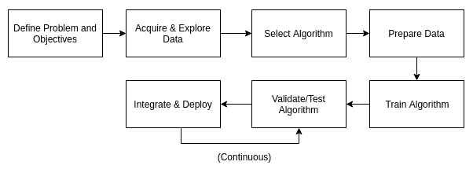

# 使用 Go 介绍机器学习

在我们周围，自动化正在以细微的增量改变着我们的生活，这些增量处于数学和计算机科学的尖端。一个 Nest 恒温器、Netflix 的电影推荐和 Google 的图片搜索算法有什么共同之处？这些技术都是由当今软件行业中最聪明的大脑之一创造的，它们都依赖于**机器学习**（**ML**）技术。

在 2019 年 2 月，Crunchbase 列出了超过 4,700 家将自己归类为**人工智能**（**AI**）或机器学习的公司^([1])。其中大部分公司处于非常早期阶段，由天使投资者或风险投资家的早期轮次融资。然而，Crunchbase 在 2017 年和 2018 年的文章以及英国《金融时报》的文章都围绕着一个共同的认识，即机器学习越来越被依赖以实现持续增长^([2])，并且其日益成熟将导致更广泛的应用^([3])，尤其是如果能够解决机器学习算法决策不透明性的挑战^([4])。甚至《纽约时报》还设有专门关于机器学习的专栏^([5])，这是对其在日常生活中重要性的致敬。

本书将教会具有 Go 编程语言中级知识的软件工程师如何从概念到部署，以及更远地编写和制作一个机器学习应用程序。我们首先将分类适合机器学习技术的和机器学习应用程序的生命周期中的问题。然后，我们将解释如何使用 Go 语言设置一个专门适合数据科学开发的环境。接着，我们将提供主要机器学习算法、它们的实现及其陷阱的实用指南。我们还将提供一些关于使用其他编程语言产生的机器学习模型并在 Go 应用程序中集成的指导。最后，我们将考虑不同的部署模型以及 DevOps 和数据科学之间难以捉摸的交集。我们将结合我们自己的经验对管理机器学习项目进行一些评论。

机器学习理论是一个数学上高级的学科，但你可以在不完全理解它的情况下开发机器学习应用程序。本书将帮助你发展对使用哪些算法以及如何仅用基本数学知识来构建问题的直觉。

在我们的第一章中，我们将介绍 Go 机器学习应用程序的一些基本概念：

+   什么是机器学习？

+   机器学习问题类型

+   为什么要在 Go 中编写机器学习应用程序？

+   机器学习开发生命周期

# 什么是机器学习？

机器学习是统计学和计算机科学交叉的领域。这个领域的输出是一系列能够自主操作的算法，它们通过从数据集中推断出最佳决策或答案来解决问题。与传统的编程不同，程序员必须决定程序的规则，并费力地将这些规则编码在他们选择的编程语言的语法中，而机器学习算法只需要足够量的准备数据、从数据中学习的计算能力，以及通常需要一些知识来调整算法参数以改善最终结果。

结果系统非常灵活，并且能够很好地利用人类可能忽略的模式。想象一下从头开始编写一个电视剧推荐系统。你可能首先定义问题的输入和输出，然后找到一个包含电视剧发布日期、类型、演员和导演等详细信息的数据库。最后，你可能创建一个`score`函数，如果两对电视剧的发布日期接近、属于同一类型、共享演员或拥有相同的导演，则给予更高的评分。

**推荐系统**是一种预测算法，试图猜测用户会对一个输入样本赋予的评分。在在线零售中，广泛使用的一种应用是使用推荐系统根据用户的过去购买行为向用户推荐商品。

给定一部电视剧，你可以根据相似度评分递减对所有其他电视剧进行排名，并将前几部推荐给用户。在创建`score`函数时，你会在各种特征的相对重要性上进行判断，例如决定两个系列之间每对共享演员值一分。这种猜测工作，也称为**启发式方法**，是机器学习算法旨在为你做的事情，节省时间并提高最终结果的准确性，尤其是如果用户偏好发生变化，你必须定期更改评分函数以保持同步。

人工智能和机器学习这两个更广泛领域的区别是模糊的。虽然围绕机器学习的炒作可能相对较新^([6])，但这个领域的历史始于 1959 年，当时人工智能领域的领先专家 Arthur Samuel 首次使用了这些词^([7])。在 20 世纪 50 年代，像 Alan Turing^([8])和 Samuel 本人这样的发明家发明了诸如感知器、遗传算法等机器学习概念。在接下来的几十年里，实现通用人工智能的实践和理论困难导致了诸如基于规则的方法（如专家系统）等方法的产生，这些方法不是从数据中学习，而是从专家制定的规则中学习，这些规则是他们多年来学到的，并以 if-else 语句的形式编码。

机器学习的力量在于算法能够适应之前未见过的案例，这是 if-else 语句无法做到的。如果你不需要这种适应性，可能是因为所有案例事先都是已知的，那么坚持基本原理，使用传统的编程技术即可！

在 20 世纪 90 年代，意识到在现有技术下实现人工智能的可能性不大，人们越来越倾向于采用一种狭隘的方法来解决可以用统计和概率论相结合解决的问题。这导致了机器学习作为一个独立领域的发展。今天，机器学习和人工智能经常被互换使用，尤其是在市场营销文献中^([9])。

# 机器学习算法的类型

机器学习算法主要有两大类：监督学习和无监督学习。选择哪种类型的算法取决于你拥有的数据和项目目标。

# 监督学习问题

监督学习问题旨在根据提供的标记输入/输出对，推断输入和输出数据集之间最佳映射。标记数据集作为算法的反馈，允许算法评估其解决方案的优化程度。例如，给定 2010-2018 年每年的平均原油价格列表，你可能希望预测 2019 年的平均原油价格。算法在 2010-2018 年产生的误差将允许工程师估计其在目标预测年份 2019 年的误差。

**标记对**由一个包含独立变量的输入向量和一个包含依赖变量的输出向量组成。例如，用于面部识别的标记数据集可能包含带有面部图像数据的输入向量，以及编码照片中人物姓名的输出向量。**标记集**（或数据集）是标记对的集合。

给定一组标记的手写数字，你可能希望预测一个以前未见过的手写数字的标签。同样，给定一个标记为垃圾邮件或非垃圾邮件的电子邮件数据集，一个想要创建垃圾邮件过滤器的公司会希望预测一个以前未见过的消息是否为垃圾邮件。所有这些问题都是监督学习问题。

监督机器学习问题可以进一步分为预测和分类：

+   **分类**试图用一个已知的输出值来标记一个未知的输入样本。例如，你可以训练一个算法来识别猫的品种。该算法会通过标记它已知的品种来对未知猫进行分类。

+   相比之下，预测算法试图用一个已知或未知的输出值来标记一个未知的输入样本。这也被称为**估计**或**回归**。一个典型的预测问题是时间序列预测，其中预测序列的输出值是在之前未见过的某个时间值。

**分类算法**将尝试将输入样本与给定输出类别列表中的一个项目关联起来：例如，决定一张照片是否代表猫、狗或都不是，这是一个分类问题。**预测算法**将输入样本映射到输出域中的一个成员，该域可以是连续的：例如，尝试根据一个人的体重和性别猜测其身高，这是一个预测问题。

我们将在第三章“监督学习”中更详细地介绍监督学习算法。

# 无监督学习问题

无监督学习问题旨在从未标记的数据中学习。例如，给定一个市场研究数据集，聚类算法可以将消费者划分为不同的细分市场，为市场营销专业人士节省时间。给定一个医学扫描数据集，无监督分类算法可以将图像划分为不同类型的组织，以便进行进一步分析。一种称为降维的无监督学习方法与其他算法协同工作，作为预处理步骤，以减少另一个算法在训练时需要处理的数据量，从而缩短训练时间。我们将在第四章“无监督学习”中更详细地介绍无监督学习算法。

大多数机器学习算法都可以在广泛的编程语言中高效实现。虽然 Python 以其易用性和丰富的开源库而受到数据科学家的青睐，但 Go 为创建商业机器学习应用的开发者提供了显著的优势。

# 为什么要在 Go 中编写机器学习应用？

对于其他语言，尤其是 Python，有更完整的库，这些库已经受益于数十年的世界顶尖大脑的研究。一些 Go 程序员为了寻求更好的性能而转向 Go，但由于机器学习库通常是用 C 编写的，并通过它们的绑定暴露给 Python，因此它们不会像解释型 Python 程序那样遇到相同的性能问题。深度学习框架如 TensorFlow 和 Caffe 对 Go 的绑定非常有限，甚至没有。即使考虑到这些问题，Go 仍然是一个优秀甚至可能是最好的语言，用于开发包含机器学习组件的应用程序。

# Go 的优势

对于试图在学术环境中改进最先进算法的研究人员来说，Go 可能不是最佳选择。然而，对于拥有产品概念且现金储备快速减少的初创公司来说，在短时间内以可维护和可靠的方式完成产品的开发是至关重要的，这正是 Go 语言大放异彩的地方。

Go（或 Golang）起源于 Google，其设计始于 2007 年^([10])。其声明的目标是创建一个高效、编译的编程语言，感觉轻便且令人愉悦^([11])。Go 从众多旨在提高生产应用程序生产力和可靠性的特性中受益：

+   易于学习和接纳新开发者

+   快速构建时间

+   运行时良好的性能

+   极佳的并发支持

+   优秀的标准库

+   类型安全

+   使用 `gofmt` 易于阅读、标准化的代码

+   强制错误处理以最小化意外异常

+   明确、清晰的依赖管理

+   随着项目增长，易于适应的架构

所有这些原因使 Go 成为构建生产系统的优秀语言，尤其是网络应用程序。2018 年 Stack Overflow 开发者调查揭示，尽管只有 7% 的专业开发者将 Go 作为其主要语言，但它位列最受欢迎列表的第 5 位，并且与其他语言相比，Go 程序员的薪资非常高，这认可了 Go 程序员为企业带来的商业价值^([12])。

# Go 成熟的生态系统

一些世界上最成功的技术公司将 Go 作为其生产系统的主要编程语言，并积极为其开发做出贡献，例如 Cloudflare^([13])、Google、Uber^([14])、Dailymotion^([15]) 和 Medium^([16])。这意味着现在有一个广泛的工具和库生态系统，可以帮助开发团队在 Go 中创建可靠、可维护的应用程序。甚至全球领先的容器技术 Docker 也是用 Go 编写的。

在撰写本文时，GitHub 上有 1,774 个用 Go 语言编写的仓库拥有超过 500 个星标，这通常被认为是质量和支持的优良指标。相比之下，Python 有 3,811 个，Java 有 3,943 个。考虑到 Go 相对较年轻，并且允许更快的生产就绪开发，用 Go 编写的得到良好支持的仓库数量相对较大，这构成了开源社区的高度认可。

Go 拥有众多稳定且得到良好支持的开放源代码机器学习库。按 GitHub 星标和贡献者数量，最受欢迎的 Go 机器学习库是 GoLearn^([17])。它也是最新更新的。其他 Go 机器学习库包括 GoML 和 Gorgonia，这是一个深度学习库，其 API 类似于 TensorFlow。

# 转移在其他语言中创建的知识和模型

数据科学家通常会探索不同的方法来解决机器学习问题，例如使用 Python，并创建一个可以在任何应用程序之外解决问题的模型。这些管道，如将数据输入和输出模型、向客户提供服务、持久化输出或输入、记录错误或监控延迟，并不属于这个交付成果，也不在数据科学家正常工作范围之内。因此，将模型从概念到 Go 生产应用程序需要多语言方法，如微服务。

本书中的大多数代码示例都使用了机器学习算法或绑定到库（如 OpenCV），这些库也在 Python 等语言中可用。这将使您能够快速将数据科学家的原型 Python 代码转换为生产 Go 应用程序。

然而，对于深度学习框架如 TensorFlow 和 Caffe，存在 Go 绑定。此外，对于更基本的算法，如决策树，相同的算法也已经在 Go 库中实现，并且如果以相同的方式配置，将产生相同的结果。综合考虑，这意味着可以在不牺牲准确性、速度或强迫数据科学家使用他们不习惯的工具的情况下，将数据科学产品完全集成到 Go 应用程序中。

# 机器学习开发生命周期

机器学习开发生命周期是一个创建并推向生产包含解决业务问题的机器学习模型的应用程序的过程。然后，该机器学习模型可以作为产品或服务提供的一部分通过应用程序提供给客户。

以下图表说明了机器学习开发生命周期过程：

# 定义问题和目标

在任何开发开始之前，必须定义要解决的问题以及理想结果的目标，以设定期望。问题的表述方式非常重要，因为这可能意味着无法解决的问题和简单解决方案之间的区别。这也可能涉及到关于任何算法的输入数据来源的讨论。

机器学习算法通常需要大量数据才能发挥最佳性能。在规划机器学习项目时，获取高质量数据是最重要的考虑因素。

机器学习问题的典型表述形式是“给定 X 数据集，预测 Y”。数据的可用性或缺乏可用性可能会影响问题的表述、解决方案及其可行性。例如，考虑以下问题：“给定一大组标注的手写数字图像”，预测一个之前未见过的图像的标签。深度学习算法已经证明，只要训练数据集足够大，工程师的工作量很小，就可以在这个特定问题上实现相对较高的准确性^([19])。如果训练集不大，问题立即变得更加困难，需要仔细选择要使用的算法。它还影响准确性，从而影响可达到的目标集。

Michael Nielsen 在 MNIST 手写数字数据集上进行的实验表明，对于大多数测试的算法，使用每个数字 1 个标注的输入/输出对进行训练与使用 5 个示例相比，准确率从大约 40%提高到大约 65%^([20])。通常，每个数字使用 10 个示例可以将准确率进一步提高 5%。

如果可用的数据不足以满足项目目标，有时可以通过对现有示例进行微小修改来人工扩大数据集以提高性能。在之前提到的实验中，Nielsen 观察到，向数据集中添加略微旋转或平移的图像可以将性能提高多达 15%。

# 获取和探索数据

我们之前已经论证，在指定项目目标之前理解输入数据集是至关重要的，尤其是与准确性相关的目标。一般来说，当有大量的训练数据集可用时，机器学习算法会产生最佳结果。用于训练它们的数据越多，它们的性能就越好。

因此，获取数据是机器学习开发生命周期中的一个关键步骤——这个步骤可能非常耗时且充满困难。在某些行业中，隐私法规可能导致个人数据不可用，这使得创建个性化产品变得困难，或者在使用之前需要对源数据进行匿名化。一些数据集可能可用，但可能需要如此广泛的准备甚至人工标记，这可能会给项目时间表或预算带来压力。

即使你没有专有数据集可以应用于你的问题，你也可能找到可用的公共数据集。通常，公共数据集已经引起了研究者的关注，因此你可能发现你试图解决的问题已经被解决，并且解决方案是开源的。以下是一些公共数据集的良好来源：

+   **出色的数据集**：[`github.com/awesomedata/awesome-public-datasets`](https://github.com/awesomedata/awesome-public-datasets)

+   **Skymind 开放数据集**：[`skymind.ai/wiki/open-datasets`](https://skymind.ai/wiki/open-datasets)

+   **OpenML**：[`www.openml.org/`](https://www.openml.org/)

+   **Kaggle**：[`www.kaggle.com/datasets`](https://www.kaggle.com/datasets)

+   **英国政府开放数据**：[`data.gov.uk/`](https://data.gov.uk/)

+   **美国政府开放数据**：[`www.data.gov/`](https://www.data.gov/)

一旦获取了数据集，就应该对其进行探索，以获得对不同的特征（自变量）如何影响所需输出的基本理解。例如，当试图从自我报告的数据中预测正确的高度和体重时，研究人员在初步探索中确定，年龄较大的受试者更有可能低估肥胖，因此年龄在构建他们的模型时是一个相关特征。试图从所有可用数据中构建模型，即使是不相关的特征，在最坏的情况下可能会导致训练时间更长，并且通过引入噪声严重损害准确性。

花更多的时间来处理和转换数据集是值得的，因为这将提高最终结果的准确性，甚至可能缩短训练时间。本书中的所有代码示例都包括数据处理和转换。

在第二章《设置机器学习环境》中，我们将看到如何使用 Go 语言和一个名为**Jupyter**的基于浏览器的交互式工具来探索数据。

# 选择算法

算法的选取可以说是机器学习应用工程师需要做出的最重要的决定，也是需要投入最多研究的工作。有时，甚至需要将机器学习算法与传统计算机科学算法相结合，以便使问题更容易处理——这种例子就是我们后面将要讨论的推荐系统。

开始寻找解决特定问题的最佳算法的一个好方法是确定是否需要监督或无监督方法。我们在本章前面介绍了这两种方法。一般来说，当你拥有标记的数据集，并希望对之前未见过的样本进行分类或预测时，这将使用监督算法。当你希望通过将未标记的数据集聚类成不同的组来更好地理解它，可能为了随后对新样本进行分类，你将使用无监督学习算法。对每种算法的优点和缺点有更深入的了解，以及对你的数据进行彻底的探索，将提供足够的信息来选择算法。为了帮助你开始，我们在第三章《监督学习》中涵盖了各种监督学习算法，在第四章《无监督学习》中涵盖了无监督学习算法。

一些问题可以巧妙地应用机器学习技术和传统计算机科学。其中一个这样的问题是推荐系统，现在在像亚马逊和 Netflix 这样的在线零售商中非常普遍。这个问题要求，*给定每个用户购买物品的数据集，预测用户最有可能购买的下 N 个物品*。这在亚马逊的“购买 X 的人也购买 Y”系统中得到了体现。

解决方案的基本思想是，如果两个用户购买非常相似的商品，那么任何不在他们购买商品交集中的商品都是他们未来购买的好候选。首先，将数据集转换成将商品对映射到表示它们共现的分数。这可以通过计算相同客户购买两个商品的次数除以客户购买任一商品的次数来计算，得到一个介于 0 和 1 之间的数字。现在这提供了一个标记的数据集来训练一个监督算法，如二元分类器，以预测先前未见对对的分数。结合排序算法，给定一个单一的商品，可以生成一个按可购买性排序的商品列表。

# 准备数据

数据准备是指在训练算法之前对输入数据集所执行的过程。一个严谨的准备过程可以同时提高数据质量并减少算法达到所需精度所需的时间。数据准备的两个步骤是数据预处理和数据转换。我们将在第二章，*设置开发环境*，第三章，*监督学习*，和第四章，*无监督学习*中详细介绍数据准备。

数据预处理旨在将输入数据集转换为适合与所选算法一起工作的格式。预处理任务的典型示例是将日期列格式化为某种方式，或将 CSV 文件导入数据库，丢弃导致解析错误的任何行。输入数据文件中可能也存在需要填充（例如，使用平均值）或整个样本丢弃的缺失数据值。敏感信息，如个人信息，可能需要被移除。

数据转换是指对数据集进行采样、减少、增强或聚合的过程，使其更适合算法。如果输入数据集较小，可能需要通过人工创建更多示例来增强它，例如在图像识别数据集中旋转图像。如果输入数据集具有探索认为无关的特征，明智的做法是移除它们。如果数据集比问题所需的粒度更细，将其聚合到更粗的粒度可能有助于加快结果，例如，如果问题只需要对每个县进行预测，则将城市级数据聚合到县。

最后，如果输入数据集特别大，例如许多用于深度学习算法的图像数据集，那么从较小的样本开始，这将产生快速结果，以便在投资更多计算资源之前验证算法的可行性，这是一个好主意。

样本过程还将把输入数据集分成训练和验证子集。我们将在后面解释为什么这是必要的，以及应该使用多少数据比例。

# 训练

机器学习开发生命周期中最计算密集的部分是训练过程。在最简单的情况下，训练一个机器学习算法可能只需要几秒钟，而当输入数据集巨大且算法需要多次迭代才能收敛时，可能需要几天。后者通常与深度学习技术相关。例如，DeepMinds AlphaGo Zero 算法用了四十天时间才完全掌握围棋游戏，尽管它在仅仅三天后就已经很熟练了^([22])。在处理较小数据集和图像或声音识别以外的其他问题上的许多算法，可能不需要这么多的时间或计算资源。

基于云的计算资源正变得越来越便宜，因此，如果一个算法，尤其是深度学习算法，在您的 PC 上训练时间过长，您可以在云实例上部署和训练它，只需花费几美元。我们将在第六章中介绍部署模型，*部署机器学习应用*。

当算法正在训练时，尤其是如果训练阶段将花费很长时间，那么有一些实时指标来衡量训练进展情况是有用的，这样就可以在不等待训练完成的情况下中断、重新配置和重新启动。这些指标通常被归类为**损失指标**，其中*损失*指的是算法在训练或验证子集上犯的假设性错误。

在预测问题中最常见的损失度量指标如下：

+   **均方误差**（**MSE**）衡量输出变量与预测值之间平方距离的总和。

+   **平均绝对误差**（**MAE**）衡量输出变量与预测值之间绝对距离的总和。

+   **Huber 损失**是 MSE 和 MAE 的组合，它对异常值更稳健，同时仍然是均值和中值损失的良好估计器。

在分类问题中最常见的损失度量指标如下：

+   **对数损失**通过对错误分类进行惩罚来衡量分类器的准确性。它与交叉熵损失密切相关。

+   **焦点损失**是一种新的`损失`函数，旨在防止当输入数据集稀疏时出现假阴性^([23])。

# 验证/测试

软件工程师熟悉测试和调试软件源代码，但如何测试机器学习模型呢？算法片段和数据输入/输出例程可以进行单元测试，但通常不清楚如何确保作为黑盒的机器学习模型本身是正确的。

确保机器学习模型正确性和足够准确的第一步是验证。这意味着将模型应用于预测或分类验证数据子集，并将结果准确性与项目目标进行比较。因为训练数据子集已经被算法看到，所以不能用来验证正确性，因为模型可能会遭受泛化能力差（也称为**过拟合**）的问题。为了举一个荒谬的例子，想象一个由哈希表组成的机器学习模型，该表记住每个输入样本并将其映射到相应的训练输出样本。该模型在之前记忆的训练数据子集上会有 100%的准确率，但在任何数据子集上都会有非常低的准确率，因此它将无法解决它打算解决的问题。验证测试针对这种现象。

此外，将模型输出与用户接受标准进行验证也是一个好主意。例如，如果你正在为电视剧构建推荐系统，你可能希望确保向儿童推荐的节目永远不会被评为 PG-13 或更高。与其试图将此编码到模型中，这将有一个非零的失败率，不如将此约束推入应用程序本身，因为不执行此约束的成本会太高。此类约束和业务规则应在项目开始时捕获。

# 集成和部署

机器学习模型与其他应用程序之间的边界必须定义。例如，算法是否会提供一个`Predict`方法来为给定的输入样本提供预测？是否需要调用者处理输入数据处理，还是算法实现会执行它？一旦这被定义，在测试或模拟机器学习模型以确保应用程序其余部分的正确性时，遵循最佳实践就会变得更容易。对于任何应用程序，关注点的分离都很重要，但对于那些一个组件表现得像黑盒的机器学习应用程序来说，这一点是至关重要的。

机器学习应用程序有几种可能的部署方法。对于 Go 应用程序来说，容器化特别简单，因为编译的二进制文件将没有依赖项（除非在某些非常特殊的情况下需要，例如需要绑定到深度学习库，如 TensorFlow）。不同的云服务提供商也接受无服务器部署，并提供不同的**持续集成**/**持续部署**（**CI**/**CD**）服务。使用 Go 等语言的部分优势在于，应用程序可以非常灵活地部署，利用可用于传统系统应用程序的工具，而不必求助于混乱的多语言方法。

在第六章，“部署机器学习应用”中，我们将深入探讨诸如部署模型、**平台即服务（PaaS）**与**基础设施即服务（IaaS）**的对比，以及针对机器学习应用的监控和警报等特定主题，利用为 Go 语言构建的工具。

# 重新验证

将模型投入生产而无需更新或重新训练的情况很少见。推荐系统可能需要定期重新训练，因为用户偏好会发生变化。用于汽车制造商和型号的图像识别模型可能需要随着市场上更多模型的推出而重新训练。为物联网群体中的每个设备生成一个模型的预测行为工具可能需要持续监控，以确保每个模型仍然满足所需的准确度标准，并对那些不满足标准的模型进行重新训练。

重新验证过程是一个持续的过程，其中测试模型的准确性，如果认为其准确性已降低，则触发自动或手动过程以重新训练它，确保结果始终是最优的。

# 摘要

在本章中，我们介绍了机器学习以及不同类型的机器学习问题。我们主张使用 Go 语言来开发机器学习应用。然后，我们概述了机器学习开发的生命周期，创建并部署机器学习应用的过程。

在下一章中，我们将解释如何为机器学习应用和 Go 设置开发环境。

# 进一步阅读

1.  [`www.crunchbase.com/hub/machine-learning-companies`](https://www.crunchbase.com/hub/machine-learning-companies)，于 2019 年 2 月 9 日检索。

1.  [`www.ft.com/content/133dc9c8-90ac-11e8-9609-3d3b945e78cf`](https://www.ft.com/content/133dc9c8-90ac-11e8-9609-3d3b945e78cf)。*机器学习将成为全球增长的动力*。

1.  [`news.crunchbase.com/news/venture-funding-ai-machine-learning-levels-off-tech-matures/`](https://news.crunchbase.com/news/venture-funding-ai-machine-learning-levels-off-tech-matures/)。于 2019 年 2 月 9 日检索。

1.  [`www.economist.com/science-and-technology/2018/02/15/for-artificial-intelligence-to-thrive-it-must-explain-itself`](https://www.economist.com/science-and-technology/2018/02/15/for-artificial-intelligence-to-thrive-it-must-explain-itself)。于 2019 年 2 月 9 日检索。

1.  [`www.nytimes.com/column/machine-learning`](https://www.nytimes.com/column/machine-learning)。于 2019 年 2 月 9 日检索。

1.  例如，请参阅*Google Trends for Machine Learning*。[`trends.google.com/trends/explore?date=all&geo=US&q=machine%20learning`](https://trends.google.com/trends/explore?date=all&geo=US&q=machine%20learning)。

1.  R. Kohavi 和 F. Provost，*《机器学习术语表》*，第 30 卷第 2-3 期，第 271-274 页，1998 年。30，第 2-3 期，第 271-274 页，1998 年。

1.  图灵，艾伦（1950 年 10 月）。*《计算机与智能》*。Mind. 59（236）：433–460。doi:10.1093/mind/LIX.236.433。于 2016 年 6 月 8 日检索。

1.  [`www.forbes.com/sites/bernardmarr/2016/12/06/what-is-the-difference-between-artificial-intelligence-and-machine-learning/`](https://www.forbes.com/sites/bernardmarr/2016/12/06/what-is-the-difference-between-artificial-intelligence-and-machine-learning/)。检索日期：2019 年 2 月 9 日。

1.  [`talks.golang.org/2012/splash.article`](https://talks.golang.org/2012/splash.article)。检索日期：2019 年 2 月 9 日。

1.  [`talks.golang.org/2012/splash.article`](https://talks.golang.org/2012/splash.article)。检索日期：2019 年 2 月 9 日。

1.  [`insights.stackoverflow.com/survey/2018/`](https://insights.stackoverflow.com/survey/2018/)。检索日期：2019 年 2 月 9 日。

1.  [`github.com/cloudflare`](https://github.com/cloudflare)。检索日期：2019 年 2 月 9 日。

1.  [`github.com/uber`](https://github.com/uber)。检索日期：2019 年 2 月 9 日。

1.  [`github.com/dailymotion`](https://github.com/dailymotion)。检索日期：2019 年 2 月 9 日。

1.  [`github.com/medium`](https://github.com/medium)。检索日期：2019 年 2 月 9 日。

1.  [`github.com/sjwhitworth/golearn`](https://github.com/sjwhitworth/golearn)。检索日期：2019 年 2 月 10 日。

1.  查看托管在[`yann.lecun.com/exdb/mnist/`](http://yann.lecun.com/exdb/mnist/)的 MNIST 数据集。检索日期：2019 年 2 月 10 日。

1.  查看以下示例：[`machinelearningmastery.com/handwritten-digit-recognition-using-convolutional-neural-networks-python-keras/`](https://machinelearningmastery.com/handwritten-digit-recognition-using-convolutional-neural-networks-python-keras/)。检索日期：2019 年 2 月 10 日。

1.  [`cognitivemedium.com/rmnist`](http://cognitivemedium.com/rmnist)。检索日期：2019 年 2 月 10 日。

1.  *从自我报告数据中预测校正体重、身高和肥胖患病率的回归模型*：来自 BRFSS 1999-2007 的数据。Int J Obes (Lond)。2010 年 11 月；34(11)：1655-64。doi：10.1038/ijo.2010.80。Epub 2010 年 4 月 13 日。

1.  [`deepmind.com/blog/alphago-zero-learning-scratch/`](https://deepmind.com/blog/alphago-zero-learning-scratch/)。检索日期：2019 年 2 月 10 日。

1.  *密集目标检测中的焦点损失*。Lin 等人。ICCV 2980-2988。预印本可在[`arxiv.org/pdf/1708.02002.pdf`](https://arxiv.org/pdf/1708.02002.pdf)找到。
