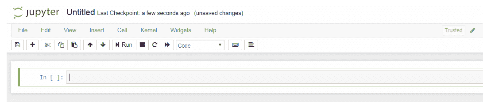
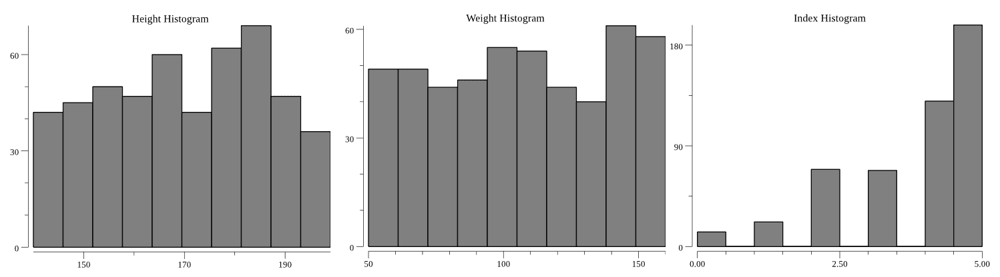
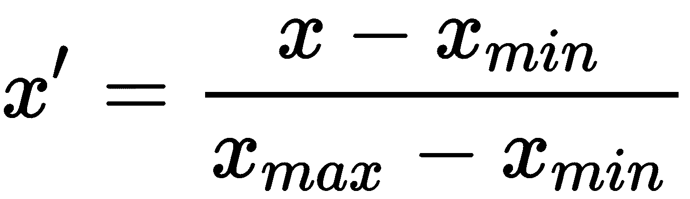
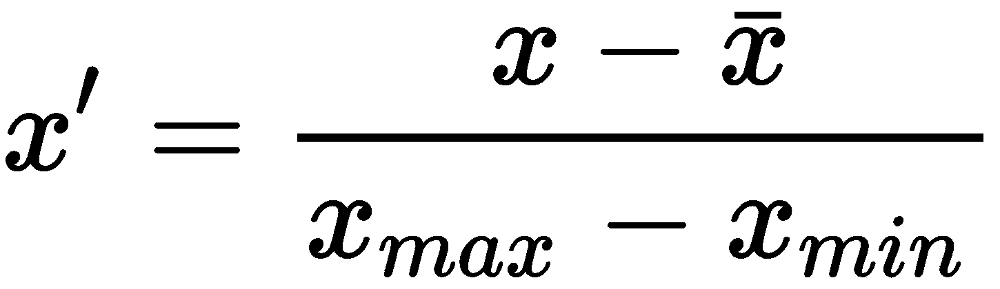
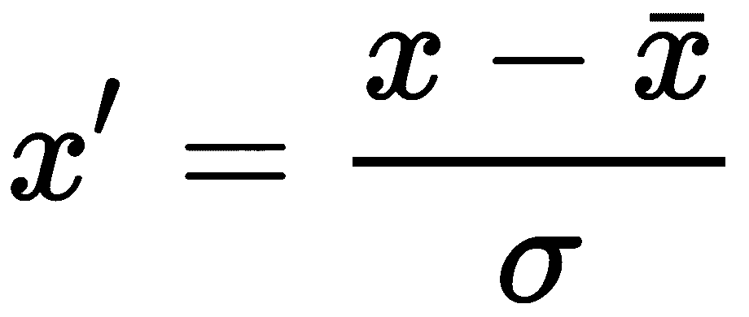

# 设置开发环境

就像传统的软件开发一样，机器学习应用开发需要掌握专业的样板代码和一个允许开发者以最低的摩擦和干扰速度进行工作的开发环境。软件开发者通常会在基本设置和数据整理任务上浪费大量时间。成为一个高效和专业的机器学习开发者需要能够快速原型化解决方案；这意味着在琐碎的任务上尽可能少地付出努力。

在上一章中，我们概述了主要的机器学习问题和你可以遵循以获得商业解决方案的开发流程。我们还解释了 Go 作为编程语言在创建机器学习应用时所提供的优势。

在本章中，我们将指导你完成设置 Go 开发环境的步骤，该环境针对机器学习应用进行了优化。具体来说，我们将涵盖以下主题：

+   如何安装 Go

+   使用 Jupyter 和 gophernotes 交互式运行 Go

+   使用 Gota 进行数据处理

+   使用 gonum/plot 和 gophernotes 进行数据可视化

+   数据预处理（格式化、清洗和采样）

+   数据转换（归一化和分类变量的编码）

本书附带的代码示例针对基于 Debian 的 Linux 发行版进行了优化。然而，它们可以被适应其他发行版（例如，将`apt`改为`yum`）和 Windows 的 Cygwin。

一旦你完成了这一章，你将能够快速探索、可视化和处理任何数据集，以便后续由机器学习算法使用。

# 安装 Go

开发环境是个人化的。大多数开发者会更倾向于选择一个代码编辑器或工具集，而不是另一个。虽然我们推荐使用 gophernotes 通过交互式工具如 Jupyter，但运行本书中的代码示例的唯一先决条件是 Go 1.10 或更高版本的正常安装。也就是说，`go`命令应该是可用的，并且`GOPATH`环境变量应该设置正确。

要安装 Go，从[`golang.org/dl/`](https://golang.org/dl/)下载适用于你系统的二进制发布版。然后，参考以下与你的操作系统匹配的子节之一^([2])。

如果你只想使用 gophernotes 来运行 Go 代码，并且打算使用 Docker 作为安装方法，那么你可以跳过这一部分，直接进入*使用 gophernotes 交互式运行 Go*部分。

# Linux、macOS 和 FreeBSD

二进制发布版被打包成 tar 包。提取二进制文件并将它们添加到你的`PATH`中。以下是一个示例：

```py
tar -C /usr/local -xzf go$VERSION.$OS-$ARCH.tar.gz && \
 export PATH=$PATH:/usr/local/go/bin
```

要配置`GOPATH`环境变量，你需要决定你的 Go 文件（包括任何个人仓库）将存放在哪里。一个可能的位置是`$HOME/go`。一旦你决定了这一点，设置环境变量，例如如下所示：

```py
export GOPATH=$HOME/go
```

要使此说明永久生效，您需要将此行添加到 `.bashrc`。如果您使用其他外壳（例如 `.zsh`），请参阅官方 Go 安装说明，网址为 [`github.com/golang/go/wiki/SettingGOPATH`](https://github.com/golang/go/wiki/SettingGOPATH)。

确保您的 `GOPATH` 不与您的 Go 安装在同一目录中，否则这可能会引起问题。

# Windows

二进制发布版本打包为 ZIP 文件或 MSI 安装程序，该安装程序会自动配置您的环境变量。我们建议使用 MSI 安装程序。但是，如果您不这样做，那么在将 ZIP 文件的内容提取到合适的位置（例如 `C:\Program Files\Go`）后，请确保您使用控制面板将 `subdirectory` bin 添加到您的 `PATH` 环境变量中。

一旦将二进制文件安装到合适的位置，您需要配置您的 `GOPATH`。首先，决定您想要您的 Go 文件（包括任何个人仓库）存放的位置。一个可能的位置是 `C:\go`。一旦您决定，将 `GOPATH` 环境变量设置为该目录的路径。

如果您不确定如何设置环境变量，请参阅官方 Go 安装说明，网址为 [`github.com/golang/go/wiki/SettingGOPATH`](https://github.com/golang/go/wiki/SettingGOPATH)。

确保您的 `GOPATH` 不与您的 Go 安装在同一目录中，否则这可能会引起问题。

# 使用 gophernotes 运行 Go 的交互式操作

Project Jupyter 是一个非营利组织，旨在开发面向数据科学的语言无关交互式计算^([3])。结果是成熟、支持良好的环境，可以探索、可视化和处理数据，通过提供即时反馈和与绘图库（如 `gonum`/`plot`）的集成，可以显著加速开发。

虽然它的第一个迭代版本，称为 iPython，最初只支持基于 Python 的处理器（称为 *kernels*），但 Jupyter 的最新版本已超过 50 个内核，支持包括 Go 语言在内的数十种语言，其中包含三个 Go 语言的内核^([4])。GitHub 支持渲染 Jupyter 文件（称为 *notebooks*）^([5])，并且有各种专门的在线共享笔记本的枢纽，包括 Google Research Colabs^([6])、Jupyter 的社区枢纽 NBViewer^([7]) 和其企业产品 JupyterHub^([8])。用于演示目的的笔记本可以使用 nbconvert 工具转换为其他文件格式，如 HTML^([9])。

在这本书中，我们将使用 Jupyter 和 Go 的 gophernotes 内核。在 Linux 和 Windows 上开始使用 gophernotes 的最简单方法是使用其 Docker^([10]) 镜像。

对于其他安装方法，我们建议检查 gophernotes GitHub 存储库的 README 页面：

[`github.com/gopherdata/gophernotes`](https://github.com/gopherdata/gophernotes)。

开始一个基于 gophernotes 的新项目步骤如下：

1.  创建一个新目录来存放项目文件（这个目录不需要在您的`GOPATH`中）。

1.  （可选）在新目录中运行`git init`来初始化一个新的 git 仓库。

1.  从新目录中运行以下命令（根据您如何安装 Docker，您可能需要在其前面加上`sudo`）：

    `docker run -it -p 8888:8888 -v $(pwd):/usr/share/notebooks gopherdata/gophernotes:latest-ds`

1.  在终端中，将有一个以`?token=[一些字母和数字的组合]`结尾的 URL。在现代网络浏览器中导航到这个 URL。您创建的新目录将被映射到`/usr/share/notebooks`，因此请导航到树形结构中显示的这个目录。

在 Windows 上，您可能需要修改前面的命令，将`$(pwd)`替换为`%CD%`。

现在我们已经学习了如何安装 Go 以及如何使用 gophernotes 设置基本开发环境，现在是时候学习数据预处理了。

# 示例 - 正面和负面评论中最常见的短语

在我们的第一个代码示例中，我们将使用多领域情感数据集（版本 2.0）^([11]）。这个数据集包含了来自四个不同产品类别的亚马逊评论。我们将下载它，预处理它，并将其加载到 Gota 数据整理库中，以找到正面和负面评论中最常见的短语，这些短语在两者中不会同时出现。这是一个不涉及 ML 算法的基本示例，但将作为 Go、gophernotes 和 Gota 的实战介绍。

您可以在本书的配套仓库中找到完整的代码示例，该仓库位于[`github.com/PacktPublishing/Machine-Learning-with-Go-Quick-Start-Guide`](https://github.com/PacktPublishing/Machine-Learning-with-Go-Quick-Start-Guide)。

# 初始化示例目录和下载数据集

按照我们之前实施的过程，创建一个空目录来存放代码文件。在打开 gophernotes 之前，从[`www.cs.jhu.edu/~mdredze/datasets/sentiment/processed_acl.tar.gz`](http://www.cs.jhu.edu/~mdredze/datasets/sentiment/processed_acl.tar.gz)下载数据集并将其解压到`datasets/words`目录下。在大多数 Linux 发行版中，您可以使用以下脚本完成此操作：

```py
mkdir -p datasets/words && \
wget http://www.cs.jhu.edu/~mdredze/datasets/sentiment/processed_acl.tar.gz -O datasets/words-temp.tar.gz && \
tar xzvf datasets/words-temp.tar.gz -C datasets/words && \
rm datasets/words-temp.tar.gz
```

现在，启动 gophernotes 并导航到`/usr/share/notebooks`。通过点击*New* | *Go*创建一个新的 Notebook。您将看到一个空白的 Jupyter Notebook：



Jupyter 中的输入单元格带有`In`标签。当您在一个输入单元格中运行代码（*Shift* + *Enter*）时，将创建一个新的输出单元格，其中包含结果，并标记为`Out`。每个单元格都按其执行顺序编号。例如，`In [1]`单元格是在给定会话中运行的第一个单元格。

尝试运行一些 Go 语句，如下面的代码片段：

```py
a := 1
import "fmt"
fmt.Println("Hello, world")
a
```

特别注意，即使没有调用`fmt.Println()`，`a`变量也会在输出单元格中显示。

在一个会话中定义的所有导入、变量和函数都将保留在内存中，即使你删除了输入单元格。要清除当前作用域，请转到内核 | 重新启动。

# 加载数据集文件

数据处理的基本任务之一是读取输入文件并加载其内容。完成此任务的一种简单方法是使用 `io/ioutil` 工具函数 `ReadFile`。与 `.go` 文件不同，在 `.go` 文件中你需要将此代码放在你的 `main` 函数内部，使用 gophernotes，你可以运行以下代码而不需要声明任何函数：

```py
import "io/ioutil"

const kitchenReviews = "../datasets/words/processed_acl/kitchen"

positives, err := ioutil.ReadFile(kitchenReviews + "/positive.review")
negatives, err2 := ioutil.ReadFile(kitchenReviews + "/negative.review")
if err != nil || err2 != nil {
 fmt.Println("Error(s)", err, err2)
}
```

上述代码将把具有积极情感的厨房产品评论内容加载到名为 `positives` 的字节切片中，将具有消极情感的评论内容加载到名为 `negatives` 的字节切片中。如果你已正确下载数据集并运行此代码，它不应该输出任何内容，因为没有错误。如果有任何错误出现，请检查数据集文件是否已提取到正确的文件夹。

如果你已经在文本编辑器中打开了 `positive.review` 或 `negative.review` 文件，你可能已经注意到它们是以空格或换行符分隔的对列表，即 `phrase:frequency`。例如，积极评论的开始如下：

```py
them_it:1 hovering:1 and_occasional:1 cousin_the:2 fictional_baudelaire:1 their_struggles:1
```

在下一小节中，我们将解析这些对到 Go 结构体中。

# 将内容解析到结构体中

我们将使用 `strings` 包将数据文件的 内容解析成对数组的切片。字符串切片中的每个项目将包含一个对，例如 `them_it:1`。然后我们将进一步通过冒号符号分割这个对，并使用 `strconv` 包将整数频率解析为 `int`。每个 `Pair` 将是以下类型：

```py
type Pair struct {
  Phrase string
  Frequency int
}
```

我们将按以下方式操作：

1.  首先，观察这些对之间的分隔可以是换行符 (`\n`) 或空格。我们将使用字符串包中的 `strings.Fields` 函数，该函数将字符串按任何连续的空白字符分割：

```py
pairsPositive := strings.Fields(string(positives))
pairsNegative := strings.Fields(string(negatives))
```

1.  现在，我们将迭代每个对，通过冒号分隔符分割，并使用 `strconv` 包将频率解析为整数：

```py
// pairsAndFilters returns a slice of Pair, split by : to obtain the phrase and frequency,
// as well as a map of the phrases that can be used as a lookup table later.
func pairsAndFilters(splitPairs []string) ([]Pair, map[string]bool) {
  var (
    pairs []Pair
    m map[string]bool
  )
  m = make(map[string]bool)
  for _, pair := range splitPairs {
    p := strings.Split(pair, ":")
    phrase := p[0]
    m[phrase] = true
    if len(p) < 2 {
      continue
    }
    freq, err := strconv.Atoi(p[1])
    if err != nil {
      continue
    }
    pairs = append(pairs, Pair{
      Phrase: phrase,
      Frequency: freq,
    })
  }
  return pairs, m
}
```

1.  我们还将返回一个短语映射，以便我们可以在以后排除正负评论交集中的短语。这样做的原因是，正负评论中共同出现的单词不太可能是积极或消极情感的特征。这是通过以下函数完成的：

```py
// exclude returns a slice of Pair that does not contain the phrases in the exclusion map
func exclude(pairs []Pair, exclusions map[string]bool) []Pair {
  var ret []Pair
  for i := range pairs {
    if !exclusions[pairs[i].Phrase] {
      ret = append(ret, pairs[i])
    }
  }
  return ret
}

```

1.  最后，我们将此应用于我们的对数组切片：

```py
parsedPositives, posPhrases := pairsAndFilters(pairsPositive)
parsedNegatives, negPhrases := pairsAndFilters(pairsNegative)
parsedPositives = exclude(parsedPositives, negPhrases)
parsedNegatives = exclude(parsedNegatives, posPhrases)
```

下一步是将解析好的对加载到 Gota 中，这是 Go 的数据处理库。

# 将数据加载到 Gota 数据框中

Gota 库包含数据框、系列和一些通用数据处理算法的实现^([12])。数据框的概念对于许多流行的数据科学库和语言（如 Python 的 pandas、R 和 Julia）至关重要。简而言之，**数据框**是一系列列表（称为**列**或**系列**），每个列表的长度都相同。每个列表都有一个名称——列名或系列名，具体取决于库所采用的命名法。这种抽象模仿了数据库表，并成为数学和统计工具的简单基本构建块。

Gota 库包含两个包：`dataframe` 和 `series` 包。`series` 包包含表示单个列表的函数和结构，而 `dataframe` 包处理整个数据框——即整个表格——作为一个整体。Go 开发者可能希望使用 Gota 来快速排序、过滤、聚合或执行关系操作，例如两个表之间的内连接，从而节省实现 `sort` 接口等样板代码^([13])。

使用 Gota 创建新的数据框有几种方法：

+   `dataframe.New(se ...series.Series)`: 接受一个系列切片（可以通过 `series.New` 函数创建）。

+   `dataframe.LoadRecords(records [][]string, options ...LoadOption)`: 接受一个字符串切片的切片。第一个切片将是一个表示列名的字符串切片。

+   `dataframe.LoadStructs(i interface{}, options ...LoadOption)`: 接受一个结构体的切片。Gota 将使用反射根据结构体字段名称来确定列名。

+   `dataframe.LoadMaps(maps []map[string][]interface{})`: 接受一个列名到切片映射的切片。

+   `dataframe.LoadMatrix(mat Matrix)`: 接受与 mat64 矩阵接口兼容的切片。

在我们的案例中，因为我们已经将数据解析到结构体中，我们将使用 `LoadStructs` 函数，为正面评论和负面评论创建一个数据框：

```py
dfPos := dataframe.LoadStructs(parsedPositives)
dfNeg := dataframe.LoadStructs(parsedNegatives)
```

如果你想检查数据框的内容，即 `df`，只需使用 `fmt.Println(df)`。这将显示数据框的前 10 行，包括其列名和一些有用的元数据，例如总行数。

# 寻找最常见的短语

现在数据已经被解析，共现短语已经被过滤，结果短语/频率对已经被加载到数据框中，接下来要做的就是找到正面和负面评论中最常见的短语并显示它们。在不使用数据框的情况下，可以通过创建一个实现 `sort` 接口的 `type ByFrequency []Pair` 类型来完成这项工作，然后使用 `sort.Reverse` 和 `sort.Sort` 来按频率降序排列正面和负面配对。然而，通过使用 Gota，我们可以每个数据框一行代码就实现这个功能：

```py
dfPos = dfPos.Arrange(dataframe.RevSort("Frequency"))
dfNeg = dfNeg.Arrange(dataframe.RevSort("Frequency"))
```

现在打印数据框会显示厨房用品正面和负面评论中最常见的 10 个短语。对于正面评论，我们有以下输出：

```py
[46383x2] DataFrame

    Phrase       Frequency

 0: tic-tac-toe  10       

 1: wusthoff     7        

 2: emperor      7        

 3: shot_glasses 6        

 4: pulp         6        

 5: games        6        

 6: sentry       6        

 7: gravel       6        

 8: the_emperor  5        

 9: aebleskivers 5        

    ...          ...      

    <string>     <int>    
```

对于负面评论，我们有以下输出：

```py
[45760x2] DataFrame

    Phrase          Frequency
 0: seeds           9        

 1: perculator      7        

 2: probes          7        

 3: cork            7        

 4: coffee_tank     5        

 5: brookstone      5        

 6: convection_oven 5        

 7: black_goo       5        

 8: waring_pro      5        

 9: packs           5        

    ...             ...      

    <string>        <int>    
```

这完成了本例。在下一节中，我们将更详细地介绍 Gota 的其他转换和处理功能。

# 示例 - 使用 gonum/plot 探索身体质量指数数据

在上一节中，我们介绍了 gophernotes 和 Gota。在本节中，我们将探索包含 500 个性别、身高和 BMI 指数样本的数据集。我们将使用 `gonum/plot` 库来完成这项工作。这个库最初是 2012 年 Plotinum 库的分支^([15])，它包含几个使 Go 中的数据可视化变得更容易的包^([16])：

+   `plot` 包包含布局和格式化接口。

+   `plotter` 包抽象了常见图表类型（如柱状图、散点图等）的布局和格式化。

+   `plotutil` 包包含常见图表类型的实用函数。

+   `vg` 包公开了一个用于矢量图形的 API，在将图表导出到其他软件时特别有用。我们不会介绍这个包。

# 安装 gonum 和 gonum/plot

无论你是按照之前建议使用 Docker 镜像运行 gophernotes，还是使用其他方法，你都需要使用 `gonum/plot`。为此，运行 `go get gonum.org/v1/plot/...` 命令。如果你没有安装 `gonum` 库，并且没有使用 gophernotes Docker 镜像，你需要使用 `go get github.com/gonum/...` 命令单独安装它。

要从 Jupyter 打开终端，打开树视图（默认视图）的 Web UI，然后点击 **新建** | **终端**。

注意，尽管它们的名称相似，但 gonum 和 gonum/plot 并不属于同一个仓库，因此你需要分别安装它们。

# 加载数据

如果你已经克隆了项目仓库，它将已经包含在 `datasets/bmi` 文件夹中的 500 人 BMI 数据集。你也可以从 Kaggle^([14]) 下载数据集。数据集是一个包含以下几行数据的单个 CSV 文件：

```py
Gender,Height,Weight,Index
Male,174,96,4
Male,189,87,2
Female,185,110,4
Female,195,104,3
Male,149,61,3
...
```

与上一节类似，我们将使用 `io`/`ioutil` 读取文件到字节切片，但这次，我们将利用 Gota 的 ReadCSV 方法（该方法接受一个 `io.Reader` 作为参数）直接将数据加载到数据框中，无需预处理：

```py
b, err := ioutil.ReadFile(path)
if err != nil {
  fmt.Println("Error!", err)
}
df := dataframe.ReadCSV(bytes.NewReader(b))
```

检查数据框以确保数据已正确加载：

```py
[500x4] DataFrame

    Gender   Height Weight Index
 0: Male     174    96     4    

 1: Male     189    87     2    

 2: Female   185    110    4    

 3: Female   195    104    3    

 4: Male     149    61     3    

 5: Male     189    104    3    

 6: Male     147    92     5    

 7: Male     154    111    5    

 8: Male     174    90     3    

 9: Female   169    103    4    

    ...      ...    ...    ...  

    <string> <int>  <int>  <int>
```

注意，序列的数据类型已被自动推断。

# 理解数据序列的分布

了解每个序列的一个好方法是绘制直方图。这将给你一个关于每个序列如何分布的印象。使用 `gonum`/`plot`，我们将为每个序列绘制直方图。然而，在我们绘制任何内容之前，我们可以通过 Gota 快速访问一些摘要统计信息，以获得对数据集的基本了解：

```py
fmt.Println("Minimum", df.Col("Height").Min())
fmt.Println("Maximum", df.Col("Height").Max())
fmt.Println("Mean", df.Col("Height").Mean())
fmt.Println("Median", df.Col("Height").Quantile(0.5))
```

这告诉我们，样本个体的身高介于 140 厘米和 199 厘米之间，他们的平均身高和中位数分别为 169 厘米和 170 厘米，而平均数和中位数如此接近表明偏度较低——也就是说，分布是对称的。

要同时为所有列实现这一点的更快方法，请使用`dataframe.Describe`函数。这将生成另一个包含每列摘要统计数据的 dataframe：

```py
[7x5] DataFrame

    column   Gender   Height     Weight     Index   
 0: mean     -        169.944000 106.000000 3.748000

 1: stddev   -        16.375261  32.382607  1.355053

 2: min      Female   140.000000 50.000000  0.000000

 3: 25%      -        156.000000 80.000000  3.000000

 4: 50%      -        170.000000 106.000000 4.000000

 5: 75%      -        184.000000 136.000000 5.000000
 6: max      Male     199.000000 160.000000 5.000000

    <string> <string> <float>    <float>    <float> 
```

现在，我们将使用直方图可视化分布。首先，我们需要将 Gota dataframe 的某一列转换为绘图友好的`plotter.Values`切片。这可以通过以下实用函数完成：

```py
// SeriesToPlotValues takes a column of a Dataframe and converts it to a gonum/plot/plotter.Values slice.
// Panics if the column does not exist.
func SeriesToPlotValues(df dataframe.DataFrame, col string) plotter.Values {
  rows, _ := df.Dims()
  v := make(plotter.Values, rows)
  s := df.Col(col)
  for i := 0; i < rows; i++ {
    v[i] = s.Elem(i).Float()
  }
  return v
}
```

`dataframe.Col`函数从给定的 dataframe 中提取所需的列——在我们的例子中是一个单独的列。您还可以使用`dataframe.Select`，它接受字符串切片的列名，以返回只包含所需列的 dataframe。这可以用于丢弃不必要的数据。

现在，我们可以使用 gonum/plot 创建给定列的直方图的 JPEG 图像，并选择一个标题：

```py
// HistogramData returns a byte slice of JPEG data for a histogram of the column with name col in the dataframe df.
func HistogramData(v plotter.Values, title string) []byte {
  // Make a plot and set its title.
  p, err := plot.New()
  if err != nil {
    panic(err)
  }
  p.Title.Text = title
  h, err := plotter.NewHist(v, 10)
  if err != nil {
    panic(err)
  }
  //h.Normalize(1) // Uncomment to normalize the area under the histogram to 1
  p.Add(h)
  w, err := p.WriterTo(5*vg.Inch, 4*vg.Inch, "jpg")
  if err != nil {
    panic(err)
  }
  var b bytes.Buffer
  writer := bufio.NewWriter(&b)
  w.WriteTo(writer)
  return b.Bytes()
}
```

要使用 gophernotes 显示结果绘图，请使用显示对象的适当方法。在这种情况下，我们生成一个 JPEG 图像，因此调用`display.JPEG`与前面代码生成的字节切片将显示输出单元格中的绘图。完整的代码输入单元格如下：

```py
Display.JPEG(HistogramData(SeriesToPlotValues(df, "Age"), "Age Histogram"))
```

通常，从 gonum 的内置绘图器创建新绘图的步骤如下：

1.  使用`plot.New()`创建一个新的绘图——这就像绘图将存在的画布。

1.  设置任何绘图属性，例如其标题。

1.  创建一个新的基于可用类型（`BarChart`、`BoxPlot`、`ColorBar`、`Contour`、`HeatMap`、`Histogram`、`Line`、`QuartPlot`、`Sankey`或`Scatter`）的绘图器。

1.  设置任何绘图器属性，并通过调用其`Add`方法将绘图器添加到绘图中。

1.  如果您想通过 gophernotes 显示绘图，请使用`WriterTo`方法和一个字节数组缓冲区将绘图数据输出为字节数组的切片，可以传递给内置的显示对象。否则，使用`p.Save`将图像保存到文件。

如果您想在 gophernotes 中显示图像而不是保存它，可以使用绘图器的`Save`方法。例如，`p.Save(5*vg.Inch, 4*vg.Inch, title + ".png")`将绘图保存为 5 英寸 x 4 英寸的 PNG 文件。

500 人体重/身高/BMI 数据集的结果直方图如下：



在下面的例子中，我们不仅将加载数据并可视化，还将对其进行转换，使其更适合与机器学习算法一起使用。

# 示例 - 使用 Gota 预处理数据

机器学习算法训练过程的质量和速度取决于输入数据的质量。虽然许多算法对无关列和非规范化的数据具有鲁棒性，但有些则不是。例如，许多模型需要数据输入规范化，使其位于 0 到 1 之间。在本节中，我们将探讨使用 Gota 进行数据预处理的快速简单方法。对于这些示例，我们将使用包含 1,035 条记录的身高（英寸）和体重（磅）的主联赛棒球球员数据集^([17])。根据 UCLA 网站上的描述，数据集包含以下特征：

+   `姓名`: 球员姓名

+   `队伍`: 球员所属的棒球队

+   `位置`: 球员的位置

+   `身高（英寸）`: 球员身高

+   `体重（磅）`: 球员体重，单位为磅

+   `年龄`: 记录时的球员年龄

为了这个练习的目的，我们将以以下方式预处理数据：

+   删除姓名和队伍列

+   将身高和体重列转换为浮点类型

+   过滤掉体重大于或等于 260 磅的球员

+   标准化身高和体重列

+   将数据分为训练集和验证集，其中训练集大约包含 70%的行，验证集包含 30%

# 将数据加载到 Gota 中

数据集以 HTML 表格的形式提供在 UCLA 网站上^([17])。在本书的配套仓库中，你可以找到一个 CSV 版本。要快速将 HTML 表格转换为 CSV 格式，而无需编写任何代码，首先选中表格，然后将其复制并粘贴到电子表格程序，如 Microsoft Excel 中。然后，将电子表格保存为 CSV 文件。在文本编辑器中打开此文件，以确保文件中没有碎片或多余的行。

使用`dataframe.ReadCSV`方法加载数据集。检查 dataframe 会产生以下输出：

```py
[1034x6] DataFrame

    Name            Team     Position       Height(inches) Weight(pounds) ...

 0: Adam_Donachie   BAL      Catcher        74             180            ...

 1: Paul_Bako       BAL      Catcher        74             215            ...

 2: Ramon_Hernandez BAL      Catcher        72             210            ...

 3: Kevin_Millar    BAL      First_Baseman  72             210            ...

 4: Chris_Gomez     BAL      First_Baseman  73             188            ...

 5: Brian_Roberts   BAL      Second_Baseman 69             176            ...

 6: Miguel_Tejada   BAL      Shortstop      69             209            ...

 7: Melvin_Mora     BAL      Third_Baseman  71             200            ...

 8: Aubrey_Huff     BAL      Third_Baseman  76             231            ...

 9: Adam_Stern      BAL      Outfielder     71             180            ...

    ...             ...      ...            ...            ...            ...

    <string>        <string> <string>       <int>          <int>          ...

Not Showing: Age <float>
```

# 删除和重命名列

对于这个练习，我们决定我们不需要`姓名`或`队伍`列。我们可以使用 dataframe 的`Select`方法来指定我们希望保留的列名字符串的切片：

```py
df = df.Select([]string{"Position", "Height(inches)", "Weight(pounds)", "Age"})
```

在此同时，`身高`和`体重`列应该重命名以去除单位。这可以通过`Rename`方法实现：

```py
df = df.Rename("Height", "Height(inches)")
df = df.Rename("Weight", "Weight(pounds)")
```

得到的数据集如下：

```py
[1034x4] DataFrame

    Position       Height Weight Age      

 0: Catcher        74     180    22.990000

 1: Catcher        74     215    34.690000

 2: Catcher        72     210    30.780000

 3: First_Baseman  72     210    35.430000

 4: First_Baseman  73     188    35.710000

 5: Second_Baseman 69     176    29.390000

 6: Shortstop      69     209    30.770000

 7: Third_Baseman  71     200    35.070000

 8: Third_Baseman  76     231    30.190000

 9: Outfielder     71     180    27.050000

    ...            ...    ...    ...      

    <string>       <int>  <int>  <float>  
```

# 将列转换为不同的类型

我们的数据框现在具有正确的列，且列名更简洁。然而，身高和体重列的类型为`int`，而我们需要它们为`float`类型，以便正确规范化它们的值。最容易的方法是在首次将数据加载到 dataframe 时添加此`LoadOption`。即`func WithTypes(coltypes map[string]series.Type) LoadOption`接受一个列名到系列类型的映射，我们可以使用它来在加载时执行转换。

然而，假设我们没有这样做。在这种情况下，我们通过用具有正确类型的新序列替换列来转换列类型。要生成此序列，我们可以使用 `series.New` 方法，以及 `df.Col` 来隔离感兴趣的列。例如，要从当前高度序列生成浮点数序列，我们可以使用以下代码：

```py
heightFloat := series.New(df.Col("Height"), series.Float, "Height")
```

要替换列，我们可以使用 `Mutate` 方法：

```py
df.Mutate(heightFloat)
```

现在对 `Height` 和 `Weight` 列都这样做会产生以下输出：

```py
[1034x4] DataFrame

    Position       Height Weight Age      
 0: Catcher        74.00000     180.00000    22.990000

 1: Catcher        74.00000     215.00000    34.690000

 2: Catcher        72.00000     210.00000    30.780000

 3: First_Baseman  72.00000     210.00000    35.430000

 4: First_Baseman  73.00000     188.00000    35.710000

 5: Second_Baseman 69.00000     176.00000    29.390000

 6: Shortstop      69.00000     209.00000    30.770000

 7: Third_Baseman  71.00000     200.00000    35.070000

 8: Third_Baseman  76.00000     231.00000    30.190000

 9: Outfielder     71.00000     180.00000    27.050000

    ...            ...    ...    ...      

    <string>       <float>  <float>  <float> 
```

# 过滤掉不需要的数据

假设我们在探索数据后，不希望保留玩家体重大于或等于 260 磅的样本。这可能是因为没有足够重的玩家样本，因此任何分析都不会代表整个玩家群体。这样的玩家可以被称为当前数据集的**异常值**。

你可以在 [`godoc.org/github.com/kniren/gota`](https://godoc.org/github.com/kniren/gota) 找到 Gota 库的参考（Godocs）。

Gota 数据帧可以使用 `Filter` 函数进行过滤。该函数接受一个 `dataframe.F` 结构，它由目标列、比较器和值组成，例如 `{"Column", series.Eq, 1}`，这将仅匹配 `Column` 等于 `1` 的行。可用的比较器如下：

+   `series.Eq`: 仅保留等于给定值的行

+   `series.Neq`: 仅保留不等于给定值的行

+   `series.Greater`: 仅保留大于给定值的行

+   `series.GreaterEq`: 仅保留大于或等于给定值的行

+   `series.Less`: 仅保留小于给定值的行

+   `series.LessEq`: 仅保留小于或等于给定值的行

`series.Comparator` 类型是字符串的一个别名。这些字符串与 Go 语言本身使用的字符串相同。例如，`series.Neq` 等同于 `"!="`。

对于这个练习，我们将应用序列。我们将使用 `less` 过滤器来删除体重大于或等于 260 磅的行：

```py
df = df.Filter(dataframe.F{"Weight", "<", 260})
```

# 归一化身高、体重和年龄列

数据归一化，也称为特征缩放，是将一组独立变量转换以映射到相同范围的过程。有几种方法可以实现这一点：

+   **缩放** **（最小/最大归一化）**：这将线性地将变量范围映射到 [0,1] 范围，其中序列的最小值映射到 0，最大值映射到 1。这是通过应用以下公式实现的：



+   **均值归一化**：如果应用以下公式，这将映射变量范围：



+   **标准化** **（z 分数归一化）**：这是一种非常常见的用于机器学习应用的归一化方法，它使用均值和标准差将值序列转换为它们的 z 分数，即数据点相对于均值的多少个标准差。这是通过计算序列的均值和标准差，然后应用以下公式来完成的：



注意，这并不保证将变量映射到封闭范围内。

可以使用以下实用函数实现缩放：

```py
// rescale maps the given column values onto the range [0,1]
func rescale(df dataframe.DataFrame, col string) dataframe.DataFrame {
  s := df.Col(col)
  min := s.Min()
  max := s.Max()
  v := make([]float64, s.Len(), s.Len())
  for i := 0; i < s.Len(); i++ {
    v[i] = (s.Elem(i).Float() - min) / (max - min)
  }
  rs := series.Floats(v)
  rs.Name = col
  return df.Mutate(rs)
}
```

可以使用以下实用函数实现均值归一化：

```py
// meanNormalise maps the given column values onto the range [-1,1] by subtracting mean and dividing by max - min
func meanNormalise(df dataframe.DataFrame, col string) dataframe.DataFrame {
  s := df.Col(col)
  min := s.Min()
  max := s.Max()
  mean := s.Mean()
  v := make([]float64, s.Len(), s.Len())
  for i := 0; i < s.Len(); i++ {
    v[i] = (s.Elem(i).Float() - mean) / (max - min)
  }
  rs := series.Floats(v)
  rs.Name = col
  return df.Mutate(rs)
}
```

可以使用以下实用函数实现标准化：

```py
// meanNormalise maps the given column values onto the range [-1,1] by subtracting mean and dividing by max - min
func standardise(df dataframe.DataFrame, col string) dataframe.DataFrame {
  s := df.Col(col)
  std := s.StdDev()
  mean := s.Mean()
  v := make([]float64, s.Len(), s.Len())
  for i := 0; i < s.Len(); i++ {
    v[i] = (s.Elem(i).Float() - mean) / std
  }
  rs := series.Floats(v)
  rs.Name = col
  return df.Mutate(rs)
}
```

对于这个例子，我们将使用以下代码对`Height`和`Weight`列应用缩放：

```py
df = rescale(df, "Height")
df = rescale(df, "Weight")
```

结果如下。请注意，`Height`和`Weight`列的值现在位于 0 到 1 之间，正如预期的那样：

```py
[1034x4] DataFrame

    Position       Height   Weight   Age      

 0: Catcher        0.437500 0.214286 22.990000

 1: Catcher        0.437500 0.464286 34.690000

 2: Catcher        0.312500 0.428571 30.780000

 3: First_Baseman  0.312500 0.428571 35.430000

 4: First_Baseman  0.375000 0.271429 35.710000

 5: Second_Baseman 0.125000 0.185714 29.390000

 6: Shortstop      0.125000 0.421429 30.770000

 7: Third_Baseman  0.250000 0.357143 35.070000

 8: Third_Baseman  0.562500 0.578571 30.190000

 9: Outfielder     0.250000 0.214286 27.050000

    ...            ...      ...      ...      

    <string>       <float>  <float>  <float> 
```

# 用于获取训练/验证子集的采样

在训练机器学习算法时，保留数据集的一部分用于验证是有用的。这用于测试模型对先前未见数据的泛化能力，从而确保当面对不属于训练集的现实生活数据时，其有用性。没有验证步骤，就无法确定模型是否具有好的预测能力。

尽管没有关于为验证保留多少数据集的公认惯例，但通常保留 10%到 30%的比例。关于为验证保留多少数据集的研究表明，模型的可调整参数越多，需要保留的数据集比例就越小^([18])。在这个练习中，我们将把我们的 MLB 数据集分为两个子集：一个包含大约 70%样本的训练子集，一个包含 30%样本的验证子集。有两种方法可以做到这一点：

+   选择前 70%的行以形成训练子集的一部分，剩下的 30%形成验证子集的一部分

+   选择随机的 70%样本形成训练子集，并使用剩余的样本进行验证

通常，为了避免确定性采样以确保两个子集都能代表总体人口，最好是避免确定性采样。为了实现随机采样，我们将使用`math/rand`包生成随机索引，并将其与 Gota 的`dataframe.Subset`方法结合。第一步是生成数据框索引的随机排列：

```py
rand.Perm(df.Nrow())
```

现在，我们将从这个切片的前 70%用于训练，剩余的元素用于验证，结果如下所示：

```py
// split splits the dataframe into training and validation subsets. valFraction (0 <= valFraction <= 1) of the samples
// are reserved for validation and the rest are for training.
func Split(df dataframe.DataFrame, valFraction float64) (training dataframe.DataFrame, validation dataframe.DataFrame) {
  perm := rand.Perm(df.Nrow())
  cutoff := int(valFraction * float64(len(perm)))
  training = df.Subset(perm[:cutoff])
  validation = df.Subset(perm[cutoff:len(perm)])
  return training, validation
}
```

将此应用于我们的数据框`split(df, 0.7)`产生以下输出。第一个数据框是训练子集，第二个是验证子集：

```py
[723x4] DataFrame

    Position         Height   Weight   Age      
 0: Relief_Pitcher   0.500000 0.285714 25.640000

 1: Starting_Pitcher 0.500000 0.500000 33.410000

 2: Second_Baseman   0.375000 0.235714 28.200000

 3: Relief_Pitcher   0.562500 0.392857 33.310000

 4: Outfielder       0.187500 0.250000 27.450000

 5: Relief_Pitcher   0.500000 0.042857 27.320000

 6: Relief_Pitcher   0.562500 0.428571 40.970000

 7: Second_Baseman   0.250000 0.357143 33.150000

 8: Outfielder       0.312500 0.071429 25.180000

 9: Relief_Pitcher   0.562500 0.321429 29.990000

    ...              ...      ...      ...      

    <string>         <float>  <float>  <float>  

 [310x4] DataFrame

    Position         Height   Weight   Age      

 0: Relief_Pitcher   0.375000 0.285714 25.080000

 1: Relief_Pitcher   0.437500 0.285714 28.310000

 2: Outfielder       0.437500 0.357143 34.140000

 3: Shortstop        0.187500 0.285714 25.080000

 4: Starting_Pitcher 0.500000 0.428571 32.550000

 5: Outfielder       0.250000 0.250000 30.550000

 6: Starting_Pitcher 0.500000 0.357143 28.480000

 7: Third_Baseman    0.250000 0.285714 30.960000

 8: Catcher          0.250000 0.421429 30.670000

 9: Third_Baseman    0.500000 0.428571 25.480000

    ...              ...      ...      ...      

    <string>         <float>  <float>  <float>  
```

# 使用分类变量编码数据

在前面的数据框中，`Position`列是字符串。假设我们希望 ML 算法使用这个输入，因为，比如说，我们正在尝试预测球员的体重，而处于某些位置的球员往往有不同的身体组成。在这种情况下，我们需要**编码**字符串到一个算法可以使用的数值。

一种简单的方法是确定所有球员位置集合，并为集合中的每个成员分配一个递增的整数。例如，我们可能会得到`{Relief_Pitcher, Starting_Pitcher, Shortstop, Outfielder,...}`集合，然后我们将`0`分配给`Relief_Pitcher`，`1`分配给`Starting_Pitcher`，`2`分配给`Shortstop`，依此类推。然而，这种方法的问题在于数字的分配方式，因为它赋予了不存在分类的类别顺序以重要性。假设 ML 算法的一个步骤是计算跨类别的平均值。因此，它可能会得出结论，`Starting_Pitcher`是`Relief_Pitcher`和`Shortstop`的平均值！其他类型的算法可能会推断出不存在的相关性。

为了解决这个问题，我们可以使用**独热编码**。这种编码方式会将具有 N 个可能值的分类列拆分为 N 列。每一列，对应于一个分类，将具有值`1`，当输入属于该列时，否则为`0`。这也允许存在一个输入样本可能属于多个分类的情况。

使用 Gota 生成给定列的独热编码的步骤如下：

1.  列出分类列的唯一值

1.  为每个唯一值创建一个新的序列，如果行属于该类别则映射为`1`，否则为`0`

1.  通过添加步骤 2 中创建的序列并删除原始列来修改原始数据框

使用映射可以轻松地枚举唯一值：

```py
func UniqueValues(df dataframe.DataFrame, col string) []string {
  var ret []string
  m := make(map[string]bool)
  for _, val := range df.Col(col).Records() {
    m[val] = true
  }
  for key := range m {
    ret = append(ret, key)
  }
  return ret
}
```

注意，这是使用`series.Records`方法来返回给定列的值作为字符串的切片。同时，注意返回值的顺序不一定每次都相同。使用`UniqueValues(df, "Position")`在我们的数据框上运行此函数会得到以下唯一值：

```py
[Shortstop Outfielder Starting_Pitcher Relief_Pitcher Second_Baseman First_Baseman Third_Baseman Designated_Hitter Catcher]
```

第二步是遍历数据框，在过程中创建新的序列：

```py
func OneHotSeries(df dataframe.DataFrame, col string, vals []string) []series.Series {
  m := make(map[string]int)
  s := make([]series.Series, len(vals), len(vals))
  //cache the mapping for performance reasons
  for i := range vals {
    m[vals[i]] = i
  }
  for i := range s {
    vals := make([]int, df.Col(col).Len(), df.Col(col).Len())
    for j, val := range df.Col(col).Records() {
      if i == m[val] {
        vals[j] = 1
      }
    }
    s[i] = series.Ints(vals)
  }
  for i := range vals {
    s[i].Name = vals[i]
  }
  return s
}
```

此函数将为分类变量的每个唯一值返回一个序列。这些序列将具有类别的名称。在我们的例子中，我们可以使用`OneHotSeries(df, "Position", UniqueValues(df, "Position"))`来调用它。现在，我们将修改原始数据框并删除`Position`列：

```py
ohSeries := OneHotSeries(df, "Position", UniqueValues(df, "Position"))
for i := range ohSeries {
  df = df.Mutate(ohSeries[i])
}
```

打印`df`会得到以下结果：

```py
[1034x13] DataFrame

    Position       Height   Weight   Age       Shortstop Catcher ...

 0: Catcher        0.437500 0.214286 22.990000 0         1       ...

 1: Catcher        0.437500 0.464286 34.690000 0         1       ...

 2: Catcher        0.312500 0.428571 30.780000 0         1       ...

 3: First_Baseman  0.312500 0.428571 35.430000 0         0       ...

 4: First_Baseman  0.375000 0.271429 35.710000 0         0       ...

 5: Second_Baseman 0.125000 0.185714 29.390000 0         0       ...

 6: Shortstop      0.125000 0.421429 30.770000 1         0       ...

 7: Third_Baseman  0.250000 0.357143 35.070000 0         0       ...

 8: Third_Baseman  0.562500 0.578571 30.190000 0         0       ...

 9: Outfielder     0.250000 0.214286 27.050000 0         0       ...

    ...            ...      ...      ...       ...       ...     ...

    <string>       <float>  <float>  <float>   <int>     <int>   ...

Not Showing: Second_Baseman <int>, Outfielder <int>, Designated_Hitter <int>,

Starting_Pitcher <int>, Relief_Pitcher <int>, First_Baseman <int>, Third_Baseman <int>
```

总结来说，只需使用`df = df.Drop("Position")`删除`Position`列。

# 概述

在本章中，我们介绍了如何为 Go 设置一个针对机器学习应用优化的开发环境。我们解释了如何安装交互式环境 Jupyter，以使用 Gota 和 gonum/plot 等库加速数据探索和可视化。

我们还介绍了一些基本的数据处理步骤，例如过滤异常值、删除不必要的列和归一化。最后，我们讨论了采样。本章介绍了机器学习生命周期的前几个步骤：数据获取、探索和准备。现在你已经阅读了本章，你已经学会了如何将数据加载到 Gota 数据框中，如何使用数据框和序列包来处理和准备数据，使其符合所选算法的要求，以及如何使用 gonum 的 plot 包进行可视化。你还了解了不同的数据归一化方法，这是提高许多机器学习算法准确性和速度的重要步骤。

在下一章中，我们将介绍监督学习算法，并举例说明如何选择机器学习算法，训练它，并在未见过的数据上验证其预测能力。

# 进一步阅读

1.  *软件开发浪费*。托德·塞达诺和保罗·拉尔夫。ICSE '17 第 39 届国际软件工程会议论文集。第 130-140 页。

1.  请参阅官方 Go 安装说明[`golang.org/doc/install`](https://golang.org/doc/install)。获取日期：2019 年 2 月 19 日。

1.  [`jupyter.org/about`](https://jupyter.org/about). 获取日期：2019 年 2 月 19 日。

1.  [`github.com/jupyter/jupyter/wiki/Jupyter-kernels`](https://github.com/jupyter/jupyter/wiki/Jupyter-kernels). 获取日期：2019 年 2 月 19 日。

1.  查看更多说明，请参阅[`help.github.com/articles/working-with-jupyter-notebook-files-on-github/`](https://help.github.com/articles/working-with-jupyter-notebook-files-on-github/)。获取日期：2019 年 2 月 19 日。

1.  [`colab.research.google.com`](https://colab.research.google.com). 获取日期：2019 年 2 月 19 日。

1.  [`nbviewer.jupyter.org/`](https://nbviewer.jupyter.org/). 获取日期：2019 年 2 月 19 日。

1.  [`jupyter.org/hub`](https://jupyter.org/hub). 获取日期：2019 年 2 月 19 日。

1.  [`github.com/jupyter/nbconvert`](https://github.com/jupyter/nbconvert). 获取日期：2019 年 2 月 19 日。

1.  查看 Docker 安装说明，Linux 请参阅[`docs.docker.com/install/`](https://docs.docker.com/install/)，Windows 请参阅[`docs.docker.com/docker-for-windows/install/`](https://docs.docker.com/docker-for-windows/install/)。获取日期：2019 年 2 月 19 日。

1.  约翰·布利策，马克·德雷兹，费尔南多·佩雷拉。传记，宝莱坞，*音响盒和搅拌机：情感分类的领域自适应*。计算语言学协会（ACL），2007 年。

1.  [`github.com/go-gota/gota`](https://github.com/go-gota/gota). 获取日期：2019 年 2 月 19 日。

1.  [`godoc.org/sort#Interface`](https://godoc.org/sort#Interface). 获取日期：2019 年 2 月 19 日。

1.  [`www.kaggle.com/yersever/500-person-gender-height-weight-bodymassindex/version/2`](https://www.kaggle.com/yersever/500-person-gender-height-weight-bodymassindex/version/2). 获取日期：2019 年 2 月 20 日。

1.  [`code.google.com/archive/p/plotinum/`](https://code.google.com/archive/p/plotinum/). 获取日期：2019 年 2 月 20 日。

1.  [`github.com/gonum/plot`](https://github.com/gonum/plot). 获取日期：2019 年 2 月 20 日。

1.  [`wiki.stat.ucla.edu/socr/index.php/SOCR_Data_MLB_HeightsWeights`](http://wiki.stat.ucla.edu/socr/index.php/SOCR_Data_MLB_HeightsWeights). 获取日期：2019 年 2 月 20 日。

1.  Guyon, Isabelle. 1996\. *A Scaling Law for the Validation-Set Training-Set Size Ratio*. AT&T Bell Lab. 1.
