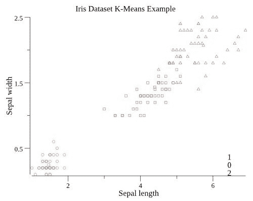
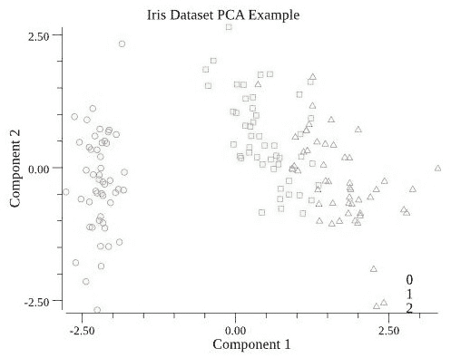

# 无监督学习

尽管大多数机器学习问题涉及标记数据，正如我们在上一章所看到的，还有一个重要的分支称为**无监督学习**。这适用于你可能没有输入数据标签的情况，因此算法不能通过尝试从每个输入预测输出标签来工作。相反，无监督算法通过尝试在输入中找到模式或结构来工作。当对具有许多不同输入变量的大型数据集进行探索性分析时，这可能是一种有用的技术。在这种情况下，绘制所有不同变量的图表以尝试发现模式将非常耗时，因此，可以使用无监督学习来自动完成这项工作。

作为人类，我们非常熟悉这个概念：我们做的许多事情从未被其他人明确地教给我们。相反，我们探索周围的世界，寻找并发现模式。因此，无监督学习对试图开发**通用智能**系统的研究人员特别感兴趣：能够独立学习所需知识的计算机^([1])。

在本章中，我们将介绍两种流行的无监督算法，并在 Go 语言中实现它们。首先，我们将使用**聚类算法**将数据集分割成不同的组，而不需要任何关于要寻找什么的指导。然后，我们将使用一种称为**主成分分析**的技术，通过首先在数据集中找到隐藏的结构来压缩数据集。

这只是对无监督学习能够实现的内容的表面触及。一些前沿算法能够使计算机执行通常需要人类创造力的任务。一个值得关注的例子是 NVIDIA 从草图创建逼真图片的系统^([2])。你还可以在网上找到可以改变图像外观的代码示例，例如，将马变成斑马，或将橙子变成苹果^([3])。

本章将涵盖以下主题：

+   聚类

+   主成分分析

# 聚类

聚类算法旨在将数据集分割成组。一旦训练完成，任何新数据在到达时都可以分配到相应的组中。假设你正在处理一个电子商务商店客户信息的数据集。你可能使用聚类来识别客户群体，例如，商业/私人客户。然后，可以使用这些信息来做出关于如何最好地服务这些客户类型的决策。

你也可以在应用监督学习之前使用聚类作为预处理步骤。例如，图像数据集可能需要手动标记，这通常既耗时又昂贵。如果你可以使用聚类算法将数据集分割成组，那么你可能可以通过只标记部分图像来节省时间，并假设每个簇包含具有相同标签的图像。

聚类技术也被应用于自动驾驶汽车的计算机视觉应用中，它可以用来帮助车辆在未知路段上导航。通过聚类车辆摄像头的图像数据，可以识别出每个输入图像中包含车辆必须行驶的道路的区域^([4])。

对于我们的示例，我们将使用一个包含不同类型鸢尾花测量数据的数据集，你可以使用代码仓库中的`./download-iris.sh`脚本来下载这个数据集。这个数据集通常用于演示监督学习：你可以使用机器学习来根据鸢尾花种类的特征对数据进行分类。然而，在这种情况下，我们不会向聚类算法提供标签，这意味着它必须纯粹从测量数据中识别聚类：

1.  首先，像之前示例中那样将数据加载到 Go 中：

```py
import (
 "fmt"
 "github.com/kniren/gota/dataframe"
 "github.com/kniren/gota/series"
 "io/ioutil"
 "bytes"
 "math/rand"
)

const path = "../datasets/iris/iris.csv"

b, err := ioutil.ReadFile(path)
if err != nil {
    fmt.Println("Error!", err)
}
df := dataframe.ReadCSV(bytes.NewReader(b))
df.SetNames("petal length", "petal width", "sepal length", "sepal width", "species")
```

1.  接下来，我们需要通过从数据中分割物种列来准备数据：这只是为了在聚类后对组进行最终评估。为此，使用之前示例中的`DataFrameToXYs`函数：

```py
features, classification := DataFrameToXYs(df, "species")
```

1.  现在，我们可以训练一个名为**k-means**的算法来尝试将数据集分为三个聚类。k-means 通过最初随机选择每个聚类的中间点（称为**质心**），并将训练集中的每个数据点分配到最近的质心来工作。然后它迭代地更新每个聚类的位置，在每一步重新分配数据点，直到达到收敛。

**k-means** 是一个简单的算法，训练速度快，因此在聚类数据时是一个好的起点。然而，它确实需要你指定要找到多少个聚类，这并不总是显而易见的。其他聚类算法，如 DBSCAN，没有这个限制。

使用 goml 中的 k-means 实现，我们可以在数据中尝试找到三个聚类。通常，你可能需要通过试错来找出要使用多少个聚类——K。如果你在运行 k-means 后有很多非常小的聚类，那么你可能需要减少 K：

```py
import (
    "gonum.org/v1/plot"
    "gonum.org/v1/plot/plotter"
    "gonum.org/v1/plot/plotutil"
    "gonum.org/v1/plot/vg"
    "github.com/cdipaolo/goml/cluster"
    "github.com/cdipaolo/goml/base"
    "bufio"
    "strconv"
)

model := cluster.NewKMeans(3, 30, features)

if err := model.Learn(); err != nil {
    panic(err)
}
```

一旦我们将模型拟合到数据上，我们就可以从中生成预测；也就是说，找出每个数据点属于哪个聚类：

```py
func PredictionsToScatterData(features [][]float64, model base.Model, featureForXAxis, featureForYAxis int) (map[int]plotter.XYs) {
    ret := make(map[int]plotter.XYs)
    if features == nil {
        panic("No features to plot")
    }

    for i := range features {
        var pt struct{X, Y float64}
        pt.X = features[i][featureForXAxis]
        pt.Y = features[i][featureForYAxis]
        p, _ := model.Predict(features[i])
        ret[int(p[0])] = append(ret[int(p[0])], pt)
    }
    return ret
}

scatterData := PredictionsToScatterData(features, model, 2, 3)
```

现在，我们可以使用以下代码绘制聚类图：

```py
func PredictionsToScatterData(features [][]float64, model base.Model, featureForXAxis, featureForYAxis int) (map[int]plotter.XYs) {
    ret := make(map[int]plotter.XYs)
    if features == nil {
        panic("No features to plot")
    }

    for i := range features {
        var pt struct{X, Y float64}
        pt.X = features[i][featureForXAxis]
        pt.Y = features[i][featureForYAxis]
        p, _ := model.Predict(features[i])
        ret[int(p[0])] = append(ret[int(p[0])], pt)
    }
    return ret
}

scatterData := PredictionsToScatterData(features, model, 2, 3)
```

这所做的就是使用输入特征中的两个，`花瓣宽度`和`花瓣长度`，来显示数据，如下面的图所示：



每个点的形状是根据鸢尾花种类设置的，而颜色是由 k-means 的输出设置的，即算法将每个数据点分配到哪个聚类。我们现在可以看到，聚类几乎完全匹配每个鸢尾花的种类：k-means 已经能够将数据细分为三个对应不同种类的不同组。

虽然 k-means 在这个案例中效果很好，但你可能会发现需要在你的数据集上使用不同的算法。Python 的 scikit-learn 库提供了一个有用的演示，说明了哪些算法在不同类型的数据集上效果最佳^([5])。你也可能会发现，以某种方式准备你的数据是有帮助的；例如，对其进行归一化或对其应用非线性变换。

# 主成分分析

**主成分分析** (**PCA**) 是一种降低数据集维度的方法。我们可以将其视为压缩数据集的一种方式。假设你的数据集中有 100 个不同的变量。可能的情况是，这些变量中的许多是相互关联的。如果是这样，那么通过组合变量来构建一个较小的数据集，就有可能解释数据中的大部分变化。PCA 执行这项任务：它试图找到输入变量的线性组合，并报告每个组合解释了多少变化。

PCA 是一种降低数据集维度的方法：实际上，通过总结它，你可以专注于最重要的特征，这些特征解释了数据集中大部分的变化。

PCA 在机器学习中有两种用途：

+   在应用监督学习方法之前，它可能是一个有用的预处理步骤。在运行 PCA 后，你可能会发现，例如，95% 的变化仅由少数几个变量解释。你可以使用这些知识来减少输入数据中的变量数量，这意味着你的后续模型将训练得更快。

+   在构建模型之前可视化数据集时，它也可能很有帮助。如果你的数据有超过三个变量，在图表上可视化它并理解它包含的图案可能非常困难。PCA 允许你转换数据，以便你只需绘制数据的最重要方面。

对于我们的示例，我们将使用 PCA 来可视化鸢尾花数据集。目前，这个数据集有四个输入特征：花瓣宽度、花瓣长度、萼片宽度和萼片长度。使用 PCA，我们可以将其减少到两个变量，然后我们可以轻松地在散点图上可视化它们。

1.  首先像之前一样加载花瓣数据，并按以下方式对其进行归一化：

```py
df = Standardise(df, "petal length")
df = Standardise(df, "petal width")
df = Standardise(df, "sepal length")
df = Standardise(df, "sepal width")
labels := df.Col("species").Float()
df = DropColumn(df, "species")
```

1.  接下来，我们需要将数据转换为矩阵格式。`gonum` 库有一个 `mat64` 类型，我们可以用它来完成这个任务：

```py
import (
    "github.com/gonum/matrix/mat64"
)

// DataFrameToMatrix converts the given dataframe to a gonum matrix
func DataFrameToMatrix(df dataframe.DataFrame) mat64.Matrix {
    var x []float64 //slice to hold matrix entries in row-major order

    for i := 0; i < df.Nrow(); i++ {
        for j := 0; j < df.Ncol(); j ++ {
            x = append(x, df.Elem(i,j).Float())
        } 
    }
    return mat64.NewDense(df.Nrow(), df.Ncol(), x)
}

features := DataFrameToMatrix(df)
```

PCA 通过寻找数据集的 **特征向量** 和 **特征值** 来工作。因此，大多数软件库需要数据以矩阵结构存在，以便可以使用标准线性代数例程，如 **blas** 和 **lapack** 来进行计算。

1.  现在，我们可以利用 gonum 的 `stat` 包来实现 PCA：

```py
model := stat.PC{}
if ok := model.PrincipalComponents(features, nil); !ok {
  fmt.Println("Error!")
}
variances := model.Vars(nil)
components := model.Vectors(nil)
```

这给我们提供了两个变量：`components`，这是一个矩阵，告诉我们如何将原始变量映射到新成分；以及`variances`，它告诉我们每个成分解释了多少方差。如果我们打印出每个成分的方差，我们可以看到前两个成分解释了整个数据集的 96%（成分 1 解释了 73%，成分 2 解释了 23%）：

```py
total_variance := 0.0
for i := range variances {
  total_variance += variances[i]
}

for i := range variances {
  fmt.Printf("Component %d: %5.3f\n", i+1, variances[i]/total_variance)
}
```

1.  最后，我们可以将数据转换成新的成分，并保留前两个，以便我们可以用于可视化：

```py
transform := mat64.NewDense(df.Nrow(), 4, nil)
transform.Mul(features, components)

func PCAToScatterData(m mat64.Matrix, labels []float64) map[int]plotter.XYs {
    ret := make(map[int]plotter.XYs)
    nrows, _ := m.Dims()
    for i := 0; i < nrows; i++ {
        var pt struct{X, Y float64}
        pt.X = m.At(i, 0)
        pt.Y = m.At(i, 1)
        ret[int(labels[i])] = append(ret[int(labels[i])], pt)
    }
    return ret
} 

scatterData := PCAToScatterData(transform, labels)
```

以下图表显示了每个数据点根据前两个主成分，而颜色表示每个数据点属于哪种鸢尾花物种。现在我们可以看到，三个组沿着第一个成分形成了明显的带状区域，这在将四个原始输入特征相互绘制时我们不容易看到：



你现在可以尝试训练一个监督学习模型，使用前两个 PCA 特征来预测鸢尾花物种：将其性能与在所有四个输入特征上训练的模型进行比较。

# 摘要

在本章中，我们介绍了无监督机器学习中的两种常见技术。这两种技术通常被数据科学家用于探索性分析，但也可以作为生产系统中数据处理管道的一部分。你学习了如何训练聚类算法自动将数据分组。这项技术可能被用于对电子商务网站上新注册的客户进行分类，以便他们能够获得个性化的信息。我们还介绍了主成分分析作为压缩数据的方法，换句话说，降低其维度。这可以用作在运行监督学习技术之前的数据预处理步骤，以减少数据集的大小。

在这两种情况下，都可以利用`gonum`和`goml`库在 Go 语言中以最少的代码构建高效的实现。

# 进一步阅读

1.  [`deepmind.com/blog/unsupervised-learning/`](https://deepmind.com/blog/unsupervised-learning/). 2019 年 4 月 12 日检索。

1.  [`blogs.nvidia.com/blog/2019/03/18/gaugan-photorealistic-landscapes-nvidia-research/`](https://blogs.nvidia.com/blog/2019/03/18/gaugan-photorealistic-landscapes-nvidia-research/). 2019 年 4 月 12 日检索。

1.  [`github.com/junyanz/CycleGAN`](https://github.com/junyanz/CycleGAN). 2019 年 4 月 12 日检索。

1.  [`robots.stanford.edu/papers/dahlkamp.adaptvision06.pdf`](http://robots.stanford.edu/papers/dahlkamp.adaptvision06.pdf). 2019 年 4 月 13 日检索。

1.  [`scikit-learn.org/stable/modules/clustering.html#overview-of-clustering-methods`](https://scikit-learn.org/stable/modules/clustering.html#overview-of-clustering-methods). 2019 年 4 月 12 日检索。
