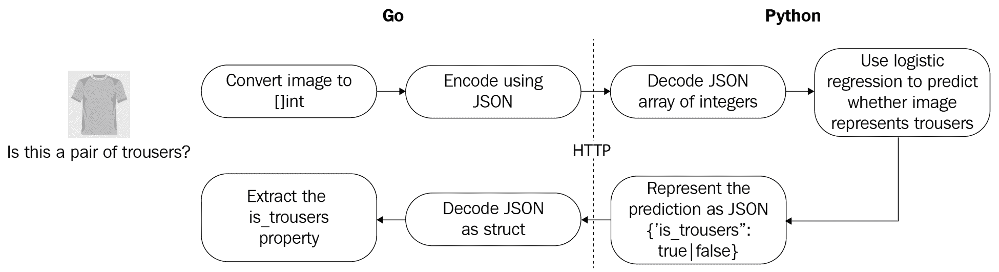

# 使用预训练模型

在前两章中，你学习了如何使用监督 ML 算法 (第三章，*监督学习*) 和无监督 ML 算法 (第四章，*无监督学习*) 解决广泛的问题。创建的解决方案从头开始创建模型，并且仅由 Go 代码组成。我们没有使用已经训练好的模型，也没有尝试从 Go 中调用 Matlab、Python 或 R 代码。然而，在某些情况下，这可能会很有益。在本章中，我们将介绍几种旨在使用预训练模型和创建多语言 ML 应用程序（即主要应用程序逻辑是用 Go 编写的，但专业技术和模型可能用其他语言编写）的策略。

在本章中，你将了解以下主题：

+   如何加载预训练的 GoML 模型并使用它来生成预测

+   何时考虑使用纯 Go 解决方案或多语言解决方案

+   如何使用 os/exec 包调用用其他语言编写的 ML 模型

+   如何使用 HTTP 调用用其他语言编写的 ML 模型，这些模型可能位于不同的机器上，甚至跨越互联网

+   如何使用 Go 的 TensorFlow API 运行 TensorFlow 模型

# 如何恢复保存的 GoML 模型

一旦你投入了创建 ML 模型的辛勤工作，你可能需要关闭你的电脑。当电脑重启时，你的模型会发生什么？除非你已经将其持久化到磁盘，否则它将消失，你需要重新开始训练过程。即使你在 gophernotes 笔记本中保存了模型的超参数，模型本身也没有被保存。而且如果训练过程很长，你可能需要等待很长时间，模型才能再次使用。

在下面的示例中，我们将解释如何恢复我们在第三章，*监督学习*中创建的模型，并将其使用 GoML API 提供的 `PersistToFile` 方法持久化到本地的 `model.dat` 文件中。我们将使用其 `RestoreFromFile` 方法来恢复它。我们将假设我们在第三章，*监督学习*中创建的所有其他 func 都可用，例如将图像转换为浮点数切片：

```py
// IsImageTrousers invokes the Saved model to predict if image at given index is, in fact, of trousers
// For simplicity, this loads the model from disk on every request, whereas loading it once and caching it
// would be preferable in a commercial application.

func IsImageTrousers(i int) (bool, error) {
  model := linear.Logistic{}
  if err := model.RestoreFromFile("model.dat"); err != nil {
    return false, err
  }
  prediction, err := model.Predict(testImages[i])
  return prediction > 0.5, err
}
```

我们现在可以使用此代码在 gophernotes 中生成预测，并将其与 `Label` 列中的真实值进行比较：

```py
// Prediction

IsImageTrousers(16)
```

在 gophernotes 中运行前面的代码单元将产生以下输出：

```py
true <nil>
```

让我们检查输出：

```py
// Ground truth

df.Col("Label").Elem(16).Int() == 1

```

我们也可以使用在第三章中介绍的相同验证技术，即*监督学习*，来检查输出质量是否符合预期。当模型是用 Go 编写的并且被持久化以便稍后重用时，这种方法非常有效。然而，如果模型是用 Python 编写的且无法直接在 Go 中恢复（例如`scikit-learn`模型就是这样），使用该模型进行预测的唯一方法可能是设计一些 Python 模型和 Go 应用之间的通信。虽然这增加了应用程序的整体复杂性，但它具有显著的优势，我们将在接下来的章节中讨论。

# 决定何时采用多语言方法

如前几章所见，Go 生态系统提供了丰富的机会来原生地解决机器学习问题。然而，固执地要求解决方案保持纯 Go 可能会增加开发时间，甚至降低训练性能，因为其他更专业的 ML 库可以提供更高层次的 API 或性能优化，而这些优化尚未在相应的 Go 库中实现。

一个很好的例子是 Python ML 库 Keras。这个库的目的是提供一个高级 API，允许作者执行各种 ML 任务，如数据预处理、模型训练、模型验证和持久化。它的抽象在多个后端有具体的实现，例如 TensorFlow，这些后端都以其高性能而闻名。因此，Keras 是任何语言中最受欢迎的 ML 库之一：其 MIT 许可的 GitHub 仓库有超过 40,000 颗星，在 GitHub 上的搜索结果显示，超过 20,000 个仓库匹配搜索词 keras，这意味着仓库的名称包含这个词。对代码内容的搜索显示，GitHub 上超过一百万个文件包含搜索词 keras。

然而，仅仅为了使用一个库而将整个应用程序用 Python 编写，无法充分利用 Go 提供的优势，这些优势我们在第一章中已列举，即*用 Go 介绍机器学习*。如果这些因素对您应用程序的开发并不重要，那么当然可以创建一个 Python 应用程序，但在接下来的内容中，我们将假设您希望两者兼得。

因此，出现了两种选择：首先，完全用 Go 开发应用程序。其次，用 Python 开发 ML 模型，然后从您的 Go 代码中调用这个模型，其中将包含主要的应用程序和业务逻辑。在一个以生产就绪产品为目标的企业环境中，这两种选择的优点如下：

**纯 Go 应用**：

+   相比多语言解决方案更容易维护

+   应用组件交互的复杂性降低，因为不需要管理外部 ML 组件的调用

+   更容易吸纳团队成员

+   更少的依赖需要更新

现有的库可能直接提供所需的功能并具有足够的性能，从而消除了使用其他语言中专用库所获得的优势。

**多语言应用**：

+   使用其他语言中专家库的高级抽象，可以大幅减少复杂机器学习问题所需的代码量

+   在某些情况下，性能优势可能并不明显，因为一些 GoML 库并不是为了追求极致的速度而设计的（深度学习就是一个很好的例子）

+   更适合多团队协作，因为数据科学团队对 Python 或 R 库更为熟悉

+   利用现有模型——学术研究论文通常发布带有 Python 或 Lua 脚本的 Caffe 或 TensorFlow 模型，以便调用它们

总结来说，对于现有 Go 库能够直接提供所需功能或只需稍作修改的机器学习应用，原生 Go 解决方案可以降低应用复杂性并提高可维护性。然而，如果情况并非如此，尤其是对于深度学习、计算机视觉等非常复杂的问题，结合 Go 与其他语言的最新工具是值得增加的复杂性的。

在接下来的示例中，我们将从 Go 应用程序中调用各种 Python 机器学习模型。我们选择 Python 的原因是 Python 在大多数 Linux 发行版中都是预安装的，并且也是机器学习中最流行的语言[4][5]。我们将描述的解决方案可以应用于任何编程语言编写的模型。

# 示例 - 使用 os/exec 调用 Python 模型

要开始使用多语言机器学习应用，我们将回顾第三章中的逻辑回归示例，*监督学习*。我们将假设模型是用 Python 编写的，而不是 Go，并且我们希望从我们的 Go 应用程序中调用它。为此，我们将使用命令行参数将输入传递给模型，并从**标准输出**（**STDOUT**）读取模型的预测。

为了在 Python 和 Go 之间交换数据，我们将使用**JavaScript 对象表示法**（**JSON**）格式化的字符串。当然，这个选择是任意的，我们本可以选择 Go 和 Python 标准库支持的任何其他格式，例如 XML，或者发明我们自己的。JSON 的优势在于在两种语言中使用它都几乎不需要做任何努力。

我们将与 Python 子进程通信的过程如下。一般来说，有三个步骤：请求序列化、执行子进程和响应反序列化：


图 1：我们用于与运行预训练逻辑回归模型的 Python 子进程通信的过程

我们将首先加载 MNIST 数据集并将其转换为数据框。您可以在 第三章，*监督学习* 中找到此代码。然而，这一次，我们将图像数据转换为整数的切片，每个整数介于 0 和 255（每个像素的值）之间，而不是浮点数的切片。这是为了确保与 Python 模型保持一致：

```py
// ImageSeriesToInts converts the dataframe's column containing image data for multiple images to a slice of int slices, where each int is between 0 and 255, representing the value of the pixel.

func ImageSeriesToInts(df dataframe.DataFrame, col string) [][]int {

  s := df.Col(col)

  ret := make([][]int, s.Len(), s.Len())

  for i := 0; i < s.Len(); i++ {

    b := []byte(s.Elem(i).String())

    ret[i] = NormalizeBytes(b)

  }

  return ret

}
```

接下来，我们将介绍一个函数，它将允许我们启动 Python 子进程并等待其完成：

```py
// InvokeAndWait invokes a Python 3 script with the given arguments, waits for it to finish, and returns the concatenated output of its STDOUT and STERRR.
func InvokeAndWait(args ...string) ([]byte, error) {
  var (
    output []byte
    errOutput []byte
    err error
  )
  cmd := exec.Command("python3", args...)
  stdout, err := cmd.StdoutPipe()
  if err != nil {
    return nil, err
  }
  stderr, err := cmd.StderrPipe()
  if err := cmd.Start(); err != nil {
    return nil, err
  }
  if output, err = ioutil.ReadAll(stdout); err != nil {
    return nil, err
  }
  if errOutput, err = ioutil.ReadAll(stderr); err != nil || len(errOutput) > 0 {

    return nil, fmt.Errorf("Error running model: %s", string(errOutput))
  }
  return output, nil
}
```

现在，我们已经准备好组装我们的预测函数，该函数将序列化图像数据，在启动时将其作为参数传递给子进程，等待子进程完成，并反序列化响应：

```py
// IsImageTrousers invokes the Python model to predict if image at given index is, in fact, of trousers

func IsImageTrousers(i int) (bool, error){
    b, err := json.Marshal(testImages[i])
    if err != nil {
        panic(err)
    }
    b, err = InvokeAndWait("model.py", "predict", string(b))
    if err != nil {
        return false, err
    } else {
        var ret struct {
            IsTrousers bool `json:"is_trousers"`
        }
        err := json.Unmarshal(b, &ret)
        if err != nil {
            return false, err
        }
        return ret.IsTrousers, nil
    }
}
```

现在，我们可以在 gophernotes 中使用此代码生成预测，并将其与 `Label` 列中的真实值进行比较：

```py
// Prediction
IsImageTrousers(16)
```

在 gophernotes 单元中运行此代码提供以下输出：

```py
true <nil>
```

让我们检查输出：

```py
// Ground truth
df.Col("Label").Elem(16).Int() == 1
```

如预期，这输出了 `true`。我们可以对几个不同的图像重复此操作，以获得一些信心，确保一切按预期工作。Go 和 Python 代码都使用 `predict` 参数来表示应该执行哪个操作 - 我们也可以有一个 `test` 操作，该操作检查 Python 代码从其参数重构的图像是否正确，这进一步增加了我们对子进程通信正确的信心。

子进程通信可能具有操作系统特定的特性，尤其是在涉及输出重定向时。Go 的一个优点是，我们在这里提出的管道方法在所有操作系统上都能同样很好地工作，无需额外修改，而其他语言如 Python 有时需要额外的工作。

虽然代码简洁且易于调试，但每次请求都需要启动一个新的 Python 进程来处理，这可能会影响具有较小、较快的模型的应用程序的性能。此外，它还在 Go 应用程序和其 Python 模型之间创建了一个相当紧密的耦合。在较大的团队中，这可能是一个问题，其中数据科学团队创建模型，而软件开发团队创建应用程序的其他部分。它也可能在模型应该暴露给多个应用程序，而不仅仅是单个应用程序的情况下造成问题 - 那时你应该怎么做？为每个应用程序保留模型的一个副本？这可能导致可维护性问题。在下面的示例中，我们将探讨一种将 Go 应用程序与其 Python 模型解耦的方法。

# 示例 - 使用 HTTP 调用 Python 模型

如果模型位于不同的机器上，我们需要解耦 Go 和模型逻辑，或者如果我们希望执行多个操作，例如根据用户数据训练用户特定的模型，然后使用此模型进行预测，会发生什么？在这些情况下，随着我们添加更多参数来区分操作和返回码，我们之前使用命令行参数的解决方案将变得更加复杂。这种调用通常被称为**远程过程调用**（RPC），像 SOAP 或 JSON-RPC 这样的解决方案已经为业界所熟知数十年^([7])。

在以下示例中，我们将使用一个更通用和通用的协议：HTTP。严格来说，HTTP 是一个数据传输协议，通常用作 RPC 协议的管道。然而，只需一点努力，我们就可以在 HTTP 之上创建自己的最小 RPC，通过暴露一个将接受 POST 请求的单个端点。这有一个优点，即不需要 Python 或 Go 标准库之外的任何依赖项，并且调试协议错误特别简单。缺点是处理序列化等问题需要更多的工作。

我们将遵循的请求/响应过程如下所示：



图 2：GoML 应用程序使用 HTTP 与预训练的 Python 模型进行通信的请求/回复过程

与之前的例子不同，我们假设 Python HTTP 服务器已经运行。如果你正在跟随配套的存储库，你可以在使用`install-python-dependencies.sh`安装其依赖项后，使用`python3 model_http.py`命令启动 Python 服务器。这意味着 Go 代码特别简短：

```py
// Predict returns whether the ith image represents trousers or not based on the logistic regression model

func Predict(i int) (bool, error){
    b, err := json.Marshal(testImages[i])
    if err != nil {
        return false, err
    }
    r := bytes.NewReader(b)
    resp, err := http.Post("http://127.0.0.1:8001", "application/json", r)
    if err != nil {
        return false, err
    }
    body, err := ioutil.ReadAll(resp.Body)
    if err != nil {
        return false, err
    }
    resp.Body.Close()
    var resp struct {
        IsTrousers bool `json:"is_trousers"`
    }
    err := json.Unmarshal(body, &resp)
    return resp.IsTrousers, err 
}
```

正如我们之前所做的那样，我们可以生成一些预测以确保 Go 和 Python 进程之间的通信按预期工作：

```py
// Expected: true <nil>

Predict(16)
```

如预期的那样，我们得到了以下结果：

```py
true <nil>
```

我们可以继续这个过程，对其他几个图像进行测试，以确保响应与由`df.Col("Label")`系列定义的地面真实值相匹配。我们也可以在我们的 Python HTTP 服务器上创建多个 HTTP 端点，以允许进行各种测试，从而进一步增强我们对进程间通信的信心。

在你很可能需要调试与 HTTP 服务器通信的情况下，Postman 是一个伟大的工具，这是一个免费的图形用户界面工具，允许你创建 HTTP 请求并检查响应。你可以在以下地址获取 Postman：

[`www.getpostman.com/`](https://www.getpostman.com/).

在之前的例子中，我们假设模型是在不同的编程语言（Python）中创建的，并且只能从该语言访问。然而，有一些流行的深度学习库一直在努力成为多语言库，因此提供了使用一种语言创建模型并使用另一种语言使用它的方法。在接下来的例子中，我们将查看这些库中的两个。

# 示例 - 使用 TensorFlow API 进行 Go 的深度学习

深度学习是机器学习的一个子领域，它使用通常具有许多层的神经网络来解决复杂问题，如图像或语音识别。在这个例子中，我们将探讨如何利用 TensorFlow，一个流行的深度学习框架，通过其 Go 绑定来实现这一点。

TensorFlow 是一个高度优化的库，由 Google 创建，用于对称为张量的对象进行计算^([8])。如果一个向量是一组标量条目（数字）的集合，而一个矩阵是一组向量的集合，那么张量可以被视为一个更高维度的矩阵，其中标量、向量和矩阵是特殊情况。虽然这可能看起来有些抽象，但张量是描述神经网络时的自然对象，这也是为什么 TensorFlow 成为最受欢迎的库之一——甚至有些评论家认为它是最受欢迎的，用于商业和学术深度学习开发^([9][10])。

2011 年，Google Brain 团队构建了一个专有的深度学习系统，名为 DistBelief^([11])。许多杰出的计算机科学家，如 Jeff Dean 和 Geoffrey Hinton，参与了其反向传播和其他神经网络相关算法的工作，这导致 Google 许多项目中框架的使用量增加。2017 年，这个框架的第二代，现在称为 TensorFlow，以开源许可证发布^([12])。

TensorFlow 在核心上是一个低级 API，也称为深度学习计算的底层后端。从实际的角度来看，一个处理商业问题的数据科学家通常不需要每天直接与 TensorFlow API 交互。相反，有多个前端，例如我们之前介绍过的 Keras，作为 TensorFlow 的高级抽象，提供了性能和易用性两方面的最佳选择。另一方面，在学术研究中，新类型的神经网络架构通常使用低级 API 进行，因为新的结构还没有抽象存在。你创建的 TensorFlow 中的对象，称为**图**，可以持久化并在其他语言中重用，这得益于最近使框架更加多语言化的努力^([13])。

在这个例子中，我们将解释如何安装 TensorFlow 以及如何使用其 Go API 加载预训练的 TensorFlow 模型并使用它进行预测。

# 安装 TensorFlow

TensorFlow 的体验通常很流畅——也就是说，在你成功安装它之后。TensorFlow 团队认识到这是一个困难的步骤，从源代码构建 TensorFlow 在最佳情况下通常需要数小时，因此他们现在提供了几个简单的安装选项。值得注意的是，如果你系统中有兼容的 GPU，你应该安装 GPU 选项，因为这通常可以显著加速软件，这在训练阶段尤其明显：

+   **使用 pip 安装**：TensorFlow 旨在为 Python 程序员提供支持，他们通常会使用`pip`来管理他们的包。在撰写本文时，这种方法已在 Ubuntu Linux 16.04 或更高版本、macOS 10.12.6（Sierra）或更高版本（尽管没有 GPU 支持）、Raspbian 9.0 或更高版本以及 Windows 7 或更高版本上进行了测试。

+   **使用 Docker 镜像**：这将适用于支持 Docker 的广泛系统。有两个镜像可供选择：一个纯 TensorFlow 镜像和一个包含 Jupyter 的镜像，这允许你拥有与 gophernotes 相同但仅使用 Python 的体验。

+   **从源代码构建**：如果你使用的是非标准配置或者想要对构建过程的部分进行特定控制（例如利用一些只适用于你特定配置的优化），这是最佳选择。

此外，还有一种第四种选择，即使用 Google Colaboratory 在 Google 的云中运行基于 TensorFlow 的代码，但我们将不会深入探讨这个选项，因为它目前仅支持 Python。

在这个例子中，我们将使用 Docker 镜像。Docker 可以被视为一种在相同机器上打包和运行多个应用程序（称为容器）的解决方案，同时确保它们不会相互干扰。如果你还不熟悉它，请访问[`docs.docker.com/get-started/`](https://docs.docker.com/get-started/)获取五分钟教程。

我们将使用名为`tensorflow/tensorflow`的纯 TensorFlow-on-Ubuntu 镜像，它不包括 Jupyter。我们需要在这个镜像上安装 Go，以便我们可以运行我们的代码。由于我们的代码将依赖于 Go 的 TensorFlow 绑定，我们还将根据官方说明^([14])安装它们。这将要求我们安装 TensorFlow C 绑定。因此，我们的 Dockerfile 将如下所示。为了简洁起见，一些步骤已被省略——你可以在本书的配套仓库中找到完整的 Dockerfile：

```py
FROM tensorflow/tensorflow

## Install gcc for cgo ##
RUN apt-get update && apt-get install -y --no-install-recommends \
 curl \
 git \
 wget \
 g++ \
 gcc \
 libc6-dev \
 make \
 pkg-config \
 && rm -rf /var/lib/apt/lists/*

## Install TensorFlow C library ##
RUN curl -L \
 "https://storage.googleapis.com/tensorflow/libtensorflow/libtensorflow-cpu-linux-x86_64-1.13.1.tar.gz" | \
 tar -C "/usr/local" -xz
RUN ldconfig

## Install Go ##
ENV GOLANG_VERSION 1.9.2

RUN wget -O go.tgz "https://golang.org/dl/go${GOLANG_VERSION}.${goRelArch}.tar.gz"; \
 echo "${goRelSha256} *go.tgz" | sha256sum -c -; \
 tar -C /usr/local -xzf go.tgz; \
 rm go.tgz; \
 \
 if [ "$goRelArch" = 'src' ]; then \
 echo >&2; \
 echo >&2 'error: UNIMPLEMENTED'; \
 echo >&2 'TODO install golang-any from jessie-backports for GOROOT_BOOTSTRAP (and uninstall after build)'; \
 echo >&2; \
 exit 1; \
 fi; \
 \
 export PATH="/usr/local/go/bin:$PATH"; \
 go version

ENV GOPATH /go
ENV PATH $GOPATH/bin:/usr/local/go/bin:$PATH

RUN mkdir -p "$GOPATH/src" "$GOPATH/bin" && chmod -R 777 "$GOPATH"

## Go get tensorflow go library ##
RUN \
 go get github.com/tensorflow/tensorflow/tensorflow/go \
 github.com/tensorflow/tensorflow/tensorflow/go/op

## Set up the environment so we can just run our code ##
RUN mkdir $GOPATH/src/model

WORKDIR $GOPATH/src/model

ADD . $GOPATH/src/model

CMD ["go", "run", "main.go"]
```

# 导入预训练的 TensorFlow 模型

在第三章《监督学习》中，我们解释了如何使用 go-deep 库在纯 Go 中创建深度学习模型。虽然这作为一个玩具示例是可行的，但它训练速度很慢，并且需要大量的冗余代码。使用行业领先的深度学习库之一会更容易，并且会产生性能更好的代码，但不幸的是，它们是用其他语言编写的。我们使用 Python 库 Keras 创建了一个深度学习模型，它将作为之前我们研究过的相同问题的分类器：*给出的图像是裤子吗？*现在我们将编写一些 Go 代码来导入我们的预训练模型。

如果只保存了模型的权重而不是更完整的 SavedModel 格式，会怎样呢？在这种情况下，你仍然可以使用`graph.Import`函数导入它，但随后需要做更多的工作来告诉 TensorFlow 所有操作和变量。TensorFlow API godocs 中有一个示例说明了这个过程^([15])。

以下假设模型是以`SavedModel`格式保存的，并且我们知道输入和输出`Ops`的名称。如果模型是由其他人使用 Keras 或另一个第三方库创建的，这有时可能很棘手。一个选项是使用`SavedModel`命令行界面工具来检查模型^([16])。

如果模型是在 Keras 中创建的，并且你有访问 Python 代码的权限，只需检查其`input`和`output`属性以查看相应张量的名称。它们可能附加了`:0`，你可以忽略它。

要在 Go 中恢复`SavedModel`，只需使用`LoadSavedModel`函数。这将返回一个 Graph 和 Session 对象，然后你可以对其进行操作，传递输入并检索输出：

```py
savedModel, err := tf.LoadSavedModel("./saved_model", []string{"serve"}, nil)
if err != nil {
  log.Fatalf("failed to load model: %v", err)
}
```

注意，第二个参数，称为标签，通常按惯例设置。我们现在可以访问输入和输出操作：

```py
input := savedModel.Graph.Operation("input_input_1")
output := savedModel.Graph.Operation("output_1/BiasAdd")
```

如果在这个阶段输入或输出是 nil，这意味着你没有正确的名称，因此你需要返回检查模型以找出它们应该是什么。查看`savedModel.Graph.Operations`也可能很有用，这是一个`Operation`切片，你可以通过在`Name()`中包含搜索字符串输入来过滤操作列表。

我们现在可以访问恢复的会话和图：

```py
session := savedModel.Session
graph := savedModel.Graph
defer session.Close()
fmt.Println("Successfully imported model!")
```

现在，我们可以在 TensorFlow Docker 容器中运行此代码并查看结果。我们将从 Dockerfile 构建 Docker 镜像并运行它：

```py
docker build -t tfgo . && \
docker run -it tfgo
```

如果一切顺利，在容器构建过程中应该会看到一些输出（这将在第二次运行时运行得更快），最后会有以下消息：

```py
Successfully built 9658a6232ef8
Successfully tagged tfgo:latest
Successfully imported model!
```

前两行告诉我们我们的 Docker 镜像已成功构建，最后一行来自我们的 Go 代码，并告诉我们模型导入操作没有产生任何错误。

根据你如何安装 Docker，你可能需要超级用户权限来运行这些命令，所以如果需要，只需在它们前面加上`sudo`。

# 创建 TensorFlow 模型的输入

现在我们能够从`SavedModel`重新创建 TensorFlow 图和会话，我们将创建一个程序，该程序将接受 MNIST 时尚数据集的图像作为字节数组，并使用这些字节填充我们之前加载的模型的输入。然后，我们将能够运行模型以获得输出预测。

我们必须创建一个程序，该程序将接受 MNIST 时尚数据集的图像并返回正确形状的张量。从第三章，*监督学习*，我们知道模型将期望一个包含 784 个浮点数的切片，并且检查模型（使用 Python 中的`model.summary`或`SavedModel` CLI）将揭示输入应该是 1 x 784 个`float32`值的张量。

当通过将切片的切片作为参数传递给`NewTensor`函数来构造张量时，请确保它们的长度都相同。例如，你可以传递包含 7 个元素的 3 个切片，这将创建一个(3,7)的张量，但不能传递包含 5、6 和 7 个元素的 3 个切片——所有切片的第二维必须相同。

我们可以这样构造具有正确形状的空白（零）张量：

```py
func makeBlankInputTensor() (*tf.Tensor, error) {
  t := make([][]float32, 1)
  t[0] = make([]float32, 784)
  tensor, err := tf.NewTensor(t)
  return tensor, err
}
```

虽然这本身并不很有用，但它说明了`NewTensor`函数的使用，该函数可以从传递给它的 Go `interface{}`中推断出正确的张量形状和值类型。使用我们在第三章，*监督学习*中引入的`ImageSeriesToFloats`函数，我们可以轻松地将图像转换为`float32`切片，从而创建输入张量。

我们可以运行模型以获取预测：

```py
tensor, err := makeTensorFromImage("/path/to/fashion/MNIST", 12)
if err != nil {
  log.Fatal(err)
}
prediction, err := session.Run(
  map[tf.Output]*tf.Tensor{
    graph.Operation(input.Name()).Output(0): tensor,
  },
  []tf.Output{
    graph.Operation(output.Name()).Output(0),
  },
  nil)
if err != nil {
  log.Fatal(err)
}

probability := prediction[0].Value().([][]float32)[0][0]
if probability > 0.5 {
  fmt.Printf("It's a pair of trousers! Probability: %v\n", probability)
} else {
  fmt.Printf("It's NOT a pair of trousers! Probability: %v\n", probability)
}
```

例如，当使用空张量作为输入运行时，输出的最后几行如下：

```py
Successfully built b7318b44f92d
Successfully tagged tfgo:latest
Successfully imported model!
It's NOT a pair of trousers! Probability: 0.04055497
```

在下一章中，我们将更详细地探讨使用 Docker 部署 ML 应用程序工作负载的模式。

# 摘要

在本章中，我们从实际的角度比较了 Go-only 和 polyglot ML 解决方案，对比了它们的优缺点。然后，我们提出了两个通用的解决方案来开发 polyglot ML 解决方案：os/exec 包和 JSON-RPC。最后，我们探讨了两个具有自己基于 RPC 的集成解决方案的高度专业化的库：TensorFlow 和 Caffe。您已经学习了如何决定在您的应用程序中是否使用 Go-only 或 polyglot 方法进行 ML，如何实现基于 RPC 的 polyglot ML 应用程序，以及如何从 Go 运行 TensorFlow 模型。

在下一章中，我们将介绍 ML 开发生命周期的最后一步：将用 Go 编写的 ML 应用程序投入生产。

# 进一步阅读

1.  *Keras GitHub 仓库*：[`github.com/keras-team/keras`](https://github.com/keras-team/keras)。检索日期：2019 年 4 月 30 日。

1.  *GitHub 搜索 keras*：[`github.com/search?utf8=%E2%9C%93&q=keras&type=`](https://github.com/search?utf8=%E2%9C%93&q=keras&type=)。检索日期：2019 年 4 月 30 日。

1.  *GitHub 内容搜索 keras*：[`github.com/search?q=keras&type=Code`](https://github.com/search?q=keras&type=Code)。检索日期：2019 年 4 月 30 日。

1.  *Python 成为世界上最受欢迎的编程语言*, 《经济学人》。2018 年 7 月 26 日: [`www.economist.com/graphic-detail/2018/07/26/python-is-becoming-the-worlds-most-popular-coding-language.`](https://www.economist.com/graphic-detail/2018/07/26/python-is-becoming-the-worlds-most-popular-coding-language) 2019 年 4 月 30 日检索。

1.  *在 Unix 平台上使用 Python*: [`docs.python.org/2/using/unix.html`](https://docs.python.org/2/using/unix.html). 2019 年 4 月 30 日检索。

1.  *JSON*: [`www.json.org/`](https://www.json.org/). 2019 年 4 月 30 日检索。

1.  *Cover Pages – SOAP*: [`xml.coverpages.org/soap.html`](http://xml.coverpages.org/soap.html). 2019 年 4 月 30 日检索。

1.  *TensorFlow Core*: [`www.tensorflow.org/overview/`](https://www.tensorflow.org/overview/). 2019 年 4 月 30 日检索。

1.  *深度学习框架功率评分*: [`towardsdatascience.com/deep-learning-framework-power-scores-2018-23607ddf297a`](https://towardsdatascience.com/deep-learning-framework-power-scores-2018-23607ddf297a). 2019 年 4 月 30 日检索。

1.  *排名前列的深度学习框架*: [`blog.thedataincubator.com/2017/10/ranking-popular-deep-learning-libraries-for-data-science/`](https://blog.thedataincubator.com/2017/10/ranking-popular-deep-learning-libraries-for-data-science/). 2019 年 4 月 30 日检索。

1.  Dean, Jeff et. al. *大规模异构分布式系统上的机器学习*. 2015 年 11 月 9 日. [`download.tensorflow.org/paper/whitepaper2015.pdf`](http://download.tensorflow.org/paper/whitepaper2015.pdf). 2019 年 4 月 30 日检索。

1.  *TensorFlow* `RELEASE.md`: [`github.com/tensorflow/tensorflow/blob/07bb8ea2379bd459832b23951fb20ec47f3fdbd4/RELEASE.md`](https://github.com/tensorflow/tensorflow/blob/07bb8ea2379bd459832b23951fb20ec47f3fdbd4/RELEASE.md). 2019 年 4 月 30 日检索。

1.  *TensorFlow 在其他语言中的使用*: [`www.tensorflow.org/guide/extend/bindings`](https://www.tensorflow.org/guide/extend/bindings). 2019 年 4 月 30 日检索。

1.  *为 Go 安装 TensorFlow*: [`www.tensorflow.org/install/lang_go `](https://www.tensorflow.org/install/lang_go). 2019 年 5 月 1 日检索。

1.  *TensorFlow—godocs*: [`godoc.org/github.com/tensorflow/tensorflow/tensorflow/go`](https://godoc.org/github.com/tensorflow/tensorflow/tensorflow/go). 2019 年 5 月 3 日检索。

1.  *保存和恢复*: [`www.tensorflow.org/guide/saved_model#install_the_savedmodel_cli`](https://www.tensorflow.org/guide/saved_model#install_the_savedmodel_cli). 2019 年 5 月 3 日检索。

1.  *Tag constants*: [`github.com/tensorflow/tensorflow/blob/master/tensorflow/python/saved_model/tag_constants.py`](https://github.com/tensorflow/tensorflow/blob/master/tensorflow/python/saved_model/tag_constants.py). 2019 年 5 月 22 日检索。
