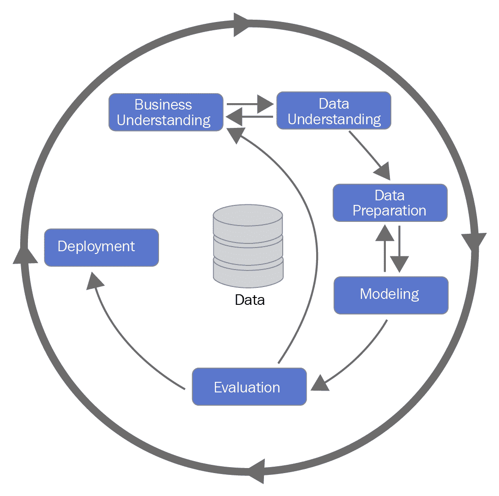

# 结论 - 成功的机器学习项目

到目前为止，在这本书中，我们主要关注如何在 Go 语言中准备和使用机器学习算法。这包括在第二章“设置开发环境”中准备数据，以及在第三章“监督学习”和第四章“无监督学习”中使用数据来构建模型。我们还探讨了如何在第五章“使用预训练模型”中将现有的机器学习模型集成到 Go 应用中。最后，我们在第六章“部署机器学习应用”中介绍了如何将机器学习集成到生产系统中。为了总结，我们将探讨典型项目中的不同阶段，以及如何管理开发和部署成功的机器学习系统的端到端流程。

人工智能专家安德烈·卡帕尔蒂（Andrej Karparthy）已经写了一些关于如何使用机器学习来简化以前非常复杂的系统。通常，让机器从数据中学习比在代码中表达所有需要的逻辑要简单得多。例如，谷歌的自动翻译应用通过使用神经网络系统，将传统的 500,000 行代码简化为 500 行机器学习代码。从传统代码转换为机器学习系统需要不同的技能集，以及软件开发的不同方法。

大多数关于机器学习（ML）的技术文献都集中在如何优化或选择模型以实现最佳性能，这种性能是通过测试数据集来衡量的。虽然这在推进最先进的机器学习方面很重要，但大多数现实世界的项目将根据非常不同的标准成功或失败。例如，理解如何将业务需求最佳地转化为机器学习任务，了解你的机器学习系统的局限性，以及如何最好地管理设计和维护机器学习应用的整体流程，这些都是至关重要的。

在本章中，我们将涵盖以下主题：

+   何时使用机器学习

+   机器学习项目的典型阶段

+   何时将机器学习与传统代码结合使用

# 何时使用机器学习

在任何新项目的开始阶段，你需要确定机器学习是否是正确的方法。这取决于三个关键因素：

+   首先，理解你的业务需求，以及它是否确实可以通过机器学习来解决，这是至关重要的。考虑你项目的目标是什么。例如，你是否希望降低目前需要大量人工工作和成本的过程的成本？你是否试图为最终客户提供更好的体验，例如，通过添加使用传统代码构建将花费太多时间的个性化功能？

+   接下来，问问自己您是否拥有使您提出的机器学习系统运行所需的数据。如果没有，您将如何获取所需的数据，以及需要解决哪些潜在问题？例如，您可能需要将来自组织内部不同领域的数据集汇集在一起，或者您可能会发现隐私问题会影响您如何适当使用您的数据。

+   最后，考虑机器学习的局限性以及这些局限性可能对您的最终产品产生的影响。例如，如果您打算使用包含男性比女性多得多的客户数据库中的信息，那么除非您采取措施纠正，否则您从该数据库构建的任何机器学习系统在其输出中可能会显示出偏见。通常，当机器学习系统面对与训练和开发中使用的非常不同的数据时，可以生成不可预测的输出。如果您设计一个用于交易金融证券的系统，考虑一下如果输入数据突然变化会发生什么，例如，在市场崩溃之后？您将如何确保您的系统安全运行，并且不会产生无意义或灾难性的输出？

在许多情况下，您在项目开始时可能无法知道所有这些问题的答案。在这种情况下，一个好的方法是首先识别和构建一个**概念验证**（PoC）。将其视为您可以构建的关于您的机器学习应用的简单且成本最低的演示。一个好的 PoC 应该能够做到以下几点：

+   回答关于机器学习是否是正确的方法以及它是否满足您的业务需求的问题。

+   揭示在构建完整系统时必须解决的问题。

+   在您的组织内部为利益相关者创建一个演示，这样您可以获得反馈，了解您的系统是否适合用途，以及需要考虑哪些改进和变化。

PoC（概念验证）或**最小可行产品**（MVP）是机器学习产品的简单且成本低的演示。在您花费时间和金钱构建完整的生产系统之前，使用它来回答您对产品如何工作的疑问。

# 机器学习项目的典型阶段

正如我们在整本书中看到的那样，机器学习高度依赖于用于训练和测试的数据。因此，我们发现通过以下图表中的阶段来观察典型项目是有帮助的，该图表来自**跨行业数据挖掘标准流程**（CRISP-DM），这是一种流行的数据科学项目管理方法^([3])：

与其他一些工程系统相比，机器学习通常永远不会产生完美的输出，因此，出于这个原因，项目通常是迭代的。对数据集和模型的改进使您能够产生越来越好的结果，前提是它们符合您的业务需求。

# 商业和数据理解

决定使用机器学习后，规划项目的一个关键步骤是将你的**业务成功标准**转换为模型的**技术要求**和目标。例如，你应该使用哪些**性能指标**来构建你的模型，无论是其准确性还是其他因素，如计算速度和成本？你的产品需要与哪些其他系统集成？你是否需要确保其预测没有偏见，如果是这样，你将如何测试这一点？

虽然对商业的理解有助于你设计一个有价值的产品，但**数据理解**有助于你确定从你拥有的数据中可能实现的内容。通过与你的数据科学家合作，你可以识别数据集中存在的问题，并开始识别可能成为你模型基础的潜在见解。

# 数据准备

正如我们在整本书中看到的那样，在构建机器学习应用时，能够访问正确准备的数据是至关重要的。在这个**数据工程**领域，挑战往往被忽视，导致进度缓慢，因为越来越多的时间被花在临时工作中，以整合数据源和修复质量问题。

因此，值得考虑你将如何构建你的**数据管道**：你的数据从哪里来，它需要什么样的预处理，你将把它存储在哪里？你应该在数据上运行哪些检查，以确保在数据被嵌入到训练模型之前，任何质量问题都能迅速被发现？

现在存在各种工具来帮助自动化和简化数据管道，例如 Apache Airflow 项目^([4])，以及像 Google 的 Cloud Composer^([5])和 Amazon 的 AWS 数据管道^([6])这样的托管服务。

**数据管道**是一个收集、转换和以通用格式存储数据的系统，使其能够作为你的机器学习应用的输入。

# 建模和评估

在这个阶段，你需要为你的数据开发、微调和评估模型。通常，有三种选择来决定如何进行：

+   使用现成的机器学习解决方案并使用你自己的数据。例如，Google Vision^([7]) 提供了一个完全管理的图像分类系统的 API。通常，这些服务在 PoC 阶段快速获得结果是一个好方法，但在更大的项目中应谨慎对待。因为你没有自己训练模型，所以通常很难确保它捕捉到了你自己的数据的重要特征。

+   采用现有的开源模型，并重新训练/定制它以适应你自己的目的。例如，如果你想构建一个检测图像中物体的系统，利用大型组织已经投入的大量研发努力是有意义的^([8])。你可以使用这些模型来给你一个先发优势，然后在你的数据集上重新训练它们。

+   使用我们在第三章“监督学习”和第四章“无监督学习”中学到的技术从头开始开发和训练一个模型。虽然这可能是一种最耗时的方法，但如果你的问题仅限于你的组织，它通常会产生最佳结果。

无论你选择哪种选项，确保你的模型开发和测试是**可复现的**都很重要。确保它有文档记录，并且模型及其数据需求都包含在版本控制系统中。这样做将允许不同的团队成员在同一个模型上工作，并对其获得相同的结果有信心。

一个**可复现**的**模型**是指拥有足够的代码和文档，以便能够轻松地在开发期间使用的相同数据集上重新训练。它还应包括它所依赖的所有软件库和框架的版本号。

# 部署

一个机器学习模型只有在其可以被部署到生产系统时才有用。在第六章“部署机器学习应用程序”中，我们探讨了如何在 Go 中实现这一目标的技巧。遵循这些技巧将允许你可靠地部署你的模型。当你开始迭代项目阶段以改进你的产品时，跟踪进入生产的不同模型版本也很重要。一个选择是将所有保存的模型检查到版本控制系统，如 Git，尽管如果模型包含大文件，这可能会出现问题。另一个选择是使用**数据版本控制**（**DVC**），它能够跟踪代码、模型和它们所依赖的数据集。

# 何时将机器学习与传统代码结合使用

尽管这本书的大部分内容都集中在如何编写和使用机器学习代码，但你也会注意到需要大量的传统、非机器学习代码来支持我们所做的工作。其中大部分隐藏在我们使用的软件库中，但有些情况下你可能需要添加更多。

一个例子是当你需要对你的模型输出施加某些约束时，例如处理边缘情况或实施一些安全关键约束。假设你正在为自动驾驶汽车编写软件：你可能使用机器学习来处理来自汽车摄像头的图像数据，但当涉及到控制车辆的转向、发动机和制动控制时，你很可能会需要使用传统代码来确保汽车的安全控制。同样，除非你的机器学习系统被训练来处理意外的数据输入，例如来自失败的传感器，否则你将想要添加逻辑来处理这些情况。确保在部署之前用异常数据和边缘情况测试你的模型，以便了解其性能可能降低的情况。

在所有现实世界的系统中，你需要仔细思考你训练的机器学习模型要做什么，它的局限性是什么，以及如何确保你的端到端系统按预期运行。

# 摘要

在这本书中，你已经学习了在 Go 中开发机器学习应用所需的重要技术，并将它们作为生产系统部署。发展你的知识的最佳方式是通过实践操作，所以深入其中，开始将机器学习软件添加到你的 Go 应用中。在这里学到的技能将使你能够开始将前沿的机器学习功能添加到你正在工作的项目中。

机器学习是一个快速发展的领域，每周都有新的算法和数据集被学术界和技术公司发布。我们建议你阅读涵盖这一研究的技术博客、论文和代码库，其中许多我们在本书中都有引用。你可能会发现一个新的最先进的模型，它可以解决你一直在努力解决的问题，等待你在 Go 中实现它。

# 进一步阅读

1.  [`medium.com/@karpathy/software-2-0-a64152b37c35`](https://medium.com/@karpathy/software-2-0-a64152b37c35). 获取日期：2019 年 5 月 17 日。

1.  [`jack-clark.net/2017/10/09/import-ai-63-google-shrinks-language-translation-code-from-500000-to-500-lines-with-ai-only-25-of-surveyed-people-believe-automationbetter-jobs/`](https://jack-clark.net/2017/10/09/import-ai-63-google-shrinks-language-translation-code-from-500000-to-500-lines-with-ai-only-25-of-surveyed-people-believe-automationbetter-jobs/). 获取日期：2019 年 5 月 17 日。

1.  [`pdfs.semanticscholar.org/48b9/293cfd4297f855867ca278f7069abc6a9c24.pdf`](https://pdfs.semanticscholar.org/48b9/293cfd4297f855867ca278f7069abc6a9c24.pdf). 获取日期：2019 年 5 月 18 日。

1.  [`airflow.apache.org/`](https://airflow.apache.org/). 获取日期：2019 年 5 月 18 日。

1.  [`cloud.google.com/composer/`](https://cloud.google.com/composer/). 获取日期：2019 年 5 月 18 日。

1.  [`aws.amazon.com/datapipeline/`](https://aws.amazon.com/datapipeline/). 获取日期：2019 年 5 月 18 日。

1.  [`cloud.google.com/vision/`](https://cloud.google.com/vision/). 获取日期：2019 年 5 月 18 日。

1.  [`github.com/tensorflow/models/tree/master/research/object_detection`](https://github.com/tensorflow/models/tree/master/research/object_detection). 获取日期：2019 年 5 月 18 日。

1.  [`dvc.org/`](https://dvc.org/). 获取日期：2019 年 5 月 22 日。

1.  [`becominghuman.ai/how-to-version-control-your-machine-learning-task-ii-d37da60ef570`](https://becominghuman.ai/how-to-version-control-your-machine-learning-task-ii-d37da60ef570). 获取日期：2019 年 5 月 22 日。
