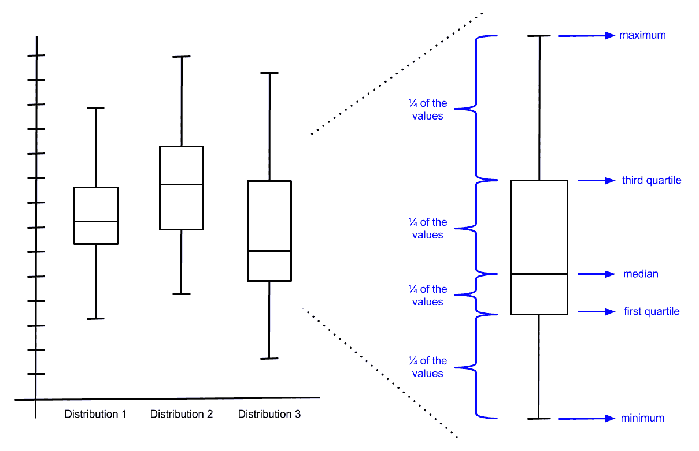

# 矩阵、概率和统计学

尽管我们将在整本书中主要采用实用/应用的方法来介绍机器学习，但某些基本主题对于理解和正确应用机器学习是必不可少的。特别是，对概率和统计学的深入理解将使我们能够将某些算法与相关问题匹配起来，理解我们的数据和结果，并对我们的数据进行必要的转换。矩阵和一点线性代数将使我们能够正确地表示我们的数据并实现优化、最小化和基于矩阵的转换。

如果你数学或统计学稍微有些生疏，不必过于担心。在这里，我们将介绍一些基础知识，并展示如何通过编程方式处理书中将要用到的相关统计指标和矩阵技术。但话说回来，这不是一本关于统计学、概率和线性代数的书。要真正精通机器学习，人们应该花时间在更深的层次上学习这些主题。

# 矩阵和向量

如果你花很多时间学习和应用机器学习，你会看到很多关于矩阵和向量的引用。实际上，许多机器学习算法可以归结为一系列矩阵的迭代运算。矩阵和向量是什么，我们如何在 Go 程序中表示它们？

在很大程度上，我们将利用来自 `github.com/gonum` 的包来构建和使用矩阵和向量。这是一系列专注于数值计算的 Go 包，而且它们的质量一直在不断提升。

# 向量

向量是有序排列的数字集合，这些数字可以按行（从左到右）或列（从上到下）排列。向量中的每个数字称为一个分量。例如，这可能是一组代表我们公司销售额的数字，或者是一组代表温度的数字。

当然，使用 Go 切片来表示这些有序数据集合是很自然的，如下所示：

```py
// Initialize a "vector" via a slice.
var myvector []float64

// Add a couple of components to the vector.
myvector = append(myvector, 11.0)
myvector = append(myvector, 5.2)

// Output the results to stdout.
fmt.Println(myvector)
```

切片确实是有序集合。然而，它们并不真正代表行或列的概念，我们仍然需要在切片之上进行各种向量运算。幸运的是，在向量运算方面，gonum 提供了 `gonum.org/v1/gonum/floats` 来操作 `float64` 值的切片，以及 `gonum.org/v1/gonum/mat`，它除了矩阵外，还提供了一个 `Vector` 类型（及其对应的方法）：

```py
// Create a new vector value.
myvector := mat.NewVector(2, []float64{11.0, 5.2})
```

# 向量运算

正如这里提到的，处理向量需要使用某些向量/矩阵特定的操作和规则。例如，我们如何将向量相乘？我们如何知道两个向量是否相似？`gonum.org/v1/gonum/floats` 和 `gonum.org/v1/gonum/mat` 都提供了用于向量/切片操作的内置方法和函数，例如点积、排序和距离。我们不会在这里涵盖所有功能，因为有很多，但我们可以大致了解我们如何与向量一起工作。首先，我们可以以下这种方式使用 `gonum.org/v1/gonum/floats`：

```py
// Initialize a couple of "vectors" represented as slices.
vectorA := []float64{11.0, 5.2, -1.3}
vectorB := []float64{-7.2, 4.2, 5.1}

// Compute the dot product of A and B
// (https://en.wikipedia.org/wiki/Dot_product).
dotProduct := floats.Dot(vectorA, vectorB)
fmt.Printf("The dot product of A and B is: %0.2f\n", dotProduct)

// Scale each element of A by 1.5.
floats.Scale(1.5, vectorA)
fmt.Printf("Scaling A by 1.5 gives: %v\n", vectorA)

// Compute the norm/length of B.
normB := floats.Norm(vectorB, 2)
fmt.Printf("The norm/length of B is: %0.2f\n", normB)
```

我们也可以使用 `gonum.org/v1/gonum/mat` 执行类似的操作：

```py
// Initialize a couple of "vectors" represented as slices.
vectorA := mat.NewVector(3, []float64{11.0, 5.2, -1.3})
vectorB := mat.NewVector(3, []float64{-7.2, 4.2, 5.1})

// Compute the dot product of A and B
// (https://en.wikipedia.org/wiki/Dot_product).
dotProduct := mat.Dot(vectorA, vectorB)
fmt.Printf("The dot product of A and B is: %0.2f\n", dotProduct)

// Scale each element of A by 1.5.
vectorA.ScaleVec(1.5, vectorA)
fmt.Printf("Scaling A by 1.5 gives: %v\n", vectorA)

// Compute the norm/length of B.
normB := blas64.Nrm2(3, vectorB.RawVector())
fmt.Printf("The norm/length of B is: %0.2f\n", normB)
```

两种情况下的语义是相似的。如果你只处理向量（不是矩阵），并且/或者你只需要对浮点数的切片进行一些轻量级和快速的操作，那么 `gonum.org/v1/gonum/floats` 可能是一个不错的选择。然而，如果你同时处理矩阵和向量，并且/或者想要访问更广泛的向量/矩阵功能，那么使用 `gonum.org/v1/gonum/mat`（偶尔参考 `gonum.org/v1/gonum/blas/blas64`）可能更好。

# 矩阵

矩阵和线性代数可能对许多人来说看起来很复杂，但简单来说，矩阵只是数字的矩形组织，线性代数规定了它们操作的相关规则。例如，一个排列在 4 x 3 矩形上的矩阵 *A* 可能看起来像这样：


矩阵 *A* 的组件（*a[11]*、*a[12]* 等等）是我们安排到矩阵中的单个数字，下标表示组件在矩阵中的位置。第一个索引是行索引，第二个索引是列索引。更一般地，*A* 可以有任何形状/大小，有 *M* 行和 *N* 列：


要使用 `gonum.org/v1/gonum/mat` 形成这样的矩阵，我们需要创建一个 `float64` 值的切片，它是所有矩阵组件的平面表示。例如，在我们的例子中，我们想要形成以下矩阵：


我们需要创建一个 `float64` 值的切片，如下所示：

```py
// Create a flat representation of our matrix.
components := []float64{1.2, -5.7, -2.4, 7.3}
```

然后，我们可以提供这个，以及维度信息，给 `gonum.org/v1/gonum/mat` 来形成一个新的 `mat.Dense` 矩阵值：

```py
// Form our matrix (the first argument is the number of
// rows and the second argument is the number of columns).
a := mat.NewDense(2, 2, data)

// As a sanity check, output the matrix to standard out.
fa := mat.Formatted(a, mat.Prefix(" "))
fmt.Printf("mat = %v\n\n", fa)
```

注意，我们还在 `gonum.org/v1/gonum/mat` 中使用了漂亮的格式化逻辑来打印矩阵作为合理性检查。当你运行这个程序时，你应该看到以下内容：

```py
$ go build
$ ./myprogram
A = [ 1.2 -5.7] 
 [-2.4  7.3]
```

然后，我们可以通过内置方法访问和修改 *A* 中的某些值：

```py
// Get a single value from the matrix.
val := a.At(0, 1)
fmt.Printf("The value of a at (0,1) is: %.2f\n\n", val)

// Get the values in a specific column.
col := mat.Col(nil, 0, a)
fmt.Printf("The values in the 1st column are: %v\n\n", col)

// Get the values in a kspecific row.
row := mat.Row(nil, 1, a)
fmt.Printf("The values in the 2nd row are: %v\n\n", row)

// Modify a single element.
a.Set(0, 1, 11.2)

// Modify an entire row.
a.SetRow(0, []float64{14.3, -4.2})

// Modify an entire column.
a.SetCol(0, []float64{1.7, -0.3})
```

# 矩阵运算

与向量一样，矩阵有一套自己的算术规则和一系列特殊操作。与矩阵相关的某些算术行为可能与你预期的相似。然而，在进行矩阵相乘或求逆等操作时，你需要特别注意。

便利的是，`gonum.org/v1/gonum/mat` 为这种算术和许多其他特殊操作提供了一个很好的 API。以下是一个示例，展示了几个操作，如加法、乘法、除法等：

```py
// Create two matrices of the same size, a and b.
a := mat.NewDense(3, 3, []float64{1, 2, 3, 0, 4, 5, 0, 0, 6})
b := mat.NewDense(3, 3, []float64{8, 9, 10, 1, 4, 2, 9, 0, 2})

// Create a third matrix of a different size.
c := mat.NewDense(3, 2, []float64{3, 2, 1, 4, 0, 8})

// Add a and b.
d := mat.NewDense(0, 0, nil)
d.Add(a, b)
fd := mat.Formatted(d, mat.Prefix("            "))
fmt.Printf("d = a + b = %0.4v\n\n", fd)

// Multiply a and c.
f := mat.NewDense(0, 0, nil)
f.Mul(a, c)
ff := mat.Formatted(f, mat.Prefix("          "))
fmt.Printf("f = a c = %0.4v\n\n", ff)

// Raising a matrix to a power.
g := mat.NewDense(0, 0, nil)
g.Pow(a, 5)
fg := mat.Formatted(g, mat.Prefix("          "))
fmt.Printf("g = a⁵ = %0.4v\n\n", fg)

// Apply a function to each of the elements of a.
h := mat.NewDense(0, 0, nil)
sqrt := func(_, _ int, v float64) float64 { return math.Sqrt(v) }
h.Apply(sqrt, a)
fh := mat.Formatted(h, mat.Prefix("              "))
fmt.Printf("h = sqrt(a) = %0.4v\n\n", fh)
```

特别是，请注意上面的 `Apply()` 方法。这个功能非常有用，因为它允许你将任何函数应用于矩阵的元素。你可以将相同的函数应用于所有元素，或者使函数依赖于矩阵元素的索引。例如，你可以使用这个方法进行逐元素乘法、应用用户定义的函数或应用第三方包中的函数。

然后，对于所有各种事情，比如行列式、特征值/向量求解器和逆矩阵，`gonum.org/v1/gonum/mat` 都为你提供了支持。再次强调，我不会详细介绍所有功能，但这里是一些操作的示例：

```py
// Create a new matrix a.
a := mat.NewDense(3, 3, []float64{1, 2, 3, 0, 4, 5, 0, 0, 6}) 

// Compute and output the transpose of the matrix.
ft := mat.Formatted(a.T(), mat.Prefix(" "))
fmt.Printf("a^T = %v\n\n", ft)

// Compute and output the determinant of a.
deta := mat.Det(a)
fmt.Printf("det(a) = %.2f\n\n", deta)

// Compute and output the inverse of a.
aInverse := mat.NewDense(0, 0, nil)
if err := aInverse.Inverse(a); err != nil {
    log.Fatal(err)
}
fi := mat.Formatted(aInverse, mat.Prefix(" "))
fmt.Printf("a^-1 = %v\n\n", fi)
```

注意，在这个例子中，当我们需要确保保持代码的完整性和可读性时，我们利用了 Go 的显式错误处理功能。矩阵并不总是有逆矩阵。在处理矩阵和大数据集时，会出现各种类似的情况，我们希望确保我们的应用程序按预期运行。

# 统计学

最后，你的机器学习应用程序的成功将取决于你数据的质量、你对数据的理解以及你对结果的评估/验证。这三件事都需要我们对统计学有一个理解。

统计学领域帮助我们理解数据，并量化我们的数据和结果看起来像什么。它还为我们提供了测量应用程序性能以及防止某些机器学习陷阱（如过拟合）的机制。

与线性代数一样，我们在这里无法提供统计学的完整介绍，但网上和印刷品中有很多资源可以学习统计学入门。在这里，我们将关注对基础知识的根本理解，以及 Go 中的实现实践。我们将介绍分布的概念，以及如何量化这些分布并可视化它们。

# 分布

分布是对数据集中值出现频率的表示。比如说，作为数据科学家，你跟踪的一件事是某产品或服务的每日销售额，你有一个长长的列表（你可以将其表示为向量或矩阵的一部分）记录了这些每日销售额。这些销售额数据是我们数据集的一部分，包括一天销售额为 $121，另一天销售额为 $207，等等。

将会有一个销售数字是我们积累的最低的。也将会有一个销售数字是我们积累的最高，其余的销售数字则位于两者之间（至少如果我们假设没有精确的重复）。以下图像表示了销售的低、高和中间值：


这因此是一个销售分布，或者至少是销售分布的一个表示。请注意，这个分布有更多数字和数字较少的区域。此外，请注意，数字似乎倾向于分布的中心。

# 统计测量

为了量化分布看起来像什么，我们将使用各种统计测量。通常，有两种类型的这些测量：

1.  **中心趋势测量**：这些测量值的位置，或者分布的中心位置在哪里（例如，沿着前面的线性表示）。

1.  **离散度或分散度测量**：这些测量值如何在分布的范围内（从最低值到最高值）分布。

有各种包允许你快速计算和/或利用这些统计测量。我们将使用`gonum.org/v1/gonum/stat`（你可能开始注意到我们将大量使用 gonum）和`github.com/montanaflynn/stats`。

注意，`gonum.org/v1/gonum/stat` 和 `github.com/montanaflynn/stats` 包的名称之间有一个字母的差异。在查看以下章节中的示例时请记住这一点。

# 均值测量

中心趋势测量包括以下内容：

+   `均值`：这可能是你通常所说的平均值。我们通过将分布中的所有数字相加，然后除以数字的数量来计算这个值。

+   `中位数`：如果我们按从低到高的顺序对分布中的所有数字进行排序，这个数字就是将数字的最低一半与最高一半分开的数字。

+   `众数`：这是分布中出现频率最高的值。

让我们计算之前在第一章，“收集和组织数据”中介绍的鸢尾花数据集一列中的值。作为提醒，这个数据集包括四个花测量列，以及一个对应的花种列。因此，每个测量列都包含了一组代表该测量分布的值：

```py
// Open the CSV file.
irisFile, err := os.Open("../data/iris.csv")
if err != nil {
    log.Fatal(err)
}
defer irisFile.Close()

// Create a dataframe from the CSV file.
irisDF := dataframe.ReadCSV(irisFile)

// Get the float values from the "sepal_length" column as
// we will be looking at the measures for this variable.
sepalLength := irisDF.Col("sepal_length").Float()

// Calculate the Mean of the variable.
meanVal := stat.Mean(sepalLength, nil)

// Calculate the Mode of the variable.
modeVal, modeCount := stat.Mode(sepalLength, nil)

// Calculate the Median of the variable.
medianVal, err := stats.Median(sepalLength)
if err != nil {
    log.Fatal(err)
}

// Output the results to standard out.
fmt.Printf("\nSepal Length Summary Statistics:\n")
fmt.Printf("Mean value: %0.2f\n", meanVal)
fmt.Printf("Mode value: %0.2f\n", modeVal)
fmt.Printf("Mode count: %d\n", int(modeCount))
fmt.Printf("Median value: %0.2f\n\n", medianVal)
```

运行此程序会产生以下结果：

```py
$ go build
$ ./myprogram

Sepal Length Summary Statistics:
Mean value: 5.84
Mode value: 5.00
Mode count: 10
Median value: 5.80
```

你可以看到均值、众数和中位数都有所不同。然而，请注意，在`sepal_length`列的值中，均值和中位数非常接近。

另一方面，如果我们把前面的代码中的`sepal_length`改为`petal_length`，我们将得到以下结果：

```py
$ go build
$ ./myprogram

Sepal Length Summary Statistics:
Mean value: 3.76
Mode value: 1.50
Mode count: 14
Median value: 4.35
```

对于`petal_length`值，平均值和中位数并不那么接近。我们可以从这些信息中开始对数据进行一些直观的了解。如果平均值和中位数不接近，这意味着高值或低值正在将平均值拉高或拉低，分别是一种在平均值中不那么明显的影响。我们称这种为**偏斜**的**分布**。

# **离散度或分散度**

现在我们已经对大多数值的位置（或分布的中心）有了概念，让我们尝试量化分布的值是如何围绕分布中心分布的。以下是一些广泛使用的量化这种分布的指标：

+   **最大值**：分布的最高值

+   **最小值**：分布的最低值

+   **范围**：最大值和最小值之间的差

+   **方差**：这个度量是通过取分布中的每个值，计算每个值与分布平均值的差，平方这个差，将其加到其他平方差上，然后除以分布中的值数来计算的

+   **标准差**：方差的平方根

+   **分位数/四分位数**：与中位数类似，这些度量定义了分布中的截止点，其中一定数量的低值低于该度量，而一定数量的高值高于该度量

使用`gonum.org/v1/gonum/stat`，这些度量的计算如下：

```py
// Open the CSV file.
irisFile, err := os.Open("../data/iris.csv")
if err != nil {
    log.Fatal(err)
}
defer irisFile.Close()

// Create a dataframe from the CSV file.
irisDF := dataframe.ReadCSV(irisFile)

// Get the float values from the "sepal_length" column as
// we will be looking at the measures for this variable.
sepalLength := irisDF.Col("petal_length").Float()

// Calculate the Max of the variable.
minVal := floats.Min(sepalLength)

// Calculate the Max of the variable.
maxVal := floats.Max(sepalLength)

// Calculate the Median of the variable.
rangeVal := maxVal - minVal

// Calculate the variance of the variable.
varianceVal := stat.Variance(sepalLength, nil)

// Calculate the standard deviation of the variable.
stdDevVal := stat.StdDev(sepalLength, nil)

// Sort the values.
inds := make([]int, len(sepalLength))
floats.Argsort(sepalLength, inds)

// Get the Quantiles.
quant25 := stat.Quantile(0.25, stat.Empirical, sepalLength, nil)
quant50 := stat.Quantile(0.50, stat.Empirical, sepalLength, nil)
quant75 := stat.Quantile(0.75, stat.Empirical, sepalLength, nil)

// Output the results to standard out.
fmt.Printf("\nSepal Length Summary Statistics:\n")
fmt.Printf("Max value: %0.2f\n", maxVal)
fmt.Printf("Min value: %0.2f\n", minVal)
fmt.Printf("Range value: %0.2f\n", rangeVal)
fmt.Printf("Variance value: %0.2f\n", varianceVal)
fmt.Printf("Std Dev value: %0.2f\n", stdDevVal)
fmt.Printf("25 Quantile: %0.2f\n", quant25)
fmt.Printf("50 Quantile: %0.2f\n", quant50)
fmt.Printf("75 Quantile: %0.2f\n\n", quant75)
```

运行这个程序给出以下结果：

```py
$ go build
$ ./myprogram

Sepal Length Summary Statistics:
Max value: 6.90
Min value: 1.00
Range value: 5.90
Variance value: 3.11
Std Dev value: 1.76
25 Quantile: 1.60
50 Quantile: 4.30
75 Quantile: 5.10
```

好吧，让我们尝试理解这些数字，看看它们对`sepal_length`列中值的分布意味着什么。我们可以得出以下结论。

首先，标准差是`1.76`，整个值的范围是`5.90`。与方差不同，标准差具有与值本身相同的单位，因此我们可以看到值实际上在值的范围内变化很大（标准差值大约是总范围值的 30%）。

接下来，让我们看看分位数。25%分位数表示分布中的一个点，其中 25%的值低于该度量，而其他 75%的值高于该度量。50%和 75%分位数也是类似的。由于 25%分位数比 75%分位数和最大值之间的距离更接近最小值，我们可以推断出分布中的高值可能比低值更分散。

当然，你可以利用这些度量以及中心趋势度量中的任何组合，来帮助你量化分布的外观，还有其他一些统计度量在这里无法涵盖。

这里要说明的是，你应该利用这类度量来帮助你建立数据的心智模型。这将使你能够将结果置于上下文中，并对你的工作进行合理性检查。

# 可视化分布

尽管量化分布的外观很重要，但我们实际上应该可视化分布以获得最直观的感知。有各种类型的图表和图形，允许我们创建值的分布的视觉表示。这些帮助我们形成数据的心智模型，并将我们数据的信息传达给团队成员、应用程序用户等。

# 直方图

帮助我们理解分布的第一种图表或图表称为 **直方图**。实际上，直方图是一种组织或计数你的值的方式，然后可以在直方图图中绘制。要形成直方图，我们首先创建一定数量的箱，划分出我们值范围的不同区域。例如，考虑我们在前几节中讨论的销售数字分布：


接下来，我们计算每个箱子中有多少个我们的值：


这些计数以及箱的定义形成了我们的直方图。然后我们可以轻松地将这些转换为计数的图，这为我们提供了分布的很好的视觉表示：


我们可以使用 gonum 从实际数据创建直方图并绘制直方图。gonum 提供用于此类绘图以及其他类型绘图的包可以在 `gonum.org/v1/plot` 中找到。作为一个例子，让我们为 iris 数据集中的每一列创建直方图图。

首先，从 gonum 导入以下内容：

```py
import (
    "gonum.org/v1/plot"
    "gonum.org/v1/plot/plotter"
    "gonum.org/v1/plot/vg"
)
```

然后，我们将读取 iris 数据集，创建一个数据框，并查看数值列生成直方图图：

```py
// Open the CSV file.
irisFile, err := os.Open("../data/iris.csv")
if err != nil {
    log.Fatal(err)
}
defer irisFile.Close()

// Create a dataframe from the CSV file.
irisDF := dataframe.ReadCSV(irisFile)

// Create a histogram for each of the feature columns in the dataset.
for _, colName := range irisDF.Names() {

    // If the column is one of the feature columns, let's create
    // a histogram of the values.
    if colName != "species" {

        // Create a plotter.Values value and fill it with the
        // values from the respective column of the dataframe.
        v := make(plotter.Values, irisDF.Nrow())
        for i, floatVal := range irisDF.Col(colName).Float() {
            v[i] = floatVal
        }

        // Make a plot and set its title.
        p, err := plot.New()
        if err != nil {
            log.Fatal(err)
        }
        p.Title.Text = fmt.Sprintf("Histogram of a %s", colName)

        // Create a histogram of our values drawn
        // from the standard normal.
        h, err := plotter.NewHist(v, 16)
        if err != nil {
            log.Fatal(err)
        }

        // Normalize the histogram.
        h.Normalize(1)

        // Add the histogram to the plot.
        p.Add(h)

        // Save the plot to a PNG file.
        if err := p.Save(4*vg.Inch, 4*vg.Inch, colName+"_hist.png"); err != nil {
            log.Fatal(err)
        }
    }
}
```

注意，我们已经对直方图进行了归一化（使用 `h.Normalize()`）。这是典型的，因为通常你将想要比较具有不同值计数的不同分布。归一化直方图允许我们并排比较不同的分布。

上述代码将为 iris 数据集中的数值列生成以下直方图的四个 `*.png` 文件：


这些分布彼此看起来都不同。`sepal_width` 分布看起来像钟形曲线或正态/高斯分布（我们将在本书后面讨论）。另一方面，花瓣分布看起来像有两个不同的明显值簇。当我们开发机器学习工作流程时，我们将利用这些观察结果，但在此阶段，只需注意这些可视化如何帮助我们建立数据的心智模型。

# 箱线图

直方图绝不是唯一一种帮助我们直观理解数据的方式。另一种常用的图表类型被称为**箱线图**。这种图表类型也让我们对分布中值的分组和分布情况有所了解，但与直方图不同，箱线图有几个明显的特征，有助于引导我们的视线：



因为箱线图中箱体的边界由中位数、**第一四分位数**（25% 分位数/百分位数）和**第三四分位数**定义，所以两个中央箱体包含的分布值数量相同。如果一个箱体比另一个大，这意味着分布是偏斜的。

箱线图还包括两个尾部或须。这些给我们一个快速的可视指示，表明分布的范围与包含大多数值（中间 50%）的区域相比。

为了巩固这种图表类型，我们再次为鸢尾花数据集创建图表。与直方图类似，我们将使用`gonum.org/v1/plot`。然而，在这种情况下，我们将所有箱线图放入同一个`*.png`文件中：

```py
// Open the CSV file.
irisFile, err := os.Open("../data/iris.csv")
if err != nil {
    log.Fatal(err)
}
defer irisFile.Close()

// Create a dataframe from the CSV file.
irisDF := dataframe.ReadCSV(irisFile)

// Create the plot and set its title and axis label.
p, err := plot.New()
if err != nil {
    log.Fatal(err)
}

p.Title.Text = "Box plots"
p.Y.Label.Text = "Values"

// Create the box for our data.
w := vg.Points(50)

// Create a box plot for each of the feature columns in the dataset.
for idx, colName := range irisDF.Names() {

    // If the column is one of the feature columns, let's create
    // a histogram of the values.
    if colName != "species" {

        // Create a plotter.Values value and fill it with the
        // values from the respective column of the dataframe.
        v := make(plotter.Values, irisDF.Nrow())
        for i, floatVal := range irisDF.Col(colName).Float() {
            v[i] = floatVal
        }

        // Add the data to the plot.
        b, err := plotter.NewBoxPlot(w, float64(idx), v)
        if err != nil {
            log.Fatal(err)
        }
        p.Add(b)
    }
}

// Set the X axis of the plot to nominal with
// the given names for x=0, x=1, etc.
p.NominalX("sepal_length", "sepal_width", "petal_length", "petal_width")

if err := p.Save(6*vg.Inch, 8*vg.Inch, "boxplots.png"); err != nil {
    log.Fatal(err)
}
```

这将生成以下图形：


正如我们在直方图中观察到的，`sepal_length`列看起来相对对称。另一方面，`petal_length`看起来则不对称得多。还要注意的是，gonum 在箱线图中包括了几个异常值（标记为圆圈或点）。许多绘图包都包括这些。它们表示那些至少与分布的中位数有一定距离的值。

# 概率

到目前为止，我们现在已经了解了几种表示/操作数据的方法（矩阵和向量），并且我们知道如何获取对数据的理解，以及如何量化数据的外观（统计学）。然而，有时当我们开发机器学习应用时，我们也想知道预测正确的可能性有多大，或者给定结果历史，某些结果的重要性有多大。概率可以帮助我们回答这些“可能性”和“重要性”问题。

通常，概率与事件或观察的可能性有关。例如，如果我们抛硬币来做决定，看到正面（50%）的可能性有多大，看到反面（50%）的可能性有多大，甚至硬币是否是公平的硬币的可能性有多大？这看起来可能是一个微不足道的例子，但在进行机器学习时，许多类似的问题都会出现。事实上，一些机器学习算法是基于概率规则和定理构建的。

# 随机变量

假设我们有一个实验，就像我们抛硬币的场景，它可能有多个结果（正面或反面）。现在让我们定义一个变量，其值可以是这些结果之一。这个变量被称为**随机变量**。

在抛硬币的情况下（至少如果我们考虑的是公平硬币），随机变量的每个结果出现的可能性是相等的。也就是说，我们看到正面的概率是 50%，看到反面的概率也是 50%。然而，随机变量的各种值不必具有相等的可能性。如果我们试图预测是否会下雨，这些结果将不会具有相等的可能性。

随机变量使我们能够定义我们之前提到的那些“可能性”和“显著性”的问题。它们可以有有限个结果，或者可以代表连续变量的范围。

# 概率度量

那么，我们观察到特定实验结果的可能性有多大？为了量化这个问题的答案，我们引入**概率度量**，通常被称为概率。它们用一个介于 0 和 1 之间的数字表示，或者用一个介于 0%和 100%之间的百分比表示。

在抛公平硬币的情况下，我们有以下场景：

+   出现正面的概率是 0.5 或 50%，这里的 0.5 或 50%是一个概率度量

+   出现反面的概率是 0.5 或 50%

某个实验的概率度量必须加起来等于 1，因为当事件发生时，它必须对应于可能的某个结果。

# 独立和条件概率

如果一个事件（实验的结果）的概率在某种程度上不影响其他事件的概率，那么这两个事件（实验的结果）是独立的。独立事件的例子是抛硬币或掷骰子。另一方面，相关事件是那些一个事件的概率影响另一个事件概率的事件。相关事件的例子是从一副牌中抽取卡片而不放回。

我们如何量化这种第二种类型的概率，通常被称为条件概率？符号上，独立概率可以用*P(A)*表示，它是*A*的概率（其中*A*可能代表抛硬币、掷骰子等）。然后条件概率用*P(B|A)*表示，即在给定*B*的情况下*A*的概率（其中*B*是另一个结果）。

要实际计算条件概率，我们可以使用贝叶斯定理/规则：*P(A|B) = P(B|A) P(A) / P(B)*。有时你会看到这些术语如下定义：

+   *P(A|B)*：后验概率，因为它是在观察*B*之后关于*A*的已知信息

+   *P(A)*：先验概率，因为它是在观察*B*之前关于*A*的数据

+   *P(B|A)*：似然性，因为它衡量了*B*与*A*的兼容性

+   *P(B)*：证据概率，因为它衡量了*B*的概率，而我们已知*B*是真实的

这个定理是本书后面将要讨论的各种技术的基础，例如朴素贝叶斯分类技术。

# 假设检验

我们可以用概率来量化“可能性”，甚至可以用贝叶斯定理计算条件概率，但如何量化与实际观察相对应的“显著性”问题呢？例如，我们可以用公平的硬币量化正面/反面的概率，但当我们多次抛硬币并观察到 48%正面和 52%反面时，这有多显著？这是否意味着我们有一个不公平的硬币？

这些“显著性”问题可以通过称为假设检验的过程来回答。这个过程通常包括以下步骤：

1.  提出一个**零假设**，称为*H[0]*，以及一个**备择假设**，称为*H[a]*。*H[0]*代表你所观察到的（例如，48%正面和 52%反面）是纯粹偶然的结果，而*H[a]*代表某种潜在效应导致与纯粹偶然有显著偏差的场景（例如，一个不公平的硬币）。零假设始终被假定为真实的。

1.  确定一个**测试统计量**，你将用它来确定*H[0]*的有效性。

1.  确定一个**p 值**，它表示在*H[0]*为真的假设下，观察到至少与你的测试统计量一样显著的测试统计量的概率。这个 p 值可以从与测试统计量相对应的概率分布中获得（通常表示为表格或分布函数）。

1.  将你的 p 值与预先设定的阈值进行比较。如果 p 值小于或等于预先设定的阈值，则拒绝*H[0]*，接受*H[a]*。

这可能看起来相当抽象，但这个过程最终将与你的机器学习工作流程相交。例如，你可能改变了一个优化广告的机器学习模型，然后你可能想量化销售额的增加是否实际上具有统计学意义。在另一种情况下，你可能正在分析代表可能欺诈网络流量的日志，你可能需要构建一个模型来识别与预期网络流量有显著差异的统计显著偏差。

注意，你可能会看到某些假设检验被称为 A/B 测试，尽管这里列出的过程很常见，但绝不是假设检验的唯一方法。还有贝叶斯 A/B 测试、用于优化的 bandit 算法等等，这些内容本书不会详细涉及。

# 测试统计量

在假设检验中可以使用许多不同的测试统计量。这些包括 Z 统计量、T 统计量、F 统计量和卡方统计量。当然，你可以在 Go 中从头开始实现这些度量，而不会遇到太多麻烦。然而，也有一些现成的实现可供使用。

返回到`gonum.org/v1/gonum/stat`，我们可以按照以下方式计算卡方统计量：

```py
// Define observed and expected values. Most
// of the time these will come from your
// data (website visits, etc.).
observed := []float64{48, 52}
expected := []float64{50, 50}

// Calculate the ChiSquare test statistic.
chiSquare := stat.ChiSquare(observed, expected)
```

# 计算 p 值

假设我们有以下场景：

对当地居民的调查显示，60%的居民没有进行常规锻炼，25%偶尔锻炼，15%定期锻炼。在实施了一些复杂的建模和社区服务后，调查以同样的问题重复进行。后续调查由 500 名居民完成，以下为结果：

无规律锻炼：260

偶尔锻炼：135

规律锻炼：105

总计：500

现在，我们想要确定居民回答中是否存在统计上显著的转变的证据。我们的零假设和备择假设如下：

+   *H[0]*：与先前观察到的百分比偏差是由于纯粹偶然性

+   *H[a]*：偏差是由于一些超出纯粹偶然性的潜在效应（可能是我们新的社区服务）

首先，让我们使用卡方检验统计量来计算我们的检验统计量：

```py
// Define the observed frequencies.
observed := []float64{
    260.0, // This number is the number of observed with no regular exercise.
    135.0, // This number is the number of observed with sporatic exercise.
    105.0, // This number is the number of observed with regular exercise.
} 

// Define the total observed.
totalObserved := 500.0

// Calculate the expected frequencies (again assuming the null Hypothesis).
expected := []float64{
    totalObserved * 0.60,
    totalObserved * 0.25,
    totalObserved * 0.15,
}

// Calculate the ChiSquare test statistic.
chiSquare := stat.ChiSquare(observed, expected)

// Output the test statistic to standard out.
fmt.Printf("\nChi-square: %0.2f\n", chiSquare)
```

这将给我们以下卡方值：

```py
$ go build
$ ./myprogram

Chi-square: 18.13
```

接下来，我们需要计算与这个`卡方`值对应的 p 值。这需要我们知道关于**卡方分布**的信息，它定义了卡方某些测度值和某些**自由度**的 p 值。`github.com/gonum/stat`还包括了从其中我们可以计算我们的`p 值`的卡方分布表示：

```py
// Create a Chi-squared distribution with K degrees of freedom.
// In this case we have K=3-1=2, because the degrees of freedom
// for a Chi-squared distribution is the number of possible
// categories minus one.
chiDist := distuv.ChiSquared{
    K: 2.0,
    Src: nil,
}

// Calculate the p-value for our specific test statistic.
pValue := chiDist.Prob(chiSquare)

// Output the p-value to standard out.
fmt.Printf("p-value: %0.4f\n\n", pValue)
```

这给我们以下结果：

```py
$ go build
$ ./myprogram

Chi-square: 18.13
p-value: 0.0001
```

因此，在调查第二版中观察到的偏差结果完全是由于偶然性的可能性为 0.01%。如果我们，例如，使用 5%的阈值（这是常见的），我们就需要拒绝零假设并采用我们的备择假设。

# 参考文献

向量和矩阵：

+   `gonum.org/v1/gonum/floats` 文档：[`godoc.org/gonum.org/v1/gonum/floats`](https://godoc.org/gonum.org/v1/gonum/floats)

+   `gonum.org/v1/gonum/mat` 文档：[`godoc.org/gonum.org/v1/gonum/mat`](https://godoc.org/gonum.org/v1/gonum/mat)

统计学：

+   `gonum.org/v1/gonum/stat` 文档：[`godoc.org/gonum.org/v1/gonum/stat`](https://godoc.org/gonum.org/v1/gonum/stat)

+   `github.com/montanaflynn/stats` 文档：[`godoc.org/github.com/montanaflynn/stats`](https://godoc.org/github.com/montanaflynn/stats)

可视化：

+   `gonum.org/v1/plot` 文档：[`godoc.org/gonum.org/v1/plot`](https://godoc.org/gonum.org/v1/plot)

+   `gonum.org/v1/plot` wiki 带示例：[`github.com/gonum/plot/wiki/Example-plots`](https://github.com/gonum/plot/wiki/Example-plots)

概率：

+   `gonum.org/v1/gonum/stat/distuv` 文档：[`godoc.org/gonum.org/v1/gonum/stat/distuv`](https://godoc.org/gonum.org/v1/gonum/stat/distuv)

# 摘要

这本关于 Go 语言中矩阵、线性代数、统计学和概率的介绍，为我们提供了一套理解和操作数据的工具。这套工具将在我们解决各种问题时贯穿全书，并且这些工具可以在机器学习之外的各种环境中使用。然而，在下一章中，我们将讨论一些在机器学习环境中极为重要的思想和技巧，特别是评估和验证。
