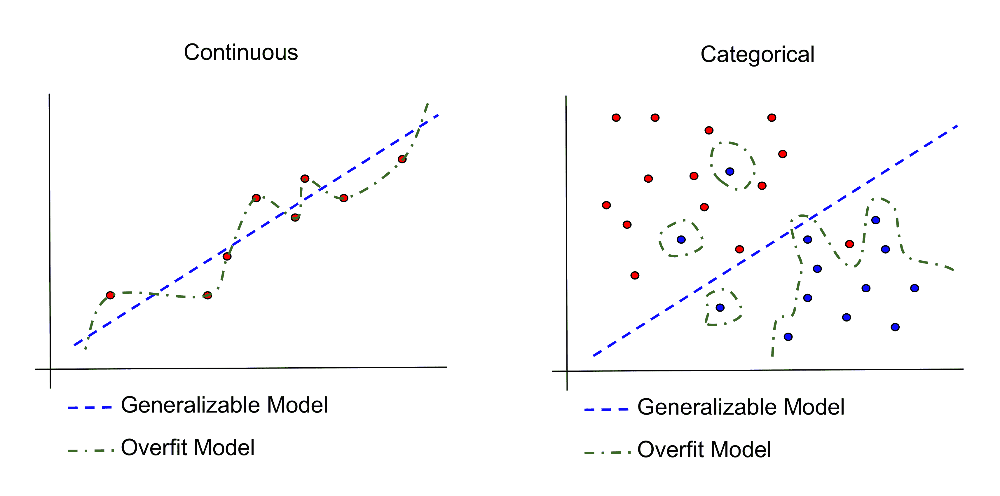

# 第三章：评估与验证

为了拥有可持续、负责任的机器学习工作流程，并开发出能够产生真正价值的机器学习应用，我们需要能够衡量我们的机器学习模型表现的好坏。我们还需要确保我们的机器学习模型能够泛化到它们在生产中可能会看到的数据。如果我们不这样做，我们基本上就是在黑暗中射击。我们将无法理解我们模型预期的行为，并且我们无法随着时间的推移来改进它们。

测量模型表现（相对于某些数据）的过程称为**评估**。确保我们的模型泛化到我们可能预期遇到的数据的过程称为**验证**。这两个过程都需要在每个机器学习工作流程和应用中存在，我们将在本章中介绍这两个过程。

# 评估

科学的一个基本原则是测量，机器学习的科学也不例外。我们需要能够衡量或评估我们的模型表现如何，这样我们才能继续改进它们，比较一个模型与另一个模型，并检测我们的模型何时表现不佳。

只有一个问题。我们如何评估我们的模型表现如何？我们应该衡量它们训练或推理的速度有多快？我们应该衡量它们正确回答的次数有多少？我们如何知道正确答案是什么？我们应该衡量我们偏离观察值的程度有多大？我们如何衡量这个距离？

正如你所见，我们在如何评估我们的模型方面有很多决定要做。真正重要的是上下文。在某些情况下，效率确实很重要，但每个机器学习上下文都要求我们衡量我们的预测、推理或结果与理想的预测、推理或结果之间的匹配程度。因此，测量计算结果与理想结果之间的比较应该始终优先于速度优化。

通常，有一些结果类型是我们需要评估的：

+   **连续**：结果如总销售额、股价和温度等，可以取任何连续数值（$12102.21、92 度等）

+   **分类**：结果如欺诈/非欺诈、活动、名称等，可以属于有限数量的类别（欺诈、站立、弗兰克等）

这些结果类型中的每一种都有相应的评估指标，这里将进行介绍。然而，请记住，你选择的评估指标取决于你试图通过你的机器学习模型实现什么。没有一种适合所有情况的指标，在某些情况下，你可能甚至需要创建自己的指标。

# 连续指标

假设我们有一个应该预测某些连续值的模型，比如股价。假设我们已经积累了一些可以与实际观察值进行比较的预测值：

```py
observation,prediction
22.1,17.9
10.4,9.1
9.3,7.8
18.5,14.2
12.9,15.6
7.2,7.4
11.8,9.7
...
```

现在，我们如何衡量这个模型的性能呢？首先一步是计算观察值和预测值之间的差异以得到一个`error`：

```py
observation,prediction,error
22.1,17.9,4.2
10.4,9.1,1.3
9.3,7.8,1.5
18.5,14.2,4.3
12.9,15.6,-2.7
7.2,7.4,-0.2
11.8,9.7,2.1
...
```

误差给我们一个大致的概念，即我们离我们本应预测的值有多远。然而，实际上或实际地查看所有误差值是不切实际的，尤其是在有大量数据的情况下。可能会有数百万或更多的这些误差值。因此，我们需要一种方法来理解误差的总体情况。

**均方误差**（**MSE**）和**平均绝对误差**（**MAE**）为我们提供了对误差的总体视图：

+   MSE 或**均方偏差**（**MSD**）是所有误差平方的平均值

+   MAE 是所有误差绝对值的平均值

MSE 和 MAE 都给我们提供了一个关于我们的预测有多好的整体图景，但它们确实有一些区别。由于 MSE 取误差的平方，因此相对于 MAE，大误差值（例如，对应于异常值）被强调得更多。换句话说，MSE 对异常值更敏感。另一方面，MAE 与我们要预测的变量的单位相同，因此可以直接与这些值进行比较。

对于这个数据集，我们可以解析观察到的和预测的值，并如下计算 MAE 和 MSE：

```py
// Open the continuous observations and predictions.
f, err := os.Open("continuous_data.csv")
if err != nil {
    log.Fatal(err)
}
defer f.Close()

// Create a new CSV reader reading from the opened file.
reader := csv.NewReader(f)

// observed and predicted will hold the parsed observed and predicted values
// form the continuous data file.
var observed []float64
var predicted []float64

// line will track row numbers for logging.
line := 1
// Read in the records looking for unexpected types in the columns.
for {

    // Read in a row. Check if we are at the end of the file.
    record, err := reader.Read()
    if err == io.EOF {
        break
    }

    // Skip the header.
    if line == 1 {
        line++
        continue
    }

    // Read in the observed and predicted values.
    observedVal, err := strconv.ParseFloat(record[0], 64)
    if err != nil {
        log.Printf("Parsing line %d failed, unexpected type\n", line)
        continue
    }

    predictedVal, err := strconv.ParseFloat(record[1], 64)
    if err != nil {
        log.Printf("Parsing line %d failed, unexpected type\n", line)
        continue
    }

    // Append the record to our slice, if it has the expected type.
    observed = append(observed, observedVal)
    predicted = append(predicted, predictedVal)
    line++
}

// Calculate the mean absolute error and mean squared error.
var mAE float64
var mSE float64
for idx, oVal := range observed {
    mAE += math.Abs(oVal-predicted[idx]) / float64(len(observed))
    mSE += math.Pow(oVal-predicted[idx], 2) / float64(len(observed))
}

// Output the MAE and MSE value to standard out.
fmt.Printf("\nMAE = %0.2f\n", mAE)
fmt.Printf("\nMSE = %0.2f\n\n", mSE)
```

对于我们的示例数据，这导致以下结果：

```py
$ go build
$ ./myprogram 

MAE = 2.55

MSE = 10.51
```

为了判断这些值是否良好，我们需要将它们与我们的观察数据中的值进行比较。特别是，MAE 是`2.55`，我们观察值的平均值是 14.0，因此我们的 MAE 大约是平均值的 20%。根据上下文，这并不很好。

除了 MSE 和 MAE 之外，你可能会看到**R-squared**（也称为**R²**或**R2**），或**确定系数**，用作连续变量模型的评估指标。R-squared 也给我们一个关于我们预测偏差的一般概念，但 R-squared 的想法略有不同。

R-squared 衡量的是观察值中我们捕捉到的预测值的方差比例。记住，我们试图预测的值有一些变异性。例如，我们可能试图预测股价、利率或疾病进展，它们本质上并不完全相同。我们试图创建一个可以预测观察值中这种变异性的模型，而我们捕捉到的变异百分比由 R-squared 表示。

便利的是，`gonum.org/v1/gonum/stat`有一个内置函数来计算 R-squared：

```py
// Calculate the R² value.
rSquared := stat.RSquaredFrom(observed, predicted, nil)

// Output the R² value to standard out.
fmt.Printf("\nR² = %0.2f\n\n", rSquared)
```

在我们的示例数据集上运行前面的代码会产生以下结果：

```py
$ go build
$ ./myprogram     

R² = 0.37
```

那么，这是一个好的还是坏的 R-squared？记住，R-squared 是一个百分比，百分比越高越好。在这里，我们捕捉到了我们试图预测的变量中大约 37%的方差。并不很好。

# 分类度量

假设我们有一个模型，该模型应该预测某些离散值，例如欺诈/非欺诈、站立/坐着/行走、批准/未批准等等。我们的数据可能看起来像以下这样：

```py
observed,predicted
0,0
0,1
2,2
1,1
1,1
0,0
2,0
0,0
...
```

观察值可以取有限数量中的任何一个值（在这种情况下是 1、2 或 3）。这些值中的每一个代表我们数据中的一个离散类别（类别 1 可能对应欺诈交易，类别 2 可能对应非欺诈交易，类别 3 可能对应无效交易，例如）。预测值也可以取这些离散值之一。在评估我们的预测时，我们希望以某种方式衡量我们在做出这些离散预测时的正确性。

# 分类别变量的个体评估指标

实际上，有大量方法可以用指标来评估离散预测，包括准确率、精确度、召回率、特异性、灵敏度、漏报率、假遗漏率等等。与连续变量一样，没有一种适合所有情况的评估指标。每次你面对一个问题时，你需要确定适合该问题的指标，并符合项目的目标。你不想优化错误的事情，然后浪费大量时间根据其他指标重新实现你的模型。

为了理解这些指标并确定哪个适合我们的用例，我们需要意识到，当我们进行离散预测时可能会发生多种不同的场景：

+   **真阳性**（**TP**）：我们预测了某个特定类别，而观察到的确实是那个类别（例如，我们预测欺诈，而观察到的确实是欺诈）

+   **假阳性**（**FP**）：我们预测了某个特定类别，但观察到的实际上是另一个类别（例如，我们预测欺诈，但观察到的不是欺诈）

+   **真阴性**（**TN**）：我们预测观察到的不是某个特定类别，而观察到的确实不是那个类别（例如，我们预测不是欺诈，而观察到的确实不是欺诈）

+   **假阴性**（**FN**）：我们预测观察到的不是某个特定类别，但实际上确实是那个类别（例如，我们预测不是欺诈，但观察到的确实是欺诈）

你可以看到，我们有多种方式可以组合、汇总和衡量这些场景。实际上，我们甚至可以根据我们特定的问题以某种独特的方式汇总/衡量它们。然而，有一些相当标准的汇总和衡量这些场景的方法，结果产生了以下常见的指标：

+   **准确率**：预测正确的百分比，或 *(TP + TN)/(TP + TN + FP + FN)*

+   **精确度**：实际为正的预测的百分比，或 *TP/(TP + FP)*

+   **召回率**：被识别为正的预测的百分比，或 *TP/(TP + FN)*

尽管我将在这里强调这些，但你应该看看其他常见的指标及其含义。一个很好的概述可以在[`en.wikipedia.org/wiki/Precision_and_recall`](https://en.wikipedia.org/wiki/Precision_and_recall)找到。

以下是一个解析我们的数据并计算准确率的示例。首先，我们读取`labeled.csv`文件，创建一个 CSV 读取器，并初始化两个切片，将保存我们的解析观察值/预测值：

```py
// Open the binary observations and predictions.
f, err := os.Open("labeled.csv")
if err != nil {
    log.Fatal(err)
}
defer f.Close()

// Create a new CSV reader reading from the opened file.
reader := csv.NewReader(f)

// observed and predicted will hold the parsed observed and predicted values
// form the labeled data file.
var observed []int
var predicted []int
```

然后，我们将遍历 CSV 中的记录，解析值，并将观察值和预测值进行比较以计算准确率：

```py
// line will track row numbers for logging.
line := 1

// Read in the records looking for unexpected types in the columns.
for {

    // Read in a row. Check if we are at the end of the file.
    record, err := reader.Read()
    if err == io.EOF {
        break
    }

    // Skip the header.
    if line == 1 {
        line++
        continue
    }

    // Read in the observed and predicted values.
    observedVal, err := strconv.Atoi(record[0])
    if err != nil {
        log.Printf("Parsing line %d failed, unexpected type\n", line)
        continue
    }

    predictedVal, err := strconv.Atoi(record[1])
    if err != nil {
        log.Printf("Parsing line %d failed, unexpected type\n", line)
        continue
    }

    // Append the record to our slice, if it has the expected type.
    observed = append(observed, observedVal)
    predicted = append(predicted, predictedVal)
    line++
}

// This variable will hold our count of true positive and
// true negative values.
var truePosNeg int

// Accumulate the true positive/negative count.
for idx, oVal := range observed {
    if oVal == predicted[idx] {
        truePosNeg++
    }
}

// Calculate the accuracy (subset accuracy).
accuracy := float64(truePosNeg) / float64(len(observed))

// Output the Accuracy value to standard out.
fmt.Printf("\nAccuracy = %0.2f\n\n", accuracy)
```

运行此代码会产生以下结果：

```py
$ go build
$ ./myprogram

Accuracy = 0.97
```

97%！这相当不错。这意味着我们 97%的时候是正确的。

我们可以类似地计算精确度和召回率。然而，你可能已经注意到，当我们有超过两个类别或类时，我们可以用几种方式来做这件事。我们可以将类别 1 视为正类，其他类别视为负类，将类别 2 视为正类，其他类别视为负类，依此类推。也就是说，我们可以为我们的每个类别计算一个精确度或召回率，如下面的代码示例所示：

```py
// classes contains the three possible classes in the labeled data.
classes := []int{0, 1, 2}

// Loop over each class.
for _, class := range classes {

    // These variables will hold our count of true positives and
    // our count of false positives.
    var truePos int
    var falsePos int
    var falseNeg int

    // Accumulate the true positive and false positive counts.
    for idx, oVal := range observed {

        switch oVal {

        // If the observed value is the relevant class, we should check to
        // see if we predicted that class.
        case class:
            if predicted[idx] == class {
                truePos++
                continue
            }

            falseNeg++

        // If the observed value is a different class, we should 
        // check to see if we predicted a false positive.
        default:
            if predicted[idx] == class {
                falsePos++
            }
        }
    }

    // Calculate the precision.
    precision := float64(truePos) / float64(truePos+falsePos)

    // Calculate the recall.
    recall := float64(truePos) / float64(truePos+falseNeg)

    // Output the precision value to standard out.
    fmt.Printf("\nPrecision (class %d) = %0.2f", class, precision)
    fmt.Printf("\nRecall (class %d) = %0.2f\n\n", class, recall)
}
```

运行此代码会产生以下结果：

```py
$ go build
$ ./myprogram

Precision (class 0) = 1.00
Recall (class 0) = 1.00

Precision (class 1) = 0.96
Recall (class 1) = 0.94

Precision (class 2) = 0.94
Recall (class 2) = 0.96
```

注意，精确度和召回率是稍微不同的指标，有不同的含义。如果我们想得到一个整体的精确度或召回率，我们可以平均每个类别的精确度和召回率。事实上，如果某些类别比其他类别更重要，我们可以对这些结果进行加权平均，并将其用作我们的评估指标。

你可以看到，有几个指标是 100%。这看起来很好，但实际上可能表明了一个问题，我们将在后面进一步讨论。

在某些情况下，例如金融和银行，假阳性或其他情况对于某些类别可能是非常昂贵的。例如，将交易错误标记为欺诈可能会造成重大损失。另一方面，其他类别的某些结果可能可以忽略不计。这些场景可能需要使用自定义指标或成本函数，该函数将某些类别、某些结果或某些结果的组合视为比其他结果更重要。

# 混淆矩阵、AUC 和 ROC

除了为我们的模型计算单个数值指标外，还有各种技术可以将各种指标组合成一种形式，为你提供一个更完整的模型性能表示。这包括但不限于**混淆矩阵**和**曲线下面积**（**AUC**）/**接收者操作特征**（**ROC**）曲线。

混淆矩阵允许我们以二维格式可视化我们预测的各种**TP**、**TN**、**FP**和**FN**值。混淆矩阵的行对应于你应该预测的类别，列对应于预测的类别。然后，每个元素的值是对应的计数：


如你所见，理想的情况是混淆矩阵只在对角线上有值（**TP**，**TN**）。对角线元素表示预测某个类别，而观察结果实际上就在那个类别中。非对角线元素包括预测错误的计数。

这种类型的混淆矩阵对于具有超过两个类别的实际问题特别有用。例如，你可能正在尝试根据移动加速器和位置数据预测各种活动。这些活动可能包括超过两个类别，如站立、坐着、跑步、驾驶等。这个问题的混淆矩阵将大于 2 x 2，这将使你能够快速评估模型在所有类别上的整体性能，并识别模型表现不佳的类别。

除了混淆矩阵外，ROC 曲线通常用于获得二元分类器（或训练用于预测两个类别之一的模型）的整体性能图。ROC 曲线绘制了每个可能的分类阈值下的召回率与假阳性率（*FP/(FP + TN)*）。

ROC 曲线中使用的阈值代表你在分类的两个类别之间分离的各种边界或排名。也就是说，由 ROC 曲线评估的模型必须基于概率、排名或分数（在下图中称为分数）对两个类别进行预测。在前面提到的每个例子中，分数以一种方式分类，反之亦然：


要生成 ROC 曲线，我们为测试示例中的每个分数或排名绘制一个点（召回率、假阳性率）。然后我们可以将这些点连接起来形成曲线。在许多情况下，你会在 ROC 曲线图的对角线上看到一条直线。这条直线是分类器的参考线，具有大约随机的预测能力：


一个好的 ROC 曲线是位于图表右上方的曲线，这意味着我们的模型具有比随机预测能力更好的预测能力。ROC 曲线越靠近图表的右上角，越好。这意味着好的 ROC 曲线具有更高的 AUC；ROC 曲线的 AUC 也用作评估指标。参见图：


`gonum.org/v1/gonum/stat`提供了一些内置函数和类型，可以帮助你构建 ROC 曲线和 AUC 指标：

```py
func ROC(n int, y []float64, classes []bool, weights []float64) (tpr, fpr []float64)
```

这里是一个使用 gonum 快速计算 ROC 曲线 AUC 的示例：

```py
// Define our scores and classes.
scores := []float64{0.1, 0.35, 0.4, 0.8}
classes := []bool{true, false, true, false}

// Calculate the true positive rates (recalls) and
// false positive rates.
tpr, fpr := stat.ROC(0, scores, classes, nil)
// Compute the Area Under Curve.
auc := integrate.Trapezoidal(fpr, tpr)

// Output the results to standard out.
fmt.Printf("true positive rate: %v\n", tpr)
fmt.Printf("false positive rate: %v\n", fpr)
fmt.Printf("auc: %v\n", auc)
```

运行此代码将产生以下结果：

```py
$ go build
$ ./myprogram 
true positive rate: [0 0.5 0.5 1 1]
false positive rate: [0 0 0.5 0.5 1]
auc: 0.75
```

# 验证

现在，我们知道了一些衡量我们的模型表现如何的方法。实际上，如果我们想的话，我们可以创建一个非常复杂、精确的模型，可以无误差地预测每一个观测值。例如，我们可以创建一个模型，它会取观测值的行索引，并为每一行返回精确的答案。这可能是一个具有很多参数的非常大的函数，但它会返回正确的答案。

那么，这有什么问题呢？问题是，它不会泛化到新数据。我们复杂的模型在我们向其展示的数据上会预测得很好，但一旦我们尝试一些新的输入数据（这些数据不是我们的训练数据集的一部分），模型很可能会表现不佳。

我们把这种（不能泛化）的模型称为**过拟合**的模型。也就是说，我们基于我们所拥有的数据，使模型越来越复杂的过程，是对模型进行了过拟合。

过拟合可能在预测连续值或离散/分类值时发生：



为了防止过拟合，我们需要验证我们的模型。有多种方式进行验证，我们在这里将介绍其中的一些。

每次你将模型投入生产时，你需要确保你已经验证了你的模型，并了解它如何泛化到新数据。

# 训练集和测试集

防止过拟合的第一种方法是使用数据集的一部分来训练或拟合你的模型，然后在数据集的另一部分上测试或评估你的模型。训练模型通常包括参数化一个或多个组成你的模型的功能，使得这些功能可以预测你想要预测的内容。然后，你可以使用我们之前讨论的评估指标之一或多个来评估这个训练好的模型。这里重要的是，你不想在用于训练模型的数据上测试/评估你的模型。

通过保留部分数据用于测试，你是在模拟模型看到新数据的情况。也就是说，模型是基于未用于参数化模型的数据进行预测。


许多人开始时将 80%的数据分成训练数据集，20%分成测试集（80/20 的分割）。然而，你会看到不同的人以不同的比例分割他们的数据集。测试数据与训练数据的比例取决于你拥有的数据类型和数量以及你试图训练的模型。一般来说，你想要确保你的训练数据和测试数据都能相当准确地代表你在大规模上的数据。

例如，如果你试图预测几个不同类别中的一个，比如 A、B 和 C，你不想你的训练数据只包含与 A 和 B 相对应的观察结果。在这样一个数据集上训练的模型可能只能预测 A 和 B 类别。同样，你也不想你的测试集包含某些类别的子集，或者类别的加权比例是人为的。这很容易发生，具体取决于你的数据是如何生成的。

此外，你需要确保你有足够的训练数据，以减少在反复计算过程中确定的参数的变异性。如果你有太多的训练数据点，或者训练数据点采样不佳，你的模型训练可能会产生具有很多变异性的参数，甚至可能无法进行数值收敛。这些都是表明你的模型缺乏预测能力的迹象。

通常，随着你增加模型的复杂性，你将能够提高你用于训练数据的评估指标，但到了某个点，评估指标将开始对你的测试数据变差。当评估指标开始对测试数据变差时，你开始过度拟合你的模型。理想的情况是，你能够将模型复杂性增加到拐点，此时测试评估指标开始下降。另一种说法（这与本书中关于模型构建的一般哲学非常契合）是，我们希望得到最可解释的模型（或最简模型），它能产生有价值的结果。


快速将数据集分割成训练集和测试集的一种方法就是使用`github.com/kniren/gota/dataframe`。让我们用一个包括大量匿名医疗患者信息和相应疾病进展及糖尿病指示的数据集来演示这一点：

```py
age,sex,bmi,map,tc,ldl,hdl,tch,ltg,glu,y
0.0380759064334,0.0506801187398,0.0616962065187,0.021872354995,-0.0442234984244,-0.0348207628377,-0.043400845652,-0.00259226199818,0.0199084208763,-0.0176461251598,151.0
-0.00188201652779,-0.044641636507,-0.0514740612388,-0.0263278347174,-0.00844872411122,-0.0191633397482,0.0744115640788,-0.0394933828741,-0.0683297436244,-0.0922040496268,75.0
0.0852989062967,0.0506801187398,0.0444512133366,-0.00567061055493,-0.0455994512826,-0.0341944659141,-0.0323559322398,-0.00259226199818,0.00286377051894,-0.0259303389895,141.0
-0.0890629393523,-0.044641636507,-0.0115950145052,-0.0366564467986,0.0121905687618,0.0249905933641,-0.0360375700439,0.0343088588777,0.0226920225667,-0.00936191133014,206.0
0.00538306037425,-0.044641636507,-0.0363846922045,0.021872354995,0.00393485161259,0.0155961395104,0.00814208360519,-0.00259226199818,-0.0319914449414,-0.0466408735636,135.0
...
```

你可以在这里检索这个数据集：[`archive.ics.uci.edu/ml/datasets/diabetes`](https://archive.ics.uci.edu/ml/datasets/diabetes)。

要使用`github.com/kniren/gota/dataframe`来分割这些数据，我们可以这样做（我们将训练和测试分割保存到相应的 CSV 文件中）：

```py
// Open the diabetes dataset file.
f, err := os.Open("diabetes.csv")
if err != nil {
    log.Fatal(err)
}
defer f.Close()

// Create a dataframe from the CSV file.
// The types of the columns will be inferred.
diabetesDF := dataframe.ReadCSV(f)

// Calculate the number of elements in each set.
trainingNum := (4 * diabetesDF.Nrow()) / 5
testNum := diabetesDF.Nrow() / 5
if trainingNum+testNum < diabetesDF.Nrow() {
    trainingNum++
}

// Create the subset indices.
trainingIdx := make([]int, trainingNum)
testIdx := make([]int, testNum)

// Enumerate the training indices.
for i := 0; i < trainingNum; i++ {
    trainingIdx[i] = i
}

// Enumerate the test indices.
for i := 0; i < testNum; i++ {
    testIdx[i] = trainingNum + i
}

// Create the subset dataframes.
trainingDF := diabetesDF.Subset(trainingIdx)
testDF := diabetesDF.Subset(testIdx)

// Create a map that will be used in writing the data
// to files.
setMap := map[int]dataframe.DataFrame{
    0: trainingDF,
    1: testDF,
}

// Create the respective files.
for idx, setName := range []string{"training.csv", "test.csv"} {

    // Save the filtered dataset file.
    f, err := os.Create(setName)
    if err != nil {
        log.Fatal(err)
    }

    // Create a buffered writer.
    w := bufio.NewWriter(f)

    // Write the dataframe out as a CSV.
    if err := setMap[idx].WriteCSV(w); err != nil {
        log.Fatal(err)
    }
}
```

运行此操作会产生以下结果：

```py
$ go build
$ ./myprogram 
$ wc -l *.csv
   443 diabetes.csv
    89 test.csv
   355 training.csv
   887 total
```

# 保留集

我们正在努力确保我们的模型使用训练集和测试集进行泛化。然而，想象以下场景：

1.  我们根据我们的训练集开发我们模型的第一版。

1.  我们在测试集上测试我们模型的第一版。

1.  我们对测试集上的结果不满意，所以我们会回到步骤 1 并重复。

这个过程可能看起来合乎逻辑，但你可能已经看到了由此程序可能产生的问题。实际上，我们可以通过迭代地将模型暴露于测试集来过度拟合我们的模型。

有几种方法可以处理这种额外的过拟合级别。第一种是简单地创建我们数据的另一个分割，称为**保留集**（也称为**验证集**）。因此，现在我们将有一个训练集、测试集和保留集。这有时被称为三数据集验证，原因很明显。


请记住，为了真正了解你模型的泛化性能，你的保留集绝不能用于训练和测试。你应该在你完成模型的训练、调整模型并得到测试数据集的可接受性能后，将此数据集保留用于验证。

你可能会想知道如何管理随时间推移的数据分割，并恢复用于训练或测试某些模型的不同的数据集。这种“数据来源”对于在机器学习工作流程中保持完整性至关重要。这正是 Pachyderm 的数据版本控制（在第一章“收集和组织数据”中介绍）被创建来处理的。我们将在第九章“部署和分发分析和模型”中看到这一过程如何在规模上展开。

# 交叉验证

除了为验证保留一个保留集之外，交叉验证是验证模型泛化能力的一种常见技术。在交叉验证中，或者说是 k 折交叉验证中，你实际上是将你的数据集随机分成不同的训练和测试组合的*k*次。将这些看作*k*次实验。

在完成每个分割后，你将在该分割的训练数据上训练你的模型，然后在该分割的测试数据上评估它。这个过程为你的数据每个随机分割产生一个评估指标结果。然后你可以对这些评估指标进行平均，得到一个整体评估指标，它比任何单个评估指标本身更能代表模型性能。你还可以查看评估指标的变化，以了解你各种实验的稳定性。这个过程在以下图像中得到了说明：


与数据集验证相比，使用交叉验证的一些优点如下：

+   你正在使用你的整个数据集，因此实际上是在让你的模型接触到更多的训练示例和更多的测试示例。

+   已经有一些方便的函数和打包用于交叉验证。

+   它有助于防止由于选择单个验证集而可能产生的偏差。

`github.com/sjwhitworth/golearn`是一个 Go 包，它提供了一些交叉验证的方便函数。实际上，`github.com/sjwhitworth/golearn`包含了一系列我们将在本书后面部分介绍的机器学习功能，但就目前而言，让我们看看交叉验证可用哪些功能。

如果你查看 `github.com/sjwhitworth/golearn/evaluation` 包的 Godocs，你会看到以下可用于交叉验证的函数：

```py
func GenerateCrossFoldValidationConfusionMatrices(data base.FixedDataGrid, cls base.Classifier, folds int) ([]ConfusionMatrix, error)
```

这个函数实际上可以与各种模型一起使用，但这里有一个使用决策树模型的例子（这里不需要担心模型的细节）：

```py
// Define the decision tree model.
tree := trees.NewID3DecisionTree(param)

// Perform the cross validation.
cfs, err := evaluation.GenerateCrossFoldValidationConfusionMatrices(myData, tree, 5)
if err != nil {
    panic(err)
}

// Calculate the metrics.
mean, variance := evaluation.GetCrossValidatedMetric(cfs, evaluation.GetAccuracy)
stdev := math.Sqrt(variance)

// Output the results to standard out.
fmt.Printf("%0.2f\t\t%.2f (+/- %.2f)\n", param, mean, stdev*2)
```

# 参考文献

评估：

+   过拟合论文：[`scott.fortmann-roe.com/docs/MeasuringError.html`](http://scott.fortmann-roe.com/docs/MeasuringError.html)

+   偏差-方差权衡论文：[`scott.fortmann-roe.com/docs/BiasVariance.html`](http://scott.fortmann-roe.com/docs/BiasVariance.html)

+   分类别评估指标的比较：[`en.wikipedia.org/wiki/Precision_and_recall`](https://en.wikipedia.org/wiki/Precision_and_recall)

+   `gonum.org/v1/gonum/stat` 文档：[`godoc.org/gonum.org/v1/gonum/stat`](https://godoc.org/gonum.org/v1/gonum/stat)

+   `github.com/sjwhitworth/golearn/evaluation` 文档：[`godoc.org/github.com/sjwhitworth/golearn/evaluation`](https://godoc.org/github.com/sjwhitworth/golearn/evaluation)

验证：

+   `github.com/kniren/gota/dataframe` 文档：[`godoc.org/github.com/kniren/gota/dataframe`](https://godoc.org/github.com/kniren/gota/dataframe)

+   `github.com/sjwhitworth/golearn/evaluation` 文档：[`godoc.org/github.com/sjwhitworth/golearn/evaluation`](https://godoc.org/github.com/sjwhitworth/golearn/evaluation)

# 摘要

选择合适的评估指标并制定评估/验证流程是任何机器学习项目的关键部分。你已经了解了各种相关的评估指标以及如何使用保留集和/或交叉验证来避免过拟合。在下一章中，我们将开始探讨机器学习模型，并使用线性回归来构建我们的第一个模型！
