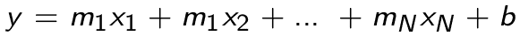

# 回归

我们将要探索的第一组机器学习技术通常被称为**回归**。回归是一个过程，通过它可以理解一个变量（例如，销售额）相对于另一个变量（例如，用户数量）是如何变化的。这些技术本身很有用。然而，它们也是讨论机器学习技术的良好起点，因为它们构成了我们将在本书后面讨论的更复杂技术的基础。

通常，机器学习中的回归技术关注预测连续值（例如，股价、温度或疾病进展）。下一章我们将讨论的**分类**关注预测离散变量，或一组离散类别中的一个（例如，欺诈/非欺诈，坐着/站着/跑步，或热狗/非热狗）。如前所述，回归技术作为分类算法的一部分在机器学习中使用，但本章我们将专注于它们的基本应用，以预测连续值。

# 理解回归模型术语

如前所述，回归本身是一个分析一个变量与另一个变量之间关系的过程，但在机器学习中，有一些术语用来描述这些变量，以及与回归相关的各种类型和过程：

+   **响应变量**或**因变量**：这些术语将交替使用，指基于一个或多个其他变量试图预测的变量。这个变量通常被标记为 *y*。

+   **解释变量**、**自变量**、**特征**、**属性**或**回归变量**：这些术语将交替使用，指我们用来预测响应的变量。这些变量通常被标记为 *x* 或 *x[1], x[2],* 等等。

+   **线性回归**：这种回归假设因变量线性地依赖于自变量（即，遵循直线的方程）。

+   **非线性回归**：这种回归假设因变量依赖于自变量的关系不是线性的（例如，多项式或指数）。

+   **多元回归**：包含多个自变量的回归。

+   **拟合**或**训练**：参数化模型（如回归模型）的过程，以便它可以预测某个因变量。

+   **预测**：使用参数化模型（如回归模型）来预测某个因变量的过程。

一些这些术语将在回归的上下文中使用，并在本书其余部分的其他上下文中使用。

# 线性回归

线性回归是最简单的机器学习模型之一。然而，你绝对不应该忽视这个模型。如前所述，它是其他模型中使用的必要构建块，并且它有一些非常重要的优点。

正如本书中讨论的那样，在机器学习应用中的完整性至关重要，模型越简单、可解释性越强，就越容易保持完整性。此外，由于模型简单且可解释，它允许你理解变量之间的推断关系，并在开发过程中通过心理检查你的工作。用 Fast Forward Labs 的 Mike Lee Williams 的话说（参见 [`blog.fastforwardlabs.com/2017/08/02/interpretability.html`](http://blog.fastforwardlabs.com/2017/08/02/interpretability.html)）：

未来是算法化的。可解释的模型为人类和智能机器之间提供了更安全、更富有成效、最终更协作的关系。

线性回归模型是可解释的，因此，它们可以为数据科学家提供一个安全且富有成效的选项。当你正在寻找一个模型来预测一个连续变量时，你应该考虑并尝试线性回归（甚至多重线性回归），如果你的数据和问题允许你使用它。

# 线性回归概述

在线性回归中，我们试图通过一个独立变量 *x* 来建模我们的因变量 *y*，使用线的方程：


在这里，*m* 是直线的斜率，*b* 是截距。例如，假设我们想要通过我们网站上每天的用户数量来模拟每天的 *销售*。为了使用线性回归来完成这项工作，我们需要确定一个 *m* 和 *b*，这样我们就可以通过以下公式预测销售：


因此，我们的训练模型实际上就是这个参数化函数。我们输入一个 **用户数量**，然后得到预测的 **销售**，如下所示：


线性回归模型的训练或拟合涉及确定 *m* 和 *b* 的值，使得得到的公式对我们的响应具有预测能力。有各种方法可以确定 *m* 和 *b*，但最常见和简单的方法被称为 **普通最小二乘法**（**OLS**）。

要使用 OLS 找到 *m* 和 *b*，我们首先为 *m* 和 *b* 选择一个值来创建第一条示例线。然后，我们测量每个已知点（例如，来自我们的训练集）与示例线之间的垂直距离。这些距离被称为 **误差** 或 **残差**，类似于我们在第三章 *评估和验证* 中讨论的误差，并在以下图中展示：


接下来，我们计算这些误差的平方和：


我们调整*m*和*b*，直到我们最小化这个误差平方和。换句话说，我们的训练线性回归线是使这个误差平方和最小的线。

有许多方法可以找到最小化平方误差和的线，对于 OLS 来说，线可以通过解析方法找到。然而，一个非常流行且通用的优化技术，用于最小化平方误差和，被称为**梯度下降**。这种方法在实现方面可能更高效，在计算上（例如，在内存方面）具有优势，并且比解析解更灵活。

梯度下降在附录“与机器学习相关的算法/技术”中有更详细的讨论，因此我们在这里将避免进行冗长的讨论。简单来说，许多线性回归和其他回归的实现都利用梯度下降来进行线性回归线的拟合或训练。实际上，梯度下降在机器学习中无处不在，并且也推动了更复杂的建模技术，如深度学习。

# 线性回归的假设和陷阱

就像所有机器学习模型一样，线性回归并不适用于所有情况，并且它确实对你的数据和数据中的关系做出了一些假设。线性回归的假设如下：

+   **线性关系**：这看起来可能很明显，但线性回归假设你的因变量线性地依赖于你的自变量（通过线的方程）。如果这种关系不是线性的，线性回归可能表现不佳。

+   **正态性**：这个假设意味着你的变量应该按照正态分布（看起来像钟形）分布。我们将在本章后面回到这个属性，并讨论在遇到非正态分布变量时的权衡和选项。

+   **无多重共线性**：多重共线性是一个术语，意味着自变量实际上并不是独立的。它们以某种方式相互依赖。

+   **无自相关性**：自相关性是另一个术语，意味着一个变量依赖于它自己或其某种位移版本（如在某些可预测的时间序列中）。

+   **同方差性**：这可能是这一系列术语中最复杂的，但它意味着相对简单的事情，并且实际上你并不需要经常担心。线性回归假设你的数据在独立变量的所有值周围围绕回归线具有大致相同的方差。

技术上，为了使用线性回归，所有这些假设都需要得到满足。了解我们的数据是如何分布的以及它的行为方式非常重要。当我们在一个线性回归的示例中分析数据时，我们将探讨这些假设。

作为数据科学家或分析师，在应用线性回归时，以下陷阱您需要牢记在心：

+   您正在为独立变量的某个范围训练线性回归模型。对于这个范围之外的数据值进行预测时，您应该小心，因为您的回归线可能不适用（例如，您的因变量可能在极端值处开始表现出非线性行为）。

+   您可能会通过发现两个实际上毫无关联的变量之间的虚假关系来错误地指定线性回归模型。您应该检查以确保变量之间可能存在某种逻辑上的功能关系。

+   您数据中的异常值或极端值可能会影响某些类型的拟合的回归线，例如最小二乘法。有一些方法可以拟合对异常值更免疫的回归线，或者对异常值有不同的行为，例如正交最小二乘法或岭回归。

# 线性回归示例

为了说明线性回归，让我们举一个例子问题并创建我们的第一个机器学习模型！我们将使用的是示例广告数据。它以`.csv`格式存储，如下所示：

```py
$ head Advertising.csv 
TV,Radio,Newspaper,Sales
230.1,37.8,69.2,22.1
44.5,39.3,45.1,10.4
17.2,45.9,69.3,9.3
151.5,41.3,58.5,18.5
180.8,10.8,58.4,12.9
8.7,48.9,75,7.2
57.5,32.8,23.5,11.8
120.2,19.6,11.6,13.2
8.6,2.1,1,4.8
```

该数据集包括一组代表广告渠道支出（`电视`、`广播`和`报纸`）的属性，以及相应的销售额（`销售额`）。在这个例子中，我们的目标将是通过广告支出的一个属性（我们的独立变量）来建模销售额（我们的因变量）。

# 数据概览

为了确保我们创建的模型或至少是处理过程是我们所理解的，并且为了确保我们可以心理上检查我们的结果，我们需要从数据概览开始每一个机器学习模型构建过程。我们需要了解每个变量是如何分布的，以及它们的范围和变异性。

要做到这一点，我们将计算我们在第二章，“矩阵、概率和统计学”中讨论过的汇总统计信息。在这里，我们将利用`github.com/kniren/gota/dataframe`包内置的方法，一次性计算我们数据集所有列的汇总统计信息：

```py
// Open the CSV file.
advertFile, err := os.Open("Advertising.csv")
if err != nil {
    log.Fatal(err)
}
defer advertFile.Close()

// Create a dataframe from the CSV file.
advertDF := dataframe.ReadCSV(advertFile)

// Use the Describe method to calculate summary statistics
// for all of the columns in one shot.
advertSummary := advertDF.Describe()

// Output the summary statistics to stdout.
fmt.Println(advertSummary)
```

编译并运行此代码将得到以下结果：

```py
$ go build
$ ./myprogram
[7x5] DataFrame

    column   TV         Radio     Newspaper  Sales    
 0: mean     147.042500 23.264000 30.554000  14.022500
 1: stddev   85.854236  14.846809 21.778621  5.217457 
 2: min      0.700000   0.000000  0.300000   1.600000 
 3: 25%      73.400000  9.900000  12.600000  10.300000
 4: 50%      149.700000 22.500000 25.600000  12.900000
 5: 75%      218.500000 36.500000 45.100000  17.400000
 6: max      296.400000 49.600000 114.000000 27.000000
    <string> <float>    <float>   <float>    <float> 
```

正如您所看到的，这以漂亮的表格形式打印出我们所有的汇总统计信息，包括平均值、标准差、最小值、最大值、*25%/75%* 分位数和中间值（或 50% 分位数）。

这些值为我们提供了在训练线性回归模型时将看到的数字的良好数值参考。然而，这并没有给我们一个很好的数据视觉理解。为此，我们将为每个列中的值创建直方图：

```py
// Open the advertising dataset file.
f, err := os.Open("Advertising.csv")
if err != nil {
    log.Fatal(err)
}
defer f.Close()

// Create a dataframe from the CSV file.
advertDF := dataframe.ReadCSV(f)

// Create a histogram for each of the columns in the dataset.
for _, colName := range advertDF.Names() {

    // Create a plotter.Values value and fill it with the
    // values from the respective column of the dataframe.
    plotVals := make(plotter.Values, advertDF.Nrow())
    for i, floatVal := range advertDF.Col(colName).Float() {
        plotVals[i] = floatVal
    }

    // Make a plot and set its title.
    p, err := plot.New()
    if err != nil {
        log.Fatal(err)
    }
    p.Title.Text = fmt.Sprintf("Histogram of a %s", colName)

    // Create a histogram of our values drawn
    // from the standard normal.
    h, err := plotter.NewHist(plotVals, 16)
    if err != nil {
        log.Fatal(err)
    }        

    // Normalize the histogram.
    h.Normalize(1)

    // Add the histogram to the plot.
    p.Add(h)

    // Save the plot to a PNG file.
    if err := p.Save(4*vg.Inch, 4*vg.Inch, colName+"_hist.png"); err != nil {
        log.Fatal(err)
    }
}
```

此程序将为每个直方图创建一个`.png`图像：


现在，查看这些直方图和我们计算出的汇总统计量，我们需要考虑我们是否在符合线性回归的假设下工作。特别是，我们可以看到，并不是我们所有的变量都是正态分布的（也就是说，它们呈钟形）。销售额可能有些钟形，但其他变量看起来并不正常。

我们可以使用统计工具，如**分位数-分位数**（**q-q**）图，来确定分布与正态分布的接近程度，我们甚至可以进行统计测试，以确定变量遵循正态分布的概率。然而，大多数时候，我们可以从直方图中得到一个大致的概念。

现在我们必须做出决定。至少我们的一些数据在技术上并不符合我们的线性回归模型的假设。我们现在可以采取以下行动之一：

+   尝试转换我们的变量（例如，使用幂转换），使其遵循正态分布，然后使用这些转换后的变量在我们的线性回归模型中。这种选项的优势是我们将在模型的假设下操作。缺点是这将使我们的模型更难以理解，并且可解释性更差。

+   获取不同的数据来解决我们的问题。

+   忽略我们与线性回归假设的问题，并尝试创建模型。

可能还有其他的观点，但我的建议是首先尝试第三个选项。这个选项没有太大的坏处，因为你可以快速训练线性回归模型。如果你最终得到一个表现良好的模型，你就避免了进一步的复杂化，并且得到了一个简单明了的模型。如果你最终得到一个表现不佳的模型，你可能需要求助于其他选项之一。

# 选择我们的独立变量

因此，现在我们对我们的数据有一些直观的认识，并且已经接受了我们的数据如何符合线性回归模型的假设。现在，我们如何在尝试预测我们的因变量，即每场比赛的平均得分时，选择哪个变量作为我们的独立变量呢？

做出这个决定的最简单方法是通过直观地探索因变量与所有独立变量选择之间的相关性。特别是，你可以绘制出因变量与每个其他变量的散点图（使用`gonum.org/v1/plot`）：

```py
// Open the advertising dataset file.
f, err := os.Open("Advertising.csv")
if err != nil {
    log.Fatal(err)
}
defer f.Close()

// Create a dataframe from the CSV file.
advertDF := dataframe.ReadCSV(f)

// Extract the target column.
yVals := advertDF.Col("Sales").Float()

// Create a scatter plot for each of the features in the dataset.
for _, colName := range advertDF.Names() {

    // pts will hold the values for plotting
    pts := make(plotter.XYs, advertDF.Nrow())

    // Fill pts with data.
    for i, floatVal := range advertDF.Col(colName).Float() {
        pts[i].X = floatVal
        pts[i].Y = yVals[i]
    }

    // Create the plot.
    p, err := plot.New()
    if err != nil {
        log.Fatal(err)
    }
    p.X.Label.Text = colName
    p.Y.Label.Text = "y"
    p.Add(plotter.NewGrid())

    s, err := plotter.NewScatter(pts)
    if err != nil {
        log.Fatal(err)
    }
    s.GlyphStyle.Radius = vg.Points(3)

    // Save the plot to a PNG file.
    p.Add(s)
    if err := p.Save(4*vg.Inch, 4*vg.Inch, colName+"_scatter.png"); err != nil {
        log.Fatal(err)
    }
}
```

这将创建以下散点图：


当我们查看这些散点图时，我们想要推断出哪些属性（**电视**、**广播**和/或**报纸**）与我们的因变量**销售额**之间存在线性关系。也就是说，我们能否在这些散点图中的任何一个上画一条线，这条线能符合**销售额**与相应属性的趋势？这并不总是可能的，而且对于给定问题中你必须处理的某些属性来说，可能根本不可能。

在这种情况下，**Radio** 和 **TV** 似乎与 **Sales** 有一定的线性相关性。**Newspaper** 可能与 **Sales** 有轻微的相关性，但相关性并不明显。与 **TV** 的线性关系似乎最为明显，所以让我们以 **TV** 作为线性回归模型中的自变量开始。这将使我们的线性回归公式如下：


这里还有一个需要注意的事项，即变量 **TV** 可能并不严格同方差，这之前作为线性回归的假设被讨论过。这一点值得注意（并且可能值得在项目中记录下来），但我们将继续看看我们是否可以创建具有一些预测能力的线性回归模型。如果我们的模型表现不佳，我们可以随时回顾这个假设，作为可能的解释。

# 创建我们的训练集和测试集

为了避免过拟合并确保我们的模型可以泛化，我们将按照第三章评估和验证中讨论的方法，将数据集分成训练集和测试集。在这里，我们不会使用保留集，因为我们只将进行一次模型训练，而不在训练和测试之间进行迭代往返。然而，如果你正在尝试不同的因变量，或者迭代调整模型参数，你将想要创建一个保留集，直到模型开发过程的最后阶段用于验证。

我们将使用 `github.com/kniren/gota/dataframe` 来创建我们的训练集和测试集，并将它们保存到相应的 `.csv` 文件中。在这种情况下，我们

将使用 80/20 的比例来分割我们的训练集和测试集：

```py
// Open the advertising dataset file.        
f, err := os.Open("Advertising.csv")
if err != nil {
    log.Fatal(err)
}
defer f.Close()

// Create a dataframe from the CSV file.
// The types of the columns will be inferred.
advertDF := dataframe.ReadCSV(f)

// Calculate the number of elements in each set.
trainingNum := (4 * advertDF.Nrow()) / 5
testNum := advertDF.Nrow() / 5
if trainingNum+testNum < advertDF.Nrow() {
    trainingNum++
}

// Create the subset indices.
trainingIdx := make([]int, trainingNum)
testIdx := make([]int, testNum)

// Enumerate the training indices.
for i := 0; i < trainingNum; i++ {
    trainingIdx[i] = i
}

// Enumerate the test indices.
for i := 0; i < testNum; i++ {
    testIdx[i] = trainingNum + i
}

// Create the subset dataframes.
trainingDF := advertDF.Subset(trainingIdx)
testDF := advertDF.Subset(testIdx)

// Create a map that will be used in writing the data
// to files.
setMap := map[int]dataframe.DataFrame{
    0: trainingDF,
    1: testDF,
}

// Create the respective files.
for idx, setName := range []string{"training.csv", "test.csv"} {

    // Save the filtered dataset file.
    f, err := os.Create(setName)
    if err != nil {
        log.Fatal(err)
    }

    // Create a buffered writer.
    w := bufio.NewWriter(f)

    // Write the dataframe out as a CSV.
    if err := setMap[idx].WriteCSV(w); err != nil {
        log.Fatal(err)
    }
}
```

此代码将输出以下我们将使用的训练集和测试集：

```py
$ wc -l *.csv
  201 Advertising.csv
   41 test.csv
  161 training.csv
  403 total
```

我们在这里使用的数据并没有按照任何方式排序或排序。然而，如果你正在处理按响应、日期或其他方式排序的数据，那么将你的数据随机分成训练集和测试集是很重要的。如果你不这样做，你的训练集和测试集可能只包括响应的某些范围，可能受到时间/日期的人工影响，等等。

# 训练我们的模型

接下来，我们将实际训练或拟合我们的线性回归模型。如果你还记得，这意味着我们正在寻找最小化平方误差和的线的斜率（*m*）和截距（*b*）。为了进行这项训练，我们将使用来自 Sajari 的一个非常好的包：`github.com/sajari/regression`。Sajari 是一家依赖 Go 语言和机器学习的搜索引擎公司，他们在生产中使用 [github.com/sajari/regression](http://github.com/sajari/regression)。

要使用[github.com/sajari/regression](http://github.com/sajari/regression)训练回归模型，我们需要初始化一个`regression.Regression`值，设置几个标签，并将`regression.Regression`值填充有标签的训练数据点。之后，训练我们的线性回归模型就像在`regression.Regression`值上调用`Run()`方法一样简单：

```py
// Open the training dataset file.
f, err := os.Open("training.csv")
if err != nil {
    log.Fatal(err)
}
defer f.Close()

// Create a new CSV reader reading from the opened file.
reader := csv.NewReader(f)

// Read in all of the CSV records
reader.FieldsPerRecord = 4
trainingData, err := reader.ReadAll()
if err != nil {
    log.Fatal(err)
}

// In this case we are going to try and model our Sales (y)
// by the TV feature plus an intercept. As such, let's create
// the struct needed to train a model using github.com/sajari/regression.
var r regression.Regression
r.SetObserved("Sales")
r.SetVar(0, "TV")

// Loop of records in the CSV, adding the training data to the regression value.
for i, record := range trainingData {

    // Skip the header.
    if i == 0 {
        continue
    }

    // Parse the Sales regression measure, or "y".
    yVal, err := strconv.ParseFloat(record[3], 64)
    if err != nil {
        log.Fatal(err)
    }

    // Parse the TV value.
    tvVal, err := strconv.ParseFloat(record[0], 64)
    if err != nil {
        log.Fatal(err)
    }

    // Add these points to the regression value.
    r.Train(regression.DataPoint(yVal, []float64{tvVal}))
}

// Train/fit the regression model.
r.Run()

// Output the trained model parameters.
fmt.Printf("\nRegression Formula:\n%v\n\n", r.Formula)
```

编译并运行这将导致训练好的线性回归公式被打印到`stdout`：

```py
$ go build
$ ./myprogram 

Regression Formula:
Predicted = 7.07 + TV*0.05
```

在这里，我们可以看到该软件包确定了具有截距`7.07`和斜率`0.5`的线性回归线。在这里我们可以进行一点心理检查，因为我们已经在散点图中看到了**TV**和**Sales**之间的相关性向上向右（即正相关）。这意味着公式中的斜率应该是正的，它确实是。

# 评估训练好的模型

现在，我们需要衡量我们模型的性能，看看我们是否真的有使用**TV**作为自变量的能力来预测**Sales**。为此，我们可以加载我们的测试集，使用我们的训练模型对每个测试示例进行预测，然后计算第三章中讨论的评估指标之一，即*评估和验证*。

对于这个问题，让我们使用平均绝对误差（MAE）作为我们的评估指标。这似乎是合理的，因为它产生的东西可以直接与我们的`Sales`值进行比较，我们也不必过于担心异常值或极端值。

要使用我们的训练好的`regression.Regression`值计算预测的**Sales**值，我们只需要解析测试集中的值，并在`regression.Regression`值上调用`Predict()`方法。然后我们将这些预测值与观察值之间的差异相减，得到差异的绝对值，然后将所有绝对值相加以获得 MAE：

```py
// Open the test dataset file.
f, err = os.Open("test.csv")
if err != nil {
    log.Fatal(err)
}
defer f.Close()

// Create a CSV reader reading from the opened file.
reader = csv.NewReader(f)

// Read in all of the CSV records
reader.FieldsPerRecord = 4
testData, err := reader.ReadAll()
if err != nil {
    log.Fatal(err)
}

// Loop over the test data predicting y and evaluating the prediction
// with the mean absolute error.
var mAE float64
for i, record := range testData {

    // Skip the header.
    if i == 0 {
        continue
    }

    // Parse the observed Sales, or "y".
    yObserved, err := strconv.ParseFloat(record[3], 64)
    if err != nil {
        log.Fatal(err)
    }

    // Parse the TV value.
    tvVal, err := strconv.ParseFloat(record[0], 64)
    if err != nil {
        log.Fatal(err)
    }

    // Predict y with our trained model.
    yPredicted, err := r.Predict([]float64{tvVal})

    // Add the to the mean absolute error.
    mAE += math.Abs(yObserved-yPredicted) / float64(len(testData))
}

// Output the MAE to standard out.
fmt.Printf("MAE = %0.2f\n\n", mAE)
```

编译并运行此评估给出以下结果：

```py
$ go build
$ ./myprogram 

Regression Formula:
Predicted = 7.07 + TV*0.05

MAE = 3.01
```

我们如何知道`MAE = 3.01`是好是坏？这又是为什么有一个良好的数据心理模型很重要的原因。如果你记得，我们已经计算了销售额的平均值、范围和标准差。平均销售额为`14.02`，标准差为`5.21`。因此，我们的 MAE 小于我们的销售额标准差，并且大约是平均值的 20%，我们的模型具有一定的预测能力。

因此，恭喜！我们已经构建了我们第一个具有预测能力的机器学习模型！

为了更好地了解我们的模型表现如何，我们还可以创建一个图表来帮助我们可视化线性回归线。这可以通过`gonum.org/v1/plot`来完成。首先，然而，让我们创建一个预测函数，允许我们做出预测而不需要导入`github.com/sajari/regression`。这给我们提供了一个轻量级、内存中的训练模型版本：

```py
// predict uses our trained regression model to made a prediction.
func predict(tv float64) float64 {
    return 7.07 + tv*0.05
}
```

然后，我们可以创建回归线的可视化：

```py
// Open the advertising dataset file.
f, err := os.Open("Advertising.csv")
if err != nil {
    log.Fatal(err)
}
defer f.Close()

// Create a dataframe from the CSV file.
advertDF := dataframe.ReadCSV(f)

// Extract the target column.
yVals := advertDF.Col("Sales").Float()

// pts will hold the values for plotting.
pts := make(plotter.XYs, advertDF.Nrow())

// ptsPred will hold the predicted values for plotting.
ptsPred := make(plotter.XYs, advertDF.Nrow())

// Fill pts with data.
for i, floatVal := range advertDF.Col("TV").Float() {
    pts[i].X = floatVal
    pts[i].Y = yVals[i]
    ptsPred[i].X = floatVal
    ptsPred[i].Y = predict(floatVal)
}

// Create the plot.
p, err := plot.New()
if err != nil {
    log.Fatal(err)
}
p.X.Label.Text = "TV"
p.Y.Label.Text = "Sales"
p.Add(plotter.NewGrid())

// Add the scatter plot points for the observations.
s, err := plotter.NewScatter(pts)
if err != nil {
    log.Fatal(err)
}
s.GlyphStyle.Radius = vg.Points(3)

// Add the line plot points for the predictions.
l, err := plotter.NewLine(ptsPred)
if err != nil {
    log.Fatal(err)
}
l.LineStyle.Width = vg.Points(1)
l.LineStyle.Dashes = []vg.Length{vg.Points(5), vg.Points(5)}

// Save the plot to a PNG file.
p.Add(s, l)
if err := p.Save(4*vg.Inch, 4*vg.Inch, "regression_line.png"); err != nil {
    log.Fatal(err)
}
```

编译并运行时将产生以下图表：


如您所见，我们训练的线性回归线遵循实际数据点的线性趋势。这是另一个视觉上的确认，表明我们正在正确的道路上！

# 多元线性回归

线性回归不仅限于只依赖于一个自变量的简单线性公式。多元线性回归与我们之前讨论的类似，但在这里我们有多个自变量（*x[1]*、*x[2]*等等）。在这种情况下，我们的简单线性方程如下：



在这里，`x`代表各种自变量，`m`代表与这些自变量相关的各种斜率。我们仍然有一个截距，`b`。

多元线性回归在可视化和思考上稍微有点困难，因为这里不再是一条可以在二维中可视化的线。它是一个二维、三维或更多维度的线性表面。然而，我们用于单变量线性回归的许多相同技术仍然适用。

多元线性回归与普通线性回归有相同的假设。然而，还有一些陷阱我们应该牢记：

+   **过拟合**：通过向我们的模型添加越来越多的自变量，我们增加了模型复杂性，这使我们面临过拟合的风险。处理这个问题的技术之一，我建议您了解一下，被称为**正则化**。正则化在您的模型中创建一个惩罚项，它是模型复杂度的函数，有助于控制这种影响。

+   **相对尺度**：在某些情况下，您的自变量中的一个将比另一个自变量大几个数量级。较大的那个可能会抵消较小的那个的影响，您可能需要考虑对变量进行归一化。

考虑到这一点，让我们尝试将我们的**销售**模型从线性回归模型扩展到多元回归模型。回顾上一节中的散点图，我们可以看到**Radio**似乎也与**销售**线性相关，所以让我们尝试创建一个类似以下的多元线性回归模型：


要使用[gihub.com/sajari/regression](http://github.com/sajari/regression)做这个，我们只需要在`regression.Regression`值中标记另一个变量，并确保这些值在训练数据点中得到配对。然后我们将运行回归，看看公式如何得出：

```py
// Open the training dataset file.
f, err := os.Open("training.csv")
if err != nil {
    log.Fatal(err)
}
defer f.Close()

// Create a new CSV reader reading from the opened file.
reader := csv.NewReader(f)

// Read in all of the CSV records
reader.FieldsPerRecord = 4
trainingData, err := reader.ReadAll()
if err != nil {
    log.Fatal(err)
}

// In this case we are going to try and model our Sales
// by the TV and Radio features plus an intercept.
var r regression.Regression
r.SetObserved("Sales")
r.SetVar(0, "TV")
r.SetVar(1, "Radio")

// Loop over the CSV records adding the training data.
for i, record := range trainingData {

    // Skip the header.
    if i == 0 {
        continue
    }

    // Parse the Sales.
    yVal, err := strconv.ParseFloat(record[3], 64)
    if err != nil {
        log.Fatal(err)
    }

    // Parse the TV value.
    tvVal, err := strconv.ParseFloat(record[0], 64)
    if err != nil {
        log.Fatal(err)
    }

    // Parse the Radio value.
    radioVal, err := strconv.ParseFloat(record[1], 64)
    if err != nil {
        log.Fatal(err)
    }

    // Add these points to the regression value.
    r.Train(regression.DataPoint(yVal, []float64{tvVal, radioVal}))
}

// Train/fit the regression model.
r.Run()

// Output the trained model parameters.
fmt.Printf("\nRegression Formula:\n%v\n\n", r.Formula)
```

编译并运行后，我们得到以下回归公式：

```py
$ go build
$ ./myprogram

Regression Formula:
Predicted = 2.93 + TV*0.05 + Radio*0.18
```

如您所见，回归公式现在包括一个额外的`Radio`自变量项。截距值也与我们之前的单变量回归模型不同了。

我们可以使用`Predict`方法类似地测试这个模型：

```py
// Open the test dataset file.
f, err = os.Open("test.csv")
if err != nil {
    log.Fatal(err)
}
defer f.Close()

// Create a CSV reader reading from the opened file.
reader = csv.NewReader(f)

// Read in all of the CSV records
reader.FieldsPerRecord = 4
testData, err := reader.ReadAll()
if err != nil {
    log.Fatal(err)
}

// Loop over the test data predicting y and evaluating the prediction
// with the mean absolute error.
var mAE float64
for i, record := range testData {

    // Skip the header.
    if i == 0 {
        continue
    }

    // Parse the Sales.
    yObserved, err := strconv.ParseFloat(record[3], 64)
    if err != nil {
        log.Fatal(err)
    }

    // Parse the TV value.
    tvVal, err := strconv.ParseFloat(record[0], 64)
    if err != nil {
        log.Fatal(err)
    }

    // Parse the Radio value.
    radioVal, err := strconv.ParseFloat(record[1], 64)
    if err != nil {
        log.Fatal(err)
    }

    // Predict y with our trained model.
    yPredicted, err := r.Predict([]float64{tvVal, radioVal})

    // Add the to the mean absolute error.
    mAE += math.Abs(yObserved-yPredicted) / float64(len(testData))
}

// Output the MAE to standard out.
fmt.Printf("MAE = %0.2f\n\n", mAE)
```

运行此命令会显示我们新的多重回归模型的以下`MAE`：

```py
$ go build
$ ./myprogram

Regression Formula:
Predicted = 2.93 + TV*0.05 + Radio*0.18

MAE = 1.26
```

我们的新多重回归模型已经提高了我们的 MAE！现在我们肯定在预测基于我们的广告支出的`Sales`方面处于非常好的状态。你也可以尝试将`Newspaper`添加到模型中作为后续练习，看看模型性能是如何受到影响的。

记住，当你给模型增加更多复杂性时，你正在牺牲简单性，你可能会陷入过拟合的危险，因此只有当模型性能的提升实际上为你的用例创造更多价值时，你才应该增加更多的复杂性。

# 非线性和其他类型的回归

尽管我们在这章中专注于线性回归，但你当然不仅限于使用线性公式进行回归。你可以通过在你的自变量上使用一个或多个非线性项（如幂、指数或其他变换）来建模因变量。例如，我们可以通过`TV`项的多项式级数来建模*Sales*：


然而，记住，当你增加这种复杂性时，你再次使自己处于过拟合的危险之中。

在实现非线性回归方面，你不能使用`github.com/sajari/regression`，因为它仅限于线性回归。然而，`go-hep.org/x/hep/fit`允许你拟合或训练某些非线性模型，Go 社区的其他各种人也在开发其他非线性建模工具。

此外，还有其他线性回归技术，除了 OLS 之外，可以帮助克服与最小二乘线性回归相关的一些假设和弱点。这些包括**岭回归**和**Lasso 回归**。这两种技术都惩罚回归系数，以减轻多重共线性和非正态独立变量的影响。

在 Go 实现方面，岭回归在`github.com/berkmancenter/ridge`中实现。与`github.com/sajari/regression`不同，我们的自变量和因变量数据通过 gonum 矩阵输入到`github.com/berkmancenter/ridge`。因此，为了说明这种方法，我们首先形成一个包含我们的广告支出特征（`TV`、`Radio`和`Newspaper`）的矩阵，以及一个包含我们的`Sales`数据的矩阵。请注意，在`github.com/berkmancenter/ridge`中，如果我们想在模型中包含截距项，我们需要明确在我们的输入自变量矩阵中添加一列。这一列中的每个值都是`1.0`。

```py
// Open the training dataset file.
f, err := os.Open("training.csv")
if err != nil {
    log.Fatal(err)
}
defer f.Close()

// Create a new CSV reader reading from the opened file.
reader := csv.NewReader(f)
reader.FieldsPerRecord = 4

// Read in all of the CSV records
rawCSVData, err := reader.ReadAll()
if err != nil {
    log.Fatal(err)
}

// featureData will hold all the float values that will eventually be
// used to form our matrix of features.
featureData := make([]float64, 4*len(rawCSVData))
yData := make([]float64, len(rawCSVData))

// featureIndex and yIndex will track the current index of the matrix values.
var featureIndex int
var yIndex int

// Sequentially move the rows into a slice of floats.
for idx, record := range rawCSVData {

    // Skip the header row.
    if idx == 0 {
        continue
    }

    // Loop over the float columns.
    for i, val := range record {

        // Convert the value to a float.
        valParsed, err := strconv.ParseFloat(val, 64)
        if err != nil {
            log.Fatal(err)
        }

        if i < 3 {

            // Add an intercept to the model.
            if i == 0 {
                featureData[featureIndex] = 1
                featureIndex++
            }

            // Add the float value to the slice of feature floats.
            featureData[featureIndex] = valParsed
            featureIndex++
        }

        if i == 3 {

            // Add the float value to the slice of y floats.
            yData[yIndex] = valParsed
            yIndex++
        }
    }
}

// Form the matrices that will be input to our regression.
features := mat64.NewDense(len(rawCSVData), 4, featureData)
y := mat64.NewVector(len(rawCSVData), yData)
```

接下来，我们使用我们的自变量和因变量矩阵创建一个新的`ridge.RidgeRegression`值，并调用`Regress()`方法来训练我们的模型。然后我们可以打印出我们的训练回归公式：

```py
// Create a new RidgeRegression value, where 1.0 is the
// penalty value.
r := ridge.New(features, y, 1.0)

// Train our regression model.
r.Regress()

// Print our regression formula.
c1 := r.Coefficients.At(0, 0)
c2 := r.Coefficients.At(1, 0)
c3 := r.Coefficients.At(2, 0)
c4 := r.Coefficients.At(3, 0)
fmt.Printf("\nRegression formula:\n")
fmt.Printf("y = %0.3f + %0.3f TV + %0.3f Radio + %0.3f Newspaper\n\n", c1, c2, c3, c4)
```

编译此程序并运行会得到以下回归公式：

```py
$ go build
$ ./myprogram

Regression formula:
y = 3.038 + 0.047 TV + 0.177 Radio + 0.001 Newspaper
```

在这里，你可以看到`TV`和`Radio`的系数与我们在最小二乘回归中得到的结果相似，但略有不同。此外，请注意，我们添加了一个关于`Newspaper`特征的项。

我们可以通过创建自己的`predict`函数来测试这个岭回归公式：

```py
// predict uses our trained regression model to made a prediction based on a
// TV, Radio, and Newspaper value.
func predict(tv, radio, newspaper float64) float64 {
        return 3.038 + tv*0.047 + 0.177*radio + 0.001*newspaper
}
```

然后，我们使用这个`predict`函数来测试我们的岭回归公式在测试示例上的效果：

```py
// Open the test dataset file.
f, err := os.Open("test.csv")
if err != nil {
    log.Fatal(err)
}
defer f.Close()

// Create a new CSV reader reading from the opened file.
reader := csv.NewReader(f)

// Read in all of the CSV records
reader.FieldsPerRecord = 4
testData, err := reader.ReadAll()
if err != nil {
    log.Fatal(err)
}

// Loop over the holdout data predicting y and evaluating the prediction
// with the mean absolute error.
var mAE float64
for i, record := range testData {

    // Skip the header.
    if i == 0 {
        continue
    }

    // Parse the Sales.
    yObserved, err := strconv.ParseFloat(record[3], 64)
    if err != nil {
        log.Fatal(err)
    }

    // Parse the TV value.
    tvVal, err := strconv.ParseFloat(record[0], 64)
    if err != nil {
        log.Fatal(err)
    }

    // Parse the Radio value.
    radioVal, err := strconv.ParseFloat(record[1], 64)
    if err != nil {
        log.Fatal(err)
    }

    // Parse the Newspaper value.
    newspaperVal, err := strconv.ParseFloat(record[2], 64)
    if err != nil {
        log.Fatal(err)
    }

    // Predict y with our trained model.
    yPredicted := predict(tvVal, radioVal, newspaperVal)

    // Add the to the mean absolute error.
    mAE += math.Abs(yObserved-yPredicted) / float64(len(testData))
}

// Output the MAE to standard out.
fmt.Printf("\nMAE = %0.2f\n\n", mAE)
```

编译并运行此代码后，我们得到以下新的`MAE`：

```py
$ go build
$ ./myprogram

MAE = 1.26
```

注意，将`Newspaper`添加到模型实际上并没有改善我们的`MAE`。因此，在这种情况下，这不是一个好主意，因为它增加了额外的复杂性，并没有在我们的模型性能上带来任何显著的变化。

你添加到模型中的任何复杂或高级功能都应该伴随着对这种增加复杂性的可测量理由。仅仅因为一个模型在智力上有趣而使用一个复杂模型，这可能会导致头疼。

# 参考文献

线性回归：

+   普通最小二乘回归的直观解释：[`setosa.io/ev/ordinary-least-squares-regression/`](http://setosa.io/ev/ordinary-least-squares-regression/)

+   `github.com/sajari/regression`文档：[`godoc.org/github.com/sajari/regression`](http://godoc.org/github.com/sajari/regression)

多元回归：

+   多元回归可视化：[`shiny.stat.calpoly.edu/3d_regression/`](http://shiny.stat.calpoly.edu/3d_regression/)

非线性和其他回归：

+   `go-hep.org/x/hep/fit`文档：[`godoc.org/go-hep.org/x/hep/fit`](https://godoc.org/go-hep.org/x/hep/fit)

+   `github.com/berkmancenter/ridge`文档：[`godoc.org/github.com/berkmancenter/ridge`](https://godoc.org/github.com/berkmancenter/ridge)

# 摘要

恭喜！你已经正式使用 Go 语言完成了机器学习。特别是，你学习了关于回归模型的知识，包括线性回归、多元回归、非线性回归和岭回归。你应该能够在 Go 语言中实现基本的线性回归和多元回归。

现在我们已经对机器学习有了初步的了解，我们将进入下一章，学习分类问题。
