# 分类

当许多人思考机器学习或人工智能时，他们可能首先想到的是机器学习来解决分类问题。这些问题是我们希望训练一个模型来预测有限数量的不同类别之一。例如，我们可能想要预测一笔金融交易是欺诈还是非欺诈，或者我们可能想要预测一张图片是否包含热狗、飞机、猫等，或者都不是这些。

我们试图预测的类别数量可能从两个到数百或数千不等。此外，我们可能只基于几个属性或许多属性进行预测。所有这些组合产生的场景都导致了一系列具有相应假设、优点和缺点的模型。

我们将在本章和本书的后续部分介绍一些这些模型，但为了简洁起见，我们将跳过许多模型。然而，正如我们在本书中解决任何问题时一样，简单性和完整性在选择适用于我们用例的模型时应该是一个主要关注点。有一些非常复杂和高级的模型可以很好地解决某些问题，但这些模型对于许多用例来说并不是必要的。应用简单且可解释的分类模型应该继续成为我们的目标之一。

# 理解分类模型术语

与回归一样，分类问题也有其一套术语。这些术语与回归中使用的术语有一些重叠，但也有一些是特定于分类的新术语：

+   **类别**、**标签**或**类别**：这些术语可以互换使用，以表示我们预测的各种不同选择。例如，我们可以有一个欺诈类别和一个非欺诈类别，或者我们可以有坐着、站着、跑步和行走类别。

+   **二元分类**：这种分类类型只有两个类别或类别，例如是/否或欺诈/非欺诈。

+   **多类分类**：这种分类类型具有超过两个类别，例如尝试将热狗、飞机、猫等中的一个分配给图像的分类。

+   **标记数据**或**标注数据**：与它们对应的类别配对的真实世界观察或记录。例如，如果我们通过交易时间预测欺诈，这些数据将包括一系列测量的交易时间以及一个相应的标签，指示它们是否是欺诈的。

# 逻辑回归

我们将要探索的第一个分类模型被称为**逻辑回归**。从名称上可以看出，这种方法基于回归，我们在上一章中详细讨论了回归。然而，这种特定的回归使用了一个特别适合分类问题的函数。

这也是一个简单且易于理解的模型，因此在解决分类问题时，它是一个非常好的首选。目前有各种现有的 Go 包实现了逻辑回归，包括`github.com/xlvector/hector`、`github.com/cdipaolo/goml`和`github.com/sjwhitworth/golearn`。然而，在我们的例子中，我们将从头开始实现逻辑回归，这样你既可以全面了解模型训练的过程，也可以理解逻辑回归的简单性。此外，在某些情况下，你可能希望利用以下章节中所示的自定义实现来避免在代码库中引入额外的依赖。

# 逻辑回归概述

假设我们有两个类别*A*和*B*，我们正在尝试预测。让我们还假设我们正在根据变量*x*来预测*A*或*B*。当与*x*绘制时，类别*A*和*B*可能看起来像这样：

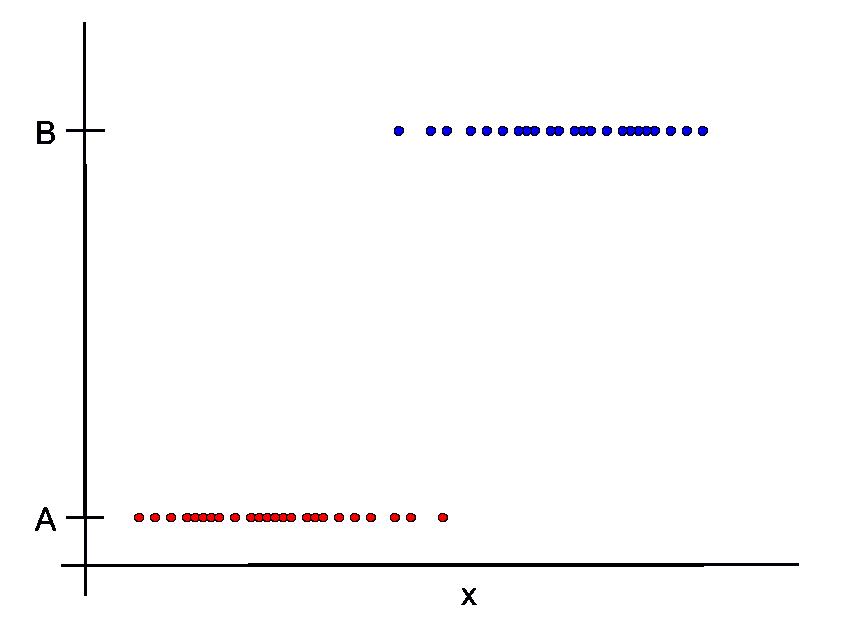

虽然我们可以绘制一条线来模拟这种行为，但这显然不是线性行为，并且不符合线性回归的假设。数据的形状更像是一个从一类到另一类的阶梯，作为*x*的函数。我们真正需要的是一个函数，它在*x*的较低值时趋近并保持在*A*，而在*x*的较高值时趋近并保持在*B*。

好吧，我们很幸运！确实存在这样一个函数。这个函数被称为**逻辑函数**，它为逻辑回归提供了其名称。它具有以下形式：

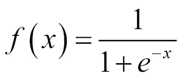

在 Go 中实现如下：

```py
// logistic implements the logistic function, which
// is used in logistic regression.
func logistic(x float64) float64 {
        return 1 / (1 + math.Exp(-x))
}
```

让我们使用`gonum.org/v1/plot`来绘制逻辑函数，看看它是什么样子：

```py
// Create a new plot.
p, err := plot.New()
if err != nil {
    log.Fatal(err)
}
p.Title.Text = "Logistic Function"
p.X.Label.Text = "x"
p.Y.Label.Text = "f(x)"

// Create the plotter function.
logisticPlotter := plotter.NewFunction(func(x float64) float64 { return logistic(x) })
logisticPlotter.Color = color.RGBA{B: 255, A: 255}

// Add the plotter function to the plot.
p.Add(logisticPlotter)

// Set the axis ranges.  Unlike other data sets,
// functions don't set the axis ranges automatically
// since functions don't necessarily have a
// finite range of x and y values.
p.X.Min = -10
p.X.Max = 10
p.Y.Min = -0.1
p.Y.Max = 1.1

// Save the plot to a PNG file.
if err := p.Save(4*vg.Inch, 4*vg.Inch, "logistic.png"); err != nil {
    log.Fatal(err)
}
```

编译并运行此绘图代码将创建以下图表：

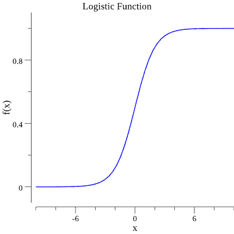

如你所见，这个函数具有我们所寻找的阶梯状行为，可以用来建模类别*A*和*B*之间的步骤（假设*A*对应于*0.0*，而*B*对应于*1.0*）。

不仅如此，逻辑函数还有一些非常方便的性质，我们可以在分类过程中利用这些性质。为了看到这一点，让我们退一步，考虑我们如何可能建模*p*，即类别*A*或*B*发生的概率。一种方法是将**odds ratio**（优势比）的**log**（对数）线性化，即*log(*p / (1 - p)**)，其中优势比告诉我们类别*A*的存在或不存在如何影响类别*B*的存在或不存在。使用这种奇怪的*log*（称为**logit**）的原因很快就会变得有意义，但现在，我们只需假设我们想要如下线性化地建模这个：

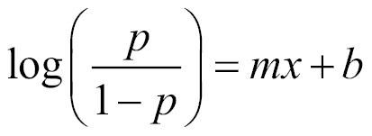

现在，如果我们取这个优势比的指数，我们得到以下结果：

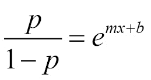

当我们简化前面的方程时，我们得到以下结果：

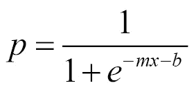

如果你看看这个方程的右侧，你会看到我们的逻辑函数出现了。这个方程为我们的假设提供了正式的依据，即逻辑函数适合于模拟两个类别*A*和*B*之间的分离。例如，如果我们把*p*看作是观察到*B*的概率，并将逻辑函数拟合到我们的数据上，我们就可以得到一个模型，该模型将*B*的概率作为*x*的函数来预测（从而预测*A*的概率为 1 减去该概率）。这在上面的图中得到了体现，我们在其中正式化了*A*和*B*的原始图，并叠加了模拟概率的逻辑函数：

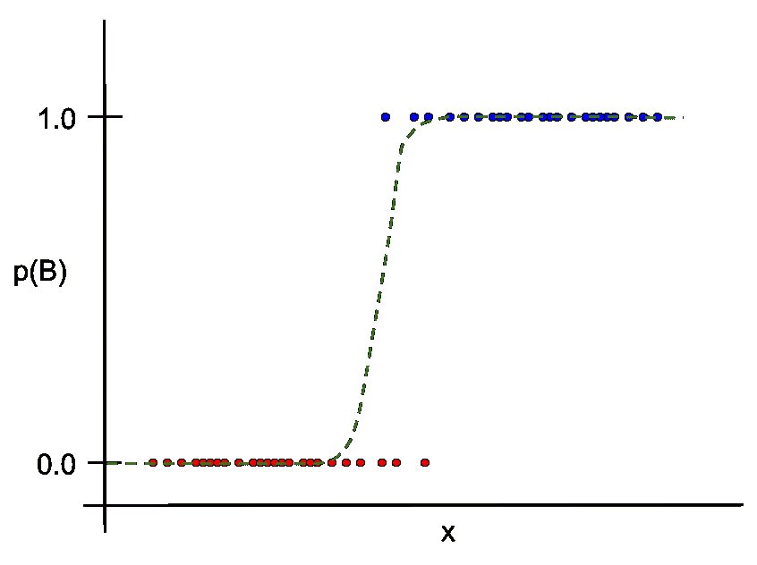

因此，创建逻辑回归模型涉及找到最大化我们能够用逻辑函数预测的观测数目的逻辑函数。

注意，逻辑回归的一个优点是它保持简单且可解释。然而，模型中的系数*m*和*b*在解释上并不像线性回归中的那样。系数*m*（或者如果有多个独立变量，系数*m[1]*、*m[2]*等）与似然比有指数关系。因此，如果你有一个*m*系数为*0.5*，这通过*exp(0.5 x)*与似然比相关。如果我们有两个系数*exp(0.5 x[1] + 1.0 x[2])*，我们可以得出结论，对于*x[1]*，模型类别的似然比是*exp(0.5) = 1.65*，而*x[2]*的似然比是*exp(1.0) = 2.72*。换句话说，我们不能直接比较系数。我们需要在指数的上下文中保持它们。

# 逻辑回归的假设和陷阱

记得之前应用到线性回归上的那些长长的假设列表吗？嗯，逻辑回归并不受那些相同假设的限制。然而，当我们使用逻辑回归时，仍然有一些重要的假设：

+   **与对数似然比之间的线性关系**：正如我们之前讨论的，逻辑回归的潜在假设是我们可以用一条线来模拟对数似然比。

+   **因变量的编码**：在我们之前设置模型时，我们假设我们正在尝试预测*B*的概率，其中概率为 1.0 对应于正的*B*例子。因此，我们需要用这种类型的编码准备我们的数据。这将在下面的例子中演示。

+   **观测的独立性**：我们数据中*x*的每一个例子都必须是独立的。也就是说，我们必须避免诸如多次包含相同例子这样的情况。

此外，以下是一些需要记住的逻辑回归常见陷阱：

+   逻辑回归可能比其他分类技术对异常值更敏感。请记住这一点，并相应地尝试分析你的数据。

+   由于逻辑回归依赖于一个永远不会真正达到*0.0*或*1.0*（除了在正负无穷大时）的指数函数，你可能会在评估指标中看到非常小的下降。

话虽如此，逻辑回归是一种相当稳健的方法，且易于解释。它是一个灵活的模型，在考虑如何解决分类问题时，应该排在你的首选列表中。

# 逻辑回归示例

我们将要用来展示逻辑回归的数据集是 LendingClub 发布的贷款数据。LendingClub 每季度发布这些数据，其原始形式可以在[`www.lendingclub.com/info/download-data.action`](https://www.lendingclub.com/info/download-data.action)找到。我们将使用这本书附带代码包中的简化版数据（只包含两列），即`FICO.Range`（表示贷款申请人的信用评分，由 Fair, Isaac and Company 提供，或称 FICO）和`Interest.Rate`（表示授予贷款申请人的利率）。数据看起来是这样的：

```py
$ head loan_data.csv 
FICO.Range,Interest.Rate
735-739,8.90%
715-719,12.12%
690-694,21.98%
695-699,9.99%
695-699,11.71%
670-674,15.31%
720-724,7.90%
705-709,17.14%
685-689,14.33%
```

我们这个练习的目标是创建一个逻辑回归模型，它将告诉我们，对于给定的信用评分，我们能否以或低于某个利率获得贷款。例如，假设我们感兴趣的是利率低于 12%。我们的模型将告诉我们，在给定的信用评分下，我们能否（是的，或类别一）或不能（不，类别二）获得贷款。

# 清洗和描述数据

观察前述的贷款数据样本，我们可以看到它并不完全是我们需要的分类形式。具体来说，我们需要做以下几步：

1.  从利率和 FICO 评分列中移除非数值字符。

1.  将利率编码为两个类别，针对给定的利率阈值。我们将使用*1.0*来表示第一个类别（是的，我们可以以该利率获得贷款）和*0.0*来表示第二个类别（不，我们不能以该利率获得贷款）。

1.  选择 FICO 信用评分的单个值。我们给出了一个信用评分的范围，但我们需要一个单一值。平均值、最小值或最大值是自然的选择，在我们的例子中，我们将使用最小值（为了保守起见）。

1.  在这种情况下，我们将**标准化**我们的 FICO 评分（通过从每个评分中减去最小评分值然后除以评分范围）。这将使评分值分布在*0.0*到*1.0*之间。我们需要对此进行合理的解释，因为它会使我们的数据不那么易读。然而，有一个合理的解释。我们将使用梯度下降法来训练逻辑回归，这种方法在标准化数据上表现更好。实际上，当使用非标准化数据运行相同的示例时，会出现收敛问题。

让我们编写一个 Go 程序，该程序将为我们给定利率（例如 12%）的数据进行清理。我们将从指定的文件中读取数据，使用`encoding/csv`解析值，并将清理后的数据放入名为`clean_loan_data.csv`的输出文件中。在数据清理过程中，我们将使用以下最小和最大值，我们将它们定义为常量：

```py
const (
    scoreMax = 830.0
    scoreMin = 640.0
)
```

然后，实际的清理功能如下所示：

```py
// Open the loan dataset file.
f, err := os.Open("loan_data.csv")
if err != nil {
    log.Fatal(err)
}
defer f.Close()

// Create a new CSV reader reading from the opened file.
reader := csv.NewReader(f)
reader.FieldsPerRecord = 2

// Read in all of the CSV records
rawCSVData, err := reader.ReadAll()
if err != nil {
    log.Fatal(err)
}

// Create the output file.
f, err = os.Create("clean_loan_data.csv")
if err != nil {
    log.Fatal(err)
}
defer f.Close()

// Create a CSV writer.
w := csv.NewWriter(f)

// Sequentially move the rows writing out the parsed values.
for idx, record := range rawCSVData {

    // Skip the header row.
    if idx == 0 {

        // Write the header to the output file.
        if err := w.Write(record); err != nil {
            log.Fatal(err)
        }
        continue
    }

    // Initialize a slice to hold our parsed values.
    outRecord := make([]string, 2)

    // Parse and standardize the FICO score.
    score, err := strconv.ParseFloat(strings.Split(record[0], "-")[0], 64)
    if err != nil {
        log.Fatal(err)
    }

    outRecord[0] = strconv.FormatFloat((score-scoreMin)/(scoreMax-scoreMin), 'f', 4, 64)

    // Parse the Interest rate class.
    rate, err := strconv.ParseFloat(strings.TrimSuffix(record[1], "%"), 64)
    if err != nil {
        log.Fatal(err)
    }

    if rate <= 12.0 {
        outRecord[1] = "1.0"

        // Write the record to the output file.
        if err := w.Write(outRecord); err != nil {
            log.Fatal(err)
        }
        continue
    }

    outRecord[1] = "0.0"

    // Write the record to the output file.
    if err := w.Write(outRecord); err != nil {
        log.Fatal(err)
    }
}

// Write any buffered data to the underlying writer (standard output).
w.Flush()

if err := w.Error(); err != nil {
    log.Fatal(err)
}
```

编译并运行它确认了我们的预期输出：

```py
$ go build
$ ./example3 
$ head clean_loan_data.csv 
FICO_score,class
0.5000,1.0
0.3947,0.0
0.2632,0.0
0.2895,1.0
0.2895,1.0
0.1579,0.0
0.4211,1.0
0.3421,0.0
0.2368,0.0
```

太好了！我们的数据已经以所需的格式存在。现在，让我们通过创建 FICO 评分和利率数据的直方图以及计算摘要统计来对我们的数据有更多的直观了解。我们将使用`github.com/kniren/gota/dataframe`来计算摘要统计，并使用`gonum.org/v1/plot`来生成直方图：

```py
// Open the CSV file.
loanDataFile, err := os.Open("clean_loan_data.csv")
if err != nil {
    log.Fatal(err)
}
defer loanDataFile.Close()

// Create a dataframe from the CSV file.
loanDF := dataframe.ReadCSV(loanDataFile)

// Use the Describe method to calculate summary statistics
// for all of the columns in one shot.
loanSummary := loanDF.Describe()

// Output the summary statistics to stdout.
fmt.Println(loanSummary)

// Create a histogram for each of the columns in the dataset.
for _, colName := range loanDF.Names() {

    // Create a plotter.Values value and fill it with the
    // values from the respective column of the dataframe.
    plotVals := make(plotter.Values, loanDF.Nrow())
    for i, floatVal := range loanDF.Col(colName).Float() {
        plotVals[i] = floatVal
    }

    // Make a plot and set its title.
    p, err := plot.New()
    if err != nil {
        log.Fatal(err)
    }
    p.Title.Text = fmt.Sprintf("Histogram of a %s", colName)

    // Create a histogram of our values.
    h, err := plotter.NewHist(plotVals, 16)
    if err != nil {
        log.Fatal(err)
    }

    // Normalize the histogram.
    h.Normalize(1)

    // Add the histogram to the plot.
    p.Add(h)

    // Save the plot to a PNG file.
    if err := p.Save(4*vg.Inch, 4*vg.Inch, colName+"_hist.png"); err != nil {
        log.Fatal(err)
    }
}
```

运行此代码将产生以下输出：

```py
$ go build
$ ./myprogram
[7x3] DataFrame

 column FICO_score class 
 0: mean 0.346782 0.396800
 1: stddev 0.184383 0.489332
 2: min 0.000000 0.000000
 3: 25% 0.210500 0.000000
 4: 50% 0.315800 0.000000
 5: 75% 0.447400 1.000000
 6: max 1.000000 1.000000
 <string> <float> <float>     

$ ls *.png
class_hist.png FICO_score_hist.png
```

我们可以看到，平均信用评分相当高，为 *706.1*，并且一和零类之间有一个相当好的平衡，这从接近 *0.5* 的平均值中可以看出。然而，似乎有更多的零类示例（这对应于没有以 12%或以下利率获得贷款）。此外，`*.png`直方图图看起来如下：

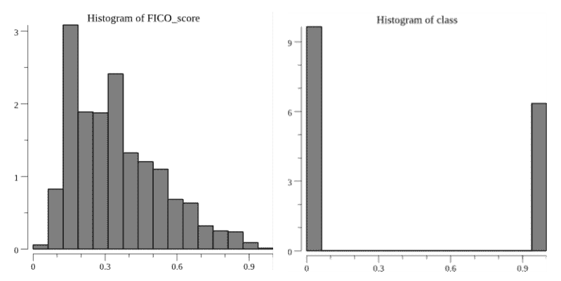

这证实了我们对类别之间平衡的怀疑，并显示 FICO 评分略偏向较低值。

# 创建我们的训练和测试集

与前一章中的示例类似，我们需要将我们的数据分为训练集和测试集。我们再次使用`github.com/kniren/gota/dataframe`来完成此操作：

```py
// Open the clean loan dataset file.
f, err := os.Open("clean_loan_data.csv")        
if err != nil {
    log.Fatal(err)
}
defer f.Close()

// Create a dataframe from the CSV file.
// The types of the columns will be inferred.
loanDF := dataframe.ReadCSV(f)

// Calculate the number of elements in each set.
trainingNum := (4 * loanDF.Nrow()) / 5
testNum := loanDF.Nrow() / 5
if trainingNum+testNum < loanDF.Nrow() {
    trainingNum++
}

// Create the subset indices.
trainingIdx := make([]int, trainingNum)
testIdx := make([]int, testNum)

// Enumerate the training indices.
for i := 0; i < trainingNum; i++ {
    trainingIdx[i] = i
}

// Enumerate the test indices.
for i := 0; i < testNum; i++ {
    testIdx[i] = trainingNum + i
}

// Create the subset dataframes.
trainingDF := loanDF.Subset(trainingIdx)
testDF := loanDF.Subset(testIdx)

// Create a map that will be used in writing the data
// to files.
setMap := map[int]dataframe.DataFrame{
    0: trainingDF,
    1: testDF,
}

// Create the respective files.
for idx, setName := range []string{"training.csv", "test.csv"} {

    // Save the filtered dataset file.
    f, err := os.Create(setName)
    if err != nil {
        log.Fatal(err)
    }

    // Create a buffered writer.
    w := bufio.NewWriter(f)

    // Write the dataframe out as a CSV.
    if err := setMap[idx].WriteCSV(w); err != nil {
        log.Fatal(err)
    }
}
```

编译并运行此代码将产生两个文件，包含我们的训练和测试示例：

```py
$ go build
$ ./myprogram 
$ wc -l *.csv
 2046 clean_loan_data.csv
  410 test.csv
 1638 training.csv
 4094 total
```

# 训练和测试逻辑回归模型

现在，让我们创建一个函数来训练逻辑回归模型。这个函数需要执行以下操作：

1.  将我们的 FICO 评分数据作为独立变量接受。

1.  在我们的模型中添加一个截距。

1.  初始化并优化逻辑回归模型的系数（或权重）。

1.  返回定义我们的训练模型的优化权重。

为了优化系数/权重，我们将使用一种称为**随机梯度下降**的技术。这种技术将在附录*与机器学习相关的算法/技术*中更详细地介绍。现在，只需说我们正在尝试使用一些未优化的权重进行预测，计算这些权重的错误，然后迭代地更新它们以最大化正确预测的可能性。

以下是对这种优化的实现。该函数接受以下输入：

+   `features`：一个指向 gonum `mat64.Dense`矩阵的指针。这个矩阵包括一个用于任何独立变量（在我们的例子中是 FICO 评分）的列，以及表示截距的 1.0 列。

+   `labels`：包含所有对应于我们的`features`的类标签的浮点数切片。

+   `numSteps`：优化的最大迭代次数。

+   `learningRate`：一个可调整的参数，有助于优化的收敛。

然后该函数输出逻辑回归模型的优化权重：

```py
// logisticRegression fits a logistic regression model
// for the given data.
func logisticRegression(features *mat64.Dense, labels []float64, numSteps int, learningRate float64) []float64 {

        // Initialize random weights.
        _, numWeights := features.Dims()
        weights := make([]float64, numWeights)

        s := rand.NewSource(time.Now().UnixNano())
        r := rand.New(s)

        for idx, _ := range weights {
                weights[idx] = r.Float64()
        }

        // Iteratively optimize the weights.
        for i := 0; i < numSteps; i++ {

        // Initialize a variable to accumulate error for this iteration.
        var sumError float64

        // Make predictions for each label and accumulate error.
        for idx, label := range labels {

            // Get the features corresponding to this label.
            featureRow := mat64.Row(nil, idx, features)

            // Calculate the error for this iteration's weights.
            pred := logistic(featureRow[0]*weights[0]
            featureRow[1]*weights[1])
            predError := label - pred
            sumError += math.Pow(predError, 2)

            // Update the feature weights.
            for j := 0; j < len(featureRow); j++ {
                weights[j] += learningRate * predError * pred * (1 - pred) * featureRow[j]
            }
        }
    }

    return weights
}
```

如您所见，这个函数相对紧凑且简单。这将使我们的代码易于阅读，并允许我们团队的人快速理解模型中的情况，而不会将事物隐藏在黑盒中。

尽管 R 和 Python 在机器学习中的流行，您可以看到机器学习算法可以在 Go 中快速且紧凑地实现。此外，这些实现立即达到了远远超过其他语言中天真实现的完整性水平。

要在我们的训练数据集上训练我们的逻辑回归模型，我们将使用`encoding/csv`解析我们的训练文件，然后向`logisticRegression`函数提供必要的参数。这个过程如下，以及一些代码，将我们的训练好的逻辑公式输出到`stdout`：

```py
// Open the training dataset file.
f, err := os.Open("training.csv")
if err != nil {
    log.Fatal(err)
}
defer f.Close()

// Create a new CSV reader reading from the opened file.
reader := csv.NewReader(f)
reader.FieldsPerRecord = 2

// Read in all of the CSV records
rawCSVData, err := reader.ReadAll()
if err != nil {
    log.Fatal(err)
}

// featureData and labels will hold all the float values that
// will eventually be used in our training.
featureData := make([]float64, 2*len(rawCSVData))
labels := make([]float64, len(rawCSVData))

// featureIndex will track the current index of the features
// matrix values.
var featureIndex int

// Sequentially move the rows into the slices of floats.
for idx, record := range rawCSVData {

    // Skip the header row.
    if idx == 0 {
        continue
    }

    // Add the FICO score feature.
    featureVal, err := strconv.ParseFloat(record[0], 64)
    if err != nil {
        log.Fatal(err)
    }

    featureData[featureIndex] = featureVal

    // Add an intercept.
    featureData[featureIndex+1] = 1.0

    // Increment our feature row.
    featureIndex += 2

    // Add the class label.
    labelVal, err := strconv.ParseFloat(record[1], 64)
    if err != nil {
        log.Fatal(err)
    }

    labels[idx] = labelVal
}        

// Form a matrix from the features.
features := mat64.NewDense(len(rawCSVData), 2, featureData)

// Train the logistic regression model.
weights := logisticRegression(features, labels, 100, 0.3)

// Output the Logistic Regression model formula to stdout.
formula := "p = 1 / ( 1 + exp(- m1 * FICO.score - m2) )"
fmt.Printf("\n%s\n\nm1 = %0.2f\nm2 = %0.2f\n\n", formula, weights[0], weights[1])
```

编译并运行这个训练功能，得到以下训练好的逻辑回归公式：

```py
$ go build
$ ./myprogram

p = 1 / ( 1 + exp(- m1 * FICO.score - m2) )

m1 = 13.65
m2 = -4.89

```

然后，我们可以直接使用这个公式进行预测。但是，请记住，这个模型预测的是获得贷款（利率为 12%）的概率。因此，在做出预测时，我们需要使用概率的阈值。例如，我们可以说任何*p*大于或等于*0.5*的将被视为正值（类别一，或获得贷款），任何更低的*p*值将被视为负值。这种预测在以下函数中实现：

```py
// predict makes a prediction based on our
// trained logistic regression model.
func predict(score float64) float64 {

    // Calculate the predicted probability.
    p := 1 / (1 + math.Exp(-13.65*score+4.89))

    // Output the corresponding class.
    if p >= 0.5 {
        return 1.0
    }

    return 0.0
}
```

使用这个`predict`函数，我们可以使用书中前面介绍的评价指标之一来评估我们训练好的逻辑回归模型。在这种情况下，让我们使用准确率，如下面的代码所示：

```py
// Open the test examples.
f, err := os.Open("test.csv")
if err != nil {
    log.Fatal(err)
}
defer f.Close()

// Create a new CSV reader reading from the opened file.
reader := csv.NewReader(f)

// observed and predicted will hold the parsed observed and predicted values
// form the labeled data file.
var observed []float64
var predicted []float64

// line will track row numbers for logging.
line := 1

// Read in the records looking for unexpected types in the columns.
for {

    // Read in a row. Check if we are at the end of the file.
    record, err := reader.Read()
    if err == io.EOF {
        break
    }

    // Skip the header.
    if line == 1 {
        line++
        continue
    }

    // Read in the observed value.
    observedVal, err := strconv.ParseFloat(record[1], 64)
    if err != nil {
        log.Printf("Parsing line %d failed, unexpected type\n", line)
        continue
    }

    // Make the corresponding prediction.
    score, err := strconv.ParseFloat(record[0], 64)
    if err != nil {
        log.Printf("Parsing line %d failed, unexpected type\n", line)
        continue
    }

    predictedVal := predict(score)

    // Append the record to our slice, if it has the expected type.
    observed = append(observed, observedVal)
    predicted = append(predicted, predictedVal)
    line++
}

// This variable will hold our count of true positive and
// true negative values.
var truePosNeg int

// Accumulate the true positive/negative count.
for idx, oVal := range observed {
    if oVal == predicted[idx] {
        truePosNeg++
    }
}

// Calculate the accuracy (subset accuracy).
accuracy := float64(truePosNeg) / float64(len(observed))

// Output the Accuracy value to standard out.
fmt.Printf("\nAccuracy = %0.2f\n\n", accuracy)

```

在我们的数据上运行这个测试，得到的准确率如下：

```py
$ go build
$ ./myprogram

Accuracy = 0.83
```

太好了！83%的准确率对于一个我们用大约 30 行 Go 语言实现的机器学习模型来说并不差。使用这个简单的模型，我们能够预测，给定一个特定的信用评分，贷款申请人是否会获得利率低于或等于 12%的贷款。不仅如此，我们使用的是来自真实公司的真实世界混乱数据。

# k-最近邻

从逻辑回归转向，让我们尝试我们的第一个非回归模型，**k-最近邻**（**kNN**）。kNN 也是一个简单的分类模型，并且是掌握起来最容易的模型算法之一。它遵循这样一个基本前提：如果我想对一条记录进行分类，我应该考虑其他类似的记录。

kNN 在多个现有的 Go 包中实现，包括`github.com/sjwhitworth/golearn`、`github.com/rikonor/go-ann`、`github.com/akreal/knn`和`github.com/cdipaolo/goml`。我们将使用`github.com/sjwhitworth/golearn`实现，这将作为使用`github.com/sjwhitworth/golearn`的绝佳介绍。

# kNN 概述

如前所述，kNN 基于这样的原则：我们应该根据相似记录来分类记录。在定义相似性时有一些细节需要处理。然而，kNN 没有许多模型所具有的参数和选项的复杂性。

再次想象一下，我们有两个类别*A*和*B*。然而，这次，假设我们想要根据两个特征*x[1]*和*x[2]*进行分类。直观上看，这看起来可能如下所示：

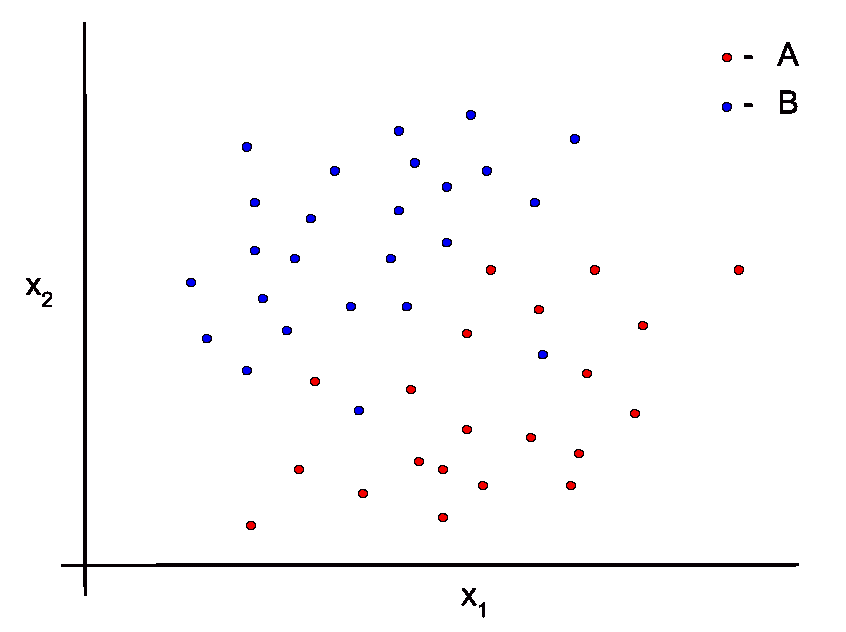

现在，假设我们有一个未知类别的新的数据点。这个新的数据点将位于这个空间中的某个位置。kNN 算法表示，为了对这个新的数据点进行分类，我们应该执行以下操作：

1.  根据某种接近度度量（例如，在这个*x[1]*和*x[2]*的空间中的直线距离）找到新点的*k*个最近点。

1.  确定有多少个*k*个最近的邻居属于类别*A*，以及有多少个属于类别*B*。

1.  将新点分类为*k*个最近邻居中的主导类别。

例如，如果我们选择*k*为四，这看起来可能如下所示：

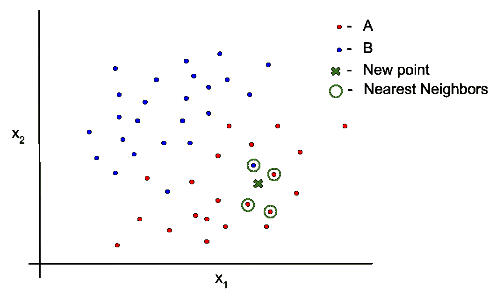

我们神秘点有三个*A*最近的邻居，只有一个*B*最近的邻居。因此，我们将这个新的神秘点分类为类别*A*。

你可以使用许多相似度度量来确定*k*个最近的邻居。其中最常见的是欧几里得距离*，它只是由你的特征（在我们的例子中是*x[1]*和*x[2]*）组成的空间中一个点到下一个点的直线距离。其他还包括**曼哈顿距离**、**闵可夫斯基距离**、**余弦相似度**和**Jaccard 相似度**。

就像评估指标一样，有各种方法可以测量距离或相似度。在使用 kNN 时，你应该研究这些度量的优缺点，并选择一个适合你的用例和数据的度量。然而，如果你不确定，可以从欧几里得距离开始尝试。

# kNN 的假设和陷阱

由于其简单性，kNN 没有太多假设。然而，有一些常见的陷阱，你在应用 kNN 时应该注意：

+   kNN 是懒散评估的。这意味着，当我们需要做出预测时，才会计算距离或相似度。在做出预测之前，实际上并没有什么需要训练或拟合的。这有一些优点，但是当数据点很多时，计算和搜索点可能会很慢。

+   *k*的选择取决于你，但你应该围绕选择*k*制定一些形式化方法，并为你选择的*k*提供合理的解释。选择*k*的一个常见技术是搜索一系列*k*值。例如，你可以从*k = 2*开始。然后，你可以开始增加*k*，并对每个*k*在测试集上进行评估。

+   kNN 没有考虑哪些特征比其他特征更重要。此外，如果你的特征的确定性尺度比其他特征大得多，这可能会不自然地增加这些较大特征的重要性。

# kNN 示例

对于这一点，以及本章剩余的示例，我们将使用关于**鸢尾花**的数据集来解决一个经典的分类问题。数据集看起来是这样的：

```py
$ head iris.csv 
sepal_length,sepal_width,petal_length,petal_width,species
5.1,3.5,1.4,0.2,Iris-setosa
4.9,3.0,1.4,0.2,Iris-setosa
4.7,3.2,1.3,0.2,Iris-setosa
4.6,3.1,1.5,0.2,Iris-setosa
5.0,3.6,1.4,0.2,Iris-setosa
5.4,3.9,1.7,0.4,Iris-setosa
4.6,3.4,1.4,0.3,Iris-setosa
5.0,3.4,1.5,0.2,Iris-setosa
4.4,2.9,1.4,0.2,Iris-setosa
```

前四列是鸢尾花的各种测量值，最后一列是对应的物种标签。本例的目标是创建一个 kNN 分类器，能够从一组测量值中预测鸢尾花的物种。有三种花类，或三个类别，这使得这是一个多类别分类（与我们在逻辑回归中进行的二进制分类相反）。

你可能还记得，我们在第二章，*矩阵、概率和统计学*中已经详细分析了鸢尾花数据集。我们在这里不会重新分析数据。然而，在我们开发 kNN 模型时，对数据有直观的了解仍然很重要。确保你翻回到第二章，*矩阵、概率和统计学*，以提醒自己关于这个数据集中变量分布的情况。

在本例中，我们将使用`github.com/sjwhitworth/golearn`。`github.com/sjwhitworth/golearn`实现了多种机器学习模型，包括 kNN 和一些我们很快将要探索的其他模型。`github.com/sjwhitworth/golearn`还实现了交叉验证。我们将利用交叉验证在这里进行训练、测试和验证，这既方便又让我们避免了手动在训练集和测试集之间进行分割。

要使用`github.com/sjwhitworth/golearn`的任何模型，我们首先必须将数据转换为`github.com/sjwhitworth/golearn`内部格式，称为**实例**。对于鸢尾花数据，我们可以这样做：

```py
// Read in the iris data set into golearn "instances".
irisData, err := base.ParseCSVToInstances("iris.csv", true)
if err != nil {
    log.Fatal(err)
}
```

然后，初始化我们的 kNN 模型并进行交叉验证是快速且简单的：

```py
// Initialize a new KNN classifier.  We will use a simple
// Euclidean distance measure and k=2.
knn := knn.NewKnnClassifier("euclidean", "linear", 2)

// Use cross-fold validation to successively train and evaluate the model
// on 5 folds of the data set.
cv, err := evaluation.GenerateCrossFoldValidationConfusionMatrices(irisData, knn, 5)
if err != nil {
    log.Fatal(err)
}
```

最后，我们可以得到交叉验证的五次折叠的平均准确率，并将该准确率输出到`stdout`：

```py
// Get the mean, variance and standard deviation of the accuracy for the
// cross validation.
mean, variance := evaluation.GetCrossValidatedMetric(cv, evaluation.GetAccuracy)
stdev := math.Sqrt(variance)

// Output the cross metrics to standard out.
fmt.Printf("\nAccuracy\n%.2f (+/- %.2f)\n\n", mean, stdev*2)
```

将所有这些编译并运行，会得到以下输出：

```py
$ go build
$ ./myprogram 
Optimisations are switched off
Optimisations are switched off
Optimisations are switched off
Optimisations are switched off
Optimisations are switched off
KNN: 95.00 % done
Accuracy
0.95 (+/- 0.05)
```

在交叉验证期间，从包中输出的良性日志显示，kNN（k = 2）能够以 95%的准确率预测鸢尾花物种！

下一步将是尝试使用不同的*k*值来测试这个模型。实际上，绘制准确率与*k*值的对比图，以查看哪个*k*值能给出最佳性能，将是一个很好的练习。

# 决策树和随机森林

基于树的模型与我们之前讨论的类型模型非常不同，但它们被广泛使用，并且非常强大。你可以将 **决策树** 模型想象成一系列应用于你的数据的 `if-then` 语句。当你训练这种类型的模型时，你正在构建一系列控制流语句，最终允许你分类记录。

决策树在 `github.com/sjwhitworth/golearn` 和 `github.com/xlvector/hector` 等地方实现，随机森林在 `github.com/sjwhitworth/golearn`、`github.com/xlvector/hector` 和 `github.com/ryanbressler/CloudForest` 等地方实现。我们将在下一节中展示的示例中再次使用 `github.com/sjwhitworth/golearn`。

# 决策树和随机森林概述

再次考虑我们的类 *A* 和 *B*。在这种情况下，假设我们有一个特征 *x[1]*，其范围从 *0.0* 到 *1.0*，我们还有一个特征 *x[2]*，它是分类的，可以取两个值之一，*a[1]* 和 *a[2]*（这可能像男性/女性或红色/蓝色这样的东西）。一个用于分类新数据点的决策树可能看起来像以下这样：

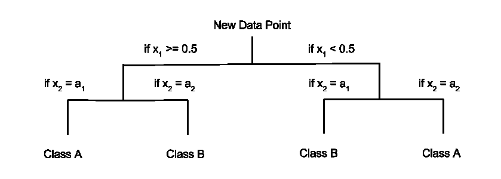

有许多方法可以选择如何构建决策树，如何分割等。确定决策树构建的最常见方法之一是使用一个称为 **熵** 的量。这种基于熵的方法在 *附录* 中有更详细的讨论，但基本上，我们根据哪些特征给我们提供关于我们正在解决的问题的最多信息来构建树和分割。更重要特征在树上优先级更高。

这种对重要特征的优先级排序和自然的外观结构使得决策树非常可解释。这使得决策树对于你可能需要解释你的推理的应用非常重要（例如，出于合规原因）。

然而，单个决策树可能对训练数据的变化不稳定。换句话说，树的结构可能会随着训练数据中甚至很小的变化而显著改变。这在操作上和认知上都是一项挑战，这也是为什么创建 **随机森林** 模型的一个原因。

随机森林是一组协同工作的决策树，用于做出预测。与单个决策树相比，随机森林更稳定，并且对过拟合有更强的鲁棒性。实际上，这种将模型组合成 **集成** 的想法在机器学习中很普遍，旨在提高简单分类器（如决策树）的性能，并帮助防止过拟合。

为了构建一个随机森林，我们选择*N*个随机特征子集，并基于这些子集构建*N*个独立的决策树。在做出预测时，我们可以让这*N*个决策树中的每一个做出预测。为了得到最终的预测，我们可以对这*N*个预测进行多数投票。

# 决策树和随机森林的假设和陷阱

基于树的算法是非统计方法，没有许多与回归等事物相关的假设。然而，有一些陷阱需要记住：

+   单个决策树模型很容易对数据进行过拟合，尤其是如果你没有限制树的深度。大多数实现允许你通过一个参数（或**剪枝**决策树）来限制这个深度。剪枝参数通常会允许你移除对预测影响较小的树的某些部分，从而降低模型的整体复杂性。

+   当我们开始谈论集成模型，如随机森林时，我们正在进入一些相对不透明的模型。很难对模型集获得直观的认识，你必须在某种程度上将其视为黑盒。像这样的不太可解释的模型只有在必要时才应该应用。

+   尽管决策树本身在计算上非常高效，但随机森林的计算效率可能会非常低，这取决于你有多少特征以及你的随机森林中有多少棵树。

# 决策树示例

我们将再次使用鸢尾花数据集来演示这个例子。您已经学习了如何在`github.com/sjwhitworth/golearn`中处理这个数据集，我们还可以再次遵循类似的模式。我们还将再次使用交叉验证。然而，这次我们将拟合一个决策树模型：

```py
// Read in the iris data set into golearn "instances".
irisData, err := base.ParseCSVToInstances("iris.csv", true)
if err != nil {
    log.Fatal(err)
}

// This is to seed the random processes involved in building the
// decision tree.
rand.Seed(44111342)

// We will use the ID3 algorithm to build our decision tree.  Also, we
// will start with a parameter of 0.6 that controls the train-prune split.
tree := trees.NewID3DecisionTree(0.6)

// Use cross-fold validation to successively train and evaluate the model
// on 5 folds of the data set.
cv, err := evaluation.GenerateCrossFoldValidationConfusionMatrices(irisData, tree, 5)
if err != nil {
    log.Fatal(err)
}

// Get the mean, variance and standard deviation of the accuracy for the
// cross validation.
mean, variance := evaluation.GetCrossValidatedMetric(cv, evaluation.GetAccuracy)
stdev := math.Sqrt(variance)

// Output the cross metrics to standard out.
fmt.Printf("\nAccuracy\n%.2f (+/- %.2f)\n\n", mean, stdev*2)
```

编译并运行这个决策树模型会得到以下结果：

```py
$ go build
$ ./myprogram 

Accuracy
0.94 (+/- 0.06)
```

这次达到了 94%的准确率。略低于我们的 kNN 模型，但仍然非常令人尊重。

# 随机森林示例

`github.com/sjwhitworth/golearn`也实现了随机森林。为了在解决鸢尾花问题时使用随机森林，我们只需将我们的决策树模型替换为随机森林。我们需要告诉这个包我们想要构建多少棵树以及每棵树有多少随机选择的特征。

每棵树的特征数量的一个合理的默认值是总特征数的平方根，在我们的例子中将是两个。我们将看到，对于我们的小型数据集，这个选择不会产生好的结果，因为我们在这里需要所有特征来做出好的预测。然而，我们将使用合理的默认值来演示随机森林是如何工作的：

```py
// Assemble a random forest with 10 trees and 2 features per tree,
// which is a sane default (number of features per tree is normally set
// to sqrt(number of features)).
rf := ensemble.NewRandomForest(10, 2)

// Use cross-fold validation to successively train and evaluate the model
// on 5 folds of the data set.
cv, err := evaluation.GenerateCrossFoldValidationConfusionMatrices(irisData, rf, 5)
if err != nil {
    log.Fatal(err)
}
```

运行这个算法得到的准确率比单个决策树要差。如果我们把每棵树的特征数量恢复到四，我们将重新获得单个决策树的准确率。这意味着每棵树都是用与单个决策树相同的信息进行训练的，因此产生了相同的结果。

随机森林在这里可能过于强大，并且无法用任何性能提升来证明其合理性，因此最好坚持使用单个决策树。这个单一的决策树也更易于解释和更高效。

# 简单贝叶斯

我们在这里将要介绍的用于分类的最终模型被称为**简单贝叶斯**。在第二章，“矩阵、概率和统计学”中，我们讨论了贝叶斯定理，它是这种技术的基础。简单贝叶斯是一种基于概率的方法，类似于逻辑回归，但其基本思想和假设是不同的。

简单贝叶斯也实现了`github.com/sjwhitworth/golearn`，这将使我们能够轻松尝试它。然而，还有许多其他的 Go 实现，包括`github.com/jbrukh/bayesian`、`github.com/lytics/multibayes`和`github.com/cdipaolo/goml`。

# 简单贝叶斯及其大假设概述

简单贝叶斯在一条大假设下运行。这个假设说，类别和我们的数据集中某个特征的存在或不存在与数据集中其他特征的存在或不存在是独立的。这使我们能够为给定某些特征的存在或不存在写出非常简单的某个类别的概率公式。

让我们通过一个例子来使这个问题更具体。再次，假设我们正在尝试根据电子邮件中的单词预测两个类别，*A*和*B*（例如，垃圾邮件和非垃圾邮件），基于电子邮件中的单词。简单贝叶斯将假设某个单词的存在/不存在与其他单词的存在/不存在是独立的。如果我们做出这个假设，某个类别包含某些单词的概率与所有单个条件概率相乘的比例是相等的。使用这个，贝叶斯定理，一些链式规则以及我们的独立假设，我们可以写出以下某个类别的条件概率：

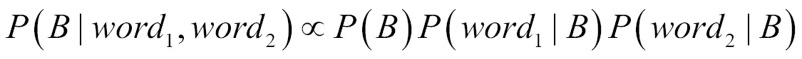

右侧的所有内容我们都可以通过计算训练集中特征和标签的出现次数来计算，这就是在训练模型时所做的。然后可以通过将这些概率连成链来做出预测。

实际上，在实践中，使用一个小技巧来避免将许多接近零的数字连在一起。我们可以取概率的对数，然后相加，最后取表达式的指数。这个过程在实践中通常更好。

# 简单贝叶斯示例

再次回到我们的贷款数据集，我们将使用`github.com/sjwhitworth/golearn`来用简单贝叶斯解决相同的贷款接受问题。我们将使用与逻辑回归示例中相同的训练和测试集。然而，我们需要将数据集中的标签转换为`github.com/sjwhitworth/golearn`中使用的二分类器格式。我们可以编写一个简单的函数来完成这个转换：

```py
// convertToBinary utilizes built in golearn functionality to
// convert our labels to a binary label format.
func convertToBinary(src base.FixedDataGrid) base.FixedDataGrid {
    b := filters.NewBinaryConvertFilter()
    attrs := base.NonClassAttributes(src)
    for _, a := range attrs {
        b.AddAttribute(a)
    }
    b.Train()
    ret := base.NewLazilyFilteredInstances(src, b)
    return ret
}
```

一旦我们有了这些，我们就可以训练和测试我们的朴素贝叶斯模型，如下面的代码所示：

```py
// Read in the loan training data set into golearn "instances".
trainingData, err := base.ParseCSVToInstances("training.csv", true)
if err != nil {
    log.Fatal(err)
}

// Initialize a new Naive Bayes classifier.
nb := naive.NewBernoulliNBClassifier()

// Fit the Naive Bayes classifier.
nb.Fit(convertToBinary(trainingData))

// Read in the loan test data set into golearn "instances".
// This time we will utilize a template of the previous set
// of instances to validate the format of the test set.
testData, err := base.ParseCSVToTemplatedInstances("test.csv", true, trainingData)
if err != nil {
    log.Fatal(err)
}

// Make our predictions.
predictions := nb.Predict(convertToBinary(testData))

// Generate a Confusion Matrix.
cm, err := evaluation.GetConfusionMatrix(testData, predictions)
if err != nil {
    log.Fatal(err)
}

// Retrieve the accuracy.
accuracy := evaluation.GetAccuracy(cm)
fmt.Printf("\nAccuracy: %0.2f\n\n", accuracy)
```

编译并运行此代码给出的准确率如下：

```py
$ go build
$ ./myprogram 

Accuracy: 0.63
```

这并不如我们从头实现的逻辑回归那么好。然而，这里仍然有一定的预测能力。一个很好的练习是向这个模型添加一些来自 LendingClub 数据集的其他特征，特别是某些分类变量。这可能会提高朴素贝叶斯的结果。

# 参考文献

一般分类：

+   `github.com/sjwhitworth/golearn`文档：[`godoc.org/github.com/sjwhitworth/golearn`](https://godoc.org/github.com/sjwhitworth/golearn)

# 摘要

我们已经涵盖了多种分类模型，包括逻辑回归、k-最近邻、决策树、随机森林和朴素贝叶斯。实际上，我们还从头实现了逻辑回归。所有这些模型都有它们各自的优势和劣势，我们已经讨论过了。然而，它们应该为你提供一套良好的工具，让你可以使用 Go 开始进行分类。

在下一章中，我们将讨论另一种类型的机器学习，称为**聚类**。这是我们将要讨论的第一个无监督技术，我们将尝试几种不同的方法。
