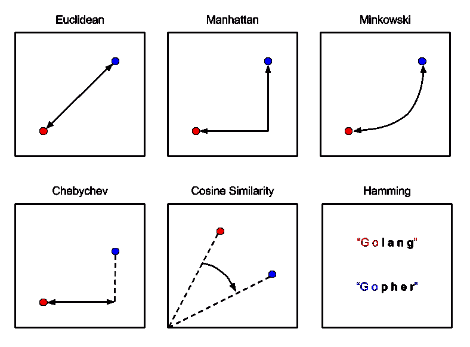
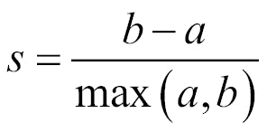
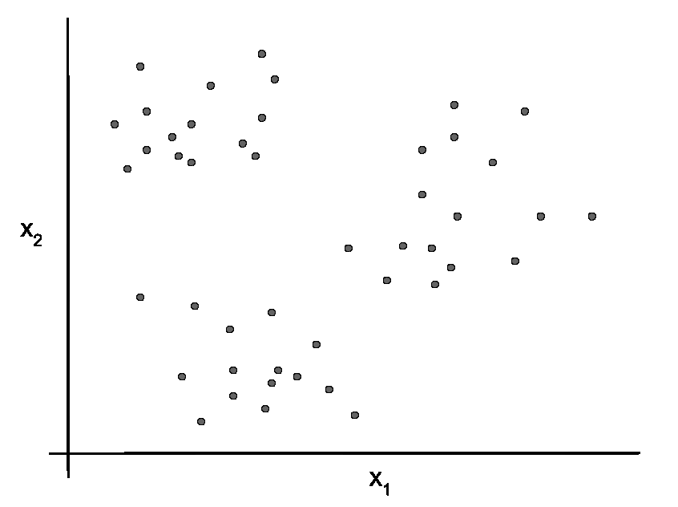
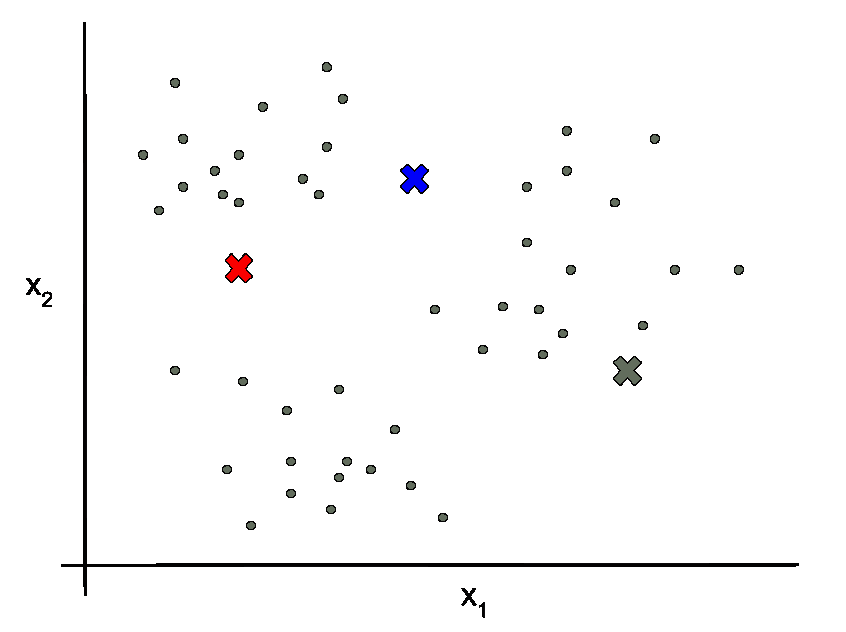
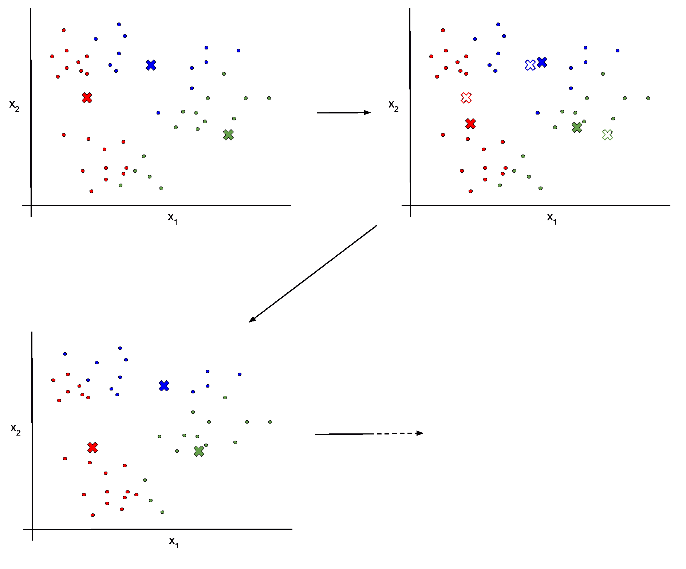
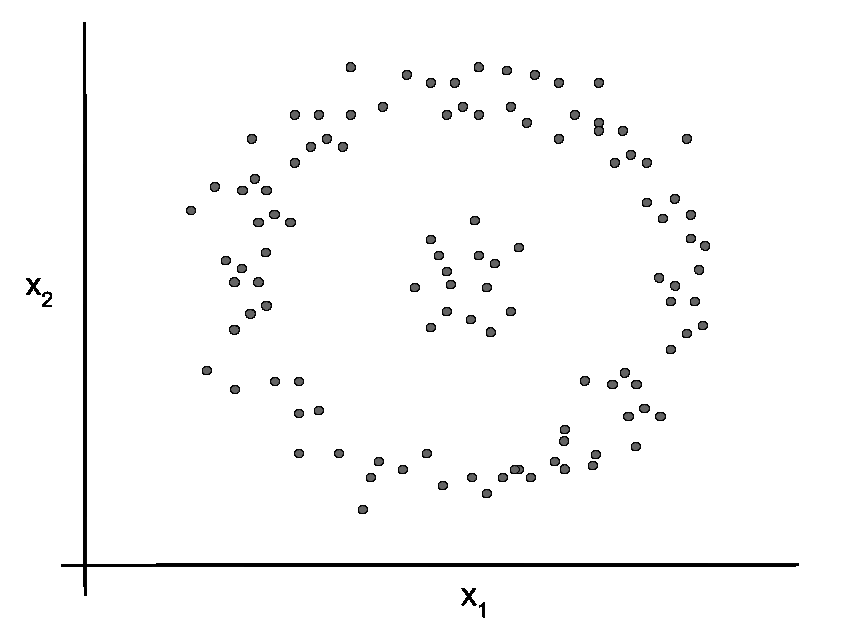
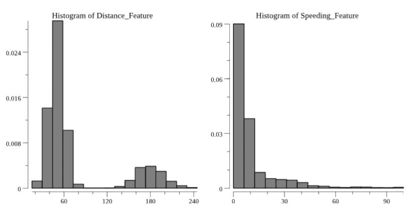
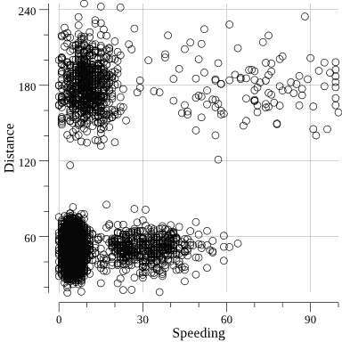
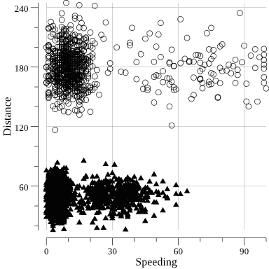

# 聚类

通常，一组数据可以被组织成一组聚类。例如，你可能能够将数据组织成与某些潜在属性（如包括年龄、性别、地理、就业状态等人口统计属性）或某些潜在过程（如浏览、购物、机器人交互以及网站上的其他此类行为）相对应的聚类。用于检测和标记这些聚类的机器学习技术被称为**聚类**技术，这是很自然的。

到目前为止，我们所探讨的机器学习算法都是**监督式**的。也就是说，我们有一组特征或属性与相应的标签或数字配对，这是我们试图预测的。我们使用这些带标签的数据来调整我们的模型以适应我们在训练模型之前已经了解的行为。

大多数聚类技术都是**无监督式**的。与回归和分类的监督式技术相反，我们在使用聚类模型找到聚类之前，通常不知道数据集中的聚类。因此，我们带着未标记的数据集和算法进入聚类问题，并使用聚类算法为我们生成数据集的聚类标签。

此外，聚类技术与其他机器学习技术区分开来，因为很难说给定数据集的**正确**或**准确**聚类是什么。根据你寻找的聚类数量以及你用于数据点之间相似度的度量，你可能会得到一系列不同的聚类集合，每个集合都有一些潜在的意义。这并不意味着聚类技术不能被评估或验证，但这确实意味着我们需要了解我们的局限性，并在量化我们的结果时要小心。

# 理解聚类模型术语

聚类非常独特，并带有它自己的一套术语，如下所示。请记住，以下列表只是一个部分列表，因为有许多不同类型的聚类及其术语：

+   **聚类**或**组**：这些聚类或组中的每一个都是我们的聚类技术组织数据点的数据点集合。

+   **组内**或**簇内**：通过聚类产生的聚类可以使用数据点与其他相同结果簇中的数据点之间的相似度来评估。这被称为组内或簇内评估和相似度。

+   **组间**或**簇间**：通过聚类产生的聚类可以使用数据点与其他结果簇中的数据点之间的差异度来评估。这被称为组间或簇间评估和差异度。

+   **内部标准**：通常，我们并没有一个可以用来评估我们结果聚类的金标准聚类标签集。在这些情况下，我们利用聚类内和聚类间的相似性来衡量我们的聚类技术的性能。

+   **外部标准**：在其他情况下，我们可能有一个金标准的聚类标签或分组标准，例如由人类评委生成的一个标准。这些场景允许我们使用标准或外部标准来评估我们的聚类技术。

+   **距离**或**相似度**：这是衡量两个数据点之间接近程度的一个度量。这可能是特征空间中的欧几里得距离或某种其他接近程度的度量。

# 测量距离或相似度

为了将数据点聚在一起，我们需要定义并利用一些距离或相似度，这些距离或相似度可以定量地定义数据点之间的接近程度。选择这个度量是每个聚类项目的一个基本部分，因为它直接影响到聚类的生成方式。使用一个相似度度量生成的聚类可能与使用另一个相似度度量生成的聚类非常不同。

这些距离度量中最常见且简单的是**欧几里得距离**或**平方欧几里得距离**。这仅仅是两个数据点在特征空间中的直线距离（你可能记得这个距离，因为它也用于我们第五章中的 kNN 示例 Chapter 5，*分类*)或数量平方。然而，还有许多其他，有时更复杂的距离度量。以下图表中展示了其中的一些：



例如，**曼哈顿距离**是两点之间的绝对 *x* 距离加上 *y* 距离，而**闵可夫斯基距离**则是对欧几里得距离和曼哈顿距离的推广。与欧几里得距离相比，这些距离度量在面对数据中的异常值（或离群值）时将更加稳健。

其他距离度量，如**汉明距离**，适用于某些类型的数据，例如字符串。在示例中，**Golang**和**Gopher**之间的汉明距离是四，因为在字符串中有四个位置它们是不同的。因此，如果你在处理文本数据，如新闻文章或推文，汉明距离可能是一个好的距离度量选择。

在我们的目的中，我们将主要坚持使用欧几里得距离。这个距离在`gonum.org/v1/gonum/floats`中通过`Distance()`函数实现。为了说明，假设我们想要计算点`(1, 2)`和点`(3, 4)`之间的距离。我们可以这样做：

```py
// Calculate the Euclidean distance, specified here via
// the last argument in the Distance function.
distance := floats.Distance([]float64{1, 2}, []float64{3, 4}, 2)

fmt.Printf("\nDistance: %0.2f\n\n", distance)
```

# 评估聚类技术

由于我们不是试图预测一个数字或类别，我们之前讨论的连续和离散变量的评估指标并不适用于聚类技术。这并不意味着我们将避免测量聚类算法的性能。我们需要知道我们的聚类表现如何。我们只需要引入一些特定的聚类评估指标。

# 内部聚类评估

如果我们没有为我们的簇设置一组金标准标签进行比较，我们就只能使用内部标准来评估我们的聚类技术表现。换句话说，我们仍然可以通过在簇内部进行相似性和差异性测量来评估我们的聚类。

我们将要介绍的第一种内部指标称为**轮廓系数**。轮廓系数可以按以下方式计算每个聚类数据点：



在这里，*a*是数据点到同一簇中所有其他点的平均距离（例如欧几里得距离），而*b*是数据点到其簇最近簇中所有其他点的平均距离。所有数据点的这个轮廓系数的平均值表示每个簇中点的紧密程度。这个平均值可以按簇或所有簇中的数据点来计算。

让我们尝试计算鸢尾花数据集的轮廓系数，这可以看作是三个簇的集合，对应于三种鸢尾花物种。首先，为了计算轮廓系数，我们需要知道三个簇的**质心**。这些质心仅仅是三个簇的中心点（在我们的四维特征空间中），这将允许我们确定哪个簇离某个数据点的簇最近。

为了达到这个目的，我们需要解析我们的鸢尾花数据集文件（最初在第一章，*收集和组织数据*）中引入的），根据簇标签分离我们的记录，计算每个簇中的特征平均值，然后计算相应的质心。首先，我们将为我们的质心定义一个`type`：

```py
type centroid []float64
```

然后，我们可以创建一个包含我们每种鸢尾花物种质心的映射，使用`github.com/kniren/gota/dataframe`：

```py
// Pull in the CSV file.
irisFile, err := os.Open("iris.csv")
if err != nil {
    log.Fatal(err)
}
defer irisFile.Close()

// Create a dataframe from the CSV file.
irisDF := dataframe.ReadCSV(irisFile)

// Define the names of the three separate species contained in the CSV file.
speciesNames := []string{
    "Iris-setosa",
    "Iris-versicolor",
    "Iris-virginica",
}

// Create a map to hold our centroid information.
centroids := make(map[string]centroid)

// Filter the dataset into three separate dataframes,
// each corresponding to one of the Iris species.
for _, species := range speciesNames {

    // Filter the original dataset.
    filter := dataframe.F{
        Colname:    "species",
        Comparator: "==",
        Comparando: species,
    }
    filtered := irisDF.Filter(filter)

    // Calculate the mean of features.
    summaryDF := filtered.Describe()

    // Put each dimension's mean into the corresponding centroid.
    var c centroid
    for _, feature := range summaryDF.Names() {

        // Skip the irrelevant columns.
        if feature == "column" || feature == "species" {
            continue
        }
        c = append(c, summaryDF.Col(feature).Float()[0])
     }

     // Add this centroid to our map.
     centroids[species] = c
}

// As a sanity check, output our centroids.
for _, species := range speciesNames {
    fmt.Printf("%s centroid: %v\n", species, centroids[species])
}
```

编译并运行此代码将给我们提供我们的质心：

```py
$ go build
$ ./myprogram 
Iris-setosa centroid: [5.005999999999999 3.4180000000000006 1.464 0.2439999999999999]
Iris-versicolor centroid: [5.936 2.7700000000000005 4.26 1.3259999999999998]
Iris-virginica centroid: [6.587999999999998 2.9739999999999998 5.552 2.026]
```

接下来，我们需要实际计算每个数据点的轮廓系数。为此，让我们修改前面的代码，以便我们可以在`for loop`外部访问每个过滤后的数据点集：

```py
// Create a map to hold the filtered dataframe for each cluster.
clusters := make(map[string]dataframe.DataFrame)

// Filter the dataset into three separate dataframes,
// each corresponding to one of the Iris species.
for _, species := range speciesNames {

    ...

    // Add the filtered dataframe to the map of clusters.
    clusters[species] = filtered

    ...
}
```

让我们再创建一个方便的函数来从`dataframe.DataFrame`的行中检索浮点值：

```py
// dfFloatRow retrieves a slice of float values from a DataFrame
// at the given index and for the given column names.
func dfFloatRow(df dataframe.DataFrame, names []string, idx int) []float64 {
        var row []float64
        for _, name := range names {
                row = append(row, df.Col(name).Float()[idx])
        }
        return row
}
```

现在，我们可以遍历我们的记录，计算用于轮廓系数的`a`和`b`。我们还将计算轮廓系数的平均值，以获得我们簇的整体评估指标，如下面的代码所示：

```py
// Convert our labels into a slice of strings and create a slice
// of float column names for convenience.
labels := irisDF.Col("species").Records()
floatColumns := []string{
    "sepal_length",
    "sepal_width",
    "petal_length",
    "petal_width",
}

// Loop over the records accumulating the average silhouette coefficient.
var silhouette float64

for idx, label := range labels {

    // a will store our accumulated value for a.
    var a float64

    // Loop over the data points in the same cluster.
    for i := 0; i < clusters[label].Nrow(); i++ {

        // Get the data point for comparison.
        current := dfFloatRow(irisDF, floatColumns, idx)
        other := dfFloatRow(clusters[label], floatColumns, i)

        // Add to a.
        a += floats.Distance(current, other, 2) / float64(clusters[label].Nrow())
    }

    // Determine the nearest other cluster.
    var otherCluster string
    var distanceToCluster float64
    for _, species := range speciesNames {

        // Skip the cluster containing the data point.
        if species == label {
            continue
        }

        // Calculate the distance to the cluster from the current cluster.
        distanceForThisCluster := floats.Distance(centroids[label], centroids[species], 2)

        // Replace the current cluster if relevant.
        if distanceToCluster == 0.0 || distanceForThisCluster < distanceToCluster {
            otherCluster = species
            distanceToCluster = distanceForThisCluster
        }
    }

    // b will store our accumulated value for b.
    var b float64

    // Loop over the data points in the nearest other cluster.
    for i := 0; i < clusters[otherCluster].Nrow(); i++ {

        // Get the data point for comparison.
        current := dfFloatRow(irisDF, floatColumns, idx)
        other := dfFloatRow(clusters[otherCluster], floatColumns, i)

        // Add to b.
        b += floats.Distance(current, other, 2) / float64(clusters[otherCluster].Nrow())
    }

    // Add to the average silhouette coefficient.
    if a > b {
        silhouette += ((b - a) / a) / float64(len(labels))
    }
    silhouette += ((b - a) / b) / float64(len(labels))
}

// Output the final average silhouette coeffcient to stdout.
fmt.Printf("\nAverage Silhouette Coefficient: %0.2f\n\n", silhouette)
```

编译并运行此示例评估会产生以下结果：

```py
$ go build
$ ./myprogram

Average Silhouette Coefficient: 0.51
```

我们如何知道`0.51`是否是一个好或坏的轮廓系数平均值？嗯，记住轮廓系数与平均簇内距离和平均簇间距离之间的差异成正比，它总是在`0.0`和`1.0`之间。因此，更高的值（那些接近`1.0`的值）意味着簇更紧密地堆积，并且与其他簇更明显。

通常，我们可能想要调整我们的簇数量和/或聚类技术以优化轮廓分数（使其更大）。在这里，我们正在处理实际手工标记的数据，所以`0.51`对于这个数据集来说必须是一个好分数。对于其他数据集，它可能更高或更低，这取决于数据中簇的存在以及你选择的相似性度量。

轮廓分数绝对不是评估我们簇内部结构的唯一方法。我们实际上可以使用轮廓分数中的`a`或`b`量来评估我们簇的同质性，或者每个簇与其他簇的不相似性。此外，我们可以使用簇中点与簇质心的平均距离来衡量紧密堆积的簇。更进一步，我们可以使用各种其他评估指标，这些指标在此不详细讨论，例如**Calinski-Harabaz 指数**（进一步讨论见：[`datamining.rutgers.edu/publication/internalmeasures.pdf`](http://datamining.rutgers.edu/publication/internalmeasures.pdf))。

# 外部聚类评估

如果我们有我们簇的地面真相或黄金标准，那么我们可以利用各种外部聚类评估技术。这个地面真相或黄金标准意味着我们可以访问，或者可以通过人工标注获得，一组数据点，其中已标注了真实的或期望的簇标签。

通常，我们无法访问这种聚类黄金标准，因此我们不会在这里详细讨论这些评估技术。然而，如果你感兴趣或相关，你可以查看**调整后的兰德指数**、**互信息**、**Fowlkes-Mallows 分数**、**完整性**和**V 度量**，这些都是相关的外部聚类评估指标（更多详细信息请参阅：[`nlp.stanford.edu/IR-book/html/htmledition/evaluation-of-clustering-1.html`](https://nlp.stanford.edu/IR-book/html/htmledition/evaluation-of-clustering-1.html))。

# k-means 聚类

我们在这里将要介绍的第一种聚类技术，可能是最著名的聚类技术，被称为 **k-means** 聚类，或简称 **k-means**。k-means 是一种迭代方法，其中数据点围绕在每次迭代中调整的簇质心周围聚类。这个技术相对容易理解，但有一些相关的细微差别很容易忽略。我们将确保在探讨这个技术时突出这些内容。

由于 k-means 聚类很容易实现，因此有大量的算法实现示例在 Go 中。您可以通过在此链接上搜索 k-means 来找到这些示例（[`golanglibs.com/top?q=kmeans`](https://golanglibs.com/top?q=kmeans)）。然而，我们将使用一个最近且相对简单易用的实现，`github.com/mash/gokmeans`。

# k-means 聚类概述

假设我们有一组由两个变量 *x[1]* 和 *x[2]* 定义的数据点。这些数据点自然地表现出一些聚类，如下面的图所示：



要使用 k-means 算法自动聚类这些点，我们首先需要选择聚类将产生多少个簇。这是参数 *k*，它赋予了 k-means 算法其名称。在这种情况下，让我们使用 *k = 3*。

然后，我们将随机选择 *k* 个质心的 *x[1]* 和 *x[2]* 位置。这些随机质心将作为算法的起点。以下图中的 Xs 显示了这些随机质心：



为了优化这些质心并聚类我们的点，我们接下来迭代执行以下操作：

1.  将每个数据点分配到与最近质心相对应的簇（根据我们选择的距离度量，如欧几里得距离）。

1.  计算每个簇内 *x[1]* 和 *x[2]* 位置的均值。

1.  将每个质心的位置更新为计算出的 *x[1]* 和 *x[2]* 位置。

重复步骤一至三，直到步骤一中的分配不再改变。这个过程在下面的图中得到了说明：



你可以用静态图说明的只有这么多，但希望这有所帮助。如果您想通过可视化 k-means 过程来更好地理解更新，您应该查看 [`stanford.edu/class/ee103/visualizations/kmeans/kmeans.html`](http://stanford.edu/class/ee103/visualizations/kmeans/kmeans.html)，其中包含 k-means 聚类过程的交互式动画。

# k-means 假设和陷阱

k-means 算法可能看起来非常简单，它确实是。然而，它确实对您的数据做出了一些潜在的假设，这些假设很容易被忽视：

+   **球形** 或 **空间分组聚类**：k-means 基本上在我们的特征空间中绘制球形或空间接近的区域以找到聚类。这意味着对于非球形聚类（本质上，在我们特征空间中看起来不像分组团块的聚类），k-means 很可能失败。为了使这个想法更具体，k-means 很可能表现不佳的非球形聚类可能看起来如下：



+   **相似大小**：k-means 还假设您的聚类大小相似。小的异常聚类可能导致简单的 k-means 算法偏离轨道，产生奇怪的分组。

此外，在使用 k-means 对数据进行聚类时，我们可能会陷入几个陷阱：

+   *k* 的选择取决于我们。这意味着我们可能选择一个不合理的 *k*，但也意味着我们可以继续增加 *k*，直到每个点都有一个聚类（这将是一个非常不错的聚类，因为每个点都与其自身完全相同）。为了帮助您选择 *k*，您应该利用 **肘图** 方法。在这种方法中，您在计算评估指标的同时增加 *k*。随着 *k* 的增加，您的评估指标应该持续改善，但最终会出现一个拐点，表明收益递减。理想的 *k* 就在这个拐点。

+   并不能保证 k-means 总是收敛到相同的聚类。由于您是从随机质心开始的，您的 k-means 算法可能在不同的运行中收敛到不同的局部最小值。您应该意识到这一点，并从不同的初始化中运行 k-means 算法以确保稳定性。

# k-means 聚类示例

我们将使用的数据集来展示聚类技术是关于快递司机的。数据集看起来是这样的：

```py
$ head fleet_data.csv 
Driver_ID,Distance_Feature,Speeding_Feature
3423311935,71.24,28.0
3423313212,52.53,25.0
3423313724,64.54,27.0
3423311373,55.69,22.0
3423310999,54.58,25.0
3423313857,41.91,10.0
3423312432,58.64,20.0
3423311434,52.02,8.0
3423311328,31.25,34.0
```

第一列，`Driver_ID`，包括各种特定的司机的匿名标识。第二列和第三列是我们将在聚类中使用的属性。`Distance_Feature` 列是每次数据的平均行驶距离，而 `Speeding_Feature` 是司机在速度限制以上行驶 5+ 英里每小时的时间百分比的平均百分比。

聚类的目标将是根据 `Distance_Feature` 和 `Speeding_Feature` 将快递司机聚类成组。记住，这是一个无监督学习技术，因此我们实际上并不知道数据中应该或可能形成哪些聚类。希望我们能从练习开始时不知道的司机那里学到一些东西。

# 数据分析

是的，你猜对了！我们有一个新的数据集，我们需要对这个数据集进行配置，以便更多地了解它。让我们首先使用 `github.com/kniren/dataframe` 来计算摘要统计信息，并使用 `gonum.org/v1/plot` 创建每个特征的直方图。我们已经在第四章，*回归*和第五章，*分类*中多次这样做，所以这里我们不会重复代码。让我们看看结果：

```py
$ go build
$ ./myprogram
[7x4] DataFrame

    column   Driver_ID         Distance_Feature Speeding_Feature
 0: mean     3423312447.500000 76.041523        10.721000       
 1: stddev   1154.844867       53.469563        13.708543       
 2: min      3423310448.000000 15.520000        0.000000        
 3: 25%      3423311447.000000 45.240000        4.000000        
 4: 50%      3423312447.000000 53.330000        6.000000        
 5: 75%      3423313447.000000 65.610000        9.000000        
 6: max      3423314447.000000 244.790000       100.000000      
    <string> <float>           <float>          <float> 
```

哇！看起来大多数司机大约 10%的时间会超速，这有点可怕。有一位司机似乎 100%的时间都在超速。我希望我不要在他的路线上。

直方图特征在以下图中显示：



看起来在 `Distance_Feature` 数据中有一个有趣的结构。这实际上很快就会在我们的聚类中起作用，但我们可以通过创建特征空间的散点图来获取这个结构的另一个视角：

```py
// Open the driver dataset file.
f, err := os.Open("fleet_data.csv")
if err != nil {
    log.Fatal(err)
}
defer f.Close()

// Create a dataframe from the CSV file.
driverDF := dataframe.ReadCSV(f)

// Extract the distance column.
yVals := driverDF.Col("Distance_Feature").Float()

// pts will hold the values for plotting
pts := make(plotter.XYs, driverDF.Nrow())

// Fill pts with data.
for i, floatVal := range driverDF.Col("Speeding_Feature").Float() {
    pts[i].X = floatVal
    pts[i].Y = yVals[i]
}

// Create the plot.
p, err := plot.New()
if err != nil {
    log.Fatal(err)
}
p.X.Label.Text = "Speeding"
p.Y.Label.Text = "Distance"
p.Add(plotter.NewGrid())

s, err := plotter.NewScatter(pts)
if err != nil {
    log.Fatal(err)
}
s.GlyphStyle.Color = color.RGBA{R: 255, B: 128, A: 255}
s.GlyphStyle.Radius = vg.Points(3)

// Save the plot to a PNG file.
p.Add(s)
if err := p.Save(4*vg.Inch, 4*vg.Inch, "fleet_data_scatter.png"); err != nil {
    log.Fatal(err)
} 
```

编译并运行它创建以下散点图：



在这里，我们可以看到比直方图中更多的一些结构。这里似乎至少有两个清晰的数据簇。关于我们数据的这种直觉可以在我们正式应用聚类技术时作为一个心理检查，并且它可以给我们提供一个实验 *k* 值的起点。

# 使用 k-means 生成聚类

现在，让我们通过实际应用 k-means 聚类到配送司机数据上来动手实践。为了利用 `github.com/mash/gokmeans`，我们首先需要创建一个 `gokmeans.Node` 值的切片，这将作为聚类的输入：

```py
// Open the driver dataset file.
f, err := os.Open("fleet_data.csv")
if err != nil {
    log.Fatal(err)
}
defer f.Close()        

// Create a new CSV reader.
r := csv.NewReader(f)
r.FieldsPerRecord = 3

// Initialize a slice of gokmeans.Node's to
// hold our input data.
var data []gokmeans.Node

// Loop over the records creating our slice of
// gokmeans.Node's.
for {

    // Read in our record and check for errors.
    record, err := r.Read()
    if err == io.EOF {
        break
    }
    if err != nil {
        log.Fatal(err)
    }

    // Skip the header.
    if record[0] == "Driver_ID" {
        continue
    }

    // Initialize a point.
    var point []float64

    // Fill in our point.
    for i := 1; i < 3; i++ {

        // Parse the float value.
        val, err := strconv.ParseFloat(record[i], 64)
        if err != nil {
            log.Fatal(err)
        }

        // Append this value to our point.
        point = append(point, val)
    }

    // Append our point to the data.
    data = append(data, gokmeans.Node{point[0], point[1]})
}
```

然后，生成我们的聚类就像调用 `gomeans.Train(...)` 函数一样简单。具体来说，我们将使用 *k = 2* 和最大 `50` 次迭代来调用此函数：

```py
// Generate our clusters with k-means.
success, centroids := gokmeans.Train(data, 2, 50)
if !success {
    log.Fatal("Could not generate clusters")
}

// Output the centroids to stdout.
fmt.Println("The centroids for our clusters are:")
for _, centroid := range centroids {
    fmt.Println(centroid)
}
```

运行所有这些，得到以下生成的聚类的中心点：

```py
$ go build
$ ./myprogram 
The centroids for our clusters are:
[50.04763437499999 8.82875]
[180.01707499999992 18.29]
```

太好了！我们已经生成了我们的第一个聚类。现在，我们需要继续评估这些聚类的合法性。

我在这里只输出了聚类的中心点，因为那是我们真正需要知道组点的。如果我们想知道一个数据点是在第一个还是第二个簇中，我们只需要计算到那些中心点的距离。中心点越接近，对应的就是包含数据点的组。

# 评估生成的聚类

我们可以评估我们刚刚生成的聚类的第一种方式是视觉上的。让我们创建另一个散点图。然而，这次让我们为每个组使用不同的形状：

```py
// Open the driver dataset file.
f, err := os.Open("fleet_data.csv")
if err != nil {
    log.Fatal(err)
}
defer f.Close()

// Create a dataframe from the CSV file.
driverDF := dataframe.ReadCSV(f)

// Extract the distance column.
yVals := driverDF.Col("Distance_Feature").Float()        

// clusterOne and clusterTwo will hold the values for plotting.
var clusterOne [][]float64
var clusterTwo [][]float64

// Fill the clusters with data.
for i, xVal := range driverDF.Col("Speeding_Feature").Float() {
    distanceOne := floats.Distance([]float64{yVals[i], xVal}, []float64{50.05, 8.83}, 2)
    distanceTwo := floats.Distance([]float64{yVals[i], xVal}, []float64{180.02, 18.29}, 2)
    if distanceOne < distanceTwo {
        clusterOne = append(clusterOne, []float64{xVal, yVals[i]})
        continue
    }
    clusterTwo = append(clusterTwo, []float64{xVal, yVals[i]})
}

// pts* will hold the values for plotting
ptsOne := make(plotter.XYs, len(clusterOne))
ptsTwo := make(plotter.XYs, len(clusterTwo))

// Fill pts with data.
for i, point := range clusterOne {
    ptsOne[i].X = point[0]
    ptsOne[i].Y = point[1]
}

for i, point := range clusterTwo {
    ptsTwo[i].X = point[0]
    ptsTwo[i].Y = point[1]
}

// Create the plot.
p, err := plot.New()
if err != nil {
    log.Fatal(err)
}
p.X.Label.Text = "Speeding"
p.Y.Label.Text = "Distance"
p.Add(plotter.NewGrid())

sOne, err := plotter.NewScatter(ptsOne)
if err != nil {
    log.Fatal(err)
}
sOne.GlyphStyle.Radius = vg.Points(3)
sOne.GlyphStyle.Shape = draw.PyramidGlyph{}

sTwo, err := plotter.NewScatter(ptsTwo)
if err != nil {
    log.Fatal(err)
}
sTwo.GlyphStyle.Radius = vg.Points(3)

// Save the plot to a PNG file.
p.Add(sOne, sTwo)
if err := p.Save(4*vg.Inch, 4*vg.Inch, "fleet_data_clusters.png"); err != nil {
    log.Fatal(err)
}
```

这段代码生成了以下散点图，清楚地显示了我们的成功聚类：



定性来看，我们可以看到有一个主要驾驶短距离的司机聚类，还有一个主要驾驶长距离的司机聚类。这实际上分别对应于农村和城市配送司机（或短途和长途司机）。

为了更定量地评估我们的聚类，我们可以计算聚类内点与聚类质心的平均距离。为了帮助我们完成这项任务，让我们创建一个将使事情变得更容易的函数：

```py
// withinClusterMean calculates the mean distance between
// points in a cluster and the centroid of the cluster.
func withinClusterMean(cluster [][]float64, centroid []float64) float64 {

    // meanDistance will hold our result.
    var meanDistance float64

    // Loop over the points in the cluster.
    for _, point := range cluster {
        meanDistance += floats.Distance(point, centroid, 2) / float64(len(cluster))
    }

    return meanDistance
}
```

现在，为了评估我们的聚类，我们只需为每个聚类调用此函数：

```py
// Output our within cluster metrics.
fmt.Printf("\nCluster 1 Metric: %0.2f\n", withinClusterMean(clusterOne, []float64{50.05, 8.83}))
fmt.Printf("\nCluster 2 Metric: %0.2f\n", withinClusterMean(clusterTwo, []float64{180.02, 18.29}))
```

运行此操作会给我们以下指标：

```py
$ go build
$ ./myprogram 

Cluster 1 Metric: 11.68

Cluster 2 Metric: 23.52

```

如我们所见，第一个聚类（散点图中的粉色聚类）比第二个聚类紧凑约两倍（即紧密堆积）。这一点在没有图表的情况下也是一致的，并为我们提供了关于聚类的更多定量信息。

注意，在这里很明显我们正在寻找两个聚类。然而，在其他情况下，聚类的数量可能一开始并不明确，尤其是在你拥有的特征多于你能可视化的情况下。在这些场景中，利用一种方法，如`elbow`方法，来确定合适的*k*是很重要的。关于此方法的更多信息可以在[`datasciencelab.wordpress.com/2013/12/27/finding-the-k-in-k-means-clustering/`](https://datasciencelab.wordpress.com/2013/12/27/finding-the-k-in-k-means-clustering/)找到。

# 其他聚类技术

在这里没有讨论的其他聚类技术有很多。这些包括 DBSCAN 和层次聚类。不幸的是，Go 语言中当前对这些其他聚类选项的实现有限。DBSCAN 在`https://github.com/sjwhitworth/golearn`中实现，但据我所知，目前还没有其他聚类技术的实现。

这为社区贡献创造了极好的机会！聚类技术通常并不复杂，实现另一种聚类技术的实现可能是回馈 Go 数据科学社区的一种很好的方式。如果您想讨论实现、提问或寻求帮助，请随时在 Gophers Slack（`@dwhitena`）或 Gophers Slack 的`#data-science`频道联系作者或其他数据科学爱好者！

# 参考文献

距离度量与聚类评估：

+   聚类评估概述：[`nlp.stanford.edu/IR-book/html/htmledition/evaluation-of-clustering-1.html`](https://nlp.stanford.edu/IR-book/html/htmledition/evaluation-of-clustering-1.html)

+   各种距离/相似度度量的比较：[`journals.plos.org/plosone/article?id=10.1371/journal.pone.0144059`](http://journals.plos.org/plosone/article?id=10.1371/journal.pone.0144059)

+   可视化 k-means 聚类：[`www.naftaliharris.com/blog/visualizing-k-means-clustering/`](https://www.naftaliharris.com/blog/visualizing-k-means-clustering/)

+   `github.com/mash/gokmeans` 文档：[`godoc.org/github.com/mash/gokmeans`](https://godoc.org/github.com/mash/gokmeans)

# 摘要

在本章中，我们介绍了聚类的通用原则，学习了如何评估生成的聚类，以及如何使用 Go 语言实现的 k-means 聚类。现在，你应该能够很好地检测数据集中的分组结构。

接下来，我们将讨论时间序列数据的建模，例如股票价格、传感器数据等。
