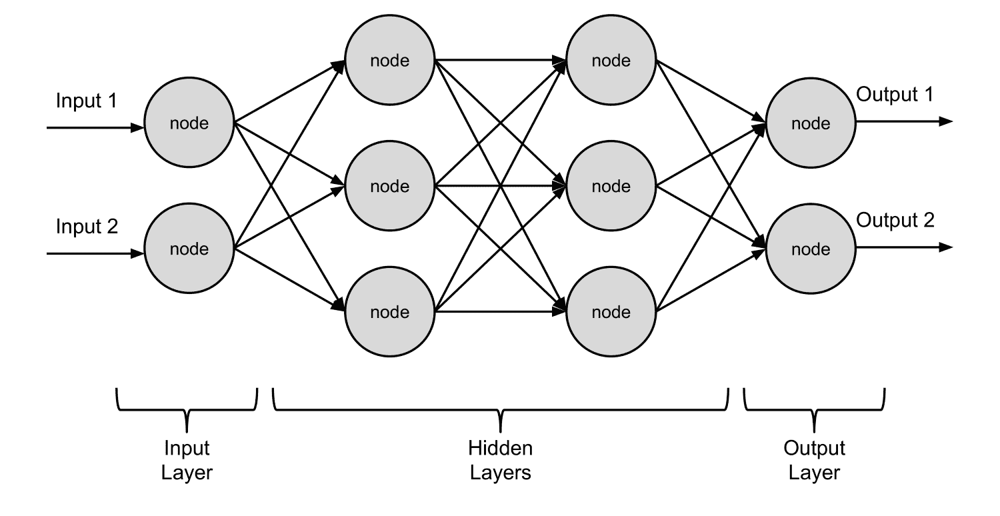
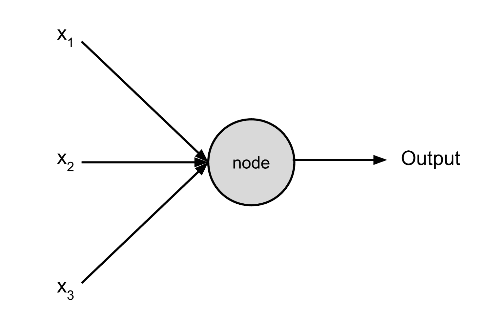
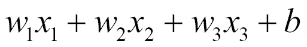
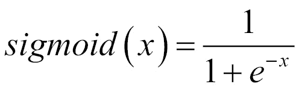
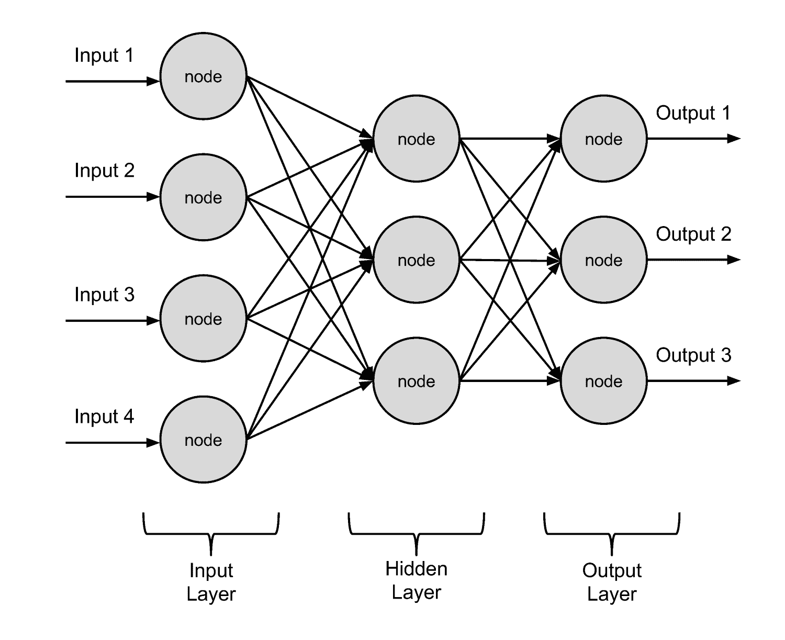
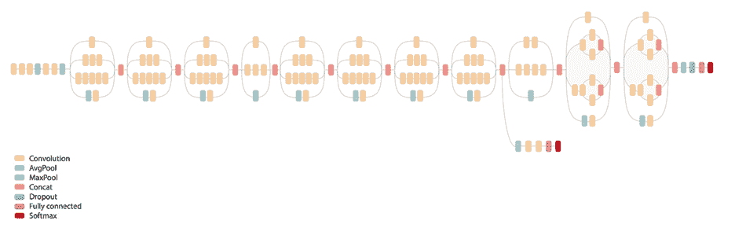

# 第八章：神经网络与深度学习

在这本书中，我们已经讨论了很多关于训练或教导机器进行预测的内容。为此，我们采用了各种有用且有趣的算法，包括各种类型的回归、决策树和最近邻算法。然而，让我们退一步思考，如果我们试图做出准确的预测并了解数据，我们可能想要模仿哪种实体。

好吧，这个问题的最明显答案是我们应该模仿我们自己的大脑。作为人类，我们天生具有识别物体、预测数量、识别欺诈等能力，这些都是我们希望机器能够人工完成的事情。诚然，我们在这些活动中并不完美，但我们的表现相当不错！

这种思维方式导致了**人工神经网络**（也称为**神经网络**或简称**神经网**）的发展。这些模型试图大致模仿我们大脑中的某些结构，例如**神经元**。它们在各个行业中都取得了广泛的成功，并且目前正在被应用于解决各种有趣的问题。

最近，更多专业和复杂的神经网络类型吸引了大量兴趣和关注。这些神经网络属于**深度学习**类别，通常比常规神经网络的结构更深。也就是说，它们具有许多隐藏层结构，并且可以用数千万个参数或权重进行参数化。

我们将尝试在本章中介绍基于 Go 的神经网络和深度学习模型。这些主题非常广泛，仅深度学习就有整本书的篇幅。因此，我们在这里只会触及表面。话虽如此，以下内容应该为你提供一个坚实的起点，以便在 Go 中构建神经网络。

# 理解神经网络术语

神经网络种类繁多，每种类型都有自己的术语集。然而，无论我们使用哪种类型的神经网络，都有一些常见的术语是我们应该知道的。以下是一些常见的术语：

+   **节点**、**感知器**或**神经元**：这些可以互换使用的术语指的是神经网络的基本构建块。每个节点或神经元都会接收输入数据并对这些数据进行操作。在执行操作后，节点/神经元可能会也可能不会将操作的结果传递给其他节点/神经元。

+   **激活**：与节点操作相关的输出或值。

+   **激活函数**：将输入转换为节点输出或激活的函数的定义。

+   **权重**或**偏差**：这些值定义了激活函数中输入和输出数据之间的关系。

+   **输入层**：神经网络中的输入层包括一系列节点，这些节点将初始输入传递到神经网络模型中（例如一系列特征或属性）。

+   **输出层**：神经网络中的输出层包括一系列节点，这些节点接收神经网络内部传递的信息，并将其转换为最终输出。

+   **隐藏层**：这些层位于输入层和输出层之间，因此对外部输入或输出来说是隐藏的。

+   **正向传播**或**前向传播**：这指的是数据被输入到神经网络的输入层，并向前传递到输出层（没有循环）的情况。

+   **反向传播**：这是一种训练神经网络模型的方法，涉及通过网络传递正向值，计算生成的错误，然后根据这些错误将更改传递回网络。

+   **架构**：神经网络中神经元相互连接的整体结构称为架构。

为了巩固这些概念，考虑以下神经网络示意图：



这是一个基本的正向传播（即，无环或有回溯）神经网络。它有两个隐藏层，接受两个输入，并输出两个类别值（或结果）。

如果现在所有这些术语看起来有点令人不知所措，请不要担心。我们将在下一个具体示例中查看，这将巩固所有这些内容。此外，如果你在本章的各种示例中陷入困境并因术语而感到困惑，请回到这里作为提醒。

# 构建简单的神经网络

许多神经网络包和神经网络的应用将模型视为**黑盒**。也就是说，人们倾向于使用一些框架，允许他们快速使用一些默认值和自动化构建神经网络。他们通常能够产生一些结果，但这种便利通常不会对模型实际工作方式产生太多直观理解。因此，当模型的行为不符合预期时，很难理解它们为什么可能会做出奇怪的预测或遇到收敛困难。

在深入研究更复杂的神经网络之前，让我们建立一些关于神经网络的基本直觉，这样我们就不至于陷入这种模式。我们将从头开始构建一个简单的神经网络，以了解神经网络的基本组件以及它们是如何协同工作的。

**注意**：尽管我们在这里将从零开始构建我们的神经网络（你可能在某些情况下也想这样做），但存在各种 Go 包可以帮助你构建、训练和预测神经网络。这些包括 `github.com/tleyden/neurgo`、`github.com/fxsjy/gonn`、`github.com/NOX73/go-neural`、`github.com/milosgajdos83/gosom`、`github.com/made2591/go-perceptron-go` 和 `github.com/chewxy/gorgonia`。

我们将在本章中利用神经网络进行分类。然而，神经网络也可以用于执行回归。你可以在这里了解更多关于该主题的信息：[`heuristically.wordpress.com/2011/11/17/using-neural-network-for-regression/`](https://heuristically.wordpress.com/2011/11/17/using-neural-network-for-regression/)。

# 网络中的节点

我们神经网络中的节点或神经元本身具有相对简单的功能。每个神经元将接受一个或多个值（*x[1]*、*x[2]* 等等），根据激活函数将这些值组合，并产生一个输出。以下是一个输出示例：



我们应该如何组合输入以获得输出？嗯，我们需要一个可调整的输入组合方法（这样我们就可以训练模型），我们已经看到使用系数和截距组合变量是一种可训练的输入组合方法。只需回想一下第四章 *回归*。本着这种精神，我们将使用一些系数（**权重**）和截距（**偏差**）线性组合输入：



在这里，*w[1]*、*w[2]* 等等是我们的权重，*b* 是偏差。

这种输入组合是一个良好的开始，但最终它是线性的，因此无法对输入和输出之间的非线性关系进行建模。为了引入一些非线性，我们将对这个输入的线性组合应用一个激活函数。我们将使用的激活函数与第五章 *分类* 中引入的对数函数类似。在神经网络和以下形式中，对数函数被称为 **sigmoid** **函数**：



`sigmoid` 函数是我们节点中使用的良好选择，因为它引入了非线性，但它也有一个有限的范围（在 *0* 和 *1* 之间），有一个简单定义的导数（我们将在网络的训练中使用它），并且它可以有概率解释（如第五章 *分类* 中进一步讨论）。

`sigmoid` 函数绝不是神经网络中激活函数的唯一选择。其他流行的选择包括双曲正切函数、softmax 和修正线性单元。激活函数的选择及其优缺点将在 [`medium.com/towards-data-science/activation-functions-and-its-types-which-is-better-a9a5310cc8f`](https://medium.com/towards-data-science/activation-functions-and-its-types-which-is-better-a9a5310cc8f) 中进一步讨论。

让我们继续在 Go 中定义我们的激活函数及其导数。这些定义在以下代码中显示：

```py
// sigmoid implements the sigmoid function
// for use in activation functions.
func sigmoid(x float64) float64 {
    return 1.0 / (1.0 + math.Exp(-x))
}

// sigmoidPrime implements the derivative
// of the sigmoid function for backpropagation.
func sigmoidPrime(x float64) float64 {
    return x * (1.0 - x)
}
```

# 网络架构

我们将要构建的简单神经网络将包含一个输入层和一个输出层（任何神经网络都是如此）。网络将在输入层和输出层之间包含一个单一的隐藏层。这种架构如下所示：



特别是，我们将在输入层中包含四个节点，在隐藏层中包含三个节点，在输出层中包含三个节点。输入层中的四个节点对应于我们将要输入网络中的属性数量。想想这四个输入就像我们在第五章 [f0ffd10e-d2c4-41d7-8f26-95c05a30d818.xhtml]，*分类* 中用来分类鸢尾花所使用的四个测量值。输出层将有三节点，因为我们将会设置网络对鸢尾花进行分类，这些分类可能属于三个类别之一。

现在，关于隐藏层——为什么我们使用一个有三个节点的隐藏层？嗯，一个隐藏层对于绝大多数简单任务来说是足够的。如果你有大量的非线性数据、许多输入和/或大量的训练数据，你可能需要引入更多的隐藏层（如本章后面在讨论深度学习时进一步讨论的那样）。隐藏层中三个节点数量的选择可以根据评估指标和一点试错来调整。你也可以搜索隐藏层中节点的数量来自动化你的选择。

请记住，你向隐藏层引入的节点越多，你的网络就能越完美地学习你的训练集。换句话说，你正在使你的模型面临过拟合的风险，以至于它无法泛化。在添加这种复杂性时，非常重要的一点是要非常仔细地验证你的模型，以确保它能够泛化。

# 我们为什么期望这种架构能起作用？

让我们暂停一下，思考一下为什么按照前面的安排设置一系列节点可以让我们预测某些东西。正如你所看到的，我们一直在做的就是反复组合输入以产生某种结果。我们怎么能期望这个结果在做出二元分类时是有用的呢？

好吧，当我们定义二元分类问题，或者任何分类或回归问题时，我们究竟意味着什么？我们基本上是在说，我们期望在一系列输入（我们的属性）和输出（我们的标签或响应）之间存在某些规则或关系。本质上，我们是在说，存在一些简单或复杂的函数能够将我们的属性转换为我们想要的响应或标签。

我们可以选择一种可能模拟属性到输出转换的函数类型，就像我们在线性或逻辑回归中所做的那样。然而，我们也可以设置一系列连锁的可调整函数，我们可以通过算法训练来检测输入和输出之间的关系和规则。这正是我们在神经网络中所做的！

神经网络的节点就像是被调整的子函数，直到它们模仿我们提供的输入和输出之间的规则和关系，无论这些规则和关系实际上是什么（线性、非线性、动态等）。如果输入和输出之间存在底层规则，那么很可能存在一些可以模仿这些规则的神经网络。

# 训练我们的神经网络

好吧，现在我们有一些很好的理由说明为什么这种节点组合可能有助于我们进行预测。我们究竟如何根据一些输入数据调整我们神经网络节点的所有子函数呢？答案就是**反向传播**。

反向传播是一种训练我们神经网络的方法，它涉及在一系列**时代**（或对训练数据集的暴露）上迭代执行以下操作：

+   将我们的训练数据正向通过神经网络来计算输出

+   计算输出中的错误

+   使用梯度下降（或其他相关方法）来确定我们应该如何根据错误来改变我们的权重和偏差

+   将这些权重/偏差变化反向传播到网络中

我们将在稍后实施此过程，并探讨一些细节。然而，像梯度下降这样的内容在附录“与机器学习相关的算法/技术”中有更详细的介绍。

这种训练神经网络的反向传播方法在建模世界中无处不在，但这里没有足够的空间来涵盖大量的独特网络架构和方法。神经网络是学术界和工业界的一个活跃的研究领域。

首先，让我们定义一个`neuralNetConfig`结构，它将包含定义我们网络架构以及我们如何进行反向传播迭代的参数。同时，我们也定义一个`neuralNet`结构，它将包含定义一个训练好的神经网络的全部信息。稍后，我们将利用训练好的`neuralNet`值来进行预测。这些定义在以下代码中展示：

```py
// neuralNet contains all of the information
// that defines a trained neural network.
type neuralNet struct {
    config neuralNetConfig
    wHidden *mat.Dense
    bHidden *mat.Dense
    wOut *mat.Dense
    bOut *mat.Dense
}

// neuralNetConfig defines our neural network
// architecture and learning parameters.
type neuralNetConfig struct {
    inputNeurons int
    outputNeurons int
    hiddenNeurons int
    numEpochs int
    learningRate float64
}
```

在这里，`wHidden`和`bHidden`是网络隐藏层的权重和偏差，而`wOut`和`bOut`分别是网络输出层的权重和偏差。请注意，我们使用`gonum.org/v1/gonum/mat`矩阵来表示所有的权重和偏差，我们还将使用类似的矩阵来表示我们的输入和输出。这将使我们能够轻松执行与反向传播相关的操作，并将我们的训练推广到输入、隐藏和输出层中的任何数量的节点。

接下来，让我们定义一个函数，它根据`neuralNetConfig`值初始化一个新的神经网络，以及一个基于输入矩阵（*x*）和标签矩阵（*y*）的训练`neuralNet`值的函数：

```py
// NewNetwork initializes a new neural network.
func newNetwork(config neuralNetConfig) *neuralNet {
        return &neuralNet{config: config}
}

// Train trains a neural network using backpropagation.
func (nn *neuralNet) train(x, y *mat.Dense) error {

    // To be filled in...
}
```

在`train()`方法中，我们需要完成我们的反向传播方法，并将生成的训练好的权重和偏差放入接收器中。首先，让我们在`train()`方法中随机初始化权重和偏差，如下面的代码所示：

```py
// Initialize biases/weights.
randSource := rand.NewSource(time.Now().UnixNano())
randGen := rand.New(randSource)

wHiddenRaw := make([]float64, nn.config.hiddenNeurons*nn.config.inputNeurons)
bHiddenRaw := make([]float64, nn.config.hiddenNeurons)
wOutRaw := make([]float64, nn.config.outputNeurons*nn.config.hiddenNeurons)
bOutRaw := make([]float64, nn.config.outputNeurons)

for _, param := range [][]float64{wHiddenRaw, bHiddenRaw, wOutRaw, bOutRaw} {
    for i := range param {
        param[i] = randGen.Float64()
    }
}

wHidden := mat.NewDense(nn.config.inputNeurons, nn.config.hiddenNeurons, wHiddenRaw)
bHidden := mat.NewDense(1, nn.config.hiddenNeurons, bHiddenRaw)
wOut := mat.NewDense(nn.config.hiddenNeurons, nn.config.outputNeurons, wOutRaw)
bOut := mat.NewDense(1, nn.config.outputNeurons, bOutRaw)
```

然后，我们需要遍历我们的每个 epoch，完成网络的反向传播。这又涉及到一个前向阶段，其中计算输出，以及一个反向传播阶段，其中应用权重和偏差的变化。如果您想深入了解，反向传播过程将在附录“与机器学习相关的算法/技术”中详细讨论。现在，让我们专注于实现。epoch 的循环如下，其中通过注释指出了反向传播过程的各个部分：

```py
// Define the output of the neural network.
output := mat.NewDense(0, 0, nil)

// Loop over the number of epochs utilizing
// backpropagation to train our model.
for i := 0; i < nn.config.numEpochs; i++ {

    // Complete the feed forward process.

    ...

    // Complete the backpropagation.

    ...

    // Adjust the parameters.

    ...
}
```

在这个循环的前向部分，输入通过我们的节点网络向前传播：

```py
// Complete the feed forward process.
hiddenLayerInput := mat.NewDense(0, 0, nil)
hiddenLayerInput.Mul(x, wHidden)
addBHidden := func(_, col int, v float64) float64 { return v + bHidden.At(0, col) }
hiddenLayerInput.Apply(addBHidden, hiddenLayerInput)

hiddenLayerActivations := mat.NewDense(0, 0, nil)
applySigmoid := func(_, _ int, v float64) float64 { return sigmoid(v) }
hiddenLayerActivations.Apply(applySigmoid, hiddenLayerInput)

outputLayerInput := mat.NewDense(0, 0, nil)
outputLayerInput.Mul(hiddenLayerActivations, wOut)
addBOut := func(_, col int, v float64) float64 { return v + bOut.At(0, col) }
outputLayerInput.Apply(addBOut, outputLayerInput)
output.Apply(applySigmoid, outputLayerInput)
```

然后，一旦我们从前向过程中得到输出，我们就通过网络向后计算输出层和隐藏层的 delta（或变化），如下面的代码所示：

```py
// Complete the backpropagation.
networkError := mat.NewDense(0, 0, nil)
networkError.Sub(y, output)

slopeOutputLayer := mat.NewDense(0, 0, nil)
applySigmoidPrime := func(_, _ int, v float64) float64 { return sigmoidPrime(v) }
slopeOutputLayer.Apply(applySigmoidPrime, output)
slopeHiddenLayer := mat.NewDense(0, 0, nil)
slopeHiddenLayer.Apply(applySigmoidPrime, hiddenLayerActivations)

dOutput := mat.NewDense(0, 0, nil)
dOutput.MulElem(networkError, slopeOutputLayer)
errorAtHiddenLayer := mat.NewDense(0, 0, nil)
errorAtHiddenLayer.Mul(dOutput, wOut.T())

dHiddenLayer := mat.NewDense(0, 0, nil)
dHiddenLayer.MulElem(errorAtHiddenLayer, slopeHiddenLayer)
```

然后，使用这些 delta 值来更新我们网络的权重和偏差。同时，使用**学习率**来缩放这些变化，这有助于算法收敛。反向传播循环的这一最后部分在此实现：

```py
// Adjust the parameters.
wOutAdj := mat.NewDense(0, 0, nil)
wOutAdj.Mul(hiddenLayerActivations.T(), dOutput)
wOutAdj.Scale(nn.config.learningRate, wOutAdj)
wOut.Add(wOut, wOutAdj)

bOutAdj, err := sumAlongAxis(0, dOutput)
if err != nil {
    return err
}
bOutAdj.Scale(nn.config.learningRate, bOutAdj)
bOut.Add(bOut, bOutAdj)

wHiddenAdj := mat.NewDense(0, 0, nil)
wHiddenAdj.Mul(x.T(), dHiddenLayer)
wHiddenAdj.Scale(nn.config.learningRate, wHiddenAdj)
wHidden.Add(wHidden, wHiddenAdj)

bHiddenAdj, err := sumAlongAxis(0, dHiddenLayer)
if err != nil {
    return err
}
bHiddenAdj.Scale(nn.config.learningRate, bHiddenAdj)
bHidden.Add(bHidden, bHiddenAdj)
```

注意，在这里我们使用了另一个辅助函数，它允许我们在保持另一个维度完整的同时，对矩阵沿一个维度求和。这个`sumAlongAxis()`函数如下所示，以示完整：

```py
// sumAlongAxis sums a matrix along a
// particular dimension, preserving the
// other dimension.
func sumAlongAxis(axis int, m *mat.Dense) (*mat.Dense, error) {

    numRows, numCols := m.Dims()

    var output *mat.Dense

    switch axis {
    case 0:
        data := make([]float64, numCols)
        for i := 0; i < numCols; i++ {
            col := mat.Col(nil, i, m)
            data[i] = floats.Sum(col)
        }
        output = mat.NewDense(1, numCols, data)
    case 1:
        data := make([]float64, numRows)
        for i := 0; i < numRows; i++ {
            row := mat.Row(nil, i, m)
            data[i] = floats.Sum(row)
        }
        output = mat.NewDense(numRows, 1, data)
    default:
        return nil, errors.New("invalid axis, must be 0 or 1")
    }

    return output, nil
}
```

在`train()`方法中，我们最后要做的就是将训练好的权重和偏差添加到接收器值中并返回：

```py
// Define our trained neural network.
nn.wHidden = wHidden
nn.bHidden = bHidden
nn.wOut = wOut
nn.bOut = bOut

return nil
```

太棒了！这并不那么糟糕。我们已经有了一种在约 100 行 Go 代码中训练我们的神经网络的方法。为了检查代码是否运行，以及了解我们的权重和偏差可能的样子，让我们在一些简单的虚拟数据上训练一个神经网络。我们将在下一节中用更真实的例子来展示网络，但现在，让我们用一些虚拟数据来对自己进行合理性检查，如下面的代码所示：

```py
// Define our input attributes.
input := mat.NewDense(3, 4, []float64{
    1.0, 0.0, 1.0, 0.0,
    1.0, 0.0, 1.0, 1.0,
    0.0, 1.0, 0.0, 1.0,
})

// Define our labels.
labels := mat.NewDense(3, 1, []float64{1.0, 1.0, 0.0})

// Define our network architecture and
// learning parameters.
config := neuralNetConfig{
    inputNeurons: 4,
    outputNeurons: 1,
    hiddenNeurons: 3,
    numEpochs: 5000,
    learningRate: 0.3,
}

// Train the neural network.
network := newNetwork(config)
if err := network.train(input, labels); err != nil {
    log.Fatal(err)
}

// Output the weights that define our network!
f := mat.Formatted(network.wHidden, mat.Prefix(" "))
fmt.Printf("\nwHidden = % v\n\n", f)

f = mat.Formatted(network.bHidden, mat.Prefix(" "))
fmt.Printf("\nbHidden = % v\n\n", f)

f = mat.Formatted(network.wOut, mat.Prefix(" "))
fmt.Printf("\nwOut = % v\n\n", f)

f = mat.Formatted(network.bOut, mat.Prefix(" "))
fmt.Printf("\nbOut = % v\n\n", f)
```

编译并运行此神经网络训练代码将产生以下输出权重和偏差：

```py
bOut$ go build
$ ./myprogram 

wHidden = [ 2.105009524680073 2.022752980359344 2.5200192466310547]
 [ -2.033896626042324 -1.8652059633980662 -1.5861504822640748]
 [1.821046795894909 2.436963623058306 1.717510016887383]
 [-0.7400175664445425 -0.5800261988090052 -0.9277709997772002]

bHidden = [ 0.06850421921273529 -0.40252869229501825 -0.03392255287230178]

wOut = [ 2.321901257946553]
 [ 3.343178681830189]
 [1.7581701319375231]

bOut = [-3.471613333924047]
```

这些权重和偏差完全定义了我们的训练好的神经网络。也就是说，`wHidden`和`bHidden`使我们能够将输入转换为网络输出层的输入值，而`wOut`和`bOut`使我们能够将这些值转换为神经网络最终的输出。

由于我们使用了随机数，你的程序可能返回的结果与之前描述的不同。然而，你应该看到类似的价值范围。

# 利用简单的神经网络

现在我们有一些看起来似乎可以正常工作的神经网络训练功能，让我们尝试在更实际的建模场景中利用这些功能。特别是，让我们恢复我们最喜欢的分类数据集，鸢尾花数据集（在第五章分类中使用）。

如果你记得，当尝试使用此数据集对鸢尾花进行分类时，我们试图将它们分类为三种物种之一（setosa、virginica 或 versicolor）。由于我们的神经网络期望的是浮点值矩阵，我们需要将三种物种编码为数值列。一种方法是为每种物种在数据集中创建一个列。然后，我们将该列的值设置为*1.0*或*0.0*，具体取决于对应行的测量值是否对应于该物种（*1.0*）或另一个物种（*0.0*）。

我们还将标准化我们的数据，原因与在第五章“分类”中讨论的类似逻辑回归。这使得我们的数据集看起来与之前的示例略有不同，如下所示：

```py
$ head train.csv 
sepal_length,sepal_width,petal_length,petal_width,setosa,virginica,versicolor
0.305555555556,0.583333333333,0.118644067797,0.0416666666667,1.0,0.0,0.0
0.25,0.291666666667,0.491525423729,0.541666666667,0.0,0.0,1.0
0.194444444444,0.5,0.0338983050847,0.0416666666667,1.0,0.0,0.0
0.833333333333,0.375,0.898305084746,0.708333333333,0.0,1.0,0.0
0.555555555556,0.208333333333,0.661016949153,0.583333333333,0.0,0.0,1.0
0.416666666667,0.25,0.508474576271,0.458333333333,0.0,0.0,1.0
0.666666666667,0.416666666667,0.677966101695,0.666666666667,0.0,0.0,1.0
0.416666666667,0.291666666667,0.491525423729,0.458333333333,0.0,0.0,1.0
0.5,0.416666666667,0.661016949153,0.708333333333,0.0,1.0,0.0
```

我们将使用 80/20 的训练和测试数据分割来评估模型。训练数据将存储在`train.csv`中，测试数据将存储在`test.csv`中，如下所示：

```py
$ wc -l *.csv
 31 test.csv
 121 train.csv
 152 total
```

# 在真实数据上训练神经网络

为了在这个鸢尾花数据上训练我们的神经网络，我们需要读取训练数据并创建两个矩阵。第一个矩阵将包含所有属性（矩阵`inputs`），第二个矩阵将包含所有标签（矩阵`labels`）。我们将按照以下方式构建这些矩阵：

```py
// Open the training dataset file.
f, err := os.Open("train.csv")
if err != nil {
    log.Fatal(err)
}
defer f.Close()

// Create a new CSV reader reading from the opened file.
reader := csv.NewReader(f)
reader.FieldsPerRecord = 7

// Read in all of the CSV records
rawCSVData, err := reader.ReadAll()
if err != nil {
    log.Fatal(err)
}

// inputsData and labelsData will hold all the
// float values that will eventually be
// used to form our matrices.
inputsData := make([]float64, 4*len(rawCSVData))
labelsData := make([]float64, 3*len(rawCSVData))

// inputsIndex will track the current index of
// inputs matrix values.
var inputsIndex int
var labelsIndex int

// Sequentially move the rows into a slice of floats.
for idx, record := range rawCSVData {

    // Skip the header row.
    if idx == 0 {
        continue
    }

    // Loop over the float columns.
    for i, val := range record {

        // Convert the value to a float.
        parsedVal, err := strconv.ParseFloat(val, 64)
        if err != nil {
            log.Fatal(err)
        }

        // Add to the labelsData if relevant.
        if i == 4 || i == 5 || i == 6 {
            labelsData[labelsIndex] = parsedVal
            labelsIndex++
            continue
        }

        // Add the float value to the slice of floats.
        inputsData[inputsIndex] = parsedVal
        inputsIndex++
    }
}

// Form the matrices.
inputs := mat.NewDense(len(rawCSVData), 4, inputsData)
labels := mat.NewDense(len(rawCSVData), 3, labelsData)
```

我们可以初始化并训练我们的神经网络，类似于我们处理虚拟数据的方式。唯一的区别是我们将使用三个输出神经元，对应于我们的三个输出类别。训练过程如下：

```py
// Define our network architecture and
// learning parameters.
config := neuralNetConfig{
    inputNeurons:  4,
    outputNeurons: 3,
    hiddenNeurons: 3,
    numEpochs:     5000,
    learningRate:  0.3,
}

// Train the neural network.
network := newNetwork(config)
if err := network.train(inputs, labels); err != nil {
    log.Fatal(err)
}
```

# 评估神经网络

要使用训练好的神经网络进行预测，我们将为`neuralNet`类型创建一个`predict()`方法。这个`predict()`方法将接受新的输入，并将新的输入通过网络前向传播以产生预测输出，如下所示：

```py
// predict makes a prediction based on a trained
// neural network.
func (nn *neuralNet) predict(x *mat.Dense) (*mat.Dense, error) {

    // Check to make sure that our neuralNet value
    // represents a trained model.
    if nn.wHidden == nil || nn.wOut == nil || nn.bHidden == nil || nn.bOut == nil {
        return nil, errors.New("the supplied neural net weights and biases are empty")
    }

    // Define the output of the neural network.
    output := mat.NewDense(0, 0, nil)
github.com/tensorflow/tensorflow/tensorflow/go
    // Complete the feed forward process.
    hiddenLayerInput := mat.NewDense(0, 0, nil)
    hiddenLayerInput.Mul(x, nn.wHidden)
    addBHidden := func(_, col int, v float64) float64 { return v + nn.bHidden.At(0, col) }
    hiddenLayerInput.Apply(addBHidden, hiddenLayerInput)

    hiddenLayerActivations := mat.NewDense(0, 0, nil)
    applySigmoid := func(_, _ int, v float64) float64 { return sigmoid(v) }
    hiddenLayerActivations.Apply(applySigmoid, hiddenLayerInput)

    outputLayerInput := mat.NewDense(0, 0, nil)
    outputLayerInput.Mul(hiddenLayerActivations, nn.wOut)
    addBOut := func(_, col int, v float64) float64 { return v + nn.bOut.At(0, col) }
    outputLayerInput.Apply(addBOut, outputLayerInput)
    output.Apply(applySigmoid, outputLayerInput)

    return output, nil
}
```

我们可以使用这个`predict()`方法在测试数据上评估我们的训练模型。具体来说，我们将读取`test.csv`文件到两个新的矩阵`testInputs`和`testLabels`中，类似于我们读取`train.csv`的方式（因此，这里将不包含细节）。`testInputs`可以提供给`predict()`方法以获取我们的预测，然后我们可以将我们的预测与`testLabels`进行比较，以计算评估指标。在这种情况下，我们将计算我们模型的准确率。

在计算准确率时，我们将注意的一个细节是从我们的模型中确定单个输出预测。网络实际上为每种鸢尾花物种产生一个介于 0.0 和 1.0 之间的输出。我们将取这些输出中的最高值作为预测物种。

我们模型准确率的计算如下代码所示：

```py
// Make the predictions using the trained model.
predictions, err := network.predict(testInputs)
if err != nil {
    log.Fatal(err)
}

// Calculate the accuracy of our model.
var truePosNeg int
numPreds, _ := predictions.Dims()
for i := 0; i < numPreds; i++ {

    // Get the label.
    labelRow := mat.Row(nil, i, testLabels)
    var species int
    for idx, label := range labelRow {
        if label == 1.0 {
            species = idx
            break
        }
    }

    // Accumulate the true positive/negative count.
    if predictions.At(i, species) == floats.Max(mat.Row(nil, i, predictions)) {
        truePosNeg++
    }
}

// Calculate the accuracy (subset accuracy).
accuracy := float64(truePosNeg) / float64(numPreds)

// Output the Accuracy value to standard out.
fmt.Printf("\nAccuracy = %0.2f\n\n", accuracy)
```

编译和运行评估结果类似于以下内容：

```py
$ go build
$ ./myprogram 

Accuracy = 0.97
```

哇！这相当不错。我们使用从头开始的神经网络对鸢尾花物种的预测准确率达到 97%。如前所述，这些单隐藏层神经网络在大多数分类任务中都非常强大，你可以看到其基本原理并不真的那么复杂。

# 介绍深度学习

尽管像前述章节中使用的简单神经网络在许多场景中非常强大，但近年来深度神经网络架构已经在各个行业中应用于各种类型的数据。这些更复杂的架构已被用于在棋类/视频游戏中击败冠军、驾驶汽车、生成艺术、转换图像等等。几乎感觉你可以把这些模型扔给任何东西，它们都会做一些有趣的事情，但它们似乎特别适合计算机视觉、语音识别、文本推理和其他非常复杂且难以定义的任务。

我们将在这里介绍深度学习，并在 Go 中运行一个深度学习模型。然而，深度学习模型的用途和多样性非常巨大，并且每天都在增长。

关于这个主题有许多书籍和教程，所以如果这个简短的介绍激发了你的兴趣，我们建议你查看以下资源之一：

+   使用 TensorFlow 进行动手深度学习：[`www.packtpub.com/big-data-and-business-intelligence/hands-deep-learning-tensorflow`](https://www.packtpub.com/big-data-and-business-intelligence/hands-deep-learning-tensorflow)

+   深度学习实例：[`www.packtpub.com/big-data-and-business-intelligence/deep-learning-example`](https://www.packtpub.com/big-data-and-business-intelligence/deep-learning-example)

+   深度学习计算机视觉：[`www.packtpub.com/big-data-and-business-intelligence/deep-learning-computer-vision`](https://www.packtpub.com/big-data-and-business-intelligence/deep-learning-computer-vision)

这些资源可能并不都会提到或承认 Go 语言，但正如你将在下面的示例中看到的，Go 语言完全能够应用这些技术并与 TensorFlow 或 H2O 等工具进行接口交互。

# 深度学习模型是什么？

深度学习中的“深度”指的是连续组合和利用各种神经网络结构，形成一个庞大且复杂的架构。这些庞大且复杂的架构通常需要大量的数据进行训练，并且生成的结构非常难以解释。

为了举例说明现代深度学习模型的规模和复杂性，以谷歌的 LeNet([`www.cv-foundation.org/openaccess/content_cvpr_2015/papers/Szegedy_Going_Deeper_With_2015_CVPR_paper.pdf`](http://www.cv-foundation.org/openaccess/content_cvpr_2015/papers/Szegedy_Going_Deeper_With_2015_CVPR_paper.pdf))为例。这个可用于物体识别的模型在此处展示（图片由[`adeshpande3.github.io/adeshpande3.github.io/The-9-Deep-Learning-Papers-You-Need-To-Know-About.html`](https://adeshpande3.github.io/adeshpande3.github.io/The-9-Deep-Learning-Papers-You-Need-To-Know-About.html)提供）：



这个结构本身就很复杂。然而，当你意识到这个图中的每个块本身都可以是一个复杂的神经网络原语（如图例所示）时，它变得更加令人印象深刻。

通常，深度学习模型是通过将以下结构之一或多个链接在一起，并在某些情况下重新链接在一起来构建的：

+   完全连接的神经网络架构：这个构建块可能类似于我们在本章之前为鸢尾花检测构建的。它包括一系列按完全连接层排列的神经网络节点。也就是说，层从一层流向另一层，所有节点都从一层连接到下一层。

+   **卷积神经网络**（**ConvNet**或**CNN**）：这是一种至少实现了一个**卷积层**的神经网络。卷积层包含由一组权重（也称为卷积核或过滤器）参数化的神经元，这些神经元仅部分连接到输入数据。大多数 ConvNet 包括这些卷积层的分层组合，这使得 ConvNet 能够对输入数据中的低级特征做出响应。

+   **循环神经网络**（**RNN**）和/或**长短期记忆**（**LSTM**）单元：这些组件试图将某种形式的记忆因素纳入模型。循环神经网络使它们的输出依赖于一系列输入，而不是假设每个输入都是独立的。LSTM 单元与循环神经网络相关，但还试图纳入一种更长期的记忆。

虽然我们将在本章中使用图像数据来展示深度学习，但使用循环神经网络（RNN）和长短期记忆网络（LSTM）的深度学习模型特别适合解决基于文本和其他自然语言处理（NLP）问题。这些网络内置的内存使它们能够理解句子中可能出现的下一个单词，例如。如果你对运行基于文本数据的深度学习模型感兴趣，我们建议查看使用 `github.com/chewxy/gorgonia` 包的此示例：

[`github.com/chewxy/gorgonia/tree/master/examples/charRNN.`](https://github.com/chewxy/gorgonia/tree/master/examples/charRNN)

深度学习模型非常强大！特别是对于计算机视觉等任务。然而，你也应该记住，这些神经网络组件的复杂组合也非常难以解释。也就是说，确定模型做出特定预测的原因可能几乎是不可能的。这在需要维护某些行业和司法管辖区合规性的情况下可能是一个问题，也可能阻碍应用程序的调试或维护。尽管如此，有一些主要努力旨在提高深度学习模型的解释性。在这些努力中，LIME 项目是值得注意的：

[`github.com/marcotcr/lime.`](https://github.com/marcotcr/lime)

# 使用 Go 进行深度学习

当你想要从 Go 语言构建或使用深度学习模型时，有多种选择。这与深度学习本身一样，是一个不断变化的领域。然而，在 Go 语言中构建、训练和利用深度学习模型的选择通常如下：

+   **使用 Go 包**：有一些 Go 包允许你使用 Go 作为构建和训练深度学习模型的主要接口。其中功能最全面且发展最成熟的包是 `github.com/chewxy/gorgonia`。`github.com/chewxy/gorgonia` 将 Go 视为第一等公民，并且是用 Go 编写的，即使它确实使用了 `cgo` 来与数值库进行交互。

+   **使用非 Go 语言深度学习框架的 API 或 Go 客户端**：你可以从 Go 语言与流行的深度学习服务和框架进行交互，包括 TensorFlow、MachineBox、H2O 以及各种云服务提供商或第三方 API 提供商（如 IBM Watson）。TensorFlow 和 Machine Box 实际上提供了 Go 绑定或 SDK，这些绑定或 SDK 正在持续改进。对于其他服务，你可能需要通过 REST 或甚至使用 `exec` 调用二进制文件来进行交互。

+   **使用 cgo**：当然，Go 可以与 C/C++ 库进行交互和集成，用于深度学习，包括 TensorFlow 库和来自 Intel 的各种库。然而，这是一条艰难的道路，只有在绝对必要时才推荐使用。

由于 TensorFlow 目前是深度学习最受欢迎的框架，我们将简要探讨这里列出的第二类。然而，TensorFlow Go 绑定目前正处于积极开发中，一些功能相当原始。TensorFlow 团队建议，如果你打算在 Go 中使用 TensorFlow 模型，你首先应该使用 Python 训练并导出此模型。然后，这个预训练模型可以从 Go 中使用，正如我们将在下一节中展示的那样。

社区中有许多成员正在努力使 Go 成为 TensorFlow 的首选公民。因此，TensorFlow 绑定的粗糙边缘可能会在未来一年中得到平滑处理。为了保持在这一方面的更新，请确保加入 Gophers Slack 上的 #data-science 频道 ([`invite.slack.golangbridge.org/`](https://invite.slack.golangbridge.org/))。那里是经常讨论的话题，也是提问和参与的好地方。

尽管我们在这里将探索一个快速的 TensorFlow 示例，但我们强烈建议你应该查看 `github.com/chewxy/gorgonia`，特别是如果你考虑在 Go 中进行更多自定义或广泛的建模。这个包非常强大，并且已在生产中使用。

# 为 Go 设置 TensorFlow

TensorFlow 团队提供了一些很好的文档来安装 TensorFlow 并使其准备好与 Go 一起使用。这些文档可以在 [`www.tensorflow.org/install/install_go`](https://www.tensorflow.org/install/install_go) 找到。有一些初步步骤，但一旦你安装了 TensorFlow C 库，你就可以获取以下 Go 包：

```py
$ go get github.com/tensorflow/tensorflow/tensorflow/go
```

如果你能无错误地获取 `github.com/tensorflow/tensorflow/tensorflow/go`，那么一切应该都准备就绪了，但你可以通过执行以下测试来确保你已准备好使用 TensorFlow：

```py
$ go test github.com/tensorflow/tensorflow/tensorflow/go
ok github.com/tensorflow/tensorflow/tensorflow/go 0.045s
```

# 获取并调用预训练的 TensorFlow 模型

我们将要使用的模型是 Google 用于图像中物体识别的模型，称为 Inception。模型可以通过以下方式获取：

```py
$ mkdir model
$ cd model
$ wget https://storage.googleapis.com/download.tensorflow.org/models/inception5h.zip
--2017-09-09 18:29:03-- https://storage.googleapis.com/download.tensorflow.org/models/inception5h.zip
Resolving storage.googleapis.com (storage.googleapis.com)... 172.217.6.112, 2607:f8b0:4009:812::2010
Connecting to storage.googleapis.com (storage.googleapis.com)|172.217.6.112|:443... connected.
HTTP request sent, awaiting response... 200 OK
Length: 49937555 (48M) [application/zip]
Saving to: ‘inception5h.zip’

inception5h.zip 100%[=========================================================================================================================>] 47.62M 19.0MB/s in 2.5s 

2017-09-09 18:29:06 (19.0 MB/s) - ‘inception5h.zip’ saved [49937555/49937555]

$ unzip inception5h.zip
Archive: inception5h.zip
 inflating: imagenet_comp_graph_label_strings.txt 
 inflating: tensorflow_inception_graph.pb 
 inflating: LICENSE
```

解压缩压缩模型后，你应该看到一个 `*.pb` 文件。这是一个表示模型冻结状态的 `protobuf` 文件。回想一下我们简单的神经网络。网络完全由一系列权重和偏差定义。尽管更复杂，但这个模型可以用类似的方式定义，并且这些定义存储在这个 `protobuf` 文件中。

要调用此模型，我们将使用 TensorFlow Go 绑定文档中的示例代码--[`godoc.org/github.com/tensorflow/tensorflow/tensorflow/go`](https://godoc.org/github.com/tensorflow/tensorflow/tensorflow/go)。此代码加载模型并使用模型检测和标记 `*.jpg` 图像的内容。

由于代码包含在 TensorFlow 文档中，我将省略细节，只突出几个片段。为了加载模型，我们执行以下操作：

```py
// Load the serialized GraphDef from a file.
modelfile, labelsfile, err := modelFiles(*modeldir)
if err != nil {
    log.Fatal(err)
}
model, err := ioutil.ReadFile(modelfile)
if err != nil {
    log.Fatal(err)
} 
```

然后我们加载深度学习模型的图定义，并使用该图创建一个新的 TensorFlow 会话，如下面的代码所示：

```py
// Construct an in-memory graph from the serialized form.
graph := tf.NewGraph()
if err := graph.Import(model, ""); err != nil {
    log.Fatal(err)
}

// Create a session for inference over graph.
session, err := tf.NewSession(graph, nil)
if err != nil {
    log.Fatal(err)
}
defer session.Close()
```

最后，我们可以使用以下方式使用模型进行推理：

```py
// Run inference on *imageFile.
// For multiple images, session.Run() can be called in a loop (and
// concurrently). Alternatively, images can be batched since the model
// accepts batches of image data as input.
tensor, err := makeTensorFromImage(*imagefile)
if err != nil {
    log.Fatal(err)
}
output, err := session.Run(
    map[tf.Output]*tf.Tensor{
        graph.Operation("input").Output(0): tensor,
    },
    []tf.Output{
        graph.Operation("output").Output(0),
    },
    nil)
if err != nil {
    log.Fatal(err)
}

// output[0].Value() is a vector containing probabilities of
// labels for each image in the "batch". The batch size was 1.
// Find the most probable label index.
probabilities := output[0].Value().([][]float32)[0]
printBestLabel(probabilities, labelsfile)
```

# 使用 TensorFlow 从 Go 进行目标检测

根据 TensorFlow GoDocs 中指定的 Go 程序进行目标检测，可以按以下方式调用：

```py
$ ./myprogram -dir=<path/to/the/model/dir> -image=<path/to/a/jpg/image>
```

当程序被调用时，它将利用预训练和加载的模型来推断指定图像的内容。然后，它将输出该图像最可能的内容及其计算出的概率。

为了说明这一点，让我们尝试在以下飞机图片上进行目标检测，保存为`airplane.jpg`：


从 Go 运行 TensorFlow 模型得到以下结果：

```py
$ go build
$ ./myprogram -dir=model -image=airplane.jpg
2017-09-09 20:17:30.655757: W tensorflow/core/platform/cpu_feature_guard.cc:45] The TensorFlow library wasn't compiled to use SSE4.1 instructions, but these are available on your machine and could speed up CPU computations.
2017-09-09 20:17:30.655807: W tensorflow/core/platform/cpu_feature_guard.cc:45] The TensorFlow library wasn't compiled to use SSE4.2 instructions, but these are available on your machine and could speed up CPU computations.
2017-09-09 20:17:30.655814: W tensorflow/core/platform/cpu_feature_guard.cc:45] The TensorFlow library wasn't compiled to use AVX instructions, but these are available on your machine and could speed up CPU computations.
2017-09-09 20:17:30.655818: W tensorflow/core/platform/cpu_feature_guard.cc:45] The TensorFlow library wasn't compiled to use AVX2 instructions, but these are available on your machine and could speed up CPU computations.
2017-09-09 20:17:30.655822: W tensorflow/core/platform/cpu_feature_guard.cc:45] The TensorFlow library wasn't compiled to use FMA instructions, but these are available on your machine and could speed up CPU computations.
BEST MATCH: (86% likely) airliner
```

在一些关于加快 CPU 计算的建议之后，我们得到了一个结果：`airliner`。哇！这真是太酷了。我们刚刚在我们的 Go 程序中用 TensorFlow 进行了目标识别！

让我们再试一次。这次，我们将使用`pug.jpg`，它看起来如下：


再次使用此图片运行我们的程序得到以下结果：

```py
$ ./myprogram -dir=model -image=pug.jpg 
2017-09-09 20:20:32.323855: W tensorflow/core/platform/cpu_feature_guard.cc:45] The TensorFlow library wasn't compiled to use SSE4.1 instructions, but these are available on your machine and could speed up CPU computations.
2017-09-09 20:20:32.323896: W tensorflow/core/platform/cpu_feature_guard.cc:45] The TensorFlow library wasn't compiled to use SSE4.2 instructions, but these are available on your machine and could speed up CPU computations.
2017-09-09 20:20:32.323902: W tensorflow/core/platform/cpu_feature_guard.cc:45] The TensorFlow library wasn't compiled to use AVX instructions, but these are available on your machine and could speed up CPU computations.
2017-09-09 20:20:32.323906: W tensorflow/core/platform/cpu_feature_guard.cc:45] The TensorFlow library wasn't compiled to use AVX2 instructions, but these are available on your machine and could speed up CPU computations.
2017-09-09 20:20:32.323911: W tensorflow/core/platform/cpu_feature_guard.cc:45] The TensorFlow library wasn't compiled to use FMA instructions, but these are available on your machine and could speed up CPU computations.
BEST MATCH: (84% likely) pug
```

成功！模型不仅检测到图片中有一只狗，而且正确地识别出图片中是一只斗牛犬。

让我们再试一次。由于这是一本 Go 书，我们忍不住想试试`gopher.jpg`，它看起来如下（向 Go gopher 背后的艺术家 Renee French 表示巨大的感谢）：


运行模型得到以下结果：

```py
$ ./myprogram -dir=model -image=gopher.jpg 
2017-09-09 20:25:57.967753: W tensorflow/core/platform/cpu_feature_guard.cc:45] The TensorFlow library wasn't compiled to use SSE4.1 instructions, but these are available on your machine and could speed up CPU computations.
2017-09-09 20:25:57.967801: W tensorflow/core/platform/cpu_feature_guard.cc:45] The TensorFlow library wasn't compiled to use SSE4.2 instructions, but these are available on your machine and could speed up CPU computations.
2017-09-09 20:25:57.967808: W tensorflow/core/platform/cpu_feature_guard.cc:45] The TensorFlow library wasn't compiled to use AVX instructions, but these are available on your machine and could speed up CPU computations.
2017-09-09 20:25:57.967812: W tensorflow/core/platform/cpu_feature_guard.cc:45] The TensorFlow library wasn't compiled to use AVX2 instructions, but these are available on your machine and could speed up CPU computations.
2017-09-09 20:25:57.967817: W tensorflow/core/platform/cpu_feature_guard.cc:45] The TensorFlow library wasn't compiled to use FMA instructions, but these are available on your machine and could speed up CPU computations.
BEST MATCH: (12% likely) safety pin
```

嗯，我想我们不可能每次都赢。看起来我们需要重构我们的模型，以便能够识别 Go gopher。更具体地说，我们可能需要向我们的训练数据集中添加一些 Go gopher，因为 Go gopher 绝对不是安全别针！

# 参考文献

基本神经网络：

+   神经网络快速入门：[`ujjwalkarn.me/2016/08/09/quick-intro-neural-networks/`](https://ujjwalkarn.me/2016/08/09/quick-intro-neural-networks/)

+   深度学习和神经网络友好入门：[`youtu.be/BR9h47Jtqyw`](https://youtu.be/BR9h47Jtqyw)

+   `github.com/tleyden/neurgo` 文档：[`godoc.org/github.com/tleyden/neurgo`](https://godoc.org/github.com/tleyden/neurgo)

+   `github.com/fxsjy/gonn/gonn` 文档：[`godoc.org/github.com/fxsjy/gonn/gonn`](https://godoc.org/github.com/fxsjy/gonn/gonn)

更详细的深度学习资源：

+   使用 TensorFlow 进行实战深度学习 - [`www.packtpub.com/big-data-and-business-intelligence/hands-deep-learning-tensorflow`](https://www.packtpub.com/big-data-and-business-intelligence/hands-deep-learning-tensorflow)

+   通过实例学习深度学习 - [`www.packtpub.com/big-data-and-business-intelligence/deep-learning-example`](https://www.packtpub.com/big-data-and-business-intelligence/deep-learning-example)

+   计算机视觉的深度学习 - [`www.packtpub.com/big-data-and-business-intelligence/deep-learning-computer-vision`](https://www.packtpub.com/big-data-and-business-intelligence/deep-learning-computer-vision)

使用 Go 进行深度学习：

+   TensorFlow Go 绑定文档：[`godoc.org/github.com/tensorflow/tensorflow/tensorflow/go`](https://godoc.org/github.com/tensorflow/tensorflow/tensorflow/go)

+   `github.com/chewxy/gorgonia` 文档：[`godoc.org/github.com/chewxy/gorgonia`](https://godoc.org/github.com/chewxy/gorgonia)

+   MachineBox Go SDK 文档：[`godoc.org/github.com/machinebox/sdk-go`](https://godoc.org/github.com/machinebox/sdk-go)

+   使用 `cgo` 调用预训练模型的示例：[`github.com/gopherdata/dlinfer`](https://github.com/gopherdata/dlinfer)

# 摘要

恭喜！我们已经从使用 Go 解析数据转变为从 Go 调用深度学习模型。你现在已经了解了神经网络的基础知识，并且可以在你的 Go 程序中实现和使用它们。在下一章中，我们将讨论如何将这些模型和应用从你的笔记本电脑上移除，并在数据管道中以生产规模运行。
