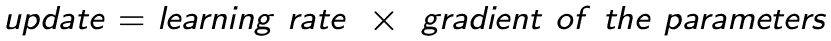
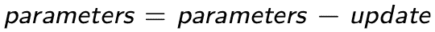
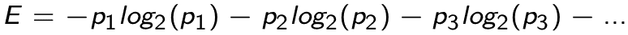
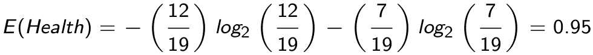
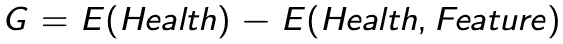
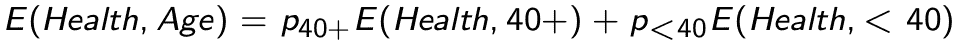

# 机器学习相关的算法/技术

在前面的章节中，我们未能对与本书中机器学习示例相关的某些算法和技术进行详细讨论。我们将在本节中解决这个问题。

# 梯度下降

在多个例子中（包括第四章“回归”和第五章“分类”中的例子），我们利用了一种称为**梯度下降**的优化技术。梯度下降方法有多种变体，通常在机器学习世界的各个地方都能看到它们。最显著的是，它们被用于确定线性或逻辑回归等算法的最佳系数，因此，它们在至少部分基于线性/逻辑回归的更复杂技术中也经常发挥作用（如神经网络）。

梯度下降方法的一般思想是确定某些参数的变化方向和幅度，这将使你朝着正确的方向移动以优化某些度量（如误差）。想象一下站在某个景观上。为了向更低的地势移动，你需要朝下走。这就是梯度下降在优化参数时算法上所做的事情。

通过观察所谓的**随机梯度下降**（**SGD**），我们可以进一步理解这个过程，它是一种增量式的梯度下降方法。如果你还记得，我们在第五章“分类”中对逻辑回归的实现中实际上使用了 SGD。在那个例子中，我们是这样实现逻辑回归参数的训练或拟合的：

```py
// logisticRegression fits a logistic regression model
// for the given data.
func logisticRegression(features *mat64.Dense, labels []float64, numSteps int, learningRate float64) []float64 {

    // Initialize random weights.
    _, numWeights := features.Dims()
    weights := make([]float64, numWeights)

    s := rand.NewSource(time.Now().UnixNano())
    r := rand.New(s)

    for idx, _ := range weights {
        weights[idx] = r.Float64()
    }

    // Iteratively optimize the weights.
    for i := 0; i < numSteps; i++ {

        // Initialize a variable to accumulate error for this iteration.
        var sumError float64

        // Make predictions for each label and accumulate error.
        for idx, label := range labels {

            // Get the features corresponding to this label.
            featureRow := mat64.Row(nil, idx, features)

            // Calculate the error for this iteration's weights.
            pred := logistic(featureRow[0]*weights[0] + featureRow[1]*weights[1])
            predError := label - pred
            sumError += math.Pow(predError, 2)

            // Update the feature weights.
            for j := 0; j < len(featureRow); j++ {
                weights[j] += learningRate * predError * pred * (1 - pred) * featureRow[j]
            }
        }
   }

   return weights
}

```

在`// 递归优化权重`注释下的循环实现了 SGD 来优化逻辑回归参数。让我们分析这个循环，以确定到底发生了什么。

首先，我们使用当前权重计算模型的输出，并计算我们的预测值与理想值（即实际观察值）之间的差异：

```py
// Calculate the error for this iteration's weights.
pred := logistic(featureRow[0]*weights[0] + featureRow[1]*weights[1])
predError := label - pred
sumError += math.Pow(predError, 2)
```

然后，根据 SGD，我们将根据以下公式计算参数（在这种情况下为`权重`）的更新：



**梯度**是问题中成本函数的数学梯度。

关于这个量的更详细的数学信息可以在这里找到：

[`mathworld.wolfram.com/Gradient.html`](http://mathworld.wolfram.com/Gradient.html)

更新可以应用于参数，如下所示：



在我们的逻辑回归模型中，这可以表示为以下形式：

```py
// Update the feature weights.
for j := 0; j < len(featureRow); j++ {
    weights[j] += learningRate * predError * pred * (1 - pred) * featureRow[j]
}
```

这种类型的 SGD 在机器学习中相当广泛地使用。然而，在某些情况下，这种梯度下降可能导致过拟合或陷入局部最小值/最大值（而不是找到全局最优解）。

为了解决这些问题，你可以利用一种称为**批量梯度下降**的梯度下降的变体。在批量梯度下降中，你根据整个训练数据集中的梯度来计算每个参数的更新，而不是根据特定观察或数据集的行来计算梯度。这有助于你防止过拟合，但它也可能相当慢，并可能存在内存问题，因为你需要为每个参数计算整个数据集的梯度。**小批量** **梯度下降**，这是另一种变体，试图保持批量梯度下降的一些好处，同时更具计算上的可处理性。在小批量梯度下降中，梯度是在训练数据集的子集上计算的，而不是整个训练数据集。

在逻辑回归的情况下，你可能会看到梯度上升或下降的使用，其中梯度上升与梯度下降相同，只是它应用于成本函数的负值。逻辑成本函数只要你保持一致，就会给你这两个选项。这进一步讨论在[`stats.stackexchange.com/questions/261573/using-gradient-ascent-instead-of-gradient-descent-for-logistic-regression`](https://stats.stackexchange.com/questions/261573/using-gradient-ascent-instead-of-gradient-descent-for-logistic-regression)。

梯度下降方法已经被 gonum 团队在`gonum.org/v1/gonum/optimize`中实现。有关更多信息，请参阅这些文档：

[`godoc.org/gonum.org/v1/gonum/optimize#GradientDescent`](https://godoc.org/gonum.org/v1/gonum/optimize#GradientDescent)

# 熵、信息增益和相关方法

在第五章，*分类*中，我们探讨了决策树方法，其中模型由一个 if/then 语句的树组成。决策树的这些 if/then 部分根据训练集的一个特征来分割预测逻辑。在一个我们试图将医疗患者分类为不健康或健康类别的例子中，决策树可能会首先根据性别特征进行分割，然后根据年龄特征，然后根据体重特征，依此类推，最终落在健康或不健康上。

算法是如何在决策树中首先选择使用哪些特征的？在先前的例子中，我们可以首先根据性别进行分割，或者首先根据权重，然后是任何其他特征。我们需要一种方法来以最佳方式安排我们的分割，以便我们的模型做出最好的预测。

许多决策树模型实现，包括我们在第五章“分类”中使用的，使用一个称为**熵**的量和一个**信息增益**的分析来构建决策树。为了说明这个过程，让我们考虑一个例子。假设你有一些关于健康人数与这些人各种特征的数据：

|  | **健康** | **不健康** |
| --- | --- | --- |
| **素食饮食** | 5 | 2 |
| **素食饮食** | 4 | 1 |
| **肉食饮食** | 3 | 4 |
|  | **健康** | **不健康** |
| **40 岁及以上** | 3 | 5 |
| **40 岁以下** | 9 | 2 |

在这里，我们数据中有两个特征，饮食和年龄，我们希望构建一个决策树，根据饮食和年龄预测人们是否健康。为此，我们需要决定是否应该首先在年龄上还是饮食上分割我们的决策树。请注意，数据中还有总共 12 个健康人和 7 个不健康人。

首先，我们将计算我们数据中类别的整体或总熵。这定义如下：



在这里，*p[1]*，*p[2]*，等等，是第一类，第二类等的概率。在我们特定的案例中（因为我们有 12 个健康人和 7 个不健康人），我们的总熵如下：



这个*0.95*的度量代表了我们的健康数据的同质性。它介于 0 和 1 之间，高值对应于同质性较低的数据。

要确定我们首先应该在年龄上还是饮食上分割我们的树，我们将计算这些特征中哪一个给我们带来最大的信息增益。简单来说，我们将找到在分割该特征后给我们带来最大同质性的特征，这是通过之前的熵来衡量的。这种熵的减少被称为**信息增益**。

我们例子中某个特征的**信息增益**定义如下：



在这里，*E(Health, Feature)*是关于给定特征（*年龄*或*饮食*）的熵的第二个度量。对于饮食，这个第二个度量可以这样计算：



量*p[40+]*和*p[<40]*是年龄为*40*+或*<40*（8/19 和 11/19，分别）的概率。量*E(Health,40+)*和*E(Health,<40)*是健康熵（如前公式定义），但只使用与那些年龄*40+*和年龄*<40*对应的计数。

对于我们的示例数据，年龄特征的信息增益为*0.152*，饮食特征的信息增益为*0.079*。因此，我们会选择首先在年龄特征上分割我们的决策树，因为它最大限度地增加了我们数据的整体同质性。

你可以在[`www.saedsayad.com/decision_tree.htm`](http://www.saedsayad.com/decision_tree.htm)了解更多关于基于熵构建决策树的信息，你还可以在 Go 语言中看到一个示例实现[`github.com/sjwhitworth/golearn/blob/master/trees/entropy.go`](https://github.com/sjwhitworth/golearn/blob/master/trees/entropy.go)。

# 反向传播

第八章，*神经网络与深度学习*，包含了一个从头开始构建的神经网络示例。这个神经网络包含了一个反向传播方法的实现，用于训练神经网络，这几乎可以在任何神经网络代码中找到。我们在那一章讨论了一些细节。然而，这个方法被如此频繁地使用，所以我们想在这里一步一步地介绍它。

要使用反向传播训练神经网络，我们为一系列的每个 epoch 执行以下操作：

1.  将训练数据通过神经网络产生输出。

1.  计算期望输出和预测输出之间的误差。

1.  根据误差，计算神经网络权重和偏置的更新。

1.  将这些更新反向传播到网络中。

作为提醒，我们对于具有单个隐藏层的网络实现这个过程的代码如下（其中`wHidden`和`wOut`是我们的隐藏层和输出层权重，而`bHidden`和`bOut`是我们的隐藏层和输出层偏置）：

```py
105     // Define the output of the neural network.
106     output := mat.NewDense(0, 0, nil)
107 
108     // Loop over the number of epochs utilizing
109     // backpropagation to train our model.
110     for i := 0; i < nn.config.numEpochs; i++ {
111
112         // Complete the feed forward process.
113         hiddenLayerInput := mat.NewDense(0, 0, nil)
114         hiddenLayerInput.Mul(x, wHidden)
115         addBHidden := func(_, col int, v float64) float64 { return v + bHidden.At(0, col) }
116         hiddenLayerInput.Apply(addBHidden, hiddenLayerInput)
117 
118         hiddenLayerActivations := mat.NewDense(0, 0, nil)
119         applySigmoid := func(_, _ int, v float64) float64 { return sigmoid(v) }
120         hiddenLayerActivations.Apply(applySigmoid, hiddenLayerInput)
121 
122         outputLayerInput := mat.NewDense(0, 0, nil)
123         outputLayerInput.Mul(hiddenLayerActivations, wOut)
124         addBOut := func(_, col int, v float64) float64 { return v + bOut.At(0, col) }
125         outputLayerInput.Apply(addBOut, outputLayerInput)
126         output.Apply(applySigmoid, outputLayerInput)
127 
128         // Complete the backpropagation.
129         networkError := mat.NewDense(0, 0, nil)
130         networkError.Sub(y, output)
131 
132         slopeOutputLayer := mat.NewDense(0, 0, nil)
133         applySigmoidPrime := func(_, _ int, v float64) float64 { return sigmoidPrime(v) }
134         slopeOutputLayer.Apply(applySigmoidPrime, output)
135         slopeHiddenLayer := mat.NewDense(0, 0, nil)
136         slopeHiddenLayer.Apply(applySigmoidPrime, hiddenLayerActivations)
137 
138         dOutput := mat.NewDense(0, 0, nil)
139         dOutput.MulElem(networkError, slopeOutputLayer)
140         errorAtHiddenLayer := mat.NewDense(0, 0, nil)
141         errorAtHiddenLayer.Mul(dOutput, wOut.T())
142 
143         dHiddenLayer := mat.NewDense(0, 0, nil)
144         dHiddenLayer.MulElem(errorAtHiddenLayer, slopeHiddenLayer)
145 
146         // Adjust the parameters.
147         wOutAdj := mat.NewDense(0, 0, nil)
148         wOutAdj.Mul(hiddenLayerActivations.T(), dOutput)
149         wOutAdj.Scale(nn.config.learningRate, wOutAdj)
150         wOut.Add(wOut, wOutAdj)
151 
152         bOutAdj, err := sumAlongAxis(0, dOutput)
153         if err != nil {
154             return err
155         }
156         bOutAdj.Scale(nn.config.learningRate, bOutAdj)
157         bOut.Add(bOut, bOutAdj)
158 
159         wHiddenAdj := mat.NewDense(0, 0, nil)
160         wHiddenAdj.Mul(x.T(), dHiddenLayer)
161         wHiddenAdj.Scale(nn.config.learningRate, wHiddenAdj)
162         wHidden.Add(wHidden, wHiddenAdj)
163 
164         bHiddenAdj, err := sumAlongAxis(0, dHiddenLayer)
165         if err != nil {
166             return err
167         }
168         bHiddenAdj.Scale(nn.config.learningRate, bHiddenAdj)
169         bHidden.Add(bHidden, bHiddenAdj)
170     }
```

让我们详细分析这个实现，以了解到底发生了什么。

产生我们输出的前向过程执行以下操作：

1.  将输入数据乘以隐藏层权重，加上隐藏层偏置，然后应用 sigmoid 激活函数来计算隐藏层的输出，即`hiddenLayerActivations`（前一个代码片段的第 112 到 120 行）。

1.  将`hiddenLayerActivations`乘以输出层权重，然后加上输出层偏置，并应用 sigmoid 激活函数来计算`output`（第 122 到 126 行）。

注意，在前向过程中，我们是始于输入层的输入数据，然后通过隐藏层逐步向前，直到达到输出。

在前向过程之后，我们需要计算权重和偏置的最佳更新。正如你可能预期的那样，在附录的这一部分经过梯度下降部分之后，梯度下降是找到这些权重和偏置的完美选择。前一个代码片段的第 129 到 144 行实现了 SGD。

最后，我们需要将这些更新反向应用到网络的第 147 到 169 行。这是反向传播更新，使得反向传播得名。这个过程并没有什么特别之处，我们只是执行以下操作：

1.  将计算出的更新应用到输出层的权重和偏置（第 147 到 157 行）。

1.  将计算出的更新应用到隐藏层权重和偏置（第 159 到 169 行）。

注意我们是如何从输出开始，逐步回溯到输入，应用这些变化的。

你可以在这里找到关于反向传播的非常详细的讨论，包括数学证明：

[神经网络与深度学习](http://neuralnetworksanddeeplearning.com/chap2.html)

反向传播在 1986 年 David Rumelhart、Geoffrey Hinton 和 Ronald Williams 发表的一篇论文之后开始被广泛使用。尽管这种方法在神经网络行业中得到了广泛应用，但 Geoffrey Hinton 最近公开表示他对反向传播持**深深怀疑**的态度，并建议我们需要努力寻找替代方案。
