# 1

# 机器学习中数据不平衡的介绍

机器学习算法已经帮助解决了各种现实世界问题，从疾病预测到在线购物。然而，我们希望用机器学习解决的问题中，许多都涉及不平衡数据集。在本章中，我们将讨论并定义不平衡数据集，解释它们与其他类型数据集的不同之处。我们将通过常见问题和场景的例子来展示不平衡数据的普遍性。我们还将学习机器学习的基础知识，包括损失函数、正则化和特征工程等基本概念。我们还将了解常见的评估指标，特别是那些对于不平衡数据集非常有帮助的指标。然后我们将介绍`imbalanced-learn`库。

尤其，我们将学习以下主题：

+   不平衡数据集的介绍

+   机器学习 101

+   数据集的类型和拆分

+   常见的评估指标

+   处理不平衡数据时的挑战和考虑因素

+   我们何时会在数据集中出现不平衡？

+   为什么不平衡数据会成为一个挑战？

+   何时不必担心数据不平衡

+   `imbalanced-learn`库的介绍

+   需要遵循的一般规则

# 技术要求

在本章中，我们将利用常见的库，如`numpy`和`scikit-learn`，并介绍`imbalanced-learn`库。本章的代码和笔记本可在 GitHub 上找到，网址为[`github.com/PacktPublishing/Machine-Learning-for-Imbalanced-Data/tree/main/chapter01`](https://github.com/PacktPublishing/Machine-Learning-for-Imbalanced-Data/tree/main/chapter01)。您可以通过点击本章笔记本顶部的**Open in Colab**图标或通过使用笔记本的 GitHub URL 在[`colab.research.google.com`](https://colab.research.google.com)启动来使用 Google Colab 打开 GitHub 笔记本。

# 不平衡数据集的介绍

机器学习算法从我们所称的**数据集**的集合中学习。这些数据集包含多个数据样本或点，我们可以在整本书中将这些样本、样本或实例互换使用。

当所有目标类别具有相似数量的示例时，可以说数据集具有平衡分布，如图*图 1**.1*所示： 

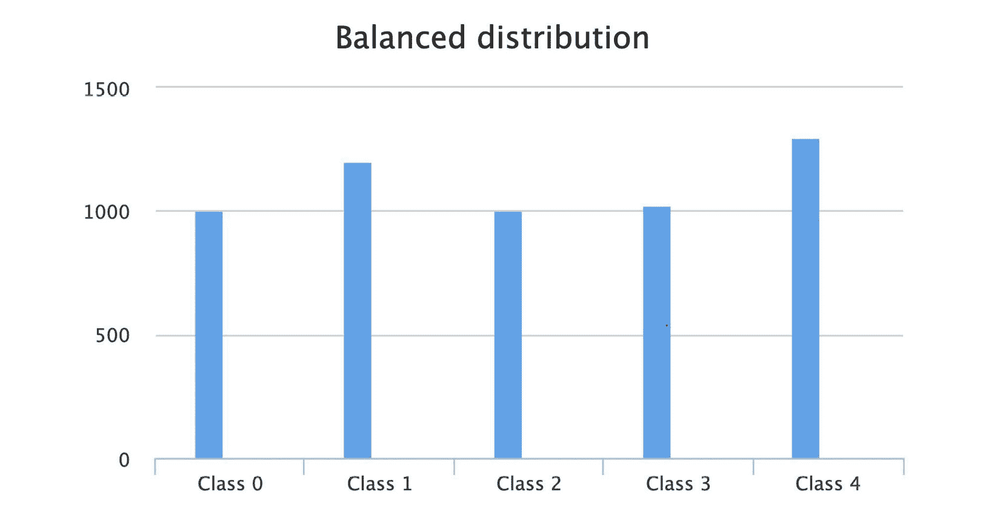

图 1.1 – 类别间示例数量几乎相等的平衡分布

不平衡数据集或倾斜数据集是指某些目标类别（也称为标签）的数量超过其他类别的数据集（*图 1**.2*）。尽管这通常适用于机器学习中的分类问题（例如，欺诈检测），但在回归问题（例如，房价预测）中也会不可避免地发生：

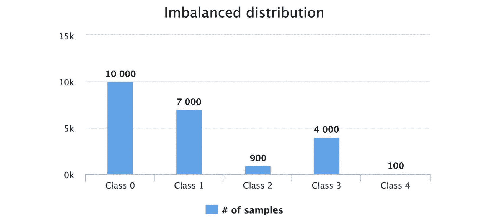

图 1.2 – 具有五个类别和不同样本数量的不平衡数据集

我们将具有更多实例的类别标记为“多数”或“负”类，将具有较少实例的类别标记为“少数”或“正”类。大多数时候，我们的主要兴趣在于少数类，这就是为什么我们经常将少数类称为“正”类，将多数类称为“负”类：

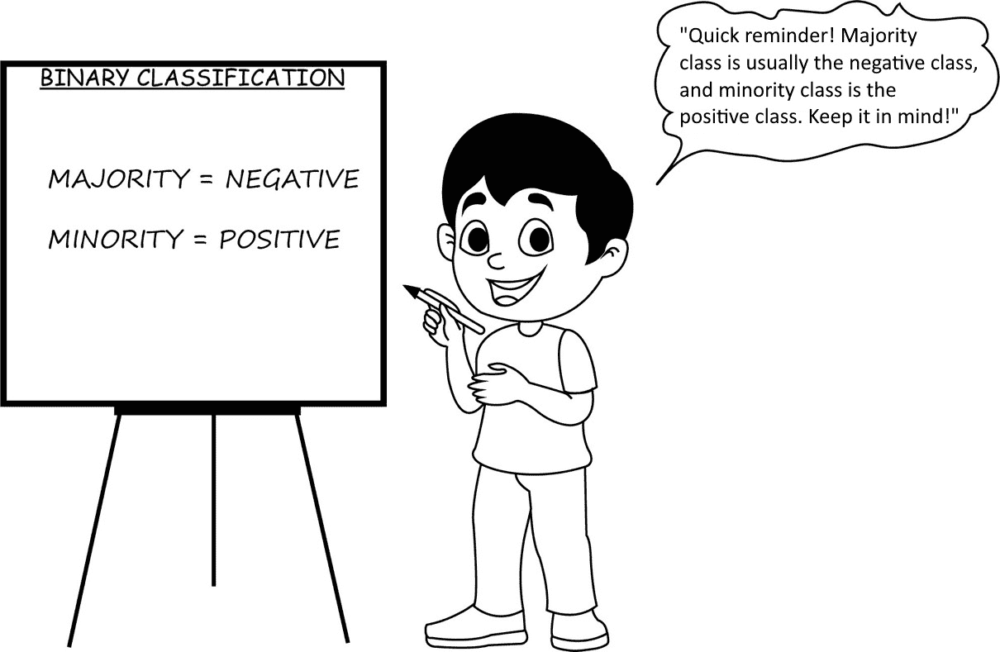

图 1.3 – 不平衡分类中常用术语的视觉指南

这可以扩展到超过两个类别，这样的分类问题称为多类分类。在这本书的前半部分，我们将只关注二元分类，以使材料更容易理解。将概念扩展到多类分类相对容易。

让我们看看几个不平衡数据集的例子：

+   **欺诈检测**是指从多笔交易中检测出欺诈交易。这个问题在金融、医疗和电子商务行业中经常遇到并被广泛使用。

+   使用机器学习的**网络入侵检测**涉及分析大量网络流量数据，以检测和防止未经授权的访问和计算机系统的滥用。

+   **癌症检测**。癌症并不罕见，但我们仍然可能想使用机器学习来分析医疗数据，以更早地识别潜在的癌症病例并改善治疗效果。

在这本书中，我们希望专注于一般类别不平衡问题，并查看各种解决方案，在这些解决方案中，我们看到类别不平衡正在影响我们模型的性能。一个典型的问题是在模型训练期间模型看到的少数类示例非常少，模型在这些少数类上的表现相当差。

# 机器学习 101

让我们快速概述一下机器学习及其相关领域：

+   **人工智能**是所有与智能相关问题的超集。经典机器学习包括可以通过训练传统经典模型（如决策树或逻辑回归）并预测目标值来解决的问题。它们通常在表格数据上工作，需要大量的特征工程（手动开发特征），并且在文本和图像数据上的效果较差。深度学习在图像、文本、语音和视频数据上往往表现得更好，在这些情况下，通常不需要手动特征工程，神经网络中的各个层自动为我们进行特征工程。

+   在**监督学习**中，数据集既有输入也有输出（标签），模型在训练期间学习预测输出。每个输入可以表示为一个特征列表。输出或标签可以是有限类别的集合（分类）、实数（回归）或更复杂的东西。分类中的监督学习的一个经典例子是鸢尾花分类。在这种情况下，数据集包括花瓣长度、花瓣宽度、萼片长度和萼片宽度等特征，标签是鸢尾花的种类（setosa、versicolor 或 virginica）。可以在该数据集上训练一个模型，然后使用该模型将新的、未见过的鸢尾花分类为这些种类之一。

+   在**无监督学习**中，模型要么无法访问标签，要么不使用标签，然后尝试做出一些预测——例如，将数据集中的示例聚类到不同的组中。

+   在**强化学习**中，模型通过犯错误和优化目标或利润变量来尝试学习。一个例子是训练一个模型来下棋，并根据通过奖励和惩罚获得的反馈调整其策略。

在监督学习中（本书的重点），主要有两种类型的问题：分类和回归。分类问题涉及将数据分类到预定义的类别或标签中，例如“欺诈”或“非欺诈”以及“垃圾邮件”或“非垃圾邮件”。另一方面，回归问题旨在预测一个连续变量，例如房屋的价格。

虽然数据不平衡也可能影响回归问题，但本书将仅专注于分类问题。这种关注是由于几个因素，例如本书的范围有限以及分类中可用的技术已经建立。在某些情况下，甚至可以将回归问题重新构造成分类问题，使得本书中讨论的方法仍然相关。

当涉及到用于分类问题的各种流行模型时，我们有相当多的经典监督机器学习模型类别：

+   **逻辑回归**：这是一种用于二元分类问题的监督机器学习算法。它通过拟合逻辑函数到数据，根据一组预测变量（特征）预测二元目标变量的概率，该函数输出介于 0 和 1 之间的值。

+   **支持向量机**（**SVMs**）：这些是主要用于分类的监督机器学习算法，也可以扩展到回归问题。SVMs 通过找到最优的超平面来最大化分离输入数据中的不同类别，从而成为二元和多类别分类任务的强大工具。

+   **K-最近邻**（**KNN**）：这是一种用于分类和回归分析的监督机器学习算法。它根据训练数据集中的*k*个最近邻来预测目标变量。*k*的值决定了在做出预测时考虑的邻居数量，并且可以调整以优化模型性能。

+   **树模型**：这是一种用于分类和回归分析的监督机器学习算法。它们通过根据最重要的特征递归地将数据分割成更小的子集来创建决策树，该决策树根据输入特征预测目标变量。

+   **集成模型**：这些模型结合多个单个模型以提高预测准确性和减少过拟合（本章后面将解释）。集成技术包括袋装（例如，随机森林）、提升（例如，XGBoost）和堆叠。它们常用于分类以及回归分析。

+   **神经网络**：这些模型受人类大脑的启发，由多个层组成，每层有众多神经元，能够学习复杂函数。我们将在*第六章*中更详细地讨论这些内容，*深度学习中的数据不平衡*。

*图 1.4*显示了迄今为止我们已审查的各种分类器的决策边界。它显示逻辑回归具有线性决策边界，而基于树的模型，如决策树、随机森林和 XGBoost，通过将示例分割成轴平行的矩形来形成它们的决策边界。另一方面，SVM 将数据转换到不同的空间，以便它可以绘制其非线性决策边界。神经网络具有非线性决策边界：

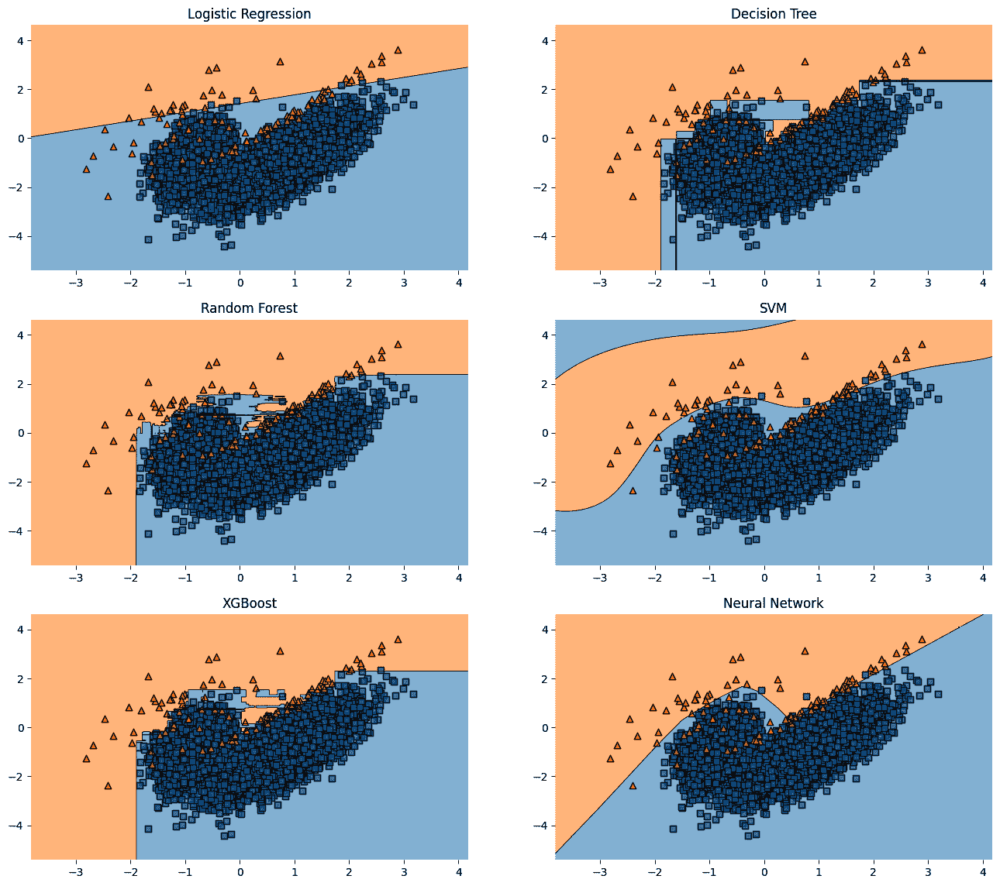

图 1.4 – 在不平衡数据集上流行机器学习算法的决策边界

接下来，我们将深入探讨模型训练过程背后的原理。

## 模型训练过程中会发生什么？

在机器学习模型的训练阶段，我们向模型提供一个由示例组成的训练数据集，每个示例都有输入特征和相应的标签。让 X 代表用于训练的特征列表，y 代表训练数据集中的标签列表。模型的目标是学习一个函数 f，使得 f(X) ≈ y。

该模型具有可调整的参数，表示为θ，这些参数在训练过程中进行微调。误差函数，通常称为**损失函数**，定义为 L(f(X; θ), y)。该误差函数需要通过学习算法最小化，该算法找到这些参数θ的最佳设置。

在分类问题中，我们的典型损失函数是交叉熵损失（也称为对数损失）：

CrossEntropyLoss(p) = {− log(p) if y = 1  − log(1 − p) otherwise

这里，p 是当 y = 1 时模型预测的概率。

当模型的预测与目标标签非常接近时，损失函数将趋近于零。然而，当预测与目标有显著偏差时，损失可以变得任意大，这表明模型拟合不良。

随着训练的进行，训练损失持续下降（*图 1**.5*）：

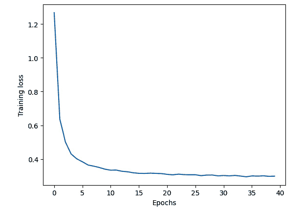

图 1.5 – 随着训练的进行损失函数的变化率

这引出了模型拟合的概念：

+   如果一个模型过于简单，无法捕捉数据的复杂性，则称为**欠拟合**。它在训练数据和新的数据上表现都较差。

+   一个模型如果能够准确捕捉数据模式而不包含学习噪声，则被认为是**合适的**。它在训练数据和新的数据上表现良好。

+   一个**过拟合**的模型过于复杂，并学会了数据模式中的噪声。它在训练数据上表现良好，但在新的数据上表现较差（*图 1**.6*）：

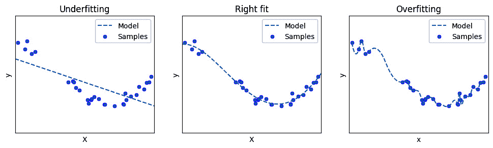

图 1.6 – 分类任务中的欠拟合、合适拟合和过拟合模型

接下来，让我们简要了解机器学习中的两个重要概念：

+   **正则化**是一组用于防止模型过度拟合训练数据的技巧。一种正则化类型（即 L1 或 L2）将惩罚项添加到损失函数中，这鼓励模型具有更小的权重并降低其复杂性。这有助于防止模型过于接近训练数据，并更好地泛化到未见数据。

+   **特征工程**是选择和转换模型输入特征以改进其性能的过程。特征工程包括选择与问题最相关的特征，将它们转换以使其更具信息性，并从现有特征中创建新特征。良好的特征工程可以在模型性能上产生巨大差异，并且通常比算法或超参数的选择更重要。

# 数据集类型和分割

通常，我们在训练集上训练模型，并在一个独立的未见数据集上测试模型，这个数据集被称为测试集。我们这样做是为了对模型进行公平的评估。如果我们不这样做，而是在整个数据集上训练模型并在同一数据集上评估模型，我们就不知道模型在未见数据上的表现如何，此外，模型很可能会过拟合。

在机器学习中，我们可能会遇到三种类型的数据集：

+   **训练集**：模型训练的数据集。

+   **验证集**：用于调整模型超参数的数据集。验证集通常被称为开发集。

+   **评估集或测试集**：用于评估模型性能的数据集。

当处理小型示例数据集时，通常将 80%的数据分配给训练集，10%分配给验证集，10%分配给测试集。然而，训练集和测试集之间的具体比例并不像确保测试集足够大以提供具有统计意义的评估结果那样重要。在大数据环境中，训练集、验证集和测试集分别以 98%、1%和 1%的比例分割可能是合适的。

通常，人们没有为超参数调整设置专门的验证集，而是将测试集作为评估集。这可能发生在超参数调整不是作为常规训练周期的一部分进行，而是一次性活动时。

## 交叉验证

**交叉验证**可能是一个令人困惑的术语，猜测其含义。分解它：交叉+验证，所以它是对扩展（交叉）某种东西的验证。在这里，“某种东西”对我们来说是测试集。

让我们看看什么是交叉验证：

+   交叉验证是一种技术，用于估计模型在实际应用中的准确性。

+   它通常用于检测过拟合——即未能泛化数据中的模式，尤其是在数据量可能有限的情况下。

让我们看看不同的交叉验证类型：

+   **保留集（Holdout）**：在保留集方法中，我们将数据点随机分配到两个集合中，通常分别称为训练集和测试集。然后我们在**训练集**上训练（构建模型），在**测试集**上测试（评估其性能）。

+   **k 折**：它的工作方式如下：

    +   我们随机打乱数据。

    +   我们将所有数据分成*k*部分，也称为折。我们在*k*-1 折上训练模型，并在剩余的折上评估它。我们使用我们选择的模型评估指标记录这个模型的性能，然后丢弃这个模型。

    +   我们重复这个过程*k*次，每次都保留不同的子集进行测试。我们从所有之前的模型中取评估指标值（例如，准确率）的平均值。这个平均值代表了模型的总体性能指标。

**k 折交叉验证**主要用于数据点有限的情况，比如 100 个点。在执行交叉验证时，使用 5 或 10 折是最常见的。

让我们看看机器学习中的常见评估指标，特别关注与不平衡数据问题相关的指标。

# 常见评估指标

几种机器学习和深度学习指标被用于评估分类模型的性能。

让我们来看看一些有助于评估我们在测试集上模型性能的有用指标。

## 混淆矩阵

给定一个试图将示例分类为正类或负类的模型，有四种可能性：

+   **真阳性（TP）**：这发生在模型正确地将样本预测为正类的一部分时，这是其实际的分类。

+   **假阴性 (FN)**: 这发生在模型错误地将正类样本分类为负类

+   **真阴性 (TN)**: 这指的是模型正确地将样本识别为负类，这是其实际分类

+   **假阳性 (FP)**: 这发生在模型错误地将负类样本预测为正类

*表 1.1* 展示了模型在做出预测时可能会“混淆”的方式，恰当地称为**混淆矩阵**。混淆矩阵是许多常见机器学习指标的基础：

|  | **预测正样本** | **预测负样本** |
| --- | --- | --- |
| **实际正样本** | 真正例 (TP) | 假阴性 (FN) |
| **实际负样本** | 假阳性 (FP) | 真阴性 (TN) |

表 1.1 – 混淆矩阵

让我们看看机器学习中一些最常见的指标：

+   **真正例率** (**TPR**) 衡量模型正确分类的实际正例的比例：

    TPR = 正确分类的正样本  ______________  总正样本 =  TP _ TP + FN

+   **假阳性率** (**FPR**) 衡量模型错误地将实际负样本识别为正样本的比例：

    FPR = 错误分类的负样本  _______________  总负样本 =  FP _ FP + TN

+   `sklearn` 库中的 `sklearn.metrics.accuracy_score`。

+   `sklearn` 库下的 `sklearn.metrics.precision_score`。精确率 =  TP _ TP + FP。

+   `sklearn` 库下的 `sklearn.metrics.recall_score`。召回率 =  TP _ TP + FN。

    *表 1.2* 总结了精确率和召回率之间的差异：

|  | **精确率** | **召回率** |
| --- | --- | --- |
| 定义 | 精确率是可信度的衡量标准 | 召回率是完整性的衡量标准 |
| 要问的问题 | 当模型说某件事是正样本时，它有多经常是正确的？ | 在所有正样本中，模型正确识别了多少？ |
| 示例（使用电子邮件过滤器） | 精确率衡量模型标记为垃圾邮件的电子邮件中有多少实际上是垃圾邮件，占所有标记电子邮件的百分比 | 召回率衡量模型捕获的实际垃圾邮件数量，占数据集中所有垃圾邮件的百分比 |
| 公式 | 精确率 =  TP _ TP + FP  | 召回率 =  TP _ TP + FN  |

表 1.2 – 精确率与召回率

为什么准确率对于不平衡数据集来说可能是一个糟糕的指标？

假设我们有一个不平衡的数据集，包含 1,000 个示例，其中 100 个标签属于类别 1（少数类）和 900 个属于类别 0（多数类）。

假设我们有一个模型，总是对所有示例预测 0。该模型对少数类的准确率为 900 + 0 _ (900 + 0+ 100 + 0 ) = 90%。

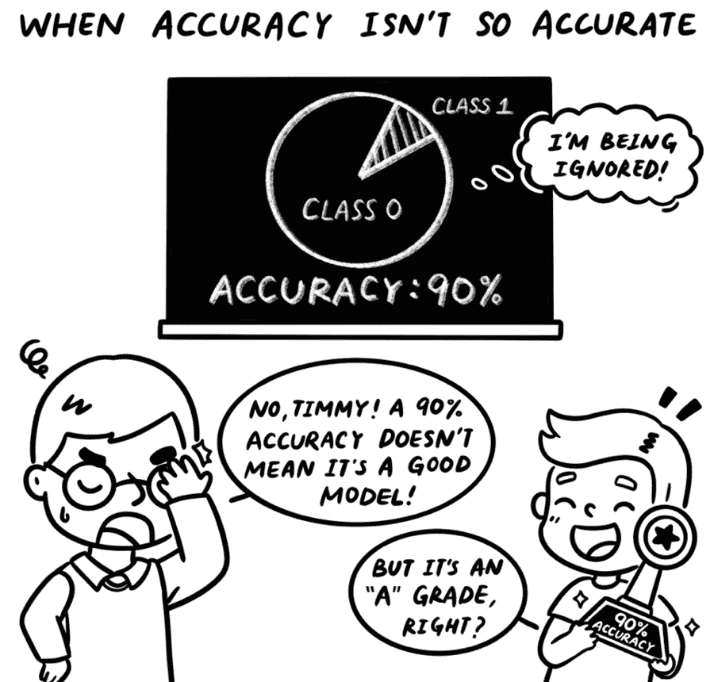

图 1.7 – 一幅漫画显示准确率可能并不总是正确的指标

这将我们带到机器学习中的 **精度-召回率权衡**。通常，精度和召回率是负相关的，也就是说，当召回率增加时，精度通常会降低。为什么？注意，召回率 = TP _ TP + FN，为了召回率增加，FN 应该减少。这意味着模型需要将更多项目分类为正类。然而，如果模型将更多项目分类为正类，其中一些可能是错误的分类，导致假阳性（**FP**）的数量增加。随着假阳性数量的增加，定义为 TP _ TP + FP 的精度将降低。用类似的逻辑，你可以论证当召回率降低时，精度通常会提高。

接下来，让我们尝试理解一些基于精度和召回率的指标，这些指标可以帮助衡量在不平衡数据上训练的模型的性能：

+   `sklearn` 库中的 `sklearn.metrics.f1_score`。

+   `sklearn` 库中的 `sklearn.metrics.fbeta_score`。

+   `sklearn` 库中的 `sklearn.metrics.balanced_accuracy_score`。

+   **特异性 (SPE)**：特异性是衡量模型正确识别负样本能力的指标。在二分类中，它被计算为真阴性预测与负样本总数之比。高特异性表明模型擅长识别负类，而低特异性表明模型倾向于正类。

+   `sklearn.metrics.precision_recall_fscore_support` 和 `imblearn.metrics.classification_report_imbalanced` API。

+   `imbalanced-learn` 库中的 `geometric_mean_score()` 定义为“正类示例上的准确率”（召回率或灵敏度或 TPR）和“负类示例上的准确率”（特异性或 TNR）的几何平均值。因此，即使一个类别被另一个类别大量超过，该指标仍然能代表模型的总体性能。

+   `imblearn.metrics.classification_report_imbalanced`。

*表 1.3* 展示了与混淆矩阵相关的指标及其公式作为扩展：

|  | **预测为正** | **预测为负** |  |
| --- | --- | --- | --- |
| **实际上** **正** | 真阳性 (TP) | 假阴性 (FN) | *召回率 = 灵敏度 = 真阳性率 (TPR) = TP _ TP + FN* |
| **实际上** **负** | 假阳性 (FP) | 真阴性 (TN) | 特异性 =  TN _ TN + FP |
|  | 精度 = TP/(TP+FP) 假阳性率 (FPR) = FP/(FP+TN) |  | 准确率 =  TP + TN ________________________ TP + TN + FP + FN F1 分数 = 2 * 精度 * 召回率 ________________________ 精度 + 召回率 |

表 1.3 – 带有各种指标及其定义的混淆矩阵

## ROC

**接收者操作特征**，通常称为 **ROC** 曲线，是显示各种阈值值下 *y* 轴上的 **TPR** 与 *x* 轴上的 **FPR** 的图表：

+   ROC 曲线本质上表示了*y*轴上正确预测的阳性实例的比例，与*x*轴上错误预测的阴性实例的比例形成对比。

+   在分类任务中，阈值是一个用于确定示例类别的截止值。例如，如果一个模型将一个示例分类为“阳性”，则可能设置 0.5 的阈值来决定该实例是否应被标记为属于“阳性”或“阴性”类别。ROC 曲线可以用来识别模型的最佳阈值。这个主题将在*第五章*，*成本敏感学习*中详细讨论。

+   要创建 ROC 曲线，我们计算模型预测概率的许多不同阈值值的 TPR 和 FPR。对于每个阈值，相应的 TPR 值被绘制在*y*轴上，FPR 值被绘制在*x*轴上，形成一个点。通过连接这些点，我们生成 ROC 曲线（*图 1**.8*）：

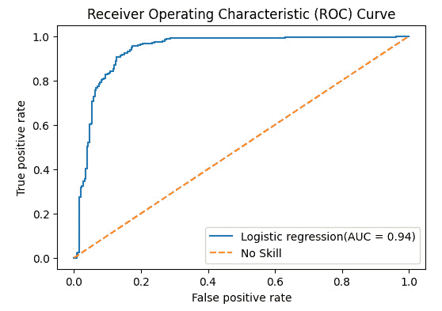

图 1.8 – ROC 曲线作为 TPR 与 FPR 的图表（虚线表示没有技能的模型）

ROC 曲线的一些特性如下：

+   ROC 曲线下的**面积**（**AUC**）（也称为**AUC-ROC**）具有特定的用途：它提供了一个单一的数值，表示模型在所有可能的分类阈值上的性能：

    +   AUC-ROC 表示类别的可分离程度。这意味着 AUC-ROC 越高，模型区分类别和预测阳性类别示例为阳性以及阴性类别示例为阴性的能力就越强。AUC 接近 0 的差劲模型实际上将阳性类别预测为阴性类别，反之亦然。

    +   随机分类器的 AUC-ROC 为 0.5，并且是连接 ROC 曲线上的点(0,0)和(1,0)的对角线。

    +   AUC-ROC 具有概率解释：AUC 为 0.9 表示模型将随机选择的阳性类别示例分配的分数高于阴性类别示例的概率为 90%。也就是说，AUC-ROC 可以表示如下：

P(score(𝑥+ ) > score(𝑥− ))

在这里，𝑥+ 表示阳性（少数）类别，而𝑥− 表示阴性（多数）类别。

+   在评估模型性能的背景下，使用一个反映模型将在现实世界场景中遇到的数据分布的测试集至关重要。这在考虑如 ROC 曲线等指标时尤其相关，因为 ROC 曲线在测试数据类别失衡变化时保持一致[2]。之所以如此，是因为这两个比率都是独立于测试数据类别分布的，因为它们仅基于每个类别的正确和错误分类实例计算，而不是每个类别的实例总数。这不同于训练数据中失衡的变化，这可能会对模型性能产生不利影响，并反映在 ROC 曲线上。

现在，让我们看看使用 ROC 曲线评估失衡数据集时可能遇到的一些问题：

+   ROC 曲线不区分各种类别——也就是说，它不会强调一个类别比另一个类别更重要。这对于失衡数据集来说可能是一个问题，因为在失衡数据集中，通常检测少数类别比检测多数类别更重要。正因为如此，它可能无法很好地反映少数类别。例如，我们可能希望召回率比精确率更好。

+   虽然 ROC 曲线可以用于比较模型在全范围内 FPR 的性能，但对于需要非常低 FPR 的特定应用，如金融交易或银行应用中的欺诈检测，它们可能不那么相关。FPR 需要非常低的原因是，此类应用通常需要有限的手动干预。可以手动检查的交易数量可能低至所有数据的 1%甚至 0.1%，这意味着 FPR 不能高于 0.001。在这些情况下，ROC 曲线上的 FPR 等于 0.001 右侧的所有内容都变得无关紧要[3]。为了进一步理解这一点，让我们考虑一个例子：

    +   假设对于一个测试集，我们总共有 10,000 个示例，其中只有 100 个正类示例，占所有示例的 1%。因此，任何高于 1%的 FPR——即 0.01——都会引发过多的警报，无法由调查人员手动处理。

    +   在 ROC 曲线的左侧远端的表现对于大多数现实世界问题至关重要，这些问题通常由大量负实例主导。因此，对于需要保持非常低 FPR 的应用，ROC 曲线的大部分内容都变得无关紧要。

## 精确率-召回率曲线

与 ROC 曲线类似，**精确率-召回率**（**PR**）曲线在不同阈值下绘制了一对指标。但与绘制 TPR 和 FPR 的 ROC 曲线不同，PR 曲线绘制的是精确率和召回率。为了展示这两条曲线之间的差异，让我们假设我们比较了两个模型——模型 1 和模型 2——在特定手工制作的失衡数据集上的性能：

+   在*图 1.9（a）*中，两个模型的 ROC 曲线似乎接近左上角（点（0, 1）），这可能会让你得出结论，两个模型都表现良好。然而，这在不平衡数据集的背景下可能会误导。

+   当我们将注意力转向*图 1.9（b）*中的 PR 曲线时，故事发生了变化。模型 2 接近图表的理想右上角（点（1, 1）），这表明在考虑精度和召回率时，其性能远优于模型 1。

+   PR 曲线显示模型 2 相对于模型 1 有优势。

ROC 曲线和 PR 曲线之间的这种差异也强调了使用多个指标进行模型评估的重要性，尤其是在处理不平衡数据时：

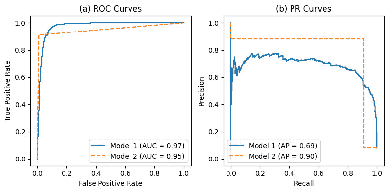

图 1.9 – 与 ROC 曲线相比，PR 曲线可以显示模型之间的明显差异

让我们尝试详细理解这些观察结果。虽然 ROC 曲线显示两种模型性能之间的差异很小，但 PR 曲线显示了更大的差距。原因在于 ROC 曲线使用 FPR，即 FP/(FP+TN)。通常，对于不平衡数据集，TN 非常高，因此即使 FP 有相当大的变化，FPR 的整体值也会被 TN 所掩盖。因此，ROC 变化不大。

哪个分类器更优越的结论可能会随着测试集中类别的分布而改变。在数据集倾斜的情况下，PR 曲线可以比 ROC 曲线更清楚地显示出模型表现不佳，如图所示。

`sklearn`中的`average_precision_score`。

## ROC 曲线与 PR 曲线之间的关系

ROC 曲线和 PR 曲线之间的主要区别在于，ROC 评估模型在“计算”正负类别方面的表现，而 PR 仅关注正类别。因此，当处理平衡数据集的情况，并且你关心正负类别时，ROC AUC 表现得非常好。相比之下，当处理不平衡情况时，PR AUC 更为合适。然而，重要的是要记住，PR AUC 仅评估模型“计算”正类的能力。*因为 PR 曲线对正类（少数类）更敏感，所以本书的前半部分我们将使用 PR 曲线。*

我们可以在*x*轴上以精度重新想象 PR 曲线，在*y*轴上则是 TPR，也称为召回率。这两条曲线的关键区别在于，虽然 ROC 曲线使用 FPR，PR 曲线则使用精度。

如前所述，当处理不平衡数据集时，FPR（假正率）往往非常低。这种低 FPR 值的特性在诸如欺诈检测等某些应用中至关重要，因为这些应用中手动调查的能力本质上有限。因此，这种观点可能会改变对分类器性能的认识。如图 1.9 所示，当使用平均精度（0.69 比 0.90）而不是 AUC-ROC（0.97 和 0.95）进行比较时，两个模型的性能似乎也出现了反转。

让我们总结一下：

+   AUC-ROC 是在 y 轴上以 TPR 为基准，x 轴上以 FPR 为基准的曲线下的面积。

+   AUC-PR 是在 y 轴上以精确率为基准，x 轴上以召回率为基准的曲线下的面积。

由于 TPR 等于召回率，这两个图表仅在比较召回率时有所不同——要么是精确率，要么是 FPR。此外，这两个图表相对于彼此旋转了 90 度：

|  | **AUC-ROC** | **AUC-PR** |
| --- | --- | --- |
| 一般公式 | AUC(TPR, FPR) | AUC(精确率，召回率) |
| 扩展公式 | AUC(  TP _ TP + FN ,  FP _ FP + TN ) | AUC(  TP _ TP + FP ,  TP _ TP + FN ) |
| 对应关系 | AUC(召回率，FPR) | AUC(精确率，召回率) |

表 1.4 – 比较 ROC 和 PR 曲线

在接下来的几节中，我们将探讨导致数据集不平衡的情况，这些不平衡可能带来的挑战，以及数据不平衡可能不是问题的情况。

# 处理不平衡数据时的挑战和考虑因素

在某些情况下，直接使用数据用于机器学习而不担心数据不平衡，可能会得到适合特定业务场景的可用的结果。然而，在某些情况下，需要更多的努力来管理不平衡数据的影响。

广泛的说法，声称你必须始终或永远调整不平衡类别，往往具有误导性。事实是，解决类别不平衡的需要取决于数据的特定特征、手头的问题以及可接受解决方案的定义。因此，处理类别不平衡的方法应根据这些因素量身定制。

# 我们在什么情况下会遇到数据集的不平衡？

在本节中，我们将探讨导致数据集不平衡的各种情况和原因，例如罕见事件的发生或数据收集过程的偏差：

+   **问题固有的**：有时，我们需要解决的任务涉及检测数据集中的异常值——例如，患有某种疾病的患者或一组交易中的欺诈案例。在这种情况下，数据集固有不平衡，因为目标事件本身就很罕见。

+   **在构建机器学习解决方案时数据收集的高成本**：对于某些类别，收集数据可能成本过高。例如，由于需要专业的医疗测试、防护设备，以及在高度紧张的医疗环境中获取知情同意的伦理和物流挑战，收集 COVID-19 患者的数据成本很高。

+   **某些类别的噪声标签**：这可能在数据收集过程中，某些类别的标签中引入了大量噪声时发生。

+   **标签错误**：标签错误也可能导致数据不平衡。例如，如果一些样本被错误地标记为负例，而实际上它们是正例，这可能导致数据集中的不平衡。此外，如果一个类别本身就很罕见，人类标注者可能会存在偏见，并忽略那些存在的罕见类别的少数示例。

+   **采样偏差**：数据收集方法有时会在数据集中引入偏差。例如，如果一项调查在特定的地理区域或特定的人群中进行，那么得到的数据集可能无法代表整个群体。

+   **数据清洗**：在数据清洗或过滤过程中，由于数据不完整或缺失，某些类别或样本可能会被移除。这可能导致剩余数据集中的不平衡。

# 为什么不平衡数据会是一个挑战？

让我们深入探讨不平衡数据对模型预测的困难及其对模型性能的影响：

+   **度量指标如准确率的失败**：正如我们之前讨论的，在数据不平衡的背景下（一个 99%不平衡的数据集仍然可以达到 99%的准确率），传统的度量指标如准确率可能会产生误导。阈值不变的度量指标，如 PR 曲线或 ROC 曲线，试图揭示模型在广泛阈值范围内的性能。真正的挑战在于混淆矩阵中“真正负例”单元格的不成比例影响。那些较少关注“真正负例”的度量指标，如精确率、召回率或 F1 分数，更适合评估模型性能。需要注意的是，这些度量指标有一个隐藏的超参数——分类阈值——不应被忽视，而应在实际应用中进行优化（参考*第五章*，*成本敏感学习*，了解更多关于阈值调整的信息）。

+   **不平衡数据对模型的损失函数可能构成挑战**：这可能是因为损失函数通常设计为最小化预测输出与训练数据真实标签之间的错误。当数据不平衡时，一个类别的实例比另一个类别的实例多，模型可能会偏向多数类。我们将在*第五章*，*成本敏感学习*和*第八章*，*算法级深度学习技术*中更详细地讨论解决这个问题。

+   **不同类别的误分类成本不同**：通常，误分类正例的成本可能比误分类负例的成本更高。我们可能有的假阳性比假阴性更昂贵。例如，通常将患有癌症的患者误诊为健康（假阴性）的成本将远高于将健康患者误诊为患有癌症（假阳性）。为什么？因为第二种情况下，通过进行一些额外的测试来重新验证测试结果的成本要低得多，而不是在第一种情况下晚得多地检测到它。这被称为误分类成本，对于多数类和少数类可能不同，这使得不平衡数据集变得复杂。我们将在*第五章*，*成本敏感学习*中进一步讨论这个问题。

+   **计算资源受限**：在金融、医疗和零售等行业，处理大数据是一个常见的挑战。在这些大型数据集上进行训练不仅耗时，而且由于所需的计算能力，成本也很高。在这种情况下，对多数类进行下采样或欠采样变得至关重要，这将在*第三章*，*欠采样方法*中讨论。此外，为少数类获取更多样本还可以进一步增加数据集大小和计算成本。内存限制也可能限制可以处理的数据量。

+   **少数类样本变化不足，无法充分代表其分布**：通常，少数类样本的绝对数量问题并不像少数类样本的**变化**那样严重。数据集可能看起来很大，但样本中可能没有很多变化或种类，足以代表少数类的分布。这可能导致模型无法正确学习分类边界，从而导致模型性能不佳（**图 1.10**）。这种情况在计算机视觉问题中经常发生，例如目标检测，我们可能只有少数几个特定类别的样本。在这种情况下，数据增强技术（在第*7 章*，*数据级深度学习方法*中讨论）可以显著帮助：

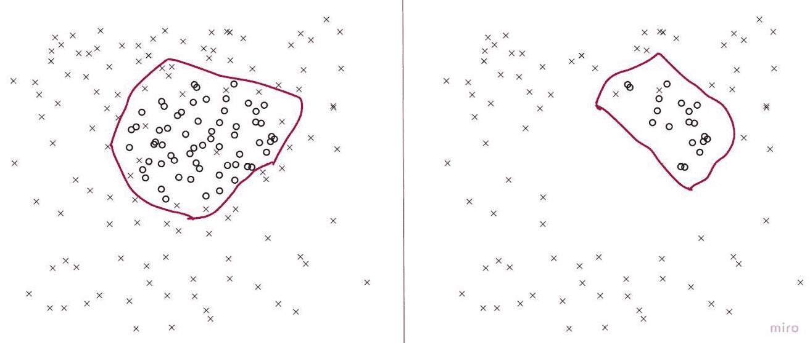

图 1.10 – 不同分布的少数类示例对决策边界的影响 – 十字表示多数类，圆圈表示少数类

+   **未校准模型的性能不佳**：不平衡数据对未校准模型来说可能是一个挑战。未校准模型是指那些不输出良好校准概率的模型，这意味着预测概率可能不会反映预测类别的真实可能性：

    +   当处理不平衡数据时，未校准的模型可能会特别容易产生偏向多数类的预测，因为它们可能无法有效地区分少数类和多数类。这可能导致模型在少数类上的性能不佳，模型可能会产生过于自信的预测或过于保守的预测。

    +   例如，在不平衡数据上训练的未校准模型可能会错误地将属于少数类的实例分类为多数类示例，通常具有很高的置信度。这是因为模型可能没有学会根据数据的不平衡调整其预测，也可能对少数类示例没有很好的理解。

    +   为了应对这一挑战，使用能够输出反映预测类别真实可能性的良好校准模型[4]非常重要。这可以通过如 Platt 缩放或等调回归等技术实现，这些技术可以将未校准模型的预测概率校准，以产生更准确和可靠的概率。模型校准将在*第十章*，*模型校准*中详细讨论。

+   **由于未调整阈值导致的模型性能不佳**：在使用不平衡数据集训练的模型进行预测时，使用智能阈值选择非常重要。当模型概率超过 0.5 时简单地预测 1 可能并不总是最佳方法。相反，我们应该考虑其他可能更有效的阈值。这可以通过检查模型的 PR 曲线来实现，而不是仅仅依赖于默认概率阈值 0.5 的成功率。阈值调整对于在自然或人工平衡数据集上训练的模型来说可能非常重要。我们将在*第五章*，*成本敏感学习*中详细讨论阈值调整。

接下来，让我们看看何时我们不应该对数据不平衡采取任何措施。

# 何时不必担心数据不平衡

类不平衡不一定总是对性能产生负面影响，有时使用特定于不平衡的方法可能会使结果变得更糟[5]。因此，在应用任何专门技术之前，准确评估任务是否真正受到类不平衡的影响至关重要。一种策略可以简单到设置一个不考虑类不平衡的基线模型，并观察模型在各种类别上使用各种性能指标的性能。

让我们探讨数据不平衡可能不是问题，且不需要纠正措施的场景：

+   **当不平衡程度较小时**：如果数据集中的不平衡相对较小，少数类到多数类的比例只有轻微倾斜（比如说 4:5 或 2:3），对模型性能的影响可能最小。在这种情况下，模型可能仍然表现良好，无需任何特殊技术来处理不平衡。

+   **当目标是预测多数类**：在某些情况下，重点可能在于准确预测多数类，而少数类可能不是特别感兴趣。例如，在线广告定位时，重点可以放在针对可能点击广告的用户（多数类）以最大化点击率和即时收入，而对可能觉得广告烦人的用户（少数类）的关注较少。

+   **当两类误分类的成本几乎相等时**：在某些应用中，将正类样本误分类的成本并不高（即假阴性）。例如，将电子邮件分类为垃圾邮件或非垃圾邮件。偶尔错过一封垃圾邮件并将其误分类为非垃圾邮件是完全正常的。在这种情况下，误分类对性能指标的影响可能可以忽略不计，不平衡可能不是问题。

+   **当数据集足够大时**：即使少数类到多数类样本的比例非常低，例如 1:100，并且如果数据集足够大，两个类别中都有大量样本，数据不平衡对模型性能的影响可能会降低。随着数据集的增大，模型可能能够更有效地学习少数类中的模式。然而，仍然建议将基线模型的性能与考虑数据不平衡的模型的性能进行比较。例如，将基线模型与具有阈值调整、过采样和欠采样的模型（*第二章*，*过采样方法*，和*第三章*，*欠采样方法*），以及基于算法的技术（*第五章*，*成本敏感学习*）进行比较。

在下一节中，我们将熟悉一个在处理不平衡数据时非常有用的库。我们将在一个不平衡的玩具数据集上训练一个模型，并查看一些指标来评估训练模型的性能。

# 不平衡-learn 库简介

`imbalanced-learn`（导入为 `imblearn`）是一个 Python 包，提供了处理数据不平衡的几种技术。在这本书的前半部分，我们将大量依赖这个库。让我们安装 `imbalanced-learn` 库：

```py
pip3 install imbalanced-learn==0.11.0
```

我们可以使用 `imbalanced-learn` 为我们的分析创建一个合成数据集：

```py
from sklearn.datasets import make_classification
import pandas as pd
import matplotlib.pyplot as plt
import seaborn as sns
def make_data(sep):
    X, y = make_classification(n_samples=50000,
        n_features=2, n_redundant=0,
        n_clusters_per_class=1, weights=[0.995],
        class_sep=sep, random_state=1)
    X = pd.DataFrame(X, columns=['feature_1', 'feature_2'])
    y = pd.Series(y)
    return X, y
```

让我们分析生成的数据集：

```py
from collections import Counter
X, y = make_data(sep=2)
print(y.value_counts())
sns.scatterplot(data=X, x="feature_1", y="feature_2", hue=y)
plt.title('Separation: {}'.format(separation))
plt.show()
```

这是输出：

```py
0     49498
1       502
```

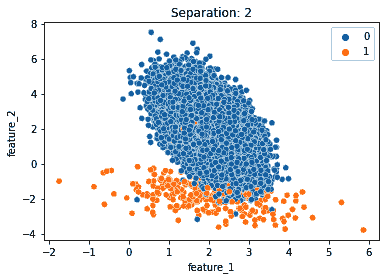

图 1.11 – 具有两个特征的 2 类数据集

让我们将这个数据集分成训练集和测试集：

```py
From sklearn.model_selection import train_test_split
X_train, X_test, y_train, y_test = train_test_split(X, y, stratify = \
    y, test_size=0.2, random_state=42)
print('train data: ', Counter(y_train))
print('test data: ', Counter(y_test))
```

这是输出：

```py
train data:  Counter({0: 39598, 1: 402})
test data:  Counter({0: 9900, 1: 100})
```

注意 `sklearn` 的 `train_test_split` API 中 `stratify` 的使用。指定 `stratify=y` 确保我们在训练集和测试集中保持多数和少数类别的相同比例。让我们更详细地了解分层。

**分层抽样**是一种根据某些共享特征将数据集分成各种子组（称为“层”）的方法。在处理不平衡数据集时，它非常有价值，因为它确保训练集和测试集具有与原始数据集相同的类别标签比例。

在不平衡数据集中，少数类占总数据的很小一部分。如果我们不进行分层进行简单的随机分割，少数类可能无法在训练集中得到充分代表，甚至可能完全被排除在测试集之外，这可能导致性能不佳和不可靠的评估指标。

通过分层抽样，每个类别在整体数据集中的比例在训练集和测试集中都得到保留，确保了代表性的抽样，并为模型从少数类中学习提供了更好的机会。这导致了一个更稳健的模型和更可靠的模型性能评估。

scikit-learn 的分层 API

`scikit-learn` 的 API，例如 `RepeatedStratifiedKFold` 和 `StratifiedKFold`，使用分层概念通过交叉验证评估模型性能，尤其是在处理不平衡数据集时。

现在，让我们在训练数据上训练一个逻辑回归模型：

```py
from sklearn.linear_model import LogisticRegression
lr = LogisticRegression(random_state=0, max_iter=2000)
lr.fit(X_train, y_train)
y_pred = lr.predict(X_test)
```

让我们从 `sklearn` 库中获取报告指标：

```py
from sklearn.metrics import classification_report
print(classification_report(y_test, y_pred))
```

这会输出以下内容：

```py
          precision     recall      f1-score    support
0         0.99          1.00        1.00        9900
1         0.94          0.17        0.29        100
accuracy                                0.99      10000
macro avg       0.97        0.58        0.64      10000
weighted avg    0.99        0.99        0.99      10000
```

让我们从 `imblearn` 获取报告指标：

```py
from imblearn.metrics import classification_report_imbalanced
print(classification_report_imbalanced(y_test, y_pred))
```

这会输出更多列：

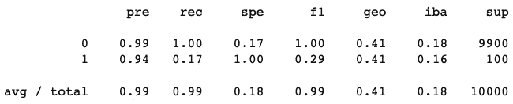

图 1.12 – imbalanced-learn 的分类报告输出

你注意到这里与 `sklearn` API 相比有额外的指标吗？我们得到了三个额外的指标：`spe` 用于特异性，`geo` 用于几何平均值，`iba` 用于指数平衡准确率。

`imblearn.metrics`模块有几个这样的函数，可以帮助处理不平衡数据集。除了`classification_report_imbalanced()`之外，它还提供了`sensitivity_specificity_support()`、`geometric_mean_score()`、`sensitivity_score()`和`specificity_score()`等 API。

# 需要遵循的一般规则

通常，任何机器学习流程的第一步应该是将数据分为训练集、测试集和验证集。我们应该避免在数据分割之后应用任何处理不平衡的技术。我们应该首先将数据分为训练集、测试集和验证集，然后对训练数据进行任何必要的调整。在分割数据之前应用如过采样（见*第二章*，*过采样方法*）等技术可能会导致数据泄露、过拟合和过度乐观[6]。

我们应该确保验证数据与测试数据非常相似。验证数据和测试数据都应该代表模型将用于预测的真实世界场景。避免对验证集应用任何采样技术或修改。唯一的要求是包含来自所有类别的足够数量的样本。

让我们稍微讨论一下使用无监督学习算法。**异常检测**或**离群值检测**是一类可以用于处理不平衡数据问题的算法。异常或离群值是显著偏离其他数据的点。这些异常通常对应于不平衡数据集中的少数类，使得无监督方法可能很有用。

这些问题的常用术语是**单类分类**。当正例（少数类）稀疏或收集它们在训练之前不可行时，这种技术特别有益。模型仅针对被认为是“正常”或多数类的数据进行训练。然后它将新实例分类为“正常”或“异常”，有效地识别可能属于少数类的实例。这对于二元不平衡分类问题特别有用，其中多数类被认为是“正常”，而少数类被认为是异常。

然而，它确实有一个缺点：在训练期间丢弃了离群值或正例[7]，这可能导致潜在的有价值信息的丢失。

总结来说，虽然像单类分类这样的无监督方法为处理类别不平衡提供了一个替代方案，但本书的讨论将始终集中在监督学习算法上。尽管如此，我们建议您在认为适当的时候探索和实验这些解决方案。

# 摘要

让我们总结一下到目前为止学到的内容。不平衡数据是机器学习中常见的问题，其中一个类别的实例数量显著多于另一个类别。不平衡数据集可能源于各种情况，包括罕见事件发生、高数据收集成本、标签噪声、标签错误、采样偏差和数据清洗。这可能会对机器学习模型构成挑战，因为它们可能会偏向多数类。

可以使用几种技术来处理不平衡数据，例如过采样、欠采样和成本敏感学习。最佳技术取决于具体问题和数据。

在某些情况下，数据不平衡可能不是问题。当数据集足够大时，数据不平衡对模型性能的影响可能会降低。然而，仍然建议比较基线模型性能与使用解决数据不平衡的技术（如阈值调整、基于数据的技术（过采样和欠采样）以及基于算法的技术）构建的模型性能。

传统的性能指标，如准确率，在不平衡数据集中可能会失效。一些更有用的不平衡数据集指标是 ROC 曲线、PR 曲线、精确率、召回率和 F1 分数。虽然 ROC 曲线适用于平衡数据集，但 PR 曲线在某一类比另一类更重要时，更适合不平衡数据集。

`imbalanced-learn`库是一个 Python 包，提供了处理数据不平衡的几种技术。

有一些一般规则需要遵循，例如在应用任何处理数据不平衡的技术之前将数据分为训练/测试/验证集，确保验证数据与测试数据非常相似，并且测试数据代表模型将最终进行预测的数据，以及避免对验证集和测试集应用任何采样技术或修改。

一类分类或异常检测是另一种可以用于处理无监督不平衡数据问题的技术。在这本书中，我们将只关注监督学习算法的讨论。

在下一章中，我们将探讨通过应用过采样技术来处理数据不平衡问题的一种常见方法。

# 问题

1.  训练模型时选择损失函数如何影响不平衡数据集上模型的性能？

1.  你能解释为什么 PR 曲线在处理高度倾斜的数据集时比 ROC 曲线更有信息量吗？

1.  使用准确率作为不平衡数据集上模型性能的指标可能会出现哪些潜在问题？

1.  “类别不平衡”的概念如何影响机器学习中的特征工程过程？

1.  在不平衡数据集的背景下，k 折交叉验证中“k”的选择如何影响模型的性能？你将如何解决这个问题？

1.  测试数据中类别的分布如何影响 PR 曲线，为什么？ROC 曲线又是如何？

1.  在不平衡数据集的背景下，高 AUC-ROC 但低 AUC-PR 意味着什么？

1.  “采样偏差”的概念如何有助于解决机器学习中不平衡数据集的挑战？

1.  “标签错误”的概念如何有助于解决机器学习中不平衡数据集的挑战？

1.  在哪些现实世界场景中，处理不平衡数据集是问题固有的部分？

1.  使用 `fetch_dataset` API 然后计算 MCC、准确率、精确率、召回率和 F1 分数的值。看看 MCC 值是否可以成为该数据集的有用指标。

# 参考文献

1.  V. García, R. A. Mollineda, 和 J. S. Sánchez, *平衡精度指数：偏斜类别分布的性能度量*, 见《模式识别与图像分析》，第 5524 卷，H. Araujo, A. M. Mendonça, A. J. Pinho, 和 M. I. Torres 编著. 柏林，海德堡：Springer Berlin Heidelberg，2009，第 441–448 页\. 访问时间：2023 年 3 月 18 日\. [在线]. 可在 [`link.springer.com/10.1007/978-3-642-02172-5_57`](http://link.springer.com/10.1007/978-3-642-02172-5_57) 获取。

1.  T. Fawcett, *ROC 分析的介绍*, 模式识别信函，第 27 卷，第 8 期，第 861–874 页，2006 年 6 月，doi: 10.1016/j.patrec.2005.10.010.

1.  Y.-A. Le Borgne, W. Siblini, B. Lebichot, 和 G. Bontempi, *可复现的机器学习用于信用卡欺诈检测 - 实用手册*. 自由布鲁塞尔大学，2022\. [在线]. 可在 [`github.com/Fraud-Detection-Handbook/fraud-detection-handbook`](https://github.com/Fraud-Detection-Handbook/fraud-detection-handbook) 获取。

1.  W. Siblini, J. Fréry, L. He-Guelton, F. Oblé, 和 Y.-Q. Wang, *通过校准掌握你的指标*，第 12080 卷，2020，第 457–469 页\. doi: 10.1007/978-3-030-44584-3_36.

1.  Xu-Ying Liu, Jianxin Wu, 和 Zhi-Hua Zhou, *探索性下采样用于类别不平衡学习*, IEEE Trans. Syst., Man, Cybern. B, 第 39 卷，第 2 期，第 539–550 页，2009 年 4 月，doi: 10.1109/TSMCB.2008.2007853.

1.  M. S. Santos, J. P. Soares, P. H. Abreu, H. Araujo, 和 J. Santos, *不平衡数据集的交叉验证：避免过度乐观和过度拟合方法 [研究前沿]*，IEEE Comput. Intell. Mag., 第 13 卷，第 4 期，第 59–76 页，2018 年 11 月，doi: 10.1109/MCI.2018.2866730.

1.  A. Fernández, S. García, M. Galar, R. Prati, B. Krawczyk, 和 F. Herrera, *从不平衡数据集中学习*. Springer 国际出版社，2018
