# 5

# 成本敏感学习

到目前为止，我们已经学习了各种采样技术以及如何对数据进行过采样或欠采样。然而，这两种技术都有其独特的问题。例如，过采样可能会因为重复看到精确或非常相似的例子而导致模型过拟合。同样，在欠采样中，我们失去了一些信息（这些信息可能对模型有用），因为我们丢弃了大多数类别的例子来平衡训练数据集。在本章中，我们将考虑之前所学数据级技术的替代方案。

成本敏感学习是一种有效的方法来处理不平衡数据。我们将介绍这项技术，并了解为什么它可能是有用的。这将帮助我们理解成本函数的一些细节以及机器学习模型默认不是设计来处理不平衡数据集的。虽然机器学习模型没有配备处理不平衡数据集的能力，但我们将看到现代库是如何实现这一点的。

我们将涵盖以下主题：

+   **成本敏感** **学习**（CSL）的概念

+   实践中的成本理解

+   逻辑回归的成本敏感学习

+   决策树的成本敏感学习

+   使用`scikit-learn`和 XGBoost 模型进行成本敏感学习

+   MetaCost – 使任何分类模型具有成本敏感性

+   阈值调整

到本章结束时，您将了解在分类问题中成本的含义，如何调整模型参数以考虑这些成本，以及如何优先考虑少数类别的预测以减轻误分类的成本。我们还将探讨一个通用的元算法，该算法可以使任何算法具有成本敏感性，以及一种后处理技术，用于调整预测阈值。

# 技术要求

与之前的章节类似，我们将继续使用常见的库，如`numpy`、`scikit-learn`、`xgboost`和`imbalanced-learn`。本章的代码和笔记本可在 GitHub 上找到，网址为[`github.com/PacktPublishing/Machine-Learning-for-Imbalanced-Data/tree/main/chapter05`](https://github.com/PacktPublishing/Machine-Learning-for-Imbalanced-Data/tree/main/chapter05)。您可以通过点击本章笔记本顶部的**在 Colab 中打开**图标或通过使用笔记本的 GitHub URL 在[`colab.research.google.com`](https://colab.research.google.com)启动它来打开这个 GitHub 笔记本。

# 成本敏感学习（CSL）的概念

**成本敏感学习**（CSL）是一种技术，其中机器学习模型的成本函数被改变以考虑数据的不平衡。CSL 背后的关键洞察是我们希望我们的模型成本函数反映不同类别的相对重要性。

让我们尝试理解机器学习中的成本函数和各种类型的成本敏感学习（CSL）。

## 成本和成本函数

成本函数估计了实际结果与模型预测结果之间的差异。例如，逻辑回归模型的成本函数由对数损失函数给出：

LogLoss = − 1 * N * ∑ i=1 N (y_i * log(ˆy_i) + (1 − y_i) * log(1 − ˆy_i))

在这里，N 是观察的总数，y_i 是真实标签（0 或 1），ˆy_i 是从模型预测出的概率值（介于 0 和 1 之间）。

一种类型的成本被称为误分类错误成本 [1] - 即，预测多数类而不是少数类或反之的成本。

实际上，我们可能会遇到其他类型的成本，例如以下这些：

+   标记数据集的成本

+   训练或评估模型的成本

+   训练数据收集的成本

让我们考虑混淆矩阵：

|  | **预测为负** | **预测为正** |
| --- | --- | --- |
| **实际为负** | 真阴性 | 假阳性 |
| **实际为正** | 假阴性 | 真阳性 |

表 5.1 – 理解分类错误成本的混淆矩阵

心理学研究表明，损失带来的痛苦是收益的两倍。同样，在机器学习中，“成本”捕捉了模型出错（假阳性与假阴性）的时刻，而不关心它正确的时候（真阳性与真阴性）。这种成本是误分类错误的成本。

并非所有误分类都是相同的。例如，假设我们正在尝试预测患者是否患有癌症。如果我们的模型错误地指示患者患有癌症（假阳性），这可能导致额外的测试。然而，如果我们的模型错误地建议患者无病（假阴性），后果可能更为严重，因为疾病可能会未诊断而进展。因此，假阴性比假阳性更具破坏性。我们的成本函数应该考虑这种差异。

不幸的是，大多数模型默认将多数类和少数类同等对待。然而，现代机器学习框架如 `scikit-learn`、Keras/TensorFlow 和 PyTorch 提供了一种方法，可以在各种学习算法中不同地权衡各种类。

## 成本敏感学习类型

成本敏感学习（CSL）有两种主要方法，即加权法和元学习。在加权方法中，我们更新机器学习模型的成本函数，以反映不同类的重要性。在元学习中，我们可以使模型对成本敏感，而无需更改其成本函数。

在元学习技术 MetaCost 中，例如，我们可以改变训练实例的标签，以最小化预期的误分类成本。同样，在阈值调整方法中，我们确定一个概率阈值，以最小化预测的总误分类成本。*图 5.1* 从高层次上对这些方法进行了分类 [2][3]：

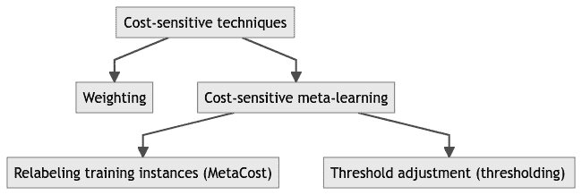

图 5.1 – 成本敏感学习方法的分类

## CSL 与重采样的区别

与之前讨论的数据级别技术相比，CSL 的关键区别在于数据级别技术调整不同错误类型的频率，但它们对待所有误分类错误都是一样的。在某些情况下，正如我们之前遇到的，不同类别的观测值被误分类的成本并不相同。例如，在癌症检测中，将患有癌症的患者误分类为健康（假阴性）的成本要高得多，因为如果未检测或未早期治疗，患者风险很高。同样，将欺诈预订误分类为非欺诈可能会比将合法交易误分类为欺诈的成本更高。为什么？因为在后一种情况下，我们只需联系用户并验证交易的合法性即可。通过应用重采样技术，如上采样或下采样，我们隐式地改变了不同类型错误的成本。因此，CSL 和重采样技术最终可以对模型产生等效的影响。

然而，在某些情况下，重采样技术可能存在问题，我们将在下一节讨论。在这种情况下，CSL 可能更实用：

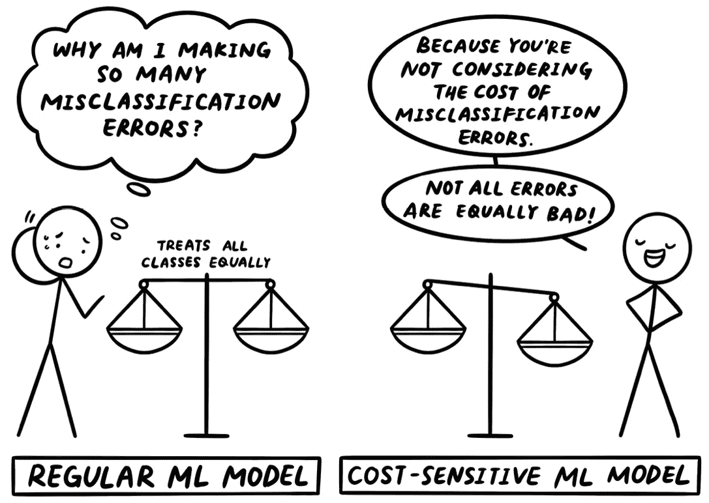

图 5.2 – 漫画再次强调误分类错误的概念

## 重平衡技术的缺陷

在前面的章节中，我们简要地提到了为什么在某些情况下，我们可能更喜欢不应用任何数据采样技术。这可能是因为以下原因：

+   我们已经拥有太多的训练数据，处理更多的数据可能相当昂贵，或者由于有更多的训练数据，训练时间可能增加数倍。

+   有时，由于我们使用的数据集，我们可能无法通过采样或数据重平衡技术获得最佳结果。

+   另一个需要考虑的因素是，在重新平衡数据集后，我们的模型的预测分数可能变得不准确，需要重新校准。我们将在*第十章*“模型校准”中介绍这一主题，我们将学习各种模型校准技术。

+   重平衡技术可能导致模型过拟合或欠拟合问题。特别是当使用过采样时，它们会产生重复或相似的训练示例，这可能导致过拟合。同样，当使用欠采样时，模型可能欠拟合，因为模型没有在欠采样过程中丢弃的数据上进行训练。

接下来，让我们尝试理解成本究竟意味着什么。

# 实践中理解成本

在为不同类别创建权重时，我们需要了解涉及的各种成本类型。这些成本根据具体情况而变化。让我们讨论一个成本计算的例子，以了解在考虑成本计算时应考虑什么。

让我们以儿童肺炎为例。根据联合国儿童基金会，每 43 秒就有一个孩子死于肺炎[4]。想象一下，我们正在为儿童肺炎开发一个新的测试——我们将如何决定不同错误的成本？

让我们回顾一下表 5.1 中的混淆矩阵。通常，对于真正的负例和真正的正例，不会有额外的成本。但是，使用错误的负例——也就是说，当一个孩子患有肺炎，却预测该孩子健康时——将会有非常高的成本。另一方面，当一个健康的儿童被预测为患有肺炎时，将会有与孩子家庭可能遇到的麻烦相关的成本，但这个成本比前一种情况要低得多。此外，误分类的成本可能因孩子的年龄而异。例如，年幼的孩子比年长的孩子风险更高。因此，如果模型在年幼孩子的案例中出错，我们将对模型进行更多的惩罚。

成本可能因症状的持续时间而异。可以这样考虑：如果我们犯了一个错误，错误地诊断了一个只有一天流感症状的孩子，这并不理想，但也不是灾难性的。然而，如果那个孩子已经忍受了 2 周的流感症状，那将是一个不同的场景。这个错误将给我们带来更大的成本。

虽然我们迄今为止讨论了现实世界的问题，但本章将转向使用合成数据集。这种方法旨在在受控环境中强化概念和方法，从而增强学习过程：

```py
X, y = make_classification(
    n_samples=50000, n_features=2, n_redundant=0, class_sep=2,\
    weights=[0.99], random_state=1, n_clusters_per_class=1)
X_train, X_test, y_train, y_test = train_test_split(X, y,\
    test_size = 0.2, random_state = 0, stratify=y)
print('y_train: ', Counter(y_train))
print('y_test: ', Counter(y_test))
plot_dataset(X_train, y_train)
```

`make_classification`函数产生了一些重叠的点，我们清理了这些点。为了简化，我们在这里省略了清理代码。您可以在 GitHub 上的完整笔记本中查阅。

之前的代码产生了以下输出和散点图（*图 5**.3*）：

```py
y_train:  Counter({0: 39404, 1: 596})
y_test:  Counter({0: 9851, 1: 149})
```

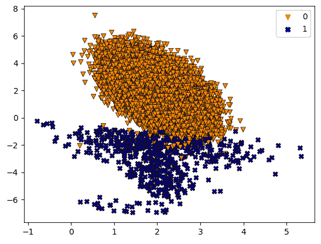

图 5.3 – 显示训练数据集分布的散点图

我们将深入探讨如何将 CSL 应用于逻辑回归模型。

# 逻辑回归的成本敏感学习

逻辑回归是一种简单的分类算法。我们通过将特征进行线性组合来训练模型。然后，我们将线性组合的结果传递给 sigmoid 函数，以预测不同类别的类别概率。

`sigmoid`函数（也称为`logit`函数）是一种可以将任何实数转换为 0 到 1 之间值的数学工具。这个值可以解释为概率估计：

```py
import numpy as np
def sigmoid(x):
     s = 1/(1+np.exp(-x))
     return s
```

Sigmoid 函数的图像呈 S 形曲线，看起来是这样的：

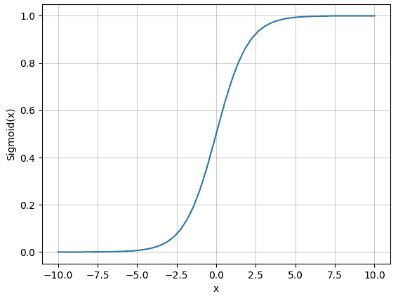

图 5.4 – Sigmoid 函数

具有最高预测概率的类别被用作给定样本的预测。

假设我们有一个要分类为垃圾邮件或非垃圾邮件的电子邮件，并且我们的逻辑回归模型输出非垃圾邮件的概率为 0.25，垃圾邮件的概率为 0.75。在这里，具有最高预测概率的类别是“垃圾邮件”（1），因为 0.75 大于 0.25。因此，模型会预测这封邮件是垃圾邮件（*图 5**.5*）：


图 5.5 – 高类别概率决定二分类的类别

对于二分类，我们只预测一个类别的概率。另一个类别的概率是第一个类别的概率减去 1。

对数逻辑回归模型使用损失函数进行训练。来自具有两个类别的数据集的一个示例的损失函数看起来像这样：

cost = − y * log(classProbability) − (1 − y)* log(1 − classProbability)

对于真正的阳性和真正的阴性，这个损失将非常低。对于误报，y，实际值将是 0；因此，第一个项将是 0，但第二个项将非常高，因为类别概率接近 1，这个项将接近负无穷大（因为，log(0) → − ∞）。由于前面有一个负号，成本将接近正无穷大。对误检情况可以进行类似的分析。成本的一部分可以看作是误报部分，另一部分可以看作是误检部分：

cost = falsePositiveCost + falseNegativeCost

如前所述，我们不希望两种类型的成本同等重要。所以我们只是为各自的成本添加权重，W FP 和 W FN：

cost = W FP * falsePositiveCost + W FN * falseNegativeCost

这是对数逻辑回归中 CSL 的核心。为了得到模型的总体成本，我们取所有数据点的平均成本：

```py
lr = LogisticRegression(random_state=0, max_iter=150).fit(
    X_train, y_train)
plot_decision_boundary(X_train, y_train, lr, 'LogisticRegression')
plt.show()
PrecisionRecallDisplay.from_estimator(
    lr, X_test, y_test, ax = plt.gca(),name = "LogisticRegression")
```

当所有错误成本相等时，模型的决策边界和模型的**精度-召回率**（**PR**）曲线将看起来像这样：

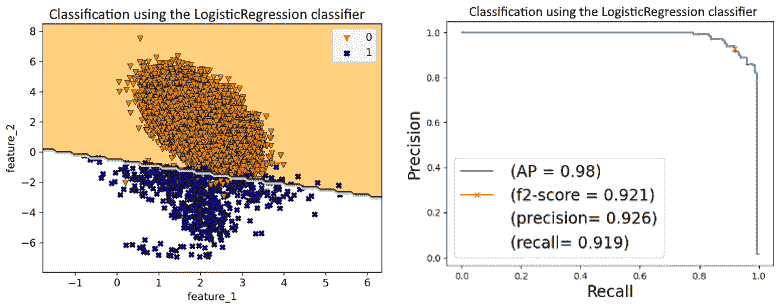

图 5.6 – 基线回归模型的决策边界（左）和 PR 曲线（右）

```py
compute_scores(lr, X_test, y_test)
```

之前的代码输出了以下 F2 分数、精度和召回值：

```py
f2-score: 0.921 precision: 0.926 recall: 0.919
```

在本章中，我们将使用 F2 分数作为我们的主要指标。F2 分数是什么？在*第一章*，*机器学习中数据不平衡的介绍*，我们学习了 F-beta 分数。F2 分数是 beta=2 的 F-beta 分数，而 F1 分数是 beta=1 的 F-beta 分数。当召回率比精度更重要时，它很有用——也就是说，误报比误检（重要）的成本更高：

F β =  (1 + β 2) × (precision × recall)  ____________________  (β 2 × precision) + recall  =  (5 × precision × recall)  ________________  (4 × precision) + recall

`LogisticRegression`来自`scikit-learn`库提供了一个`class_weight`参数。当此参数的值设置为“balanced”时，每个类别的权重将自动通过以下公式计算：

weightOfClass =  totalNumberOfSamples   ________________________________   numberOfClasses * numberOfSamplesPerClass

例如，在数据集中我们有 100 个示例 – 80 个属于类别 0，20 个属于类别 1。每个类别的权重计算如下：

+   类别 0 的权重 = 100/(2*80) = 0.625

+   类别 1 的权重 = 100/(2*20) = 2.5

由于类别 0 的示例数量是类别 1 的四倍，类别 1 的权重是 2.5，是类别 0 权重的四倍，即 0.625。这很有道理，因为我们希望给类别 1 更多的权重，因为它的数量较少。

我们也可以将`class_weight`作为一个字典来提及：

```py
LogisticRegression(class_weight={0: 0.5, 1:0.5})
```

让我们尝试在`LogisticRegression`函数中使用`class_weight`参数：

```py
lr_weighted = LogisticRegression(class_weight='balanced', \
    random_state=0, max_iter=150).fit(X_train, y_train)
plot_decision_boundary(X_train, y_train, lr_weighted, \
    'LogisticRegression')
plt.show()
PrecisionRecallDisplay.from_estimator(lr_weighted, X_test,\
    y_test, ax = plt.gca(),name = "LogisticRegressionWeighted")
```

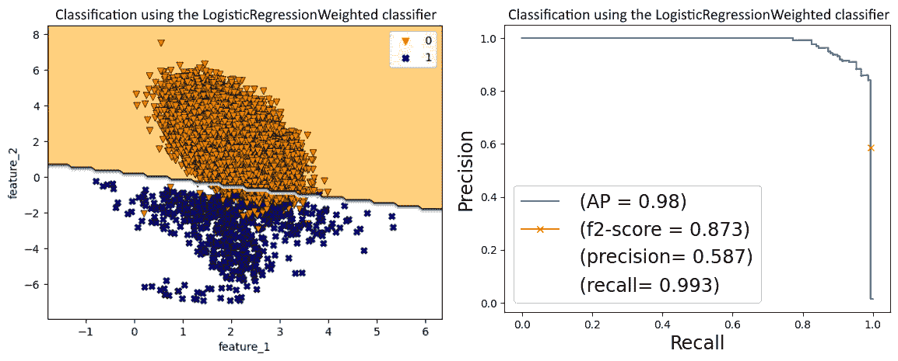

图 5.7 – “平衡”类别加权逻辑回归模型的决策边界（左）和 PR 曲线（右）

让我们计算 F2 分数、精确率和召回率分数：

```py
compute_scores(lr_weighted, X_test, y_test)
```

“平衡”类别加权逻辑回归模型的分数如下：

```py
f2-score: 0.873 precision: 0.587 recall: 0.993
```

在分析结果后，我们可以看到一个决策边界，它正确地分类了大多数正类示例。精确率下降，而召回率上升。F2 分数的下降可以归因于召回率和精确率值的变化。模型在召回率方面有所提高，表明其识别所有正类示例的能力得到了增强。然而，这种进步导致精确率同时下降，这表明在负类示例（我们并不特别关心）上犯错的速率增加。

让我们尝试使用网格搜索调整`class_weight`参数，以优化我们的 F2 分数。我们始终可以尝试优化任何其他目标，例如平均精确率、精确率或召回率等。`np.linspace(0.05, 0.95, 20)`函数是一个`numpy`函数，它生成一个介于 0.05 和 0.95 之间的 20 个均匀分布的数字数组：

```py
from sklearn.metrics import make_scorer, fbeta_score
def f2_func(y_true, y_pred):
    f2_score = fbeta_score(y_true, y_pred, beta=2.)
    return f2_score
def f2_scorer():
    return make_scorer(f2_func)
# Define the parameter grid
param_grid = {
    'class_weight': [
        {0: x, 1: 1.0-x} for x in np.linspace(0.05, 0.95, 20)]
}
# Instantiate the grid search model
grid_search =GridSearchCV(
    LogisticRegression(),param_grid,\
    cv=3, scoring=f2_scorer(), n_jobs=-1
)
# Fit the grid search to the data
grid_search.fit(X_train, y_train)
# Get the best parameters
best_params = grid_search.best_params_
best_params
```

这会产生以下输出：

```py
{'class_weight': {0: 0.14473684210526316, 1: 0.8552631578947368}}
```

我们的标准指标如下：

```py
f2-score: 0.930 precision: 0.892 recall: 0.940
```

在引入这些类别权重后，我们的决策边界试图在错误分类正类和负类示例之间取得更好的平衡，如图*图 5**.8*所示。这导致 F2 分数达到 0.93，提高了精确率值，同时保持适度的召回率：


图 5.8 – 类别加权逻辑回归模型的决策边界（左）和 PR 曲线（右）

🚀 微软在生产中的成本敏感学习

在微软的一个实际应用中，主要目标是提高 Bing 广告的**点击率**（**CTR**）预测[5]。实现准确的 CTR 预测对于优化用户体验和收入流至关重要。预测准确率仅提高 0.1%，就有可能使利润增加数亿美元。通过严格的测试，一个结合**神经网络**（**NNs**）和**梯度提升决策树**（**GBDTs**）的集成模型成为最有效的解决方案。

对于训练数据集，从一个月的日志数据中随机选择了 5600 万个样本，每个样本包含数百个统计特征。为了减少训练成本，非点击案例被**降采样**了 50%，并分配了 2 的**类别权重**以保持原始分布。然后使用从随后一周日志中随机抽取的 4000 万个样本的测试数据集评估模型性能。而不是重新校准模型，使用了类别权重来在降采样后保持平均 CTR。

在下一节中，我们将讨论如何使用决策树进行代价敏感学习。

# 决策树的代价敏感学习

决策树是使用条件决策来预测样本类别的二叉树。每个树节点代表一组与基于特征的连续条件语句相对应的样本。我们根据特征和阈值值将节点分为两个子节点。想象一下有一组学生，他们的身高、体重、年龄、班级和位置。我们可以根据年龄特征和 8 的阈值将这个集合分为两部分。现在，所有年龄小于 8 岁的学生将进入左子节点，而所有年龄大于或等于 8 岁的学生将进入右子节点。

这样，我们可以通过连续选择特征和阈值值来创建树。树的每个叶节点将只包含来自一个类别的节点。

在构建决策树的过程中，经常会遇到一个问题：“应该选择哪个特征和阈值对来分割给定节点的样本集？”答案很简单：我们选择产生最均匀（或同质）数据子集的对。理想情况下，产生的两个结果子集——被称为左右子节点——应该各自主要包含来自单个类别的元素。

节点从不同类别中混合样本的程度被称为节点的**不纯度**，这可以被视为决策树的损失度量。不纯度越高，样本集的异质性就越大。以下是计算不纯度的两种最常见方法：

+   Gini 系数

+   Entropy

让我们看看 Gini 系数和熵的两个类 c1 和 c2 的公式：

Gini = 1− Proportion c1 2− Proportion c2 2

我们将得到以下结果：

Entropy = − Proportion c1 * log (Proportion c1)

− 比例 c2 * log (比例 c2)

要使用决策树进行 CSL，我们只需将类权重与 Gini 和熵计算中每个类的项相乘。如果两个类的权重是 W1 和 W2，Gini 和熵将如下所示：

Gini = 1 − W1 * 比例 c1² − W2 * 比例 c2²

Entropy = − W1 * 比例 c1 * log(比例 c1)

− W2 * 比例 c2 * log(比例 c2)

现在，模型优先考虑权重较高的类，而不是权重较低的类。如果我们给少数类更多的权重，模型将做出优先考虑具有同质少数类样本的节点的决策。

在本节中，我们了解了一些如何将类权重纳入决策树的损失函数中，以考虑误分类错误。在下一节中，我们将看到`scikit-learn`如何通过将其集成到模型创建 API 中来简化此过程，从而消除我们手动调整损失函数的需要。

# 使用 scikit-learn 和 XGBoost 模型进行成本敏感学习

`scikit-learn`提供了一个`class_weight`超参数来调整大多数模型中各种类的权重。这个参数可以根据`scikit-learn`中不同学习算法的不同方式指定。然而，主要思想是这个参数指定了损失计算公式中每个类的权重。例如，这个参数指定了之前提到的逻辑回归中的权重 FP 和权重 FN 的值。

与`LogisticRegression`函数类似，对于`DecisionTreeClassifier`，我们可以使用`DecisionTreeClassifier(class_weight='balanced')`或`DecisionTreeClassifier(class_weight={0: 0.5, 1: 0.5})`。

关于 SVM，它甚至可以通过为每个类标签指定一个权重值来扩展到多类分类：

```py
svm.SVC(class_weight= {-1: 1.0, 0: 1.0, 1: 1.0})
```

关于确定`class_weight`值的通用指导原则是使用多数类与少数类比例的倒数。我们可以通过使用网格搜索算法（使用`scikit-learn`中的`GridSearchCV`函数）进行超参数调整来找到更优的`class_weight`值。

类似地，XGBoost 也有`scale_pos_weight`参数来控制正负权重的平衡：

```py
XGBClassifier(scale_pos_weight)
```

`scale_pos_weight`的默认值是 1。一个推荐的`scale_pos_weight`值是`sum(negative_instances)/sum(positive_instances)`，这可以计算为`float(np.sum(label == 0)) / np.sum(label==1)`。

XGBoost 有几个其他参数，例如 `max_delta_step` 和 `min_child_weight`，这些参数可以针对不平衡数据集进行调整。在优化过程中，`max_delta_step` 决定了更新步长的大小，影响学习速度和稳定性。`min_child_weight` 通过影响决策树中叶节点的大小来控制过拟合并增强泛化。在处理不平衡数据场景时，调整这些参数可以策略性地提高算法性能。

首先，让我们使用 `DecisionTreeClassifier` 解决我们的分类问题：

```py
from sklearn.tree import DecisionTreeClassifier
from sklearn.metrics import PrecisionRecallDisplay
dt_clf = DecisionTreeClassifier(random_state=0, max_depth=6).fit(
    X_train, y_train)
plot_decision_boundary(X,y,dt_clf,'DecisionTreeClassifier')
plt.show()
PrecisionRecallDisplay.from_estimator(
    dt_clf, X_test, y_test, ax = plt.gca(),\
    name = "DecisionTreeClassifier")
print(classification_report_imbalanced(
    y_test,\
    dt_clf.predict(X_test), \
    target_names=['class 0', 'class 1']
    )
)
computescores(dt_clf, X_test, y_test)
```

输出的决策边界比逻辑回归的更复杂（*图 5.9*），更好地分离了两个类别，并给出了 F2 分数为 0.932：

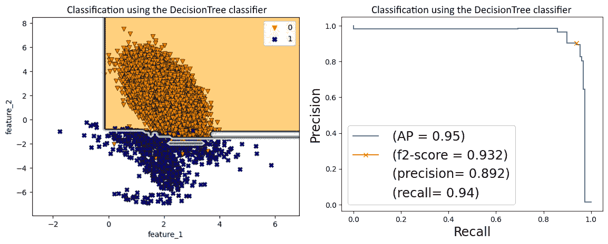

图 5.9 – 决策树分类器模型的决策边界（左）和 PR 曲线（右）

我们在 *图 5.10* 中重现了逻辑回归模型的决策边界和 PR 曲线，以进行比较：


图 5.10 – 用于比较的逻辑回归（左）和 PR 曲线（右）

我们对决策树分类器的标准指标如下：

```py
f2-score: 0.932 precision: 0.892 recall: 0.94
```

接下来，让我们使用 `class_weight='balanced'` 参数：

```py
dt_clf_tuned = DecisionTreeClassifier(
    class_weight = 'balanced', random_state=0, max_depth=6
).fit(X_train, y_train)
```

在使用之前的代码绘制决策边界、PR 曲线和计算分数后，输出如下：

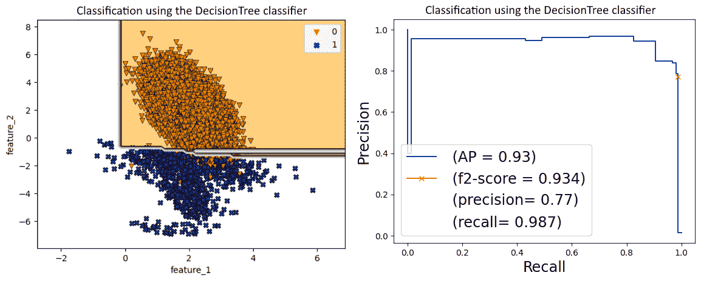

图 5.11 – 决策树分类器模型的决策边界（左）和 PR 曲线（右）

```py
f2-score: 0.934 precision: 0.770 recall: 0.987
```

调整后的权重提高了 F2 分数和召回值。

流行框架如 `scikit-learn` 也允许我们指定 `sample_weight` 作为数据集中每个观察值的权重列表。`sample_weight` 和 `class_weight` 参数可能相当令人困惑，并且它们的目的可能不会从它们的文档中非常清楚地了解何时使用什么。以下表格说明了两者之间的区别：

|  | `sample_weight` | `class_weight` |
| --- | --- | --- |
| **目的** | 用于指定单个示例的权重。当某些示例比其他示例更重要时，无论它们的类别如何，都可能很有用。当某些数据更可信（例如使用内部人工标注器标注）时，它可以获得更高的权重。当您对批处理中的样本没有相同的信心时，这可能很有用。 | 用于纠正类别不平衡。当示例的重要性取决于它们的类别时应该使用。 |
| **用法** | 可以在训练和测试中使用。特别适用于在具有 AUC 等指标的不同测试集上比较多个模型时，通常希望平衡测试集：`sklearn.metrics.confusion_matrix(…, sample_weight)` `sklearn.linear_model` `.` `LogisticRegression()` `.` `score(…,sample_weight)` | 主要在训练期间使用，以指导训练。考虑到某些类别比其他类别更重要，因此会计算误分类错误：`sklearn.linear_model` `.` `LogisticRegression(``class_weight`) |
| **在模型训练期间设置值为 0 的影响** | 模型将不会考虑`samples_weight=0`的示例（无论示例的类别如何）。 | 模型将不会考虑属于`class_weight = 0`的类别的任何示例。此外，模型永远不会预测该类别。 |
| **应用案例** | 当预测客户流失时，如果失去某些客户会对业务产生更大的影响，因为他们倾向于更频繁地购买或花费更多，我们希望使用`sample_weight`给这些客户更高的权重。 | 如果我们有一个数据集，其中一个类别明显多于其他类别，使用`class_weight`可以帮助模型更多地关注代表性不足的类别。 |

表 5.2 – scikit-learn 库中的 sample_weight 与 class_weight

警告

如果我们使用`sample_weight`和`class_weight`，两者都会相乘，我们将看到这两个参数的效果。这两个参数仍然可以一起使用，以平衡类别重要性和个体实例重要性，并实现其预期目的。

使用`numpy`可以更容易地创建`sample_weight`所需的权重值列表：`sample_weight = np.where(label==1, 80, 20)`。然而，`scikit-learn`有一个名为`sklearn.utils.class_weight.compute_sample_weight()`的函数，可以用来自动从`class_weight`估计`sample_weight`的值。

`class_weight`也可以是一个字典，包含每个标签的值或平衡值。如果我们将其设置为平衡，类别权重将由`n_samples/(n_classes * np.bincount(y))`确定。

`class_weight`返回的值是一个字典：`{class_label: weight}`，对于每个`class_label`值。

类似地，如果你需要进行多标签分类，你也可以使用`sklearn.utils.class_weight.compute_sample_weight`。

🚀 Airbnb 生产中的成本敏感学习

在 Airbnb 的一个实际应用中[6]，要解决的主要问题是提高搜索和可发现性以及他们体验（手工活动）平台的个性化。随着体验数量的增加，有效地对这些体验进行排名以匹配用户偏好并提高预订变得至关重要。

Airbnb 旨在提高其搜索排名，为用户提供最相关和高质量的经历。为了提升其排名模型的品质，他们在目标函数中使用了样本权重（在上一节中讨论过）。

通过使用样本权重（在上一节中讨论过）解决训练数据中的数据不平衡问题。在目标函数中，高质量的经历被赋予更高的权重，而低质量的经历被赋予较低的权重。这样做是为了在搜索排名中推广高质量的经历，并且他们成功地提高了高质量经历的排名，减少了低质量经历，而没有影响整体预订，如 A/B 测试所证实。

Airbnb 迭代地开发和测试其机器学习模型，最终将其集成到其生产系统中，以实时对“体验”进行排名。他们经历了多个阶段，从建立强大的基线到个性化、在线评分以及处理各种业务规则。

在下一节中，我们将了解一种可以将任何模型转换为成本敏感版本的技术，而无需我们知道其损失函数或模型的内部工作原理。

# MetaCost – 使任何分类模型成本敏感

MetaCost 首次在 1999 年由 Pedro Domingos [7]发表的一篇论文中提出。MetaCost 作为机器学习算法的包装器，将底层算法转换为自身的成本敏感版本。它将底层算法视为黑盒，与不稳定算法（如下定义）配合最佳。当 MetaCost 首次提出时，CSL 还处于早期阶段。只有少数算法，如决策树，已被转换为它们的成本敏感版本。对于某些模型，创建成本敏感版本变得很容易，而对于其他模型，则是一项非平凡的任务。对于定义模型成本敏感版本变得困难的算法，人们主要依赖于数据采样技术，如过采样或欠采样。这就是 Domingos 提出了一种将大量算法转换为它们的成本敏感版本的方法。MetaCost 可以用于多类分类和所有类型的成本矩阵。

不稳定算法

如果一个算法的初始条件（例如，训练数据或初始权重）的微小变化可以导致模型产生大的变化，则称该算法为不稳定[8]。假设你有一个包含 1,000 个项目的数据集。一个稳定的模型，如**K-最近邻**（**KNN**），如果你从数据集中移除一个项目，它不会改变太多。然而，如果你用 999 个项目而不是 1,000 个项目来训练一个决策树模型，它可能会完全重构。

让我们深入探讨 MetaCost 算法的机制，如图 5.12 所示：

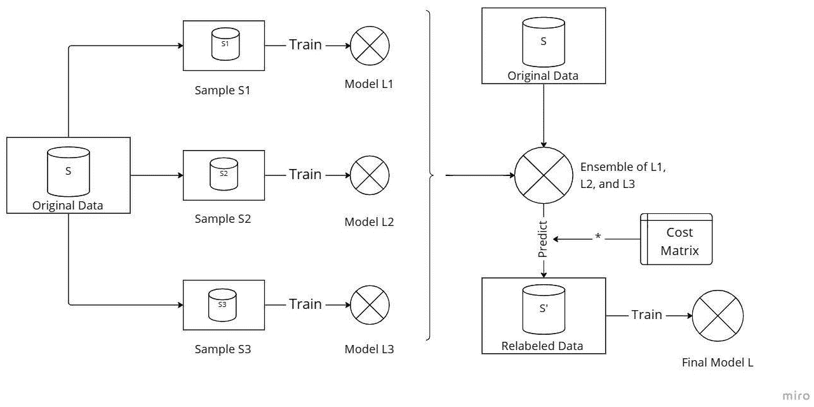

图 5.12 – MetaCost 算法

MetaCost 通过结合 bagging 的概念与误分类成本矩阵来工作：

1.  首先，我们创建原始数据的多个 bootstrap 样本。

1.  对于每个 bootstrap 样本，我们训练给定模型的一个新副本。到目前为止，这个过程与 bagging 相同。你可以在图 5.12 左侧看到前两个步骤。首先，我们从原始数据中创建 bootstrap 样本 S1、S2 和 S3。然后，我们分别在样本（S1、S2 和 S3）上训练模型 L1、L2 和 L3。

1.  接下来，我们将原始数据 S 送入由 L1、L2 和 L3 组成的集成中。

1.  我们将来自成本矩阵的误分类成本与集成预测的类别概率相乘，以获得实际成本。这显示在图 5.12 的右侧。

1.  然后，我们重新标记数据，使得新的类别标签最小化实际成本。

1.  最后，我们在重新标记的数据上训练了一个新模型的副本。这个模型副本被用作最终模型。

我们可以在 *图 5.13* 中看到使用 MetaCost 重新标记数据的过程：

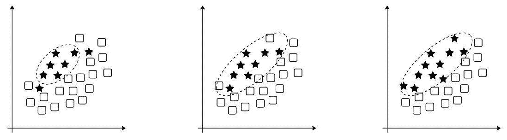

图 5.13 – 使用 MetaCost 重新标记数据的过程

在 *图 5.13* 的左侧，我们有原始数据。星星是少数类示例，正方形是多数类示例。在这里，所有在椭圆形内的样本都被预测为星星，所有在椭圆形外的样本都被预测为正方形。左侧的椭圆形是根据对所有错误具有相同误分类成本的假设绘制的。在中间，我们根据实际误分类成本绘制的一个拉长的椭圆形创建了一个新的类别边界。请注意，现在所有的星星都被正确分类了。同时，请注意，现在一些正方形被错误地分类为星星。这是预期的，因为星星的误分类成本远高于正方形。在此阶段，MetaCost 将这些被错误分类的正方形重新标记为星星。最后，MetaCost 在重新标记的数据上训练了一个模型。由于容易被误认为是少数类的多数类示例已被重新标记为属于少数类，因此最终的模型不太可能将少数类的实例标记错误。

为了节省空间，我们省略了 MetaCost 算法的实现。您可以在本章的 GitHub 仓库中找到它。

我们将应用该算法到逻辑回归模型中。MetaCost 使用一个代价矩阵，这是一个超参数。代价矩阵中的值对应于混淆矩阵（*表 5.1*中混淆矩阵的转置）中各项的权重或成本：

C = (TN FN FP TP )

假设我们使用一个对假阳性和假阴性具有相同成本的代价矩阵（即单位矩阵）：

```py
C = np.array([[0, 1], [1, 0]])
```

*图 5.14* 展示了决策边界和指标，它们与逻辑回归分类器的结果（*图 5.10*）非常接近：


图 5.14 – 具有单位代价矩阵的逻辑回归模型 MetaCost 变种的决策边界（左侧）和 PR 曲线（右侧）

我们可以根据训练数据的失衡比率估计代价矩阵：

```py
C = np.array([[0, 66], [1, 0]])
```

*图 5.15* 展示了输出决策函数和 PR 曲线：

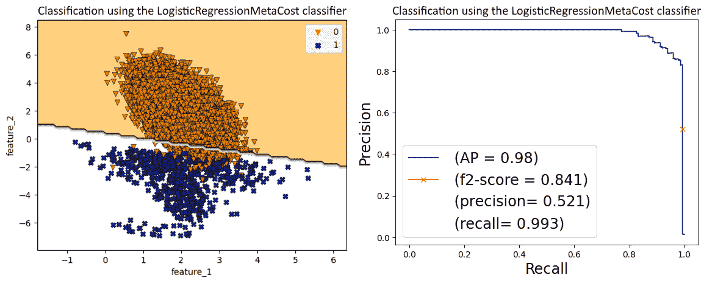

图 5.15 – 具有更优代价矩阵的逻辑回归模型 MetaCost 变种的决策边界（左侧）和 PR 曲线（右侧）

虽然与基线相比 F2 分数有所下降，但召回率确实大幅提高。

MetaCost 算法中的各种步骤，如重新标记整个训练集，可能相当昂贵，这可能会阻止我们在训练数据集很大时使用这种技术。

成本敏感的集成技术

AdaCost [9]、AdaUBoost [10]和 AsymBoost [11]是 AdaBoost 模型的成本敏感修改。AdaCost 在迭代训练过程中最小化误分类成本。AdaUBoost 通过强调少数类来处理不平衡数据集。AsymBoost 专注于减少最昂贵的误分类。它们都在考虑误分类成本的同时调整权重。

这些算法背后的基本原理是，除了对误分类成本大的实例分配高初始权重外，更新权重的规则也应考虑成本。这意味着应该增加昂贵误分类的权重，同时减少正确分类的权重。

在下一节中，我们将了解另一种成本敏感的元学习技术，称为阈值调整。

# 阈值调整

决策阈值是一个非常重要的概念，需要密切关注。默认情况下，我们有以下情况：

+   预测概率 >= 0.5 表示类别 1

+   预测概率 < 0.5 表示类别 0

然而，阈值是一个强大的元参数，我们可以自由调整。*表 5.3*显示了模型预测与真实标签的预测。

如果我们使用默认的阈值 0.5，准确率为 2/4 = 50%。另一方面，如果我们选择的阈值是 0.80，准确率为 100%。这表明所选阈值的重要性：

| **预测输出** | **真实输出** |
| --- | --- |
| 0.65 | 0 |
| 0.75 | 0 |
| 0.85 | 1 |
| 0.95 | 1 |

表 5.3 – 一个显示模型预测输出与真实输出（标签）的表格

大多数指标，如准确率、精确率、召回率和 F1 分数，都是阈值相关指标。

另一方面，如 ROC 曲线和 PR 曲线这样的指标是阈值无关的，这意味着这些图表评估的是模型在所有可能的阈值下的性能，而不是单个固定的阈值。

在处理机器学习指标，如 F1 或准确率时，了解阈值值的作用很重要。这些指标默认使用 0.5 的阈值。因此，尤其是对于新手和中级机器学习从业者，会产生一种误解，认为这些指标不可避免地与这个特定的阈值相关联。

然而，这可能导致对模型性能的不准确解释，尤其是在涉及不平衡数据集的场景中。指标的选择和决策阈值的确定是独立的选择，应该这样处理。确定适当的阈值是过程中的一个关键步骤，应该独立于所选的指标来考虑。

此外，仅仅依赖于默认的阈值 0.5 可能会产生误导。阈值应根据项目的具体要求和数据的性质来设置。因此，机器学习从业者理解阈值与所选指标之间的相互作用，以准确评估其模型性能至关重要。

在二元分类中，改变阈值将很容易改变阈值相关的指标，如准确度、F1 分数、TPR 或 FPR。许多研究[12][13]提到了阈值调整的价值，尤其是在训练数据不平衡的情况下。Provost [14]的一篇论文指出，使用未调整输出阈值的模型可能是一个严重的错误。在深度学习领域，Buda 等人[15]表明，使用**随机过采样**（**ROS**）并结合阈值处理，在由 CIFAR 和 MNIST 创建的不平衡数据集上优于简单的 ROS。无论数据是否不平衡，选择一个最优的阈值可以在模型的性能上产生很大的差异。

许多时候，我们希望找到优化我们的阈值相关指标（例如 F1 分数）的阈值。在这里，找到 F1 分数最大的阈值（*图 5.16*）：

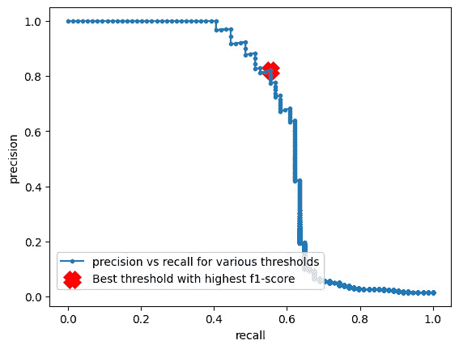

图 5.16 – 一个具有最佳阈值的 PR 曲线，该阈值找到最大的 F1 分数（请参阅本章 GitHub 仓库中的笔记本）

*图 5.17* 展示了一个图表，说明了修改决策阈值对不平衡数据集的各种分类指标的影响：**真正例率**（**TPR**或召回率）、**真负例率**（**TNR**）、**假正例率**（**FPR**）和精确度。所使用的模型是没有任何类别权重或对少数类敏感性的逻辑回归。有关完整笔记本，请参阅本章的 GitHub 仓库：

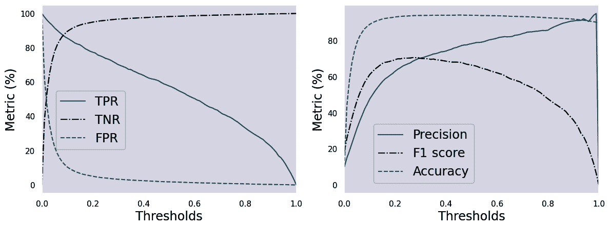

图 5.17 – 不同分类指标（TPR、TNR、FPR、精确度、F1 分数和准确度）作为决策阈值的函数的图表

关于这些图表，有以下几点观察：

+   **精确度**：如果阈值增加，精确度（  TP _________________  总预测为正的次数）通常会上升。为什么？因为随着阈值的增加，总预测为正的次数会减少，因此，随着分母的减少，精确度增加。同样，相反的情况也是正确的：如果阈值降低，精确度也会降低。

+   **召回率**：让我们看看阈值变化对召回率的影响。召回率定义为  TP ____________  总正例数，分母是一个常数。随着阈值的降低，TP 可能会增加，通常会提高召回率。

+   **真正例率**（**TNR**）：TNR 衡量的是实际负例中被正确识别为负例的比例。在不平衡的数据集中，如果负类是多数类，一个简单或表现不佳的分类器可能因为对所有或大多数实例预测多数类而具有很高的 TNR。在这种情况下，TNR 可能会误导性地很高。

+   **误报率**（**FPR**）：这是将负实例错误地分类为正实例的比率。在不平衡的数据集中，一个简单的分类器，如果将所有实例都预测为多数类（负类），其 FPR 将接近 0。

通常，我们在选择最佳决策阈值时，需要在 TPR（真正例率）和 TNR（真负例率）之间进行权衡，如图 5**.17**所示。

🚀 Shopify 在生产中的成本敏感学习

在 Shopify 的实际应用中[16]，平台面临着为成百万的商家对各种商品进行分类的挑战。准确的产品分类对于增强搜索和发现功能以及向商家提供个性化营销洞察至关重要。鉴于产品数量庞大且种类繁多，手动分类是不可行的。机器学习技术被用于自动化分类过程，以适应不断扩展和多样化的产品范围。所使用的数据集高度不平衡，这主要是由于 Shopify 采用的**谷歌产品分类法**（**GPT**）的层级结构。GPT 拥有超过 5,500 个类别，这给一个已经具有挑战性的问题增加了复杂性。

为了解决数据不平衡的问题，实施了类权重。通过分配类权重，模型可以对代表性不足的类别中的错误预测施加更高的惩罚，从而有效地缓解这些类别中数据不足的问题。模型经过微调，以在层级精度和召回率之间取得平衡。这种微调是基于特定的业务用例，旨在通过最小化负面交互和摩擦来提升商家体验。对置信阈值进行了手动调整（这表明阈值调整在现实世界中是多么相关！），以确保在“宗教和仪式”等敏感类别中实现最佳性能。平衡了各种指标，如层级准确率、精确率、召回率和 F1 分数，以使模型满足业务需求。该模型现在被多个内部团队和合作伙伴生态系统积极用于开发衍生数据产品。

接下来，我们将探讨调整这些阈值的各种方法。

## 阈值调整方法

大多数情况下，我们旨在优化特定的业务指标或标准机器学习指标，这要求我们选择一个最大化感兴趣指标的阈值。在文献中，讨论了各种阈值调整方法，例如将阈值设置为观察正例的优先概率，使用 ROC 曲线优化高 TPR 和低 FPR，或使用 PR 曲线最大化 F1 分数或 Fbeta 分数（见*图 5**.18*）：

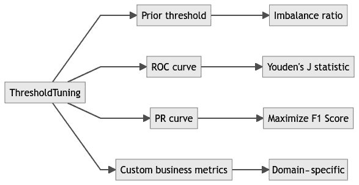

图 5.18 – 调整阈值的流行方法

我们将逐一讨论这些方法。

我们将继续使用我们之前创建的相同数据集。以下代码块拟合逻辑回归模型并获取测试集的预测概率：

```py
lr = LogisticRegression(max_iter=1000)
lr.fit(X_train, y_train)
y_pred = lr.predict_proba(X_test)
y_pred = y_pred[:, 1]
```

### 使用先验阈值进行阈值调整

一个明显的阈值可以使用的是训练数据集中正类概率的值[10]。让我们实现这个想法：

```py
num_pos, num_neg = Counter(y)[1], Counter(y)[0]
prior_threshold = num_pos /(num_pos + num_neg)
print('Prior threshold=%f'% prior_threshold)
# Find the closest threshold from thresholds from ROC curve
fpr, tpr, thresholds = roc_curve(y_test, y_pred)
min_threshold_index = np.absolute( \
    thresholds-prior_threshold).argmin()
print('Best threshold using prior threshold from ROC \
    function=%f'% thresholds[min_threshold_index])
print("TPR at threshold=%f" % tpr[min_threshold_index])
print("FPR at threshold=%f" % fpr[min_threshold_index])
print("TNR at threshold=%f" % (1-fpr[min_threshold_index]))
```

这将打印以下阈值：

```py
Prior threshold=0.014900
Best threshold using prior threshold from ROC function=0.014232
TPR value at the threshold=0.675676
FPR value at the threshold=0.147990
TNR value at the threshold=0.852010
```

### 使用 ROC 曲线进行阈值调整

对于 ROC 曲线，可以使用尤登的 J 统计量[17]来找到最优阈值。尤登的 J 统计量在临床领域有根源，是一个捕获诊断测试性能的单个统计量。在二元分类的背景下，统计量 J 定义为以下：

J = 灵敏度 + 特异性 − 1 = TPR + TNR − 1 = TPR − FPR

其值可以从-1（TPR=0 和 TNR=0 – 即，总是错误的结果）到 1（TPR=1 和 FPR=0 – 即，完美结果）不等。这是在 ROC 分析中选择阈值的一个常见选择，因为它平衡了灵敏度（TPR）和特异性（TNR）。请注意，TNR = 1-FPR。

最大化尤登指数 J 的原因等同于选择最优阈值，因为它本质上是在 ROC 曲线上找到离无歧视线（对角线）最远的点。这意味着它选择一个在 TPR 和 FPR 之间取得平衡的阈值，这通常是我们在分类器中想要的。

“最优”阈值可能严重依赖于我们特定应用中假阳性与假阴性的成本。以下代码块使用尤登指数识别最优分类阈值，该指数是从 ROC 曲线计算得出的：

```py
fpr, tpr, thresholds = roc_curve(y_test, y_pred)
youden_index = tpr - fpr
max_youden_index = np.argmax(youden_index)
best_thresh = thresholds[max_youden_index]
print('Best threshold using Youden index=%f'% best_thresh)
print('Max Youden index value=%f'% youden_index[max_youden_index])
print("TPR value at the threshold=%f" % tpr[max_youden_index])
print("FPR value at the threshold=%f" % fpr[max_youden_index])
print("TNR value at the threshold=%f" % (1-fpr[max_youden_index]))
```

这将输出以下值：

```py
Best threshold using Youden index=0.098879
Max Youden index value=0.622143
TPR value at the threshold=0.635135
FPR value at the threshold=0.012992
TNR value at the threshold=0.987008
```

另一种常用于文献中的阈值调整方法，它使用 ROC 曲线，即最大化 TPR（也称为灵敏度）和 TNR（也称为特异性）的几何平均值：

G − mean = √ __________________  灵敏度 * 特异性  = √ _TPR * TNR  = √ ______________  TPR * (1 − FPR)

最大化几何平均值等同于在 TPR 和 TNR 之间找到一个良好的平衡。以下代码块使用 G-mean 指标计算分类的最佳阈值，以及其相应的 TPR、FPR 和 TNR 值。我们从`sklearn.metrics`导入`roc_curve`：

```py
fpr, tpr, thresholds = roc_curve(y_test, y_pred)
gmean = np.sqrt(tpr*(1-fpr))
max_gmean_index = np.argmax(gmean)
best_thresh = thresholds[max_gmean_index]
print('Best threshold using G-mean=%f'% (best_thresh))
print('Max G-mean value=%f'% (gmean[max_gmean_index]))
print("TPR value at the threshold=%f" % tpr[max_gmean_index])
print("FPR value at the threshold=%f" % fpr[max_gmean_index])
print("TNR value at the threshold=%f" % (1 - fpr[max_youden_index]))
```

这将输出以下最优值：

```py
Best threshold using G-mean=0.098879
Max G-mean value=0.791760
TPR value at the threshold=0.635135
FPR value at the threshold=0.012992
TNR value at the threshold=0.987008
```

### 使用 PR 曲线进行阈值调整

正如我们在*第一章*，“机器学习中的数据不平衡介绍”中讨论的那样，当正类比负类更重要时，PR 曲线通常比 ROC 曲线更适合不平衡数据集。作为提醒，简单的原因是 PR 曲线忽略了真正的负例，因此，它可以在使用不平衡数据集与平衡数据集相比时，表示模型性能的显著差异。虽然随着数据不平衡的增加，ROC 曲线不会变化太多，但如果两个类别都同样重要，它们可以是一个更好的选择。

我们希望精确率和召回率都达到最大值，理想情况下都是 1。因此，PR 曲线上的优化点是（1，1）。

当我们偏离这个优化点时，精确率和召回率的值都会降低，我们就不那么优化了。

一种捕捉精确率和召回率之间权衡的度量是 F1 分数。F1 分数被定义为精确率和召回率的调和平均值：

F1 = 2 * (Precision * Recall) / (Precision + Recall)

如果我们分析这个方程，我们会看到当精确率和召回率都是 1 时，F1 分数最高（在 1 处达到最大值），这正是我们在 PR 曲线上定义的优化点。

因此，优化最大 F1 分数将确保我们努力最大化精确率和召回率，有效地推动我们向 PR 曲线上的优化点靠近。

最大化 F1 分数是确定最佳阈值的一种常见且有效的方法。以下代码块使用从 PR 曲线派生的 F1 分数度量计算最佳阈值：

```py
from numpy import argmax
from sklearn.metrics import precision_recall_curve
precision, recall, thresholds = precision_recall_curve(y_test, y_pred)
fscore = 2*precision*recall/(precision+recall)
max_fscore_idx = argmax(fscore)
print('max_fscore_idx==%d' % max_fscore_idx)
print('best threshold using PR curve=%f' % thresholds[max_fscore_idx])
```

这会输出以下优化值：

```py
max_fscore_idx==4950
best threshold using PR curve=0.258727
max(fscore)= 0.661290
```

让我们绘制具有最佳阈值值的 PR 曲线：

```py
pyplot.plot(recall, precision, marker='.', \
    label='precision vs recall for various thresholds')
result = pyplot.scatter(recall[max_fscore_idx], \
    precision[max_fscore_idx], \
    marker='x', color='red', \
    label='Best threshold with highest\
    f1-score')
plt.legend(handles=result.legend_elements()[0], \
    labels="legend", loc='upper center', \
    bbox_to_anchor=(1, 1))
pyplot.xlabel('recall')
pyplot.ylabel('precision')
```

PR 曲线看起来是这样的：

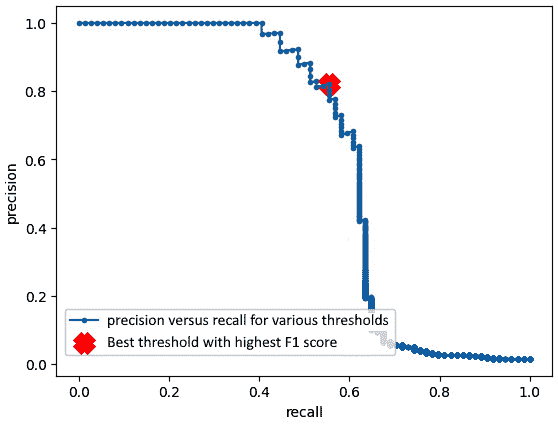

图 5.19 – 最佳 F1 分数阈值值的 PR 曲线

### 一般阈值调整

作为一种一般方法，我们可能需要优化任何度量，如平均精确度、准确度等，或任何其他业务度量。在这种情况下，我们可以编写一个函数来直接优化该度量。让我们以 I. Unal 等人在其研究[18]中定义的**联合指数**（**IU**）度量为例，其中度量由使 IU(c)最小化的阈值值 c 定义：

IU(c) = (|Sensitivity(c) − ROC _ AUC| + |Specificity(c) − ROC _ AUC|)

在这里，Sensitivity(c)是 c 处的灵敏度，Specificity 是 c 处的特异性，ROC _ AUC 是 ROC 图的**曲线下面积**（**AUC**）。

让我们实现 IU 度量，如这里定义的，作为一个自定义度量来找到最小化它的最佳阈值：

```py
from sklearn.metrics import f1_score, auc
def custom_metric(y_test, y_pred):
    fpr, tpr, thresholds = roc_curve(y_test, y_pred)
    sensitivity = tpr
    specificity = 1-fpr #same as tnr
    roc_auc = auc(fpr, tpr)
    index_of_union = abs(sensitivity-roc_auc) + \
        abs(specificity-roc_auc)
    return index_of_union
scores = custom_metric(y_test, y_pred)
min_score_idx = np.argmin(scores)
print('max_score_idx=%d' % min_score_idx)
print('best threshold=%f'% thresholds[min_score_idx])
print('minimum IU-value at the best threshold=%f' % \
    scores[min_score_idx])
```

这会产生以下优化值：

```py
max_score_idx=34
best threshold=0.000042
minimum IU-value at the best threshold=0.112514
```

这标志着我们对经典建模技术的讨论结束。我们现在准备进入研究深度学习领域中的数据不平衡。我们将探讨从上一章学习的一般技术如何适应以增强我们处理不平衡数据时的深度学习模型。

# 摘要

在本章中，我们深入探讨了 CSL（组合过采样和欠采样），作为一种替代方案。与将所有误分类错误同等对待的数据级别技术不同，CSL 调整模型的成本函数，以考虑不同类别的显著性。它包括类别加权和元学习技术。

类似于`scikit-learn`、Keras/TensorFlow 和 PyTorch 这样的库支持成本敏感学习。例如，`scikit-learn`提供了一个`class_weight`超参数来调整损失计算中的类别权重。XGBoost 有一个`scale_pos_weight`参数用于平衡正负权重。MetaCost 通过使用袋装和误分类成本矩阵将任何算法转换为成本敏感版本。此外，阈值调整技术可以通过后处理模型预测来增强 F1 分数、精确度和召回率等指标。

使用各种数据采样和 CSL 技术的实验可以帮助确定最佳方法。我们将在*第八章*中扩展这些概念，即*算法级深度学习技术*。这标志着我们对经典机器学习模型的讨论结束，我们已经毕业到深入学习技术。在下一章中，我们将简要介绍深度学习概念，并看看不平衡数据集在深度学习世界中可能成为问题。

# 问题

1.  在使用本章中使用的相同数据集的同时，将 CSL 技术应用于`scikit-learn`中的 SVM 模型。使用`class_weight`和`sample_weight`参数，类似于我们在本章中用于其他模型的方式。比较此模型与本章中已经遇到的模型的表现。

1.  LightGBM 是另一个类似于 XGBoost 的梯度提升框架。在本章使用的数据集上应用成本敏感学习技术到 LightGBM 模型。使用`class_weight`和`sample_weight`参数，类似于我们在本章中用于其他模型的方式。比较此模型与本章中已经遇到的模型的表现。

1.  AdaCost [10] 是一种结合了提升和 CSL 的 AdaBoost 变体。它通过利用误分类成本来更新连续提升轮次的训练分布。将`scikit-learn`中的`AdaBoostClassifier`扩展以实现 AdaCost 算法。比较 AdaCost 与 MetaCost 在本章使用的数据集上的性能。

1.  调整 XGBoost 模型的超参数，特别是`max_depth`、`max_delta_step`和`min_child_weight`，使用本章中使用的数据集。调整后，评估加权 XGBoost 模型是否优于非加权版本。

# 参考文献

1.  P. Turney, *归纳概念学习中的成本类型*, 在第 17 届国际机器学习会议的成本敏感学习研讨会论文集，斯坦福大学，加利福尼亚州（2000 年），第 15–21 页。

1.  C. X. Ling 和 V. S. Sheng, *成本敏感学习和类* *不平衡问题*.

1.  Sheng, V. S.，& Ling, C. X. (2006). *为了使分类器成本敏感的阈值方法*. AAAI’06: 第 21 届全国人工智能会议论文集，第 6 卷，第 476–481 页。

1.  *儿童肺炎统计数据* – 联合国儿童基金会数据：[`data.unicef.org/topic/child-health/pneumonia/`](https://data.unicef.org/topic/child-health/pneumonia/).

1.  X. Ling, W. Deng, C. Gu, H. Zhou, C. Li, 和 F. Sun, 在第 26 届国际万维网会议（WWW '17）的伴随会议论文集中，Bing 搜索广告的点击预测模型集成，珀斯，澳大利亚：ACM 出版社，2017 年，第 689–698 页。doi: 10.1145/3041021.3054192.

1.  *机器学习驱动的 Airbnb 体验搜索排名*（2019 年），[`medium.com/airbnb-engineering/machine-learning-powered-search-ranking-of-airbnb-experiences-110b4b1a0789`](https://medium.com/airbnb-engineering/machine-learning-powered-search-ranking-of-airbnb-experiences-110b4b1a0789).

1.  P. Domingos, MetaCost: 一种使分类器成本敏感的通用方法，在知识发现与数据挖掘国际会议论文集中，第 155–164 页，1999 年。

1.  *不稳定的学习者*. 在：Sammut, C.，Webb, G.I. (eds) 机器学习与数据挖掘百科全书。Springer，波士顿，马萨诸塞州。doi: [`doi.org/10.1007/978-1-4899-7687-1_866`](https://doi.org/10.1007/978-1-4899-7687-1_866).

1.  W. Fan, S. J. Stolfo, J. Zhang, 和 P. K. Chan, *AdaCost: 误分类* *成本敏感的 Boosting*.

1.  G. I. Karakoulas 和 J. Shawe-Taylor, *优化不平衡* *训练集* 的分类器*.

1.  P. Viola 和 M. Jones, *使用非对称 AdaBoost 和* *检测级联* *进行快速和鲁棒的分类*.

1.  J. M. Johnson 和 T. M. Khoshgoftaar, *集成学习者的输出阈值和类不平衡大数据*, 在 2021 年 IEEE 第 33 届国际人工智能工具会议（ICTAI）中，华盛顿特区，美国：IEEE，2021 年 11 月，第 1449–1454 页。doi: 10.1109/ICTAI52525.2021.00230.

1.  J. M. Johnson 和 T. M. Khoshgoftaar, *在 2019 年第 18 届 IEEE 国际机器学习与应用会议（ICMLA）中，关于类不平衡大数据的深度学习和阈值处理*, 佛罗里达州博卡拉顿，美国，2019 年 12 月，第 755–762 页。doi: 10.1109/ICMLA.2019.00134.

1.  F. Provost, *不平衡数据集的机器学习* *入门*.

1.  M. Buda, A. Maki, 和 M. A. Mazurowski, *卷积神经网络中类别不平衡问题的系统研究*, 神经网络，第 106 卷，第 249–259 页，2018 年 10 月，doi: 10.1016/j.neunet.2018.07.011.

1.  *使用丰富图像和文本数据大规模分类产品*（2021 年），[`shopify.engineering/using-rich-image-text-data-categorize-products`](https://shopify.engineering/using-rich-image-text-data-categorize-products).

1.  W. J. Youden, *诊断测试评分指数*，癌症，第 3 卷，第 1 期，第 32–35 页，1950 年，doi: 10.1002/1097-0142(1950)3:1<32::AID-CNCR2820030106>3.0.CO;2-3.

1.  I. Unal, *在 ROC 分析中定义最佳切割点值：一种替代方法*，计算与数学在医学中的应用，第 2017 卷，第 1–14 页，2017 年，doi: 10.1155/2017/3762651.

1.  X. Ling, W. Deng, C. Gu, H. Zhou, C. Li, 和 F. Sun, *用于 Bing 搜索广告点击预测的模型集成*, 在第 26 届国际万维网大会伴随会议——WWW '17 伴随会议论文集中，珀斯，澳大利亚：ACM 出版社，2017 年，第 689–698 页。doi: 10.1145/3041021.3054192.
