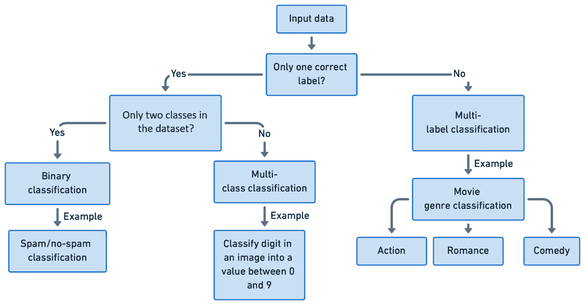

# 6

# 深度学习中的数据不平衡

类不平衡数据是深度学习模型的一个常见问题。当一个或多个类别样本显著较少时，深度学习模型的性能可能会受到影响，因为它们倾向于优先从多数类别中学习，从而导致少数类别（或类别组）的泛化能力较差。

许多现实世界的数据是不平衡的，这对深度学习分类任务提出了挑战。*图 6.1*展示了在各种深度学习应用中常见的不平衡数据问题的一些类别：


图 6.1 – 一些常见的不平衡数据问题类别

本章我们将涵盖以下主题：

+   深度学习简介

+   深度学习中的数据不平衡

+   处理数据不平衡的深度学习技术概述

+   多标签分类

到本章结束时，我们将对深度学习和神经网络有一个基础的理解。我们还将掌握数据不平衡对这些模型的影响，并了解解决不平衡数据挑战的各种策略的高级概述。

# 技术要求

在本章中，我们将利用常见的库，如`numpy`、`scikit-learn`和`PyTorch`。`PyTorch`是一个开源的机器学习库，用于深度学习任务，因其灵活性和易用性而近年来越来越受欢迎。

您可以使用`pip`或`conda`安装`PyTorch`。访问官方 PyTorch 网站([`pytorch.org/get-started/locally/`](https://pytorch.org/get-started/locally/))以获取适合您系统配置的相应命令。

本章的代码和笔记本可在 GitHub 上找到，网址为[`github.com/PacktPublishing/Machine-Learning-for-Imbalanced-Data/tree/main/chapter06`](https://github.com/PacktPublishing/Machine-Learning-for-Imbalanced-Data/tree/main/chapter06)。

# 深度学习简介

深度学习是机器学习的一个子领域，它专注于具有多层（深度模型通常有三层或更多，包括输入、输出和隐藏层）的人工神经网络。这些模型在各种应用中展示了非凡的能力，包括图像和语音识别、自然语言处理和自动驾驶。

“大数据”（大量结构化或非结构化数据，通常难以用传统的数据处理软件管理）问题的普遍存在，极大地得益于**图形处理单元**（**GPU**）的发展，这些 GPU 最初是为图形处理设计的。

在本节中，我们将简要介绍深度学习的基石，仅讨论与深度学习中数据不平衡问题相关的内容。对于更深入的介绍，我们建议参考更专业的深度学习书籍（请参阅参考文献部分列出的[1]和[2]）。

## 神经网络

神经网络是深度学习的基础。受人类大脑的结构和功能启发，神经网络由层状组织的相互连接的节点或人工神经元组成。

`PyTorch` 的核心数据结构是张量。张量是多维数组，类似于 NumPy 数组，但具有 GPU 加速支持和自动微分的能力。可以使用 `PyTorch` 函数创建、操作和执行张量，如下所示：

```py
import torch
# Create a tensor with specific data
t1 = torch.tensor([[1, 2], [3, 4]])
# Create a 2x3 tensor filled with zeros
t2 = torch.zeros(2, 3)
# Create a 2x3 tensor filled with random values
t3 = torch.randn(2, 3)
```

将 CUDA 张量与 CPU 密集型张量混合会导致错误：

```py
# moving the tensor to GPU (assuming a GPU with CUDA support is available)
x = torch.rand(2,2).to("cuda") 
y = torch.rand(2,2) # this tensor remains on the CPU
x+y     # adding a GPU tensor & a CPU tensor will lead to an error
```

这是输出：

```py
--------------------------------------------------------------------------
RuntimeError Traceback (most recent call last)
----> 1 x+y
RuntimeError: Expected all tensors to be on the same device, but found at least two devices, cuda:0 and cpu!
```

`autograd` 是 `PyTorch` 中一个强大的功能，它允许对张量操作进行自动微分。这在神经网络中的反向传播（稍后讨论）中特别有用：

```py
# Create a tensor with autograd enabled
x = torch.tensor([[1., 2.], [3., 4.]], requires_grad=True)
# Perform operations on the tensor
y = x + 2
z = y * y * 3
# Compute gradients with respect to the input tensor x
z.backward(torch.ones_like(x))
# Display the gradients
print(x.grad)
```

我们将看到以下输出：

```py
tensor([[18., 24.],
        [30., 36.]])
```

让我们回顾一下这段代码是如何工作的。它创建了一个 PyTorch 张量 `x`，执行一些操作来计算 `y` 和 `z`，然后使用 `backward()` 方法计算 `z` 关于 `x` 的梯度。梯度存储在 `x.grad` 中。操作如下：

+   `y = x + 2` 将 `x` 中的每个元素增加 2

+   `z = y * y * 3` 将 `y` 中的每个元素平方然后乘以 3

在这种情况下，梯度计算涉及到对这些操作应用链式法则来计算 dz/dx：

dz/dx = dz/dy ⋅ dy/dx

好的，让我们计算这个方程中的每一部分：

1.  首先，让我们计算 dz/dy：

    dz/dy = 2 * y * 3 = 6 * y = 6 *(x + 2)

1.  dy/dx = 1 因为 *y* 是 *x* 的线性函数：

1.  最后，让我们计算 dz/dx：

    dz/dx = dz/dy ⋅ dy/dx = 6 ⋅ (x + 2) ⋅ 1 = 6 ⋅ (x + 2)

给定 `x = [[1., 2.], [3., 4.]]`，当我们打印 `x.grad` 时的输出应该是以下内容：

```py
tensor([[18., 24.],
        [30., 36.]])
```

输出张量对应于在特定值 `x` 处 `z` 关于 `x` 的评估梯度。

## 感知器

感知器是神经网络中最基本的单元。它是一个简单的线性分类器，它接受一组输入值，将它们乘以相应的权重，加上一个偏置项，将结果相加，并应用激活函数以产生输出：


图 6.2 – 一个简单的感知器

那么，激活函数是什么呢？

## 激活函数

激活函数将非线性引入神经网络，并帮助确定神经元的输出。常见的激活函数包括 sigmoid、tanh、**线性整流单元**（**ReLU**）和 softmax。这些函数使网络能够学习数据中的复杂非线性模式。

让我们深入了解人工神经网络的各种组成部分。

## 层

一个神经网络通常由输入层、一个或多个隐藏（中间）层和输出层组成。输入层接收原始数据，而隐藏层执行各种转换，输出层产生最终结果。

神经网络中的层数称为网络的**深度**，而每层的神经元数量称为网络的**宽度**。

与直觉相反，尽管深度和宽度更大的神经网络在训练数据中具有学习更复杂模式和表示的更多能力，但它们并不一定比浅层和窄网络对不平衡数据集更鲁棒。

深度和宽度更大的网络更容易过拟合，尤其是在不平衡数据集的背景下，因为大网络可以记住多数类别的模式，这可能会妨碍少数类别的性能。

## 前馈神经网络

前馈神经网络是一种具有单向信息流的神经网络，从输入层开始，通过任何隐藏层，最终到达输出层。

由于没有反馈回路或层与层之间的循环连接，因此得名前馈。这些网络广泛用于图像分类、回归和其他任务。

`PyTorch`提供了`nn`模块用于创建和训练神经网络——`nn.Module`类是所有神经网络模块的基类。以下代码片段定义了一个简单的前馈神经网络：

```py
import torch
import torch.optim as optim
class Net(torch.nn.Module):
     def __init__(self):
           super(Net, self).__init__()
           self.fc1 = torch.nn.Linear(4, 10)
           self.fc2 = torch.nn.Linear(10, 3)
     def forward (self, x):
           x = torch.relu(self.fc1(x))
           x = self.fc2(x)
           return x
# Create an instance of the network
net = Net()
# Define a loss function and an optimizer
criterion = torch.nn.CrossEntropyLoss()
optimizer = optim.SGD(net.parameters(), lr=0.01)
```

**损失函数**量化了预测输出和目标值之间的差异。常见的损失函数包括**均方误差**（**MSE**）、交叉熵和 Hinge 损失。

最常用的损失函数`CrossEntropyLoss`，我们在前面的代码片段中使用过，在类别不平衡的数据集中往往倾向于多数类别的示例。这是因为多数类别的示例数量显著多于少数类别的示例。因此，损失函数偏向多数类别，并且未能充分考虑到少数类别的错误。

我们将在*第八章*“算法级深度学习技术”中学习更多关于针对类别不平衡问题更适合的损失函数修改。

### 多层感知器

多层感知器（MLP）是一个前馈神经网络，由输入层、一个或多个隐藏层和输出层组成。每一层都是全连接的，这意味着一个层中的每个神经元都与下一层中的所有神经元相连。MLPs 可用于各种任务，包括分类、回归和特征提取。它们特别适合于输入数据可以表示为固定大小向量的问题，例如表格数据或展平的图像。*图 6.3*展示了具有两个输入节点、两个隐藏节点和一个输出节点的多层感知器，使用指定的权重 w1 到 w6：


图 6.3 – 多层感知器

## 训练神经网络

训练神经网络涉及找到最小化损失函数的最优权重和偏置。在此过程中使用了两个基本算法 – 梯度下降和反向传播：

+   **梯度下降**：梯度下降是一种优化算法，通过迭代更新权重和偏置来最小化损失函数。

+   **反向传播**：反向传播是训练神经网络的关键算法。它使用链式法则（一种寻找复合函数导数的方法）计算损失函数相对于每个权重的梯度，有效地从输出层计算梯度到输入层。

训练神经网络涉及遍历数据集，将数据输入网络，计算损失，并使用反向传播更新权重，如图所示：

```py
# Example dataset
inputs = torch.randn(100, 4)
targets = torch.randint(0, 3, (100,))
# Train for 100 epochs
for epoch in range(100):
     # Forward pass
     outputs = net(inputs)
     # Compute loss
     loss = criterion(outputs, targets)
     # Backward pass and optimization
     # reset gradients of model parameters
     optimizer.zero_grad()
     # compute the gradient of loss w.r.t model parameters
     loss.backward()
     # update model parameters based on computed gradients
     optimizer.step()
     # Print the loss for this epoch
     print(f"Epoch {epoch + 1}, Loss: {loss.item()}")
```

此代码生成以下输出，显示了每个 epoch 的损失（注意，随着训练的进行，损失会下降）：

```py
Epoch 1, Loss: 1.106634497642517
Epoch 2, Loss: 1.1064313650131226
…
Epoch 100, Loss: 1.026018738746643
```

在前面的代码片段中，包含`loss.backward()`的行对应于反向传播过程。`optimizer.zero_grad()`和`optimizer.step()`这两行都代表梯度下降过程的一步。`optimizer.zero_grad()`清除上一步的旧梯度（否则它们会累积），而`optimizer.step()`执行参数（权重和偏置）的实际更新，以减少损失。

以下流程图描述了 PyTorch 中的训练逻辑：


图 6.4 – PyTorch 训练逻辑流程图

**过拟合**是机器学习中常见的问题，模型在训练数据上表现良好，但无法泛化到未见数据。

**欠拟合**发生在模型过于简单时（想想当我们需要决策树回归模型时却使用了线性回归模型的情况）并且无法捕捉数据中的潜在模式。

过拟合和欠拟合都会导致在未见数据上的性能不佳。

### 正则化

正则化技术通过为模型必须满足的约束条件添加额外的限制来帮助减轻过拟合。如果 L 是损失函数，最常用的正则化类型是 L1 和 L2，它们将惩罚项添加到损失函数中，从而阻止过于复杂的模型：

L1 损失 = L + λ∑i=1n|w_i|

L2 损失 = L + λ∑i=1nw_i²

在这里，λ是正则化强度，w_i 是模型参数（权重）。

还有其他几种正则化技术：

+   `PyTorch`中的`torch.nn.Dropout`类实现了 dropout 功能，并接受一个参数，即 dropout 率（神经元被置零的概率）。

+   `torch.nn.BatchNorm1d`和`torch.nn.BatchNorm2d`是一种用于改进深度神经网络训练的技术。它通过调整每个层的均值和标准差来规范化每个层的输入，这有助于稳定和加速训练过程，允许使用更高的学习率并减少对权重初始化的敏感性。

+   **早期停止**：早期停止是一种在神经网络训练过程中防止过拟合的技术。它涉及监控模型在验证集上的性能，并在性能停止提高或开始下降时停止训练过程。这有助于找到模型在没有需要记住训练集的情况下，对新数据泛化良好的点：


图 6.5 – 当验证损失随着更多轮次增加时应用早期停止技术

## 学习率对数据不平衡的影响

我们已经看到，梯度下降在负梯度的方向上迈出一步——这一步的大小称为**学习率**。

选择合适的学习率对于在数据不平衡的数据集上运行的模型至关重要。

学习率的选择应确保模型能够有效地从多数类和少数类中学习模式。监控训练和验证损失以及其他评估指标，如精确度、召回率和 F1 分数，可以帮助微调学习率。

高学习率意味着模型在每次训练迭代中更新权重更为剧烈。当应用于少数类时，这些快速、大的更新可能导致模型跳过最小化该类损失的优化权重集。通常，使用自适应学习率[3][4]或甚至类特定学习率[5]来确保模型从多数类和少数类中有效地学习是有益的。

现在，让我们回顾一些对图像和文本领域非常有用的特定类型的神经网络。

## 使用卷积神经网络进行图像处理

**卷积神经网络**（**CNNs**）是一种为图像和视频处理任务设计的深度学习模型。它由卷积层、池化层和全连接层组成：

+   卷积层将滤波器应用于输入数据，学习检测局部特征，如边缘或纹理。这些滤波器在输入数据上滑动，执行逐元素乘法和求和结果，从而创建一个特征图，表示特定特征的存在。

+   池化层，如最大池化或平均池化，减少了数据的空间维度，聚合信息并降低计算复杂度。这些层有助于构建对输入数据中小的平移和扭曲的不变性。

+   完全连接层处理卷积层和池化层提取的高级特征，以进行预测。完全连接层是传统的神经网络层，其中每个神经元都与前一层的每个神经元相连。

卷积神经网络（CNNs）倾向于过度拟合少数类别，这与通常欠拟合这些少数类别的传统机器学习算法形成对比[6]。这里的直觉是，CNNs 具有多层和大量参数，旨在捕捉复杂模式。此外，由于对数据有很强的需求，CNNs 可以从数据中学习到复杂的细节。当面对不平衡数据时，CNNs 可能会过度关注少数类别，本质上“记忆”了少数类别的实例。

我们将在*第八章*（B17259_08.xhtml#_idTextAnchor235）的*算法级深度学习技术*部分，*类依赖温度（CDT）*损失部分中更详细地讨论这个问题。

计算机视觉领域中的不平衡问题可以按照*图 6.6*所示进行分类[7]：


图 6.6 – 计算机视觉中不平衡问题的分类（改编自[7]）

## 使用自然语言处理进行文本分析

**自然语言处理**（**NLP**）是人工智能的另一个分支，它帮助计算机理解和分析人类语言，以提取见解和组织信息。*图 6.7*展示了基于数据复杂度级别的文本不平衡问题的分类，而*图 6.8*展示了基于一些流行的 NLP 应用领域的分类：


图 6.7 – 基于文本数据形式的 NLP 中不平衡问题的分类


图 6.8 – 基于应用的 NLP 中不平衡问题的分类

在基本概念介绍完毕后，让我们看看数据不平衡如何影响深度学习模型。

# 深度学习中的数据不平衡

虽然许多使用表格数据的经典机器学习问题仅限于二进制类别，并且关注于预测少数类别，但在深度学习经常应用的领域中，这并不是常态，尤其是在计算机视觉或 NLP 问题中。

即使是像 MNIST（包含 0 到 9 的灰度图像的手写数字集合）和 CIFAR10（包含 10 个不同类别的彩色图像）这样的基准数据集也有 10 个类别需要预测。因此，我们可以说在应用深度学习模型的领域中，**多类别分类**是典型的。

这种数据倾斜或不平衡可能会严重影响模型的表现。我们应该回顾一下在*第一章*，《机器学习中的数据不平衡介绍》中讨论的典型不平衡类型。为了模拟现实世界的数据不平衡场景，文献中通常研究两种类型的不平衡：

+   **步长不平衡**：所有少数类别和所有多数类别的示例数量相同或几乎相同：


图 6.9 – 步长不平衡

+   **长尾不平衡**：不同类别的示例数量遵循指数衰减。图表通常向左或向右有长长的尾巴：


图 6.10 – 长尾不平衡

通常情况下，当比较两个数据集时，不平衡比率较高的数据集可能得到较低的 ROC-AUC 分数[8]。在不平衡数据集中可能存在类别重叠、标签噪声和概念复杂性的问题[9][10]。这些问题可能会严重影响深度学习模型的表现：

+   **类别重叠**：当不同类别的实例在特征空间中彼此靠近时，就会发生类别重叠。深度学习模型通常依赖于复杂的决策边界来区分类别。当不同类别的实例在特征空间中靠近时，这在不平衡数据集中很常见，多数类别可能会主导这些决策边界。这使得深度学习模型准确分类少数类别实例变得特别具有挑战性。

+   **噪声标签**：噪声标签指的是数据集中具有错误或不明确类别标签的实例。在不平衡数据集中，噪声标签可能会不成比例地影响少数类别，因为模型有较少的实例可以学习。深度学习模型对数据非常渴求，并且对训练数据的质量高度敏感。这可能导致深度学习模型泛化能力差，影响它们在新、未见过的数据上的表现。

+   **概念复杂性**：概念复杂性是指根据给定的特征区分类别的固有难度。深度学习模型擅长捕捉数据中的复杂模式。然而，在不平衡数据集中特征与类别标签之间关系的复杂性可能会使得这些模型难以有效地学习少数类别。少数类别可用的实例数量有限，这通常会使问题更加严重。

## 数据不平衡对深度学习模型的影响

让我们再回顾一下数据不平衡如何影响深度学习模型与经典机器学习模型相比：

+   **模型敏感性**：随着数据集不平衡率的增加，深度学习模型的表现可能会受到显著影响（*图 6**.11*）：


图 6.11–在具有固定少数类数量的不平衡版本的 CIFAR-10 上的模型性能（改编自[8]）

+   **特征工程**：经典机器学习模型通常需要手动特征工程，这有助于通过创建新特征或转换现有特征来突出显示少数类，从而解决数据不平衡问题。在深度学习模型中，特征工程通常通过学习过程自动执行，这使得它对人类干预来解决不平衡问题不那么依赖。

+   **处理不平衡的技术**：在经典机器学习中，处理数据不平衡的标准技术包括重采样（对少数类进行过采样或对多数类进行欠采样）、生成合成样本（例如，使用**合成少数类过采样技术**（SMOTE））和使用代价敏感学习（为不同类别分配不同的误分类成本）。

    一些来自经典机器学习的技术也可以应用于深度学习，但已经开发出专门针对深度学习模型的方法。这些包括迁移学习（利用预训练模型从不平衡数据中学习）、使用焦点损失（一个关注难以分类示例的损失函数）以及采用数据增强技术来生成更多样化和平衡的训练数据。这些数据增强技术将在*第七章*，*数据级深度学习方法*中详细讨论。

+   **模型可解释性**：经典机器学习模型通常更可解释，这有助于我们了解数据不平衡对模型决策过程的影响。另一方面，由于缺乏可解释性，深度学习模型通常被称为“黑盒”。这种缺乏可解释性使得理解模型如何处理不平衡数据以及它是否在学习有意义的模式或仅仅是记忆多数类变得更加困难。

+   **训练数据大小**：深度学习模型通常需要大量的训练数据以实现最佳性能。在数据严重不平衡的情况下，收集足够的数据以供少数类使用可能更具挑战性，这可能会阻碍深度学习模型的表现。此外，如果有一个大型数据集可用，那么在大量数据中找到少数类的实例的可能性更大。相比之下，在较小的数据集中，少数类可能根本不会出现！另一方面，经典机器学习算法通常可以在较小的数据集上实现相当不错的性能，这在处理不平衡数据时是一个优势。

+   **深度（层数）对不平衡数据问题训练的深度学习模型的影响**：更多层的优点是提高了学习数据中复杂模式和特征的能力，以及提高了模型的泛化能力。增加更多层的缺点可能是模型过拟合和梯度消失或爆炸问题恶化（随着深度的增加，反向传播中的梯度可以变得非常小（消失）或非常大（爆炸），这使得训练模型变得具有挑战性）。这总结在*图 6.12*中：


图 6.12 – 总结深度对深度学习模型的影响

总体而言，深度对深度学习模型的影响随着数据和模型架构的不同而变化，需要经验评估。

+   **过采样和欠采样**：Mateusz Buda[8]撰写的题为*卷积神经网络中类别不平衡问题的系统研究*的研究，详细考察了类别不平衡如何影响 CNN 的性能。该研究使用了三个著名的数据集——MNIST、CIFAR-10 和 ImageNet——并使用了 LeNet-5、All-CNN 和 ResNet-10 等模型进行实验。他们的主要发现如下：

    +   在几乎所有分析案例中，过采样都被证明是减轻类别不平衡的最有效技术

    +   当消除不平衡时，过采样更有效，而欠采样在仅部分减少不平衡时产生更好的结果

    +   与一些传统的机器学习算法相反，当应用过采样时，CNN 没有过拟合

    +   在某些情况下，欠采样与过采样表现相当，即使使用更少的数据

    +   欠采样通常与基线相比表现较差，从未显示出比过采样明显的优势

    +   如果重点是正确分类少数类别的示例，欠采样可能比过采样更可取

    如果数据太多，欠采样可能是节省时间、资源和训练成本的首选或唯一选项

+   **阈值调整**：我们在*第五章*中详细讨论了阈值调整，*成本敏感学习*。作为复习，决策阈值是一个确定分类问题中不同类别或结果之间边界的值。Johnson 等人[11]的论文强调了最佳阈值与少数类大小呈线性相关（即少数类大小越低，阈值越低）。他们使用深度学习模型在 CMS 医疗保险数据[12]上进行了两个和四个隐藏层的欺诈检测训练和测试。默认阈值通常会导致分类效果不佳，特别是对于少数类，突出了基于验证集进行阈值调整的必要性。

关于本书后半部分使用的数据集的说明

在本书的剩余部分，我们将主要使用 MNIST 和 CIFAR10-LT（“LT”代表“长尾”）数据集的不平衡版本进行训练：

• **MNIST**：一个包含 0 到 9 数字的 10 个类别的灰度图像数据集。它由 60,000 个训练图像和 10,000 个测试图像组成，每个图像为 28 像素 x 28 像素。与 CIFAR-10 相比，训练/测试速度更快。

• **CIFAR-10**：用于物体识别，这个彩色图像数据集也有 10 个类别。它包括 50,000 个训练图像和 10,000 个测试图像，每个图像为 32 像素 x 32 像素。

尽管训练集是不平衡的，但相应的测试集中每个类别的示例数量是相等的。这种平衡测试集方法提供了几个好处：

• **可比性**：平衡的测试集允许在不同类别和模型之间进行无偏比较

• **可重复性和可再现性**：使用如 MNIST 和 CIFAR-10 等简单数据集确保了代码执行和理解上的便捷性

• **效率**：较小的数据集能够加快迭代速度，使我们能够在合理的时间内尝试、测试和重试运行代码

• **与研究的契合度**：这种方法与大多数关于长尾学习和不平衡数据集的研究是一致的，提供了一个通用的比较框架

下一节将为我们概述处理数据不平衡的深度学习策略。我们还将看到，最初为经典机器学习技术开发的处理不平衡数据集的各种技术如何轻松扩展到深度学习模型。

# 处理数据不平衡的深度学习技术概述

与本书的前半部分类似，我们当时专注于经典机器学习技术，主要类别通常包括采样技术、成本敏感型技术、阈值调整技术，或这些技术的组合：

+   样本技术包括对多数类进行欠采样或对少数类数据进行过采样。数据增强是计算机视觉问题中的一个基本技术，用于增加训练集的多样性。虽然它不是直接针对解决类别不平衡的过采样方法，但数据增强确实具有扩展训练数据的效果。我们将在*第七章*的*数据级深度学习方法*中更详细地讨论这些技术。

+   成本敏感型技术通常涉及以某种方式更改模型损失函数，以适应少数类样本分类错误的较高成本。一些标准损失函数，如 PyTorch 中的`CrossEntropyLoss`，支持权重参数以适应这些成本。我们将在*第八章*的*算法级深度学习技术*中详细介绍其中许多，包括几个自定义损失函数。

+   混合深度学习技术整合了数据级和算法级方法。这种融合允许更细致和有效的解决方案来处理类别不平衡。我们将在*第九章*，*混合深度学习方法*中讨论这一点。

+   阈值调整技术应用于模型训练后产生的分数。这些技术可以帮助调整阈值，从而使模型指标，例如 F1 分数或几何平均数，得到优化。这在*第五章**，*成本敏感学习*中已有讨论：


图 6.13 – 深度学习技术的分类

从本章开始，我们将不会使用深度学习方法处理表格数据，因为像 XGBoost、LightGBM 和 CatBoost 这样的经典模型在处理这种结构化数据时往往表现良好。几项研究([13]和[14])表明，在涉及表格数据的监督学习任务中，传统机器学习模型通常优于深度学习模型。然而，XGBoost 模型和深度学习模型的集成可以优于单独的 XGBoost 模型[13]。因此，使用表格数据集的任务仍然可以从深度学习模型中受益。深度学习模型在表格数据上的性能赶上经典模型可能只是时间问题。尽管如此，当我们使用深度学习模型时，我们将重点关注视觉和 NLP 问题。

这就结束了我们对使用深度学习模型处理不平衡数据集的各种技术的高级讨论。

# 多标签分类

多标签分类是一种分类任务，其中每个实例可以同时分配给多个类别或标签。换句话说，一个实例可以属于多个类别或具有多个属性。例如，一部电影可以属于多个类型，如动作、喜剧和浪漫。同样，一张图片可以包含多个对象(*图 6**.14*)：


图 6.14 – 显示预测概率的多标签图像分类

但它与多类分类有何不同？多类分类是一种分类任务，其中每个实例只能分配给一个类别或标签。在这种情况下，类别或类别是互斥的，这意味着一个实例只能属于一个类别。例如，手写数字识别任务将是多类的，因为每个数字只能属于一个类别（0-9）。

总结来说，多标签分类和多类分类的主要区别在于，在多标签分类中，实例可以有多个标签。相比之下，在多类分类中，实例只能有一个标签。这总结在*图 6**.15*中：



图 6.15 – 多标签分类和多类分类的区别

许多现实世界的问题本质上是多标签的，并且存在类别不平衡。深度学习模型在这里特别有用，尤其是当涉及的数据是无结构化的，如图像、视频或文本时。

在**多标签数据集**（**MLDs**）中，可能有成十或上百个标签，每个实例可以与这些标签的子集相关联。标签种类越多，某些标签出现频率非常低的可能性就越大，从而导致显著的失衡。

多标签分类中的数据不平衡可能发生在多个层面[15]：

+   **标签内部的不平衡**：每个标签中负实例和正实例之间可能存在很大的差异，这可能导致分类模型在少数类别上遇到困难

+   **标签之间的不平衡**：标签中正实例的分布不均，导致少数类别的性能较差

+   **标签集之间的不平衡**：由于标签稀疏性，标签集（各种标签的组合）的频率稀疏，这使得分类模型难以有效学习

*图 6**.16*总结了在分类多标签数据集时这些不平衡类型：


图 6.16 – 多标签数据集中的不平衡类型

数据不平衡处理方法和度量标准与用于不平衡多类分类方法的方法类似。典型的方法包括重采样方法、集成方法和成本敏感方法。

最直接的方法是将多标签数据集转换为多类数据集，然后应用各种重采样方法，如随机过采样、随机欠采样、**编辑最近邻**（**ENN**）等。文献中已经使用了类似的策略，将成本敏感方法适应到多标签分类问题。

# 摘要

深度学习在许多领域已成为必要的技术，从计算机视觉和自然语言处理到医疗保健和金融。本章简要介绍了深度学习的核心概念和技术。我们讨论了 PyTorch、深度学习的基础知识、激活函数和数据不平衡挑战。我们还对接下来几章将要讨论的各种技术进行了鸟瞰。

理解这些基础知识将使你具备探索更高级主题和应用的知识，并最终为不断发展的深度学习世界做出贡献。

在下一章中，我们将探讨数据层面的深度学习方法。

# 问题

1.  将数据不平衡处理方法从经典机器学习模型迁移到深度学习模型中面临哪些挑战？

1.  如何创建一个不平衡版本的 MNIST 数据集？

1.  使用 MNIST 数据集训练一个具有不同数据不平衡程度的 CNN 模型。记录模型在固定测试集上的整体准确率。绘制整体准确率随训练数据不平衡程度增加的变化情况。观察整体准确率是否随着训练数据的不平衡而下降。

1.  使用深度学习模型进行随机过采样有什么目的？

1.  在处理有限或不平衡数据时，有哪些数据增强技术可以应用？

1.  在处理数据不平衡时，欠采样是如何工作的，以及它的局限性是什么？

1.  为什么确保数据增强技术保留数据集的原始标签很重要？

# 参考文献

1.  A. W. Trask, Grokking Deep Learning (Manning, Shelter Island, NY, 2019)。

1.  F. Chollet, *使用 Python 进行深度学习*。Manning Publications，2021 年。

1.  Y. Cui, M. Jia, T.-Y. Lin, Y. Song, 和 S. Belongie, “*基于有效样本数的类平衡损失*”，第 10 页。

1.  K. Cao, C. Wei, A. Gaidon, N. Arechiga, 和 T. Ma, *具有标签分布感知边缘损失的平衡学习数据集* [在线]。可在[`proceedings.neurips.cc/paper/2019/file/621461af90cadfdaf0e8d4cc25129f91-Paper.pdf`](https://proceedings.neurips.cc/paper/2019/file/621461af90cadfdaf0e8d4cc25129f91-Paper.pdf)获取。

1.  R. Jantanasukon 和 A. Thammano, *在分类问题中处理不平衡数据的自适应学习率*。在 2021 年数字艺术、媒体和技术联合国际会议以及 ECTI 北方分会电气、电子、计算机和电信工程会议，泰国差安，IEEE，2021 年 3 月，第 229–232 页，doi: 10.1109/ECTIDAMTNCON51128.2021.9425715。

1.  H.-J. Ye, H.-Y. Chen, D.-C. Zhan, 和 W.-L. Chao, *在不平衡深度学习中识别和补偿特征偏差*。arXiv，2022 年 7 月 10 日。访问日期：2022 年 12 月 14 日。[在线]。可在[`arxiv.org/abs/2001.01385`](http://arxiv.org/abs/2001.01385)获取。

1.  V. Sampath, I. Maurtua, J. J. Aguilar Martín, 和 A. Gutierrez, *关于计算机视觉任务中不平衡问题的生成对抗网络综述*。J Big Data，第 8 卷，第 1 期，第 27 页，2021 年 12 月，doi: 10.1186/s40537-021-00414-0。

1.  M. Buda, A. Maki, 和 M. A. Mazurowski, *关于卷积神经网络中类不平衡问题的系统研究*。Neural Networks，第 106 卷，第 249–259 页，2018 年 10 月，doi: 10.1016/j.neunet.2018.07.011。

1.  K. Ghosh, C. Bellinger, R. Corizzo, B. Krawczyk, 和 N. Japkowicz, *在深度学习中类不平衡和概念复杂性的综合影响*。arXiv，2021 年 7 月 29 日。访问日期：2023 年 3 月 28 日。[在线]。可在[`arxiv.org/abs/2107.14194`](http://arxiv.org/abs/2107.14194)获取。

1.  K. Ghosh, C. Bellinger, R. Corizzo, B. Krawczyk, 和 N. Japkowicz, *在深度学习中类不平衡和概念复杂性的综合影响*. arXiv，2021 年 7 月 29 日。访问时间：2023 年 3 月 28 日。[在线]。可在 [`arxiv.org/abs/2107.14194`](http://arxiv.org/abs/2107.14194) 获取。

1.  J. M. Johnson 和 T. M. Khoshgoftaar, *使用神经网络进行医疗保险欺诈检测*. 大数据杂志，第 6 卷，第 1 期，第 63 页，2019 年 12 月，doi: 10.1186/s40537-019-0225-0.

1.  *医疗保险欺诈与滥用：预防、检测和报告*. 医疗保险与医疗补助服务中心。2017。[`www.cms.gov/Outreach-and-Education/Medicare-Learning-Network-MLN/MLNProducts/MLN-Publications-Items/MLN4649244`](https://www.cms.gov/Outreach-and-Education/Medicare-Learning-Network-MLN/MLNProducts/MLN-Publications-Items/MLN4649244).

1.  R. Shwartz-Ziv 和 A. Armon, *表格数据：深度学习并非一切所需*. arXiv，2021 年 11 月 23 日。访问时间：2023 年 4 月 10 日。[在线]。可在 [`arxiv.org/abs/2106.03253`](http://arxiv.org/abs/2106.03253) 获取。

1.  V. Borisov, T. Leemann, K. Sessler, J. Haug, M. Pawelczyk, 和 G. Kasneci, *深度神经网络和表格数据：综述*. IEEE 交易神经网络与学习系统，第 1-21 页，2022 年，doi: 10.1109/TNNLS.2022.3229161.

1.  A. N. Tarekegn, M. Giacobini, 和 K. Michalak, *不平衡多标签分类方法综述*. 模式识别，第 118 卷，第 107965 页，2021 年 10 月，doi: 10.1016/j.patcog.2021.107965.
