# 7

# 数据级别深度学习方法

在前面的章节中，你已经了解了各种采样方法。在这本书中，我们将这些方法统称为*数据级别方法*。这些方法包括随机欠采样、随机过采样、NearMiss 和 SMOTE。我们还探讨了这些方法如何与经典机器学习算法协同工作。

在本章中，我们将探讨如何将熟悉的采样方法应用于深度学习模型。深度学习为这些方法提供了进一步改进的独特机会。我们将深入研究将深度学习与过采样和欠采样相结合的优雅技术。此外，我们还将学习如何使用基本神经网络实现各种采样方法。我们还将介绍动态采样，这涉及到在多个训练迭代中调整数据样本，并为每个迭代使用不同的平衡比率。然后，我们将学习使用一些数据增强技术来处理图像和文本。我们将通过强调来自各种其他数据级别技术的关键要点来结束本章。

本章将涵盖以下主题：

+   准备数据

+   深度学习模型的采样技术

+   文本分类的数据级别技术

+   关于其他数据级别深度学习方法和其关键思想的讨论

将处理数据不平衡的方法从在经典机器学习模型上表现良好的方法迁移到深度学习领域并不总是直接的。深度学习模型与经典机器学习模型的主要挑战和机遇不同，主要是因为这些模型必须处理的数据类型不同。虽然经典机器学习模型主要处理表格和结构化数据，但深度学习模型通常处理非结构化数据，如图像、文本、音频和视频，这与表格数据有根本性的不同。

我们将讨论各种处理计算机视觉中不平衡问题的技术。在本章的第一部分，我们将重点关注各种技术，例如采样和数据增强，以处理在图像和文本数据上训练卷积神经网络时的类别不平衡问题。

在本章的后半部分，我们将讨论可以应用于文本问题的常见数据级别技术。许多计算机视觉技术也可以成功地应用于自然语言处理问题。

# 技术要求

与前几章类似，我们将继续使用常见的库，如`torch`、`torchvision`、`numpy`和`scikit-learn`。我们还将使用`nlpaug`来实现 NLP 相关的功能。本章的代码和笔记本可在 GitHub 上找到，网址为[`github.com/PacktPublishing/Machine-Learning-for-Imbalanced-Data/tree/main/chapter07`](https://github.com/PacktPublishing/Machine-Learning-for-Imbalanced-Data/tree/main/chapter07)。您可以通过点击章节笔记本顶部的**在 Colab 中打开**图标或通过从[`colab.research.google.com`](https://colab.research.google.com)启动它，使用笔记本的 GitHub URL 来打开 GitHub 笔记本。

# 准备数据

在本章中，我们将使用经典的 MNIST 数据集。该数据集包含 28 像素 x 28 像素的手写数字图像。对于模型的任务是接收一个图像作为输入并识别图像中的数字。我们将使用流行的深度学习库`PyTorch`来展示算法。现在让我们准备数据。

该过程的第一步将是导入库。我们需要 NumPy（因为我们处理`numpy`数组）、`torchvision`（用于加载 MNIST 数据）、`torch`、`random`和`copy`库。

接下来，我们可以从`torchvision.datasets`下载 MNIST 数据。`torchvision`库是`PyTorch`框架的一部分，它包含用于计算机视觉任务的数据库、模型和常见图像转换器。以下代码将从该库下载 MNIST 数据集：

```py
img_transform = torchvision.transforms.ToTensor()
trainset = torchvision.datasets.MNIST(\
    root='/tmp/mnist', train=True,\
    download=True, transform=img_transform)
testset = torchvision.datasets.MNIST(root='/tmp/mnist',\
    train=False, transform=img_transform)
```

一旦从`torchvision`下载了数据，我们就可以将其加载到`PyTorch`的`Dataloader`实用工具中，它创建数据批次并提供对批次的 Python 风格迭代器。以下代码正是这样做的。在这里，我们为`train_loader`创建大小为 64 的批次。

```py
train_loader = torch.utils.data.DataLoader(trainset,\
    batch_size=64, shuffle=True)
test_loader = torch.utils.data.DataLoader(dataset=testset,\
    batch_size=500)
```

由于我们对不平衡数据集感兴趣，我们将把我们的 MNIST 数据集，一个平衡数据集，通过删除各个类别的示例转换为它的长尾版本。我们在这里省略了该实现以节省空间；您可以参考章节的 GitHub 仓库以获取详细信息。我们假设您已经创建了由不平衡训练集生成的`imbalanced_train_loader`类。

*图 7.1*显示了不平衡 MNIST 数据集中样本的分布：

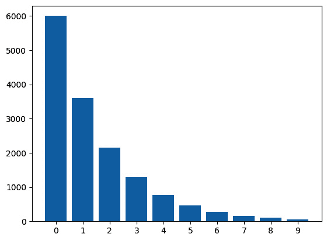

图 7.1 – 每个数字类示例计数的条形图

接下来，我们将学习如何在`PyTorch`中创建训练循环。

## 创建训练循环

在创建训练循环之前，我们应该导入`torch.nn`和`torch.optim`包。`torch.nn`包提供了创建神经网络图的全部构建块，而`torch.optim`包为我们提供了大多数常见的优化算法。

```py
import torch.nn as nn
import torch.optim as optim
```

由于我们需要一些超参数，让我们定义它们：

```py
input_size = 28 * 28 # 784
num_classes = 10
num_epochs = 20
learning_rate = 0.01
```

在设置好超参数之后，我们可以定义`train`函数，该函数将接受 PyTorch 的数据加载器作为输入，并返回一个拟合数据的模型。为了创建一个训练好的模型，我们需要一个模型、一个损失准则和一个优化器。在这里，我们将使用单层线性神经网络作为模型。你可以根据你的需求设计自己的神经网络架构。对于损失准则，我们将使用`CrossEntropyLoss`，并且我们将使用**随机梯度下降**（**SGD**）作为优化器。

我们将训练模型`num_epochs`个 epochs。我们将在下一段讨论模型在单个 epoch 中的训练过程。现在，我们将在`run_epoch`函数中抽象出这部分：

```py
def train(trainloader):
    model = nn.Linear(input_size, num_classes)
    criterion = nn.CrossEntropyLoss()
    optimizer = optim.SGD(model.parameters(), learning_rate)
    for epoch in range(num_epochs):
        run_epoch(trainloader, model, criterion, optimizer, \
            total_step, epoch)
    return model
```

在每个 epoch 期间，我们将对整个训练数据进行一次模型训练。如前所述，数据加载器将数据分成多个批次。首先，我们必须将批次中图像的形状与模型的输入维度相匹配。我们将对当前批次进行前向传递，一次计算预测和预测的损失。然后，我们将损失反向传播以更新模型权重：

```py
def run_epoch(
    trainloader, model, criterion, optimizer, total_step, epoch
):
    for i, (images, labels) in enumerate(trainloader):
        # Reshape images to (batch_size, input_size)
        images = images.reshape(-1, input_size)
        # Forward pass
        outputs = model(images)
        loss = criterion(outputs, torch.tensor(labels))
        # Backward and optimize
        optimizer.zero_grad()
        loss.backward()
        optimizer.step()
```

要获得一个训练好的模型，我们现在可以将数据加载器发送到`train`函数：

```py
model = train(imbalanced_train_loader)
```

在本章的所有与图像相关的方法中，我们将使用下面详细说明的模型代码。我们将创建一个名为`Net`的`PyTorch`神经网络，它具有两个卷积层、一个 dropout 机制和一对全连接层。通过`forward`函数，模型使用`ReLU`激活和最大池化无缝集成这些层，操作输入`x`。结果是计算输出的`log_softmax`：

```py
class Net(torch.nn.Module):
    def __init__(self):
        super(Net, self).__init__()
        self.conv1 = torch.nn.Conv2d(1, 10, kernel_size=5)
        self.conv2 = torch.nn.Conv2d(10, 20, kernel_size=5)
        self.conv2_drop = torch.nn.Dropout2d()
        self.fc1 = torch.nn.Linear(320, 50)
        self.fc2 = torch.nn.Linear(50, 10)
    def forward(self, x):
        x = F.relu(F.max_pool2d(self.conv1(x), 2))
        x = F.relu(F.max_pool2d(
            self.conv2_drop(self.conv2(x)),2))
        x = x.view(-1, 320)
        x = F.relu(self.fc1(x))
        x = F.dropout(x, training=self.training)
        x = self.fc2(x)
        return F.log_softmax(x, dim=1)
```

接下来，让我们分解一些这些术语：

+   在`Net`类中，有两个这样的层——`conv1`和`conv2`。数字`(1, 10)`和`(10, 20)`仅仅是输入和输出通道。术语`kernel_size=5`意味着使用一个 5 x 5 的网格（或过滤器）来扫描输入。

+   `conv2_drop`是一个类型为`Dropout2d`的 dropout 层，专门设计用于 2D 数据（如图像）。

+   `fc1`和`fc2`，它们进一步处理卷积层识别出的模式，以进行预测。

+   `F.relu`是一个激活函数，它向模型引入非线性，使其能够学习复杂的模式

+   `F.max_pool2d`是一个池化函数，它在保留重要特征的同时减少了数据的空间维度

+   最后，`F.log_softmax`是一个常用于分类任务的激活函数，用于为每个类别生成概率。

从本质上讲，`Net`类定义了一个神经网络，它首先使用卷积层在数据中检测模式，使用 dropout 减少过拟合，然后使用全连接层进行预测。前向方法是一系列操作，定义了数据如何通过这个网络流动。

在下一节中，我们将学习如何使用 oversampling 方法与`train`函数一起使用。

# 深度学习模型的采样技术

在本节中，我们将探讨一些采样方法，例如随机过采样和加权采样，用于深度学习模型。然后我们将过渡到数据增强技术，这些技术可以增强模型鲁棒性并减轻数据集的限制。虽然大型数据集对于深度学习来说是理想的，但现实世界的限制往往使得它们难以获得。我们还将探讨一些高级增强技术，如 CutMix 和 MixUp。我们将从标准方法开始，然后讨论这些高级技术。

## 随机过采样

在这里，我们将应用我们在*第二章*，“过采样方法”中学习的简单随机过采样，但使用图像数据作为神经网络的输入。基本思想是随机复制少数类的样本，直到每个类别的样本数量相等。这种技术通常比不采样表现得更好。

小贴士

确保训练模型足够多的轮次，以便它已经完全拟合到数据上。欠拟合可能会导致模型性能不佳。

让我们花些时间来处理代码。我们需要遵循几个简单的步骤。首先，我们需要将数据加载器中的数据转换为张量。我们的`imbalanced-learn`中的`RandomOverSampler` API 不能直接与数据加载器一起使用：

```py
X=torch.stack(tuple(imbalanced_train_loader.dataset.data))
y=torch.tensor(imbalanced_train_loader.dataset.targets)
```

我们还需要重塑`X`张量，以便`RandomOverSampler`可以处理二维输入，因为我们的每个图像都是一个 28 x 28 的矩阵：

```py
reshaped_X = X.reshape(X.shape[0],-1)
```

现在，我们可以从`imbalanced-learn`库中导入`RandomOverSampler`类，定义一个`oversampler`对象，并使用它重新采样我们的数据：

```py
from imblearn.over_sampling import RandomOverSampler
oversampler = RandomOverSampler()
oversampled_X, oversampled_y = oversampler.fit_resample(reshaped_X, y)
```

在重新采样数据后，我们需要将其再次重塑回原始形式：

```py
oversampled_X = oversampled_X.reshape(-1,28,28)
```

我们现在可以使用过采样数据创建一个新的数据加载器：

```py
balanced_train_dataset = copy.deepcopy(imbalanced_train_dataset)
balanced_train_dataset.targets = torch.from_numpy(oversampled_y)
balanced_train_dataset.data = torch.from_numpy(oversampled_X)
balanced_train_loader = torch.utils.data.DataLoader( \
    balanced_train_dataset, batch_size=100, shuffle=True)
```

最后，我们可以使用新的数据加载器来训练我们的模型。对于这一步，我们可以使用上一节中定义的`train`函数：

```py
balanced_data_model = train(balanced_train_loader)
```

这就是我们使用深度学习模型中的随机过采样技术所需做的所有事情。

可以使用类似的策略从`imbalanced-learn`库中的`RandomUnderSampling`进行采样。

`PyTorch`提供了一个`WeightedRandomSampler` API，它与`scikit-learn`中的`sample_weight`参数类似（在`scikit-learn`估计器的许多 fit 方法中找到，例如`RandomForestClassifier`和`LogisticRegression`），具有为训练数据集中的每个样本分配权重的类似目的。我们在*第五章*，“成本敏感学习”中对`class_weight`和`sample_weight`之间的差异进行了详细讨论。

我们可以将`weights`参数指定给`WeightedRamdomSampler`，以便它可以根据每个样本的权重自动对批次的示例进行加权。`weights`参数的值通常是数据集中各种类别的频率的倒数：

```py
class_counts = pd.Series(\
    imbalanced_train_loader.dataset.targets.numpy()).value_counts()
class_weights = 1.0/class_counts
```

`class_weights` 对于少数类标签比多数类标签更重要。让我们计算`weightedRamdomSampler`的值：

```py
weightedRandomSampler = \
    WeightedRandomSampler(weights=class_weights, \
    num_samples=len(imbalanced_train_dataset), \
    replacement=True)
weightedRandomSampler_dataloader = \
    torch.utils.data.DataLoader(imbalanced_train_dataset,\
    sampler=weightedRandomSampler, batch_size=64)
```

在下一节中，我们将学习如何动态采样数据。

## 动态采样

动态采样 [1] 是一种高级技术，可以在训练过程中自我调整采样率。它承诺根据问题的复杂性和类别不平衡进行适应，几乎不需要调整超参数。它是你武器库中另一个可以尝试的工具，尤其是在你手头有不平衡的图像数据时，看看它是否比我们在本章中讨论的其他技术给出更好的性能。

动态采样的基本思想是根据它们在特定训练迭代中与先前迭代相比的表现好坏，动态调整各种类别的采样率。如果一个类别的表现相对较差，那么在下一个迭代中该类别将被过度采样，反之亦然。

### 算法的细节

这些是动态采样的核心组件：

+   **实时数据增强**：将各种图像变换应用于每个训练批次的图像。这些变换可以是旋转、翻转、调整亮度、平移、调整对比度/颜色、噪声注入等。如前所述，这一步骤有助于减少模型过拟合并提高泛化能力。

+   **动态采样方法**：在每次迭代中，选择一个样本大小（由某个公式给出），并使用该样本大小训练一个模型。在下一个迭代中，具有较低 F1 分数的类别将以更高的比率进行采样，迫使模型更多地关注先前错误分类的示例。下一个迭代中图像的数量，c j，根据以下公式更新：

    UpdateSampleSize( F1 i, c j) =  1 − f1 i, j  _ ∑ c k∈ C 1 − f1 i,k  × N

    这里：

    +   f1 i, j 是第 i 次迭代中类 c j 的 F1 分数

    +   N = 所有类别中样本数量的平均值

对于特定的训练周期，假设我们在验证数据集上对三个类别，**A**、**B**和**C**，得到了以下 F1 分数：

| **类别** | **F1 分数** |
| --- | --- |
| A | 0.1 |
| B | 0.2 |
| C | 0.3 |

表 7.1 – 某个周期后每个类别的样本 F1 分数

这里是我们如何计算每个类别的权重以用于下一个训练周期的计算方法：

权重（类 A）=  N * (1 − f1 a)  ______________________  (1 − f1 a)+ (1 − f1 b)+ (1 − f1 c)  =  N * 0.9  _ 0.9 + 0.8 + 0.7

= N * 0.375

*（类 B 的）权重 = N* 0.8/2.4 =* *N*0.33*

*（类 C 的）权重 = N* 0.7/2.4 =* *N* 0.29*

这意味着我们将以比类 B 和类 C 更高的比率采样类 A，这是有意义的，因为类 A 的性能比类 B 和类 C 弱。

通过迁移学习训练第二个模型，不进行采样，以防止少数类过拟合。在推理时间，模型的输出是两个模型输出的函数。

由于篇幅限制，我们在此省略了关于**动态采样**算法的更多细节。您可以在本章对应的 GitHub 仓库中找到完整的实现代码。

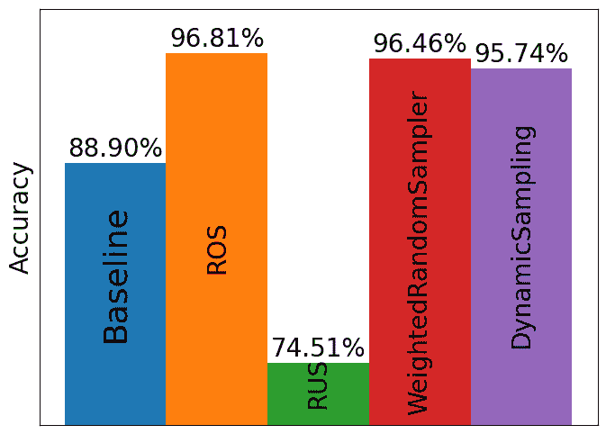

图 7.2 – 使用各种采样技术的整体模型准确率比较

*表 7.2*显示了使用各种采样技术（包括基线，其中不进行采样）的每类模型准确率。

| **类别** | **基线** | **加权随机采样器** | **动态采样器** | **随机过采样** | **随机欠采样** |
| --- | --- | --- | --- | --- | --- |
| 0 | **99.9** | 99.0 | 92.4 | 99.1 | 97.2 |
| 1 | **99.7** | 99.2 | 96.8 | 99.2 | 90.7 |
| 2 | **98.5** | 98.3 | 93.5 | **98.5** | 70.8 |
| 3 | 97.3 | 97.4 | 96.8 | **98.3** | 74.4 |
| 4 | 98.3 | 98.0 | 91.9 | **98.6** | 79.6 |
| 5 | 96.2 | 96.0 | 97.3 | **98.1** | 52.8 |
| 6 | 94.5 | 97.6 | **98.7** | 97.3 | 77.6 |
| 7 | 89.7 | 94.7 | **96.5** | 94.1 | 81.1 |
| 8 | 63.3 | 91.5 | **96.9** | 93.0 | 60.2 |
| 9 | 50.7 | 92.6 | **97.7** | 91.8 | 56.5 |

表 7.2 – 使用各种采样技术的每类模型准确率比较（类别的最高值用粗体表示）

下面是一些从结果中得到的见解：

+   在整体性能方面，**随机过采样**（**ROS**）表现最佳，而**随机欠采样**（**RUS**）表现最差。

+   虽然 ROS 表现最佳，但由于数据克隆，它可能计算成本非常高，这使得它不太适合大型数据集和工业环境。

+   动态采样比 ROS 略差；它在少数类别 6-9 上表现最佳，将是我们的首选选择。然而，由于其复杂性增加，我们的第二选择将是加权随机采样器。

+   基线和加权随机采样器技术在类别间表现稳定；RUS 在大多数类别上表现明显不稳定且表现不佳。

同样，我们可以像使用`RandomOverSampler`一样应用 SMOTE。请注意，虽然 SMOTE 可以应用于图像，但其对原始数据线性子空间的利用通常受到限制。

这结束了我们对各种采样技术的讨论。在下一节中，我们将专注于专门为图像设计的用于实现更有效过采样的数据增强技术。

## 视觉数据增强技术

现在，各种定制的增强技术被用于各种类型的数据，如图像、音频、视频，甚至文本数据。在视觉领域，这包括旋转、缩放、裁剪、模糊、向图像添加噪声以及其他许多技术，包括将这些技术一次性以适当的顺序组合在一起。图像数据增强并不是一项最近才出现的创新。例如，一些图像增强技术也可以在 1998 年的 LeNet-5 模型论文[2]中找到。同样，2012 年的 AlexNet 模型[3]使用随机裁剪、翻转、改变 RGB 通道的颜色强度等方法来减少模型训练过程中的错误。

让我们讨论一下为什么数据增强通常很有帮助：

+   在我们数据有限或不平衡的问题中，并不总是能够收集到更多的数据。这可能是因为收集更多数据本身就很困难（例如，在处理信用卡欺诈时等待更多欺诈发生，或者收集卫星图像，我们必须支付卫星运营商的费用，这可能相当昂贵）或者标记数据很困难或昂贵（例如，为了标记医学图像数据集，我们需要领域专家）。

+   数据增强可以帮助减少过拟合并提高模型的总体性能。这种做法的一个动机是，训练集中的属性如光照、噪声、颜色、比例和焦点可能与我们运行推理的真实世界图像中的属性不一致。此外，增强多样化数据集可以帮助模型更好地泛化。例如，如果模型仅在面向右的猫的图像上训练，它可能在面向左的猫的图像上表现不佳。因此，始终应用有效的变换来增强图像数据集是明智的，因为大多数模型在更多样化的数据上都能获得性能提升。

数据增强在计算机视觉任务中如目标检测、分类和分割等方面被广泛使用。它对于自然语言处理任务也非常有用。在计算机视觉领域，有许多开源库帮助标准化各种图像增强技术，而数据增强在自然语言处理工具方面尚未成熟。

虽然有几个流行的开源库用于图像增强，如 `imgaug`、Facebook 的 `AugLy` 和 `Albumentations`，但在这本书中我们将使用 `torchvision`。作为 PyTorch 生态系统的一部分，它提供了与 PyTorch 工作流程的无缝集成、一系列常见的图像变换、以及预训练模型和数据集，使其成为计算机视觉任务的方便且全面的选项。如果您需要更高级的增强，或者如果速度是一个关注点，`Albumentations` 可能是一个更好的选择。

我们可以使用 `torchvision.transforms.Pad` 来向图像边界添加一些填充：

```py
padded_imgs = [torchvision.transforms.Pad(padding=90)(orig_img)]
plot(padded_imgs)
```


图 7.3 – 应用 Pad 函数到图像的结果

`torchvision.transforms.FiveCrop`类将给定的图像转换并裁剪成四个角落和中央部分：

```py
(top_left, top_right, bottom_left, bottom_right, center) =\
    torchvision.transforms.FiveCrop(size=(100,100))(orig_img)
plot([top_left, top_right, bottom_left, bottom_right, center])
```

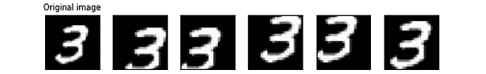

图 7.4 – 应用 FiveCrop 函数到图像的结果

`torchvision.transforms.CenterCrop`是一个类似的类，用于从中心裁剪图像。

`torchvision.transforms.ColorJitter`类会改变图像的亮度、饱和度和其他类似属性：

```py
jitter = torchvision.transforms.ColorJitter(brightness=.7, hue=.5)
jitted_imgs = [jitter(orig_img) for _ in range(3)]
plot(jitted_imgs)
```

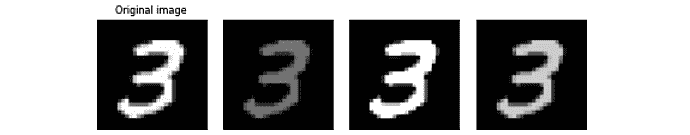

图 7.5 – 应用 ColorJitter 函数到图像的结果

`GaussianBlur`可以为图像添加一些模糊效果：

```py
gaussian_blurrer = \
    torchvision.transforms.GaussianBlur(kernel_size=(9,\
    11), sigma=(0.1, 5))
blurred_imgs = [gaussian_blurrer(orig_img) for _ in \
    range(4)]
plot(blurred_imgs)
```

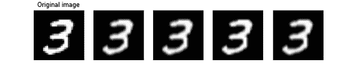

图 7.6 – 应用高斯模糊函数到图像的结果

`torchvision.transforms.RandomRotation`类可以将图像随机旋转一个角度：

```py
rotater = torchvision.transforms.RandomRotation(degrees=(0, 50))
rotated_imgs = [rotater(orig_img) for _ in range(4)]
plot(rotated_imgs)
```

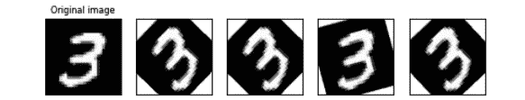

图 7.7 – 对原始图像（最左侧）进行随机旋转的结果

考虑探索`torchvision.transforms`类支持的其它图像变换功能，这些功能我们在这里没有讨论。

在训练过程中，Cutout 会随机遮盖输入图像的随机正方形区域。虽然这种技术看起来像是移除了图像中不必要的部分，但重要的是要注意，要被遮盖的区域通常是随机选择的。主要目的是通过确保神经网络不过度依赖给定图像中的任何特定像素集，来强迫神经网络更好地泛化。

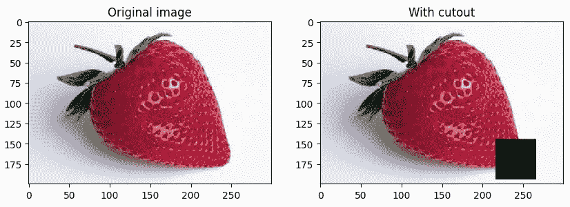

图 7.8 – 应用 cutout 函数到图像的结果

🚀 Etsy/Booking/Wayfair 在生产中应用深度学习数据级技术

**🎯** **问题解决：**

Etsy、[Booking.com](http://Booking.com)和 Wayfair 利用用户行为来增强个性化。Etsy 专注于基于浏览历史的商品推荐[4]，[Booking.com](http://Booking.com)定制搜索结果以增加预订[5]，而 Wayfair 优化产品图像角度以提高点击率[6]。所有这些都是为了利用数据驱动策略，以改善用户体验和性能。

**⚖️** **数据不平衡问题：**

Etsy、[Booking.com](http://Booking.com)和 Wayfair 在他们的机器学习项目中都遇到了数据不平衡问题。Etsy 面临用户会话的幂律分布，其中大多数用户在一小时窗口内只与几个商品列表互动。[Booking.com](http://Booking.com)处理酒店图像中的不平衡类别，卧室和浴室的照片远远多于其他设施如桑拿或乒乓球的照片。Wayfair 遇到了家具真实世界图像的不平衡，大多数图像显示“正面”角度，导致其他角度的性能不佳。这三家公司都必须解决这些不平衡问题，以提高模型性能和公平性。

**🎨** **数据增强策略：**

Etsy、[Booking.com](http://Booking.com)和 Wayfair 各自采用了独特的数据增强策略来解决他们各自的挑战。Etsy 使用了图像随机旋转、平移、缩放和颜色对比度变换来增强他们的数据集。[Booking.com](http://Booking.com)采用了包括镜像、随机裁剪、仿射变换、纵横比扭曲、颜色操作和对比度增强在内的各种技术。他们通过这些方法将标记数据增加了 10 倍，在训练过程中实时应用扭曲。Wayfair 通过创建 3D 模型生成的合成数据采取了不同的方法，为椅子和沙发的每个 3D 模型生成 100 个视图，从而为训练提供了细粒度的角度信息。

接下来，让我们看看一些更高级的技术，例如 CutMix、MixUp 和 AugMix，这些都是**混合样本数据增强**（**MSDA**）技术的类型。

MSDA 是一组涉及混合数据样本以生成增强数据集的技术，用于训练模型（*图 7**.9*）。

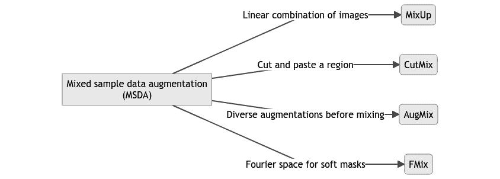

图 7.9 – 常见的 MSDA 技术

### CutMix

CutMix [7]是一种图像数据增强技术，其中在训练图像之间剪切和粘贴补丁。具体来说，图像的一部分被另一图像的一部分所取代，如下所示：

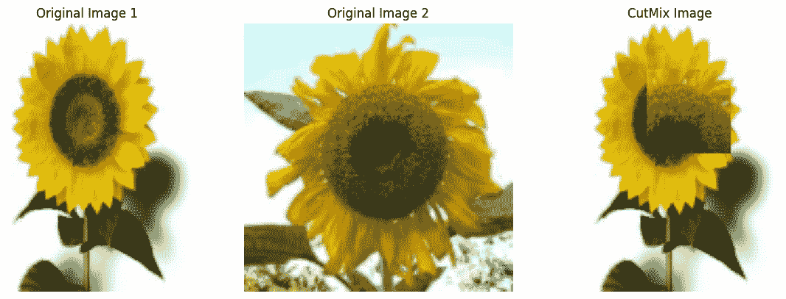

图 7.10 – 将 CutMix 函数应用于图像的结果（图像 1 和图像 2）

它旨在鼓励模型做出更多局部化、细粒度的预测，从而提高整体泛化能力。CutMix 还强制在混合区域外进行一致的预测，进一步增强了模型的鲁棒性。

`torchvision`还提供了内置的 CutMix API，`torchvision.transforms.v2.CutMix`，因此我们不必从头实现它。

从零开始实现的 CutMix 完整笔记本可以在 GitHub 仓库中找到。

CutMix 在基准数据集（如 CIFAR-10、CIFAR-100 和 ImageNet [7]）上通常比传统的增强技术有改进。

### MixUp

MixUp [8]通过形成输入及其对应标签的成对组合来创建虚拟训练示例。

如果(x i, y i)和(x j, y j)是数据集 D 中的任意一对图像，其中 x 是图像，y 是其标签，则可以使用以下方程生成混合样本~x ,  ~y ：

~ x  = λ x i + (1 − λ) x j

~ y  = λ y i + (1 − λ) y j

其中λ是从 Beta 分布中采样的混合因子。Beta 分布是一种灵活的、在区间[0, 1]上定义的连续概率分布。

MixUp 充当正则化器，防止过拟合并增强模型的泛化能力。以下实现通过从 Beta 分布中采样的值进行数据集和目标的洗牌，然后使用加权平均结合它们，从而创建用于增强的混合数据和目标：

```py
def mixup(data, target, alpha):
    indices = torch.randperm(data.size(0))
    shuffled_data = data[indices]
    shuffled_target = target[indices]
    lamda = np.random.beta(alpha, alpha)
    data = lamda * data + (1 - lamda) * shuffled_data
    target = lamda * target + (1 - lamda) * shuffled_target
    return data, target
```

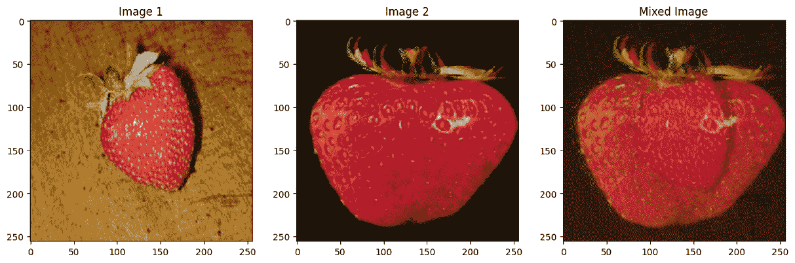

图 7.11 – 应用 MixUp 于图像（图像 1 和图像 2）的结果

在 CIFAR-100 等数据集上，MixUp 被发现与未使用 MixUp 训练的模型相比，在测试精度上提供了显著的提升[8]。

与 CutMix 类似，`torchvision`提供了一个名为`torchvision.transforms.v2.MixUp`的内置 API，消除了手动实现的需求。

### AugMix

我们迄今为止研究过的增强技术都是固定的增强，但深度学习模型可以记住它们[9]，并且它们的性能可能会达到平台期。这就是 AugMix[10]可以发挥作用的地方，因为它通过执行一系列随机增强来生成一组多样化的增强图像。

AugMix 在不改变模型架构的情况下提高了模型的鲁棒性和不确定性。完整的 AugMix 算法还使用了一种特殊的损失函数，但为了简单起见，我们将跳过这一点。

以下代码展示了 AugMix 核心逻辑的简化版本：

```py
from torchvision.transforms import transforms
def simple_augmix(image):
    # Our box of magic tricks
    magic_tricks = [
        transforms.RandomHorizontalFlip(),
        transforms.RandomAffine(degrees=30)
        # other transforms here
    ]
    # Pick a random number of tricks to use
    num_tricks = np.random.randint(0, len(magic_tricks) + 1)
    # Create a new picture by mixing transformed ones
    new_picture = torch.zeros_like(image)
    # Let's use 4 mixed images for our example
    for _ in range(4):
        transformed_picture = image.clone()
        for _ in range(num_tricks):
            trick = np.random.choice(magic_tricks)
            transformed_picture = trick(transformed_picture)
            # Add the transformed picture to our new picture
            new_picture += (1/4) * transformed_picture
    return new_picture
```

在函数的末尾，我们通过为四个转换图像中的每一个使用相等权重来组合图像。实际的 AugMix 实现使用 Dirichlet 分布函数来组合图像。Dirichlet 分布是我们在 MixUp 技术中看到的贝塔分布的推广。

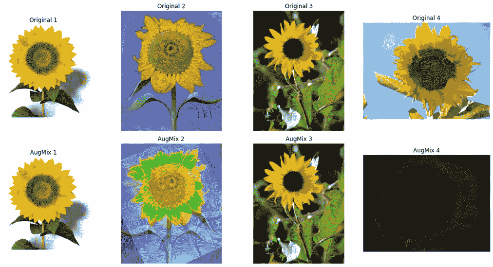

图 7.12 – 将 Augmix 函数应用于四幅不同图像的结果

在*图 7**.12 中，顶部行显示原始图像，而底部行显示应用 AugMix 的结果。图像 1 和 3 似乎没有变化，但图像 2 和 4 有明显的改变。

根据 AugMix 论文[10]的描述，在 ImageNet 和 CIFAR 的实验中，AugMix 实现了减少测试误差的同时，提高了对损坏的鲁棒性。

我们不需要从头开始创建 AugMix，因为`torchvision`提供了一个名为`torchvision.transforms.AugMix`的内置 API 来完成这个目的。

### Remix

标准数据增强技术，如 MixUp 和 CutMix，可能不足以处理类别不平衡，因为它们没有考虑类别标签的分布。Remix[11]解决了在类别不平衡数据集上训练深度学习模型的挑战。

MixUp 和 CutMix 使用相同的混合因子在特征空间和标签空间中结合样本。在处理不平衡数据的情况下，Remix 论文[11]的作者们认为这种方法可能不是最优的。因此，他们提出了将混合因子分开，以便在应用中提供更大的灵活性。通过这样做，可以给少数类分配更大的权重，从而创建出更有利于代表性不足的类的标签。

如果(xi, yi; xi, yj)是数据集 D 中的任意一对图像，可以使用以下方程生成混合样本 xRM，y RM：

x RM = λxxi + (1 − λx)xj

y RM = λyyi + (1 − λy)yj

λx 和λy 是从贝塔分布中采样的混合因子。

这里是一个简化的实现：

```py
def remix_data(inputs, labels, class_counts, alpha=1.0):
    lambda_x = np.random.beta(alpha, alpha) if alpha > 0 else 1
    # Constants for controlling the remixing conditions.
    K = 3
    tau = 0.5
    # Shuffle the indices randomly.
    random_indices = torch.randperm(inputs.size()[0])
    # Determine lambda_y values based on class counts and lambda_x.
    lambda_y_values = []
    for i, j in enumerate(random_indices):
        class_count_ratio = (
            class_counts[labels[i]] / class_counts[labels[j]]
        )
        if class_count_ratio >= K and lambda_x < tau:
            lambda_y_values.append(0)
        else:
            lambda_y_values.append(lambda_x)
    lambda_y = torch.tensor(lambda_y_values)
    # Mix inputs, labels based on lambda_x, lambda_y, and shuffled indices.
    mixed_inputs = (
        lambda_x * inputs + (1 - lambda_x) * inputs[random_indices, :]
    )
    mixed_labels = (
        lambda_y * labels + (1 - lambda_y) * labels[random_indices]
    )
    return mixed_inputs, mixed_labels
```

### 结合先前技术

可以将这些方法结合起来，为训练数据引入更多的多样性，例如以下内容：

+   **CutMix 和 MixUp**：这些可以交替使用或同时使用，在图像中创建被其他图像的部分替换的区域，同时像素级混合图像

+   **顺序**：您可以顺序应用这些技术（例如，首先使用 MixUp 然后使用 CutMix）以进一步多样化增强数据集

当结合这些方法时，重要的是要仔细管理每种方法的概率和强度，从而避免引入过多的噪声或使训练数据与原始分布差异过大。

此外，虽然结合这些方法可能在某些情况下提高模型的鲁棒性和泛化能力，但它也可能使训练更加计算密集和复杂。权衡利弊是至关重要的。

记住，始终在验证集上验证结合增强的有效性，以确保它们对当前任务有益。

让我们使用名为 Fashion-MNIST 的不同数据集的尾部版本来讨论我们刚才讨论的技术（*图 7.13*）。Fashion-MNIST 是 MNIST 的另一个变体，包含 60,000 个训练图像和 10,000 个测试图像，共有 10 种不同的服装项目，如鞋子、衬衫和连衣裙，每个项目都以 28x28 像素的灰度图像表示。

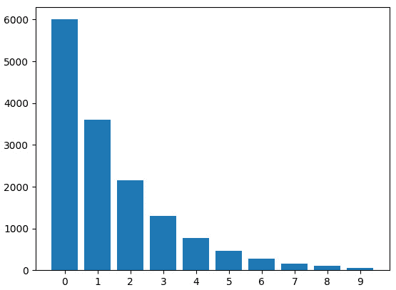

图 7.13 – 不平衡的 FashionMNIST

*图 7.14*显示了在 FashionMNIST 不平衡数据集上使用 CutMix、MixUp、两者组合以及 Remix 训练时的整体模型准确率。

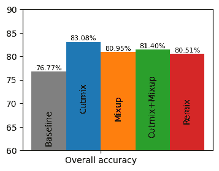

图 7.14 – 整体模型准确率（FashionMNIST）

当查看按类别准确率数字时，这些技术的性能差异更为明显（*图 7.15*）。

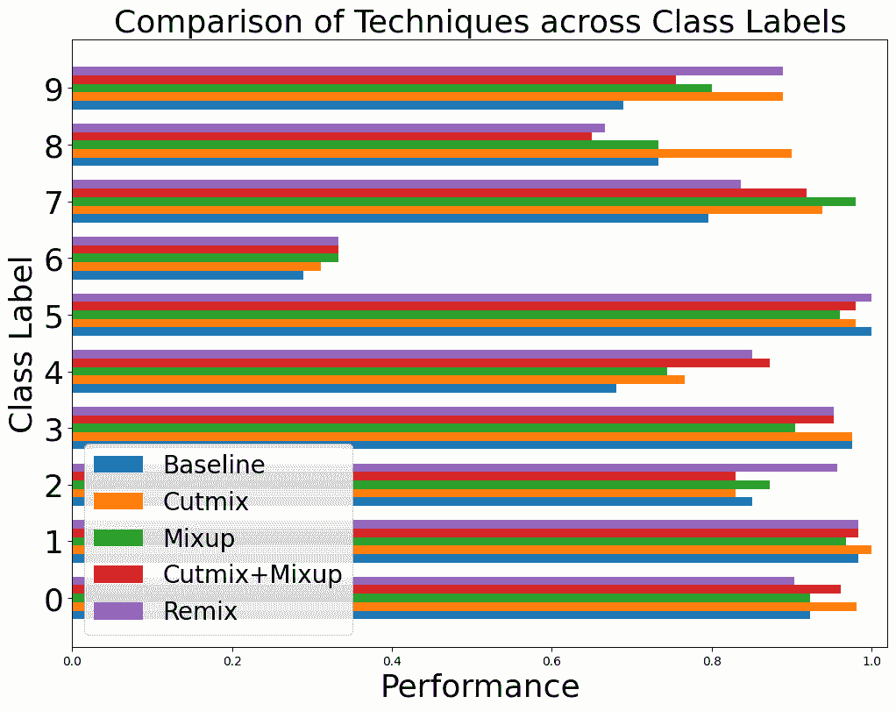

图 7.15 – 按类别模型准确率（FashionMNIST 数据集）

根据给定数据，以下是一些关于各种技术的见解，特别是在不平衡数据的情况下：

+   **整体性能**：**Cutmix**和**Remix**在大多数类别中通常提供最高的性能，其次是**Mixup**和**Cutmix+Mixup**。**基线**似乎在总体上效果最差。

+   **少数类别的性能**：对于标记为“6”的少数类别，所有技术与其他类别相比都表现出相对较低的性能。然而，**Mixup**和**Cutmix+Mixup**在基线之上提供了一点点改进。

+   **类别间的一致性**：**Cutmix**和**Mixup**在不同类别间更为一致，除了类别“6”，在那里它们仅略有改进。另一方面，**基线**显示出显著的变异性，在某些类别（如“0”和“5”）上表现极好，但在其他类别（如“6”）上表现较差。

+   **适用于特定类别的技术**：**Cutmix**在标记为“1”和“8”的类别中表现出色，在这些类别中它优于所有其他技术。

    **Remix**在标记为“2”的类别中特别强大，它超越了所有其他技术。

+   **复杂性与收益**：**Cutmix+Mixup**与**Cutmix**或**Mixup**单独使用相比，并没有带来显著的改进，这引发了额外的计算复杂性是否合理的疑问。

+   **泛化性**：**Cutmix**和**Mixup**似乎是最稳健的技术，在大多数类别中表现出高性能。这些技术在未见过的数据上可能表现良好，并且对于不平衡数据集可能是好的选择。

+   **权衡**：**Cutmix**提供了高性能，但可能不是对少数类别最好的选择。**Mixup**虽然整体上略逊一筹，但在各个类别，包括少数类别中提供了更平衡的性能。

在执行这些图像增强时需要注意以下一些点：

+   我们必须确保数据增强保留原始标签。例如，旋转数字如 6 和 9 在数字识别任务中可能会出现问题。同样，裁剪图像可能会使其标签无效，例如从“猫”图像中移除猫。这在复杂任务中尤为重要，例如在自动驾驶汽车中的图像分割任务，增强可能会改变输出标签或掩码。

+   虽然几何和颜色变换通常会增加内存使用和训练时间，但它们本身并不是问题。尽管颜色变化有时会去除重要细节并影响标签完整性，但智能操作也可能有益。例如，调整颜色空间以模拟不同的光照或相机镜头可以提高模型性能。

为了克服一些增加的内存、时间和成本问题，如前所述，PyTorch 中有一个名为`AutoAugment`的技术，可以在使用的数据集上自动搜索最佳的增强策略。

🚀 Grab 在生产中使用的深度学习数据级技术

**🎯** **解决的问题**：

Grab 是一家位于东南亚的打车和食品配送公司，面临着匿名化用于其地理标记图像平台 KartaView [12]中收集的图像中的人脸和车牌的主要挑战。这是确保用户隐私所必需的。

**⚖️** **数据不平衡问题**：

Grab 使用的数据集不平衡，特别是在物体大小方面。较大的感兴趣区域，如面部特写或车牌，代表性不足。这种分布偏差导致模型在检测这些较大物体时性能不佳。

**🎨** **数据增强策略**：

Grab 采用了多角度的数据增强方法来解决不平衡问题：

• **离线增强**：他们使用的关键方法之一是“图像视图分割”，即将每个原始图像分割成多个具有预定义属性的“视图”。这对于适应不同类型的图像，如透视、宽视野和 360 度等距图像至关重要。每个“视图”都被视为一个单独的图像，具有其标签，这有助于模型更好地泛化。他们还实施了过采样，以解决具有较大标签的图像数据集中的不平衡。这对于他们的基于锚点的目标检测模型至关重要，因为不平衡正在影响模型识别较大对象的表现。

• **在线增强**：他们使用了 YOLOv4 进行目标检测，这允许进行各种在线增强，如饱和度、曝光、色调、翻转和马赛克。

近期，现代技术如自动编码器和对抗网络，特别是**生成对抗网络**（**GANs**），在创建合成数据以增强图像数据集方面取得了显著进展。GAN 由两个神经网络组成——生成器，它生成合成数据，和判别器，它评估这些数据的真实性。它们共同工作以创建逼真且高质量的合成样本。GANs 也被应用于生成合成表格数据。例如，它们被用于创建合成医学图像，这显著提高了诊断模型。我们将在本章末尾更详细地探讨这些尖端技术。在下一节中，我们将学习如何将数据级别技术应用于 NLP 问题。

# 文本分类的数据级别技术

数据不平衡，即数据集中某些类别代表性不足，不仅限于图像或结构化数据领域的问题。在 NLP 中，不平衡的数据集可能导致模型在大多数类别上表现良好，但很可能错误分类代表性不足的类别。为了应对这一挑战，已经设计了多种策略。

在 NLP 中，数据增强可以提高模型性能，尤其是在训练数据有限的情况下。*表 7.3*对文本数据的不同数据增强技术进行了分类：

| **级别** | **方法** | **描述** | **示例技术** |
| --- | --- | --- | --- |
| 字符级别 | 噪声 | 在字符级别引入随机性 | 字符打乱 |
| 基于规则的 | 基于预定义规则的转换 | 大小写 |
| 词级别 | 噪声 | 随机更改单词 | “cat”到“dog” |
| 同义词 | 用同义词替换单词 | “happy”到“joyful” |
| 嵌入 | 使用词嵌入进行替换 | “king”到“monarch” |
| 语言模型 | 利用高级语言模型进行单词替换 | BERT |
| 短语级别 | 结构 | 改变短语的结构 | 改变单词顺序 |
| 插值 | 合并两个短语的特性 | “The cat sat” + “The dog barked” = “The cat barked” |
| 文档级别 | 翻译 | 将文档翻译成另一种语言再翻译回原文 | 英文到法文再到英文 |
| 生成式 | 使用模型生成新内容 | GPT-3 |

表 7.3 – 不同数据增强方法的分类（改编自[13]）

文本数据增强技术可以根据字符、单词、短语和文档级别进行分类。这些技术从字符打乱到使用 BERT 和 GPT-3 等模型，这一分类法引导我们了解 NLP 数据增强方法。

*表 7.3* 展示了在 NLP 中使用的各种数据增强方法。我们将根据数据操作的水平来分解这些方法——字符、单词、短语和文档。每个级别都有其独特的方法集，例如在字符级别引入“噪声”或在单词级别利用“语言模型”。这些方法不仅仅是随机变换；它们通常被精心设计，以在引入可变性同时保留文本的语义意义。

使这种分类与众不同的特点是它的多层次方法，这允许更精确地应用数据增强方法。例如，如果你处理的是短文本片段，字符或单词级别的方法可能更合适。另一方面，如果你处理的是较长的文档或需要生成全新的内容，那么文档级别的“生成”技术等方法就派上用场。

在接下来的章节中，我们将探讨一个不平衡的文本分类数据集，并使用它来展示各种数据增强技术。这些方法旨在合成额外的数据，从而增强模型从不平衡信息中学习和泛化的能力。

## 数据集和基线模型

让我们以 Kaggle 上可用的垃圾邮件文本消息分类数据集为例（[`www.kaggle.com/datasets/team-ai/spam-text-message-classification`](https://www.kaggle.com/datasets/team-ai/spam-text-message-classification)）。这个数据集主要用于区分垃圾邮件和合法消息，存在不平衡，大多数是“ham”（合法）消息，少数是“spam”（垃圾）消息。这里省略代码以节省空间。你可以在 GitHub 仓库中找到名为`Data_level_techniques_NLP.ipynb`的笔记本。

使用基线模型，我们得到了以下结果：

```py
               precision     recall     f1-score     support
ham               0.97        1.00        0.98        1216
spam              0.97        0.80        0.88         177
accuracy                                  0.97        1393
macro avg         0.97        0.90        0.93        1393
weighted avg      0.97        0.97        0.97        1393
```

### 随机过采样

处理数据不平衡的一个基本技术是随机过采样，即复制少数类的实例以平衡类别分布。虽然这种方法易于实现并且通常显示出改进的性能，但必须警惕过拟合：

```py
               precision     recall     f1-score     support
ham               0.99        0.99        0.99        1216
spam              0.93        0.91        0.92         177
accuracy                                  0.98        1393
macro avg         0.96        0.95        0.95        1393
weighted avg      0.98        0.98        0.98        1393
```

随机过采样在整体准确率上略有提升，从 0.97 上升到 0.98。最显著的提升是在`spam`类别的召回率上，从 0.80 上升到 0.91，表明对垃圾邮件消息的识别能力更好。然而，`spam`的精确度略有下降，从 0.97 下降到 0.93。

宏观平均 F1 分数也从 0.93 提高到 0.95，这表明模型现在在处理两个类别（`ham`和`spam`）方面更加均衡。加权平均指标仍然强劲，进一步证实了模型的整体性能得到了提升，而没有牺牲其正确分类大多数类别（`ham`）的能力。

类似地，欠采样可以用来减少大多数类别的规模，特别是通过消除完全重复的句子。例如，你可能不需要 500 个“非常感谢！”的副本。然而，具有相似语义但措辞不同的句子，如“非常感谢！”和“非常感谢！”，通常应该保留。可以使用字符串匹配等方法识别完全重复的句子，而具有相似意义的句子可以使用余弦相似度或句子嵌入的 Jaccard 相似度来检测。

🚀 Cloudflare 在生产环境中应用深度学习数据级技术

**🎯** **待解决的问题**:

Cloudflare [14] 旨在增强其 **Web 应用防火墙**（**WAF**），以更好地识别恶意 HTTP 请求并防范常见的攻击，如 SQL 注入和**跨站脚本**（**XSS**）。

**⚖️** **数据不平衡问题**:

由于严格的隐私法规和缺乏恶意 HTTP 请求的标记数据，创建高质量的训练 WAF 模型的数据库很困难。样本的异质性也带来了挑战，因为请求以各种格式和编码方式到来。对于特定类型的攻击，样本严重不足，导致数据集不平衡，增加了假阳性或假阴性的风险。

**🎨** **数据增强策略**:

为了解决这个问题，Cloudflare 采用了数据增强和生成技术的组合。这包括以各种方式变异良性内容，生成伪随机噪声样本，以及使用语言模型进行合成数据创建。重点是增加负样本的多样性，同时保持内容的完整性，从而迫使模型考虑更广泛的结构、语义和统计特性，以实现更好的分类。

🚀 **模型部署**:

他们使用的模型在采用这些数据增强技术后显著改进，增强后的 F1 分数达到了 0.99，而增强前的 F1 分数为 0.61。该模型已通过 Cloudflare 基于签名的 WAF 进行验证，发现其性能相当，因此可以用于生产。

## 文档级增强

在文档级增强中，整个文档被修改以创建新的示例，以保留文档的更广泛语义上下文或叙事流程。其中一种技术是反向翻译。

### 反向翻译

反向翻译涉及将一个句子翻译成另一种语言，然后再将其翻译回原文（*图 7**.16*）。这会产生与原文在句法上不同但语义上相似的句子，提供了一种增强形式。


图 7.16 – 反向翻译技术的演示

我们生成反向翻译的文本并将其附加到原始数据集上。然后，我们使用完整的数据集来训练逻辑回归模型。请注意，这可能是一个耗时的过程，因为翻译模型的二进制文件资源密集。它还可能引入错误，因为某些单词可能无法在语言之间精确翻译。在 GitHub 笔记本中，我们使用了`nlpaug`库中的`BackTranslationAug` API [15]。

以下结果展示了测试集上的分类指标。垃圾邮件类别的精确度相较于随机过采样技术有所提升，而召回率略有下降：

```py
               precision     recall     f1-score     support
ham               0.98        1.00        0.99        1216
spam              0.96        0.86        0.91         177
accuracy                                  0.98        1393
macro avg         0.97        0.93        0.95        1393
weighted avg      0.98        0.98        0.98        1393
```

反向翻译保持了整体准确率 0.98，与随机过采样相似。它略微提高了`垃圾邮件`的精确度至 0.96，但将召回率降低至 0.86。两种方法都优于基线，反向翻译在`垃圾邮件`类别中更倾向于精确度而非召回率。

## 字符和词级增强

让我们简要回顾一下可以应用于 NLP 问题的几个字符和词级增强技术。

### 简易数据增强技术

**简易数据增强**（**EDA**）是一套针对文本数据特定的数据增强技术。它包括诸如同义词替换、随机插入、随机交换和随机删除等简单操作。这些操作简单，确保增强后的数据仍然具有意义。以下表格展示了在数据集上使用 EDA 时的各种指标：

```py
               precision     recall      f1-score    support
ham               0.98        0.99        0.99        1216
spam              0.96        0.88        0.91         177
accuracy                                  0.98        1393
macro avg         0.97        0.93        0.95        1393
weighted avg      0.98        0.98        0.98        1393
```

应用 EDA 后，模型保持了整体准确率 0.98，与随机过采样和反向翻译一致。`垃圾邮件`的精确度很高，为 0.96，与反向翻译相似，而召回率略好于反向翻译的 0.86。宏平均和加权平均分别保持在 0.95 和 0.98。

EDA 在`垃圾邮件`类别的精确度和召回率上提供了平衡的改进，使其成为我们尝试过的数据增强技术中的有力竞争者。

|  | **精确度** | **召回率** | **F1 分数** | **准确度** |
| --- | --- | --- | --- | --- |
| 基线模型 | **0.97** | 0.80 | 0.88 | 0.97 |
| 随机过采样 | 0.93 | **0.91** | **0.92** | **0.98** |
| 反向翻译 | 0.96 | 0.86 | 0.91 | **0.98** |
| EDA | 0.96 | 0.88 | 0.91 | **0.98** |

表 7.4 – 比较各种 NLP 数据级技术对垃圾邮件类别的结果（每个指标的最大值以粗体显示）

总体而言，如*表 7.4*所示，对于我们的数据集，随机过采样在`垃圾邮件`的召回率方面表现优异，但略微降低了精确度。反向翻译在略微牺牲召回率的同时提高了精确度。EDA 在两者方面都提供了平衡的改进。需要注意的是，这些结果是经验性的，并且特定于用于此分析的数据集。数据增强技术可能会产生不同的结果，这取决于数据的性质、其分布以及所解决的问题。因此，虽然这些技术在当前背景下显示出希望，但它们在不同数据集或 NLP 任务中的应用效果可能会有所不同。

由于篇幅限制，本书将不会涵盖短语级增强技术，但我们建议您自行探索。

接下来，我们将从高层次上查看一些其他的数据级深度学习技术。

# 其他数据级深度学习方法和其关键思想的讨论

除了之前讨论的方法之外，还有一系列专门设计来处理不平衡数据挑战的其他技术。本节提供了这些替代方法的概述，每个方法都提供了独特的见解和潜在优势。虽然我们只会触及它们的关键思想，但我们鼓励您深入研究文献，并在发现这些技术有趣时进一步探索。

## 两阶段学习

两阶段学习[16][17]是一种旨在在不损害多数类性能的情况下，提高多类分类问题中少数类性能的技术。该过程涉及两个训练阶段：

1.  在第一阶段，首先在平衡每个类别的数据集上训练一个深度学习模型。平衡可以通过使用随机过采样或欠采样等技术来实现。

1.  在第二阶段，我们冻结所有层除了最后一层，然后使用整个数据集对模型进行微调。

第一阶段确保所有层都在平衡数据集上训练。第二阶段通过使用整个数据集重新训练最后一层来校准输出概率，反映了原始不平衡的类别分布。

两个阶段的顺序可以颠倒——也就是说，第一个模型在完整的不平衡数据上训练，然后在第二阶段在平衡数据集上进行微调。这被称为**延迟采样**，因为采样是在之后进行的。

## 扩展过采样

由 Damien Dablain 等人[18]在论文中引入的**扩展过采样**（**EOS**）是另一种在三个阶段的 CNN 训练框架中使用的数据增强技术，旨在处理不平衡数据。它可以被认为是结合了两阶段学习和数据增强技术。

EOS 通过在嵌入空间中少数类样本及其最近的“敌人”之间创建合成训练实例来工作。术语“最近的敌人”指的是在特征空间中与给定实例最接近的其他类别的实例。通过这种方式创建合成实例，EOS 旨在减少泛化差距，对于少数类来说，这个差距更大。

论文的作者[18]声称，这种方法比常见的平衡学习技术提高了准确性和效率，需要更少的参数和更少的训练时间。

## 使用生成模型进行过采样

生成模型，包括 GANs、**变分自编码器**（**VAEs**）、扩散模型及其衍生品，如 StyleGAN、StyleGAN2 和基于 GPT 的模型，已成为生成类似于训练数据的数据点的突出工具。

VAEs（变分自编码器），一种特定的生成模型，由一个编码器和一个解码器组成，它们协同工作以创建新的数据实例，例如逼真的图像，并且可以用于平衡不平衡的数据集。在 MNIST 长尾版本上，我们通过使用增强的 VAE 模型与基线模型相比，在最不平衡的类别上获得了相当的性能提升。*图 7.17*显示了 50 个 epoch 后的性能比较。您可以在 GitHub 仓库的相应章节中找到笔记本。

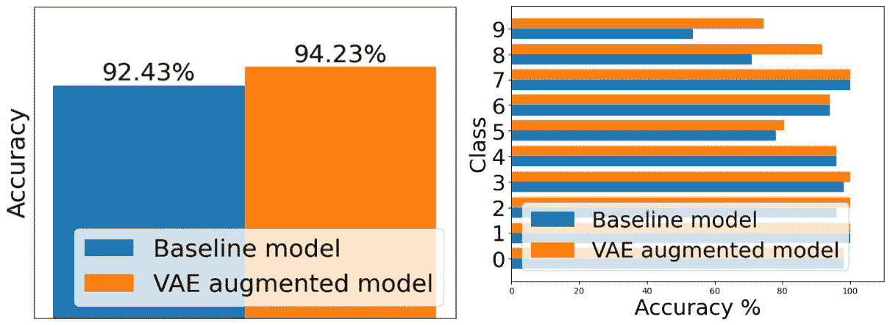

图 7.17 – VAE 增强模型在长尾 MNIST 数据集上的性能

扩散模型通过逐步用噪声破坏图像并随后重建它来运行，在医学成像等领域有应用。例如包括 DALLE-2 和开源的稳定扩散模型。

近期研究[19]强调了合成数据在增强零样本和少样本图像分类任务中的实用性。具体来说，当与大型预训练模型如 DALL-E 和稳定扩散结合使用时，文本到图像生成模型在现实世界数据稀少或不可用的情况下显著提高了性能。这些生成模型因其能够根据自然语言提示创建高质量图像的能力而备受关注，为不平衡数据集提供了一种潜在的解决方案。例如，如果缺少猴子坐在车里的图像，这些模型可以生成数百甚至数千张这样的图像来扩充训练数据集。然而，值得注意的是，仅用合成数据进行训练的模型可能仍然比那些用真实数据进行训练的模型表现不佳。

这些模型通常需要大量的计算资源，这使得它们在扩展时既耗时又昂贵，尤其是在大规模数据集的情况下。特别是扩散模型，计算密集，潜在的过度拟合可能会损害模型的泛化能力。因此，在采用这些高级生成模型时，平衡数据增强的好处与计算成本和潜在挑战至关重要。

## DeepSMOTE

**深度合成少数类过采样**（**DeepSMOTE**）技术[20]本质上是对 SMOTE 进行了适配，使其适用于深度学习模型，使用编码器-解码器架构，并对图像数据进行了细微调整。DeepSMOTE 由三个主要组件组成：

+   **一个用于处理复杂和高维数据的编码器/解码器框架**：使用编码器/解码器框架来学习图像数据的紧凑特征表示。它被训练从这种紧凑形式重建原始图像，确保捕获了基本特征。

+   **基于 SMOTE 的过采样生成合成实例**：一旦学习到特征表示，SMOTE 就应用于这个特征空间以生成少数类的合成实例。这在原始数据高维且复杂的情况下，如图像数据，尤其有用。SMOTE 通过在特征空间中找到最近的* k*个邻居，并生成介于待考虑实例及其邻居之间的插值新实例来创建这些合成实例。

+   **一个专门的损失函数**：DeepSMOTE 引入了一个专门的损失函数，它不仅关注重建误差（解码器从编码形式重建原始图像的能力），还包括一个惩罚项，确保合成实例对分类任务有用。

与基于 GAN 的过采样不同，DeepSMOTE 不需要判别器。它声称可以生成高质量、信息丰富的合成图像，这些图像可以进行视觉检查。

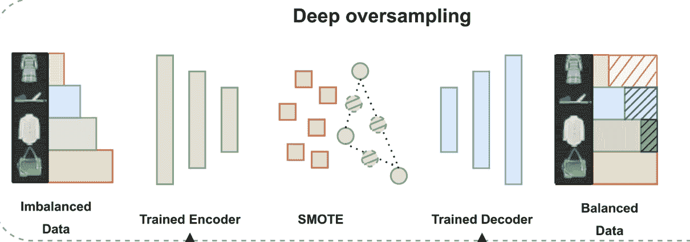

图 7.18 – 展示 DeepSMOTE 技术（改编自[20]）

## 神经风格迁移

神经风格迁移是深度学习中的一个技术，它艺术性地将一张图像的内容与另一张图像的风格相结合（*图 7**.19*）。虽然其主要应用在艺术和图像处理中，但生成合成数据样本的概念可以适应解决机器学习中的数据不平衡问题。通过从风格迁移中汲取灵感，可以潜在地生成少数类的合成样本，混合不同类的特征，或适应特定领域的知识。然而，必须小心确保合成数据真实地代表现实世界场景，以避免过度拟合和真实数据的泛化能力差。

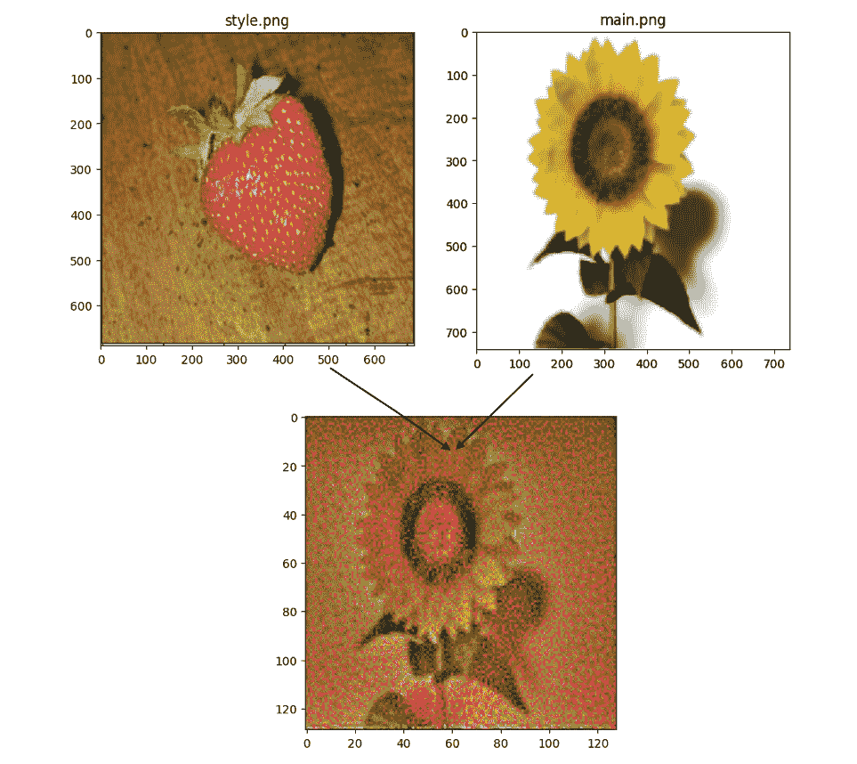

图 7.19 – 展示神经风格迁移技术

我们希望这能为您提供对解决不平衡数据的数据级别深度学习方法的全面理解，包括过采样、数据增强以及其他各种策略。

# 摘要

从经典机器学习模型到深度学习模型处理数据不平衡的方法的转变可能会带来独特的挑战，这主要是因为这些模型必须处理的数据类型不同。经典机器学习模型通常处理结构化、表格数据，而深度学习模型通常处理非结构化数据，如图像、文本、音频和视频。本章探讨了如何调整采样技术以与深度学习模型一起工作。为此，我们使用 MNIST 数据集的不平衡版本来训练一个模型，然后将其与各种过采样方法结合使用。

将随机过采样与深度学习模型结合使用涉及随机复制少数类的样本，直到每个类别的样本数量相等。这通常使用 imbalanced-learn、Keras、TensorFlow 或 PyTorch 等库的 API 来完成，这些库可以无缝地协同工作。一旦数据过采样，就可以将其发送到 PyTorch 或 TensorFlow 进行模型训练。

本章还深入探讨了不同的数据增强技术，这些技术在处理有限或不平衡数据时特别有益。增强技术包括旋转、缩放、裁剪、模糊和添加噪声，以及其他高级技术，如 AugMix、CutMix 和 MixUp。然而，必须小心确保这些增强不会改变原始标签，并且不会无意中改变数据中的关键信息。我们还讨论了其他方法，如两阶段学习和动态采样，作为提高不平衡数据模型性能的潜在策略。同时，我们还了解了一些适用于文本的数据级别技术，如回译和 EDA，这些技术是在垃圾邮件/非垃圾邮件数据集上运行的。

在下一章中，我们将探讨一些基于算法的方法来处理不平衡数据集。

# 问题

1.  将 Mixup 插值应用于本章中使用的 Kaggle 垃圾邮件检测 NLP 数据集。看看 Mixup 是否有助于提高模型性能。您可以参考 Guo 等人撰写的论文《使用 Mixup 增强数据以进行句子分类：一项实证研究》以获取更多信息。[《使用 Mixup 增强数据以进行句子分类：一项实证研究》论文链接](https://arxiv.org/pdf/1905.08941.pdf)

1.  参考 FMix 论文[21]并实现 FMix 增强技术。将其应用于 Caltech101 数据集。看看使用 FMix 是否比基线模型性能有所提高。

1.  将本章中描述的 EOS 技术应用于 CIFAR-10-LT（CIFAR-10 的长尾版本）数据集，并查看模型性能是否对最不平衡的类别有所提高。

1.  将本章中学习的 MDSA 技术应用于 CIFAR-10-LT 数据集，并查看模型性能是否对最不平衡的类别有所提高。

# 参考文献

1.  Samira Pouyanfar, Yudong Tao, Anup Mohan, Haiman Tian, Ahmed S. Kaseb, Kent Gauen, Ryan Dailey, Sarah Aghajanzadeh, Yung-Hsiang Lu, Shu-Ching Chen, 和 Mei-Ling Shyu. 2018\. *卷积神经网络在不平衡数据分类中的动态采样*. 载于 2018 年 IEEE 多媒体信息处理与检索会议（MIPR），第 112–117 页，佛罗里达州迈阿密，4 月。IEEE。

1.  LeNet-5 论文，*基于梯度的学习应用于文档分类*：[`vision.stanford.edu/cs598_spring07/papers/Lecun98.pdf`](http://vision.stanford.edu/cs598_spring07/papers/Lecun98.pdf)。

1.  AlexNet 论文，*使用深度卷积神经网络进行 ImageNet 分类*：[`papers.nips.cc/paper/2012/hash/c399862d3b9d6b76c8436e924a68c45b-Abstract.html`](https://papers.nips.cc/paper/2012/hash/c399862d3b9d6b76c8436e924a68c45b-Abstract.html)。

1.  *利用实时用户行为来个性化 Etsy 广告（2023）: [`www.etsy.com/codeascraft/leveraging-real-time-user-actions-to-personalize-etsy-ads`](https://www.etsy.com/codeascraft/leveraging-real-time-user-actions-to-personalize-etsy-ads)。

1.  在[Booking.com](http://Booking.com)上的自动图像标记（2017）: [`booking.ai/automated-image-tagging-at-booking-com-7704f27dcc8b`](https://booking.ai/automated-image-tagging-at-booking-com-7704f27dcc8b)。

1.  *通过使用从 3D 模型生成的图像进行深度学习来估计家具物品的拍摄角度（**2020**）: [`www.aboutwayfair.com/tech-innovation/shot-angle-prediction-estimating-pose-angle-with-deep-learning-for-furniture-items-using-images-generated-from-3d-models`](https://www.aboutwayfair.com/tech-innovation/shot-angle-prediction-estimating-pose-angle-with-deep-learning-for-furniture-items-using-images-generated-from-3d-models)。

1.  S. Yun, D. Han, S. Chun, S. J. Oh, Y. Yoo, and J. Choe, “*CutMix: 用于训练具有可定位特征的强大分类器的正则化策略*，”载于 2019 年 IEEE/CVF 国际计算机视觉会议（ICCV），韩国首尔：IEEE，2019 年 10 月，第 6022–6031 页。doi: 10.1109/ICCV.2019.00612。

1.  H. Zhang, M. Cisse, Y. N. Dauphin, 和 D. Lopez-Paz, “*mixup: 超越经验风险最小化*。” arXiv，2018 年 4 月 27 日。访问日期：2023 年 2 月 11 日。[在线]。可获取：[`arxiv.org/abs/1710.09412`](http://arxiv.org/abs/1710.09412)。

1.  R. Geirhos, C. R. M. Temme, J. Rauber, H. H. Schütt, M. Bethge, 和 F. A. Wichmann, “*人类和深度神经网络的泛化*。”

1.  D. Hendrycks, N. Mu, E. D. Cubuk, B. Zoph, J. Gilmer, 和 B. Lakshminarayanan, “*AugMix: 一种简单的数据处理方法，以提高鲁棒性和不确定性*。” arXiv，2020 年 2 月 17 日。访问日期：2023 年 8 月 1 日。[在线]。可获取：[`arxiv.org/abs/1912.02781`](http://arxiv.org/abs/1912.02781)。

1.  H.-P. Chou, S.-C. Chang, J.-Y. Pan, W. Wei, 和 D.-C. Juan，"Remix: Rebalanced Mixup"，arXiv，2020 年 11 月 19 日。访问日期：2023 年 8 月 15 日。[在线]。可获取：[`arxiv.org/abs/2007.03943`](http://arxiv.org/abs/2007.03943).

1.  *Grab 的图像中保护个人数据* (2021)：[`engineering.grab.com/protecting-personal-data-in-grabs-imagery`](https://engineering.grab.com/protecting-personal-data-in-grabs-imagery).

1.  M. Bayer, M.-A. Kaufhold, 和 C. Reuter，"文本分类的数据增强综述"，ACM Comput. Surv.，第 55 卷，第 7 期，第 1-39 页，2023 年 7 月，doi: 10.1145/3544558.

1.  *使用数据增强和采样提高我们机器学习 WAF 的准确性* (2022), Vikram Grover: [`blog.cloudflare.com/data-generation-and-sampling-strategies/`](https://blog.cloudflare.com/data-generation-and-sampling-strategies/).

1.  *NLP 的数据增强*: [`github.com/makcedward/nlpaug`](https://github.com/makcedward/nlpaug).

1.  B. Kang *et al.*，"解耦表示和分类器以实现长尾识别"，arXiv，2020 年 2 月 19 日。访问日期：2022 年 12 月 15 日。[在线]。可获取：[`arxiv.org/abs/1910.09217`](http://arxiv.org/abs/1910.09217).

1.  K. Cao, C. Wei, A. Gaidon, N. Arechiga, 和 T. Ma，"使用标签分布感知边缘损失的平衡数据集学习"，[在线]。可获取：[`proceedings.neurips.cc/paper/2019/file/621461af90cadfdaf0e8d4cc25129f91-Paper.pdf`](https://proceedings.neurips.cc/paper/2019/file/621461af90cadfdaf0e8d4cc25129f91-Paper.pdf).

1.  D. Dablain, C. Bellinger, B. Krawczyk, 和 N. Chawla，"不平衡深度学习的有效增强"，arXiv，2022 年 10 月 17 日。访问日期：2023 年 7 月 23 日。[在线]。可获取：[`arxiv.org/abs/2207.06080`](http://arxiv.org/abs/2207.06080).

1.  R. He *et al.*，"生成模型合成的合成数据是否适用于图像识别？" arXiv，2023 年 2 月 15 日。访问日期：2023 年 8 月 6 日。[在线]。可获取：[`arxiv.org/abs/2210.07574`](http://arxiv.org/abs/2210.07574).

1.  D. Dablain, B. Krawczyk, 和 N. V. Chawla，"DeepSMOTE:融合深度学习和 SMOTE 的平衡数据"，IEEE Transactions on Neural Networks and Learning Systems，第 33 卷，第 1-15 页，2022 年，doi: 10.1109/TNNLS.2021.3136503.

1.  E. Harris, A. Marcu, M. Painter, M. Niranjan, A. Prügel-Bennett, 和 J. Hare，"FMix:增强混合样本数据增强"，arXiv，2021 年 2 月 28 日。访问日期：2023 年 8 月 8 日。[在线]。可获取：[`arxiv.org/abs/2002.12047`](http://arxiv.org/abs/2002.12047).
