# 9

# 混合深度学习方法

在本章中，我们将讨论一些混合深度学习技术，这些技术以某种方式结合了数据级（*第七章*，*数据级深度学习方法*）和算法级（*第八章*，*算法级深度学习技术*）方法。本章包含一些最近且更高级的技术，可能难以实现，因此建议您对前几章有良好的理解。

我们将首先介绍图机器学习的基础，阐明图模型如何利用数据中的关系来提升性能，尤其是在少数类别的应用中。通过将**图卷积网络**（**GCN**）、XGBoost 和 MLP 模型进行并排比较，使用不平衡的社会网络数据集，我们将突出 GCN 的优越性能。

我们将继续探索解决深度学习中类别不平衡的策略，检查操纵数据分布和优先处理挑战性示例的技术。我们还将介绍称为硬示例挖掘和少数类增量校正的技术，它们分别通过优先处理困难实例和迭代增强少数类表示来提高模型性能。

尽管我们的大部分讨论将围绕图像数据集展开，特别是不平衡的 MNIST 数据集，但理解这些技术的更广泛适用性至关重要。例如，我们对图机器学习的深入研究不会依赖于 MNIST。相反，我们将转向来自 Facebook 的更真实的数据集，为处理现实场景中的不平衡问题提供新的视角。

在本章中，我们将涵盖以下主题：

+   不平衡数据的图机器学习

+   硬示例挖掘

+   少数类增量校正

到本章结束时，我们将熟悉一些混合方法，使我们能够理解更复杂技术背后的核心原理。

# 技术要求

与前几章类似，我们将继续使用常见的库，如`numpy`、`pandas`、`sklearn`和`torch`。对于图机器学习，我们将使用`torch_geometric`库。本章的代码和笔记本可在 GitHub 上找到，网址为[`github.com/PacktPublishing/Machine-Learning-for-Imbalanced-Data/tree/master/chapter09`](https://github.com/PacktPublishing/Machine-Learning-for-Imbalanced-Data/tree/master/chapter09)。您可以通过点击章节笔记本顶部的**在 Colab 中打开**图标或在[`colab.research.google.com`](https://colab.research.google.com)使用笔记本的 GitHub URL 来打开 GitHub 笔记本。

# 使用图机器学习处理不平衡数据

在本节中，我们将探讨在机器学习中何时图形是有用的工具，一般何时使用图机器学习模型，以及它们在特定类型的失衡数据集上如何有所帮助。我们还将探讨图机器学习模型如何在某些失衡数据集上优于经典模型，如 XGBoost。

图形是极其灵活的数据结构，可以表示复杂的关系和结构，从社交网络和网页（将链接视为边）到化学中的分子（将原子视为节点，它们之间的键视为边）以及各种其他领域。图模型使我们能够表示数据中的关系，这对于预测和洞察力是有帮助的，即使对于关系没有明确定义的问题也是如此。

## 理解图形

图形是图机器学习的基础，因此首先理解它们是很重要的。在计算机科学领域，图是由节点（或顶点）和边组成的一个集合。节点代表实体，边代表这些实体之间的关系或交互。例如，在一个社交网络中，每个人可以是一个节点，两个人之间的友谊可以是一条边。

图形可以是定向的（边有方向）或非定向的（边没有方向）。它们也可以是有权重的（边有值）或无权重的（边没有值）。

*图 9.1* 展示了一个样本表格数据集在左侧及其对应的图形表示在右侧：

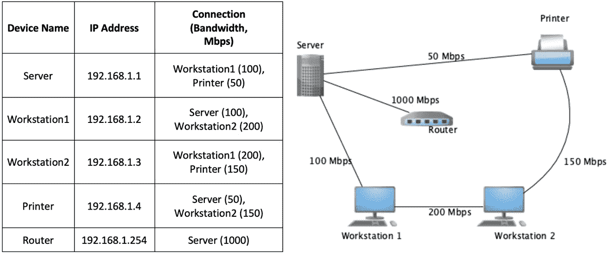

图 9.1 – 表格数据（左侧）与其视觉图形表示（右侧）进行对比

右侧的图形表示强调了各种实体之间的关系。在左侧的表格表示中，设备和它们的 IP 地址以及网络带宽的连接细节被列出。右侧的图形表示直观地表示了这些连接，使得网络拓扑结构更容易理解。设备是节点，连接是带有带宽的边，权重。图形比表格提供了更清晰的相互关系视图，强调了网络设计洞察。

在下一节中，我们将概述机器学习如何应用于图形。

## 图机器学习

**图机器学习**（**GML**）是一组使用图的架构来提取特征和进行预测的技术。GML 算法可以利用图结构中包含的丰富信息，例如节点之间的连接和这些连接的模式，以提高模型性能，尤其是在失衡数据上。

两种流行的神经网络 GML 算法是 GCNs 和**图注意力网络**（**GATs**）。这两种算法都使用图结构从节点的邻域中聚合信息。然而，它们在如何权衡节点邻居的重要性方面有所不同。GCN 对所有邻居给予相同的权重，而 GAT 使用注意力机制为不同的邻居分配不同的权重。在本章中，我们将仅讨论 GCNs。

## 处理不平衡数据

在机器学习中，当一个类别显著多于其他类别时，模型可能会偏向多数类别，导致对少数类别的性能不佳。这是问题所在，因为通常，少数类别才是我们感兴趣的。例如，在欺诈检测中，非欺诈案例的数量显著多于欺诈案例，但我们感兴趣的是检测欺诈案例。

在 GML 的背景下，图的结构可以提供额外的信息，有助于减轻数据不平衡的影响。例如，少数类别的节点可能比多数类别的节点彼此之间更紧密地连接。GML 算法可以利用这种结构来提高少数类别的性能。

### GCNs

我们将简要讨论 GCNs 背后的关键思想和它们是如何工作的。

GCNs 提供了一种独特的处理结构化数据的方法。与假设独立同分布数据的标准神经网络不同，GCNs 可以在图数据上操作，捕捉节点之间的依赖和连接。

GCNs 的本质是消息传递，可以分解如下：

+   **节点消息传递**：图中的每个节点通过其边向其邻居发送和接收消息

+   **聚合**：节点将这些消息聚合起来，以获得对这些局部邻域更广泛的理解

在 GCNs 中，传递的是完整的特征向量，而不是仅仅节点的标签。

将 GCN 层视为一个转换步骤。主要操作可以看作如下：

+   **聚合邻居**：节点从其邻居那里提取特征，导致聚合

+   **神经网络转换**：前一步骤中聚合的特征集随后通过神经网络层进行转换

让我们通过 Facebook 上的照片示例来探索 GCNs。用户上传照片，我们的目标是将这些图像分类为垃圾邮件或非垃圾邮件。这种分类基于图像内容以及 IP 地址或用户 ID。

让我们想象我们有一个图，其中每个节点是一张 Facebook 照片，如果两张照片是使用相同的 IP 地址或相同的账户上传的，那么这两张照片就是相连的。

假设我们想要使用照片的实际内容（可能是一个从预训练的 CNN 或某些元数据中得到的特征向量）作为节点属性。假设我们有一个 5 维向量来表示每张照片的特征。

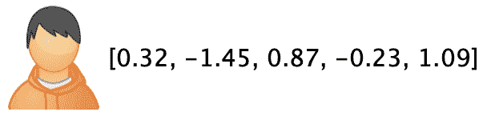

图 9.2 – 一个具有 5 维特征嵌入的图像

#### 第 1 步 – 图创建

我们将创建一个图，其中每个顶点代表一个 Facebook 图像。如果两个图像是通过相同的 IP 地址或用户 ID 上传的，我们将在这两个图像之间建立链接。

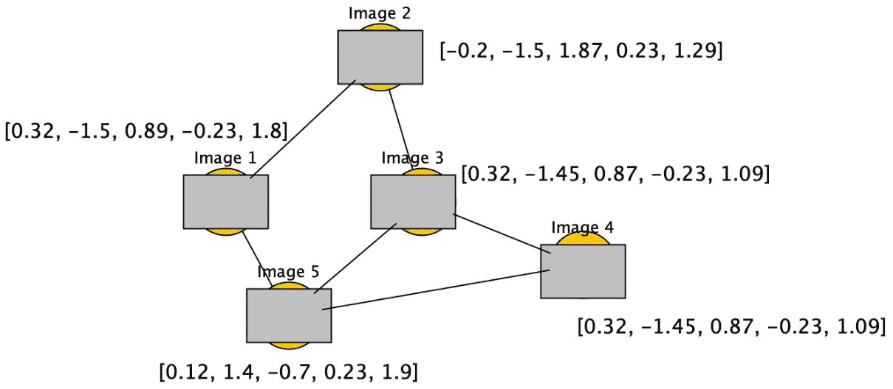

图 9.3 – 如果图像共享 IP 或用户 ID，则它们之间相互连接的图表

#### 第 2 步 – 图像表示

使用 5 维向量表示每个图像。这可以通过使用图像元数据、从训练好的神经网络中提取的特征或其他适合图像数据的适当技术来实现（如图 *图 9.2* 所示）。

#### 第 3 步 – 单层 GCN 用于图像分析

当一个特定的图像通过单层 GCN 时，会发生以下情况：

1.  我们将所有相邻图像的特征向量进行聚合。相邻图像是具有匹配 IP 地址或用户 ID 的图像。

1.  使用平均函数来组合向量。让我们称组合向量为邻域平均向量。

1.  使用权重矩阵（例如，5x1 大小，如图 *图 9.4* 所示）乘以邻域平均向量。

1.  然后，将激活函数应用于结果以获得一个单一值，这表明图像是垃圾邮件的可能性。

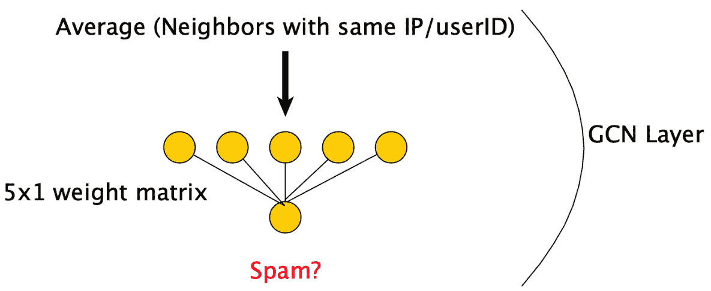

图 9.4 – 单个 GCN 层的工作原理

#### 第 4 步 – 双层 GCN

多层 GCN，就像传统的深度神经网络一样，可以被堆叠成多层：

+   原始节点特征输入到第一层

+   后续层的输入是前一层的结果

随着每层增加，GCN 能够掌握更广泛的邻域信息。例如，在两层 GCN 中，信息可以在图中传播两个跳数。

在对图 ML 和 GCN 的基础理解到位后，我们将探索一个案例研究。我们将比较图模型与其他模型（包括经典 ML 模型）在不平衡图数据集上的性能。我们的目标是确定图模型是否可以通过利用图结构之间的关系超越其他模型。

## 案例研究 – XGBoost、MLP 和 GCN 在不平衡数据集上的性能

我们将使用来自 **PyTorch Geometric** （**PyG**） 库的 Facebook Page-Page 数据集，该库旨在在图和其他不规则结构上创建和训练深度学习模型。此数据集包含来自 Facebook 的大量社交网络，其中节点代表官方 Facebook 页面，边表示它们之间的相互点赞。每个节点都标记为四个类别之一：政治家、政府机构、电视节目或公司。任务是根据节点特征预测这些类别，这些特征是从页面所有者提供的描述中提取的。

该数据集由于其规模和复杂性，成为图神经网络模型的一个具有挑战性的基准。它于 2017 年 11 月通过 Facebook Graph API 收集，并专注于上述四个类别中的多类节点分类。您可以在[`snap.stanford.edu/data/facebook-large-page-page-network.html`](https://snap.stanford.edu/data/facebook-large-page-page-network.html)了解更多关于该数据集的信息。

我们首先导入一些常用库和 Facebook 数据集：

```py
import pandas as pd
from torch_geometric.datasets import FacebookPagePage
dataset = FacebookPagePage(root=".")
data = dataset[0]
```

这里数据对象的数据类型为`torch_geometric.data`。

这里有一些关于图数据的统计数据：

```py
Dataset: FacebookPagePage()
-----------------------
Number of graphs: 1
Number of features: 128
Number of classes: 4
Number of graphs: 1
Number of nodes: 22,470
Number of edges: 342,004
Average node degree: 15.22
Contains isolated nodes: False
Contains self-loops: True
Is undirected: True
```

让我们以表格格式打印特征和标签：

```py
dfx = pd.DataFrame(data.x.numpy())
dfx['label'] = pd.DataFrame(data.y)
dfx
```

这打印出包含在`dfx` DataFrame 中的特征和标签：

|  | **1** | **2** | **…** | **127** | **标签** |
| --- | --- | --- | --- | --- | --- |
| 0 | -0.262576 | -0.276483 | … | -0.223836 | 0 |
| 1 | -0.262576 | -0.276483 | … | -0.128634 | 2 |
| 2 | -0.262576 | -0.265053 | … | -0.223836 | 1 |
| ... | ... | ... | ... | ... | ... |
| 22468 | -0.262576 | -0.276483 | … | -0.218148 | 1 |
| 22469 | -0.232275 | -0.276483 | … | -0.221275 | 0 |

表 9.1 – 每行显示特征值的数据集；最后一列显示每个数据点的标签

打印的整体结果如下：

```py
22470 rows × 129 columns
```

这 127 个特征是通过从页面描述文本中使用 Doc2Vec 技术生成的。这些特征就像每个 Facebook 页面的嵌入向量。

在*图 9.5*中，我们使用 Gephi（一种图形可视化软件）可视化数据集：

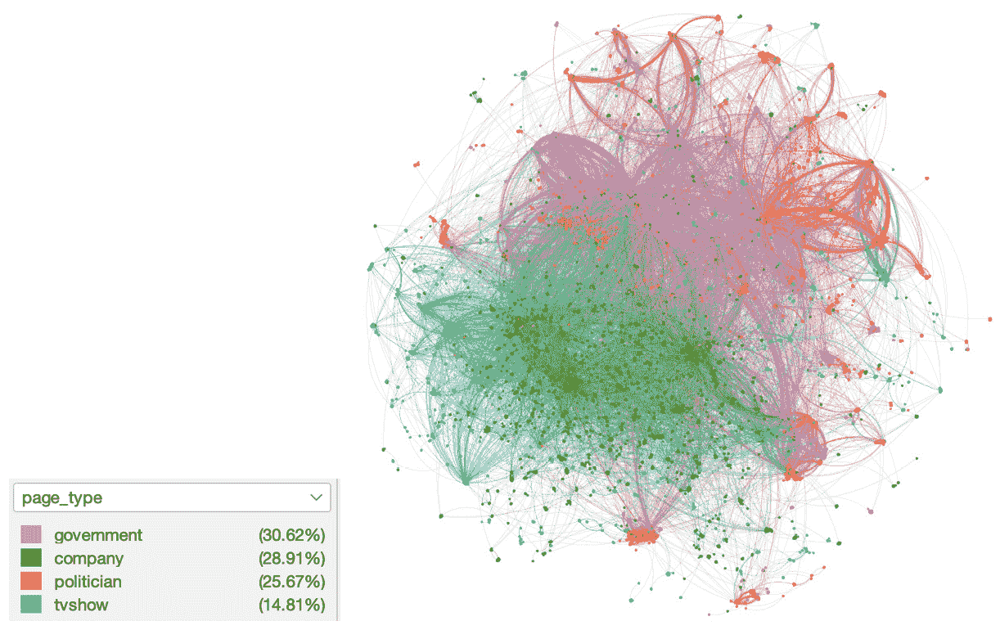

图 9.5 – Facebook 页面-页面数据集 Gephi 可视化

该图包含跨类别和类别内的连接，但后者更为突出，突显了同一类别内的相互类似亲和力。这导致了不同的集群，提供了对 Facebook 上强大的类别内关联的鸟瞰图。如果我们分析原始数据集中各种类别的数据，它们的比例并不那么不平衡。因此，让我们通过随机删除一些节点来添加一些不平衡（如图*9.6*所示）：

| **类别** | **原始数据集中节点的数量** | **删除一些节点后的节点数量** |
| --- | --- | --- |
| 0 | 3,327 | 3,327 |
| 1 | 6,495 | 1,410 |
| 2 | 6,880 | 460 |
| 3 | 5,768 | 256 |

表 9.2 – 数据集中各种类别的分布

添加不平衡后数据的分布如下所示：

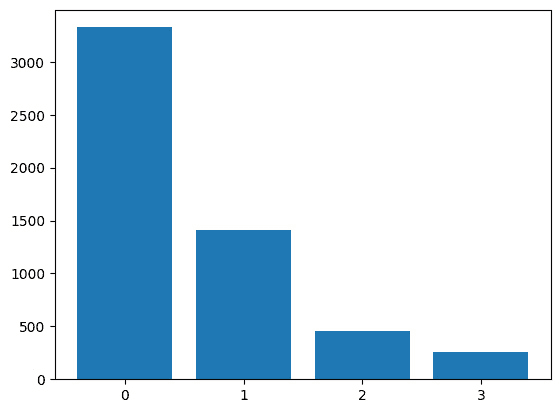

图 9.6 – 添加不平衡后各种类别的分布

让我们通过指定索引的范围将数据分为训练集和测试集。在`Data`对象中，我们可以使用掩码指定此范围以表示训练集和测试集：

```py
# Create masks
data.train_mask = range(4368)
data.val_mask = range(4368, 4611)
data.test_mask = range(4611, 4853)
```

### 训练 XGBoost 模型

让我们在该数据集上使用 XGBoost 模型设置一个简单的基线。

首先，让我们使用我们之前创建的掩码来创建我们的训练/测试数据集：

```py
X_train, X_test, y_train, y_test = \
    data1.x[data1.train_mask].cpu().numpy(), \
    data1.x[data1.test_mask].cpu().numpy(), \
    data1.y[data1.train_mask].cpu().numpy(), \
    data1.y[data1.test_mask].cpu().numpy()
```

然后，我们在数据上训练和评估：

```py
xgb_clf = XGBClassifier(eval_metric='logloss')
xgb_clf.fit(X_train, y_train)
y_pred = xgb_clf.predict_proba(X_test)
test_acc = accuracy_score(y_test, np.argmax(y_pred,axis=1))
test_acc.round(3)
```

这在测试集上打印出以下准确度值：

```py
0.793
```

让我们绘制 PR 曲线：

```py
y1_test_one_hot = F.one_hot(data1.y[data1.test_mask], \
    num_classes=4)
display_precision_recall_curve(y1_test_one_hot, y_pred)
```

这会打印出使用 XGBoost 模型的各个类别的 PR 曲线（*图 9**.7*）和面积。最不平衡的类别 3 的面积最低，正如预期的那样。

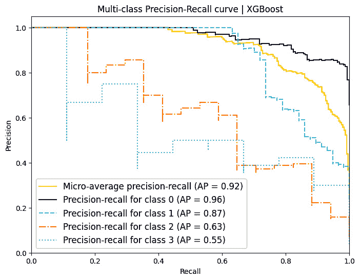

图 9.7 – 使用 XGBoost 的 PR 曲线

### 训练多层感知器模型

我们可以使用最简单的深度学习模型，即**多层感知器**（**MLP**）来设置另一个基线。*图 9**.8*显示了每个类的 PR 曲线。总体而言，MLP 的表现不如 XGBoost，但在最不平衡的类别 3 上的表现优于 XGBoost。

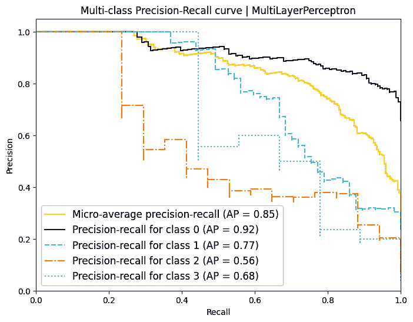

图 9.8 – 使用 MLP 模型的 PR 曲线

### 训练 GCN 模型

最后，我们切换到使用图卷积网络，这是 CNN 中卷积层的一种推广。正如我们之前讨论的，GCN 使用图的结构根据其邻居的特征更新每个节点的特征。换句话说，每个节点都可以从它的朋友那里学习！

第一步涉及导入所需的库。在这里，我们导入`PyTorch`、PyG 中的`GCNConv`模块和 PyTorch 的`functional`模块：

```py
import torch
from torch_geometric.nn import GCNConv
import torch.nn.functional as F
```

`GraphConvolutionalNetwork`类是我们模型的表示。该类继承自 PyTorch 的`nn.Module`。它包含一个初始化器、一个用于前向传播的前向函数、一个训练模型的函数和一个评估模型的函数：

```py
class GraphConvolutionalNetwork(torch.nn.Module):
    def __init__(self, input_dim, hidden_dim, output_dim):
        super().__init__()
        self.convolution_layer1 = GCNConv(input_dim, hidden_dim)
        self.convolution_layer2 = GCNConv(hidden_dim, output_dim)
```

在`__init__()`函数中，我们初始化模型的层。我们的模型包含两个**图卷积网络层**（**GCNConv 层**）。输入、隐藏和输出层的维度作为参数要求。

然后，我们定义一个`forward()`函数来通过网络执行前向传播。它接受节点特征和边索引作为输入，应用第一个 GCN 层，然后是 ReLU 激活函数，接着应用第二个 GCN 层。该函数随后应用`log_softmax`激活函数并返回结果：

```py
    def forward(self, node_features, edge_index):
        hidden_representation = self.convolution_layer1( \
            node_features,edge_index)
        hidden_representation = torch.relu(hidden_representation)
        output_representation = self.convolution_layer2 \
            (hidden_representation, edge_index)
        return F.log_softmax(output_representation, dim=1)
```

`train_model()`函数用于训练模型。它接受数据和 epoch 数作为输入。它将模型设置为训练模式，并将**负对数似然损失**（**NLLLoss**）作为损失函数，Adam 作为优化器。然后它运行指定数量的 epoch 来训练模型。在每个 epoch 中，它计算模型的输出，计算损失和准确率，执行反向传播并更新模型参数。它还会每 20 个 epoch 计算并打印训练和验证的损失和准确率：

```py
    def train_model(self, data, num_epochs):
        loss_function = torch.nn.NLLLoss()
        optimizer = torch.optim.Adam(self.parameters(),\
            lr=0.01, weight_decay=5e-4)
        self.train()
        for epoch in range(num_epochs + 1):
            optimizer.zero_grad()
            network_output = self(data.x, data.edge_index)
            true_train_labels = data.y[data.train_mask]
            loss = loss_function(network_output[data.train_mask], \
                true_train_labels)
            accuracy = compute_accuracy(\
                network_output[data.train_mask].argmax(\
                    dim=1), true_train_labels)
            loss.backward()
            optimizer.step()
            if(epoch % 20 == 0):
                true_val_labels = data.y[data.val_mask]
                val_loss = loss_function(\
                    network_output[data.val_mask], true_val_labels)
                val_accuracy = compute_accuracy(\
                    network_output[data.val_mask].argmax(\
                    dim=1), true_val_labels)
                print(f'Epoch: {epoch}\n'\
                    f'Train Loss: {loss:.3f}, Accuracy:\
                    {accuracy*100:.0f}%\n'\
                    f'Validation Loss: {val_loss:.2f},\
                    Accuracy: {val_accuracy*100:.0f}%\n'\
                    '-------------------')
```

`evaluate_model`函数用于评估模型。它将模型设置为评估模式，并计算模型的输出和测试准确率。它返回测试准确率和测试数据的输出。

```py
    @torch.no_grad()
    def evaluate_model(self, data):
        self.eval()
        network_output = self(data.x, data.edge_index)
        test_accuracy = compute_accuracy(\
            network_output.argmax(dim=1)[data.test_mask],\
            data.y[data.test_mask])
        return test_accuracy,network_output[data.test_mask,:]
```

我们开始训练过程，然后评估模型：

```py
gcn = GraphConvolutionalNetwork(dataset.num_features, 16,\
    dataset.num_classes)
gcn.train_model(data1, num_epochs=100)
acc,_ = gcn.evaluate_model(data1)
print(f'\nGCN test accuracy: {acc*100:.2f}%\n')
```

这会产生以下输出：

```py
Epoch: 0
Train Loss: 1.414, Accuracy: 32%
Validation Loss: 1.38, Accuracy: 29%
-------------------
Epoch: 20
Train Loss: 0.432, Accuracy: 85%
Validation Loss: 0.48, Accuracy: 83%
-------------------
Epoch: 40
Train Loss: 0.304, Accuracy: 89%
Validation Loss: 0.43, Accuracy: 86%
-------------------
Epoch: 60
Train Loss: 0.247, Accuracy: 92%
Validation Loss: 0.43, Accuracy: 86%
-------------------
Epoch: 80
Train Loss: 0.211, Accuracy: 93%
Validation Loss: 0.43, Accuracy: 88%
-------------------
Epoch: 100
Train Loss: 0.184, Accuracy: 94%
Validation Loss: 0.44, Accuracy: 88%
-------------------
GCN test accuracy: 90.91%
```

让我们打印 PR 曲线：

```py
_, y1_score = gcn.evaluate_model(data1)
y1_test_one_hot = F.one_hot(data1.y[data1.test_mask], num_classes=4)
display_precision_recall_curve(y1_test_one_hot, y1_score)
```

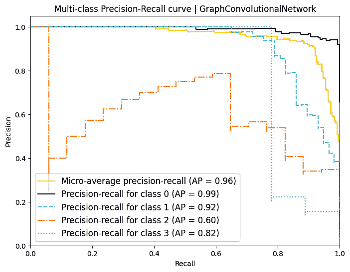

图 9.9 – 使用 GCN 模型的 PR 曲线

在*表 9.3*中，我们比较了各种模型的整体准确率以及按类别划分的准确率：

| **准确率百分比** | **MLP** | **XGBoost** | **GCN** |
| --- | --- | --- | --- |
| 总体 | 76.5 | 83.9 | **90.9** |
| 类别 0 | 84.9 | 95.2 | **96.6** |
| 类别 1 | 72.9 | 78.0 | **88.1** |
| 类别 2 | 33.3 | 57.1 | **71.4** |
| 类别 3 | 68.8 | 37.5 | **75.0** |

表 9.3 – 在 Facebook 页面-页面网络数据集上的类别准确率百分比

这里是一些来自*表 9.3*的见解：

+   **总体性能**：

    +   GCN 以 90.9%的整体准确率超越了 MLP 和 XGBoost。GCN 对于这种网络数据来说是最好的，在所有类别中都表现出色。

+   **类别特定见解**：

    +   **类别 0**：GCN 和 XGBoost 在类别 0 上表现良好。

    +   **类别 1–3**：GCN 领先，而 MLP 和 XGBoost 在类别 2 和 3 中表现不佳。特别是要注意，在训练数据中示例数量最少的类别 3 上，GCN 的表现显著优于其他模型。

在这里，我们比较了 XGBoost 这种传统机器学习算法、基本的 MLP 深度学习模型与 GCN（图机器学习模型）在不平衡数据集上的性能。结果显示，图机器学习算法可以超越传统算法，展示了图机器学习处理不平衡数据的潜力。

图机器学习算法优越性能的归因于它们能够利用图的结构。通过从节点的邻域聚合信息，图机器学习算法可以捕捉到传统算法可能错过的数据中的局部和全局模式。

🚀 优步和 Grab 的图机器学习

🎯 **解决的问题**：

优步和 Grab 都旨在解决其多样化的服务中复杂的欺诈问题，从打车到送餐和金融服务。优步专注于共谋欺诈[1]，即用户群体共同实施欺诈。例如，用户可以合作使用被盗信用卡进行虚假行程，然后向银行申请退款以获得那些非法购买的退款。Grab 旨在建立一个通用的欺诈检测框架，能够适应新的模式[2]。

⚖️ **数据不平衡问题**：

欺诈活动虽然罕见但种类繁多，造成了类别不平衡问题。两家公司都面临着适应新欺诈模式挑战。

🎨 **图建模策略**：

• **图模型**：两家公司都采用了**关系图卷积网络**（**RGCNs**）来捕捉欺诈的复杂关系。为了确定优步用户是否欺诈，优步不仅想利用目标用户的特征，还想利用在定义的网络距离内与之相连的用户的特征。

• **半监督学习**：Grab 的 RGCN 模型在一个包含数百万个节点和边的图上进行了训练，其中只有一小部分有标签。基于树的模型严重依赖于高质量的标签和特征工程，而基于图的模型需要的特征工程最少，在检测未知欺诈方面表现出色，利用图结构。

📊**实际影响**：

基于图的模型在检测已知和未知欺诈风险方面已被证明是有效的。它们需要的特征工程较少，且对标签的依赖性较低，这使得它们成为对抗各种类型欺诈风险的可持续基础。然而，由于延迟问题，Grab 没有使用 RGCN 进行实时模型预测[2]。

🛠 **挑战** **和技巧**：

• **数据管道和可扩展性**：大型图大小需要分布式训练和预测。在 Uber，未来工作需要增强实时能力。

• **批量实时预测**：对于 Grab 来说，实时图更新计算密集，使得批量实时预测成为可行的解决方案。

总结来说，图机器学习为处理不平衡数据提供了一种有前景的方法，当数据本身具有图结构，或者我们认为可以利用数据中的相互关联性时。通过利用图结构中包含的丰富信息，图机器学习算法可以提高模型性能，并提供更准确、更可靠的预测。随着数据的增多和图变得更大、更复杂，其处理不平衡数据的能力将只会持续增长。

在下一节中，我们将把重点转向另一种称为硬例挖掘的不同策略，该策略基于优先处理数据集中最具挑战性的示例的原则。

# 硬例挖掘

硬例挖掘是深度学习中的一种技术，它迫使模型更加关注这些困难示例，并防止模型过度拟合那些容易预测的大多数样本。为此，硬例挖掘识别并选择数据集中最具挑战性的样本，然后仅对这些具有挑战性的样本进行反向传播损失。硬例挖掘常用于计算机视觉任务，如目标检测。硬例可以分为两种：

+   **硬正例**是指那些预测分数低但标签正确的示例

+   **硬负例**是指那些标签错误但预测分数高的示例，这是模型犯的明显错误

“挖掘”一词指的是寻找这些“困难”示例的过程。硬负例挖掘的想法实际上并不新颖，并且与**提升**（boosting）的想法非常相似，而提升是流行的提升决策树算法的基础。提升决策树本质上确定了模型出错的地方，然后在这些“困难”示例上训练一个新的模型（称为弱学习器）。

当处理大型数据集时，处理所有训练数据以识别困难例子可能很耗时。这促使我们探索硬样本挖掘的在线版本。

## 在线硬样本挖掘

在**在线硬样本挖掘**（**OHEM**）[3]中，每个训练周期的批次都会确定“硬”的例子，其中我们选取了*最小的 k*个例子，这些例子具有最低的损失值。然后我们只在训练中反向传播这些*最小的 k*个例子的损失。

这样，网络专注于比简单样本具有更多信息的最困难样本，并且模型在较少的训练数据下更快地提高。

Shrivastava 等人[3]在论文中介绍的开源硬例子挖掘（OHEM）技术相当受欢迎。这是一种主要用于目标检测的技术，通过关注具有挑战性的案例来提高模型性能。它的目标是高效地选择一组“硬”的负面例子，这些例子对训练模型最有信息量。例如，想象我们正在开发一个面部识别模型，我们的数据集由带有面部（正例）的图像和没有面部（负例）的图像组成。在实践中，我们经常遇到比正例数量少得多的负例。为了使我们的训练更有效率，选择一组最具挑战性的负面例子，这些例子对我们的模型最有信息量是明智的。

在我们的实验中，我们发现在线硬样本挖掘确实有助于不平衡的 MNIST 数据集，并提高了我们模型在最不平衡的类别上的性能。

这里是 OHEM 函数的核心实现：

```py
class NLL_OHEM(torch.nn.NLLLoss):
    def __init__(self):
        super(NLL_OHEM, self).__init__()
    def forward(self, cls_pred, cls_target, rate=0.95):
        batch_size = cls_pred.size(0)
        ohem_cls_loss = F.cross_entropy(cls_pred,\
            cls_target, ignore_index=-1)
        keep_num = int(batch_size*rate)
        ohem_cls_loss = ohem_cls_loss.topk(keep_num)[0]
        cls_loss = ohem_cls_loss.sum() / keep_num # mean
        return cls_loss
```

在`NLL_OHEM`类中，我们首先计算了常规的交叉熵损失，然后确定了*最小的 k*个损失值。这些*最小的 k*个值表示模型难以处理的*最小的 k*个例子。然后我们只在反向传播中传播这些*最小的 k*个损失值。

正如我们在*第八章*中提到的，*算法级深度学习技术*，我们将继续使用 MNIST 数据集的长尾版本（*图 9.10*）。

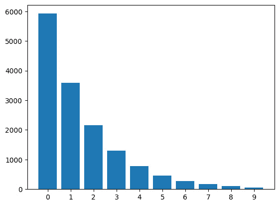

图 9.10 – 一个不平衡的 MNIST 数据集，显示了每个类的计数

在*图 9.11*中，我们展示了 OHEM 损失与交叉熵损失在 20 个 epoch 后的性能。

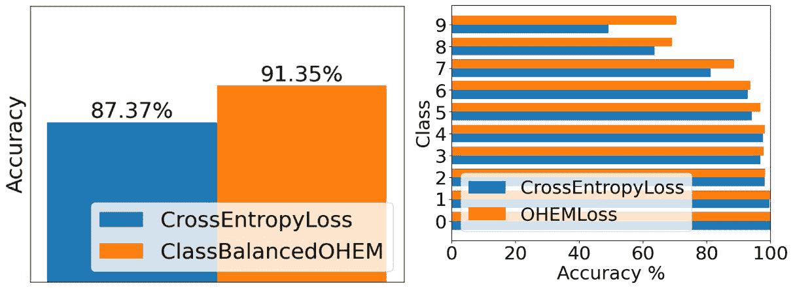

图 9.11 – 与交叉熵损失相比的在线硬样本挖掘性能比较

显然，对于不平衡程度最高的类别，观察到的改进最为显著。尽管一些研究工作[4]试图将 OHEM 应用于一般问题而没有取得太大成功，但我们认为这是一个值得注意的好技术。

在下一节中，我们将介绍我们关于少数类增量校正的最后一个主题。

# 少数类增量校正

少数类增量校正是一种深度学习技术，通过使用**类别校正损失**（**CRL**）来增强不平衡数据集中少数类的表示。这种策略动态调整类别不平衡，通过结合硬示例挖掘和其他方法来提高模型性能。

这种技术基于 Dong 等人撰写的论文[5][6]。以下是该技术的关键步骤：

1.  **每个批次中的类别识别**：

    +   **二元分类**：如果一个类别占批次不到 50%，我们将其视为少数类。其余的是多数类。

    +   **多类分类**：我们定义所有少数类为那些总共不超过批次 50%的类别。其余类别被视为多数类。

1.  **计算类别** **校正损失**：

    +   **定位** **具有挑战性的样本**：

        +   **寻找 hard positives**：我们识别出模型错误评估为低预测分数的少数类样本。

        +   **寻找 hard negatives**：我们定位到其他（多数）类别的样本，这些样本被我们的模型错误地分配了少数类的高预测分数。

    +   **构建三元组**：

        +   **使用少数样本作为 anchor**：我们将每个少数类样本用作三元组形成的 anchor。

        +   **创建三元组**：我们使用 anchor 样本、hard positive 和 hard negative 来形成三元组。

    +   **计算三元组内的距离**：我们定义匹配对（anchor 和 hard positive）与未匹配对（anchor 和 hard negative）之间的距离（d）如下：

    d(anchor, hard positive) = ∣ 预测分数（anchor）- 预测分数（hard positive）∣

    d(anchor, hard negative) = 预测分数（anchor）- 预测分数（hard negative）

    +   **施加边界排序**：我们确保 anchor 到 hard negative 的距离大于 anchor 到 hard positive 的距离，并增加一个边界。

1.  **制定最终** **损失函数**：

    +   **类别不平衡校正**：我们通过引入**CRL**项来修改标准的交叉熵损失，以解决类别不平衡。

    +   **自定义损失计算**：我们使用形成的三元组来计算定义的距离的平均总和。

    +   **损失方程**:

L final = α × L CRL + (1 − α) × L CE

这里，L CRL 是 CRL 损失，L CE 是交叉熵损失，α是依赖于数据集中类别不平衡程度的超参数。

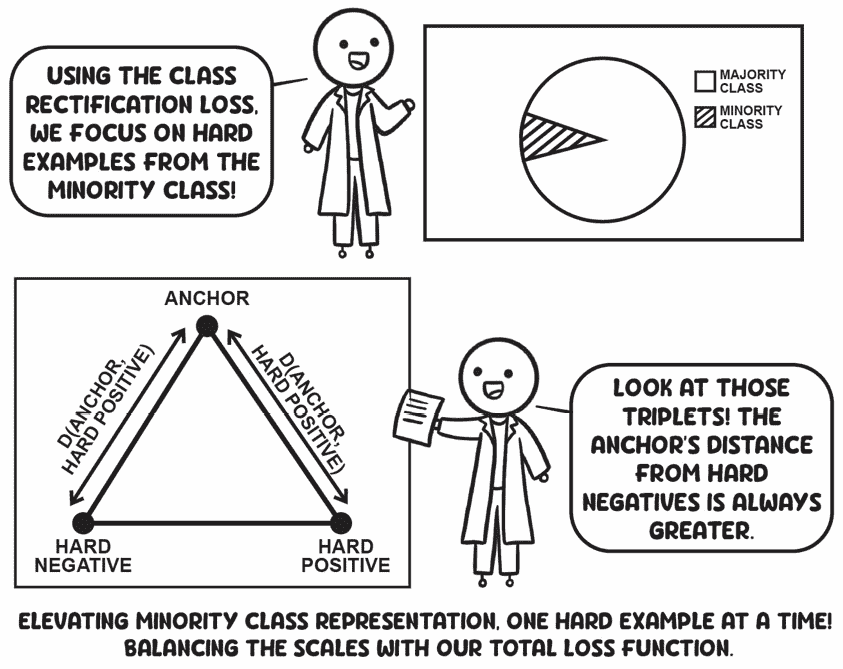

图 9.12 – 一幅说明三元组损失在类别校正损失中应用的漫画

## 利用少数类增量校正中的硬样本挖掘技术

少数类增量校正技术使用硬负样本技术，但有两项定制：

+   它仅使用少数类进行硬挖掘

+   它使用硬正样本和硬负样本进行损失计算（三元组边界损失）

在处理高度不平衡数据集时，少数类增量校正技术的关键亮点在于它在其操作的批次中对少数类使用三元组损失。这确保了模型在每一批次中逐步优化少数类的三元组损失。

我们使用`ClassRectificationLoss`在不平衡 MNIST 数据上的结果与采用交叉熵损失的基线模型相比相对平庸。这种性能差异可能是由于该技术适合非常大的训练数据，而不是像我们这里使用的 MNIST 这样的小数据集。请参阅 GitHub 仓库中的完整笔记本。

值得注意的是，该论文的原始作者将此方法应用于 CelebA 面部属性数据集，该数据集广泛且具有多标签和多类别。*表 9.4*展示了论文中的结果，其中他们使用五层 CNN 作为基线，并将 CRL 与过采样、欠采样和成本敏感技术进行了比较。

| **属性（****不平衡比率）** | **基线（****五层 CNN）** | **过采样** | **欠采样** | **成本敏感** | **CRL** |
| --- | --- | --- | --- | --- | --- |
| 秃头（1:43） | 93 | 92 | 79 | 93 | **99** |
| 胡须（1:24） | 88 | 90 | 60 | 88 | **93** |
| 灰白头发（1:23） | 90 | 90 | 88 | 90 | **96** |
| 白皙皮肤（1:22） | 81 | 82 | 78 | 80 | **92** |
| 双下巴（1:20） | 83 | 84 | 80 | 84 | **89** |

表 9.4 – 在 CelebA 基准上使用类别平衡准确率（%）比较 CRL 在面部属性识别上的性能（改编自 Dong 等人[6]）

从表中可以看出，CRL 技术在各种面部属性上始终优于其他方法，即使在高度不平衡的情况下也是如此。具体来说，对于**秃头**属性，在 1:43 的不平衡比率下，CRL 实现了令人瞩目的 99%准确率。它在**胡须**和**灰白头发**等属性上的有效性也很明显，分别超过了基线 5%和 6%。这证明了 CRL 在处理类别不平衡方面的优越能力。

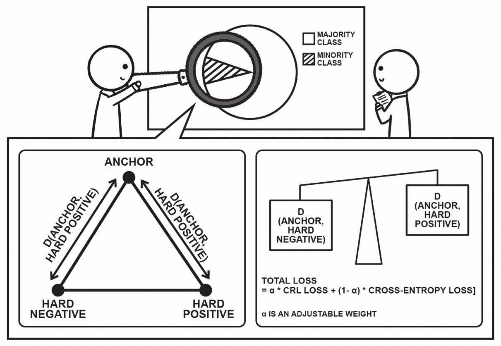

图 9.13 – CRL 正则化在纠正由类别不平衡训练数据引起的模型偏差中的视觉表示

总体而言，`ClassRectificationLoss`类提供了一个自定义损失函数，该函数结合了三元组损失和负对数似然损失，同时考虑了数据集中的类别不平衡。这可以是一个有用的工具，用于在少数类样本特别感兴趣的类别不平衡数据集上训练模型。

本章探讨了处理不平衡数据的一些现代深度学习策略，包括图机器学习、困难示例挖掘和少数类增量校正。通过结合数据级和算法级技术，有时甚至将问题范式从表格数据转换为基于图的数据表示，我们可以有效地利用具有挑战性的示例，改善不常见类别的表示，并提高我们管理数据不平衡的能力。

# 摘要

在本章中，我们介绍了图机器学习，并看到了它如何对某些不平衡数据集有用。我们在 Facebook 页面-页面数据集上训练并比较了 GCN 模型与 XGBoost 和 MLP 基线的性能。对于某些数据集（包括表格数据集），我们能够利用图数据的丰富和互联结构，图机器学习模型甚至可以击败 XGBoost 模型。随着我们继续遇到越来越复杂和互联的数据，图机器学习模型的重要性和相关性将只会继续增长。理解和利用这些算法可以在你的工具库中非常有价值。

然后，我们介绍了一种困难挖掘技术，其中首先识别出具有最低损失值的“困难”示例。然后，仅对这样的*k*个示例进行反向传播，以迫使模型专注于模型最难以学习的少数类示例。最后，我们深入探讨了另一种混合深度学习技术，称为少数类增量校正。这种方法在在线困难示例挖掘技术挖掘的示例上使用三元组损失。由于少数类增量校正方法结合了来自少数组的困难样本挖掘和称为 CRL 的正则化目标函数，因此它被认为是一种结合了数据级和算法级深度学习技术的混合方法。

我们希望这一章能让你对从新技术中提取关键见解并理解其核心思想充满信心，这些思想直接来自研究论文。

在下一章中，我们将讨论模型校准的重要性以及一些流行的校准机器学习模型的技术。

# 问题

1.  将三元组损失应用于不平衡的 MNIST 数据集，并查看模型的性能是否优于使用交叉熵损失函数。

1.  将少数类增量校正技术应用于不平衡数据集——CIFAR10-LT 和 CIFAR100-LT。对于 MNIST-LT 数据集上此技术的参考实现，您可以参考附带的 GitHub 笔记本。

# 参考文献

1.  *欺诈检测：利用关系图学习检测共谋（**2021**）*：[`www.uber.com/blog/fraud-detection/`](https://www.uber.com/blog/fraud-detection/).

1.  *欺诈检测图（**2022**）*：[`engineering.grab.com/graph-for-fraud-detection`](https://engineering.grab.com/graph-for-fraud-detection).

1.  A. Shrivastava, A. Gupta, 和 R. Girshick, *“基于在线硬样本挖掘的区域检测器训练，”* 发表于 2016 年 IEEE 计算机视觉与模式识别会议（CVPR），拉斯维加斯，内华达州，美国，2016 年 6 月，第 761–769 页: doi: 10.1109/CVPR.2016.89.

1.  Marius Schmidt-Mengin, Théodore Soulier, Mariem Hamzaoui, Arya Yazdan-Panah, Benedetta Bod-ini, 等人。*“在线硬样本挖掘与固定过采样策略在纵向 FLAIR MRI 中分割新多发性硬化症病灶的比较”*。Frontiers in Neuroscience，2022，16，pp.100405\. 10.3389/fnins.2022.1004050\. hal-03836922.

1.  Q. Dong, S. Gong, 和 X. Zhu, *“不平衡深度学习的类矩形校正硬挖掘，”* 发表于 2017 年 IEEE 国际计算机视觉会议（ICCV），威尼斯，2017 年 10 月，第 1869–1878 页\. doi: 10.1109/ICCV.2017.205.

1.  Q. Dong, S. Gong, 和 X. Zhu, *“通过少数类增量校正的不平衡深度学习。”* arXiv，2018 年 4 月 28 日\. 访问时间：2022 年 7 月 26 日\. [在线]. 可用：[`arxiv.org/abs/1804.10851`](http://arxiv.org/abs/1804.10851).
