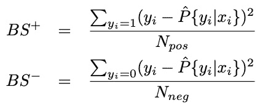
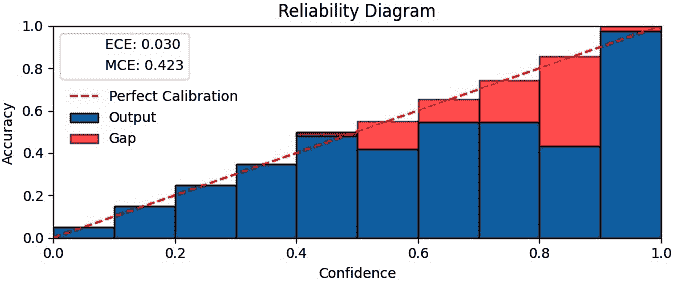
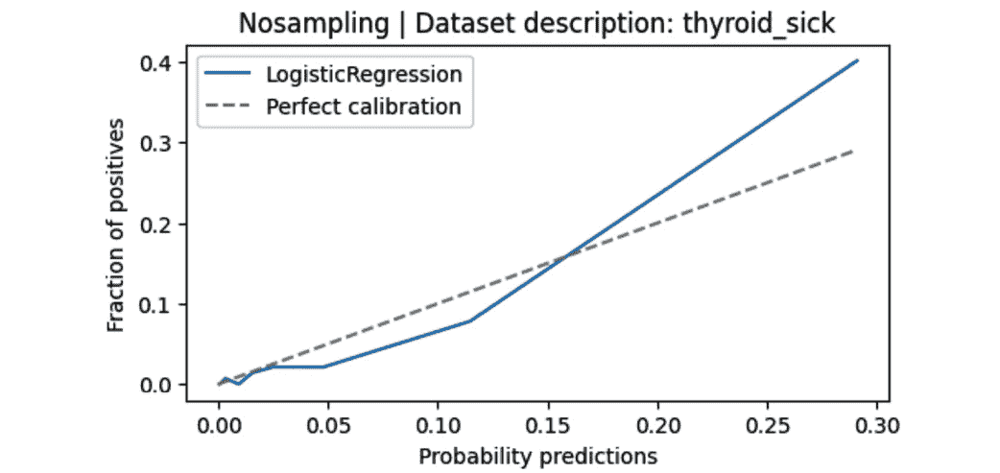
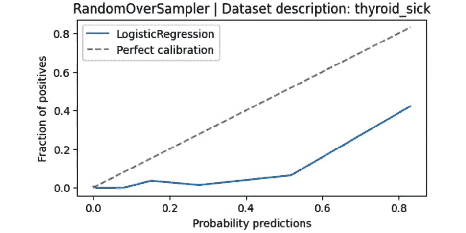
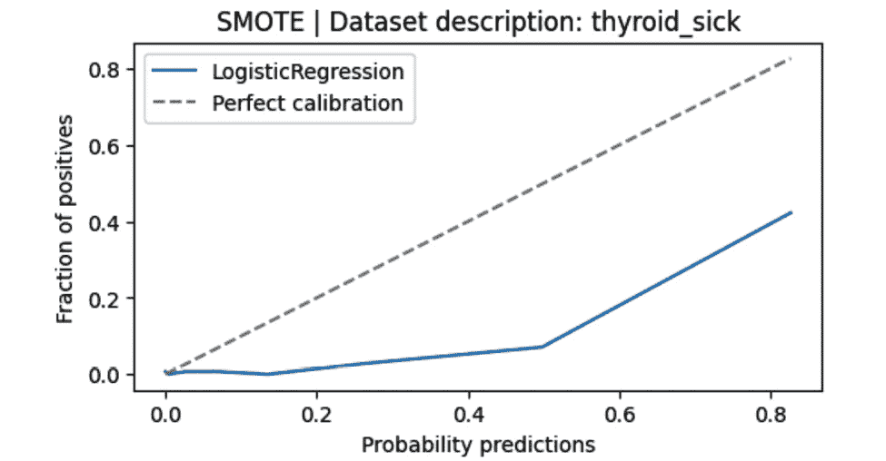
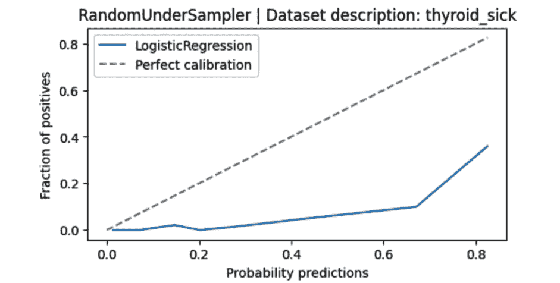
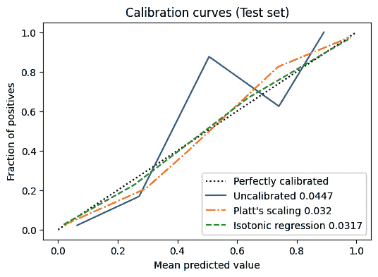
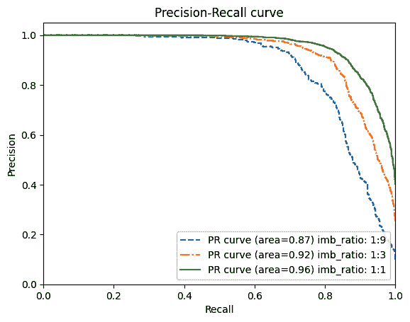

# 10

# 模型校准

到目前为止，我们已经探讨了处理数据不平衡的各种方法。在本章中，我们将看到需要对从训练模型获得的预测分数进行一些后处理的需求。这可以在从模型进行实时预测或在对模型进行离线训练时间评估时有所帮助。我们还将了解一些衡量模型校准程度的方法以及不平衡数据集如何使模型校准变得不可避免。

本章将涵盖以下主题：

+   模型校准简介

+   数据平衡技术对模型校准的影响

+   为在真实世界数据集上训练的模型绘制校准曲线

+   模型校准技术

+   校准对模型性能的影响

到本章结束时，你将清楚地了解模型校准的含义、如何衡量它以及何时以及如何应用它。

# 技术要求

与前几章类似，我们将继续使用常见的库，如`matplotlib`、`numpy`、`scikit-learn`、`xgboost`和`imbalanced-learn`。本章的代码和笔记本可在 GitHub 上找到，网址为[`github.com/PacktPublishing/Machine-Learning-for-Imbalanced-Data/tree/master/chapter10`](https://github.com/PacktPublishing/Machine-Learning-for-Imbalanced-Data/tree/master/chapter10)。您可以通过点击章节笔记本顶部的**在 Colab 中打开**图标或通过使用笔记本的 GitHub URL 从[`colab.research.google.com`](https://colab.research.google.com)启动它来打开 GitHub 笔记本。

# 模型校准简介

“*模型预测交易为欺诈*”和“*模型估计交易欺诈的可能性为 60%*”之间的区别是什么？何时一个陈述比另一个更有用？

两者之间的区别在于第二个陈述代表似然性。这种似然性在理解模型的置信度时可能很有用，这在许多应用中都是必需的，例如在医学诊断中。例如，预测一个患者有 80%的可能性或 80%的可能性患有癌症，对医生来说比仅仅预测患者是否患有癌症更有用。

如果正类别的数量与预测概率相匹配，则认为模型是校准的。让我们进一步理解这一点。假设我们有 10 个观察值，并且对于每一个，模型预测正类别的概率为 0.7。如果模型是校准的，那么我们预计这 10 个观察值中有 7 个属于正类别。

然而，令人惊讶的是，大多数机器学习模型都没有校准，它们的预测值往往过于自信或缺乏自信。这意味着什么？一个过于自信的模型可能会预测概率为 0.9（例如），而实际概率可能只有 0.6。同样，一个缺乏自信的模型可能会预测概率为 0.6（例如），而实际概率可能是 0.9。

*我们是否总是需要校准* *模型概率*？

实际上，这取决于具体问题。如果问题本质上涉及某些项目的排序，比如在搜索排名中，那么我们只需要相对分数，实际的概率并不重要。

这里是一个过度自信模型的例子，我们可以看到，大多数时候，模型预测的概率远高于实际正例的分数：


图 10.1 – 对预测概率高估的过度自信模型的校准曲线

## 为什么要在乎模型校准

正如我们讨论的那样，如果主要目标是获得项目的相对排名，则模型校准可能不是必要的。然而，还有其他几种场景下，模型校准变得至关重要：

+   **将模型预测解释为置信度**：校准模型允许将分数解释为模型对其预测的置信度。例如，在垃圾邮件检测系统中，校准得分为 0.9 可能意味着模型有 90%的置信度认为一封电子邮件是垃圾邮件。

+   **将模型预测解释为概率**：这些分数也可以被视为概率，使它们直接可解释。在一个天气预报模型中，校准得分为 0.8 可以解释为有 80%的降雨可能性。

+   **高风险应用**：这种校准概率在医疗保健等高风险应用中特别有用，例如疾病预测或欺诈检测。例如，在预测患者患有某种疾病的可能性时，校准得分为 0.7 可能意味着患者有 70%的可能性患有该疾病，从而指导进一步的医学检查或治疗。

+   **增强人类可解释性和信任**：当模型校准时，人类对模型预测的可解释性和信任度得到增强。例如，在贷款审批系统中，校准得分可以帮助贷款官员了解贷款申请的风险，从而有助于决策过程。

当与深度学习模型一起工作时，尤其重要的是要意识到模型校准，因为几个常见的神经网络超参数会影响模型校准：

+   **模型容量**：更多的层（深度）和更多的神经元（宽度）通常可以减少分类错误，但发现这会降低模型的校准度 [1]。

+   **批归一化**：尽管批归一化通常可以提高训练时间，具有轻微的正则化效果，甚至可能提高模型的准确性，但它也可能使模型出现更多的校准错误[1]。

+   **权重衰减**：权重衰减是一种正则化技术，通常更多的权重衰减有助于校准模型。因此，如果我们有较少的权重衰减，那么我们预期模型会更多地出现校准错误[1]。

让我们看看通常需要校准的模型得分类型。

## 具有和没有良好校准概率的模型

逻辑回归模型通常假设输出校准概率，尤其是在它适合数据时[2]。这个假设基于模型对交叉熵损失或对数损失函数的优化。然而，值得注意的是，逻辑回归可能会产生过于自信的预测，而 L1/L2 等正则化技术可以帮助模型更加保守，从而提高校准。

由于对特征独立性的假设，朴素贝叶斯模型通常将概率推向零或一，这可能导致校准不良[2]。另一方面，袋装模型（如随机森林）和提升模型通常产生远离零和一的概率。这是由于它们使用的单个决策树或树桩的得分平均性质，这通常会导致更好的校准。

对于神经网络，一些研究显示，简单的网络往往给出校准得分[2]。然而，由于神经网络模型每天都在变得更加复杂，现代神经网络往往校准不足[1] [3]。如图*10**.2*所示，五层 LeNet 校准良好，因为其置信水平与预期的准确性紧密匹配，这从条形图大致沿对角线对齐中可以看出。相比之下，虽然 110 层 ResNet 具有更高的准确性（更低的错误率），但其置信分数与这种准确性并不紧密匹配[1]。


图 10.2 – 在 CIFAR-100 上对五层 LeNet（左）和 110 层 ResNet（右）的可靠性图（改编自 Guo 等人[1]）

接下来，我们将学习如何衡量模型是否校准。

## 校准曲线或可靠性图

让我们看看我们如何理解模型的得分是否校准。假设我们有一个预测图像是否为猫的模型。

**校准曲线**基本上是通过将实际正值的比例（*y*轴）与预测概率得分（*x*轴）进行绘图来获得的。

让我们看看如何绘制校准曲线，也称为**可靠性图**：

1.  创建一个包含两列的数据集：一列是实际标签，另一列是预测概率。

1.  使用预测概率对数据进行升序排序。

1.  将预测概率数据集划分为从 0 到 1 的固定大小区间。例如，如果我们创建 10 个区间，我们得到 0.1、0.2、0.3、……、0.9、1.0。如果数据集中有太多示例，我们可以使用更小的区间，反之亦然。

1.  现在计算每个区间中实际正例的比例。这些比例值将是我们的 *y* 轴值。在 *x* 轴上，我们绘制固定区间值，即 0.1、0.2、0.3、等等。

我们可以得到如下图中类似的图表：


图 10.3 – 将 XGBoost 分类器的概率预测与正例比例绘制成图

我们需要小心选择区间的数量，以下是一些原因：

+   如果我们选择的区间太少，图表可能看起来是线性的并且拟合得很好，给人一种模型已经校准的印象。更重要的是，使用太少区间的真正危险是曲线将没有足够的细节；它本质上只是几个点连接在一起。

+   同样，如果我们选择的区间太多，那么图表可能看起来很嘈杂，我们可能会错误地得出模型未校准的结论。

+   如果我们处理的是不平衡数据集，那么确定模型是否校准可能特别困难。如果我们的数据集不平衡，并且正例的示例数量很少，那么校准图可能看起来很嘈杂或显示模型不够自信或过于自信。

然而，值得注意的是，许多模型并不是完全校准的，它们的校准曲线可能会偏离完美的校准线：


图 10.4 – 通过 XGBoost 模型拟合的校准曲线图；左侧是一个过于自信的模型，右侧是一个不够自信的模型

`scikit-learn` 提供了一个名为 `calibration_curve` 的函数，可以轻松绘制此曲线：

```py
fraction_of_positives, mean_pred_bin = calibration_curve( \
    y_true,probs, n_bins=8)
```

然而，视觉判断和比较各种校准图可能会出错，我们可能希望使用一个可以比较两个不同模型校准的某种数值比较指标。

## Brier 分数

有一个常用的度量标准称为 **Brier 分数**，基本上是从模型获得的预测概率的均方误差，如下所示：

Brier 分数 = 1/N ∑ (预测概率 - 实际标签)²

其中 N 是示例数量。

这个分数介于 0（最佳可能分数）和 1（最差可能分数）之间。这个指标与 `scikit-learn` 非常相似，它使我们的工作变得容易一些：

```py
import numpy as np
from sklearn.metrics import brier_score_loss
y_pred = np.array([0.1, 0.2,0.8,0.9])
y_actual = np.array([1,0,0,1])
brier_score_loss(y_actual, y_pred)
# order of parameters here is important!
```

这将输出以下 Brier 分数损失值：

```py
0.37500000000000006
```

Wallace 和 Dahabreh 的论文《不平衡数据中的类别概率估计不可靠（以及如何修复它们）》（[4]）认为，对于不平衡数据集，较低的 Brier 分数可能仅仅意味着校准总体上是好的，但并不一定适用于少数或稀有类别。为了跟踪单个类别的校准，他们提出了分层 Brier 分数：



图 10.5 – 正负类的分层 Brier 分数 [4]

其中 N pos 表示正类示例的数量，N neg 表示负类示例的数量，y i 是标签，ˆ P 是模型预测分数。

让我们看看一个更受欢迎的替代指标来衡量校准，这在深度学习模型中更为常见。

## 预期校准误差

**预期校准误差**（**ECE**）[5]是衡量模型校准程度的另一个指标。模型的预测概率被分组到 M 个大小相等的区间中。假设 B m 是预测分数落在第*m*个区间的示例集合。

然后，对于每个区间（B m），我们计算平均预测概率（即 conf(B m)）和准确率（即正确分类的示例比例）之间的差异。这个差异是| acc(B m) − conf(B m)|。

我们还根据每个区间的示例数量权衡这些差异，最后将它们加起来得到总的 ECE 值。这相当于将差异乘以 B m/n，其中 n 是示例总数。最后，我们将这个值对所有区间求和，得到最终的公式：

ECE = ∑ m=1 M |B m| /n *|acc(B m) − conf(B m)|

准确率和置信度可以定义为以下：

+   准确率 acc(B m)是模型正确分类到 B m 区间的示例比例：

acc(B m) = (1 / |B m|)* ∑ i=1 |B m| I(y i = ŷ i)

+   置信度是 B m 区间中示例的平均预测概率：

conf(B m) = (1 / |B m|)* ∑ i=1 |B m| p i

有一个之前指标的扩展，称为**最大校准误差**（**MCE**），它衡量了所有区间中准确率和置信度之间的最大差异：

MCE = ma x m=1 M |acc(B m) − conf(B m)|

这在模型需要在所有区间内都很好地校准的应用中非常有用，并且可以最小化 MCE。

*图 10**.6*显示了 MNIST 数据集上的可靠性图，其中包含 ECE 和 MCE 值：



图 10.6 – MNIST 数据集的可靠性图，包含 ECE 和 MCE 值

🚀 Netflix 在生产中的模型校准

**🎯** **解决的问题：**

Netflix 旨在提供与用户多样化的兴趣紧密相关的推荐[6]，而不是仅仅关注他们的主要偏好。

**⚖️** **数据不平衡：**

传统的推荐系统可能会放大用户的主要兴趣，从而掩盖他们的次要或第三级偏好。这可以被认为是一种兴趣不平衡。

**🎨** **模型校准策略：**

Netflix 采用了贪婪重排序方法进行校准。初始模型根据用户观看电影的预测概率对电影进行排序。然后使用贪婪算法调整排序，以确保前 10 个推荐电影与用户观看历史中的类型分布相匹配。

**示例**：如果一个用户的观看历史包括 50%的动作片，30%的喜剧片和 20%的剧情片，重新排序算法会重新排列顶级推荐以反映这种分布。

**📊** **附加点**：

贪婪重新排序算法易于实现。经验上证明，它在各种数据集上提高了推荐性能。

这种方法确保了 Netflix 的推荐能够满足用户兴趣的全谱系，防止任何单一兴趣主导建议。

在下一节中，让我们尝试了解数据平衡技术如何影响模型的校准。

# 数据平衡技术对模型校准的影响

应用数据级技术，如过采样和欠采样，的通常影响是它们改变了模型训练数据的分布。这意味着模型看到所有类别的数量几乎相等，这并不反映实际的数据分布。因此，模型对真实不平衡数据分布的校准程度降低。同样，使用`class_weight`来处理数据不平衡的算法级成本敏感技术对模型对真实数据分布的校准也有类似的负面影响。*图 10.7*（对数尺度）来自最近的研究[7]，展示了基于 CNN 的肺炎检测任务的模型校准的退化，随着`class_weight`从 0.5 增加到 0.9 到 0.99。随着`class_weight`的增加，模型变得过于自信，因此与真实数据分布的校准程度降低。


图 10.7 – 随着 class_weight 从 0.5 变化到 0.9 到 0.99（对数尺度）的 CNN 模型校准退化（图像改编自 Caplin 等人[7]）

类似地，在*图 10.8*中，我们展示了在`thyroid_sick` UCI 数据集上逻辑回归模型的校准曲线。相应的笔记本可以在本书的 GitHub 仓库中找到。



图 10.8 – 使用无采样的逻辑回归校准曲线

*图 10.9*和*图 10.10*展示了过采样技术如何恶化模型的校准：



图 10.9 – 使用随机过采样的逻辑回归校准曲线



图 10.10 – 使用 SMOTE 的逻辑回归校准曲线

类似地，*图 10.11*展示了欠采样技术产生的类似效果：



图 10.11 – 使用随机欠采样的逻辑回归校准曲线

*图 10.12*展示了类权重如何对模型校准产生负面影响：


图 10.12 – 无采样技术（左）和类权重（右）使用逻辑回归的校准曲线

在我们刚刚看到的图表中，无论是欠采样还是过采样都使模型过于自信。欠采样可能会使模型对其分类少数类的能力过于乐观，而过采样可能会导致模型高估遇到少数实例的可能性。这种过自信是由于模型假设修改后的训练数据代表了真实世界的分布。为了详细说明，当我们进行欠采样或过采样时，我们实际上是在告诉模型少数类的出现频率比实际情况更高（或更不常见）。然后，模型可以将这种扭曲的观点推广到新的、未见过的数据。因此，它可能会对其对少数类的预测过于自信，认为这些结果比实际情况更有可能。这种过自信并不适用于多数类，因为模型在训练过程中仍然看到了大量的这些例子。因此，模型最终会校准不当，并且倾向于对其对少数类的预测过于自信。

在下一节中，我们将使用一个真实世界的数据集，使用这个数据集训练一个模型，然后通过绘制校准曲线来确定模型的校准情况。

# 绘制基于真实世界数据集训练的模型的校准曲线

模型校准理想情况下应该在独立于训练集和测试集的数据集上进行。为什么？这是为了避免过拟合，因为模型可能会变得过于适应训练/测试集的独特特征。

我们可以保留一个专门用于模型校准的保留数据集。在某些情况下，我们可能数据太少，无法证明将其进一步分割为单独的保留数据集进行校准的合理性。在这种情况下，一个实用的折衷方案可能是使用测试集进行校准，假设测试集与模型将用于最终预测的数据集具有相同的分布。然而，我们应该记住，在测试集上进行校准后，我们不再有模型最终性能的无偏估计，我们需要谨慎地解释模型性能指标。

我们使用 Kaggle 上的 `HR Data for Analytics` 数据集（[`www.kaggle.com/datasets/jacksonchou/hr-data-for-analytics`](https://www.kaggle.com/datasets/jacksonchou/hr-data-for-analytics)）。这个数据集包含了一家大型公司的员工档案，其中每条记录代表一名员工。

下载的数据集 `HR_comma_sep.csv` 已添加到本书的 GitHub 仓库中。让我们将数据集加载到一个 `pandas` DataFrame 中：

```py
df = pd.read_csv('HR_comma_sep.csv')
df
```

这显示了数据集的一些样本行：

|  | `last_evaluation` | `left` | ... | `sales` | `salary` |
| --- | --- | --- | --- | --- | --- |
| `0` | 0.53 | 1 | ... | 销售额 | 低 |
| `1` | 0.86 | 1 | ... | 销售额 | 中等 |
| `2` | 0.88 | 1 | ... | 销售额 | 中等 |
| `3` | 0.87 | 1 | ... | 销售额 | 低 |
| `4` | 0.52 | 1 | ... | 销售额 | 低 |
| `...` | ... | ... | ... | ... | ... |
| `14994` | 0.57 | 1 | ... | 支持度 | 低 |
| `14995` | 0.48 | 1 | ... | 支持度 | 低 |
| `14996` | 0.53 | 1 | ... | 支持度 | 低 |
| `14997` | 0.96 | 1 | ... | 支持度 | 低 |
| `14998` | 0.52 | 1 | ... | 支持度 | 低 |

表 10.1 – Kaggle 的 HR Data for Analytics 数据集的样本行

很明显，一些列，如`sales`和`salary`，是分类的。`left`列是我们的标签列。让我们获取数据集的不平衡情况：

```py
import seaborn as sns
print(df['left'].value_counts())
df['left'].value_counts().plot(kind='bar')
```

这给出了标签的数量：

```py
0     11428
1      3571
```

我们需要使用`LabelEncoder`将分类列转换为 ID 标签，然后使用`sklearn`中的`StandardScaler`对这些列进行标准化。预处理完成后，我们将数据集分为三个子集：80%用于训练集，10%分别用于验证集和测试集。我们将跳过这些步骤的代码，直接进入模型训练。完整的代码请参阅附带的 GitHub 笔记本。

如往常一样，我们将在训练集上训练随机森林模型，并使用测试集来评估模型。我们将使用验证集来校准模型。

```py
model = RandomForestClassifier(n_estimators=100, random_state=49)
model.fit(X_train, y_train)
```

让我们来了解一下模型的校准程度。我们打印 Brier 分数并绘制校准曲线：

```py
# Get model probabilities on test set(uncalibrated model)
probs_uncalibrated = model.predict_proba(X_test)[:, 1]
# Calculate Brier score for the uncalibrated model
brier_uncalibrated = brier_score_loss(y_test, probs_uncalibrated)
print(f"Brier Score for Uncalibrated Model: \
    {round(brier_uncalibrated, 4)}")
# Compute the calibration curve for the uncalibrated model
fraction_of_positives_uncalibrated,mean_predicted_value_uncalibrated=\
    calibration_curve(y_test, probs_uncalibrated, n_bins=10)
```

这给出了以下输出：

```py
Brier Score for Uncalibrated Model: 0.0447
```

让我们绘制校准曲线：

```py
plt.figure(figsize=(6, 4))
plt.plot([0, 1], [0, 1], "k:", label="Perfectly calibrated")
plt.plot(mean_predicted_value_uncalibrated, \
    fraction_of_positives_uncalibrated, label="Uncalibrated")
plt.xlabel('Mean Predicted Value')
plt.ylabel('Fraction of Positives')
plt.title('Calibration Curve (Test Set)')
plt.legend()
plt.show()
```


图 10.13 – 未校准的随机森林模型的校准曲线

*图 10.13* 显示，模型在预测范围的初始阶段（0 到约 0.4）过于自信，随后则不够自信。

在下一节中，我们将探讨一些提高模型校准的技术。

# 模型校准技术

有几种方法可以校准模型。根据调整预测概率以更好地与真实概率对齐所使用的方法的性质，校准技术可以分为两大类：参数化和非参数化：

+   **参数化方法**：这些方法假设预测概率与真实概率之间的关系具有特定的函数形式。它们具有一组需要从数据中估计的参数。一旦这些参数被估计，校准函数就完全确定了。例如，Platt 缩放法假设对数函数，beta 校准假设 beta 分布。我们还将讨论温度缩放和标签平滑。

+   **非参数化方法**：这些方法不假设校准函数具有特定的函数形式。它们更灵活，可以适应预测概率与真实概率之间更复杂的关系。然而，它们通常需要更多的数据来产生可靠的校准。例如，等距回归法拟合分段常数函数，样条校准法使用样条（分段定义的多项式）函数来拟合预测概率。

首先，我们将探讨一种基于理论、公式的方法，用于校准在采样数据上训练的模型分数，特别是在数据不平衡的背景下。接下来，我们将检查流行的方法，如 Platt 的缩放和等调回归，这些方法通常与经典机器学习模型一起使用。最后，我们将介绍支持技术，如温度缩放和标签平滑，这些技术在深度学习模型中更为常见。

## 对模型分数进行校准以考虑采样

如果我们使用过采样或欠采样来平衡数据集，我们可以推导出一个理论校准公式。正如我们在*第二章*、“过采样方法”，*第三章*、“欠采样方法”（两者均基于采样），以及*第七章*，“数据级深度学习方法”中看到的，我们可以应用一些（过/欠）采样技术或数据增强技术，以提高少数类（s）样本的相对数量，以解决数据不平衡问题。因此，我们改变了训练数据的分布。尽管下采样增强了模型区分类别的能力，但它也导致了预测概率的高估。因此，在推理（现实世界预测）时间内的模型分数仍然处于下采样空间中，我们应该将这些分数带回真实分布。

通常，下采样的目标是平衡数据集中正类和负类实例的数量。

例如，如果经过下采样后，有 100 个正类实例和 200 个负类实例，那么比例 w = 100/200 = 0.5。

假设负类样本的数量多于正类样本的数量，我们定义 w 为该比例：

w =  下采样数据集中正类实例的数量    ________________________________________    下采样数据集中负类实例的数量

现在，假设 p 是原始数据集中选择正类样本的概率（没有使用任何下采样）。

如果 p 是原始数据集中选择正类的概率，那么从下采样数据集中选择正类的概率 p d 可以使用以下公式[8]计算：

p d =  p _ p+ w (1 − p)

注意，如果 w=1，即没有进行下采样时，p d = p。您可以参考 Moscatelli 等人[9]的论文，以证明原始和下采样数据集概率之间的关系。

### 解释分母

以下为前一个公式分母中的各种术语：

+   p 是原始数据集中选择正类实例的概率

+   (1 − p)是原始数据集中选择负类实例的概率

+   w(1 - p) 是使用下采样时选择负类实例的概率

+   求和 p + w(1 - p) 是在负类以 w 倍数下采样后，数据集中正类和下采样负类的概率总和

现在我们已经理解了之前的公式，我们可以将其反转来找出原始数据集中选择正类的概率 p [10]：

p = p_d / (p_d + 1 - p_d * w)

其中：

+   w 是正类与负类的比例（称为负类下采样率）

+   p_d 是从下采样数据集中选择正类的概率

让我们用一些数字来理解这一点：

+   我们总共有 100,000 个示例，其中 10,000 个来自正类，90,000 个来自负类。

+   假设我们使用下采样率 w = 0.5，这意味着下采样后，我们有 10,000 个正类和 20,000 个负类。这也意味着在下采样过程中，对于每个正类示例，我们只选择了两个负类示例。

+   假设我们在对下采样数据集进行训练时的模型预测分数为 p_d，为 0.9。

+   让我们计算原始数据集中的预测分数。根据之前定义的公式，p = p_d / (p_d + 1 - p_d * w) = 0.9 / (0.9 + 0.2) = 0.9 / 1.1 = 0.82。

+   因此，下采样示例中的模型预测分数 0.9 在原始数据集中变为 0.82。注意概率是如何降低的。

一个更通用且简单的公式 [11] 是采样前后概率之比的关系：

欠采样后的概率 = 欠采样前的概率 * 欠采样前 1 的比例 * (1 - 欠采样后 1 的比例) / (1 - 欠采样前 1 的比例) * 欠采样后 1 的比例

其中 *odds* 是以以下方式表达事件概率的一种方式：

概率 = 1 - 概率

*图 10.14* 和 *图 10.15* 分别显示了在应用之前的校准公式之前和之后，使用随机欠采样对来自 `imblearn.datasets` 包的 `thyroid_sick` UCI 数据集进行校准时模型校准图。您可以在 GitHub 上找到完整的笔记本。


图 10.14 – 使用欠采样进行校准前的模型校准图


图 10.15 – 使用欠采样进行校准后的模型校准图

🚀 Meta 在生产中的模型校准

**🎯** **解决的问题：**

Meta 旨在准确预测广告的点击通过率（**CTR**）以优化 Meta 广告系统中的在线竞价和拍卖 [10]。准确的点击预测对于优化在线竞价和拍卖至关重要。

**⚖️** **数据不平衡问题：**

Meta 处理了大量的数据，这些数据本身存在不平衡。一天内 Facebook 广告曝光数据包含大量的实例。Meta 使用负下采样来加速训练并提高模型性能。

**🎨** **模型** **校准策略：**

由于 Meta 使用了下采样，他们使用了上一节中的公式，

p =  p d _ p d + 1 − p d _ w  ，以重新校准模型预测分数。

**📊** **额外** **重要点：**

他们研究了数据新鲜度和在线学习对预测准确性的影响。广告拍卖的效率取决于点击预测的准确性和校准。他们还使用了归一化交叉熵损失和校准作为他们主要的评估指标。

## Platt 缩放

使用这种技术，我们试图将分类器的概率映射到完美的校准线上。更精确地说，我们只是拟合一个逻辑回归模型，输入是原始模型的概率分数，标签是实际标签。`sklearn`中的`CalibratedClassifierCV` API 已经简化了这种技术的实现：

```py
# Calibrate the model on the validation data using Platt's scaling
platt_scaling = CalibratedClassifierCV(model, \
    method='sigmoid', cv='prefit')
platt_scaling.fit(X_val, y_val)
# Get model probabilities on test set (calibrated model)
probs_ps = platt_scaling.predict_proba(X_test)[:, 1]
# Compute Brier score for Platt's scaling calibrated model
brier_platt = brier_score_loss(y_test, probs_ps)
print(f"Brier Score for Platt's Scaled Model: \
    {round(brier_platt, 4)}")
# Compute the calibration curve for Platt's scaling
fraction_of_positives_ps, mean_predicted_value_ps = \
    calibration_curve(y_test, probs_ps, n_bins=10)
```

这里是 Brier 分数的输出结果：

```py
Brier Score for Platt's Scaled Model: 0.032
```

Platt 缩放模型的 Brier 分数小于未校准模型的 Brier 分数，后者为 0.0447，这意味着 Platt 缩放模型的校准更好。

## 等调回归

当我们期望输入变量和输出之间存在单调关系时，等调回归特别有用。在这种情况下，单调函数是指要么完全非递减，要么完全非递增的函数。这里的单调性指的是模型的原始输出和真实概率之间的关系，而不是数据点的排列。

如果模型的输出不遵循这种预期的单调行为，可以使用等调回归来强制执行。等调回归可用于信用评分或医疗诊断等场景，在这些场景中，更高的分数应始终表示更高的特定结果的可能性。

```py
isotonic_regression = CalibratedClassifierCV(model, \
    method='isotonic', cv='prefit')
isotonic_regression.fit(X_val, y_val)
probs_ir = isotonic_regression.predict_proba(X_test)[:, 1]
brier_isotonic = brier_score_loss(y_test, probs_ir)
print(f"Brier Score for Isotonic Regression Calibrated \
    Model: {round(brier_isotonic, 4)}")
fraction_of_positives_ir, mean_predicted_value_ir = \
    calibration_curve(y_test, probs_ir, n_bins=10)
```

这里是输出结果：

```py
Brier Score for Isotonic Regression Calibrated Model: 0.0317
```

这个 Brier 分数值是在 Platt 缩放方法之上的进一步改进。

让我们绘制这两种技术的校准曲线：

```py
plt.figure(figsize=(6, 4))
plt.plot([0, 1], [0, 1], "k:", label="Perfectly calibrated")
plt.plot(mean_predicted_value_uncalibrated, \
    fraction_of_positives_uncalibrated, label="Uncalibrated")
plt.plot(mean_predicted_value_ps, fraction_of_positives_ps, \
    label="Platt's scaling", linestyle='-.')
plt.plot(mean_predicted_value_ir, fraction_of_positives_ir, \
    label="Isotonic regression", linestyle='--')
plt.xlabel('Mean predicted value')
plt.ylabel('Fraction of positives')
plt.title('Calibration curves (Test Set)')
plt.legend()
plt.show()
```



图 10.16 – 随机森林模型的校准曲线

如*图 10.16*所示，等调回归最接近完美的校准曲线；因此，它在我们的模型和数据上表现最佳。Platt 缩放在校准模型方面也做得相当不错。

## 在 Platt 缩放和等调回归之间进行选择

Platt 缩放被认为更适合模型预测遵循 sigmoid 曲线的问题。这是有道理的，因为逻辑回归（Platt 缩放使用的）使用 sigmoid 来拟合数据点。等距回归可以覆盖更广泛的预测概率的扭曲。然而，一些研究[2]表明，等距回归更容易过度拟合预测概率。因此，当只有有限的数据集时，它的性能可能比 Platt 缩放更差，因为它与有限数据集的泛化能力不佳。

遵循的一般规则

当手头的数据集非常小或有限时，选择 Platt 缩放。然而，当数据足够多，不会导致过度拟合模型时，等距回归通常比 Platt 缩放表现更好。

对于多类分类器的校准，我们可以使用**一对余**方法，并为每个类别使用单独的校准图。我们可以应用像 Platt 缩放或等距回归这样的技术来提高可预测性，就像二元分类一样。

## 温度缩放

温度缩放是一种后处理技术，用于提高神经网络的校准。它通过使用温度参数缩放 logits（在应用 softmax 函数之前网络的最终层输出）来实现。这会根据温度值调整分配给每个类别的概率，使其变尖锐或变柔和。通过调整温度参数，可以实现对模型置信度估计的更好校准，这在分类或排名等应用中可能很有用。

温度缩放可以被视为 Platt 缩放的多类扩展，它只有一个温度超参数 *T* > 0，适用于所有类别。

## 标签平滑

标签平滑[12]是一种已知的可以改善模型校准的正则化技术。它修改用于训练模型的训练数据，通常作为模型训练的一部分来处理。它不像温度缩放和之前的技术那样是一种后处理技术。

当神经网络进行训练时，它们往往对自己的预测过于自信，这可能会阻碍它们泛化能力和在新、未见过的数据上的表现。因此，引入一种**正则化**形式以降低网络的不确定性水平并提高其在新数据上的性能是有益的。

假设我们有一个二元分类问题，其中真实标签可以是 0 或 1。在没有标签平滑的情况下，训练标签将被进行 one-hot 编码，这意味着对于正例，真实标签为 1，对于负例，真实标签为 0。

使用标签平滑，我们在真实标签上添加一小部分**噪声**。例如，我们可以设置一个平滑因子为 0.1。

下面是一个二元分类中正例原始标签和平滑标签的例子：

```py
Original one-hot encoded label: [1, 0]
Smoothed one-hot encoded label: [0.9, 0.1]
```

通过向标签添加这种噪声，模型被鼓励对其预测不那么自信，并对输入数据的小变化更加鲁棒。这可能导致在未见过的数据上性能提升。

在大型数据集中，错误标记的数据可能是一个问题。神经网络应该被设计成谨慎地接近正确答案，以减轻错误标签的影响。标签平滑在这方面有所帮助，通过稍微调整目标标签，使模型对其预测不那么自信。这可以防止模型过度拟合噪声或错误标签。

根据 Müller 的论文[13]，标签平滑可以通过自动调整网络的输出概率来提高模型校准。这消除了手动温度缩放的需要。

标签平滑可以帮助提高各个领域的准确性，例如图像分类、文本和语音识别问题。大多数现代机器学习框架，包括 TensorFlow、PyTorch 和来自 Hugging Face 的 Transformers，在其 API 中以某种形式提供了标签平滑的内置实现。

在 PyTorch 中，它在交叉熵损失函数中实现：

```py
torch.nn.CrossEntropyLoss(label_smoothing=0.1, …)
```

在计算损失时，我们可以指定平滑量（介于 0 和 1 之间的浮点值），其中默认值为 0.0（0.0 表示无平滑）。

通常，如果你想在网络中添加一些正则化，那么将标签平滑添加到损失函数中可能会有所帮助。

### 标签平滑的反对意见

对于标签平滑有一些反对意见。它只是另一个需要调整的超参数，当有更好的正则化技术，如权重衰减和 L1 正则化时，可能过度复杂化你的网络并隐式修改训练数据的标签。另一个需要考虑的问题是，由于它向标签添加随机噪声，网络可能在某些情况下可能欠拟合。

标签平滑还有一些改进的变体，例如文中提到的**标签感知平滑**，见 Zhong 等人关于*改进长尾识别校准*的[14]。

下表显示了我们对模型校准所讨论的四种技术的比较：

| **主题** | **温度缩放** | **标签平滑** | **Platt 的缩放** | **等调回归** |
| --- | --- | --- | --- | --- |
| 标签值的变化 | 训练数据的标签值没有变化 | 训练数据的标签值发生变化 | 训练数据的标签值没有变化 | 训练数据的标签值没有变化 |
| 时间 | 训练完成后，在验证数据集上计算超参数 T 的值 | 在模型实际训练期间完成 | 训练后应用 | 训练后应用 |
| 预测值调整 | 模型的预测值被手动调整 | 通过应用标签平滑改变预测值 | 模型的预测值被手动调整 | 模型的预测值被手动调整 |
| 角色 | 作为正则化器 | 作为正则化器 | 作为模型校准器或预测分数转换器 | 作为模型校准器或预测分数转换器 |

表 10.2 – 比较温度缩放、标签平滑、Platt 缩放和等调回归

还有其他模型校准技术我们没有机会探索。例如，**样条校准** [15][16] 是一种非参数方法，它使用样条函数，这是一种平滑且连续的分段多项式函数。这种技术在非参数性质上与等调回归有些相似。

另一方面，**beta 校准** [17] 是一种参数方法，它将 beta 分布拟合到模型的预测中。这种技术与 Platt 缩放在概念上相似，因为两者都是参数方法。Beta 校准特别适用于建模概率，例如点击率或客户转化率。

**焦点损失**，在第*第八章*中讨论，*算法级深度学习技术*，是深度学习模型中常用的一种方法。正如 Mukhoti 等人 [3] 的论文所示，焦点损失产生校准良好的模型，并且通常与温度缩放结合以获得最佳结果。鉴于多层神经网络往往对其预测过于自信，焦点损失起到正则化作用。它迫使模型关注更难的问题示例，从而减少过度自信并提高校准 [3]。

🚀 在亚马逊使用焦点损失进行模型校准

**🎯** **问题解决：**

当亚马逊部署会话机器人 [18] 来处理客户请求时，底层机器学习模型的校准证明非常重要。在一次实例中，亚马逊的聊天机器人被要求自动分类退货原因代码。这些退货原因代码表现出类别不平衡。当客户想要退货时，确定适当的理由对于高效的退货处理变得至关重要。例如，如果客户对商品的大小或颜色表示不满，它会被归类为“客户偏好”。在这种情况下，亚马逊理解提供替代品不是最佳解决方案；相反，退款更为合适。

**🎨** **模型校准策略：**

通过严格的测试，他们揭示了在处理此类现实任务中的模型误校准问题时，焦点损失的鲁棒性。焦点损失被用作校准方法。此外，这不仅仅关于采用焦点损失；损失函数中*γ*的值在增强模型校准方面发挥了关键作用。

**📊** **其他要点：**

Focal loss 在实现更好校准的模型方面优于传统的交叉熵损失。这项技术已在亚马逊内部进行的 A/B 测试中得到验证。结果显示，自动化率和客户体验得到了提升，这意味着机器人可以在没有人工干预的情况下解决更多查询，并从客户那里获得更多积极的反馈。

接下来，让我们看看校准可能会以何种方式影响模型的性能。

# 校准对模型性能的影响

准确率、对数损失和 Brier 分数通常会因为校准而提高。然而，由于模型校准仍然涉及将模型拟合到在保留的校准数据集上绘制的校准曲线，它有时可能会略微降低准确率或其他性能指标。尽管如此，拥有校准概率的好处——即给我们提供实际可解释的概率值，这些值代表可能性——远远超过了轻微的性能影响。

如*第一章*《机器学习中数据不平衡的介绍》中所述，ROC-AUC 是一个基于排名的指标，这意味着它评估模型区分不同类别的能力是基于预测分数的排名，而不是它们的绝对值。ROC-AUC 对准确的概率估计不做任何声明。严格单调的校准函数，即连续增加或减少而没有任何平坦区域，保留这种排名；它们调整概率的尺度，而不改变它们的相对顺序。例如，如果一个分数在校准之前比另一个分数高，那么它在之后仍然更高。因为 ROC-AUC 关注的是预测的排名而不是实际的概率值，所以它不受这种单调校准函数的影响。

然而，在罕见的情况下，由于校准，紧密排序的预测可能会因为校准而变得相同，特别是如果校准函数是松散单调的并且有平坦部分。这可能会略微影响 ROC-AUC。

# 摘要

在本章中，我们讨论了模型校准的基本概念、为什么我们应该关注它、如何衡量模型是否校准、数据不平衡如何影响模型校准，以及最后如何校准未校准的模型。我们讨论的一些校准技术包括 Platt 缩放、等调回归、温度缩放和标签平滑。

有了这些，我们这本书就结束了。感谢您抽出时间阅读这本书。我们相信，它已经拓宽了您对处理不平衡数据集及其在机器学习中的实际应用的知识。随着我们这本书的结束，我们想提供一些关于如何有效利用所讨论技术的结论性建议。

与其他机器学习技术一样，本书中讨论的方法在适当的条件下非常有用，但它们也带来了一组自己的挑战。认识到何时何地应用这些技术是至关重要的，因为过于复杂的解决方案可能导致性能不佳。

建立一个可靠的基线解决方案至关重要。实施各种方法，如成本敏感学习中的方法以及算法级别的深度学习技术，可以提供有效处理不平衡数据集的见解。每种方法都有其优缺点。

对于特定问题，本书提供了针对性的解决方案。对于小数据集，过采样方法可以帮助管理计算资源。对于大数据集，关于欠采样方法的章节提供了合适的技巧。

有时，可以应用更现代的方法，如图机器学习算法来解决手头的问题。模型校准和阈值调整技术对于基于模型预测的决策非常有用。

有时，数据不平衡可能根本不是问题，我们强烈建议你在不应用本书中讨论的任何技术的情况下，使用不平衡数据建立基线性能。许多现实世界的数据也倾向于是表格形式，其中基于树的模型如 XGBoost 可以对某些类型的数据不平衡具有鲁棒性。

我们鼓励你应用这些知识，尝试新的方法，并在你在这个领域进步的过程中继续扩展你的专业知识。机器学习的领域不断变化，随着你跟上其发展，你的技能将只会增加价值。我们希望你所获得的知识能够赋予你选择任何你感兴趣的研究论文并能够重现其结果的能力。我们感谢你阅读这本书的承诺，并祝愿你在未来的所有事业中取得成功。

# 问题

1.  一个校准良好的模型是否可能具有较低的准确率？反之，一个具有高准确率的模型是否可能校准不良？

1.  以一个有限的分类数据集为例，比如只有 100 个数据点。使用这个数据集训练一个决策树模型，然后评估其校准情况。

    1.  使用 Platt 的缩放方法校准模型。校准后测量 Brier 分数。

    1.  使用等调回归校准模型。校准后测量 Brier 分数

    1.  在(A)和(B)中，Brier 分数有何不同？

    1.  在校准前后测量模型的 AUC、准确率、精确率、召回率和 F1 分数。

1.  使用一个平衡的数据集，比如有 10,000 个数据点。使用它来训练一个决策树模型。然后检查其校准情况。

    1.  使用 Platt 的缩放方法校准模型。校准后测量 Brier 分数。

    1.  使用等调回归校准模型。校准后测量 Brier 分数。

    1.  在(a)和(b)中，Brier 分数有何不同？

    1.  在校准前后测量模型的 AUC、准确率、精确率、召回率和 F1 分数，并比较它们的值。

1.  对于一个分类数据集，通过比较它们的 Brier 分数来比较以下模型默认情况下未经校准技术校准的校准程度：

    1.  逻辑回归

    1.  决策树

    1.  XGBoost

    1.  随机森林

    1.  AdaBoost

    1.  神经网络

1.  对一个不平衡的数据集进行训练，分别使用逻辑回归、随机森林模型和 XGBoost 模型。使用校准曲线和 Brier 分数来衡量这些模型的校准情况。最后，应用这些技术来处理数据不平衡并再次测量校准：

    1.  下采样

    1.  过采样

    1.  成本敏感学习：将`class_weight`增加一倍。由于将`class_weight`加倍，模型是否变得校准度更低？

# 参考文献

1.  C. Guo, G. Pleiss, Y. Sun, 和 K. Q. Weinberger，"关于现代神经网络的校准"。arXiv，2017 年 8 月 3 日。访问日期：2022 年 11 月 21 日，[`arxiv.org/abs/1706.04599`](http://arxiv.org/abs/1706.04599)。

1.  A. Niculescu-Mizil 和 R. Caruana，"使用监督学习预测良好的概率"，载于第 22 届国际机器学习会议 - ICML ‘05，德国波恩，2005 年，第 625-632 页。doi: 10.1145/1102351.1102430。

1.  J. Mukhoti, V. Kulharia, A. Sanyal, S. Golodetz, P. H. S. Torr, 和 P. K. Dokania，"使用焦点损失校准深度神经网络"。2020 年 2 月，[`doi.org/10.48550/arXiv.2002.09437`](https://doi.org/10.48550/arXiv.2002.09437)。

1.  B. C. Wallace 和 I. J. Dahabreh，"对于不平衡数据，类别概率估计是不可靠的（以及如何修复它们）"，载于 2012 年 IEEE 第 12 届数据挖掘国际会议，比利时布鲁塞尔，2012 年 12 月，第 695-704 页。doi: 10.1109/ICDM.2012.115。

1.  M. Pakdaman Naeini, G. Cooper, 和 M. Hauskrecht，"使用贝叶斯分箱获得良好校准的概率"，AAAИ，第 29 卷，第 1 期，2015 年 2 月，doi: 10.1609/aaai.v29i1.9602。

1.  H. Steck，"校准推荐"，载于第 12 届 ACM 推荐系统会议论文集，加拿大不列颠哥伦比亚省温哥华：ACM，2018 年 9 月，第 154-162 页。doi: 10.1145/3240323.3240372。

1.  A. Caplin, D. Martin, 和 P. Marx，"通过建模机器学习校准类别权重"。arXiv，2022 年 7 月 31 日。访问日期：2022 年 12 月 9 日。[在线]。可在[`arxiv.org/abs/2205.04613`](http://arxiv.org/abs/2205.04613)获取。

1.  A. D. Pozzolo, O. Caelen, R. A. Johnson, 和 G. Bontempi，"使用下采样校准不平衡分类的概率"，载于 2015 年 IEEE 计算智能系列研讨会，南非开普敦，2015 年 12 月，第 159-166 页。doi: 10.1109/SSCI.2015.33，[`dalpozz.github.io/static/pdf/SSCI_calib_final_noCC.pdf`](https://dalpozz.github.io/static/pdf/SSCI_calib_final_noCC.pdf)

1.  M. Moscatelli, S. Narizzano, F. Parlapiano 和 G. Viggiano，*使用机器学习进行公司违约预测*。IT：意大利银行，2019 年。访问日期：2023 年 10 月 14 日。[在线]。可在[`doi.org/10.32057/0.TD.2019.1256`](https://doi.org/10.32057/0.TD.2019.1256)获取。

1.  X. He 等人，"从预测 Facebook 广告点击中汲取的实际经验"，载于第八届国际在线广告数据挖掘研讨会论文集，纽约 NY 美国，2014 年 8 月，第 1-9 页。doi: 10.1145/2648584.2648589。

1.  G. King 和 L. Zeng，"稀事件数据中的逻辑回归"，2001 年。

1.  Szegedy, V. Vanhoucke, S. Ioffe, J. Shlens 和 Z. Wojna，"重新思考计算机视觉中的 Inception 架构。" arXiv，2015 年 12 月 11 日。访问日期：2022 年 12 月 17 日。[在线]。可在[`arxiv.org/abs/1512.00567`](http://arxiv.org/abs/1512.00567)获取。

1.  R. Müller, S. Kornblith 和 G. Hinton，"何时标签平滑有助于？" arXiv，2020 年 6 月 10 日。访问日期：2022 年 12 月 11 日。[在线]。可在[`arxiv.org/abs/1906.02629`](http://arxiv.org/abs/1906.02629)获取。

1.  Zhong 等人，改进长尾识别的校准。CVPR 2021。[`arxiv.org/abs/2104.00466`](https://arxiv.org/abs/2104.00466)

1.  B. Lucena，"基于样条的概率校准。" arXiv，2018 年 9 月 20 日。访问日期：2023 年 7 月 22 日。[在线]。可在[`arxiv.org/abs/1809.07751`](http://arxiv.org/abs/1809.07751)获取。

1.  K. Gupta, A. Rahimi, T. Ajanthan, T. Mensink, C. Sminchisescu 和 R. Hartley，"使用样条进行神经网络校准。" arXiv，2021 年 12 月 29 日。访问日期：2023 年 7 月 22 日。[在线]。可在[`arxiv.org/abs/2006.12800`](http://arxiv.org/abs/2006.12800)获取。

1.  M. Kull 和 P. Flach，"Beta 校准：对二元分类器的逻辑校准的合理且易于实现的改进"，载于第二十届国际人工智能与统计会议论文集（第 623-631 页）。

1.  C. Wang, J. Balazs, G. Szarvas, P. Ernst, L. Poddar 和 P. Danchenko，"使用焦点损失校准不平衡分类器：一项实证研究"，载于 2022 年自然语言处理实证方法会议：工业轨迹论文集，阿布扎比，阿联酋：计算语言学协会，2022 年，第 145-153 页。doi: 10.18653/v1/2022.emnlp-industry.14。

# 附录

# 机器学习流水线在生产中的应用

在本附录中，我们将探讨在生产的机器学习流水线中何时以及在哪一步引入数据不平衡处理技术。这主要适用于监督分类问题。

# 机器学习训练流水线

机器学习流水线是指训练一个或多个机器学习模型并将其部署到实际环境中的端到端过程。它可能包括数据收集、模型训练、验证、部署、监控和迭代改进等阶段，重点关注可扩展性、效率和鲁棒性。

离线训练过程中的各种步骤在*图 A.1*中展示。请注意，根据具体问题，某些步骤可能不是必需的。


图 A.1 – 机器学习训练流程的高级步骤

构建能够处理数据不平衡的模型所涉及的步骤如下：

1.  **收集数据**：第一步涉及收集训练机器学习模型所需的数据。这些数据可以来自数据库、文件、API 或通过网络爬虫。收集数据后，立即进行**数据验证**通常是有益的。在这个阶段，可以验证数据模式和数据范围，以及任何自定义的数据验证检查。随后，数据被划分为训练集、验证集和测试集。许多生产系统通常不优先考虑生成验证集。生成这些验证集的主要功能是帮助进行模型调优活动，如超参数调整、早期停止、模型校准、阈值调整等。这种调整通常在模型开发阶段进行，而不是在主生产流程之外。**在执行任何数据转换或不平衡处理技术之前，对数据进行拆分至关重要**。这种预防措施确保避免了数据泄露，否则可能会导致模型性能偏差。

1.  **数据转换**：下一步是将数据转换成可以轻松输入机器学习模型的格式。这可能涉及数据清洗、特征选择、归一化和缩放等任务。这些转换步骤可能需要存储起来，以便在模型预测时应用。将转换存储在某个地方（例如，文件或数据库）可能会有所帮助，这样可以在后续的推理过程中检索它们。

1.  **处理数据不平衡（如果需要）**：由于对多数类的偏差，机器学习模型可能在少数类（或多个少数类）上表现不佳。在这本书中，我们深入探讨了数据级和算法级的技术。总结来说，数据级技术侧重于重采样数据集，以实现每个类别的样本平衡，而算法级技术则修改学习算法以处理不平衡数据。为了更深入的理解，请参考书中的相关章节。

1.  **训练模型**：数据预处理完成后，就是训练机器学习模型的时候了。这一步骤包括以下内容：

    1.  选择合适的算法

    1.  设置其超参数

    1.  将预处理数据输入到算法中

    训练过程可能需要多次迭代以微调模型，直到产生令人满意的结果。训练好的模型二进制文件应该进行版本控制并存储起来，以供将来使用，包括部署到生产环境进行在线推理。

    如果应用了任何数据不平衡处理技术，可能会使模型失准。如果期望模型提供校准后的预测分数，那么重新校准预测分数至关重要。有关各种模型校准技术的更多信息，请参阅*第十章*，*模型校准*。

1.  **评估模型**：这一步骤涉及评估训练好的模型在*步骤 1*中产生的测试集上的性能。对于分类问题，通常使用准确率、精确率和召回率等指标，而对于其他类型的问题，应选择适当的指标。如果模型的性能未达到预期的基准，您可能不仅需要回顾数据转换（如*步骤 2*中概述的），还需要考虑调整模型的架构、超参数，甚至问题表述。对于二元分类模型，您需要确定一个合适的阈值来对预测进行分类。有关阈值调整技术的更深入信息，请参阅*第五章*，*成本敏感学习*。

在成功评估模型后，评估其作为服务的适用性，使其能够处理实时流量或进行批量预测。我们将在下一节更深入地探讨推理。

# 推理（在线或批量）

推理是一个使用训练好的机器学习模型对新未见数据进行预测的过程。**在线推理**指的是在实时数据到来时进行预测。在线推理期间，延迟是最重要的，以防止对最终用户造成任何延迟。

另有一种类型称为**批量推理**，在这种推理中，对已收集的大量数据进行离线预测。


图 A.2 – 当实时数据到来模型进行评分（推理）时的流程图

推理是一个使用训练好的机器学习模型对新输入（未见）数据进行实时预测的过程。推理过程中涉及以下步骤：

1.  **输入数据**：第一步是接收需要分类或预测的新输入数据。这些数据可以是文本、图像、音频或其他任何数据格式。

1.  **转换数据**：在预测之前，输入数据需要经过转换（如归一化和缩放），以便与训练好的模型兼容。应用在训练期间使用的相同转换至关重要。

1.  **模型预测**：一旦输入数据被转换，它就会被输入到训练好的模型中，以生成一个预测分数。预测分数表示输入属于特定类别或类别的可能性。

1.  **校准分数（如有必要）**：当模型预测不可靠时，模型校准可能至关重要。值得注意的是，当使用任何数据不平衡处理技术时，模型误校准的风险增加。为了全面了解这一主题，请参阅*第十章*，*模型校准*。

1.  **使用阈值进行最终预测**：然后使用校准后的分数，通过适当的阈值进行最终预测，并采取任何行动——例如，通知客户、人工审查等。

🌟 监控生产中的数据和模型

监控数据和其分布至关重要，因为它们可能会随时间变化，可能影响最初应用的任何不平衡处理技术的有效性。这种变化可能会影响模型性能和评估指标，需要重新评估和可能重新校准策略。除了数据不平衡之外，模型漂移和数据漂移等现象——即模型性能或传入数据的性质发生变化——也引起重大关注。实施自动机制以跟踪这些变化对于确保最佳模型性能和一致的预测至关重要。

总结来说，推理涉及将新的输入数据转换为训练好的机器学习模型的预测分数，校准该分数，并使用阈值确定最终预测。此过程对每个需要预测的输入数据点都会重复进行。

# 评估

# 第一章 - 机器学习中的数据不平衡简介

1.  训练模型时选择损失函数可以极大地影响模型在不平衡数据集上的性能。一些损失函数可能对类别不平衡更敏感。例如，使用交叉熵损失函数训练的模型可能会受到多数类的影响很大，在少数类上的表现可能不佳。

1.  当处理高度倾斜的数据集时，PR 曲线比 ROC 曲线更有信息量，因为它关注分类器在正类（少数类）上的性能，这在不平衡数据集中通常是感兴趣的类别。另一方面，ROC 曲线同时考虑了 TPR 和 FPR，因此在负类主导数据集时，可能会对模型性能给出过于乐观的看法。

1.  准确率可能是一个误导性的模型性能指标，因为它没有考虑到类别的分布。始终预测多数类的模型将具有高准确率，但如果我们目标是正确分类少数类实例，则这并不有用。

1.  在不平衡数据集的背景下，特征工程由于少数类别的实例数量有限而提出独特的挑战。由于示例如此之少，即使是人类专家也很难识别出真正指示少数类别的特征。选择不当的特征可能会加剧问题：如果特征捕捉到的是噪声而不是潜在模式，模型很可能会过拟合。相反，如果特征过于通用且未能捕捉到少数类别的细微差别，模型可能会欠拟合，导致在新未见数据上的表现不佳。

1.  在 k 折交叉验证中“k”的选择可能会影响模型在不平衡数据集上的性能。在不平衡数据集中，某些折可能包含非常少的甚至没有来自少数类别的示例，这可能导致对模型评估的误导。解决这个问题的一个方法是使用分层 k 折交叉验证，通过`sklearn.model_selection.StratifiedKFold` API 提供，这确保了每个折保持各种类别的相似分布。

1.  通常，测试集中的不平衡程度越大，PR 曲线受到的负面影响就越大。相比之下，ROC 曲线不受测试集中类别分布的影响。

    在*图 1.13*和*图 1.14*中，我们展示了三个不平衡比率为 1:9、1:3 和 1:1 的测试集。所有这些情况的 ROC-AUC 都是 0.96，如图*图 1.13*所示。另一方面，平均精度值与测试集中不平衡的程度成反比，如图*图 1.14*所示（即，更大的不平衡导致平均精度更低）：


图 B.1 – 当测试集中的不平衡比率变化时，ROC 曲线保持不变



图 B.2 – 当测试集中的不平衡比率变化时，PR 曲线会显著变化

1.  在不平衡数据集的背景下，具有高 AUC-ROC 但低 AUC-PR 可能表明模型在总体上区分类别表现良好（如高 AUC-ROC 所示），但在识别正类（少数类）方面做得不好（如低 AUC-PR 所示）。

1.  样本偏差可能导致机器学习中不平衡数据集的挑战，因为它可能导致某一类别的过度代表和另一类别的不足代表。这可能会扭曲模型的训练并导致在代表性不足的类别上表现不佳。

1.  标记错误可能导致机器学习中不平衡数据集的挑战，因为它们可能导致数据集中类别的错误表示。如果少数类别的实例被错误地标记为多数类，模型可能会学习到错误的模式并在少数类上表现不佳。

1.  在许多现实世界场景中，处理不平衡数据集本质上就是问题的一部分。一些例子包括欺诈检测（欺诈交易与合法交易相比很少见）、医疗诊断（疾病与健康病例相比通常很少见）和垃圾邮件检测（垃圾邮件通常比非垃圾邮件少）。你能想到其他的例子吗？

1.  这里是答案：

    1.  其值范围从 -1（最差值）到 +1（最佳值）。

    1.  空白模型总是预测类别 1，因此这里列出了我们各种混淆矩阵的值：

    TP = 90，TN = 0，FP=10，FN = 0

    MCC =  TP · TN − FP · FN    __________________________________    √ ______________________________________    (TP + FP) · (TP + FN) · (TN + FP) · (TN + FN)

    混淆矩阵的值如下：

    +   TP = 90

    +   TN = 0

    +   FP = 10

    +   FN = 0

    将这些值代入公式，我们得到以下结果：

    MCC =  (90 × 0) − (10 × 0)  _____________________________   √ _________________________________   (90 + 10) × (90 + 0) × (0 + 10) × (0 + 0)

    =  0 − 0 ______________  √ _______________  100 × 90 × 10 × 0

    由于分母变为零（因为 (TN + FN = 0 + 0) 这一项），MCC 是未定义的。

    我们可以按照以下方式计算其他指标：

    +   Accuracy = TP+TN/ (TP+TN+FP+FN) = 0.90

    +   Precision = TP/(TP+FP) = 90/(90+10) = 0.90

    +   Recall = TP/(TP+FN) = 90/(90+0) = 1

    +   F1 分数 = 2*Precision*Recall/(Precision+Recall) = 2*0.90*1/(0.90+1) = 0.95

    让我们计算前述值的 MCC。它是未定义的（0/0），这意味着模型可能存在问题，我们应该回去检查数据或模型中的任何问题。

    1.  总结来说，MCC 是一个指标，只有当模型在测试集的正负类示例上都表现良好时，才会产生高分。此外，MCC 还可以帮助用户了解持续的预测问题。

    1.  这留给你作为练习。

# 第二章 – 过采样方法

1.  这留给你作为练习。

1.  一种方法是通过将少数类过采样 20 倍来平衡两类。需要注意的是，在类之间实现完美的平衡并不总是必要的；轻微的不平衡可能是可接受的，具体取决于特定的需求和限制。这种技术不在测试时间应用，因为测试数据应该代表我们在现实世界中会遇到的情况。

1.  在将数据分割成训练、测试和验证集之前，对数据进行过采样的主要问题是数据泄露。这发生在重复样本同时出现在训练和测试/验证集中，导致过度乐观的性能指标。模型在评估期间可能表现良好，因为它已经在训练期间看到了相同的示例，但这可能导致对新、未见数据的泛化能力差。为了减轻这种风险，首先将数据分割成训练、测试和验证集，然后仅将平衡技术（如过采样）应用于训练集。

1.  数据归一化可以通过确保所有特征具有相同的尺度来间接帮助处理数据不平衡，这可能导致更好的模型性能。然而，归一化可能不会直接解决数据集中类之间的不平衡。为了解决数据不平衡，可以采用其他技术，例如各种采样技术、成本敏感方法或阈值调整技术。

1.  这已被留作你的练习。

# 第三章 – 欠采样方法

1.  这已被留作你的练习。

1.  这已被留作你的练习。

1.  这已被留作你的练习。

1.  `TomekLinksNCR` 是一种自定义的欠采样方法，它结合了 Tomek links 和 NCR。它首先移除 Tomek links，然后应用 NCR 从多数类中移除更多噪声和边缘样本。这旨在创建一个更平衡的数据集，同时保留数据的底层结构。

# 第四章 – 集合方法

1.  这已被留作你的练习。

1.  `BalancedRandomForestClassifier` 和 `BalancedBaggingClassifier` 之间的主要区别在于它们使用的基分类器和集成学习方法。`BalancedRandomForestClassifier` 使用决策树作为基分类器，并遵循随机森林作为估计器，而 `BalancedBaggingClassifier` 可以使用任何支持样本加权的基分类器，并遵循 bagging 方法。

    随机森林可以被视为 bagging 的扩展，它通过在决策树的每个分裂点随机选择特征子集来引入额外的随机性。这有助于创建更多样化的树，并且通常会导致随机森林模型性能更好。

# 第五章 – 成本敏感学习

本章的问题已被留作你的练习。

# 第六章 – 深度学习中的数据不平衡

1.  主要挑战源于这些模型处理的数据类型不同。经典的机器学习模型通常处理结构化、表格数据，而深度学习模型处理非结构化数据，如图像、文本、音频和视频。

1.  可以通过随机选择每个类的一定百分比的示例来创建 MNIST 数据集的不平衡版本。这个过程涉及选择要移除的样本的索引，然后实际上从训练集中移除这些样本。

1.  这已被留作你的练习。

1.  随机过采样用于解决数据集中的不平衡。它通过复制少数类的样本，直到每个类都有相同数量的样本来实现。这种技术通常被认为比不采样表现得更好。

1.  数据增强技术可以包括旋转、缩放、裁剪、模糊、向图像添加噪声等。然而，确保这些增强保留原始标签，并避免无意中从数据中删除重要细节是至关重要的。请参阅*第七章*，*数据级深度学习方法*，以详细了解各种数据增强技术。

1.  下采样减少了多数类的实例以平衡数据集。然而，这种方法有一个显著的局限性：如果随机删除多数类的实例，可能会丢失重要信息，特别是当多数类有很多变化时。

1.  数据增强技术必须保留原始标签，因为模型学习将数据的特征与这些标签关联起来。如果标签由于增强而改变，模型可能会学习到错误的关联，这会降低其在进行预测时的性能。

# 第七章 – 数据级深度学习方法

本章的问题已被留作你的练习题。

# 第八章 – 算法级深度学习技术

1.  这已被留作你的练习题。

1.  这已被留作你的练习题。

1.  Tversky 损失基于 Tversky 指数，其定义如下公式：

    TverskyIndex =  TruePositive   _______________________________________    TruePositive+ α * FalsePositive + (1 − α) * FalseNegative

    在分子和分母中添加了一个平滑因子以避免除以零。`alpha`是一个可以调整的超参数：

    ```py
    import torch
    import torch.nn.functional as F
    def Tversky(y_true, y_pred, smooth=1, alpha=0.8):
        y_true_pos = y_true.view(-1)
        y_pred_pos = y_pred.view(-1)
        true_pos = torch.sum(y_true_pos * y_pred_pos)
        false_neg = torch.sum(y_true_pos * (1 - y_pred_pos))
        false_pos = torch.sum((1 - y_true_pos) * y_pred_pos)
        return (true_pos + smooth) / (true_pos + alpha * false_pos \
            + (1 - alpha) * false_neg + smooth)
    ```

1.  这已被留作你的练习题。

# 第九章 – 混合深度学习方法

1.  我们在这里不提供完整的答案，而只提供一些将帮助你完成主要任务的函数。

    我们可以使用`torch.nn.functional.triplet_margin_loss()`，或者我们可以从头实现它：

    ```py
    import torch
    import torch.nn as nn
    from torch.nn import functional as F
    class TripletLoss(nn.Module):
        def __init__(self, margin=1.0):
            super(TripletLoss, self).__init__()
            self.margin = margin
        def forward(self, anchor, pos, neg):
            pos_dist = F.pairwise_distance(anchor, pos)
            neg_dist = F.pairwise_distance(anchor, neg)
            loss = torch.relu(pos_dist - neg_dist + self.margin)
            return loss.mean()
    ```

    你会想要为不平衡的 MNIST 数据集生成三元组。以下函数为一批图像生成三元组列表（锚点、正例和负例）。它为批次中存在的每个类别生成一个三元组。我们假设批次中每个类别至少有两个示例：

    ```py
    def generate_triplets(images, labels):
        triplets = []
        classes_present = labels.unique()
        for c in classes_present:
            # Find indices of anchor and positive examples
            pos_indices = (labels == c).nonzero(as_tuple=True)[0]
            anchor_idx, positive_idx = \
                torch.choice(pos_indices, 2, replace=False)
            anchor, positive = images[anchor_idx], \
                images[positive_idx]
            # Find index of negative example
            neg_indices = (labels != c).nonzero(as_tuple=True)[0]
            negative_idx = torch.choice(neg_indices)
            negative = images[negative_idx]
            # Add the triplet to the list
            triplets.append((anchor, positive, negative))
        return triplets
    ```

1.  这已被留作你的练习题。

# 第十章 – 模型校准

1.  是的，一个校准良好的模型可以具有较低的准确率，反之亦然。让我们考虑一个总是为任何输入示例输出 0.1 概率的愚蠢模型。这个模型校准得非常完美，但它的准确率只有 90%，对于一个 1:9 不平衡比率的失衡数据集来说相当低。以下是此类模型的实现：

    ```py
    from sklearn.datasets import make_classification
    from sklearn.calibration import calibration_curve
    import matplotlib.pyplot as plt
    import numpy as np
    # Make an imbalanced binary classification dataset
    y = np.array([0, 0, 0, 0, 0, 0, 0, 0, 0, 0, 1, 0, 0, \
        1, 0, 0, 0, 0, 0, 0])
    # Dummy model always predicts not-1 (i.e., 0) with full confidence
    y_pred = np.array([0.1, 0.1, 0.1, 0.1, 0.1, 0.1, 0.1,\
        0.1, 0.1, 0.1, 0.1, 0.1, 0.1, 0.1,\
        0.1, 0.1, 0.1, 0.1, 0.1, 0.1])
    y_pred_labels = np.array([0, 0, 0, 0, 0, 0, 0, 0, 0, \
        0, 0, 0, 0, 0, 0, 0, 0, 0, 0, 0])
    # Calculate the calibration curve
    fraction_of_positives, mean_predicted_value = \
        calibration_curve(y, y_pred)
    # Calculate accuracy
    accuracy = (y == y_pred_labels).mean()
    print('accuracy: ', accuracy)
    # Plot calibration curves
    plt.plot([0, 1], [0, 1], "k:", label="Perfectly calibrated")
    plt.plot(mean_predicted_value, fraction_of_positives,\
        "s-", label="Model A")
    plt.legend()
    plt.show()
    ```

    这会产生准确率值和校准图：

    ```py
    accuracy:  0.9
    ```


图 B.3 – 一个校准完美但准确率得分低的虚拟模型

1.  这已被留作你的练习题。

1.  这已被留作你的练习题。

1.  这已被留作你的练习题。

1.  这已被留作你的练习题。
