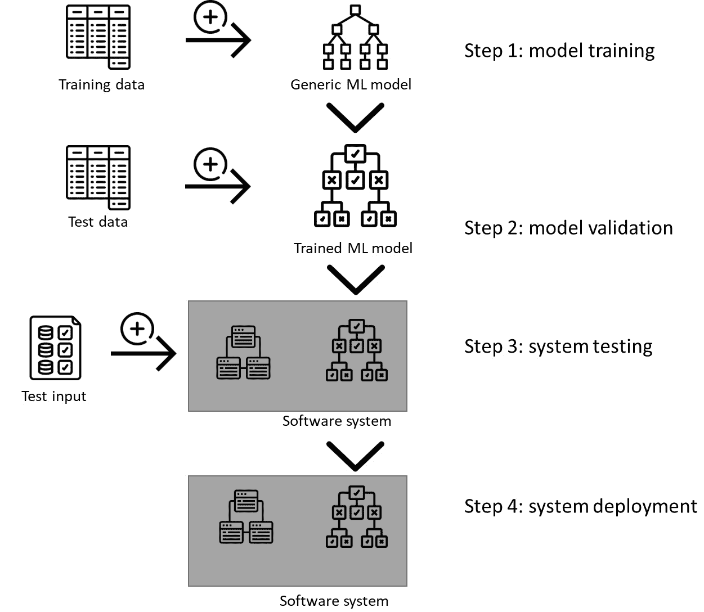
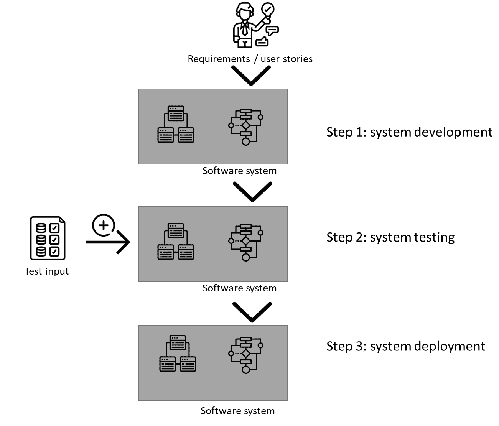
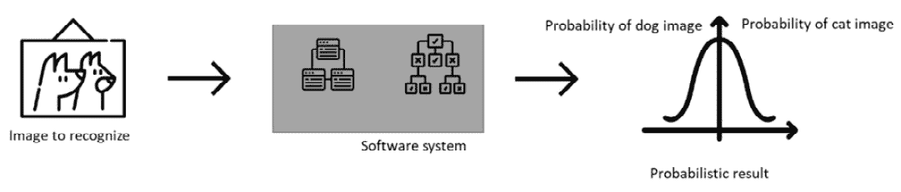
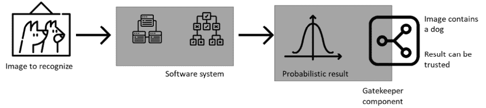
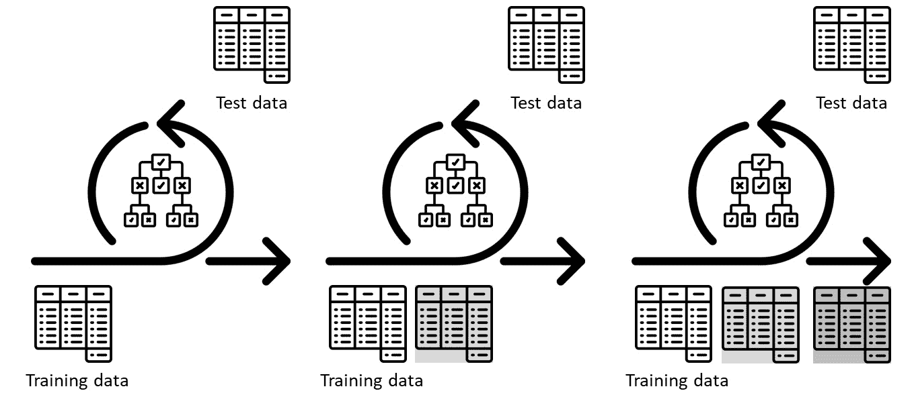
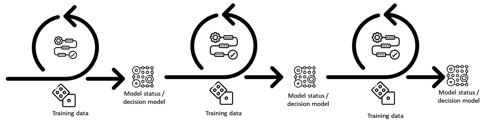
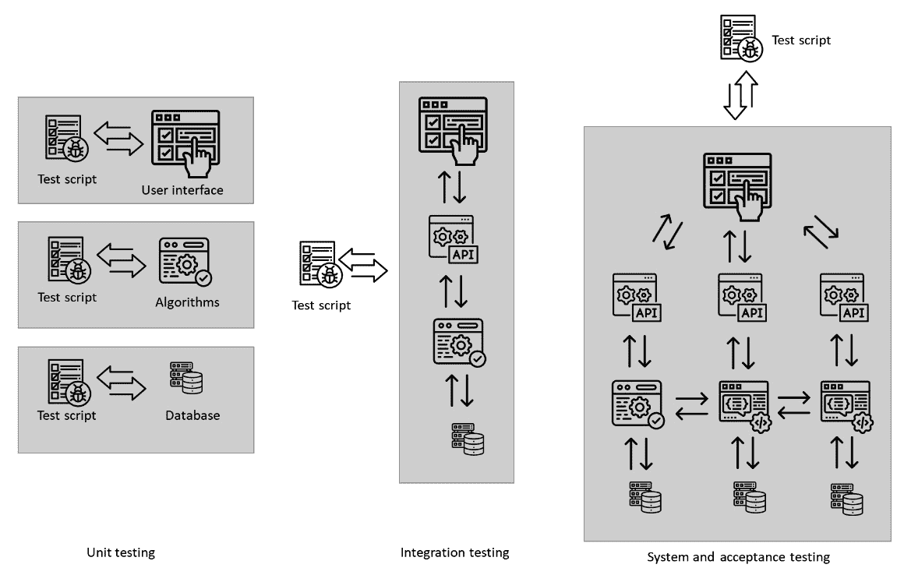

# 1

# 与传统软件相比，机器学习

机器学习软件是一种特殊的软件，它能在数据中找到模式，从中学习，甚至在新数据上重新创建这些模式。因此，开发机器学习软件的重点是找到合适的数据，将其与适当的算法匹配，并评估其性能。相反，传统软件的开发是以算法为前提的。基于软件需求，程序员开发解决特定任务的算法，然后对其进行测试。数据是次要的，尽管并非完全不重要。这两种类型的软件可以在同一软件系统中共存，但程序员必须确保它们之间的兼容性。

在本章中，我们将探讨这两种类型软件系统最合适的领域。我们将了解程序员用来创建这两种类型软件的软件开发过程。我们还将了解四种经典的机器学习软件类型——基于规则的学习、监督学习、无监督学习和强化学习。最后，我们将了解数据在传统和机器学习软件中的不同作用——在传统软件中作为预编程算法的输入，在机器学习软件中作为训练模型的输入。

本章介绍的最佳实践提供了何时选择每种类型软件以及如何评估这些类型软件优缺点的实用指导。通过探讨几个现代实例，我们将了解如何以机器学习算法为中心创建整个软件系统。

本章将涵盖以下主要内容：

+   机器学习不是传统软件

+   概率和软件——它们搭配得怎么样？

+   测试和验证——相同但不同

# 机器学习不是传统软件

尽管机器学习和人工智能自 20 世纪 50 年代由艾伦·图灵引入以来就已经存在，但它们只有在第一个 MYCIN 系统出现以及我们对机器学习系统的理解随时间变化后才开始流行。直到 2010 年代，我们才开始以今天（2023 年）的方式感知、设计和开发机器学习。在我看来，有两个关键时刻塑造了我们今天所看到的机器学习格局。

第一个关键时刻是在 2000 年代末和 2010 年代初对大数据的关注。随着智能手机的引入，公司开始收集和处理越来越多的数据，这些数据大多关于我们在网上的行为。其中一家完美掌握这一技术的公司是谷歌，它收集了我们搜索、在线行为以及使用谷歌操作系统 Android 的数据。随着收集到的数据量（及其速度/速度）的增加，其价值和对真实性的需求——即五个“V”——也随之增加。这五个“V”——量、速度、价值、真实性和多样性——需要一种新的数据处理方法。传统的基于关系型数据库（SQL）的方法在处理高速数据流时变得过于缓慢，这导致了 map-reduce 算法、分布式数据库和内存数据库的出现。传统的基于关系模式的处理方法对于数据的多样性来说过于约束，这导致了非 SQL 数据库的出现，这些数据库存储文档。

第二个关键时刻是现代机器学习算法——深度学习的兴起。深度学习算法被设计来处理非结构化数据，如文本、图像或音乐（与表格和矩阵形式的结构化数据相比）。传统的机器学习算法，如回归、决策树或随机森林，需要表格形式的数据。每一行是一个数据点，每一列是它的一个特征——一个属性。传统的模型被设计来处理相对较小的数据集。另一方面，深度学习算法可以处理大型数据集，并利用大型神经网络和其复杂的架构找到数据中的更复杂模式。

机器学习有时被称为*统计学习*，因为它基于统计方法。统计方法计算数据的属性（如平均值、标准偏差和系数），从而在数据中找到模式。机器学习的核心特征是它使用数据来寻找模式，从中学习，然后在新的数据上重复这些模式。我们称这种学习模式的方式为训练，将这些模式重复为推理，或者用机器学习的语言来说，就是*预测*。使用机器学习软件的主要好处来自于我们不需要设计算法——我们专注于要解决的问题以及我们用来解决问题的数据。“图 1.1”展示了这样一个机器学习软件流程图的实现示例。

首先，我们从库中导入一个通用的机器学习模型。这个通用模型具有它特有的所有元素，但它并未训练用于解决任何任务。这类模型的例子是一个决策树模型，它被设计用来学习数据中的依赖关系，以决策（或数据拆分）的形式呈现，之后它将使用这些信息来处理新数据。为了使这个模型变得有些用处，我们需要对其进行训练。为此，我们需要数据，我们称之为训练数据。

第二步，我们在新的数据上评估训练好的模型，我们称之为测试数据。评估过程使用训练好的模型，并应用它来检查其推理是否正确。更精确地说，它检查推理正确的程度。训练数据与测试数据具有相同的格式，但这两个数据集的内容是不同的。不应该有任何数据点同时存在于两者中。

在第三步，我们将模型作为软件系统的一部分使用。我们开发其他非机器学习组件，并将它们连接到训练好的模型。整个软件系统通常包括数据采集组件、实时验证组件、数据清洗组件、用户界面和业务逻辑组件。所有这些组件，包括机器学习模型，都为最终用户提供特定的功能。一旦软件系统开发完成，就需要对其进行测试，这时输入数据就派上用场。输入数据是最终用户输入到系统中的数据，例如通过填写表格。输入数据被设计成既包含输入又包含预期的输出——以测试软件系统是否正确工作。

最后一步是部署整个系统。部署可能非常不同，但大多数现代机器学习系统被组织成两部分——用于非机器学习组件的机载/边缘算法和用户界面，以及用于机器学习推理的离岸/云算法。尽管有可能在目标设备上部署系统的所有部分（包括机器学习和非机器学习组件），但复杂的机器学习模型需要大量的计算能力以实现良好的性能和无缝的用户体验。原则很简单——更多的数据/更复杂的数据意味着更复杂的模型，这意味着需要更多的计算能力：



图 1.1 – 机器学习软件开发典型流程

如*图 1**.1*所示，机器学习软件的一个关键元素是*模型*，这是经过特定数据训练的通用机器学习模型之一，例如神经网络。这类模型用于进行预测和推理。在大多数系统中，这种组件——模型——通常是用 Python 进行原型设计和开发的。

模型针对不同的数据集进行训练，因此，机器学习软件的核心特征是其对那个数据集的依赖性。这样的模型的一个例子是视觉系统，我们训练一个机器学习算法，如**卷积神经网络**（**CNN**），以对猫和狗的图像进行分类。

由于模型是在特定数据集上训练的，因此在进行推理时，它们在类似数据集上的表现最佳。例如，如果我们训练一个模型在 160 x 160 像素的灰度图像中识别猫和狗，该模型可以识别这样的图像中的猫和狗。然而，如果需要在该模型中识别彩色图像中的猫和狗而不是灰度图像，该模型的性能将非常差（如果有的话！）——分类的准确性将很低（接近 0）。

另一方面，当我们开发和设计传统软件系统时，我们并不那么依赖数据，如图**1.2**所示。这张图概述了传统、非机器学习软件的开发过程。尽管它被描绘为流程，但通常是一个迭代过程，其中**步骤 1**到**步骤 3**是循环进行的，每次循环都以向产品中添加新功能结束。

第一步是开发软件系统。这包括开发所有组件——用户界面、业务逻辑（处理）、数据处理和通信。除非软件工程师为了测试目的创建数据，否则这一步不涉及太多数据。

第二步是系统测试，我们使用输入数据来验证软件系统。本质上，这一步几乎与测试机器学习软件相同。输入数据与预期的结果数据相结合，这使得软件测试人员能够评估软件是否正确工作。

第三步是部署软件。部署可以通过多种方式进行。然而，如果我们考虑与机器学习软件在功能上相似的传统的软件，它通常更简单。它通常不需要在云上进行部署，就像机器学习模型一样：



图 1.2 - 传统软件开发典型流程

传统软件与基于机器学习的软件之间的主要区别在于，我们需要设计、开发和测试传统软件的所有元素。在基于机器学习的软件中，我们使用一个包含所有必要元素的空模型，并使用数据对其进行训练。我们不需要从头开始开发机器学习模型的各个组件。

传统软件的主要部分之一是*算法*，这是软件工程师从头开始根据需求或用户故事开发的。算法通常被编写为一系列按编程语言实现的步骤。自然地，所有算法都使用数据来操作它，但它们与机器学习系统不同。它们基于软件工程师的设计——*如果 x，则 y*或类似的东西。

我们通常将这些传统算法视为确定性的、可解释的和可追溯的。这意味着软件工程师的设计决策在算法中得到了记录，并且算法可以在之后进行分析。它们是确定性的，因为它们是基于规则编写的；没有从数据中训练或从数据中识别模式。它们是可解释的，因为它们是由程序员设计的，程序中的每一行都有预定义的含义。最后，它们是可追溯的，因为我们能够调试这些程序的每一步。

然而，也存在一个缺点——软件工程师需要彻底考虑所有边界情况，并且非常了解问题。软件工程师使用的这些数据只是为了支持他们分析算法，而不是用于训练算法。

一个可以使用机器学习算法和传统算法实现的系统示例是读取护照信息的系统。而不是使用机器学习进行图像识别，软件使用护照中的特定标记（通常是`<<<`字符序列）来标记行首或表示姓氏的字符序列的开始。这些标记可以使用基于规则的**光学字符识别**（**OCR**）算法快速识别，无需深度学习或 CNN。

因此，我想介绍第一条最佳实践。

最佳实践 #1

当你的问题集中在数据而不是算法时，使用机器学习算法。

在选择合适的技术时，我们需要了解它是否基于经典方法，其中算法的设计是重点，或者我们是否需要专注于处理数据和在其中寻找模式。通常，以下指导方针是有益的。

如果问题需要处理大量原始格式的数据，则使用机器学习方法。这类系统的例子包括对话机器人、图像识别工具、文本处理工具，甚至是预测系统。

然而，如果问题需要可追溯性和控制，则使用传统方法。这类系统的例子包括汽车中的控制软件（如防抱死制动系统、发动机控制等）和嵌入式系统。

如果问题需要根据现有数据生成新数据，即所谓的*数据处理*过程，请使用机器学习方法。这类系统的例子包括图像处理程序（DALL-E）、文本生成程序、深度伪造程序和源代码生成程序（GitHub Copilot）。

如果问题需要随着时间的推移进行适应和优化，请使用机器学习软件。这类系统的例子包括电网优化软件、计算机游戏中的非玩家角色行为组件、播放列表推荐系统，甚至现代汽车的 GPS 导航系统。

然而，如果问题需要稳定性和可追溯性，请使用传统方法。这类系统的例子包括医学中的诊断和推荐系统、汽车、飞机和火车中的安全关键系统，以及基础设施控制和监控系统。

## 监督学习、无监督学习和强化学习——这只是开始

现在是提到机器学习领域非常庞大的时候了，它被组织成三个主要领域——监督学习、无监督学习和强化学习。每个领域都有数百种不同的算法。例如，监督学习领域有超过 1,000 种算法，所有这些都可以通过元启发式算法如 AutoML 自动选择：

+   **监督学习**：这是一组基于标注数据进行训练的算法。这些算法中使用的数据需要有一个*目标*或*标签*。标签用于告诉算法寻找哪种模式。例如，这样的标签可以是监督学习模型需要识别的每张图像的*猫*或*狗*。历史上，监督学习算法是最古老的，因为它们直接来自如线性回归和多项式回归等统计方法。现代算法更先进，包括深度学习神经网络等方法，可以识别 3D 图像中的对象并相应地进行分割。该领域最先进的算法是深度学习和多模态模型，它们可以同时处理文本和图像。

    监督学习算法的一个子集是**自监督模型**，它们通常基于转换器架构。这些模型不需要数据中的标签，但它们使用数据本身作为标签。这些算法中最突出的例子是自然语言的翻译模型和图像或文本的生成模型。这些算法通过在原始文本中遮蔽单词并预测它们来训练。对于生成模型，这些算法通过遮蔽其输出的部分来预测它进行训练。

+   **无监督学习**：这是一组应用于在数据中寻找模式而不需要任何标签的模型。这些模型未经训练，但它们使用输入数据的统计特性来寻找模式。这类算法的例子包括聚类算法和语义映射算法。这些算法的输入数据没有标签，应用这些算法的目标是根据相似性在数据集中找到结构；然后，这些结构可以用来为这些数据添加标签。当我们得到购买产品、阅读书籍、听音乐或看电影的建议时，我们每天都会遇到这些算法。

+   **强化学习**：这是一组应用于数据以解决特定任务的模型。对于这些模型，我们除了需要提供数据外，还需要提供目标。这被称为*奖励函数*，它是一个定义我们何时达到目标的表达式。模型基于这个适应函数进行训练。这类模型的例子包括玩围棋、象棋或星际争霸的算法。这些算法也被用来解决困难的编程问题（AlphaCode）或优化能耗。

因此，让我介绍第二个最佳实践。

最佳实践 #2

在你开始开发机器学习系统之前，要进行尽职调查，并确定使用正确的算法组。

由于这些模型组各自具有不同的特性，解决不同的问题，并需要不同的数据，选择错误算法可能会造成高昂的代价。监督模型在解决与预测和分类相关的问题上非常出色。在这个领域中最强大的模型可以在选定的领域与人类竞争——例如，GitHub Copilot 可以创建可以以人类编写的程序。无监督模型在需要将实体分组并做出推荐时非常强大。最后，当我们需要连续优化并且每次数据或环境变化时都需要重新训练模型时，强化学习模型是最好的选择。

尽管所有这些模型都基于统计学习，但它们都是更大系统的一部分，以便使它们变得有用。因此，我们需要了解机器学习的这种概率和统计性质如何与传统、数字软件产品相结合。

## 传统机器学习和机器学习软件的例子

为了说明传统软件和机器学习软件之间的区别，让我们使用这两种范式实现相同的程序。我们将使用传统方法实现一个计算斐波那契序列的程序，这在计算机科学课程中我们已经见过无数次。然后，我们将使用机器学习模型——确切地说是一个模型——来实现相同的程序，即逻辑回归。

这里展示了传统的实现方式。它基于一个递归函数和一个测试它的循环：

```py
# a recursive function to calculate the fibonacci number
# this is a standard solution that is used in almost all
# of computer science examples
def fibRec(n):
  if n < 2:
      return n
  else:
      return fibRec(n-1) + fibRec(n-2)
# a short loop that uses the above function
for i in range(23):
  print(fibRec(i))
```

实现非常简单，基于算法——在我们的案例中，是`fibRec`函数。它很简单，但有其局限性。第一个是其递归实现，这会消耗资源。尽管它可以写成迭代形式，但它仍然存在第二个问题——它专注于计算而不是数据。

现在，让我们看看机器学习实现的步骤。我将通过将其分为两部分来解释——数据准备和模型训练/推理：

```py
#predicting fibonacci with linear regression
import pandas as pd
import numpy as np
from sklearn.linear_model import LinearRegression
# training data for the algorithm
# the first two columns are the numbers and the third column is the result
dfTrain = pd.DataFrame([[1, 1, 2],
                        [2, 1, 3],
                        [3, 2, 5],
                        [5, 3, 8],
                        [8, 5, 13]
])
# now, let's make some predictions
# we start the sequence as a list with the first two numbers
lstSequence = [0,1]
# we add the names of the columns to make it look better
dfTrain.columns = ['first number','second number','result']
```

在机器学习软件的情况下，我们准备数据来训练算法。在我们的案例中，这是`dfTrain` DataFrame。它是一个表格，包含机器学习算法需要找到模式的数字。

请注意，我们准备了两个数据集——`dfTrain`，其中包含训练算法所需的数字，以及`lstSequence`，这是我们稍后将找到的斐波那契数列。

现在，让我们开始训练算法：

```py
# algorithm to train
# here, we use linear regression
model = LinearRegression()
# now, the actual process of training the model
model.fit(dfTrain[['first number', 'second number']],
                               dfTrain['result'])
# printing the score of the model, i.e. how good the model is when trained
print(model.score(dfTrain[['first number', 'second number']], dfTrain['result']))
```

整个代码片段的魔力在于加粗的代码——`model.fit`方法的调用。此方法基于我们为其准备的数据训练逻辑回归模型。模型本身是在上一行的`model = LinearRegression()`行中创建的。

现在，我们可以使用以下代码片段进行推理或创建新的斐波那契数：

```py
# and loop through the newly predicted numbers
for k in range(23):
  # the line below is where the magic happens
  # it takes two numbers from the list
  # formats them to an array
  # and makes the prediction
  # since the model returns a float,
  # we need to convert it to it
  intFibonacci = int(model.predict(np.array([[lstSequence[k],lstSequence[k+1]]])))
  # add this new number to the list for the next iteration
  lstSequence.append(intFibonacci)
  # and print it
  print(intFibonacci)
```

此代码片段包含与上一个类似的行——`model.predict()`。此行使用先前创建的模型进行推理。由于斐波那契数列是递归的，我们需要在`lstSequence.append()`行中将新创建的数字添加到列表中，然后才能进行新的推理。

现在非常重要的一点是要强调这两种解决相同问题的方法之间的区别。传统的实现*暴露*了用于创建数字的算法。在那里我们看不到斐波那契数列，但我们可以看到它是如何计算的。机器学习实现*暴露*了用于创建数字的数据。我们看到第一个序列作为训练数据，但我们从未看到模型是如何创建该序列的。我们不知道该模型是否总是正确的——我们需要将其与真实序列进行测试——仅仅因为我们不知道算法是如何工作的。这引出了下一个部分，也就是关于概率的部分。

# 概率与软件——它们如何相得益彰

使机器学习软件与传统软件不同的基本特征是，机器学习模型的核心是统计学。这种统计学习意味着机器学习模型的输出是一个概率，因此它不如传统软件系统那样清晰。

概率，即模型的结果，意味着我们收到的答案是某事的概率。例如，如果我们对一张图片进行分类以检查它是否包含狗或猫，这个分类的结果就是一个概率——例如，有 93% 的概率该图片包含狗，有 7% 的概率包含猫。这如图 *图 1**.3* 所示：



图 1.3 – 机器学习软件的概率性质

要在其他软件部分或其他系统中使用这些概率结果，机器学习软件通常使用阈值（例如，如果 `x<0.5`）来只提供单一结果。这些阈值指定了哪些概率是可以接受的，以便将结果考虑为属于特定类别。以我们的图像分类为例，这个概率将是 50%——如果识别图像中狗的概率大于 50%，则模型表示该图像包含狗（不包含概率）。

将这些概率结果转换为数字，就像我们在前面的例子中所做的那样，通常是正确的，但并不总是如此。特别是在边缘情况下，例如当概率接近阈值的下限时，分类可能导致错误，从而引起软件故障。这样的故障通常是可以忽略的，但并不总是如此。在安全关键系统中，不应有任何错误，因为它们可能导致不必要的危害，并可能产生灾难性的后果。

在机器学习软件的概率性质成为问题，但我们仍然需要机器学习以利用其其他好处的情况下，我们可以构建机制来减轻误判、误分类和次优化的后果。这些机制可以保护机器学习模型，防止它们提出错误的建议。例如，当我们使用机器学习图像分类在汽车的安全系统中时，我们在模型周围构建了一个所谓的 *安全笼*。这个安全笼是一个非机器学习组件，它使用规则来检查在特定环境中某个建议、分类或预测是否合理。例如，它可以防止汽车在高速公路上突然停车，因为这是由前摄像头摄像头的误分类引起的。

因此，让我们看看另一个最佳实践，它鼓励在安全关键系统中使用机器学习软件。

最佳实践 #3

如果你的软件是安全关键的，确保你可以设计机制来防止由机器学习软件的概率性质引起的安全隐患。

尽管这个最佳实践是针对关键安全系统制定的，但它比这更普遍。即使是任务关键或业务关键系统，我们也可以构建机制来门控机器学习模型，并防止整个软件系统的错误行为。如何构建这样一个笼子的一个例子在*图 1**.4*中显示，其中门控器组件提供了一个额外的信号，表明模型的预测不可信/不可用：



图 1.4 – 机器学习模型的门控

在此图中，附加组件被放置在处理管道的最后，以确保结果始终是二元的（对于这种情况）。在其他情况下，这样的门控器可以与机器学习模型并行放置，并可以作为并行处理流程，检查数据质量而不是分类模型。

这样的门控器模型被相当频繁地使用，例如在感知系统检测对象时 – 模型检测单个图像中的对象，而门控器检查在一系列连续图像中是否一致地识别出相同的对象。它们可以形成冗余的处理通道和管道。它们可以形成可行性检查组件，或者可以将超出范围的输出结果更正为适当的值。最后，它们还可以将机器学习组件从管道中断开，并将这些管道适应软件的其他组件，通常是做出决策的算法 – 从而形成自适应或自修复的软件系统。

机器学习软件的这种概率性质意味着部署前的活动与传统软件不同。特别是，测试机器学习和传统软件的过程是不同的。

# 测试和评估 – 相同但不同

每个机器学习模型都需要经过验证，这意味着模型需要能够为模型之前未见过的一个数据集提供正确的推理。目标是评估模型是否在数据中学习了模式，数据本身，或者两者都不是。分类问题中正确性的典型度量是准确率（正确推断的实例数与所有分类实例数的商），**曲线下面积/接收器操作特性**（**AUROC**），以及**真正例率**（**TPR**）和**假正例率**（**FPR**）。

对于预测问题，模型的质量通过误预测来衡量，例如**均方误差**（**MSE**）。这些度量量化了预测中的错误 – 值越小，模型越好。*图 1**.5*显示了最常见形式监督学习的评估过程：



图 1.5 – 监督学习模型评估过程

在这个过程中，模型在每次训练迭代中都会接受不同的数据，之后它被用来对相同的测试数据进行推断（分类或回归）。测试数据在训练之前就被留出，并且仅在验证时作为模型的输入，永远不会在训练期间使用。

最后，一些模型是强化学习模型，其质量通过模型根据预定义函数（奖励函数）优化输出的能力来评估。这些措施允许算法优化其操作并找到最优解——例如，在遗传算法、自动驾驶汽车或能源网格操作中。这些模型的挑战在于没有单一的指标可以衡量性能——它取决于场景、函数以及模型接收到的训练量。一个著名的此类训练的例子是来自 1983 年电影《战争游戏》中的算法，其中主要超级计算机玩数百万个井字棋游戏，以理解没有获胜策略——游戏没有赢家。

*图 1.6*以图形方式展示了训练强化系统的过程：



图 1.6 – 强化学习训练过程

我们可能会产生这样的印象，当开发机器学习软件时，我们只需要训练、测试和验证机器学习模型。这远远不是真的。这些模型是更大系统的一部分，这意味着它们需要与其他组件集成；这些组件在*图 1.5*和*图 1.6*中描述的验证过程中并未得到验证。

每个软件系统在发布之前都需要经过严格的测试。测试的目标是尽可能多地发现和消除缺陷，以便软件用户能够体验到最佳的质量。通常，测试软件的过程是一个包含多个阶段的流程。测试过程遵循软件开发过程，并与之一致。最初，软件工程师（或测试人员）使用单元测试来验证其组件的正确性。

*图 1.7*展示了这三种测试类型是如何相互关联的。在单元测试中，重点是算法。通常，这意味着软件工程师必须测试单个函数和模块。集成测试关注模块之间的连接以及它们如何共同执行任务。最后，系统测试和验收测试关注整个软件产品。测试人员模仿真实用户来检查软件是否满足用户的需求：



图 1.7 – 三种软件测试类型 – 单元测试（左）、集成测试（中）和系统及验收测试（右）

软件测试过程与模型验证过程非常不同。尽管我们可以将单元测试误认为是模型验证，但这并不完全正确。模型验证过程的输出是其中一个指标（例如，准确率），而单元测试的输出是`true/false`——软件是否产生了预期的输出。对于软件公司来说，没有已知的缺陷（相当于错误的测试结果）是可以接受的。

在传统的软件测试中，软件工程师准备一系列测试用例来检查他们的软件是否按照规格工作。在机器学习软件中，测试过程基于留出一部分数据集（测试集）并检查训练好的模型（在训练集上）在该数据上的表现如何。

因此，这是我关于测试机器学习系统的第四个最佳实践。

最佳实践 #4

将机器学习软件测试作为机器学习模型开发典型训练-验证-评估流程的补充。

测试整个系统非常重要，因为整个软件系统包含处理机器学习组件概率性质的机制。其中一种机制是安全笼机制，我们可以监控机器学习组件的行为，防止它们向系统其他部分提供低质量信号（在边缘情况、接近决策边界、推理过程中）。

当我们测试软件时，我们也会了解机器学习组件的限制以及我们处理边缘情况的能力。这种知识对于在需要为软件指定操作环境时部署系统非常重要。我们需要了解与软件需求和规格相关的限制——我们软件的使用案例。更重要的是，我们需要了解软件使用的伦理和可靠性方面的含义。

我们将在*第十五章*和*第十六章*中讨论伦理问题，但重要的是要理解我们需要从一开始就考虑伦理问题。如果我们不这样做，我们的系统可能会犯出潜在的有害错误，例如大型人工智能招聘系统、人脸识别系统或自动驾驶汽车所犯的错误。这些有害错误涉及货币成本，但更重要的是，它们涉及对产品的信任损失，甚至错失机会。

# 摘要

机器学习与传统软件通常被视为两种替代品。然而，它们更像是兄弟姐妹——一个不能没有另一个。机器学习模型在解决约束性问题方面非常出色，但它们需要传统软件进行数据收集、准备和展示。

机器学习模型的概率性质需要额外的元素才能使它们在完整的软件产品环境中变得有用。因此，我们需要接受这种性质并利用它来发挥优势。即使对于安全关键系统，如果我们知道如何设计安全机制来防止危险后果，我们也可以（并且应该）使用机器学习。

在本章中，我们探讨了机器学习软件与传统软件之间的差异，同时关注如何设计能够包含这两部分的软件。我们还展示了机器学习软件不仅仅是训练、测试和评估模型，我们还展示了严格的测试对于部署可靠的软件是有意义且必要的。

现在，是时候进入下一章了，我们将揭开机器学习软件的黑箱，探讨我们需要开发一个完整的机器学习软件产品所需的内容——从数据采集开始，到用户交互结束。

# 参考文献

+   *Shortliffe, E.H. 等，基于计算机的临床治疗咨询：MYCIN 系统的解释和规则获取能力。计算机与生物医学研究，1975 年，第 8 卷第 4 期：* *p. 303-320。*

+   *James, G. 等，统计学习引论。第 112 卷。Springer，2013 年。*

+   *Saleh, H.，机器学习基础：使用 Python 和 scikit-learn 开始使用机器学习的最新发展。Packt 出版公司，2018 年。*

+   *Raschka, S. 和 V. Mirjalili, Python 机器学习：使用 Python、scikit-learn 和 TensorFlow 2 的机器学习和深度学习，Packt 出版公司，2019 年。*

+   *Sommerville, I.，软件工程。第 10 版。软件工程书籍。第 10 版，软件工程系列，2015 年。*

+   *Houpis, C.H.，G.B. Lamont 和 B. Lamont，数字控制系统：理论、硬件、软件。McGraw-Hill，纽约，1985 年。*

+   *Sawhney, R.，人工智能能否使软件开发更高效？LSE 商业评论，2021 年。*

+   *He, X.，K. Zhao 和 X. Chu，AutoML：最新技术的调查。知识库系统。2021 年，第 212 卷：* *p. 106622。*

+   *Reed, S. 等，通用代理。arXiv 预印本 *arXiv:2205.06175，2022 年。*

+   *Floridi, L. 和 M. Chiriatti，GPT-3：其本质、范围、局限性和后果。心智与机器，2020 年，第 30 卷第 4 期：* *p. 681-694。*

+   *Creswell, A. 等，生成对抗网络：概述。IEEE 信号处理杂志，2018 年，第 35 卷第 1 期：* *p. 53-65。*

+   *Celebi, M.E. 和 K. Aydin，无监督学习算法。Springer，2016 年。*

+   *Chen, J.X., 计算机发展的演变：AlphaGo。科学工程计算，2016 年。18(4)：* *p. 4-7.*

+   *Ko, J.-S., J.-H. Huh, and J.-C. Kim, 改进应用于工业 4.0 数据中心冷却系统风扇的能源效率和控制性能。电子学，2019 年。8(5)：* *p. 582.*

+   *Dastin, J., 亚马逊废弃了显示对女性有偏见的秘密 AI 招聘工具。在《数据与分析伦理》中。2018 年，Auerbach 出版社。* *p. 296-299.*

+   *Castelvecchi, D., 面部识别技术是否偏见过大以至于不能放任？自然，2020 年。587(7834)：* *p. 347-350.*

+   *Siddiqui, F., R. Lerman, 和 J.B. Merrill，自去年以来报告的特斯拉 Autopilot 涉及 273 起事故。在《华盛顿邮报》中。2022 年。*
