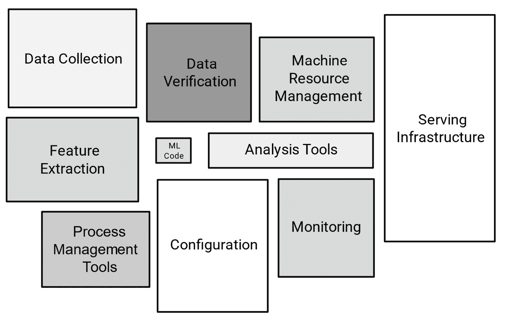
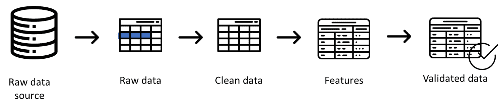
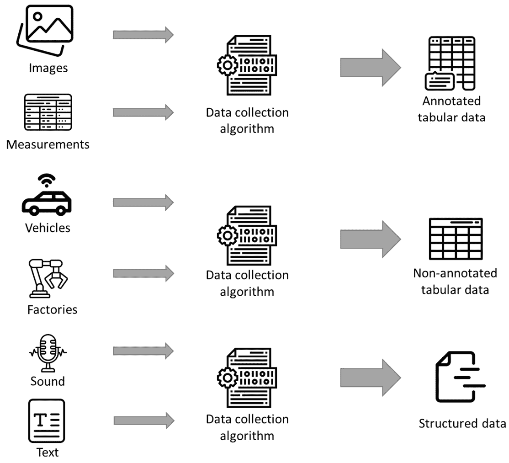
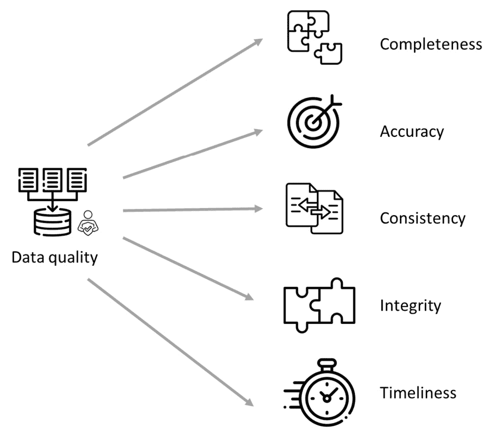
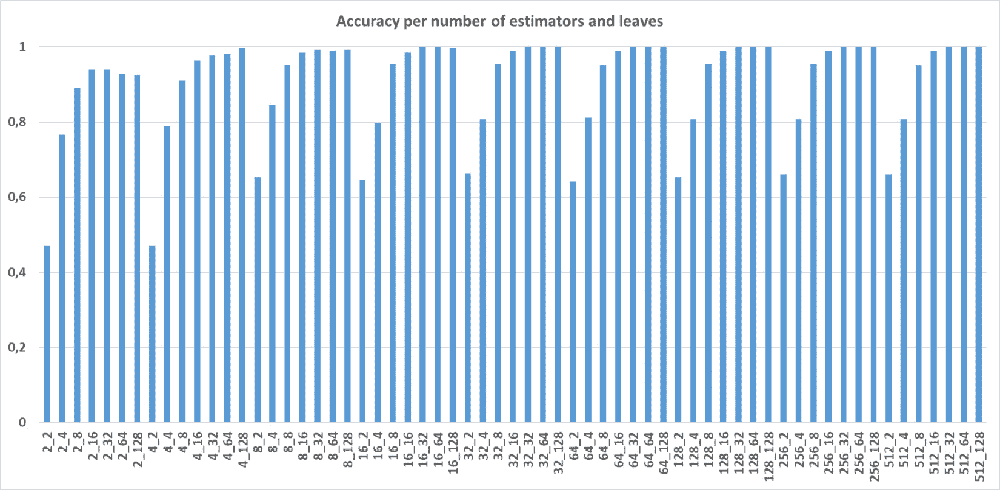
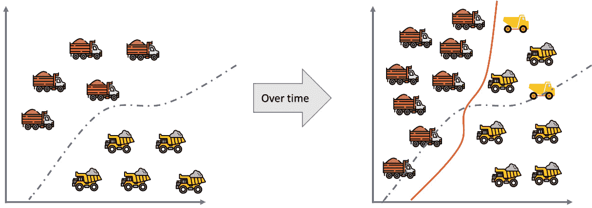
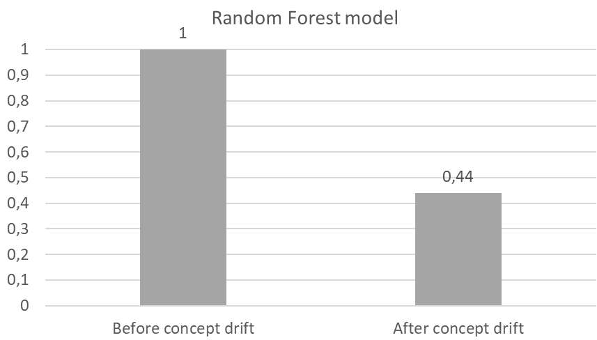
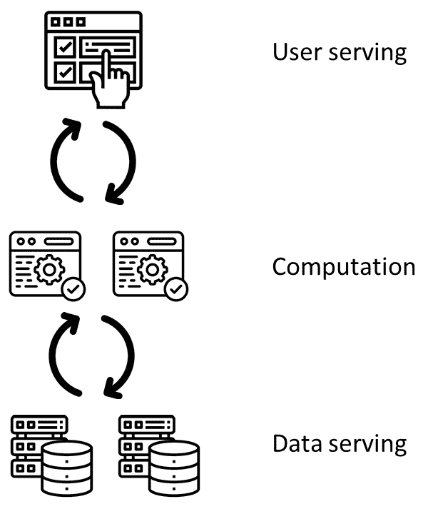
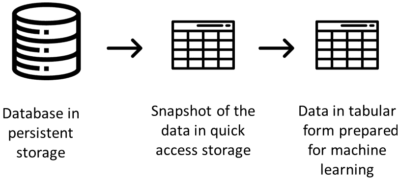
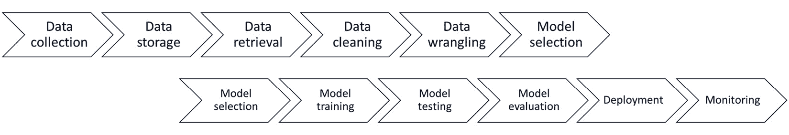

# 2

# 机器学习系统的要素

数据和算法对于机器学习系统至关重要，但它们远远不够。算法是生产级机器学习系统中最小的一部分。机器学习系统还需要数据、基础设施、监控和存储才能高效运行。对于大规模机器学习系统，我们需要确保我们可以包含一个良好的用户界面或包装模型在微服务中。

在现代软件系统中，结合所有必要的元素需要不同的专业能力——包括机器学习/数据科学工程专业知识、数据库工程、软件工程，以及最终的用户交互设计。在这些专业系统中，提供可靠的结果，为用户提供价值，比包含大量不必要的功能更为重要。同时，也很重要将机器学习的所有元素（数据、算法、存储、配置和基础设施）协同起来，而不是单独优化每一个元素——所有这些都是为了提供一个最优化系统，用于满足一个或多个最终用户的使用案例。

在本章中，我们将回顾专业机器学习系统的每个要素。我们将首先了解哪些要素是重要的以及为什么重要。然后，我们将探讨如何创建这些要素以及如何将它们组合成一个单一的机器学习系统——所谓的机器学习管道。

在本章中，我们将涵盖以下主要主题：

+   机器学习不仅仅是算法和数据

+   数据和算法

+   配置和监控

+   基础设施和资源管理

+   机器学习管道

# 生产级机器学习系统的要素

现代机器学习算法非常强大，因为它们使用大量数据，并包含大量可训练的参数。目前可用的最大模型是来自 OpenAI 的**生成预训练转换器 3**（**GPT-3**）（拥有 1750 亿个参数）和来自 NVIDIA 的 Megatron-Turing（3560 亿个参数）。这些模型可以创建文本（小说）和进行对话，还可以编写程序代码、创建用户界面或编写需求。

现在，这样的大型模型无法在台式电脑、笔记本电脑甚至专用服务器上使用。它们需要先进的计算基础设施，能够承受长期训练和评估这样的大型模型。这样的基础设施还需要提供自动为这些模型提供数据、监控训练过程，以及最终为用户提供访问模型进行推理的可能性。提供这种基础设施的现代方式之一是**机器学习即服务**（**MLaaS**）。MLaaS 为数据分析师或软件集成商提供了一个简单的方式来使用机器学习，因为它将基础设施的管理、监控和配置委托给专业公司。

*图 2**.1* 展示了基于现代机器学习软件系统的元素。从那时起，谷歌已经使用这些来描述生产机器学习系统。尽管这种设置存在变化，但原则仍然适用：



图 2.1 – 生产机器学习系统的元素

在这里，机器学习模型（**ML 代码**）是这些元素中最小的（谷歌，根据创意共享 4.0 属性许可，[`developers.google.com/machine-learning/crash-course/production-ml-systems`](https://developers.google.com/machine-learning/crash-course/production-ml-systems)）。从实际源代码的角度来看，在 Python 中，模型创建、训练和验证只需要三行代码（至少对于某些模型）：

```py
model = RandomForestRegressor(n_estimators=10, max_depth=2)
model.fit(X_train, Y_train)
Y_pred = model.predict(X_test)
```

第一行从模板创建模型——在这种情况下，它是一个包含 10 棵树的随机森林模型，每棵树最多有两个分割。随机森林是一种集成学习方法，在训练过程中构建多个决策树，并输出给定输入的各个树的类（分类）的模态。通过聚合多个树的结果，它减少了过拟合，并比单个决策树提供了更高的准确性。第二行基于训练数据（`X_train`，其中只包含预测者/输入特征，以及 `Y_train`，其中包含预测的类/输出特征）训练模型。最后，最后一行对测试数据（`X_test`）进行预测，以便在后续步骤中将预测结果与先知（预期值）进行比较。尽管这一行 `model.predict(X_test)` 不是生产系统的一部分，但我们仍然需要进行推断，因此我们的软件中始终存在类似的行。

因此，我们可以介绍下一个最佳实践。

最佳实践 #5

在设计机器学习软件时，应优先考虑数据和要解决的问题，而不是算法。

在这个例子中，我们从软件工程师的角度看到，机器学习代码相当小。在应用算法之前，我们需要正确准备数据，因为算法（`model.fit(X_train, Y_train)`）需要数据以特定格式存在——第一个参数是用于推断的数据（所谓的特征向量或输入数据样本），而第二个参数是目标值（所谓的决策类、参考值或目标值，具体取决于算法）。

# 数据和算法

现在，如果使用算法不是机器学习代码的主要部分，那么其他部分必须是——也就是说，数据处理。如图 *图 2**.1* 所示，在机器学习软件中管理数据包括三个领域：

1.  数据收集。

1.  特征提取。

1.  数据验证。

尽管我们将在整本书中回顾这些领域，但让我们来看看它们包含的内容。*图 2**.2* 展示了这些领域的处理流程：



图 2.2 – 数据收集和准备流程

注意，为算法准备数据的过程可能变得相当复杂。首先，我们需要从其来源中提取数据，这通常是一个数据库。它可以是测量、图像、文本或其他任何原始数据的数据库。一旦我们导出/提取了所需的数据，我们必须以原始数据格式存储它。这可以是表格的形式，如图中所示，也可以是一组原始文件，如图像。

# 数据收集

数据收集是将数据从其原始格式转换为机器学习算法可以接受的输入格式的过程。根据数据和算法的不同，这个过程可以采取不同的形式，如图 *图 2**.3* 所示：



图 2.3 – 不同形式的数据收集 – 示例

来自图像和测量（如时间序列）的数据通常被收集来进行分类和预测。这两类问题需要可用的事实数据，这在之前的代码示例中我们将其视为 `Y_train`。这些目标标签要么从原始数据中自动提取，要么通过标记过程手动添加。手动过程耗时较长，因此更倾向于自动化。

用于非监督学习和强化学习模型的数据通常被提取为无标签的表格数据。这些数据用于决策过程或优化过程，以找到给定问题的最佳解决方案。没有优化，我们的结果可能无法代表新数据。前面的图显示了此类问题的两个示例——工业 4.0 智能工厂的优化和自动驾驶汽车。在智能工厂中，强化学习模型用于优化生产过程或控制所谓的*暗工厂*，这些工厂完全不需要人工干预（*暗工厂*这个名字来源于这些工厂不需要灯光；机器人不需要灯光工作）。

用于现代自监督模型的常用数据通常来自文本或语音等来源。这些模型不需要数据的表格形式，但需要结构。例如，为了训练文本转换器模型，我们需要按句子（或段落）对文本进行分词，以便模型学习单词的上下文。

因此，接下来是我的下一个最佳实践。

最佳实践 #6

一旦你探索了你想要解决的问题，并了解了数据的可用性，决定你是否想使用监督学习、自监督学习、无监督学习或强化学习算法。

我们需要为不同的算法使用不同的数据是自然的。然而，我们还没有讨论如何决定算法。仅当我们想要静态地预测或分类数据时，选择监督学习才有意义——也就是说，我们训练模型，然后使用它进行推断。当我们训练并做出推断时，模型不会改变。我们没有进行调整，并且算法的重新训练是定期进行的——我把这称为“训练一次，预测多次”原则。

当我们在没有目标类的情况下使用/训练和应用算法时，我们可以选择无监督方法。其中一些算法也用于根据数据的属性对数据进行分组，例如，进行聚类。我把这称为“训练一次，预测一次”原则。

对于自监督模型，情况要有趣得多。在那里，我们可以使用一种称为“预训练”的方法。预训练意味着我们可以在没有任何特定上下文的大数据语料库上训练一个模型——例如，我们在维基百科的英文文本大型语料库上训练语言模型。然后，当我们想要将模型用于特定任务时，例如编写新文本，我们会在该任务上对其进行更多训练。我把这称为“训练多次，预测一次”原则，因为我们必须为每个任务进行预训练和训练模型。

最后，强化学习需要每次使用模型时都发生变化的数据。例如，当我们使用强化学习算法优化一个过程时，它每次使用时都会更新模型——我们可以说是从错误中学习。我把这称为“训练多次，预测多次”原则。

通常，原始数据不适合用于机器学习，因为它可能包含空数据点、噪声或损坏的文件。因此，我们需要清理这些错误数据点，例如通过删除空数据点（使用 Python 命令如`dataFrame.dropna(…)`)或使用数据插补技术。

现在，删除数据点和它们的插补之间存在根本性的区别。数据插补过程是我们根据相似数据点添加数据缺失属性。这就像在数字序列中填补空白——1, 2, 3, …, 5，其中我们填补数字 4。尽管填补数据增加了可用的数据点数量（从而使得模型更好），但它可以加强数据的某些属性，这可能导致模型学习。当数据量较小时，插补也相关；在大数据集中，删除缺失数据点更好（更资源高效且公平）。有了这个，我们就来到了我的下一个最佳实践。

最佳实践 #7

只有当你知道你希望加强哪些数据属性时，才使用数据插补，并且只为小数据集这样做。

最后，一旦我们有了可以工作的干净数据，我们就可以提取特征。在那里，我们可以使用针对我们手头问题的特定算法。例如，当我们处理文本数据时，我们可以使用简单的词袋模型来计算单词的频率，尽管我们也可以使用 word2vec 算法来嵌入单词共现的频率（我们将在下一章讨论的算法）。一旦我们提取了特征，我们就可以开始验证数据。这些特征可以强调我们之前没有看到的数据的某些属性。

以下是一个这样的例子：噪声——当我们有特征格式的数据时，我们可以检查数据中是否存在*属性*或*类别噪声*。类别噪声是与标签错误相关的一种现象——一个或多个数据点被错误地标记。类别噪声可以是矛盾示例或错误标记的数据点。这是一个危险的现象，因为它可能导致在训练和使用机器学习模型时性能低下。

属性噪声是指一个（或多个）属性被错误值所损坏。例如，包括错误值、缺失属性（特征）值和不相关值。

一旦数据经过验证，就可以用于算法。所以，让我们深入探讨数据处理管道的每个步骤。

现在，由于不同的算法以不同的方式使用数据，数据具有不同的形式。让我们探索每种算法应该如何构建数据结构。

## 特征提取

将原始数据转换为算法可用的格式的过程称为特征提取。这是一个应用特征提取算法来寻找数据中感兴趣属性的过程。提取特征算法根据问题和数据类型的不同而有所不同。

当我们处理文本数据时，我们可以使用几个算法，但让我来展示最简单的一个——词袋模型的使用。该算法简单地计算句子中单词的出现次数——它要么计算一个预定义的单词集，要么使用统计方法来找到最频繁的单词。让我们考虑以下句子：

`Mike is a` `tall boy.`

当我们无约束地使用词袋算法时，它提供了以下表格：

| **句子 ID** | **Mike** | **Is** | **A** | **tall** | **Boy** |
| --- | --- | --- | --- | --- | --- |
| `0` | `1` | `1` | `1` | `1` | `1` |

图 2.4 – 使用词袋模型提取的特征

该表包含句子中的所有单词作为特征。对于单个句子来说，它并不很有用，但如果我们添加另一个（句子 1），事情就会变得更加明显。所以，让我们添加以下句子：

`Mary is a` `smart girl.`

这将导致以下特征表：

| **句子 ID** | **Mike** | **Is** | **A** | **Tall** | **boy** | **smart** | **girl** |
| --- | --- | --- | --- | --- | --- | --- | --- |
| `0` | `1` | `1` | `1` | `1` | `1` | `0` | `0` |
| `1` | `0` | `1` | `1` | `0` | `0` | `1` | `1` |

图 2.5 – 从两个句子中提取的特征

现在，我们已经准备好将标签列添加到数据中。假设我们想要将每个句子标记为正面或负面。然后表格将增加一列 – `label` – 其中 **1** 表示句子是正面的，否则为 **0**：

| **句子 ID** | **Mike** | **Is** | **A** | **Tall** | **boy** | **smart** | **girl** | **Label** |
| --- | --- | --- | --- | --- | --- | --- | --- | --- |
| `0` | `1` | `1` | `1` | `1` | `1` | `0` | `0` | `1` |
| `1` | `0` | `1` | `1` | `0` | `0` | `1` | `1` | `1` |

图 2.6 – 添加到数据中的标签

现在，这些特征使我们能够看到两个句子之间的差异，然后我们可以使用这些差异来训练和测试机器学习算法。

然而，这种方法有两个重要的局限性。第一个局限性是，将所有句子中的所有单词作为列/特征是不切实际（如果不是不可能）的。对于任何非平凡文本，这会导致大型稀疏矩阵 – 浪费大量空间。第二个局限性是，我们通常会丢失重要的信息 – 例如，句子“Is Mike a boy?”会产生与第一个句子相同的特征向量。特征向量是描述机器学习中模式识别中某个对象的 *n*- 维数值特征向量。尽管这些句子并不相同，但它们变得无法区分，这可能导致如果它们被标记为不同类别时出现类别噪声。

如果我们使用统计方法来选择最频繁的单词作为特征，那么添加这种噪声的问题就会变得更加明显。在这里，我们可能会丢失一些重要的特征，这些特征以有用的方式区分数据点。因此，这种词袋方法在这里仅用于说明。在本书的后面部分，我们将更深入地探讨所谓的转换器，它们使用更先进的技术来提取特征。

## 数据验证

特征向量是机器学习算法的核心。它们最显著且直接地被监督机器学习算法使用。然而，数据验证的相同概念也适用于其他类型验证中使用的数据。

每种形式的数据验证都是一系列检查，确保数据包含所需的属性。以下是一个此类检查集的示例 *图 2**.7*：



图 2.7 – 数据质量检查示例

数据的完整性是描述我们的数据覆盖总分布多少的一个属性。这可以通过对象分布来衡量 – 例如，在我们的图像数据集中有多少种/型号/颜色的汽车 – 或者它可以通过属性来衡量 – 例如，我们的数据中包含的语言中有多少个单词。

准确性是描述我们的数据与经验（现实）世界相关性的一个属性。例如，我们可能想要检查我们数据集中的所有图像是否都与一个对象相关联，或者图像中的所有对象是否都被标注了。

一致性描述了数据内部结构的好坏以及相同的数据点是否以相同的方式进行标注。例如，在二元分类中，我们希望所有数据点都被标注为“0”和“1”或“True”和“False”，而不是两者都有。

完整性是检查数据是否可以与其他数据集成的属性。集成可以通过公共键或其他方式完成。例如，我们可以检查我们的图像是否包含允许我们知道图像拍摄地点的元数据。

最后，及时性是描述数据新鲜程度的属性。它检查数据是否包含最新的所需信息。例如，当我们设计推荐系统时，我们希望推荐新项目和旧项目，因此及时性很重要。

因此，这里是下一个最佳实践。

最佳实践 #8

选择对您的系统最相关的数据验证属性。

由于每个检查都需要在工作流程中增加额外的步骤，可能会减慢数据处理的速度，因此我们应该选择影响我们业务和架构的数据质量检查。如果我们开发一个希望提供最新推荐的系统，那么及时性是我们的首要任务，我们应该专注于这一点，而不是完整性。

虽然有很多用于数据验证和评估数据质量的框架，但我通常使用来自 AIMQ 框架的数据质量属性子集。AIMQ 框架已被设计为根据几个质量属性量化数据质量，类似于软件工程中的质量框架，如 ISO 25000 系列。我发现以下数据属性对于验证来说是最重要的：

+   数据无噪声

+   数据是新鲜的

+   数据适合用途

第一个属性是最重要的，因为噪声数据会导致机器学习算法性能低下。对于之前介绍的类别噪声，重要的是检查数据标签是否没有矛盾，并检查标签是否分配正确。矛盾标签可以自动找到，但错误标注的数据点需要人工评估。对于属性噪声，我们可以使用统计方法来识别具有低变异性（甚至完全恒定的）或对模型学习不贡献的完全随机的属性。让我们考虑一个句子的例子：

`Mike is not a` `tall boy.`

如果我们使用与之前句子相同的特征提取技术，我们的特征矩阵看起来就像*图 2*.8 中所示的那样。对于句子 2，我们使用与句子 0 和 1 相同的特征。由于最后一个句子仅在一词（not）上有所不同，这可能导致类别噪声。最后一列有一个标签，`not`。这可能会发生在我们在一个数据集上训练模型并将其应用于另一个数据集时。这意味着第一个句子和最后一个句子具有相同的特征向量，但标签不同：

| **句子 ID** | **Mike** | **Is** | **A** | **tall** | **boy** | **smart** | **girl** | **标签** |
| --- | --- | --- | --- | --- | --- | --- | --- | --- |
| `0` | `1` | `1` | `1` | `1` | `1` | `0` | `0` | `1` |
| `1` | `0` | `1` | `1` | `0` | `0` | `1` | `1` | `1` |
| `2` | `1` | `1` | `1` | `1` | `1` | `0` | `0` | `0` |

图 2.8 – 噪声数据集

对于同一特征向量存在两种不同的标注是有问题的，因为机器学习算法无法学习这些噪声数据点的模式。因此，我们需要验证数据是否无噪声。

数据需要具备的另一属性是其时效性——也就是说，数据必须是新鲜的。我们必须使用当前数据，而不是旧数据。在自动驾驶领域，这一点尤为重要，我们需要确保模型与最新条件（例如，最新的交通标志）保持更新。

最后，验证最重要的部分是评估数据是否适合使用。请注意，这种评估不能自动完成，因为它需要专家进行。

# 配置和监控

机器学习软件旨在进行专业化的设计、部署和维护。现代公司称这个过程为*MLOps*，这意味着同一个团队需要负责机器学习系统的开发和运营。这种扩展责任背后的逻辑是，团队最了解系统，因此可以以最佳方式对其进行配置、监控和维护。团队知道在开发系统时必须做出的设计决策，对数据的假设，以及在部署后需要监控的潜在风险。

## 配置

配置是开发团队做出的设计决策之一。团队配置机器学习模型的参数、执行环境和监控基础设施。让我们探讨第一个；后两个将在接下来的几节中讨论。

为了说明这个挑战，让我们看看一个用于在特定手术期间分类事件的随机森林分类器。该分类器，至少在其 Python 实现中，有 16 个超参数（[`scikit-learn.org/stable/modules/generated/sklearn.ensemble.RandomForestClassifier.html`](https://scikit-learn.org/stable/modules/generated/sklearn.ensemble.RandomForestClassifier.html)）。这些超参数中的每一个都有几个值，这意味着找到最佳的超参数集可能是一项繁琐的任务。

然而，在实践中，我们不需要探索所有超参数的值，也不需要探索所有组合。我们只需探索与我们任务和，通过扩展，数据集最相关的那些。我通常只探索两个超参数，因为它们是最重要的：树木的数量和树的深度。第一个决定了森林有多宽，而第二个决定了它有多深。指定这些参数的代码可能看起来像这样：

```py
rnd_clf = RandomForestClassifier(n_estimators=2,
                                    max_leaf_nodes=10,
                                    n_jobs=-1)
```

`n_estimators`超参数是树木的数量，而`max_depth`超参数是每棵树的深度。这些参数的值取决于数据集——我们有多少个特征以及有多少个数据点。如果我们有太多的树木和叶子，与特征和数据点的数量相比，分类器就会过拟合，无法从数据中泛化。这意味着分类器学会了识别每个实例，而不是识别数据中的模式——我们称这种情况为*过拟合*。

如果树木或叶子太少，那么泛化模式就会过于宽泛，因此我们在分类中观察到错误——至少比最佳分类器更多的错误。我们称这种情况为*欠拟合*，因为模型没有正确学习到模式。

因此，我们可以编写一段代码，根据预定义的值集搜索这两个参数的最佳组合。手动寻找最佳参数的代码可能看起来像这样：

```py
numEstimators = [2, 4, 8, 16, 32, 64, 128, 256, 512]
numLeaves = [2, 4, 8, 16, 32, 64, 128]
for nEst in numEstimators:
  for nLeaves in numLeaves:
    rnd_clf = RandomForestClassifier(n_estimators=nEst,
                                    max_leaf_nodes=nLeaves,
                                    n_jobs=-1)
    rnd_clf.fit(X_train, y_train)
    y_pred_rf = rnd_clf.predict(X_test)
    accuracy_rf = accuracy_score(y_test, y_pred_rf)
    print(f'Trees: {nEst}, Leaves: {nLeaves}, Acc: {accuracy_rf:.2f}')
```

突出显示的两行橙色代码展示了探索这些参数的两个循环——内循环循环使用这些参数训练分类器并打印输出。

让我们将这个算法应用于经历过手术的患者的生理数据。当我们把输出绘制在图表上，如图*图 2**.9 所示，我们可以观察到准确率是如何演变的。如果我们把树木的数量设置为 2，分类器的最佳性能是在 8 个叶子时达到的，但即使如此，它也无法完美地分类事件。对于四棵树，分类器在 128 个叶子时达到最佳性能，准确率为 1.0。从下面的图表中，我们可以看到增加更多的树木并没有显著提高结果：



图 2.9 – 每个估计器和叶子数目的准确率。x 轴的标签显示了树的数量（下划线之前）和叶子的数量（下划线之后）

对于这个例子，搜索最佳结果所需的时间相对较短——在标准笔记本电脑上最多需要 1-2 分钟。然而，如果我们想找到所有 16 个参数的最佳组合，我们将花费相当多的时间来做这件事。

有一种更自动化的方法来找到机器学习分类器的最佳参数——不同类型的搜索算法。其中最受欢迎的一种是 GridSearch 算法 ([`scikit-learn.org/stable/modules/generated/sklearn.model_selection.GridSearchCV.html`](https://scikit-learn.org/stable/modules/generated/sklearn.model_selection.GridSearchCV.html))，它的工作方式与我们的手动脚本类似，只不过它可以进行交叉验证，有多个分割，以及许多其他统计技巧来改进搜索。使用 GridSearch 算法搜索最佳解决方案可能看起来像这样：

```py
# Create the parameter grid based on the results of random search
param_grid = {
    'max_depth': [2, 4, 8, 16, 32, 64, 128],
    'n_estimators': [2, 4, 8, 16, 32, 64, 128, 256, 512]
}
# Create a base model
rf = RandomForestClassifier()
# Instantiate the grid search model
grid_search = GridSearchCV(estimator = rf,
                           param_grid = param_grid,
                           cv = 3,
                           n_jobs = -1)
# Fit the grid search to the data
grid_search.fit(X_train, y_train)
# get the best parameters
best_grid = grid_search.best_estimator_
# print the best parameters
print(grid_search.best_params_)
```

之前的代码找到了最佳解决方案并将其保存为 GridSearch 模型的 `best_estimator_` 参数。在这个数据集和模型的情况下，算法找到了最佳随机森林，它有 128 棵树（`n_estimators`）和 4 个层级（`max_depth`）。结果与手动找到的结果略有不同，但这并不意味着其中一种方法更优越。

然而，树的数量过多可能会导致过拟合，因此我宁愿选择有 4 棵树和 128 个叶子的模型，而不是有 128 棵树和 4 个层级的模型。或者，也许我还会使用一个介于两者之间的模型——也就是说，一个具有相同准确率但不太容易在深度或宽度上过拟合的模型。

这导致我的下一个最佳实践。

最佳实践 #9

在手动探索参数搜索空间之后，使用 GridSearch 和其他算法。

尽管自动参数搜索算法非常有用，但它们隐藏了数据的一些特性，并且不允许我们自行探索数据和参数。根据我的经验，理解数据、模型、其参数及其配置对于成功部署机器学习软件至关重要。我只有在尝试手动找到一些最优解之后才会使用 GridSearch（或其他优化算法），因为我希望理解数据。

## 监控

一旦机器学习系统配置完成，它就会被投入生产，通常作为更大软件系统的一部分。机器学习所做的推断是产品特性和背后商业模式的基础。因此，机器学习组件应尽可能减少错误。不幸的是，客户对失败和错误的关注程度高于正确运行的产品。

然而，机器学习系统的性能会随时间退化，但这并不是因为编程或设计质量低劣——这是概率计算的本质。因此，所有机器学习系统都需要监控和维护。

需要监控的一个方面被称为*概念漂移*。概念漂移是数据中的一个现象，这意味着数据中实体的分布因自然原因随时间变化。*图 2.10*展示了机器学习分类器（蓝色和红色线条）对黄色和橙色卡车图像的概念漂移：



图 2.10 – 概念漂移的示意图。物体（左侧）的原始分布随时间（右侧）变化，因此分类器必须重新训练（蓝色与红色线条）

左侧显示了用于训练模型的原始数据分布。模型在概念上表示为蓝色虚线。模型能够识别两种图像类别之间的差异。然而，随着时间的推移，数据可能会发生变化。新的图像可能会出现在数据集中，分布也会发生变化。原始模型在推理中开始出错，因此需要调整。重新训练的模型——即实心红色线条——捕捉了数据的新分布。

我们将数据集中的这种变化称为概念漂移。它在复杂的数据集和监督学习模型中更为常见，但概念漂移对非监督模型和强化学习模型的影响同样成问题。

*图 2.11*展示了应用于相同分布（直接在训练后）和经过某些操作后的数据的同一随机森林模型的表现。概念漂移在准确率从 1.0 降至 0.44 的降低中可见。该模型与*图 2.9*中的示例使用相同的数据进行训练，但应用于来自另一位患者的数据：



图 2.11 – 概念漂移前后性能降低的示例

因此，我想介绍我的下一个最佳实践。

最佳实践#10

在您的机器学习系统中始终包含监控机制。

即使是使用卡方统计测试来比较分布相似性的简单机制，包括监控概念漂移的机制，也能产生很大的影响。它使我们能够识别系统中的问题，解决问题，并防止它们扩散到软件的其他部分，甚至影响到软件的最终用户。

专业机器学习工程师在生产中设置了概念漂移的监控机制，这表明人工智能软件的退化。

# 基础设施和资源管理

机器学习软件所需的基础设施和资源被组织成两个区域——数据服务基础设施（例如，数据库）和计算基础设施（例如，GPU 计算平台）。还有服务基础设施，用于向最终用户提供服务。服务基础设施可以是桌面应用程序、嵌入式软件（例如自动驾驶汽车中的软件）、工具的插件（如 GitHub Co-pilot 的情况）或网站（如 ChatGPT）。然而，在这本书中，我们将重点关注数据服务基础设施和计算基础设施。

这两个区域都可以本地或远程部署。本地部署意味着我们使用公司自己的基础设施，而远程基础设施意味着我们使用云服务或其他供应商的服务。

从概念上讲，我们可以将这些区域视为相互依赖的，如图*图 2.12*所示：



图 2.12 – 服务、计算和数据服务基础设施之间的相互依赖关系

数据服务基础设施提供用于计算基础设施的数据。它包括数据库和其他数据源（例如，原始文件）。计算基础设施包括用于训练和测试机器学习模型的计算资源。最后，用户服务基础设施使用模型进行推理，并向最终用户提供服务和功能。

## 数据服务基础设施

数据服务基础设施是机器学习软件的基本组成部分之一，因为没有数据就没有机器学习。对数据有需求的人工智能应用对基础设施在性能、可靠性和可追溯性方面提出了新的要求。最后一个要求非常重要，因为机器学习训练数据决定了训练好的机器学习模型如何进行推理。在终端用户功能出现缺陷的情况下，软件工程师需要仔细审查用于构建失败机器学习系统的算法、模型和数据。

与传统软件相比，数据服务基础设施通常由三个不同的部分组成，如图*图 2.13*所示：



图 2.13 – 数据服务基础设施

数据存储在持久存储中，例如硬盘上的数据库。它可以是本地存储或云服务器上的存储。最重要的是，这些数据是安全的，并且可以用于进一步处理。持久存储的数据需要提取出来，以便在机器学习中使用。第一步是找到所需的数据快照——例如，通过选择用于训练的数据。快照需要准备并格式化为表格形式，以便机器学习算法可以使用这些数据进行推理。

今天，机器学习系统使用了几种不同类型的数据库。首先，有标准的数据库，数据以表格形式存储。这些是众所周知且在传统和机器学习软件中广泛使用的数据库。

新类型的数据库是非 SQL 数据库，如 Elasticsearch ([`www.elastic.co`](https://www.elastic.co))，它被设计用于存储文档，而不是表格。这些文档可以灵活索引，以便根据这些文档存储和检索数据。在机器学习软件的情况下，这些文档可以是图像、整个文本文档，甚至是声音数据。这对于以收集时的相同格式存储数据非常重要，这样我们就可以在需要时追踪数据。

不论数据库中数据的格式如何，它都是从数据库中检索出来并转换为表格形式的；我们将在*第三章*中讨论这一点。这种表格形式是数据处理所需的基础设施。

有了这些，我们就来到了我的下一个最佳实践。

最佳实践#11

为您的数据选择正确的数据库——从数据的角度而不是系统的角度来考虑。

虽然选择适合我们数据的正确数据库听起来很明显，但对于机器学习系统来说，选择最适合当前数据的数据库，而不是系统本身，这一点非常重要。例如，当我们使用自然语言处理模型时，我们应该将数据存储在我们可以轻松检索并按组织形式存储的文档中。

## 计算基础设施

计算基础设施可能会随时间变化。在机器学习系统开发的早期阶段，软件开发者通常会使用预配置的实验环境。这些可以是他们电脑上的 Jupyter Notebooks，也可以是预配置的服务，如 Google Colab 或 Microsoft Azure Notebooks。这种基础设施支持机器学习的快速原型设计，易于数据提供，无需设置高级功能。它们还允许我们轻松地根据需要调整计算资源，而无需添加或移除额外硬件。

这种方法的替代方案是使用我们自己的基础设施，在那里我们为您设置自己的服务器和运行时环境。这需要更多的努力，但它使我们能够完全控制计算资源，以及完全控制数据处理。对数据处理拥有完全控制权有时可能是选择基础设施最重要的因素。

因此，我的下一个最佳实践。

最佳实践 #12

如果可能，请使用云基础设施，因为它可以节省资源并减少对专业技术的需求。

专业 AI 工程师使用自有的基础设施进行原型设计和训练，并使用基于云的基础设施进行生产，因为它的扩展性更好，可以随着用户数量的增加而扩展。相反，即使用我们自己的基础设施，也只有在我们需要保留对数据或基础设施的完全控制时才是正确的。对于使用敏感客户数据、军事应用、安全应用和其他数据极其敏感的应用程序，可能需要完全控制。

幸运的是，我们有几个大型演员提供计算基础设施，以及一个庞大的小型演员生态系统。其中最大的三个是亚马逊网络服务（Amazon Web Services）、谷歌云（Google Cloud）和微软 Azure（Microsoft Azure），它们可以为小型和大型企业提供各种服务。亚马逊网络服务（[`aws.amazon.com`](https://aws.amazon.com)）专注于提供数据存储和处理基础设施。它通常用于必须快速处理大量数据的应用程序。该基础设施由专业人员维护，并可用于实现基于该平台构建的产品的高近完美可靠性。为了高效使用它，你通常必须与执行机器学习应用程序代码的容器和虚拟机一起工作。

谷歌云（[`cloud.google.com`](https://cloud.google.com)）专注于为数据密集型应用程序和计算密集型解决方案提供平台。多亏了谷歌的处理器（**张量处理单元**（**TPUs**）），该平台为训练和使用机器学习解决方案提供了一个非常高效的环境。谷歌云还提供免费的学习机器学习解决方案，形式为 Google Colab，它是 Python 平台 Jupyter Notebook（[`jupyter.org`](https://jupyter.org)）的扩展。

微软 Azure（[`azure.microsoft.com`](https://azure.microsoft.com)）专注于提供虚拟机形式的机器学习系统训练和部署平台。它还提供用于图像识别、分类和自然语言处理的现成可部署模型，甚至提供用于训练通用机器学习模型的平台。它是所有可用平台中最灵活的，也是最具可扩展性的。

除了这些平台，你还可以使用几个专门的平台，例如 Facebook 的机器学习平台，该平台专注于推荐系统。然而，由于专门的平台通常比较狭窄，如果我们想将我们的软件从一个平台迁移到另一个平台，我们需要记住可能存在的问题。

因此，我的下一个最佳实践。

最佳实践#13

早期确定你希望使用的生产环境，并将你的流程与该环境对齐。

我们需要决定是想使用亚马逊的、谷歌的，还是微软的云环境，或者我们是否想使用自己的基础设施以降低软件开发成本。虽然可以在这些环境之间移动我们的软件，但这并不简单，并且需要（最好）进行大量的测试和预部署验证，这通常伴随着显著的成本。

# 所有这些如何结合在一起——机器学习管道

在本章中，我们探讨了机器学习系统的主要特征，并将它们与传统软件系统进行了比较。让我们通过总结我们通常如何设计和描述机器学习系统——通过使用管道来完成这一比较。管道是一系列数据处理步骤，包括机器学习模型。典型的步骤集（也称为阶段）如图*2.14*所示：



图 2.14 – 机器学习管道中的典型步骤序列

这种类型的管道，尽管是线性绘制的，但通常是在循环中处理的，例如，监控概念漂移可以触发重新训练、重新测试和重新部署。

机器学习管道，就像图*2.14*中展示的那样，通常被描绘为整个系统的一部分组件集。然而，使用管道类比来展示它有助于我们理解机器学习系统是按步骤处理数据的。

在下一章中，我们将探讨管道的第一部分——数据处理。我们将从探索不同类型的数据以及这些类型的数据在现代软件系统中的收集、处理和使用开始。

# 参考文献

+   *Shortliffe, E.H.，等人，基于计算机的临床治疗咨询：MYCIN 系统的解释和规则获取能力。计算机与生物医学研究，1975 年。8(4)：* *p. 303-320。*

+   *Vaswani, A.，等人，注意力就是一切。神经信息处理系统进展，2017 年。30。*

+   *Dale, R.，GPT-3：它有什么用？自然语言工程，2021 年。27(1)：* *p. 113-118。*

+   *Smith, S.，等人，使用 deepspeed 和 megatron 训练 megatron-turing nlg 530b，一个大规模生成语言模型。arXiv 预印本* *arXiv:2201.11990，2022 年。*

+   *Lee, Y.W.，等人，AIMQ：信息质量评估的方法。信息与管理，2002 年。40(2)：* *p. 133-146。*

+   *Zenisek, J., F. Holzinger, and M. Affenzeller, 基于机器学习的概念漂移检测用于预测性维护。计算机与工业工程，2019\. 137:* *p. 106031.*

+   *Amershi, S., 等人. 软件工程在机器学习中的应用：一个案例研究。在 2019 IEEE/ACM 第 41 届国际软件工程会议：软件工程实践（ICSE-SEIP）。* *2019\. IEEE.*
