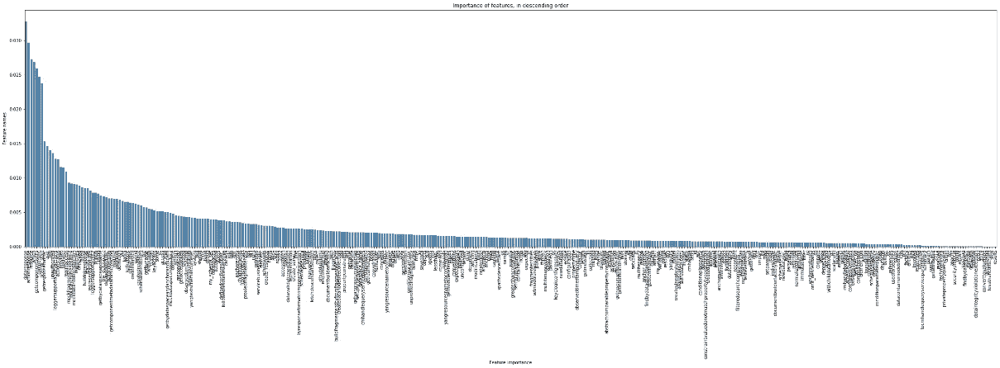
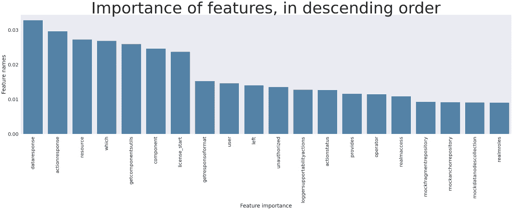
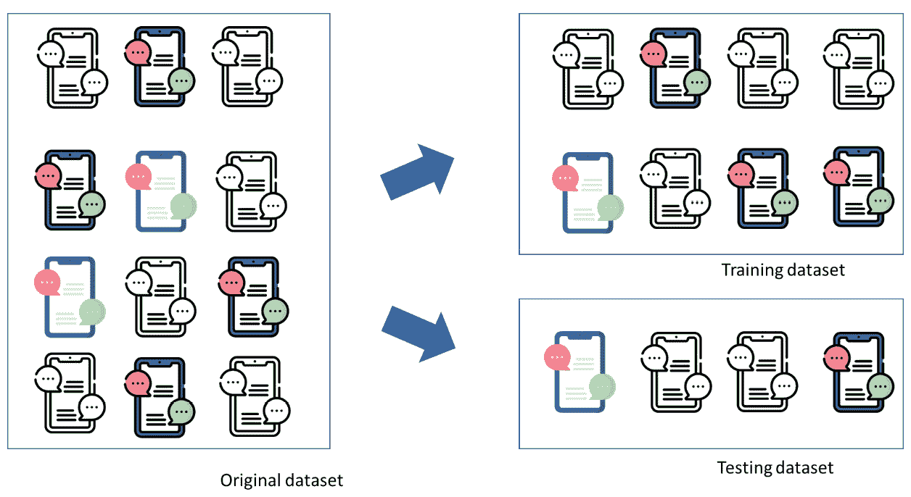
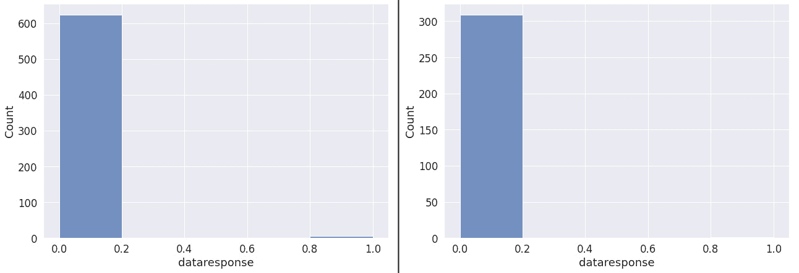
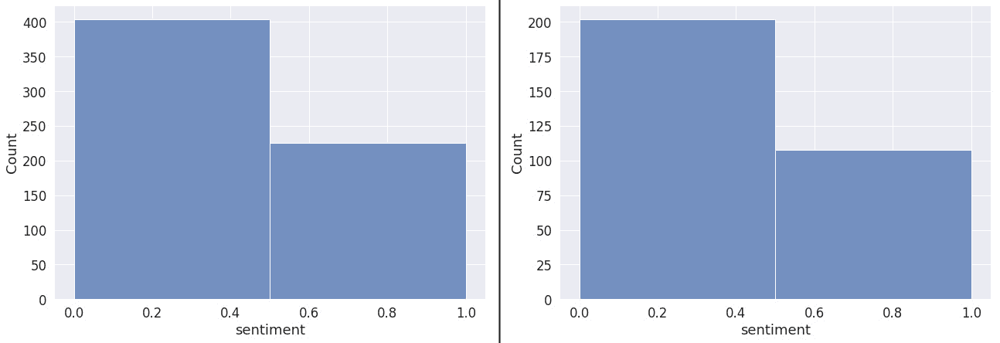

# 5

# 量化并改进数据属性

在机器学习系统中获取数据是一个漫长的过程。到目前为止，我们主要关注从源系统收集数据和从数据中清除噪声。然而，噪声并不是我们可能在数据中遇到的所有问题的唯一来源。缺失值或随机属性是可能导致机器学习系统出现问题的数据属性示例。即使输入数据的长度如果超出预期值，也可能成为问题。

在本章中，我们将更深入地探讨数据的属性以及如何改进它们。与上一章相比，我们将专注于特征向量而不是原始数据。特征向量已经是数据的一种转换，因此我们可以改变诸如噪声等属性，甚至改变数据被感知的方式。

我们将专注于文本的处理，这是许多机器学习算法中一个重要的部分。我们将从了解如何使用简单的算法，如词袋模型，将数据转换为特征向量开始。我们还将学习处理数据问题的技术。

本章将涵盖以下主要内容：

+   为机器学习系统量化数据属性

+   培育噪声——在干净数据集中的特征工程

+   处理噪声数据——机器学习算法和噪声消除

+   消除属性噪声——数据集精炼指南

# 特征工程——基础

特征工程是将原始数据转换为可用于机器学习算法的数字向量的过程。这个过程是有结构的，需要我们首先选择需要使用的特征提取机制——这取决于任务的类型——然后配置所选的特征提取机制。当所选算法配置完成后，我们可以使用它将原始输入数据转换为特征矩阵——我们称这个过程为特征提取。有时，在特征提取之前（或之后）需要处理数据，例如通过合并字段或去除噪声。这个过程称为数据整理。

特征提取机制的种类繁多，我们无法涵盖所有内容。我们也不需要这样做。然而，我们需要理解的是，特征提取机制的选择如何影响数据的属性。我们将在下一章深入探讨特征工程的过程，但在这章中，我们将介绍一个用于文本数据的基本算法。我们需要介绍它，以便了解它如何影响数据的属性以及如何应对特征提取过程中可能出现的最常见问题，包括处理需要清理的“脏”数据。

为了理解这个过程，让我们从使用称为“词袋”算法的特征提取的第一个文本示例开始。词袋是一种将文本转换为表示该文本中哪些单词的数字向量的方法。单词形成结果数据框中的特征集——或列。在下面的代码中，我们可以看到特征提取是如何工作的。我们使用了`sklearn`标准库来创建词袋特征向量。

在下面的代码片段中，我们取了两行 C 代码——`printf("Hello world!");`和`return 1`——然后将这些代码转换成特征矩阵：

```py
# create the feature extractor, i.e., BOW vectorizer
# please note the argument - max_features
# this argument says that we only want three features
# this will illustrate that we can get problems - e.g. noise
# when using too few features
vectorizer = CountVectorizer(max_features = 3)
# simple input data - two sentences
sentence1 = 'printf("Hello world!");'
sentence2 = 'return 1'
# creating the feature vectors for the input data
X = vectorizer.fit_transform([sentence1, sentence2])
# creating the data frame based on the vectorized data
df_bow_sklearn = pd.DataFrame(X.toarray(),
                              columns=vectorizer.get_feature_names(),
                              index=[sentence1, sentence2])
# take a peek at the featurized data
df_bow_sklearn.head()
```

粗体的行是创建`CodeVectorizer`类实例的语句，该类将给定的文本转换为特征向量。这包括提取已识别的特征。这一行有一个参数——`max_features = 3`。此参数告诉算法我们只想获取三个特征。在这个算法中，特征是输入文本中使用的单词。当我们向算法输入文本时，它提取标记（单词），然后对于每一行，它计算是否包含这些单词。这是在语句`X = vectorizer.fit_transform([sentence1, sentence2])`中完成的。当特征被提取后，结果数据集看起来如下：

|  | **Hello** | **printf** | **return** |
| --- | --- | --- | --- |
| **printf(“Hello world!”);** | **1** | **1** | **0** |
| **return 1** | **0** | **0** | **1** |

图 5.1 – 提取的特征创建此数据集

表格的第一行包含索引——输入算法的行——然后是`1`或`0`以表示该行包含词汇表中的单词。由于我们只要求三个特征，因此表格有三列——`Hello`、`printf`和`return`。如果我们更改`CountVectorizer()`的参数，我们将获得这两行中的完整标记列表，即`hello`、`printf`、`return`和`world`。

对于这两行简单的 C 代码，我们得到了四个特征，这说明了这种特征提取可以快速增加数据的大小。这使我们转向我的下一个最佳实践。

最佳实践#30

平衡特征数量与数据点数量。特征数量并不总是越多越好。

在创建特征向量时，重要的是提取有意义的特征，这些特征可以有效地区分数据点。然而，我们应该记住，拥有更多特征将需要更多内存，并且可能会使训练过程变慢。它也容易受到缺失数据点的问题。

# 清洁数据

当涉及到机器学习时，数据集的一个最棘手的问题就是存在空数据点或数据点的特征值为空。让我们通过前一个章节中提取的特征的例子来说明这一点。在下面的表格中，我引入了一个空数据点——中间列的`NaN`值。这意味着该值不存在。

|  | **Hello** | **printf** | **return** |
| --- | --- | --- | --- |
| **printf(“Hello world!”);** | **1** | **NaN** | **0** |
| **return 1** | **0** | **0** | **1** |

图 5.2 – 表格中包含 NaN 值的提取特征

如果我们将这些数据作为机器学习算法的输入，我们会得到一个错误消息，指出数据包含空值，并且模型无法训练。这是对这个问题的非常准确的描述——如果存在缺失值，那么模型不知道如何处理它，因此无法进行训练。

应对数据集中的空值有两种策略——移除数据点或插补值。

让我们从第一个策略开始——移除空数据点。以下脚本读取我们用于进一步计算的数据，即我们的代码审查数据：

```py
# read the file with gerrit code reviews
dfReviews = pd.read_csv('./gerrit_reviews.csv', sep=';')
# just checking that we have the right columns
# and the right data
dfReviews.head()
```

上述代码片段读取文件并显示其前 10 行，以便我们检查数据内容。

一旦我们将数据存储在内存中，我们可以检查包含实际代码行（命名为`LOC`）的列中包含 null 值的行数有多少。然后，我们还可以删除不包含任何数据的行/数据点。数据点的删除由以下行处理——`dfReviews = dfReviews.dropna()`。此语句删除了空行，并将结果保留在数据框本身中（`inplace=True`参数）：

```py
import numpy as np
# before we use the feature extractor, let's check if the data contains NANs
print(f'The data contains {dfReviews.LOC.isnull().sum()} empty rows')
# remove the empty rows
dfReviews = dfReviews.dropna()
# checking again, to make sure that it does not contain them
print(f'The data contains {dfReviews.LOC.isnull().sum()} empty rows')
```

在执行这些命令后，我们的数据集已准备好创建特征向量。我们可以使用`CountVectorizer`从数据集中提取特征，如下面的代码片段所示：

```py
# now, let's convert the code (LOC) column to the vector of features
# using BOW from the example above
vectorizer = CountVectorizer(min_df=2,
                             max_df=10)
dfFeatures = vectorizer.fit_transform(dfReviews.LOC)
# creating the data frame based on the vectorized data
df_bow_sklearn = pd.DataFrame(dfFeatures.toarray(),
                              columns=vectorizer.get_feature_names(),index=dfReviews.LOC)
# take a peek at the featurized data
df_bow_sklearn.head()
```

此代码片段创建了一个包含两个参数的词袋模型（`CountVectorizer`）——标记的最小频率和最大频率。这意味着算法计算每个标记在数据集中出现的频率统计，然后选择满足条件的标记。在我们的情况下，算法选择至少出现两次（`min_df=2`）且最多 20 次（`max_df=20`）的标记。

此代码片段的结果是一个包含 661 个特征的大型数据框，每个特征对应于我们数据集中每行代码。我们可以通过在执行上述代码片段后编写`len(df_bow_sklearn.columns)`来检查这一点。

为了检查如何处理数据插补，让我们打开一个不同的数据集并检查每列有多少缺失数据点。让我们读取名为`gerrit_reviews_nan.csv`的数据集，并使用以下代码片段列出该数据集中的缺失值：

```py
# read data with NaNs to a dataframe
dfNaNs = pd.read_csv('./gerrit_reviews_nan.csv', sep='$')
# before we use the feature extractor, let's check if the data contains NANs
print(f'The data contains {dfNaNs.isnull().sum()} NaN values')
```

由于这个代码片段，我们得到了一个包含列中缺失值数量的列表——列表的尾部如下：

```py
yangresourcesnametocontentmap     213
yangtextschemasourceset           205
yangtextschemasourcesetbuilder    208
yangtextschemasourcesetcache      207
yangutils                         185
```

有许多缺失值，因此，我们需要采用不同于删除它们的策略。如果我们删除所有这些值，我们将得到恰好 0 个数据点——这意味着每个（或更多）数据列中都有一个 NaN 值。所以，我们需要采用另一种策略——填充。

首先，我们需要为填充器准备数据，它只对特征有效。因此，我们需要从数据集中删除索引：

```py
# in order to use the imputer, we need to remove the index from the data
# we remove the index by first re-setting it (so that it becomes a regular column)
# and then by removing this column.
dfNaNs_features = dfNaNs.reset_index()
dfNaNs_features.drop(['LOC', 'index'], axis=1, inplace=True)
dfNaNs_features.head()
```

然后，我们可以创建填充器。在这个例子中，我使用了一种基于在现有数据上训练分类器，然后使用它来填充原始数据集中数据的现代方法。训练填充器的代码片段如下所示：

```py
# let's use iterative imputed to impute data to the dataframe
from sklearn.experimental import enable_iterative_imputer
from sklearn.impute import IterativeImputer
# create the instance of the imputer
imp = IterativeImputer(max_iter=3,
                       random_state=42,
                       verbose = 2)
# train the imputer on the features in the dataset
imp.fit(dfNaNs_features)
```

代码片段的最后一行是填充器的实际训练。在这之后，我们可以开始对数据集进行填充，如下面的代码片段所示：

```py
# now, we fill in the NaNs in the original dataset
npNoNaNs = imp.transform(dfNaNs_features)
dfNoNaNs = pd.DataFrame(npNoNaNs)
```

在这个片段之后，我们得到了一个包含填充值的数据集。现在，我们需要记住这些值只是估计值，而不是真实值。这个特定的数据集很好地说明了这一点。当我们执行`dfNoNaNs.head()`命令时，我们可以看到一些填充值是负数。由于我们的数据集是`CountVectorizer`的结果，负值不太可能。因此，我们可以使用另一种类型的填充器——`KNNImputer`。这个填充器使用最近邻算法找到最相似的数据点，并根据相似数据点的值填充缺失数据。这样，我们得到一组具有相同属性（例如，没有负值）的填充值，与数据集的其余部分相同。然而，填充值的模式是不同的。

因此，这是我的下一个最佳实践。

最佳实践#30

在数据点之间相似性预期是局部的情况下使用 KNNImputer。

当数据中有明显的局部结构时，`KNNImputer`表现良好，尤其是在相邻数据点在缺失值的特征上相似时。它可能对最近邻数（`k`）的选择敏感。

`IterativeImputer`在数据集中特征之间存在复杂关系和依赖时往往表现良好。它可能更适合那些缺失值不容易由局部模式解释的数据集。

然而，检查填充方法是否为当前数据集提供逻辑结果，以降低偏差风险。

# 数据管理中的噪声

缺失数据和矛盾的注释只是数据问题的一种类型。在许多情况下，由特征提取算法生成的大型数据集可能包含过多的信息。特征可能是多余的，不会对算法的最终结果做出贡献。许多机器学习模型可以处理特征中的噪声，称为属性噪声，但特征过多可能会在训练时间、存储甚至数据收集本身方面造成成本。

因此，我们也应该注意属性噪声，识别它，然后将其移除。

# 属性噪声

在大型数据集中减少属性噪声有几种方法。其中一种方法是一个名为**成对属性噪声检测算法**（**PANDA**）的算法。PANDA 成对比较特征并识别出哪些特征给数据集带来了噪声。这是一个非常有效的算法，但不幸的是计算量非常大。如果我们的数据集有几百个特征（这是我们真正需要使用这个算法的时候），我们需要大量的计算能力来识别这些对分析贡献甚微的特征。

幸运的是，有一些机器学习算法提供了类似的功能，同时计算开销很小。其中之一是随机森林算法，它允许你检索特征重要性值的集合。这些值是一种识别哪些特征在这个森林中的任何决策树中都没有被使用的方法。

让我们看看如何使用该算法提取和可视化特征的重要性。在这个例子中，我们将使用前几章从 Gerrit 工具中提取的数据：

```py
# importing the libraries to vectorize text
# and to manipulate dataframes
from sklearn.feature_extraction.text import CountVectorizer
import pandas as pd
# create the feature extractor, i.e., BOW vectorizer
# please note the argument - max_features
# this argument says that we only want three features
# this will illustrate that we can get problems - e.g. noise
# when using too few features
vectorizer = CountVectorizer()
# read the file with gerrit code reviews
dfReviews = pd.read_csv('./gerrit_reviews.csv', sep=';')
```

在这个数据集中，我们有两个列是从中提取特征的。第一列是`LOC`列，我们使用`CountVectorizer`来提取特征——就像在之前的例子中一样。这些特征将成为训练算法的`X`值。第二列是感兴趣的列是`message`列。`message`列用于提供`decision`类。为了转换消息文本，我们使用情感分析模型来识别消息是正面还是负面。

首先，让我们使用`CountVectorizer`提取 BOW 特征：

```py
# now, let's convert the code (LOC) column to the vector of features
# using BOW from the example above
vectorizer = CountVectorizer(min_df=2,
                             max_df=10)
dfFeatures = vectorizer.fit_transform(dfReviews.LOC)
# creating the data frame based on the vectorized data
df_bow_sklearn = pd.DataFrame(dfFeatures.toarray(),
                              columns=vectorizer.get_feature_names(),index=dfReviews.LOC)
```

要将信息转换为情感，我们可以使用 Hugging Face Hub 上公开可用的模型。我们需要使用以下命令安装相关库：`! pip install -q transformers`。一旦我们有了这些库，我们就可以开始特征提取：

```py
# using a classifier from the Hugging Face hub is quite straightforward
# we import the package and create the sentiment analysis pipeline
from transformers import pipeline
# when we create the pipeline, and do not provide the model
# then the huggingface hub will choose one for us
# and download it
sentiment_pipeline = pipeline("sentiment-analysis")
# now we are ready to get the sentiment from our reviews.
# let's supply it to the sentiment analysis pipeline
lstSentiments = sentiment_pipeline(list(dfReviewComments))
# transform the list to a dataframe
dfSentiments = pd.DataFrame(lstSentiments)
# and then we change the textual value of the sentiment to
# a numeric one – which we will use for the random forest
dfSentiment = dfSentiments.label.map({'NEGATIVE': 0, 'POSITIVE': 1})
```

上述代码片段使用了预训练的情感分析模型和一个来自标准管道的模型——`sentiment-analysis`。结果是包含正面或负面情感的 dataframe。

现在，我们有了`X`值——从代码行中提取的特征——以及预测的`Y`值——来自评论消息的情感。我们可以使用这些信息创建一个数据框，将其用作随机森林算法的输入，训练算法，并确定哪些特征对结果贡献最大：

```py
# now, we train the RandomForest classifier to get the most important features
# Note! This training does not use any data split, as we only want to find
# which features are important.
X = df_bow_sklearn.drop(['sentiment'], axis=1)
Y = df_bow_sklearn['sentiment']
# import the classifier – Random Forest
from sklearn.ensemble import RandomForestClassifier
# create the classifier
clf = RandomForestClassifier(max_depth=10, random_state=42)
# train the classifier
# please note that we do not check how good the classifier is
# only train it to find the features that are important.
Clf.fit(X,Y)
```

当随机森林模型训练完成后，我们可以提取重要特征列表：

```py
# now, let's check which of the features are the most important ones
# first we create a dataframe from this list
# then we sort it descending
# and then filter the ones that are not important
dfImportantFeatures = pd.DataFrame(clf.feature_importances_, index=X.columns, columns=['importance'])
# sorting values according to their importance
dfImportantFeatures.sort_values(by=['importance'],
                                ascending=False,
                                inplace=True)
# choosing only the ones that are important, skipping
# the features which have importance of 0
dfOnlyImportant = dfImportantFeatures[dfImportantFeatures['importance'] != 0]
# print the results
print(f'All features: {dfImportantFeatures.shape[0]}, but only {dfOnlyImportant.shape[0]} are used in predictions. ')
```

以下代码片段选择了重要性大于`0`的特征，并将它们列出。我们发现 662 个特征中有 363 个被用于预测。这意味着剩下的 270 个特征只是属性噪声。

我们还可以使用`seaborn`库可视化这些特征，如下面的代码片段所示：

```py
# we use matplotlib and seaborn to make the plot
import matplotlib.pyplot as plt
import seaborn as sns
# Define size of bar plot
# We make the x axis quite much larger than the y-axis since
# there is a lot of features to visualize
plt.figure(figsize=(40,10))
# plot seaborn bar chart
# we just use the blue color
sns.barplot(y=dfOnlyImportant['importance'],
            x=dfOnlyImportant.index,
            color='steelblue')
# we make the x-labels rotated so that we can fit
# all the features
plt.xticks(rotation=90)
# add chart labels
plt.title('Importance of features, in descending order')
plt.xlabel('Feature importance')
plt.ylabel('Feature names')
```

以下代码片段为数据集生成了以下图表：



图 5.3 – 具有许多特征的特性重要性图表

由于特征太多，图表变得非常杂乱且难以阅读，所以我们只能可视化前 20 个特征，以了解哪些是最重要的。



图 5.4 – 数据集中最重要的前 20 个特征

上述代码示例表明，我们可以将特征数量减少 41%，这几乎是特征数量的一半。算法只需几秒钟就能找到最重要的特征，这使得它成为减少数据集中属性噪声的完美候选。

最佳实践#31

使用随机森林分类器来消除不必要的特征，因为它提供了非常好的性能。

虽然我们并没有真正得到关于被移除的特征包含多少噪声的信息，但得到它们对预测算法没有价值的信息就足够了。因此，我建议在机器学习管道中使用这种特征减少技术，以减少我们管道的计算和存储需求。

# 数据分割

在设计基于机器学习的软件的过程中，另一个重要的属性是理解数据的分布，并且随后确保用于训练和测试的数据具有相似的分布。

用于训练和验证的数据分布很重要，因为机器学习模型识别模式并重新创建它们。这意味着如果训练数据中的数据分布与测试集中的数据分布不同，我们的模型就会错误地分类数据点。错误分类（或错误预测）是由于模型在训练数据中学习到的模式与测试数据不同所导致的。

让我们了解分割算法在理论上的工作原理以及在实际中的应用。**图 5.5**展示了在理论和概念层面上分割是如何工作的：



图 5.5 – 将数据分割为训练集和测试集

图标代表审查评论（和讨论）。每个图标代表一个自己的讨论线程，每种类型的图标反映不同的团队。分割数据集背后的想法是，这两个集合非常相似，但并不完全相同。因此，训练集和测试集中元素的分发需要尽可能相似。然而，这并不总是可能的，如图*5**.5*所示 – 训练集中有一种类型的四个图标中的三个，而测试集中只有一个。在设计机器学习软件时，我们需要考虑这个方面，尽管它只与机器学习模型相关。我们的数据处理管道应该包含检查，提供理解数据是否正确分布的能力，如果不正确，我们需要纠正它。如果我们不纠正它，我们的系统开始做出错误的预测。在基于机器学习的系统中，数据分布随时间的变化，这是自然的，被称为概念漂移。

让我们通过计算我们的 Gerrit 审查数据集中数据的分布来实际应用这个方法。首先，我们读取数据，然后使用`sklearn`的`train_test_split`方法创建一个随机分割：

```py
# then we read the dataset
dfData = pd.read_csv('./bow_sentiment.csv', sep='$')
# now, let's split the data into train and test
# using the random split
from sklearn.model_selection import train_test_split
X = dfData.drop(['LOC', 'sentiment'], axis=1)
y = dfData.sentiment
# now we are ready to split the data
# test_size parameter says that we want 1/3rd of the data in the test set
# random state allows us to replicate the same split over and over again
X_train, X_test, y_train, y_test =
                train_test_split(X, y,
                                 test_size=0.33,
                                 random_state=42)
```

在这个代码片段中，我们将预测值（`y`）与预测值（`X`）特征分开。然后我们使用`train_test_split`方法将数据集分割成两个部分 – 训练集中的三分之二数据和测试集中的一分之一数据。这个 2:1 的比例是最常见的，但根据应用和数据集的不同，我们也可能遇到 4:1 的比例。

现在我们有了两组数据，我们应该探索它们的分布是否相似。本质上，我们应该对每个特征和预测变量（`y`）都这样做，但在我们的数据集中，我们有 662 个特征，这意味着我们可能需要进行如此多的比较。所以，为了举例，我们只可视化其中一个 – 在我们之前的例子中被认为是最重要的一个 – `dataresponse`：

```py
# import plotting libraries
import matplotlib.pyplot as plt
import seaborn as sns
# we make the figure a bit larger
# and the font a bit more visible
plt.figure(figsize=(10,7))
sns.set(font_scale=1.5)
# here we visualize the histogram using seaborn
# we take only one of the variables, please see the list of columns
# above, or use print(X_train.columns) to get the list
# I chose the one that was the most important one
# for the prediction algorithm
sns.histplot(data=X_train['dataresponse'],
             binwidth=0.2)
```

我们也将对测试集进行同样的操作：

```py
plt.figure(figsize=(10,7))
sns.set(font_scale=1.5)
sns.histplot(data=X_test['dataresponse'],
             binwidth=0.2)
```

这两个片段产生了两个直方图，显示了该变量的分布。它们在*图 5**.6*中展示：



图 5.6 – 训练集和测试集中数据响应特征的分布

列车集的分布位于左侧，测试集的分布位于右侧。乍一看，分布显示只有一个值 - 0 值。因此，我们需要更深入地手动探索数据。我们可以通过计算每个值（0 和 1）的实体数量来检查分布：

```py
# we can even check the count of each of these values
X_train_one_feature = X_train.groupby(by='dataresponse').count()
X_train_one_feature
# we can even check the count of each of these values
X_test_one_feature = X_test.groupby(by='dataresponse').count()
X_test_one_feature
```

从前面的计算中，我们发现训练集中有 624 个 0 值和 5 个 1 值，测试集中有 309 个 0 值和 1 个 1 值。这些比例并不完全相同，但考虑到规模——0 值显著多于 1 值——这不会对机器学习模型产生任何影响。

我们数据集中的特征应该具有相同的分布，`Y`值——预测变量也是如此。我们可以使用相同的技巧来可视化`Y`值之间的类别分布。下面的代码片段正是这样做的：

```py
# we make the figure a bit larger
# and the font a bit more visible
plt.figure(figsize=(10,7))
sns.set(font_scale=1.5)
sns.histplot(data=y_train, binwidth=0.5)
sns.histplot(data=y_test,  binwidth=0.5)
```

此代码片段生成两个图表，显示了两个类别的差异。它们在*图 5.7*中展示：



图 5.7 – 训练和测试数据中类（0 和 1）的分布

预测的`Y`变量 0 值是负面情绪值，而 1 值是正面情绪值。尽管两个图表中 y 轴的刻度不同，但分布非常相似——在负面（0）情绪和正面（1）情绪的数量上大约是 2:1。

类别不平衡——0 的数量远大于 1 的数量，但分布相同。类别不平衡的事实意味着在此数据上训练的模型略微偏向负面情绪而不是正面情绪。然而，这反映了我们的经验观察：在代码审查中，审查员更可能评论需要改进的代码，而不是写得很好的代码。

最佳实践#32

尽可能保留数据的原始分布，因为它反映了经验观察。

尽管我们可以使用欠采样、过采样或类似的技术来平衡类别，但我们应尽可能保持原始分布。改变分布使模型在预测/分类方面“更公平”，但它改变了观察到的现象的本质。

# 机器学习模型如何处理噪声

从数据集中减少噪声是一个耗时的工作，而且也是一个难以自动化的任务。我们需要了解数据中是否存在噪声，数据中存在什么类型的噪声，以及如何去除它。幸运的是，大多数机器学习算法在处理噪声方面相当出色。

例如，我们迄今为止使用得相当多的算法——随机森林——对数据集中的噪声相当鲁棒。随机森林是一个集成模型，这意味着它由几个独立的决策树组成，这些决策树内部“投票”选择最佳结果。因此，这个过程可以过滤掉噪声，并趋向于数据中包含的模式。

深度学习算法也有类似的特性——通过利用大量的小神经元，这些网络对大数据集中的噪声具有鲁棒性。它们可以强制数据中的模式。

最佳实践 #33

在大型软件系统中，如果可能的话，依赖机器学习模型来处理数据中的噪声。

这听起来可能像是在提出一条简单的出路，但事实并非如此。数据的手动清理至关重要，但它也很慢且成本高昂。因此，在大型系统操作期间，最好选择一个对数据噪声鲁棒且同时使用更干净数据的模型。由于手动噪声处理过程需要时间和精力，依赖它们将为我们的产品运营带来不必要的成本。

因此，使用为我们做这件事的算法并因此创建可靠且维护成本最低的产品会更好。与其进行昂贵的噪声清理过程，不如重新训练算法，让它为你做这项工作。

在下一章中，我们将探讨数据可视化技术。这些技术帮助我们理解数据中的依赖关系，以及它是否揭示了可以被机器学习模型学习到的特征。

# 参考文献

+   *斯科特，S. 和 S. 马特温. 文本分类的特征工程. 在 *ICML. 1999.*

+   *库尔卡尼，A. 等，将文本转换为特征. 自然语言处理食谱：使用 Python 的机器学习和深度学习解锁文本数据，2021:* *p. 63-106.*

+   *范·胡尔斯，J.D.，T.M. 科什戈法塔和黄，成对属性噪声检测算法. 知识与信息系统，2007\. 11:* *p. 171-190.*

+   *李，X. 等，利用 BERT 进行端到端基于方面的情感分析. arXiv 预印本* *arXiv:1910.00883, 2019.*

+   *徐，Y. 和 R. 古德雷克，关于分割训练集和验证集：比较交叉验证、自助法和系统抽样在估计监督学习泛化性能方面的研究. 分析与测试杂志，2018\. 2(3):* *p. 249-262.*

+   *莫辛，V. 等. 比较测试深度学习算法的输入优先级技术. 在 2022 年 48 届欧姆尼微软件工程和高级应用会议（SEAA）. 2022\. IEEE.*

+   *刘，X.-Y.，吴，J. 和 周志华，探索性欠采样用于类别不平衡学习. IEEE 系统，人，和网络，第 B 部分（网络学），2008\. 39(2):* *p. 539-550.*

+   *阿特拉，A. 等，不同机器学习算法对噪声的敏感性. 计算机科学学院杂志，2011\. 26(5):* *p. 96-103.*
