# 第六章：在机器学习系统中处理数据

我们在*第三章*中讨论了数据，其中我们介绍了在机器学习系统中使用的数据类型。在本章中，我们将更深入地探讨数据和算法相互交织的方式。我们将以通用术语讨论数据，但在本章中，我们将解释机器学习系统中需要哪种类型的数据。我将解释所有类型的数据都是以数值形式使用的——要么作为特征向量，要么作为更复杂的特征矩阵。然后，我将解释将非结构化数据（例如，文本）转换为结构化数据的必要性。本章将为深入探讨每种类型的数据奠定基础，这是下一章的内容。

在本章中，我们将做以下工作：

+   讨论测量过程（获取数值数据）以及在该过程中使用的测量仪器

+   使用 Matplotlib 和 Seaborn 库可视化数值数据

+   使用**主成分分析**（**PCA**）降低维度

+   使用 Hugging Face 的 Dataset 模块下载和处理图像和文本数据

# 数值数据

数值数据通常以数字表的形式出现，类似于数据库表。这种形式中最常见的数据之一是指标数据——例如，自 1980 年代以来一直使用的标准面向对象指标。

数值数据通常是测量过程的成果。测量过程是一个使用测量仪器将实体的经验属性量化为数字的过程。这个过程必须保证重要的经验属性在数学领域中得以保留——也就是说，在数字中。*图 6.1*展示了这一过程的例子：

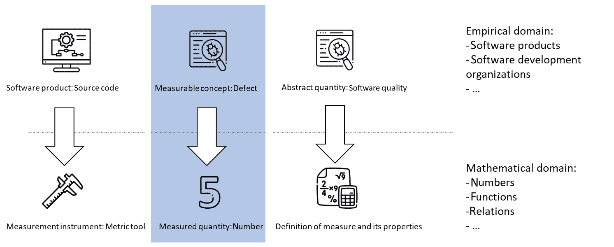

图 6.1 – 使用缺陷进行质量测量的测量过程示例

这个过程的重要部分包括三个要素。首先是测量仪器，它需要将经验属性真实地映射到数字上。然后是测量标准，例如 ISO **计量学词汇**（**VIM**），被称为测量的真值。最后，我们有测量过程的成果——将测量仪器应用于特定的测量实体——这会产生一个数字，即测量属性的量化。然而，一个单一的数字并不能表征整个软件产品或其任何部分，无论它对测量实体的真实性如何。因此，在实践中，我们使用多个测量仪器来创建对测量实体的整体视图。

这就是数值数据发挥作用的地方。每个表征测量实体的测量值都存储在数据库或表中——每个实体成为一行，每个度量成为一列。我们拥有的列越多，测量的实体特征就越好。然而，同时，我们收集的度量越多，它们相互关联、相关（正相关性或负相关性）以及重叠的风险就越高。因此，我们需要对数据进行一些处理，以便对其有一个大致的了解。所以，首先，我们必须可视化数据。

本章的这一部分所使用的数据来自 Alhustain 和 Sultan 的一篇论文（预测面向对象度量的相对阈值。"2021 IEEE/ACM 国际技术债务会议（TechDebt）。IEEE，2021）并可在 Zenodo 上获得（[`zenodo.org/records/4625975`](https://zenodo.org/records/4625975)），这是软件工程研究中最常用的开放数据存储库之一。数据包含典型面向对象度量度量的值：

+   **对象之间的耦合**（**CB**）：从测量实体（类）到其他类的引用数量

+   **直接类耦合**（**DCC**）：从此类到其他类的连接数量（例如，关联）

+   **导出耦合**（**ExportCoupling**）：从类的出去连接数量

+   **导入耦合**（**ImportCoupling**）：到类的进入连接数量

+   **方法数量**（**NOM**）：类中的方法数量

+   **按类加权的度量方法**（**WMC**）：类中方法的数量，按其大小加权

+   **缺陷计数**（**defect**）：为此类发现的缺陷数量

数据集描述了来自 Apache 基金会的几个软件项目——例如，Ant 工具。对于每个产品，测量的实体是项目中的类。

那么，让我们从下一个最佳实践开始，这将引导我们进入可视化阶段。

最佳实践 #34

在处理数值数据时，首先可视化它，从数据的概览视图开始。

当我处理数值数据时，我通常从可视化开始。我从数据的概述开始，然后逐步深入到细节。

## 总结数据

使用表格、交叉表以及图表可以总结数据。我通常开始工作的图表之一就是相关图——它是一个显示数据集中每个变量/度量之间相关性的图表。

因此，让我们将数据读入笔记本并开始可视化：

```py
# read the file with data using openpyxl
import pandas as pd
# we read the data from the excel file,
# which is the defect data from the ant 1.3 system
dfDataAnt13 = pd.read_excel('./chapter_6_dataset_numerical.xlsx',
                            sheet_name='ant_1_3',
                            index_col=0)
```

一旦数据集存储在内存中，我们可以使用 Python 的 Seaborn 库通过相关图来可视化它。以下代码就是这样做：

```py
# now, let's visualize the data using correlograms
# for that, we use the seaborn library
import seaborn as sns
import matplotlib.pyplot as plt
# in seaborn, the correlogram is called
# pairplot
sns.pairplot(dfDataAnt13)
```

此代码片段的结果是以下相关图：

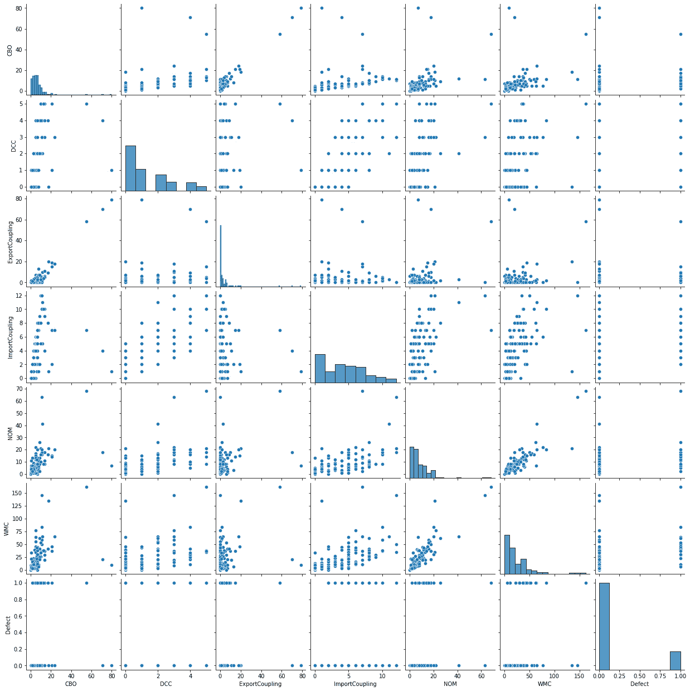

图 6.2 – 来自 Alhusain 论文数据集的相关图

这里有趣的部分是展示在对角线单元格中的每个度量值的分布。在我们的数据中，这种分布对于某些变量来说很难解释，因此我们可以以不同的方式可视化它。当我们用`sns.pairplot(dfDataAnt13, diag_kind="kde")`替换代码片段的最后一行时，我们得到一个新的可视化，可以更好地查看分布。这显示在*图 6.3*：

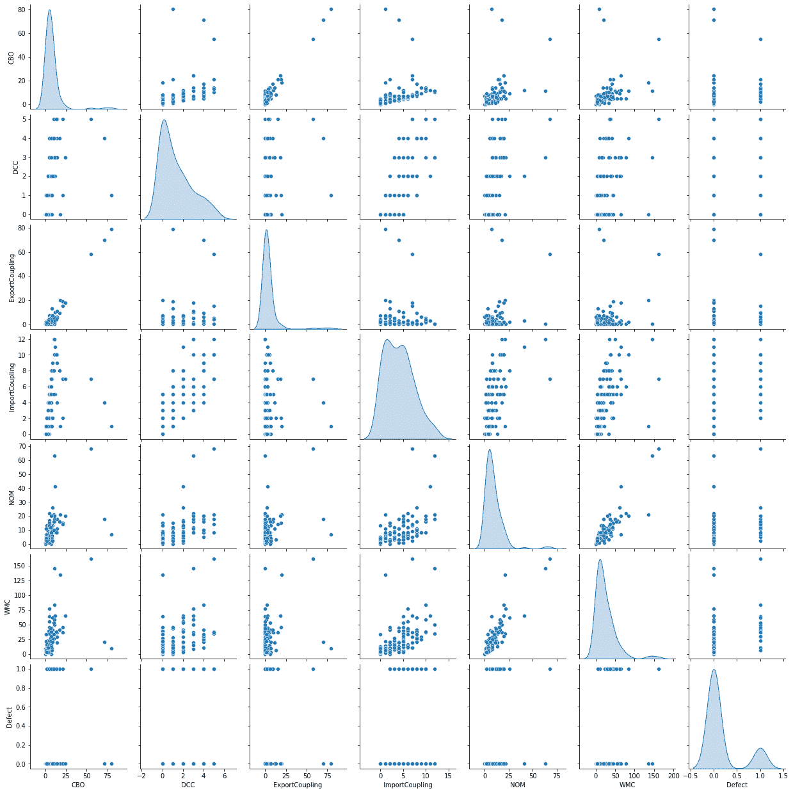

图 6.3 – 具有更好分布可视化的自相关图

这些自相关图为我们提供了快速了解哪些变量可以相互关联的导向。这些相关性是我们可以在以后的工作中使用的。

我们还可以通过使用热图来可视化数字来查看数据。热图是一种表格可视化，其中颜色的强度表示每个变量值的强度。我们可以使用以下代码创建热图：

```py
# heatmap
p1 = sns.heatmap(dfDataAnt13, cmap="Reds")
```

结果图展示在*图 6.4*：

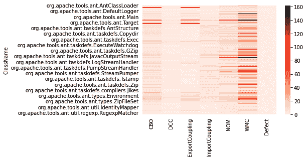

图 6.4 – 度量值的总结热图

在深入进行相关性分析之前，我经常先进行一些成对比较的深入分析。我也建议我的学生这样做，因为处理成对数据可以让我们理解变量之间的联系。

因此，这是我的下一个最佳实践。

最佳实践#35

在总体层面上可视化数据时，关注值之间关系的强度和连接。

在总体层面上进行可视化可以为我们提供许多不同的视角，但我们应该寻找变量之间的联系。自相关图和热图为我们提供了这种数据可视化和理解。

## 深入了解相关性

一套好的图表用于工作的是散点图。然而，我经常使用被称为 KDE 图（核密度估计图）的图表，也称为*密度图*。它们提供了变量更好的概述。以下代码片段以这种方式可视化数据：

```py
# now, let's make some density plots
# set seaborn style
sns.set_style("white")
# Basic 2D density plot
sns.kdeplot(x=dfDataAnt13.CBO, y=dfDataAnt13.DCC)
plt.show()
```

此代码片段的结果是*图 6.5*中展示的图表：

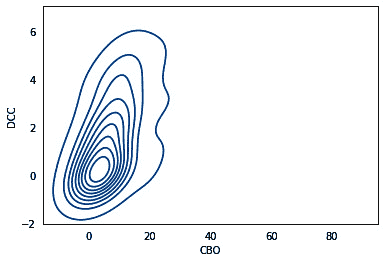

图 6.5 – 两个度量值（DCC 和 CBO）的密度图

此图表表明，两个度量值 – CBO 和 DCC – 相互之间有很强的依赖性（或者它们量化了相似/相同的可度量概念）。

如果我们想在仪表板上使用此图，可以使用以下代码片段使其更美观：

```py
# Custom the color, add shade and bandwidth
sns.kdeplot(x=dfDataAnt13.WMC,
            y=dfDataAnt13.ImportCoupling,
            cmap="Reds",
            shade=True,
            bw_adjust=.5)
plt.show()
```

此代码片段的结果是以下图表：

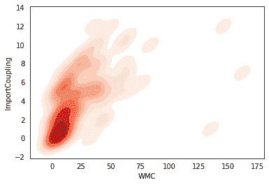

图 6.6 – 带有颜色图的密度图

前面的图表显示了每个区域的相关性和点数——颜色越深，该区域的数据点就越多。对于 DCC 和 CBO 测量的相同图表显示在*图 6.7*中：

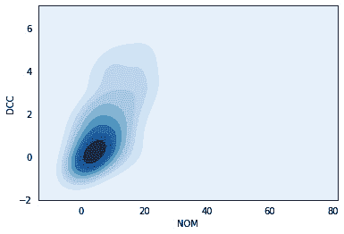

图 6.7 – DCC 和 CBO 测量的密度图，带有颜色图

最后，我们可以使用气泡图来可视化相关性和每个组的数据点数。以下代码创建了气泡图：

```py
# now a bubble diagram
# use the scatterplot function to build the bubble map
sns.scatterplot(data=dfDataAnt13,
                x="NOM",
                y="DCC",
                size="Defect",
                legend=False,
                sizes=(20, 2000))
# show the graph
plt.show()
```

这段代码产生了*图 6.8*中展示的图表：

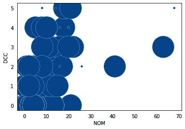

图 6.8 – 散点图 – 一种称为气泡图的变体

这个图让我们可以看到散点图中每个区域的点数，这有助于我们直观地追踪相关性。

## 总结单个测量值

散点图和密度图适合追踪变量之间的依赖关系。然而，我们经常需要总结单个测量值。为此，我们可以使用箱线图。以下代码为我们示例中的数据创建了一个箱线图：

```py
# boxplot
sns.boxplot( x=dfDataAnt13.Defect, y=dfDataAnt13.CBO )
```

结果是*图 6.9*中展示的箱线图：

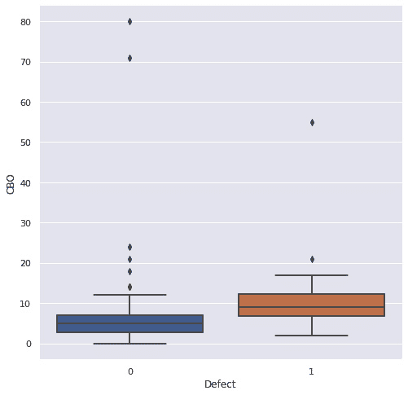

图 6.9 – 描述有缺陷和无缺陷类别的 CBO 测量的箱线图

总结提供了快速视觉指示，表明有缺陷的类别通常比无缺陷的类别与其他类别更紧密地连接。这并不令人惊讶，因为通常类别是相互连接的，而那些不连接的类别通常非常简单，因此不太可能出错。

箱线图的一种变体是提琴图，如果我们把最后一个代码片段的最后一行改为`sns.violinplot( x='Defect', y='CBO', data=dfDataAnt13)`，就会得到这样的提琴图：*图 6.10*展示了这样的提琴图：

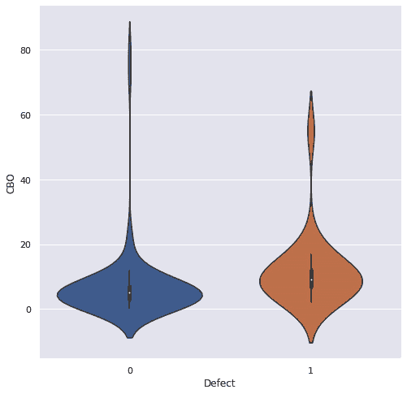

图 6.10 – 一种箱线图的变体，称为提琴图

可视化是理解我们拥有的数值数据的好方法。我们可以更进一步，通过使用降维等方法开始与之工作。

因此，这里是下一个最佳实践。

最佳实践#36

深入分析单个分析应该由当前的机器学习任务指导。

虽然我们没有明确讨论我们的数值数据的任务，但它始终存在。在涉及缺陷相关的数据的情况下，最常见的任务是预测每个模块或类别的缺陷数量。这意味着像提琴图这样的图表非常有用，它为我们提供了对是否存在某种差异的视觉理解——这种差异可以被机器学习模型捕捉。

## 减少测量数量 – 主成分分析（PCA）

本章关于数值数据的最终分析是关于减少变量数量。它来自统计学领域，并且已被用于减少实验中的变量数量：PCA（Wold，1987 #104）。简而言之，PCA 是一种找到最佳拟合预定义数量向量的技术，以适应手头的数据。它不会删除任何变量；相反，它会以这种方式重新计算它们，使得新变量集（称为主成分）之间的相关性最小化。

让我们使用以下代码片段将此应用于我们的数据集：

```py
# before we use PCA, we need to remove the variable "defect"
# as this is the variable which we predict
dfAnt13NoDefects = dfDataAnt13.drop(['Defect'], axis=1)
# PCA for the data at hand
from sklearn.decomposition import PCA
# we instantiate the PCA class with two parameters
# the first one is the number of principal components
# and the second is the random state
pcaComp = PCA(n_components=2,
              random_state=42)
# then we find the best fit for the principal components
# and fit them to the data
vis_dims = pcaComp.fit_transform(dfAnt13NoDefects)
```

现在，我们可以可视化数据：

```py
# and of course, we could visualize it
import matplotlib.pyplot as plt
import matplotlib
import numpy as np
colors = ["red", "darkgreen"]
x = [x for x,y in vis_dims]
y = [y for x,y in vis_dims]
# please note that we use the dataset with defects to
# assign colors to the data points in the diagram
color_indices = dfDataAnt13.Defect
colormap = matplotlib.colors.ListedColormap(colors)
plt.scatter(x, y, c=color_indices, cmap=colormap, alpha=0.3)
for score in [0,1]:
    color = colors[score]
plt.rcParams['figure.figsize'] = (20,20)
```

这个代码片段产生了*图 6.11*中展示的图表：

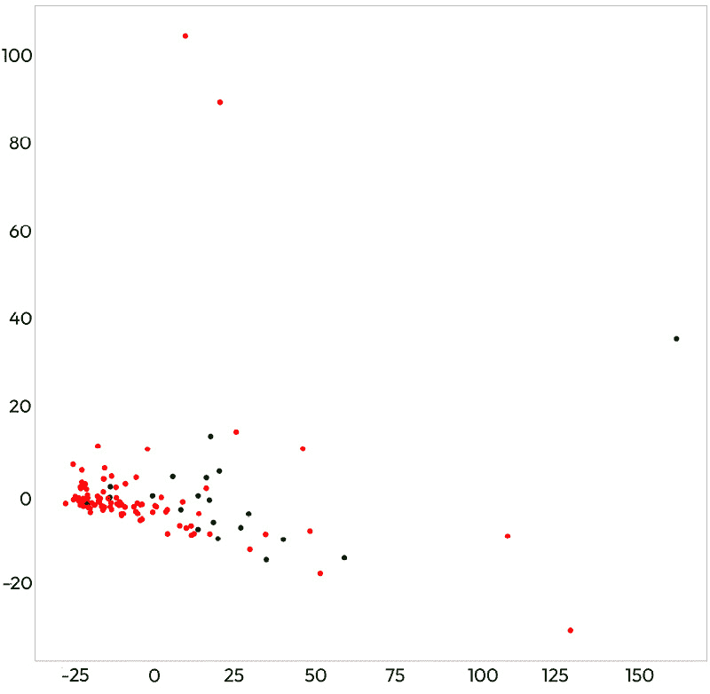

图 6.11 – 缩减缺陷数据集维度的 PCA 结果。红色数据点是具有缺陷的类别，绿色数据点是无缺陷的类别

PCA 变换的典型特征是其线性。我们可以看到这个图表包含了一些这样的痕迹 - 它看起来像一个三角形，有一个水平维度沿着*x 轴*，一个垂直维度沿着*y 轴*，以及左侧的 0 点。

对于这个数据集，图表显示红色标记的数据点聚集在左侧，而绿色标记的点稍微向右分散。这意味着有缺陷和无缺陷的类别之间存在一些差异。然而，这种差异并不明显。这表明机器学习模型找不到模式 - 至少，找不到一个稳健的模式。

# 其他类型的数据 - 图片

在*第三章*中，我们研究了图像数据，主要从存在什么类型的图像数据的视角。现在，我们将采取更实际的方法，介绍一种比仅使用文件更好的图像处理方式。

让我们看看图像数据在流行的存储库 Hugging Face 中是如何存储的。这个库有一个专门用于处理数据集的模块 - 便于称为*Dataset*。它可以通过`pip install -q datasets`命令安装。因此，让我们加载一个数据集，并使用以下代码片段可视化其中一张图片：

```py
# importing the images library
from datasets import load_dataset, Image
# loading a dataset "food101", or more concretely it's split for training
dataset = load_dataset("food101", split="train")
```

现在，变量数据集包含了所有图片。嗯，不是全部 - 只包含数据集设计者指定的训练集部分（见代码片段的最后一行）。我们可以使用以下代码来可视化其中一张图片：

```py
# visualizing the first image
dataset[0]["image"]
```

由于图像的版权未知，我们不会在这本书中可视化它们。然而，上一行将显示数据集中的第一张图像。我们还可以通过简单地输入 `dataset` 来查看该数据集中还有什么其他内容。我们将看到以下输出：

```py
Dataset({ features: ['image', 'label'], num_rows: 75750 })
```

这意味着数据集包含两列——图像及其标签。它包含 75,750 个。让我们使用以下代码来看看这个数据集中标签的分布情况：

```py
# we can also plot the histogram
# to check the distribution of labels in the dataset
import seaborn as sns
import matplotlib.pyplot as plt
plt.rcParams['figure.figsize'] = (20,10)
sns.histplot(data=dataset['label'], x=dataset['label'])
```

这为我们提供了一个漂亮的直方图，如图 *图 6.12* 所示：

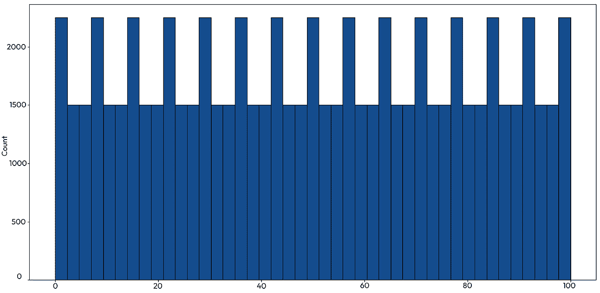

图 6.12 – 标签分布的直方图。每列是带有适当标签的图像数量——0 到 100

此图表显示了图像类别，其中包含的图像数量大于其他类别——包含超过 2,000 个图像的类别。然而，如果不理解数据集，很难检查这些标签的含义。我们可以通过手动可视化图像来做到这一点。所以，这是我的下一个最佳实践。

最佳实践 #37

在可视化图像的元数据时，确保可视化图像本身。

我们必须记住通过绘制图像来可视化图像数据。我们需要确保我们知道标签的含义以及我们如何使用它们。

# 文本数据

对于文本数据，我们将使用相同的 Hugging Face hub 获取两种类型的数据——非结构化文本，正如我们在 *第三章* 中所做的那样，以及结构化数据——编程语言代码：

```py
# import Hugging Face Dataset
from datasets import load_dataset
# load the dataset with text classification labels
dataset = load_dataset('imdb')
```

上述代码片段从 **互联网电影数据库**（**IMDb**）加载电影评论数据集。我们可以通过使用与图像类似的接口来获取数据的示例：

```py
# show the first example
dataset['train'][0]
```

我们可以使用类似的图表来可视化它：

```py
# plot the distribution of the labels
sns.histplot(dataset['train']['label'], bins=2)
```

上述代码片段创建以下图表，显示正面和负面评论完全平衡：

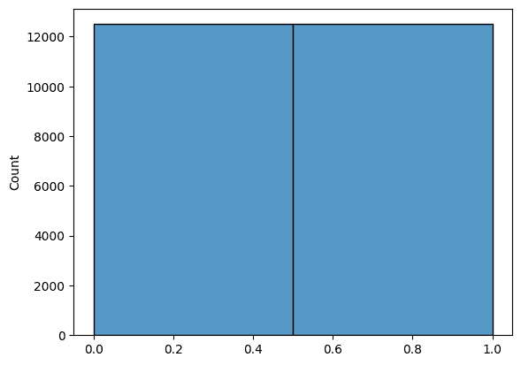

图 6.13 – IMDb 电影数据库评论中的平衡类别

我们可以在下一步对文本数据进行各种处理。然而，这种处理与特征提取相关，所以我们将在接下来的几章中讨论它。

在我们这样做之前，让我们先看看更接近软件工程领域的数据集——编程语言代码。我们在 *第三章* 中使用了类似的数据，所以让我们关注一下我们如何从 Hugging Face 获取更大的编程语言代码语料库。我们可以使用以下代码来获取数据并检查第一个程序：

```py
# now, let us import the code to the text summarization dataset
dsCode = load_dataset('code_x_glue_ct_code_to_text', 'java', split='test')
# and see the first example of the code
dsCode[0]
```

此代码片段显示第一个程序，它已经分词并准备好进行进一步分析。所以，让我们看看这个数据集中标记的频率。我们可以使用以下代码来做这件事：

```py
import pandas as pd
import matplotlib.pyplot as plt
# create a list of tokens
lstCodeLines = dsCode['code_tokens']
# flatten the list of lists to one list
lstCodeLines = [item for sublist in lstCodeLines for item in sublist]
#print the first elements of the list
print(lstCodeLines[:10])
dfCode = pd.DataFrame(lstCodeLines, columns=['token'])
# group the tokens and count the number of occurences
# which will help us to visualize the frequency of tokens in the next step
dfCodeCounts = dfCode.groupby('token').size().reset_index(name='counts')
# sort the counts by descending order
dfCodeCounts = dfCodeCounts.sort_values(by='counts', ascending=False)
fig, ax = plt.subplots(figsize=(12, 6))
# plot the frequency of tokens as a barplot
# for the simplicity, we only take the first 20 tokens
sns.barplot(x='token',
            y='counts',
            data=dfCodeCounts[:20],
            palette=sns.color_palette("BuGn_r", n_colors=20),
            ax=ax)
# rotate the x-axis labels to make sure that
# we see the full token names, i.e. lines of code
ax.set_xticklabels(ax.get_xticklabels(),
                   rotation=45,
                   horizontalalignment='right')
```

以下代码提取标记，计算它们，并创建前 20 个标记频率的图表。结果在*图 6.14*中展示：

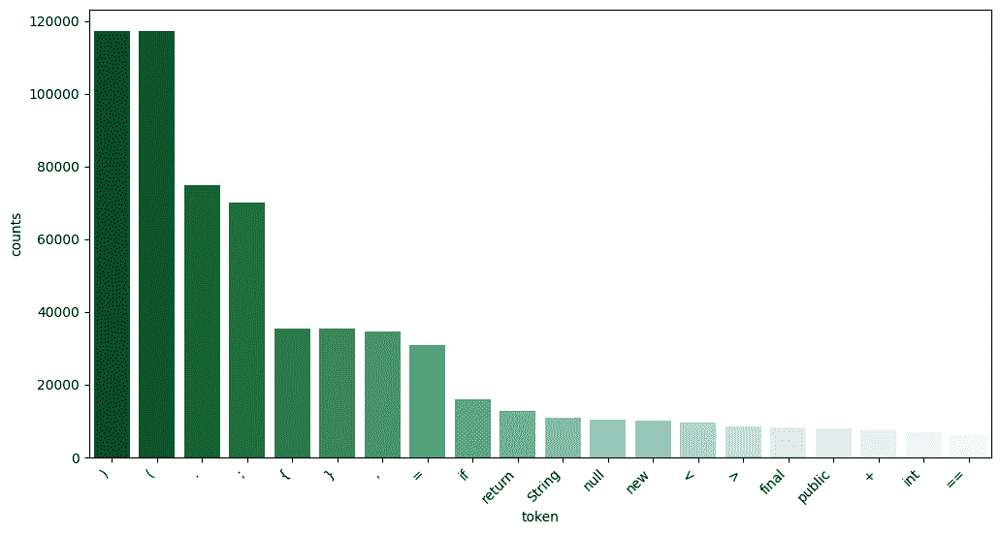

图 6.14 – 代码数据集中前 20 个最常见标记的频率

有趣的是，我们可以观察到括号、逗号、分号和大括号是数据集中最常用的标记。这并不令人惊讶，因为这些字符在 Java 中具有特殊含义。

在前 20 个标记列表中的其他标记，不出所料，是 Java 中的关键字或具有特殊含义（如`==`）。

因此，我在本章的最后一条最佳实践是关于理解文本数据。

最佳实践 #38

文本数据的汇总统计有助于我们对数据进行合理性检查。

尽管文本数据在本质上相当无结构，但我们仍然可以可视化数据的一些属性。例如，标记频率分析可以揭示我们对数据的经验理解是否合理，以及我们是否可以信任它。

# 向特征工程迈进

在本章中，我们探讨了可视化数据的方法。我们学习了如何创建图表并识别数据中的依赖关系。我们还学习了如何使用降维技术将多维数据绘制在二维图表上。

在接下来的几章中，我们将深入研究不同类型数据的特征工程。有时，将特征工程与数据提取混淆是很常见的。在实践中，区分这两者并不那么困难。

提取的数据是通过应用某种测量仪器收集的数据。原始文本或图像是这类数据的良好例子。提取的数据接近数据来源的领域——或者它是如何被测量的。

特征基于我们想要执行的分析来描述数据——它们更接近我们想要对数据进行什么操作。它们更接近我们想要实现的目标以及我们想要进行的机器学习分析形式。

# 参考文献

+   *国际标准化组织，国际计量学基本和通用术语词汇（VIM）。在国际组织。2004* *年第 09-14 页。*

+   *Alhusain, S. 预测面向对象度量指标的相对阈值。在 2021 IEEE/ACM 国际技术债务会议（TechDebt）。* *2021* *年 IEEE 出版。*

+   *Feldt, R. 等。支持软件决策会议：用于可视化测试和代码度量的热图。在 2013 年第 39 届 Euromicro 软件工程和高级应用会议。* *2013* *年 IEEE 出版。*

+   *Staron, M. 等。在三家公司的案例研究中测量和可视化代码稳定性。在 2013 年第 23 届国际软件度量研讨会和第 8 届国际软件过程和产品度量会议联合会议。* *2013* *年 IEEE 出版。*

+   *文，S.，C. 尼尔森，和 M. 斯塔隆。评估引擎控制软件的发布准备情况。载于《第 1 届国际软件质量及其* *依赖性研讨会论文集》。2018 年。*
