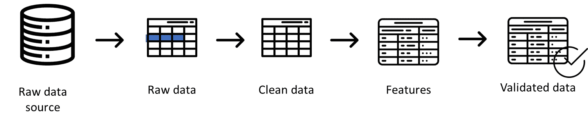
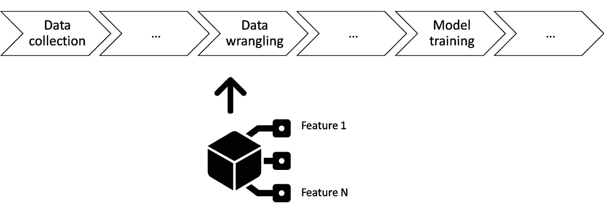
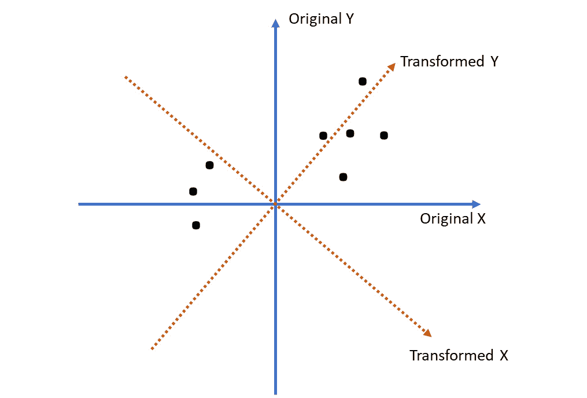
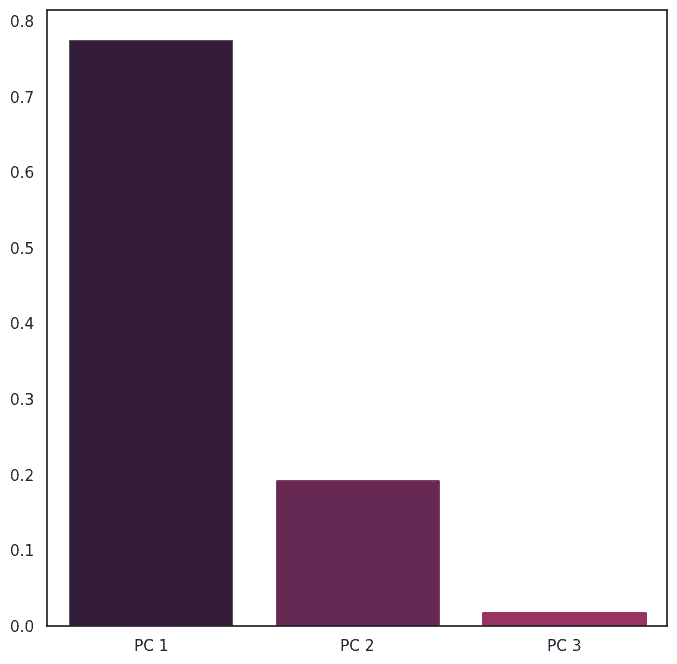
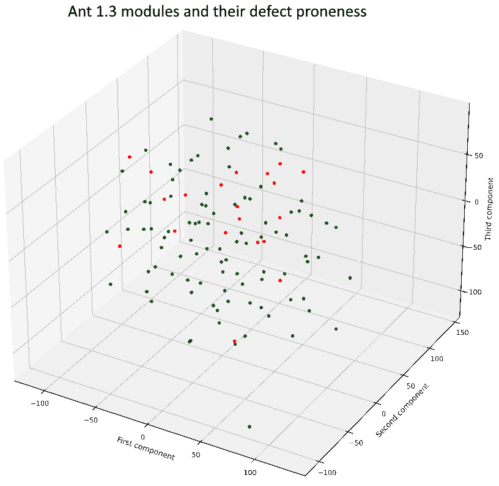
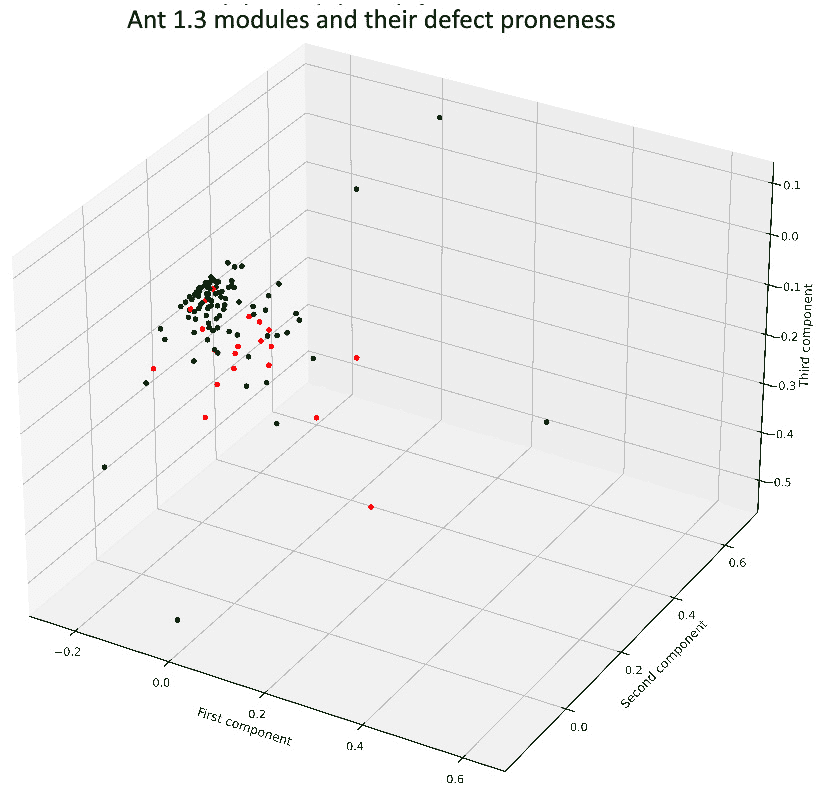
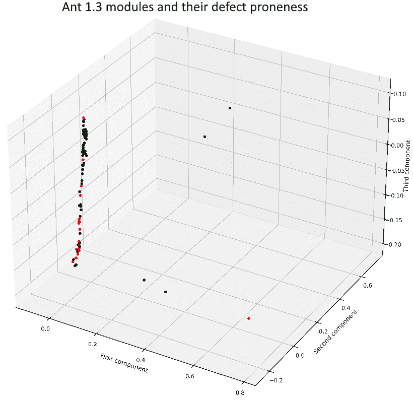
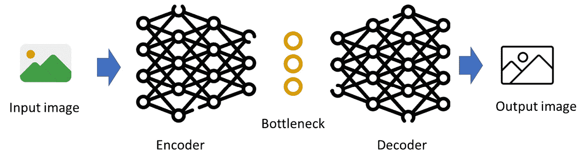

# 7

# 数值和图像数据的特征工程

在大多数情况下，当我们设计大规模机器学习系统时，我们得到的数据类型需要比仅仅可视化更多的处理。这种可视化仅用于机器学习系统的设计和开发。在部署期间，我们可以监控数据，正如我们在前几章中讨论的那样，但我们需要确保我们使用优化的数据来进行推理。

因此，在本章中，我们将专注于特征工程——找到描述我们的数据更接近问题域而不是数据本身的正确特征。特征工程是一个从原始数据中提取和转换变量的过程，以便我们可以使用它们进行预测、分类和其他机器学习任务。特征工程的目标是分析和准备数据，以便用于不同的机器学习任务，如预测或分类。

在本章中，我们将专注于数值和图像数据的特征工程过程。我们将从介绍典型的方法开始，例如我们之前用于可视化的**主成分分析**（**PCA**）。然后，我们将介绍更高级的方法，例如**t-学生分布随机网络嵌入**（**t-SNE**）和**独立成分分析**（**ICA**）。最终，我们将使用自编码器作为数值和图像数据的降维技术。

在本章中，我们将涵盖以下主题：

+   特征工程过程的基本原理

+   PCA 和类似方法

+   用于数值和图像数据的自编码器

# 特征工程

特征工程是将原始数据转换为可用于机器学习算法的数值的过程。例如，我们可以将有关软件缺陷的原始数据（例如，它们的描述、它们所属模块的特征等）转换成我们可以用于机器学习的数值表。正如我们在上一章中看到的，原始数值是我们对作为数据来源的实体进行量化的结果。它们是应用测量仪器到数据的结果。因此，根据定义，它们更接近问题域而不是解决方案域。

另一方面，特征量化了原始数据，并且只包含对当前机器学习任务重要的信息。我们使用这些特征来确保我们在训练期间找到数据中的模式，然后可以在部署期间使用这些模式。如果我们从测量理论的角度来看这个过程，这个过程改变了数据的抽象级别。如果我们从统计学的角度来看这个过程，这是一个去除噪声和降低数据维度的过程。

在本章中，我们将重点关注使用诸如自动编码器等高级方法来降低数据维度和去噪图像数据的过程。

*图 7**.1* 展示了特征提取在典型机器学习流程中的位置。这个流程在*第二章*中介绍过：



图 7.1 – 典型机器学习流程中的特征工程

此图显示特征尽可能接近干净和验证过的数据，因此我们需要依赖前几章中的技术来可视化数据并减少噪声。特征工程之后的下一个活动是建模数据，如图 *7**.2* 所示。此图展示了整个流程的某种简化视图。这也在*第二章*中介绍过：



图 7.2 – 典型机器学习流程。来自*第二章*的某种简化视图

我们之前已经讨论过建模，所以让我们更深入地探讨特征提取过程。由于数值数据和图像数据从这个角度来看有些相似，所以我们将在本章一起讨论它们。文本数据是不同的，因此我们将在下一章中专门讨论它。

然而，本章我的第一个最佳实践与特征提取和模型之间的联系相关。

最佳实践 #39

如果数据复杂但任务简单，例如创建一个分类模型，请使用特征工程技术。

如果数据复杂且任务复杂，尝试使用复杂但功能强大的模型，例如本书后面介绍的变压器模型。这类任务的例子可以是当模型完成了一个程序员开始编写的程序的一部分时进行代码补全。简化复杂数据以适应更简单的模型，可以使我们增加训练模型的可解释性，因为我们作为人工智能工程师，在数据整理过程中更加参与。

# 数值数据的特征工程

我们将通过使用之前用于可视化数据的技术来介绍数值数据的特征工程 – 主成分分析（PCA）。

## PCA

PCA 用于将一组变量转换成相互独立的部分。第一个部分应该解释数据的变异性或与大多数变量相关。*图 7**.3* 说明了这种转换：



图 7.3 – 从二维到二维的 PCA 变换的图形说明

这个图包含两个轴——蓝色的轴是原始坐标轴，橙色的轴是想象中的轴，为主成分提供坐标。转换不会改变*x*和*y*轴的值，而是找到这样的转换，使得轴与数据点对齐。在这里，我们可以看到转换后的*Y*轴比原始的*Y*轴更好地与数据点对齐。

现在，让我们执行一些代码，这些代码可以读取数据并执行这种 PCA 转换。在这个例子中，数据有六个维度——也就是说，六个变量：

```py
# read the file with data using openpyxl
import pandas as pd
# we read the data from the excel file,
# which is the defect data from the ant 1.3 system
dfDataAnt13 = pd.read_excel('./chapter_6_dataset_numerical.
              xlsx',sheet_name='ant_1_3', index_col=0)
dfDataAnt13
```

上述代码片段读取数据并显示它有六个维度。现在，让我们创建 PCA 转换。首先，我们必须从我们的数据集中移除依赖变量`Defect`：

```py
# let's remove the defect column, as this is the one that
# we could potentially predict
dfDataAnt13Pred = dfDataAnt13.drop(['Defect'], axis = 1)
```

然后，我们必须导入 PCA 转换并执行它。我们希望从五个变量（减去`Defect`变量后的六个变量）转换到三个维度。维度的数量完全是任意的，但因为我们之前章节中使用了两个维度，所以这次让我们使用更多：

```py
# now, let's import PCA and find a few components
from sklearn.decomposition import PCA
# previously, we used 2 components, now, let's go with
# three
pca = PCA(n_components=3)
# now, the transformation to the new components
dfDataAnt13PCA = pca.fit_transform(dfDataAnt13Pred)
# and printing the resulting array
# or at least the three first elements
dfDataAnt13PCA[:3]
```

结果的 DataFrame——`dfDataAnt13PCA`——包含了转换后变量的值。它们尽可能独立于彼此（线性独立）。

我想强调一下我们如何处理这类数据转换的一般方案，因为这是一种相对标准的做事方式。

首先，我们实例化转换模块并提供参数。在大多数情况下，参数很多，但有一个参数`n_components`，它描述了我们希望有多少个组件。

第二，我们使用`fit_transform()`函数来训练分类器并将其转换成这些组件。我们使用这两个操作一起，仅仅是因为这些转换是针对特定数据的。没有必要在一个数据上训练转换，然后应用到另一个数据上。

我们可以用 PCA 做的，而其他类型的转换做不到的是，检查每个组件解释了多少变异性——也就是说，组件与数据对齐得有多好。我们可以用以下代码来做这件事：

```py
# and let's visualize that using the seaborn library
import seaborn as sns
sns.set(rc={"figure.figsize":(8, 8)})
sns.set_style("white")
sns.set_palette('rocket')
sns.barplot(x=['PC 1', 'PC 2', 'PC 3'], y=pca.explained_variance_ratio_)
```

这段代码片段产生了*图 7**.4*所示的图表：



图 7.4 – 主成分解释的变异性

这个图显示第一个组件是最重要的——也就是说，它解释了最大的变异性。这种变异性可以看作是数据包含的信息量。在这个数据集的例子中，第一个组件解释了大约 80%的变异性，第二个组件几乎解释了 20%。这意味着我们的数据集有一个主导维度，以及数据在第二个维度上的分散。第三个维度几乎不存在。

这就是我的下一个最佳实践所在。

最佳实践 #40

如果数据在某种程度上是线性可分的，并且处于相似的比例，请使用 PCA。

如果数据是线性的，或者多线性的，PCA 对于训练模型有很大的帮助。然而，如果数据不是线性的，请使用更复杂的模型，例如 t-SNE。

## t-SNE

作为一种转换，PCA 在数据在某种程度上线性可分时工作得很好。在实践中，这意味着坐标系可以定位得使大部分数据位于其轴之一上。然而，并非所有数据都如此。一个这样的数据例子是可以被可视化为圆的数据 – 它在两个轴上均匀分布。

为了降低非线性数据的维度，我们可以使用另一种技术 – t-SNE。这种降维技术基于提取一个神经网络的激活值，该神经网络被训练以拟合输入数据。

以下代码片段创建了对数据进行 t-SNE 转换。它遵循了之前描述的 PCA 的相同架构，并且也将维度降低到三个：

```py
# for t-SNE, we use the same data as we used previously
# i.e., the predictor dfDataAnt13Pred
from sklearn.manifold import TSNE
# we create the t-sne transformation with three components
# just like we did with the PCA
tsne = TSNE(n_components = 3)
# we fit and transform the data
dfDataAnt13TSNE = tsne.fit_transform(dfDataAnt13Pred)
# and print the three first rows
dfDataAnt13TSNE[:3]
```

生成的 DataFrame – `dfDataAnt13TSNE` – 包含了转换后的数据。不幸的是，t-SNE 转换不允许我们获取解释变异性的值，因为这种概念对于这种转换来说并不存在。然而，我们可以可视化它。以下图展示了三个成分的 3D 投影：



图 7.5 – t-SNE 成分的可视化。绿色点代表无缺陷成分，红色点代表有缺陷的成分

这是我在本章中的下一个最佳实践。

最佳实践 #41

如果你对数据的属性不了解，并且数据集很大（超过 1,000 个数据点），请使用 t-SNE。

t-SNE 是一个非常好且稳健的转换。它特别适用于大型数据集 – 即那些包含数百个数据点的数据集。然而，一个挑战是，t-SNE 提供的成分没有解释。我们还应该知道，t-SNE 的最佳结果需要仔细调整超参数。

## ICA

我们还可以使用另一种类型的转换 – ICA。这种转换以这种方式工作，即它找到最不相关的数据点并将它们分离。它在历史上被用于医疗领域，以从高频 **脑电图**（**EEG**）信号中去除干扰和伪影。这种干扰的一个例子是 50 - Hz 的电力信号。

然而，它可以用于任何类型的数据。以下代码片段说明了如何使用 ICA 对我们在之前转换中使用过的相同数据集进行处理：

```py
# we import the package
from sklearn.decomposition import FastICA
# instantiate the ICA
ica = FastICA(n_components=3)
# transform the data
dfDataAnt13ICA = ica.fit_transform(dfDataAnt13Pred)
# and check the first three rows
dfDataAnt13ICA[:3]
```

ICA 需要产生比原始数据更少的组件，尽管在前面的代码片段中我们只使用了三个。以下图示展示了这些组件的可视化：



图 7.6 – 使用 ICA 转换的数据集的可视化

在*图 7*.6 中，绿色组件是没有缺陷的，而红色组件含有缺陷。

## 局部线性嵌入

一种介于 t-SNE 和 PCA（或 ICA）之间的技术被称为**局部线性嵌入**（**LLE**）。这种技术假设相邻节点在某种虚拟平面上彼此靠近。算法以这种方式训练一个神经网络，即它保留了相邻节点之间的距离。

以下代码片段说明了如何使用 LLE 技术：

```py
from sklearn.manifold import LocallyLinearEmbedding
# instantiate the classifier
lle = LocallyLinearEmbedding(n_components=3)
# transform the data
dfDataAnt13LLE = lle.fit_transform(dfDataAnt13Pred)
# print the three first rows
dfDataAnt13LLE[:3]
```

这个片段的结果与之前算法的 DataFrame 相似。以下是可视化：



图 7.7 – LLE 组件的可视化

我们迄今为止讨论的所有技术都是灵活的，允许我们指明在转换后的数据中需要多少个组件。然而，有时问题在于我们不知道需要多少个组件。

## 线性判别分析

**线性判别分析**（**LDA**）是一种技术，其结果与我们的数据集中拥有的组件数量相同。这意味着我们数据集中的列数与 LDA 提供的组件数相同。这反过来又意味着我们需要定义一个变量作为算法的依赖变量。

LDA 算法以这种方式在低维空间中对数据集进行投影，使得它能够将数据分离到依赖变量的类别中。因此，我们需要一个。以下代码片段说明了在数据集上使用 LDA 的方法：

```py
from sklearn.discriminant_analysis import LinearDiscriminantAnalysis
# create the classifier
# please note that we can only use one component, because
# we have only one predicted variable
lda = LinearDiscriminantAnalysis(n_components=1)
# fit to the data
# please note that this transformation requires the predicted
# variable too
dfDataAnt13LDA = lda.fit(dfDataAnt13Pred, dfDataAnt13.Defect).transform(dfDataAnt13Pred)
# print the transformed data
dfDataAnt13LDA[:3]
```

结果 DataFrame 只包含一个组件，因为我们数据集中只有一个依赖变量。

## 自动编码器

近年来，一种新的特征提取技术越来越受欢迎——自动编码器。自动编码器是一种特殊的神经网络，旨在将一种类型的数据转换成另一种类型的数据。通常，它们被用来以略微修改的形式重建输入数据。例如，它们可以用来去除图像中的噪声或将图像转换为使用不同画笔风格的图像。

自动编码器非常通用，可以用于其他类型的数据，我们将在本章的剩余部分学习这些内容（例如，用于图像数据）。*图 7.8*展示了自动编码器的概念模型。它由两部分组成——编码器和解码器。编码器的作用是将输入数据——在这个例子中是一个图像——转换成抽象表示。这种抽象表示存储在特定的层（或几层），称为瓶颈。瓶颈的作用是存储允许解码器重建数据的输入数据的属性。解码器的作用是从瓶颈层获取数据的抽象表示，并尽可能好地重建输入数据：



图 7.8 – 自动编码器的概念可视化。这里，输入数据是图像的形式

由于自动编码器被训练以尽可能好地重建数据，瓶颈值通常被认为是对输入数据的良好内部表示。这种表示如此之好，以至于它允许我们区分不同的输入数据点。

瓶颈值也非常灵活。与之前介绍的技术不同，我们没有限制可以提取多少特征。如果我们需要，我们甚至可以提取比我们数据集中列数更多的特征，尽管这样做没有太多意义。

因此，让我们构建一个用于从设计用来学习缺陷数据表示的自动编码器中提取特征的管道：

下面的代码片段展示了如何读取数据集并从中移除有缺陷的列：

```py
# read the file with data using openpyxl
import pandas as pd
# we read the data from the excel file,
# which is the defect data from the ant 1.3 system
dfDataAnt13 = pd.read_excel('./chapter_6_dataset_numerical.
              xlsx',sheet_name='ant_1_3',index_col=0)
# let's remove the defect column, as this is the one that we could
# potentially predict
X = dfDataAnt13.drop(['Defect'], axis = 1)
y = dfDataAnt13.Defect
```

除了移除列之外，我们还需要对数据进行缩放，以便自动编码器有很好的机会识别所有列中的小模式：

```py
# split into train test sets
X_train, X_test, y_train, y_test = train_test_split(X, y, test_size=0.33, random_state=1)
# scale data
t = MinMaxScaler()
t.fit(X_train)
X_train = t.transform(X_train)
X_test = t.transform(X_test)
```

现在，我们可以创建我们的自动编码器的编码器部分，它将在下面的代码片段中展示：

```py
# number of input columns
n_inputs = X.shape[1]
# the first layer - the visible one
visible = Input(shape=(n_inputs,))
# encoder level 1
e = Dense(n_inputs*2)(visible)
e = BatchNormalization()(e)
e = LeakyReLU()(e)
# encoder level 2
e = Dense(n_inputs)(e)
e = BatchNormalization()(e)
e = LeakyReLU()(e)
```

之前的代码创建了自动编码器的两个级别，因为我们的数据相当简单。现在，有趣的部分是瓶颈，可以通过运行以下代码来创建：

```py
n_bottleneck = 3
bottleneck = Dense(n_bottleneck)(e)
```

在我们的案例中，瓶颈非常窄——只有三个神经元——因为数据集相对较小，且并不复杂。在下一部分，当我们使用自动编码器处理图像时，我们将看到瓶颈可以更宽。一般的思想是，更宽的瓶颈允许我们捕捉数据中的更复杂依赖关系。例如，对于彩色图像，我们需要更多的神经元，因为我们需要捕捉颜色，而对于灰度图像，我们需要更窄的瓶颈。

最后，我们可以使用以下代码创建自动编码器的解码器部分：

```py
# define decoder, level 1
d = Dense(n_inputs)(bottleneck)
d = BatchNormalization()(d)
d = LeakyReLU()(d)
# decoder level 2
d = Dense(n_inputs*2)(d)
d = BatchNormalization()(d)
d = LeakyReLU()(d)
# output layer
output = Dense(n_inputs, activation='linear')(d)
```

构造过程的最后一部分是将这三个部分放在一起——编码器、瓶颈和解码器。我们可以使用以下代码来完成这项工作：

```py
# we place both of these into one model
# define autoencoder model
model = Model(inputs=visible, outputs=output)
# compile autoencoder model
model.compile(optimizer='adam', loss='mse')
```

到目前为止，我们已经构建了我们的自动编码器。我们已经定义了其层和瓶颈。现在，自动编码器必须被训练以理解如何表示我们的数据。我们可以使用以下代码来完成：

```py
# we train the autoencoder model
history = model.fit(X_train, X_train,
                    epochs=100,
                    batch_size=16,
                    verbose=2,
                    validation_data=(X_test,X_test))
```

请注意，我们使用相同的数据作为输入和验证，因为我们需要训练编码器尽可能准确地重新创建相同的数据，考虑到瓶颈层的大小。在训练编码器模型后，我们可以使用它来从模型中提取瓶颈层的值。我们可以通过定义一个子模型并使用它作为输入数据来完成：

```py
submodel = Model(model.inputs, model.get_layer("dense_8").output)
# this is the actual feature extraction -
# where we make prediction for the train dataset
# please note that the autoencoder requires a two dimensional array
# so we need to take one datapoint and make it into a two dimensional array
# with only one row
results = submodel.predict(np.array([X_train[0]]))
results[0]
```

执行此代码的结果是一个包含三个值的向量——自动编码器的瓶颈值。

我在本章中的下一个最佳实践与自动编码器的使用相关。

最佳实践 #42

当数据集非常大时，使用自动编码器对数值数据进行处理，因为自动编码器复杂且需要大量数据进行训练。

由于特征的质量是自动编码器训练效果的一个函数，我们需要确保训练数据集足够大。因此，自动编码器通常用于图像数据。

# 图像数据的特征工程

对于图像数据，最突出的特征提取方法之一是使用**卷积神经网络**（**CNNs**）并从这些网络中提取嵌入。近年来，引入了这种类型神经网络的一种新类型——自动编码器。虽然我们可以使用自动编码器处理各种数据，但它们特别适合图像。因此，让我们为 MNIST 数据集构建一个自动编码器，并从中提取瓶颈层的值。

首先，我们需要使用以下代码片段下载 MNIST 数据集：

```py
# first, let's read the image data from the Keras library
from tensorflow.keras.datasets import mnist
# and load it with the pre-defined train/test splits
(X_train, y_train), (X_test, y_test) = mnist.load_data()
X_train = X_train/255.0
X_test = X_test/255.0
```

现在，我们可以使用以下代码构建编码器部分。请注意，编码器部分有一个额外的层。该层的目的是将二维图像转换为一维输入数组——即展平图像：

```py
# image size is 28 pixels
n_inputs = 28
# the first layer - the visible one
visible = Input(shape=(n_inputs,n_inputs,))
# encoder level 1
e = Flatten(input_shape = (28, 28))(visible)
e = LeakyReLU()(e)
e = Dense(n_inputs*2)(e)
e = BatchNormalization()(e)
e = LeakyReLU()(e)
# encoder level 2
e = Dense(n_inputs)(e)
e = BatchNormalization()(e)
e = LeakyReLU()(e)
```

现在，我们可以构建我们的瓶颈层。在这种情况下，瓶颈层可以更宽，因为图像比我们之前在自动编码器中使用的模块数值数组更复杂（而且数量更多）：

```py
n_bottleneck = 32
bottleneck = Dense(n_bottleneck)(e)
```

解码器部分与之前的例子非常相似，但有一个额外的层，该层可以从其扁平表示中重新创建图像：

```py
# and now, we define the decoder part
# define decoder, level 1
d = Dense(n_inputs)(bottleneck)
d = BatchNormalization()(d)
d = LeakyReLU()(d)
# decoder level 2
d = Dense(n_inputs*2)(d)
d = BatchNormalization()(d)
d = LeakyReLU()(d)
# output layer
d = Dense(n_inputs*n_inputs, activation='linear')(d)
output = Reshape((28,28))(d)
```

现在，我们可以编译和训练自动编码器：

```py
# we place both of these into one model
# define autoencoder model
model = Model(inputs=visible, outputs=output)
# compile autoencoder model
model.compile(optimizer='adam', loss='mse')
# we train the autoencoder model
history = model.fit(X_train, X_train,
                    epochs=100,
                    batch_size=16,
                    verbose=2,
                    validation_data=(X_test,X_test))
```

最后，我们可以从模型中提取瓶颈层的值：

```py
submodel = Model(model.inputs, bottleneck)
# this is the actual feature extraction -
# where we make prediction for the train dataset
# please note that the autoencoder requires a two dimensional array
# so we need to take one datapoint and make it into a two dimensional array
# with only one row
results = submodel.predict(np.array([X_train[0]]))
results[0]
```

现在，结果值的数组要大得多——它有 32 个值，与我们瓶颈层中的神经元数量相同。

瓶颈层中的神经元数量基本上是任意的。以下是选择神经元数量的最佳实践。

最佳实践 #43

在瓶颈层开始时使用较少的神经元数量——通常是列数的三分之一。如果自动编码器没有学习，可以逐渐增加数量。

我选择 1/3 的列数并没有具体的原因，只是基于经验。你可以从相反的方向开始——将瓶颈层做得和输入层一样宽——然后逐渐减小。然而，拥有与列数相同数量的特征并不是我们最初使用特征提取的原因。

# 摘要

在本章中，我们的重点是特征提取技术。我们探讨了如何使用降维技术和自动编码器来减少特征数量，以便使机器学习模型更加有效。

然而，数值和图像数据只是数据类型中的两个例子。在下一章中，我们将继续介绍特征工程方法，但对于文本数据，这在当代软件工程中更为常见。

# 参考文献

+   *Zheng, A. 和 A. Casari，机器学习特征工程：数据科学家原理与技术。2018 年：O’Reilly* *媒体公司*

+   *Heaton, J. 对预测建模中特征工程的经验分析。在 2016 年东南会议\.* *2016 年，IEEE。*

+   *Staron, M. 和 W. Meding，软件开发度量计划。Springer。https://doi.org/10.1007/978-3-319-91836-5\. 第 10 卷\.* *2018 年，3281333.*

+   *Abran, A.，软件度量与软件计量学。2010 年：John Wiley &* *Sons。*

+   *Meng, Q.，等人。关系自动编码器用于特征提取。在 2017 年国际神经网络联合会议（IJCNN）。* *2017 年，IEEE。*

+   *Masci, J.，等人。用于层次特征提取的堆叠卷积自动编码器。在人工神经网络与机器学习，ICANN 2011：第 21 届国际人工神经网络会议，芬兰埃斯波，2011 年 6 月 14-17 日，第 21 卷\.* *2011 年，Springer。*

+   *Rumelhart, D.E.，G.E. Hinton，和 R.J. Williams，通过反向传播错误学习表示。自然，1986 年，323(6088)：* *p. 533-536.*

+   *Mosin, V.，等人，比较基于自动编码器的高速公路驾驶场景图像异常检测方法。SN 应用科学，2022 年，4(12)：* *p. 334.*
