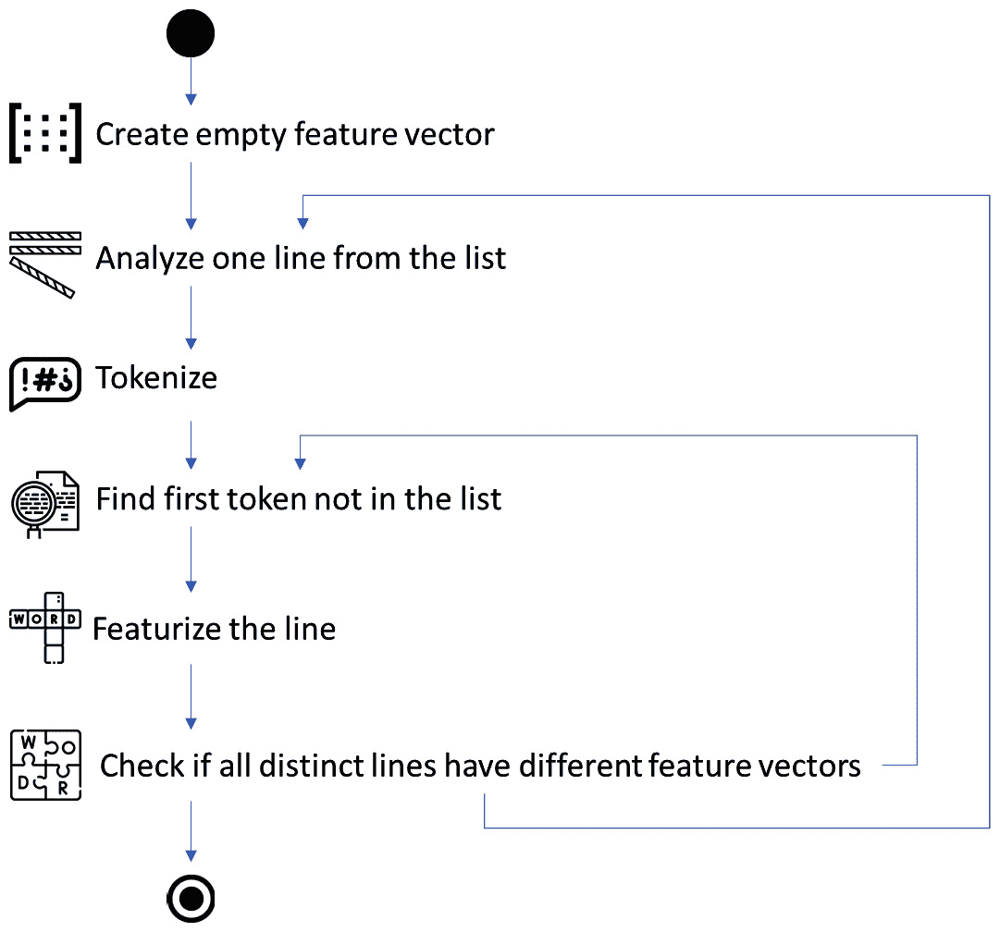

# 第八章：自然语言数据的特征工程

在上一章中，我们探讨了如何从数值数据和图像中提取特征，并探讨了用于此目的的几个算法。在本章中，我们将继续探讨用于从自然语言数据中提取特征的算法。

自然语言是软件工程中的一种特殊数据源。随着 GitHub Copilot 和 ChatGPT 的引入，变得明显的是，用于软件工程任务的机器学习和人工智能工具不再是科幻。因此，在本章中，我们将探讨使这些技术变得如此强大的第一步——从自然语言数据中提取特征。

在本章中，我们将涵盖以下主题：

+   标记化器及其在特征提取中的作用

+   词袋作为处理自然语言数据的一种简单技术

+   作为更高级方法，词嵌入可以捕捉上下文

# 软件工程中的自然语言数据和 GitHub Copilot 的兴起

编程一直是科学、工程和创造力的结合。创建新的程序和能够指导计算机执行某些操作一直是被认为值得付费的事情——这就是所有程序员谋生的手段。人们尝试过自动化编程和支持较小的任务——例如，为程序员提供如何使用特定函数或库方法的建议。

然而，优秀的程序员可以编写出持久且易于他人阅读的程序。他们还可以编写出长期无需维护的可靠程序。最好的程序员是那些能够解决非常困难任务并遵循软件工程原则和最佳实践的程序员。

在 2020 年，发生了某件事情——GitHub Copilot 登上了舞台，并展示了基于**大型语言模型**（**LLMs**）的自动化工具不仅能提供简单的函数调用建议，还能提供更多。它已经证明，这些语言模型能够提供整个解决方案和算法的建议，甚至能够解决编程竞赛。这为程序员开辟了全新的可能性——最优秀的程序员变得极其高效，并得到了允许他们专注于编程任务复杂部分的工具。简单的任务现在由 GitHub Copilot 和其他工具解决。

这些工具之所以如此出色，是因为它们基于 LLMs，能够找到并量化程序的上下文。就像一位伟大的棋手可以提前预见几步棋一样，这些工具可以提前预见程序员可能需要什么，并提供有用的建议。

有一些简单的技巧使得这些工具如此有效，其中之一就是特征工程。自然语言任务（包括编程）的特征工程是一个将文本片段转换为数字向量（或矩阵）的过程。这些向量可以是简单的——例如，量化标记——也可以是非常复杂的——例如，找到与其他任务相关联的原子文本片段。我们将在本章中探讨这些技术。我们将从稍微重复一下第三章和第五章中看到的词袋技术（见*第三章*和*第五章*）开始。我们不需要重复整个代码，但我们确实需要提供一个小的总结来理解这些方法的局限性。然而，这是我选择是否需要分词器或嵌入的最佳实践。

最佳实践 #44

对于 LLM（如 BERT）使用分词器，对于简单任务使用词嵌入。

对于简单的任务，例如文本的基本分词用于情感分析或快速理解文本中的依赖关系，我通常使用词嵌入。然而，当与 LLM（如 BERT、RoBERTa 或 AlBERT）一起工作时，我通常使用不同的分词器，因为这些模型在自身寻找依赖关系方面非常出色。然而，在设计分类器时，我使用词嵌入，因为它们提供了一种快速创建与“经典”机器学习算法兼容的特征向量的方法。

选择分词器需要根据任务来决定。我们将在本章中更详细地探讨这个问题，但这个主题本身可能需要一整本书来阐述。例如，对于需要关于词性（或者在很多情况下，程序抽象语法树的某一部分）的信息的任务，我们需要使用专门设计来捕获这些信息的分词器——例如，从编程语言解析器中获取。这些分词器为模型提供了更多信息，但它们对数据的要求也更高——基于抽象语法树的分词器要求程序具有良好的格式。

# 分词器是什么以及它做什么

特征工程文本数据的第一个步骤是决定文本的分词。文本分词是一个提取能够捕捉文本意义而不包含太多额外细节的词的部分的过程。

有不同的方法来提取标记，我们将在本章中探讨这些方法，但为了说明提取标记的问题，让我们看看一个可以采取不同形式的单词——*print*。这个单词本身可以是一个标记，但它可以有不同的形式，如*printing*、*printed*、*printer*、*prints*、*imprinted*等等。如果我们使用简单的分词器，这些单词中的每一个都将是一个标记——这意味着有很多标记。然而，所有这些标记都捕捉到与打印相关的某种意义，所以可能我们不需要这么多。

这就是分词器发挥作用的地方。在这里，我们可以决定如何处理这些不同的词形。我们可以只取主要部分——*print*——然后所有其他形式都会被计为那样，所以*imprinted*和*printing*都会被计为*print*。这减少了标记的数量，但我们也减少了特征向量的表达性——一些信息丢失了，因为我们没有相同数量的标记可以使用。我们可以预先设计一组标记——也就是说，使用*print*和*imprint*来区分不同的上下文。我们也可以使用双词（两个词一起）作为标记（例如，*is_going*与*is*，*going*——第一个需要两个词以特定顺序出现，而第二个允许它们出现在两个不同的序列中），或者我们可以添加关于单词是否为句子中主语对象的信息。

# 词袋和简单分词器

在*第三章*和*第五章*中，我们看到了词袋特征提取技术的应用。这种技术对文本进行计数，统计标记的数量，在*第三章*和*第五章*中是单词。它简单且计算效率高，但有几个问题。

当实例化词袋分词器时，我们可以使用几个参数，这些参数会强烈影响结果，就像我们在前几章的代码片段中所做的那样：

```py
# create the feature extractor, i.e., BOW vectorizer
# please note the argument - max_features
# this argument says that we only want three features
# this will illustrate that we can get problems - e.g. noise
# when using too few features
vectorizer = CountVectorizer(max_features = 3)
```

`max_features`参数是一个截止值，它减少了特征的数量，但它也可能在两个（或更多）不同句子具有相同特征向量时引入噪声（我们在*第二章*中看到了这样一个句子的例子）。由于我们已经讨论了噪声及其相关问题，我们可能会倾向于使用其他参数——`max_df`和`min_df`。这两个参数决定了单词在文档中应该出现多少次才能被认为是标记。过于罕见的标记（`min_df`）可能导致稀疏矩阵——特征矩阵中有许多 0——但它们可以在数据点之间提供很好的区分。也许这些罕见的单词正是我们所寻找的。另一个参数（`max_df`）导致更密集的特征矩阵，但它们可能无法完全区分数据点。这意味着选择这些参数并不简单——我们需要实验，并使用机器学习模型训练（和验证）来找到正确的向量。

除此之外，还有一种方法——我们可以执行递归搜索以找到这样一个特征向量，它能够区分所有数据点而不会添加太多噪声。我的团队已经尝试过这样的算法，这些算法在模型训练和验证方面表现出色，但计算成本非常高。这种算法在*图 8.1*中展示：



图 8.1 – 一个用于在文本文件中找到一组能够区分所有数据点的特征的算法。流程已被简化以说明主要观点

该算法通过添加新标记来工作，如果数据点具有与之前任何数据点相同的特征向量。它首先从第一行取第一个标记，然后是第二行。如果标记可以区分这两行，则继续到第三行。一旦算法发现两行具有不同的特征向量，它就会找出是否存在可以区分这些行的标记，并将其添加到特征集。它继续添加，直到没有新标记可以添加或所有行都已分析。

此算法保证找到最佳区分分析数据集的标记集。然而，它有一个很大的缺点——它很慢（因为它必须从找到/需要新标记的第一行开始）。生成的特征矩阵也不是最优的——它包含很多 0，因为大多数标记只能在一行中找到。反过来，特征矩阵可能比实际原始数据集大得多。

这就是我的下一个最佳实践发挥作用的地方。

最佳实践 #45

当你的任务需要预定义的单词集时，请使用词袋模型分词器并结合字典。

在分析编程语言代码时，我经常使用词袋模型分词器。我使用编程语言中预定义的关键词集来增强分词器，然后使用标准的`CountVectorizer`。这使我能够控制我感兴趣的部分词汇量——关键词——并允许分词器适应文本。

# WordPiece 分词器

从文本文档中分词和提取特征的一个更好的方法是使用 WordPiece 分词器。这种分词器以这样的方式工作，即它找到它可以区分的最常见的文本片段，以及最常见的那些。这种类型的分词器需要训练——也就是说，我们需要提供一组代表性文本以获得正确的词汇（标记）。

让我们来看一个例子，我们使用一个简单的程序，一个开源项目中的模块，来训练这样的分词器，然后将这个分词器应用于著名的“Hello World”C 语言程序。让我们首先创建分词器：

```py
from tokenizers import BertWordPieceTokenizer
# initialize the actual tokenizer
tokenizer = BertWordPieceTokenizer(
    clean_text=True,
    handle_chinese_chars=False,
    strip_accents=False,
    lowercase=True
)
```

在这个例子中，我们使用 Hugging Face 库中的 WordPiece 分词器，特别是为与 BERT 等 LLM 一起工作而准备的分词器。我们可以使用几个参数，但让我们只使用显示我们只对小写字母感兴趣；我们不希望处理中文字符，并希望从头开始。

现在，我们需要找到一个可以用来训练分词器的文本片段。在这个例子中，我将使用开源项目中的一个文件 – AzureOS NetX。它是一个用 C 语言编写的组件，用于处理互联网 HTTP 协议的部分。我们创建一个新的变量 – `path` – 并将文件的路径添加到那里。一旦我们准备好了文本，我们就可以训练分词器：

```py
# and train the tokenizer based on the text
tokenizer.train(files=paths,
                vocab_size=30_000,
                min_frequency=1,
                limit_alphabet=1000,
                wordpieces_prefix='##',
                special_tokens=['[PAD', '[UNK]', '[CLS]', '[SEP]', '[MASK]'])
```

我们已经将分词器设置成与之前示例中的`CountVectorizer`相似的一组参数。这个前代码片段找到了最常见的单词片段并将它们用作标记。

我们可以通过`tokenizer.get_vocab()`语句获取标记列表，这将产生一个长的标记字典。以下是前几个标记：

```py
'##ll': 183,
'disable': 326,
'al': 263,
'##cket': 90,
'##s': 65,
'computed': 484
```

第一个标记是单词的一部分，这通过它开头有两个井号的事实来表示。这个标记在词汇表中映射到数字`183`。这种映射很重要，因为数字在后续的机器学习模型中会被使用。

另一个有趣的观察是，一些标记，如`'disable'`，不是单词的一部分，而是整个单词。这意味着这个标记在任何地方都没有作为单词的一部分出现，并且它不包含词汇表中其他单词的任何部分。

一旦我们训练了 WordPiece 分词器，我们可以检查分词器如何从一个简单的 C 程序中提取特征：

```py
strCProgram = '''
int main(int argc, void **argc)
{
  printf("%s", "Hello World\n");
  return 0;
}
'''
# now, let's see how the tokenizer works
# we invoke it based on the program above
tokenizedText = tokenizer.encode(strCProgram)
tokenizedText.tokens
```

前面的代码片段对程序进行了分词。结果是以下标记列表（只显示了 50 个标记中的前 10 个）：

```py
'in', '##t', 'ma', '##in', '(', 'in', '##t', 'a', '##r', '##g'
```

第一行，以`int`标记开始，已经被以下方式分词。第一个单词 – `int` – 被分割成两个标记：`"in"` 和 `"##t"`。这是因为这两个部分被用于训练程序中。我们还可以看到第二个标记 – `main` – 被分割成两个标记：`"ma"` 和 `"##in"`。这些标记的 ID 如下：

```py
110, 57, 272, 104, 10, 110, 57, 30, 61, 63
```

这意味着这个数字列表是我们简单 C 程序的特征向量。

WordPiece 分词非常有效，但它很大程度上依赖于训练数据。如果我们使用与分词文本非常不同的训练数据，标记集将不会很有帮助。因此，我的下一个最佳实践是关于训练这个分词器。

最佳实践 #46

将 WordPiece 分词器作为首选。

我通常将这个分词器作为首选。它相对灵活但相当快速。它允许我们捕获一个词汇表，大多数时候都能完成任务，并且不需要很多设置。对于具有直接语言和明确定义词汇的简单任务，传统的词级分词或其他子词分词方法，如**字节对编码**（**BPE**）可能就足够了。WordPiece 分词可能会由于引入子词标记而增加输入数据的大小。这可能会影响内存和计算需求。

# BPE

文本标记化的一个更高级的方法是 BPE 算法。这个算法基于与 20 世纪 90 年代由 Gage 创建的压缩算法相同的原理。该算法通过压缩数据中未使用的字节来压缩一系列字节。BPE 标记化程序做的是类似的事情，只不过它用未在文本中使用的新的字节替换了一系列标记。这样，该算法可以创建比`CountVectorizer`和 WordPiece 标记化程序更大的词汇表。BPE 因其处理大型词汇表的能力和通过 fastBPE 库的高效实现而非常受欢迎。

让我们探讨如何将这个标记化程序应用于相同的数据，并检查与前两种方法的差异。以下代码片段展示了如何从 Hugging Face 库中实例化这个标记化程序：

```py
# in this example we use the tokenizers
# from the HuggingFace library
from tokenizers import Tokenizer
from tokenizers.models import BPE
# we instantiate the tokenizer
tokenizer = Tokenizer(BPE(unk_token="[UNK]"))
```

这个标记化程序需要训练，因为它需要找到最优的标记对集合。因此，我们需要实例化一个训练类并对其进行训练。以下代码片段正是这样做的：

```py
from tokenizers.trainers import BpeTrainer
# here we instantiate the trainer
# which is a specific class that will manage
# the training process of the tokenizer
trainer = BpeTrainer(special_tokens=["[UNK]", "[CLS]",
                     "[SEP]", "[PAD]", "[MASK]"])
from tokenizers.pre_tokenizers import Whitespace
tokenizer.pre_tokenizer = Whitespace()
# now, we need to prepare a dataset
# in our case, let's just read a dataset that is a code of a program
# in this example, I use the file from an open-source component - Azure NetX
# the actual part is not that important, as long as we have a set of
# tokens that we want to analyze
paths = ['/content/drive/MyDrive/ds/cs_dos/nx_icmp_checksum_compute.c']
# finally, we are ready to train the tokenizer
tokenizer.train(paths, trainer)
```

这个训练过程中的重要部分是使用一个特殊的预标记化程序。预标记化程序是我们最初将单词分割成标记的方式。在我们的案例中，我们使用标准的空白字符，但我们可以使用更高级的方法。例如，我们可以使用分号，因此可以将整行代码作为标记。

执行上述代码片段后，我们的标记化程序已经训练完毕，可以使用了。我们可以通过编写`tokenizer.get_vocab()`来检查标记。以下是一些标记（前 10 个标记）：

```py
'only': 565, 'he': 87, 'RTOS': 416, 'DE': 266, 'CH': 154, 'a': 54, 'ps': 534, 'will': 372, 'NX_SHIFT_BY': 311, 'O': 42,
```

这组标记与之前案例中的标记集非常不同。它包含了一些单词，如“will”，和一些子词，如“ol.”。这是因为 BPE 标记化程序发现了一些重复的标记，并用专门的字节替换了它们。

最佳实践 #47

在处理大型语言模型和大量文本语料库时使用 BPE。

当我分析大量文本时，例如大型代码库，我会首选使用 BPE。这项任务对 BPE 来说非常快速，并且能够捕捉复杂的依赖关系。它也在 BERT 或 GPT 等模型中被大量使用。

现在，在我们的案例中，我们用来训练 BPE 标记化程序的源代码很小，所以很多单词没有重复出现，优化并没有太多意义。因此，WordPiece 标记化程序可以完成同样（如果不是更好）的工作。然而，对于更大的文本语料库，这个标记化程序比 WordPiece 或词袋模型更有效率和高效。它也是下一个标记化程序——SentencePiece 的基础。

# SentencePiece 标记化程序

句子分割（SentencePiece）比 BPE 更通用，还有一个原因：它允许我们将空白视为常规标记。这使我们能够找到更复杂的依赖关系，因此可以训练出理解不仅仅是单词片段的模型。因此得名——句子分割。这个分词器最初是为了使像日语这样的语言（例如，与英语不同，日语不使用空白）的标记化成为可能。可以通过运行`pip install -q sentencepiece`命令来安装这个分词器。

在以下代码示例中，我们实例化和训练了 SentencePiece 分词器：

```py
import sentencepiece as spm
# this statement trains the tokenizer
spm.SentencePieceTrainer.train('--input="/content/drive/MyDrive/ds/cs_dos/nx_icmp_checksum_compute.c" --model_prefix=m --vocab_size=200')
# makes segmenter instance and
# loads the model file (m.model)
sp = spm.SentencePieceProcessor()
sp.load('m.model')
```

我们在与其他分词器相同的文件上对其进行了训练。文本是一个编程文件，因此我们可以预期分词器能比正常文本更好地理解编程语言的内容。值得注意的是词汇表的大小，它是 200，而之前的例子中是 30,000。这是因为这个分词器试图找到尽可能多的标记。由于我们的输入程序非常短——一个包含几个函数的文件——分词器不能创建超过大约 300 个标记。

以下片段使用这个分词器对“Hello World”程序进行编码，并打印以下输出：

```py
strCProgram = '''
int main(int argc, void **argc)
{
  printf("%s", "Hello World\n");
  return 0;
}
'''
print(sp.encode_as_pieces(strCProgram))
```

前十个标记的表示方式如下：

```py
'▁in', 't', '▁', 'm', 'a', 'in', '(', 'in', 't', '▁a'
```

在这个分词器中引入的新元素是下划线字符（`_`）。它在文本中表示空白。这是独特的，它使我们能够更有效地在编程语言理解中使用这个分词器，因为它允许我们捕获诸如嵌套之类的编程结构——也就是说，使用制表符而不是空格，或者在同一行中编写多个语句。这一切都是因为这个分词器将空白视为重要的事物。

最佳实践 #48

当没有明显的单词边界时，请使用 SentencePiece 分词器。

当分析编程语言代码并关注编程风格时，我会使用 SentencePiece——例如，当我们关注诸如驼峰式变量命名等问题时。对于这个任务，理解程序员如何使用空格、格式化和其他编译器透明的元素非常重要。因此，这个分词器非常适合这样的任务。

# 词嵌入

分词器是从文本中提取特征的一种方法。它们功能强大，可以训练以创建复杂的标记并捕获单词的统计依赖关系。然而，它们受限于它们是完全无监督的，并且不捕获任何单词之间的意义或关系。这意味着分词器非常适合为神经网络模型，如 BERT，提供输入，但有时我们希望有与特定任务更对齐的特征。

这就是词嵌入发挥作用的地方。以下代码展示了如何实例化从`gensim`库导入的词嵌入模型。首先，我们需要准备数据集：

```py
from gensim.models import word2vec
# now, we need to prepare a dataset
# in our case, let's just read a dataset that is a code of a program
# in this example, I use the file from an open source component - Azure NetX
# the actual part is not that important, as long as we have a set of
# tokens that we want to analyze
path = '/content/drive/MyDrive/ds/cs_dos/nx_icmp_checksum_compute.c'
# read all lines into an array
with open(path, 'r') as r:
  lines = r.readlines()
# and see how many lines we got
print(f'The file (and thus our corpus) contains {len(lines)} lines')
```

与之前的标记化器相比，前面的代码片段以不同的方式准备文件。它创建了一个行列表，每行是一个由空格分隔的标记列表。现在，我们已经准备好创建`word2vec`模型并在这些数据上训练它：

```py
# we need to pass splitted sentences to the model
tokenized_sentences = [sentence.split() for sentence in lines]
model = word2vec.Word2Vec(tokenized_sentences,
                          vector_size=10,
                          window=1,
                          min_count=0,
                          workers=4)
```

结果是，该模型是在我们提供的语料库上训练的——实现 HTTP 协议一部分的 C 程序。我们可以通过编写`model.wv.key_to_index`来查看已提取的前 10 个标记：

```py
'*/': 0, '/*': 1, 'the': 2, '=': 3, 'checksum': 4, '->': 5, 'packet': 6, 'if': 7, 'of': 8, '/**********************************************************************/': 9,
```

总共，`word2vec`提取了 259 个标记。

与我们之前使用的标记化器不同，这个词嵌入模型将词（标记）的值嵌入到一个潜在空间中，这使得我们可以更智能地利用这些词的词汇属性。例如，我们可以使用`model.wv.most_similar(positive=['add'])`来检查词的相似性：

```py
('NX_LOWER_16_MASK;', 0.8372778296470642),
('Mask', 0.8019374012947083),
('DESCRIPTION', 0.7171915173530579),
```

我们也可以假设这些词是向量，它们的相似性被这个向量捕捉。因此，我们可以写一些类似的东西，比如 `model.wv.most_similar(positive= ['file', 'function'], negative=['found'])` 并获得如下结果：

```py
('again', 0.24998697638511658),
('word', 0.21356187760829926),
('05-19-2020', 0.21174617111682892),
('*current_packet;', 0.2079058289527893),
```

如果我们用数学来表示这个表达式，那么结果将是：*result = file + function – found*。这个相似词列表是距离这个计算结果捕获的向量最近的词列表。

当我们想要捕捉词和表达式的相似性时，词嵌入非常强大。然而，该模型的原始实现存在某些限制——例如，它不允许我们使用原始词汇表之外的词。请求与未知标记（例如，`model.wv.most_similar(positive=['return'])`）相似的词会导致错误。

# FastText

幸运的是，有一个`word2vec`模型的扩展可以近似未知标记——FastText。我们可以用与使用`word2vec`非常相似的方式使用它：

```py
from gensim.models import FastText
# create the instance of the model
model = FastText(vector_size=4,
                 window=3,
                 min_count=1)
# build a vocabulary
model.build_vocab(corpus_iterable=tokenized_sentences)
# and train the model
model.train(corpus_iterable=tokenized_sentences,
            total_examples=len(tokenized_sentences),
            epochs=10)
```

在前面的代码片段中，模型是在与`word2vec`相同的 数据集上训练的。`model = FastText(vector_size=4, window=3, min_count=1)` 创建了一个具有三个超参数的 FastText 模型实例：

+   `vector_size`：结果特征向量中的元素数量

+   `window`：用于捕捉上下文词的窗口大小

+   `min_count`：要包含在词汇表中的单词的最小频率

`model.build_vocab(corpus_iterable=tokenized_sentences)`通过遍历`tokenized_sentences`可迭代对象（该对象应包含一个列表的列表，其中每个内部列表代表一个句子被分解成单个单词）并将每个单词添加到词汇表中，如果它满足`min_count`阈值。`model.train(corpus_iterable=tokenized_sentences, total_examples=len(tokenized_sentences), epochs=10)`使用`tokenized_sentences`可迭代对象训练 FastText 模型，总共 10 个 epoch。在每个 epoch 中，模型再次遍历语料库，并根据每个目标词周围的上下文单词更新其内部权重。`total_examples`参数告诉模型语料库中有多少个总示例（即句子），这用于计算学习率。

输入是相同的。然而，如果我们调用未知标记的相似度，例如`model.wv.most_similar(positive=['return'])`，我们会得到以下结果：

```py
('void', 0.5913326740264893),
('int', 0.43626993894577026),
('{', 0.2602742612361908),
```

这三个相似词的集合表明模型可以近似未知标记。

我接下来的最佳实践是关于 FastText 的使用。

最佳实践 #49

使用词嵌入，如 FastText，作为文本分类任务的有价值特征表示，但考虑将其纳入更全面的模型以实现最佳性能。

除非我们需要使用 LLM，这种特征提取是简单词袋技术以及强大的 LLM 的绝佳替代方案。它捕捉到一些含义的部分，并允许我们基于文本数据设计分类器。它还可以处理未知标记，这使得它非常灵活。

# 从特征提取到模型

本章中提出的特征提取方法并非我们唯一能使用的。至少还有更多（更不用说其他方法了）。然而，它们的工作原理相似。不幸的是，没有一劳永逸的解决方案，所有模型都有其优势和劣势。对于同一任务，但不同的数据集，简单的模型可能比复杂的模型更好。

现在我们已经看到了如何从文本、图像和数值数据中提取特征，现在是时候开始训练模型了。这就是我们在下一章将要做的。

# 参考文献

+   *Al-Sabbagh, K.W., et al. Selective regression testing based on big data: comparing feature extraction techniques. in 2020 IEEE International Conference on Software Testing, Verification and Validation Workshops (ICSTW).* *2020\. IEEE.*

+   *Staron, M., et al. Improving Quality of Code Review Datasets–Token-Based Feature Extraction Method. in Software Quality: Future Perspectives on Software Engineering Quality: 13th International Conference, SWQD 2021, Vienna, Austria, January 19–21, 2021, Proceedings 13\.* *2021\. Springer.*

+   *Sennrich, R., B. Haddow, and A. Birch, Neural machine translation of rare words with subword units. arXiv preprint* *arXiv:1508.07909, 2015.*

+   *Gage, P., A new algorithm for data compression. C Users Journal, 1994\. 12(2):* *p. 23-38.*

+   *Kudo, T. 和 J. Richardson, SentencePiece：一种简单且语言无关的子词分词和去分词器，用于神经文本处理。arXiv 预印本* *arXiv:1808.06226, 2018.*
