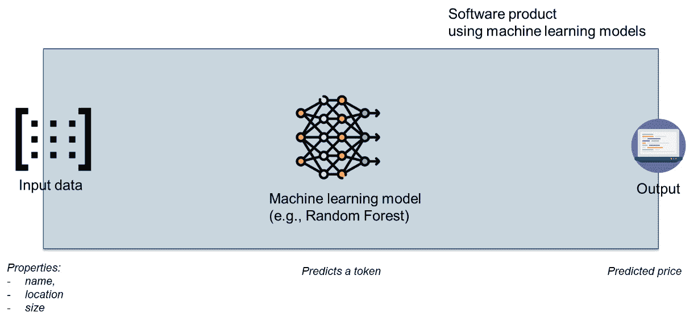
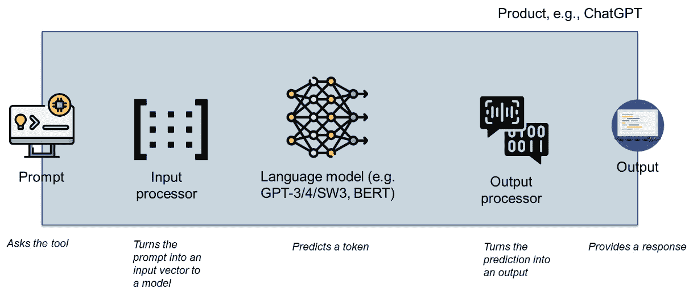

# 第九章：机器学习系统类型——基于特征和基于原始数据（深度学习）

在前几章中，我们学习了数据、噪声、特征和可视化。现在，是时候转向机器学习模型了。没有一种单一的模型，但有很多种——从经典的模型，如随机森林，到用于视觉系统的深度学习模型，再到生成式 AI 模型，如 GPT。

卷积和 GPT 模型被称为深度学习模型。它们的名称来源于它们使用原始数据作为输入，并且模型的第一层包括特征提取层。它们还设计为随着输入数据通过这些模型而逐步学习更抽象的特征。

本章演示了这些模型类型中的每一种，并从经典机器学习到生成式 AI 模型逐步推进。

本章将涵盖以下主题：

+   为什么我们需要不同类型的模型？

+   经典的机器学习模型和系统，例如随机森林、决策树和逻辑回归

+   用于视觉系统的深度学习模型、卷积神经网络模型和**你只需看一次**（**YOLO**）模型

+   **通用预训练转换器**（**GPT**）模型

# 为什么我们需要不同类型的模型？

到目前为止，我们在数据处理上投入了大量的努力，同时专注于诸如噪声减少和标注等任务。然而，我们还没有深入研究用于处理这些处理数据的模型。虽然我们简要提到了基于数据标注的不同类型模型，包括监督学习、无监督学习和强化学习，但我们还没有彻底探讨用户在利用这些模型时的视角。

在使用机器学习模型处理数据时，考虑用户的视角非常重要。用户的需求、偏好和具体要求在选择和使用适当的模型中起着至关重要的作用。

从用户的角度来看，评估诸如模型可解释性、集成简便性、计算效率和可扩展性等因素变得至关重要。根据应用和用例，用户可能会优先考虑模型的不同方面，例如准确性、速度或处理大规模数据集的能力。

此外，用户的领域专业知识和对底层算法的熟悉程度会影响模型的选择和评估。一些用户可能更喜欢简单、更透明的模型，这些模型提供可解释性和可理解性，而其他人可能愿意为了使用更复杂的模型（如深度学习网络）来提高预测性能而牺牲可解释性。

考虑用户的视角使模型选择和部署的方法更加全面。这涉及到积极地将用户纳入决策过程，收集反馈，并持续改进模型以满足他们的特定需求。

通过将用户的视角纳入讨论中，我们可以确保我们选择的模型不仅满足技术要求，而且与用户的期望和目标相一致，从而最终提高整个系统的有效性和可用性。

因此，在未来的工作中，我们将探讨不同类型的用户如何与各种机器学习模型互动并从中受益，同时考虑他们的具体需求、偏好和领域专业知识。我们将从经典的机器学习模型开始，这些模型在历史上是最先出现的。

# 经典机器学习模型

经典机器学习模型需要以表格和矩阵的形式预处理数据。例如，随机森林、线性回归和支持向量机等经典机器学习模型需要一个清晰的预测器和类别集合来发现模式。因此，我们需要为手头的任务手动设计预处理管道。

从用户的视角来看，这些系统是以非常经典的方式设计的——有一个用户界面、数据处理引擎（我们的经典机器学习模型）和输出。这如图 *图 9**.1* 所示：



图 9.1 – 机器学习系统的要素

*图 9**.1* 展示了有三个要素——输入提示、模型和输出。对于大多数这样的系统，输入提示是为模型提供的一组属性。用户填写某种形式的表格，系统提供答案。它可以是一个预测土地价格的表格，或者是一个贷款、求职、寻找最佳汽车的系统，等等。

这样的系统的源代码可能看起来像这样：

```py
import pandas as pd
from sklearn.linear_model import LinearRegression
from sklearn.model_selection import train_test_split
from sklearn.metrics import mean_squared_error
# Load the stock price data into a pandas DataFrame
data = pd.read_csv('land_property_data.csv')
# Select the features (e.g., historical prices, volume, etc.) and the target variable (price)
X = data[['Feature1', 'Feature2', ...]]  # Relevant features here
y = data['price']
# read the model from the serialized storage here
# Make predictions on the test data
y_pred = model.predict(X)
# Evaluate the model using mean squared error (MSE)
print(f'The predicted value of the property is: {y_pred}')
```

这段代码需要模型已经训练好，并且只使用它来进行预测。使用模型的主要行是加粗的行。代码片段的其余部分用于处理输入，最后一行用于输出通信。

在现代生态系统中，机器学习模型的力量来自于无需大量更改代码就能改变模型的能力。大多数经典机器学习模型使用这种拟合/预测接口，正是这种接口使得这一点成为可能。那么，我们可以使用哪些机器学习模型呢？它们的种类实在太多，无法一一列举。然而，这些模型中的一些群体具有某些特性：

+   **回归模型**将用于预测类别值的机器学习模型分组。它们既可以用于分类（将模块分类为易出故障或不），也可以用于预测任务（预测模块中的缺陷数量）。这些模型基于找到最佳曲线来拟合给定数据。

+   **基于树的模型**将基于在数据集中寻找差异的模型分组，就像我们编写了一系列的 if-then 语句。这些 if-then 语句的逻辑条件基于数据的统计特性。这些模型适用于分类和预测模型。

+   **聚类算法**将基于在数据中寻找相似性和将相似实体分组的模型分组。它们通常是未监督的，并且需要一些实验来找到正确的参数集（例如，簇的数量）。

+   **神经网络**将所有可用于经典机器学习任务的神经网络分组。这些算法需要我们设计和训练神经网络模型。

我们可以根据这些模型的特点来选择它们，并通过测试找到最佳模型。然而，如果我们包括超参数训练，这个过程将非常耗时且费力。因此，我强烈推荐使用 AutoML 方法。AutoML 是一组算法，它们利用机器学习模型的 fit/predict 接口自动寻找最佳模型。通过探索众多模型，它们可以找到最适合数据集的模型。我们用星号表示这一点。有时，人类理解数据和其特性的能力会超过大多数自动机器学习过程（见[博客文章](https://metrics.blogg.gu.se/?p=682)）。

因此，这是本章的第一个最佳实践。

最佳实践#50

当您在训练经典机器学习模型时，请将 AutoML 作为首选。

使用 AutoML 非常简单，以下是从 auto-sklearn 文档中的代码片段可以说明这一点：

```py
import autosklearn.classification
cls = autosklearn.classification.AutoSklearnClassifier()
cls.fit(X_train, y_train)
predictions = cls.predict(X_test)
```

前面的片段说明了使用 auto-sklearn 工具包寻找最佳模型是多么容易。请注意，这个工具包仅设计用于基于 Linux 的系统。要在 Microsoft Windows 操作系统上使用它，我建议使用**Windows Subsystem for Linux 2.0**（**WSL 2**）。该界面以这种方式隐藏最佳模型，以至于用户甚至不需要看到哪个模型最适合当前的数据。

`import autosklearn.classification`导入专门用于分类任务的 auto-sklearn 模块。`cls = autosklearn.classification.AutoSklearnClassifier()`初始化`AutoSklearnClassifier`类的一个实例，它代表`autosklearn`中的 AutoML 分类器。它创建一个对象，该对象将用于自动搜索最佳分类器和其超参数。`cls.fit(X_train, y_train)`将`AutoSklearnClassifier`拟合到训练数据。它自动探索不同的分类器和它们的超参数配置，以根据提供的`X_train`（特征）和`y_train`（目标标签）找到最佳模型。它在提供的训练数据集上训练 AutoML 模型。

`predictions = cls.predict(X_test)` 使用拟合的 `AutoSklearnClassifier` 对 `X_test` 数据集进行预测。它将上一步找到的最佳模型应用于测试数据，并将预测的标签分配给 `predictions` 变量。

让我们在*第六章*中使用的相同数据集上应用 auto-sklearn：

```py
# read the file with data using openpyxl
import pandas as pd
# we read the data from the excel file,
# which is the defect data from the ant 1.3 system
dfDataCamel12 = pd.read_excel('./chapter_6_dataset_numerical.xlsx',
                            sheet_name='camel_1_2',
                            index_col=0)
# prepare the dataset
import sklearn.model_selection
X = dfDataCamel12.drop(['Defect'], axis=1)
y = dfDataCamel12.Defect
X_train, X_test, y_train, y_test = \
        sklearn.model_selection.train_test_split(X, y, random_state=42, train_size=0.9)
```

我们将使用之前使用的相同代码：

```py
import autosklearn.classification
cls = autosklearn.classification.AutoSklearnClassifier()
cls.fit(X_train, y_train)
predictions = cls.predict(X_test)
```

一旦我们训练了模型，我们可以检查它——例如，通过使用 `print(cls.sprint_statistics())` 命令让 auto-sklearn 提供有关最佳模型的信息。结果如下：

```py
auto-sklearn results:
Dataset name: 4b131006-f653-11ed-814a-00155de31e8a
Metric: accuracy
Best validation score: 0.790909
Number of target algorithm runs: 1273
Number of successful target algorithm runs: 1214
Number of crashed target algorithm runs: 59
Number of target algorithms that exceeded the time limit: 0
Number of target algorithms that exceeded the memory limit: 0
```

这条信息显示工具包已测试了 `1273` 个算法，其中有 `59` 个崩溃。这意味着它们与我们提供的数据集不兼容。

我们也可以使用 `print(cls.show_models())` 命令让工具包为我们提供最佳模型。此命令提供了一系列用于集成学习的模型及其在最终得分中的权重。最后，我们可以使用 `print(f\"Accuracy score {sklearn.metrics.accuracy_score(y_test, predictions):.2f}\")` 来获取测试数据的准确度分数。对于这个数据集，测试数据的准确度分数为 0.59，这并不多。然而，这是通过使用最佳集成获得的模型。如果我们要求模型提供训练数据的准确度分数，我们将得到 0.79，这要高得多，但这是因为模型非常优化。

在本书的后面部分，我们将探讨这些算法，并学习它们在软件工程及其它任务中的行为。

# 卷积神经网络和图像处理

经典的机器学习模型相当强大，但在输入方面有限。我们需要预处理它，使其成为一组特征向量。它们在学习能力上也有限——它们是一次性学习者。我们只能训练它们一次，并且不能添加更多训练。如果需要更多训练，我们需要从头开始训练这些模型。

经典的机器学习模型在处理复杂结构，如图像的能力上也被认为相当有限。正如我们之前所学的，图像至少有两个不同的维度，并且可以包含三个信息通道——红色、绿色和蓝色。在更复杂的应用中，图像可以包含来自激光雷达或地理空间数据的数据，这些数据可以提供关于图像的元信息。

因此，为了处理图像，需要更复杂的模型。其中之一是 YOLO 模型。由于其准确性和速度之间取得了很好的平衡，YOLO 模型被认为在目标检测领域处于最前沿。

让我们看看如何利用 Hugging Face 中的预训练 YOLO v5 模型。在这里，我想提供我的下一个最佳实践。

最佳实践 #51

从 Hugging Face 或 TensorFlow Hub 使用预训练模型开始。

使用预训练模型有几个优点：

+   首先，它允许我们将网络作为我们管道的基准。在继续前进并开始训练它之前，我们可以对其进行实验并了解其局限性。

+   其次，它为我们提供了为现有、经过实际使用验证的模型添加更多训练的可能性，这些模型也被其他人使用过。

+   最后，它为我们提供了与社区分享我们的模型的可能性，以支持人工智能的道德和负责任的发展。

以下代码片段安装 `YoLo` 模型并实例化它：

```py
# install YoLo v5 network
!pip install -q -U yolov5
# then we set up the network
import yolov5
# load model
model = yolov5.load('fcakyon/yolov5s-v7.0')
# set model parameters
model.conf = 0.25  # NMS confidence threshold
model.iou = 0.45  # NMS IoU threshold
model.agnostic = False  # NMS class-agnostic
model.multi_label = False  # NMS multiple labels per box
model.max_det = 1000  # maximum number of detections per image
```

前几行使用 `load` 函数从指定的源加载 YOLOv5 模型——即 `fcakyon/yolov5s-v7.0` ——并将加载的模型分配给变量 `model`，该变量可用于执行目标检测。`model.conf` 参数设置了 **非极大值抑制**（**NMS**）的置信度阈值，该阈值用于过滤掉低于此置信度水平的检测。在这种情况下，它被设置为 0.25，这意味着只有置信度分数高于 0.25 的检测将被考虑。

`model.iou` 参数设置了 `model.agnostic` 参数确定 NMS 是否为类别无关。如果设置为 `False`，NMS 将在抑制过程中考虑类别标签，这意味着如果两个边界框具有相同的坐标但不同的标签，它们将不会被考虑为重复。在这里，它被设置为 `False`。`model.multi_label` 参数控制 NMS 是否允许每个边界框有多个标签。如果设置为 `False`，每个框将被分配一个具有最高置信度分数的单个标签。在这里，它被设置为 `False`。

最后，`model.max_det` 参数设置了每张图像允许的最大检测数量。在这种情况下，它被设置为 `1000`，这意味着只有前 1,000 个检测（按置信度分数排序）将被保留。

现在，我们可以执行推理——即使用网络检测对象——但首先，我们必须加载图像：

```py
# and now we prepare the image
from PIL import Image
from torchvision import transforms
# Load and preprocess the image
image = Image.open('./test_image.jpg')
```

此代码片段使用 PIL 的 Image 模块的 `open` 函数加载位于 `./test_image.jpg` 的图像文件。它创建了一个表示图像的 `Image` 类实例。

一旦加载了图像，你可以在将其馈送到 YOLOv5 模型进行目标检测之前对其进行各种转换以进行预处理。这可能涉及调整大小、归一化或其他预处理步骤，具体取决于模型的要求：

```py
# perform inference
results = model(image)
# inference with larger input size
results = model(image, size=640)
# inference with test time augmentation
results = model(image, augment=True)
# parse results
predictions = results.pred[0]
boxes = predictions[:, :4] # x1, y1, x2, y2
scores = predictions[:, 4]
categories = predictions[:, 5]
# show detection bounding boxes on image
results.show()
```

前面的代码片段在第一行执行目标检测，然后绘制图像，以及检测到的对象的边界框。在我们的例子中，这是前面代码片段的结果：


图 9.2 – 图像中检测到的对象

请注意，该模型将汽车识别为卡车，可能是因为汽车后部存在额外的行李。图像来源是 Pixabay。图示表明，目标检测未能正确识别对象。然而，这并不是问题。我们可以使用这个预训练模型并进一步训练它。然而，这将是下一章的主题，所以我们在这里不会涉及。

最佳实践#52

与预训练网络合作，识别它们的局限性，然后在您的数据集上训练网络。

我强烈建议从预训练模型开始使用，然后在您的数据集上训练网络。深度学习模型能够继续训练的能力是我们设计基于机器学习的系统时可以利用的伟大特性。这样，我们就能兼得两者之优——我们的系统可以检测通用对象，同时在检测系统指定的对象方面表现得更好。这种方法通常用于设计汽车系统。

让我们看看其他类型的深度学习系统，这些系统使用预训练并增加了一层复杂性——提示工程。

# BERT 和 GPT 模型

BERT 和 GPT 模型使用原始数据作为输入，它们的主要输出是一个预测的单词。这个单词可以在句中预测，也可以在句尾预测。这意味着围绕这些模型设计的产物需要以不同于其他模型的方式处理数据。

*图 9**.3* 提供了这种处理方法的概述，重点关注开始时的提示工程和结束时的输出处理。此图显示了位于中心的基于 BERT 或 GPT 架构的机器学习模型。这是一个重要方面，但它只提供了整个系统（或工具）的非常小的一部分。

工具的工作流程从左侧的输入处理开始。对于用户来说，这是一个提示，要求模型执行某些操作，例如：“用 C 语言编写一个反转字符串的函数”。工具将这个提示转换为模型的有用输入——它可以找到与模型输入相似的 C 程序，并在该程序末尾添加`<mask>`标记，使模型预测输出。

然后，模型进行预测——一次一个标记。工具需要循环输出，直到生成有用的内容。工具需要定义停止标准，并将输出处理成对用户有用的形式：



图 9.3 – 现代深度学习工具设计概述，其中机器学习模型只是工具的一个小（但重要）部分

如果我们将这个提示发送到 ChatGPT，我们会得到以下三部分的响应。首先，我们得到函数的实际代码，该函数用 C 语言反转字符串：

```py
#include <stdio.h>
#include <string.h>
void reverseString(char* str) {
    int length = strlen(str);
    int i, j;
    for (i = 0, j = length - 1; i < j; i++, j--) {
        char temp = str[i];
        str[i] = str[j];
        str[j] = temp;
    }
}
int main() {
    char str[] = "Hello, world!";
    printf("Original string: %s\n", str);
    reverseString(str);
    printf("Reversed string: %s\n", str);
    return 0;
}
```

这个函数没有生成任何注释，所以 ChatGPT 使用摘要管道以以下方式描述模型：

```py
This code defines a function called reverseString that takes a character array (char*) as input and reverses the string in-place. It uses two pointers, i and j, starting from the beginning and end of the string respectively, and swaps the characters until they meet in the middle.
In the main function, a sample string "Hello, world!" is provided, and the reverseString function is called to reverse it. The original and reversed strings are then printed for verification.
```

这个说明应该替换代码的文档，这需要添加以符合良好的编程实践。

最后，这个工具为我们提供了一个测试这个函数的代码示例：

```py
Original string: Hello, world!
Reversed string: !dlrow ,olleH
```

响应的最后部分也是作为提示的一部分生成的。这是因为测试代码通常在数据集中以类似的情况存在。现在，如果我们的提示不仅仅是字符串反转，也许是在不同的编程语言中，比如 C#，我们可能会得到不同的响应结构。例如，如果我们的提示是`Write a function that creates 3000 random numbers in C# and prints them to the console`，那么响应将只包含该函数的 C#代码，而不是测试代码：

```py
using System;
class Program {
    static void Main(string[] args) {
        const int numNumbers = 3000;
        const int minValue = 0;
        const int maxValue = 100;
        Random random = new Random();
        for (int i = 0; i < numNumbers; i++) {
            int num = random.Next(minValue, maxValue + 1);
            Console.WriteLine(num);
        }
    }
}
```

也生成了说明，但没有测试这个函数的代码。相反，这个函数被封装为`class Program`，并且没有`main()`函数来测试它。

# 在软件系统中使用语言模型

使用 ChatGPT 等产品很棒，但它们也局限于它们被设计的目的。现在，我们可以使用 Hugging Face 界面从头开始使用这样的模型。在下面的代码示例中，我们可以看到如何使用专门用于特定任务（如识别设计模式）的模型来完成文本——即编写 Singleton 设计模式的签名。这说明了语言模型（包括 GPT-3/4）在底层是如何与文本工作的。

在下面的代码片段中，我们正在从 Hugging Face 库导入模型并实例化它。该模型已经在一系列专门的单一程序上进行了预训练，并通过添加来自 Linux 内核源代码的随机代码作为 C++中单一类代码来合成构建：

```py
# import the model via the huggingface library
from transformers import AutoTokenizer, AutoModelForMaskedLM
# load the tokenizer and the model for the pretrained SingBERTa
tokenizer = AutoTokenizer.from_pretrained('mstaron/SingBERTa')
# load the model
model = AutoModelForMaskedLM.from_pretrained("mstaron/SingBERTa")
# import the feature extraction pipeline
from transformers import pipeline
```

这段代码从 Hugging Face 的 Transformers 库中导入必要的模块。然后，它加载了预训练的 SingBERTa 的标记器和模型。标记器负责将文本转换为数值标记，而模型是一个专门为**掩码语言建模**（**MLM**）任务设计的预训练语言模型。它从预训练的 SingBERTa 中加载模型。之后，它从 Transformers 库中导入特征提取管道。特征提取管道使我们能够轻松地从模型中提取上下文化的嵌入。

总体而言，这段代码为我们设置了使用 SingBERTa 模型进行各种自然语言处理任务（如文本分词、MLM 和特征提取）所必需的组件。下面的代码片段正是这样做的——它创建了填充空白的管道。这意味着模型已经准备好预测句子中的下一个单词：

```py
fill_mask = pipeline(
    "fill-mask",
    model="./SingletonBERT",
    tokenizer="./SingletonBERT"
)
```

我们可以通过使用`fill_mask("static Singleton:: <mask>")`命令来使用这个管道，这将产生以下输出：

```py
[{'score': 0.9703333973884583, 'token': 74, 'token_str': 'f', 'sequence': 'static Singleton::f'},
{'score': 0.025934329256415367, 'token': 313, 'token_str': ' );', 'sequence': 'static Singleton:: );'},
{'score': 0.0003994493163190782, 'token': 279, 'token_str': '();', 'sequence': 'static Singleton::();'},
{'score': 0.00021698368072975427, 'token': 395, 'token_str': ' instance', 'sequence': 'static Singleton:: instance'},
{'score': 0.00016094298916868865, 'token': 407, 'token_str': ' getInstance', 'sequence': 'static Singleton:: getInstance'}]
```

前面的输出显示，最佳预测是`f`标记。这是正确的，因为训练示例使用了`f`作为添加到 Singleton 类中的函数的名称（例如`Singleton::f1()`）。

如果我们想要扩展这些预测，就像 ChatGPT 的代码生成功能一样，我们需要循环前面的代码，一次生成一个标记，从而填充程序。无法保证程序能够编译，因此后处理基本上只能选择这些结构（从提供的标记列表中），这将导致一段可编译的代码。我们甚至可以添加测试此代码的功能，从而使我们的产品越来越智能，而无需创建更大的模型。

因此，这是本章的最后一个最佳实践。

最佳实践 #53

不要寻找更复杂的模型，而是创建一个更智能的管道。

与一个好的管道一起工作可以使一个好的模型变成一个优秀的软件产品。通过提供正确的提示（用于预测的文本开头），我们可以创建一个对我们产品所满足的使用案例有用的输出。

# 摘要

在本章中，我们窥见了机器学习模型从内部的样子，至少是从程序员的角度来看。这说明了我们在构建基于机器学习的软件时存在的重大差异。

在经典模型中，我们需要创建大量的预处理管道，以确保模型获得正确的输入。这意味着我们需要确保数据具有正确的属性，并且处于正确的格式；我们需要与输出一起工作，将预测转化为更有用的东西。

在深度学习模型中，数据以更流畅的方式进行预处理。模型可以准备图像和文本。因此，软件工程师的任务是专注于产品和其使用案例，而不是监控概念漂移、数据准备和后处理。

在下一章中，我们将继续探讨训练机器学习模型的示例——既包括经典的，也包括最重要的深度学习模型。

# 参考文献

+   *Staron, M. 和 W. Meding. 在大型软件项目中短期缺陷流入预测的初步评估。在《国际软件工程经验评估会议》（EASE）中。2007 年。*

+   *Prykhodko, S. 基于归一化变换的回归分析开发软件缺陷预测模型。在《现代应用软件测试问题》（PTTAS-2016）中，研究与实践研讨会摘要，波尔塔瓦，乌克兰。2016 年。*

+   *Ochodek, M. 等，* 第八章 *使用机器学习识别违反公司特定编码指南的代码行*。在《加速数字化转型：软件中心 10 年》中。2022 年，Springer。* 第 211-251 页。*

+   *Ibrahim, D.R.，R. Ghnemat，和 A. Hudaib。使用特征选择和随机森林算法进行软件缺陷预测。在 2017 年国际计算科学新趋势会议（ICTCS）上。2017\. IEEE.*

+   *Ochodek, M.，M. Staron，和 W. Meding，* *第九章* *SimSAX：基于符号近似方法和软件缺陷流入的项目相似度度量。在加速数字化转型：软件中心 10 年。2022，Springer。* *p. 253-283.*

+   *Phan, V.A.，使用自动编码器和 K-Means 学习拉伸-收缩潜在表示以进行软件缺陷预测。IEEE Access，2022\. 10:* *p. 117827-117835.*

+   *Staron, M.，等人，机器学习支持持续集成中的代码审查。软件工程人工智能方法，2021:* *p. 141-167.*

+   *Li, J.，等人。通过卷积神经网络进行软件缺陷预测。在 2017 年 IEEE 国际软件质量、可靠性和安全性会议（QRS）上。2017\. IEEE.*

+   *Feurer, M.，等人，高效且鲁棒的自动机器学习。神经网络信息处理系统进展，* *2015\. 28.*

+   *Feurer, M.，等人，Auto-sklearn 2.0：通过元学习实现免手动的自动机器学习。机器学习研究杂志，2022\. 23(1):* *p. 11936-11996.*

+   *Redmon, J.，等人。你只看一次：统一、实时目标检测。在 IEEE 计算机视觉和模式识别会议论文集中。2016.*

+   *Staron, M., 《汽车软件架构》.* *2021: Springer.*

+   *Gamma, E., 等人，设计模式：可重用面向对象软件的元素。1995: Pearson* *Deutschland GmbH.*
