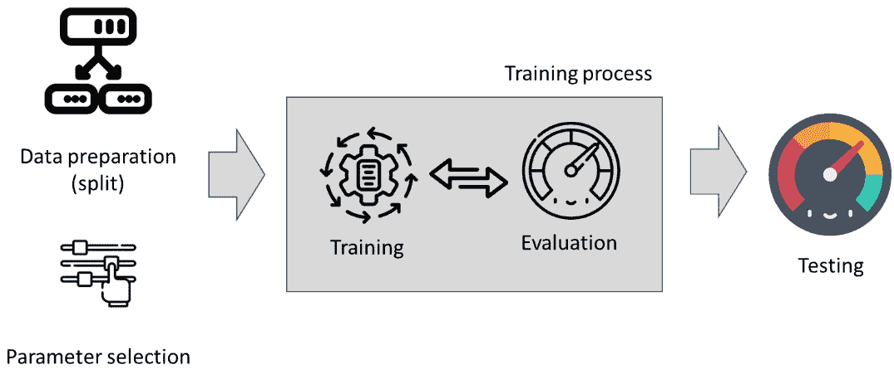
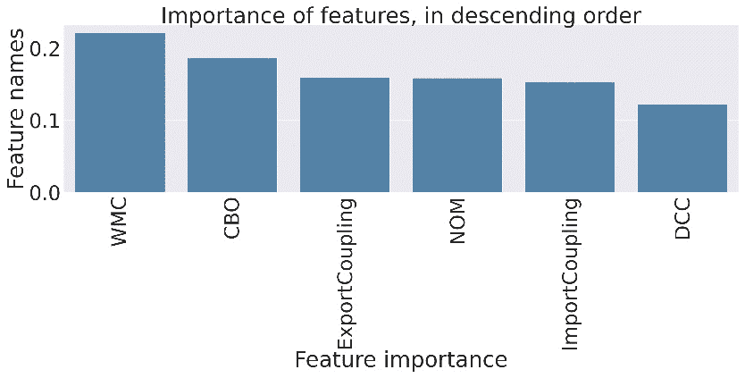
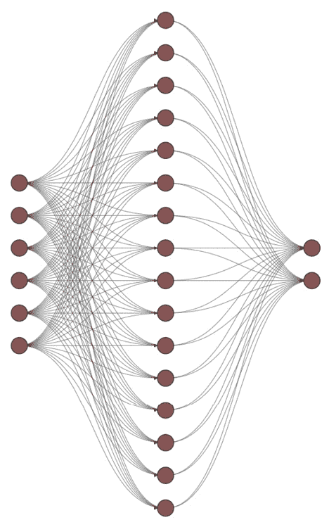

# 10

# 训练和评估经典机器学习系统和神经网络

现代机器学习框架被设计成对程序员友好。Python 编程环境（以及 R）的流行表明，设计、开发和测试机器学习模型可以专注于机器学习任务，而不是编程任务。机器学习模型的开发者可以专注于开发整个系统，而不是算法内部的编程。然而，这也带来了一些负面影响——对模型内部结构和它们是如何被训练、评估和验证的缺乏理解。

在本章中，我将更深入地探讨训练和评估的过程。我们将从不同算法背后的基本理论开始，然后学习它们是如何被训练的。我们将从经典的机器学习模型开始，以决策树为例。然后，我们将逐步转向深度学习，在那里我们将探索密集神经网络和更高级的网络类型。

本章最重要的部分是理解训练/评估算法与测试/验证整个机器学习软件系统之间的区别。我将通过描述机器学习算法作为生产机器学习系统的一部分（或整个机器学习系统的样子）来解释这一点。

在本章中，我们将涵盖以下主要主题：

+   训练和测试过程

+   训练经典机器学习模型

+   训练深度学习模型

+   误导性结果——数据泄露问题

# 训练和测试过程

机器学习通过使计算机能够从数据中学习并做出预测或决策，而无需明确编程，从而彻底改变了我们解决复杂问题的方式。机器学习的一个关键方面是训练模型，这涉及到教算法识别数据中的模式和关系。训练机器学习模型的两种基本方法是 `model.fit()` 和 `model.predict()`。

`model.fit()` 函数是训练机器学习模型的核心。它是模型从标记数据集中学习以做出准确预测的过程。在训练过程中，模型调整其内部参数以最小化其预测与训练数据中真实标签之间的差异。这种迭代优化过程，通常被称为“学习”，允许模型推广其知识并在未见过的数据上表现良好。

除了训练数据和标签之外，`model.fit()`函数还接受各种超参数作为参数。这些超参数包括周期数（即模型将遍历整个数据集的次数）、批量大小（在更新参数之前处理的样本数量）和学习率（确定参数更新的步长）。正确调整这些超参数对于确保有效的训练和防止诸如过拟合或欠拟合等问题至关重要。

一旦训练过程完成，训练好的模型就可以用于对新数据做出预测。这就是`model.predict()`方法发挥作用的地方。给定一个训练好的模型和一组输入数据，`model.predict()`函数将应用学习到的权重和偏差来生成预测或类别概率。预测输出可以用于各种目的，如分类、回归或异常检测，具体取决于手头问题的性质。

我们在之前的章节中看到了这个界面的例子。现在，是时候了解这个界面底下的内容以及训练过程是如何进行的了。在上一章中，我们将这个过程视为一个黑盒，即程序跳过`model.fit()`行之后，这个过程就完成了。这是这个过程的基本原理，但不仅如此。这个过程是迭代的，并且取决于正在训练的算法/模型。由于每个模型都有不同的参数，拟合函数可以接受更多的参数。我们甚至可以在实例化模型时添加额外的参数，甚至在训练过程之前。*图 10.1* 将这个过程呈现为一个灰色框：



图 10.1 – 训练机器学习模型的灰色框

在我们开始训练过程之前，我们将数据分为训练集和测试集（我们之前已经讨论过）。同时，我们选择我们使用的机器学习模型的参数。这些参数可以是任何东西，从随机森林中的树的数量到神经网络中的迭代次数和批量大小。

训练过程是迭代的，其中模型在数据上训练，内部评估，然后重新训练以找到更适合数据的拟合。在本章中，我们将探讨这种内部训练是如何工作的。

最后，一旦模型经过训练，它就准备好进行测试过程。在测试过程中，我们使用预定义的性能指标来检查模型学习到的模式对于新数据能否得到良好的重现。

# 训练经典机器学习模型

我们将首先训练一个模型，让我们能够查看其内部。我们将使用 CART 决策树分类器，我们可以可视化训练的实际决策树。我们将使用与上一章相同的数值数据。首先，让我们读取数据并创建训练/测试分割：

```py
# read the file with data using openpyxl
import pandas as pd
# we read the data from the excel file,
# which is the defect data from the ant 1.3 system
dfDataAnt13 = pd.read_excel('./chapter_6_dataset_numerical.xlsx',
                            sheet_name='ant_1_3',
                            index_col=0)
# prepare the dataset
import sklearn.model_selection
X = dfDataAnt13.drop(['Defect'], axis=1)
y = dfDataAnt13.Defect
X_train, X_test, y_train, y_test = \
        sklearn.model_selection.train_test_split(X, y, random_state=42, train_size=0.9)
```

上述代码使用 pandas 库中的`pd.read_excel()`函数读取名为`'chapter_6_dataset_numerical.xlsx'`的 Excel 文件。文件被读取到一个名为`dfDataAnt13`的 DataFrame 中。`sheet_name`参数指定了要读取的 Excel 文件中的工作表，而`index_col`参数将第一列设置为 DataFrame 的索引。

代码为训练机器学习模型准备数据集。通过使用`drop()`方法从`dfDataAnt13` DataFrame 中删除`'Defect'`列，将独立变量（特征）分配给`X`变量。通过从`dfDataAnt13` DataFrame 中选择`'Defect'`列，将因变量（目标）分配给`y`变量。

使用`sklearn.model_selection.train_test_split()`函数将数据集分为训练集和测试集。`X`和`y`变量被分为`X_train`、`X_test`、`y_train`和`y_test`变量。`train_size`参数设置为`0.9`，表示 90%的数据将用于训练，剩余的 10%将用于测试。`random_state`参数设置为`42`以确保分割的可重复性。

一旦数据准备就绪，我们可以导入决策树库并训练模型：

```py
# now that we have the data prepared
# we import the decision tree classifier and train it
from sklearn.tree import DecisionTreeClassifier
# first we create an empty classifier
decisionTreeModel = DecisionTreeClassifier()
# then we train the classifier
decisionTreeModel.fit(X_train, y_train)
# and we test it for the test set
y_pred_cart = decisionTreeModel.predict(X_test)
```

上述代码片段从`sklearn.tree`模块导入`DecisionTreeClassifier`类。创建了一个空的决策树分类器对象，并将其分配给`decisionTreeModel`变量。该对象将在之前片段中准备好的数据集上进行训练。在`decisionTreeModel`对象上调用`fit()`方法来训练分类器。`fit()`方法接受训练数据（`X_train`）和相应的目标值（`y_train`）作为输入。分类器将学习训练数据中的模式和关系以进行预测。

训练好的决策树分类器用于预测测试数据集（`X_test`）的目标值。在`decisionTreeModel`对象上调用`predict()`方法，并将`X_test`作为输入。预测的目标值存储在`y_pred_cart`变量中。预测的模型需要评估，因此让我们评估模型的准确率、精确率和召回率：

```py
# now, let's evaluate the code
from sklearn.metrics import accuracy_score
from sklearn.metrics import recall_score
from sklearn.metrics import precision_score
print(f'Accuracy: {accuracy_score(y_test, y_pred_cart):.2f}')
print(f'Precision: {precision_score(y_test, y_pred_cart, average="weighted"):.2f}, Recall: {recall_score(y_test, y_pred_cart, average="weighted"):.2f}')
```

这段代码片段生成了以下输出：

```py
Accuracy: 0.83
Precision: 0.94, Recall: 0.83
```

指标显示模型表现不错。它正确地将测试集中的 83%的数据分类。它对真实正例（更高的精确率）比对真实负例（较低的召回率）更敏感。这意味着它在预测中可能会错过一些缺陷易发模块。然而，决策树模型让我们能够查看模型内部，并探索它从数据中学到的模式。以下代码片段就是这样做的：

```py
from sklearn.tree import export_text
tree_rules = export_text(decisionTreeModel, feature_names=list(X_train.columns))
print(tree_rules)
```

前面的代码片段以文本形式导出决策树，我们将其打印出来。`export_text()` 函数接受两个参数——第一个是要可视化的决策树，下一个是特征列表。在我们的情况下，特征列表是数据集的列列表。

在这种情况下，整个决策树相当复杂，但第一个决策路径看起来是这样的：

```py
|--- WMC <= 36.00
|   |--- ExportCoupling <= 1.50
|   |   |--- NOM <= 2.50
|   |   |   |--- NOM <= 1.50
|   |   |   |   |--- class: 0
|   |   |   |--- NOM >  1.50
|   |   |   |   |--- WMC <= 5.50
|   |   |   |   |   |--- class: 0
|   |   |   |   |--- WMC >  5.50
|   |   |   |   |   |--- CBO <= 4.50
|   |   |   |   |   |   |--- class: 1
|   |   |   |   |   |--- CBO >  4.50
|   |   |   |   |   |   |--- class: 0
|   |   |--- NOM >  2.50
|   |   |   |--- class: 0
```

这个决策路径看起来非常类似于一个大的 `if-then` 语句，如果我们知道数据中的模式，我们就可以自己编写它。这个模式并不简单，这意味着数据相当复杂。它可能是非线性的，需要复杂的模型来捕捉依赖关系。它也可能需要大量的努力来找到模型性能和其泛化数据能力之间的正确平衡。

因此，这是我处理这类模型的最佳实践。

最佳实践 #54

如果你想要理解你的数值数据，请使用提供可解释性的模型。

在前面的章节中，我提倡使用 AutoML 模型，因为它们稳健且能为我们节省大量寻找正确模块的麻烦。然而，如果我们想更好地理解我们的数据并了解模式，我们可以从决策树等模型开始。它们对数据的洞察为我们提供了关于我们可以从数据中获得什么的良好概述。

作为反例，让我们看看来自同一数据集的另一个模块的数据。让我们读取它并执行分割：

```py
# read the file with data using openpyxl
import pandas as pd
# we read the data from the excel file,
# which is the defect data from the ant 1.3 system
dfDataCamel12 = pd.read_excel('./chapter_6_dataset_numerical.xlsx',
                            sheet_name='camel_1_2',
                            index_col=0)
# prepare the dataset
import sklearn.model_selection
X = dfDataCamel12.drop(['Defect'], axis=1)
y = dfDataCamel12.Defect
X_train, X_test, y_train, y_test = \
        sklearn.model_selection.train_test_split(X, y, random_state=42, train_size=0.9)
```

现在，让我们为这些数据训练一个新的模型：

```py
# now that we have the data prepared
# we import the decision tree classifier and train it
from sklearn.tree import DecisionTreeClassifier
# first we create an empty classifier
decisionTreeModelCamel = DecisionTreeClassifier()
# then we train the classifier
decisionTreeModelCamel.fit(X_train, y_train)
# and we test it for the test set
y_pred_cart_camel = decisionTreeModel.predict(X_test)
```

到目前为止，一切顺利——没有错误，没有问题。让我们检查一下模型的表现：

```py
# now, let's evaluate the code
from sklearn.metrics import accuracy_score
from sklearn.metrics import recall_score
from sklearn.metrics import precision_score
print(f'Accuracy: {accuracy_score(y_test, y_pred_cart_camel):.2f}')
print(f'Precision: {precision_score(y_test, y_pred_cart_camel, average="weighted"):.2f}, Recall: {recall_score(y_test, y_pred_cart_camel, average="weighted"):.2f}')
```

然而，性能并不像之前那么高：

```py
Accuracy: 0.65
Precision: 0.71, Recall: 0.65
```

现在，让我们打印出树：

```py
from sklearn.tree import export_text
tree_rules = export_text(decisionTreeModel, feature_names=list(X_train.columns))
print(tree_rules)
```

如我们所见，结果也相当复杂：

```py
|--- WMC >  36.00
|   |--- DCC <= 3.50
|   |   |--- WMC <= 64.50
|   |   |   |--- NOM <= 17.50
|   |   |   |   |--- ImportCoupling <= 7.00
|   |   |   |   |   |--- NOM <= 6.50
|   |   |   |   |   |   |--- class: 0
|   |   |   |   |   |--- NOM >  6.50
|   |   |   |   |   |   |--- CBO <= 4.50
|   |   |   |   |   |   |   |--- class: 0
|   |   |   |   |   |   |--- CBO >  4.50
|   |   |   |   |   |   |   |--- ExportCoupling <= 13.00
|   |   |   |   |   |   |   |   |--- NOM <= 16.50
|   |   |   |   |   |   |   |   |   |--- class: 1
|   |   |   |   |   |   |   |   |--- NOM >  16.50
|   |   |   |   |   |   |   |   |   |--- class: 0
|   |   |   |   |   |   |   |--- ExportCoupling >  13.00
|   |   |   |   |   |   |   |   |--- class: 0
|   |   |   |   |--- ImportCoupling >  7.00
|   |   |   |   |   |--- class: 0
|   |   |   |--- NOM >  17.50
|   |   |   |   |--- class: 1
|   |   |--- WMC >  64.50
|   |   |   |--- class: 0
```

如果我们看看这个树中的第一个决策和上一个决策，它基于 WMC 特征。**WMC** 代表 **加权方法每类**，是 20 世纪 90 年代由 Chidamber 和 Kamerer 提出的经典软件度量之一。该度量捕捉了类的复杂性和大小（以某种方式），因此大类的缺陷倾向性更强——简单地说，如果源代码更多，犯错误的机会就更大。在这个模型的情况下，这要复杂一些，因为模型认识到 WMC 超过 36 的类比其他类更容易出错，除了超过 64.5 的类，这些类不太容易出错。后者也是一个已知现象，即大类的测试也更为困难，因此可能包含未发现的缺陷。

这里是我的下一个最佳实践，关于模型的可解释性。

最佳实践 #55

最好的模型是那些能够捕捉数据中经验现象的模型。

尽管机器学习模型可以捕捉任何类型的依赖关系，但最佳模型是那些能够捕捉逻辑和经验观察的模型。在先前的例子中，模型可以捕捉与类的大小及其易出错性相关的软件工程经验观察。拥有能够捕捉经验关系的模型可以带来更好的产品和可解释的人工智能。

# 理解训练过程

从软件工程师的角度来看，训练过程相当简单——我们拟合模型，验证它，并使用它。我们检查模型在性能指标方面的好坏。如果模型足够好，并且我们可以解释它，那么我们就围绕它开发整个产品，或者将其用于更大的软件产品中。

当模型没有学习到任何有用的东西时，我们需要了解为什么会出现这种情况，以及是否可能存在另一个可以做到的模型。我们可以使用我们在*第六章*中学到的可视化技术来探索数据，并使用*第四章*中的技术清除噪声。

现在，让我们探索决策树模型如何从数据中学习的流程。`DecisionTree`分类器通过递归地根据训练数据集中特征的值对特征空间进行分区来从提供的数据中学习。它构建一个二叉树，其中每个内部节点代表一个特征和一个基于阈值值的决策规则，每个叶节点代表一个预测的类别或结果。

训练过程分为以下步骤：

1.  **选择最佳特征**：分类器评估不同的特征，并确定最佳分离数据为不同类别的特征。这通常是通过不纯度度量或信息增益来完成的，例如基尼不纯度或熵。

1.  **分割数据集**：一旦选定了最佳特征，分类器将数据集根据该特征的值分割成两个或更多子集。每个子集代表决策树中的不同分支或路径。

1.  **递归重复过程**：上述步骤对决策树的每个子集或分支重复进行，将它们视为单独的数据集。这个过程会继续进行，直到满足停止条件，例如达到最大深度、节点上的最小样本数或其他预定义标准。

1.  **分配类别标签**：在决策树的叶节点处，分类器根据该区域样本的多数类别分配类别标签。这意味着在做出预测时，分类器将叶节点中最频繁的类别分配给落入该区域的未见样本。

在学习过程中，`DecisionTree`分类器旨在找到最佳分割，以最大化类别的分离并最小化每个结果子集中的不纯度。通过根据提供的训练数据递归地根据特征空间进行分区，分类器学习决策规则，使其能够对未见数据做出预测。

需要注意的是，决策树容易过拟合，这意味着它们可以过度记住训练数据，并且对新数据泛化能力不强。例如剪枝、限制最大深度或使用随机森林等集成方法可以帮助减轻过拟合并提高决策树模型的表现。

我们在这本书中已经使用过随机森林分类器，所以这里不会深入细节。尽管随机森林在泛化数据方面表现更好，但与决策树相比，它们是不透明的。我们无法探索模型学到了什么——我们只能探索哪些特征对判决贡献最大。

# 随机森林和不透明模型

让我们基于与反例中相同的数据训练随机森林分类器，并检查模型是否表现更好，以及模型是否使用与原始反例中`DecisionTree`分类器相似的特征。

让我们使用以下代码片段实例化、训练和验证模型：

```py
from sklearn.ensemble import RandomForestClassifier
randomForestModel = RandomForestClassifier()
randomForestModel.fit(X_train, y_train)
y_pred_rf = randomForestModel.predict(X_test)
```

在评估模型后，我们获得了以下性能指标：

```py
Accuracy: 0.62
Precision: 0.63, Recall: 0.62
```

诚然，这些指标与决策树中的指标不同，但整体性能并没有太大的差异。0.03 的准确度差异是可以忽略不计的。首先，我们可以提取重要特征，重复使用在*第五章*中介绍过的相同技术：

```py
# now, let's check which of the features are the most important ones
# first we create a dataframe from this list
# then we sort it descending
# and then filter the ones that are not imporatnt
dfImportantFeatures = pd.DataFrame(randomForestModel.feature_importances_, index=X.columns, columns=['importance'])
# sorting values according to their importance
dfImportantFeatures.sort_values(by=['importance'],
                                ascending=False,
                                inplace=True)
# choosing only the ones that are important, skipping
# the features which have importance of 0
dfOnlyImportant = dfImportantFeatures[dfImportantFeatures['importance'] != 0]
# print the results
print(f'All features: {dfImportantFeatures.shape[0]}, but only {dfOnlyImportant.shape[0]} are used in predictions. ')
```

我们可以通过执行以下代码来可视化决策中使用的特征集：

```py
# we use matplotlib and seaborn to make the plot
import matplotlib.pyplot as plt
import seaborn as sns
# Define size of bar plot
# We make the x axis quite much larger than the y-axis since
# there is a lot of features to visualize
plt.figure(figsize=(40,10))
# plot Searborn bar chart
# we just use the blue color
sns.barplot(y=dfOnlyImportant['importance'],
            x=dfOnlyImportant.index,
            color='steelblue')
# we make the x-labels rotated so that we can fit
# all the features
plt.xticks(rotation=90)
sns.set(font_scale=6)
# add chart labels
plt.title('Importance of features, in descending order')
plt.xlabel('Feature importance')
plt.ylabel('Feature names')
```

此代码帮助我们理解*图 10*.*2*中显示的重要性图表。在这里，WMC（加权方法计数）是最重要的特征。这意味着森林中有许多树使用此指标来做出决策。然而，由于森林是一个集成分类器——它使用投票来做出决策——这意味着在做出最终调用/预测时总是使用多棵树：



图 10.2 – 随机森林分类器的特征重要性图表。

请注意，该模型比这些特征的线性组合更复杂。此图表展示了不是最佳实践，而是一种最佳经验。因此，我将将其用作最佳实践来展示其重要性。

最佳实践 #56

简单但可解释的模型通常可以很好地捕捉数据。

在我使用不同类型数据的实验过程中，我所学到的经验是，如果有模式，一个简单的模型就能捕捉到它。如果没有模式，或者数据有很多不符合规则的情况，那么即使是最复杂的模型在寻找模式时也会遇到问题。因此，如果你不能解释你的结果，不要将它们用于你的产品中，因为这些结果可能会使产品变得相当无用。

然而，在这个隧道尽头有一线光明。一些模型可以捕捉非常复杂的模式，但它们是透明的——神经网络。

# 训练深度学习模型

训练密集神经网络涉及多个步骤。首先，我们准备数据。这通常涉及特征缩放、处理缺失值、编码分类变量以及将数据分为训练集和验证集。

然后，我们定义密集神经网络的架构。这包括指定层数、每层的神经元数量、要使用的激活函数以及任何正则化技术，如 dropout 或批量归一化。

一旦定义了模型，我们就需要初始化它。我们根据定义的架构创建神经网络模型的一个实例。这涉及到创建神经网络类的一个实例或使用深度学习库中可用的预定义模型架构。我们还需要定义一个损失函数，该函数量化模型预测输出与实际目标值之间的误差。损失函数的选择取决于问题的性质，例如分类（交叉熵）或回归（均方误差）。

除了损失函数之外，我们还需要一个优化器。优化器算法将在训练过程中更新神经网络的权重。常见的优化器包括**随机梯度下降（SGD**）、Adam 和 RMSprop。

然后，我们可以训练模型。在这里，我们遍历训练数据多次（整个数据集的遍历）。在每个 epoch（遍历整个数据集）中，执行以下步骤：

1.  **前向传播**：我们将一批输入数据输入到模型中，并计算预测输出。

1.  **计算损失**：我们使用定义的损失函数将预测输出与实际目标值进行比较，以计算损失。

1.  **反向传播**：我们通过反向传播将损失反向传播到网络中，以计算权重相对于损失的梯度。

1.  **更新权重**：我们使用优化器根据计算出的梯度来更新神经网络的权重，调整网络参数以最小化损失。

我们对训练数据中的每个批次重复这些步骤，直到所有批次都已被处理。

最后，我们需要执行验证过程，就像在之前的模型中一样。在这里，我们计算一个验证指标（例如准确度或均方误差）来评估模型对未见数据的泛化能力。这有助于我们监控模型的进展并检测过拟合。

一旦模型经过训练和验证，我们就可以在未用于训练或验证的单独测试数据集上评估其性能。在这里，我们计算相关的评估指标来评估模型的准确度、精确度、召回率或其他所需的指标。

因此，让我们为我们的数据集做这件事。首先，我们必须使用以下代码定义模型的架构：

```py
import torch
import torch.nn as nn
import torch.optim as optim
# Define the neural network architecture
class NeuralNetwork(nn.Module):
    def __init__(self, input_size, hidden_size, num_classes):
        super(NeuralNetwork, self).__init__()
        self.fc1 = nn.Linear(input_size, hidden_size)
        self.relu = nn.ReLU()
        self.fc2 = nn.Linear(hidden_size, num_classes)
    def forward(self, x):
        out = self.fc1(x)
        out = self.relu(out)
        out = self.fc2(out)
        return out
```

在这里，我们定义了一个名为 `NeuralNetwork` 的类，它是 `nn.Module` 的子类。这个类代表我们的神经网络模型。它有两个全连接层（`fc1` 和 `fc2`），层间使用 `ReLU` 激活函数。网络看起来就像 *图 10.3* 中所示的那样：



图 10.3 – 用于预测缺陷的神经网络。

这个可视化是使用[`alexlenail.me/NN-SVG/index.html`](http://alexlenail.me/NN-SVG/index.html)创建的。隐藏层中的神经元数量是 64，但在这个图中，只显示了 16 个，以便使其更易于阅读。网络从 6 个输入神经元开始，然后是隐藏层（中间）的 64 个神经元，最后是两个用于决策类别的神经元。

现在，我们可以定义训练网络的超参数并实例化它：

```py
# Define the hyperparameters
input_size = X_train.shape[1]  # Number of input features
hidden_size = 64              # Number of neurons in the hidden layer
num_classes = 2               # Number of output classes
# Create an instance of the neural network
model = NeuralNetwork(input_size, hidden_size, num_classes)
# Define the loss function and optimizer
criterion = nn.CrossEntropyLoss()
optimizer = optim.Adam(model.parameters(), lr=0.001)
# Convert the data to PyTorch tensors
X_train_tensor = torch.Tensor(X_train.values)
y_train_tensor = torch.LongTensor(y_train.values)
X_test_tensor = torch.Tensor(X_test.values)
# Training the neural network
num_epochs = 10000
batch_size = 32
```

在这里，我们创建了一个名为 `model` 的 `NeuralNetwork` 类实例，具有指定的输入大小、隐藏大小和输出类数量，正如我们在第一个代码片段中定义的那样。我们定义了损失函数（交叉熵损失）和优化器（Adam 优化器）来训练模型。然后，使用 `torch.Tensor()` 和 `torch.LongTensor()` 将数据转换为 PyTorch 张量。最后，我们表示我们希望在 10,000 个 epoch（迭代）中训练模型，每个迭代包含 32 个元素（数据点）：

```py
for epoch in range(num_epochs):
    for I in range(0, len(X_train_tensor), batch_size):
        batch_X = X_train_tensor[i:i+batch_size]
        batch_y = y_train_tensor[i:i+batch_size]
        # Forward pass
        outputs = model(batch_X)
        loss = criterion(outputs, batch_y)
        # Backward and optimize
        optimizer.zero_grad()
        loss.backward()
        optimizer.step()
    # Print the loss at the end of each epoch
    if (epoch % 100 == 0):
      print(""Epoch {epoch+1}/{num_epochs}, Loss: {loss.item():.3f"")
```

现在，我们可以获取测试数据的预测并获取性能指标：

```py
with torch.no_grad():
    model.eval()  # Set the model to evaluation mode
    X_test_tensor = torch.Tensor(X_test.values)
    outputs = model(X_test_tensor)
    _, predicted = torch.max(outputs.data, 1)
    y_pred_nn = predicted.numpy()
# now, let's evaluate the code
from sklearn.metrics import accuracy_score
from sklearn.metrics import recall_score
from sklearn.metrics import precision_score
print(f'Accuracy: {accuracy_score(y_test, y_pred_nn):.2f}')
print(f'Precision: {precision_score(y_test, y_pred_nn, average="weighted"):.2f}, Recall: {recall_score(y_test, y_pred_nn, average="weighted"):.2f}')
```

性能指标如下：

```py
Accuracy: 0.73
Precision: 0.79, Recall: 0.73
```

因此，这比之前的模型要好一些，但并不出色。模式根本不存在。我们可以通过增加隐藏层的数量来使网络更大，但这并不会使预测变得更好。

# 误导性结果 – 数据泄露

在训练过程中，我们使用一组数据，在测试集中使用另一组数据。最佳的训练过程是当这两个数据集是分开的时候。如果它们不是分开的，我们就会遇到一个称为数据泄露问题的情况。这个问题是指我们在训练集和测试集中有相同的数据点。让我们用一个例子来说明这一点。

首先，我们需要创建一个新的分割，其中两个集合中都有一些数据点。我们可以通过使用 split 函数并将 20%的数据点设置为测试集来实现这一点。这意味着至少有 10%的数据点在两个集合中：

```py
X_trainL, X_testL, y_trainL, y_testL = \
        sklearn.model_selection.train_test_split(X, y, random_state=42, train_size=0.8)
```

现在，我们可以使用相同的代码对这组数据进行预测，然后计算性能指标：

```py
# now, let's evaluate the model on this new data
with torch.no_grad():
    model.eval()  # Set the model to evaluation mode
    X_test_tensor = torch.Tensor(X_testL.values)
    outputs = model(X_test_tensor)
    _, predicted = torch.max(outputs.data, 1)
    y_pred_nn = predicted.numpy()
print(f'Accuracy: {accuracy_score(y_testL, y_pred_nn):.2f}')
print(f'Precision: {precision_score(y_testL, y_pred_nn, average="weighted"):.2f}, Recall: {recall_score(y_testL, y_pred_nn, average="weighted"):.2f}')
```

结果如下：

```py
Accuracy: 0.85
Precision: 0.86, Recall: 0.85
```

结果比之前更好。然而，它们之所以更好，仅仅是因为 10%的数据点被用于训练和测试集。这意味着模型的性能比指标所暗示的要差得多。因此，我们得出了我的下一个最佳实践。

最佳实践 #56

总是要确保训练集和测试集中的数据点是分开的。

尽管我们在这里故意犯了这个错误，但在实践中很容易犯这个错误。请注意 split 函数中的`random_state=42`参数。显式设置它确保了分割的可重复性。然而，如果我们不这样做，我们每次进行分割时都可能会得到不同的分割，从而可能导致数据泄露问题。

当我们处理图像或文本时，数据泄露问题甚至更难发现。仅仅因为一个图像来自两个不同的文件，并不能保证它是不同的。例如，在高速公路上连续拍摄的图像将不同，但不会太不同，如果它们最终出现在测试集和训练集中，我们就会得到数据泄露问题的一个全新维度。

# 摘要

在本章中，我们讨论了与机器学习和神经网络相关的各种主题。我们解释了如何使用 pandas 库从 Excel 文件中读取数据，并为训练机器学习模型准备数据集。我们探讨了决策树分类器的使用，并展示了如何使用 scikit-learn 训练决策树模型。我们还展示了如何使用训练好的模型进行预测。

然后，我们讨论了如何从决策树分类器切换到随机森林分类器，后者是决策树的集成。我们解释了必要的代码修改，并提供了示例。接下来，我们将重点转向在 PyTorch 中使用密集神经网络。我们描述了创建神经网络架构、训练模型以及使用训练好的模型进行预测的过程。

最后，我们解释了训练密集神经网络所涉及的步骤，包括数据准备、模型架构、初始化模型、定义损失函数和优化器、训练循环、验证、超参数调整和评估。

总体来说，我们涵盖了与机器学习算法相关的一系列主题，包括决策树、随机森林和密集神经网络，以及它们各自的训练过程。

在下一章中，我们将探讨如何训练更先进的机器学习模型——例如自编码器。

# 参考文献

+   *Chidamber, S.R. 和 C.F. Kemerer, 对面向对象设计的度量集。IEEE 软件工程 Transactions, 1994\. 20(6):* *p. 476–493.*
