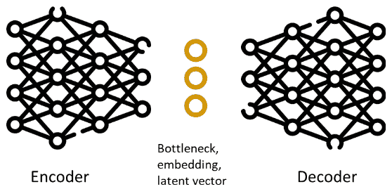
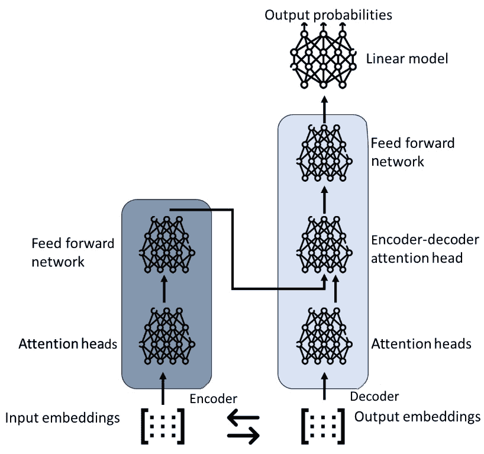
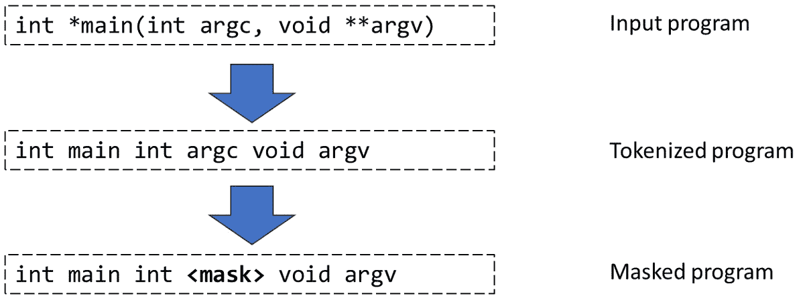
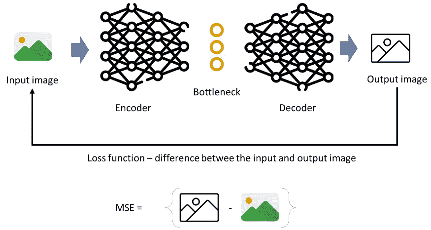
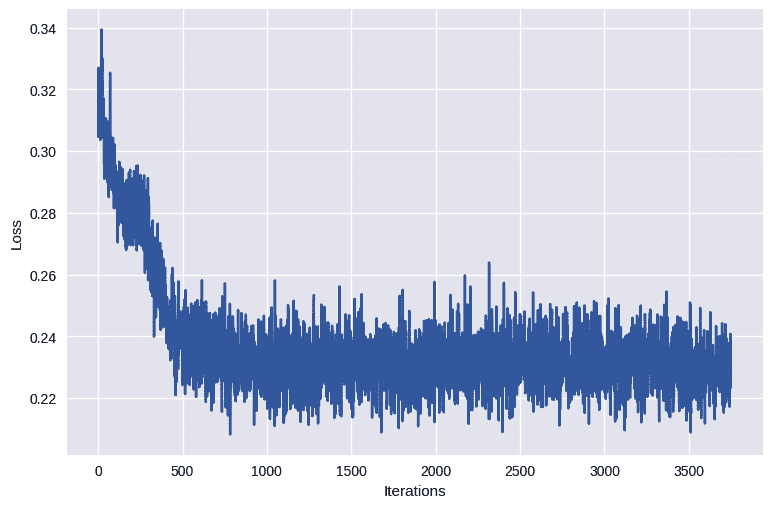
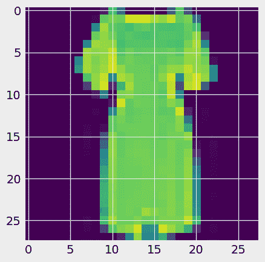
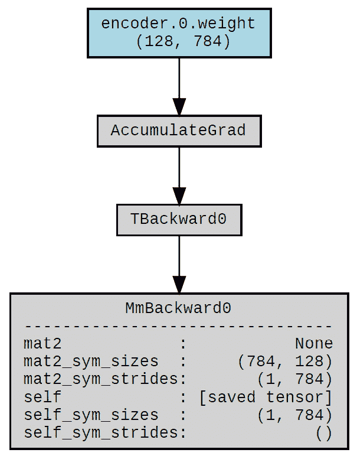
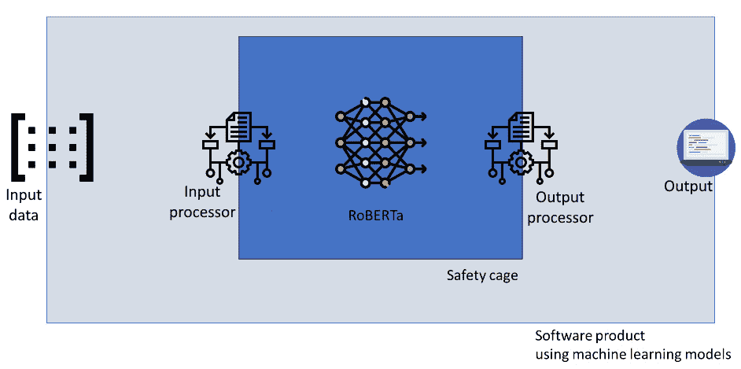

# 11

# 高级机器学习算法的训练和评估——GPT 和自动编码器

经典的**机器学习**（**ML**）和**神经网络**（**NNs**）非常适合处理经典问题——预测、分类和识别。正如我们在上一章所学，训练它们需要适量的数据，并且我们针对特定任务进行训练。然而，在 2010 年代末和 2020 年代初，机器学习（ML）和**人工智能**（**AI**）的突破是关于完全不同类型的模型——**深度学习**（**DL**）、**生成预训练转换器**（**GPTs**）和**生成** **AI**（**GenAI**）。

生成 AI 模型提供了两个优势——它们可以生成新数据，并且可以为我们提供数据的内部表示，该表示捕捉了数据的上下文，并在一定程度上捕捉了其语义。在前几章中，我们看到了如何使用现有模型进行推理和生成简单的文本片段。

在本章中，我们探讨基于 GPT 和双向编码器表示转换器（BERT）模型的生成 AI 模型是如何工作的。这些模型旨在根据它们训练的模式生成新数据。我们还探讨了自动编码器（AEs）的概念，其中我们训练一个 AE 根据先前训练的数据生成新图像。

在本章中，我们将涵盖以下主要内容：

+   从经典机器学习模型到生成 AI

+   生成 AI 模型背后的理论——自动编码器（AEs）和转换器

+   **Robustly Optimized BERT Approach**（**RoBERTa**）模型的训练和评估

+   自动编码器（AE）的训练和评估

+   开发安全笼子以防止模型破坏整个系统

# 从经典机器学习到生成 AI

经典人工智能，也称为符号人工智能或基于规则的 AI，是该领域最早的思想流派之一。它基于明确编码知识和使用逻辑规则来操纵符号并推导出智能行为的理念。经典人工智能系统旨在遵循预定义的规则和算法，使它们能够以精确和确定性解决定义明确的问题。我们深入探讨经典人工智能的潜在原则，探索其对基于规则的系统、专家系统和逻辑推理的依赖。

相比之下，生成 AI 代表了人工智能发展的范式转变，利用机器学习（ML）和神经网络（NNs）的力量来创建能够生成新内容、识别模式和做出明智决策的智能系统。生成 AI 不是依赖于显式规则和手工知识，而是利用数据驱动的方法从大量信息中学习，并推断模式和关系。我们探讨生成 AI 的核心概念，包括深度学习（DL）、神经网络（NNs）和概率模型，以揭示其创造原创内容并促进创造性问题解决的能力。

生成式人工智能（GenAI）模型的一个例子是 GPT-3 模型。GPT-3 是由 OpenAI 开发的最先进的语言模型。它基于转换器架构。GPT-3 使用一种称为**无监督学习**（UL）的技术进行训练，这使得它能够生成连贯且上下文相关的文本。

# 先进模型（AE 和转换器）背后的理论

经典机器学习（ML）模型的一个大局限是访问标注数据。大型神经网络包含数百万（如果不是数十亿）个参数，这意味着它们需要同样数量的标记数据点来正确训练。数据标注，也称为注释，是 ML 中最昂贵的活动，因此标注过程成为了 ML 模型的实际限制。在 2010 年代初，解决这个问题的方法是使用众包。

众包，这是一种集体数据收集的过程（以及其他），意味着我们使用我们服务的用户来标注数据。CAPTCHA 是最突出的例子之一。当我们需要识别图像以登录服务时，会使用 CAPTCHA。当我们引入新图像时，每次用户需要识别这些图像时，我们可以在相对较短的时间内标注大量数据。

然而，这个过程本身存在一个固有的问题。好吧，有几个问题，但最突出的问题是这个过程主要与图像或类似类型的数据一起工作。它也是一个相对有限的过程——我们只能要求用户识别图像，但不能添加语义图，也不能在图像上绘制边界框。我们不能要求用户评估图像或任何其他，稍微复杂一些的任务。

这里引入了更高级的方法——生成式人工智能（GenAI）和如**生成对抗网络**（GANs）之类的网络。这些网络被设计用来生成数据并学习哪些数据类似于原始数据。这些网络非常强大，并被用于如图像生成等应用；例如，在所谓的“深度伪造”中。

## AEs

这样的模型的主要组成部分是自动编码器（AE），它被设计用来学习输入数据的压缩表示（编码），然后从这个压缩表示中重建原始数据（解码）。

自动编码器（AE）的架构（**图 11.1**.1）由两个主要组件组成：编码器和解码器。编码器接收输入数据并将其映射到一个低维的潜在空间表示，通常被称为编码/嵌入或潜在表示。解码器接收这个编码表示并将其重建为原始输入数据：



图 11.1 – 自动编码器的高级架构

自动编码器（AE）的目标是最小化重建误差，即输入数据与解码器输出之间的差异。通过这样做，AE 学习在潜在表示中捕获输入数据的最重要特征，从而有效地压缩信息。最有趣的部分是潜在空间或编码。这一部分允许模型在只有几个数字的小向量中学习复杂数据点（例如，图像）的表示。AE 学习的潜在表示可以被视为输入数据的压缩表示或低维嵌入。这种压缩表示可用于各种目的，例如数据可视化、降维、异常检测，或作为其他下游任务的起点。

编码器部分计算潜在向量，解码器部分可以将它扩展成图像。自动编码器有多种类型；最有趣的一种是**变分自动编码器**（**VAE**），它编码的是可以生成新数据的函数的参数，而不是数据的表示本身。这样，它可以根据分布创建新数据。实际上，它甚至可以通过组合不同的函数来创建完全新的数据类型。

## 转换器

在**自然语言处理**（**NLP**）任务中，我们通常使用一种略有不同的生成人工智能类型——转换器。转换器彻底改变了机器翻译领域，但已被应用于许多其他任务，包括语言理解和文本生成。

在其核心，转换器采用了一种自注意力机制，允许模型在处理序列中的不同单词或标记时，权衡它们的重要性。这种注意力机制使得模型能够比传统的**循环神经网络**（**RNNs**）或**卷积神经网络**（**CNNs**）更有效地捕捉单词之间的长距离依赖关系和上下文关系。

转换器由编码器-解码器结构组成。编码器处理输入序列，如句子，解码器生成输出序列，通常基于输入和目标序列。转换器有两个独特的元素：

+   **多头自注意力（MHSA**）：一种允许模型同时关注输入序列中不同位置的机制，捕捉不同类型的依赖关系。这是对 RNN 架构的扩展，它能够连接同一层中的神经元，从而捕捉时间依赖关系。

+   **位置编码**：为了将位置信息纳入模型，添加了位置编码向量到输入嵌入中。这些位置编码基于标记及其相互之间的相对位置。这种机制允许我们捕捉特定标记的上下文，因此捕捉文本的基本上下文语义。

*图 11.2*展示了转换器的高级架构：



图 11.2 – Transformer 的高级架构

在这个架构中，自注意力是模型在处理序列中的单词或标记时，权衡不同单词或标记重要性的关键机制。自注意力机制独立应用于输入序列中的每个单词，并有助于捕捉单词之间的上下文关系和依赖。术语*头*指的是并行操作的独立注意力机制。在 Transformer 模型中可以使用多个自注意力头来捕捉不同类型的关系（尽管我们不知道这些关系是什么）。

每个自注意力头通过计算查询表示和键表示之间的注意力分数来操作。这些注意力分数表示序列中每个单词相对于其他单词的重要性或相关性。通过将查询和键表示之间的点积，然后应用 softmax 函数来归一化分数，获得注意力分数。

然后使用注意力分数来权衡值表示。将加权值相加，以获得序列中每个单词的输出表示。

Transformer 中的前馈网络有两个主要作用：特征提取和位置表示。特征提取从自注意力输出中提取高级特征，其方式与我们之前学习过的词嵌入提取非常相似。通过应用非线性变换，模型可以捕捉输入序列中的复杂模式和依赖关系。位置表示确保模型可以学习每个位置的不同变换。它允许模型学习句子的复杂表示，因此捕捉每个单词和句子的更复杂上下文。

Transformer 架构是现代模型如 GPT-3 的基础，GPT-3 是一个预训练的生成 Transformer；也就是说，它已经在大量文本上进行了预训练。然而，它基于 BERT 及其相关模型。

# RoBERTa 模型的训练和评估

通常，GPT-3 的训练过程涉及将模型暴露于来自不同来源的大量文本数据，如书籍、文章、网站等。通过分析这些数据中的模式、关系和语言结构，模型学习根据周围上下文预测单词或短语出现的可能性。这种学习目标是通过称为**掩码语言模型**（**MLM**）的过程实现的，其中随机掩码输入中的某些单词，模型的任务是根据上下文预测正确的单词。

在本章中，我们训练 RoBERTa 模型，这是现在经典的 BERT 模型的一个变体。我们不是使用如书籍和*维基百科*文章等通用来源，而是使用程序。为了使我们的训练任务更加具体，让我们训练一个能够“理解”来自网络域的代码的模型——WolfSSL，这是一个 SSL 协议的开源实现，用于许多嵌入式软件设备。

一旦训练完成，BERT 模型能够通过利用其学习到的知识和给定提示中提供的上下文来生成文本。当用户提供一个提示或部分句子时，模型会处理输入，并通过基于从训练数据中学习到的上下文概率预测最可能的下一个词来生成响应。

当涉及到 GPT-3（以及类似的）模型时，它是 BERT 模型的扩展。GPT-3 的生成过程涉及 transformer 架构内的多层注意力机制。这些注意力机制允许模型关注输入文本的相关部分，并在不同的单词和短语之间建立联系，确保生成输出的连贯性和上下文性。模型通过在每个步骤中采样或选择最可能的下一个词来生成文本，同时考虑到之前生成的单词。

因此，让我们通过准备训练数据来开始我们的训练过程。首先，我们读取数据集：

```py
from tokenizers import ByteLevelBPETokenizer
paths = ['source_code_wolf_ssl.txt']
print(f'Found {len(paths)} files')
print(f'First file: {paths[0]}')
```

这为我们提供了原始训练集。在这个集合中，文本文件包含了一个文件中的所有 WolfSSL 协议的源代码。我们不必这样准备，但这样做确实使过程更容易，因为我们只需处理一个源文件。现在，我们可以训练分词器，这与我们在前几章中看到的过程非常相似：

```py
# Initialize a tokenizer
tokenizer = ByteLevelBPETokenizer()
print('Training tokenizer...')
# Customize training
# we use a large vocabulary size, but we could also do with ca. 10_000
tokenizer.train(files=paths,
                vocab_size=52_000,
                min_frequency=2,
                special_tokens=["<s>","<pad>","</s>","<unk>","<mask>",])
```

第一行初始化`ByteLevelBPETokenizer`分词器类的实例。这个分词器基于**字节对编码**（**BPE**）算法的字节级版本，这是一种流行的子词分词方法。我们已在前几章中讨论过它。

下一行打印一条消息，表明分词器训练过程开始。

调用`tokenizer.train()`函数来训练分词器。训练过程需要几个参数：

+   `files=paths`: 此参数指定包含要训练分词器的文本数据的输入文件或路径。它期望一个文件路径列表。

+   `vocab_size=52_000`: 此参数设置词汇表的大小；也就是说，分词器将生成的唯一标记的数量。在这种情况下，分词器将创建一个包含 52,000 个标记的词汇表。

+   `min_frequency=2`: 此参数指定一个标记必须在训练数据中出现的最小频率，才能包含在词汇表中。低于此阈值的标记将被视为**词汇表外**（**OOV**）标记。

+   `special_tokens=["<s>","<pad>","</s>

一旦训练过程完成，分词器将学习词汇表，并能够使用训练的子词单元对文本进行编码和解码。现在，我们可以使用以下代码保存分词器：

```py
import os
# we give this model a catchy name - wolfBERTa
# because it is a RoBERTa model trained on the WolfSSL source code
token_dir = './wolfBERTa'
if not os.path.exists(token_dir):
  os.makedirs(token_dir)
tokenizer.save_model('wolfBERTa')
```

我们还使用以下行测试此分词器：`tokenizer.encode("int main(int argc,` `void **argv)").tokens`。

现在，让我们确保在下一步中分词器与我们的模型可比较。为此，我们需要确保分词器的输出永远不会超过模型可以接受的标记数：

```py
from tokenizers.processors import BertProcessing
# let's make sure that the tokenizer does not provide more tokens than we expect
# we expect 512 tokens, because we will use the BERT model
tokenizer._tokenizer.post_processor = BertProcessing(
    ("</s>", tokenizer.token_to_id("</s>")),
    ("<s>", tokenizer.token_to_id("<s>")),
)
tokenizer.enable_truncation(max_length=512)
```

现在，我们可以开始准备模型。我们通过从 HuggingFace hub 导入预定义的类来完成此操作：

```py
import the RoBERTa configuration
from transformers import RobertaConfig
# initialize the configuration
# please note that the vocab size is the same as the one in the tokenizer.
# if it is not, we could get exceptions that the model and the tokenizer are not compatible
config = RobertaConfig(
    vocab_size=52_000,
    max_position_embeddings=514,
    num_attention_heads=12,
    num_hidden_layers=6,
    type_vocab_size=1,
)
```

第一行，`from transformers import RobertaConfig`，从`transformers`库中导入`RobertaConfig`类。`RobertaConfig`类用于配置 RoBERTa 模型。接下来，代码初始化 RoBERTa 模型的配置。传递给`RobertaConfig`构造函数的参数如下：

+   `vocab_size=52_000`: 此参数设置 RoBERTa 模型使用的词汇表大小。它应与分词器训练期间使用的词汇表大小相匹配。在这种情况下，分词器和模型都具有 52,000 的词汇表大小，确保它们兼容。

+   `max_position_embeddings=514`: 此参数设置 RoBERTa 模型可以处理的最大序列长度。它定义了模型可以处理的序列中的最大标记数。较长的序列可能需要截断或分成更小的段。请注意，输入是 514，而不是分词器输出的 512。这是由于我们从起始和结束标记中留出了位置。

+   `num_attention_heads=12`: 此参数设置 RoBERTa 模型中**多头注意力**（**MHA**）机制中的注意力头数量。注意力头允许模型同时关注输入序列的不同部分。

+   `num_hidden_layers=6`: 此参数设置 RoBERTa 模型中的隐藏层数量。这些层包含模型的可学习参数，并负责处理输入数据。

+   `type_vocab_size=1`: 此参数设置标记类型词汇表的大小。在 RoBERTa 等不使用标记类型（也称为段）嵌入的模型中，此值通常设置为 1。

配置对象 config 存储了所有这些设置，将在初始化实际的 RoBERTa 模型时使用。与分词器具有相同的配置参数确保了模型和分词器是兼容的，并且可以一起使用来正确处理文本数据。

值得注意的是，与拥有 1750 亿个参数的 GPT-3 相比，这个模型相当小，它只有（只有）8500 万个参数。然而，它可以在配备中等性能 GPU 的笔记本电脑上训练（任何具有 6GB VRAM 的 NVIDIA GPU 都可以）。尽管如此，该模型仍然比 2017 年的原始 BERT 模型大得多，后者只有六个注意力头和数百万个参数。

模型创建完成后，我们需要初始化它：

```py
# Initializing a Model From Scratch
from transformers import RobertaForMaskedLM
# initialize the model
model = RobertaForMaskedLM(config=config)
# let's print the number of parameters in the model
print(model.num_parameters())
# let's print the model
print(model)
```

最后两行打印出模型中的参数数量（略超过 8500 万）以及模型本身。该模型的输出相当大，因此我们在此不展示。

现在模型已经准备好了，我们需要回到数据集并为其准备训练。最简单的方法是重用之前训练好的分词器，通过从文件夹中读取它，但需要更改分词器的类别，以便它适合模型：

```py
from transformers import RobertaTokenizer
# initialize the tokenizer from the file
tokenizer = RobertaTokenizer.from_pretrained("./wolfBERTa", max_length=512)
```

完成这些操作后，我们可以读取数据集：

```py
from datasets import load_dataset
new_dataset = load_dataset("text", data_files='./source_code_wolf_ssl.txt')
```

之前的代码片段读取了我们用于训练分词器的相同数据集。现在，我们将使用分词器将数据集转换成一组标记：

```py
tokenized_dataset = new_dataset.map(lambda x: tokenizer(x["text"]), num_proc=8)
```

这需要一点时间，但它也让我们有机会反思这个代码利用了所谓的 map-reduce 算法，该算法在 2010 年代初大数据概念非常流行时成为了处理大型文件的黄金标准。是 `map()` 函数利用了该算法。

现在，我们需要通过创建所谓的掩码输入来准备数据集以进行训练。掩码输入是一组句子，其中单词被掩码标记（在我们的例子中是 `<mask>`）所替换。它可以看起来像 *图 11.3* 中的示例：



图 11.3 – MLMs 的掩码输入

很容易猜测 `<mask>` 标记可以出现在任何位置，并且为了模型能够真正学习掩码标记的上下文，它应该在相似位置出现多次。手动操作会非常繁琐，因此 HuggingFace 库为此提供了一个专门的类 – `DataCollatorForLanguageModeling`。以下代码演示了如何实例化该类以及如何使用其参数：

```py
from transformers import DataCollatorForLanguageModeling
data_collator = DataCollatorForLanguageModeling(
    tokenizer=tokenizer, mlm=True, mlm_probability=0.15
)
```

`from transformers import DataCollatorForLanguageModeling` 这一行导入了 `DataCollatorForLanguageModeling` 类，该类用于准备语言建模任务的数据。代码初始化了一个名为 `data_collator` 的 `DataCollatorForLanguageModeling` 对象。此对象接受多个参数：

+   `tokenizer=tokenizer`: 此参数指定用于编码和解码文本数据时要使用的标记器。它期望一个`tokenizer`对象的实例。在这种情况下，似乎`tokenizer`对象已被预先定义并分配给`tokenizer`变量。

+   `mlm=True`: 此参数指示语言建模任务是 MLM 任务。

+   `mlm_probability=0.15`: 此参数设置在输入文本中掩码标记的概率。每个标记在数据准备期间有 15%的概率被掩码。

`data_collator`对象现在已准备好用于准备语言建模任务的数据。它负责诸如标记化和掩码输入数据等任务，以确保与 RoBERTa 模型兼容。现在，我们可以实例化另一个辅助类——`Trainer`——它管理 MLM 模型的训练过程：

```py
from transformers import Trainer, TrainingArguments
training_args = TrainingArguments(
    output_dir="./wolfBERTa",
    overwrite_output_dir=True,
    num_train_epochs=10,
    per_device_train_batch_size=32,
    save_steps=10_000,
    save_total_limit=2,
)
trainer = Trainer(
    model=model,
    args=training_args,
    data_collator=data_collator,
    train_dataset=tokenized_dataset['train'],
)
```

`from transformers import Trainer, TrainingArguments`这一行从`transformers`库中导入了`Trainer`类和`TrainingArguments`类。然后它初始化了一个`TrainingArguments`对象，`training_args`。此对象接受多个参数以配置训练过程：

+   `output_dir="./wolfBERTa"`: 此参数指定训练模型和其他训练工件将被保存的目录。

+   `overwrite_output_dir=True`: 此参数确定是否在存在的情况下覆盖`output_dir`。如果设置为`True`，它将覆盖目录。

+   `num_train_epochs=10`: 此参数设置训练的轮数；即在训练过程中训练数据将被迭代的次数。在我们的例子中，只需要几轮就足够了，例如 10 轮。训练这些模型需要花费很多时间，这就是为什么我们选择较小的轮数。

+   `per_device_train_batch_size=32`: 此参数设置每个 GPU 的训练批大小。它确定在每次训练步骤中并行处理多少个训练示例。如果您 GPU 的 VRAM 不多，请减少此数值。

+   `save_steps=10_000`: 此参数指定在保存模型检查点之前要进行的训练步骤数。

+   `save_total_limit=2`: 此参数限制保存检查点的总数。如果超过限制，将删除较旧的检查点。

初始化训练参数后，代码使用以下参数初始化一个`Trainer`对象：

+   `model=model`: 此参数指定要训练的模型。在这种情况下，从我们之前的步骤中预初始化的 RoBERTa 模型被分配给模型变量。

+   `args=training_args`: 此参数指定训练参数，这是我们之前步骤中准备的。

+   `data_collator=data_collator`: 此参数指定在训练期间要使用的数据合并器。此对象已在我们的代码中预先准备。

+   `train_dataset=tokenized_dataset['train']`：此参数指定了训练数据集。看起来已经准备并存储在一个名为 `tokenized_dataset` 的字典中的标记化数据集，并且该数据集的训练部分被分配给了 `train_dataset`。在我们的案例中，因为我们没有定义训练-测试分割，所以它采用了整个数据集。

`Trainer` 对象现在已准备好使用指定的训练参数、数据收集器和训练数据集来训练 RoBERTa 模型。我们只需简单地编写 `trainer.train()` 即可。

一旦模型完成训练，我们可以使用以下命令保存它：`trainer.save_model("./wolfBERTa")`。之后，我们可以像在 *第十章* 中学习的那样使用该模型。

训练模型需要一段时间；在 NVIDIA 4090 这样的消费级 GPU 上，10 个周期的训练可能需要大约一天时间，但如果我们想使用更大的数据集或更多的周期，可能需要更长的时间。我不建议在没有 GPU 的计算机上执行此代码，因为它比在 GPU 上慢约 5-10 倍。因此，我的下一个最佳实践是。

最佳实践 #57

使用 NVIDIA **Compute Unified Device Architecture** (**CUDA**；加速计算）来训练如 BERT、GPT-3 和 AEs 等高级模型。

对于经典机器学习，甚至对于简单的神经网络，现代 CPU 已经足够。计算量很大，但并不极端。然而，当涉及到训练 BERT 模型、AEs 以及类似模型时，我们需要加速来处理张量（向量）以及一次性在整个向量上执行计算。CUDA 是 NVIDIA 的加速框架。它允许开发者利用 NVIDIA GPU 的强大能力来加速计算任务，包括深度学习模型的训练。它提供了一些好处：

+   **GPU 并行处理**，旨在同时处理许多并行计算。深度学习模型，尤其是像 RoBERTa 这样的大型模型，包含数百万甚至数十亿个参数。训练这些模型涉及到对这些参数执行大量的数学运算，如矩阵乘法和卷积。CUDA 使得这些计算可以在 GPU 的数千个核心上并行化，与传统的 CPU 相比，大大加快了训练过程。

+   **针对 PyTorch 或 TensorFlow 优化的张量操作**，这些操作旨在与 CUDA 无缝工作。这些框架提供了 GPU 加速库，实现了专门为 GPU 设计的优化张量操作。张量是多维数组，用于在深度学习模型中存储和处理数据。有了 CUDA，这些张量操作可以在 GPU 上高效执行，利用其高内存带宽和并行处理能力。

+   **高内存带宽**，这使数据能够以更快的速度在 GPU 内存之间传输，从而在训练期间实现更快的数据处理。深度学习模型通常需要大量数据以批量形式加载和处理。CUDA 允许这些批次在 GPU 上有效地传输和处理，从而减少训练时间。

通过利用 CUDA，深度学习框架可以有效地利用 NVIDIA GPU 的并行计算能力和优化操作，从而显著加速大规模模型如 RoBERTa 的训练过程。

# AE 的训练和评估

我们在讨论图像特征工程过程时提到了 AEs，见 *第七章*。然而，AEs 的用途远不止图像特征提取。它们的一个主要方面是能够重新创建图像。这意味着我们可以根据图像在潜在空间中的位置创建图像。

因此，让我们为在机器学习（ML）中相当标准的 Fashion MNIST 数据集训练 AE 模型。我们在前面的章节中看到了数据集的样子。我们通过以下代码片段准备数据开始我们的训练：

```py
# Transforms images to a PyTorch Tensor
tensor_transform = transforms.ToTensor()
# Download the Fashion MNIST Dataset
dataset = datasets.FashionMNIST(root = "./data",
                         train = True,
                         download = True,
                         transform = tensor_transform)
# DataLoader is used to load the dataset
# for training
loader = torch.utils.data.DataLoader(dataset = dataset,
                                     batch_size = 32,
                                     shuffle = True)
```

它从 PyTorch 库中导入必要的模块。

它使用 `transforms.ToTensor()` 定义了一个名为 `tensor_transform` 的转换。这个转换用于将数据集中的图像转换为 PyTorch 张量。

代码片段使用 `datasets.FashionMNIST()` 函数下载数据集。`train` 参数设置为 `True`，表示下载的数据集用于训练目的。`download` 参数设置为 `True`，以自动下载数据集，如果它尚未存在于指定的目录中。

由于我们使用具有加速计算的 PyTorch 框架，我们需要确保图像被转换成张量。`transform` 参数设置为 `tensor_transform`，这是在代码片段的第一行定义的转换器。

然后，我们创建一个 `DataLoader` 对象，用于批量加载数据集进行训练。`dataset` 参数设置为之前下载的数据集。`batch_size` 参数设置为 `32`，表示数据集的每一批次将包含 32 张图像。

`shuffle` 参数设置为 `True`，以在每个训练周期的样本顺序中打乱，确保随机化并减少训练过程中的任何潜在偏差。

一旦我们准备好了数据集，我们就可以创建我们的 AE，具体做法如下：

```py
# Creating a PyTorch class
# 28*28 ==> 9 ==> 28*28
class AE(torch.nn.Module):
    def __init__(self):
        super().__init__()
        # Building an linear encoder with Linear
        # layer followed by Relu activation function
        # 784 ==> 9
        self.encoder = torch.nn.Sequential(
            torch.nn.Linear(28 * 28, 128),
            torch.nn.ReLU(),
            torch.nn.Linear(128, 64),
            torch.nn.ReLU(),
            torch.nn.Linear(64, 36),
            torch.nn.ReLU(),
            torch.nn.Linear(36, 18),
            torch.nn.ReLU(),
            torch.nn.Linear(18, 9)
        )
        # Building an linear decoder with Linear
        # layer followed by Relu activation function
        # The Sigmoid activation function
        # outputs the value between 0 and 1
        # 9 ==> 784
        self.decoder = torch.nn.Sequential(
            torch.nn.Linear(9, 18),
            torch.nn.ReLU(),
            torch.nn.Linear(18, 36),
            torch.nn.ReLU(),
            torch.nn.Linear(36, 64),
            torch.nn.ReLU(),
            torch.nn.Linear(64, 128),
            torch.nn.ReLU(),
            torch.nn.Linear(128, 28 * 28),
            torch.nn.Sigmoid()
        )
    def forward(self, x):
        encoded = self.encoder(x)
        decoded = self.decoder(encoded)
        return decoded
```

首先，我们定义一个名为 `AE` 的类，它继承自 `torch.nn.Module` 类，这是 PyTorch 中所有神经网络模块的基类。`super().__init__()` 行确保调用基类（`torch.nn.Module`）的初始化。由于 AEs 是一种具有反向传播学习的特殊神经网络类，我们可以从库中继承很多基本功能。

然后，我们定义 AE 的编码器部分。编码器由几个具有 ReLU 激活函数的线性（全连接）层组成。每个`torch.nn.Linear`层代表输入数据的线性变换，后面跟着一个激活函数。在这种情况下，输入大小为 28 * 28（这对应于 Fashion MNIST 数据集中图像的维度），输出大小逐渐减小，直到达到 9，这是我们潜在向量的大小。

然后，我们定义 AE 的解码器部分。解码器负责从编码表示中重建输入数据。它由几个具有 ReLU 激活函数的线性层组成，后面跟着一个具有 sigmoid 激活函数的最终线性层。解码器的输入大小为 9，这对应于编码器瓶颈中潜在向量空间的大小。输出大小为 28 * 28，这与原始输入数据的维度相匹配。

`forward`方法定义了 AE 的前向传递。它接受一个`x`输入，并通过编码器传递以获得编码表示。然后，它通过解码器将编码表示传递以重建输入数据。重建的输出作为结果返回。我们现在可以实例化我们的 AE：

```py
# Model Initialization
model = AE()
# Validation using MSE Loss function
loss_function = torch.nn.MSELoss()
# Using an Adam Optimizer with lr = 0.1
optimizer = torch.optim.Adam(model.parameters(),
                             lr = 1e-1,
                             weight_decay = 1e-8)
```

在此代码中，我们首先将我们的 AE 实例化为我们自己的模型。然后，我们创建了一个由 PyTorch 提供的**均方误差**（**MSE**）损失函数的实例。MSE 是回归任务中常用的损失函数。我们需要它来计算预测值和目标值之间的平均平方差异——这些目标值是我们数据集中的单个像素，提供了衡量模型性能好坏的指标。*图 11*.*4*显示了学习函数在训练 AE 过程中的作用：



图 11.4 – AE 训练过程中的损失函数（均方误差）

然后，我们初始化用于在训练过程中更新模型参数的优化器。在这种情况下，代码创建了一个 Adam 优化器，这是一种用于训练神经网络（NNs）的流行优化算法。它接受三个重要参数：

+   `model.parameters()`：这指定了将要优化的参数。在这种情况下，它包括我们之前创建的模型（自动编码器，AE）的所有参数。

+   `lr=1e-1`：这设置了学习率，它决定了优化器更新参数的步长大小。较高的学习率可能导致更快收敛，但可能风险超过最佳解，而较低的学习率可能收敛较慢，但可能具有更好的精度。

+   `weight_decay=1e-8`：此参数向优化器添加一个权重衰减正则化项。权重衰减通过向损失函数添加一个惩罚项来防止过拟合，该惩罚项会阻止权重过大。`1e-8`的值表示权重衰减系数。

使用此代码，我们现在有一个自动编码器（AE）的实例用于训练。现在，我们可以开始训练过程。我们训练模型 10 个 epoch，如果需要的话，可以尝试更多：

```py
epochs = 10
outputs = []
losses = []
for epoch in range(epochs):
    for (image, _) in loader:
      # Reshaping the image to (-1, 784)
      image = image.reshape(-1, 28*28)
      # Output of Autoencoder
      reconstructed = model(image)
      # Calculating the loss function
      loss = loss_function(reconstructed, image)
      # The gradients are set to zero,
      # the gradient is computed and stored.
      # .step() performs parameter update
      optimizer.zero_grad()
      loss.backward()
      optimizer.step()
      # Storing the losses in a list for plotting
      losses.append(loss)
    outputs.append((epochs, image, reconstructed))
```

我们首先遍历指定的 epoch 数量进行训练。在每个 epoch 中，我们遍历加载器，它提供图像数据批次及其相应的标签。我们不使用标签，因为 AE 是一个用于重建图像的网络，而不是学习图像显示的内容——从这个意义上说，它是一个无监督模型。

对于每张图像，我们通过将原始形状为`(batch_size, 28, 28)`的输入图像数据展平，形成一个形状为`(batch_size, 784)`的 2D 张量，其中每一行代表一个展平的图像。展平图像是在我们将像素的每一行连接起来创建一个大型向量时创建的。这是必需的，因为图像是二维的，而我们的张量输入需要是一维的。

然后，我们使用`reconstructed = model(image)`获取重建图像。一旦我们得到重建图像，我们可以计算均方误差（MSE）损失函数，并使用该信息来管理学习的下一步（`optimizer.zero_grad()`）。在最后一行，我们将此信息添加到每次迭代的损失列表中，以便我们可以创建学习图。我们通过以下代码片段来完成：

```py
# Defining the Plot Style
plt.style.use('seaborn')
plt.xlabel('Iterations')
plt.ylabel('Loss')
# Convert the list to a PyTorch tensor
losses_tensor = torch.tensor(losses)
plt.plot(losses_tensor.detach().numpy()[::-1])
```

这导致了学习图，如*图 11.5*所示：



图 11.5 – 从训练我们的 AE 得到的学习率图

学习率图显示 AE 还不是很好，我们应该再训练一段时间。然而，我们总是可以检查重建图像的外观。我们可以使用以下代码来做这件事：

```py
for i, item in enumerate(image):
  # Reshape the array for plotting
  item = item.reshape(-1, 28, 28)
  plt.imshow(item[0])
```

代码生成了如*图 11.6*所示的输出：



图 11.6 – 我们 AE 重建的图像

尽管学习率是 OK 的，我们仍然可以从我们的 AE 中获得非常好的结果。

最佳实践#58

除了监控损失，确保可视化生成的实际结果。

监控损失函数是理解 AE 何时稳定的好方法。然而，仅仅损失函数是不够的。我通常绘制实际输出以了解 AE 是否已经正确训练。

最后，我们可以使用此代码可视化学习过程：

```py
yhat = model(image[0])
make_dot(yhat,
         params=dict(list(model.named_parameters())),
         show_attrs=True,
         show_saved=True)
```

此代码可视化整个网络的学习过程。它创建了一个大图像，我们只能显示其中的一小部分。*图 11.7*显示了这一部分：



图 11.7 – 训练 AE 的前三个步骤，以 AE 架构的形式可视化

我们甚至可以使用以下代码以文本形式可视化整个架构：

```py
from torchsummary import summary
summary(model, (1, 28 * 28))
```

这导致了以下模型：

```py
----------------------------------------------------------------
        Layer (type)               Output Shape         Param #
================================================================
            Linear-1               [-1, 1, 128]         100,480
              ReLU-2               [-1, 1, 128]               0
            Linear-3                [-1, 1, 64]           8,256
              ReLU-4                [-1, 1, 64]               0
            Linear-5                [-1, 1, 36]           2,340
              ReLU-6                [-1, 1, 36]               0
            Linear-7                [-1, 1, 18]             666
              ReLU-8                [-1, 1, 18]               0
            Linear-9                 [-1, 1, 9]             171
           Linear-10                [-1, 1, 18]             180
             ReLU-11                [-1, 1, 18]               0
           Linear-12                [-1, 1, 36]             684
             ReLU-13                [-1, 1, 36]               0
           Linear-14                [-1, 1, 64]           2,368
             ReLU-15                [-1, 1, 64]               0
           Linear-16               [-1, 1, 128]           8,320
             ReLU-17               [-1, 1, 128]               0
           Linear-18               [-1, 1, 784]         101,136
          Sigmoid-19               [-1, 1, 784]               0
================================================================
Total params: 224,601
Trainable params: 224,601
Non-trainable params: 0
----------------------------------------------------------------
Input size (MB): 0.00
Forward/backward pass size (MB): 0.02
Params size (MB): 0.86
Estimated Total Size (MB): 0.88
----------------------------------------------------------------
```

瓶颈层用粗体表示，以说明编码和解码部分是如何相互连接的。

# 开发安全笼以防止模型破坏整个系统

随着像 MLM 和 AE 这样的 GenAI 系统创建新的内容，存在它们生成的内容可能会破坏整个软件系统或变得不道德的风险。

因此，软件工程师经常使用安全笼的概念来保护模型本身免受不适当的输入和输出。对于像 RoBERTa 这样的 MLM，这可能是一个简单的预处理程序，用于检查生成的内容是否存在问题。从概念上讲，这如图 *11**.8* 所示：



图 11.8 – MLM 的安全笼概念

在 `wolfBERTa` 模型的例子中，这可能意味着我们检查生成的代码是否不包含网络安全漏洞，这些漏洞可能允许黑客接管我们的系统。这意味着由 `wolfBERTa` 模型生成的所有程序都应该使用 SonarQube 或 CodeSonar 等工具进行检查，以查找网络安全漏洞，因此我的下一个最佳实践。

最佳实践 #59

检查 GenAI 模型的输出，以确保它不会破坏整个系统或提供不道德的回应。

我建议创建这样的安全笼，应从系统的需求开始。第一步是了解系统将要做什么，以及这项任务涉及哪些危险和风险。安全笼的输出处理器应确保这些危险情况不会发生，并且得到妥善处理。

一旦我们了解了如何预防危险，我们就可以转向思考如何在语言模型层面上预防这些风险。例如，当我们训练模型时，我们可以选择已知是安全的且不包含安全漏洞的代码。尽管这并不能保证模型生成的代码是安全的，但它确实降低了风险。

# 摘要

在本章中，我们学习了如何训练高级模型，并看到它们的训练并不比训练第十章中描述的经典 ML 模型更困难。尽管我们训练的模型比第十章中的模型复杂得多，但我们可以使用相同的原则，并将此类活动扩展到训练更复杂的模型。

我们专注于以 BERT 模型（基础 GPT 模型）和 AEs 形式存在的 GenAI。训练这些模型并不困难，我们不需要巨大的计算能力来训练它们。我们的`wolfBERTa`模型大约有 8000 万个参数，这看起来很多，但真正优秀的模型，如 GPT-3，有数十亿个参数——GPT-3 有 1750 亿个参数，NVIDIA Turing 有超过 3500 亿个参数，而 GPT-4 是 GPT-3 的 1000 倍大。训练过程是相同的，但我们需要超级计算架构来训练这些模型。

我们还了解到，这些模型只是更大软件系统的一部分。在下一章中，我们将学习如何创建这样一个更大的系统。

# 参考文献

+   *Kratsch, W. 等人，《Machine learning in business process monitoring: a comparison of deep learning and classical approaches used for outcome prediction. Business & Information Systems Engineering》，2021 年，第 63 卷：* *p. 261-276.*

+   *Vaswani, A. 等人，《Attention is all you need. Advances in neural information processing systems》，2017 年，第 30 卷。*

+   *Aggarwal, A.，M. Mittal，和 G. Battineni，《Generative adversarial network: An overview of theory and applications. International Journal of Information Management Data Insights》，2021 年，第 1 卷：* *p. 100004.*

+   *Creswell, A. 等人，《Generative adversarial networks: An overview. IEEE signal processing magazine》，2018 年，第 35 卷（第 1 期）：* *p. 53-65.*
