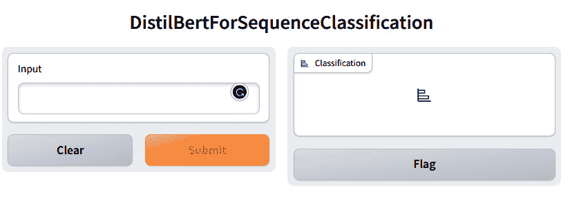
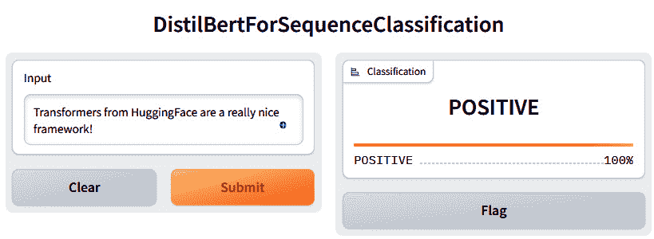
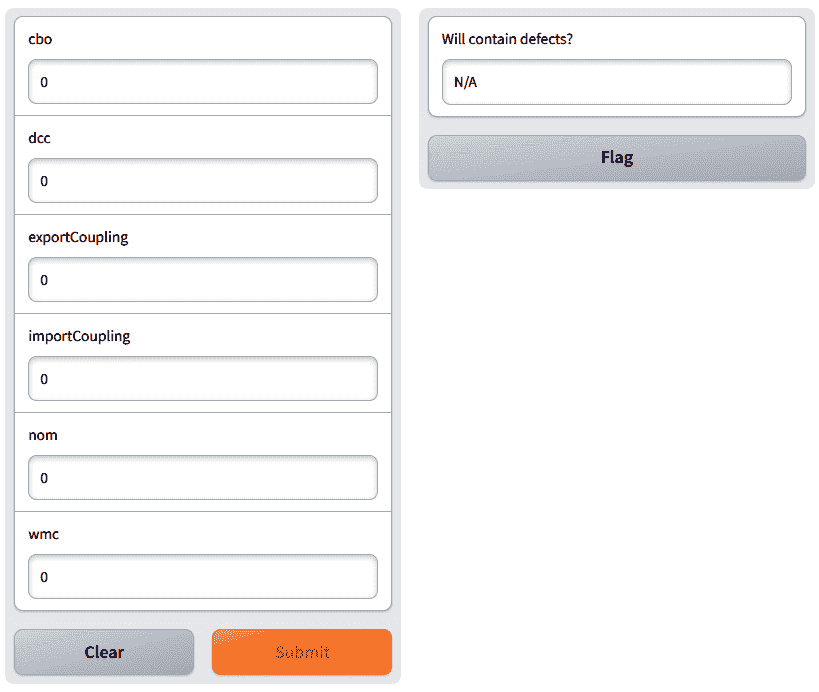
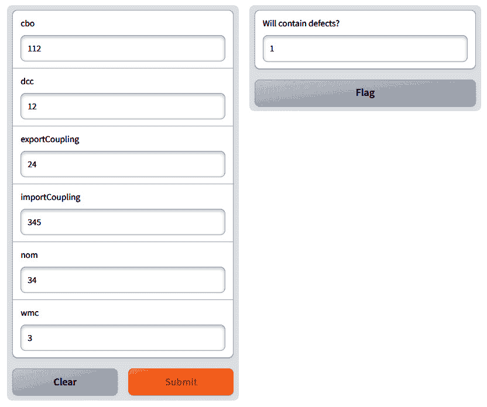
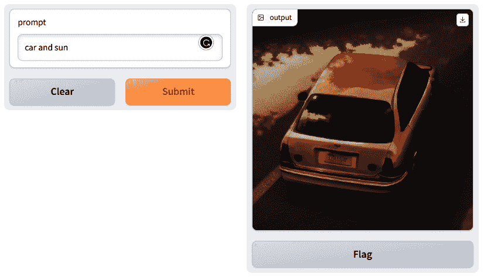
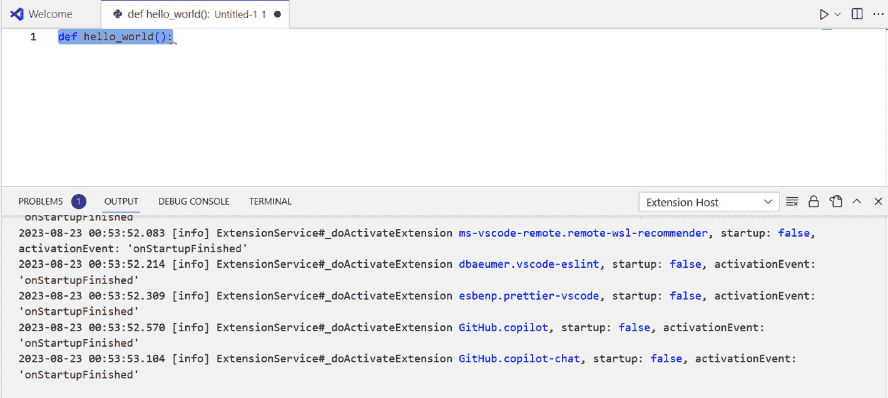
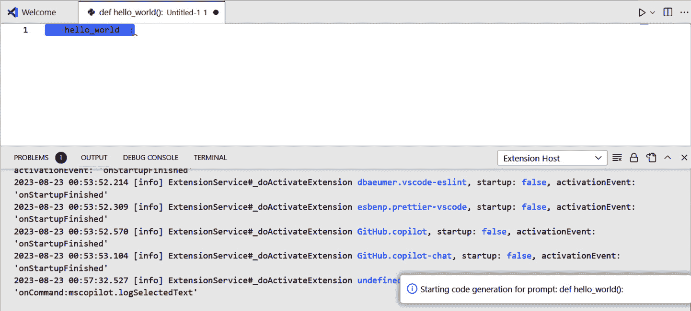
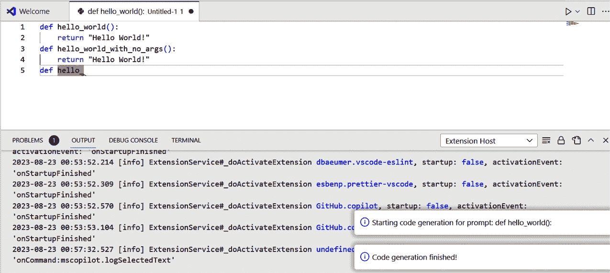

# 13

# 设计和实现大规模、健壮的机器学习软件

到目前为止，我们已经学习了如何开发机器学习模型，如何处理数据，以及如何创建和测试整个机器学习管道。剩下的是学习如何将这些元素集成到**用户界面**（**UI**）中，以及如何部署它，以便它们可以在不编程的情况下使用。为此，我们将学习如何部署包含 UI 和数据存储的模型。

在本章中，我们将学习如何将机器学习模型与使用 Gradio 编写的图形用户界面以及数据库中的存储集成。我们将使用两个机器学习管道的示例——一个是从我们之前章节中预测缺陷的模型示例，以及一个从自然语言提示创建图片的生成式 AI 模型。

本章将涵盖以下主要内容：

+   机器学习并非孤立存在——基于机器学习的部署系统元素

+   机器学习模型的 UI

+   数据存储

+   部署用于数值数据的机器学习模型

+   部署用于图像的生成式机器学习模型

+   将代码补全模型作为 Visual Studio Code 的扩展部署

# 机器学习并非孤立存在

*第二章*介绍了机器学习系统的几个元素——存储、数据收集、监控和基础设施，仅举几个例子。我们需要所有这些来为用户部署模型，但并非所有这些对用户直接重要。我们需要记住，用户对结果感兴趣，但我们需要注意与这些系统开发相关的所有细节。这些活动通常被称为 AI 工程。

UI 很重要，因为它提供了访问我们模型的能力。根据我们软件的使用情况，界面可以不同。到目前为止，我们关注的是模型本身以及用于训练模型的数据。我们还没有关注模型的可用性以及如何将它们集成到工具中。

通过扩展，对于 UI，我们还需要讨论在机器学习中存储数据。我们可以使用**逗号分隔值**（**CSV**）文件，但它们很快就会变得难以处理。它们要么太大，无法读入内存，要么过于繁琐，不适合版本控制和数据交换。

因此，在本章中，我们将专注于使机器学习系统可用。我们将学习如何开发 UI，如何将系统链接到数据库，以及如何设计一个能够完成 Python 代码的 Visual Studio Code 扩展。

# 机器学习模型的 UI

UI 作为连接机器学习算法的复杂性和与系统交互的最终用户之间的桥梁。它是用户可以输入数据、可视化结果、控制参数并从机器学习模型的输出中获得见解的交互式画布。一个设计良好的 UI 能够赋予用户，无论其技术专长如何，利用机器学习解决现实世界问题的潜力。

适用于机器学习应用的有效 UI 应优先考虑清晰度、可访问性和交互性。无论应用的目标用户是商业分析师、医疗保健专业人员还是研究人员，界面都应该适应用户的领域知识和目标。清晰传达模型的能力和限制至关重要，这有助于建立对技术的信任，并使用户能够根据其输出做出明智的决定。因此，我的下一个最佳实践。

最佳实践 #66

设计 ML 模型的 UI 时，应专注于用户任务。

我们可以使用不同类型的 UI，但大多数现代工具都围绕着两种类型——基于网页的界面（需要轻量级客户端）和扩展（提供现场改进）。ChatGPT 是 GPT-4 模型的基于网页界面的一个例子，而 GitHub CoPilot 是同一模型的扩展界面的一个例子。

在第一个例子中，让我们看看使用 Gradio 框架部署 ML 应用有多简单。一旦我们为我们的模型准备好了流程，我们只需要几行代码就能创建这个应用。以下是基于 Hugging Face 上存在的模型示例的代码行，用于文本分类：

```py
import gradio as gr
from transformers import pipeline
pipe = pipeline("text-classification")
gr.Interface.from_pipeline(pipe).launch()
```

前两行导入必要的库——一个用于 UI（Gradio）和一个用于流程。第二行从 Hugging Face 导入默认文本分类流程，最后一行创建流程的 UI。UI 是一个带有输入和输出按钮的网站，如图 *图 13*.*1* 所示：



图 13.1 – 默认文本分类流程的 UI

我们可以通过输入一些示例文本来测试它。通常，我们会在脚本中输入这些内容并提供某种分析，但这一切都是由 Gradio 框架为我们完成的。我们甚至不需要将流程的参数与 UI 的元素链接起来。

背后发生的事情可以通过观察控制台中的脚本输出（为了简洁而编辑）来解释：

```py
No model was supplied, defaulted to distilbert-base-uncased-finetuned-sst-2-english and revision af0f99b
Using a pipeline without specifying a model name and revision in production is not recommended.
Downloading (…)lve/main/config.json: 100%|██████████████████| 629/629 [00:00<00:00, 64.6kB/s]
Downloading model.safetensors:
100%|████████████████| 268M/268M [00:04<00:00, 58.3MB/s]
Downloading (…)okenizer_config.json: 100%|████████████████| 48.0/48.0 [00:00<00:00, 20.7kB/s]
Downloading (…)solve/main/vocab.txt: 100%|████████████████| 232k/232k [00:00<00:00, 6.09MB/s]
Running on local URL:  http://127.0.0.1:7860
```

框架已下载默认模型、其分词器和词汇文件，然后在本地机器上创建了应用程序。

使用此应用的结果在 *图 13*.*2* 中展示。我们输入一些简单的文本，几乎瞬间就得到了其分类：



图 13.2 – 使用默认文本分类流程分析的数据

这种集成是首先部署模型并确保它们可以在不打开 Python 环境或类似环境的情况下使用的一种很好的方式。有了这个，我们就来到了我的下一个最佳实践。

最佳实践 #67

准备你的模型以进行网络部署。

无论你开发什么类型的模型，都尽量为它们准备网络部署。我们的模型可以被打包成 Docker 容器，作为微服务系统的一部分提供。使用 Gradio 是一个很好的例子，说明了如何实现这种网络部署。

# 数据存储

到目前为止，我们使用 CSV 文件和 Excel 文件来存储我们的数据。这是与 ML 一起工作的简单方法，但也是一种本地方法。然而，当我们想要扩展我们的应用程序并在我们的机器之外使用它时，通常更方便使用真正的数据库引擎。数据库在 ML 流水线中扮演着至关重要的角色，它提供了一个结构化和组织化的存储库，用于存储、管理和检索数据。随着 ML 应用越来越多地依赖于大量数据，将数据库集成到流水线中成为几个原因的必要条件。

数据库提供了一种系统化的方式来存储大量数据，使其易于访问和检索。原始数据、清洗后的数据集、特征向量和其他相关信息可以高效地存储在数据库中，使 ML 流水线的各个组件能够无缝访问。

在许多 ML 项目中，数据预处理是一个关键步骤，它涉及在将数据输入模型之前对数据进行清理、转换和聚合。数据库允许你存储中间预处理的中间数据，减少了每次训练模型时重复资源密集型预处理步骤的需求。这加快了整个流水线并保持了数据的一致性。

ML 流水线通常涉及来自不同来源的数据，例如传感器、API、文件和数据库。拥有一个集中的数据库简化了整合不同数据流的过程，确保所有相关信息都能方便地用于训练和推理。

即使维护不同数据集版本的记录对于可重复性和跟踪变化也很重要。数据库可以用来存储数据集的不同版本，如果需要，可以轻松回滚到以前的版本，并促进团队成员之间的协作。

最后，处理大规模数据的 ML 应用需要有效的数据管理来有效扩展。数据库提供了索引、分区和优化查询的机制，这些机制提高了性能，并允许流水线处理不断增长的数据量。

因此，让我们在 SQLite 中创建一个数据库，它将包含我们在之前工作中使用的相同数值数据：

```py
# create the database
import sqlite3
conn = sqlite3.connect('ant13.db')
c = conn.cursor()
```

在前面的代码片段中，我们使用`sqlite3`引擎创建数据库并连接到它（`sqlite3.connect`）。一旦连接到数据库，我们需要一个游标在数据库中移动并执行我们的查询。下一步是将现有数据导入数据库。

现在，我们可以打开 Excel 文件并将数据传输到数据库中：

```py
# read the excel file with the data
# and save the data to the database
import pandas as pd
# read the excel file
df = pd.read_excel('chapter_12.xlsx', sheet_name='ant_1_3')
# print the first 5 rows
print(df.head())
# create the engine that we use to connect to the database to
# save the data
engine = create_engine('sqlite:///ant13.db')
# save the dataframe to the database
df.to_sql('ant_1_3', engine, index=False, if_exists='replace')
```

上述代码从 Excel 文件中读取数据，使用 pandas 库进行处理，然后将处理后的数据保存到 SQLite 数据库中。首先，代码读取名为 `'chapter_12.xlsx'` 的 Excel 文件，并从 `'ant_1_3'` 工作表提取数据。数据被加载到 pandas DataFrame，`df` 中。然后，代码使用 `sqlalchemy` 库中的 `create_engine` 函数建立与 SQLite 数据库的连接。然后，它创建到名为 `'ant13.db'` 的数据库文件的连接。

然后，它使用内置的 `to_sql` 函数根据 DataFrame 创建一个数据库表。在这个例子中，该函数有以下参数：

+   `'ant_1_3'` 是数据库中存储数据的表名。

+   `engine` 是之前创建的 SQLite 数据库的连接。

+   `index=False` 指定 DataFrame 的索引不应作为单独的列保存到数据库中。

+   `if_exists='replace'` 表示如果数据库中已存在名为 `'ant_1_3'` 的表，则应使用新数据替换它。`if_exists` 的其他选项包括 `append`（如果表已存在，则向表中添加数据）和 `fail`（如果表已存在，则引发错误）。

在此之后，我们已经在数据库中有数据，可以轻松地在多个机器学习管道之间共享数据。然而，在我们的案例中，我们将仅演示如何将此类数据提取到 DataFrame 中，以便我们可以在简单的机器学习应用程序中使用它：

```py
# select all rows from that database
data = engine.execute('SELECT * FROM ant_1_3').fetchall()
# and now, let's create a dataframe from that data
df = pd.DataFrame(data)
# get the names of the columns from the SQL database
# and use them as the column names for the dataframe
df.columns = [x[0] for x in engine.description]
# print the head of the dataframe
df.head()
```

`'SELECT * FROM ant_1_3'` 查询从数据库中的 `'ant_1_3'` 表中选择所有列。`fetchall()` 方法检索查询返回的所有行，并将它们存储在数据变量中。数据变量将是一个元组列表，其中每个元组代表一行数据。

然后，它从数据列表创建一个 pandas DataFrame，名为 `df`。列表中的每个元组对应于 DataFrame 中的行，DataFrame 的列将自动编号。最后，代码检索原始数据库表中的列名。`engine.description` 属性包含执行 SQL 查询的结果的元数据。具体来说，它提供了关于查询返回的列的信息。然后，代码提取 `engine.description` 中每个元组的第一个元素，即列名，并将这些名称分配给 DataFrame 的列，`df`。

从那里开始，数据处理的工作流程就像我们所知的那样——它使用 pandas DataFrame。

在这个例子中，整个 DataFrame 可以适应数据库，整个数据库也可以适应一个框架。然而，对于大多数机器学习数据集来说，情况并非如此。pandas 库在数据量方面存在限制，因此在训练 GPT 模型等模型时，我们需要比 DataFrame 能容纳更多的数据。为此，我们可以使用 Hugging Face 的 Dataset 库，或者我们可以使用数据库。我们只能获取有限的数据量，在它上面训练神经网络，然后在另一组数据上验证，然后获取新的一组行，再训练神经网络更多一些，依此类推。

除了在文件上创建数据库，这可能有点慢之外，SQLite 库允许我们在内存中创建数据库，这要快得多，但它们不会被序列化到我们的永久存储中——我们需要自己处理这一点。

要创建一个内存数据库，我们只需在第一个脚本中将数据库的名称更改为`:memory:`，如下所示：

```py
conn = sqlite3.connect(':memory:')
c = conn.cursor()
```

我们可以稍后以类似的方式使用它，如下所示：

```py
# create the enginve that we use to connect to the database to
# save the data
engine = create_engine('sqlite:///:memory:')
# save the dataframe to the database
df.to_sql('ant_1_3', engine, index=False, if_exists='replace')
```

最后，我们需要记住将数据库序列化到文件中；否则，一旦我们的系统关闭，它就会消失：

```py
# serialize to disk
c.execute("vacuum main into 'saved.db'")
```

如果我们知道如何处理 DataFrame，那么将数据库与机器学习结合使用相当简单。然而，其附加价值却相当大。我们可以将数据序列化到文件中，将它们读入内存，进行操作，然后再将它们序列化。我们还可以将我们的应用程序扩展到多个系统之外，并在线使用这些系统。然而，为了做到这一点，我们需要一个用户界面。

有了这些，我们就来到了我的下一个最佳实践。

最佳实践 #68

尝试使用内存数据库，并经常将它们转储到磁盘上。

例如，pandas 等库在可以包含的数据量方面存在限制。数据库没有。使用内存数据库提供了两者的优点，而没有这些限制。将数据存储在内存中可以启用快速访问，而使用数据库引擎不会限制数据的大小。我们只需要记住，偶尔将数据库从内存保存（转储）到磁盘上，以防止在异常、错误、缺陷或设备故障的情况下数据丢失。

# 部署用于数值数据的机器学习模型

在我们创建 UI 之前，我们需要定义一个函数，该函数将负责使用我们在上一章中训练的模型进行预测。这个函数接受用户会看到的参数，然后进行预测。以下代码片段包含了这个函数：

```py
import gradio as gr
import pandas as pd
import joblib
def predict_defects(cbo,
                    dcc,
                    exportCoupling,
                    importCoupling,
                    nom,
                    wmc):
    # we need to convert the input parameters to floats to use them in the prediction
    cbo = float(cbo)
    dcc = float(dcc)
    exportCoupling = float(exportCoupling)
    importCoupling = float(importCoupling)
    nom = float(nom)
    wmc = float(wmc)
    # now, we need to make a data frame out of the input parameters
    # this is necessary because the model expects a data frame
    # we create a dictionary with the column names as keys
    # and the input parameters as values
    # please note that the names of the features must be the same as in the model
    data = {
        'CBO': [cbo],
        'DCC': [dcc],
        'ExportCoupling': [exportCoupling],
        'ImportCoupling': [importCoupling],
        'NOM': [nom],
        'WMC': [wmc]
    }
    # we create a data frame from the dictionary
    df = pd.DataFrame(data)
    # load the model
    model = joblib.load('./chapter_12_decision_tree_model.joblib')
    # predict the number of defects
    result = model.predict(df)[0]
    # return the number of defects
    return result
```

这个片段首先导入了三个对 UI 和建模都非常重要的库。我们已经知道 pandas 库，但其他两个如下：

+   `gradio`：这个库用于创建简单的 UI，以便进行交互式机器学习模型测试。这个库使得创建 UI 并将其连接到模型变得非常容易。

+   `joblib`：这个库用于保存和加载 Python 对象，特别是机器学习模型。多亏了这个库，我们不需要每次用户想要打开软件（UI）时都训练模型。

`predict_defects` 函数是我们使用模型的地方。需要注意的是，参数的命名被 UI 自动用于命名输入框（我们稍后会看到）。它接受六个输入参数：`cbo`、`dcc`、`exportCoupling`、`importCoupling`、`nom` 和 `wmc`。这些参数是我们用来训练模型的相同软件度量。由于这些参数作为文本或数字输入，因此将它们转换为浮点数很重要，因为这是我们模型的输入值。一旦转换完成，我们需要将这些自由参数转换成一个我们可以用作模型输入的单个 DataFrame。首先，我们必须将其转换为字典，然后使用该字典创建一个 DataFrame。

一旦数据准备就绪，我们可以使用 `model = joblib.load('./chapter_12_decision_tree_model.joblib')` 命令加载模型。我们必须做的最后一件事是使用该模型进行预测。我们可以通过编写 `result = model.predict(df)[0]` 来完成。函数通过返回预测结果结束。

有几点需要注意。首先，我们需要一个单独的函数来处理整个工作流程，因为 UI 是基于这个函数的。这个函数必须具有与我们在 UI 上拥有的输入元素数量相同的参数数量。其次，需要注意的是，DataFrame 中的列名应该与训练数据（列名区分大小写）中的列名相同。

因此，实际的 UI 完全由 Gradio 库处理。以下代码片段展示了这一点：

```py
# This is where we integrate the function above with the user interface
# for this, we need to create an input box for each of the following parameters:
# CBO, DCC, ExportCoupling,  ImportCoupling,  NOM,  WMC
demo = gr.Interface(fn=predict_defects,
                    inputs = ['number', 'number', 'number', 'number', 'number', 'number'],
                    outputs = gr.Textbox(label='Will contain defects?',
                                         value= 'N/A'))
# and here we start the actual user interface
# in a browser window
demo.launch()
```

此代码片段展示了之前定义的 `predict_defects` 函数与 UI 的集成。使用 Gradio 创建了一个简单的 UI，它从用户那里获取输入，使用提供的函数处理它，并显示结果。代码由两个语句组成：

1.  使用 `gr.Interface` 函数创建接口，以下为参数：

    +   `fn=predict_defects`: 这个参数指定了将用于处理用户输入并生成输出的函数。在这种情况下，它是之前定义的 `predict_defects` 函数。请注意，函数的参数没有提供，库会自动提取它们（及其名称）。

    +   `inputs`: 这个参数指定了接口应该期望的输入类型。在这种情况下，它列出了六个输入参数，每个参数都是 `'number'` 类型。这些对应于 `predict_defects` 函数中的 `cbo`、`dcc`、`exportCoupling`、`importCoupling`、`nom` 和 `wmc` 参数。

    +   `outputs`: 这个参数指定了接口应该向用户显示的输出格式。在这种情况下，它是一个标记为 `'N/A'` 的文本框。由于我们的模型是二进制的，我们只使用 1 和 0 作为输出。为了标记模型尚未使用的事实，我们以 `'``N/A'` 标签开始。

1.  启动界面（`demo.launch()`）：这一行代码在浏览器窗口中启动 UI，使用户能够与之交互。

使用 Gradio 创建的 UI 具有输入字段，用户可以提供软件指标（`cbo`、`dcc`、`exportCoupling`、`importCoupling`、`nom`、`wmc`）的值。一旦用户提供了这些值并提交了表单，`predict_defects`函数将使用提供的输入值被调用。预测结果（是否存在缺陷）将在标记为'将包含缺陷?'的文本框中显示。

我们可以通过在命令提示符中输入以下内容来启动此应用程序：

```py
>python app.py
```

这启动了一个本地 Web 服务器并提供了它的地址。一旦我们打开带有应用程序的页面，我们将看到以下 UI：



图 13.3 – 使用 Gradio 创建的缺陷预测模型 UI

UI 分为两列 – 右侧列显示结果，左侧列显示输入数据。目前，输入数据是默认的，因此预测值是 N/A，正如我们的设计。

我们可以填写数据并按下**提交**按钮以获取预测值。这如图*图 13**.4*所示：



图 13.4 – 包含预测结果的 UI

一旦我们填写数据以进行预测，我们就可以提交它；此时，我们的结果显示具有这些特征的模块将包含缺陷。这也很有逻辑性 – 对于任何有 345 个输入的模块，我们几乎可以保证会有一些缺陷。它只是太复杂了。

这个模型和 UI 仅在我们电脑的本地可用。然而，如果我们只更改一行，我们就可以与他人共享它，甚至将其嵌入到网站上。我们可以用`demo.launch(share=True)`代替不带参数的`demo.launch()`。

尽管我们以 Gradio 作为 UI 的示例，但它说明了将现有模型链接到 UI 相当容易。我们可以手动输入数据并从模型中获得预测。UI 是用 Gradio 还是任何其他框架编程变得不那么重要。难度可能不同 – 例如，我们可能需要手动编程输入文本框和模型参数之间的链接 – 但本质是相同的。

# 部署用于图像的生成式机器学习模型

Gradio 框架非常灵活，允许快速部署如生成式 AI 稳定扩散模型等模型 – 与 DALL-E 模型类似工作的图像生成器。此类模型的部署与我们之前覆盖的数值模型的部署非常相似。

首先，我们需要创建一个函数，该函数将根据 Hugging Face 中的一个模型生成图像。以下代码片段显示了此函数：

```py
import gradio as gr
import pandas as pd
from diffusers import StableDiffusionPipeline
import torch
def generate_images(prompt):
    '''
    This function uses the prompt to generate an image
    using the anything 4.0 model from Hugging Face
    '''
    # importing the model from Hugging Face
    model_id = "xyn-ai/anything-v4.0"
    pipe = StableDiffusionPipeline.from_pretrained(model_id,
                                                   torch_dtype=torch.float16,
                                                   safety_checker=None)
    # send the pipeline to the GPU for faster processing
    pipe = pipe.to("cuda")
    # create the image here
    image = pipe(prompt).images[0]
    # return the number of defects
    return image
```

此代码片段首先导入必要的库。在这里，我们会注意到还有一个库——`diffusers`，它是图像生成网络的接口。函数从 Hugging Face hub 导入一个预训练模型。该模型是 `"xyn-ai/anything-v4.0"`，它是 Anything 4.0 模型的一个变体，由一位用户克隆。使用 `StableDiffusionPipeline.from_pretrained()` 函数将模型作为图像生成的管道加载。`torch_dtype` 参数设置为 `torch.float16`，表示用于计算的 数据类型（为了更快的处理速度，使用较低的精度）。

该图像是通过绕过将提示作为 `pipe()` 函数的参数来生成的。生成的图像是通过 `images[0]` 属性访问的。`prompt` 参数通过函数的参数提供，该参数由 UI 提供。

该函数返回图像，然后由 UI 捕获并显示。

一旦我们知道了前一个示例中的代码，UI 的代码也相当简单：

```py
demo = gr.Interface(fn=generate_images,
                    inputs = 'text',
                    outputs = 'image')
# and here we start the actual user interface
# in a browser window
demo.launch()
```

与前一个示例相比，这段代码只包含一个输入参数，即用于生成图像的提示。它还有一个输出，即图像本身。我们使用 `'image'` 类来表示它是一个图像，应该以图像的形式显示。该模型的输出在 *图 13.5* 中展示：



图 13.5 – 使用“汽车和太阳”提示从 Anything 4.0 模型生成的图像

请注意，由于生成的汽车存在扭曲伪影，因此模型并不完美——例如，右后尾灯并没有完美生成。

# 将代码补全模型作为扩展部署

到目前为止，我们已经学习了如何在网络上和 Hugging Face hub 上部署模型。这些方法是好的，并为我们提供了创建模型 UI 的能力。然而，这些是独立的工具，需要手动输入，并提供了我们需要手动使用的输出——例如，粘贴到另一个工具或保存到磁盘。

在软件工程中，许多任务都是自动化的，许多现代工具提供了一整套扩展和插件。GitHub Copilot 就是 Visual Studio 2022 的一个插件，也是 Visual Studio Code 等其他工具的扩展。ChatGPT 既是独立的网络工具，也是微软 Bing 搜索引擎的插件。

因此，在本章的最后部分，我们将我们的模型打包为编程环境的扩展。在本节中，我们将学习如何创建一个扩展以完成代码，就像 GitHub CoPilot 一样。自然地，我们不会使用 CoPilot 的 CodeX 模型，而是使用 Codeparrot 的 Python 编程语言模型。我们之前已经见过这个模型，所以让我们深入了解实际的扩展。

我们需要一些工具来开发扩展。自然地，我们需要 Visual Studio Code 本身和 Python 编程环境。我们还需要 Node.js 工具包来创建扩展。我们从 nodejs.org 安装了它。一旦安装完成，我们可以使用 Node.js 的包管理器来安装 Yeoman 和用于开发扩展的框架。我们可以在命令提示符中使用以下命令来完成：

```py
npm install -g yo generator-code
```

一旦安装了这些包，我们需要通过输入以下内容来为我们的扩展创建骨架代码：

```py
yo code
```

这将弹出我们需要填写的菜单：

```py
     _-----_     ╭──────────────────────────╮
    |       |    │   Welcome to the Visual  │
    |--(o)--|    │   Studio Code Extension  │
   `---------´   │        generator!        │
    ( _´U`_ )    ╰──────────────────────────╯
    /___A___\   /
     |  ~  |
   __'.___.'__
 ´   `  |° ´ Y `
? What type of extension do you want to create? (Use arrow keys)
> New Extension (TypeScript)
  New Extension (JavaScript)
  New Color Theme
  New Language Support
  New Code Snippets
  New Keymap
  New Extension Pack
  New Language Pack (Localization)
  New Web Extension (TypeScript)
  New Notebook Renderer (TypeScript)
```

我们需要选择第一个选项，即使用 TypeScript 的新扩展。这是开始编写扩展的最简单方法。我们可以使用语言包和语言协议开发一个非常强大的扩展，但在这个第一个扩展中，简洁胜过强大。

我们需要就我们扩展的设置做出一些决定，所以现在让我们来做这件事：

```py
? What type of extension do you want to create? New Extension (TypeScript)
? What's the name of your extension? mscopilot
? What's the identifier of your extension? mscopilot
? What's the description of your extension? Code generation using Parrot
? Initialize a git repository? No
? Bundle the source code with webpack? No
? Which package manager to use? (Use arrow keys)
> npm
  yarn
  pnpm
```

我们将我们的扩展命名为 `mscopilot` 并不创建很多额外的代码——没有 Git 仓库和没有 webpack。在这个例子中，简洁是关键。一旦文件夹创建完成，我们需要从 Node.js 中获取一个额外的包来与 Python 交互：

```py
npm install python-shell
```

点击最后一个条目后，我们会得到一个名为 `mscopilot` 的新文件夹；我们可以使用 `code .` 命令进入它。它将打开 Visual Studio Code，在那里我们可以用为新扩展编写的代码填充模板。一旦环境打开，我们需要导航到 `package.json` 文件并更改一些内容。在该文件中，我们需要找到 `contributes` 部分，并做一些修改，如下所示：

```py
"contributes": {
    "commands": [
      {
        "command": "mscopilot.logSelectedText",
        "title": "MS Suggest code"
      }
    ],
    "keybindings": [
      {
        "command": "mscopilot.logSelectedText",
        "key": "ctrl+shift+l",
        "mac": "cmd+shift+l"
      }
    ]
  },
```

在前面的代码片段中，我们添加了一些信息，说明我们的扩展有一个新的功能——`logSelectedText`——并且它将通过 Windows 上的 *Ctrl* + *Shift* + *L* 键组合（以及 Mac 上类似的组合）可用。我们需要记住，命令名称包括我们扩展的名称，这样扩展管理器就知道这个命令属于我们的扩展。现在，我们需要转到 `extension.ts` 文件并添加我们命令的代码。以下代码片段包含代码的第一部分——扩展的设置和激活：

```py
import * as vscode from 'vscode';
// This method is called when your extension is activated
export function activate(context: vscode.ExtensionContext) {
  // Use the console to output diagnostic information (console.log) and errors (console.error)
  // This line of code will only be executed once when your extension is activated
  console.log('Congratulations, your extension "mscopilot" is now active!');
```

这个函数只是记录我们的扩展已被激活。由于扩展对用户来说相当不可见（而且应该是这样），使用日志文件来存储已实例化的信息是一种良好的做法。

现在，我们添加将获取所选文本、实例化 Parrot 模型并将建议添加到编辑器的代码：

```py
// Define a command to check which code is selected.
vscode.commands.registerCommand('mscopilot.logSelectedText', () => {
  // libraries needed to execute python scripts
  const python = require('python-shell');
  const path = require('path');
  // set up the path to the right python interpreter
  // in case we have a virtual environment
  python.PythonShell.defaultOptions = { pythonPath: 'C:/Python311/python.exe' };
  // Get the active text editor
  const editor = vscode.window.activeTextEditor;
  // Get the selected text
     const selectedText = editor.document.getText(editor.selection);
  // prompt is the same as the selected text
  let prompt:string = selectedText;
  // this is the script in Python that we execute to
  // get the code generated by the Parrot model
  //
  // please note the strange formatting,
  // which is necessary as python is sensitive to indentation
  let scriptText = `
from transformers import pipeline
pipe = pipeline("text-generation", model="codeparrot/codeparrot-small")
outputs = pipe("${prompt}", max_new_tokens=30, do_sample=False)
print(outputs[0]['generated_text'])`;
  // Let the user know what we start the code generation
  vscode.window.showInformationMessage(`Starting code generation for prompt: ${prompt}`);
  // run the script and get the message back
  python.PythonShell.runString(scriptText, null).then(messages=>{
  console.log(messages);
  // get the active editor to paste the code there
  let activeEditor = vscode.window.activeTextEditor;
  // paste the generated code snippet
  activeEditor.edit((selectedText) => {
  // when we get the response, we need to format it
  // as one string, not an array of strings
  let snippet = messages.join('\n');
  // and replace the selected text with the output
  selectedText.replace(activeEditor.selection, snippet)  });
  }).then(()=>{
   vscode.window.showInformationMessage(`Code generation finished!`);});
  });
context.subscriptions.push(disposable);
}
```

这段代码注册了我们的 `'mscopilot.logSelectedText'` 命令。我们在之前的文件——`package.json`——中使这个命令对扩展管理器可见。当这个命令执行时，它执行以下步骤。重要的是 TypeScript 代码和 Python 代码之间的交互。由于我们使用的是 Hugging Face 模型，最简单的方法是使用本书中迄今为止使用的相同脚本。然而，由于扩展是用 TypeScript（或 JavaScript）编写的，我们需要在 TypeScript 中嵌入 Python 代码，向其中添加一个变量，并捕获结果：

1.  首先，导入所需的库——`python-shell` 和 `path`——这些库是执行 Node.js 环境中的 Python 脚本所必需的。

1.  然后，它通过 `C:/Python311/python.exe` 设置 Python 解释器，这将用于运行 Python 脚本。这对于确保使用正确的 Python 环境非常重要，即使在使用虚拟环境时也是如此。如果我们没有指定它，我们需要在脚本中找到它，这在用户环境中可能有点棘手。

1.  接着，它设置活动文本编辑器和选定的文本。我们需要这个选择，以便我们可以将提示信息发送到模型。在我们的例子中，我们将简单地发送选择的内容到模型，并获取建议的代码。

1.  然后，它准备提示信息，这意味着它创建了一个字符串变量，我们在 Python 脚本的代码中使用这个变量。

1.  然后，它定义了 Python 脚本，其中建立了与 ML 模型的连接。我们的 Python 脚本被定义为多行字符串（`scriptText`），使用模板字面量。这个脚本利用 Hugging Face Transformers 库的 `pipeline` 函数，使用 `codeparrot-small` 模型进行文本生成。Python 代码以粗体显示，我们可以看到字符串与提示信息相补充，即活动编辑器中的选定文本。

1.  然后，它向用户显示简短的信息，因为模型需要一些时间来加载和进行推理。第一次执行可能需要一分钟（因为模型需要下载和设置）。因此，显示一条消息，说明我们正在开始推理是很重要的。使用 `vscode.window.showInformationMessage` 向用户显示一条消息，表明代码生成过程即将开始。

1.  接着，它使用 `python.PythonShell.runString` 运行 Python 脚本（`scriptText`）。脚本的输出被捕获在 `messages` 数组中。我们暂时失去了对执行的掌控，因为我们等待 Python 脚本完成；它为我们提供了一个代码补全的建议。

1.  接下来，它将响应中的生成代码（`messages` 数组）粘贴到一个单独的字符串（`snippet`）中。然后，该片段被粘贴到活动文本编辑器中选中文本的位置，有效地用生成的代码替换了选中的文本。由于模型响应的第一个元素是提示，我们可以简单地用片段替换选择。

1.  最后，在代码生成过程完成后，它显示完成消息。

现在，我们有一个可以测试的扩展。我们可以通过按 *F5* 键来执行它。这会打开一个新的 Visual Studio 实例，在那里我们可以输入要完成的代码片段，如图 *图 13*.*6* 所示：



图 13.6 – 激活我们的扩展的一些 Visual Studio 代码的测试实例。选中的文本用作模型的提示

一旦我们按下 *Ctrl* + *Shift* + *L*，正如我们在 `package.json` 文件中定义的那样，我们的命令就会被激活。这可以通过环境右下角的消息来指示，如图 *图 13*.*7* 所示：



图 13.7 – 开始生成代码。消息框和日志信息表明我们的命令正在工作

几秒钟后，我们从 Parrot 模型获得建议，然后必须将其粘贴到编辑器中，如图 *图 13*.*8* 所示：



图 13.8 – 将来自 Parrot 模型的代码建议粘贴到编辑器中

在这里，我们可以看到我们的扩展相当简单，并从模型获取所有建议。因此，除了正确的代码（`return "Hello World!"`）之外，它还包括了我们不需要的更多内容。我们可以编写更有趣的逻辑，解析代码，并清理它 – 天空才是极限。我将这项工作留给你来完成，并使其变得更好。我的工作是用来说明编写 GitHub CoPilot 类似的工具并不像看起来那么困难。

通过这个，我们来到了本章的最后一项最佳实践。

最佳实践 #69

如果你的模型/软件旨在帮助用户处理日常任务，确保你将其开发为一个插件。

虽然我们可以使用来自 Gradio 界面的 Codeparrot 模型，但这可能不会被欣赏。程序员需要将他们的代码复制到网页浏览器中，点击一个按钮，等待建议，并将其粘贴回他们的环境中。通过为 Visual Studio Code 提供一个扩展，我们可以利用软件开发者的工作流程。唯一的额外任务是选择要完成的文本并按 *Ctrl* + *Shift* + *L*；我相信这可以进一步简化，就像 GitHub Copilot 所做的那样。

# 摘要

本章结束了本书的第三部分。它也结束了我们通过最佳实践之旅中最技术性的部分。我们学习了如何开发机器学习系统以及如何部署它们。这些活动通常被称为人工智能工程，这个术语将重点放在软件系统的开发上，而不是模型本身。这个术语还表明，测试、部署和使用机器学习要远比训练、验证和测试模型复杂得多。

自然地，这里还有更多。仅仅开发和部署人工智能软件是不够的。作为软件工程师或人工智能工程师，我们需要考虑我们行为的后果。因此，在这本书的下一部分，我们将探讨偏见、伦理以及我们工作成果——人工智能软件系统的可持续使用等概念。

# 参考文献

+   *Rana, R.，等人。在软件缺陷预测中采用机器学习的框架。在 2014 年第 9 届软件工程与应用国际会议（ICSOFT-EA）上。* *2014 年。IEEE。*

+   *Bosch, J.，H.H. Olsson，和 I. Crnkovic。人工智能系统的工程：研究议程。智能网络物理系统的人工智能范式，2021 年：* *p. 1-19。*

+   *Giray, G.。从软件工程的角度看机器学习系统的工程：现状与挑战。系统与软件杂志，2021 年。180：* *p. 111031。*
