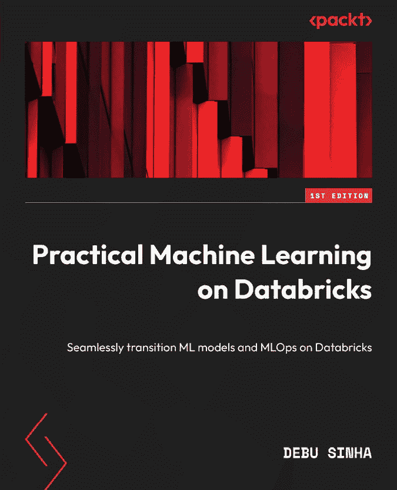
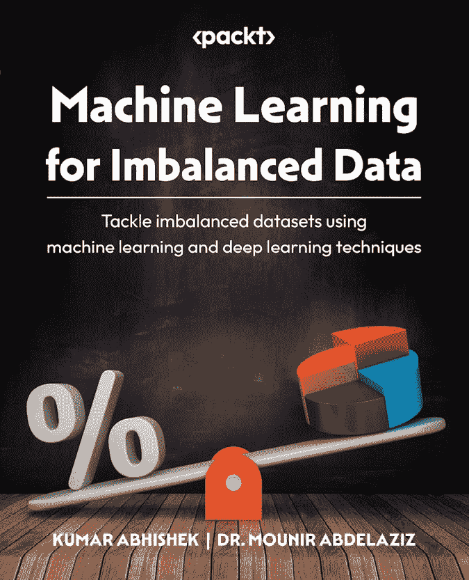
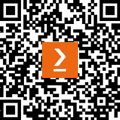

[www.packtpub.com](http://www.packtpub.com)

订阅我们的在线数字图书馆，即可全面访问超过 7,000 本书籍和视频，以及行业领先的工具，帮助您规划个人发展并推进您的职业生涯。更多信息，请访问我们的网站。

# 为什么订阅？

+   使用来自 4,000 多名行业专业人士的实用电子书和视频，节省学习时间，多花时间编码

+   通过为您量身定制的技能计划提高学习效果

+   每月免费获得一本电子书或视频

+   完全可搜索，便于轻松访问关键信息

+   复制和粘贴、打印和收藏内容

您知道 Packt 为每本书都提供电子书版本，并提供 PDF 和 ePub 文件吗？您可以在[www.packtpub.com](http://www.packtpub.com)升级到电子书版本，并且作为印刷书客户，您有权获得电子书副本的折扣。有关更多信息，请联系我们 customercare@packtpub.com。

在[www.packtpub.com](http://www.packtpub.com)，您还可以阅读一系列免费的技术文章，订阅各种免费通讯，并享受 Packt 书籍和电子书的独家折扣和优惠。

# 您可能还会喜欢的其他书籍

如果您喜欢这本书，您可能还会对 Packt 的其他书籍感兴趣：

[(https://packt.link/9781801812030)]

**Databricks 上的** **实用机器学习**

Debu Sinha

ISBN: 978-1-80181-203-0

+   从 DIY 设置顺利过渡到 Databricks

+   掌握 AutoML 以快速设置 ML 实验

+   自动化模型重新训练和部署

+   利用 Databricks 功能存储进行数据准备

+   使用 MLflow 进行有效的实验跟踪

+   获取可扩展 ML 解决方案的实用见解

+   了解如何在生产环境中处理模型漂移

[(https://packt.link/9781801070836)]

[(https://packt.link/9781801070836)]

**不平衡数据**的**机器学习**

Kumar Abhishek, Dr. Mounir Abdelaziz

ISBN: 978-1-80107-083-6

+   在机器学习模型中有效地使用不平衡数据

+   探索类别不平衡时使用的指标

+   了解何时以及如何应用各种采样方法，如过采样和欠采样

+   应用基于数据、算法和混合方法来处理类别不平衡

+   在避免常见陷阱的同时，从各种数据平衡选项中进行组合和选择

+   了解在处理不平衡数据集的背景下，模型校准和阈值调整的概念

# Packt 正在寻找像您这样的作者

如果你有兴趣成为 Packt 的作者，请访问[authors.packtpub.com](http://authors.packtpub.com)并今天申请。我们与成千上万的开发者和技术专业人士合作，就像你一样，帮助他们将见解分享给全球技术社区。你可以提交一般申请，申请我们正在招募作者的特定热门话题，或者提交你自己的想法。

# 分享你的想法

现在你已经完成了《软件工程师的机器学习基础设施和最佳实践》，我们非常想听听你的想法！如果你在亚马逊购买了这本书，请[点击此处直接跳转到该书的亚马逊评论页面](https://packt.link/r/1-837-63406-8)并分享你的反馈或在该购买网站上留下评论。

你的评论对我们和整个技术社区都很重要，并将帮助我们确保我们提供高质量的内容。

# 下载这本书的免费 PDF 副本

感谢你购买这本书！

你喜欢在路上阅读，但又无法携带你的印刷书籍到处走？

你的电子书购买是否与您选择的设备不兼容？

别担心，现在每购买一本 Packt 书籍，你都可以免费获得该书的 DRM 免费 PDF 版本。

在任何地方、任何地点、任何设备上阅读。直接从你最喜欢的技术书籍中搜索、复制和粘贴代码到你的应用程序中。

优惠远不止于此，你还可以获得独家折扣、时事通讯和每日免费内容的每日电子邮件。

按照以下简单步骤获取这些好处：

1.  扫描下面的二维码或访问以下链接

[`packt.link/free-ebook/978-1-83763-406-4`](https://packt.link/free-ebook/978-1-83763-406-4)

1.  提交你的购买证明

1.  就这样！我们将直接将你的免费 PDF 和其他优惠发送到你的电子邮件。
