# 应用机器学习快速入门

本章介绍了机器学习的基础知识，阐述了常见的主题和概念，使逻辑易于理解，并使你能够熟悉这个主题。目标是快速学习应用机器学习的逐步过程并掌握主要的机器学习原则。在本章中，我们将涵盖以下主题：

+   机器学习和数据科学

+   数据和问题定义

+   数据收集

+   数据预处理

+   无监督学习

+   监督学习

+   泛化和评估

如果你已经熟悉机器学习并且渴望开始编码，那么请快速跳转到本节之后的章节。然而，如果你需要刷新记忆或澄清一些概念，那么强烈建议重新回顾本章中介绍的主题。

# 机器学习和数据科学

现在，每个人都谈论机器学习和数据科学。那么，机器学习究竟是什么呢？它与数据科学有什么关系？这两个术语通常被混淆，因为它们经常使用相同的方法并且有显著的重叠。因此，让我们首先明确它们是什么。Josh Wills 在推特上写道：

“数据科学家是一个比任何软件工程师都擅长统计学，比任何统计学家都擅长软件工程的人。”

– Josh Wills

更具体地说，数据科学包括从统计、计算机科学和其他领域整合方法以从数据中获得洞察力的整个过程。在实践中，数据科学包括数据采集、清洗、分析、可视化和部署的迭代过程。

机器学习，另一方面，主要关注在数据科学流程的分析和建模阶段使用的通用算法和技术。

# 使用机器学习解决问题

在不同的机器学习方法中，有三种主要的学习方法，如下列所示：

+   监督学习

+   无监督学习

+   强化学习

给定一组示例输入 X 和它们的输出 Y，监督学习的目标是学习一个通用的映射函数 f，它将输入转换为输出，即 f: (X,Y)。

监督学习的例子是信用卡欺诈检测，其中学习算法被提供标记为正常或可疑的信用卡交易（矩阵 X）和向量 Y。学习算法产生一个决策模型，将未见交易标记为正常或可疑（这就是 f 函数）。

相比之下，无监督学习算法不假设有给定的输出标签，因为它们专注于学习数据的结构，例如将相似输入分组到簇中。因此，无监督学习可以揭示数据中的隐藏模式。无监督学习的一个例子是基于物品的推荐系统，其中学习算法发现一起购买的相似物品；例如，购买书籍 A 的人也购买了书籍 B。

强化学习从完全不同的角度处理学习过程。它假设一个智能体，可以是机器人、机器人或计算机程序，与动态环境互动以实现特定目标。环境由一组状态描述，智能体可以采取不同的行动从一个状态移动到另一个状态。一些状态被标记为目标状态，如果智能体达到这个状态，它会收到大量奖励。在其他状态下，奖励较小，不存在，甚至可能是负的。强化学习的目标是找到一个最优策略或映射函数，该函数指定在每个状态下采取的动作，而不需要教师明确指出这会导致目标状态与否。强化学习的一个例子是驾驶车辆的程序，其中状态对应于驾驶条件，例如当前速度、路段信息、周围交通、速度限制和道路上的障碍物；而动作可以是驾驶操作，如左转或右转、停车、加速和继续。学习算法产生一个策略，该策略指定在特定驾驶条件配置下应采取的动作。

在本书中，我们将仅关注监督学习和无监督学习，因为它们共享许多概念。如果您对强化学习感兴趣，可以从理查德·S·萨顿和安德鲁·巴托的《强化学习：入门》（MIT Press，2018 年）这本书开始。

# 应用机器学习工作流程

本书强调应用机器学习。我们希望为您提供在不同环境中使学习算法工作所需的实用技能。在机器学习中，我们不会花太多时间在数学和理论上，而是会花更多时间在实用、动手技能（和一些技巧）上，以便使这些内容在实际应用中运行良好。我们将重点关注监督学习和无监督学习，并学习数据科学中构建应用机器学习工作流程的基本步骤。

应用机器学习应用中的典型工作流程包括回答一系列可以总结为以下步骤的问题：


1.  **数据和问题定义**：第一步是提出有趣的问题，例如：*你正在尝试解决的问题是什么*？ *为什么它很重要*？ *哪种结果格式可以回答你的问题*？ *这是一个简单的是/否答案吗*？ *你需要从可用的问题中选择一个吗*？

1.  **数据收集**：一旦你有一个问题要解决，你将需要数据。问问自己你需要什么样的数据来回答问题。*你能从可用的来源获取数据吗*？ *你需要结合多个来源吗*？ *你需要生成数据吗*？ *是否存在任何抽样偏差*？ *需要多少数据*？

1.  **数据预处理**：第一个数据预处理任务是**数据清洗**。一些例子包括填充缺失值、平滑噪声数据、移除异常值和解决一致性。这通常随后是多个数据源的集成和数据转换到特定的范围（归一化）、到值区间（离散化区间）以及减少维度数量。

1.  **数据分析与建模**：数据分析与建模包括无监督和监督机器学习、统计推断和预测。有各种各样的机器学习算法可供选择，包括 k 近邻算法、朴素贝叶斯分类器、决策树、**支持向量机**（**SVMs**）、逻辑回归、k 均值等。要部署的方法取决于问题定义，正如第一步所讨论的，以及收集到的数据类型。这一步的最终产品是从数据中推断出的模型。

1.  **评估**：最后一步是模型评估。使用机器学习构建的模型面临的主要问题是它们如何很好地模拟底层数据；例如，如果一个模型过于具体或者它过度拟合了用于训练的数据，那么它在新的数据上可能表现不佳。模型可能过于通用，这意味着它对训练数据欠拟合。例如，当被问及加利福尼亚的天气时，它总是回答晴天，这确实在大多数时候是正确的。然而，这样的模型实际上并不适用于做出有效的预测。这一步的目标是正确评估模型，并确保它在新的数据上也能正常工作。评估方法包括单独的测试和训练集，交叉验证和留一法交叉验证。

我们将在接下来的章节中更详细地研究每个步骤。我们将尝试理解在应用机器学习工作流程中我们必须回答的问题类型，并查看数据分析和评估的相关概念。

# 数据和问题定义

当面对一个问题定义时，我们需要提出有助于理解数据目标和目标信息的问题。我们可以问一些非常常见的问题，例如：*一旦数据被探索，预期的发现是什么？* *在数据探索之后可以提取哪些信息？* 或者，*需要什么格式的信息才能回答这个问题？* 提出正确的问题将有助于更清楚地了解如何进一步进行。数据仅仅是数字、文字、观察、事物描述、图像等形式的一系列测量。

# 测量尺度

表示数据最常见的方式是使用一组属性-值对。考虑以下示例：

```py
Bob = { 
height: 185cm, 
eye color: blue, 
hobbies: climbing, sky diving 
} 
```

例如，`Bob`具有名为`height`、`eye color`和`hobbies`的属性，其值分别为`185cm`、`blue`、`climbing`和`sky diving`。

一组数据可以简单地以表格的形式呈现，其中列对应属性或特征，行对应特定的数据示例或实例。在监督机器学习中，我们想要从其他属性的值 X 中预测结果 Y 的属性称为类别或目标变量，如下表所示：

| **Name** | **Height [cm]** | **Eye color** | **Hobbies** |
| --- | --- | --- | --- |
| Bob | 185.0 | Blue | Climbing, sky diving |
| Anna | 163.0 | Brown | Reading |
| ... | ... | ... | ... |

我们首先注意到属性值的变化有多大。例如，身高是一个数字，眼睛颜色是文本，爱好是一个列表。为了更好地理解值类型，让我们更仔细地看看不同的数据类型或测量尺度。斯坦利·史密斯·史蒂文斯（1946 年）定义了以下四种测量尺度，它们具有越来越丰富的表达属性：

+   **名义数据**由互斥但无序的数据组成。例如，眼睛颜色、婚姻状况、拥有的车型等。

+   **有序数据**对应于顺序重要但值之间的差异不重要的类别，例如疼痛程度、学生成绩、服务质量评分、IMDb 电影评分等。

+   **区间数据**由两个值之间的差异有意义的但没有任何零的概念的数据组成，例如标准化考试分数、华氏温度等。

+   **比率数据**具有区间变量的所有属性，并且有一个明确的零的定义；当变量等于零时，这个变量将是缺失的。例如，身高、年龄、股价和每周食品支出等变量都是比率变量。

我们为什么应该关心测量尺度呢？嗯，机器学习在很大程度上依赖于数据的统计属性；因此，我们应该了解每种数据类型所具有的限制。一些机器学习算法只能应用于测量尺度的子集。

以下表格总结了每种测量类型的主要操作和统计属性：

| **属性** | **名义** | **有序** | **区间** | **比率** |
| --- | --- | --- | --- | --- |
| 1 | 分布频率 | 是 | 是 | 是 | 是 |
| 2 | 模式和众数 |  | 是 | 是 | 是 |
| 3 | 值的顺序是已知的 |  | 是 | 是 | 是 |
| 4 | 可以量化每个值之间的差异 |  |  | 是 | 是 |
| 5 | 可以加减值 |  |  | 是 | 是 |
| 6 | 可以乘除值 |  |  |  | 是 |
| 7 | 有真正的零 |  |  |  | 是 |

此外，名义和有序数据对应于离散值，而区间和比率数据也可以对应于连续值。在监督学习中，我们想要预测的属性值的测量尺度决定了可以使用哪种机器算法。例如，从有限列表中预测离散值称为分类，可以使用决策树实现，而预测连续值称为回归，可以使用模型树实现。

# 数据收集

一旦以正确的方向提出问题，数据探索的目标就变得清晰。因此，下一步是查看数据来源。收集到的数据可能非常无序，并且格式非常多样，这可能涉及从数据库、互联网、文件系统或其他文档中读取。大多数机器学习工具都需要数据以特定格式呈现，以便生成正确的结果。我们有两种选择：观察现有来源的数据或通过调查、模拟和实验生成数据。让我们更详细地看看这两种方法。

# 寻找或观察数据

数据可以在许多地方找到或观察到。一个明显的数据来源是互联网。随着社交媒体使用的增加，以及随着移动数据计划变得更便宜或甚至提供无限数据，用户消耗的数据呈指数级增长。

现在，在线流媒体平台已经出现——以下图表显示，用于消费视频数据的小时数也在迅速增长：

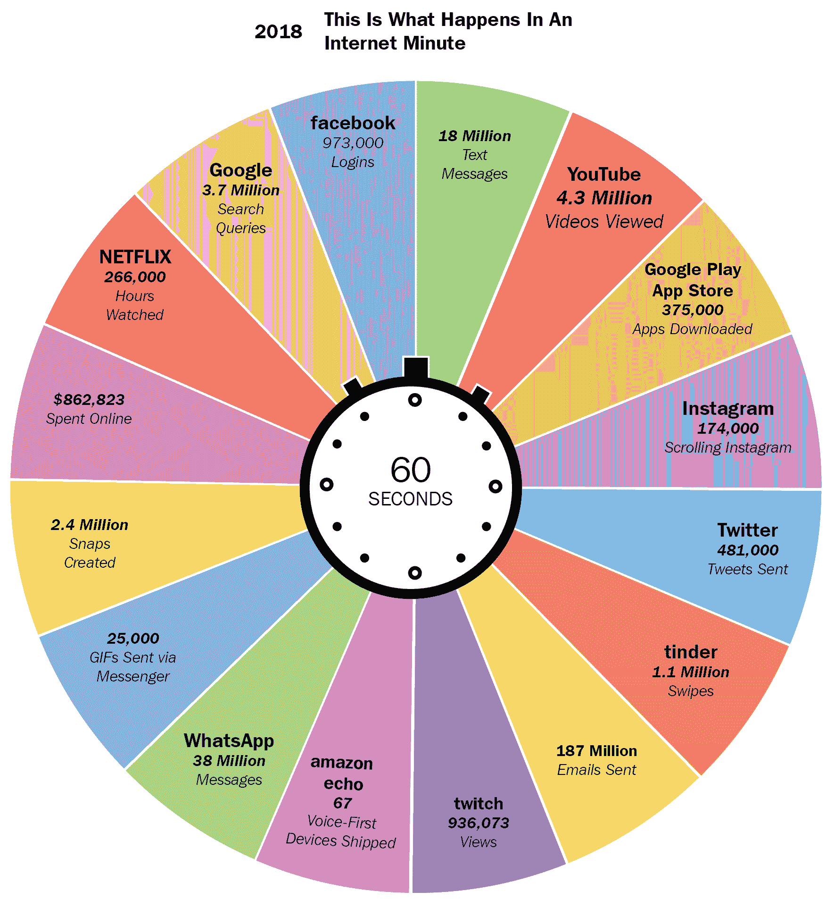

要从互联网获取数据，有多种选择，如下所示列表所示：

+   来自维基百科、IMDb 和 *百万歌曲数据集*（可在以下链接找到：[`labrosa.ee.columbia.edu/millionsong/`](https://labrosa.ee.columbia.edu/millionsong/)）的批量下载。

+   通过 API（如 Google、Twitter、Facebook 和 YouTube）访问数据。

+   爬取公开的、非敏感的和匿名化的数据是可以的。务必检查条款和条件，并完全引用信息。

收集到的数据的主要缺点是积累数据需要时间和空间，并且它只覆盖了已经发生的事情；例如，意图和内部及外部动机没有被收集。最后，这样的数据可能存在噪声、不完整、不一致，甚至可能随时间变化。

另一个选择是从移动设备中的惯性传感器和位置传感器、环境传感器以及监控关键性能指标软件代理收集测量数据。

# 数据生成

另一种方法是自行生成数据，例如，通过调查。在调查设计中，我们必须注意数据采样；也就是说，谁在回答调查。我们只从可以接触并愿意回答的受访者那里获取数据。此外，受访者可以提供符合他们自我形象和研究者期望的答案。

或者，数据可以通过模拟来收集，其中领域专家在微观层面上指定用户的行为模型。例如，人群模拟需要指定不同类型的用户在人群中会如何行为。一些例子可能是跟随人群、寻找逃生路线等。然后，可以在不同的条件下运行模拟，以观察会发生什么（Tsai 等人，2011）。模拟适合研究宏观现象和涌现行为；然而，它们通常很难从经验上进行验证。

此外，你可以设计实验来彻底覆盖所有可能的后果，其中你保持所有变量不变，一次只操纵一个变量。这是最昂贵的方法，但通常提供最好的质量。

# 采样陷阱

数据收集可能会涉及许多陷阱。为了说明一个，让我分享一个故事。在学生之间免费发送平信应该有一个全球性的、不成文的规则。如果你在邮票应该贴的地方写学生给学生的信，邮件就可以免费递送给收件人。现在，假设雅各布给艾玛寄了一套明信片，并且鉴于艾玛确实收到了一些明信片，她得出结论认为所有明信片都已被递送，而且这个规则确实是真的。艾玛推理，因为她收到了明信片，所以所有明信片都已被递送。然而，她不知道雅各布寄出的但未被递送的明信片；因此，她无法在她的推理中解释这一点。艾玛所经历的是幸存者偏差；也就是说，她是基于幸存的数据得出结论的。顺便说一句，带有学生给学生邮票的明信片上会有一个圆圈黑字母 T 的邮票，这意味着邮资已付，收件人应支付邮资，包括一小笔罚款。然而，邮件服务通常在应用此类费用时成本较高，因此通常不会这样做。（Magalhães，2010）

另一个例子是一项研究发现，平均寿命最低的职业是学生。成为学生并不会导致你过早死亡；相反，成为学生意味着你年轻。这就是为什么平均寿命如此之低的原因。（Gelman 和 Nolan，2002）

此外，一项研究发现，只有 1.5%的交通事故司机报告说他们在使用手机，而 10.9%的人报告说车内有其他乘客分散了他们的注意力。我们能得出使用手机比与车内其他乘客交谈更安全的结论吗？（Uts，2003）要回答这个问题，我们需要知道手机使用的普遍性。很可能是，在收集数据期间，开车时与车内其他乘客交谈的人数比在手机上交谈的人数要多。

# 数据预处理

数据预处理任务的目标是以最佳方式准备数据，以便用于机器学习算法，因为并非所有算法都能处理缺失数据、额外属性或非规范化值的问题。

# 数据清理

数据清理，也称为数据净化或数据擦洗，是一个包含以下步骤的过程：

1.  识别不准确、不完整、不相关或损坏的数据，并将其从进一步处理中移除

1.  解析数据，提取感兴趣的信息，或验证数据字符串是否处于可接受的格式

1.  将数据转换为通用的编码格式，例如，UTF-8 或 int32，时间尺度或归一化范围

1.  将数据转换为通用的数据模式；例如，如果我们从不同类型的传感器收集温度测量值，我们可能希望它们具有相同的结构

# 填充缺失值

机器学习算法通常不擅长处理缺失值。罕见的例外包括决策树、朴素贝叶斯分类器和一些基于规则的学习者。了解值缺失的原因非常重要。它可能由于许多原因而缺失，例如随机错误、系统错误和传感器噪声。一旦我们确定了原因，就有多种方法可以处理缺失值，如下列所示：

+   **移除实例**：如果有足够的数据，并且只有少数几个非相关实例有一些缺失值，那么移除这些实例是安全的。

+   **移除属性**：当大多数值缺失、值恒定或属性与另一个属性高度相关时，移除属性是有意义的。

+   **分配特殊值**（**N/A**）：有时值缺失是由于有效的原因，例如值超出范围、离散属性值未定义，或无法获得或测量该值。例如，如果一个人从未评价过一部电影，那么他对这部电影的评分就不存在。

+   **取平均属性值**：如果我们有有限数量的实例，我们可能无法承担移除实例或属性。在这种情况下，我们可以通过分配平均属性值来估计缺失值。

+   **从其他属性预测值**：如果属性具有时间依赖性，则从之前的条目预测值。

正如我们所看到的，值可能由于许多原因而缺失，因此了解值缺失、不存在或损坏的原因非常重要。

# 移除异常值

数据中的异常值是与系列中其他任何值都不同的值，并且会以不同程度影响所有学习方法。这些可能是极端值，可以通过置信区间检测并使用阈值移除。最佳方法是可视化数据并检查可视化以检测不规则性。以下是一个示例图。可视化仅适用于低维数据：

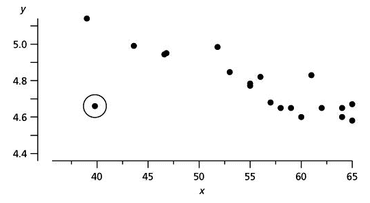

# 数据转换

数据转换技术将数据集转换为机器学习算法期望的输入格式，甚至可能帮助算法更快地学习并实现更好的性能。这也被称为数据整理或数据清洗。例如，标准化假设数据遵循高斯分布，并按以下方式转换值，使得平均值是 0，标准差是 1：


另一方面，归一化会将属性值缩放到一个小的、指定的范围，通常在 0 到 1 之间：

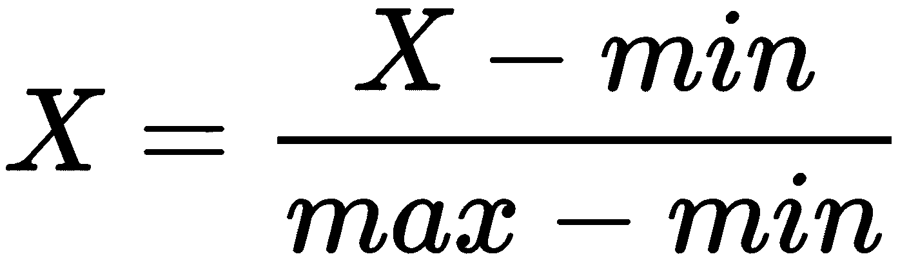

许多机器学习工具箱会自动为您归一化和标准化数据。

最后一种转换技术是离散化，它将连续属性的取值范围划分为区间。为什么我们应该关心这个问题呢？一些算法，如决策树和朴素贝叶斯，更喜欢离散属性。选择区间的最常见方法如下：

+   **等宽**：连续变量的区间被划分为*k*个等宽的区间

+   **等频率**：假设有*N*个实例，每个*k*个区间大约包含*N*或*k*个实例

+   **最小熵**：这种方法递归地分割区间，直到熵（衡量无序）的减少超过由区间分割引入的熵增加（Fayyad 和 Irani，1993）。

前两种方法需要我们指定区间的数量，而最后一种方法会自动设置区间的数量；然而，它需要类变量，这意味着它不适用于无监督机器学习任务。

# 数据降维

数据降维处理的是大量的属性和实例。属性的数量对应于我们的数据集维度数。预测能力低的维度对整体模型贡献很小，并造成很多危害。例如，具有随机值的属性可能会引入一些随机模式，这些模式会被机器学习算法捕捉到。可能数据中包含大量缺失值，其中我们必须找到大量缺失值的原因，在此基础上，可能用一些替代值填充它或进行插补或完全删除该属性。如果 40%或更多值缺失，那么可能建议删除此类属性，因为这会影响模型性能。

另一个因素是方差，其中常数变量可能具有低方差，这意味着数据彼此非常接近，或者数据中的变化不是很大。

为了解决这个问题，第一组技术删除了这些属性并选择了最有希望的属性。这个过程被称为特征选择或属性选择，包括 ReliefF、信息增益和基尼指数等方法。这些方法主要关注离散属性。

另一组工具专注于连续属性，将数据集从原始维度转换到低维空间。例如，如果我们有三个空间中的一组点，我们可以将其投影到二维空间。一些信息会丢失，但在第三维无关紧要的情况下，我们不会丢失太多，因为数据结构和关系几乎完美地保留了下来。这可以通过以下方法实现：

+   **奇异值分解**（**SVD**）

+   **主成分分析**（**PCA**）

+   后向/前向特征消除

+   因子分析

+   **线性判别分析**（**LDA**）

+   神经网络自编码器

数据降维的第二个问题与实例过多有关；例如，它们可能是重复的，或者来自非常频繁的数据流。主要思想是以一种方式选择实例的子集，使得所选数据的分布仍然类似于原始数据分布，更重要的是，与观察到的过程相似。减少实例数量的技术包括随机数据抽样、分层等。一旦数据准备就绪，我们就可以开始数据分析建模。

# 无监督学习

无监督学习是关于分析数据并在未标记数据中发现隐藏结构的过程。由于没有给出正确的标签概念，因此也没有误差度量来评估学习模型；然而，无监督学习是一个极其强大的工具。你是否曾经想过亚马逊是如何预测你会喜欢哪些书的？或者 Netflix 是如何在你之前就知道你想看什么？答案可以在无监督学习中找到。我们将在下一节中查看一个类似的无监督学习示例。

# 寻找相似项目

许多问题可以表述为寻找相似元素集，例如，购买相似产品的客户、内容相似的网页、具有相似对象的图像、访问相似网站的用户等等。

如果两个项目之间的距离很小，则认为它们是相似的。主要问题是每个项目是如何表示的，以及项目之间的距离是如何定义的。距离度量主要有两大类：

+   欧几里得距离

+   非欧几里得距离

# 欧几里得距离

在欧几里得空间中，具有 *n* 维，两个元素之间的距离基于该空间中元素的位置，这被称为**p-norm 距离**。两种常用的距离度量是 L2-和 L1-norm 距离。

**L2-norm**，也称为欧几里得距离，是应用最广泛的距离度量，用于衡量二维空间中两个项目之间的距离。其计算方法如下：

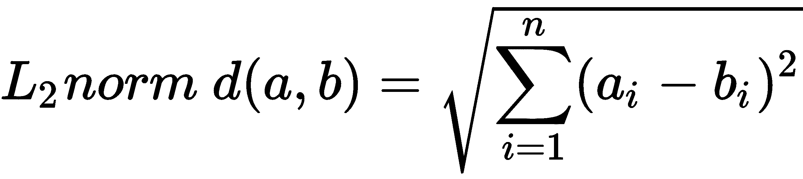

**L1-norm**，也称为曼哈顿距离、城市街区距离和出租车规范，简单地将每个维度上的绝对差异相加，如下所示：

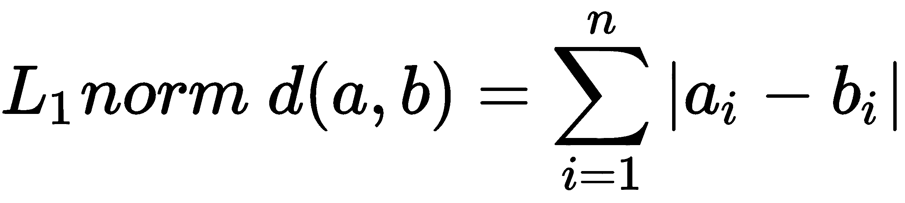

# 非欧几里得距离

非欧几里得距离是基于元素的性质，而不是它们在空间中的位置。一些著名的距离包括 Jaccard 距离、余弦距离、编辑距离和汉明距离。

**Jaccard 距离**用于计算两个集合之间的距离。首先，我们计算两个集合的 Jaccard 相似度，即它们的交集大小除以它们的并集大小，如下所示：

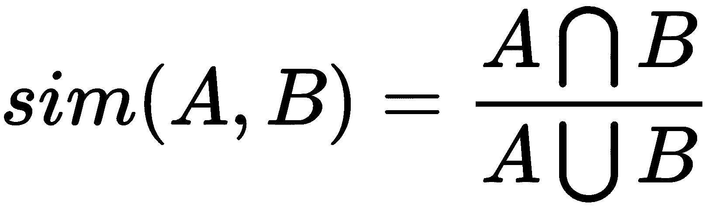

Jaccard 距离随后根据以下公式定义：

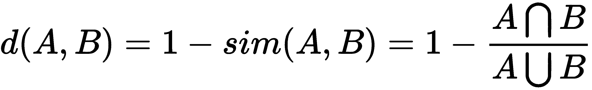

**余弦距离**关注的是两个向量之间的方向而不是大小，因此，具有相同方向的两个向量具有余弦相似度为 1，而垂直的两个向量具有余弦相似度为 0。假设我们有两个多维点，可以将一个点视为从原点（*0, 0, ..., 0*）到其位置的向量。两个向量形成一个角度，其余弦距离是向量的归一化点积，如下所示：

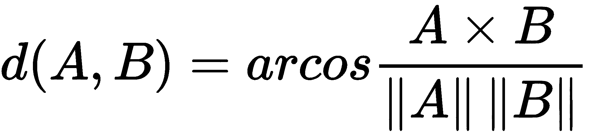

余弦距离在高维特征空间中常用；例如，在文本挖掘中，其中文本文档代表一个实例，特征对应不同的单词，它们的值对应于单词在文档中出现的次数。通过计算余弦相似度，我们可以衡量两个文档在描述相似内容时匹配的可能性。

**编辑距离**在比较两个字符串时是有意义的。字符串 a=a1,a2,a3,...an 和 b=b1,b2,b3,...bn 之间的距离是转换字符串 a 到 b 所需的最小单字符插入/删除操作的数量，例如，a = abcd 和 b = abbd。要将 a 转换为 b，我们必须删除第二个 b 并在其位置插入 c。没有最小的操作数量可以将 a 转换为 b，因此距离是 d(a, b) = 2。

**汉明距离**比较两个相同大小的向量，并计算它们在哪些维度上不同。换句话说，它衡量将一个向量转换为另一个向量所需的替换次数。

有许多距离度量专注于各种属性，例如，相关度衡量两个元素之间的线性关系；**马氏距离**衡量一个点与其他点的分布之间的距离，**SimRank**，基于图论，衡量元素出现的结构相似性，等等。正如你所能想象的，为你的问题选择和设计合适的相似性度量超过了一半的战斗。在 A. A. Goshtasby 所著的《图像配准：原理、工具和方法》一书中，收集了关于相似性度量的令人印象深刻的概述和评估，该书由 Springer Science and Business Media（2012 年）出版。

# 维度诅咒

维度诅咒指的是我们拥有大量特征的情况，通常有数百或数千个，这导致了一个具有稀疏数据且距离异常的极大空间。例如，在高维中，几乎所有的点对彼此的距离都相等；事实上，几乎所有的点对都有接近平均距离的距离。维度诅咒的另一种表现是任何两个向量几乎正交，这意味着所有角度都接近 90 度。这实际上使得任何距离测量都变得无用。

解决维度诅咒的方法可能隐藏在数据降维技术中，我们希望减少特征的数量；例如，我们可以运行一个特征选择算法，如 ReliefF，或者一个特征提取或降维算法，如 PCA。

# 聚类

聚类是一种根据某些距离度量将相似实例分组到聚类的技术。主要思想是将相似的实例（即彼此接近的实例）放入同一个聚类中，同时将不相似的点（即彼此距离较远的点）保留在不同的聚类中。以下图表显示了聚类可能的外观示例：

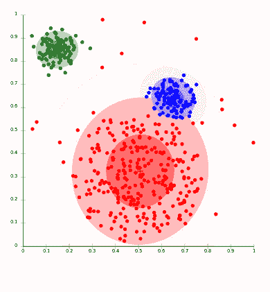

聚类算法遵循两种根本不同的方法。第一种是层次或聚合方法，它首先将每个点视为自己的聚类，然后迭代地将最相似的聚类合并在一起。当进一步的合并达到预定义的聚类数量或要合并的聚类分布在很大区域时，它停止。

另一种方法基于点分配。首先，估计初始聚类中心（即质心），例如随机地，然后，每个点被分配到最近的聚类，直到所有点都被分配。这个群体中最著名的算法是 k-means 聚类。

k-means 聚类算法要么选择尽可能远的点作为初始聚类中心，要么（层次化地）聚类数据样本并选择距离每个 k 聚类中心最近的点。

# 监督学习

监督学习是语音识别、电子邮件垃圾邮件过滤、照片中的人脸识别以及信用卡欺诈检测等令人惊叹的事情背后的关键概念。更正式地说，给定一个由特征 X 描述的学习示例集合 D，监督学习的目标是找到一个预测目标变量 Y 的函数。描述特征 X 和类别 Y 之间关系的函数 f 被称为模型：

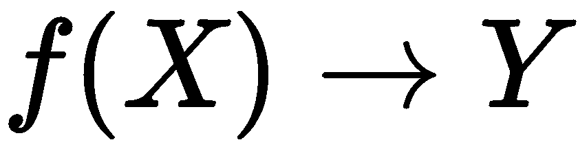

监督学习算法的一般结构由以下决策定义（Hand 等人，2001 年）：

1.  定义任务

1.  决定机器学习算法，它引入特定的归纳偏差；即它对目标概念做出的先验假设

1.  决定得分或成本函数，例如信息增益、均方根误差等

1.  决定优化/搜索方法以优化得分函数

1.  找到一个描述 X 和 Y 之间关系的函数

对于我们具有的任务类型和数据集，许多决策已经为我们做出了。在以下章节中，我们将更详细地探讨分类和回归方法以及相应的得分函数。

# 分类

当我们处理离散类时，可以应用分类，目标是在目标变量的互斥值中预测一个值。一个例子是信用评分，最终的预测是个人是否有信用责任。最流行的算法包括决策树、朴素贝叶斯分类器、SVMs、神经网络和集成方法。

# 决策树学习

决策树学习构建了一个分类树，其中每个节点对应一个属性；边对应于从节点起源的属性的可能的值（或区间）；每个叶子节点对应一个类标签。决策树可以用来直观和明确地表示预测模型，这使得它成为一个非常透明的（白盒）分类器。著名的算法包括 ID3 和 C4.5，尽管存在许多替代实现和改进（例如，Weka 中的 J48）。

# 概率分类器

给定一组属性值，概率分类器能够预测一个类集的分布，而不是一个确切的类。这可以用作确定性的程度；也就是说，分类器对其预测有多大的信心。最基本的分类器是朴素贝叶斯，它恰好是当且仅当属性条件独立时，最优的分类器。不幸的是，这在实践中极为罕见。

存在一个巨大的子领域，称为概率图模型，包括数百个算法，例如贝叶斯网络、动态贝叶斯网络、隐马尔可夫模型和条件随机字段，它们不仅可以处理属性之间的特定关系，还可以处理时间依赖性。Kiran R Karkera 撰写了一本关于这个主题的优秀入门书籍，《使用 Python 构建概率图模型》，Packt Publishing（2014 年），而 Koller 和 Friedman 出版了一本全面的理论圣经，《概率图模型》，MIT Press（2009 年）。

# 核方法

任何线性模型都可以通过将核技巧应用于模型来转化为非线性模型——用核函数替换其特征（预测器）。换句话说，核隐式地将我们的数据集转换到更高维。核技巧利用了这样一个事实，即在更高维中分离实例通常更容易。能够操作核的算法包括核感知器、SVMs、高斯过程、PCA、典型相关分析、岭回归、谱聚类、线性自适应滤波器以及许多其他算法。

# 人工神经网络

人工神经网络受到生物神经网络结构的启发，能够进行机器学习和模式识别。它们通常用于回归和分类问题，包括各种算法和变体，适用于各种问题类型。一些流行的分类方法包括**感知器**、**受限玻尔兹曼机**（**RBM**）和**深度信念网络**。

# 集成学习

集成方法由一组不同的较弱模型组成，以获得更好的预测性能。这些模型分别进行训练，然后以某种方式结合它们的预测来做出整体预测。因此，集成包含多种建模数据的方式，这有望带来更好的结果。这是一类非常强大的技术，因此非常受欢迎。这类技术包括提升、装袋、AdaBoost 和随机森林。它们之间的主要区别在于要组合的弱学习者的类型以及组合它们的方式。

# 评估分类

我们的分类器表现如何？这比另一个好吗？在分类中，我们计算我们正确和错误分类的次数。假设有两种可能的分类标签：是和否，那么就有四种可能的结果，如下表所示：

|  | **预测为正吗？** |
| --- | --- |
| **是** | **否** |
| **真的积极吗？** | **是** | TP-真阳性 | FN-假阴性 |
| **否** | FP-假阳性 | TN-真阴性 |

四个变量：

+   **真阳性**（**命中**）：这表示一个被正确预测为是的“是”实例

+   **真阴性**（**正确拒绝**）：这表示没有实例被正确预测为否

+   **假阳性**（**误报**）：这表示没有实例被预测为是

+   **假阴性**（**漏报**）：这表示一个被预测为否的“是”实例

分类器的两个基本性能指标是，首先，分类错误：

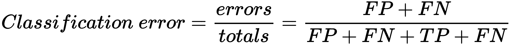

其次，分类准确率是另一个性能指标，如下所示：

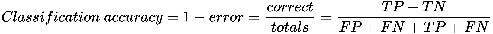

这两个指标的主要问题是它们无法处理不平衡的类别。例如，将信用卡交易分类为滥用或非滥用是一个具有不平衡类别的例子：有 99.99%的正常交易和极小比例的滥用。声称每笔交易都是正常交易的分类器准确率为 99.99%，但我们主要对那些非常罕见的分类感兴趣。

# 精确度和召回率

解决方案是使用不涉及真阴性的指标。以下有两种这样的指标：

+   **精确度**：这是所有预测为正的例子中，正确预测为正的例子（*TP*）的比例，占所有预测为正的例子（*TP + FP*）的比例：

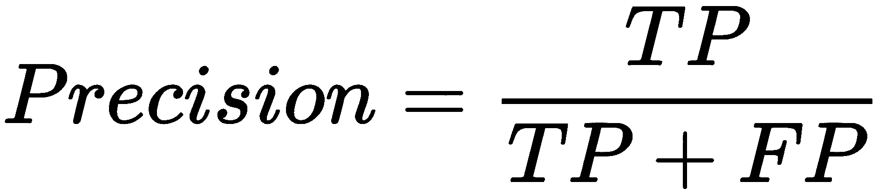

+   **召回率**：这是所有正例中正确预测为正例（*TP*）的比例，占所有正例（*TP + FN*）的比例：

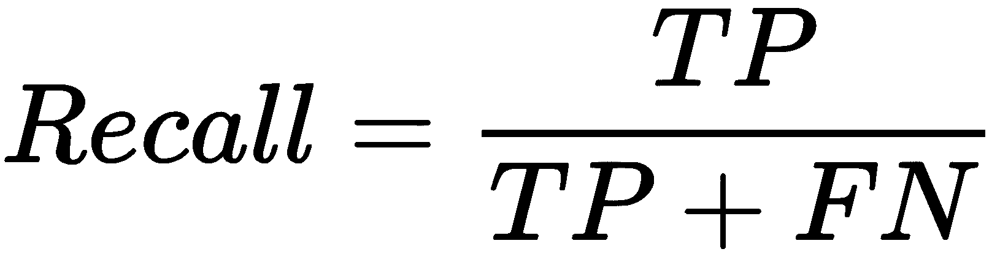

通常会将这两个指标结合起来，并报告 *F 度量*，它考虑了精确度和召回率来计算得分，得分作为加权平均，其中得分的最佳值为 1，最差值为 0，如下所示：

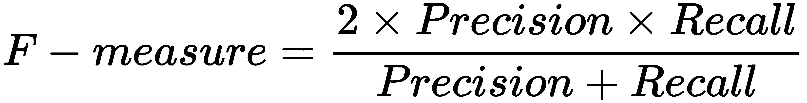

# ROC 曲线

大多数分类算法返回一个表示分类置信度的值，记为 *f(X)*，该值反过来用于计算预测。以信用卡滥用为例，一条规则可能看起来类似于以下内容：

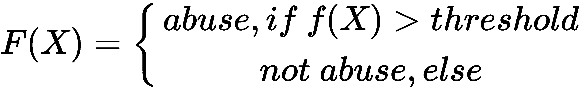

阈值决定了错误率和真正例率。所有可能阈值值的输出可以绘制为**接收者操作特征**（**ROC**），如下所示：

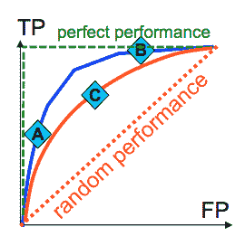

随机预测器用红色虚线绘制，完美预测器用绿色虚线绘制。为了比较**A**分类器是否优于**C**分类器，我们比较曲线下的面积。

大多数工具箱都提供所有这些先前度量。

# 回归

回归处理连续的目标变量，与分类不同，分类处理离散的目标变量。例如，为了预测未来几天的外部温度，我们会使用回归，而分类将用于预测是否会下雨。一般来说，回归是一个估计特征之间关系的过程，即一个特征的变化如何影响目标变量。

# 线性回归

最基本的回归模型假设特征和目标变量之间存在线性依赖关系。模型通常使用最小二乘法进行拟合，即最佳模型最小化误差的平方。在许多情况下，线性回归无法建模复杂的关系；例如，以下图表显示了具有相同线性回归线的四组不同点。左上角的模型捕捉了总体趋势，可以被认为是一个合适的模型，而左下角的模型拟合点更好（除了一个异常值，应仔细检查），而上右和下右的线性模型完全错过了数据的潜在结构，不能被认为是合适的模型：

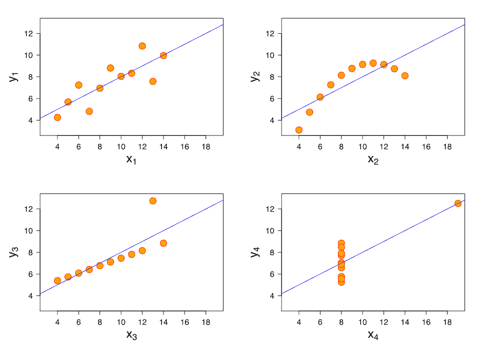

# 逻辑回归

线性回归适用于因变量是连续的情况。然而，如果因变量本质上是二元的，即 0 或 1，成功或失败，是或否，真或假，存活或死亡等，那么就使用逻辑回归。一个这样的例子是药物的临床试验，研究对象要么对药物有反应，要么没有反应。它也用于欺诈检测，交易要么是欺诈，要么不是欺诈。通常，使用逻辑函数来衡量因变量和自变量之间的关系。它被视为伯努利分布，当绘制时，看起来类似于字符形状的曲线。

# 评估回归

在回归中，我们从输入 X 预测数字 Y，预测通常是不准确的或不是精确的。我们必须问的主要问题是：偏差有多大？换句话说，我们想要衡量预测值和真实值之间的距离。

# 均方误差

**均方误差**（**MSE**）是预测值与真实值之间平方差的平均值，如下所示：

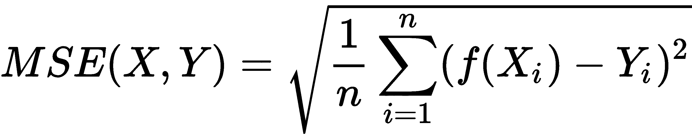

这个度量对异常值非常敏感，例如，99 次精确预测和 1 次预测偏差 10 分与所有预测偏差 1 分的情况得分相同。此外，这个度量对平均值也很敏感。因此，通常使用一个相对均方误差来比较我们的预测器的均方误差与均值预测器的均方误差（它总是预测平均值）。

# 平均绝对误差

**平均绝对误差**（**MAS**）是预测值与真实值之间绝对差的平均值，如下所示：

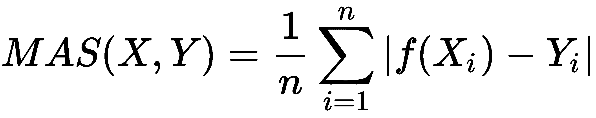

MAS 对异常值不太敏感，但它对平均值和尺度也很敏感。

# 相关系数

**相关系数**（**CC**）比较预测的平均值相对于平均值，乘以训练值相对于平均值。如果这个数字是负数，意味着弱相关；正数表示强相关；零表示无相关。真实值 X 和预测值 Y 之间的相关系数定义为如下：

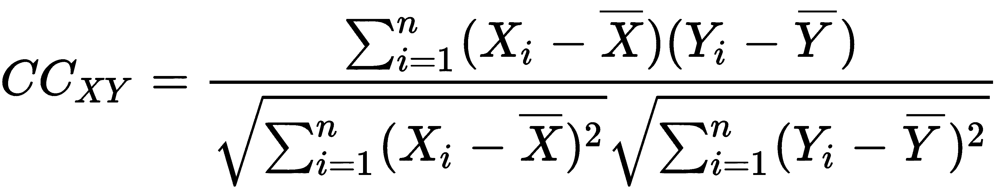

CC 度量对平均值和尺度完全不敏感，对异常值也不太敏感。它能够捕捉相对顺序，这使得它在排名任务中很有用，例如文档相关性和基因表达。

# 泛化和评估

一旦构建了模型，我们如何知道它在新的数据上会表现如何？这个模型是否好？为了回答这些问题，我们首先将研究模型泛化，然后看看如何对新数据上的模型性能进行估计。

# 欠拟合和过拟合

预测器训练可能导致模型过于复杂或过于简单。具有低复杂度的模型（下图中最左侧的模型）可以简单到预测最频繁或平均的类别值，而具有高复杂度的模型（最右侧的模型）可以表示训练实例。过于刚性的模型（左侧显示），无法捕捉复杂模式；而过于灵活的模型（右侧显示），会拟合训练数据中的噪声。主要挑战是选择适当的学习算法及其参数，以便学习到的模型在新数据上表现良好（例如，中间列）：

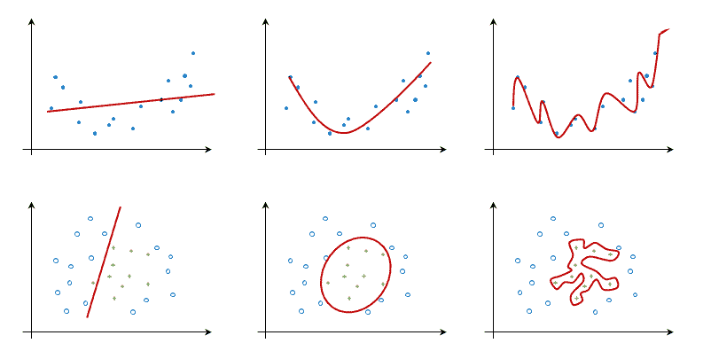

下图显示了随着模型复杂度的增加，训练集中的误差如何降低。简单的刚性模型欠拟合数据，误差较大。随着模型复杂度的增加，它更好地描述了训练数据的潜在结构，因此误差降低。如果模型过于复杂，它就会过拟合训练数据，其预测误差再次增加：

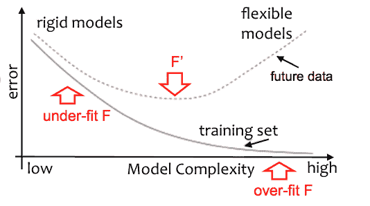

根据任务复杂度和数据可用性，我们希望调整我们的分类器以适应更复杂或更简单的结构。大多数学习算法允许这样的调整，如下所示：

+   **回归**: 这是指多项式的阶数

+   **朴素贝叶斯**: 这是指属性的个数

+   **决策树**: 这是指树中的节点数量——剪枝置信度

+   **K 近邻法**: 这是指邻居的数量——基于距离的邻居权重

+   **SVM**: 这是指核类型；成本参数

+   **神经网络**: 这是指神经元和隐藏层的数量

通过调整，我们希望最小化泛化误差；即分类器在未来的数据上的表现如何。不幸的是，我们永远无法计算真实的泛化误差；然而，我们可以估计它。尽管如此，如果一个模型在训练数据上表现良好，但在测试数据上的表现却很差，那么这个模型很可能是过拟合的。

# 训练集和测试集

为了估计泛化误差，我们将数据分为两部分：训练数据和测试数据。一个一般规则是按照训练：测试的比例来分割，即 70:30。我们首先在训练数据上训练预测器，然后预测测试数据的值，最后计算误差，即预测值和真实值之间的差异。这为我们提供了对真实泛化误差的估计。

估计基于以下两个假设：首先，我们假设测试集是我们数据集的无偏样本；其次，我们假设实际的新数据将重新组合成与我们的训练和测试示例相同的分布。第一个假设可以通过交叉验证和分层来缓解。此外，如果数据稀缺，就不能为了单独的测试集而放弃大量数据，因为学习算法在没有足够数据的情况下表现不佳。在这种情况下，可以使用交叉验证代替。

# 交叉验证

交叉验证将数据集分成大约相同大小的*k*个集合——例如，在以下图中分成五个集合。首先，我们使用集合 2 到 5 进行学习，集合 1 进行训练。然后我们重复此过程五次，每次留出一个集合进行测试，并平均五次重复的错误：

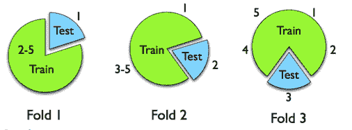

这样，我们既使用了所有数据用于学习和测试，又避免了使用相同的数据来训练和测试模型。

# 留一法验证

交叉验证的一个极端例子是留一法验证。在这种情况下，折叠的数量等于实例的数量；我们在所有实例上学习，除了一个实例，然后在被省略的实例上测试模型。我们为所有实例重复此操作，以便每个实例正好用于验证一次。当学习示例有限时，例如少于 50 个，这种方法是推荐的。

# 分层

分层是一种选择实例子集的过程，使得每个折叠大致包含相同比例的类别值。当一个类别是连续的，折叠的选择使得所有折叠中的平均响应值大致相等。分层可以与交叉验证或单独的训练和测试集一起应用。

# 摘要

在本章中，我们更新了我们对机器学习基础知识的了解。我们回顾了应用机器学习的流程，并明确了主要任务、方法和算法。我们学习了回归的不同类型以及如何评估它们。我们还探讨了交叉验证及其应用。

在下一章中，我们将学习 Java 库，它们可以执行的任务，以及机器学习的不同平台。
