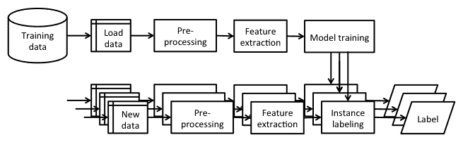

# Java 机器学习库和平台

通过自己实现机器学习算法可能是学习机器学习的最佳方式，但如果你站在巨人的肩膀上，利用现有的开源库，你可以进步得更快。

本章回顾了 Java 中用于机器学习的各种库和平台。目标是了解每个库能为桌面带来什么，以及它能解决什么类型的问题。

在本章中，我们将涵盖以下主题：

+   Java 在实现机器学习应用中的必要性

+   Weka，一个通用的机器学习平台

+   Java 机器学习库，一组机器学习算法

+   Apache Mahout，一个可扩展的机器学习平台

+   Apache Spark，一个分布式机器学习库

+   Deeplearning4j，一个深度学习库

+   MALLET，一个文本挖掘库

我们还将讨论如何使用这些库以及其他组件来设计适用于单机和大数据应用的完整机器学习应用堆栈。

# Java 在实现机器学习应用中的需求

新的机器学习算法通常首先在大学实验室中编写脚本，将几种语言如 shell 脚本、Python、R、MATLAB、Scala 或 C++粘合在一起，以提供一个新的概念并对其属性进行理论分析。一个算法可能需要经过多次重构才能进入一个具有标准化输入或输出和接口的库。虽然 Python、R 和 MATLAB 相当流行，但它们主要用于脚本编写、研究和实验。另一方面，Java 是事实上的企业语言，这可以归因于静态类型、强大的 IDE 支持、良好的可维护性以及不错的线程模型和高性能并发数据结构库。此外，已经有许多 Java 库可用于机器学习，这使得在现有的 Java 应用程序中应用它们并利用强大的机器学习功能变得非常方便。

# 机器学习库

在[MLOSS.org](https://mloss.org/software/)网站上列出了超过 70 个基于 Java 的开源机器学习项目，可能还有更多未列出的项目存在于大学服务器、GitHub 或 Bitbucket 上。在本节中，我们将回顾主要的库和平台，它们能解决的问题类型，它们支持的算法，以及它们可以处理的数据类型。

# Weka

**Waikato 环境知识分析**（**WEKA**）是一个在新西兰怀卡托大学开发的机器学习库，可能是最知名的 Java 库。它是一个通用的库，能够解决各种机器学习任务，如分类、回归和聚类。它具有丰富的图形用户界面、命令行界面和 Java API。您可以在[`www.cs.waikato.ac.nz/ml/weka/`](http://www.cs.waikato.ac.nz/ml/weka/)上查看 Weka。

在撰写本书时，Weka 总共有 267 个算法：数据预处理（82 个）、属性选择（33 个）、分类和回归（133 个）、聚类（12 个）和关联规则挖掘（7 个）。图形界面非常适合探索您的数据，而 Java API 允许您开发新的机器学习方案并在您的应用程序中使用这些算法。

Weka 是在**GNU 通用公共许可证**（**GNU GPL**）下分发的，这意味着您可以复制、分发和修改它，只要您跟踪源文件中的更改并保持其在 GNU GPL 之下。您甚至可以将其商业分发，但您必须披露源代码或获得商业许可证。

除了支持多种文件格式外，Weka 还特色其默认的数据格式 ARFF，通过属性-数据对来描述数据。它由两部分组成。第一部分包含一个标题，它指定了所有属性及其类型，例如，名义、数值、日期和字符串。第二部分包含数据，其中每一行对应一个实例。标题中的最后一个属性隐式地被认为是目标变量，缺失数据用问号标记。例如，回到第一章的例子，“应用机器学习快速入门”，用 ARFF 文件格式编写的`Bob`实例如下：

```py
@RELATION person_dataset @ATTRIBUTE `Name` STRING @ATTRIBUTE `Height` NUMERIC @ATTRIBUTE `Eye color`{blue, brown, green} @ATTRIBUTE `Hobbies` STRING @DATA 'Bob', 185.0, blue, 'climbing, sky diving' 'Anna', 163.0, brown, 'reading' 'Jane', 168.0, ?, ? 
```

文件由三个部分组成。第一部分以`@RELATION <String>`关键字开始，指定数据集名称。下一部分以`@ATTRIBUTE`关键字开始，后跟属性名称和类型。可用的类型有`STRING`、`NUMERIC`、`DATE`和一系列分类值。最后一个属性隐式地假设为目标变量，我们想要预测的变量。最后一部分以`@DATA`关键字开始，每行一个实例。实例值由逗号分隔，必须遵循第二部分中属性的相同顺序。

更多 Weka 的示例将在第三章“基本算法——分类、回归和聚类”和第四章“使用集成进行客户关系预测”中演示。

要了解更多关于 Weka 的信息，可以阅读一本快速入门书籍——由*Kaluza, Packt Publishing*出版的*Weka How-to*，开始编码，或者查阅*Witten and Frank*的*Data Mining: Practical Machine Learning Tools and Techniques with Java Implementations*，由*Morgan Kaufmann Publishers*出版，以获取理论背景和深入解释。

Weka 的 Java API 组织成以下顶级包：

+   `weka.associations`：这是关联规则学习的数据结构和算法，包括**Apriori**、**预测 Apriori**、**FilteredAssociator**、**FP-Growth**、**广义序列模式**（**GSP**）、**hotSpot**和**Tertius**。

+   `weka.classifiers`: 这些是监督学习算法、评估器和数据结构。该包进一步分为以下组件：

    +   `weka.classifiers.bayes`: 这实现了贝叶斯方法，包括朴素贝叶斯、贝叶斯网络、贝叶斯逻辑回归等等。

    +   `weka.classifiers.evaluation`: 这些是针对名义和数值预测的监督评估算法，例如评估统计、混淆矩阵、ROC 曲线等等。

    +   `weka.classifiers.functions`: 这些是回归算法，包括线性回归、同质回归、高斯过程、**支持向量机（SVMs**）、多层感知器、投票感知器等等。

    +   `weka.classifiers.lazy`: 这些是基于实例的算法，例如 k-最近邻、K*和懒惰贝叶斯规则。

    +   `weka.classifiers.meta`: 这些是监督学习元算法，包括 AdaBoost、Bagging、加性回归、随机委员会等等。

    +   `weka.classifiers.mi`: 这些是多个实例学习算法，例如引用 k-最近邻、多样性密度、AdaBoost 等等。

    +   `weka.classifiers.rules`: 这些是基于分离征服方法的决策表和决策规则，包括 RIPPER、PART、PRISM 等等。

    +   `weka.classifiers.trees`: 这些是各种决策树算法，包括 ID3、C4.5、M5、功能树、逻辑树、随机森林等等。

    +   `weka.clusterers`: 这些是聚类算法，包括 k-means、CLOPE、蜘蛛网、DBSCAN 层次聚类和 FarthestFirst。

    +   `weka.core`: 这些是各种实用类，例如属性类、统计类和实例类。

    +   `weka.datagenerators`: 这些是用于分类、回归和聚类算法的数据生成器。

    +   `weka.estimators`: 这些是针对离散/名义域的各种数据分布估计器，包括条件概率估计等等。

    +   `weka.experiment`: 这些是一组支持必要配置、数据集、模型设置和统计信息的类，用于运行实验。

    +   `weka.filters`: 这些是基于属性和实例的选择算法，用于监督和未监督数据的预处理。

    +   `weka.gui`: 这些是实现探索者、实验者和知识流应用的图形界面。Weka 探索者允许你调查数据集、算法以及它们的参数，并使用散点图和其他可视化方法可视化数据集。Weka 实验者用于设计实验批次，但它只能用于分类和回归问题。Weka 知识流实现了一个可视拖放用户界面来构建数据流，例如加载数据、应用过滤器、构建分类器并对其进行评估。

# Java 机器学习

**Java 机器学习库**（**Java-ML**）是一个具有相同类型算法通用接口的机器学习算法集合。它只提供 Java API，因此主要面向软件工程师和程序员。Java-ML 包含数据预处理、特征选择、分类和聚类的算法。此外，它还提供了一些 Weka 桥接，可以直接通过 Java-ML API 访问 Weka 的算法。可以从[`java-ml.sourceforge.net`](http://java-ml.sourceforge.net/)下载。

Java-ML 也是一个通用的机器学习库。与 Weka 相比，它提供了更一致的接口和实现，包括一些最新的算法，这些算法在其他包中不存在，例如，广泛的最先进的相似度度量集和特征选择技术，例如，**动态时间规整**（**DTW**）、随机森林属性评估等。Java-ML 也遵循 GNU GPL 许可证。

Java-ML 支持所有类型的文件，只要它们每行包含一个数据样本，并且特征由逗号、分号或制表符等符号分隔。

该库围绕以下顶级包组织：

+   `net.sf.javaml.classification`: 这些是分类算法，包括朴素贝叶斯、随机森林、装袋、自组织映射、k 近邻等

+   `net.sf.javaml.clustering`: 这些是聚类算法，如 k-means、自组织映射、空间聚类、蜘蛛网、ABC 等

+   `net.sf.javaml.core`: 这些是表示实例和数据集的类

+   `net.sf.javaml.distance`: 这些是测量实例距离和相似性的算法，例如，切比雪夫距离、余弦距离/相似度、欧几里得距离、杰卡德距离/相似度、马氏距离、曼哈顿距离、闵可夫斯基距离、皮尔逊相关系数、斯皮尔曼脚规距离、DTW 等

+   `net.sf.javaml.featureselection`: 这些是特征评估、评分、选择和排名的算法，例如，增益比率、ReliefF、Kullback-Leibler 散度、对称不确定性等

+   `net.sf.javaml.filter`: 这些是通过过滤、删除属性、设置类或属性值等操作实例的方法

+   `net.sf.javaml.matrix`: 这实现了内存或基于文件的数组

+   `net.sf.javaml.sampling`: 这实现了采样算法以选择数据集的子集

+   `net.sf.javaml.tools`: 这些是数据集、实例操作、序列化、Weka API 接口等实用方法

+   `net.sf.javaml.utils`: 这些是算法的实用方法，例如，统计、数学方法、列联表等

# Apache Mahout

Apache Mahout 项目旨在构建一个可扩展的机器学习库。它是基于可扩展的、分布式架构构建的，如 Hadoop，使用 MapReduce 范式，这是一种使用服务器集群的并行、分布式算法处理和生成大型数据集的方法。

Mahout 提供控制台界面和 Java API 作为可扩展的聚类、分类和协同过滤算法。它能够解决三个商业问题：

+   **项目推荐**：推荐类似“喜欢这部电影的人也喜欢”的项目

+   **聚类**：将文本文档排序到主题相关的文档组中

+   **分类**：学习将哪个主题分配给未标记的文档

Mahout 在商业友好的 Apache 许可证下分发，这意味着只要您保留 Apache 许可证并将其包含在程序版权声明中，您就可以使用它。

Mahout 具有以下库：

+   `org.apache.mahout.cf.taste`: 这些是基于用户和项目协同过滤以及 ALS 矩阵分解的协同过滤算法

+   `org.apache.mahout.classifier`: 这些是内存和分布式实现，包括逻辑回归、朴素贝叶斯、随机森林、**隐马尔可夫模型**（HMM）和多层感知器

+   `org.apache.mahout.clustering`: 这些是聚类算法，如 canopy 聚类、k-means、模糊 k-means、流 k-means 和谱聚类

+   `org.apache.mahout.common`: 这些是算法的实用方法，包括距离、MapReduce 操作、迭代器等

+   `org.apache.mahout.driver`: 这实现了用于运行其他类主方法的通用驱动程序

+   `org.apache.mahout.ep`: 这是一种使用记录步长突变的进化优化

+   `org.apache.mahout.math`: 这些是在 Hadoop 中的各种数学实用方法和实现

+   `org.apache.mahout.vectorizer`: 这些是用于数据展示、操作和 MapReduce 作业的类

# Apache Spark

Apache Spark，或简称 Spark，是一个构建在 Hadoop 之上的大规模数据处理平台，但与 Mahout 不同，它并不依赖于 MapReduce 范式。相反，它使用内存缓存来提取一组工作数据，处理它，并重复查询。据报道，这比直接与存储在磁盘中的数据工作的 Mahout 实现快十倍。可以从[`spark.apache.org`](https://spark.apache.org/)获取。

在 Spark 之上构建了许多模块，例如 GraphX 用于图处理、Spark Streaming 用于处理实时数据流，以及 MLlib，它是一个机器学习库，具有分类、回归、协同过滤、聚类、降维和优化等功能。

Spark 的 MLlib 可以使用基于 Hadoop 的数据源，例如**Hadoop 分布式文件系统**（**HDFS**）或 HBase，以及本地文件。支持的数据类型包括以下内容：

+   **本地向量**存储在单个机器上。密集向量表示为双精度值数组，例如，（2.0，0.0，1.0，0.0），而稀疏向量通过向量的大小、索引数组和值数组表示，例如，[4, (0, 2), (2.0, 1.0)]。

+   **标记点**用于监督学习算法，由带有双精度类型类值的局部向量标记组成。标签可以是类索引、二元结果或多个类索引的列表（多类分类）。例如，标记的密集向量表示为[1.0, (2.0, 0.0, 1.0, 0.0)]。

+   **本地矩阵**在单个机器上存储一个密集矩阵。它由矩阵维度和一个按列主序排列的单个双精度数组定义。

+   **分布式矩阵**在 Spark 的**弹性分布式数据集**（**RDD**）上操作，它表示可以并行操作的一组元素。有三种表示形式：行矩阵，其中每一行是可以在单个机器上存储的本地向量，行索引没有意义；索引行矩阵，与行矩阵类似，但行索引是有意义的，即可以识别行并执行连接操作；以及坐标矩阵，当行不能存储在单个机器上且矩阵非常稀疏时使用。

Spark 的 MLlib API 库提供了各种学习算法和实用工具的接口，如下列所示：

+   `org.apache.spark.mllib.classification`：这些是二元和多类分类算法，包括线性 SVM、逻辑回归、决策树和朴素贝叶斯。

+   `org.apache.spark.mllib.clustering`：这些是 k-means 聚类算法。

+   `org.apache.spark.mllib.linalg`：这些是数据表示，包括密集向量、稀疏向量和矩阵。

+   `org.apache.spark.mllib.optimization`：这些是在 MLlib 中用作低级原语的多种优化算法，包括梯度下降、**随机梯度下降**（**SGD**）、分布式 SGD 的更新方案以及有限内存的**Broyden–Fletcher–Goldfarb–Shanno**（**BFGS**）算法。

+   `org.apache.spark.mllib.recommendation`：这些是基于模型的协同过滤技术，通过交替最小二乘矩阵分解实现。

+   `org.apache.spark.mllib.regression`：这些是回归学习算法，例如线性最小二乘法、决策树、Lasso 和岭回归。

+   `org.apache.spark.mllib.stat`：这些是在稀疏或密集向量格式中对样本进行统计的函数，用于计算均值、方差、最小值、最大值、计数和非零计数。

+   `org.apache.spark.mllib.tree`：这实现了分类和回归决策树学习算法。

+   `org.apache.spark.mllib.util`：这是一系列用于加载数据、保存数据、预处理、生成和验证数据的实用方法。

# Deeplearning4j

Deeplearning4j，或 DL4J，是一个用 Java 编写的深度学习库。它具有分布式和单机深度学习框架，包括并支持各种神经网络结构，如前馈神经网络、RBM、卷积神经网络、深度信念网络、自动编码器等。DL4J 可以解决不同的问题，例如识别人脸、声音、垃圾邮件或电子商务欺诈。

Deeplearning4j 也采用 Apache 2.0 许可证，并可以从[`deeplearning4j.org`](http://deeplearning4j.org/)下载。该库的组织结构如下：

+   `org.deeplearning4j.base`：这些是加载类。

+   `org.deeplearning4j.berkeley`：这些是数学实用方法。

+   `org.deeplearning4j.clustering`：这是 k-means 聚类的实现。

+   `org.deeplearning4j.datasets`：这是数据集操作，包括导入、创建、迭代等。

+   `org.deeplearning4j.distributions`：这些是分布的实用方法。

+   `org.deeplearning4j.eval`：这些是评估类，包括混淆矩阵。

+   `org.deeplearning4j.exceptions`：这实现了异常处理程序。

+   `org.deeplearning4j.models`：这些是监督学习算法，包括深度信念网络、堆叠自动编码器、堆叠降噪自动编码器和 RBM。

+   `org.deeplearning4j.nn`：这些是基于神经网络的组件和算法的实现，如神经网络、多层网络、卷积多层网络等。

+   `org.deeplearning4j.optimize`：这些是神经网络优化算法，包括反向传播、多层优化、输出层优化等。

+   `org.deeplearning4j.plot`：这些是渲染数据的各种方法。

+   `org.deeplearning4j.rng`：这是一个随机数据生成器。

+   `org.deeplearning4j.util`：这些是辅助和实用方法。

# MALLET

**机器学习语言工具包**（MALLET）是一个包含大量自然语言处理算法和实用工具的大型库。它可以用于各种任务，如文档分类、文档聚类、信息提取和主题建模。它具有命令行界面，以及用于多种算法（如朴素贝叶斯、HMM、潜在狄利克雷主题模型、逻辑回归和条件随机字段）的 Java API。

MALLET 采用通用公共许可证 1.0，这意味着你甚至可以在商业应用中使用它。可以从[`mallet.cs.umass.edu`](http://mallet.cs.umass.edu/)下载。MALLET 实例由名称、标签、数据和源表示。然而，有两种方法可以将数据导入 MALLET 格式，如下列所示：

+   **每文件一个实例**：每个文件或文档对应一个实例，MALLET 接受输入目录名。

+   **每行一个实例**：每一行对应一个实例，假设以下格式——`instance_name`标签标记。数据将是一个特征向量，由作为标记的独特单词及其出现次数组成。

该库包含以下包：

+   `cc.mallet.classify`: 这些是用于训练和分类实例的算法，包括 AdaBoost、bagging、C4.5 以及其他决策树模型、多元逻辑回归、朴素贝叶斯和 Winnow2。

+   `cc.mallet.cluster`: 这些是无监督聚类算法，包括贪婪聚合、爬山、k-best 和 k-means 聚类。

+   `cc.mallet.extract`: 此实现分词器、文档提取器、文档查看器、清理器等。

+   `cc.mallet.fst`: 此实现序列模型，包括条件随机字段、HMM、最大熵马尔可夫模型以及相应的算法和评估器。

+   `cc.mallet.grmm`: 此实现图形模型和因子图，例如推理算法、学习、测试等，例如循环信念传播、吉布斯抽样等。

+   `cc.mallet.optimize`: 这些是用于寻找函数最大值的优化算法，例如梯度上升、有限内存 BFGS、随机元上升等。

+   `cc.mallet.pipe`: 这些是作为管道处理数据到 MALLET 实例的方法。

+   `cc.mallet.topics`: 这些是主题建模算法，例如潜在狄利克雷分配、四级弹珠机分配、层次 PAM、DMRT 等。

+   `cc.mallet.types`: 此实现基本数据类型，如数据集、特征向量、实例和标签。

+   `cc.mallet.util`: 这些是各种实用函数，如命令行处理、搜索、数学、测试等。

# Encog 机器学习框架

Encog 是一个由数据科学家 Jeff Heaton 开发的 Java/C#机器学习框架。它支持数据归一化和处理，以及 SVM、神经网络、贝叶斯网络、隐马尔可夫模型、遗传编程和遗传算法等多种高级算法。自 2008 年以来，它一直在积极开发。它支持多线程，这提高了多核系统上的性能。

可以在[`www.heatonresearch.com/encog/`](https://www.heatonresearch.com/encog/)找到。MLMethod 是基本接口，它包括所有模型的方法。以下是一些它包含的接口和类：

+   `MLRegression`: 此接口定义了回归算法

+   `MLClassification`: 此接口定义了分类算法

+   `MLClustering`: 此接口定义了聚类算法

+   `MLData`: 此类表示模型中使用的向量，无论是输入还是输出

+   `MLDataPair`：此类的功能类似于`MLData`，但可用于输入和输出

+   `MLDataSet`：代表训练器的`MLDataPair`实例列表

+   `FreeformNeuron`：此类用作神经元

+   `FreeformConnection`：这显示了神经元之间的加权连接

+   `FreeformContextNeuron`：这代表一个上下文神经元

+   `InputSummation`：此值指定了如何将输入求和以形成一个单独的神经元

+   `BasicActiveSummation`：这是所有输入神经元的简单求和

+   `BasicFreeConnection`：这是神经元之间的基本加权连接

+   `BasicFreeformLayer`：此接口提供了一个层

# ELKI

ELKI 创建了一个环境，用于开发由索引结构支持的 KDD 应用程序，重点在于无监督学习。它提供了聚类分析和异常检测的各种实现。它提供了 R*-tree 等索引结构以提升性能和可扩展性。到目前为止，它已被学生和教师广泛应用于研究领域，并且最近引起了其他方面的关注。

ELKI 使用 AGPLv3 许可证，可在[`elki-project.github.io/`](https://elki-project.github.io/)找到。它由以下包组成：

+   `de.lmu.ifi.dbs.elki.algorithm`：包含各种算法，如聚类、分类、项集挖掘等

+   `de.lmu.ifi.dbs.elki.outlier`：定义了一个基于异常的算法

+   `de.lmu.ifi.dbs.elki.statistics`：定义了一个统计分析算法

+   `de.lmu.ifi.dbs.elki.database`：这是 ELKI 数据库层

+   `de.lmu.ifi.dbs.elki.index`：这是索引结构实现

+   `de.lmu.ifi.dbs.elki.data`：定义了各种数据类型和数据库对象类型

# MOA

**大规模在线分析**（**MOA**）包含大量各种机器学习算法，包括分类、回归、聚类、异常检测、概念漂移检测和推荐系统，以及评估工具。所有算法都针对大规模机器学习设计，具有漂移的概念，并处理实时大数据流。它还与 Weka 很好地协同工作。

它可以作为 GNU 许可证使用，并可以从[`moa.cms.waikato.ac.nz/`](https://moa.cms.waikato.ac.nz/)下载。以下是其主要包：

+   `moa.classifiers`：包含分类算法

+   `moa.clusters`：包含聚类算法

+   `moa.streams`：包含与流处理相关的类

+   `moa.evaluation`：用于评估

# 比较库

以下表格总结了所有展示的库。该表格绝不是详尽的——还有许多更多覆盖特定问题领域的库。本综述应作为 Java 机器学习世界大名的概述：

| **库** | **问题领域** | **许可证** | **架构** | **算法** |
| --- | --- | --- | --- | --- |
| Weka | 通用目的 | GNU GPL | 单机 | 决策树、朴素贝叶斯、神经网络、随机森林、AdaBoost、层次聚类等 |
| Java-ML | 通用目的 | GNU GPL | 单机 | K-means 聚类、自组织映射、马尔可夫链聚类、蜘蛛网、随机森林、决策树、袋装、距离度量等 |
| Mahout | 分类、推荐和聚类 | Apache 2.0 许可证 | 分布式单机 | 逻辑回归、朴素贝叶斯、随机森林、HMM、多层感知器、k-means 聚类等 |
| Spark | 通用目的 | Apache 2.0 许可证 | 分布式 | 支持向量机（SVM）、逻辑回归、决策树、朴素贝叶斯、k-means 聚类、线性最小二乘、Lasso、岭回归等 |
| DL4J | 深度学习 | Apache 2.0 许可证 | 分布式单机 | RBM、深度信念网络、深度自动编码器、递归神经网络张量、卷积神经网络和堆叠去噪自动编码器 |
| MALLET | 文本挖掘 | 公共许可 1.0 | 单机 | 朴素贝叶斯、决策树、最大熵、HMM 和条件随机字段 |
| Encog | 机器学习框架 | Apache 2.0 许可证 | 跨平台 | 支持向量机（SVM）、神经网络、贝叶斯网络、隐马尔可夫模型（HMMs）、遗传编程和遗传算法 |
| ELKI | 数据挖掘 | AGPL | 分布式单机 | 聚类检测、异常检测、评估、索引 |
| MOA | 机器学习 | GNU GPL | 分布式单机 | 分类、回归、聚类、异常检测、推荐系统、频繁模式挖掘 |

# 构建机器学习应用

机器学习应用，尤其是那些专注于分类的应用，通常遵循以下图中所示的高级工作流程。该工作流程由两个阶段组成——训练分类器和对新实例进行分类。这两个阶段共享一些共同步骤，如下所示：



首先，我们使用一组训练数据，选择一个代表性子集作为训练集，预处理缺失数据，并提取其特征。选择一个监督学习算法来训练一个模型，该模型在第二阶段部署。第二阶段将新的数据实例通过相同的预处理和特征提取程序，并应用学习到的模型来获取实例标签。如果你能够收集新的标记数据，定期重新运行学习阶段以重新训练模型，并在分类阶段用重新训练的模型替换旧的模型。

# 传统机器学习架构

结构化数据，如交易、客户、分析和市场数据，通常存储在本地关系型数据库中。给定一个查询语言，例如 SQL，我们可以查询用于处理的数据，如前一个图中的工作流程所示。通常，所有数据都可以存储在内存中，并使用 Weka、Java-ML 或 MALLET 等机器学习库进一步处理。

在架构设计中，一个常见的做法是创建数据管道，将工作流程中的不同步骤分开。例如，为了创建客户数据记录，我们可能需要从不同的数据源抓取数据。然后，该记录可以保存在中间数据库中，以供进一步处理。

要了解大数据架构的高级方面如何不同，我们首先需要明确何时数据被认为是大的。

# 处理大数据

大数据在短语被发明之前就已经存在了。例如，银行和证券交易所多年来每天都在处理数十亿笔交易，航空公司也有全球实时基础设施用于乘客预订的运营管理等等。那么，大数据究竟是什么呢？道格·兰尼（2001 年）提出，大数据由三个 V 定义：体积、速度和多样性。因此，为了回答你的数据是否大的问题，我们可以将其转化为以下三个子问题：

+   **体积**：你能将你的数据存储在内存中吗？

+   **速度**：你能用一台机器处理新到达的数据吗？

+   **多样性**：你的数据来自单一来源吗？

如果你对所有这些问题都回答了是，那么你的数据可能不是大的，你只是简化了你的应用架构。

如果你对所有这些问题的回答都是否定的，那么你的数据是大的！然而，如果你有混合的回答，那么情况就复杂了。有些人可能认为一个 V 很重要；其他人可能说其他 V 更重要。从机器学习的角度来看，处理内存中或分布式存储中的数据的基本算法实现存在根本差异。因此，一个经验法则是：如果你不能将你的数据存储在内存中，那么你应该考虑使用大数据机器学习库。

确切的答案取决于你试图解决的问题。如果你正在启动一个新项目，我建议你从一个单机库开始，并使用你的数据子集（如果整个数据不适合内存）原型化你的算法。一旦你取得了良好的初步结果，可以考虑转向更强大的工具，如 Mahout 或 Spark。

# 大数据应用架构

大数据，如文档、网络博客、社交网络、传感器数据等，存储在 NoSQL 数据库中，如 MongoDB，或者分布式文件系统中，如 HDFS。如果我们处理结构化数据，我们可以使用 Cassandra 或 HBase 等系统部署数据库功能，这些系统建立在 Hadoop 之上。数据处理遵循 MapReduce 范式，它将数据处理问题分解成更小的子问题，并将任务分配到处理节点。最后，使用如 Mahout 和 Spark 等机器学习库训练机器学习模型。

MongoDB 是一个 NoSQL 数据库，它以类似 JSON 的格式存储文档。您可以在[`www.mongodb.org`](https://www.mongodb.org/)了解更多关于它的信息。Hadoop 是一个用于在计算机集群上分布式处理大数据集的框架。它包括自己的文件系统格式 HDFS、作业调度框架 YARD，并实现了并行数据处理 MapReduce 方法。您可以在[`hadoop.apache.org/`](http://hadoop.apache.org/)了解更多关于 Hadoop 的信息。Cassandra 是一个旨在提供容错、可扩展和去中心化存储的分布式数据库管理系统。更多信息可在[`cassandra.apache.org/`](http://cassandra.apache.org/)找到。HBase 是另一个专注于分布式存储随机读写访问的数据库。更多信息可在[`hbase.apache.org/`](https://hbase.apache.org/)找到。

# 摘要

选择机器学习库对你的应用架构有重要影响。关键是考虑你的项目需求。你有什么样的数据？你试图解决什么类型的问题？你的数据量大吗？你需要分布式存储吗？你打算使用什么类型的算法？一旦你弄清楚你需要解决什么问题，选择一个最适合你需求的库。

在下一章中，我们将介绍如何使用所提供的库来完成基本的机器学习任务，例如分类、回归和聚类。
