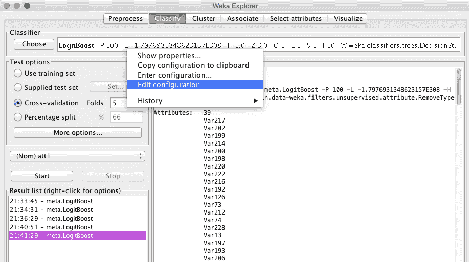
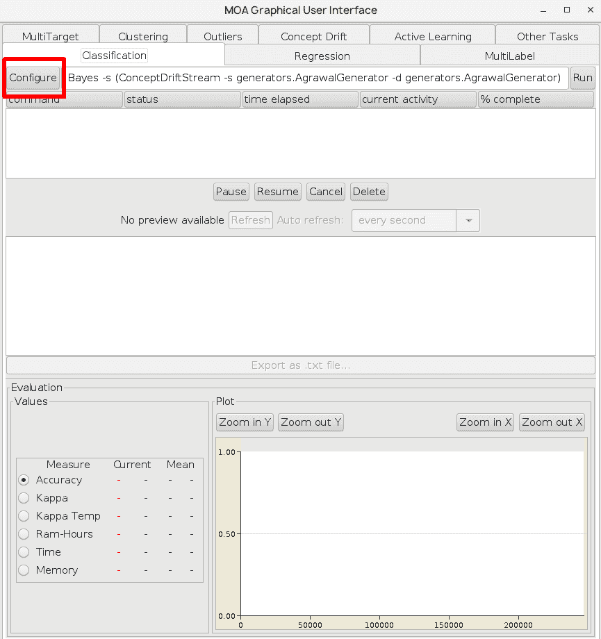
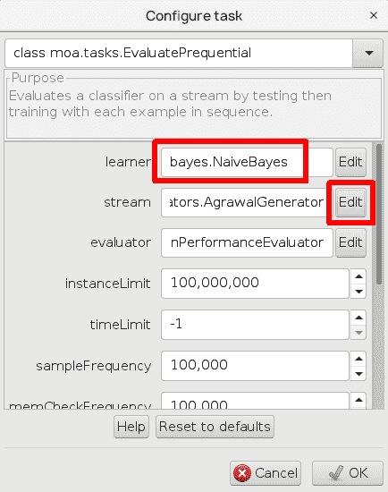
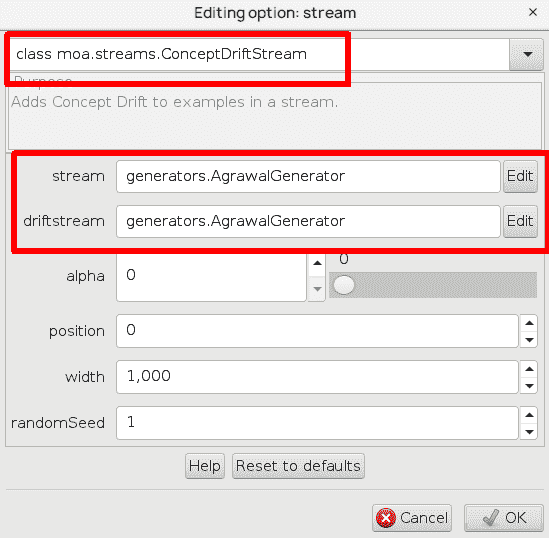
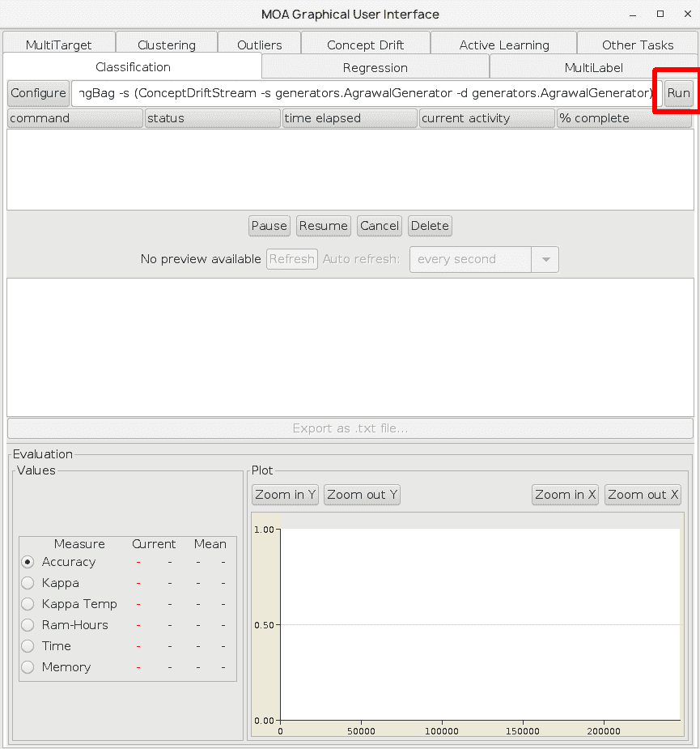
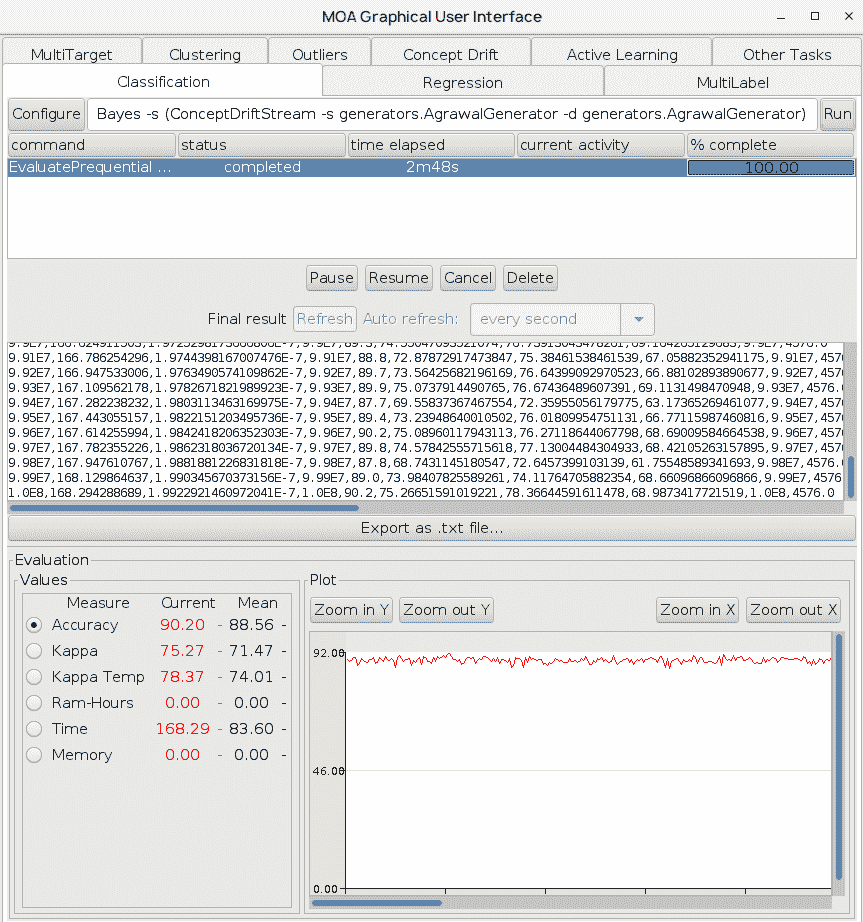
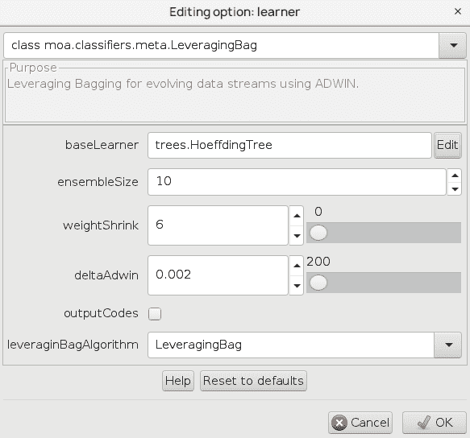
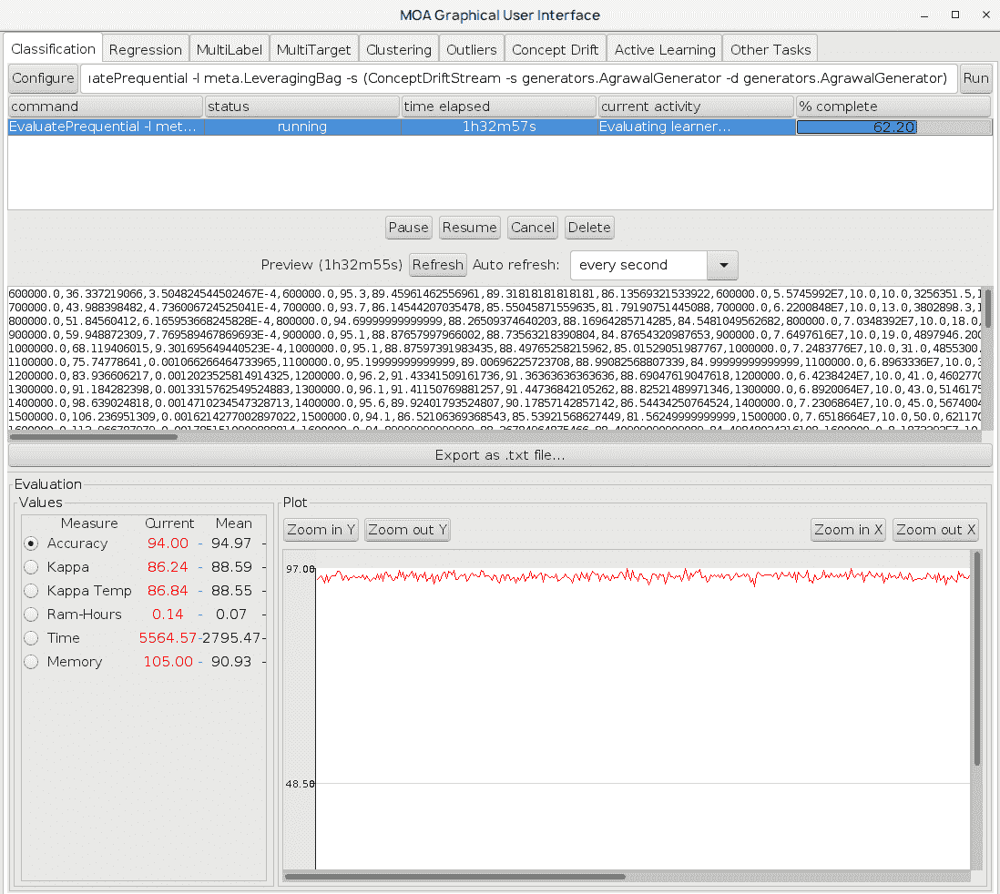

# 使用集成进行客户关系预测

任何提供服务、产品或体验的公司都需要对其与客户的关系有一个稳固的理解；因此，**客户关系管理**（CRM）是现代营销策略的关键要素。企业面临的最大挑战之一是了解确切是什么原因导致客户购买新产品。

在本章中，我们将使用法国电信公司 Orange 提供的真实世界营销数据库。任务将是估计以下客户行为的可能性：

+   转换供应商（流失）

+   购买新产品或服务（需求）

+   向他们推荐升级或附加产品以使销售更有利可图（升级销售）

我们将解决 2009 年 KDD 杯挑战，并展示使用 Weka 处理数据的步骤。首先，我们将解析和加载数据并实现基本基线模型。随后，我们将处理高级建模技术，包括数据预处理、属性选择、模型选择和评估。

KDD 杯是全球领先的数据挖掘竞赛。它由 ACM**知识发现与数据挖掘特别兴趣小组**每年组织。获胜者通常在 8 月份举行的**知识发现与数据挖掘会议**上宣布。包括所有对应数据集的年度存档可在[`www.kdd.org/kdd-cup`](http://www.kdd.org/kdd-cup)找到。

# 客户关系数据库

建立关于客户行为知识的最实用方式是产生解释目标变量（如流失、需求或升级销售）的分数。该分数是通过使用描述客户的输入变量（例如，他们的当前订阅、购买的设备、消耗的分钟数等）的模型计算得出的。然后，这些分数被信息系统用于提供相关个性化营销行动等活动。

客户是大多数基于客户的关系数据库中的主要实体；了解客户的行为很重要。客户的行为会在流失、需求或升级销售方面产生一个分数。基本思想是使用计算模型产生一个分数，该模型可能使用不同的参数，例如客户的当前订阅、购买的设备、消耗的分钟数等。一旦分数形成，它就会被信息系统用来决定针对客户行为的下一个策略，该策略特别设计用于客户。

2009 年，KDD 会议组织了一次关于客户关系预测的机器学习挑战。

# 挑战

给定一组大量的客户属性，挑战中的任务是估计以下目标变量：

+   **客户流失概率**：这是客户更换提供商的可能性。客户流失率也被称为流失率或参与者周转率，是用于计算在给定时间段内进入或离开给定集合的个人、对象、术语或项目数量的度量。这个术语在以客户驱动和基于订阅者模型的行业中广泛使用；例如，手机行业和有线电视运营商。

+   **购买意愿概率**：这是购买服务或产品的倾向性。

+   **升级销售概率**：这是客户购买附加产品或升级的可能性。升级销售意味着在客户已经使用的产品之外销售其他产品。可以将其视为大多数手机运营商提供的有增值服务。销售人员使用销售技巧试图让客户选择增值服务，这将带来更多收入。很多时候，客户并不了解其他选项，销售人员会说服他们使用或考虑这些选项。

挑战的目标是击败 Orange Labs 开发的内部系统。这是参与者证明他们能够处理大型数据库的机会，包括异构、噪声数据和不平衡的类别分布。

# 数据集

对于这个挑战，Orange 发布了一个包含大约一百万客户的大型客户数据集，这些数据被描述在十个表格中，每个表格包含数百个字段。在第一步中，他们重新采样数据以选择一个更平衡的子集，包含 10 万名客户。在第二步中，他们使用了一个自动特征构建工具，生成了描述客户的 20,000 个特征，然后缩减到 15,000 个特征。在第三步中，通过随机化特征顺序、丢弃属性名称、用随机生成的字符串替换名义变量以及将连续属性乘以随机因子来匿名化数据集。最后，所有实例都被随机分成训练集和测试集。

KDD 杯提供了两组数据，一组是大数据集，另一组是小数据集，分别对应快速和慢速挑战。训练集和测试集都包含 50,000 个示例，数据分割方式相似，但每个集合的样本顺序不同。

在本章中，我们将使用包含 50,000 个实例的小型数据集，每个实例由 230 个变量描述。这 50,000 行数据对应于一个客户，并且它们与三个二进制结果相关联，每个结果对应于三个挑战（升级销售、客户流失和购买意愿）。

为了使这一点更清晰，以下表格展示了数据集：


表格展示了前 25 个实例，即客户，每个客户都描述了 250 个属性。在这个例子中，只展示了 10 个属性的子集。数据集包含许多缺失值，甚至有空值或常量属性。表格的最后三列对应于三个不同的类别标签，涉及地面真相，即客户是否真的更换了服务提供商（客户流失），购买了服务（需求），或购买了升级（升级销售）。然而，请注意，标签是分别从三个不同的文件中提供的，因此保留实例和相应类别标签的顺序对于确保适当的对应关系至关重要。

# 评估

提交是根据三个任务（客户流失、需求和升级销售）的 ROC 曲线下面积（AUC）的算术平均值进行评估的。ROC 曲线显示了模型性能，是通过绘制用于确定分类结果的阈值的各种敏感度对特异性进行绘图得到的曲线（参见第一章，*应用机器学习快速入门*，*ROC 曲线*部分）。现在，**ROC 曲线下的面积**（AUC）与该曲线下的面积相关——面积越大，分类器越好。大多数工具箱，包括 Weka，都提供了一个 API 来计算 AUC 得分。

# 基本朴素贝叶斯分类器基线

根据挑战赛的规则，参与者必须超越基本的朴素贝叶斯分类器才能有资格获奖，这假设特征是独立的（参见第一章，*应用机器学习快速入门*）。

KDD Cup 组织者运行了基本的朴素贝叶斯分类器，没有进行任何特征选择或超参数调整。对于大数据集，朴素贝叶斯在测试集上的总体分数如下：

+   **客户流失问题**: AUC = 0.6468

+   **需求问题**: AUC = 0.6453

+   **升级销售问题**: AUC=0.7211

注意，基线结果仅报告了大数据集。此外，虽然训练集和测试集都提供在 KDD Cup 网站上，但测试集的实际真实标签并未提供。因此，当我们用我们的模型处理数据时，我们无法知道模型在测试集上的表现如何。我们将只使用训练数据，并通过交叉验证评估我们的模型。结果将不可直接比较，但无论如何，我们将对 AUC 得分的合理幅度有一个概念。

# 获取数据

在 KDD Cup 网页([`kdd.org/kdd-cup/view/kdd-cup-2009/Data`](http://kdd.org/kdd-cup/view/kdd-cup-2009/Data))上，你应该会看到一个类似于以下截图的页面。首先，在“Small 版本（230 变量）”标题下，下载`orange_small_train.data.zip`。接下来，下载与该训练数据相关的三组真实标签。以下文件位于“真实二进制目标（小型）”标题下：

+   `orange_small_train_appentency.labels`

+   `orange_small_train_churn.labels`

+   `orange_small_train_upselling.labels`

保存并解压截图中的红色框内标记的所有文件：


在接下来的章节中，首先，我们将加载数据到 Weka 中，并使用朴素贝叶斯分类器进行基本建模，以获得我们自己的基线 AUC 分数。稍后，我们将探讨更高级的建模技术和技巧。

# 加载数据

我们将直接从`.csv`格式将数据加载到 Weka 中。为此，我们将编写一个函数，该函数接受数据文件路径和真实标签文件路径。该函数将加载和合并两个数据集，并删除空属性。我们将从以下代码块开始：

```py
public static Instances loadData(String pathData, String 
  pathLabeles) throws Exception { 
```

首先，我们使用`CSVLoader()`类加载数据。此外，我们指定`\t`制表符作为字段分隔符，并强制将最后 40 个属性解析为名义属性：

```py
// Load data 
CSVLoader loader = new CSVLoader(); 
loader.setFieldSeparator("\t"); 
loader.setNominalAttributes("191-last"); 
loader.setSource(new File(pathData)); 
Instances data = loader.getDataSet(); 
```

`CSVLoader`类接受许多其他参数，指定列分隔符、字符串定界符、是否存在标题行等。完整的文档可在[`weka.sourceforge.net/doc.dev/weka/core/converters/CSVLoader.html`](http://weka.sourceforge.net/doc.dev/weka/core/converters/CSVLoader.html)找到。

一些属性不包含单个值，Weka 会自动将它们识别为`String`属性。实际上我们不需要它们，因此我们可以安全地使用`RemoveType`过滤器删除它们。此外，我们指定了`-T`参数，该参数删除特定类型的属性并指定我们想要删除的属性类型：

```py
// remove empty attributes identified as String attribute  
RemoveType removeString = new RemoveType(); 
removeString.setOptions(new String[]{"-T", "string"}); 
removeString.setInputFormat(data); 
Instances filteredData = Filter.useFilter(data, removeString); 
```

或者，我们也可以使用`Instances`类中实现的`void deleteStringAttributes()`方法，它具有相同的效果；例如，`data.removeStringAttributes()`。

现在，我们将加载数据并分配类标签。我们将再次使用`CVSLoader`，其中我们指定文件没有标题行，即`setNoHeaderRowPresent(true)`：

```py
// Load labeles 
loader = new CSVLoader(); 
loader.setFieldSeparator("\t"); 
loader.setNoHeaderRowPresent(true); 
loader.setNominalAttributes("first-last"); 
loader.setSource(new File(pathLabeles)); 
Instances labels = loader.getDataSet(); 
```

加载完两个文件后，我们可以通过调用`Instances.mergeInstances (Instances, Instances)`静态方法将它们合并在一起。该方法返回一个新的数据集，它包含第一个数据集的所有属性，以及第二个集合的属性。请注意，两个数据集中的实例数量必须相同：

```py
// Append label as class value 
Instances labeledData = Instances.mergeInstances(filteredData, 
   labeles); 
```

最后，我们将最后一个属性，即我们刚刚添加的标签属性，设置为目标变量，并返回结果数据集：

```py
// set the label attribute as class  
labeledData.setClassIndex(labeledData.numAttributes() - 1); 

System.out.println(labeledData.toSummaryString()); 
return labeledData; 
} 
```

函数提供输出摘要，如下面的代码块所示，并返回标记的数据集：

```py
    Relation Name:  orange_small_train.data-weka.filters.unsupervised.attribute.RemoveType-Tstring_orange_small_train_churn.labels.txt
    Num Instances:  50000
    Num Attributes: 215

    Name          Type  Nom  Int Real     Missing      Unique  Dist
    1 Var1        Num   0%   1%   0% 49298 / 99%     8 /  0%    18 
    2 Var2        Num   0%   2%   0% 48759 / 98%     1 /  0%     2 
    3 Var3        Num   0%   2%   0% 48760 / 98%   104 /  0%   146 
    4 Var4        Num   0%   3%   0% 48421 / 97%     1 /  0%     4
    ...

```

# 基本建模

在本节中，我们将按照 KDD Cup 组织者采取的方法实现我们自己的基线模型。然而，在我们到达模型之前，让我们首先实现评估引擎，该引擎将返回所有三个问题的 AUC。

# 评估模型

现在，让我们更仔细地看看评估函数。评估函数接受一个初始化的模型，在所有三个问题上对模型进行交叉验证，并报告结果为 ROC 曲线下的面积（AUC），如下所示：

```py
public static double[] evaluate(Classifier model) 
   throws Exception { 

  double results[] = new double[4]; 

  String[] labelFiles = new String[]{ 
    "churn", "appetency", "upselling"}; 

  double overallScore = 0.0; 
  for (int i = 0; i < labelFiles.length; i++) { 
```

首先，我们调用我们之前实现的`Instance loadData(String, String)`函数来加载数据并与其选定的标签合并：

```py
    // Load data 
    Instances train_data = loadData( 
     path + "orange_small_train.data", 
      path+"orange_small_train_"+labelFiles[i]+".labels.txt"); 
```

接下来，我们初始化`weka.classifiers.Evaluation`类并传递我们的数据集。（数据集仅用于提取数据属性；实际数据不考虑。）我们调用`void crossValidateModel(Classifier, Instances, int, Random)`方法开始交叉验证，并创建五个折。由于验证是在数据的随机子集中进行的，我们需要传递一个随机种子：

```py
    // cross-validate the data 
    Evaluation eval = new Evaluation(train_data); 
    eval.crossValidateModel(model, train_data, 5,  
    new Random(1)); 
```

评估完成后，我们通过调用`double areUnderROC(int)`方法读取结果。由于该指标依赖于我们感兴趣的靶值，该方法期望一个类别值索引，可以通过在类别属性中搜索`"1"`值的索引来提取，如下所示：

```py
    // Save results 
    results[i] = eval.areaUnderROC( 
      train_data.classAttribute().indexOfValue("1")); 
    overallScore += results[i]; 
  } 
```

最后，结果被平均并返回：

```py
  // Get average results over all three problems 
  results[3] = overallScore / 3; 
  return results; 
}
```

# 实现朴素贝叶斯基线

现在，当我们有了所有这些原料时，我们可以复制我们期望超越的朴素贝叶斯方法。这种方法将不包括任何额外的数据预处理、属性选择或模型选择。由于我们没有测试数据的真实标签，我们将应用五折交叉验证来评估模型在小数据集上的性能。

首先，我们初始化一个朴素贝叶斯分类器，如下所示：

```py
Classifier baselineNB = new NaiveBayes(); 
```

接下来，我们将分类器传递给我们的评估函数，该函数加载数据并应用交叉验证。该函数返回所有三个问题的 ROC 曲线下的面积分数和总体结果：

```py
double resNB[] = evaluate(baselineNB); 
System.out.println("Naive Bayes\n" +  
"\tchurn:     " + resNB[0] + "\n" +  
"\tappetency: " + resNB[1] + "\n" +  
"\tup-sell:   " + resNB[2] + "\n" +  
"\toverall:   " + resNB[3] + "\n"); 
```

在我们的情况下，模型返回以下结果：

```py
    Naive Bayes
      churn:     0.5897891153549814
      appetency: 0.630778394752436
      up-sell:   0.6686116692438094
      overall:   0.6297263931170756

```

这些结果将作为我们处理更高级建模挑战时的基线。如果我们使用显著更复杂、耗时和复杂的技术处理数据，我们期望结果会更好。否则，我们只是在浪费资源。一般来说，在解决机器学习问题时，创建一个简单的基线分类器作为我们的定位点是件好事。

# 使用集成进行高级建模

在上一节中，我们实现了一个定位基线；现在，让我们专注于重型机械。我们将遵循 KDD Cup 2009 获奖解决方案的方法，该方案由 IBM 研究团队（Niculescu-Mizil 等人）开发。

为了应对这一挑战，他们使用了集成选择算法（Caruana 和 Niculescu-Mizil，2004）。这是一种集成方法，意味着它构建了一系列模型，并以特定的方式组合它们的输出，以提供最终的分类。它具有几个理想的特性，使其非常适合这一挑战，如下所示：

+   这已被证明是稳健的，性能卓越。

+   它可以针对特定的性能指标进行优化，包括 AUC。

+   它允许向库中添加不同的分类器。

+   它是一种任何时间方法，这意味着如果我们用完时间，我们有一个可用的解决方案。

在本节中，我们将大致遵循他们在报告中描述的步骤。请注意，这并不是他们方法的精确实现，而是一个包括深入探索所需步骤的解决方案概述。

步骤的一般概述如下：

1.  首先，我们将通过移除明显不会带来任何价值的属性来预处理数据——例如，所有缺失或常量值；修复缺失值，以便帮助机器学习算法，因为它们无法处理这些值；以及将分类属性转换为数值属性。

1.  接下来，我们将运行属性选择算法，仅选择有助于预测任务的属性子集。

1.  在第三步，我们将使用各种模型实例化集成选择算法，最后我们将评估性能。

# 在开始之前

对于这个任务，我们需要一个额外的 Weka 包，`ensembleLibrary`。Weka 3.7.2 及以上版本支持外部包，主要由学术社区开发。Weka 包的列表可在[`weka.sourceforge.net/packageMetaData`](http://weka.sourceforge.net/packageMetaData)找到，如下截图所示：


在[`prdownloads.sourceforge.net/weka/ensembleLibrary1.0.5.zip?download`](http://prdownloads.sourceforge.net/weka/ensembleLibrary1.0.5.zip?download)找到并下载`ensembleLibrary`包的最新可用版本。

在解压包后，找到`ensembleLibrary.jar`并将其导入到您的代码中，如下所示：

```py
import weka.classifiers.meta.EnsembleSelection; 
```

# 数据预处理

首先，我们将利用 Weka 内置的`weka.filters.unsupervised.attribute.RemoveUseless`过滤器，它的工作方式正如其名称所暗示的那样。它移除变化不大的属性，例如，所有常量属性都被移除。最大方差（仅适用于名义属性）由`-M`参数指定。默认参数是 99%，这意味着如果所有实例中有超过 99%具有唯一的属性值，则该属性将被移除，如下所示：

```py
RemoveUseless removeUseless = new RemoveUseless(); 
removeUseless.setOptions(new String[] { "-M", "99" });// threshold 
removeUseless.setInputFormat(data); 
data = Filter.useFilter(data, removeUseless); 
```

接下来，我们将使用`weka.filters.unsupervised.attribute.ReplaceMissingValues`过滤器，将数据集中的所有缺失值替换为训练数据中的众数（名义属性）和均值（数值属性）。一般来说，在替换缺失值时应谨慎行事，同时考虑属性的意义和上下文：

```py
ReplaceMissingValues fixMissing = new ReplaceMissingValues(); 
fixMissing.setInputFormat(data); 
data = Filter.useFilter(data, fixMissing); 
```

最后，我们将使用`weka.filters.unsupervised.attribute.Discretize`过滤器对数值属性进行离散化，即通过该过滤器将数值属性转换为区间。使用`-B`选项，我们将数值属性分割成四个区间，而`-R`选项指定了属性的取值范围（只有数值属性将被离散化）：

```py
Discretize discretizeNumeric = new Discretize(); 
discretizeNumeric.setOptions(new String[] { 
    "-B",  "4",  // no of bins 
    "-R",  "first-last"}); //range of attributes 
fixMissing.setInputFormat(data); 
data = Filter.useFilter(data, fixMissing); 
```

# 属性选择

在下一步中，我们将仅选择具有信息量的属性，即更有可能帮助预测的属性。解决此问题的标准方法是检查每个属性携带的信息增益。我们将使用`weka.attributeSelection.AttributeSelection`过滤器，该过滤器需要两个额外的方法：一个评估器（如何计算属性的有用性）和搜索算法（如何选择属性子集）。

在我们的案例中，首先，我们初始化`weka.attributeSelection.InfoGainAttributeEval`，该类实现了信息增益的计算：

```py
InfoGainAttributeEval eval = new InfoGainAttributeEval(); 
Ranker search = new Ranker(); 
```

为了只选择高于阈值的顶级属性，我们初始化`weka.attributeSelection.Ranker`，以便根据信息增益对属性进行排序，信息增益高于特定阈值。我们使用`-T`参数指定此阈值，同时保持阈值较低，以保留至少包含一些信息的属性：

```py
search.setOptions(new String[] { "-T", "0.001" }); 
```

设置此阈值的通用规则是按信息增益对属性进行排序，并选择信息增益降至可忽略值时的阈值。

接下来，我们可以初始化`AttributeSelection`类，设置评估器和排序器，并将属性选择应用于我们的数据集，如下所示：

```py
AttributeSelection attSelect = new AttributeSelection(); 
attSelect.setEvaluator(eval); 
attSelect.setSearch(search); 

// apply attribute selection 
attSelect.SelectAttributes(data); 
```

最后，通过调用`reduceDimensionality(Instances)`方法，我们移除了上一次运行中未选择的属性：

```py
// remove the attributes not selected in the last run 
data = attSelect.reduceDimensionality(data); 
```

最终，我们保留了 230 个属性中的 214 个。

# 模型选择

多年来，机器学习领域的从业者已经开发了许多学习算法和现有算法的改进。有如此多的独特监督学习方法，以至于难以跟踪所有这些方法。由于数据集的特征各异，没有一种方法在所有情况下都是最好的，但不同的算法能够利用给定数据集的不同特征和关系。

首先，我们需要通过初始化`weka.classifiers.EnsembleLibrary`类来创建模型库，这将帮助我们定义模型：

```py
EnsembleLibrary ensembleLib = new EnsembleLibrary(); 
```

接下来，我们将模型及其参数作为字符串值添加到库中；例如，我们可以添加三个具有不同参数的决策树学习器，如下所示：

```py
ensembleLib.addModel("weka.classifiers.trees.J48 -S -C 0.25 -B -M 
   2"); 
ensembleLib.addModel("weka.classifiers.trees.J48 -S -C 0.25 -B -M 
   2 -A"); 
```

如果你熟悉 Weka 图形界面，你还可以在那里探索算法及其配置，并复制配置，如下面的截图所示。右键单击算法名称，导航到编辑配置 | 复制配置字符串：



为了完成这个示例，我们添加了以下算法及其参数：

+   作为默认基线使用的朴素贝叶斯：

```py
ensembleLib.addModel("weka.classifiers.bayes.NaiveBayes"); 
```

+   基于懒惰模型的 k 近邻算法：

```py
ensembleLib.addModel("weka.classifiers.lazy.IBk"); 
```

+   作为简单逻辑回归默认参数的逻辑回归：

```py
ensembleLib.addModel("weka.classifiers.functions.SimpleLogi
   stic"); 
```

+   默认参数的支持向量机：

```py
ensembleLib.addModel("weka.classifiers.functions.SMO"); 
```

+   本身就是集成方法的`AdaBoost`：

```py
ensembleLib.addModel("weka.classifiers.meta.AdaBoostM1"); 
```

+   基于逻辑回归的集成方法`LogitBoost`：

```py
ensembleLib.addModel("weka.classifiers.meta.LogitBoost"); 
```

+   基于单层决策树的集成方法`DecisionStump`：

```py
ensembleLib.addModel("classifiers.trees.DecisionStump"); 
```

由于`EnsembleLibrary`实现主要针对 GUI 和控制台用户，我们必须通过调用`saveLibrary(File, EnsembleLibrary, JComponent)`方法将模型保存到文件中，如下所示：

```py
EnsembleLibrary.saveLibrary(new 
   File(path+"ensembleLib.model.xml"), ensembleLib, null); 
System.out.println(ensembleLib.getModels()); 
```

接下来，我们可以通过实例化`weka.classifiers.meta.EnsembleSelection`类来初始化集成选择算法。首先，让我们回顾以下方法选项：

+   `-L </path/to/modelLibrary>`: 这指定了`modelLibrary`文件，继续列出所有模型。

+   `-W </path/to/working/directory>`: 这指定了工作目录，所有模型都将保存在这里。

+   `-B <numModelBags>`: 这设置了袋的数量，即运行集成选择算法的迭代次数。

+   `-E <modelRatio>`: 这设置了随机选择填充每个模型包的库模型的比例。

+   `-V <validationRatio>`: 这设置了保留用于验证的训练数据集的比例。

+   `-H <hillClimbIterations>`: 这设置了在每个模型包上要执行的爬山迭代次数。

+   `-I <sortInitialization>`: 这设置了排序初始化算法在初始化每个模型包时可以选择的集成库的比例。

+   `-X <numFolds>`: 这设置了交叉验证的折数。

+   `-P <hillclimbMetric>`: 这指定了在爬山算法中用于模型选择的度量标准。有效的度量包括准确率、rmse、roc、精确率、召回率、fscore 以及所有这些。

+   `-A <algorithm>`: 这指定了用于集成选择的算法。有效的算法包括 forward（默认）用于前向选择，backward 用于后向消除，both 用于前向和后向消除，best 用于简单地从集成库中打印出表现最好的模型，以及 library 仅训练集成库中的模型。

+   `-R`: 这标志是否可以将模型多次选入一个集成。

+   `-G`: 这表示排序初始化是否在性能下降时贪婪地停止添加模型。

+   `-O`: 这是一个用于详细输出的标志。这会打印出所有选定模型的性能。

+   `-S <num>`: 这是一个随机数种子（默认为`1`）。

+   `-D`: 如果设置，分类器将以调试模式运行，并且可能向控制台提供额外的输出信息。

我们使用以下初始参数初始化算法，其中我们指定优化 ROC 指标：

```py
EnsembleSelection ensambleSel = new EnsembleSelection(); 
ensambleSel.setOptions(new String[]{ 
  "-L", path+"ensembleLib.model.xml", // </path/to/modelLibrary>
     "-W", path+"esTmp", // </path/to/working/directory> -  
"-B", "10", // <numModelBags>  
  "-E", "1.0", // <modelRatio>. 
  "-V", "0.25", // <validationRatio> 
  "-H", "100", // <hillClimbIterations>  
"-I", "1.0", // <sortInitialization>  
  "-X", "2", // <numFolds> 
  "-P", "roc", // <hillclimbMettric> 
  "-A", "forward", // <algorithm>  
  "-R", "true", // - Flag to be selected more than once 
  "-G", "true", // - stops adding models when performance degrades 
  "-O", "true", // - verbose output. 
  "-S", "1", // <num> - Random number seed. 
  "-D", "true" // - run in debug mode  
}); 
```

# 性能评估

评估在计算和内存方面都很重，所以请确保你初始化 JVM 时带有额外的堆空间（例如，`java -Xmx16g`）。计算可能需要几个小时或几天，具体取决于你包含在模型库中的算法数量。这个例子在一个 12 核心的 Intel Xeon E5-2420 CPU 上，32 GB 的内存，平均使用了 10%的 CPU 和 6 GB 的内存，耗时 4 小时 22 分钟。

我们称我们的评估方法并提供结果作为输出，如下所示：

```py
double resES[] = evaluate(ensambleSel); 
System.out.println("Ensemble Selection\n"  
+ "\tchurn:     " + resES[0] + "\n" 
+ "\tappetency: " + resES[1] + "\n"  
+ "\tup-sell:   " + resES[2] + "\n"  
+ "\toverall:   " + resES[3] + "\n"); 
```

模型库中的特定分类器集达到了以下结果：

```py
    Ensamble
      churn:     0.7109874158176481
      appetency: 0.786325687118347
      up-sell:   0.8521363243575182
      overall:   0.7831498090978378

```

总体而言，这种方法使我们相比本章开头设计的初始基线有了超过 15 个百分点的显著改进。虽然很难给出一个明确的答案，但改进主要归因于三个因素：数据预处理和属性选择、探索大量不同的学习方法，以及使用一种能够利用多种基分类器而不过度拟合的集成构建技术。然而，这种改进需要显著增加处理时间以及工作内存。

# 集成方法 – MOA

如同其词意，集成就是一起查看，或者同时进行。它用于结合多个学习算法，以获得更好的结果和性能。你可以使用各种技术进行集成。一些常用的集成技术或分类器包括袋装、提升、堆叠、模型桶等。

**大规模在线分析**（**MOA**）支持集成分类器，如准确度加权的集成、准确度更新的集成等。在本节中，我们将向您展示如何使用利用袋装算法：

1.  打开终端并执行以下命令：

```py
java -cp moa.jar -javaagent:sizeofag-1.0.4.jar moa.gui.GUI
```

1.  选择分类标签并点击配置按钮：



这将打开配置任务选项。

1.  在学习器选项中，选择 bayes.NaiveBayes，然后，在流选项中，点击编辑，如图所示：



1.  选择 ConceptDriftStream，并在流和漂移流中，选择 AgrawalGenerator；它将使用 Agrawal 数据集作为流生成器：



1.  关闭所有窗口并点击运行按钮：



这将运行任务并生成以下输出：



1.  让我们使用 LeveragingBag 选项。为此，打开配置任务窗口，并在 baseLearner 中选择编辑选项，这将显示以下内容；从第一个下拉框中选择 LeveragingBag。你可以在第一个下拉框中找到其他选项，例如提升和平均权重集成：



将流设置为 AgrawalGenerator，如下截图所示：


1.  关闭配置任务窗口并点击运行按钮；这需要一些时间来完成：



输出显示了每 10,000 个实例后的评估，包括分类正确性所需的 RAM 时间以及 Kappa 统计。正如你所见，随着时间的推移，分类正确性随着实例数量的增加而提高。前一个截图中的图表显示了正确性和实例数量。

# 摘要

在本章中，我们解决了 2009 年 KDD 杯关于客户关系预测的挑战，实现了数据预处理步骤，并处理了缺失值和冗余属性。我们遵循了获胜的 KDD 杯解决方案，并研究了如何通过使用一系列学习算法来利用集成方法，这可以显著提高分类性能。

在下一章中，我们将解决另一个关于客户行为的问题：购买行为。你将学习如何使用检测频繁发生模式的算法。
