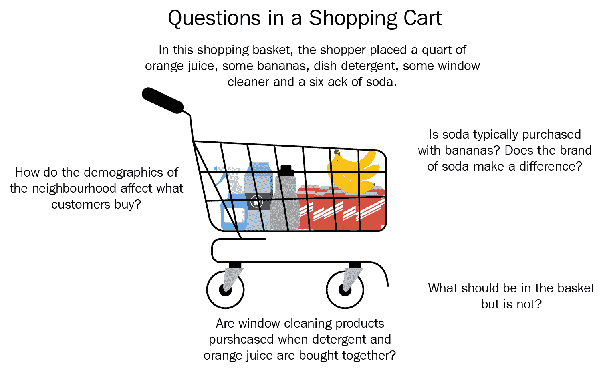
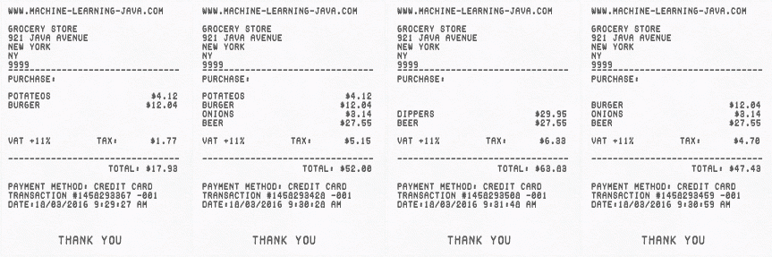
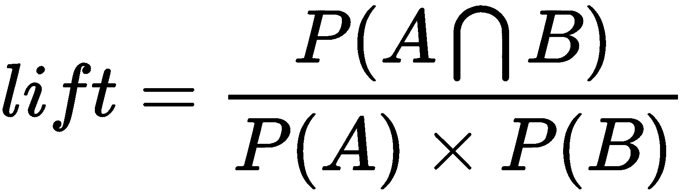
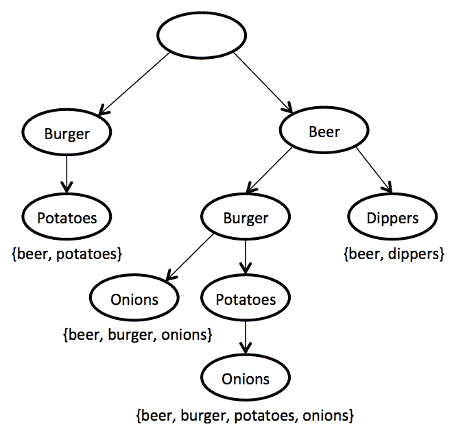
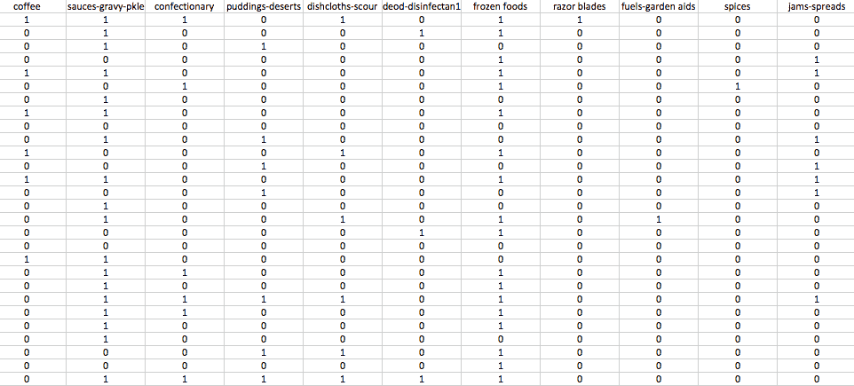

# 第五章：亲和度分析

亲和度分析是**市场篮分析**（**MBA**）的核心。它可以发现特定用户或群体执行的活动之间的共现关系。在零售领域，亲和度分析可以帮助你了解顾客的购买行为。这些见解可以通过智能交叉销售和升级销售策略来推动收入，并帮助你开发忠诚度计划、销售促销和折扣计划。

在本章中，我们将探讨以下主题：

+   MBA

+   关联规则学习

+   在各个领域的其他应用

首先，我们将复习核心的关联规则学习概念和算法，例如支持度和提升度的 Apriori 算法和 FP-Growth 算法。接下来，我们将使用 Weka 对超市数据集进行首次亲和度分析，并研究如何解释生成的规则。我们将通过分析关联规则学习在其他领域中的应用来结束本章，例如 IT 运营分析和医学。

# 购物篮分析

自电子销售点引入以来，零售商一直在收集大量数据。为了利用这些数据产生商业价值，他们首先开发了一种方法来整合和汇总数据，以了解业务的基本情况。

最近，焦点转向了粒度最低的市场篮交易。在这个细节级别，零售商可以直接看到在其商店购物的每个顾客的市场篮子，不仅了解该特定篮子中购买物品的数量，还了解这些物品是如何一起购买的。这可以用来做出如何区分商店商品组合和商品以及如何有效组合多个产品（在类别内和跨类别）的决策，以推动更高的销售额和利润。这些决策可以在整个零售链、通过渠道、在本地商店层面甚至针对特定顾客（通过所谓的个性化营销）实施，为每个顾客提供独特的产品：



MBA 涵盖了广泛的分析：

+   **物品亲和度**：这定义了两个（或更多）物品一起购买的可能性。

+   **驱动项识别**：这使能够识别推动人们到商店并始终需要保持库存的物品。

+   **行程分类**：这分析篮子内容，并将购物行程分类到某一类别：每周杂货之旅、特殊场合等。

+   **店铺间比较**：了解篮子数量可以使任何指标除以总篮子数，从而有效地创建一种方便且易于比较店铺不同特征（每客户的销售单位数、每笔交易的收入、每篮物品数量等）的方法。

+   **收入优化**：这有助于确定该商店的神奇价格点，增加购物篮的大小和价值。

+   **营销**：这有助于识别更有利可图的广告和促销活动，更精确地定位优惠以提高投资回报率，通过纵向分析生成更好的忠诚度卡促销活动，并吸引更多客流到商店。

+   **运营优化**：这有助于通过定制商店和商品组合以适应贸易区域人口统计，并优化商店布局，来匹配库存与需求。

预测模型帮助零售商将正确的优惠提供给正确的客户群体或个人资料，以及了解哪些优惠适用于哪些客户，预测客户对这一优惠的响应概率得分，并理解客户从接受优惠中获得的增值。

# 关联分析

**关联分析**用于确定一组商品同时被购买的可能性。在零售业中，存在自然的产品关联；例如，对于购买汉堡饼的人来说，购买汉堡包、番茄酱、芥末、番茄和其他构成汉堡体验的物品是非常典型的。

虽然有些产品关联可能看似微不足道，但也有一些关联并不十分明显。一个经典的例子是牙膏和金枪鱼。似乎吃金枪鱼的人更有可能在用餐后立即刷牙。那么，为什么零售商需要很好地掌握产品关联呢？这些信息对于适当规划促销活动至关重要，因为降低某些商品的价格可能会在不进一步推广这些相关商品的情况下，导致相关高关联商品的需求激增。

在下一节中，我们将探讨关联规则学习的算法：Apriori 和 FP-Growth。

# 关联规则学习

**关联规则学习**是发现大型数据库中项目之间有趣关系的一种流行方法。它最常应用于零售业，以揭示产品之间的规律性。

关联规则学习方法通过使用不同的有趣性度量标准，在数据库中寻找有趣且强大的规则模式。例如，以下规则表明，如果一个顾客同时购买洋葱和土豆，他们很可能也会购买汉堡肉：{洋葱，土豆} -> {汉堡}。

另一个可能在每个机器学习课程中都会讲述的经典故事可能是啤酒和尿布的故事。对超市购物者行为的分析显示，购买尿布的客户，可能是年轻男性，也倾向于购买啤酒。这立即成为了一个流行的例子，说明了如何从日常数据中发现意外的关联规则；然而，关于这个故事的真实性存在不同的观点。在《DSS 新闻 2002》中，Daniel Power 说：

"在 1992 年，托马斯·布利斯克，特达数据零售咨询集团的管理员及其团队，对大约 25 家奥斯科药店的 120 万份购物篮进行了分析。开发了数据库查询以识别亲和力。分析确实发现，在下午 5:00 到 7:00 之间，消费者购买啤酒和尿布。奥斯科的管理者没有通过将产品在货架上放得更近来利用啤酒和尿布之间的关系。"

除了前面 MBA 的例子之外，关联规则今天被应用于许多应用领域，包括网络使用挖掘、入侵检测、连续生产和生物信息学。我们将在本章后面更详细地探讨这些领域。

# 基本概念

在我们深入算法之前，让我们首先回顾基本概念。

# 交易数据库

在关联规则挖掘中，数据集的结构与第一章中介绍的方法略有不同。首先，没有类值，因为学习关联规则不需要类值。接下来，数据集以事务表的形式呈现，其中每个超市商品对应一个二元属性。因此，特征向量可能非常大。

考虑以下示例。假设我们拥有以下四个收据，如后文所示。每个收据对应一笔购买交易：



为了将这些收据以事务数据库的形式编写，我们首先确定收据中出现的所有可能的项目。这些项目是**洋葱**、**土豆**、**汉堡**、**啤酒**和**薯条**。每一笔购买，即交易，都在一行中呈现，如果交易中购买了项目，则为*1*，否则为*0*，如下表所示：

| **交易 ID** | **洋葱** | **土豆** | **汉堡** | **啤酒** | **薯条** |
| --- | --- | --- | --- | --- | --- |
| 1 | 0 | 1 | 1 | 0 | 0 |
| 2 | 1 | 1 | 1 | 1 | 0 |
| 3 | 0 | 0 | 0 | 1 | 1 |
| 4 | 1 | 0 | 1 | 1 | 0 |

这个例子实际上很小。在实际应用中，数据集通常包含成千上万甚至数百万笔交易，这允许学习算法发现具有统计意义的模式。

# 项集和规则

**项集**简单地说是一组项目，例如，{洋葱，土豆，汉堡}。一个规则由两个项集 X 和 Y 组成，以下格式：

X -> Y

这表示一个模式，即当观察到 X 项集时，也会观察到 Y。为了选择有趣的规则，可以使用各种显著性度量。

# 支持度

对于项集的支持度定义为包含该项集的交易比例。在先前的表中，`{土豆，汉堡}`项集具有以下支持度，因为它出现在 50%的交易中（四笔交易中的两笔）：supp({土豆，汉堡}) = 2/4 = 0.5。

直观上看，它表示支持该模式的交易份额。

# 提升度

升值是一个衡量目标模型（关联规则）在预测或分类案例为具有增强响应（相对于整体人口）时的性能的指标，与随机选择的目标模型相比。它使用以下公式定义：



# 置信度

规则的置信度表示其准确性。它使用以下公式定义：


例如，{onions, burger} -> {beer}规则在先前的表中具有置信度*0.5/0.5 = 1.0*，这意味着当洋葱和汉堡一起购买时，100%的时间也会购买啤酒。

# Apriori 算法

**Apriori 算法**是一种经典算法，用于在事务上进行频繁模式挖掘和关联规则学习。通过识别数据库中的频繁单个项目并将它们扩展到更大的项目集，Apriori 可以确定关联规则，这些规则突出了数据库的一般趋势。

Apriori 算法构建一组项目集，例如，itemset1= {Item A, Item B}，并计算支持，即数据库中出现的次数。然后 Apriori 使用自下而上的方法，其中频繁项目集逐个扩展，它通过首先查看较小的集合并认识到一个大的集合不能是频繁的，除非它的所有子集都是频繁的，来消除最大的集合作为候选者。当找不到进一步的扩展时，算法终止。

尽管 Apriori 算法是机器学习中的一个重要里程碑，但它存在许多低效性和权衡。在下一节中，我们将探讨更近期的 FP-Growth 技术。

# FP-Growth 算法

**FP-Growth**（其中 FP 是频繁模式）将事务数据库表示为后缀树。首先，算法统计数据集中项目的出现次数。在第二次遍历中，它构建一个后缀树，这是一种有序的树形数据结构，通常用于存储字符串。以下是根据前一个示例的后缀树示例图：



如果许多事务共享最频繁的项目，后缀树在树根附近提供接近高压缩。直接生长大项目集，而不是生成候选项目并对其与整个数据库进行测试。生长从树的底部开始，通过找到所有匹配最小支持和置信度的项目集。一旦递归过程完成，所有具有最小覆盖范围的大项目集都已找到，并开始创建关联规则。

FP-Growth 算法具有几个优点。首先，它构建了一个 FP 树，以大量紧凑的表示编码原始数据集。其次，它利用 FP 树结构和分而治之策略有效地构建频繁项目集。

# 超市数据集

位于`data/supermarket.arff`的超市数据集描述了超市顾客的购物习惯。大多数属性代表特定的商品组，例如，乳制品、牛肉和土豆；或者代表一个部门，例如，部门 79、部门 81 等。以下表格显示了数据库的摘录，其中值为`t`表示顾客购买了该商品，否则为空。每个顾客有一个实例。该数据集不包含类属性，因为学习关联规则不需要它。以下表格显示了数据的一个样本：



# 发现模式

为了发现购物模式，我们将使用之前已经研究过的两种算法：Apriori 和 FP-Growth。

# Apriori

我们将使用 Weka 中实现的`Apriori`算法。该算法迭代地减少最小支持度，直到找到给定最小置信度的所需规则数量。我们将使用以下步骤实现该算法：

1.  我们将使用以下代码行导入所需的库：

```py
import java.io.BufferedReader; 
import java.io.FileReader; 
import weka.core.Instances; 
import weka.associations.Apriori; 
```

1.  首先，我们将加载`supermarket.arff`数据集：

```py
Instances data = new Instances(new BufferedReader(new FileReader("data/supermarket.arff"))); 
```

1.  我们将初始化一个`Apriori`实例，并调用`buildAssociations(Instances)`函数来开始频繁模式挖掘，如下所示：

```py
Apriori model = new Apriori(); 
model.buildAssociations(data); 
```

1.  我们可以输出发现的项集和规则，如下所示：

```py
System.out.println(model); 
```

输出如下：

```py
   Apriori
    =======

    Minimum support: 0.15 (694 instances)
    Minimum metric <confidence>: 0.9
    Number of cycles performed: 17

    Generated sets of large itemsets:
    Size of set of large itemsets L(1): 44
    Size of set of large itemsets L(2): 380
    Size of set of large itemsets L(3): 910
    Size of set of large itemsets L(4): 633
    Size of set of large itemsets L(5): 105
    Size of set of large itemsets L(6): 1

    Best rules found:

     1\. biscuits=t frozen foods=t fruit=t total=high 788 ==> bread and cake=t 723    <conf:(0.92)> lift:(1.27) lev:(0.03) [155] conv:(3.35)
     2\. baking needs=t biscuits=t fruit=t total=high 760 ==> bread and cake=t 696    <conf:(0.92)> lift:(1.27) lev:(0.03) [149] conv:(3.28)
     3\. baking needs=t frozen foods=t fruit=t total=high 770 ==> bread and cake=t 705    <conf:(0.92)> lift:(1.27) lev:(0.03) [150] conv:(3.27)
    ...

```

该算法根据置信度输出了十个最佳规则。让我们看看第一条规则并解释输出，如下所示：

```py
biscuits=t frozen foods=t fruit=t total=high 788 ==> bread and cake=t 723    <conf:(0.92)> lift:(1.27) lev:(0.03) [155] conv:(3.35)

```

它表示，当`饼干`、`冷冻食品`和`水果`一起购买且总购买价格较高时，也很可能还会购买`面包`和`蛋糕`。 `{饼干, 冷冻食品, 水果, 总价高}`项集出现在`788`笔交易中，而`{面包, 蛋糕}`项集出现在`723`笔交易中。该规则的置信度为`0.92`，意味着在存在`{饼干, 冷冻食品, 水果, 总价高}`项集的 92%的交易中，该规则是成立的。

输出还报告了额外的度量，如提升度、杠杆和确信度，这些度量估计了与我们的初始假设的准确性；例如，`3.35`确信度值表示，如果关联纯粹是随机机会，该规则将错误`3.35`次。提升度衡量 X 和 Y 在一起出现的次数与它们如果统计独立时预期的次数之比（提升度=1）。X -> Y 规则中的`2.16`提升度表示 X 的概率是 Y 概率的`2.16`倍。

# FP-Growth

现在，让我们尝试使用更高效的 FP-Growth 算法来获得相同的结果。

FP-Growth 也实现于`weka.associations`包中：

```py
import weka.associations.FPGrowth; 
```

FP-Growth 算法的初始化方式与之前我们所做的一样：

```py
FPGrowth fpgModel = new FPGrowth(); 
fpgModel.buildAssociations(data); 
System.out.println(fpgModel); 
```

输出揭示 FP-Growth 发现了`16 条规则`：

```py
    FPGrowth found 16 rules (displaying top 10)

    1\. [fruit=t, frozen foods=t, biscuits=t, total=high]: 788 ==> [bread and cake=t]: 723   <conf:(0.92)> lift:(1.27) lev:(0.03) conv:(3.35) 
    2\. [fruit=t, baking needs=t, biscuits=t, total=high]: 760 ==> [bread and cake=t]: 696   <conf:(0.92)> lift:(1.27) lev:(0.03) conv:(3.28) 
    ...

```

我们可以观察到，FP-Growth 找到了与 Apriori 相同的规则集；然而，处理大型数据集所需的时间可以显著缩短。

# 其他领域的应用

我们研究了亲和力分析，以揭示超市中的购物行为模式。尽管关联规则学习的根源在于分析销售点交易，但它们可以应用于零售业以外的领域，以找到其他类型篮子之间的关系。篮子的概念可以很容易地扩展到服务和产品，例如，分析使用信用卡购买的项目，如租车和酒店房间，以及分析电信客户购买的价值增加服务的信息（呼叫等待、呼叫转接、DSL、快速呼叫等），这可以帮助运营商确定改进服务套餐捆绑的方式。

此外，我们还将探讨以下潜在的跨行业应用示例：

+   医疗诊断

+   蛋白质序列

+   人口普查数据

+   客户关系管理

+   IT 运营分析

# 医疗诊断

在医疗诊断中应用关联规则可以帮助医生在治疗患者时。可靠诊断规则归纳的一般问题很困难，因为理论上，没有任何归纳过程可以保证自身归纳出的假设的正确性。实际上，诊断不是一个容易的过程，因为它涉及到不可靠的诊断测试和训练示例中的噪声。

尽管如此，关联规则可以用来识别可能同时出现的症状。在这种情况下，事务对应于一个医疗案例，而症状对应于项目。当患者接受治疗时，记录的症状列表作为一个事务。

# 蛋白质序列

在理解蛋白质的组成和性质方面已经进行了大量的研究；然而，还有很多事情需要充分理解。现在普遍认为，蛋白质的氨基酸序列不是随机的。

通过关联规则，可以识别蛋白质中存在的不同氨基酸之间的关联。蛋白质是由 20 种氨基酸组成的序列。每种蛋白质都有其独特的三维结构，这取决于氨基酸序列；序列的微小变化可能会改变蛋白质的功能。要应用关联规则，蛋白质对应于一个事务，而氨基酸及其结构对应于项目。

这类关联规则对于增强我们对蛋白质组成的理解是有益的，并且有可能为蛋白质中某些特定氨基酸集合的全球相互作用提供线索。了解这些关联规则或约束对于人工蛋白质的合成是非常有价值的。

# 人口普查数据

人口普查为研究人员和公众提供了关于社会的各种统计信息。与人口和经济普查相关的信息可以用于规划公共服务（教育、卫生、交通和资金）以及商业（建立新工厂、购物中心或银行，甚至营销特定产品）的预测。

为了发现频繁模式，每个统计区域（例如，市镇、城市和社区）对应一个事务，收集的指标对应于项目。

# 客户关系管理

**客户关系管理**（CRM），正如我们在前几章中简要讨论的，是数据丰富的来源，通过这些数据，公司希望识别不同客户群体、产品和服务的偏好，以便增强其产品和服务与客户之间的凝聚力。

关联规则可以加强知识管理过程，并使市场营销人员更好地了解客户，以提供更优质的服务。例如，关联规则可以应用于检测从客户档案和销售数据中不同时间快照的客户行为变化。基本思想是从两个数据集中发现变化，并从每个数据集中生成规则以执行规则匹配。

# IT 运营分析

基于大量交易记录，关联规则学习非常适合应用于日常 IT 运营中常规收集的数据，使 IT 运营分析工具能够检测频繁模式并识别关键变化。IT 专家需要看到大局，例如，了解数据库上的问题如何影响应用服务器。

对于特定的一天，IT 运营可能会接收各种警报，并在事务数据库中展示它们。使用关联规则学习算法，IT 运营分析工具可以关联并检测同时出现的警报的频繁模式。这可以更好地理解一个组件如何影响另一个组件。

通过识别出的警报模式，可以应用预测分析。例如，一个特定的数据库服务器托管一个网络应用程序，突然触发了关于数据库的警报。通过分析关联规则学习算法识别出的频繁模式，这意味着 IT 人员需要在网络应用程序受到影响之前采取行动。

关联规则学习还可以发现源自同一 IT 事件的警报事件。例如，每次添加新用户时，都会检测到 Windows 操作系统的六个变化。接下来，在**应用组合管理**（**APM**）中，IT 可能会面临多个警报，显示数据库中的事务时间过高。如果所有这些问题都源自同一来源（例如，收到数百个关于更改的警报，所有这些更改都归因于 Windows 更新），这种频繁模式挖掘可以帮助快速筛选出多个警报，使 IT 操作员能够专注于真正关键的变化。

# 摘要

在本章中，你学习了如何利用关联规则学习在事务数据集中获取关于频繁模式的洞察。我们在 Weka 中进行了亲和力分析，并了解到努力的工作在于结果分析——在解释规则时需要仔细注意，因为关联（即相关性）并不等同于因果关系。

在下一章中，我们将探讨如何使用可扩展的机器学习库 Apache Mahout 将商品推荐问题提升到下一个层次，它能够处理大数据。
