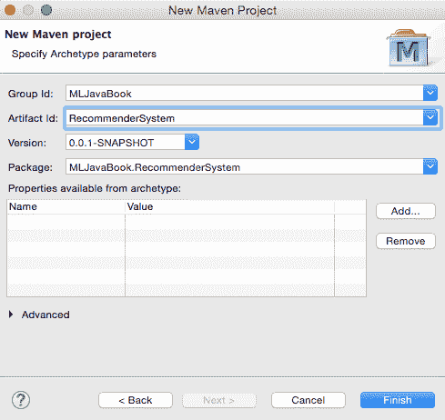
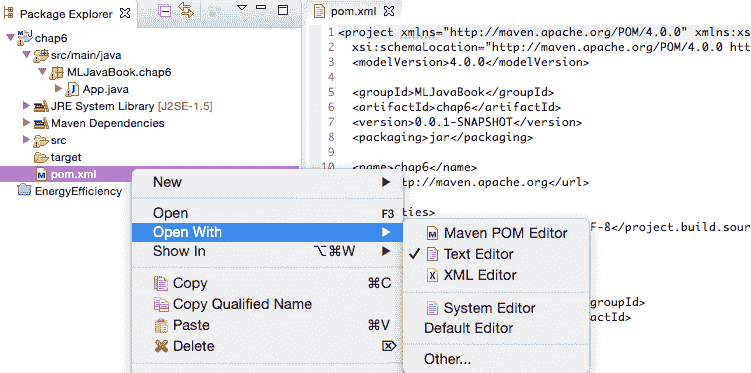
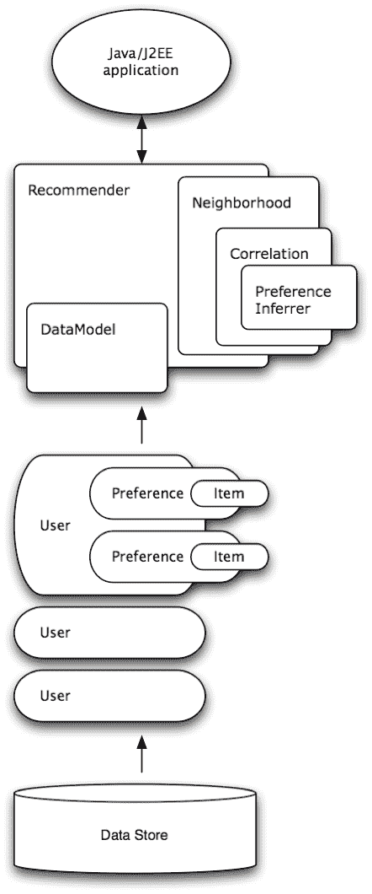

# 使用 Apache Mahout 的推荐引擎

推荐引擎是目前初创公司中最常用的数据科学方法之一。构建推荐系统有两种主要技术：基于内容的过滤和协同过滤。基于内容的算法使用项目的属性来找到具有相似属性的项目。协同过滤算法使用用户评分或其他用户行为，并根据具有相似行为的用户喜欢或购买的项目来做出推荐。

在本章中，我们首先将解释理解推荐引擎原理所需的基本概念，然后我们将展示如何利用 Apache Mahout 实现的各种算法来快速构建可扩展的推荐引擎。

本章将涵盖以下主题：

+   如何构建推荐引擎

+   准备 Apache Mahout

+   基于内容的推荐方法

+   协同过滤方法

到本章结束时，你将了解适合我们问题的推荐引擎类型以及如何快速实现该引擎。

# 基本概念

推荐引擎的目标是向用户展示感兴趣的项目。它们与搜索引擎的不同之处在于，相关内容通常在网站上出现，而无需用户请求，用户也不需要构建查询，因为推荐引擎会观察用户的行为并在用户不知情的情况下为用户构建查询。

毫无疑问，最著名的推荐引擎例子是[www.amazon.com](http://www.amazon.com)，它以多种方式提供个性化推荐。以下截图显示了“购买此商品的用户也购买了”的示例。正如你稍后将会看到的，这是一个基于项目的协同过滤推荐的例子，其中推荐了与特定项目相似的项目：


在本节中，我们将介绍与理解构建推荐引擎相关的关键概念。

# 关键概念

推荐引擎需要以下输入来做出推荐：

+   项目信息，用属性描述

+   用户资料，例如年龄范围、性别、位置、朋友等

+   用户交互，包括评分、浏览、标记、比较、保存和电子邮件

+   项目将显示的上下文；例如，项目的类别和项目的地理位置

这个输入随后会被推荐引擎结合使用，以帮助获取以下信息：

+   购买、观看、查看或收藏此项目的用户也购买了、观看、查看或收藏

+   与此项目相似的项目

+   你可能认识的其他用户

+   与你相似的其他用户

现在，让我们更详细地看看这种组合是如何工作的。

# 基于用户和基于项目的分析

构建推荐引擎取决于引擎在尝试推荐特定物品时是搜索相关物品还是用户。

在基于物品的分析中，引擎专注于识别与特定物品相似的物品，而在基于用户的分析中，首先确定与特定用户相似的用户。例如，确定具有相同配置文件信息（年龄、性别等）或行为历史（购买、观看、查看等）的用户，然后向其他类似用户推荐相同的物品。

这两种方法都需要我们计算一个相似度矩阵，这取决于我们是分析物品属性还是用户行为。让我们深入了解这是如何完成的。

# 计算相似度

计算相似度有三种基本方法，如下所示：

+   协同过滤算法通过用户评分或其他用户行为，根据具有相似行为的用户喜欢或购买的内容进行推荐

+   基于内容的算法使用物品的特性来寻找具有相似特性的物品

+   混合方法结合了协同过滤和基于内容的过滤

在接下来的几节中，我们将详细探讨每种方法。

# 协同过滤

**协同过滤**仅基于用户评分或其他用户行为，根据具有相似行为的用户喜欢或购买的内容进行推荐。

协同过滤的一个关键优势是它不依赖于物品内容，因此能够准确地推荐复杂物品，如电影，而不需要了解物品本身。其基本假设是，过去达成共识的人将来也会达成共识，并且他们将会喜欢与过去相似类型的物品。

这种方法的一个主要缺点是所谓的冷启动问题，这意味着如果我们想构建一个准确的协同过滤系统，算法通常需要大量的用户评分。这通常会将协同过滤排除在产品的第一版之外，并在收集到一定量的数据后引入。

# 基于内容的过滤

另一方面，基于内容的过滤是基于项目描述和用户偏好配置文件的，它们如下组合。首先，项目用属性进行描述，为了找到相似的项目，我们使用距离度量（如余弦距离或皮尔逊系数）来测量项目之间的距离（关于距离度量，请参阅第一章，《应用机器学习快速入门》）。现在，用户配置文件进入方程。给定用户喜欢的项目类型的反馈，我们可以引入权重，指定特定项目属性的重要性。例如，Pandora 流媒体服务应用基于内容的过滤来创建电台，使用超过 400 个属性。用户最初选择具有特定属性的曲目，并通过提供反馈，强调重要的歌曲属性。

初始时，这种方法对用户反馈信息的需求非常少；因此，它有效地避免了冷启动问题。

# 混合方法

现在，在协作式和基于内容的推荐之间，你应该选择哪一个？协作式过滤能够从用户针对一个内容源的行为中学习用户偏好，并将这些偏好应用于其他内容类型。基于内容的过滤仅限于推荐用户已经使用过的同一类型的内容。这在某些用例中提供了价值；例如，基于新闻浏览推荐新闻文章是有用的，但如果可以根据新闻浏览推荐不同来源的内容，如书籍和电影，那就更有用了。

协作式过滤和基于内容的过滤不是相互排斥的；在某些情况下，它们可以结合使用，以更有效。例如，Netflix 使用协作式过滤来分析类似用户的搜索和观看模式，以及基于内容的过滤来提供与用户高度评价的电影具有相似特征的电影。

存在着各种各样的混合技术：加权、切换、混合、特征组合、特征增强、级联、元级等。推荐系统是机器学习和数据挖掘社区中的一个活跃领域，在数据科学会议上设有专门的轨道。Adomavicius 和 Tuzhilin 在 2005 年的论文《迈向下一代推荐系统：对现有技术和可能扩展的调查》中对技术进行了很好的概述，其中作者讨论了不同的方法和底层算法，并提供了进一步论文的参考文献。为了更深入地了解特定方法何时合理，并理解所有细微的细节，你应该查看 Ricci 等人编辑的书籍：《推荐系统手册》（第一版，2010 年，*Springer-Verlag*，纽约）。

# 探索与利用

在推荐系统中，总是存在一种权衡，即在基于我们已知用户信息推荐符合用户喜好的项目（**利用**）和推荐不符合用户喜好的项目，旨在让用户接触一些新奇之处（**探索**）之间。缺乏探索的推荐系统只会推荐与之前用户评分一致的项目，从而防止展示用户当前泡泡之外的项目。在实践中，从用户喜好的泡泡之外获得新项目的惊喜往往是非常受欢迎的，这可能导致令人愉快的惊喜，甚至可能发现新的喜好的区域。

在本节中，我们讨论了开始构建推荐引擎所需的基本概念。现在，让我们看看如何使用 Apache Mahout 实际构建一个推荐引擎。

# 获取 Apache Mahout

Mahout 在 第二章，“Java 机器学习库和平台”中被介绍为一个可扩展的机器学习库。它提供了一套丰富的组件，您可以使用这些组件从算法选择中构建定制的推荐系统。Mahout 的创造者表示，它被设计为适用于企业；它旨在性能、可扩展性和灵活性。 

Mahout 可以配置为以两种方式运行：带有或没有 Hadoop，以及对于单机和分布式处理。我们将专注于配置不带 Hadoop 的 Mahout。对于更高级的配置和 Mahout 的进一步使用，我推荐两本近期出版的书籍：由 Chandramani Tiwary 编著的 *Learning Apache Mahout*，Packt 出版，以及 Ashish Gupta 编著的 *Learning Apache Mahout Classification*，Packt 出版。

由于 Apache Mahout 的构建和发布系统基于 Maven，您需要学习如何安装它。我们将查看最方便的方法；使用带有 Maven 插件的 Eclipse。

# 在 Eclipse 中使用 Maven 插件配置 Mahout

您需要一个较新的 Eclipse 版本，可以从其主页下载（[`www.eclipse.org/downloads/`](https://www.eclipse.org/downloads/)）。在本书中，我们将使用 Eclipse Luna。打开 Eclipse 并使用默认设置启动一个新的 Maven 项目，如图所示：


将会显示新的 Maven 项目屏幕，如图所示：



现在，我们需要告诉项目添加 Mahout JAR 文件及其依赖项。定位到 `pom.xml` 文件，并使用文本编辑器打开它（左键单击“打开方式”|“文本编辑器”），如图所示：



定位到以 `<dependencies>` 开头的行，并在下一行添加以下代码：

```py
<dependency> 
 <groupId>org.apache.mahout</groupId> 
  <artifactId>mahout-mr</artifactId> 
  <version>0.10.0</version> 
</dependency> 
```

就这样；Mahout 已经添加，我们准备开始。

# 构建推荐引擎

为了演示基于内容的过滤和协同过滤方法，我们将构建一个书籍推荐引擎。

# 书籍评分数据集

在本章中，我们将使用一个书籍评分数据集（Ziegler et al., 2005），该数据集是在四周的爬取中收集的。它包含了 Book-Crossing 网站 278,858 名成员的数据和 1,157,112 个评分，包括隐式和显式评分，涉及 271,379 个不同的 ISBN。用户数据被匿名化，但包含人口统计信息。数据集来自[Cai-Nicolas Ziegler, Sean M. McNee, Joseph A. Konstan, Georg Lausen: *Proceedings of the 14th International World Wide Web Conference* (WWW '05)](http://www2.informatik.uni-freiburg.de/~dbis/Publications/05/WWW05.html)，*C*ai-Nicolas Ziegler，Sean M. McNee，Joseph A. Konstan，Georg Lausen：*第十四届国际万维网会议论文集*（WWW '05）*，2005 年 5 月 10 日至 14 日，日本千叶（[`www2.informatik.uni-freiburg.de/~cziegler/BX/`](http://www2.informatik.uni-freiburg.de/~cziegler/BX/)）。

Book-Crossing 数据集由三个文件组成，如下：

+   `BX-Users`：这个文件包含用户信息。请注意，用户 ID（User-ID）已经被匿名化并映射到整数。如果可用，提供人口统计信息（位置和年龄）。否则，这些字段包含空值。

+   `BX-Books`：书籍通过其相应的 ISBN 进行标识。无效的 ISBN 已经从数据集中删除。此外，还提供了一些基于内容的信息（Book-Title，Book-Author，Year-Of-Publication，和 Publisher），这些信息是从亚马逊网络服务获得的。请注意，在多个作者的情况下，只提供第一个作者。还提供了链接到封面图片的 URL，有三种不同的格式（Image-URL-S，Image-URL-M，和 Image-URL-L），分别指小、中、大 URL。这些 URL 指向亚马逊网站。

+   `BX-Book-Ratings`：这个文件包含书籍评分信息。评分（Book-Rating）要么是显式的，表示在 1-10 的刻度上（数值越高表示越受欣赏），要么是隐式的，用 0 表示。

# 加载数据

根据数据存储的位置（文件或数据库），有两种加载数据的方法：首先，我们将详细探讨如何从文件加载数据，包括如何处理自定义格式。最后，我们将快速查看如何从数据库加载数据。

# 从文件加载数据

可以使用`FileDataModel`类从文件加载数据。我们期望的是一个逗号分隔的文件，其中每行包含一个`userID`，一个`itemID`，一个可选的`preference`值和一个可选的`timestamp`，顺序如下：

```py
userID,itemID[,preference[,timestamp]] 
```

一个可选的偏好设置可以适应具有二元偏好值的程序，也就是说，用户要么表达对一个项目的偏好，要么不表达，没有偏好程度；例如，用喜欢或不喜欢表示。

以井号（`#`）或空行开始的行将被忽略。这些行也可以包含额外的字段，这些字段将被忽略。

`DataModel`类假定以下类型：

+   `userID`和`itemID`可以被解析为`long`

+   `preference`值可以被解析为`double`

+   `timestamp`可以被解析为`long`

如果您能够以先前格式提供数据集，您可以使用以下行加载数据：

```py
DataModel model = new FileDataModel(new File(path)); 
```

这个类不适用于处理大量数据；例如，数千万行。对于这种情况，一个基于 JDBC 的`DataModel`和数据库更为合适。

然而，在现实世界中，我们并不能总是确保提供给我们的输入数据只包含`userID`和`itemID`的整数值。例如，在我们的案例中，`itemID`对应于 ISBN 书号，这些书号唯一标识项目，但它们不是整数，`FileDataModel`的默认设置将不适合处理我们的数据。

现在，让我们考虑如何处理我们的`itemID`是一个字符串的情况。我们将通过扩展`FileDataModel`并重写长`readItemIDFromString(String)`方法来定义我们的自定义数据模型，以便将`itemID`作为字符串读取并将其转换为`long`，并返回一个唯一的`long`值。为了将`String`转换为唯一的`long`，我们将扩展另一个 Mahout 的`AbstractIDMigrator`辅助类，该类正是为此任务设计的。

现在，让我们看看如何扩展`FileDataModel`：

```py
class StringItemIdFileDataModel extends FileDataModel { 

  //initialize migrator to covert String to unique long 
  public ItemMemIDMigrator memIdMigtr; 

  public StringItemIdFileDataModel(File dataFile, String regex) 
     throws IOException { 
    super(dataFile, regex); 
  } 

  @Override 
  protected long readItemIDFromString(String value) { 

    if (memIdMigtr == null) { 
      memIdMigtr = new ItemMemIDMigrator(); 
    } 

    // convert to long 
    long retValue = memIdMigtr.toLongID(value); 
    //store it to cache  
    if (null == memIdMigtr.toStringID(retValue)) { 
      try { 
        memIdMigtr.singleInit(value); 
      } catch (TasteException e) { 
        e.printStackTrace(); 
      } 
    } 
    return retValue; 
  } 

  // convert long back to String 
  String getItemIDAsString(long itemId) { 
    return memIdMigtr.toStringID(itemId); 
  } 
} 
```

可以覆盖的其他有用方法如下：

+   `readUserIDFromString(String value)`，如果用户 ID 不是数字

+   `readTimestampFromString(String value)`，以改变`timestamp`的解析方式

现在，让我们看看如何扩展`AbstractIDMIgrator`：

```py
class ItemMemIDMigrator extends AbstractIDMigrator { 

  private FastByIDMap<String> longToString; 

  public ItemMemIDMigrator() { 
    this.longToString = new FastByIDMap<String>(10000); 
  } 

  public void storeMapping(long longID, String stringID) { 
    longToString.put(longID, stringID); 
  } 

  public void singleInit(String stringID) throws TasteException { 
    storeMapping(toLongID(stringID), stringID); 
  } 

  public String toStringID(long longID) { 
    return longToString.get(longID); 
  } 
} 
```

现在，我们已经准备好了所有东西，我们可以使用以下代码加载数据集：

```py
StringItemIdFileDataModel model = new StringItemIdFileDataModel( 
  new File("datasets/chap6/BX-Book-Ratings.csv"), ";"); 
System.out.println( 
"Total items: " + model.getNumItems() +  
"\nTotal users: " +model.getNumUsers()); 
```

这提供了用户和项目的总数作为输出：

```py
    Total items: 340556
    Total users: 105283

```

我们已经准备好继续前进并开始制作推荐。

# 从数据库加载数据

或者，我们可以使用 JDBC 数据模型之一从数据库加载数据。在本章中，我们不会深入介绍如何设置数据库、连接等详细说明，但我们将给出如何做到这一点的概要。

数据库连接器已被移动到单独的包`mahout-integration`中；因此，我们必须将此包添加到我们的`dependency`列表中。打开`pom.xml`文件并添加以下`dependency`：

```py
<dependency> 
  <groupId>org.apache.mahout</groupId> 
  <artifactId>mahout-integration</artifactId> 
  <version>0.7</version> 
</dependency> 
```

考虑到我们想要连接到 MySQL 数据库。在这种情况下，我们还需要一个处理数据库连接的包。将以下内容添加到`pom.xml`文件中：

```py
<dependency> 
  <groupId>mysql</groupId> 
  <artifactId>mysql-connector-java</artifactId> 
  <version>5.1.35</version> 
</dependency> 
```

现在，我们已经有了所有的包，因此我们可以创建一个连接。首先，让我们使用以下方式初始化一个带有连接详情的`DataSource`类：

```py
MysqlDataSource dbsource = new MysqlDataSource(); 
  dbsource.setUser("user"); 
  dbsource.setPassword("pass"); 
  dbsource.setServerName("hostname.com"); 
  dbsource.setDatabaseName("db"); 
```

Mahout 集成实现了`JDBCDataModel`，以便通过 JDBC 访问各种数据库。默认情况下，此类假定在 JNDI 名称`jdbc/taste`下有一个可用的`DataSource`，它提供了访问数据库的权限，

`taste_preferences`表，具有以下模式：

```py
CREATE TABLE taste_preferences ( 
  user_id BIGINT NOT NULL, 
  item_id BIGINT NOT NULL, 
  preference REAL NOT NULL, 
  PRIMARY KEY (user_id, item_id) 
) 
CREATE INDEX taste_preferences_user_id_index ON taste_preferences 
   (user_id); 
CREATE INDEX taste_preferences_item_id_index ON taste_preferences 
   (item_id); 
```

基于数据库的数据模型初始化如下。除了 DB 连接对象外，我们还可以指定自定义表名和表列名，如下所示：

```py
DataModel dataModel = new MySQLJDBCDataModel(dbsource, 
   "taste_preferences",  
  "user_id", "item_id", "preference", "timestamp"); 
```

# 内存数据库

最后，但同样重要的是，数据模型可以即时创建并保存在内存中。可以从偏好数组创建一个数据库，它将保存一组物品的用户评分。

我们可以按照以下步骤进行。首先，我们创建一个偏好数组`PreferenceArray`的`FastByIdMap`哈希表，它存储了一个偏好数组：

```py
FastByIDMap <PreferenceArray> preferences = new FastByIDMap 
   <PreferenceArray> ();  
```

接下来，我们可以为用户创建一个新的偏好数组，该数组将保存他们的评分。数组必须使用大小参数初始化，以在内存中预留这么多槽位：

```py
PreferenceArray prefsForUser1 =  
  new GenericUserPreferenceArray (10);   
```

接着，我们将当前偏好的用户 ID 设置在位置`0`。这实际上会将所有偏好的用户 ID 都设置好：

```py
prefsForUser1.setUserID (0, 1L);  
```

将`itemID`设置为`0`位置的当前偏好，如下所示：

```py
prefsForUser1.setItemID (0, 101L);  
```

将偏好值设置为`0`位置的偏好，如下所示：

```py
prefsForUser1.setValue (0, 3.0f);   
```

按照以下方式继续对其他物品评分：

```py
prefsForUser1.setItemID (1, 102L);  
prefsForUser1.setValue (1, 4.5F);  
```

最后，将用户的`preferences`添加到哈希表中：

```py
preferences.put (1L, prefsForUser1); // use userID as the key  
```

现在可以使用偏好哈希表来初始化`GenericDataModel`：

```py
DataModel dataModel = new GenericDataModel(preferences); 
```

这段代码演示了如何为单个用户添加两个偏好；在实际应用中，你可能需要为多个用户添加多个偏好：

# 协同过滤

Mahout 中的推荐引擎可以使用`org.apache.mahout.cf.taste`包构建，该包之前是一个名为`Taste`的独立项目，并且一直在 Mahout 中继续开发。

基于 Mahout 的协同过滤引擎通过用户的物品偏好（口味）并返回其他物品的估计偏好。例如，一个销售书籍或 CD 的网站可以很容易地使用 Mahout 来找出顾客可能感兴趣的 CD，借助之前的购买数据。

最高级别的包定义了 Mahout 接口到以下关键抽象：

+   **DataModel**：这代表了一个关于用户及其对物品偏好的信息库

+   **UserSimilarity**：这定义了两个用户之间相似性的概念

+   **ItemSimilarity**：这定义了两个物品之间相似性的概念

+   **UserNeighborhood**：这为给定用户计算邻近用户

    +   **Recommender**：这为用户推荐物品

上述概念的一般结构如下所示：



# 基于用户的过滤

最基本的基于用户的协同过滤可以通过初始化之前描述的组件来实现，如下所示：

首先，加载数据模型：

```py
StringItemIdFileDataModel model = new StringItemIdFileDataModel( 
    new File("/datasets/chap6/BX-Book-Ratings.csv", ";"); 
```

接下来，定义如何计算用户之间的相关性；例如，使用皮尔逊相关系数：

```py
UserSimilarity similarity =  
  new PearsonCorrelationSimilarity(model); 
```

接下来，定义如何根据用户的评分来判断哪些用户是相似的，即彼此靠近的用户：

```py
UserNeighborhood neighborhood =  
  new ThresholdUserNeighborhood(0.1, similarity, model); 
```

现在，我们可以使用`model`、`neighborhood`和类似对象的数据初始化一个`GenericUserBasedRecommender`默认引擎，如下所示：

```py
UserBasedRecommender recommender =  
new GenericUserBasedRecommender(model, neighborhood, similarity); 
```

就这样。我们的第一个基本推荐引擎已经准备好了。让我们讨论如何调用推荐。首先，让我们打印出用户已经评价的项目，以及为该用户提供的十个推荐项目：

```py
long userID = 80683; 
int noItems = 10; 

List<RecommendedItem> recommendations = recommender.recommend( 
  userID, noItems); 

System.out.println("Rated items by user:"); 
for(Preference preference : model.getPreferencesFromUser(userID)) { 
  // convert long itemID back to ISBN 
  String itemISBN = model.getItemIDAsString( 
  preference.getItemID()); 
  System.out.println("Item: " + books.get(itemISBN) +  
    " | Item id: " + itemISBN +  
    " | Value: " + preference.getValue()); 
} 

System.out.println("\nRecommended items:"); 
for (RecommendedItem item : recommendations) { 
  String itemISBN = model.getItemIDAsString(item.getItemID()); 
  System.out.println("Item: " + books.get(itemISBN) +  
    " | Item id: " + itemISBN +  
    " | Value: " + item.getValue()); 
} 
```

这将输出以下推荐，包括它们的分数：

```py
    Rated items:
    Item: The Handmaid's Tale | Item id: 0395404258 | Value: 0.0
    Item: Get Clark Smart : The Ultimate Guide for the Savvy Consumer | Item id: 1563526298 | Value: 9.0
    Item: Plum Island | Item id: 0446605409 | Value: 0.0
    Item: Blessings | Item id: 0440206529 | Value: 0.0
    Item: Edgar Cayce on the Akashic Records: The Book of Life | Item id: 0876044011 | Value: 0.0
    Item: Winter Moon | Item id: 0345386108 | Value: 6.0
    Item: Sarah Bishop | Item id: 059032120X | Value: 0.0
    Item: Case of Lucy Bending | Item id: 0425060772 | Value: 0.0
    Item: A Desert of Pure Feeling (Vintage Contemporaries) | Item id: 0679752714 | Value: 0.0
    Item: White Abacus | Item id: 0380796155 | Value: 5.0
    Item: The Land of Laughs : A Novel | Item id: 0312873115 | Value: 0.0
    Item: Nobody's Son | Item id: 0152022597 | Value: 0.0
    Item: Mirror Image | Item id: 0446353957 | Value: 0.0
    Item: All I Really Need to Know | Item id: 080410526X | Value: 0.0
    Item: Dreamcatcher | Item id: 0743211383 | Value: 7.0
    Item: Perplexing Lateral Thinking Puzzles: Scholastic Edition | Item id: 0806917695 | Value: 5.0
    Item: Obsidian Butterfly | Item id: 0441007813 | Value: 0.0

    Recommended items:
    Item: Keeper of the Heart | Item id: 0380774933 | Value: 10.0
    Item: Bleachers | Item id: 0385511612 | Value: 10.0
    Item: Salem's Lot | Item id: 0451125452 | Value: 10.0
    Item: The Girl Who Loved Tom Gordon | Item id: 0671042858 | Value: 10.0
    Item: Mind Prey | Item id: 0425152898 | Value: 10.0
    Item: It Came From The Far Side | Item id: 0836220730 | Value: 10.0
    Item: Faith of the Fallen (Sword of Truth, Book 6) | Item id: 081257639X | Value: 10.0
    Item: The Talisman | Item id: 0345444884 | Value: 9.86375
    Item: Hamlet | Item id: 067172262X | Value: 9.708363
    Item: Untamed | Item id: 0380769530 | Value: 9.708363

```

# 基于项目的过滤

在这里需要讨论的最重要的一点是`ItemSimilarity`属性。基于项目的推荐器很有用，因为它们可以利用一些非常快速的东西；它们基于项目相似性进行计算，而不是用户相似性，并且项目相似性相对静态。它可以预先计算，而不是实时重新计算。

因此，强烈建议您在使用此类时使用预计算的相似性的`GenericItemSimilarity`。您也可以使用`PearsonCorrelationSimilarity`，它实时计算相似性，但您可能会发现对于大量数据来说这非常慢：

```py
StringItemIdFileDataModel model = new StringItemIdFileDataModel( 
  new File("datasets/chap6/BX-Book-Ratings.csv"), ";"); 

ItemSimilarity itemSimilarity = new 
   PearsonCorrelationSimilarity(model); 

ItemBasedRecommender recommender = new 
   GenericItemBasedRecommender(model, itemSimilarity); 

String itemISBN = "0395272238"; 
long itemID = model.readItemIDFromString(itemISBN); 
int noItems = 10; 
List<RecommendedItem> recommendations = 
   recommender.mostSimilarItems(itemID, noItems); 

System.out.println("Recommendations for item: 
   "+books.get(itemISBN)); 

System.out.println("\nMost similar items:"); 
for (RecommendedItem item : recommendations) { 
  itemISBN = model.getItemIDAsString(item.getItemID()); 
  System.out.println("Item: " + books.get(itemISBN) + " | Item id: 
     " + itemISBN + " | Value: " + item.getValue()); 
} 
Recommendations for item: Close to the BoneMost similar items:Item: Private Screening | Item id: 0345311396 | Value: 1.0Item: Heartstone | Item id: 0553569783 | Value: 1.0Item: Clockers / Movie Tie In | Item id: 0380720817 | Value: 1.0Item: Rules of Prey | Item id: 0425121631 | Value: 1.0Item: The Next President | Item id: 0553576666 | Value: 1.0Item: Orchid Beach (Holly Barker Novels (Paperback)) | Item id: 0061013412 | Value: 1.0Item: Winter Prey | Item id: 0425141233 | Value: 1.0Item: Night Prey | Item id: 0425146413 | Value: 1.0Item: Presumed Innocent | Item id: 0446359866 | Value: 1.0Item: Dirty Work (Stone Barrington Novels (Paperback)) | Item id: 
   0451210158 | Value: 1.0
```

返回的列表将返回一组与我们选定的特定项目相似的项目。

# 向推荐中添加自定义规则

经常会有一些业务规则要求我们提高所选项目的分数。例如，在书籍数据集中，如果一本书是新的，我们希望给它一个更高的分数。这可以通过使用`IDRescorer`接口来实现，如下所示：

+   `rescore(long, double)`接受`itemId`和原始分数作为参数，并返回一个修改后的分数。

+   `isFiltered(long)`返回`true`以排除推荐中的特定项目，或者返回`false`。

我们的示例可以如下实现：

```py
class MyRescorer implements IDRescorer { 

  public double rescore(long itemId, double originalScore) { 
    double newScore = originalScore; 
    if(bookIsNew(itemId)){ 
      originalScore *= 1.3; 
    } 
    return newScore; 
  } 

  public boolean isFiltered(long arg0) { 
    return false; 
  } 

} 
```

在调用`recommender.recommend`时提供了一个`IDRescorer`实例：

```py
IDRescorer rescorer = new MyRescorer(); 
List<RecommendedItem> recommendations =  
recommender.recommend(userID, noItems, rescorer); 
```

# 评估

您可能想知道如何确保返回的推荐是有意义的。真正确保推荐有效性的唯一方法是在实际系统中使用 A/B 测试，并使用真实用户。例如，A 组收到一个随机项目作为推荐，而 B 组收到我们引擎推荐的项。

由于这并不总是可能（也不实用），我们可以通过离线统计分析来获得一个估计值。一种进行的方法是使用第一章中介绍的 k 折交叉验证，*《应用机器学习快速入门》*。我们将数据集划分为多个集合；一些用于训练我们的推荐引擎，其余的用于测试推荐引擎对未知用户推荐项目的效果。

Mahout 实现了`RecommenderEvaluator`类，它将数据集分成两部分。第一部分（默认为 90%）用于生成推荐，而其余数据则与估计的偏好值进行比较，以测试匹配度。该类不接受`recommender`对象直接；你需要构建一个实现`RecommenderBuilder`接口的类，该类为给定的`DataModel`对象构建一个`recommender`对象，然后用于测试。让我们看看这是如何实现的。

首先，我们创建一个实现`RecommenderBuilder`接口的类。我们需要实现`buildRecommender`方法，它将返回一个`recommender`，如下所示：

```py
public class BookRecommender implements RecommenderBuilder  { 
  public Recommender buildRecommender(DataModel dataModel) { 
    UserSimilarity similarity =  
      new PearsonCorrelationSimilarity(model); 
    UserNeighborhood neighborhood =  
      new ThresholdUserNeighborhood(0.1, similarity, model); 
    UserBasedRecommender recommender =  
      new GenericUserBasedRecommender( 
        model, neighborhood, similarity); 
    return recommender; 
  } 
} 
```

现在我们有一个返回推荐对象类的类，我们可以初始化一个`RecommenderEvaluator`实例。这个类的默认实现是`AverageAbsoluteDifferenceRecommenderEvaluator`类，它计算预测评分和实际评分之间的平均绝对差异。以下代码展示了如何组合这些部分并运行一个保留测试：

首先，加载一个数据模型，如下所示：

```py
DataModel dataModel = new FileDataModel( 
  new File("/path/to/dataset.csv")); 
```

接下来，初始化一个`evaluator`实例，如下所示：

```py
RecommenderEvaluator evaluator =  
  new AverageAbsoluteDifferenceRecommenderEvaluator(); 
```

初始化实现`RecommenderBuilder`接口的`BookRecommender`对象，如下所示：

```py
RecommenderBuilder builder = new MyRecommenderBuilder(); 
```

最后，调用`evaluate()`方法，它接受以下参数：

+   `RecommenderBuilder`：这是实现`RecommenderBuilder`的对象，可以构建用于测试的`recommender`

+   `DataModelBuilder`：这表示要使用的`DataModelBuilder`；如果为 null，将使用默认的`DataModel`实现

+   `DataModel`：这是用于测试的数据集

+   `trainingPercentage`：这表示用于生成推荐的每个用户的偏好百分比；其余的与估计的偏好值进行比较，以评估`recommender`的性能

+   `evaluationPercentage`：这是用于评估的用户百分比

该方法调用如下：

```py
double result = evaluator.evaluate(builder, null, model, 0.9, 
   1.0); 
System.out.println(result); 
```

该方法返回一个`double`类型的值，其中`0`代表最佳可能的评估，意味着推荐器完美匹配用户偏好。一般来说，值越低，匹配度越好。

# 在线学习引擎

在任何在线平台上，新用户将持续增加。之前讨论的方法对现有用户效果良好。为每个新增用户创建推荐实例的成本很高。我们不能忽视在推荐引擎制作后添加到系统中的用户。为了应对类似这种情况，Apache Mahout 具有将临时用户添加到数据模型的能力。

一般设置如下：

+   定期使用当前数据重新创建整个推荐（例如，每天或每小时，具体取决于所需时间）

+   在进行推荐之前，始终检查用户是否存在于系统中

+   如果用户存在，则完成推荐

+   如果用户不存在，创建一个临时用户，填写偏好，然后进行推荐

第一步似乎有些棘手，因为它涉及到使用当前数据生成整个推荐的频率。如果系统很大，内存限制将会存在，因为当新的推荐器正在生成时，旧的、正在工作的推荐器应该保留在内存中，以便在新的推荐器准备好之前，请求由旧副本提供服务。

至于临时用户，我们可以用`PlusAnonymousConcurrentUserDataModel`实例包装我们的数据模型。这个类允许我们获取一个临时用户 ID；该 ID 必须稍后释放以便可以重用（这类 ID 的数量有限）。在获取 ID 后，我们必须填写偏好，然后我们可以像往常一样进行推荐：

```py
class OnlineRecommendation{ 

  Recommender recommender; 
  int concurrentUsers = 100; 
  int noItems = 10; 

  public OnlineRecommendation() throws IOException { 

    DataModel model = new StringItemIdFileDataModel( 
      new File /chap6/BX-Book-Ratings.csv"), ";"); 
    PlusAnonymousConcurrentUserDataModel plusModel = new 
       PlusAnonymousConcurrentUserDataModel
         (model, concurrentUsers); 
    recommender = ...; 

  } 

  public List<RecommendedItem> recommend(long userId, 
     PreferenceArray preferences){ 

    if(userExistsInDataModel(userId)){ 
      return recommender.recommend(userId, noItems); 
    } 

    else{ 

      PlusAnonymousConcurrentUserDataModel plusModel = 
        (PlusAnonymousConcurrentUserDataModel) 
           recommender.getDataModel(); 

      // Take an available anonymous user form the poll 
      Long anonymousUserID = plusModel.takeAvailableUser(); 

      // Set temporary preferences 
      PreferenceArray tempPrefs = preferences; 
      tempPrefs.setUserID(0, anonymousUserID); 
      tempPrefs.setItemID(0, itemID); 
       plusModel.setTempPrefs(tempPrefs, anonymousUserID); 

      List<RecommendedItem> results = 
         recommender.recommend(anonymousUserID, noItems); 

      // Release the user back to the poll 
      plusModel.releaseUser(anonymousUserID); 

      return results; 

    } 

  } 
} 
```

# 基于内容的过滤

基于内容的过滤不在 Mahout 框架的范围内，主要是因为如何定义相似项目取决于你。如果我们想进行基于内容的项目相似度，我们需要实现自己的`ItemSimilarity`。例如，在我们的书籍数据集中，我们可能想要为书籍相似度制定以下规则：

+   如果流派相同，将`0.15`加到`相似度`

+   如果作者相同，将`0.50`加到`相似度`

我们现在可以实施自己的`相似度`度量，如下所示：

```py
class MyItemSimilarity implements ItemSimilarity { 
 ... 
 public double itemSimilarity(long itemID1, long itemID2) { 
  MyBook book1 = lookupMyBook (itemID1); 
  MyBook book2 = lookupMyBook (itemID2); 
  double similarity = 0.0; 
  if (book1.getGenre().equals(book2.getGenre())  
   similarity += 0.15; 
  } 
  if (book1.getAuthor().equals(book2\. getAuthor ())) { 
   similarity += 0.50; 
  } 
  return similarity; 
 } 
 ... 
} 
```

我们可以使用这个`ItemSimilarity`，而不是像`LogLikelihoodSimilarity`或其他带有`GenericItemBasedRecommender`的实现。这就是全部。这就是我们在 Mahout 框架中执行基于内容推荐所必须做的。

我们在这里看到的是基于内容推荐的最简单形式之一。另一种方法是根据项目特征的加权向量创建用户的内容配置文件。权重表示每个特征对用户的重要性，并且可以从单独评分的内容向量中计算得出。

# 摘要

在本章中，你了解了推荐引擎的基本概念，协作过滤和基于内容过滤之间的区别，以及如何使用 Apache Mahout，这是一个创建推荐器的绝佳基础，因为它非常可配置，并提供了许多扩展点。我们探讨了如何选择正确的配置参数值，设置重新评分，并评估推荐结果。

通过本章，我们完成了对用于分析客户行为的数据科学技术的概述，这始于第四章中关于客户关系预测的讨论，即*使用集成进行客户关系预测*，并继续到第五章的亲和力分析，即*亲和力分析*。在下一章中，我们将转向其他主题，例如欺诈和异常检测。
