# 欺诈和异常检测

异常检测用于识别异常、罕见事件和其他异常情况。这些异常可能像针尖上的麦芒，但它们的后果可能非常严重；例如，信用卡欺诈检测、识别网络入侵、制造过程中的故障、临床试验、投票活动以及电子商务中的犯罪活动。因此，当发现异常时，它们具有很高的价值；如果没有发现，则成本高昂。将机器学习应用于异常检测问题可以带来新的见解和更好的异常事件检测。机器学习可以考虑到许多不同的数据来源，并可以发现人类分析难以识别的相关性。

以电子商务欺诈检测为例。在机器学习算法到位的情况下，购买者的在线行为，即网站浏览历史，成为欺诈检测算法的一部分，而不仅仅是持卡人购买历史的记录。这涉及到分析各种数据来源，但这也是一种更稳健的电子商务欺诈检测方法。

在本章中，我们将涵盖以下主题：

+   问题与挑战

+   可疑模式检测

+   异常模式检测

+   与不平衡数据集合作

+   时间序列中的异常检测

# 可疑和异常行为检测

从传感器数据中学习模式的问题出现在许多应用中，包括电子商务、智能环境、视频监控、网络分析、人机交互、环境辅助生活等等。我们专注于检测偏离常规行为且可能代表安全风险、健康问题或任何其他异常行为的情况。

换句话说，偏差行为是一种数据模式，它要么不符合预期的行为（异常行为），要么与先前定义的不希望的行为相匹配（可疑行为）。偏差行为模式也被称为异常值、例外、特殊性、惊喜、滥用等等。这种模式相对较少发生；然而，当它们发生时，其后果可能非常严重，并且往往是负面的。典型的例子包括信用卡欺诈、网络入侵和工业损害。在电子商务中，欺诈估计每年使商家损失超过 2000 亿美元；在医疗保健中，欺诈估计每年使纳税人损失 600 亿美元；对于银行来说，成本超过 120 亿美元。

# 未知之未知

当美国国防部长唐纳德·拉姆斯菲尔德于 2002 年 2 月 12 日举行新闻发布会，关于缺乏证据将伊拉克政府与向恐怖组织供应大规模杀伤性武器联系起来时，这立即成为许多评论的焦点。拉姆斯菲尔德陈述了以下内容（*DoD News*, 2012）：

“关于某些事情尚未发生的报告总是让我感到很有趣，因为我们知道，有已知已知；有我们已知我们知道的事情。我们也知道有已知未知；也就是说，我们知道有一些我们不知道的事情。但还有未知未知——那些我们不知道我们不知道的事情。如果我们回顾我国和其他自由国家的历史，往往是后者更难处理。”

这句话一开始可能听起来有些令人困惑，但未知未知的概念在处理风险、国家安全局和其他情报机构的学者中得到了很好的研究。这个声明基本上意味着以下内容：

+   **已知已知**：这些是众所周知的问题或问题；我们知道如何识别它们以及如何处理它们

+   **已知未知**：这些是预期或可预见的问题，可以合理预测，但之前尚未发生

+   **未知未知**：这些是意外和不可预见的问题，它们具有重大风险，因为基于以往的经验，它们无法被预测

在以下章节中，我们将探讨两种处理前两种已知和未知类型的基本方法：可疑模式检测处理已知已知，以及针对已知未知的异常模式检测。

# 可疑模式检测

第一种方法涉及一个行为库，该库编码负模式，在以下图中用红色减号表示，并识别观察到的行为是否与库中的匹配。如果一种新模式可以与负模式相匹配，那么它被认为是可疑的：


例如，当你去看医生时，他会检查各种健康症状（体温、疼痛程度、受影响区域等）并将症状与已知疾病相匹配。在机器学习的术语中，医生收集属性并执行分类。

这种方法的一个优点是我们立即知道出了什么问题；例如，如果我们知道疾病，我们可以选择合适的治疗方案。

这种方法的重大缺点是它只能检测事先已知的可疑模式。如果一种模式没有被插入到负模式库中，那么我们就无法识别它。因此，这种方法适用于建模已知已知。

# 异常模式检测

第二种方法以相反的方式使用模式库，这意味着库只编码正模式，在以下图中用绿色加号标记。当一个观察到的行为（蓝色圆圈）无法与库相匹配时，它被认为是异常的：


这种方法要求我们仅对过去所见到的内容进行建模，即正常模式。如果我们回到医生这个例子，我们最初去看医生的主要原因是因为我们感觉不舒服。我们感知到的感觉状态（例如，头痛和皮肤疼痛）与我们通常的感觉不符，因此我们决定寻求医生的帮助。我们不知道是什么疾病导致了这种状态，也不知道治疗方法，但我们能够观察到它不符合通常的状态。

这种方法的一个主要优点是它不需要我们说任何关于异常模式的内容；因此，它适合于建模已知未知和未知未知。另一方面，它并没有告诉我们具体是什么出了问题。

# 分析类型

已经提出了几种方法来解决这个问题。我们将异常和可疑行为检测大致分为以下三个类别：模式分析、事务分析和计划识别。在接下来的几节中，我们将快速查看一些实际应用。

# 模式分析

基于视觉模式（如摄像头）的异常和可疑行为检测是一个活跃的研究领域。Zhang 等人（2007 年）提出了一种从视频序列中分析人类运动的方法，它根据行走轨迹识别异常行为；Lin 等人（2009 年）描述了一个基于颜色特征、距离特征和计数特征的视频监控系统，其中使用了进化技术来测量观察相似性。该系统跟踪每个人，并通过分析他们的轨迹模式来对他们的行为进行分类。该系统从图像的不同部分提取一组视觉低级特征，并使用 SVM 进行分类，以检测攻击性、愉快、醉酒、紧张、中立和疲劳行为。

# 事务分析

与连续观察不同，事务分析假设离散状态/事务。一个主要的研究领域是**入侵检测**（**ID**），其目的是检测针对信息系统的一般攻击。有两种类型的 ID 系统，基于签名和基于异常，它们广泛遵循前几节中描述的可疑和异常模式检测。Gyanchandani 等人（2012 年）发表了对 ID 方法的综合评论。

此外，基于可穿戴传感器的环境辅助生活应用也适合于交易分析，因为传感通常是事件驱动的。Lymberopoulos 等人（2008）提出了一种自动提取用户时空模式的方法，这些模式编码为传感器网络中的传感器激活，该传感器网络部署在他们家中。所提出的方法基于位置、时间和持续时间，能够使用 Apriori 算法提取频繁模式，并以马尔可夫链的形式编码最频繁的模式。相关工作的另一个领域包括广泛用于传统活动识别的**隐马尔可夫模型（HMMs**），但这些问题已经超出了本书的范围。

# 计划识别

计划识别关注于识别一个代理不可观察状态的机制，给定其与环境交互的观察结果（Avrahami-Zilberbrand，2009）。大多数现有研究假设以活动形式存在的离散观察。为了执行异常和可疑行为检测，计划识别算法可能使用混合方法。一个符号计划识别器用于过滤一致假设，并将它们传递给评估引擎，该引擎专注于排名。

这些是应用于各种现实场景的高级方法，旨在发现异常。在接下来的章节中，我们将深入了解用于可疑和异常模式检测的基本方法。

# 使用 ELKI 进行异常检测

**ELKI**代表**用于 KDD 应用索引的环境**结构，其中**KDD**代表**数据库中的知识发现**。它是一个主要用于数据挖掘的开源软件，侧重于无监督学习。它支持各种聚类分析和异常检测算法。以下是一些异常检测算法：

+   **基于距离的异常检测**：这用于指定两个参数。如果一个对象与 c 的距离大于 d，且其所有数据对象的分数 p 被标记为**异常**。有许多算法，如`DBOutlierDetection`、`DBOutlierScore`、`KNNOutlier`、`KNNWeightOutlier`、`ParallelKNNOutlier`、`ParallelKNNWeightOutlier`、`ReferenceBasedOutlierDetection`等。

+   **LOF 系列方法**：这种方法在特定参数上计算基于密度的局部异常因子。它包括`LOF`、`ParallelLOF`、`ALOCI`、`COF`、`LDF`、`LDOF`等算法。

+   **基于角度的异常检测**：这使用角度的方差分析，主要使用高维数据集。常见的算法包括`ABOD`、`FastABOD`和`LBABOD`。

+   **基于聚类的异常检测**：这使用 EM 聚类；如果一个对象不属于任何聚类，则被视为异常。这包括`EMOutlier`和`KMeansOutlierDetection`等算法。

+   **子空间异常检测**：这使用的是轴平行子空间的异常检测方法。它包括`SOD`、`OutRankS1`、`OUTRES`、`AggrawalYuNaive`和`AggrawalYuEvolutionary`等算法。

+   **空间异常检测**：它基于从不同来源收集的基于位置的大量数据集，以及相对于邻居的极端数据点。它包括`CTLuGLSBackwardSearchAlgorithm`、`CTLuMeanMultipleAttributes`、`CTLuMedianAlgorithm`、`CTLuScatterplotOutlier`等算法。

# 使用 ELKI 的一个示例

在第三章，“基本算法 – 分类、回归和聚类”中，你已经看到了如何为 ELKI 获取所需的`.jar`文件。我们将遵循类似的过程，如下所示：

打开命令提示符或终端，并执行以下命令：

```py
java -jar elki-bundle-0.7.1.jar
```

这将提供 GUI 界面，如下面的截图所示：

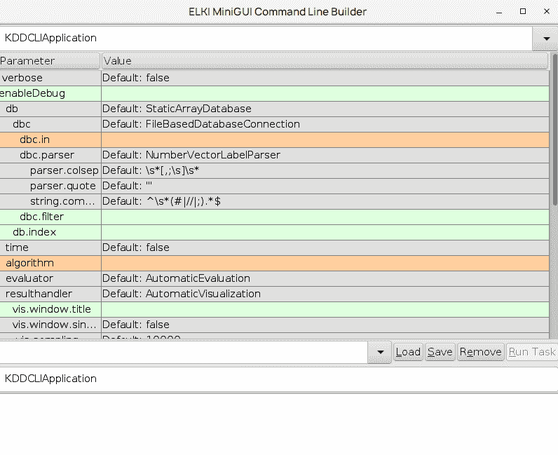

在 GUI 中，`dbc.in`和算法参数被突出显示并需要设置。我们将使用`pov.csv`文件作为`dbc.in`。此 CSV 文件可以从[`github.com/elki-project/elki/blob/master/data/synthetic/ABC-publication/pov.csv`](https://github.com/elki-project/elki/blob/master/data/synthetic/ABC-publication/pov.csv)下载。

对于算法，选择`outlier.clustering.EMOutlier`，并在`em.k`中传递`3`作为值。以下截图显示了所有已填写的选项：

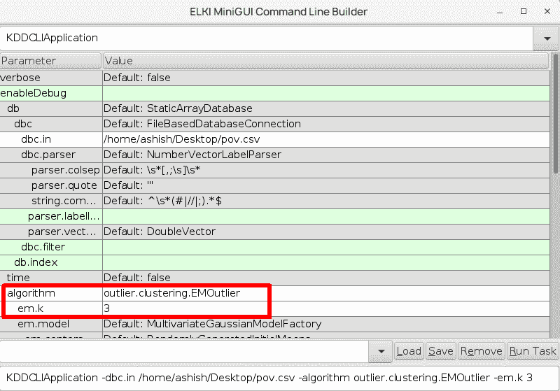

点击“运行任务”按钮，它将处理并生成以下输出：

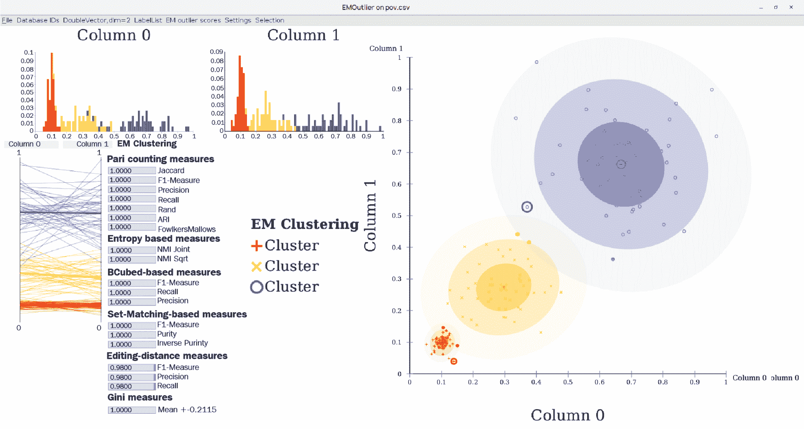

这显示了聚类和可能的异常。

# 保险索赔中的欺诈检测

首先，我们将查看可疑行为检测，其目标是了解欺诈模式，这对应于已知已知建模。

# 数据集

我们将使用一个描述保险交易的数据库集进行工作，该数据库集在 Oracle 数据库在线文档中公开可用，网址为[`docs.oracle.com/cd/B28359_01/datamine.111/b28129/anomalies.htm`](http://docs.oracle.com/cd/B28359_01/datamine.111/b28129/anomalies.htm)。

该数据集描述了一个未公开保险公司的车辆事故索赔。它包含 15,430 个索赔；每个索赔由 33 个属性组成，描述以下组件：

+   客户人口统计详细信息（年龄、性别、婚姻状况等）

+   购买的政策（政策类型、车辆类别、补充数量、代理商类型等）

+   索赔情况（索赔的日/月/周、政策报告提交、目击者在场、事故与政策报告之间的过去天数、事故索赔等）

+   其他客户数据（汽车数量、以前的索赔、驾驶员评分等）

+   发现欺诈（是或否）

下面的截图显示了已加载到 Weka 中的数据库样本：

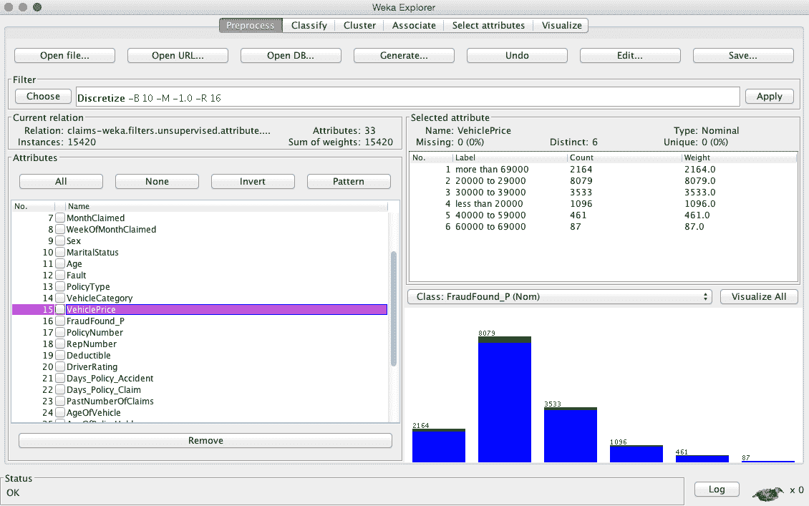

现在，任务是创建一个能够识别未来可疑声明的模型。这个任务具有挑战性的地方在于只有 6% 的声明是可疑的。如果我们创建一个虚拟分类器，声称没有任何声明是可疑的，那么它在 94% 的情况下将是准确的。因此，在这个任务中，我们将使用不同的准确度指标：精确度和召回率。

让我们回顾一下第一章《应用机器学习快速入门》中的结果表，其中包含四种可能的结果，分别表示真阳性、假阳性、假阴性和真阴性：

|  |  | **分类为** |
| --- | --- | --- |
| **实际** |  | **欺诈** | **无欺诈** |
| **欺诈** | TP - 真阳性 | FN - 假阴性 |
| **无欺诈** | FP - 假阳性 | TN - 真阴性 |

精确度和召回率定义如下：

+   **精确度**等于正确发出警报的比例，如下所示：

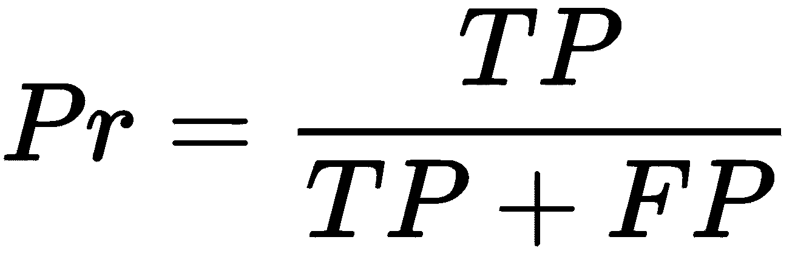

+   **召回率**等于正确识别的异常签名比例，如下所示：

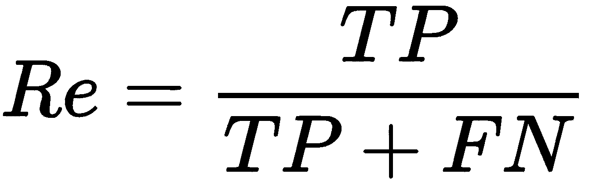

+   使用这些指标——我们的虚拟分类器得分——我们发现 *Pr = 0* 和 *Re = 0*，因为它从未将任何实例标记为欺诈 (*TP = 0*)。在实践中，我们希望通过数字比较分类器；因此，我们使用 *F - measure*。这是一个事实上的指标，它计算精确度和召回率之间的调和平均值，如下所示：

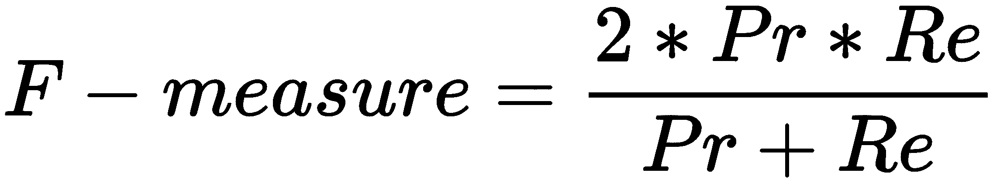

现在，让我们继续设计一个真正的分类器。

# 建立可疑模式模型

为了设计一个分类器，我们可以遵循标准的有监督学习步骤，如第一章《应用机器学习快速入门》中所述。在这个菜谱中，我们将包括一些额外的步骤来处理不平衡数据集并根据精确度和召回率评估分类器。计划如下：

1.  以 `.csv` 格式加载数据。

1.  分配类属性。

1.  将所有属性从数值转换为名义值，以确保没有错误加载的数值。

1.  **实验 1**：使用 k 折交叉验证评估模型。

1.  **实验 2**：将数据集重新平衡到更平衡的类别分布，并手动执行交叉验证。

1.  通过召回率、精确度和 f-measure 比较分类器。

首先，让我们使用 `CSVLoader` 类加载数据，如下所示：

```py
String filePath = "/Users/bostjan/Dropbox/ML Java Book/book/datasets/chap07/claims.csv"; 

CSVLoader loader = new CSVLoader(); 
loader.setFieldSeparator(","); 
loader.setSource(new File(filePath)); 
Instances data = loader.getDataSet(); 
```

接下来，我们需要确保所有属性都是名义的。在数据导入过程中，Weka 应用一些启发式方法来猜测最可能的属性类型，即数值、名义、字符串或日期。由于启发式方法不能总是猜对类型，我们可以手动设置类型，如下所示：

```py
NumericToNominal toNominal = new NumericToNominal(); 
toNominal.setInputFormat(data); 
data = Filter.useFilter(data, toNominal); 
```

在我们继续之前，我们需要指定我们将尝试预测的属性。我们可以通过调用 `setClassIndex(int)` 函数来实现这一点：

```py
int CLASS_INDEX = 15; 
data.setClassIndex(CLASS_INDEX); 
```

接下来，我们需要移除一个描述政策编号的属性，因为它没有预测价值。我们只需应用`Remove`过滤器，如下所示：

```py
Remove remove = new Remove(); 
remove.setInputFormat(data); 
remove.setOptions(new String[]{"-R", ""+POLICY_INDEX}); 
data = Filter.useFilter(data, remove); 
```

现在，我们准备开始建模。

# 基本方法

基本方法是将课程直接应用，就像在第三章，“基本算法 - 分类、回归、聚类”中所展示的那样，没有任何预处理，也不考虑数据集的具体情况。为了展示基本方法的缺点，我们将简单地使用默认参数构建一个模型，并应用 k 折交叉验证。

首先，让我们定义一些我们想要测试的分类器，如下所示：

```py
ArrayList<Classifier>models = new ArrayList<Classifier>(); 
models.add(new J48()); 
models.add(new RandomForest()); 
models.add(new NaiveBayes()); 
models.add(new AdaBoostM1()); 
models.add(new Logistic()); 
```

接下来，我们需要创建一个`Evaluation`对象，并通过调用`crossValidate(Classifier, Instances, int, Random, String[])`方法执行 k 折交叉验证，提供`precision`、`recall`和`fMeasure`作为输出：

```py
int FOLDS = 3; 
Evaluation eval = new Evaluation(data); 

for(Classifier model : models){ 
  eval.crossValidateModel(model, data, FOLDS,  
  new Random(1), new String[] {}); 
  System.out.println(model.getClass().getName() + "\n"+ 
    "\tRecall:    "+eval.recall(FRAUD) + "\n"+ 
    "\tPrecision: "+eval.precision(FRAUD) + "\n"+ 
    "\tF-measure: "+eval.fMeasure(FRAUD)); 
} 
```

评估提供了以下分数作为输出：

```py
    weka.classifiers.trees.J48
      Recall:    0.03358613217768147
      Precision: 0.9117647058823529
      F-measure: 0.06478578892371996
    ...
    weka.classifiers.functions.Logistic
      Recall:    0.037486457204767065
      Precision: 0.2521865889212828
      F-measure: 0.06527070364082249

```

我们可以看到，结果并不十分令人鼓舞。召回率，即发现的欺诈在所有欺诈中的比例，仅为 1-3%，这意味着只有 1-3/100 的欺诈被检测到。另一方面，精确度，即警报的准确性，为 91%，这意味着在 10 个案例中有 9 个，当一个索赔被标记为欺诈时，模型是正确的。

# 数据集重平衡

由于负面示例（即欺诈实例）的数量与正面示例相比非常小，学习算法在归纳方面遇到了困难。我们可以通过提供一个正负示例比例相当的数据集来帮助他们。这可以通过数据集重平衡来实现。

Weka 有一个内置的过滤器，`Resample`，它使用有放回或无放回的抽样方法生成数据集的随机子样本。该过滤器还可以使分布偏向均匀的类别分布。

我们将手动实现 k 折交叉验证。首先，我们将数据集分成*k*个相等的部分。第*k*部分将用于测试，而其他部分将用于学习。为了将数据集分成部分，我们将使用`StratifiedRemoveFolds`过滤器，该过滤器在部分内保持类别分布，如下所示：

```py
StratifiedRemoveFolds kFold = new StratifiedRemoveFolds(); 
kFold.setInputFormat(data); 

double measures[][] = new double[models.size()][3]; 

for(int k = 1; k <= FOLDS; k++){ 

  // Split data to test and train folds 
  kFold.setOptions(new String[]{ 
    "-N", ""+FOLDS, "-F", ""+k, "-S", "1"}); 
  Instances test = Filter.useFilter(data, kFold); 

  kFold.setOptions(new String[]{ 
    "-N", ""+FOLDS, "-F", ""+k, "-S", "1", "-V"}); 
    // select inverse "-V" 
  Instances train = Filter.useFilter(data, kFold); 
```

接下来，我们可以重平衡训练数据集，其中`-Z`参数指定要重采样的数据集百分比，而`-B`参数使类别分布偏向均匀分布：

```py
Resample resample = new Resample(); 
resample.setInputFormat(data); 
resample.setOptions(new String[]{"-Z", "100", "-B", "1"}); //with 
   replacement 
Instances balancedTrain = Filter.useFilter(train, resample); 
```

接下来，我们可以构建分类器并执行评估：

```py
for(ListIterator<Classifier>it = models.listIterator(); 
   it.hasNext();){ 
  Classifier model = it.next(); 
  model.buildClassifier(balancedTrain); 
  eval = new Evaluation(balancedTrain); 
  eval.evaluateModel(model, test); 

// save results for average 
  measures[it.previousIndex()][0] += eval.recall(FRAUD); 
  measures[it.previousIndex()][1] += eval.precision(FRAUD); 
 measures[it.previousIndex()][2] += eval.fMeasure(FRAUD); 
} 
```

最后，我们使用以下代码行计算平均值并提供最佳模型作为输出：

```py
// calculate average 
for(int i = 0; i < models.size(); i++){ 
  measures[i][0] /= 1.0 * FOLDS; 
  measures[i][1] /= 1.0 * FOLDS; 
  measures[i][2] /= 1.0 * FOLDS; 
} 

// output results and select best model 
Classifier bestModel = null; double bestScore = -1; 
for(ListIterator<Classifier> it = models.listIterator(); 
   it.hasNext();){ 
  Classifier model = it.next(); 
  double fMeasure = measures[it.previousIndex()][2]; 
  System.out.println( 
    model.getClass().getName() + "\n"+ 
    "\tRecall:    "+measures[it.previousIndex()][0] + "\n"+ 
    "\tPrecision: "+measures[it.previousIndex()][1] + "\n"+ 
    "\tF-measure: "+fMeasure); 
  if(fMeasure > bestScore){ 
    bestScore = fMeasure; 
    bestModel = model; 

  } 
} 
System.out.println("Best model:"+bestModel.getClass().getName()); 
```

现在，模型的性能显著提高，如下所示：

```py
    weka.classifiers.trees.J48
      Recall:    0.44204845100610574
      Precision: 0.14570766048577555
      F-measure: 0.21912423640160392
    ...
    weka.classifiers.functions.Logistic
      Recall:    0.7670657247204478
      Precision: 0.13507459756495374
      F-measure: 0.22969038530557626
    Best model: weka.classifiers.functions.Logistic

```

我们可以看到，所有模型的表现都显著提高；例如，表现最好的模型——逻辑回归，正确地发现了 76%的欺诈行为，同时产生合理数量的误报——只有 13%被标记为欺诈的索赔实际上是欺诈的。如果未检测到的欺诈比误报的调查成本高得多，那么处理更多的误报是有意义的。

总体性能很可能还有提升空间；我们可以进行属性选择和特征生成，并应用更复杂的模型学习，这些内容我们在第三章，*基本算法 – 分类、回归、聚类*中讨论过。

# 网站流量中的异常检测

在第二个示例中，我们将专注于建模前一个示例的相反情况。不是讨论典型的无欺诈案例，而是讨论系统的正常预期行为。如果某些东西无法与我们的预期模型匹配，它将被认为是异常的。

# 数据集

我们将使用一个由 Yahoo! Labs 发布的公开数据集，这个数据集对于讨论如何检测时间序列数据中的异常非常有用。对于 Yahoo 来说，主要用例是在检测 Yahoo 服务器上的异常流量。

尽管 Yahoo 已经宣布他们的数据是公开的，但你必须申请使用，并且批准通常需要大约 24 小时。数据集可在[`webscope.sandbox.yahoo.com/catalog.php?datatype=s&did=70`](http://webscope.sandbox.yahoo.com/catalog.php?datatype=s&did=70)获取。

该数据集由 Yahoo 服务的真实流量和一些合成数据组成。总共有 367 个时间序列，每个时间序列包含 741 到 1,680 个观测值，这些观测值以固定间隔记录。每个序列都写在它自己的文件中，每行一个观测值。每个序列还伴随一个第二列的指示符，如果观测值是异常，则使用 1，否则使用 0。真实数据中的异常是通过人工判断确定的，而合成数据中的异常是通过算法生成的。以下表格显示了合成时间序列数据的一个片段：

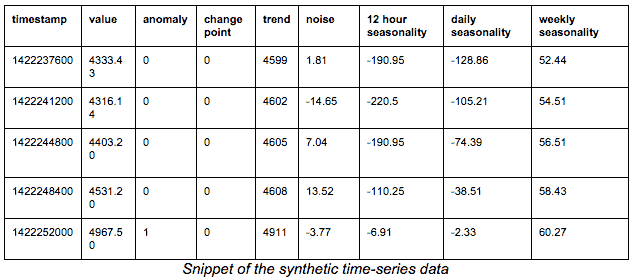

在下一节中，你将学习如何将时间序列数据转换成属性表示，这样我们就可以应用机器学习算法。

# 时间序列数据中的异常检测

在原始的、流式的时间序列数据中检测异常需要一些数据转换。最明显的方法是选择一个时间窗口，并采样一个固定长度的时间序列。在下一步，我们希望将新的时间序列与之前收集的集合进行比较，以检测是否有异常情况发生。

比较可以使用各种技术进行，如下所示：

+   预测最可能的后继值以及置信区间（例如，Holt-Winters 指数平滑）。如果一个新值超出了预测的置信区间，它被认为是异常的。

+   互相关比较一个新样本与一组正样本库，并寻找精确匹配。如果没有找到匹配，它将被标记为异常。

+   动态时间卷绕与互相关类似，但允许信号在比较中发生扭曲。

+   将信号离散化为频带，其中每个频带对应一个字母。例如，`A=[min, mean/3]`，`B=[mean/3, mean*2/3]`，和`C=[mean*2/3, max]`将信号转换为一系列字母，例如`aAABAACAABBA....`这种方法减少了存储空间，并允许我们应用第十章中将要讨论的文本挖掘算法，即*Mallet 文本挖掘 – 主题建模和垃圾邮件检测*。

+   基于分布的方法估计特定时间窗口中值的分布。当我们观察到一个新的样本时，我们可以比较分布是否与之前观察到的分布相匹配。

这个列表绝对不是详尽的。不同的方法专注于检测不同的异常（例如，在值、频率和分布上）。在本章中，我们将关注基于分布的方法的一个版本。

# 使用 Encog 进行时间序列分析

我们必须从[`solarscience.msfc.nasa.gov/greenwch/spot_num.txt`](https://solarscience.msfc.nasa.gov/greenwch/spot_num.txt)下载时间序列数据，并将文件保存在`data`文件夹中。在`.java`文件中，我们将指定文件路径，然后我们将使用以下代码块指示文件的格式：

```py
File filename = new File("data/spot_num.txt");
CSVFormat format = new CSVFormat('.', ' ');
VersatileDataSource source = new CSVDataSource(filename, true, format);
VersatileMLDataSet data = new VersatileMLDataSet(source);
data.getNormHelper().setFormat(format);
ColumnDefinition columnSSN = data.defineSourceColumn("SSN", ColumnType.continuous);
ColumnDefinition columnDEV = data.defineSourceColumn("DEV", ColumnType.continuous);
data.analyze();
data.defineInput(columnSSN);
data.defineInput(columnDEV);
data.defineOutput(columnSSN);
```

现在，我们将创建窗口大小为`1`的前馈网络。在处理时间序列时，你应该记住它永远不应该被打乱。我们将保留一些数据用于验证。我们将使用以下代码行来完成：

```py
EncogModel model = new EncogModel(data);
model.selectMethod(data, MLMethodFactory.TYPE_FEEDFORWARD);

model.setReport(new ConsoleStatusReportable());
data.normalize();

// Set time series.
data.setLeadWindowSize(1);
data.setLagWindowSize(WINDOW_SIZE);
model.holdBackValidation(0.3, false, 1001);
model.selectTrainingType(data);
```

下一步是使用以下行运行带有五折交叉验证的训练：

```py
MLRegression bestMethod = (MLRegression) model.crossvalidate(5, false);
```

现在，是时候展示错误和最终模型了。我们将通过以下代码行来完成：

```py
System.out.println("Training error: " + model.calculateError(bestMethod, model.getTrainingDataset()));
System.out.println("Validation error: " + model.calculateError(bestMethod, model.getValidationDataset()));

NormalizationHelper helper = data.getNormHelper();
System.out.println(helper.toString());

// Display the final model.
System.out.println("Final model: " + bestMethod);
```

输出将类似于以下截图：

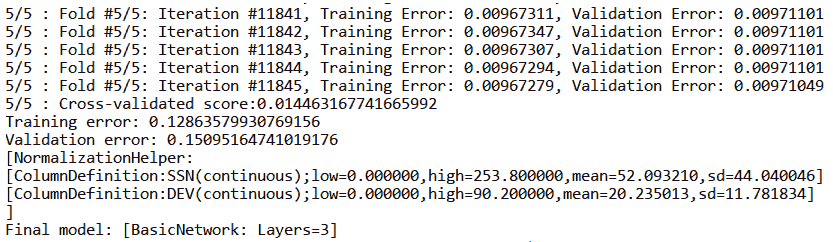

现在，我们将使用以下代码块测试模型：

```py
while (csv.next() && stopAfter > 0) {
                StringBuilder result = new StringBuilder();

                line[0] = csv.get(2);// ssn
                line[1] = csv.get(3);// dev
                helper.normalizeInputVector(line, slice, false);

                if (window.isReady()) {
                    window.copyWindow(input.getData(), 0);
                    String correct = csv.get(2); // trying to predict SSN.
                    MLData output = bestMethod.compute(input);
                    String predicted = helper
                            .denormalizeOutputVectorToString(output)[0];

                    result.append(Arrays.toString(line));
                    result.append(" -> predicted: ");
                    result.append(predicted);
                    result.append("(correct: ");
                    result.append(correct);
                    result.append(")");

                    System.out.println(result.toString());
                }

                window.add(slice);

                stopAfter--;
            }
```

输出将类似于以下截图：

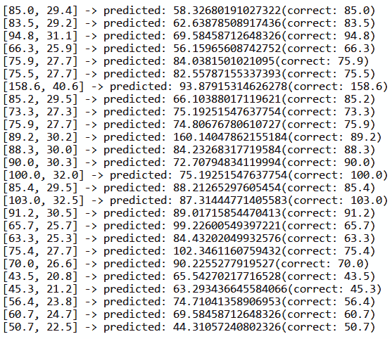

# 基于直方图的异常检测

在基于直方图的异常检测中，我们根据选定的时间窗口分割信号，如图所示。

对于每个窗口，我们计算直方图；也就是说，对于选定的桶数，我们计算每个桶中有多少值。直方图捕捉了选定时间窗口中值的分布情况，如图中所示。

直方图可以随后直接作为实例展示，其中每个桶对应一个属性。此外，我们可以通过应用降维技术，如**主成分分析**（**PCA**），来减少属性的数量，这允许我们在图中可视化降维后的直方图，如图表右下角所示，其中每个点对应一个直方图。

在我们的例子中，想法是观察几天内的网站流量，然后创建直方图；例如，四小时的时间窗口，以建立一个积极行为的库。如果一个新时间窗口的直方图无法与积极库匹配，我们可以将其标记为异常：

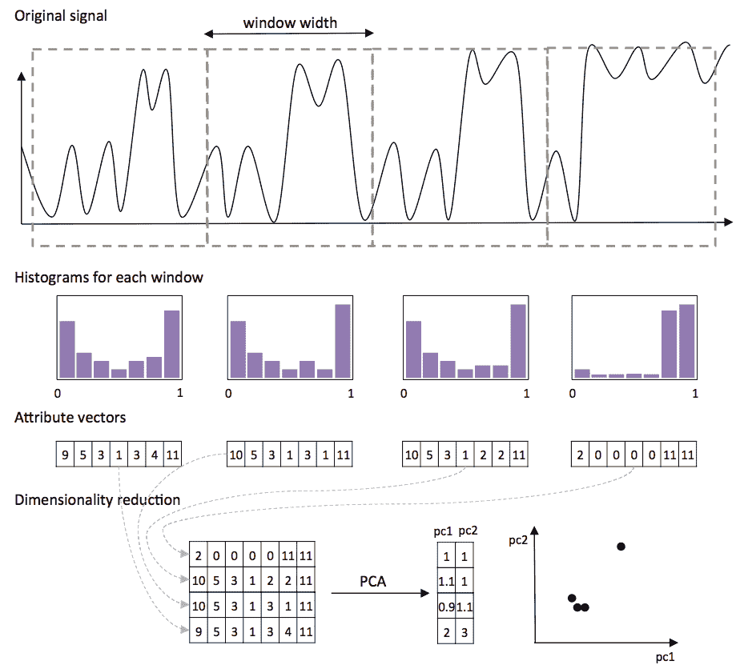

为了比较一个新直方图与一组现有直方图，我们将使用基于密度的 k 近邻算法，**局部异常因子**（**LOF**）（Breunig 等，2000）。该算法能够处理具有不同密度的簇，如下面的图所示。例如，右上角的簇较大且分布广泛，与左下角的簇相比，后者较小且密度更高：

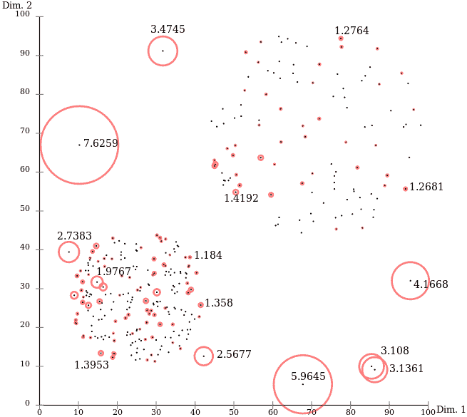

让我们开始吧！

# 加载数据

在第一步，我们需要将数据从文本文件加载到 Java 对象中。这些文件存储在一个文件夹中，每个文件包含一个时间序列，每行一个值。我们将它们加载到一个`Double`列表中，如下所示：

```py
String filePath = "chap07/ydata/A1Benchmark/real"; 
List<List<Double>> rawData = new ArrayList<List<Double>>(); 
```

我们需要`min`和`max`值来进行直方图归一化；因此，让我们在这个数据传递中收集它们：

```py
double max = Double.MIN_VALUE; 
double min = Double.MAX_VALUE; 

for(int i = 1; i<= 67; i++){ 
  List<Double> sample = new ArrayList<Double>(); 
  BufferedReader reader = new BufferedReader(new 
     FileReader(filePath+i+".csv")); 

  boolean isAnomaly = false; 
  reader.readLine(); 
  while(reader.ready()){ 
    String line[] = reader.readLine().split(","); 
    double value = Double.parseDouble(line[1]); 
    sample.add(value); 

    max = Math.max(max, value); 
    min = Double.min(min, value); 

    if(line[2] == "1") 
      isAnomaly = true; 

  } 
  System.out.println(isAnomaly); 
  reader.close(); 

  rawData.add(sample); 
} 
```

数据已经加载。接下来，让我们继续到直方图部分。

# 创建直方图

我们将使用`WIN_SIZE`宽度创建一个选定时间窗口的直方图。

直方图将包含`HIST_BINS`值桶。由双列表组成的直方图将存储在数组列表中：

```py
int WIN_SIZE = 500; 
int HIST_BINS = 20; 
int current = 0; 

List<double[]> dataHist = new ArrayList<double[]>(); 
for(List<Double> sample : rawData){ 
  double[] histogram = new double[HIST_BINS]; 
  for(double value : sample){ 
    int bin = toBin(normalize(value, min, max), HIST_BINS); 
    histogram[bin]++; 
    current++; 
    if(current == WIN_SIZE){ 
      current = 0; 
      dataHist.add(histogram); 
      histogram = new double[HIST_BINS]; 
    } 
  } 
  dataHist.add(histogram); 
} 
```

直方图现在已经完成。最后一步是将它们转换为 Weka 的`Instance`对象。每个直方图值将对应一个 Weka 属性，如下所示：

```py
ArrayList<Attribute> attributes = new ArrayList<Attribute>(); 
for(int i = 0; i<HIST_BINS; i++){ 
  attributes.add(new Attribute("Hist-"+i)); 
} 
Instances dataset = new Instances("My dataset", attributes, 
   dataHist.size()); 
for(double[] histogram: dataHist){ 
  dataset.add(new Instance(1.0, histogram)); 
} 
```

数据集现在已经加载，并准备好插入到异常检测算法中。

# 基于密度的 k 近邻

为了演示 LOF 如何计算分数，我们将首先使用`testCV(int, int)`函数将数据集分为训练集和测试集。第一个参数指定了折数，而第二个参数指定了要返回的折：

```py
// split data to train and test 
Instances trainData = dataset.testCV(2, 0); 
Instances testData = dataset.testCV(2, 1); 
```

LOF 算法不是 Weka 默认分布的一部分，但可以通过 Weka 的包管理器在[`weka.sourceforge.net/packageMetaData/localOutlierFactor/index.html`](http://weka.sourceforge.net/packageMetaData/localOutlierFactor/index.html)下载。

LOF 算法有两个实现接口：作为一个无监督过滤器，计算 LOF 值（已知未知），以及作为一个有监督的 k 最近邻分类器（已知已知）。在我们的情况下，我们想要计算异常因子，因此我们将使用无监督过滤器接口：

```py
import weka.filters.unsupervised.attribute.LOF; 
```

过滤器初始化的方式与常规过滤器相同。我们可以使用`-min`和`-max`参数指定邻居的数量（例如，`k=3`）。`LOF`允许我们指定两个不同的`k`参数，这些参数在内部用作上限和下限，以找到最小或最大的`lof`值：

```py
LOF lof = new LOF(); 
lof.setInputFormat(trainData); 
lof.setOptions(new String[]{"-min", "3", "-max", "3"}); 
```

接下来，我们将训练实例加载到作为正例库的过滤器中。加载完成后，我们将调用`batchFinished()`方法来初始化内部计算：

```py
for(Instance inst : trainData){ 
  lof.input(inst); 
} 
lof.batchFinished(); 
```

最后，我们可以将过滤器应用于测试数据。`Filter()` 函数将处理实例并在末尾附加一个额外的属性，包含 LOF 分数。我们可以在控制台中简单地提供分数作为输出：

```py
Instances testDataLofScore = Filter.useFilter(testData, lof); 

for(Instance inst : testDataLofScore){ 
  System.out.println(inst.value(inst.numAttributes()-1)); 
} 
```

前几个测试实例的 LOF 分数如下：

```py
    1.306740014927325
    1.318239332210458
    1.0294812291949587
    1.1715039094530768

```

要理解 LOF 值，我们需要了解 LOF 算法的一些背景知识。它比较实例的密度与其最近邻的密度。这两个分数相除，产生 LOF 分数。大约为 1 的 LOF 分数表示密度大致相等，而更高的 LOF 值表示实例的密度显著低于其邻居的密度。在这种情况下，实例可以被标记为异常。

# 摘要

在本章中，我们探讨了检测异常和可疑模式。我们讨论了两种基本方法，重点关注库编码，即正模式或负模式。接下来，我们处理了两个真实数据集，并讨论了如何处理不平衡的类别分布以及如何在时间序列数据上执行异常检测。

在下一章中，我们将更深入地探讨模式以及更高级的基于模式构建分类器的方法，并讨论如何使用深度学习自动为图像分配标签。
