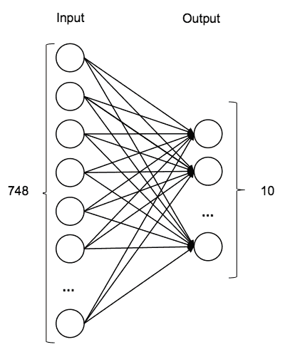

# 使用 Deeplearning4j 进行图像识别

图像在 Web 服务、社交网络和在线商店中无处不在。与人类相比，计算机在理解图像及其所代表的内容方面有很大困难。在本章中，我们将首先探讨教会计算机如何理解图像的挑战，然后重点介绍基于深度学习的方法。我们将探讨配置深度学习模型所需的高级理论，并讨论如何使用 Java 库 Deeplearning4j 实现一个能够通过分类图像的模型。

本章将涵盖以下主题：

+   介绍图像识别

+   讨论深度学习基础

+   构建图像识别模型

# 介绍图像识别

图像识别的一个典型目标是检测和识别数字图像中的对象。图像识别应用于工厂自动化以监控产品质量；监控系统以识别潜在风险活动，如移动的人或车辆；安全应用通过指纹、虹膜或面部特征提供生物识别；自动驾驶汽车以重建道路和环境条件；等等。

数字图像不是以基于属性的描述方式呈现的；相反，它们被编码为不同通道中的颜色量，例如，黑白和红绿蓝通道。学习目标是识别与特定对象相关的模式。图像识别的传统方法包括将图像转换为不同的形式，例如，识别物体角落、边缘、同色块和基本形状。然后使用这些模式来训练一个学习者区分对象。以下是一些传统算法的显著例子：

+   边缘检测找到图像中对象的边界

+   角点检测识别两条边缘或其他有趣点（如线端、曲率极大值或极小值等）的交点

+   块检测识别与周围区域在属性（如亮度或颜色）上不同的区域

+   岭谷检测使用平滑函数在图像中识别额外的有趣点

+   **尺度不变特征变换**（**SIFT**）是一种鲁棒的算法，即使对象的尺度或方向与数据库中的代表性样本不同，也能匹配对象

+   Hough 变换识别图像中的特定模式

一种更近期的方法是基于深度学习。深度学习是一种神经网络形式，它模仿大脑处理信息的方式。深度学习的主要优势在于可以设计出能够自动提取相关模式的神经网络，这些模式反过来又可以用来训练学习器。随着神经网络技术的最新进展，图像识别的准确性得到了显著提升。例如，**ImageNet** 挑战赛，其中参赛者获得了来自 1,000 个不同物体类别的超过 1,200 万张图片，报告称，最佳算法的错误率从 2010 年的 28%（使用**支持向量机**（**SVM**））降低到了 2014 年的仅 7%（使用深度神经网络）。

在本章中，我们将快速浏览神经网络，从基本构建块感知器开始，逐渐引入更复杂的结构。

# 神经网络

最早期的神经网络，在六十年代被引入，其灵感来源于生物神经网络。神经网络的想法是映射生物神经系统，即大脑如何处理信息。它由相互连接的神经元层组成，共同工作。在计算机术语中，它们也被称为**人工神经网络**（**ANN**）。使用计算机，需要训练来使这个模型学习，就像人类大脑一样。大脑中的神经元在接收到来自附近相互连接的神经元的信号时会被激活，对人工神经网络也是如此。神经网络技术的最新进展已经证明，深度神经网络非常适合模式识别任务，因为它们能够自动提取有趣的特征并学习其背后的表示。在本节中，我们将回顾从单个感知器到深度网络的基本结构和组件。

# 感知器

感知器是基本神经网络构建块之一，也是最早的监督算法之一。它被定义为特征的总和，这些特征乘以相应的权重和一个偏差。当接收到输入信号时，它将这些信号与分配的权重相乘。这些权重为每个传入的信号或输入定义，并在学习阶段持续调整。权重的调整取决于最后结果的误差。将所有输入与一些称为**偏差**的偏移值相乘后，所有输入都加在一起。偏差的值也由权重调整。因此，它从随机的权重和偏差开始，并在每次迭代中调整权重和偏差，以便下一个结果向期望的输出移动。最后，最终结果被转换成输出信号。将所有这些加在一起的功能称为**求和传递函数**，并将其输入到激活函数中。如果二元步激活函数达到阈值，则输出为 1，否则为 0，这为我们提供了一个二元分类器。以下图显示了示意图：


训练感知器涉及一个相当简单的学习算法，该算法计算计算输出值与正确训练输出值之间的误差，并使用此误差来创建对权重的调整，从而实现一种梯度下降的形式。此算法通常称为**delta 规则**。

单层感知器并不非常先进，无法使用它来模拟非线性可分函数，如 XOR。为了解决这个问题，引入了一种具有多个感知器的结构，称为**多层感知器**，也称为**前馈神经网络**。

# 前馈神经网络

前馈神经网络是一种由多个感知器组成的 ANN，这些感知器被组织成层，如下面的图所示：输入层、输出层和一层或多层隐藏层。隐藏层与外界没有任何联系，因此得名。每个层感知器，也称为神经元，与下一层的感知器有直接连接，而两个神经元之间的连接则携带一个与感知器权重相似的权重。因此，同一层的所有感知器都与下一层的感知器相连，信息被正向传递到下一层。此图显示了一个具有四个单元的**输入层**的网络，对应于长度为`4`的特征向量大小，一个四个单元的**隐藏层**和一个两个单元的**输出层**，其中每个单元对应一个类别值：


前馈神经网络通过寻找输入和输出值之间的关系来学习，这些值被多次输入到网络中。训练多层网络最流行的方法是反向传播。在反向传播中，计算出的输出值与相同方式下的正确值进行比较，就像在 delta 规则中一样。然后，通过各种技术将错误反馈到网络中，调整每个连接的权重，以减少错误的值。错误是通过网络输出值与原始输出值之间的平方差来计算的。错误表示我们离原始输出值的距离。这个过程在足够多的训练周期中重复进行，直到错误低于某个阈值。

前馈神经网络可以有多于一个的隐藏层，其中每个额外的隐藏层在先前的层之上构建一个新的抽象。这通常会导致更精确的模型；然而，增加隐藏层的数量会导致两个已知问题：

+   **梯度消失问题**：随着隐藏层的增加，使用反向传播的训练越来越不适用于将信息传递到前层，导致这些层训练速度非常慢

+   **过拟合**：模型对训练数据拟合得太好，在真实示例上的表现不佳

让我们看看一些其他网络结构，它们解决了这些问题。

# 自动编码器

**自动编码器**是一种前馈神经网络，旨在学习如何压缩原始数据集。其目标是复制输入到输出。因此，我们不会将特征映射到输入层，将标签映射到输出层，而是将特征映射到输入和输出层。隐藏层中的单元数量通常不同于输入层中的单元数量，这迫使网络增加或减少原始特征的数量。这样，网络将学习重要的特征，同时有效地应用降维。

下面的图中展示了网络的一个示例。三个单元的输入层首先扩展为四个单元的层，然后压缩为单个单元的层。网络的另一侧将单个层单元恢复到四个单元层，然后回到原始的三个输入层：


一旦网络被训练，我们可以从左侧提取图像特征，就像使用传统的图像处理一样。它由编码器和解码器组成，其中编码器的工作是创建或隐藏一个或多个层，以捕捉输入的本质，而解码器则从这些层中重建输入。

自动编码器也可以组合成**堆叠自动编码器**，如下面的图所示。首先，我们将讨论基本自动编码器中的隐藏层，如之前所述。然后，我们将重复使用学习到的隐藏层（绿色圆圈）并重复该过程，这实际上学习了一个更抽象的表示。我们可以重复此过程多次，将原始特征转换为越来越低的维度。最后，我们将所有隐藏层堆叠成一个常规的前馈网络，如图表右上角所示：


# 限制性玻尔兹曼机

**限制性玻尔兹曼机**（**RBM**）是一种无向神经网络，也称为**生成随机网络**（**GSNs**），可以学习其输入集上的概率分布。正如其名所示，它们起源于 20 世纪 80 年代引入的玻尔兹曼机，这是一种循环神经网络。在玻尔兹曼机中，每个节点或神经元都与所有其他节点相连，这使得当节点数量增加时难以处理。限制性意味着神经元必须形成两个完全连接的层，一个输入层和一个隐藏层，如下面的图所示：


与前馈网络不同，可见层和隐藏层之间的连接是无向的，因此值可以在可见到隐藏和隐藏到可见的方向上传播。

RBMs 的训练基于对比散度算法，该算法使用梯度下降过程，类似于反向传播，来更新权重，并在马尔可夫链上应用吉布斯采样来估计梯度，即如何改变权重的方向。

RBMs 也可以堆叠起来，形成一个称为**深度信念网络**（**DBNs**）的类别。在这种情况下，RBM 的隐藏层作为 RBM 层的可见层，如下面的图所示：


在这种情况下，训练是增量式的：层与层地训练。

# 深度卷积网络

最近在图像识别基准测试中取得非常好的结果的网络结构是**卷积神经网络**（**CNN**）或 ConvNet。CNN 是一种结构化的前馈神经网络，其结构模仿了视觉皮层的功能，利用输入图像的 2D 结构，即表现出空间局部相关性的模式。它基于大脑如何回忆或记住图像的基本原理。作为人类，我们根据特征来记住图像。给定特征后，我们的大脑将开始形成图像本身。在计算机中，考虑以下图表，它显示了如何检测特征：


同样地，可以从图像中检测到许多特征，如下图所示：


CNN 由多个卷积和子采样层组成，可选地后面跟着全连接层。以下图示展示了这一示例。输入层读取图像中的所有像素，然后我们应用多个滤波器。在以下图中，应用了四个不同的滤波器。每个滤波器都应用于原始图像；例如，一个 6 x 6 滤波器的一个像素是通过计算 6 x 6 输入像素的加权总和以及相应的 6 x 6 权重来计算的。这有效地引入了类似于标准图像处理的滤波器，如平滑、相关性、边缘检测等。生成的图像称为**特征图**。在以下图的示例中，我们有四个特征图，每个滤波器一个。

下一个层是子采样层，它减小了输入的大小。每个特征图通常通过在连续区域（对于大图像可达 2 x 2 到 5 x 5）上的平均或最大池化进行子采样。例如，如果特征图大小为 16 x 16，子采样区域为 2 x 2，则减小后的特征图大小为 8 x 8，其中 4 个像素（一个 2 x 2 的正方形）通过计算最大值、最小值、平均值或其他函数合并成一个单独的像素：


网络可能包含几个连续的卷积和子采样层，如前图所示。特定的特征图连接到下一个减小/卷积的特征图，而同一层的特征图之间不相互连接。

在最后一个子采样或卷积层之后，通常有一个全连接层，与标准多层神经网络中的层相同，它表示目标数据。

CNN 的训练使用了一种修改后的反向传播算法，该算法考虑了子采样层，并根据该滤波器应用的所有值更新卷积滤波器权重。

一些好的 CNN 设计可以在 ImageNet 竞赛结果页面上找到：[`www.image-net.org/`](http://www.image-net.org/)。一个例子是*A. Krizhevsky 等人*在*ImageNet 分类与深度卷积神经网络*论文中描述的*A. Krizhevsky*。

这就结束了我们对主要神经网络结构的回顾。在下一节中，我们将继续实际实现。

# 图像分类

在本节中，我们将讨论如何使用 Deeplearning4j 库实现一些神经网络结构。让我们开始吧。

# Deeplearning4j

如我们在第二章“Java 机器学习库和平台”中讨论的那样，Deeplearning4j 是一个开源的、基于 Java 和 Scala 的分布式深度学习项目。Deeplearning4j 依赖于 Spark 和 Hadoop 进行 MapReduce，并行训练模型，并在中心模型中迭代平均它们产生的参数。详细的库总结在第二章“Java 机器学习库和平台”中给出。

# 获取 DL4J

获取 Deeplearning4j 最方便的方式是通过 Maven 仓库：

1.  启动一个新的 Eclipse 项目，选择 Maven 项目，如下面的截图所示：


1.  打开`pom.xml`文件，并在`<dependencies>`部分添加以下依赖项：

```py
<dependency> 
    <groupId>org.deeplearning4j</groupId> 
    <artifactId>deeplearning4j-nlp</artifactId> 
   <version>${dl4j.version}</version> 
</dependency> 

<dependency> 
    <groupId>org.deeplearning4j</groupId> 
    <artifactId>deeplearning4j-core</artifactId> 
    <version>${dl4j.version}</version> 
</dependency> 
```

1.  最后，右键单击项目，选择 Maven，然后选择更新项目。

# MNIST 数据集

最著名的数据库集之一是 MNIST 数据集，它由手写数字组成，如下面的图像所示。该数据集包括 60,000 个训练图像和 10,000 个测试图像：


该数据集通常用于图像识别问题中的算法基准测试。记录的最坏错误率是 12%，没有预处理，在一个层神经网络中使用 SVM。目前，截至 2016 年，最低错误率仅为 0.21%，使用**DropConnect**神经网络，其次是深度卷积网络，错误率为 0.23%，以及深度前馈网络，错误率为 0.35%。

现在，让我们看看如何加载数据集。

# 加载数据

Deeplearning4j 自带 MNIST 数据集加载器。加载器初始化为`DataSetIterator`。首先，让我们导入`DataSetIterator`类以及`impl`包中所有支持的数据库集，例如 iris、MNIST 等：

```py
import org.deeplearning4j.datasets.iterator.DataSetIterator; 
import org.deeplearning4j.datasets.iterator.impl.*; 
```

接下来，我们将定义一些常量，例如图像由 28 x 28 像素组成，有 10 个目标类别和 60,000 个样本。我们将初始化一个新的`MnistDataSetIterator`类，该类将下载数据集及其标签。参数是迭代批处理大小、示例总数以及数据集是否应该二值化：

```py
int numRows = 28; 
int numColumns = 28; 
int outputNum = 10;
int numSamples = 60000;
int batchSize = 100;
int iterations = 10;
int seed = 123;
DataSetIterator iter = new MnistDataSetIterator(batchSize, 
numSamples,true);  
```

拥有一个已经实现的数据导入器非常方便，但它不会在你的数据上工作。让我们快速看一下它的实现方式以及需要修改什么以支持你的数据集。如果你急于开始实现神经网络，你可以安全地跳过本节的其余部分，并在需要导入自己的数据时返回。

要加载自定义数据，你需要实现两个类：`DataSetIterator`，它包含有关数据集的所有信息，以及`BaseDataFetcher`，它实际上从文件、数据库或网络中提取数据。示例实现可在 GitHub 上找到，地址为[`github.com/deeplearning4j/deeplearning4j/tree/master/deeplearning4j-core/src/main/java/org/deeplearning4j/datasets/iterator/impl`](https://github.com/deeplearning4j/deeplearning4j/tree/master/deeplearning4j-core/src/main/java/org/deeplearning4j/datasets/iterator/impl)。

另一个选项是使用由同一作者开发的**Canova**库，该库的文档位于[`deeplearning4j.org/canovadoc/`](http://deeplearning4j.org/canovadoc/)。

# 构建模型

在本节中，我们将讨论如何构建实际的神经网络模型。我们将从一个基本的单层神经网络开始，以建立基准并讨论基本操作。稍后，我们将使用 DBN 和多层卷积网络来改进这个初始结果。

# 构建单层回归模型

让我们从基于 softmax 激活函数的单层回归模型开始构建，如下面的图所示。由于我们只有一个层，神经网络的**输入**将是所有图像像素，即 28 x 28 = **748**个神经元。**输出**神经元的数量是**10**，每个数字一个。网络层是完全连接的，如下面的图所示：



神经网络通过`NeuralNetConfiguration.Builder()`对象定义，如下所示：

```py
MultiLayerConfiguration conf = new NeuralNetConfiguration.Builder() 
```

我们将定义梯度搜索的参数，以便使用共轭梯度优化算法进行迭代。`momentum`参数决定了优化算法收敛到局部最优的速度。`momentum`值越高，训练速度越快；但过高的速度可能会降低模型的准确性：

```py
.seed(seed) 
.gradientNormalization(GradientNormalization.ClipElementWiseAbsolu
   teValue) 
   .gradientNormalizationThreshold(1.0) 
   .iterations(iterations) 
   .momentum(0.5) 
   .momentumAfter(Collections.singletonMap(3, 0.9)) 
   .optimizationAlgo(OptimizationAlgorithm.CONJUGATE_GRADIENT) 
```

接下来，我们将指定网络有一层，并定义错误函数`NEGATIVELOGLIKELIHOOD`，内部感知器激活函数`softmax`以及与总输入和输出层相对应的数量。

图像像素和目标变量的数量，如下面的代码块所示：

```py
.list(1) 
.layer(0, new  
OutputLayer.Builder(LossFunction.NEGATIVELOGLIKELIHOOD) 
.activation("softmax") 
.nIn(numRows*numColumns).nOut(outputNum).build()) 
```

最后，我们将网络设置为`pretrain`，禁用反向传播，并实际构建未训练的网络结构：

```py
   .pretrain(true).backprop(false) 
   .build(); 
```

一旦定义了网络结构，我们就可以使用它来初始化一个新的`MultiLayerNetwork`，如下所示：

```py
MultiLayerNetwork model = new MultiLayerNetwork(conf); 
model.init(); 
```

接下来，我们将通过调用`setListeners`方法将模型指向训练数据，如下所示：

```py
model.setListeners(Collections.singletonList((IterationListener) 
   new ScoreIterationListener(listenerFreq))); 
```

我们还将调用`fit(int)`方法来触发端到端网络训练：

```py
model.fit(iter);  
```

为了评估模型，我们将初始化一个新的`Evaluation`对象，该对象将存储批处理结果：

```py
Evaluation eval = new Evaluation(outputNum); 
```

然后，我们可以按批处理迭代数据集，以保持合理的内存消耗并存储在`eval`对象中的结果：

```py
DataSetIterator testIter = new MnistDataSetIterator(100,10000); 
while(testIter.hasNext()) { 
    DataSet testMnist = testIter.next(); 
    INDArray predict2 =  
    model.output(testMnist.getFeatureMatrix()); 
    eval.eval(testMnist.getLabels(), predict2); 
} 
```

最后，我们可以通过调用`stats()`函数来获取结果：

```py
log.info(eval.stats()); 
```

一个基本的单层模型达到了以下准确率：

```py
    Accuracy:  0.8945 
    Precision: 0.8985
    Recall:    0.8922
    F1 Score:  0.8953

```

在 MNIST 数据集上获得 89.22%的准确率，即 10.88%的错误率，相当糟糕。我们将通过从简单的一层网络到使用受限玻尔兹曼机和多层卷积网络的复杂深度信念网络来改进这一点。

# 构建深度信念网络

在本节中，我们将基于 RBM 构建一个深度信念网络（DBN），如下面的图所示。该网络由四层组成。第一层将**748**个输入减少到**500**个神经元，然后到**250**个，接着到**200**个，最后到最后的**10**个目标值：


由于代码与上一个示例相同，让我们看看如何配置这样一个网络：

```py
MultiLayerConfiguration conf = new 
   NeuralNetConfiguration.Builder() 
```

我们将定义梯度优化算法，如下面的代码所示：

```py
    .seed(seed) 
    .gradientNormalization( 
    GradientNormalization.ClipElementWiseAbsoluteValue) 
    .gradientNormalizationThreshold(1.0) 
    .iterations(iterations) 
    .momentum(0.5) 
    .momentumAfter(Collections.singletonMap(3, 0.9)) 
    .optimizationAlgo(OptimizationAlgorithm.CONJUGATE_GRADIENT) 
```

我们还将指定我们的网络将有四层：

```py
   .list(4) 
```

第一层的输入将是`748`个神经元，输出将是`500`个神经元。我们将使用均方根误差交叉熵，并使用 Xavier 算法初始化权重，该算法会自动根据输入和输出神经元的数量确定初始化的规模，如下所示：

```py
.layer(0, new RBM.Builder() 
.nIn(numRows*numColumns) 
.nOut(500)          
.weightInit(WeightInit.XAVIER) 
.lossFunction(LossFunction.RMSE_XENT) 
.visibleUnit(RBM.VisibleUnit.BINARY) 
.hiddenUnit(RBM.HiddenUnit.BINARY) 
.build()) 
```

接下来的两层将具有相同的参数，除了输入和输出神经元的数量：

```py
.layer(1, new RBM.Builder() 
.nIn(500) 
.nOut(250) 
.weightInit(WeightInit.XAVIER) 
.lossFunction(LossFunction.RMSE_XENT) 
.visibleUnit(RBM.VisibleUnit.BINARY) 
.hiddenUnit(RBM.HiddenUnit.BINARY) 
.build()) 
.layer(2, new RBM.Builder() 
.nIn(250) 
.nOut(200) 
.weightInit(WeightInit.XAVIER) 
.lossFunction(LossFunction.RMSE_XENT) 
.visibleUnit(RBM.VisibleUnit.BINARY) 
.hiddenUnit(RBM.HiddenUnit.BINARY) 
.build()) 
```

现在，最后一层将映射神经元到输出，我们将使用`softmax`激活函数，如下所示：

```py
.layer(3, new OutputLayer.Builder() 
.nIn(200) 
.nOut(outputNum) 
.lossFunction(LossFunction.NEGATIVELOGLIKELIHOOD) 
.activation("softmax") 
.build()) 
.pretrain(true).backprop(false) 
.build(); 
```

剩余的训练和评估与单层网络示例相同。请注意，训练深度网络可能比单层网络花费的时间显著更多。准确率应约为 93%。

现在，让我们看看另一个深度网络。

# 构建多层卷积网络

在这个最后的例子中，我们将讨论如何构建一个卷积网络，如下面的图所示。该网络将包含七层。首先，我们将重复两对卷积和子采样层与最大池化。然后，最后一个子采样层连接到一个由 120 个神经元、84 个神经元和最后三层分别有 10 个神经元的密集连接前馈神经元网络。这样一个网络有效地形成了完整的图像识别流程，其中前四层对应于特征提取，最后三层对应于学习模型：


网络配置初始化与我们之前所做的一样：

```py
MultiLayerConfiguration.Builder conf = new 
   NeuralNetConfiguration.Builder() 
```

我们将指定梯度下降算法及其参数，如下所示：

```py
.seed(seed) 
.iterations(iterations) 
.activation("sigmoid") 
.weightInit(WeightInit.DISTRIBUTION) 
.dist(new NormalDistribution(0.0, 0.01)) 
.learningRate(1e-3) 
.learningRateScoreBasedDecayRate(1e-1) 
.optimizationAlgo( 
OptimizationAlgorithm.STOCHASTIC_GRADIENT_DESCENT) 
```

我们还将指定七个网络层，如下所示：

```py
.list(7) 
```

第一卷积层的输入是完整的图像，输出是六个特征图。卷积层将应用一个 5 x 5 的滤波器，结果将存储在一个 1 x 1 的单元中：

```py
.layer(0, new ConvolutionLayer.Builder( 
    new int[]{5, 5}, new int[]{1, 1}) 
    .name("cnn1") 
    .nIn(numRows*numColumns) 
    .nOut(6) 
    .build()) 
```

第二层是一个子采样层，它将取一个 2 x 2 的区域，并将最大结果存储在一个 2 x 2 的元素中：

```py
.layer(1, new SubsamplingLayer.Builder( 
SubsamplingLayer.PoolingType.MAX,  
new int[]{2, 2}, new int[]{2, 2}) 
.name("maxpool1") 
.build()) 
```

接下来的两层将重复前两层：

```py
.layer(2, new ConvolutionLayer.Builder(new int[]{5, 5}, new 
   int[]{1, 1}) 
    .name("cnn2") 
    .nOut(16) 
    .biasInit(1) 
    .build()) 
.layer(3, new SubsamplingLayer.Builder
   (SubsamplingLayer.PoolingType.MAX, new 
   int[]{2, 2}, new int[]{2, 2}) 
    .name("maxpool2") 
    .build()) 
```

现在，我们将子采样层的输出连接到一个由`120`个神经元组成的密集前馈网络，然后通过另一个层连接到`84`个神经元，如下所示：

```py
.layer(4, new DenseLayer.Builder() 
    .name("ffn1") 
    .nOut(120) 
    .build()) 
.layer(5, new DenseLayer.Builder() 
    .name("ffn2") 
    .nOut(84) 
    .build()) 
```

最后一层将`84`个神经元与`10`个输出神经元连接：

```py
.layer(6, new OutputLayer.Builder
   (LossFunctions.LossFunction.NEGATIVELOGLIKELIHOOD) 
    .name("output") 
    .nOut(outputNum) 
    .activation("softmax") // radial basis function required 
    .build()) 
.backprop(true) 
.pretrain(false) 
.cnnInputSize(numRows,numColumns,1); 
```

为了训练这个结构，我们可以重用我们在前两个示例中开发的代码。再次强调，训练可能需要一些时间。网络的准确率应该在大约 98%左右。

由于模型训练在很大程度上依赖于线性代数，因此可以通过使用**图形处理单元**（**GPU**）来显著加快训练速度。由于撰写本书时，GPU 后端正在进行重写，请查阅最新的文档[`deeplearning4j.org/documentation`](http://deeplearning4j.org/documentation)。

正如我们在不同示例中看到的那样，越来越复杂的神经网络使我们能够自动提取相关特征，从而完全避免传统的图像处理。然而，我们为此付出的代价是处理时间的增加以及大量的学习示例来使这种方法有效。

# 摘要

在本章中，我们讨论了如何通过覆盖深度学习的基本原理并讨论如何使用 Deeplearning4j 库来实现它们，来识别图像中的模式以区分不同的类别。我们首先刷新了基本神经网络结构，并讨论了如何实现它们来解决手写数字识别问题。

在下一章中，我们将进一步探讨模式；然而，我们将处理具有时间依赖性的模式，这些模式可以在传感器数据中找到。
