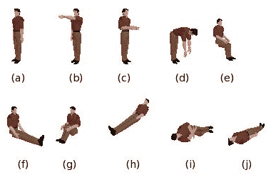
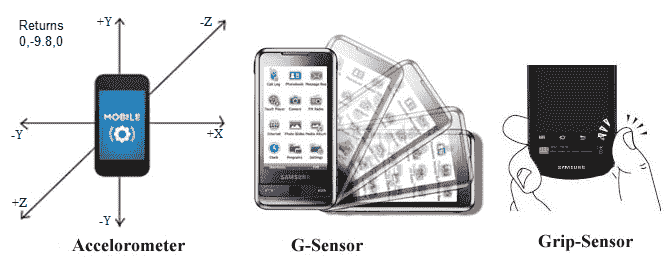
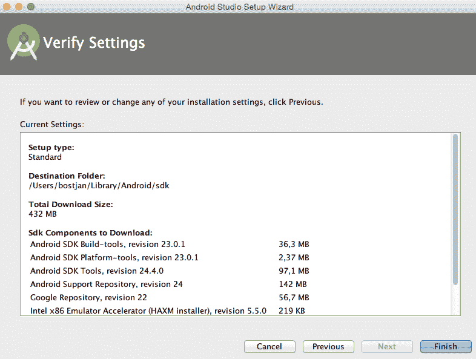
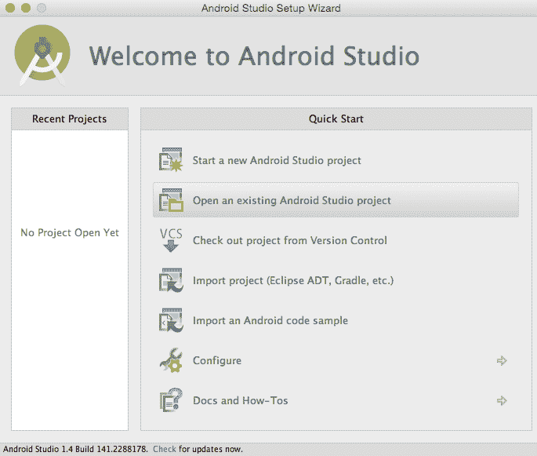
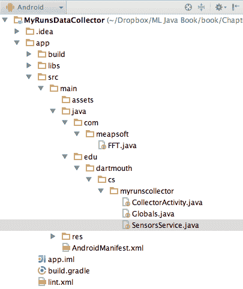
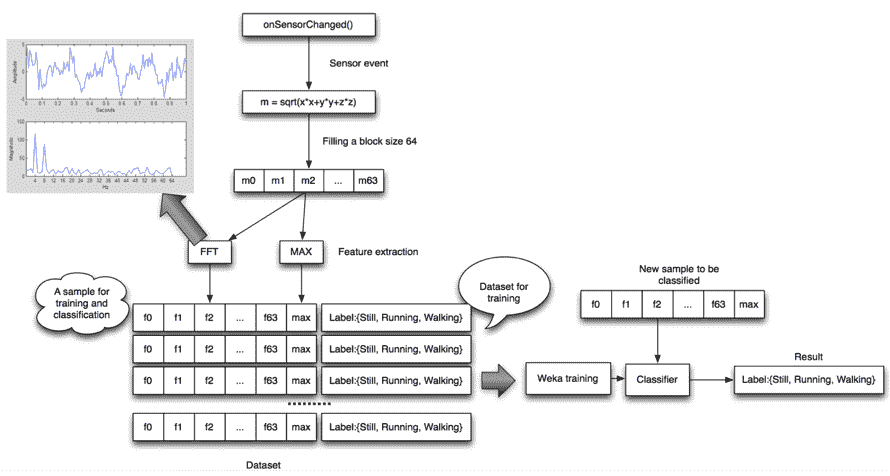
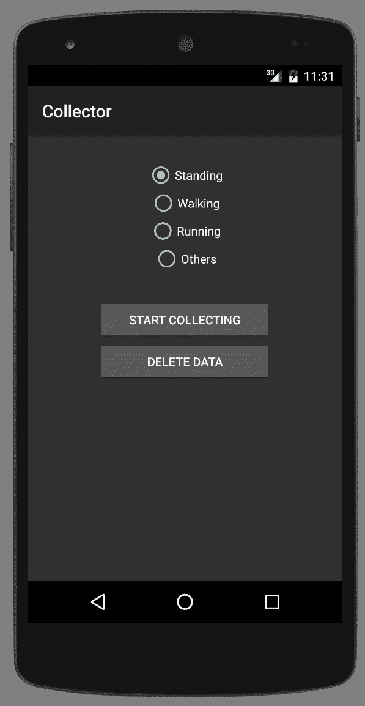
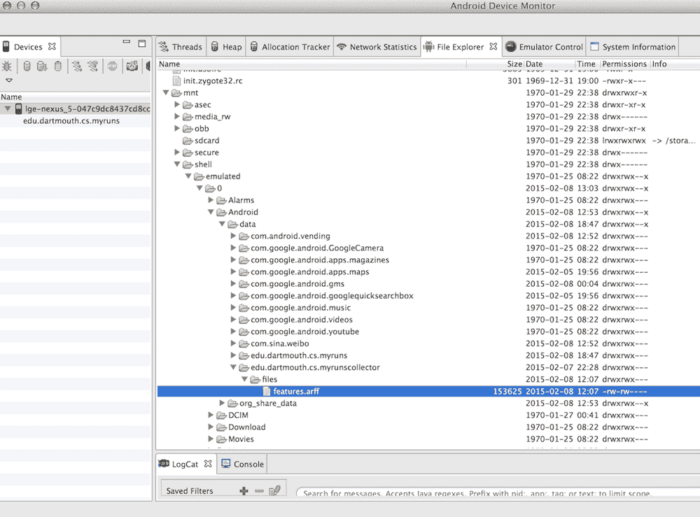

# 使用移动电话传感器进行活动识别

虽然上一章侧重于图像中的模式识别，但本章全部关于在传感器数据中识别模式，这与图像不同，具有时间依赖性。我们将讨论如何使用移动电话惯性传感器识别细粒度的日常活动，如行走、坐着和跑步。本章还提供了相关研究的参考文献，并强调了活动识别社区中的最佳实践。

本章将涵盖以下主题：

+   介绍活动识别，涵盖移动电话传感器和活动识别流程

+   从移动设备收集传感器数据

+   讨论活动分类和模型评估

+   部署活动识别模型

# 介绍活动识别

活动识别是行为分析的基础步骤，涉及健康生活方式、健身追踪、远程协助、安全应用、老年护理等。活动识别将来自加速度计、陀螺仪、压力传感器和 GPS 位置等传感器的低级传感器数据转换为对行为原语的高级描述。

在大多数情况下，这些是基本活动，例如以下图中所示的行走、坐着、躺着、跳跃等，或者它们可能是更复杂的行为，如去上班、准备早餐和购物等：



在本章中，我们将讨论如何将活动识别功能添加到移动应用程序中。我们首先将探讨活动识别问题是什么样的，我们需要收集哪些类型的数据，主要挑战是什么，以及如何解决这些问题。

之后，我们将通过一个示例来了解如何在 Android 应用程序中实际实现活动识别，包括数据收集、数据转换和构建分类器。

让我们开始吧！

# 移动电话传感器

让我们先回顾一下有哪些类型的移动电话传感器以及它们报告的内容。现在大多数智能设备都配备了几个内置传感器，这些传感器可以测量运动、位置、朝向和环境条件。由于传感器提供高精度、频率和准确性的测量，因此可以重建复杂用户运动、手势和动作。传感器常被集成到各种应用中；例如，陀螺仪读数用于在游戏中控制物体，GPS 数据用于定位用户，加速度计数据用于推断用户正在执行的活动，例如骑自行车、跑步或行走。

下图展示了传感器能够检测到的几种交互类型示例：



移动电话传感器可以分为以下三个广泛的类别：

+   **运动传感器**：此传感器测量沿三个垂直轴的加速度和旋转力。此类传感器包括加速度计、重力传感器和陀螺仪。

+   **环境传感器**：此传感器测量各种环境参数，如光照、空气温度、压力和湿度。此类包括气压计、光度计和温度计。

+   **位置传感器**：此传感器测量设备的物理位置。此类包括方向传感器和磁力计。

不同移动平台的更详细描述可在以下链接中找到：

+   **Android 传感器框架**：[`developer.android.com/guide/topics/sensors/sensors_overview.html`](http://developer.android.com/guide/topics/sensors/sensors_overview.html)

+   **iOS Core Motion 框架**：[`developer.apple.com/library/ios/documentation/CoreMotion/Reference/CoreMotion_Reference/`](https://developer.apple.com/library/ios/documentation/CoreMotion/Reference/CoreMotion_Reference/)

+   **Windows phone**：[`msdn.microsoft.com/en-us/library/windows/apps/hh202968(v=vs.105).aspx`](https://msdn.microsoft.com/en-us/library/windows/apps/hh202968(v=vs.105).aspx)

在本章中，我们将仅使用 Android 的传感器框架。

# 活动识别流程

与我们在前几章中看到的不同，对多维时间序列传感器数据进行分类本质上比分类传统名义数据更复杂。首先，每个观测值在时间上都与前一个和后一个观测值相关联，这使得仅对一组观测值进行直接分类变得非常困难。其次，传感器在不同时间点获得的数据是随机的，即由于传感器噪声、环境干扰等因素的影响，是不可预测的。此外，一项活动可以由以不同方式执行的各种子活动组成，每个人执行活动的方式也略有不同，这导致类内差异很大。最后，所有这些原因使得活动识别模型不够精确，导致新数据经常被错误分类。活动识别分类器的一个高度期望的特性是确保识别的活动序列的连续性和一致性。

为了应对这些挑战，活动识别被应用于以下流程，如图所示：


在第一步，我们尽可能地减少噪声，例如，通过降低传感器采样率、移除异常值、应用高通或低通滤波器等。在下一阶段，我们构建一个特征向量。例如，我们通过应用**离散傅里叶变换**（**DFT**）将传感器数据从时域转换为频域。DFT 是一种将一系列样本作为输入并返回按频率顺序排列的正弦系数列表的方法。它们代表了原始样本列表中存在的频率组合。

Pete Bevelacqua 在 [`www.thefouriertransform.com/`](http://www.thefouriertransform.com/) 写了一篇关于傅里叶变换的温和介绍。如果你想要获取关于傅里叶变换的更技术性和理论性的背景知识，可以查看罗伯特·加勒格尔和郑丽中在麻省理工学院开放课程中的第八和第九讲：[`theopenacademy.com/content/principles-digital-communication`](http://theopenacademy.com/content/principles-digital-communication)。

接下来，基于特征向量和训练数据集，我们可以构建一个活动识别模型，将原子动作分配给每个观察结果。因此，对于每个新的传感器读数，模型将输出最可能的动作标签。然而，模型会犯错误。因此，最后一个阶段通过移除在现实中不可能发生的转换来平滑活动之间的过渡；例如，活动从躺到站再到躺的转换在不到半秒内发生在物理上是不可能的，因此这种活动之间的转换被平滑为躺-躺-躺。

活动识别模型是通过监督学习方法构建的，包括训练和分类步骤。在训练步骤中，提供一组标记数据来训练模型。第二步是使用训练好的模型为新未见数据分配标签。两个阶段中的数据都必须使用相同的工具进行预处理，例如过滤和特征向量计算。

后处理阶段，即虚假活动的移除，也可以是一个模型本身，因此也需要一个学习步骤。在这种情况下，预处理步骤也包括活动识别，这使得这样的分类器排列成为一个元学习问题。为了避免过拟合，重要的是用于训练后处理阶段的训练数据集不能与用于训练活动识别模型的训练数据集相同。

# 计划

计划包括一个训练阶段和一个部署阶段。训练阶段可以归结为以下步骤：

1.  安装 Android Studio 并导入 `MyRunsDataCollector.zip`。

1.  在你的 Android 手机上加载应用程序。

1.  收集您的数据，例如站立、行走和跑步，并将数据转换为包含 FFT 的特征向量。不要慌张；我们不会从头开始编写低级信号处理函数，如 FFT，我们将使用现有的代码来完成这项工作。数据将被保存在您的手机上，文件名为 `features.arff`。

1.  使用导出的数据创建并评估一个活动识别分类器，并实现一个用于去除虚假活动转换的过滤器。

1.  将分类器重新连接到移动应用程序。

如果您没有 Android 手机，或者想跳过所有与移动应用程序相关的步骤，只需获取位于 `data/features.arff` 中的收集数据集，然后直接跳转到“构建分类器”部分。

# 从手机收集数据

本节描述了计划中的前三个步骤。如果您想直接处理数据，可以跳过本节，继续到“构建分类器”部分。该应用程序实现了收集不同活动类（例如站立、行走、跑步等）传感器数据的必要功能。

让我们从准备 Android 开发环境开始。如果您已经安装了它，请跳转到“加载数据收集器”部分。

# 安装 Android Studio

Android Studio 是 Android 平台的开发环境。我们将快速回顾启动手机上应用程序所需的安装步骤和基本配置。如果您想了解更多关于 Android 开发的信息，我推荐阅读 Kyle Mew 编著的 Packt Publishing 出版的入门书籍《Android 5 编程实例》。

在 [`developer.android.com/studio/`](https://developer.android.com/studio/) 为开发者获取最新的 Android Studio，并按照 [`developer.android.com/sdk/installing/index.html?pkg=studio`](http://developer.android.com/sdk/installing/index.html?pkg=studio) 中的安装说明进行操作。安装大约需要 10 分钟，大约占用 0.5 GB 的空间。

按照说明操作，选择您想要的安装选项，最后点击完成以开始安装，如下面的截图所示：



# 加载数据收集器

首先，从 GitHub 获取 `MyRunsDataCollector` 的源代码。一旦安装了 Android Studio，选择“打开现有的 Android Studio 项目”选项，如下面的截图所示，并选择 `MyRunsDataCollector` 文件夹。这将把项目导入到 Android Studio 中：



项目导入完成后，您应该能够看到项目文件结构，如下面的截图所示。收集器包括 `CollectorActivity.java`、`Globals.java` 和 `SensorsService.java`。项目还显示了实现低级信号处理的 `FFT.java`：



`myrunscollector`主包包含以下类：

+   `Globals.java`：这个类定义了全局常量，例如活动标签和 ID，以及数据文件名。

+   `CollectorActivity.java`：这个类实现了用户界面动作，即当按下特定按钮时会发生什么。

+   `SensorsService.java`：这个类实现了一个收集数据、计算特征向量（我们将在以下章节中讨论）并将数据存储到手机上的文件中的服务。

我们接下来要解决的问题是如何设计特征。

# 特征提取

找到一个人活动适当的表现形式可能是活动识别中最具挑战性的部分。行为需要用简单和通用的特征来表示，这样使用这些特征的模型也将是通用的，并且在不同行为上也能很好地工作。

实际上，设计针对训练集中捕获的观察特定特征并不困难；这些特征在它们身上会工作得很好。然而，由于训练集仅捕获人类行为范围的一部分，过于特定的特征可能在一般行为上失败：



让我们看看这在`MyRunsDataCollector`中的实现方式。当应用程序启动时，一个名为`onSensorChanged()`的方法会获取一个包含加速度计传感器读数的三元组（**x**、**y**和**z**）以及特定的时戳，并从传感器读数中计算振幅。方法会缓冲最多 64 个连续的振幅，在计算 FFT 系数之前标记它们。

现在，让我们继续实际数据收集。

# 收集训练数据

我们现在可以使用收集器来收集活动识别的训练数据。收集器默认支持三种活动：站立、行走和跑步，如下面的截图所示。

您可以选择一个活动，即目标类值，然后通过点击“开始收集”按钮开始记录数据。确保每个活动至少记录三分钟；例如，如果选择了行走活动，请按“开始收集”并至少行走三分钟。活动结束后，请按“停止收集”。对每个活动重复此操作。

你还可以收集涉及这些活动的不同场景，例如，在厨房里走动、在外面走动、成列行走等。通过这样做，你将为每个活动类别拥有更多数据，并且分类器会更好。有道理，对吧？数据越多，分类器就越不会困惑。如果你只有少量数据，就会发生过拟合，分类器会混淆类别——站立与行走、行走与跑步等。然而，数据越多，它们就越不容易混淆。在调试时，你可能每个类别收集不到三分钟的数据，但对你最终的产品来说，数据越多越好。多个录制实例将简单地累积在同一个文件中。

注意，删除数据按钮会删除存储在手机文件上的数据。如果你想重新开始，请在开始之前点击删除数据；否则，新收集的数据将被附加到文件末尾：



收集器实现了前几节中讨论的图：它收集加速度计样本，计算幅度，使用`FFT.java`类计算系数，并生成特征向量。然后，数据存储在 Weka 格式的`features.arff`文件中。特征向量的数量将根据你收集的数据量而变化。你收集数据的时间越长，累积的特征向量就越多。

一旦你停止使用收集工具收集训练数据，我们需要抓取数据以继续工作流程。我们可以使用 Android 设备监控器中的文件浏览器上传手机上的`features.arff`文件并将其存储在计算机上。你可以通过点击以下截图中的 Android 机器人图标来访问你的 Android 设备监控器：


通过在左侧选择你的设备，你可以在右侧看到你的手机存储内容。导航到`mnt/shell/emulated/Android/data/edu.dartmouth.cs.myrunscollector/files/features.arff`，如下截图所示：



要将此文件上传到你的计算机，你需要选择文件（它被突出显示）并点击上传。

现在，我们准备构建一个分类器。

# 构建分类器

一旦将传感器样本表示为特征向量并分配了类别，就可以应用标准的有监督分类技术，包括特征选择、特征离散化、模型学习、k-折交叉验证等。本章不会深入探讨机器学习算法的细节。任何支持数值特征的算法都可以应用，包括 SVMs、随机森林、AdaBoost、决策树、神经网络、多层感知器等。

因此，让我们从一个基本的开始：决策树。在这里，我们将加载数据集，构建类属性集，构建决策树模型，并输出模型：

```py
String databasePath = "/Users/bostjan/Dropbox/ML Java Book/book/datasets/chap9/features.arff"; 

// Load the data in arff format 
Instances data = new Instances(new BufferedReader(new 
   FileReader(databasePath))); 

// Set class the last attribute as class 
data.setClassIndex(data.numAttributes() - 1); 

// Build a basic decision tree model 
String[] options = new String[]{}; 
J48 model = new J48(); 
model.setOptions(options); 
model.buildClassifier(data); 

// Output decision tree 
System.out.println("Decision tree model:\n"+model); 
```

算法首先输出模型，如下所示：

```py
    Decision tree model:
    J48 pruned tree
    ------------------

    max <= 10.353474
    |   fft_coef_0000 <= 38.193106: standing (46.0)
    |   fft_coef_0000 > 38.193106
    |   |   fft_coef_0012 <= 1.817792: walking (77.0/1.0)
    |   |   fft_coef_0012 > 1.817792
    |   |   |   max <= 4.573082: running (4.0/1.0)
    |   |   |   max > 4.573082: walking (24.0/2.0)
    max > 10.353474: running (93.0)

    Number of Leaves  : 5

    Size of the tree : 9
```

树的结构相当简单且看似准确，因为终端节点中的多数类分布相当高。让我们运行一个基本的分类器评估来验证结果，如下所示：

```py
// Check accuracy of model using 10-fold cross-validation 
Evaluation eval = new Evaluation(data); 
eval.crossValidateModel(model, data, 10, new Random(1), new 
   String[] {}); 
System.out.println("Model performance:\n"+ 
   eval.toSummaryString()); 
```

这将输出以下模型性能：

```py
    Correctly Classified Instances         226               92.623  %
    Incorrectly Classified Instances        18                7.377  %
    Kappa statistic                          0.8839
    Mean absolute error                      0.0421
    Root mean squared error                  0.1897
    Relative absolute error                 13.1828 %
    Root relative squared error             47.519  %
    Coverage of cases (0.95 level)          93.0328 %
    Mean rel. region size (0.95 level)      27.8689 %
    Total Number of Instances              244     
```

分类准确率得分非常高，`92.62%`，这是一个惊人的结果。结果之所以如此之好，一个重要原因在于我们的评估设计。我的意思是以下内容：序列实例彼此非常相似，因此如果我们在一个 10 折交叉验证过程中随机分割它们，那么我们使用几乎相同的实例进行训练和测试的可能性很高；因此，直接的 k 折交叉验证会产生对模型性能的乐观估计。

一个更好的方法是使用与不同测量集或甚至不同人员相对应的折数。例如，我们可以使用该应用程序从五个人那里收集学习数据。然后，进行 k 个人交叉验证是有意义的，其中模型在四个人身上训练，在第五个人身上测试。对于每个人重复此过程，并将结果平均。这将给我们提供一个更现实的模型性能估计。

不考虑评估注释，让我们看看如何处理分类错误。

# 减少虚假转换

在活动识别管道的末尾，我们想要确保分类不是太波动，也就是说，我们不希望活动每毫秒都改变。一个基本的方法是设计一个过滤器，它忽略活动序列中的快速变化。

我们构建一个过滤器，它记住最后一个窗口活动并返回最频繁的一个。如果有多个活动具有相同的分数，它返回最近的一个。

首先，我们创建一个新的`SpuriousActivityRemoval`类，它将包含活动列表和`window`参数：

```py
class SpuriousActivityRemoval{ 

  List<Object> last; 
  int window; 

  public SpuriousActivityRemoval(int window){ 
    this.last = new ArrayList<Object>(); 
    this.window = window; 
  } 
```

接下来，我们创建`Object filter(Object)`方法，该方法将接受一个活动并返回一个过滤后的活动。该方法首先检查我们是否有足够的观察结果。如果没有，它简单地存储观察结果并返回相同的值，如下面的代码所示：

```py
  public Object filter(Object obj){ 
    if(last.size() < window){ 
      last.add(obj); 
      return obj; 
  } 
```

如果我们已收集了`window`观察结果，我们只需返回最频繁的观察结果，删除最老的观察结果，并插入新的观察结果：

```py
    Object o = getMostFrequentElement(last); 
    last.add(obj); 
    last.remove(0); 
    return o; 
  } 
```

这里缺少的是一个从对象列表中返回最频繁元素的函数。我们使用哈希映射来实现这一点，如下所示：

```py
  private Object getMostFrequentElement(List<Object> list){ 

    HashMap<String, Integer> objectCounts = new HashMap<String, 
       Integer>(); 
    Integer frequntCount = 0; 
    Object frequentObject = null; 
```

现在，我们遍历列表中的所有元素，将每个唯一元素插入到哈希映射中，或者如果它已经在哈希映射中，则更新其计数器。循环结束时，我们存储迄今为止找到的最频繁元素，如下所示：

```py
    for(Object obj : list){ 
      String key = obj.toString(); 
      Integer count = objectCounts.get(key); 
      if(count == null){ 
        count = 0; 
      } 
      objectCounts.put(key, ++count); 

      if(count >= frequntCount){ 
        frequntCount = count; 
        frequentObject = obj; 
      } 
    } 

    return frequentObject; 
  } 

} 
```

让我们运行一个简单的例子：

```py
String[] activities = new String[]{"Walk", "Walk", "Walk", "Run", 
   "Walk", "Run", "Run", "Sit", "Sit", "Sit"}; 
SpuriousActivityRemoval dlpFilter = new 
   SpuriousActivityRemoval(3); 
for(String str : activities){ 
  System.out.println(str +" -> "+ dlpFilter.filter(str)); 
} 
```

示例输出了以下活动：

```py
    Walk -> Walk
    Walk -> Walk
    Walk -> Walk
    Run -> Walk
    Walk -> Walk
    Run -> Walk
    Run -> Run
    Sit -> Run
    Sit -> Run
    Sit -> Sit
```

结果是一个连续的活动序列，也就是说，我们没有快速的变化。这增加了一些延迟，但除非这对应用程序至关重要，否则是可以接受的。

通过将分类器识别的前*n*个活动附加到特征向量中，可以增强活动识别。将先前活动附加的危险是，机器学习算法可能会学习到当前活动总是与先前活动相同，因为这种情况通常会发生。可以通过拥有两个分类器 A 和 B 来解决这个问题：分类器 B 的属性向量包含由分类器 A 识别的*n*个先前活动。分类器 A 的属性向量不包含任何先前活动。这样，即使 B 对先前活动给予了很大的权重，由 A 识别的先前活动也会随着 A 不受 B 惯性的影响而改变。

剩下的工作是将分类器和过滤器嵌入到我们的移动应用程序中。

# 将分类器插入到移动应用中

有两种方法可以将分类器集成到移动应用程序中。第一种方法涉及使用 Weka 库将模型导出为 Weka 格式，将 Weka 库作为我们的移动应用程序的依赖项，加载模型等。该过程与我们在第三章中看到的示例相同，即*基本算法-分类、回归和聚类*。第二种方法更轻量级：我们将模型导出为源代码，例如，我们创建一个实现决策树分类器的类。然后，我们可以简单地复制并粘贴源代码到我们的移动应用中，甚至不需要导入任何 Weka 依赖项。

幸运的是，一些 Weka 模型可以通过`toSource(String)`函数轻松导出为源代码：

```py
// Output source code implementing the decision tree 
System.out.println("Source code:\n" +  
  model.toSource("ActivityRecognitionEngine")); 
```

这将输出一个与我们的模型相对应的`ActivityRecognitionEngine`类。现在，让我们更仔细地看看输出代码：

```py
class ActivityRecognitionEngine { 

  public static double classify(Object[] i) 
    throws Exception { 

    double p = Double.NaN; 
    p = ActivityRecognitionEngine.N17a7cec20(i); 
    return p; 
  } 
  static double N17a7cec20(Object []i) { 
    double p = Double.NaN; 
    if (i[64] == null) { 
      p = 1; 
    } else if (((Double) i[64]).doubleValue() <= 10.353474) { 
    p = ActivityRecognitionEngine.N65b3120a1(i); 
    } else if (((Double) i[64]).doubleValue() > 10.353474) { 
      p = 2; 
    }  
    return p; 
  } 
... 
```

输出的`ActivityRecognitionEngine`类实现了我们之前讨论的决策树。机器生成的函数名，如`N17a7cec20(Object [])`，对应于决策树节点。可以通过`classify(Object[])`方法调用分类器，其中我们应该传递通过与之前章节中讨论的相同程序获得的特征向量。像往常一样，它返回一个`double`值，表示类标签索引。

# 摘要

在本章中，我们讨论了如何为移动应用程序实现活动识别模型。我们探讨了整个流程，包括数据收集、特征提取、模型构建、评估和模型部署。

在下一章中，我们将继续介绍另一个针对文本分析的 Java 库：Mallet。
