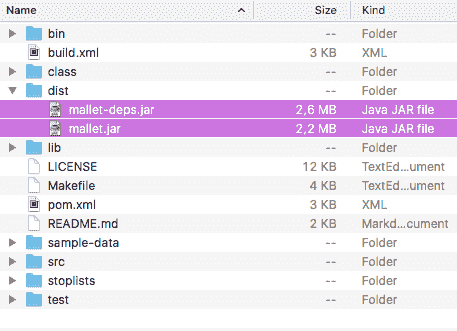
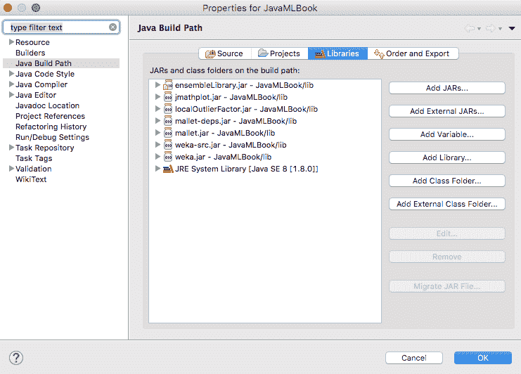
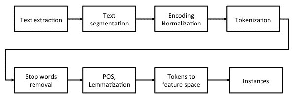
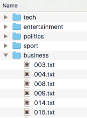
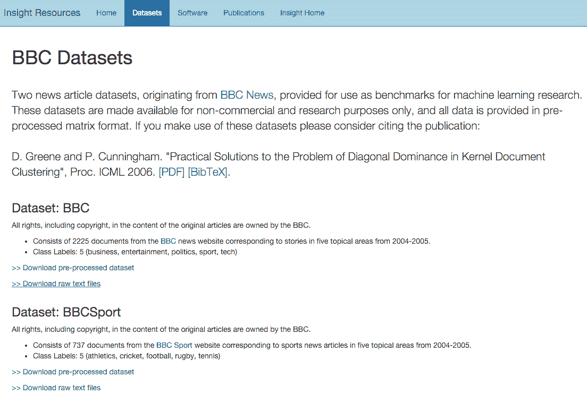
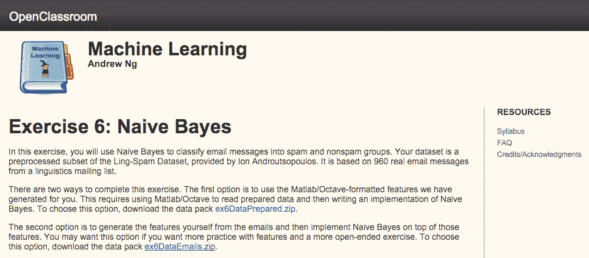
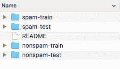
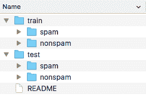

# 第十章：使用 Mallet 进行文本挖掘 - 主题建模和垃圾邮件检测

在本章中，我们将首先讨论什么是**文本挖掘**，它能提供什么样的分析，以及为什么你可能想在你的应用中使用它。然后我们将讨论如何使用**Mallet**，这是一个用于自然语言处理的 Java 库，涵盖数据导入和文本预处理。之后，我们将探讨两个文本挖掘应用：**主题建模**，我们将讨论如何使用文本挖掘来识别文本文档中的主题，而无需逐个阅读它们，以及**垃圾邮件检测**，我们将讨论如何自动将文本文档分类到类别中。

本章将涵盖以下主题：

+   介绍文本挖掘

+   安装和使用 Mallet

+   主题建模

+   垃圾邮件检测

# 介绍文本挖掘

文本挖掘，或文本分析，是指从文本文档中自动提取高质量信息的过程，这些文档通常是用自然语言编写的，其中高质量信息被认为是相关的、新颖的和有趣的。

当一个典型的文本分析应用被用来扫描一组文档以生成搜索索引时，文本挖掘可以应用于许多其他应用，包括将文本分类到特定领域；通过文本聚类自动组织一组文档；情感分析以识别和提取文档中的主观信息；概念或实体提取，能够从文档中识别人、地点、组织和其他实体；文档摘要以自动提供原始文档中的最重要观点；以及学习命名实体之间的关系。

基于统计模式挖掘的过程通常涉及以下步骤：

1.  信息检索和提取

1.  将非结构化文本数据转换为结构化数据；例如，解析、去除噪声词、词汇分析、计算词频和推导语言特征

1.  从结构化数据中发现模式并进行标记或注释

1.  结果的评估和解释

在本章的后面部分，我们将探讨两个应用领域：主题建模和**文本分类**。让我们来看看它们能带来什么。

# 主题建模

主题建模是一种无监督技术，如果你需要分析大量的文本文档档案并希望了解档案包含的内容，这可能很有用，而不必亲自阅读每一份文档。文本文档可以是博客文章、电子邮件、推文、文档、书籍章节、日记条目等。主题建模在文本语料库中寻找模式；更确切地说，它通过统计上有意义的单词列表来识别主题。最著名的算法是**潜在狄利克雷分配**（**LDA**），它假设作者通过从可能的单词篮子中选择单词来创作文本，每个篮子对应一个主题。利用这个假设，可以将文本从最可能的单词来源篮子中数学分解出来。然后算法重复这个过程，直到收敛到最可能的单词分布到篮子中的分布，我们称之为*主题*。

例如，如果我们对一系列新闻文章进行主题建模，算法将返回一个包含这些主题的可能关键词列表。以新闻文章为例，列表可能看起来像以下这样：

+   胜利者、进球、足球、得分、第一名

+   公司、股票、银行、信贷、商业

+   选举、对手、总统、辩论、即将到来

通过查看关键词，我们可以识别出新闻文章涉及体育、商业、即将到来的选举等内容。在本章的后面部分，我们将学习如何使用新闻文章的例子来实现主题建模。

# 文本分类

在文本分类，或文本分类中，目标是根据其内容将文本文档分配到一类或多类，这些类别通常是一个更广泛的主题领域，如车辆或宠物。这样的通用类别被称为主题，此时的分类任务被称为**文本分类**、**文本分类**、**主题分类**或**主题检测**。虽然文档可以根据其他属性进行分类，如文档类型、作者和出版年份，但本章的重点将仅限于文档内容。以下是一些文本分类的例子：

+   电子邮件中的垃圾邮件检测、用户评论、网页等

+   性内容检测

+   情感检测，它自动将产品或服务评论分类为正面或负面

+   根据内容对电子邮件进行排序

+   主题特定搜索，其中搜索引擎将搜索限制在特定主题或类型，从而提供更准确的结果

这些例子显示了文本分类在信息检索系统中的重要性；因此，大多数现代信息检索系统都使用某种形式的文本分类器。本书中将用作例子的分类任务是检测电子邮件垃圾邮件的文本分类。

我们将继续本章，介绍 Mallet，这是一个基于 Java 的用于统计自然语言处理、文档分类、聚类、主题建模、信息提取和其他机器学习应用文本的软件包。然后我们将介绍两个文本分析应用，即主题建模和作为文本分类的垃圾邮件检测。

# 安装 Mallet

Mallet 可在马萨诸塞大学阿默斯特分校网站[`mallet.cs.umass.edu/download.php`](http://mallet.cs.umass.edu/download.php)下载。导航到下载部分，如以下截图所示，并选择最新的稳定版本（**2.0.8**，本书编写时）：


下载 ZIP 文件并提取内容。在提取的目录中，你应该找到一个名为`dist`的文件夹，其中包含两个 JAR 文件：`mallet.jar`和`mallet-deps.jar`。第一个包含所有打包的 Mallet 类，而第二个包含所有依赖项。我们将把这两个 JAR 文件作为引用库包含到你的项目中，如以下截图所示：



如果你使用 Eclipse，右键单击项目，选择属性，然后选择 Java 构建路径。选择库选项卡，点击添加外部 JAR 文件。现在，选择两个 JAR 文件并确认，如以下截图所示：



现在我们已经准备好开始使用 Mallet 了。

# 处理文本数据

文本挖掘的主要挑战之一是将非结构化的自然语言文本转换为基于属性的实例。这个过程涉及许多步骤，如下所示：



首先，我们从互联网、现有文档或数据库中提取一些文本。在第一步结束时，文本可能仍然以 XML 格式或其他专有格式存在。下一步是从实际文本中提取文本并将其分割成文档的部分，例如标题、标题、摘要和正文。第三步涉及对文本编码进行标准化，以确保字符以相同的方式呈现；例如，以 ASCII、ISO 8859-1 和 Windows-1250 等格式编码的文档被转换为 Unicode 编码。接下来，分词将文档分割成特定的单词，而下一步则移除通常具有低预测能力的频繁单词，例如 the、a、I 和 we。

**词性标注**（**POS**）和词形还原步骤可以包括将每个标记转换为它的基本形式，这被称为**词元**，通过去除词尾和修饰词来实现。例如，running 变为 run，而 better 变为 good。一种简化的方法是词干提取，它在一个单词上操作，没有任何上下文，因此无法区分具有不同意义的单词，例如，axes 作为 axe 的复数形式以及 axis。

最后一步将标记转换为特征空间。通常，特征空间是**词袋模型**（**BoW**）的表示。在这个表示中，创建了一个包含数据集中所有单词的集合。然后，每个文档都表示为一个向量，该向量统计特定单词在文档中出现的次数。

考虑以下两个句子的例子：

+   Jacob likes table tennis. Emma likes table tennis too

+   Jacob also likes basketball

在这个例子中，BoW（词袋模型）由以下单词组成：{Jacob, likes, table, tennis, Emma, too, also, basketball}，共有八个不同的单词。现在可以将这两个句子表示为向量，使用列表的索引表示特定索引处的单词在文档中出现的次数，如下所示：

+   [1, 2, 2, 2, 1, 0, 0, 0]

+   [1, 1, 0, 0, 0, 0, 1, 1]

这样的向量最终成为进一步学习的实例。

基于 BoW 模型的一个非常强大的展示方式是**word2vec**。Word2vec 是由 Google 的研究团队，以 Tomas Mikolov 为首，在 2013 年引入的。Word2vec 是一个神经网络，它学习单词的分布式表示。这种展示的一个有趣特性是单词出现在簇中，因此可以使用向量数学重现一些单词关系，例如类比。一个著名的例子表明，king−man+woman 返回 queen。更多细节和实现可以在以下链接中找到：[`code.google.com/archive/p/word2vec/`](https://code.google.com/archive/p/word2vec/).

# 导入数据

在本章中，我们不会探讨如何从网站抓取一组文档或从数据库中提取它们。相反，我们将假设我们已经将它们收集为文档集，并以`.txt`文件格式存储。现在让我们看看加载它们的两种选项。第一种选项解决的是每个文档都存储在其自己的`.txt`文件中的情况。第二种选项解决的是所有文档都存储在单个文件中，每行一个文档的情况。

# 从目录导入

Mallet 支持使用`cc.mallet.pipe.iterator.FileIterator`类从目录中读取。文件迭代器是通过以下三个参数构建的：

+   包含文本文件的`File[]`目录列表

+   一个文件过滤器，用于指定在目录中要选择哪些文件

+   应用到文件名上以产生类标签的模式

考虑以下截图所示的数据结构。我们按照五个主题（`tech`、`entertainment`、`politics`、`sport`和`business`）将文档组织在文件夹中。每个文件夹包含特定主题的文档，如下截图所示：



在这种情况下，我们初始化`iterator`如下：

```py
FileIterator iterator = 
  new FileIterator(new File[]{new File("path-to-my-dataset")}, 
  new TxtFilter(), 
  FileIterator.LAST_DIRECTORY); 
```

第一个参数指定了我们的根文件夹的路径，第二个参数将迭代器限制为仅`.txt`文件，而最后一个参数要求方法使用路径中的最后一个目录名作为类标签。

# 从文件导入

加载文档的另一种选项是通过`cc.mallet.pipe.iterator.CsvIterator.CsvIterator(Reader, Pattern, int, int, int)`，它假设所有文档都在一个文件中，并且通过正则表达式提取每一行返回一个实例。该类通过以下组件初始化：

+   `Reader`：这是一个对象，指定如何从文件中读取

+   `Pattern`：这是一个正则表达式，提取三个组：数据、目标标签和文档名

+   `int, int, int`：这些是正则表达式中数据、目标和名称组的索引

考虑以下格式的文本文档，指定文档名称、类别和内容：

```py
AP881218 local-news A 16-year-old student at a private 
   Baptist...  
AP880224 business The Bechtel Group Inc. offered in 1985 to...  
AP881017 local-news A gunman took a 74-year-old woman hostage...  
AP900117 entertainment Cupid has a new message for lovers 
   this...  
AP880405 politics The Reagan administration is weighing w...  
```

要将一行解析为三个组，我们可以使用以下正则表达式：

```py
^(\\S*)[\\s,]*(\\S*)[\\s,]*(.*)$
```

在括号`()`中出现了三个组，其中第三个组包含数据，第二个组包含目标类，第一个组包含文档 ID。`iterator`的初始化如下：

```py
CsvIterator iterator = new CsvIterator ( 
fileReader, 
Pattern.compile("^(\\S*)[\\s,]*(\\S*)[\\s,]*(.*)$"), 
  3, 2, 1)); 
```

在这里，正则表达式提取了由空格分隔的三个组，其顺序为`3, 2, 1`。

现在让我们转向数据预处理管道。

# 预处理文本数据

一旦初始化了一个将遍历数据的迭代器，我们需要将数据通过本节开头所述的一系列转换传递。Mallet 通过管道和一系列可以包含在管道中的步骤来支持此过程，这些步骤收集在`cc.mallet.pipe`包中。以下是一些示例：

+   `Input2CharSequence`：这是一个管道，可以从各种文本源（无论是 URL、文件还是读取器）读取到`CharSequence`

+   `CharSequenceRemoveHTML`：这个管道从`CharSequence`中移除 HTML

+   `MakeAmpersandXMLFriendly`：这会将标记序列中的`&`转换为`&amp`

+   `TokenSequenceLowercase`：这会将数据字段中每个标记序列中的文本转换为小写

+   `TokenSequence2FeatureSequence`：这会将每个实例的数据字段中的标记序列转换为特征序列

+   `TokenSequenceNGrams`：这会将数据字段中的标记序列转换为 ngrams 的标记序列，即两个或更多单词的组合

完整的处理步骤列表可以在以下 Mallet 文档中找到：[`mallet.cs.umass.edu/api/index.html?cc/mallet/pipe/iterator/package-tree.html`](http://mallet.cs.umass.edu/api/index.html?cc/mallet/pipe/iterator/package-tree.html)。

现在我们已经准备好构建一个将导入我们的数据的类。我们将使用以下步骤来完成：

1.  让我们构建一个管道，其中每个处理步骤在 Mallet 中用一个管道表示。管道可以通过`ArrayList<Pipe>`对象列表以串行方式连接起来：

```py
ArrayList<Pipe> pipeList = new ArrayList<Pipe>(); 
```

1.  让我们从读取文件对象中的数据并转换所有字符为小写开始：

```py
pipeList.add(new Input2CharSequence("UTF-8")); 
pipeList.add( new CharSequenceLowercase() );
```

1.  我们将使用正则表达式对原始字符串进行分词。以下模式包括 Unicode 字母、数字和下划线字符：

```py
Pattern tokenPattern = 
Pattern.compile("[\\p{L}\\p{N}_]+"); 

pipeList.add(new CharSequence2TokenSequence(tokenPattern)); 
```

1.  我们现在将移除停用词，即没有预测能力的频繁单词，使用标准的英语停用词表。两个额外的参数指示是否应区分大小写以及是否标记删除而不是简单地删除单词。我们将它们都设置为`false`：

```py
pipeList.add(new TokenSequenceRemoveStopwords(new File(stopListFilePath), "utf-8", false, false, false));
```

1.  我们可以将实际的单词转换为整数，表示在 BoW（词袋模型）中的单词索引，而不是存储实际的单词：

```py
pipeList.add(new TokenSequence2FeatureSequence()); 
```

1.  我们将对类别标签做同样的处理；而不是使用标签字符串，我们将使用一个整数，表示标签在词袋中的位置：

```py
pipeList.add(new Target2Label()); 
```

1.  我们也可以通过调用`PrintInputAndTarget`管道来打印特征和标签：

```py
pipeList.add(new PrintInputAndTarget()); 
```

1.  我们将管道列表存储在`SerialPipes`类中，该类将通过一系列管道转换实例：

```py
SerialPipes pipeline = new SerialPipes(pipeList); 
```

现在，让我们看看如何在文本挖掘应用中应用这个方法！

# BBC 新闻的主题建模

如前所述，主题建模的目标是识别文本语料库中与文档主题相对应的模式。在这个例子中，我们将使用来自 BBC 新闻的数据集。这个数据集是机器学习研究中的标准基准之一，可用于非商业和研究目的。

目标是构建一个能够将一个未分类的文档分配到某个主题的分类器。

# BBC 数据集

2006 年，格林和坎宁安收集了 BBC 数据集来研究一个特定的文档——*使用支持向量机的聚类挑战*。该数据集包含来自 2004 年至 2005 年 BBC 新闻网站上的 2,225 个文档，对应于从五个主题领域收集的故事：商业、娱乐、政治、体育和技术。该数据集可以在以下网站上查看：[`mlg.ucd.ie/datasets/bbc.html`](http://mlg.ucd.ie/datasets/bbc.html)。

我们可以在“数据集：BBC”部分下下载原始文本文件。你还会注意到该网站包含一个已经处理过的数据集，但在这个例子中，我们想要自己处理数据集。ZIP 文件包含五个文件夹，每个文件夹对应一个主题。实际的文档放置在相应的主题文件夹中，如下面的截图所示：



现在，让我们构建一个主题分类器。

# 建模

我们将使用以下步骤开始建模阶段：

1.  我们将首先导入数据集并使用以下代码行处理文本：

```py
import cc.mallet.types.*; 
import cc.mallet.pipe.*; 
import cc.mallet.pipe.iterator.*; 
import cc.mallet.topics.*; 

import java.util.*; 
import java.util.regex.*; 
import java.io.*; 

public class TopicModeling { 

  public static void main(String[] args) throws Exception { 

String dataFolderPath = "data/bbc"; 
String stopListFilePath = "data/stoplists/en.txt"; 
```

1.  我们将创建一个默认的`pipeline`对象，如之前所述：

```py
ArrayList<Pipe> pipeList = new ArrayList<Pipe>(); 
pipeList.add(new Input2CharSequence("UTF-8")); 
Pattern tokenPattern = Pattern.compile("[\\p{L}\\p{N}_]+"); 
pipeList.add(new CharSequence2TokenSequence(tokenPattern)); 
pipeList.add(new TokenSequenceLowercase()); 
pipeList.add(new TokenSequenceRemoveStopwords(new File(stopListFilePath), "utf-8", false, false, false)); 
pipeList.add(new TokenSequence2FeatureSequence()); 
pipeList.add(new Target2Label()); 
SerialPipes pipeline = new SerialPipes(pipeList); 
```

1.  接下来，我们将初始化`folderIterator`对象：

```py
FileIterator folderIterator = new FileIterator( 
    new File[] {new File(dataFolderPath)}, 
    new TxtFilter(), 
    FileIterator.LAST_DIRECTORY);
```

1.  我们现在将使用我们想要用于处理文本的`pipeline`构建一个新的实例列表：

```py
InstanceList instances = new InstanceList(pipeline);
```

1.  我们处理`iterator`提供的每个实例：

```py
instances.addThruPipe(folderIterator); 
```

1.  现在让我们使用`cc.mallet.topics.ParallelTopicModel.ParallelTopicModel`类创建一个具有五个主题的模型，该类实现了一个简单的线程化 LDA 模型。LDA 是主题建模中常用的方法，它使用狄利克雷分布来估计所选主题生成特定文档的概率。我们不会在本章深入探讨细节；读者可参考 D. Blei 等人（2003 年）的原始论文。

注意：在机器学习中，还有一个具有相同缩写的分类算法，它指的是**线性判别分析**（**LDA**）。除了常见的缩写外，它与 LDA 模型没有共同之处。

该类使用 alpha 和 beta 参数实例化，可以广泛解释如下：

+   高 alpha 值意味着每个文档很可能包含大多数主题的混合，而不是任何单个主题。低 alpha 值对文档的这种约束较少，这意味着文档可能只包含少数，甚至只有一个主题的混合。

+   高 beta 值意味着每个主题很可能包含大多数单词的混合，而不是任何特定的单词；而低值则意味着一个主题可能只包含少数单词的混合。

在我们的案例中，我们最初将两个参数都保持得很低（alpha_t = `0.01`, beta_w = `0.01`），因为我们假设我们的数据集中的主题混合不多，每个主题都有许多单词：

```py
int numTopics = 5; 
ParallelTopicModel model =  
new ParallelTopicModel(numTopics, 0.01, 0.01); 
```

1.  我们将向模型添加`instances`，由于我们使用并行实现，我们将指定并行运行的线程数，如下所示：

```py
model.addInstances(instances); 
model.setNumThreads(4);
```

1.  我们现在将运行模型进行选定次数的迭代。每次迭代都用于更好地估计内部 LDA 参数。对于测试，我们可以使用少量迭代，例如，50 次；而在实际应用中，使用`1000`或`2000`次迭代。最后，我们将调用`void estimate()`方法，实际上将构建一个 LDA 模型：

```py
model.setNumIterations(1000); 
model.estimate(); 
```

模型输出以下结果：

```py
    0 0,06654  game england year time win world 6 
    1 0,0863  year 1 company market growth economy firm 
    2 0,05981  people technology mobile mr games users music 
    3 0,05744  film year music show awards award won 
    4 0,11395  mr government people labour election party blair 

    [beta: 0,11328] 
    <1000> LL/token: -8,63377

    Total time: 45 seconds

```

`LL/token`表示模型的对数似然，除以总标记数，表示数据在模型下的可能性。值的增加意味着模型正在改进。

输出还显示了描述每个主题的前几个单词。这些单词与初始主题非常吻合：

+   **主题 0**：`game`、`england`、`year`、`time`、`win`、`world`、`6` ⇒ 体育

+   **主题 1**：`year`、`1`、`company`、`market`、`growth`、`economy`、`firm` ⇒ 金融

+   **主题 2**：`people`、`technology`、`mobile`、`mr`、`games`、`users`、`music`⇒技术

+   **主题 3**：`film`、`year`、`music`、`show`、`awards`、`award`、`won`⇒娱乐

+   **主题 4**：`mr`、`government`、`people`、`labor`、`election`、`party`、`blair`⇒政治

仍然有一些词没有太多意义，例如`mr`、`1`和`6`。我们可以将它们包含在停用词列表中。此外，一些词出现了两次，例如`award`和`awards`。这是因为我们没有应用任何词干提取或词形还原管道。

在下一节中，我们将检查模型是否表现良好。

# 评估模型

由于统计主题建模具有无监督的性质，这使得模型选择变得困难。对于某些应用，可能有一些外在任务在手，例如信息检索或文档分类，其性能可以评估。然而，一般来说，我们想要估计模型泛化主题的能力，无论任务如何。

2009 年，Wallach 等人提出了一种通过在模型下计算保留文档的对数概率来衡量模型质量的方法。未观察到的文档的似然性可以用来比较模型——更高的似然性意味着更好的模型。

我们将使用以下步骤评估模型：

1.  让我们将文档分为训练集和测试集（即保留的文档），其中我们使用 90%进行训练，10%进行测试：

```py
// Split dataset 
InstanceList[] instanceSplit= instances.split(new Randoms(), new 
   double[] {0.9, 0.1, 0.0}); 
```

1.  现在，让我们仅使用我们文档的`90%`重建我们的模型：

```py
// Use the first 90% for training 
model.addInstances(instanceSplit[0]); 
model.setNumThreads(4); 
model.setNumIterations(50); 
model.estimate(); 
```

1.  我们将初始化一个实现 Wallach 的保留文档对数概率的`estimator`对象，即`MarginalProbEstimator`：

```py
// Get estimator 
MarginalProbEstimator estimator = model.getProbEstimator(); 
```

LDA 的直观描述由 Annalyn Ng 在她的博客中总结：[`annalyzin.wordpress.com/2015/06/21/laymans-explanation-of-topic-modeling-with-lda-2/`](https://annalyzin.wordpress.com/2015/06/21/laymans-explanation-of-topic-modeling-with-lda-2/)。要深入了解 LDA 算法、其组件和工作原理，请查看 David Blei 等人于 2003 年发表的原始论文 LDA，网址为[`jmlr.csail.mit.edu/papers/v3/blei03a.html`](http://jmlr.csail.mit.edu/papers/v3/blei03a.html)，或者查看布朗大学 D. Santhanam 的总结演示，网址为[`www.cs.brown.edu/courses/csci2950-p/spring2010/lectures/2010-03-03_santhanam.pdf`](http://www.cs.brown.edu/courses/csci2950-p/spring2010/lectures/2010-03-03_santhanam.pdf)。

该类实现了许多需要相当深入的理论知识来了解 LDA 方法如何工作的估计器。我们将选择从左到右的评估器，它适用于广泛的用途，包括文本挖掘和语音识别。从左到右的评估器作为`double evaluateLeftToRight`方法实现，接受以下组件：

+   `Instances heldOutDocuments`：这测试实例。

+   `int numParticles`：此算法参数表示从左到右的标记数量，默认值为 10。

+   `boolean useResampling`：这表示是否在从左到右评估时重新采样主题；重新采样更准确，但会导致文档长度的平方级缩放。

+   `PrintStream docProbabilityStream`：这是写入每个文档推断的对数概率的文件或`stdout`。

1.  让我们按照以下方式运行`estimator`：

```py
double loglike = estimator.evaluateLeftToRight( 
  instanceSplit[1], 10, false, null);); 
System.out.println("Total log likelihood: "+loglike); 
```

在我们的特定情况下，`estimator`输出了以下`log likelihood`，当与其他使用不同参数、管道或数据构建的模型进行比较时是有意义的——对数似然越高，模型越好：

```py
    Total time: 3 seconds
    Topic Evaluator: 5 topics, 3 topic bits, 111 topic mask
    Total log likelihood: -360849.4240795393
```

现在，让我们看看如何利用这个模型。

# 重复使用模型

由于我们通常不会即时构建模型，因此一次性训练一个模型并重复使用它来分类新数据通常是有意义的。

注意，如果您想对新的文档进行分类，它们需要经过与其他文档相同的管道——管道对于训练和分类都应该是相同的。在训练过程中，管道的数据字母表会随着每个训练实例的更新而更新。如果您创建了一个具有相同步骤的新管道，您不会产生相同的管道，因为其数据字母表是空的。因此，为了在新数据上使用模型，我们必须保存或加载管道以及模型，并使用此管道添加新实例。

# 保存模型

Mallet 支持基于序列化的保存和恢复对象的标准方法。

我们只需创建一个`ObjectOutputStream`类的新实例，并将对象写入文件，如下所示：

```py
String modelPath = "myTopicModel"; 

//Save model 
ObjectOutputStream oos = new ObjectOutputStream( 
new FileOutputStream (new File(modelPath+".model"))); 
oos.writeObject(model); 
oos.close();    

//Save pipeline 
oos = new ObjectOutputStream( 
new FileOutputStream (new File(modelPath+".pipeline"))); 
oos.writeObject(pipeline); 
oos.close(); 
```

# 恢复模型

通过序列化保存的模型恢复是一个使用`ObjectInputStream`类的逆操作：

```py
String modelPath = "myTopicModel"; 

//Load model 
ObjectInputStream ois = new ObjectInputStream( 
  new FileInputStream (new File(modelPath+".model"))); 
ParallelTopicModel model = (ParallelTopicModel) ois.readObject(); 
ois.close();    

// Load pipeline 
ois = new ObjectInputStream( 
  new FileInputStream (new File(modelPath+".pipeline"))); 
SerialPipes pipeline = (SerialPipes) ois.readObject(); 
ois.close();    
```

我们讨论了如何构建一个 LDA 模型来自动将文档分类到主题。在下一个示例中，我们将探讨另一个文本挖掘问题——文本分类。

# 检测邮件垃圾邮件

垃圾邮件或电子垃圾邮件是指未经请求的消息，通常携带广告内容、感染附件、钓鱼网站或恶意软件链接等。虽然最广为人知的垃圾邮件形式是电子邮件垃圾邮件，但垃圾邮件滥用也出现在其他媒体中：网站评论、即时消息、互联网论坛、博客、在线广告等。

在本章中，我们将讨论如何使用 BoW 表示法构建朴素贝叶斯垃圾邮件过滤，这是一种在第一个商业垃圾邮件过滤器中实现的基本技术；例如，Mozilla Thunderbird 邮件客户端使用此类过滤的原生实现。虽然本章的示例将使用邮件垃圾邮件，但底层方法也可以应用于其他类型的基于文本的垃圾邮件。

# 邮件垃圾邮件数据集

在 2000 年，安德鲁特斯波洛斯等人收集了第一个电子邮件垃圾邮件数据集，用于评估垃圾邮件过滤算法。他们研究了如何使用朴素贝叶斯分类器来检测垃圾邮件，以及额外的管道，如停用词列表、词干提取和词形还原是否有助于提高性能。该数据集由 Andrew Ng 在 OpenClassroom 的机器学习课程中重新组织，可在[`openclassroom.stanford.edu/MainFolder/DocumentPage.php?course=MachineLearning&doc=exercises/ex6/ex6.html`](http://openclassroom.stanford.edu/MainFolder/DocumentPage.php?course=MachineLearning&doc=exercises/ex6/ex6.html)下载。

选择并下载第二个选项，`ex6DataEmails.zip`，如图所示：



ZIP 文件包含以下文件夹：

+   `nonspam-train`和`spam-train`文件夹包含用于训练的预处理电子邮件，每个文件夹有 350 封电子邮件。

+   `nonspam-test`和`spam-test`文件夹构成了测试集，包含 130 封垃圾邮件和 130 封非垃圾邮件。这些是你将进行预测的文档。请注意，尽管单独的文件夹告诉你正确的标签，但你应该在没有这种知识的情况下对所有测试文档进行预测。在你做出预测后，你可以使用正确的标签来检查你的分类是否正确。

为了利用 Mallet 的文件夹迭代器，让我们重新组织文件夹结构如下。我们将创建两个文件夹，`train`和`test`，并将`spam/nospam`文件夹放在相应的文件夹下。初始文件夹结构如图所示：



最终文件夹结构将如图所示：



下一步是将电子邮件消息转换为特征向量。

# 特征生成

我们将使用以下步骤进行特征生成：

1.  我们将创建一个默认的管道，如前所述：

```py
ArrayList<Pipe> pipeList = new ArrayList<Pipe>(); 
pipeList.add(new Input2CharSequence("UTF-8")); 
Pattern tokenPattern = Pattern.compile("[\\p{L}\\p{N}_]+"); 
pipeList.add(new CharSequence2TokenSequence(tokenPattern)); 
pipeList.add(new TokenSequenceLowercase()); 
pipeList.add(new TokenSequenceRemoveStopwords(new 
   File(stopListFilePath), "utf-8", false, false, false)); 
pipeList.add(new TokenSequence2FeatureSequence()); 
pipeList.add(new FeatureSequence2FeatureVector()); 
pipeList.add(new Target2Label()); 
SerialPipes pipeline = new SerialPipes(pipeList); 
```

注意，我们添加了一个额外的`FeatureSequence2FeatureVector`管道，它将特征序列转换为特征向量。当我们有特征向量中的数据时，我们可以使用任何分类算法，就像我们在前面的章节中看到的那样。我们将在 Mallet 中继续我们的例子，以展示如何构建分类模型。

1.  我们初始化一个文件夹迭代器，以加载`train`文件夹中的示例，该文件夹包含`spam`和`nonspam`子文件夹中的电子邮件示例，这些将用作示例标签：

```py
FileIterator folderIterator = new FileIterator( 
    new File[] {new File(dataFolderPath)}, 
    new TxtFilter(), 
    FileIterator.LAST_DIRECTORY); 
```

1.  我们将使用我们想要用于处理文本的`pipeline`对象构建一个新的实例列表：

```py
InstanceList instances = new InstanceList(pipeline); 
```

1.  我们将处理迭代器提供的每个实例：

```py
instances.addThruPipe(folderIterator); 
```

我们现在已经加载数据并将其转换为特征向量。现在让我们在训练集上训练我们的模型，并在测试集上预测`spam/nonspam`分类。

# 训练和测试

Mallet 在`cc.mallet.classify`包中实现了一系列分类器，包括决策树、朴素贝叶斯、AdaBoost、bagging、boosting 等。我们将从一个基本的分类器开始，即朴素贝叶斯分类器。分类器通过`ClassifierTrainer`类初始化，当我们调用其`train(Instances)`方法时返回一个分类器：

```py
ClassifierTrainer classifierTrainer = new NaiveBayesTrainer(); 
Classifier classifier = classifierTrainer.train(instances); 
```

现在我们来看看这个更高级的类是如何工作的，并评估它在独立数据集上的性能。

# 模型性能

为了在独立数据集上评估分类器，我们将使用以下步骤：

1.  让我们先导入位于我们的`test`文件夹中的电子邮件：

```py
InstanceList testInstances = new 
   InstanceList(classifier.getInstancePipe()); 
folderIterator = new FileIterator( 
    new File[] {new File(testFolderPath)}, 
    new TxtFilter(), 
    FileIterator.LAST_DIRECTORY); 
```

1.  我们将使用与训练期间初始化相同的管道传递数据：

```py
testInstances.addThruPipe(folderIterator); 
```

1.  为了评估分类器的性能，我们将使用`cc.mallet.classify.Trial`类，该类使用分类器和一组测试实例进行初始化：

```py
Trial trial = new Trial(classifier, testInstances); 
```

1.  评估在初始化时立即执行。然后我们可以简单地取出我们关心的度量。在我们的例子中，我们想检查分类垃圾邮件消息的精确率和召回率，或者 F 度量，它返回这两个值的调和平均值，如下所示：

```py
System.out.println( 
  "F1 for class 'spam': " + trial.getF1("spam")); 
System.out.println( 
  "Precision:" + trial.getPrecision(1)); 
System.out.println( 
  "Recall:" + trial.getRecall(1)); 
```

评估对象输出以下结果：

```py
    F1 for class 'spam': 0.9731800766283524
    Precision: 0.9694656488549618
    Recall: 0.9769230769230769

```

结果显示，该模型正确地发现了 97.69%的垃圾邮件（召回率），并且当它标记一封电子邮件为垃圾邮件时，它在 96.94%的情况下是正确的。换句话说，它大约每 100 封垃圾邮件中遗漏 2 封，并将每 100 封有效邮件中的 3 封标记为垃圾邮件。所以，它并不完美，但已经是一个很好的开始了！

# 摘要

在本章中，我们讨论了文本挖掘与传统的基于属性的学习的不同之处，需要大量的预处理步骤将书面自然语言转换为特征向量。此外，我们还讨论了如何利用 Mallet，一个基于 Java 的 NLP 库，通过将其应用于两个现实生活中的问题来应用它。首先，我们使用 LDA 模型在新闻语料库中建模主题，以构建一个能够为新文档分配主题的模型。我们还讨论了如何使用 BoW 表示法构建基于朴素贝叶斯的垃圾邮件过滤分类器。

本章总结了如何应用各种库来解决机器学习任务的演示。由于我们无法在许多地方涵盖更多有趣的应用和提供更多细节，下一章将给出一些进一步的学习指针，如何继续学习并深入了解特定主题。
