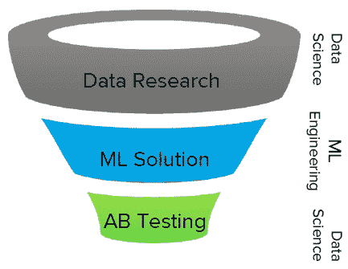
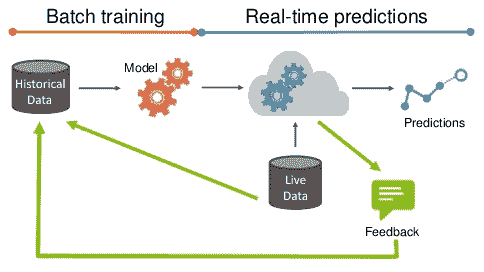
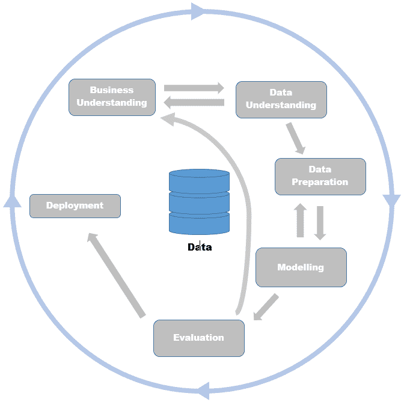
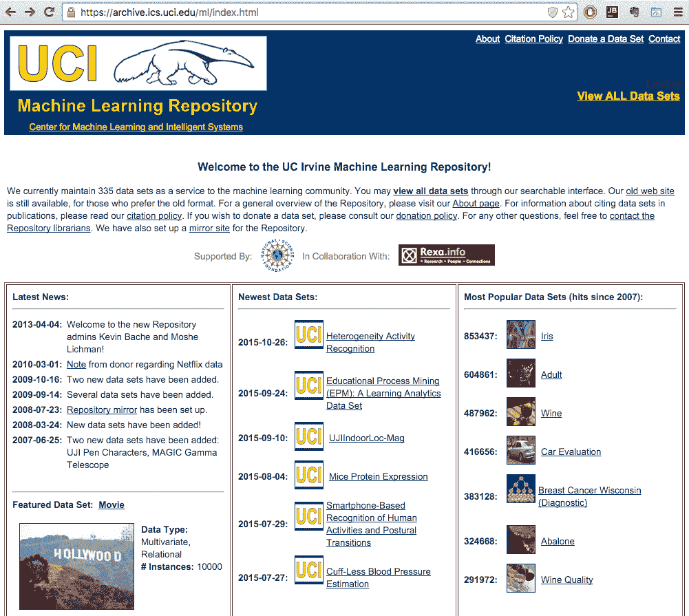

# 第十一章：接下来是什么？

本章将带我们结束对 Java 库中机器学习的回顾之旅，并讨论如何利用它们解决实际问题。然而，这绝对不应该结束你的旅程。本章将为你提供一些实际的建议，告诉你如何开始将你的模型部署到现实世界，会遇到哪些挑战，以及如何进一步深化你的知识。它还提供了关于如何找到更多资源、材料、场所和技术以深入了解机器学习的进一步指导。

本章将涵盖以下主题：

+   生活中机器学习的重要方面

+   标准和标记语言

+   云中的机器学习

+   网络资源和竞赛

# 生活中的机器学习

论文、会议演示和演讲通常不会讨论模型如何在生产环境中实际部署和维护。在本节中，我们将探讨一些应该考虑的方面。

# 噪声数据

在实践中，数据通常由于各种原因（如测量错误、人为错误和专家在分类训练示例时的判断错误）而包含错误和不完美。我们将所有这些都称为**噪声**。噪声也可能来自处理缺失值时，一个具有未知属性值的示例被替换为一组与缺失值概率分布相对应的加权示例。噪声在学习数据中的典型后果是学习模型在新数据中的预测精度低，以及对于用户来说难以解释和理解的用户复杂模型。

# 类别不平衡

类别不平衡是我们遇到的问题，在第七章“欺诈和异常检测”中，目标是检测欺诈性保险索赔。挑战在于数据集的大部分，通常超过 90%，描述了正常活动，而只有一小部分数据集包含欺诈示例。在这种情况下，如果模型总是预测正常，那么它 90%的时间是正确的。这个问题在实践中非常普遍，可以在各种应用中观察到，包括欺诈检测、异常检测、医疗诊断、油泄漏检测和面部识别。

现在，我们已经了解了什么是类别不平衡问题以及为什么这是一个问题，接下来让我们看看如何处理这个问题。第一种方法是关注除分类准确率之外的措施，例如召回率、精确率和 F 度量。这些措施关注模型在预测少数类（**召回率**）方面的准确性以及误报的份额（**精确率**）。另一种方法基于重采样，其主要思想是以一种方式减少过度代表示例的数量，使得新的集合包含两个类别的平衡比例。

# 特征选择

**特征选择**可以说是建模过程中最具挑战性的部分，它需要领域知识和对当前问题的深刻洞察。尽管如此，良好特征的性质如下：

+   **可重用性**：特征应该可用于在不同模型、应用程序和团队中重用。

+   **可转换性**：你应该能够通过操作转换特征，例如，`log()`，`max()`，或者通过自定义计算将多个特征组合在一起。

+   **可靠性**：特征应该易于监控，并且应该存在适当的单元测试以最小化错误或问题。

+   **可解释性**：要执行任何前面的操作，你需要能够理解特征的意义并解释它们的值。

你能更好地捕捉特征，你的结果就会越准确。

# 模型链

一些模型可能会产生输出，这些输出被用作另一个模型的特征。此外，我们可以使用多个模型——集成——将任何模型转换为特征。这是一种获得更好结果的好方法，但这也可能导致问题。必须注意，你的模型输出必须准备好接受依赖。同时，尽量避免反馈循环，因为它们可能会在管道中创建依赖和瓶颈。

# 评估的重要性

另一个重要方面是模型评估。除非你将你的模型应用于新数据并衡量业务目标，否则你并不是在进行预测分析。评估技术，如交叉验证和分离的培训/测试集，只是分割你的测试数据，这只能给你提供一个关于你的模型将如何表现的估计。生活中往往不会给你一个包含所有案例的培训数据集，因此在现实世界数据集中定义这两个集合需要很多创造力。

最后，我们希望提高业务目标，例如提高广告转化率，并增加推荐项目的点击量。为了衡量改进，执行 A/B 测试，测量在统计上相同的群体中不同算法体验的指标差异。产品的决策始终是数据驱动的。

A/B 测试是一种具有两个变体的随机实验方法：A，对应于原始版本，控制实验；B，对应于一个变体。此方法可用于确定变体是否优于原始版本。它可以用于测试从网站更改到销售电子邮件再到搜索广告的任何内容。Udacity 提供了一门免费课程，涵盖 A/B 测试的设计和分析，课程链接为 [`www.udacity.com/course/ab-testing--ud257`](https://www.udacity.com/course/ab-testing--ud257)。

# 将模型投入生产

从在实验室中构建准确模型到将其部署到产品中，这一过程涉及数据科学和工程的协作，如下面的三个步骤所示：

1.  **数据研究和假设构建**涉及建模问题和执行初始评估。

1.  **解决方案构建和实施**是模型通过重写为更高效、稳定和可扩展的代码，找到其进入产品流程的方式。

1.  **在线评估**是最后阶段，其中使用 A/B 测试在业务目标上使用实时数据评估模型。

这在以下图中得到了更好的说明：

# 模型维护

我们需要解决的另一个方面是如何维护模型。这是一个不会随时间变化的模型吗？它是建模一个动态现象，需要模型随时间调整其预测吗？

模型通常在离线批量训练中构建，然后用于实时数据以提供预测，如下所示。如果我们能够收到关于模型预测的反馈，例如，股票是否如模型预测的那样上涨，候选人是否对活动做出了回应，那么应该使用这些反馈来改进初始模型：

反馈对于改进初始模型可能非常有用，但请确保注意你正在采样的数据。例如，如果你有一个预测谁将响应活动的模型，你最初将使用一组具有特定响应/未响应分布和特征属性的随机联系的客户。模型将仅关注最有可能响应的客户子集，而你的反馈将返回给你一组已响应的客户。通过包含这些数据，模型在特定子组中更准确，但可能会完全错过其他一些组。我们称这个问题为探索与利用。一些解决这个问题的方法可以在 Osugi 等人（2005 年）和 Bondu 等人（2010 年）的研究中找到。

# 标准和标记语言

随着预测模型越来越普及，共享模型和完成建模过程的需求导致开发过程的正式化和可交换格式的出现。在本节中，我们将回顾两个事实上的标准，一个涵盖数据科学流程，另一个指定了在应用程序之间共享模型的可交换格式。

# CRISP-DM

**跨行业数据挖掘标准过程**（**CRISP-DM**）描述了一个在行业中常用的数据挖掘过程。CRISP-DM 将数据挖掘科学过程分为六个主要阶段：

+   **业务理解**

+   **数据理解**

+   **数据准备**

+   **建模**

+   **评估**

+   **部署**

在以下图中，箭头表示流程流程，它可以来回移动通过各个阶段。此外，流程不会随着模型的部署而停止。外部的箭头表示数据科学的循环性质。在过程中学到的经验可以触发新的问题，并重复流程以改进先前结果：

# SEMMA 方法论

另一种方法是 **样本、探索、修改、建模和评估** (**SEMMA**)。SEMMA 描述了数据科学中的主要建模任务，同时忽略了数据理解和部署等业务方面。SEMMA 由 SAS Institute 开发，它是最大的统计软件供应商之一，旨在帮助其软件用户执行数据挖掘的核心任务。

# 预测模型标记语言

**预测** **模型标记语言** (**PMML**) 是一种基于 XML 的交换格式，它允许机器学习模型在应用程序和系统之间轻松共享。支持的模型包括逻辑回归、神经网络、决策树、朴素贝叶斯、回归模型等。一个典型的 PMML 文件包括以下部分：

+   包含一般信息的标题

+   数据字典，描述数据类型

+   数据转换，指定标准化、离散化、聚合或自定义函数的步骤

+   模型定义，包括参数

+   列出模型使用的属性的架构挖掘

+   允许对预测结果进行后处理的目标

+   输出列出要输出的字段和其他后处理步骤

生成的 PMML 文件可以导入到任何 PMML 消费应用程序，例如 Zementis **自适应决策和** **预测分析** (**ADAPA**) 和 **通用 PMML 插件** (**UPPI**) 计分引擎；Weka，它内置了对回归、广义回归、神经网络、TreeModel、RuleSetModel 和 **支持向量机** (**SVM**) 模型的支持；Spark，它可以导出 k-means 聚类、线性回归、岭回归、lasso 模型、二元逻辑模型和 SVM；以及级联，可以将 PMML 文件转换为 Apache Hadoop 上的应用程序。

PMML 的下一代是一个新兴的格式，称为 **分析便携格式** (**PFA**)，提供了一种在各个环境中部署完整工作流程的通用接口。

# 云端机器学习

设置一个能够随着数据量的增加而扩展的完整机器学习堆栈可能具有挑战性。最近一波的 **软件即服务 (SaaS**) 和 **基础设施即服务** (**IaaS**) 范式已经溢出到机器学习领域。今天的趋势是将实际的数据预处理、建模和预测移动到云端环境，并专注于建模任务。

在本节中，我们将回顾一些提供算法、在特定领域已经训练好的预测模型以及支持数据科学团队协作工作流程的环境的具有前景的服务。

# 机器学习即服务

第一类是算法即服务，你将获得一个 API 或甚至图形用户界面来连接预先编程的数据科学管道组件：

+   **Google Prediction API**：它是最早通过其 Web API 引入预测服务的企业之一。该服务与谷歌云存储集成，作为数据存储。用户可以构建一个模型并调用 API 来获取预测。

+   **BigML**：它实现了一个用户友好的图形界面，支持许多存储提供商（例如，Amazon S3），并提供了一系列数据加工工具、算法和强大的可视化功能。

+   **Microsoft Azure Machine Learning**：它提供了一大批机器学习算法和数据加工函数的库，以及图形用户界面，以将这些组件连接到应用程序中。此外，它还提供了一项全托管服务，您可以使用它将预测模型部署为可消费的 Web 服务。

+   **Amazon Machine Learning**：它进入市场较晚。其主要优势是与其他亚马逊服务的无缝集成，而算法数量和用户界面需要进一步改进。

+   **IBM Watson Analytics**：它专注于提供针对特定领域（如语音识别、机器翻译和异常检测）已经手工定制的模型。它通过解决特定用例，针对广泛的行业。

+   **Prediction.IO**：它是一个自托管的开源平台，提供从数据存储到建模再到预测服务的一整套解决方案。Prediction.IO 可以与 Apache Spark 通信，以利用其学习算法。此外，它还附带了一系列针对特定领域的模型，例如推荐系统、流失预测等。

预测 API 是一个新兴的领域，因此这些只是其中一些知名的例子；**KDnuggets**在[`www.kdnuggets.com/2015/12/machine-learning-data-science-apis.html`](http://www.kdnuggets.com/2015/12/machine-learning-data-science-apis.html)上整理了一份包含 50 个机器学习 API 的列表。

想要了解更多信息，您可以访问 PAPI，即预测 API 和应用的国际化会议，网址为[`www.papi.io`](http://www.papi.io/)，或者查看这本书：*《Bootstrapping Machine Learning》，作者：L Dorard，出版社：Createspace Independent Pub，2014 年*。

# 网络资源和竞赛

在本节中，我们将回顾如何找到学习、讨论、展示或提高我们数据科学技能的额外资源。

# 数据集

加州大学欧文分校托管了最知名的机器学习数据集存储库之一。UCI 存储库包含超过 300 个数据集，涵盖了各种挑战，包括扑克、电影、葡萄酒质量、活动识别、股票、出租车服务轨迹、广告等。每个数据集通常都配备了一篇研究论文，其中描述了数据集的使用情况，这可以为您如何开始以及预测基线是什么提供线索。

UCI 机器学习仓库可通过[`archive.ics.uci.edu`](https://archive.ics.uci.edu/)访问，如下所示：

由 Xiaming Chen 维护的另一个良好维护的集合托管在 GitHub 上：[`github.com/caesar0301/awesome-public-datasets`](https://github.com/caesar0301/awesome-public-datasets).

这个令人惊叹的公共数据集仓库维护着来自多个领域的超过 400 个数据源的链接，包括农业、生物学、经济学、心理学、博物馆和交通。针对机器学习的特定数据集收集在图像处理、机器学习和数据挑战部分。

# 在线课程

由于在线课程的可获得性，学习如何成为一名数据科学家变得更加容易。以下是一些在线学习不同技能的免费资源列表：

+   **Udemy——从零开始学习 Java 编程**，网址为[`www.udemy.com/learn-java-programming-from-scratch`](https://www.udemy.com/learn-java-programming-from-scratch).

+   **Udemy——Java 教程，适合初学者**，网址为[`www.udemy.com/java-tutorial`](https://www.udemy.com/java-tutorial).

+   **LearnJAvaOnline——交互式 Java 教程**，网址为[`www.learnjavaonline.org`](http://www.learnjavaonline.org/).

以下是一些关于机器学习的在线课程，可以帮助你了解更多：

+   **Coursera——Andrew Ng 的机器学习（斯坦福）课程**：这门课程教你许多机器学习算法背后的数学知识，解释它们是如何工作的，并探讨为什么它们是有意义的，网址为[`www.coursera.org/learn/machine-learning`](https://www.coursera.org/learn/machine-learning).

+   **统计学 110（哈佛）由 Joe Biltzstein 教授**：这门课程让你发现你在数据科学旅程中会多次听到的相关术语的概率。讲座可在 YouTube 上观看，网址为[`projects.iq.harvard.edu/stat110/youtube`](http://projects.iq.harvard.edu/stat110/youtube).

+   **数据科学 CS109（哈佛）由 John A. Paulson 教授**：这是一门实践课程，你将学习数据科学领域的 Python 库，以及如何处理机器学习算法，网址为[`cs109.github.io/2015/`](http://cs109.github.io/2015/).

# 竞赛

提升知识的最佳方式是解决实际问题，如果您想建立一个经过验证的项目组合，机器学习竞赛是一个可行的起点：

+   **Kaggle**: 这是排名第一的竞赛平台，提供各种具有高额奖金的挑战，强大的数据科学社区，以及大量的有用资源。您可以在[`www.kaggle.com/`](https://www.kaggle.com/)查看。

+   **CrowdANALYTIX**: 这是一个专注于生命科学和金融服务行业的众包数据分析服务，网址为[`www.crowdanalytix.com`](https://www.crowdanalytix.com/).

+   **DrivenData**：这是一个举办旨在社会公益的数据科学竞赛的网站[`www.drivendata.org/`](http://www.drivendata.org/)。

# 网站和博客

除了在线课程和竞赛之外，还有许多网站和博客发布数据科学社区的最新发展，他们在解决不同问题中的经验，或者只是最佳实践。以下是一些好的起点：

+   **KDnuggets**：这是数据挖掘、分析、大数据和数据科学的实际门户，涵盖了最新的新闻、故事、事件和其他相关议题[`www.kdnuggets.com/`](http://www.kdnuggets.com/)。

+   **机器学习掌握**：这是一个入门级博客，提供实用的建议和起点指南。你可以在[`machinelearningmastery.com/`](http://machinelearningmastery.com/)查看。

+   **数据科学中心**：这是一个包含各种主题、算法、缓存和商业案例的实用社区文章，更多信息请访问[`www.datasciencecentral.com/`](http://www.datasciencecentral.com/)。

+   **数据挖掘研究**（作者：Sandro Saitta），更多信息请访问[`www.dataminingblog.com/`](http://www.dataminingblog.com/)。

+   **《数据挖掘：文本挖掘、可视化和社交媒体》**（作者：Matthew Hurst），涵盖了有趣的文本和网页挖掘主题，通常还涉及 Bing 和微软的应用，更多信息请访问[`datamining.typepad.com/data_mining/`](http://datamining.typepad.com/data_mining/)。

+   **Geeking with Greg**（作者：Greg Linden，亚马逊推荐引擎的发明者和互联网企业家）。你可以在[`glinden.blogspot.si/`](http://glinden.blogspot.si/)查看。

+   **DSGuide**：这是一个包含 150 多个数据科学博客的集合[`dsguide.biz/reader/sources`](http://dsguide.biz/reader/sources)。

# 场地和会议

以下是一些顶级学术会议，它们展示了最新的算法：

+   **数据库中的知识发现**（**KDD**）

+   **计算机视觉和模式识别**（**CVPR**）

+   **神经信息处理系统年度会议**（**NIPS**）

+   **国际机器学习会议**（**ICML**）

+   **国际数据挖掘会议**（**ICDM**）

+   **国际普适和泛在计算联合会议**（**UbiComp**）

+   **国际人工智能联合会议**（**IJCAI**）

以下是一些商业会议：

+   O'Reilly Strata 会议

+   Strata + Hadoop 世界会议

+   预测分析世界

+   MLconf

你还可以查看当地的聚会小组。

# 摘要

在本章中，我们通过讨论模型部署的一些方面来结束本书，我们探讨了数据科学流程的标准和可互换的预测模型格式。我们还回顾了在线课程、竞赛、网络资源和会议，这些都可以帮助你在掌握机器学习艺术的道路上。

我希望这本书能激发你深入探索数据科学的兴趣，并激励你亲自动手，尝试各种库，掌握如何攻击不同的问题。记住，所有的源代码和附加资源都可以在 Packt Publishing 网站上找到：[`www.packtpub.com/`](https://www.packtpub.com/).
