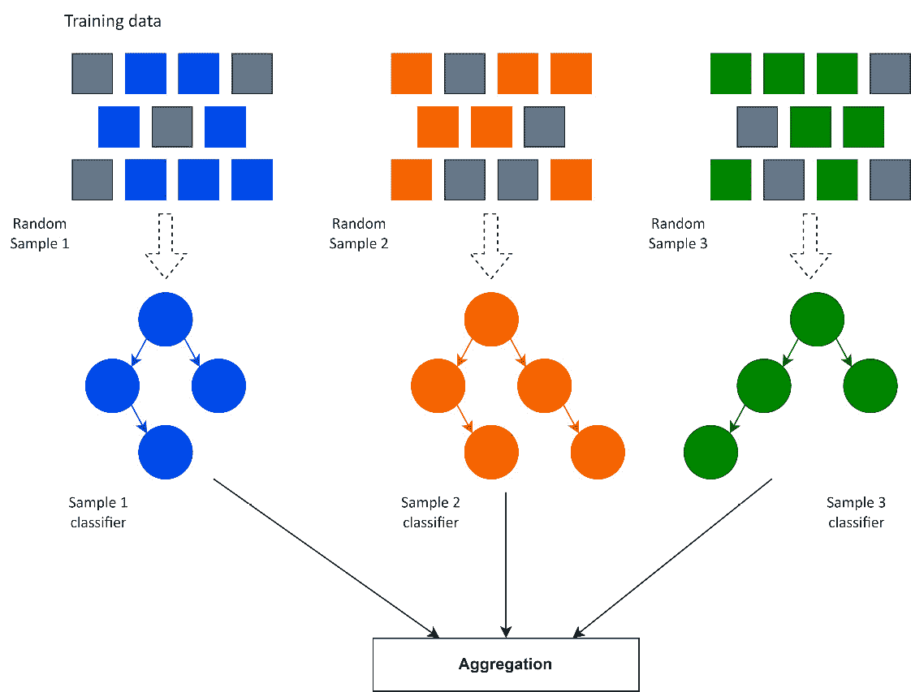
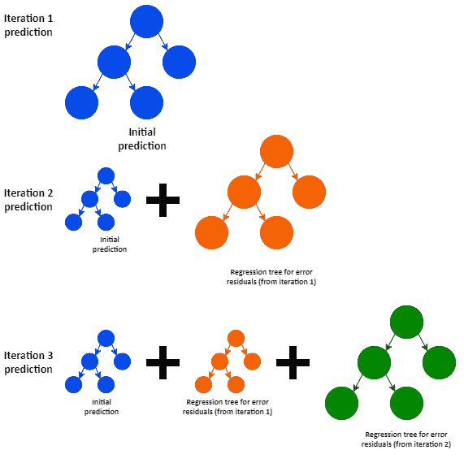
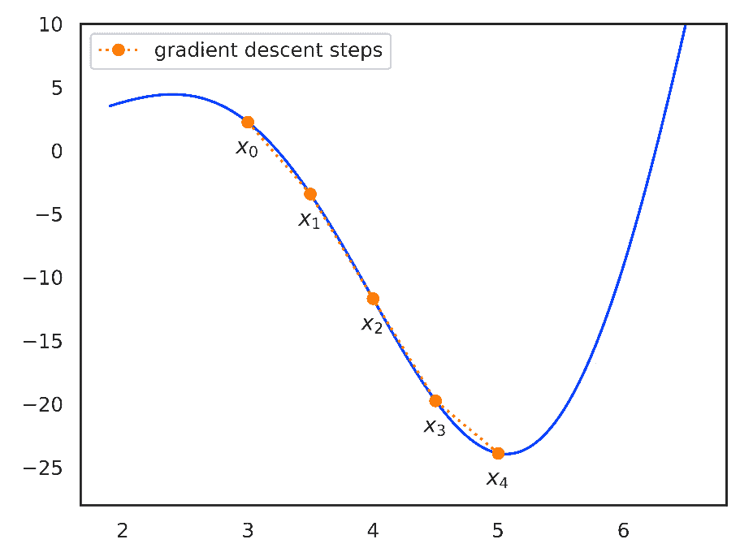
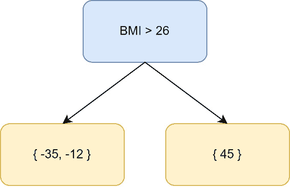

# 2

# 集成学习 – Bagging 和 Boosting

在上一章中，我们介绍了机器学习（**ML**）的基础知识，包括数据处理和模型，以及过拟合和**监督学习（SL**）等概念。我们还介绍了决策树，并展示了如何在 scikit-learn 中实际应用它们。

本章，我们将学习集成学习以及两种最重要的集成学习类型：Bagging 和 Boosting。我们将涵盖将集成学习应用于决策树的理论和实践，并通过关注更高级的 Boosting 方法来结束本章。

到本章结束时，你将很好地理解集成学习以及如何通过 Bagging 或 Boosting 实际构建决策树集成。我们还将准备好深入研究 LightGBM，包括其更高级的理论方面。

我们将涵盖的主要主题如下：

+   集成学习

+   Bagging 和随机森林

+   **梯度提升决策树（GBDT**）

+   高级提升算法—**Dropouts meet Multiple Additive Regression Trees（DART**）

# 技术要求

本章包括简单机器学习算法的示例，并介绍了如何使用 scikit-learn。你必须安装一个带有 scikit-learn、NumPy、pandas 和 Jupyter 的 Python 环境。本章的代码可在[`github.com/PacktPublishing/Practical-Machine-Learning-with-LightGBM-and-Python/tree/main/chapter-2`](https://github.com/PacktPublishing/Practical-Machine-Learning-with-LightGBM-and-Python/tree/main/chapter-2)找到。

# 集成学习

**集成学习**是将多个预测器或模型组合起来创建一个更稳健模型的实践。模型可以是同一类型的（同质集成）或不同类型的（异质集成）。此外，集成学习不仅限于决策树，还可以应用于任何机器学习技术，包括线性模型、**神经网络（NNs**）等。

集成学习背后的核心思想是通过聚合多个模型的预测结果，来弥补单个模型的弱点。

当然，在相同的数据上训练相同的模型在集成中是没有帮助的（因为模型会有相似的预测）。因此，我们追求模型之间的**多样性**。多样性指的是集成中每个模型差异的程度。高多样性集成具有广泛不同的模型。

我们有几种方法可以确保集成中的多样性。一种方法是在训练数据的不同子集上训练模型。每个模型都会接触到训练数据中的不同模式和噪声，从而增加训练模型的多样性。

同样，我们可以在训练数据的不同特征子集上训练每个模型。一些特征比其他特征更有价值，一些可能是不相关的，导致模型预测的多样性。

我们还可以用不同的超参数训练每个模型，导致不同复杂性和能力的模型。超参数的影响在决策树的情况下尤为明显，因为超参数显著影响树的结构，导致非常不同的模型。

最后，我们可以通过使用不同类型的模型来多样化集成。每个模型都有其独特的优势和劣势，从而导致集成中的多样性。

**集成学习方法**指的是我们如何通过指定如何训练成员模型以及如何组合模型结果来引入集成模型中的多样性。最常用的集成方法如下：

+   **自助聚合（Bagging）**：这些方法是在训练数据的子集（样本或特征）上训练模型，并将预测结果进行聚合。

+   **提升**：这涉及到迭代地在先前模型的错误上训练模型。最终预测是通过结合链中所有模型的预测来完成的。

+   **堆叠**：这涉及到训练多个基模型，然后训练一个更高阶的模型（称为元模型），以从基模型的预测中学习并做出最终预测。

+   **混合**：这与堆叠非常相似。然而，元模型是在基模型对*保留集*（基学习器未训练过的训练数据的一部分）上的预测上训练的，而不是在整个训练集上。

集成学习方法的目的在于提高我们的预测性能，并且有几种方法可以改善集成相对于单个模型的性能，如下所述：

+   **提高准确性**：通过结合预测，我们增加了最终预测准确的可能性，因为从总体上看，模型犯的错误更少。

+   **提高泛化能力和避免过拟合**：通过聚合预测，我们减少了最终预测中的方差，提高了泛化能力。此外，在某些集成方法中，模型无法访问所有数据（Bagging 集成），这减少了噪声和过拟合。

+   **提高预测稳定性**：预测的聚合减少了单个预测的随机波动。集成对异常值不太敏感，成员模型的异常预测对最终预测的影响有限。

决策树非常适合集成学习，并且存在专门用于集成学习的决策树特定算法。下一节将讨论决策树中的袋装集成，重点关注**随机森林**。

# Bagging 和随机森林

**袋装**是一种集成方法，其中多个模型在训练数据的子集上训练。模型的预测被组合起来做出最终预测，通常是通过取数值预测的平均值（对于回归）或对类别的多数投票（对于分类）。在训练每个模型时，我们从原始训练数据集中选择一个数据子集，并带有替换——也就是说，特定的训练模式可以是多个子集的成员。由于每个模型只接触到训练数据的一个样本，因此没有单个模型可以“记住”训练数据，这减少了过拟合。以下图表说明了袋装过程：



图 2.1 – 描述袋装过程的示意图；每个独立的分类器在训练数据的随机子样本上训练，并通过汇总所有分类器的预测来做出最终预测

袋装集成中的每个模型仍然是一个完整的模型，能够独立存在。因此，袋装与强大的模型结合得最好——也就是说，在决策树的情况下，深或宽的决策树。

虽然之前的例子说明了从训练集中抽取样本模式，但也可以为每个模型从数据集中抽取随机特征。在创建训练集时随机选择特征被称为随机子空间方法或特征袋装。特征袋装防止了特定属性可能主导预测或误导模型的情况，并进一步减少了过拟合。

在决策树中，一个同时应用样本袋装和特征袋装的流行算法是随机森林。现在让我们来看看这个算法。

## 随机森林

**随机森林**是一种针对决策树的特定袋装集成学习方法[1]。正如其名称所暗示的，它不是构建单个决策树，而是使用袋装训练多个决策树：每棵树要么在随机样本上训练，要么在训练数据中的随机特征上训练，或者两者都训练。随机森林支持分类和回归。

随机森林中单个树的训练方法与单个决策树相同，正如之前所解释的，每棵树都是一棵完整的树。对于预测，森林的最终预测是通过取所有树的算术平均值来实现的；对于分类，是通过多数投票来实现的。

关于性能，随机森林学习产生了一个更稳健的模型，具有更高的准确性，并且倾向于避免过拟合（因为单个模型无法对所有训练数据进行过拟合）。

### 随机森林超参数

在 scikit-learn 中，正如预期的那样，随机森林的可用超参数与训练决策树的可用超参数相同。我们可以指定`max_depth`、`min_samples_split`、`max_leaf_nodes`等，然后用于训练单个树。然而，有三个值得注意的附加参数，如下所示：

+   `n_estimators`：控制森林中的树的数量。通常，树越多越好。然而，通常会达到收益递减的点。

+   `max_features`：确定在分割节点时用作子集的最大特征数。将`max_features=1.0`设置为允许在随机选择中使用所有特征。

+   `bootstrap`决定是否使用袋装法。如果`bootstrap`设置为`False`，则所有树将使用整个训练集。

scikit-learn 中所有可用参数的列表在此处提供：[`scikit-learn.org/stable/modules/generated/sklearn.ensemble.RandomForestClassifier.xhtml`](https://scikit-learn.org/stable/modules/generated/sklearn.ensemble.RandomForestClassifier.xhtml)。

### ExtraTrees

**极随机树**（**ExtraTrees**）是构建随机决策树的相关方法。使用 ExtraTrees 时，在构建决策节点时，会随机创建多个候选分割，而不是使用*Gini 指数*或*信息增益*指标来计算最佳分割[2]。然后从所有随机分割中选择最佳分割用于节点。ExtraTrees 的方法可以应用于单个决策树，也可以与随机森林结合使用。scikit-learn 将 ExtraTrees 作为随机森林的扩展实现（https://scikit-learn.org/stable/modules/ensemble.xhtml#extremely-randomized-trees）。

在 scikit-learn 中，ExtraTrees 的实现与随机森林具有相同的超参数。

### 使用 scikit-learn 训练随机森林

现在，我们将查看如何使用 scikit-learn 中的随机森林。

在本例中，我们将使用*森林覆盖类型*数据集（[`archive.ics.uci.edu/ml/datasets/Covertype`](https://archive.ics.uci.edu/ml/datasets/Covertype)），该数据集在 scikit-learn（https://scikit-learn.org/stable/modules/generated/sklearn.datasets.fetch_covtype.xhtml#sklearn.data）中可用。与之前使用的玩具数据集相比，该数据集是一个显著的提升。数据集包含 581,012 个样本，具有 54 个维度（特征数）。特征描述了美国 30x30m 的森林区域（例如，海拔、坡向、坡度和到水文点的距离）。我们必须构建一个分类器，将每个区域分类为描述森林覆盖类型的七个类别之一。

除了训练`RandomForestClassifier`之外，我们还将训练一个独立的`DecisionTreeClassifier`和一个`ExtraTreesClassifier`，并比较算法的性能。

`RandomForestClassifier`和`ExtraTreesClassifier`位于`sklearn.ensemble`包中。除了我们的常规导入外，我们还从那里导入分类器，如下所示：

```py
from sklearn import datasets
from sklearn.tree import DecisionTreeClassifier
from sklearn.ensemble import RandomForestClassifier, ExtraTreesClassifier
from sklearn.model_selection import train_test_split
from sklearn.metrics import f1_score
```

scikit-learn 数据集包提供了森林覆盖数据集。我们可以使用 scikit-learn 获取数据集，并将其拆分为我们的训练集和测试集，如下所示：

```py
dataset = datasets.fetch_covtype()
X_train, X_test, y_train, y_test = train_test_split(dataset.data, dataset.target, random_state=179)
```

最后，我们可以训练我们的分类器，并将它们各自与测试集进行评估：

```py
tree = DecisionTreeClassifier(random_state=179, min_samples_leaf=3, min_samples_split=6)
tree = tree.fit(X_train, y_train)
print(f1_score(y_test, tree.predict(X_test), average="macro"))
forest = RandomForestClassifier(random_state=179, min_samples_leaf=1, min_samples_split=2, n_estimators=140)
forest = forest.fit(X_train, y_train)
print(f1_score(y_test, forest.predict(X_test), average="macro"))
extra_tree = ExtraTreesClassifier(random_state=179, min_samples_leaf=1, min_samples_split=2, n_estimators=180)
extra_tree = extra_tree.fit(X_train, y_train)
print(f1_score(y_test, extra_tree.predict(X_test), average="macro"))
```

我们已经为模型设置了适合问题的超参数。额外的一步是优化算法超参数，以发现最佳参数值。参数优化将在后面的章节中详细讨论。

运行前面的代码，我们得到以下每个算法的 F1 分数：

| **模型** | **F1 分数** |
| --- | --- |
| 决策树 | 0.8917 |
| 随机森林 | 0.9209 |
| ExtraTrees | 0.9231 |

表 2.1 – Forest CoverType 数据集上每个算法的 F1 分数

ExtraTrees 模型略优于随机森林模型，两者都比决策树分类器表现更好。

在本节中，我们概述了 bagging 和随机森林，这是一种基于 bagging 的决策树集成学习方法，它相对于标准决策树提供了一些优势。下一节将探讨另一种集成学习方法：梯度提升。

# 阶梯提升决策树

**梯度提升**是一种集成学习方法，它通过**顺序**组合多个模型来产生一个更稳健的集成模型。与 bagging 不同，在 bagging 中使用了多个**强大**的模型（并行使用），而在 boosting 中，训练了多个弱学习器，每个学习器都从前一个学习器的错误中学习，以构建一个更准确和更稳健的集成模型。与 bagging 的另一个显著区别是，每个模型都使用整个数据集进行训练。

注意

如下文所述，梯度提升始终构建一系列回归树作为集成的一部分，无论解决的是回归问题还是分类问题。梯度提升也称为**多重加性回归树**（**MART**）。

抽象地说，boosting 过程从弱基学习器开始。在决策树的情况下，基学习器可能只有一个分割（也称为决策树桩）。然后计算误差残差（预测值与实际目标之间的差异）。然后，在先前学习器的误差残差上训练新的学习器，以最小化错误。最终的预测是所有学习器预测的**总和**。以下图示说明了迭代梯度提升过程：



图 2.2 – 梯度提升过程的示意图；在每次迭代中，都会添加一个新的回归树来补偿前一次迭代的误差残差

一个关键问题之一是，我们如何确定减少误差残差的变化。梯度提升通过应用一个广泛使用的优化问题来解决误差最小化问题：梯度下降。

## 梯度下降

**梯度下降**是一种优化算法，试图找到最小化损失函数的最优参数。参数通过在损失函数负梯度的方向上采取小步迭代更新（从而减少函数值）。损失函数在概念上类似于误差函数，但有两个重要的属性，如下所述：

+   损失函数产生一个数值，量化了模型的性能或模型表现不佳的精确程度。一个好的损失函数对于不同性能的模型会产生显著不同的输出。一些误差函数也可以用作损失函数——例如，**均方** **误差**（**MSE**）。

+   第二个属性是损失函数必须是可微分的，特别是在梯度下降的上下文中。一个不可微分的误差函数是 F1 分数。F1 分数可能产生一个表示模型性能的数值，但它不可微分，不能用作损失函数。

梯度下降的过程可以定义为以下。假设我们有一个针对参数 x 定义的损失函数 L。对于一组初始参数，损失计算为 L(x_0)。梯度下降迭代进行以最小化损失函数：

L(x_{n+1}) < L(x_n)

为了更新参数，*我们朝着 L 的负梯度方向迈出一步*。我们可以将梯度下降更新规则指定如下：

x_{n+1} = x_n − γ_n ∇L(x_n)

在这里，γn 是**学习率**，它定义了步长，而∇L(xn)是 L 在 xn 处的梯度。

*图 2.3*中的图表说明了梯度下降过程：



图 2.3 – 显示寻找函数最小值的梯度下降过程的图表

选择合适的学习率对梯度下降的成功至关重要。如果学习率太低，优化过程会非常缓慢，可能无法在允许的迭代次数内达到最小值。学习率太小也可能导致过程陷入局部最小值：步长太小以至于无法逃脱。相反，假设学习率太大。在这种情况下，我们可能会跳过最小值而完全错过它，或者陷入在最小值周围振荡（不断跳来跳去但从未下降到最优值）。

## 梯度提升

现在我们已经了解了梯度下降的工作原理，我们可以看到它在梯度提升中的应用。我们将通过一个小例子详细地讲解整个梯度提升算法。在我们的例子中，我们将使用回归树，因为它比分类情况更容易理解。

### 梯度提升算法

梯度提升算法定义如下，其中 M 是提升树的数量 [3]：

1.  给定训练数据 {(x i, y i)} i=1 n ，包含 n 个训练样本（由特征 x i 和目标 y i 定义）和一个可微的损失函数 L(y i, F(x))，其中 F(x) 是模型 F 的预测。

1.  使用常数预测值初始化模型 F 0(X) = argmin γ ∑ i=1 n  L( y i, γ)

1.  对于 m = 1 到 M：

    计算伪残差 r im = − [∂ L(y i, F(x i)) _ ∂ F(x i) ] F(X)=F m−1(X) 对于 i = 1, … , n

    将回归树拟合到 r im 值，并为 j = 1…J m 创建终端区域 R jm

    对于 j = 1…J m 计算 γ jm = argmin γ ∑ x i∈R ij L( y i, F m−1(x i) + γ)

    更新 F m(x) = F m−1(x) + ν∑ j=1 J m  γ jm I(x ∈ R jm)

1.  结果：F M(x)

虽然算法和特别是数学可能看起来令人畏惧，但实际上它比看起来要简单得多。我们将一步一步地讲解算法。考虑以下玩具数据集：

| **性别** | **空腹** **血糖** | **腰围** | **BMI** | **LDL 胆固醇** |
| --- | --- | --- | --- | --- |
| 男性 | 105 | 110 | 29.3 | 170 |
| 女性 | 85 | 80 | 21 | 90 |
| 男性 | 95 | 93 | 26 | 113 |

表 2.2 – 由患者的物理测量和测量的低密度脂蛋白（LDL）胆固醇组成的示例数据集

给定物理测量值，我们旨在预测患者的低密度脂蛋白胆固醇。

上述表格定义了我们的训练数据 {(x i, y i)} i=1 n ，其中 x 是特征（血糖、腰围、BMI）和 y 是目标：低密度脂蛋白胆固醇。

我们需要一个可微的损失函数，为了简化本例中的一些数学推导，我们选择以下损失函数，它与均方误差函数类似：

L =  1 _ 2  ∑ i=0 n (y i − γ i) 2

我们现在将详细地讲解每个算法步骤，以了解梯度提升树是如何产生的。

第一步是找到 F 0(x) = argmin γ ∑ i=1 n  L( y i, γ)，其中 y i 是我们的目标值，γ 是我们的初始预测值。*我们的初始预测是恒定的，简单来说是目标值的平均值*。但让我们看看为什么。

F 0(x) 的方程表明我们需要找到一个 γ 的值，以最小化我们的损失函数。为了找到最小值，我们取损失函数关于 γ 的导数：

∂ L _ ∂ γ  =  2 _ 2 (∑ i=0 n (y i − γ)) × − 1

然后，将其设为 0 并解以下方程：

− (∑ i=0 n (y i − γ)) = 0

−  1 _ n  ∑ i=0 n y i+ γ = 0

γ =  1 _ n  ∑ i=0 n y i

该方程简化为计算目标值的平均值。

将预测更新到表中，我们得到以下内容：

| **性别** | **F.** **血糖** | **W. Circum.** | **BMI** | **LDL 胆固醇** | **预测 F 0(x)** |
| --- | --- | --- | --- | --- | --- |
| 男 | 105 | 110 | 29.3 | 170 | 125 |
| 女 | 85 | 80 | 21 | 90 | 125 |
| 男 | 95 | 93 | 26 | 113 | 125 |

表 2.3 – 我们对每个患者的 LDL 胆固醇预测（ F 0(x)）的初始预测是恒定的

我们重复以下 M 次，其中 M 是我们选择构建的树的数量。

现在，我们需要计算伪残差 r im = − [∂ L(y i, F(x i)) _ ∂ F(x i) ] F(X)=F m−1(X)。这个 r im 方程表明我们使用预测的损失函数的负偏导数来计算伪残差。*这部分梯度提升算法与梯度下降相关：我们取负梯度以最小化残差*。幸运的是，我们已经计算了此导数：

− [ ∂ L(y i, F(x i)) _ ∂ F(x i) ] = −  ∂ _ ∂ F(x i) (  1 _ 2  (y i − F(x i)) 2) =  2 _ 2 (y i− F(x i)) = ( y i − F(x i))

在这里，F(x i)是预测值。换句话说，*该方程简化了目标值和预测值之间的差异*。我们可以将残差添加到表中，如下所示：

| **性别** | **F. 血糖** | **W. Circum.** | **BMI** | **LDL 胆固醇** | **预测** **F 0(x)** | **F 0(x) 的残差** |
| --- | --- | --- | --- | --- | --- | --- |
| 男 | 105 | 110 | 29.3 | 170 | 125 | 45 |
| 女 | 85 | 80 | 21 | 90 | 125 | -35 |
| 男 | 95 | 93 | 26 | 113 | 125 | -12 |

表 2.4 – 根据我们的初始预测，我们可以计算每个患者的残差，如 Residuals for F 0(x) 列所示

下一步很简单：我们构建一个回归树来预测残差。我们不直接使用回归树的预测。相反，我们使用*终端区域*来计算我们的更新预测。终端区域指的是树的叶节点。

对于这个例子，我们假设以下简单的回归树已被构建：



图 2.4 – 预测残差的回归树

在我们的回归树构建并定义了叶节点后，我们可以进行下一步。我们需要计算 γ jm，它最小化我们的损失函数，并考虑之前的预测，γ jm = argmin γ ∑ x i∈R ij L( y i, F m−1(x i) + γ)。这正是我们在*步骤 1*中所做的，我们展示了由于我们选择的损失函数，方程简化为预测值的平均值。*在这里，这意味着取每个叶节点中残差的平均值*。因此，我们有 γ 1,1 = − 35 − 12 _ 2  = − 23.5 和 γ 2,1 = 45 _ 1  = 45。

最后，我们现在可以计算我们的下一个预测，F1(x)，其定义为：Fm(x) = Fm-1(x) + ν∑j=1Jmγjm I(x ∈ Rjm)，这意味着我们的下一个预测由先前预测加上在*步骤 2.3*中计算的γ值，并乘以学习率ν。这里的求和意味着如果一个样本属于多个叶节点，我们取γ值的总和。让我们使用学习率 0.1 计算数据集的第一个样本的 F1(x)。根据*步骤 2.2*中的回归树，我们的样本（BMI > 26）映射到γ2,1。因为它只映射到一个叶子节点，所以我们不需要方程中的求和部分。因此，方程看起来是这样的：

F1(x) = F0(x) + νγ2,1 = 125 + 0.1(45) = 129.5

如预期，我们的预测在目标值的方向上有所改进。对其他样本做同样的处理，我们得到以下结果：

| **性别** | **空腹血糖** | **腰围** | **BMI** | **LDL 胆固醇** | **预测 F0(x)** | **F0(x)的残差** | **预测 F1(x)** |
| --- | --- | --- | --- | --- | --- | --- | --- |
| 男性 | 105 | 110 | 29.3 | 170 | 125 | 45 | 129.5 |
| 女性 | 85 | 80 | 21 | 90 | 125 | -35 | 122.65 |
| 男性 | 95 | 93 | 26 | 113 | 125 | -12 | 122.65 |

表 2.5 – 在遵循步骤 2.1 到 2.4 之后，我们根据初始预测和残差计算一个新的预测，F1(x)

学习率的目的在于限制每棵树对整体预测的影响：通过小步骤改进我们的预测，我们最终得到一个整体更准确的模型。

*步骤 2*然后重复，直到我们得到最终的预测 Fm(x)。

总结来说，我们的梯度提升集成由一系列回归树的预测加权求和组成（权重由学习率决定），每个回归树预测先前预测的伪残差（相对于先前预测的错误梯度），从而最小化先前预测的错误以产生准确的最终预测。

### 梯度提升用于分类

我们之前给出的梯度提升解释使用了回归问题作为例子。由于算法相同，我们不会详细说明分类的例子。然而，我们不是处理连续的预测值，而是使用与逻辑回归相同的技巧[(https://en.wikipedia.org/wiki/Logistic_regression)]。因此，单个树预测样本属于类的概率。概率是通过取样本的对数似然并将其转换为概率使用逻辑函数来计算的，如下所示：

p(x) = 1 / (1 + e^(-(x-μ)/s))

伪残差是观测值（对于类的 1 或 0）与预测值（逻辑函数的概率）之间的差异。最终的差异是损失函数。我们不仅可以使用如 MSE 之类的函数，还可以使用交叉熵作为损失，如下所示：

H p(q) = −  1 _ N  ∑ i=1 N y ilog(p(y i)) + (1 − y i)log(1 − p(y i))

## 梯度提升决策树超参数

除了标准决策树训练的参数外，scikit-learn 还提供了以下新超参数，专门针对梯度提升树：

+   `n_estimators`：控制集成中树的数量。一般来说，树越多越好。然而，通常会出现收益递减的点，当树的数量过多时，就会发生过拟合。

+   `learning_rate`：控制每棵树对集成贡献的大小。较低的学习率会导致更长的训练时间，可能需要构建更多的树（`n_estimators`的较大值）。将`learning_rate`设置得非常大可能会导致优化错过最佳点，并且必须与较少的树结合使用。

可以在[`scikit-learn.org/stable/modules/generated/sklearn.ensemble.GradientBoostingClassifier.xhtml`](https://scikit-learn.org/stable/modules/generated/sklearn.ensemble.GradientBoostingClassifier.xhtml)找到 scikit-learn 梯度提升超参数的完整列表。

## scikit-learn 中的梯度提升

梯度提升的细节是数学的且复杂；幸运的是，通过 scikit-learn，该算法与其他算法一样易于访问。以下是一个 scikit-learn 中`GradientBoostingClassifier`类的示例，再次使用我们在本章前面使用的*Forest CoverType*数据集来训练随机森林分类器。

分类器也像这样从`ensemble`包中导入：

```py
from sklearn.ensemble import GradientBoostingClassifier
```

我们像以前一样获取并分割数据，然后拟合模型，如下所示：

```py
dataset = datasets.fetch_covtype()
X_train, X_test, y_train, y_test = train_test_split(dataset.data, dataset.target, random_state=179)
booster = GradientBoostingClassifier(random_state=179, min_samples_leaf=3, min_samples_split=3, learning_rate=0.13, n_estimators=180)
booster = booster.fit(X_train, y_train)
print(f1_score(y_test, booster.predict(X_test), average="macro"))
```

运行前面的代码应该会产生一个 F1 分数为 0.7119，这个分数比标准的决策树还要差得多。我们可以花时间优化超参数以提高性能。然而，有一个更严重的问题。与 ExtraTrees 相比，之前的代码执行时间非常长——在我们的硬件上大约需要 45 分钟——而 ExtraTrees 只需要大约 3 分钟。

LightGBM 解决了我们与梯度提升树相关的问题，并以更短的时间构建了一个性能显著更好的梯度提升树。

在下一节中，我们将简要介绍与梯度提升相关的高级算法：DART。

# 高级提升算法 – DART

**DART**是前一小节中讨论的标准 GBDT 算法的扩展[4]。DART 采用了**dropout**，这是一种来自**深度学习**（**DL**）的技术，通过决策树集成来避免过拟合。这个扩展很简单，包括两个部分。首先，在拟合下一个预测树 M n+1(x)，它由所有先前树的缩放总和 M n…M 1 组成时，使用先前树的随机子集，而不是从和中删除其他树。p drop 参数控制先前树被包含的概率。DART 算法的第二部分是对新树的贡献进行额外的缩放。设 k 为新树 M n+1 计算时删除的树的数目。由于 M n+1 是在更新我们的预测 F n+1（包括所有树）时没有这些 k 棵树的贡献下计算的，因此预测会超出。因此，新树通过一个 1 _ k 的因子进行缩放以补偿。

DART 已被证明在性能上优于标准的 GBDT，同时显著减少了过拟合。

Scikit-learn 没有为 GBDT 实现 DART，但 DART 已包含在 LightGBM 中。

# 摘要

总结来说，本章探讨了决策树集成学习的两种最常见方法：bagging 和 boosting。我们研究了随机森林和 ExtraTrees 算法，它们使用 bagging 构建决策树集成。

本章还通过逐步介绍 GBDT 算法，详细概述了决策树中的 boosting，说明了梯度提升是如何应用的。我们涵盖了 scikit-learn 中随机森林、ExtraTrees 和 GBDT 的实用示例。

最后，我们探讨了如何使用 DART 算法将 dropout 应用于 GBDT。我们现在彻底理解了决策树集成技术，并准备好深入研究 LightGBM。

下一章将详细介绍 LightGBM 库，包括该库的理论进步及其实际应用。我们还将探讨如何使用 Python 和 LightGBM 解决机器学习问题。

# 参考文献

| *[**1]* | *L. Breiman, “随机森林，”机器学习，第 45 卷，第* *5-32 页，2001 年。* |
| --- | --- |
| *[**2]* | *P. Geurts, D. Ernst 和 L. Wehenkel, “Extremely randomized trees，”机器学习，第 63 卷，第* *3-42 页，2006 年。* |
| *[**3]* | *J. H. Friedman, “Greedy function approximation: a gradient boosting machine，”统计年鉴，第* *1189-1232 页，2001 年。* |
| *[**4]* | *R. K. Vinayak 和 R. Gilad-Bachrach, “Dart: Dropouts meet multiple additive regression trees，”在人工智能与* *统计学，2015 年。* |
