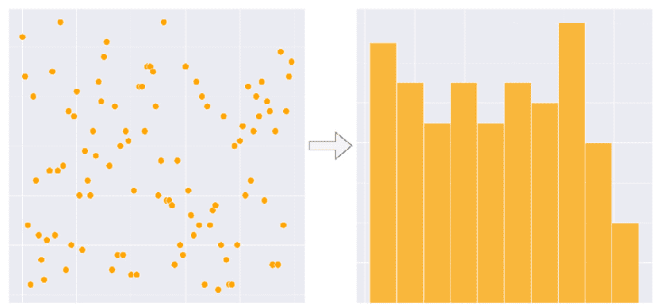
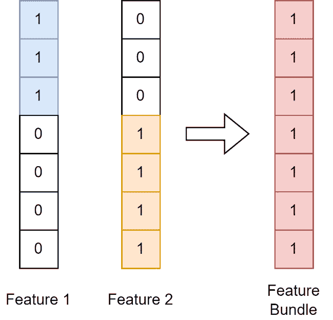
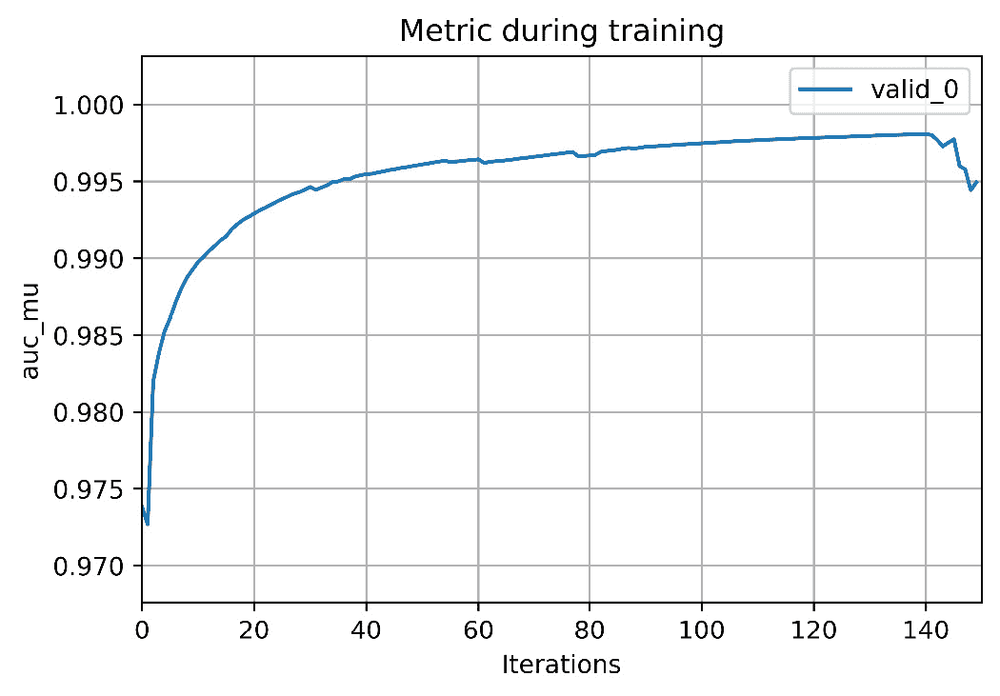
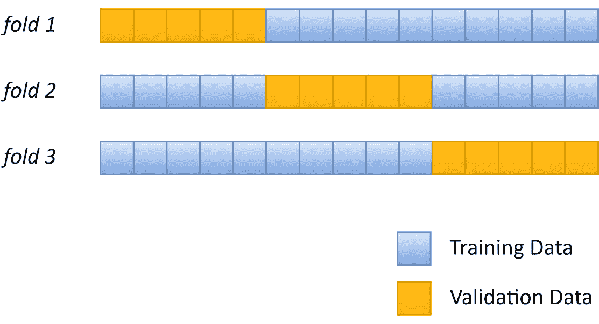
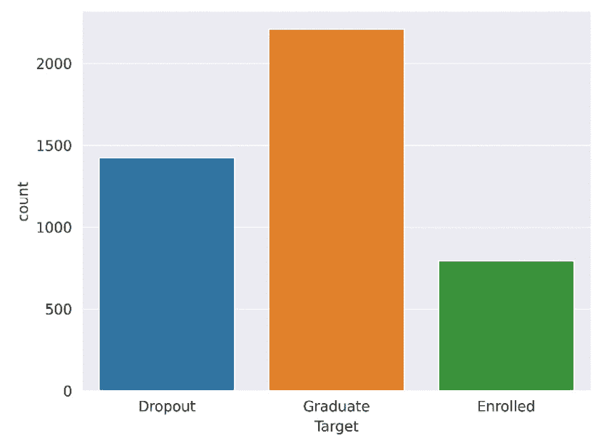
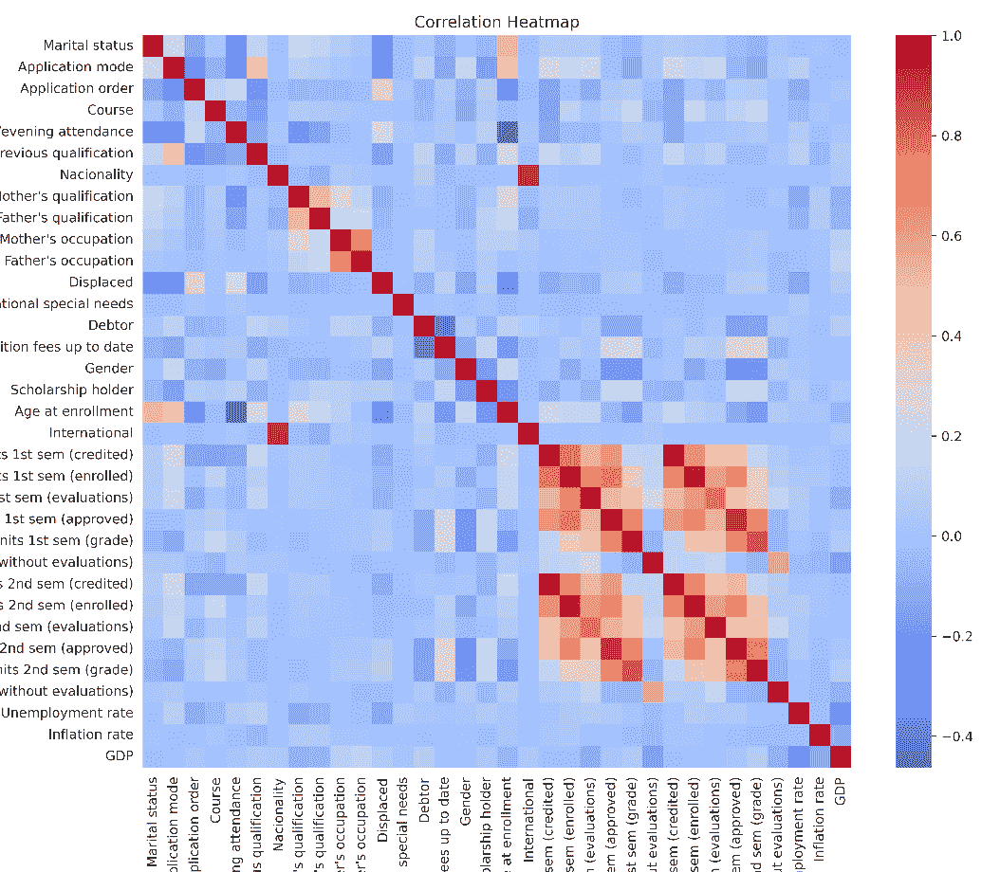
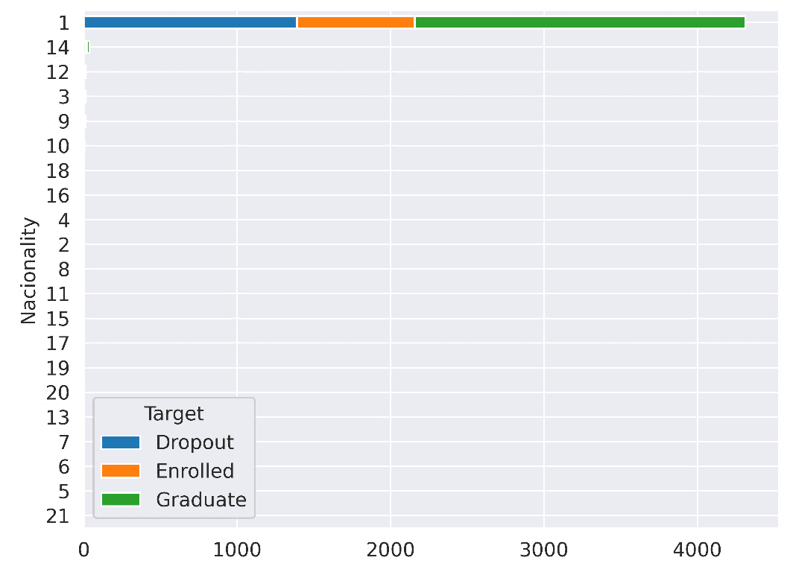
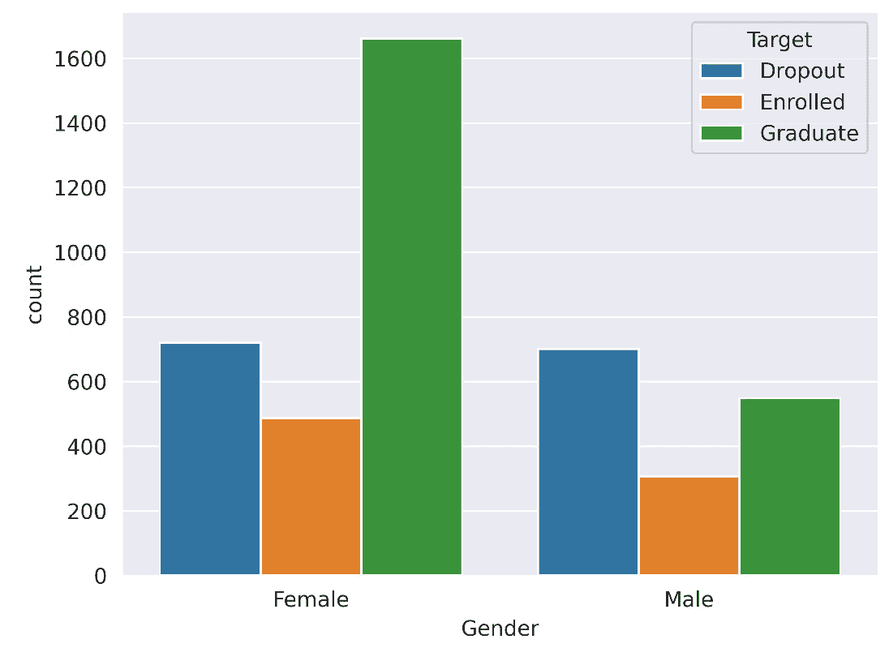

# Python 中 LightGBM 的概述

在上一章中，我们探讨了决策树的集成学习方法。详细讨论了 **bootstrap aggregation**（**bagging**）和梯度提升，并提供了如何在 scikit-learn 中应用这些技术的实际示例。我们还展示了 **梯度提升决策树**（**GBDTs**）训练速度慢，在某些问题上可能表现不佳。

本章介绍了 LightGBM，这是一个使用基于树的学习者的梯度提升框架。我们探讨了 LightGBM 对集成学习方法的创新和优化。还提供了使用 Python 实际应用 LightGBM 的详细信息和示例。最后，本章包含了一个使用 LightGBM 的建模示例，结合了更高级的模型验证和参数优化技术。

到本章结束时，您将对 LightGBM 的理论和实际特性有深入的了解，这将使我们能够更深入地探讨在数据科学和生产系统中使用 LightGBM。

本章的主要主题如下：

+   介绍 LightGBM

+   在 Python 中开始使用 LightGBM

+   构建 LightGBM 模型

# 技术要求

本章包含示例和代码片段，说明如何在 Python 中使用 LightGBM。有关设置本章所需环境的完整示例和说明可在 [`github.com/PacktPublishing/Practical-Machine-Learning-with-LightGBM-and-Python/tree/main/chapter-3`](https://github.com/PacktPublishing/Practical-Machine-Learning-with-LightGBM-and-Python/tree/main/chapter-3) 找到。

# 介绍 LightGBM

LightGBM 是一个开源的基于树的集成梯度提升框架 ([`github.com/microsoft/LightGBM`](https://github.com/microsoft/LightGBM))。LightGBM 专注于速度、内存使用和改进的准确性，特别是在高维度和大数据量问题上。

LightGBM 首次在论文 *LightGBM: A Highly Efficient Gradient Boosting Decision Tree* [1] 中介绍。

LightGBM 的效率和精度是通过针对标准集成学习方法的几个技术和理论优化实现的，特别是 GBDTs。此外，LightGBM 支持通过优化网络通信和基于 GPU 的树集成训练进行分布式训练。

LightGBM 支持许多 **机器学习**（**ML**）应用：回归、二分类和多分类、交叉熵损失函数以及通过 LambdaRank 进行排序。

LightGBM 算法也可以通过其超参数进行高度定制。它支持许多指标和功能，包括 **Dropouts meet Multiple Additive Regression Trees**（**DART**）、bagging（随机森林）、连续训练、多个指标和早期停止。

本节回顾了 LightGBM 使用的理论和实践优化，包括控制 LightGBM 特征的超参数的详细概述。

## LightGBM 优化

在其核心，LightGBM 实现了我们在上一章中讨论的相同集成算法。然而，LightGBM 通过理论和技术的优化来提高性能和准确性，同时显著减少内存使用。接下来，我们将讨论 LightGBM 中实施的最显著的优化。

### GBDT 中的计算复杂度

首先，我们必须理解构建 GBDT 中的低效性来源，才能理解 LightGBM 如何提高 GBDT 的效率。GBDT 算法中最计算复杂的部分是每次迭代的回归树训练。更具体地说，找到最优分割是非常昂贵的。基于预排序的算法是寻找最佳分割的最流行方法之一[2]，[3]。一种简单的方法要求对每个决策节点按特征对数据进行排序，算法复杂度为 O(#data × #feature)。基于预排序的算法在训练前对数据进行一次排序，这降低了构建决策节点的复杂度到 O(#data) [2]。即使有预排序，当寻找决策节点的分割时，复杂度对于大型数据集来说仍然太高。

### 基于直方图的采样

预排序的另一种方法涉及为连续特征构建直方图[4]。在构建这些**特征直方图**时，连续值被添加到离散的箱中。在计算决策节点的分割时，我们不再直接使用数据，而是现在可以使用直方图箱。构建直方图的复杂度为 O(#data)。然而，构建决策节点的复杂度现在降低到 O(#bins)，由于箱的数量远小于数据量，这显著加快了构建回归树的过程，如下面的图所示：



图 3.1 – 从连续特征创建特征直方图允许使用箱边界值来计算决策节点的分割，而不是必须对每个数据点进行采样，这显著降低了算法的复杂性，因为#bins << #data

由使用直方图产生的二级优化是“直方图减法”，用于构建叶子的直方图。我们不需要为每个叶子计算直方图，而是可以从父直方图中减去叶子的邻居直方图。选择数据量较小的叶子会导致第一个叶子的 O(#data)复杂度较小，由于直方图减法，第二个叶子的 O(#bin)复杂度较小。

LightGBM 使用直方图应用的一种第三种优化是减少内存成本。特征预排序需要为每个特征提供一个支持数据结构（一个字典）。在构建直方图时不需要这样的数据结构，从而降低了内存成本。此外，由于#bins 很小，可以使用较小的数据类型，如`uint8_t`来存储训练数据，从而减少内存使用。

关于构建特征直方图算法的详细信息可在论文《CLOUDS：用于大型*数据集*的决策树分类器》[4]中找到。

### 独家功能捆绑

**独家功能捆绑**（**EFB**）是 LightGBM 在处理稀疏数据（稀疏数据在高维数据集中普遍存在）时应用的一种基于数据的优化。当特征数据稀疏时，通常会发现许多特征是**相互排斥**的，这意味着它们永远不会同时呈现非零值。考虑到这种排他性，将这些特征组合成一个单一的特征通常是安全的。EFB 在以下图中展示：



图 3.2 – 从两个相互排斥的特征构建特征捆绑

将相互排斥的特征捆绑在一起，可以构建与单个特征相同的特征直方图[1]。这种优化将构建特征直方图的复杂度从 O(#数据 × #特征)降低到 O(#数据 × #捆绑)。对于存在许多相互排斥特征的数据库，这显著提高了性能，因为#捆绑远小于#特征。EFB 的详细算法及其正确性的证明可在[1]中找到。

### 基于梯度的单侧采样

LightGBM 框架中可用的最后一种基于数据的优化是**基于梯度的单侧采样**（**GOSS**）[1]。GOSS 是一种丢弃不再对训练过程有显著贡献的训练数据样本的方法，从而有效地减少了训练数据的大小并加快了过程。

我们可以使用每个样本的梯度计算来确定其重要性。如果梯度变化很小，这表明训练误差也很小，我们可以推断出树对特定数据实例拟合得很好[1]。一个选择是丢弃所有梯度小的实例。然而，这改变了训练数据的分布，减少了树泛化的能力。GOSS 是一种选择保留在训练数据中的实例的方法。

为了保持数据分布，GOSS 按照以下方式应用：

1.  数据样本按其梯度的绝对值排序。

1.  然后选择前 a × 100%的实例（梯度大的实例）。

1.  然后从剩余的数据中随机抽取 b × 100%的实例样本。

1.  在损失函数（对于这些实例）中添加一个因子以放大其影响：1 − a _ b，从而补偿小梯度数据的代表性不足。

因此，GOSS 从具有大梯度的实例中采样大量实例，并从具有小梯度的实例中随机采样一部分实例，在计算信息增益时放大小梯度的影响。

GOSS 启用的下采样可以显著减少训练过程中处理的数据量（以及 GBDT 的训练时间），尤其是在大型数据集的情况下。

### 最佳优先树增长

构建决策树最常见的方法是按层次增长（即，一次增长一个层次）。LightGBM 采用了一种替代方法，通过叶节点或最佳优先的方式增长树。叶节点方法选择具有最大损失变化的现有叶节点，并从那里构建树。这种方法的一个缺点是，如果数据集很小，树很可能会过拟合数据。必须设置最大深度来抵消这一点。然而，如果构建的叶节点数量是固定的，叶节点树构建已被证明优于层次算法[5]。

### L1 和 L2 正则化

LightGBM 在集成中训练回归树时支持目标函数的 L1 和 L2 正则化。从 *第一章* *介绍机器学习* 中，我们回忆起正则化是控制过拟合的一种方法。在决策树的情况下，更简单、更浅的树过拟合较少。

为了支持 L1 和 L2 正则化，我们通过添加正则化项扩展了目标函数，如下所示：

obj = L(y, F(x)) + Ω(w)

在这里，L(y, F(x)) 是在*第二章*中讨论的损失函数，*集成学习 – Bagging 和 Boosting*，而 Ω(w) 是定义在 w 上的正则化函数，即叶得分（叶得分是根据 GBDT 算法中定义的 *步骤 2.3* 计算的叶输出，该算法在*第二章*中讨论，*集成学习 – Bagging 和 Boosting*）。

正则化项有效地向目标函数添加了惩罚，我们的目标是惩罚更复杂的树，这些树容易过拟合。

Ω 有多个定义。决策树中这些项的典型实现如下：

Ω(w) = α∑ i n |w i| + λ∑ i n w i 2

在这里，α∑ i n |w i| 是由参数 α 控制的 L1 正则化项，0 ≤ α ≤ 1，而 λ∑ i n w i 2 是由参数 λ 控制的 L2 正则化项。

L1 正则化通过惩罚具有大绝对输出的叶节点，将叶得分驱动到零。*较小的叶输出对树的预测影响较小，从而有效地简化了* *树*。

L2 正则化类似，但由于输出取平方，对异常值叶节点有更大的影响。

最后，当构建较大的树（具有更多叶节点，因此具有较大的 w 向量）时，Ω(w) 的两个求和项都会增加，从而增加目标函数的输出。因此，*较大的树会受到惩罚*，从而减少过拟合。

### LightGBM 优化总结

总结来说，LightGBM 通过以下方式改进了标准集成算法：

+   实现基于直方图的采样特征以减少寻找最优分割的计算成本

+   通过计算独家特征包来减少稀疏数据集中的特征数量

+   应用 GOSS 以在不损失准确性的情况下对训练数据进行下采样

+   以叶节点的方式构建树以提高准确性

+   通过 L1 和 L2 正则化以及其他控制参数可以控制过拟合

结合优化，这些优化将 LightGBM 的计算性能提高了与标准 GBDT 算法相比的**数量级**（**OOM**）。此外，LightGBM 是用 C++实现的，具有 Python 接口，这使得代码比基于 Python 的 GBDT（如 scikit-learn）快得多。

最后，LightGBM 还支持改进的数据并行和特征并行分布式训练。分布式训练和 GPU 支持将在后面的*第十一章**，使用 LightGBM 的分布式和基于 GPU 的学习*中讨论。

## 超参数

LightGBM 公开了许多参数，可用于自定义训练过程、目标和性能。接下来，我们将讨论最显著的参数以及它们如何用于控制特定现象。

注意

核心 LightGBM 框架是用 C++开发的，但包括用于在 C、Python 和 R 中与 LightGBM 一起工作的 API。本节讨论的参数是框架参数，并且每个 API 以不同的方式暴露。以下章节将讨论使用 Python 时可用参数。

以下是用以控制优化过程和目标的**核心框架参数**：

+   `目标`：LightGBM 支持以下优化目标，包括但不限于——`回归`（包括具有 Huber 和 Fair 等损失函数的回归应用），`二元`（分类），`多类`（分类），`交叉熵`，以及用于排序问题的`lambdarank`。

+   `boosting`：提升参数控制提升类型。默认情况下，此参数设置为`gbdt`，即标准 GBDT 算法。其他选项是`dart`和`rf`，用于随机森林。随机森林模式不执行提升，而是构建随机森林。

+   `num_iterations`（或`n_estimators`）：控制提升迭代次数，因此也控制构建的树的数量。

+   `num_leaves`：控制单个树中的最大叶节点数。

+   `learning_rate`：控制学习或收缩率，即每个树对整体预测的贡献。

LightGBM 还提供了许多参数来控制学习过程。我们将讨论这些参数相对于它们如何用于调整训练的特定方面。

以下控制参数可用于提高**准确性**：

+   `boosting`：使用`dart`，这已被证明优于标准 GBDT。

+   `learning_rate`：学习率必须与`num_iterations`一起调整以获得更好的准确率。较小的学习率与较大的`num_iterations`值相结合，可以在牺牲优化速度的情况下提高准确率。

+   `num_leaves`：较大的叶子数量可以提高准确率，但可能导致过拟合。

+   `max_bin`：在构建直方图时，将特征分桶的最大数量。较大的`max_bin`大小会减慢训练速度并使用更多内存，但可能提高准确率。

以下**学习控制参数**可用于处理**过拟合**：

+   `bagging_fraction`和`bagging_freq`：设置这两个参数可以启用特征袋装。除了提升之外，还可以使用袋装，并且不强制使用随机森林。启用袋装可以减少过拟合。

+   `early_stopping_round`：启用早期停止并控制用于确定是否停止训练的迭代次数。如果在`early_stopping_round`设置的迭代中任何指标没有改进，则停止训练。

+   `min_data_in_leaf`：叶子中允许的最小样本数。较大的值可以减少过拟合。

+   `min_gain_to_split`：执行分割所需的最小信息增益量。较高的值可以减少过拟合。

+   `reg_alpha`：控制 L1 正则化。较高的值可以减少过拟合。

+   `reg_lambda`：控制 L2 正则化。较高的值可以减少过拟合。

+   `max_depth`：控制单个树的最大深度。较浅的树可以减少过拟合。

+   `max_drop`：控制使用 DART 算法（仅在`boosting`设置为`dart`时使用）时丢弃的最大树的数量。较大的值可以减少过拟合。

+   `extra_trees`：启用**极端随机树**（**ExtraTrees**）算法。LightGBM 将为每个特征随机选择一个分割阈值。启用 Extra-Trees 可以减少过拟合。该参数可以与任何提升模式一起使用。

这里讨论的参数仅包括 LightGBM 中可用参数的一部分，并专注于提高准确性和防止过拟合。完整的参数列表[可在以下链接中找到：https://lightgbm.readthedocs.io/en/latest/Parameters.xhtml](https://lightgbm.readthedocs.io/en/latest/Parameters.xhtml)。

## LightGBM 的局限性

LightGBM 被设计得比传统方法更高效和有效。它特别以其处理大数据集的能力而闻名。然而，与任何算法或框架一样，它也有其局限性和潜在缺点，包括以下内容：

+   **对过拟合敏感**：LightGBM 可能对过拟合敏感，尤其是在小或噪声数据集上。在使用 LightGBM 时，应小心监控和控制过拟合。

+   **最佳性能需要调整**：如前所述，LightGBM 有许多超参数需要适当调整，以从算法中获得最佳性能。

+   **缺乏表示学习**：与擅长从原始数据中学习的 **深度学习**（**DL**）方法不同，LightGBM 在学习之前需要应用特征工程到数据上。特征工程是一个耗时且需要领域知识的过程。

+   **处理序列数据**：LightGBM 本身并不是为处理序列数据（如时间序列）而设计的。为了使用 LightGBM 处理时间序列数据，需要应用特征工程来创建滞后特征并捕捉时间依赖性。

+   **复杂交互和非线性**：LightGBM 是一种以决策树为驱动的方法，可能无法捕捉复杂的特征交互和非线性。需要应用适当的特征工程来确保算法能够建模这些。

虽然这些是使用该算法的潜在局限性，但它们可能并不适用于所有用例。在适当的情境下，LightGBM 经常是一个非常有效的工具。与任何模型一样，理解权衡对于为您的应用程序做出正确的选择至关重要。

在下一节中，我们将探讨如何使用 Python 的各种 LightGBM API 开始使用。

# 在 Python 中开始使用 LightGBM

LightGBM 使用 C++ 实现，但提供了官方的 C、R 和 Python API。本节讨论可用于与 LightGBM 一起工作的 Python API。LightGBM 提供了三个 Python API：标准的 **LightGBM** API、与其它 scikit-learn 功能完全兼容的 **scikit-learn** API，以及用于与 Dask 一起工作的 **Dask** API。Dask 是在第 *第十一章** 中讨论的并行计算库，*分布式和基于 GPU 的学习* ([`www.dask.org/`](https://www.dask.org/))。

在本书的其余部分，我们主要使用 LightGBM 的 scikit-learn API，但让我们首先看看标准的 Python API。

## LightGBM Python API

深入了解 Python API 的最佳方式是通过动手示例。以下是从代码列表中摘录的片段，说明了 LightGBM Python API 的使用。完整的代码示例可在 [`github.com/PacktPublishing/Practical-Machine-Learning-with-LightGBM-and-Python/tree/main/chapter-3`](https://github.com/PacktPublishing/Practical-Machine-Learning-with-LightGBM-and-Python/tree/main/chapter-3) 找到。

需要导入 LightGBM。导入通常简写为 `lgb`：

```py
import lightgbm as lgb
```

LightGBM 提供了一个 `Dataset` 包装类来处理数据。`Dataset` 支持多种格式。通常，它用于包装 `numpy` 数组或 `pandas` DataFrame。`Dataset` 还接受 CSV、TSV、LIBSVM 文本文件或 LightGBM `Dataset` 二进制文件的 `Path`。当提供路径时，LightGBM 会从磁盘加载数据。

在这里，我们从 `sklearn` 加载我们的 Forest Cover 数据集，并将 `numpy` 数组包装在 LightGBM 的 `Dataset` 中：

```py
dataset = datasets.fetch_covtype()
X_train, X_test, y_train, y_test = train_test_split(dataset.data, dataset.target, random_state=179)
training_set = lgb.Dataset(X_train, y_train - 1)
test_set = lgb.Dataset(X_test, y_test - 1)
```

我们从`y_train`和`y_test`数组中减去 1，因为`sklearn`提供的类别标签在范围[1, 7]内，而 LightGBM 期望零索引的类别标签在范围[0, 7]内。

我们无法设置训练的参数。我们将使用以下参数：

```py
params = {
    'boosting_type': 'gbdt',
    'objective': 'multiclass',
    'num_classes': '7',
    'metric': {'auc_mu'},
    'num_leaves': 120,
    'learning_rate': 0.09,
    'force_row_wise': True,
    'verbose': 0
}
```

我们使用标准的 GBDT 作为提升类型，并将目标设置为七类的多分类。在训练过程中，我们将捕获`auc_mu`指标。AU C μ是多类版本的**受试者工作特征曲线下面积**（**AUC**），如 Kleiman 和 Page [6]所定义。

我们将`num_leaves`和`learning_rate`设置为适合该问题的合理值。最后，我们指定`force_row_wise`为`True`，这是大型数据集的一个推荐设置。

LightGBM 的训练函数也支持**回调**。回调是训练过程中的一个钩子，在每个提升迭代中执行。为了说明它们的目的，我们将使用以下回调：

```py
metrics = {}
callbacks = [
    lgb.log_evaluation(period=15),
    lgb.record_evaluation(metrics),
    lgb.early_stopping(15),
    lgb.reset_parameter(learning_rate=learning_rate_decay(0.09, 0.999))
]
```

我们使用`log_evaluation`回调，周期为 15，它每 15 次提升迭代将我们的指标记录（打印）到标准输出。我们还设置了一个`record_evaluation`回调，它将我们的评估指标捕获在`metrics`字典中。我们还指定了一个`early_stopping`回调，停止轮次设置为 15。如果经过指定的停止轮次后没有验证指标改进，`early_stopping`回调将停止训练。

最后，我们还使用`reset_parameter`回调来实现**学习率衰减**。衰减函数定义如下：

```py
def learning_rate_decay(initial_lr, decay_rate):
    def _decay(iteration):
        return initial_lr * (decay_rate ** iteration)
    return _decay
```

`reset_parameter`回调接受一个函数作为输入。该函数接收当前迭代次数并返回参数值。学习率衰减是一种技术，随着时间的推移降低学习率的值。学习率衰减提高了整体准确度。理想情况下，我们希望初始树对纠正预测错误有更大的影响。相比之下，后期我们希望减少额外树的影响，并让它们对错误进行微小调整。我们在整个训练过程中实施了一种轻微的指数衰减，将学习率从 0.09 降低到 0.078。

现在，我们已经准备好进行训练。我们使用`lgb.train`来训练模型：

```py
gbm = lgb.train(params, training_set, num_boost_round=150, valid_sets=test_set, callbacks=callbacks)
```

我们使用 150 次提升轮次（或提升树）。结合较低的学习率，拥有许多提升轮次应该可以提高准确度。

训练完成后，我们可以使用`lgb.predict`来获取测试集的预测并计算 F1 分数：

```py
y_pred = np.argmax(gbm.predict(X_test, num_iteration=gbm.best_iteration), axis=1)
f1_score(y_test - 1, y_pred, average="macro")
```

LightGBM 的预测函数输出一个激活数组，每个类别一个。因此，我们使用`np.argmax`来选择具有最高激活的类别作为预测类别。LightGBM 也支持一些绘图函数。例如，我们可以使用`plot_metric`来绘制我们在`metrics`中捕获的 AU C μ结果：

```py
lgb.plot_metric(metrics, 'auc_mu')
```

这些结果在*图 3**.3*中显示。



图 3.3 – 使用 lgb.plot_metric 创建的每个训练迭代的 AU C 𝝁指标的绘图

运行前面的代码应该会产生一个 LightGBM GBDT 树，其 F1 分数大约为 0.917，与随机森林和 Extra-Trees 算法在*第二章**，集成学习 – Bagging 和 Boosting*中实现的分数一致。然而，LightGBM 在达到这些准确度方面要快得多。在我们的硬件上，LightGBM 仅用了 37 秒就完成了训练：这比在相同问题和硬件上运行 Extra-Trees 快 4.5 倍，比我们在测试中使用的 scikit-learn 的`GradientBoostingClassifier`快 60-70 倍。

## LightGBM scikit-learn API

现在我们来看看 scikit-learn Python API 的 LightGBM。scikit-learn API 提供了四个类：`LGBMModel`、`LGBMClassifier`、`LGBMRegressor`和`LGBMRanker`。这些类都提供了与 LightGBM Python API 相同的功能，但具有我们之前使用过的相同方便的 scikit-learn 接口。此外，scikit-learn 类与 scikit-learn 生态系统的其余部分兼容和可互操作。

让我们使用 scikit-learn API 重复之前的示例。

数据集的加载方式与之前完全相同。scikit-learn API 不需要将数据包装在`Dataset`对象中。我们也不需要为目标类进行零索引，因为 scikit-learn 支持任何标签的类：

```py
dataset = datasets.fetch_covtype()
X_train, X_test, y_train, y_test = train_test_split(dataset.data, dataset.target, random_state=179)
```

scikit-learn API 还支持 LightGBM 回调；因此，我们使用与之前相同的回调：

```py
metrics = {}
callbacks = [
    lgb.log_evaluation(period=15),
    lgb.record_evaluation(metrics),
    lgb.early_stopping(15),
    lgb.reset_parameter(learning_rate=learning_rate_decay(0.09, 0.999))
]
```

然后，我们创建`LGBMClassifier`的方式与创建任何其他 scikit-learn 模型的方式完全相同。在创建分类器时，我们还设置了参数：

```py
model = lgb.LGBMClassifier(
    boosting_type='gbdt',
    n_estimators=150,
    num_leaves=120,
    learning_rate=0.09,
    force_row_wise=True
)
```

注意，我们不需要指定类的数量；scikit-learn 会自动推断。然后我们在模型上调用`fit`，传递训练数据和测试数据以及我们的回调：

```py
model = model.fit(X_train, y_train, eval_set=(X_test, y_test), eval_metric='auc_mu', callbacks=callbacks)
```

最后，我们使用 F1 分数评估我们的模型。我们不需要在预测上使用`np.argmax`，因为这是由 scikit-learn API 自动完成的：

```py
f1_score(y_test, model.predict(X_test), average="macro")
```

总体来看，我们可以看到通过 scikit-learn API 使用 LightGBM 比使用标准的 Python API 更简单。在我们的硬件上，scikit-learn API 也比 LightGBM API 快约 40%。本节探讨了使用 LightGBM 的各种 Python API 的优缺点。下一节将探讨使用 scikit-learn API 训练 LightGBM 模型。

# 构建 LightGBM 模型

本节提供了一个使用 LightGBM 解决实际问题的端到端示例。我们更详细地查看问题的数据准备，并解释如何为我们的算法找到合适的参数。我们使用多个 LightGBM 变体来探索相对性能，并将它们与随机森林进行比较。

## 交叉验证

在深入探讨解决问题之前，我们需要讨论一种更好的验证算法性能的方法。在训练模型时，将数据分成两个或三个子集是标准做法。训练数据用于训练模型，验证数据是用于在训练期间验证数据的保留集，测试数据用于在训练后验证性能。

在之前的例子中，我们只进行了一次这种分割，构建了一个单独的训练和测试集来训练和验证模型。这种方法的问题是我们模型可能会“幸运”。如果我们测试集偶然与训练数据非常接近，但并不代表现实世界数据，我们可能会报告一个很好的测试误差，尽管我们无法对我们的模型性能有信心。

另一种方法是多次进行数据集分割并多次训练模型，每次分割训练一次。这种方法称为**交叉验证**。

交叉验证最常见的应用是*k*折交叉验证。在 k 折交叉验证中，我们选择一个值*k*，并将（随机打乱的）数据集分成*k*个子样本（或折）。然后我们重复训练过程*k*次，使用不同的子集作为验证数据，所有其他子集作为训练数据。模型性能的计算是所有折的平均（或中位数）分数。以下图表说明了这个过程：



图 3.4 – k 折交叉验证，k = 3；原始数据集被随机打乱并分成 3 个相等的部分（或折）；对每个子样本数据的组合重复训练和验证，并报告平均性能

使用高值的*k*可以降低模型偶然表现出良好性能的可能性，并表明模型在现实世界中的可能表现。然而，整个训练过程需要为每个折重复，这可能会非常耗费计算资源和时间。因此，我们需要平衡可用的资源与验证模型的需求。*k*的典型值是 5（scikit-learn 的默认值），也称为 5 折交叉验证。

### 分层 k 折验证

在 k 折交叉验证中可能出现的问题之一是，由于偶然性，一个折可能只包含来自单个类的样本。**分层抽样**通过在创建折时保留每个类的样本百分比来解决此问题。这样，每个折都具有与原始数据集相同的类别分布。当应用于交叉验证时，这种技术称为分层 k 折交叉验证。

## 参数优化

**参数优化**，也称为参数调整，是寻找针对特定问题的模型和训练过程的好超参数的过程。在之前的训练模型示例中，我们一直是基于直觉和最小实验来设置模型和训练算法的参数。没有保证参数选择对优化问题是最佳的。

但我们如何找到最佳参数选择呢？一种天真策略是尝试一个参数的广泛范围值，找到最佳值，然后对下一个参数重复此过程。然而，参数通常是**相互依赖**的。当我们改变一个参数时，另一个参数的最佳值可能会不同。GBDTs 中相互依赖的一个优秀例子是提升轮数和学习率。拥有较小的学习率需要更多的提升轮数。因此，独立优化学习率和提升轮数不太可能产生最佳结果。*这两个参数必须同时优化*。

### 网格搜索

考虑参数相互依赖的方法是网格搜索。在网格搜索中，设置一个参数网格。网格由我们正在优化的每个参数要尝试的值范围组成。然后执行穷举搜索，在每个参数组合上训练和验证模型。

这里是一个三个参数的参数网格示例：

```py
grid = {
    'learning_rate': [0.001, 0.01, 0.1, 0.2, 0,5],
    'num_rounds': [20, 40, 60, 80, 100],
    'num_leaves': [2, 16, 32, 64, 128, 256],
}
```

每个参数都指定了一个可能的值范围。之前的网格需要 150 次尝试来搜索。

由于网格搜索是穷举的，它有一个优点，即保证在指定的范围内找到最佳参数组合。然而，网格搜索的缺点是成本。尝试每个可能的参数组合非常昂贵，并且对于许多参数和大的参数范围很快就会变得难以处理。

Scikit-learn 提供了一个实用类来实现网格搜索并同时执行交叉验证。`GridSearchCV` 接收一个模型、一个参数网格和交叉验证折数作为参数。`GridSearchCV` 然后开始搜索网格以找到最佳参数，使用交叉验证来验证每个参数组合的性能。我们将在下一节中展示 `GridSearchCV` 的使用方法。

参数优化是建模过程中的关键部分。为模型找到合适的参数可能是成功或失败过程的关键。然而，正如之前所讨论的，参数优化在时间和计算复杂度上通常也非常昂贵，这需要在成本和性能之间进行权衡。

## 预测学生学术成功

我们现在继续到我们的例子。我们构建了一个模型，基于一系列社会和经济因素使用 LightGBM [7] ([`archive-beta.ics.uci.edu/dataset/697/predict+students+dropout+and+academic+success`](https://archive-beta.ics.uci.edu/dataset/697/predict+students+dropout+and+academic+success)) 来预测学生的辍学率。数据以 CSV 格式提供。我们首先从探索数据开始。

### 探索性数据分析

任何数据集的最基本属性之一是形状：我们的数据由行和列组成。这也是验证数据读取是否成功的一个很好的方法。在这里，我们的数据由 4,424 行和 35 列组成。随机抽取数据样本让我们对列及其值有了概念：

```py
df = pd.read_csv("students/data.csv", sep=";")
print(f"Shape: {df.shape}")
df.sample(10)
```

接下来，我们可以运行`df.info()`来查看所有列、它们的非空计数和它们的数据类型：

```py
df.info()
<class 'pandas.core.frame.DataFrame'>
RangeIndex: 4424 entries, 0 to 4423
Data columns (total 35 columns):
 #   Column                                          Non-Null Count  Dtype
---  ------                                          --------------  -----
 0   Marital status                                  4424 non-null   int64
 1   Application mode                                4424 non-null   int64
 2   Application order                               4424 non-null   int64
…
```

运行前面的代码显示，大多数列是整数类型，除了`Target`列，中间有一些浮点数。`Target`列被列为`object`类型；如果我们查看样本中的值，我们可以看到`Target`列由`Graduate`、`Dropout`和`Enrolled`字符串组成。LightGBM 不能处理字符串作为目标，所以我们将在训练模型之前将这些映射到整数值。

我们还可以运行`df.describe()`来获取每个列的统计描述（平均值、标准差、最小值、最大值和分位数）。计算描述性统计有助于检查数据的界限（与决策树模型一起工作时不是大问题）并检查异常值。对于这个数据集，没有数据界限或异常值问题。

接下来，我们需要检查重复和缺失值。我们需要删除包含缺失值的行，或者如果有任何缺失值，需要用适当的替代值进行插补。我们可以使用以下代码检查缺失值：

```py
df.isnull().sum()
```

运行前面的代码显示，这个数据集没有缺失值。

为了定位重复项，我们可以运行以下代码：

```py
df.loc[df.duplicated()]
```

数据集中也没有重复项。如果有任何重复数据，我们会删除额外的行。

我们还需要检查目标类的分布，以确保它是平衡的。在这里，我们展示了一个直方图，表明目标类的分布。我们使用 Seaborn 的`countplot()`方法创建直方图，如下所示：

```py
sns.countplot(data=df, x='Target')
```



图 3.5 – 学术成功数据集中目标类的分布

尽管目标分布并不完全平衡，但它也没有过度偏向任何一类，我们不需要执行任何补偿操作。

到目前为止，我们发现我们的数据集适合建模（我们仍然需要重新映射 `Target`）和清洗（它不包含缺失或重复的值，并且平衡良好）。现在我们可以更深入地查看一些特征，从特征相关性开始。以下代码绘制了一个相关性热图。成对皮尔逊相关性是通过 `df.corr()` 计算的。随后的截图显示了使用成对皮尔逊相关性构建的相关性热图：

```py
sns.heatmap(df.corr(), cmap='coolwarm')
```



图 3.6 – 学术成功数据集的成对皮尔逊特征相关性

我们可以看到三种相关性的模式：第一学期学分、入学、评估和批准都是相关的。这些特征的第一学期和第二学期的值也是相关的。这些相关性表明，一旦学生入学，他们倾向于看到整个学年而不是在学期中辍学。尽管存在相关性，但这些相关性并不足够强，以至于考虑删除任何特征。

第三种相关性模式是 `Nacionality` 和 `International` 之间的，它们高度相关。

注意

单词 *Nacionality* 指的是 *nationality*。我们在这里也保留了原始数据集中的拼写，以保持一致性。

仔细观察 `Nacionality` 特征会发现，几乎所有行只有一个值：数据集收集的国家。强烈的相关性意味着 `International` 特征也是这样：

```py
nationalities = df.groupby(['Nacionality', 'Target']).size().reset_index().pivot(columns='Target', index='Nacionality', values=0)
nationalities_total = nationalities.sum(axis=1)
nationalities_total = nationalities_total.sort_values(ascending=True)
nationalities.loc[nationalities_total.index].plot(kind='barh', stacked=True)
```

以下截图显示了国籍的堆叠条形图：



图 3.7 – 学术成功数据集中 ‘Nacionality’ 特征的分布，显示几乎所有行只有一个值

`'Nacionality'` 和 `'International'` 的分布意味着它们不是很有信息量（几乎所有行都有相同的值），因此我们可以从数据集中删除它们。

最后，我们注意到 `'Gender'` 特征。当处理性别信息时，总是好的做法检查是否存在偏见。我们可以使用直方图来可视化 `'Gender'` 特征相对于目标类别的分布。结果展示在随后的代码片段之后的截图里：

```py
sns.countplot(data=df, x='Gender', hue='Target', hue_order=['Dropout', 'Enrolled', 'Graduate'])
plt.xticks(ticks=[0,1], labels=['Female','Male'])
```



图 3.8 – 学术成功数据集中 ‘Gender’ 特征的分布

对女性学生的轻微偏见，但不足以引起关注。

### 建模

现在我们可以为建模准备我们的数据集。我们必须将我们的 `Target` 值映射到整数，并删除 `Nacionality` 和 `International` 特征。我们还需要删除特征名称中的空格。LightGBM 不能处理名称中的空格；我们可以用下划线替换它们：

```py
df.columns = df.columns.str.strip().str.replace(' ', '_')
df = df.drop(columns=["Nacionality", "International"], axis=1)
df["Target"]=df["Target"].map({
    "Dropout":0,
    "Enrolled":1,
    "Graduate":2
})
X = df.drop(columns=["Target"], axis=1)
y = df["Target"]
```

我们训练并比较了四个模型：一个 LightGBM GBDT，一个 LightGBM DART 树，一个带有 GOSS 的 LightGBM DART 树，以及一个 scikit-learn 随机森林。

我们将使用 5 折交叉验证和`GridSearchCV`进行参数优化，以确保模型有良好的性能。

以下代码设置了 GBDT 的参数优化。其他模型遵循类似的模式，可以在源代码中看到：

```py
def gbdt_parameter_optimization():
    params = {
        "max_depth": [-1, 32, 128],
        "n_estimators": [50, 100, 150],
        "min_child_samples": [10, 20, 30],
        "learning_rate": [0.001, 0.01, 0.1],
        "num_leaves": [32, 64, 128]
    }
    model = lgb.LGBMClassifier(force_row_wise=True, boosting_type="gbdt", verbose=-1)
    grid_search = GridSearchCV(estimator=model, param_grid=params, cv=5, verbose=10)
    grid_search.fit(X, y)
    return grid_search
results = gbdt_parameter_optimization()
print(results.best_params_)
print(results.best_score_)
```

运行前面的代码需要一些时间，但一旦完成，它将打印出找到的最佳参数以及最佳模型的分数。

在所有模型训练完成后，我们可以使用 F1 评分对每个模型进行评估，取 5 折交叉验证的平均值，使用找到的最佳参数。以下代码演示了如何对 GBDT 模型进行此操作：

```py
model = lgb.LGBMClassifier(force_row_wise=True, boosting_type="gbdt", learning_rate=0.1, max_depth=-1, min_child_samples=10, n_estimators=100, num_leaves=32, verbose=-1)
scores = cross_val_score(model, X, y, scoring="f1_macro")
scores.mean()
```

[每个模型的参数优化 Jupyter 笔记本可在 GitHub 仓库中找到：https://github.com/PacktPublishing/Practical-Machine-Learning-with-LightGBM-and-Python/tree/main/chapter-3]

下表总结了找到的最佳参数值和每个模型的交叉验证 F1 分数：

| **模型** | **学习率** | **最大深度** | **最小子样本数** | **估计器数** | **叶子数** | **最小叶子样本数** | **最小分割样本数** | **F1 分数** |
| --- | --- | --- | --- | --- | --- | --- | --- | --- |
| GBDT | 0.1 | - | 10 | 100 | 32 | N/A | N/A | 0.716 |
| DART | 0.1 | 128 | 30 | 150 | 128 | N/A | N/A | 0.703 |
| DART (GOSS) | 0.1 | 128 | 30 | 150 | 128 | N/A | N/A | 0.703 |
| 随机森林 | N/A | N/A | N/A | 150 | N/A | 10 | 20 | 0.665 |

表 3.1 – 每个模型找到的最佳参数及其对应的 F1 分数

从表中我们可以看出，LightGBM 模型的表现远优于 scikit-learn 随机森林。两个 DART 模型实现了几乎相同的 F1 分数，GOSS 的 F1 分数略低（表中的值已四舍五入到三位数字）。

这就结束了我们探索数据集并为其构建优化模型（使用参数网格搜索）的端到端示例。在接下来的章节中，我们将查看更复杂的数据集，并深入分析模型性能。

# 摘要

本章介绍了 LightGBM 作为训练提升机的库。我们探讨了构建 GBDT 的复杂性的来源，以及 LightGBM 中解决这些问题的特性，例如基于直方图的采样、特征捆绑和 GOSS。我们还回顾了 LightGBM 最重要的超参数。

我们还详细概述了在 Python 中使用 LightGBM 的方法，包括 LightGBM Python API 和 scikit-learn API。然后我们使用 LightGBM 构建了第一个调整后的模型来预测学生的学术表现，利用交叉验证和基于网格搜索的参数优化。

在下一章中，我们比较 LightGBM 与另一个流行的梯度提升库 XGBoost 以及表格数据的 DL 技术。

# 参考文献

| *[**1]* | *G. Ke, Q. Meng, T. Finley, T. Wang, W. Chen, W. Ma, Q. Ye 和 T.-Y. Liu, “LightGBM: A Highly Efficient Gradient Boosting Decision Tree,” in Advances in Neural Information Processing* *Systems, 2017.* |
| --- | --- |
| *[**2]* | *M. Mehta, R. Agrawal 和 J. Rissanen, “SLIQ: A fast scalable classifier for data mining,” in Advances in Database Technology—EDBT’96: 5th International Conference on Extending Database Technology Avignon, France, March 25-29, 1996 Proceedings* *5, 1996.* |
| *[**3]* | *J. Shafer, R. Agrawal, M. Mehta 和其他人， “SPRINT: A scalable parallel classifier for data mining,” in* *Vldb, 1996.* |
| *[**4]* | *S. Ranka 和 V. Singh, “CLOUDS: A decision tree classifier for large datasets,” in Proceedings of the 4th Knowledge Discovery and Data Mining* *Conference, 1998.* |
| *[**5]* | *H. Shi, “Best-first decision tree* *learning,” 2007.* |
| *[**6]* | *R. Kleiman 和 D. Page, “Aucμ: A performance metric for multi-class machine learning models,” in International Conference on Machine* *Learning, 2019.* |
| *[**7]* | *V. Realinho, J. Machado, L. Baptista 和 M. V. Martins, Predicting student dropout and academic success,* *Zenodo, 2021.* |
